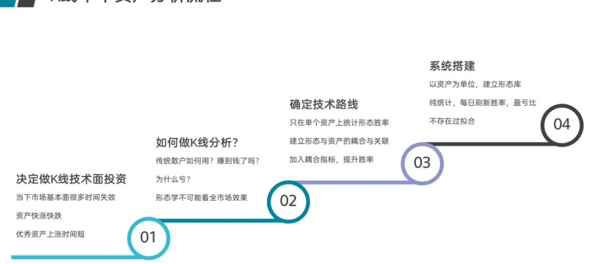
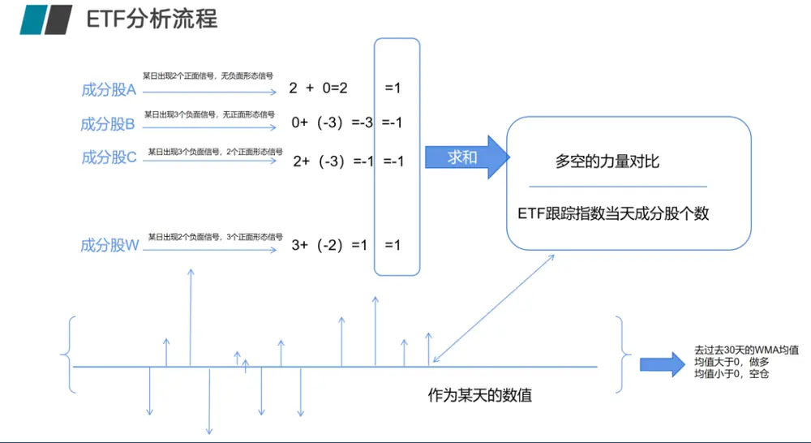
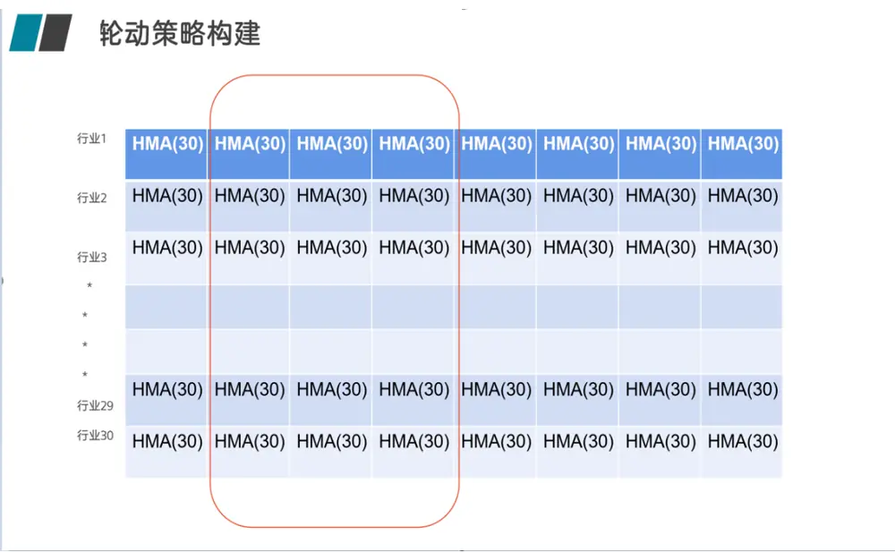
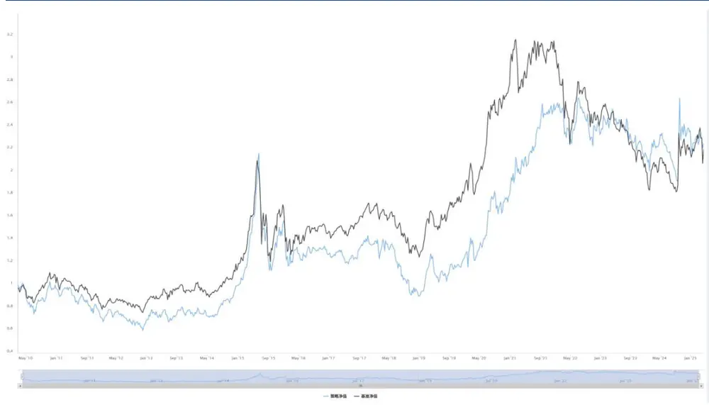
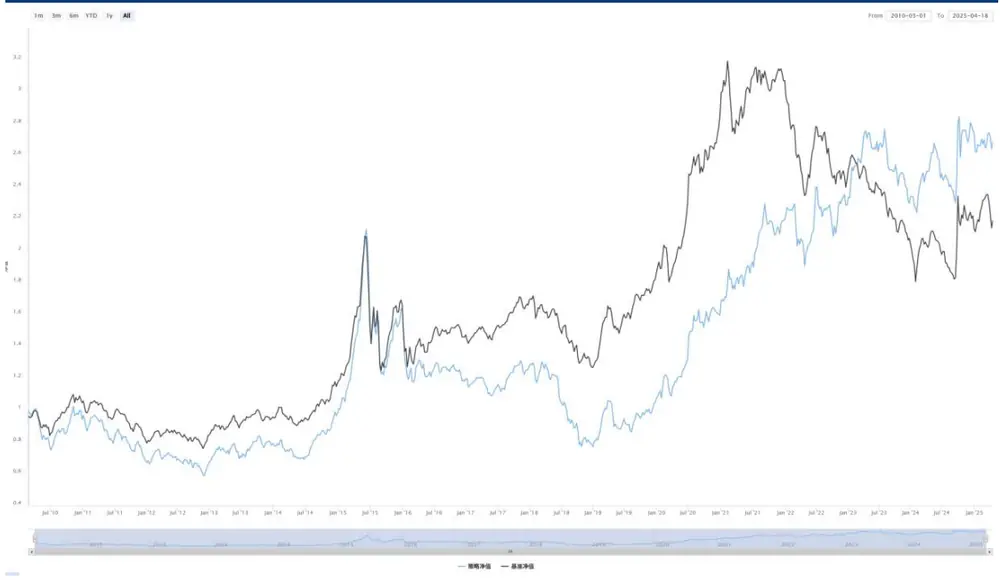
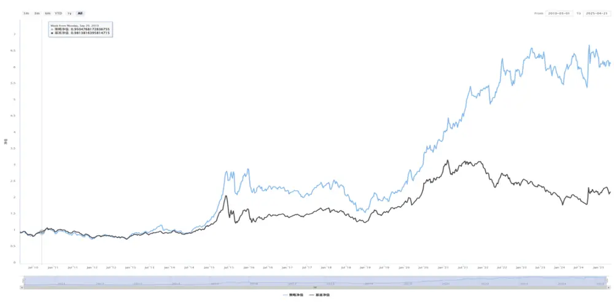

【点评报告】

# 形态学研究之十五：形态学在 ETF轮动上的研究

## 摘要

ETF 轮动，是指在不同 ETF 之间切换，根据市场情况调整投资组合。可涉及到不同资产类别、行业或地区。比如如何选择 ETF，轮动的依据是什么，比如动量、估值、宏观经济指标等。

本篇，我们提出了使用形态作为原始数据，将 ETF 成分股合成 ETF 信号的方式来做 ETF 轮动。在先前报告中，我们已经成功基于成分股的形态构建了指数、ETF 的择时策略，现在就是设计指标将同一截面下的各个 ETF 指数数据可比，就可以构建 ETF 轮动策略。

当我们把 ETF 指数每天的多空个股个数求和后，除以当时该 ETF 指数的成分股个数，在进行 30 天的 HMA 均线求解后，该指标就表征了该 ETF 从结构上形态学的看多或者看空力量的变化与对比，由于都除以了成分股个数，也消除了不同 ETF 因为成分股个数不同不可比的情况。

基于历史数据回测，不管是固定时间点调仓、每日调仓、或者是买入持有信号消失退出策略等，都可跑赢万得偏股混合型基金指数。固定时间点调仓策略优势在于计算量少，交易次数低，手续费少，但收益率也一般；每日调仓策略优势在于紧跟 ETF 成分股变化，但计算量较大，交易次数也较多，对手续费敏感；而买入持有信号消失退出策略则兼顾了前两种策略的优势，充分利用了信号的特性也尊重了低频换手的规则。从目前数据来看，买入持有信号消失退出策略是更佳的 ETF 轮动信号。

## 风险提示：

模型结果基于历史数据测算，不保证未来数据的有效性

## 华创证券研究所

证券分析师：王小川

电话：021-20572528

邮箱：wangxiaochuan@hcyjs.com

执业编号：S0360517100001

联系人：黄河

邮箱：huanghe@hcyjs.com

## 相关研究报告

《形态学研究之十二：期货形态和技术分析》

2024-09-13

## 一、ETF轮动策略介绍

ETF 轮动，是指在不同ETF之间切换，根据市场情况调整投资组合。可涉及到不同资产类别、行业或地区。比如如何选择 ETF，轮动的依据是什么，比如动量、估值、宏观经济指标等。在上一篇系列报告《形态学研究之十四：形态学在行业轮动上的研究》中，我们主要讲解了行业轮动策略，行业轮动策略是一种基于行业轮动现象的投资策略，通过在不同经济周期或市场环境下，选择表现较好的行业进行投资，以获取超额收益。ETF轮动跟行业轮动同样是通过 ETF 直接的买卖切换实现收益最大化的方法。其核心逻辑为：

根据预设规则，动态调整持仓ETF 组合，追求超越被动持有单一资产的回报。

按照ETF 轮动形成的原因，A股目前的 ETF轮动做法有以下几种：

## 1 动量轮动

⚫ 选择近期表现强势的 ETF（如过去 3-6 个月涨幅领先）

⚫ 示例：每月调入涨幅前 3的行业 ETF，调出后3名

## 2 行业/主题轮动

⚫ 根据经济周期切换行业

⚫ 复苏期：可选消费、科技

⚫ 衰退期：公用事业、必需消费

⚫ 示例：美林时钟理论应用

## 3 资产类别轮动

⚫ 股债商品等大类资产切换

⚫ 股票市盈率过高时增配债券 ETF

⚫ 恐慌指数VIX 飙升时转向黄金ETF

4 因子轮动

⚫ 在价值/成长、大盘/小盘等风格间切换

⚫ 利率上升周期侧重价值股ETF

ETF 轮动策略的优势明显，包括策略可适应多变市场、分散单一资产风险与规则化避免情绪干扰。但策略的缺点也不能忽视，如果高频调仓，将产生摩擦成本；信号也可能产生滞后，随即带来踏空风险。

## 二、基于成分股的形态学 ETF 择时算法

在前面系列报告《K线形态研究开篇：形态学初识与应用》、《形态学研究之十三：形态学在ETF 上的择时研究》中，我们提出股票后期形态必然是先期形态的结果。万事有因必有果，股票也不能例外。没有前期的积累，便没有后面的拉升。相反，没有前期的抛售，也没有后期的下跌。从这个意义上说，股票的K线形态与波浪理论、均线、箱体理论等其他形态学理论是暗合的。为此我们提出了形态与资产绑定分析的理论，并在 ETF择时上也是采用个股形态信号合成的方法对指数进行择时研究。

图表 1 形态学在单个 ETF上的分析流程

资料来源：华创证券整理

同时因为ETF 的跟踪标的也是指数，因此我们在ETF 上继续尝试使用跟踪指数成分股形态合成指数信号来对 ETF进行择时：

图表 2 形态学在ETF上的分析流程

资料来源：华创证券整理

这是单个ETF 的择时算法，但并非是轮动，我们可以针对某个标的做一个择时策略，稳定跑赢买入持有，但是同一截面下一起看多的ETF标的很多，而ETF 标的间如何比较看多的强度，成为了能否将ETF 择时转变为ETF 轮动的关键。

## 三、基于成分股形态的 ETF轮动策略，以富国基金 ETF为例

在先前报告中，我们已经成功基于成分股的形态构建了指数、ETF 的择时策略，现在就是设计指标将同一截面下的各个 ETF指数数据可比，就可以构建ETF 轮动策略。

当我们把ETF 指数每天的多空个股个数求和后，除以当时该ETF 指数的成分股个数，在进行 30 天的 HMA 均线求解后，该指标就表征了该 ETF 从结构上形态学的看多或者看空力量的变化与对比，由于都除以了 ETF 跟踪指数成分股个数，也消除了不同 ETF 因为成分股个数不同不可比的情况:

图表 3 ETF形态学结果强弱比较的分析流程

资料来源：华创证券整理

目前我们一共计算过 48只富国ETF 的形态学信号，这样每个交易日都会有 48个 ETF的形态学多空数值，基于这些形态数据衍生的数值，我们可以采取三种交易策略：

1. 固定时间点调仓策略：每周一可以根据上周五选择的前N个ETF开盘价买入，等下个周一继续重复该动作。优点：计算量较少，容易实现，缺点：只做 5 天持有，而形态学 ETF信号并非仅持有五天，未充分发挥信号作用；

2. 每日调仓策略：每日根据前一天晚上的信号进行操作，优点：快速抓住 ETF 热点，缺点：换手率较高，操作起来繁琐，交易成本较高；

3. 买入持有信号消失退出策略：以最开始某天作为起点，买入持有，直到某ETF 不再看多，选择剩下尚未选入的ETF中强度最大的作为新ETF买入。优点：我们的形态信号并非只是看五天，该交易方法充分尊重了形态学信号的特性，也更符合交易逻辑，可实现性最高。缺点：需要每日计算，时刻关注信号变化。

## （一）固定时间点调仓策略

该策略为：每周一可以根据上周五选择的前N个 ETF 开盘价买入，等下个周一继续重复该动作。优点：计算量较少，容易实现，缺点：只做 5天持有，而形态学ETF 信号并非仅持有五天，未充分发挥信号作用。

48个ETF 的N取不同数值的效果（双边交易手续费千2情况下）：

图表 4 固定时间点调仓策略表现

| N | 年化收益率（%） | 最大回撤（%） | 夏普 |
| --- | --- | --- | --- |
| 1 | 2.849 | -72.819 | 0.527 |
| 2 | 3.697 | -69.146 | 0.596 |
| 3 | 3.039 | -63.696 | 0.540 |
| 4 | 4.593 | -59.522 | 0.679 |
| 5 | 5.170 | -58.538 | 0.729 |
| 6 | 5.580 | -58.348 | 0.766 |
| 7 | 3.935 | -59.567 | 0.620 |
| 8 | 3.643 | -58.340 | 0.595 |
| 9 | 3.708 | -56.920 | 0.600 |
| 10 | 3.358 | -58.622 | 0.569 |
| 11 | 2.995 | -59.161 | 0.536 |
| 12 | 3.267 | -59.060 | 0.560 |
| 13 | 3.108 | -59.675 | 0.546 |
| 14 | 2.836 | -58.933 | 0.521 |
| 15 | 2.783 | -57.744 | 0.516 |
| 16 | 2.875 | -58.087 | 0.525 |
| 17 | 3.048 | -57.602 | 0.540 |
| 18 | 2.959 | -57.499 | 0.532 |
| 19 | 2.854 | -56.953 | 0.522 |
| 20 | 2.935 | -56.953 | 0.530 |
| 万得偏股混合型基金指数 | 3.84 | -24.97 | 1.01 |

资料来源：wind，华创证券

图表 5 固定时间点调仓策略净值 N=6

资料来源：wind，华创证券

可见固定时间点调仓策略每周选 6个 ETF效果最好。可以跑赢万得偏股混合型基金指数的收益率，但回撤增加，可见ETF 轮动选择固定时间点调仓效果一般。

## （二）每日调仓策略

每日根据前一天晚上的信号选取N 个ETF 进行买入操作，第二天重复操作，优点：快速抓住ETF 热点，缺点：换手率较高，操作起来繁琐，交易成本较高。

48个ETF 当N取不同数据的效果（双边交易手续费千2情况下）：

图表 6 每日调仓策略

| N | 年化收益率（%） | 最大回撤（%） | 夏普 |
| --- | --- | --- | --- |
| 1 | 6.807 | -74.325 | 0.373 |
| 2 | 7.317 | -68.564 | 0.401 |
| 3 | 6.966 | -66.445 | 0.391 |
| 4 | 7.942 | -60.941 | 0.428 |
| 5 | 6.924 | -59.162 | 0.392 |
| 6 | 6.489 | -57.440 | 0.377 |
| 7 | 6.501 | -57.844 | 0.378 |
| 8 | 5.655 | -59.274 | 0.346 |
| 9 | 5.165 | -59.689 | 0.328 |
| 10 | 4.698 | -60.512 | 0.310 |
| 11 | 4.349 | -60.283 | 0.296 |
| 12 | 3.786 | -60.220 | 0.275 |
| 13 | 3.605 | -60.111 | 0.268 |
| 14 | 3.573 | -59.616 | 0.266 |
| 15 | 3.313 | -59.407 | 0.256 |
| 16 | 2.794 | -60.101 | 0.236 |
| 17 | 2.843 | -59.586 | 0.237 |
| 18 | 2.973 | -59.259 | 0.243 |
| 19 | 2.708 | -59.555 | 0.232 |
| 20 | 2.454 | -59.555 | 0.222 |
| 万得偏股混合型基金指数 | 5.80 | -45.4 | 0.4 |

资料来源：wind，华创证券

图表 7 每日调仓策略净值N=4

资料来源：wind，华创证券

每日调仓策略选 4个ETF效果最好。同预想大概一致。如果选择ETF 数目过少，分散不了风险，选择ETF 过多，会导致产生了大量的手续费对冲掉收益。

## （三）买入持有信号消失退出策略

以最开始某天作为起点，买入持有，直到某ETF 不再看多，选择剩下尚未选入的ETF 中强度最大的作为新ETF 买入。优点：我们的形态信号并非只是看五天，该交易方法充分尊重了形态学信号的特性，也更符合交易逻辑，可实现性最高。缺点：需要每日计算，时刻关注信号变化。

48个ETF 中N取不同数值的效果（双边交易手续费千2情况下）：

图表 8 买入持有信号消失退出策略

| N | 年化收益率（%） | 最大回撤（%） | 夏普 |
| --- | --- | --- | --- |
| 1 | 12.324 | -65.185 | 0.560 |
| 2 | 13.944 | -58.931 | 0.650 |
| 3 | 12.461 | -55.341 | 0.604 |
| 4 | 13.253 | -47.362 | 0.637 |
| 5 | 11.722 | -46.549 | 0.582 |
| 6 | 11.203 | -43.778 | 0.563 |
| 7 | 11.546 | -44.060 | 0.576 |
| 8 | 10.822 | -44.678 | 0.549 |
| 9 | 10.501 | -44.326 | 0.535 |
| 10 | 11.381 | -44.778 | 0.570 |
| 11 | 10.499 | -44.661 | 0.537 |
| 12 | 10.243 | -44.343 | 0.525 |
| 13 | 9.356 | -46.818 | 0.491 |
| 14 | 9.363 | -47.313 | 0.489 |
| 15 | 8.669 | -47.525 | 0.463 |
| 16 | 8.187 | -47.513 | 0.443 |
| 17 | 9.169 | -41.918 | 0.481 |
| 18 | 9.342 | -40.897 | 0.485 |
| 19 | 8.580 | -45.537 | 0.461 |
| 20 | 8.445 | -45.537 | 0.455 |
| 万得偏股混合型基金指数 | 5.80 | -45.4 | 0.4 |

资料来源：wind，华创证券

买入持有信号消失退出策略最佳的ETF 数为4个，由此我们也看出，ETF轮动并非选择ETF 越多越好。

图表 9 买入持有信号消失退出策略净值 N=4

资料来源：wind，华创证券

## （四）总结

从上述策略中可以看到，基于历史数据回测，不管是固定时间点调仓、每日调仓、或者是买入持有信号消失退出策略等，都可跑赢万得偏股混合型基金指数。固定时间点调仓策略优势在于计算量少，交易次数低，手续费少，但收益率也一般；每日调仓策略优势在于紧跟ETF 成分股变化，但计算量较大，交易次数也较多，对手续费敏感；而买入持有信号消失退出策略则兼顾了前两种策略的优势，充分利用了信号的特性也尊重了低频换手的规则。从目前数据来看，买入持有信号消失退出策略是更佳的 ETF轮动信号。

## 四、形态学信号的获取

华创金工为了更方便大家使用形态信号，我们直接将形态信号API化，可以直接通过API获取形态信号，网址 https://xingtai.pro。

可以通过 Python的接口直接获取形态学系统中全部的形态介绍、形态定义与每日出现的信号，可以获取历史的与最新的信号。

通过接口也可以完全复现我们的指数择时策略、行业轮动策略与本篇的 ETF 轮动策略。

## 五、风险提示

策略基于历史数据的回测，不保证策略未来的有效性。

## 金融工程组团队介绍

组长、首席分析师：王小川

同济大学管理学博士。2017年加入华创证券研究所。

助理研究员：杨宸祎

美国伊利诺伊大学香槟分校会计学、金融工程学硕士，CFA。2021年加入华创证券研究所。

助理研究员：黄河

东华大学工学博士，FRM。2023年加入华创证券研究所。

助理研究员：洪远

华南理工大学金融硕士。2023年加入华创证券研究所。

助理研究员：刘依凡

上海财经大学金融统计博士。2024年加入华创证券研究所。

## 华创证券机构销售通讯录

| 地区 | 姓名 | 职务 | 办公电话 | 企业邮箱 |
| --- | --- | --- | --- | --- |
| 北京机构销售部 | 张昱洁 | 副总经理、北京机构销售总监 010 | -63214682 | zhangyujie@hcyjs.com |
|  | 张菲菲 | 北京机构副总监 | 010-63214682 | zhangfeifei@hcyjs.com |
|  | 张婷 | 华北机构销售副总监 |  | zhangting3@hcyjs.com |
|  | 刘懿 | 副总监 | 010-63214682 | liuyi@hcyjs.com |
|  | 侯春钰 | 资深销售经理 | 010-63214682 | houchunyu@hcyjs.com |
|  | 顾翎蓝 | 资深销售经理 | 010-63214682 | gulinglan@hcyjs.com |
|  | 蔡依林 | 资深销售经理 | 010-66500808 | caiyilin@hcyjs.com |
|  | 刘颖 | 资深销售经理 | 010-66500821 | liuying5@hcyjs.com |
|  | 阎星宇 | 销售经理 |  | yanxingyu@hcyjs.com |
|  | 张效源 | 销售经理 |  | zhangxiaoyuan@hcyjs.com |
|  | 车一哲 | 销售经理 |  | cheyizhe@hcyjs.com |
|  | 郑珺丹 | 销售经理 |  | zhengjundan@hcyjs.com |
|  | 吴昱颖 | 销售经理 |  | wuyuying@hcyjs.com |
| 深圳机构销售部 | 张娟 | 副总经理、深圳机构销售总监 0755 | -82828570 | zhangjuan@hcyjs.com |
|  | 汪丽燕 | 高级销售经理 | 0755-83715428 | wangliyan@hcyjs.com |
|  | 张嘉慧 | 高级销售经理 | 0755-82756804 | zhangjiahuil@hcyjs.com |
|  | 王春丽 | 高级销售经理 | 0755-82871425 | wangchunli@hcyjs.com |
|  | 王越 | 高级销售经理 |  | wangyue5@hcyjs.com |
|  | 温雅迪 | 销售经理 |  | wenyadi@hcyjs.com |
| 上海机构销售部 | 许彩霞 | 总经理助理、上海机构销售总监0 | 21-20572536 | xucaixia@hcyjs.com |
|  | 官逸超 | 上海机构销售副总监 | 021-20572555 | guanyichao@hcyjs.com |
|  | 黄畅 | 上海机构销售副总监 | 021-20572257-2552 | huangchang@hcyjs.com |
|  | 吴俊 | 资深销售经理 | 021-20572506 | wujun1@hcyjs.com |
|  | 张佳妮 | 资深销售经理 | 021-20572585 | zhangjiani@hcyjs.com |
|  | 郭静怡 | 高级销售经理 |  | guojingyi@hcyjs.com |
|  | 蒋瑜 | 高级销售经理 | 021-20572509 | jiangyu@hcyjs.com |
|  | 吴菲阳 | 高级销售经理 |  | wufeiyang@hcyjs.com |
|  | 朱涨雨 | 高级销售经理 | 021-20572573 | zhuzhangyu@hcyjs.com |
|  | 李凯月 | 高级销售经理 |  | likaiyue@hcyjs.com |
|  | 张豫蜀 | 销售经理 | 15301633144 | zhangyushu@hcyjs.com |
|  | 张玉恒 | 销售经理 |  | zhangyuheng@hcyjs.com |
|  | 章依若 | 销售经理 |  | zhangyiruo@hcyjs.com |
| 广州机构销售部 | 段佳音 | 广州机构销售总监 | 0755-82756805 | duanjiayin@hcyjs.com |
|  | 周玮 | 销售经理 |  | zhouwei@hcyjs.com |
|  | 王世韬 | 销售经理 |  | wangshitao1@hcyjs.com |
| 私募销售组 | 潘亚琪 | 总监 | 021-20572559 | panyaqi@hcyjs.com |
|  | 汪子阳 | 副总监 | 021-20572559 | wangziyang@hcyjs.com |
|  | 江赛专 | 副总监 0755 | -82756805 | jiangsaizhuan@hcyjs.com |
|  | 汪戈 | 高级销售经理 | 021-20572559 | wangge@hcyjs.com |
|  | 宋丹玙 | 销售经理 | 021-25072549 | songdanyu@hcyjs.com |
|  | 赵毅 | 销售经理 |  | zhaoyi@hcyjs.com |

## 华创行业公司投资评级体系

基准指数说明：

A 股市场基准为沪深 300 指数，香港市场基准为恒生指数，美国市场基准为标普 500/纳斯达克指数。

公司投资评级说明：

强推：预期未来 6 个月内超越基准指数 20%以上；

推荐：预期未来 6 个月内超越基准指数 10%－20%；

中性：预期未来 6 个月内相对基准指数变动幅度在-10%－10%之间；

回避：预期未来 6 个月内相对基准指数跌幅在 10%－20%之间。

## 行业投资评级说明：

推荐：预期未来 3-6 个月内该行业指数涨幅超过基准指数 5%以上；

中性：预期未来 3-6 个月内该行业指数变动幅度相对基准指数-5%－5%；

回避：预期未来 3-6 个月内该行业指数跌幅超过基准指数 5%以上。

## 分析师声明

每位负责撰写本研究报告全部或部分内容的分析师在此作以下声明：

分析师在本报告中对所提及的证券或发行人发表的任何建议和观点均准确地反映了其个人对该证券或发行人的看法和判断；分析师对任何其他券商发布的所有可能存在雷同的研究报告不负有任何直接或者间接的可能责任。

## 免责声明

本报告仅供华创证券有限责任公司（以下简称“本公司”）的客户使用。本公司不会因接收人收到本报告而视其为客户。

本报告所载资料的来源被认为是可靠的，但本公司不保证其准确性或完整性。本报告所载的资料、意见及推测仅反映本公司于发布本报告当日的判断。在不同时期，本公司可发出与本报告所载资料、意见及推测不一致的报告。本公司在知晓范围内履行披露义务。

报告中的内容和意见仅供参考，并不构成本公司对具体证券买卖的出价或询价。本报告所载信息不构成对所涉及证券的个人投资建议，也未考虑到个别客户特殊的投资目标、财务状况或需求。客户应考虑本报告中的任何意见或建议是否符合其特定状况，自主作出投资决策并自行承担投资风险，任何形式的分享证券投资收益或者分担证券投资损失的书面或口头承诺均为无效。本报告中提及的投资价格和价值以及这些投资带来的预期收入可能会波动。

本报告版权仅为本公司所有，本公司对本报告保留一切权利。未经本公司事先书面许可，任何机构和个人不得以任何形式翻版、复制、发表、转发或引用本报告的任何部分。如征得本公司许可进行引用、刊发的，需在允许的范围内使用，并注明出处为“华创证券研究”，且不得对本报告进行任何有悖原意的引用、删节和修改。

证券市场是一个风险无时不在的市场，请您务必对盈亏风险有清醒的认识，认真考虑是否进行证券交易。市场有风险，投资需谨慎。

## 华创证券研究所

| 北京总部 | 广深分部 | 上海分部 |
| --- | --- | --- |
| 地址：北京市西城区锦什坊街26号 恒奥中心 C 座 3A | 地址：深圳市福田区香梅路1061号中投国 际商务中心A 座19楼 | 地址：上海市浦东新区花园石桥路33号 花旗大厦 12 层 |
| 邮编：100033 | 邮编：518034 | 邮编：200120 |
| 传真：010-66500801 会议室：010-66500900 | 传真：0755-82027731 | 传真：021-20572500 |
|  | 会议室：0755-82828562 | 会议室：021-20572522 |