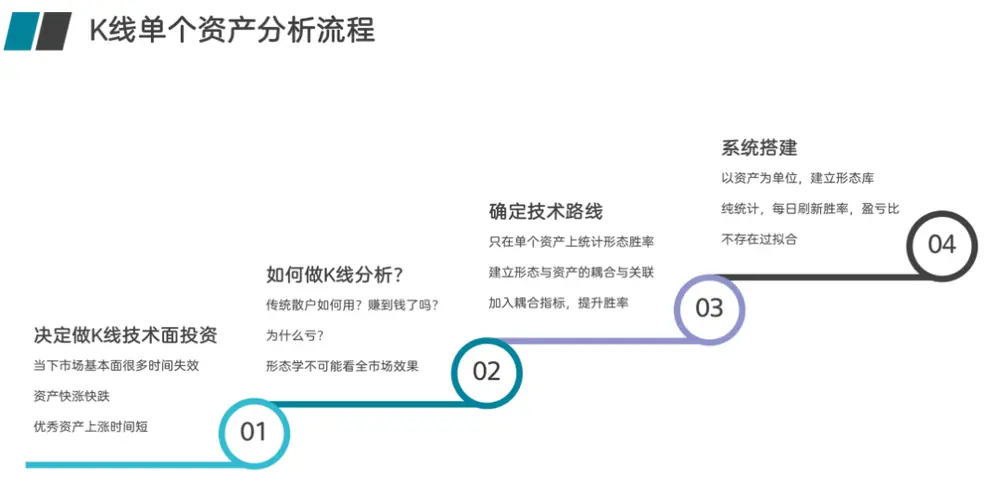
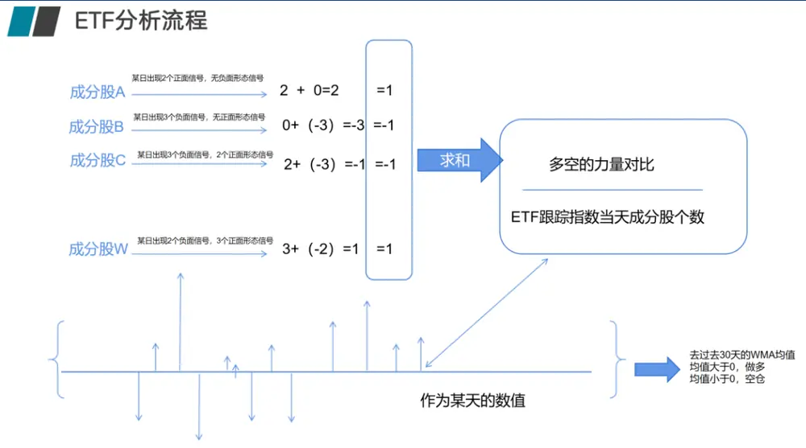
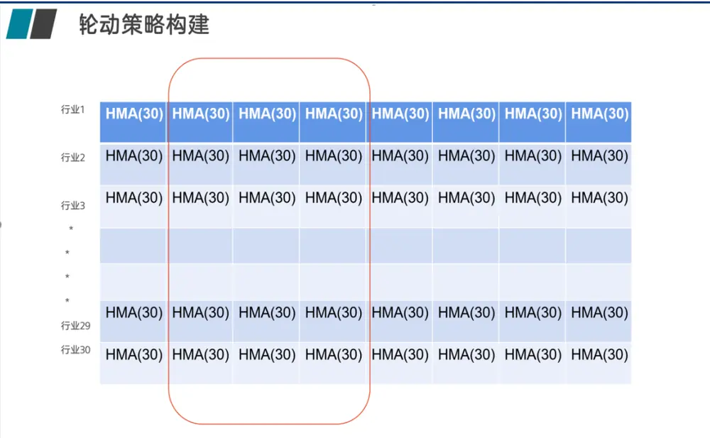
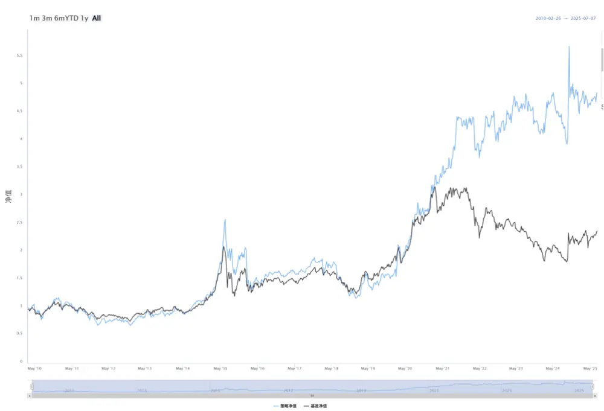
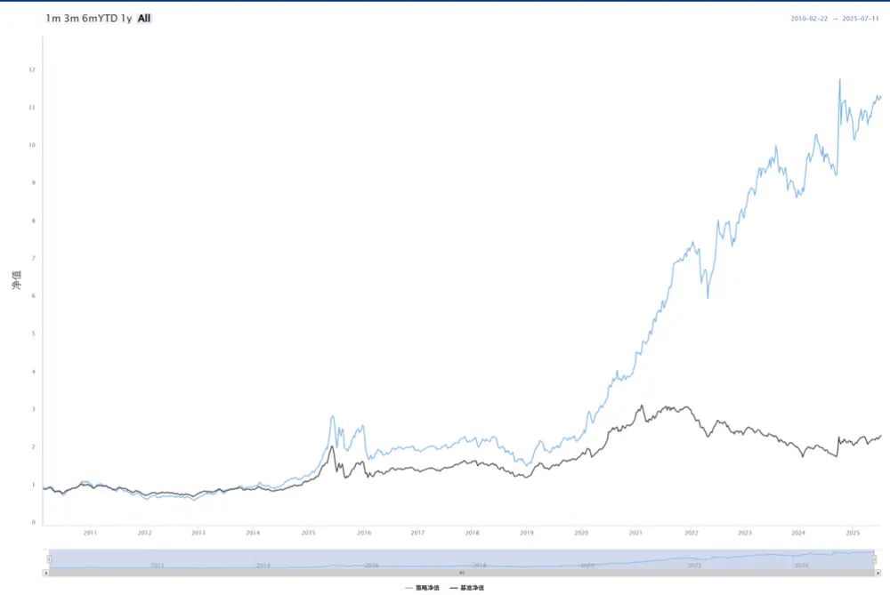
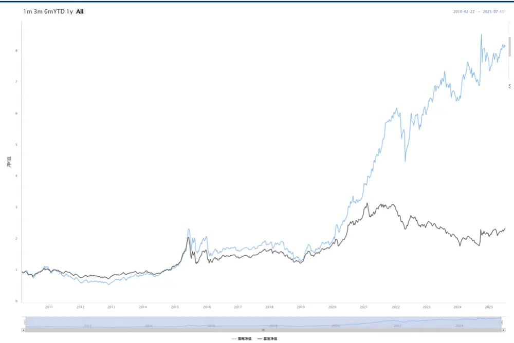

【点评报告】

# 形态学研究之十六：形态学在 ETF 轮动上的研究（全市场版）

## 摘要

ETF轮动，是指在不同 ETF 之间切换，根据市场情况调整投资组合。可涉及到不同资产类别、行业或地区。比如如何选择 ETF，轮动的依据是什么，比如动量、估值、宏观经济指标等。

在《形态学研究之十五：形态学在 ETF 轮动上的研究》中，我们以富国基金ETF为例，做了 ETF 轮动研究，获得了较好的结果。

本篇，我们将在全市场范围内对 ETF 轮动策略进行扩展，我们使用形态作为原始数据，将 ETF成分股合成 ETF 信号的方式来做 ETF 轮动。

当我们把 ETF 指数每天的多空个股个数求和后，除以当时该 ETF 指数的成分股个数，在进行 30天的 HMA均线求解后，该指标就表征了该 ETF 从结构上形态学的看多或者看空力量的变化与对比，由于都除以了成分股个数，也消除了不同 ETF因为成分股个数不同不可比的情况。

基于历史数据回测，不管是固定时间点调仓、每日调仓、或者是每日调仓优化版等，都可跑赢万得偏股混合型基金指数。固定时间点调仓策略优势在于计算量少，交易次数低，但收益率也一般，换手率最高；每日调仓策略优势在于紧跟 成分股变化，但计算量较大，交易次数也较多，对手续费敏感；而每日调仓优化版策略则兼顾了前两种策略的优势，充分利用了信号的特性，体感上更容易被接受。从目前数据来看，每日调仓策略是更佳的全市场 ETF 轮动信号，而另外两种策略根据投资需要都可以使用。

## 风险提示：

策略基于历史数据的回测，不保证策略未来的有效性

## 华创证券研究所

证券分析师：王小川

电话：021-20572528

邮箱：wangxiaochuan@hcyjs.com

执业编号：S0360517100001

联系人：黄河

邮箱：huanghe@hcyjs.com

## 相关研究报告

《形态学研究之十五：形态学在 ETF轮动上的研究》

2025-04-24

## 一、ETF 轮动策略介绍

ETF轮动，是指在不同ETF之间切换，根据市场情况调整投资组合。可涉及到不同资产类别、行业或地区。比如如何选择 ETF，轮动的依据是什么，比如动量、估值、宏观经济指标等。

在《形态学研究之十五：形态学在 ETF 轮动上的研究》中，我们以富国基金 ETF 为例，做了ETF轮动研究，获得了较好的结果。

ETF 轮动跟行业轮动同样是通过 ETF 直接的买卖切换实现收益最大化的方法。其核心逻辑为根据预设规则，动态调整持仓ETF组合，追求超越被动持有单一资产的回报。按照ETF轮动形成的原因，A 股目前的ETF轮动做法有以下几种：

## 1 动量轮动

选择近期表现强势的 ETF（如过去 3-6 个月涨幅领先）。示例：每月调入涨幅前 3 的行业ETF，调出后3名

## 2 行业/主题轮动

根据经济周期切换行业，例如复苏期选可选消费、科技，衰退期选公用事业、必需消费。

## 3 资产类别轮动

股债商品等大类资产切换，例如股票市盈率过高时增配债券ETF，恐慌指数VIX 飙升时转向黄金ETF。

## 4 因子轮动

在价值/成长、大盘/小盘等风格间切换。

ETF 轮动策略的优势明显，包括策略可适应多变市场、分散单一资产风险与规则化避免情绪干扰。但策略的缺点也不能忽视，如果高频调仓，将产生摩擦成本；信号也可能产生滞后，随即带来踏空风险。

## 二、基于成分股的形态学 ETF择时算法

在前面系列报告《K线形态研究开篇：形态学初识与应用》、《形态学研究之十三：形态学在ETF上的择时研究》中，我们提出股票后期形态必然是先期形态的结果。万事有因必有果，股票也不能例外。没有前期的积累，便没有后面的拉升。相反，没有前期的抛售，也没有后期的下跌。从这个意义上说，股票的K线形态与波浪理论、均线、箱体理论等其他形态学理论是暗合的。为此我们提出了形态与资产绑定分析的理论，并在 ETF择时上也是采用个股形态信号合成的方法对指数进行择时研究。

图表 1 形态学在单个 ETF上的分析流程

资料来源：华创证券整理

同时因为ETF的跟踪标的也是指数，因此我们在ETF上继续尝试使用跟踪指数成分股形态合成指数信号来对 ETF进行择时：

图表 2 形态学在ETF上的分析流程

资料来源：华创证券整理

这是单个ETF的择时算法，但并非是轮动，我们可以针对某个标的做一个择时策略，稳定跑赢买入持有，但是同一截面可能同时看多的ETF标的很多，而ETF标的间如何比较看多的强度，成为了能否将 ETF择时转变为 ETF轮动的关键。

## 三、基于成分股形态的 ETF轮动策略，以全市场 ETF为例

在先前报告中，我们已经成功基于成分股的形态构建了指数、ETF 的择时策略，现在就是设计指标将同一截面下的全市场各个ETF指数数据可比，就可以构建ETF轮动策略。

注意：我们只是分析跟踪指数的择时，针对同一跟踪指数，我们不进行具体哪家 ETF孰优孰差的判断与推荐。

当我们把ETF指数每天的多空个股个数求和后，除以当时该ETF指数的成分股个数，在进行 30 天的 HMA 均线求解后，该指标就表征了该 ETF 从结构上形态学的看多或者看空力量的变化与对比，由于都除以了 ETF 跟踪指数成分股个数，也消除了不同 ETF 因为成分股个数不同不可比的情况（标准化）。

图表 3 ETF形态学结果强弱比较的分析流程

资料来源：华创证券整理

目前我们一共计算过 337只全市场ETF的跟踪指数的形态学信号，这样每个交易日都会有337个ETF的形态学多空数值，基于这些形态数据衍生的数值，我们可以采取三种交易策略：

固定时间点调仓策略：每周一可以根据上周五选择的前N个 ETF开盘价买入，等下个周一继续重复该操作。优点：计算量较少，容易实现，缺点：只做5 天持有，而形态学ETF信号并非仅持有五天，未充分发挥信号作用；

每日调仓策略：每日根据前一天晚上的信号进行操作，优点：快速抓住ETF热点，缺点：交易次数较多，操作起来繁琐；

每日调仓升级策略：同每日调仓，但不同点为如果ETF得分为负，我们可以空仓，也就是说，选择的ETF得分一定要为正。优点：更符合投资逻辑，缺点：每日计算，需要时刻关注信号变化。

## （一）固定时间点调仓策略

该策略为：每周一可以根据上周五选择的前N个 ETF开盘价买入，等下个周一继续重复该操作。优点：计算量较少，容易实现，缺点：只做 5天持有，而形态学ETF信号并非仅持有五天，未充分发挥信号作用。

337个ETF的N 取不同数值的效果（双边交易手续费千2情况下）：

图表 4 固定时间点调仓策略表现不同 N下的策略表现

| N | 年化收益率（%） | 最大回撤（%） | 夏普 |
| --- | --- | --- | --- |
| 1 | -0.32 | -80.97 | 0.330 |
| 2 | 2.80 | -79.61 | 0.543 |
| 3 | 5.90 | -75.45 | 0.760 |
| 4 | 7.64 | -69.78 | 0.897 |
| 5 | 7.54 | -63.82 | 0.901 |
| 6 | 8.94 | -61.84 | 1.014 |
| 7 | 8.74 | -62.77 | 1.000 |
| 8 | 10.02 | -59.73 | 1.103 |
| 9 | 10.99 | -54.85 | 1.184 |
| 10 | 10.20 | -54.71 | 1.127 |
| 11 | 9.94 | -55.00 | 1.109 |
| 12 | 9.55 | -55.50 | 1.079 |
| 13 | 10.20 | -54.76 | 1.135 |
| 14 | 10.25 | -54.80 | 1.144 |
| 15 | 9.95 | -55.21 | 1.122 |
| 16 | 9.76 | -55.25 | 1.109 |
| 17 | 10.09 | -54.65 | 1.137 |
| 18 | 10.31 | -53.73 | 1.153 |
| 19 | 10.26 | -54.63 | 1.148 |
| 20 | 10.33 | -54.50 | 1.155 |
| 万得偏股混合型基金指数 | 4.01 | -24.97 | 1.05 |

资料来源：wind，华创证券

图表 5 固定时间点调仓策略净值 N=9

资料来源：wind，华创证券

可见固定时间点调仓策略每周选 9个 ETF效果最好。可以跑赢万得偏股混合型基金指数的收益率，但回撤增加，换手率高，可见ETF轮动选择固定时间点调仓效果一般。其平均每次交易的换手率为 45.57%，平均每年交易 52 次，换手率较高。

## （二）每日调仓策略

每日根据前一交易日的信号选取N 个ETF进行买入操作，第二天重复操作，优点：快速抓住ETF热点，缺点：换手率较高，操作起来繁琐，交易成本较高。

337个ETF当N 取不同数据的效果（双边交易手续费千2情况下）：

图表 6 每日调仓策略不同N下的策略表现

| N | 年化收益率（%） | 最大回撤（%） | 夏普 |
| --- | --- | --- | --- |
| 1 | 5.15 | -82.58 | 0.319 |
| 2 | 10.30 | -80.03 | 0.476 |
| 3 | 12.95 | -72.13 | 0.566 |
| 4 | 12.56 | -69.18 | 0.562 |
| 5 | 14.91 | -60.13 | 0.642 |
| 6 | 15.38 | -56.06 | 0.663 |
| 7 | 15.70 | -54.14 | 0.675 |
| 8 | 16.14 | -52.04 | 0.692 |
| 9 | 17.23 | -48.01 | 0.730 |
| 10 | 17.78 | -48.67 | 0.748 |
| 11 | 17.99 | -49.29 | 0.757 |
| 12 | 17.75 | -48.90 | 0.751 |
| 13 | 17.79 | -48.71 | 0.752 |
| 14 | 17.81 | -49.16 | 0.753 |
| 15 | 17.51 | -50.43 | 0.744 |
| 16 | 18.07 | -48.05 | 0.764 |
| 17 | 17.88 | -47.94 | 0.760 |
| 18 | 17.80 | -48.05 | 0.758 |
| 19 | 17.37 | -48.50 | 0.745 |
| 20 | 17.56 | -47.25 | 0.752 |
| 万得偏股混合型基金指数 | 6.28 | -45.42 | 0.402 |

资料来源：wind，华创证券

图表 7 每日调仓策略净值N=10

资料来源：wind，华创证券

每日调仓策略选 10个ETF 效果最好。如果选择 ETF数目过少，分散不了风险，选择ETF过多，会导致产生了大量的手续费对冲掉收益。其平均每次交易换手率为 15.08%，平均每年交易 216次。

## （三）每日调仓优化版策略

交易方式同每日调仓，但不同点为如果 ETF 形态得分为负，我们可以空仓，也就是说，选择的 ETF得分一定要为正。

337个ETF中N 取不同数值的效果（双边交易手续费千2情况下）：

图表 8 每日调仓优化版策略不同 N下的策略表现

| N | 年化收益率（%） | 最大回撤（%） | 夏普 |
| --- | --- | --- | --- |
| 1 | 5.20 | -82.58 | 0.320 |
| 2 | 11.81 | -70.88 | 0.539 |
| 3 | 13.50 | -66.66 | 0.599 |
| 4 | 11.73 | -67.03 | 0.548 |
| 5 | 14.23 | -57.96 | 0.632 |
| 6 | 14.50 | -54.24 | 0.644 |
| 7 | 14.99 | -52.04 | 0.660 |
| 8 | 15.05 | -48.99 | 0.663 |
| 9 | 15.47 | -52.04 | 0.676 |
| 10 | 15.20 | -52.05 | 0.666 |
| 11 | 14.91 | -51.33 | 0.655 |
| 12 | 14.27 | -50.52 | 0.634 |
| 13 | 13.62 | -53.15 | 0.611 |
| 14 | 13.22 | -54.00 | 0.596 |
| 15 | 12.39 | -55.10 | 0.566 |
| 16 | 12.44 | -55.99 | 0.567 |
| 17 | 11.63 | -58.07 | 0.540 |
| 18 | 10.92 | -58.94 | 0.515 |
| 19 | 10.50 | -59.07 | 0.500 |
| 20 | 9.99 | -59.98 | 0.482 |
| 万得偏股混合型基金指数 | 6.28 | -45.4 | 0.402 |

资料来源：wind，华创证券

买入持有信号消失退出策略最佳的 ETF 数为 10 个，由此我们也看出，ETF 轮动并非选择ETF越多越好。其平均次交易换手率为17.59%，平均每年交易 215次。

图表 9 每日调仓优化版净值N=10

资料来源：wind，华创证券

## （四）总结

从上述策略中可以看到，基于历史数据回测，不管是固定时间点调仓、每日调仓、或者是每日调仓优化版等，都可跑赢万得偏股混合型基金指数。固定时间点调仓策略优势在于计算量少，交易次数低，但收益率也一般，换手率最高；每日调仓策略优势在于紧跟ETF 成分股变化，但计算量较大，交易次数也较多，对手续费敏感；而每日调仓优化版策略则兼顾了前两种策略的优势，充分利用了信号的特性，体感上更容易被接受。从目前数据来看，每日调仓策略是更佳的全市场 ETF轮动信号，而另外两种投资策略根据投资需要也都可以适用。

## 四、形态学信号的获取

华创金工为了更方便大家使用形态信号，我们直接将形态信号API化，可以直接通过API获取形态信号，网址 https://xingtai.pro。

可以通过Python 的接口直接获取形态学系统中全部的形态介绍、形态定义与每日出现的信号，可以获取历史的与最新的信号。

通过接口也可以完全复现我们的指数择时策略、行业轮动策略与本篇的 ETF 轮动策略。

## 五、风险提示

策略基于历史数据的回测，不保证策略未来的有效性。

## 金融工程组团队介绍

组长、首席分析师：王小川

同济大学管理学博士。2017年加入华创证券研究所。

助理研究员：黄河东华大学工学博士，FRM。2023年加入华创证券研究所。

助理研究员：洪远

华南理工大学金融硕士。2023年加入华创证券研究所。

助理研究员：刘依凡上海财经大学金融统计博士。2024年加入华创证券研究所。

## 华创证券机构销售通讯录

| 地区 | 姓名 | 职务 | 办公电话 | 企业邮箱 |
| --- | --- | --- | --- | --- |
| 北京机构销售部 | 张昱洁 | 副总经理、北京机构销售总监 | 010-63214682 | zhangyujie@hcyjs.com |
|  | 张菲菲 | 北京机构副总监 | 010-63214682 | zhangfeifei@hcyjs.com |
|  | 张婷 | 华北机构销售副总监 |  | zhangting3@hcyjs.com |
|  | 刘懿 | 副总监 | 010-63214682 | liuyi@hcyjs.com |
|  | 侯春钰 | 资深销售经理 | 010-63214682 | houchunyu@hcyjs.com |
|  | 顾翎蓝 | 资深销售经理 | 010-63214682 | gulinglan@hcyjs.com |
|  | 蔡依林 | 资深销售经理 | 010-66500808 | caiyilin@hcyjs.com |
|  | 刘颖 | 资深销售经理 | 010-66500821 | liuying5@hcyjs.com |
|  | 阎星宇 | 销售经理 |  | yanxingyu@hcyjs.com |
|  | 张效源 | 销售经理 |  | zhangxiaoyuan@hcyjs.com |
|  | 车一哲 | 销售经理 |  | cheyizhe@hcyjs.com |
|  | 吴昱颖 | 销售经理 |  | wuyuying@hcyjs.com |
| 深圳机构销售部 | 张娟 | 副总经理、深圳机构销售总监 0755 | -82828570 | zhangjuan@hcyjs.com |
|  | 汪丽燕 | 销售经理 | 0755-83715428 | wangliyan@hcyjs.com |
|  | 张嘉慧 | 高级销售经理 | 0755-82756804 | zhangjiahui1 @hcyjs.com |
|  | 王春丽 | 高级销售经理 | 0755-82871425 | wangchunli@hcyjs.com |
|  | 王越 | 高级销售经理 |  | wangyue5@hcyjs.com |
|  | 温雅迪 | 销售经理 |  | wenyadi@hcyjs.com |
| 上海机构销售部 | 许彩霞 | 总经理助理、上海机构销售总监0 | 21-20572536 | xucaixia@hcyjs.com |
|  | 官逸超 | 上海机构销售副总监 | 021-20572555 | guanyichao@hcyjs.com |
|  | 祁继春 | 副总监 |  | qijichun@hcyjs.com |
|  | 黄畅 | 上海机构销售副总监 | 021-20572257-2552 | huangchang@hcyjs.com |
|  | 吴俊 | 资深销售经理 | 021-20572506 | wujun1@hcyjs.com |
|  | 张佳妮 | 资深销售经理 | 021-20572585 | zhangjiani@hcyjs.com |
|  | 郭静怡 | 高级销售经理 |  | guojingyi@hcyjs.com |
|  | 蒋瑜 | 高级销售经理 | 021-20572509 | jiangyu@hcyjs.com |
|  | 吴菲阳 | 高级销售经理 |  | wufeiyang@hcyjs.com |
|  | 朱涨雨 | 高级销售经理 | 021-20572573 | zhuzhangyu@hcyjs.com |
|  | 李凯月 | 高级销售经理 |  | likaiyue@hcyjs.com |
|  | 张豫蜀 | 销售经理 | 15301633144 | zhangyushu@hcyjs.com |
|  | 张玉恒 | 销售经理 |  | zhangyuheng@hcyjs.com |
|  | 章依若 | 销售经理 |  | zhangyiruo@hcyjs.com |
| 广州机构销售部 | 段佳音 | 广州机构销售总监 | 0755-82756805 | duanjiayin@hcyjs.com |
|  | 王世韬 | 销售经理 |  | wangshitao1@hcyjs.com |
| 私募销售组 | 潘亚琪 | 总监 | 021-20572559 | panyaqi@hcyjs.com |
|  | 汪子阳 | 副总监 | 021-20572559 | wangziyang@hcyjs.com |
|  | 江赛专 | 副总监 | 0755-82756805 | jiangsaizhuan@hcyjs.com |
|  | 汪戈 | 高级销售经理 | 021-20572559 | wangge@hcyjs.com |
|  | 宋丹玙 | 销售经理 | 021-25072549 | songdanyu@hcyjs.com |
|  | 赵毅 | 销售经理 |  | zhaoyi@hcyjs.com |

## 华创行业公司投资评级体系

基准指数说明：

A股市场基准为沪深 300指数，香港市场基准为恒生指数，美国市场基准为标普 500/纳斯达克指数。

公司投资评级说明：

强推：预期未来 6个月内超越基准指数 20%以上；

推荐：预期未来 6个月内超越基准指数 10%－20%；

中性：预期未来 6个月内相对基准指数变动幅度在-10%－10%之间；

回避：预期未来 6个月内相对基准指数跌幅在 10%－20%之间。

## 行业投资评级说明：

推荐：预期未来 3-6个月内该行业指数涨幅超过基准指数 5%以上；

中性：预期未来 3-6个月内该行业指数变动幅度相对基准指数-5%－5%；

回避：预期未来 3-6个月内该行业指数跌幅超过基准指数 5%以上。

## 分析师声明

每位负责撰写本研究报告全部或部分内容的分析师在此作以下声明：

分析师在本报告中对所提及的证券或发行人发表的任何建议和观点均准确地反映了其个人对该证券或发行人的看法和判断；分析师对任何其他券商发布的所有可能存在雷同的研究报告不负有任何直接或者间接的可能责任。

## 免责声明

本报告仅供华创证券有限责任公司（以下简称“本公司”）的客户使用。本公司不会因接收人收到本报告而视其为客户。

本报告所载资料的来源被认为是可靠的，但本公司不保证其准确性或完整性。本报告所载的资料、意见及推测仅反映本公司于发布本报告当日的判断。在不同时期，本公司可发出与本报告所载资料、意见及推测不一致的报告。本公司在知晓范围内履行披露义务。

报告中的内容和意见仅供参考，并不构成本公司对具体证券买卖的出价或询价。本报告所载信息不构成对所涉及证券的个人投资建议，也未考虑到个别客户特殊的投资目标、财务状况或需求。客户应考虑本报告中的任何意见或建议是否符合其特定状况，自主作出投资决策并自行承担投资风险，任何形式的分享证券投资收益或者分担证券投资损失的书面或口头承诺均为无效。本报告中提及的投资价格和价值以及这些投资带来的预期收入可能会波动。

本报告版权仅为本公司所有，本公司对本报告保留一切权利。未经本公司事先书面许可，任何机构和个人不得以任何形式翻版、复制、发表、转发或引用本报告的任何部分。如征得本公司许可进行引用、刊发的，需在允许的范围内使用，并注明出处为“华创证券研究”，且不得对本报告进行任何有悖原意的引用、删节和修改。

证券市场是一个风险无时不在的市场，请您务必对盈亏风险有清醒的认识，认真考虑是否进行证券交易。市场有风险，投资需谨慎。

## 华创证券研究所

| 北京总部 | 广深分部 | 上海分部 |
| --- | --- | --- |
| 地址：北京市西城区锦什坊街26号 恒奥中心C 座 3A | 地址：深圳市福田区香梅路1061号中投国 际商务中心A 座19楼 | 地址：上海市浦东新区花园石桥路33号 花旗大厦 12 层 |
| 邮编：100033 传真：010-66500801 | 邮编：518034 | 邮编：200120 |
| 会议室：010-66500900 | 传真：0755-82027731 会议室：0755-82828562 | 传真：021-20572500 会议室：021-20572522 |