【专题报告】

# AI+HI 系列：GRU 网络在风格自适应中的创新与应用

## 前言

A 股市场的风格轮动长期以来是投资者关注的重点。我们将 A 股市场的风格细分为：大盘成长、大盘质量、大盘价值、小盘成长、小盘质量、小盘价值。近年来 A股市场走势分为两个阶段：2018 年底至 2021年初，市场主导风格为大盘质量和大盘成长；21 年之后，小盘成长和小盘价值成为主流，特别是小盘价值表现尤为突出。本文旨在探讨如何运用 GRU 网络对这六大风格进行有效整合，实现风格自适应的研究目标。

## GRU 三因子测试对比

对 GRU 网络不同训练方式生成因子的测试对比发现，无论是原始因子还是中性化后的因子，GRU_50 等权因子在全 A 范围内的测试效果更为显著。原始GRU_50 等权因子在单因子 IC 均值达到 9.9%，中位数为 9.5%，年化 IC_IR 为7.13。此外，其多头组的年化收益率为 32.93%，最大回撤为 21.78%。

对比不同宽基指数上的测试结果，GRU_50 等权因子和 GRU_集成因子在沪深300 指数上均表现出色；GRU_集成因子在中证 500 上测试效果更佳，而GRU_50 等权因子在中证 1000 上表现最佳。对比这三个因子在宽基指数上多头组的年度收益，GRU_50 等权因子在 2021 年前整体表现更佳，而 21 年后GRU_集成因子的效果最为显著。

## 风格基准池中测试

在风格基准池中对比三个因子的测试结果， 集成因子的表现最为优越。其单因子 IC 均值为 8%，中位数为 7.4%，多头分组的夏普比率也在三者中最为突出。因此，我们采用GRU_集成因子在基准池中进行每期选股，策略自2018年以来的年化收益率为 15.2%，最大回撤为 23.4%，换手率达 42 倍。历史数据显示，该策略稳定地超越基准及沪深 300、中证 1000、中证 500指数。

## 风险提示：

策略基于历史数据回测，不保证未来数据的有效性。

## 华创证券研究所

证券分析师：秦玄晋

电话：021-20572522

邮箱：qinxuanjin@hcyjs.com

执业编号：S0360522080005

证券分析师：王小川

电话：021-20572528

邮箱：wangxiaochuan@hcyjs.com

执业编号：S0360517100001

## 相关研究报告

《量化选股系列——机构情绪与个人情绪》

2023-09-05

《ChatGLM 助力量化选股》

2023-06-14

《人工智能助力量化投资—ChatGLM 介绍》

2023-06-14

《基于 canslim 与 FESC 的沪深 300 指数增强策略》

2023-03-07

《行业轮动系列——FESC 行业轮动投资框架1.0》

2022-09-07

《CANSLIM 3.0 投资法——成长与价值轮动》

2022-06-17

《CANSLIM 2.0 投资法——华创金工大师系列成长型之一》

2021-10-16

## 投资主题

## 报告亮点

A 股市场的风格轮动长期以来一直是投资者研究的焦点，本文旨在研究如何通过 GRU 网络来有效将六大风格组合进行有效的整合，以达到风格自适应的研究目标。

自 ChatGPT 在 A 股市场被广泛关注之后，如何将 AI 应用到量化投资领域越来越受到广大机构投资者的关注，本文选用当前热门的研究领域，巧妙的利用 GRU 网络将 AI 与传统基本面量化研究相结合，为广大投资者提供新的研究思路，助力量化投资的发展。

## 投资逻辑

市场风格的变化对各行业、投资经理以及基本面量化选股策略的影响显著。因此，本文旨在通过量化方法整合不同风格的组合，以更有效地指导投资决策。

## 一、基本面量化策略回顾

A 股市场的风格轮动长期以来一直是投资者研究的焦点。虽然对市场风格的分类有所不同，但通常可将其归纳为大盘、小盘、价值和成长等几个主要类别。对近年来A 股市场的走势分析显示，市场经历了两个显著的发展阶段。

第一阶段（2018年底至2021年初）以大盘成长型股票的主导为特征。这一时期，多个被视作“核心资产”的股票如贵州茅台（2018 年 12 月至 2021 年 2 月涨幅超 350%）实现了显著的价值增长。此外，此阶段孕育了多位机构投资经理的崛起，他们管理的基金产品在此期间实现了显著的净值增长。在此期间，以大盘股为代表的上证 50 指数和沪深300指数分别实现了 76.37%和 92.89%的涨幅，远超中小盘股指数中证 500 和中证 1000 的58.95%和 44.75%涨幅。

第二阶段（从2021年2月至今）则见证了市场风格向小盘价值股的转变。在此阶段，先前大幅增长的“核心资产”股票遭遇重大调整，很多股票价格大幅下跌。与此同时，中小盘股票在此阶段表现突出。相较而言，中证 500和中证1000在这个阶段的表现超过了大盘指数上证 50 和沪深 300，分别下跌 14.69%和 3.05%，而上证 50 和沪深 300 同期分别下跌 41.15%和 39.53%。

显然，市场风格的这种变化对各行业、投资经理以及基本面量化选股策略的影响显著。
因此，本文旨在通过量化方法整合不同风格的组合，以更有效地指导投资决策。

## （一）近年来风格A股市场的风格轮动现象

图表 1 2018年来风格轮动现象
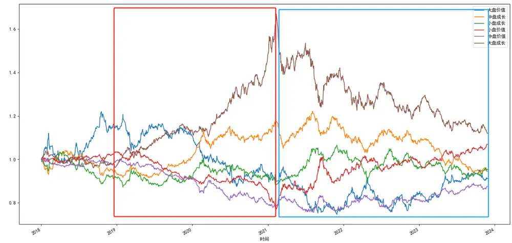
资料来源：wind，华创证券

上图表所示为我们选取的巨潮风格指数（涵盖六大市场风格）作为研究样本，对比其在过去数年的市场表现（用相对收益表示）。在2018年底至2021 年初，大盘成长股相较于其他宽基市场风格，显示出显著的超额收益，呈现出明显的单边上升趋势。在这一时期内，中盘价值股和小盘价值股的表现相对较弱，其相对收益大多呈现单边下降趋势。然而，自 年起，大盘成长股经历了显著的价格波动和下跌，与此同时，小盘价值股则展现出震荡上升的走势。

这种市场风格的转变直接影响了不同时期基于基本面分析的量化选股策略的选择与应用。
以下部分将回顾过去几年内一些代表性选股策略的绩效表现。

## 1、canslim 策略历史回顾

图表 2 canslim 策略 2018 年来走势
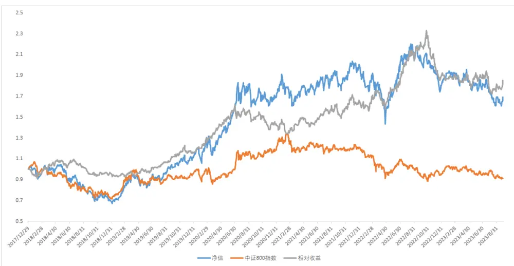
资料来源：wind，华创证券

上图表呈现了 Canslim 1.0 策略自 2018 年开始追踪以来的绩效数据。截至目前，该策略的累计收益率为 69.4%。在各个年度的表现中，2019年取得了最高的年度收益率，为 65%，其次是 2020年，收益率达到 50%，而 2021年的收益率为15%。然而，在最近两年，策略表现出下滑趋势，2022年下跌9%、2023年下跌8%。

## 2、红利策略历史回顾

下图表 3详细展示了自2018年起的红利策略净值变化情况。在此期间，该策略取得了显著的绝对收益，累计高达90.25%。对比而言，同期红利指数的涨幅仅为-5.71%，从而使得该策略的超额收益达到了 95.96%。

在年度层面上，2019年、2020年和 2021年，红利策略的涨幅分别为 39%、21%和 33%，而其相对红利指数的超额收益则分别为 3%、-3%和 35%。在最近两年（2022 年和 2023年），策略的收益率分别为-3%和0%，相应的超额收益则为18%和8%。

红利策略在 2019 年和 2020 年的牛市期间与 Canslim 策略相比略显逊色。然而，在过去三年中，红利策略不仅显著跑赢了红利指数，而且相对于 Canslim 策略也取得了可观的超额收益。

图表 3 红利策略2018年来走势
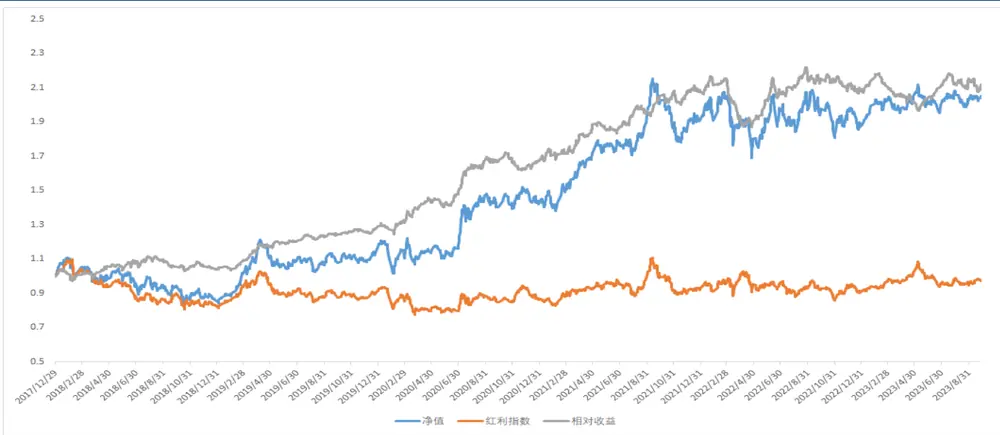
资料来源：wind，华创证券

## 3、惠特尼·乔治小型价值股策略回顾

图表 4 惠特尼·乔治小型价值股策略 2018年来走势
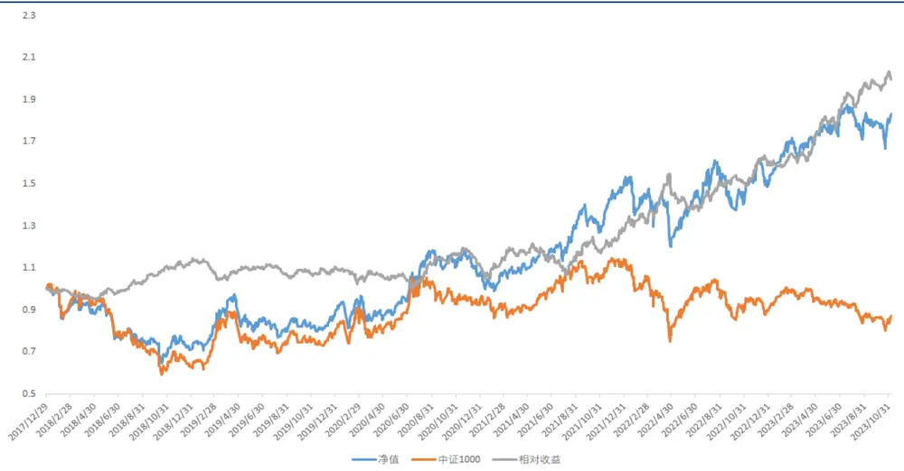
资料来源：wind，华创证券

如所示图表中反映，惠特尼·乔治的小型价值股策略自 2018 年以来展现了显著的收益表现。在过去三年中，该策略的成果尤为突出。2021 年，该策略实现了 39%的绝对收益，相较于中证 1000基准指数，其超额收益达到了35%。2022年，尽管绝对收益为负（-3%），但相对于基准指数仍实现了 12%的超额收益。而在 2023年至今，该策略实现了 20%的绝对收益和相对基准的 23%超额收益。然而，需要指出的是，在 2019 年和 2020 年，该策略的表现相对平平，未能超越 canslim策略。2019年和2020年的绝对收益分别为 24%和19%。

## （二）行业轮动现象

图表 5 中信一级行业2018年以来每半年涨幅排名

| 行业 |  | 2018/6/302018/12/31 |  | 2019/6/302019/12/31 |  | 2020/6/302020/12/31 | 2021/6/30 | 2021/12/31 |  | 2022/6/302022/12/31 |  | 2023/6/302023/12/31 |  | 平均排名 |
| --- | --- | --- | --- | --- | --- | --- | --- | --- | --- | --- | --- | --- | --- | --- |
| 综合金融(中信) | 2 | 26 | 6 | 13 | 13 |  | 6 | 17 | 3 |  | 21 | 16 | 25 | 12.50 |
| 综合(中信) |  | 17 | 9 | 9 | 12 | 6 | 27 | 8 | 15 |  | 25 | 3 | 22 | 12.83 |
| 房地产(中信) | 12 | 22 | 14 | 19 | 5 | 7 | 4 | 10 | 24 |  | 22 | 2 | 16 | 13.08 |
| 传媒(中信) | 9 | 7 | 2 | 28 | 22 | 3 | 8 | 22 | 2 |  | 24 | 29 | 5 | 13.42 |
| 建筑(中信) | 7 | 27 |  | 3 | 7 | 9 | 14 | 24 | 27 |  | 11 | 24 | 7 | 13.42 |
| 商贸零售(中信) | 21 | 11 | 11 | 2 | 23 | 4 | 10 | 14 | 17 |  | 30 | 9 | 18 | 14.17 |
| 钢铁(中信) | 17 | 18 | 4 |  | 8 | 17 | 29 | 23 | 13 |  | 7 | 12 | 24 | 14.42 |
|  | 4 | 25 | 22 | 18 | 20 | 1 | 7 | 19 | 7 |  | 19 | 30 | 4 | 14.67 |
| 通信(中信) | 24 | 4 | 5 | 8 | 10 | 10 | 20 | 7 | 16 |  | 27 | 19 | 26 | 14.67 |
| 纺织服装(中信) | 8 | 16 | 25 | 29 | 18 | 19 | 17 | 16 | 19 |  | 1 | 5 | 9 | 15.17 |
| 建材(中信) |  | 21 | 8 | 5 | 11 | 11 | 16 | 26 | 11 |  | 23 | 21 | 13 | 15.17 |
| 电力及公用事业(中信) | 16 | 5 | 17 | 14 | 9 | 25 | 25 | 30 | 25 |  | 5 | 14 | 11 | 15.42 |
| 有色金属(中信) | 5 22 | 14 | 18 | 7 | 6 | 16 | 12 | 11 | 28 |  | 29 | 8 |  | 15.42 |
| 交通运输(中信) | 20 | 9 | 13 | 24 | 16 | 15 | 15 | 18 | 6 |  | 20 | 15 | 14 |  |
| 轻工制造(中信) | 19 | 6 | 10 | 21 | 19 | 21 | 30 | 25 | 18 |  | 2 | 6 | 15 | 15.50 15.58 |
| 基础化工(中信) | 6 | 15 | 19 | 16 | 17 | 22 | 18 | 21 | 9 |  | 13 | 26 | 10 6 |  |
| 机械(中信) 家电(中信) | 25 | 3 | 27 | 27 | 14 | 24 | 2 | 5 | 12 |  | 10 | 27 | 12 | 15.67 15.67 |
| 非银行金融(中信) | 10 | 28 | 29 | 11 | 4 | 18 |  | 6 | 10 |  | 26 | 18 | 28 | 15.75 |
| 计算机(中信) | 27 | 10 | 26 | 25 | 26 | 5 | 13 | 9 | 4 |  | 17 | 28 | 2 | 16.00 |
| 电力设备及新能源(中信) | 3 | 24 | 12 | 17 | 25 | 30 | 28 | 27 | 14 |  | 3 | 11 | à | 16.25 |
| 石油石化(中信) | 26 | 19 | 7 | 6 | 1 | 20 | 24 | 13 | 23 |  | 12 | 23 | 21 | 16.25 |
| 国防军工(中信) | 13 | 23 | 20 | 10 | 21 | 29 | 3 | 29 | 5 |  | 15 | 20 | 8 | 16.33 |
| 农林牧渔(中信) | 14 | 29 | 28 24 | 15 | 24 | 8 | 5 23 | 12 15 | 22 |  | 16 | 4 | 20 | 16.42 |
| 电子(中信) | 15 | 2 1 | 21 | 30 | 27 30 | 13 12 | 22 | 2 | 1 |  | 6 | 25 | 17 | 16.50 |
| 医药(中信) | 29 |  | 23 | 26 |  | 26 | 9 |  | 8 |  | 14 | 10 | 27 | 16.83 |
| 消费者服务(中信) | 30 | 13 | 15 | 12 | 29 | 23 | 26 | 28 | 29 |  | 28 |  | 3 | 17.00 |
| 煤炭(中信) | 11 | 20 | 16 | 4 20 | 2 3 |  | 14 19 | 3 | 30 |  | 8 | 13 | 30 | 17.50 |
| 银行(中信) | 23 | 30 | 30 |  |  |  | 28 11 | 4 | 20 | 26 | 18 9 | 17 7 | 23 | 17.67 17.83 |

资料来源：wind，华创证券

近年来的市场风格的切换也影响着每个行业的走势变化，图表 5表示 2018年以来各中信一级行业的半年度涨幅排名图，过去半年涨幅越大行业排名越高。可以看出行业轮动的现象非常明显。

以汽车行业为例，汽车行业在2018年到2019年6月底期间表现平平。然而，自2019年下半年开始，该行业的排名基本上能够稳定在排名较高的行业中，仅在 2020年上半年出现了排名第 15 的情况。随后，到了 2022 年下半年，汽车行业经历了大幅回撤，排名下降至第 4位。然而，进入2023年后，汽车行业的排名再次回到排名较高的行业之一，保持在后三分之一的位置。

## 1、FESC行业轮动策略历史回顾

图表 6 FESC行业轮动策略2018年来走势
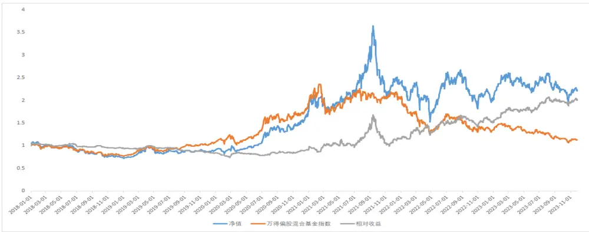
资料来源：wind，华创证券

图表6展示了FESC行业轮动策略在最近几年的绩效数据。具体而言，FESC策略在2019年、2020 年和 2021 年分别实现了 31.41%、75.1%和 26.76%的绝对收益，表现出色。然而，在 2022 年，该策略经历了小幅回撤，收益率为-3.96%。截至目前，FESC 策略的收益率为 5.85%。与偏股混合基金指数相比，FESC策略在多数年份都实现了显著的超额收益。具体而言，FESC策略在2020 年实现了高达19.19%的超额收益，2021年的超额收益为 19.08%，2022 年为 17.07%，2023 年为 16.84%。

为更好地应对前文提到的风格轮动现象，我们考虑结合神经网络来实现多风格组合的结合，首先我们对所使用的方法和理论进行介绍。

## 二、GRU 网络介绍

门控循环单元（Gated Recurrent Unit，简称 GRU）由 Cho 等人在 2014 年提出，是循环神经网络（RNN）的一种变体。RNN 网络是为处理序列类数据而特别设计的模型，其特点在于能够捕获并保留序列当前时间步之前的历史信息。

图表 7 经典RNN网络
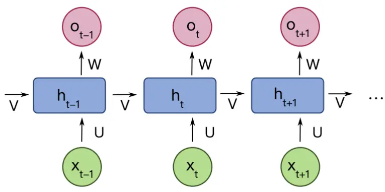
https://www.ipanqiao.com/entry/711

如上图所示，在经典 RNN 网络中，每个时间步t模型的输入为当前时间步的 $X_{t}$ 和前一时间步的隐状态（hidden state） $H_{t-1}$ ，将二者拼接后再送入全连接层，最后得到当前时间步的隐状态 $\cdot H_{t}$ ，以此循环。通常最后一个时间步的隐状态可以用来作为整个序列的表征。

图表 8 GRU 网络
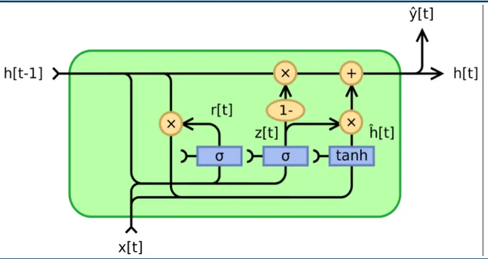
https://www.ipanqiao.com/entry/711

GRU 模型在传统 RNN 模型的基础上引入门控机制，减少了 RNN 网络的梯度消失问题，在处理长距离依赖问题时表现更好；相比 LSTM（另一种常见的 RNN 变体模型），GRU在结构更为简单的同时能够实现相近的效果。

GRU的关键在于它的门控机制，这种机制可以决定哪些信息可以通过时间传递，哪些信息应该被丢弃，数学表达如下：

$$
\begin{aligned}\boldsymbol{z}_{t}&=\sigma(\boldsymbol{W}_{z}\boldsymbol{x}_{t}+\boldsymbol{U}_{z}\boldsymbol{h}_{t-1}+\boldsymbol{b}_{z})\\\boldsymbol{r}_{t}&=\sigma(\boldsymbol{W}_{r}\boldsymbol{x}_{t}+\boldsymbol{U}_{r}\boldsymbol{h}_{t-1}+\boldsymbol{b}_{r})\\\widehat{\boldsymbol{h}_{t}}&=\boldsymbol{\phi}(\boldsymbol{W}_{h}\boldsymbol{x}_{t}+\boldsymbol{U}_{h}(\boldsymbol{r}_{t}\odot\boldsymbol{h}_{t-1})+\boldsymbol{b}_{h})\\\boldsymbol{h}_{t}&=(1-\boldsymbol{z}_{t})\odot\boldsymbol{h}_{t-1}+\boldsymbol{z}_{t}\odot\widehat{\boldsymbol{h}_{t}}\end{aligned}
$$

其中， $x_{t}.$ 表示当前时间步的输入， $h_{t}$ 为输出的隐状态， $\widehat{h}_{t}$ 为候选隐状态，z_t为更新门，r_t为重置门，σ表示sigmoid 激活函数，ϕ表示tanh激活函数，W,U,b表示全连接参数矩阵/向量。

GRU单元的两个门——重置门和更新门，控制了隐状态的更新过程。更新门负责决定保留多少之前的记忆，当更新门趋近于 1 时，之前的记忆将被保留并传递给当前状态，反之新的记忆将替代旧的记忆；重置门它决定了是否应该忽略之前的记忆，如果重置门接近0，模型忘记过去的不重要的信息。

## 三、GRU网络在量化中的应用

## （一）模型与特征构建介绍

根据上文对 GRU 模型的介绍，GRU 网络的设计思路使其在处理自然语言等序列数据的任务中具有一定优势，股票的量价时序数据同样属于序列信息，我们希望GRU 网络能不遗忘时序早期的重要信息，另一方面，量价序列中的各个时点间的信息含量不一，我们希望模型重置内部的隐状态表示，实现端到端的量价时序数据因子生成。以一只股票为例，我们可以将其过去 30日的量价时序作为模型输入，搭建如下的 GRU 网络：

图表 9 GRU模型输入示例
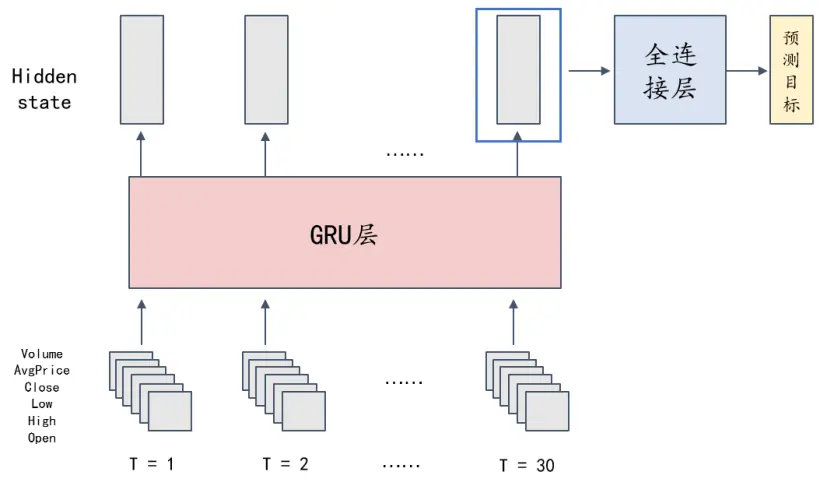
资料来源：华创证券

数据集说明：

2007-2023年A 股日频量价数据，包括高、开、低、收、均价、成交量六个序列，我们进行如下筛选：

1、剔除上市不满 120天的股票

2、剔除流通市值最小的10%的股票；

模型训练参数说明：

训练集划分：为了可能捕捉近期的市场风格变化，模型采用滚动训练的方式，即每年年底重新进行模型训练，在每年年底回溯过去 10 年作为训练集+验证集（其中最近的一年为验证集），次年为测试集；第一期模型的训练集为 2007 年 1 月-2016 年 12 月，验证集为2017年1月-2017年12月，测试集为 2018年，以此类推。

考虑到深度学习模型训练存在一定随机性的问题，在每年年末进行模型重训练时，设置5个固定的随机种子运行5次模型训练脚本，等权5 个模型的输出作为最终结果。

图表 10 训练验证集划分
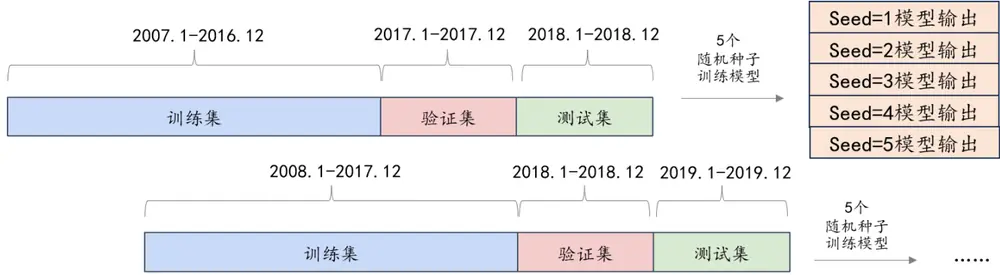
资料来源：华创证券

模型输入数据：

在每周的最后一个交易日t，回溯截面上所有 $N_{t}$ 只股票过去 30 个交易日 6 个特征的时序数据（高、开、低、收、均价、成交量）。以一只股票为例，在 t时刻构成了模型输入矩阵的一条样本，形状为（1,30,6）。

我们采用周度滚动的方式生成输入数据 $(N_{1},30,6),(N_{2},30,6),..(N_{t},30,6)$ ，在第一个维度上进行矩阵拼接。

数据预处理方法：

将数据输入模型之前，进行如下的预处理步骤：

1、MAD 法对异常值缩尾处理；

2、将序列每一天除以第三十天的数据后进行Z-score标准化；

3、对缺失值按0填充；

其中 MAD 和 Z-score 标准化在训练集确认标准化使用的均值、中位数等参数（fit +transform），用训练集上确定的参数对验证集和测试集进行上述标准化处理（transform）。

模型预测标签：

我们将序列最后一天的隐状态取出作为序列的表示，通过全连接层将输出对齐至预测目标。选择预测目标时，我们从两个角度构建了如下两种标签：

- t+1 日~t+11日按收盘价计算的 10 日收益率

- t+1 日~t+11日按收盘价计算的分类标签，分类方法如下图所示：

图表 11 分类标签计算方法
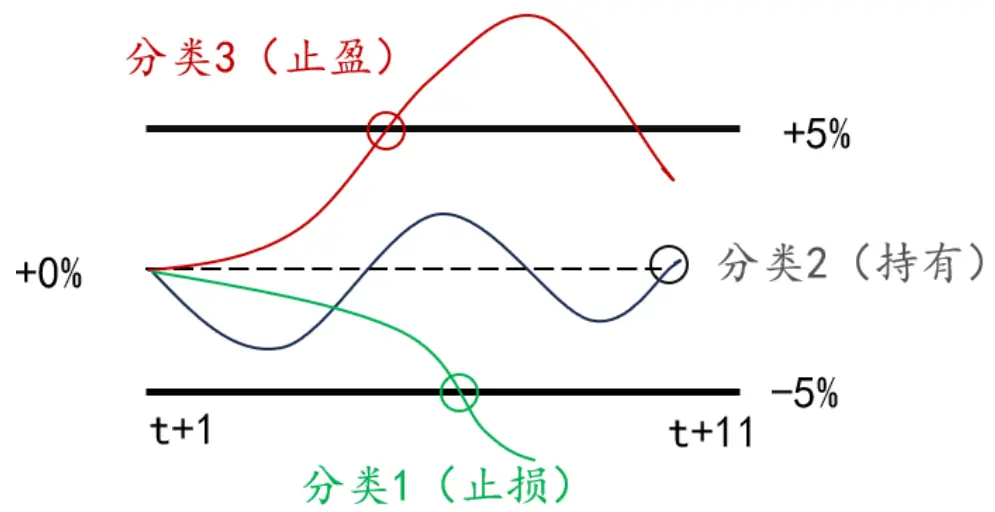
资料来源：华创证券

第一个标签对应损失函数为 IC 损失，旨在让模型端到端生成 IC 尽可能高的截面选股因子；第二个标签对应损失函数为交叉熵，三个分类对应止盈、止损、持有三种情景，侧重于交易执行层面，在5%的上下限阈值设定下，三个分类的样本数量较为均衡，在整个样本时间段的周度截面统计结果为，平均每个分类占比分别为33%、32%、34%。

根据上述两个标签，我们设计三个训练任务，如下图所示：

图表 12 模型训练框架
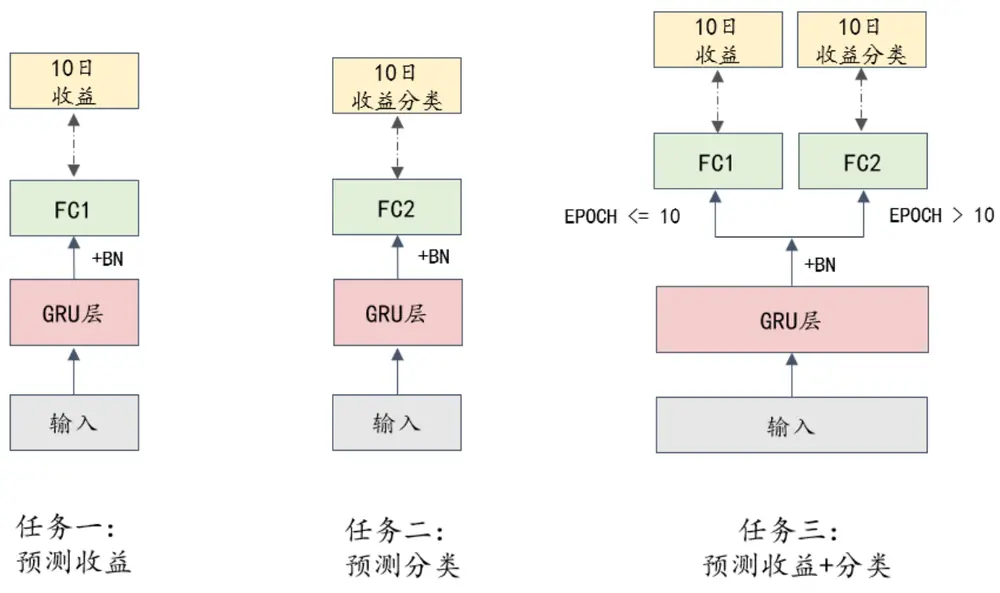
资料来源：wind，华创证券

具体来说，GRU层的隐状态维度被设置为 50，取最后时间步的隐状态作为序列表征，经过BatchNorm层后输入不同的全连接层以训练不同的任务。

对任务一，全连接层 FC1 的输入与输出维度均为 50，可视为模型为每只股票生成 50 个因子，将50个因子求均值合成后得到最终输出，每只股票得到一个因子得分，我们计算其与未来 10日的IC 作为损失，在后文中我们将该因子称为GRU_50等权因子。

对任务二，全连接层FC2 的输出维度为 3，我们计算其与未来 10日收益分类的交叉熵损失，并用分类3–分类1作为每只股票的因子得分，在后文中我们将该因子称为GRU_3 分类因子。

对任务三，可以看作前两个模型的集成，前 10 个 epoch 执行任务一，使用 FC1 层连接GRU 层，计算 IC 损失、10 个 epoch 之后执行任务二，使用 FC2 层连接 GRU 层，计算交叉熵损失。将 FC1 层输出的 50 个因子求均值、FC2 层输出的分类 3 – 分类 1 得分二者再进行等权相加，得到每只股票最终的因子得分，在后文中我们将该因子称为 GRU_集成因子。

模型超参数汇总如下表：

图表 13 模型参数设定

| 变量名 | 参数设置 |
| --- | --- |
| GRU 层数 | 1 |
| GRU 隐状态维度 | 50 |
| 全连接层1（FC1）维度 | 50,50 |
| 全连接层2（FC2）维度 | 50,3 |
| Batch Size | 256 |
| 训练早停阈值(early stop) | 3 |
| 最大 epoch 数 | 10（任务一,任务二）、15（任务三） |
| 优化器 | Adam(初始学习率 1e-3) |
| 随机种子 | 1,2,3,4,5 |

资料来源：华创证券

## （二）因子测试

我们对前文提到的三中训练方式生成的三个因子分别进行检验，对比不同任务下的结果，报告中回测的历史区间为2018年 1月至 2023年11月底：

## 1、原始因子测试结果

- IC 测试结果

图表 14 原始因子IC统计结果

|  | 平均值 | 标准差 | 最小值 | 25%分位数 | 中位数 | 75%分位数 | 最大值 | 绝对值均值 | 大于0占比 | 年化IC_IR | IC的t统计量 |
| --- | --- | --- | --- | --- | --- | --- | --- | --- | --- | --- | --- |
| GRU_3分类因子 | 0.078 | 0.122 | -0.24 | -0.008 | 0.08 | 0.164 | 0.474 | 0.117 | 0.719 | 4.61 | 10.97 |
| GRU_50 等权因子 | 0.099 | 0.1 | -0.199 | 0.04 | 0.095 | 0.161 | 0.417 | 0.116 | 0.831 | 7.13 | 16.95 |
| GRU_集成因子 | 0.096 | 0.104 | -0.168 | 0.033 | 0.098 | 0.159 | 0.451 | 0.118 | 0.81 | 6.70 | 15.92 |

wind,

图表 15 GRU_50 等权因子 IC 历史表现
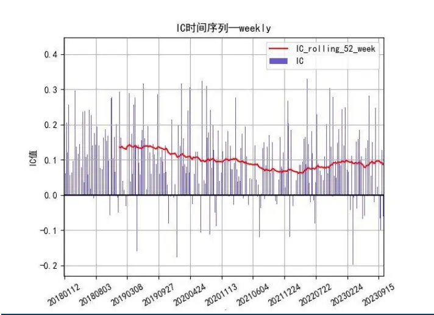
资料来源：wind，华创证券

图表 16 GRU_3 分类因子 IC 历史表现
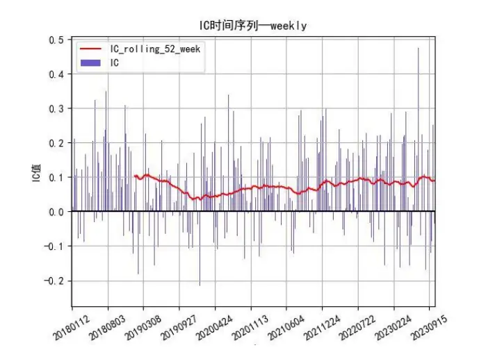
资料来源：wind，华创证券

图表 17 GRU_集成因子 IC历史表现
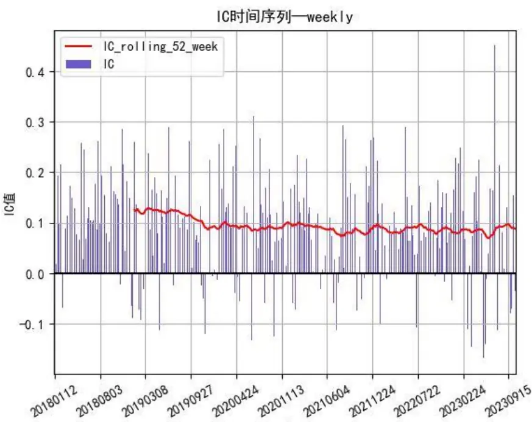
资料来源：wind，华创证券

以上四张图表呈现了三个因子的历史 IC 统计结果及其时序图。从 IC 统计结果来看，GRU_50 等权因子的 IC 均值最高为 9.9%，同时其年化 IC_IR 也达到了 7.13。而集成因子的 IC 中位数最大为 9.8%，其年化 IC_IR 为 6.7。

观察IC 的时序图，我们可以看到，50等权因子的滚动一年IC 在 2021年 6月至 2022年6 月期间出现了轻微回撤，而 GRU_3 分类因子的滚动一年 IC 在 2019 年 3 月至 2019 年9月期间出现了较大回撤。然而，集成因子的 IC 历史表现相对稳定，滚动一年 IC 均值波动较小。

图表 18 GRU_50 等权因子分组超额收益曲线
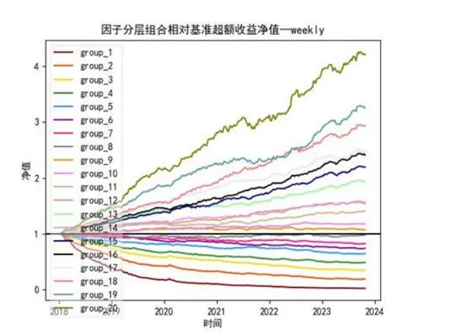
资料来源：wind，华创证券

图表 19 GRU_3分类因子分组超额收益曲线
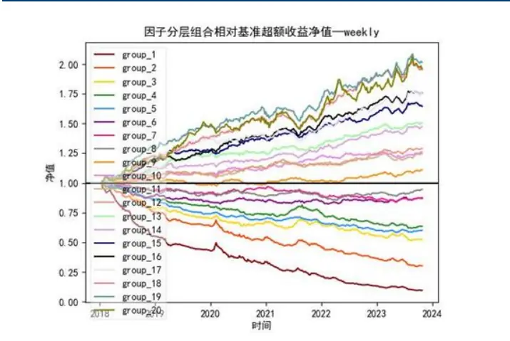
资料来源：wind，华创证券

图表 20 GRU_集成因子分组超额收益曲线
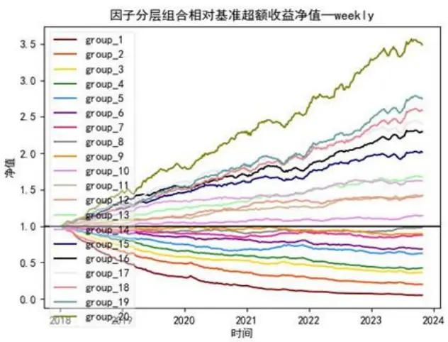
资料来源：wind，华创证券

图表 21 各因子 group_20 收益统计

| 因子 | 年化收益 | 年化波动率 | 最大回撤 | 夏普比率 | 年化超额收益 | 相对收益年化波动率 | 相对收益最大回撤 | 信息比率 | 换手率 |
| --- | --- | --- | --- | --- | --- | --- | --- | --- | --- |
| GRU_3 分类因子 | 0.1709 | 0.19 | -0.2356 | 0.93 | 0.125 | 0.09 | -0.10 | 1.52 | 61.86 |
| GRU_50 等权因子 | 0.3293 | 0.22 | -0.2178 | 1.39 | 0.2873 | 0.08 | -0.07 | 3.71 | 76.64 |
| GRU_集成因子 | 0.2917 | 0.20 | -0.2077 | 1.39 | 0.2454 | 0.07 | -0.05 | 3.60 | 73.52 |

资料来源：wind，华创证券

以上四张图表展示了三个因子分组的收益情况对比。从超额收益曲线的区分度来看，GRU_50等权因子的线性区分度最高，尽管在2021年下半年出现了轻微波动，但其 20 分组的区分度是三者中最稳定的。其次是 GRU_集成因子，该因子分组后的 group_20 长期能够稳定地跑赢其他分组，不过 group_16、group_17、group_18 和 group_19 的区分度较低。GRU_3 分类因子的区分度最差。

- 多空测试结果

图表 22 GRU三因子多头组合对比
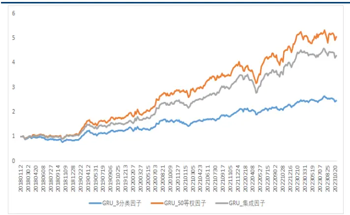
wind,

图表 23 GRU三因子多空组合对比
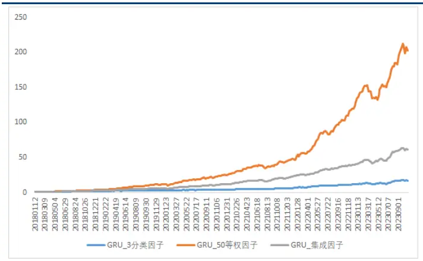
资料来源：wind，华创证券

图表 24 GRU三因子多空分组收益对比

| 因子 |  | 年化收益 | 年化波动率 | 最大回撤 | 夏普比率 |
| --- | --- | --- | --- | --- | --- |
| GRU_3分类因子 | 空头组合 | -0.3216 | 0.28 | -0.8951 | -1.24 |
|  | 多头组合 | 0.1709 | 0.19 | -0.2356 | 0.93 |
|  | 多空组合 | 0.6466 | 0.21 | -0.2024 | 2.51 |
| GRU_50 等权因子 | 空头组合 | -0.5049 | 0.29 | -0.9825 | -2.24 |
|  | 多头组合 | 0.3293 | 0.22 | -0.2178 | 1.39 |
|  | 多空组合 | 1.5436 | 0.21 | -0.1434 | 4.53 |
| GRU_集成因子 | 空头组合 | -0.3946 | 0.26 | -0.9452 | -1.78 |
|  | 多头组合 | 0.2917 | 0.20 | -0.2077 | 1.39 |
|  | 多空组合 | 1.0583 | 0.17 | -0.0968 | 4.38 |

资料来源：wind，华创证券

以上三图表示了 GRU 三因子的多空分组对比结果。从多头对比结果来看，GRU_50 等权因子表现最佳，多头年化收益率达到 32.93%，最大回撤仅为 21.78%，夏普比率为 1.39。而从多空分组的结果来看，GRU_50 等权因子的表现同样最佳，多空组合实现了年化收益率超过 154%，大幅领先其他两个因子。

## 2、中性化后因子测试结果

- IC 测试结果

图表 25 中性化后因子IC统计结果

|  | 平均值 | 标准差 | 最小值 | 25%分位数 | 中位数 | 75%分位数 | 最大值 | 绝对值均值 | 大于0占比 | 年化IC_IR | IC的t统计量 |
| --- | --- | --- | --- | --- | --- | --- | --- | --- | --- | --- | --- |
| GRU_3分类因子 | 0.045 | 0.06 | -0.136 | 0.004 | 0.051 | 0.085 | 0.223 | 0.062 | 0.766 | 5.39 | 12.82 |
| GRU_50 等权因子 | 0.072 | 0.061 | -0.114 | 0.031 | 0.075 | 0.109 | 0.309 | 0.08 | 0.905 | 8.63 | 20.51 |
| GRU_集成因子 | 0.062 | 0.056 | -0.112 | 0.024 | 0.064 | 0.097 | 0.263 | 0.07 | 0.871 | 7.87 | 18.72 |

资料来源：wind，华创证券

图表 26 GRU_50 等权因子 IC 历史表现
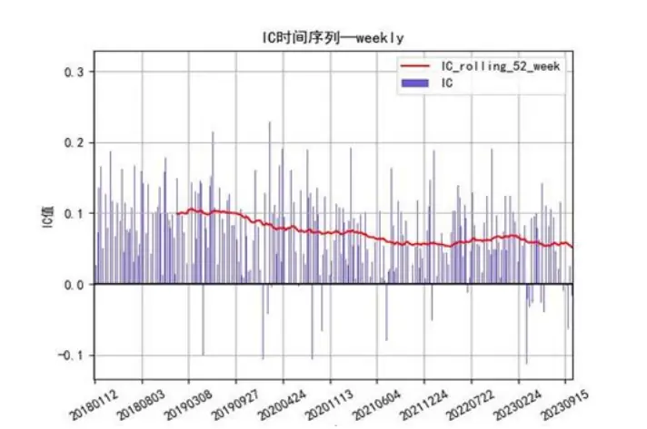
资料来源：wind，华创证券

图表 27 GRU_3 分类因子 IC 历史表现
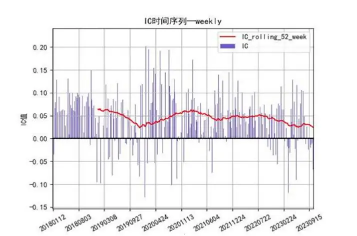
资料来源：wind，华创证券

图表 28 GRU_集成因子 IC历史表现
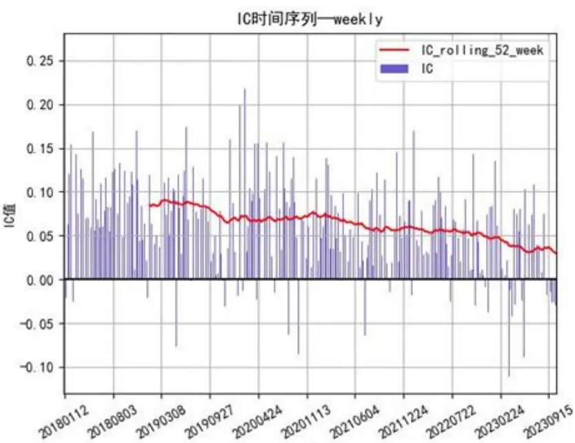
资料来源：wind，华创证券

上述四张图反映了中性化三因子的历史 IC 对比结果，从 IC 统计结果来看，GRU_50 等权因子的 IC 均值最高，达到了 7.2%，同时其年化 IC_IR 也高达 8.63，大于 0 占比达到90.5%。而集成因子的 IC 均值为 6.2%，中位数为 6.4%，其年化 IC_IR 为 7.87。

观察 IC 的时序图，可以发现 3 分类因子整体波动较大，其滚动一年 IC 均值围绕在 0.05附近波动。相比之下，GRU_50 等权因子的滚动一年 IC 均值在三者中表现最为稳定。

图表 29 GRU_50 等权因子分组超额收益曲线
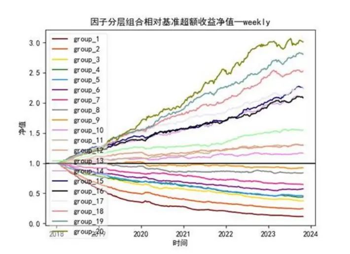
资料来源：wind，华创证券

图表 30 GRU_3分类因子分组超额收益曲线
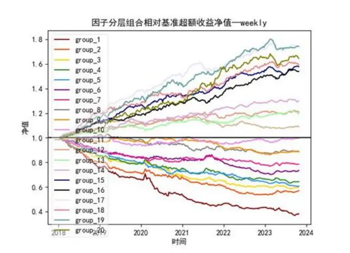
资料来源：wind，华创证券

图表 31 GRU_集成因子分组超额收益曲线
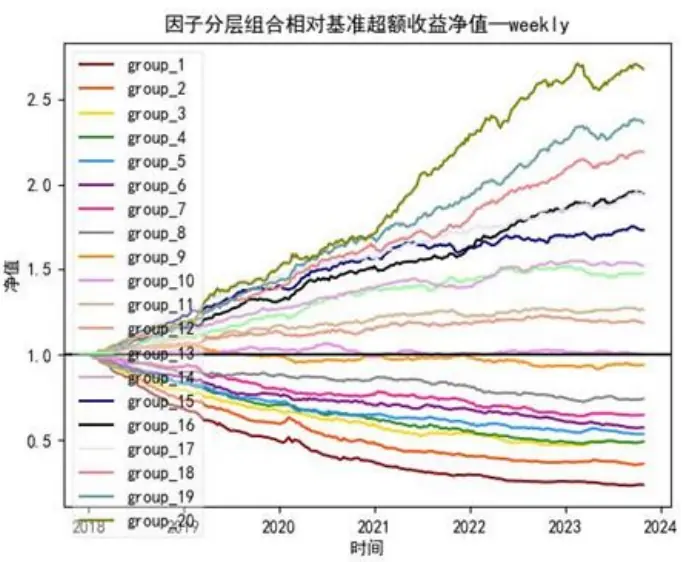
资料来源：wind，华创证券

图表 32 各因子 group_20 收益统计

| 因子 | 年化收益 | 年化波动率 | 最大回撤 | 夏普比率 | 年化超额收益 | 相对收益年化波动率 | 相对收益最大回撤 | 信息比率 | 换手率 |
| --- | --- | --- | --- | --- | --- | --- | --- | --- | --- |
| GRU_3 分类因子 | 0.1234 | 0.23 | -0.3203 | 0.63 | 0.0913 | 0.05 | -0.06 | 1.86 | 70.80 |
| GRU_50 等权因子 | 0.2474 | 0.24 | -0.2605 | 1.05 | 0.2135 | 0.06 | -0.04 | 3.45 | 74.45 |
| GRU_集成因子 | 0.2224 | 0.23 | -0.2746 | 0.98 | 0.1887 | 0.05 | -0.06 | 3.83 | 76.27 |

资料来源：wind，华创证券

以上四张图表展示了三个因子分组的收益情况对比。从超额收益曲线的区分度来看，GRU_50 等权因子与 GRU_集成因子的线性区分度较好，但 50 等权因子在 23 年多头超额收益波动较大。而 GRU_3分类因子的区分度最差。

- 多空测试结果

图表 33 GRU三因子多头组合对比
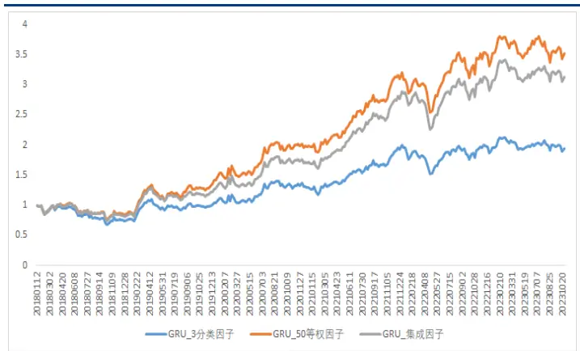
资料来源：wind，华创证券

图表 34 GRU 三因子多空组合对比
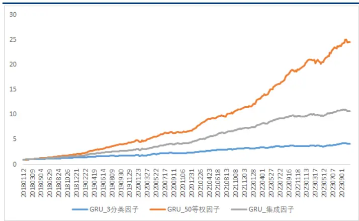
资料来源：wind，华创证券

图表 35 GRU三因子多空分组收益对比

| 因子 |  | 年化收益 | 年化波动率 | 最大回撤 | 夏普比率 |
| --- | --- | --- | --- | --- | --- |
| GRU_3分类因子 | 空头组合 | -0.1269 | 0.21 | -0.5566 | -0.53 |
|  | 多头组合 | 0.1234 | 0.23 | -0.3203 | 0.63 |
|  | 多空组合 | 0.2829 | 0.10 | -0.0894 | 2.51 |
| GRU_50 等权因子 | 空头组合 | -0.2944 | 0.23 | -0.8663 | -1.43 |
|  | 多头组合 | 0.2474 | 0.24 | -0.2605 | 1.05 |
|  | 多空组合 | 0.7547 | 0.11 | -0.0733 | 5.21 |
| GRU_集成因子 | 空头组合 | -0.1962 | 0.22 | -0.7299 | -0.90 |
|  | 多头组合 | 0.2224 | 0.23 | -0.2746 | 0.98 |
|  | 多空组合 | 0.5164 | 0.09 | -0.0643 | 4.66 |

资料来源：wind，华创证券

从多头对比结果来看，GRU_50 等权因子表现最佳，多头年化收益率达到 24.74%，最大回撤为 26.05%，夏普比率为1.05。而从多空分组的结果来看，GRU_50 等权因子的表现同样最佳，多空组合实现了年化收益率超过 75%，大幅领先其他两个因子。

## （三）宽基股票池多头组合表现

本节展示了模型在主流宽基沪深 300、中证 500、中证 1000 成分股股票池的因子多头组合表现。因子多头组合的构建方法为：在每周最后一个交易日计算宽基成分股的因子得分，选取得分最高的 10%作为持仓，按下周第一个交易日的收盘价交易。

图表 36 GRU 三因子沪深 300 内多头分组对比
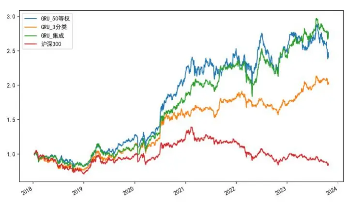
资料来源：wind，华创证券

图表 37 GRU 三因子相对沪深 300 收益对比
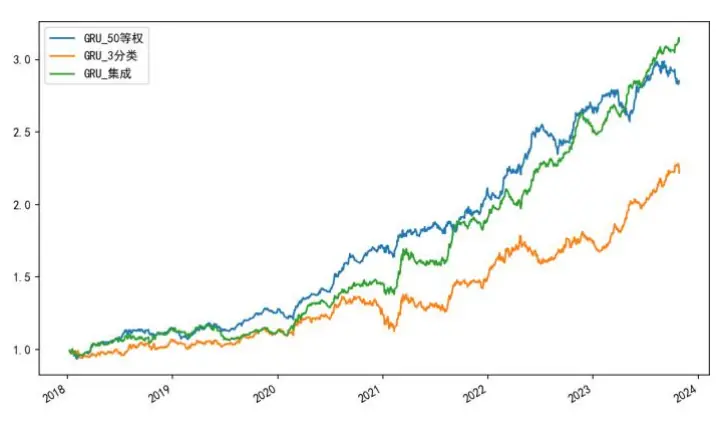
资料来源：wind，华创证券

图表 38 GRU三因子中证 500内多头分组对比
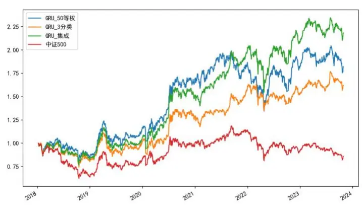
资料来源：wind，华创证券

图表 39 GRU三因子相对中证 500收益对比
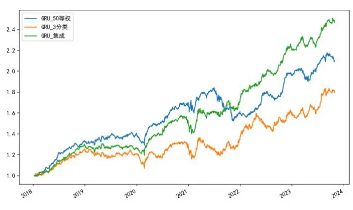
资料来源：wind，华创证券

图表 40 GRU三因子中证 1000内多头分组对比
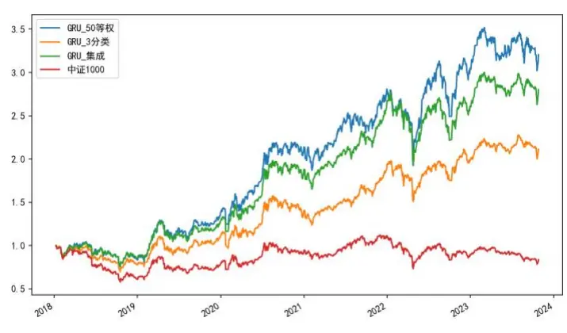
资料来源：wind，华创证券

图表 41 GRU三因子相对中证 1000收益对比
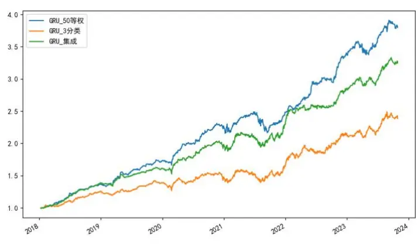
资料来源：wind，华创证券

图表 42 GRU三因子分年度相对宽基收益对比

| 年份 | 沪深300 |  |  | 中证500 |  |  | 中证1000 |  |  |
| --- | --- | --- | --- | --- | --- | --- | --- | --- | --- |
|  | GRU_50等权 | GRU_3分类 | GRU_集成 | GRU_50等权 | GRU_3分类 | GRU_集成 | GRU_50等权 | GRU_3分类 | GRU_集成 |
| 2018 | 0.15 | 0.07 | 0.14 | 0.33 | 0.25 | 0.29 | 0.37 | 0.26 | 0.39 |
| 2019 | 0.09 | 0.04 | -0.02 | 0.06 | -0.03 | -0.02 | 0.27 | 0.1 | 0.16 |
| 2020 | 0.34 | 0.11 | 0.28 | 0.21 | 0.06 | 0.2 | 0.3 | 0.06 | 0.23 |
| 2021 | 0.24 | 0.2 | 0.3 | -0.03 | 0.07 | 0.15 | 0.11 | 0.13 | 0.17 |
| 2022 | 0.27 | 0.16 | 0.31 | 0.23 | 0.16 | 0.27 | 0.36 | 0.26 | 0.21 |
| 2023 | 0.08 | 0.28 | 0.25 | 0.07 | 0.13 | 0.12 | 0.13 | 0.13 | 0.14 |

资料来源：wind，华创证券

总体来说，三个模型在沪深 300和中证 1000宽基股票池的多头组合绝对收益、超额稳定性表现均好于中证 500股票池。从收益角度看，在整个测试时间区间内，GRU50等权因子表现最佳，略优于GRU集成因子并明显优于 GRU3分类因子。近三年 GRU集成因子综合表现更优，除在2022年中证1000 股票池测试外表现均为最佳；究其原因，GRU3 分类模型在 19、20年明显弱于GRU50等权，而21年后相对表现改善，也带来了 GRU 集成模型的表现提高，同时GRU50等权在中证500股票池2021年后超额收益稳定性下降，在 21 年发生较大回撤，而对应时段 GRU3 分类、GRU 集成因子更为平稳。模型训练标签的选择，以及深度学习模型架构的设计值得更深层研究。

## 四、GRU网络在风格自适应中的应用

通过上文第三部分的分析，我们可以看到 GRU 网络在全 A 样本和小样本（宽基指数）中的分组效果表现出色。在本部分，我们将深入研究GRU 网络在合成不同风格组合方面的效果。

借鉴第一部分中巨潮风格指数的划分方式，我们构建以下六种风格指数：大盘成长、大盘质量、大盘价值、小盘成长、小盘质量、小盘价值。这些指数均采用特定的财务指标作为筛选依据，以月度频率从市场中选取 50只符合条件的股票进行组合。

图表 43 六大风格指数历史走势
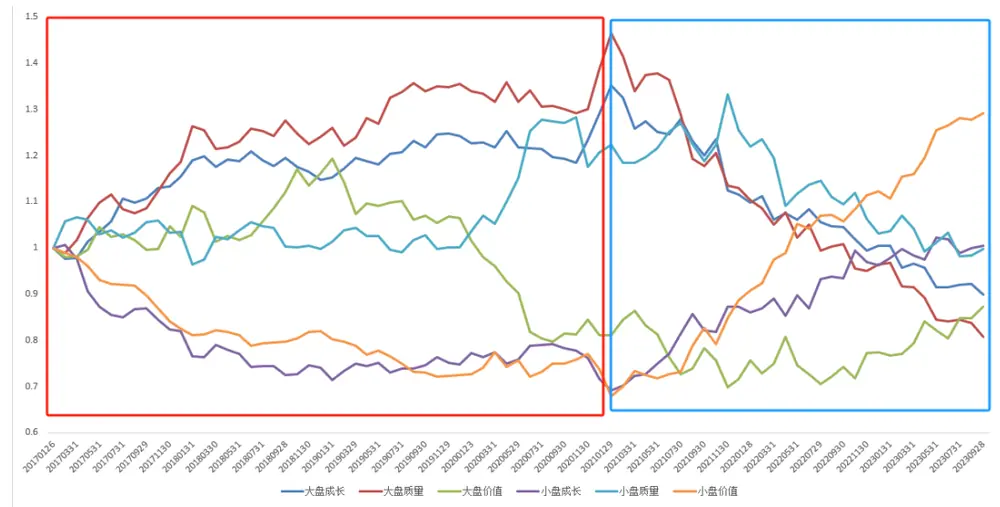
资料来源：wind，华创证券

按照我们划分结果来进行切分，近年来的风格切换同样发生在 21 年初，在 21 年之前市场偏向于大盘质量与大盘成长风格，而在 21 年之后市场则是小盘成长与小盘价值占优，其中小盘价值的表现更加出色。

## （一）风格池内因子测试

六大指数中每个指数有 50 只成分股，每期的总数最多为 300 只个股，我们先测试 GRU三因子在 300只成分股内部的效果，结果如下：

图表 44 风格池内因子IC统计结果

|  | 平均值 | 标准差 | 最小值 | 25%分位数 | 中位数 | 75%分位数 | 最大值 | 绝对值均值 | 大于0占比 | 年化IC_IR | IC 的 t统计量 |
| --- | --- | --- | --- | --- | --- | --- | --- | --- | --- | --- | --- |
| GRU_3 分类因子 | 0.067 | 0.159 | -0.38 | -0.05 | 0.07 | 0.187 | 0.433 | 0.142 | 0.661 | 3.06 | 7.26 |
| GRU_50 等权因子 | 0.077 | 0.133 | -0.374 | -0.015 | 0.079 | 0.175 | 0.424 | 0.125 | 0.712 | 4.17 | 9.91 |
| GRU_集成因子 | 0.08 | 0.138 | -0.333 | -0.003 | 0.074 | 0.178 | 0.391 | 0.129 | 0.736 | 4.19 | 9.97 |

资料来源：wind，华创证券

图表 45 GRU_50 等权因子 IC 历史表现
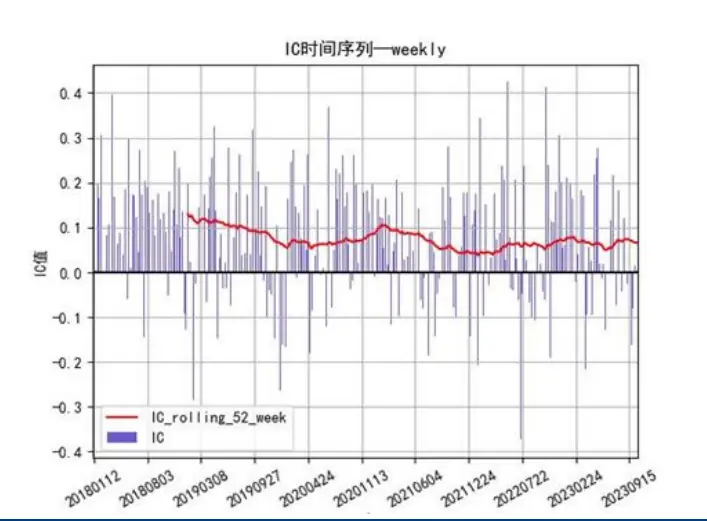
wind,

图表 46 GRU_3 分类因子 IC 历史表现
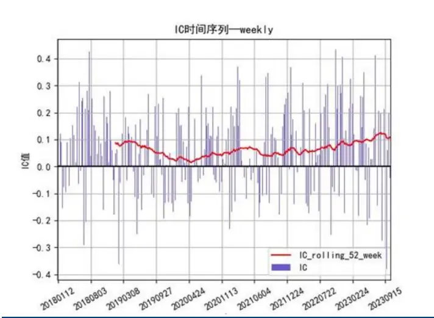
资料来源：wind，华创证券

图表 47 GRU_集成因子 IC历史表现
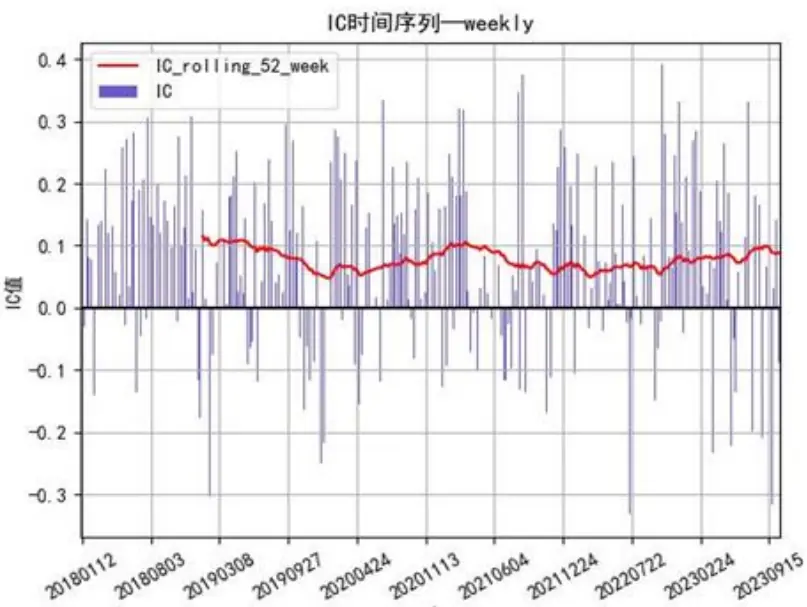
资料来源：wind，华创证券

对比风格池内三个因子的测试结果，GRU集成因子的 IC 统计结果最佳，其 IC 均值最大为 8%，同时其大于 0 的占比也最大为 73.6%。另外，该因子的 IC 也在三者中表现最稳定。

图表 48 GRU_50等权因子分组超额收益曲线
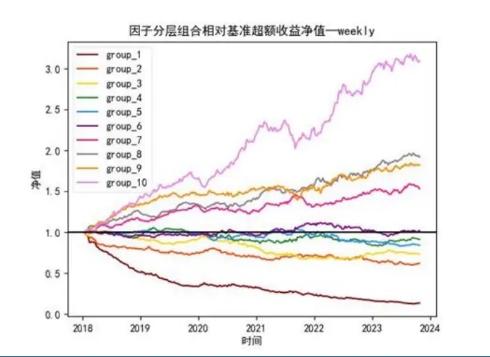
资料来源：wind，华创证券

图表 49 GRU_3分类因子分组超额收益曲线
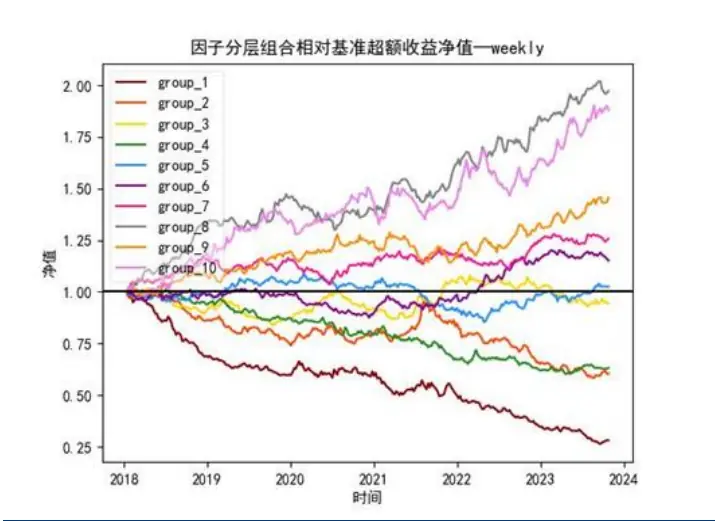
资料来源：wind，华创证券

图表 50 GRU_集成因子分组超额收益曲线
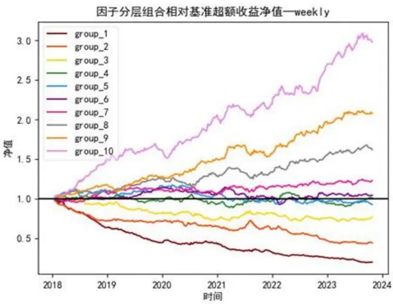
资料来源：wind，华创证券

图表 51 各因子 group_10 收益统计

| 因子 | 年化收益 | 年化波动率 | 最大回撤 | 夏普比率 | 年化超额收益 | 相对收益年化波动率 | 相对收益最大回撤 | 信息比率 | 换手率 |
| --- | --- | --- | --- | --- | --- | --- | --- | --- | --- |
| GRU_3 分类因子 | 0.1934 | 0.18 | -0.175 | 1.07 | 0.1171 | 0.11 | -0.13 | 1.21 | 56.26 |
| GRU_50 等权因子 | 0.2924 | 0.22 | -0.165 | 1.30 | 0.2196 | 0.10 | -0.14 | 2.34 | 70.66 |
| GRU_集成因子 | 0.2884 | 0.19 | -0.1835 | 1.41 | 0.2112 | 0.09 | -0.11 | 2.57 | 67.54 |

资料来源：wind，华创证券

对比三者在风格池中的线性区分度，集成因子的区分效果最好，其他两个因子多头部分的分组中均出现黏合现象。对比三者的group_10分组的统计结果，集成因子的效果同样最佳，该因子虽然年化收益略不及等权因子，但其最大回撤和换手率方面均表现更优。

## （二）风格池内选股组合

按照上部分测试结果，我们筛选 GRU_集成因子在风格池中进行选股，根据前文的统计我们注意到，如果每期直接选择因子得分最高的 50只股票(即 TOP50 组合)作为持仓，在周度调仓频率下组合换手率较高，交易成本对净值曲线的侵蚀大；另一方面，我们发现由于因子本身的 IC 较高，得分排名位于 50-80 的股票表现并不会显著落后于得分前 50的股票，因此我们从降低换手率的目的出发，采用如下的方法确定每期持有的 50只股票：

1.在调仓时点，根据因子得分对股票池中所有股票进行排序，选取排名前 80的股票作为本期候选股票池；

2.观察上期的持仓，保留上期持仓中被纳入本期候选股票池的标的，卖出不在本期候选股票池的标的；

3.经过上一步操作后，如果股票不满 50只，则从候选股票池中按得分优先原则填充至 50只，作为本期最终持仓标的；

4.按等权对50只股票进行调仓

我们将上述方法构建的组合称为 DoubleTopK组合。

具体的组合构建方式如下图所示：

图表 52 调仓方式
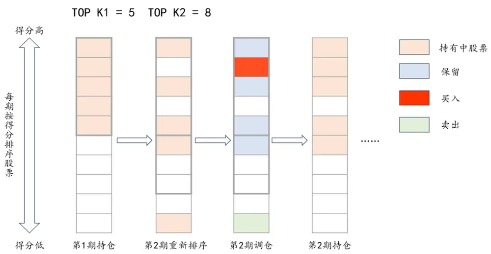
wind,

## 1、历史回溯

## 测试方法介绍

我们按照如下方法进行回测：

数据：2018年01月01日至 2023 年11月20日的风格指数基准池。

调仓频率：周度调仓，调仓日为每周的第一个交易日，考虑停牌、涨跌停对交易影响。

仓位控制：等权调仓，同时个股的最大持仓比例不超过 5%。

调仓规则：采用DoubleTopK方式进行调仓。

策略基准：我们使用了中证 1000 作为比较基准。

资金在选出股票上平均分配，交易费用买卖各收千分之 1.5。

- 测试结果

图表 53 策略净值
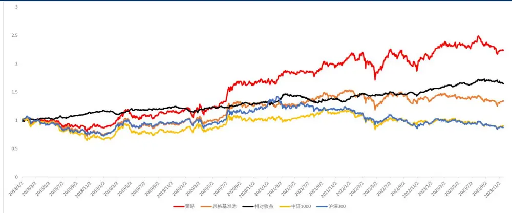
资料来源：wind，华创证券

上图表示 2018年来策略、风格基准池、沪深 300、中证1000级策略相对风格基准池的超额收益。其中风格基准池我们按照每个月的各风格筛选的成分股，在次月初等权买入的方式构建组合。

可以发现策略长期来看稳定跑赢风格基准及沪深 300、中证1000。策略组合2018年来年化收益率 15.2%，最大回撤 23.4%，换手率 42 倍。相比之前因子的测试结果，此时的换手率大幅下降，同时收益率也有所下降。风格基准组合 2018 年来年化收益率 5.3%，最大回撤 31.2%，策略相对收益9.9%。

图表 54 策略风险收益

| 年份 | 策略组合 | 基准 | 超额 | 相对波动率 | 信息比 |
| --- | --- | --- | --- | --- | --- |
| 2018 | -0.1193 | -0.2543 | 0.1350 | 0.06 | 2.88 |
| 2019 | 0.3747 | 0.3284 | 0.0463 | 0.06 | 1.26 |
| 2020 | 0.3978 | 0.2777 | 0.1201 | 0.08 | 2.45 |
| 2021 | 0.2359 | 0.1870 | 0.0489 | 0.10 | 1.12 |
| 2022 | -0.0101 | -0.1198 | 0.1097 | 0.07 | 2.58 |
| 2023 | 0.0507 | -0.0194 | 0.0702 | 0.06 | 1.39 |

资料来源：wind，华创证券

上图表表示策略风险收益分析结果。在过去六年中，该策略持续优于风格基准。通过对比发现策略在市场大幅回撤期间的表现非常优异。以2018年为例，策略仅下跌了11.93%，在所有主动型基金中的排名达到了前 6%（即 94%分位数）。2022 年，策略的下跌幅度仅为 1.01%，在主动型基金中的表现更是位列前 3%（即 97.95%分位数）。而在 2023 年至今，策略实现了 5.07%的收益，排名高达前 5%（即95.1%分位数）。

然而，在 2019年和2020年的牛市期间，策略的表现相对平平，排名分位数分别为 28.65%和18.31%。这表明虽然策略在市场下跌时具有较强的防御性，但在市场上涨期间可能未能充分捕捉上行潜力。

## 策略分析

图表 55 行业分布
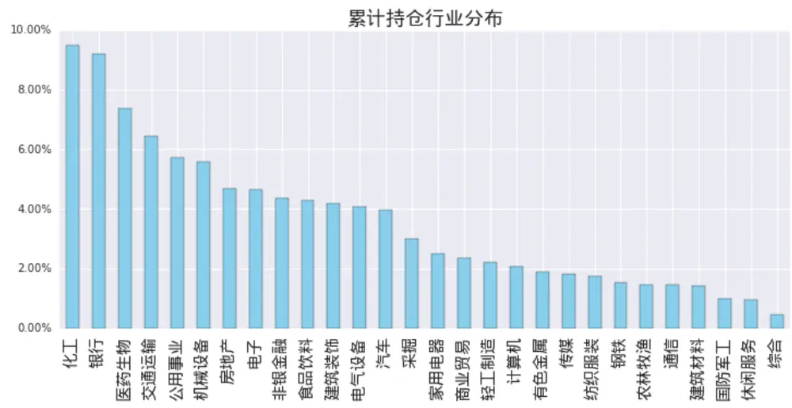
资料来源：wind，华创证券

未有单一行业的平均仓位超过 10%。在持仓行业中，化工、银行、医药、交通运输这四个行业的平均仓位最高，均超过 6%。其次，公用事业、机械设备、房地产、电子、非银金融、食品饮料、建筑装饰、电气设备等行业持仓比例也较高，其平均仓位均超过 4%。多元化的投资组合策略有助于分散特定行业或市场风险，从而提高整体投资组合的稳定性和抗风险能力。

图表 56 市值分布
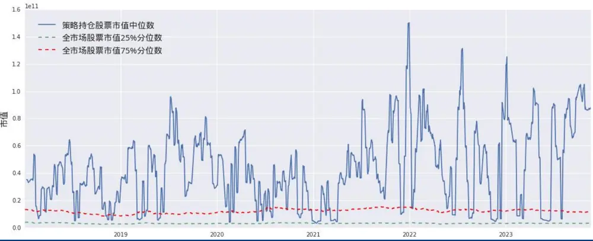
资料来源：wind，华创证券

从风格基准池的构成来看，其中有一半的成分为大市值的股票，因此策略的历史持仓有超过一半的仓位为大市值股票，历史的市值中位数为 385亿。统计结果来看，策略在 80%以上的时间持仓个股的市值中位数均在 100亿以上。

- 风格变迁

图表 57 大小盘风格轮动图
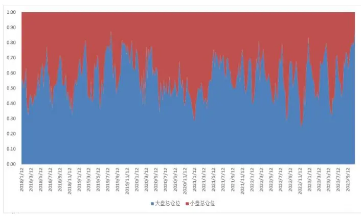
资料来源：wind，华创证券

图表 58 六种风格轮动图
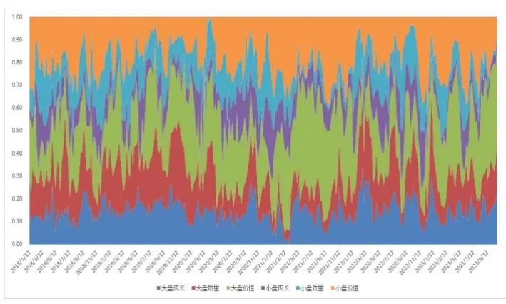
资料来源：wind，华创证券

所述的两张图表展示了策略在历史上各个时期在不同风格行业的仓位分布，其中左图代表大盘和小盘股的总仓位变化。可以观察到，策略在历史上对大盘股的平均仓位相对较高。具体而言，自 2018 年以来，大盘股的历史平均仓位为 56.79%，中位数为 56%。此外，大盘股的历史仓位在极端情况下，最高达到 88%，最低降至 24%。

虽然在构建风格指数时我们采用了大盘股和小盘股等权的设计理念，但从策略的最终结果来看，模型倾向于筛选出更高比例的大盘股。

图表 59 topN收益行业仓位大于基准仓位占比
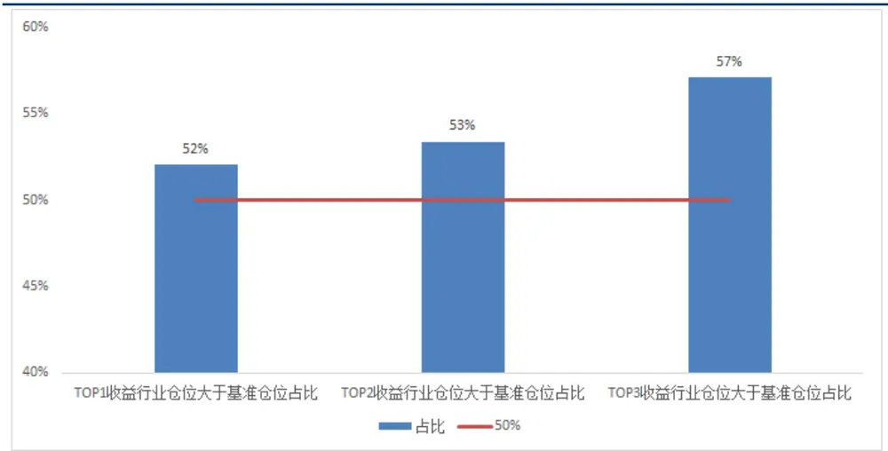
资料来源：wind，华创证券

上图表示组合每期top1、top2、top3 收益行业的总仓位中大于对应基准持仓比例的占比，统计结果来看都超过 50%，其中 top3 对应的占比最大，接近 57%。表明 GRU 网络解决了风格组合之间的结合问题，GRU网络通过模型的训练，自适应市场风格的变迁。

## 2、最新 TOP50个股名单

图表 60 TOP50 个股名单

| 股票代码 | 简称 | 中信一级行业 | 市值(亿) | 股票代码 | 简称 | 中信一级行业 | 市值(亿) |
| --- | --- | --- | --- | --- | --- | --- | --- |
| 600803.SH | 新奥股份 | 电力及公用事业 | 484.90 | 600368.SH | 五洲交通 | 交通运输 | 50.89 |
| 600681.SH | 百川能源 | 电力及公用事业 | 55.91 | 002040.SZ | 南京港 | 交通运输 | 35.81 |
| 603689.SH | 皖天然气 | 电力及公用事业 | 42.47 | 601088.SH | 中国神华 | 煤炭 | 6260.57 |
| 688303.SH | 大全能源 | 电力设备及新能源 | 653.56 | 000876.SZ | 新希望 | 农林牧渔 | 414.57 |
| 000922.SZ | 佳电股份 | 电力设备及新能源 | 60.06 | 600660.SH | 福耀玻璃 | 汽车 | 977.09 |
| 605066.SH | 天正电气 | 电力设备及新能源 | 36.77 | 603319.SH | 湘油泵 | 汽车 | 39.51 |
| 603290.SH | 斯达半导 | 电子 | 316.45 | 603121.SH | 华培动力 | 汽车 | 31.52 |
| 600048.SH | 保利发展 | 房地产 | 1226.97 | 000026.SZ | 飞亚达 | 商贸零售 | 49.37 |
| 601211.SH | 国泰君安 | 非银行金融 | 1341.92 | 600519.SH | 贵州茅台 | 食品饮料 | 22112.60 |
| 002736.SZ | 国信证券 | 非银行金融 | 912.22 | 000568.SZ | 泸州老窖 | 食品饮料 | 2973.42 |
| 000708.SZ | 中信特钢 | 钢铁 | 712.15 | 002304.SZ | 洋河股份 | 食品饮料 | 1745.97 |
| 002179.SZ | 中航光电 | 国防军工 | 839.96 | 000596.SZ | 古井贡酒 | 食品饮料 | 1339.42 |
| 300066.SZ | 三川智慧 | 机械 | 55.02 | 600600.SH | 青岛啤酒 | 食品饮料 | 1010.76 |
| 002722.SZ | 物产金轮 | 机械 | 31.38 | 603369.SH | 今世缘 | 食品饮料 | 661.25 |
| 603331.SH | 百达精工 | 机械 | 26.99 | 600084.SH | 中信尼雅 | 食品饮料 | 91.25 |
| 603227.SH | 雪峰科技 | 基础化工 | 77.16 | 600050.SH | 中国联通 | 通信 | 1418.46 |
| 605077.SH | 华康股份 | 基础化工 | 52.11 | 600276.SH | 恒瑞医药 | 医药 | 2971.34 |
| 601668.SH | 中国建筑 | 建筑 | 2075.02 | 300896.SZ | 爱美客 | 医药 | 644.75 |
| 601669.SH | 中国电建 | 建筑 | 859.59 | 601939.SH | 建设银行 | 银行 | 15950.70 |
| 601618.SH | 中国中冶 | 建筑 | 650.72 | 601288.SH | 农业银行 | 银行 | 12774.38 |
| 603017.SH | 中衡设计 | 建筑 | 28.39 | 601988.SH | 中国银行 | 银行 | 11893.27 |
| 601816.SH | 京沪高铁 | 交通运输 | 2489.70 | 601328.SH | 交通银行 | 银行 | 4292.39 |
| 601919.SH | 中远海控 | 交通运输 | 1586.21 | 600000.SH | 浦发银行 | 银行 | 2010.62 |
| 601111.SH | 中国国航 | 交通运输 | 1283.10 | 600016.SH | 民生银行 | 银行 | 1694.38 |
| 000755.SZ | 山西路桥 | 交通运输 | 68.82 | 600015.SH | 华夏银行 | 银行 | 927.84 |

wind,  2023.12.1

从最新一期的持仓来看，其中大盘股的整体总个数 33 只小盘股个数 17 只。另外，其中不乏很多耳熟能详的机构重仓股，如贵州茅台、泸州老窖、古井贡酒、青岛啤酒等。

## 五、总结

股市场的风格轮动长期以来是投资者关注的重点。根据研究经验，我们将 股市场的风格细分为六类：大盘成长、大盘质量、大盘价值、小盘成长、小盘质量、小盘价值。近年来 A 股市场走势分为两个阶段：2018 年底至 2021 年初，市场主导风格为大盘质量和大盘成长；21 年之后，小盘成长和小盘价值成为主流，特别是小盘价值表现尤为突出。本文旨在探讨如何运用GRU 网络对这六大风格进行有效整合，实现风格自适应的研究目标。

通过对 GRU 网络不同训练方式生成因子的测试对比发现，无论是原始因子还是中性化后的因子，GRU_50 等权因子在全A 范围内的测试效果更为显著。原始GRU_50 等权因子在单因子 IC 均值达到9.9%，中位数为 9.5%，年化IC_IR 为7.13。此外，其多头组的年化收益率为 32.93%，最大回撤为 21.78%。

在宽基指数上的测试中，GRU_50 等权因子和 GRU_集成因子在沪深 300 指数上均表现出色；GRU_集成因子在中证500上测试效果更佳，而 GRU_50 等权因子在中证1000上表现最佳。对比这三个因子在宽基指数上多头组的年度收益，GRU_50 等权因子在 2021年前整体表现更佳，而 21年后GRU_集成因子的效果最为显著。

在风格基准池中对比三个因子的测试结果，GRU_集成因子的表现最为优越。其单因子IC均值为 8%，中位数为 7.4%，多头分组的夏普比率也在三者中最为突出。因此，我们采用GRU_集成因子在基准池中进行每期选股，策略自2018年以来的年化收益率为15.2%，最大回撤为 23.4%，换手率达42倍。历史数据显示，该策略稳定地超越基准及沪深 300、中证1000、中证500指数。

## 六、风险提示

策略基于历史数据回测，不保证未来数据的有效性。

## 七、参考文献

[1]Cho, Kyunghyun, et al. "Learning phrase representations using RNN encoder-decoder for statistical machine translation." arXiv preprint arXiv:1406.1078 (2014).

[2]De Prado, Marcos Lopez. Advances in financial machine learning. John Wiley & Sons, 2018.

[3] Leippold, Markus, Qian Wang, and Wenyu Zhou. "Machine learning in the Chinese stock market." Journal of Financial Economics 145.2 (2022): 64-82.

## 金融工程组团队介绍

组长、首席分析师：王小川

同济大学管理学博士。2017年加入华创证券研究所。

高级分析师：秦玄晋

上海对外经贸大学硕士。2018年加入华创证券研究所。

助理研究员：杨宸祎

美国伊利诺伊大学香槟分校会计学、金融工程学硕士，CFA。2021年加入华创证券研究所。

助理研究员：黄河

东华大学工学博士，FRM。2023年加入华创证券研究所。

助理研究员：洪远

华南理工大学金融硕士。2023年加入华创证券研究所。

## 华创证券机构销售通讯录

| 地区 | 姓名 | 职务 | 办公电话 | 企业邮箱 |
| --- | --- | --- | --- | --- |
| 北京机构销售部 | 张昱洁 | 副总经理、北京机构销售总监 010 | -63214682 | zhangyujie@hcyjs.com |
|  | 张菲菲 | 北京机构副总监 | 010-63214682 | zhangfeifei@hcyjs.com |
|  | 刘懿 | 副总监 | 010-63214682 | liuyi@hcyjs.com |
|  | 侯春钰 | 资深销售经理 | 010-63214682 | houchunyu@hcyjs.com |
|  | 过云龙 | 高级销售经理 | 010-63214682 | guoyunlong@hcyjs.com |
|  | 蔡依林 | 高级销售经理 010 | -66500808 | caiyilin@hcyjs.com |
|  | 刘颖 | 高级销售经理 | 010-66500821 | liuying5@hcyjs.com |
|  | 顾翎蓝 | 高级销售经理 | 010-63214682 | gulinglan@hcyjs.com |
|  | 车一哲 | 销售经理 |  | cheyizhe@hcyjs.com |
| 深圳机构销售部 | 张娟 | 副总经理、深圳机构销售总监 0755 | -82828570 | zhangjuan@hcyjs.com |
|  | 汪丽燕 | 高级销售经理 | 0755-83715428 | wangliyan@hcyjs.com |
|  | 张嘉慧 | 高级销售经理 0755 | -82756804 | zhangjiahui1@hcyjs.com |
|  | 董姝彤 | 销售经理 | 0755-82871425 | dongshutong@hcyjs.com |
|  | 王春丽 | 销售经理 | 0755-82871425 | wangchunli@hcyjs.com |
| 上海机构销售部 | 许彩霞 | 总经理助理、上海机构销售总监0 | 21-20572536 | xucaixia@hcyjs.com |
|  | 官逸超 | 上海机构销售副总监 021 | -20572555 | guanyichao@hcyjs.com |
|  | 黄畅 | 上海机构销售副总监 | 021-20572257-2552 | huangchang@hcyjs.com |
|  | 吴俊 | 资深销售经理 021 | -20572506 | wujun1@hcyjs.com |
|  | 张佳妮 | 高级销售经理 021 | -20572585 | zhangjiani@hcyjs.com |
|  | 蒋瑜 | 高级销售经理 021 | -20572509 | jiangyu@hcyjs.com |
|  | 施嘉玮 | 高级销售经理 021 | -20572548 | shijiawei@hcyjs.com |
|  | 朱涨雨 | 销售助理 021 | -20572573 | zhuzhangyu@hcyjs.com |
|  | 李凯月 | 销售助理 |  | likaiyue@hcyjs.com |
|  | 张玉恒 | 销售助理 |  | zhangyuheng@hcyjs.com |
| 广州机构销售部 | 段佳音 | 广州机构销售总监 0755 | -82756805 | duanjiayin@hcyjs.com |
|  | 周玮 | 销售经理 |  | zhouwei@hcyjs.com |
|  | 王世韬 | 销售经理 |  | wangshitao1@hcyjs.com |
| 私募销售组 | 潘亚琪 | 总监 021 | -20572559 | panyaqi@hcyjs.com |
|  | 汪子阳 | 副总监 021 | -20572559 | wangziyang@hcyjs.com |
|  | 江赛专 | 资深销售经理 0755 | -82756805 | jiangsaizhuan@hcyjs.com |
|  | 汪戈 | 高级销售经理 021 | -20572559 | wangge@hcyjs.com |
|  | 宋丹玙 | 销售经理 021 | -25072549 | songdanyu@hcyjs.com |

## 华创行业公司投资评级体系

基准指数说明：

A股市场基准为沪深 300指数，香港市场基准为恒生指数，美国市场基准为标普 500/纳斯达克指数。

公司投资评级说明：

强推：预期未来 6个月内超越基准指数 20%以上；

推荐：预期未来 6个月内超越基准指数 10%－20%；

中性：预期未来 6个月内相对基准指数变动幅度在-10%－10%之间；

回避：预期未来 6个月内相对基准指数跌幅在 10%－20%之间。

## 行业投资评级说明：

推荐：预期未来 3-6个月内该行业指数涨幅超过基准指数 5%以上；

中性：预期未来 3-6个月内该行业指数变动幅度相对基准指数-5%－5%；

回避：预期未来 3-6个月内该行业指数跌幅超过基准指数 5%以上。

## 分析师声明

每位负责撰写本研究报告全部或部分内容的分析师在此作以下声明：

分析师在本报告中对所提及的证券或发行人发表的任何建议和观点均准确地反映了其个人对该证券或发行人的看法和判断；分析师对任何其他券商发布的所有可能存在雷同的研究报告不负有任何直接或者间接的可能责任。

本报告涉及股票新希望(000876)，根据深圳证券交易所股票上市规则，本公司与上市公司存在关联关系。

本报告涉及股票贵州茅台(600519)，根据上市公司公告，贵州茅台的控股股东茅台集团持有本公司的控股股东华创云信 3.97%的股份。

本报告涉及股票民生银行(600016)，根据上市公司公告，民生银行副董事长刘永好为本公司的控股股东华创云信关联自然人。

## 免责声明

本报告仅供华创证券有限责任公司（以下简称“本公司”）的客户使用。本公司不会因接收人收到本报告而视其为客户。

本报告所载资料的来源被认为是可靠的，但本公司不保证其准确性或完整性。本报告所载的资料、意见及推测仅反映本公司于发布本报告当日的判断。在不同时期，本公司可发出与本报告所载资料、意见及推测不一致的报告。本公司在知晓范围内履行披露义务。

报告中的内容和意见仅供参考，并不构成本公司对具体证券买卖的出价或询价。本报告所载信息不构成对所涉及证券的个人投资建议，也未考虑到个别客户特殊的投资目标、财务状况或需求。客户应考虑本报告中的任何意见或建议是否符合其特定状况，自主作出投资决策并自行承担投资风险，任何形式的分享证券投资收益或者分担证券投资损失的书面或口头承诺均为无效。本报告中提及的投资价格和价值以及这些投资带来的预期收入可能会波动。

本报告版权仅为本公司所有，本公司对本报告保留一切权利。未经本公司事先书面许可，任何机构和个人不得以任何形式翻版、复制、发表、转发或引用本报告的任何部分。如征得本公司许可进行引用、刊发的，需在允许的范围内使用，并注明出处为“华创证券研究”，且不得对本报告进行任何有悖原意的引用、删节和修改。

证券市场是一个风险无时不在的市场，请您务必对盈亏风险有清醒的认识，认真考虑是否进行证券交易。市场有风险，投资需谨慎。

## 华创证券研究所

| 北京总部 | 广深分部 | 上海分部 |
| --- | --- | --- |
| 地址：北京市西城区锦什坊街26号 恒奥中心C 座 3A | 地址：深圳市福田区香梅路1061号中投国 际商务中心A 座19楼 | 地址：上海市浦东新区花园石桥路33号 花旗大厦 12 层 |
| 邮编：100033 传真：010-66500801 | 邮编：518034 | 邮编：200120 |
| 会议室：010-66500900 | 传真：0755-82027731 会议室：0755-82828562 | 传真：021-20572500 会议室：021-20572522 |