【专题报告】

# AI+HI 系列（2）：PatchTST、TSMixer、

# ModernTCN时序深度网络构建量价因子

## 前言

深度学习强大的表征能力使其在多个领域取得了显著成果，在时序领域同样也有许多模型选择。本文探索了 PatchTST、TSMixer、ModernTCN 三个近年的时序深度学习模型在因子挖掘上的运用，它们采用了 Patch+通道独立的模型设计，骨干网络分别基于自注意力、MLP、CNN 机制。

## 模型特点

本文介绍的深度学习模型以多变量时序类数据为出发点，相比于基于 RNN 类的时序模型，最显著的区别在于采用了通道独立的设计，即将多变量时间序列先拆为多个单变量时间序列，骨干网络的模块分别学习单变量序列的时序、特征交互以及跨变量的信息交互。这些时序网络在骨干网络的设计上，融合了视觉领域以及 Transformer 的骨干网络思路和方法，具有一定参考意义。

## 因子测试对比

鉴于不同领域时序任务的多样性，我们进一步探索了 PatchTST、Transformer、TSMixer、ModernTCN 模型在量价数据集的泛化能力。在中证全指股票池下，四个模型生成的量价周频因子 10 日 RankIC 均达到了 10%以上，TSMixer 和ModernTCN的整体表现略优于 PatchTST和 Transformer: 4 个周度因子的区间IC 均值分别为 10.6%、10.8%、11.0%、10.7%，ICIR 为 0.83、0.82、0.91、0.88。不同模型 20 分组的 TOP 组超额收益差异较大，四个模型 TOP 组的年化超额收益分别为 21%、14.28%、22.39%、18.18%；模型设计差异最大的两个模型的 TOP 组选股重叠度约为 61%；

在 2024 年初至 2 月 8 日区间，四个模型的 TOP 组超额收益最大回撤表现不一，分别为 4%、5%、7%、21%，ModernTCN 模型回撤幅度明显大于其他模型。

## 模型消融测试

对 TSMixer 和 ModernTCN 模型进行模块剔除实验，无 Patch+通道混合模型因子的 RankIC 出现轻微下降，但 TOP 组超额收益表现出明显差异，TOP 组年化收益分别降低了 8.07%、5.25%。骨干网络的设计对模型综合表现有重要影响。

## 风险提示：

策略基于历史数据回测，不保证未来数据的有效性。深度学习模型存在过拟合风险。深度学习模型受随机数影响。本文的模型实现和相关文献不完全相同。

## 华创证券研究所

证券分析师：秦玄晋

电话：021-20572522

邮箱：qinxuanjin@hcyjs.com

执业编号：S0360522080005

证券分析师：王小川

电话：021-20572528

邮箱：wangxiaochuan@hcyjs.com

执业编号：S0360517100001

## 相关研究报告

《AI+HI 系列：GRU 网络在风格自适应中的创新与应用》

2023-12-04

《量化选股系列——机构情绪与个人情绪》

2023-09-05

《ChatGLM 助力量化选股》

2023-06-14

《人工智能助力量化投资——ChatGLM 介绍》2023-06-14《基于 canslim 与 FESC 的沪深 300 指数增强策略》

2023-03-07

《行业轮动系列——FESC 行业轮动投资框架1.0》

2022-09-07

《CANSLIM 3.0 投资法——成长与价值轮动》

《CANSLIM 2.0 投资法—华创金工大师系列成长型之一》

2022-06-17

2021-10-16

## 投资主题

## 报告亮点

深度学习模型在多个领域取得了显著成果，本篇报告介绍了近年关于时序领域的深度学习模型相关研究，并将其用于量价因子挖掘。时序深度学习模型在模块设计上有诸多方案，其中不乏值得借鉴的模块设计，为广大投资者提供新的研究思路，助力量化投资的发展。

## 投资逻辑

时序类数据在量化投资领域处处可见，因此为时间序列设计的深度学习模型具有相当的应用潜力。合理的深度学习网络设计对后续的选股结果能产生显著影响。因此，本文初步尝试了数个泛化性较强的深度时序网络，探索深度学习模型在量化领域上的运用。

## 一、动机

时序类数据广泛存在各个领域中，传统基于统计的方法需要专业的先验知识以及人工特征处理，基于机器学习、深度学习的方法减轻了这种负担，它们以数据驱动的方式学习时间序列中的潜在模式，提供了富有吸引力的方案。

近年，许多基于深度时序模型的工作被提出，依托于神经网络强大的表示学习能力以及不断优化的模型设计，深度学习网络在解决长期依赖性和动态变化等问题上有了更强的能力，在多个领域的时序任务展现出了优秀的性能，包括但不限于金融市场、气象、交通等。

尽管许多时序深度模型都声称取得了重大成就，但相关工作的结论是否适用于其研究外的数据集、应用场景，模型的泛化能力，是值得思考的。

在本文中，我们以深度学习模型骨干网络中的所用的基础架构为分类基础：

RNN：循环神经网络是一个经典的处理序列数据的网络架构，它紧凑地“记忆”过去信息并利用更新的数据进行迭代，因此也常被用于时间序列任务。

Transformer：Transformer模型基于注意力机制，可以同时处理输入序列的所有位置，并能捕捉序列中长距离的依赖关系。Transformer 模型在 NLP 领域取得了巨大成功后，其变体模型被广泛尝试应用于图像、时序等任务中。

CNN：CNN最初是为处理图像数据设计的，但它也可以用于时间序列数据，例如通过一维卷积操作，CNN能够实现捕捉序列中的局部特征。

MLP：一些研究指出，通过合理设计的 MLP 架构的简易模型，也能够达到与复杂模型相媲美的性能水平。

在我们之前的报告中采用了基于RNN的GRU 网络进行量价因子挖掘任务，因此在本篇中我们从剩下的三类中——Transformer、CNN、MLP，分别选择近年较为流行的时序模型继续进行探索；

事实上，基于 Transformer、CNN、MLP 的时序模型数之不尽，最终我们选择 PatchTST、ModernTCN、TSMixer 作为代表，它们的骨干网络设计思路上相似，采用了近年时序网络流行的做法，有一定借鉴意义；其次，每个模型以对应的基础架构为主体，分别仅用自注意力、卷积、MLP 完成信息提取，而不使用不同类别堆叠；最后，模型设计简洁，便于添加额外组件。

## 二、模型介绍

在我们之前的报告《GRU网络在风格自适应中的创新与应用》中，我们尝试了基于RNN的GRU 模型，GRU由Cho 等在2014 年提出，它在每个时间点上通过门控单元自适应地捕获序列数据中的依赖关系，在股价序列的因子挖掘任务中是一个常见的基线模型。

图表 1 经典RNN网络
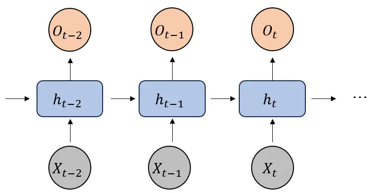
资料来源：华创证券整理

本篇介绍的PatchTST、ModernTCN、TSMixer模型，它们为多变量时间序列设计，采用了近年时序网络常见的Patch+通道独立的设计，并在骨干网络中用多个模块分别实现时序信息交互的学习、通道/特征的信息交互的学习。

本篇介绍三个模型的大体流程可以简化为：

$$
\begin{array}{c}{{X_{emb}=Embedding(x_{in})}}\\{{\ }}\\{{X_{h}=Temporal(X_{emb})}}\\{{\ }}\\{{X_{h}=Channel(X_{h})}}\\{{\ }}\\{{X_{f}=Head(X_{h})}}\end{array}
$$

上式对应的模型流程为：1、时序嵌入 2、提取时序维度信息 3、提取特征（或通道）维度信息 4、下游具体任务预测头。

其中，第二、第三步在模型骨干网络中体现，PatchTST、TSMixer、ModernTCN 的实现思路相似；第一步的时序嵌入大同小异。

在下面的章节，我们首先介绍时序嵌入方法，再对PatchTST、TSMixer 、ModernTCN的骨干网络进行单独介绍。

## （一）时序嵌入

Embedding（嵌入）是深度学习中一种表示技术，例如自然语言处理中，通常将单个词转为“词向量”的形式。词被映射为固定维度的向量后，模型能够学习词与词之间的更为复杂的模式和关系。时序数据在输入深度学习模型前同样也需要进行嵌入，获取时间序列的向量表征。和自然语言的不同之处在于，现实中的时序数据大多是多变量时间序列，自然语言可以视为单变量时间序列。

## 1、Patch

Patch 指将输入数据分为多个局部区域，在视觉领域有较多运用。例如一张图片按一定窗口大小切分成多个子区域，将子区域排列后转为序列数据，每个区域可以看作类似自然语言序列中的一个token，进而能使用序列模型对图片进行建模：

图表 2 图像模型中的 Patch
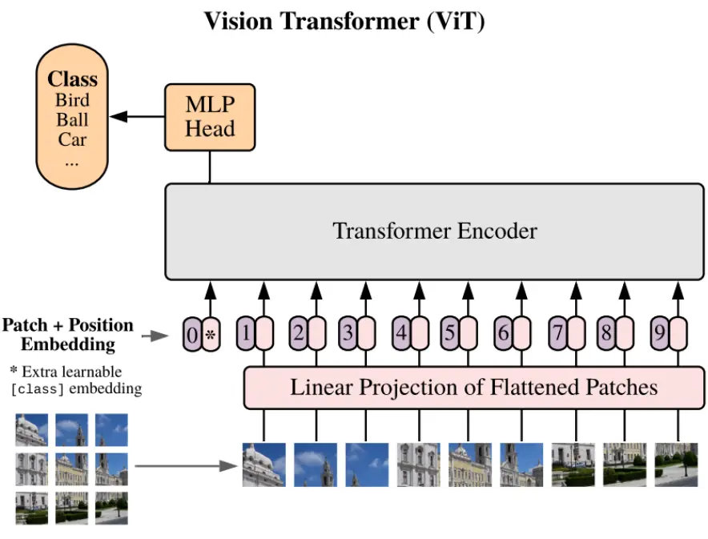
Dosovitskiy, Alexey, et al. "An image is worth 16x16 words: Transformers for image recognition at scale."

本篇介绍的时序模型均在Embedding 时采用了Patch的时序处理方式。

Patch 在时间序列类数据的方法类似于图像：在原始时间序列上使用一个固定大小为P 的窗口进行滑动截取，窗口每次滑动的步长为 S，由此原始时间序列被拆分为若干个子序列，每个子序列包含 P 个时点的数据，子序列被视为一个 token，映射至目标嵌入维度。使用Patch 处理的优势在于：

Patch 后新序列长度近似为原序列的 1/S，降低了计算成本；

有研究提出时序类数据单独一个时点的信息量较少，而 Patch 实质上实现了局部信息提取，使单个 token 能包含更多信息；

鉴于上述优点，Patch成为了近年的时序模型中常见的做法。

## 2、通道独立

对多变量时序任务，“通道”指输入序列的变量，而“特征”表示序列 token经过Embedding后在骨干网络中的隐状态维度。通道独立（channel-independent）是近年网络的一类处理方法，表现为将多变量序列拆分多个单变量序列，共享同一个网络，深度学习模型对单变量序列输入产生对应的单变量输出序列。最近相关工作（例如，Nie 等人，2022；Zeng等人，2023）表明，通道独立的模型设计优于通道混合模型。

通道独立的设计在 Embedding 阶段做法为，每个输入的 token 只包含来自单个变量（通道）的信息。与通道独立对应的概念是通道混合，每个输入token含有来自多个变量的信息。下图简单对比了通道独立以及通道混合的时序 Embedding 方法，二者差异最明显之处在于一个token构成来自多个变量还是单个变量：

图表 3 多变量时序 Embedding
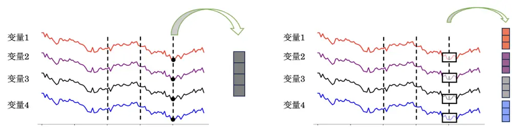
资料来源：华创证券整理

假设原始序列的长度为T，变量数为 M，目标嵌入特征维度为 D；

上图左半部分是通道混合处理方法，输入数据形状为(M,T)，每个时点上 M 个变量的取值被视为一个 token，Embedding 步骤后，数据形状变为(D,T)；

右图是本篇报告涉及模型的通道独立处理方法，输入数据形状为(M,T)，经过Patch处理后，新序列长度为N，每个变量的每个子序列被视为一个token 进行映射，因此Embedding步骤后数据形状为(M,D,N)。

图表 4 通道混合与通道独立
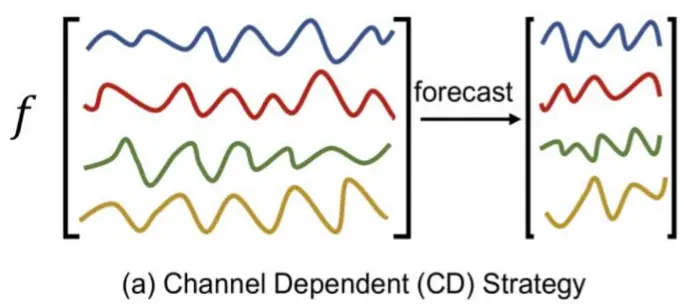

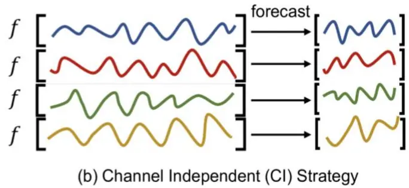
Han, Lu, Han-Jia Ye, and De-Chuan Zhan. "The Capacity and Robustness Trade-off: Revisiting the Channel Independent Strategy for Multivariate Time Series Forecasting."

在通道独立下，多变量序列被拆分为多条“单变量”序列并输入共同的骨干网络（backbone）中，骨干网络学习时序、特征、通道（变量）间的依赖关系。每条“单变量”序列输入骨干网络后产生对应预测输出，在骨干网络输出保留了一个通道维度（如图（4）所示）。在下面的章节，我们继续介绍不同骨干网络如何实现上述的信息提取流程。

## （二）PatchTST

PatchTST 由 Nie 等 2022 年提出，是一种基于 Transformer 的时序模型，它将同样基于Transformer的视觉模型ViT 的思想运用在了时序类数据上。

## 1、Transformer

Transformers 在论文 Vaswani, Ashish, et al. "Attention Is All You Need."中首次提出，首先被广泛应用于NLP 任务，近年模型的核心之一是自注意力机制（Self-Attention），它通过自注意力机制使序列中的任何部分进行交互，从而有效地捕获长距离依赖关系。

图表 5 Transformer 模型
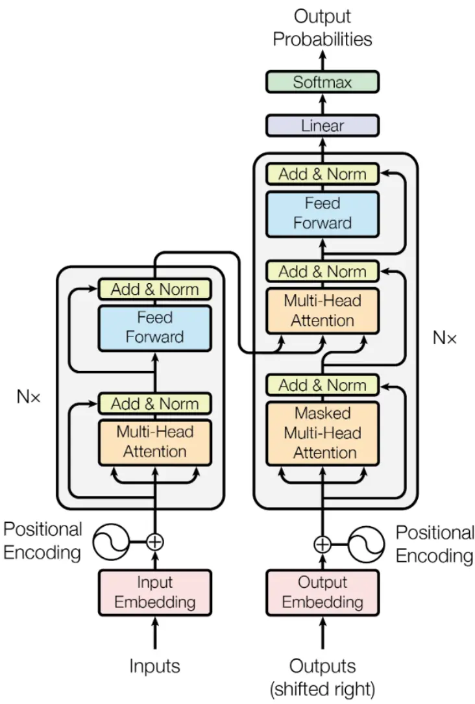
Vaswani, Ashish, et al. "Attention Is All You Need."

关于Transformer中涉及的自注意力机制的原理此处不再赘述。

若我们希望将 Transformer 用于时序任务，最为简单的流程是将每一天的 M 个变量作为一个 token 进行 Embedding（即通道混合），使用 encoder 部分的自注意力机制进行时序信息提取，最后取整个序列的表征，输入下游任务的预测头得到最终输出。

## 2、PatchTST

PatchTST采用了Patch、通道独立的设计，整体流程如下图所示：

图表 6 PatchTST 模型流程
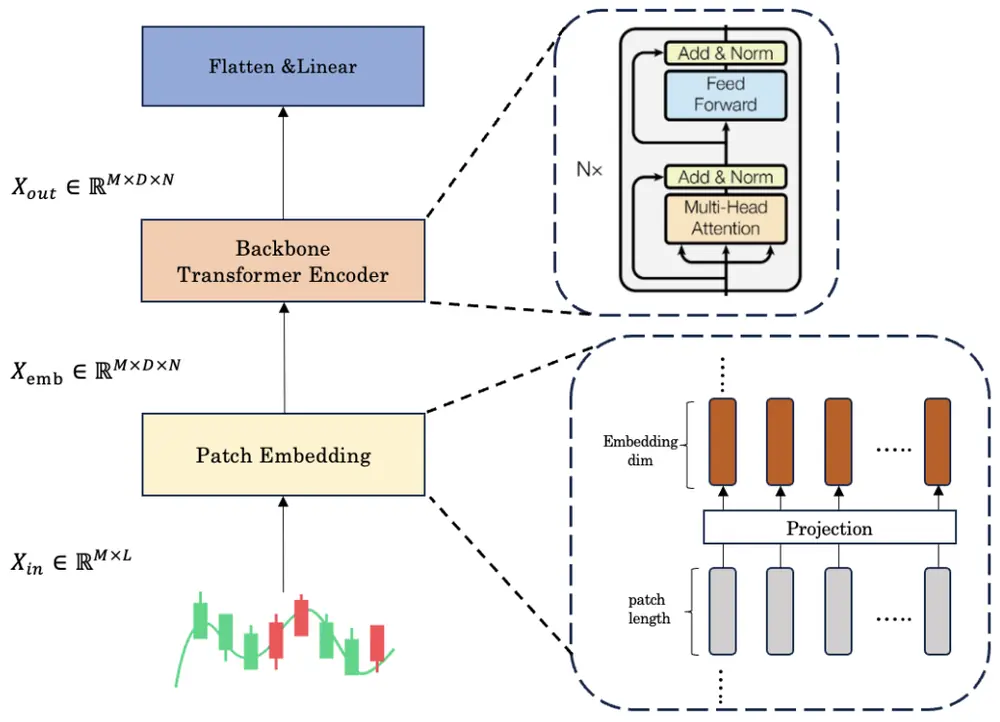
Vaswani, Ashish, et al. "Attention is all you need.",

经过 Patch Embedding 后，PatchTST 模型将多变量序列中的每一个序列看作一个独立样本，将单变量序列输入模型 backbone（Transformer encoder）中，通过注意力机制学习时序的依赖关系，最后拼接不同变量的输出。

以一个多变量时序预测任务为例，假设输入序列变量数为M，输入每个变量过去 L天的数据、目标为预测每个变量未来T 日，模型对一个输入的样本的处理流程如图（6）所示；从一个 batch数据形状的角度看，输入数据形状为(B,M,L)，其中B 为batch大小，M为变量数，L 为原始序列长度；patchembedding 后数据形状变为 (B,M,D,N)，其中 N 为新序列长度，D为每个token的嵌入特征维度；

在进入模型 backbone 之前，PatchTST 模型将 B、M 维度合并，数据形状变为(BM,D,N)，表示将每个变量视为一个单独的样本，一个 batch 中的样本数量变为(BM)，encoder 接受单变量输入，输出形状同样为(BM,D,N)，经过预测头、拼接合并后得到预测输出形状为(B,M,T)，即得到了每个输入样本的多变量预测结果。

## （三）TSMixer

在上文的PatchTST中，模型将一个多变量时间序列视为多个独立的单变量时间序列，缺少考虑不同通道（变量）之间的交互作用。在后续的工作中，一种常见的流程是保留通道独立的同时，在骨干网络中加入通道交互模块，让模型进行预测时能考虑到不同变量之间的交互信息，更符合直觉。TSMixer由Ekambaram等于 2023年提出，通过基于 MLP的模块完成时序、特征、通道间的交互信息提取。

## 1、门控注意力

TSMixer 作者在 MLP 块后添加了一个简单的门控注意力（Bahdanau 等，2014）加强 MLP信息抽取能力，它比自注意力机制简单，起到特征加权的作用。

图表 7 TSMixer模型中的门控注意力
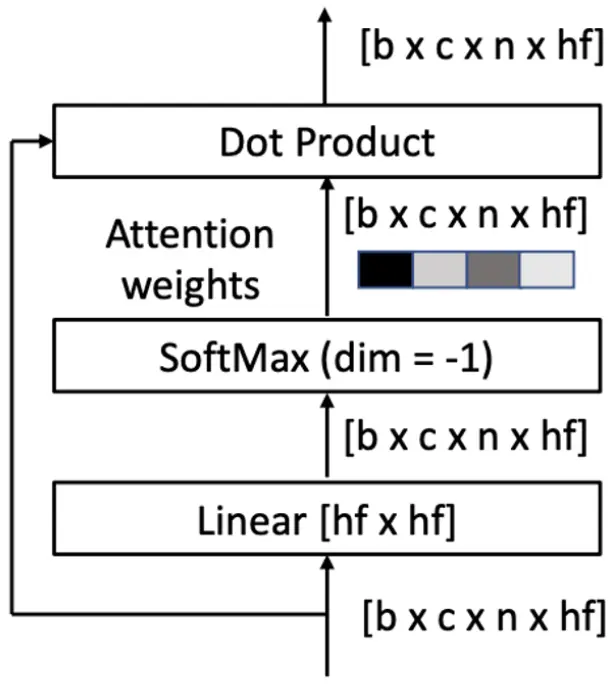
Ekambaram, Vijay, et al. "TSMixer: Lightweight MLP-Mixer Model for Multivariate Time Series Forecasting."

上图为 TSMixer中的门控注意力流程图，其中b、c、n、hf分别表示batchsize、通道、序列长度、嵌入维度；TSMixer 的门控注意力使用一个 Linear+Softmax 获取权重矩阵，类似自注意力机制 Query、Key的操作；最后权重矩阵对初始的输入特征进行放缩，整个门控注意力的实现只基于 MLP。

## 2、TSMixer Backbone

TSMixer 同样先对数据进行 patch embedding，骨干网络由时序信息提取模块、特征信息提取模块、通道信息提取三个模块组成，三个模块则均由MLP、门控注意力、残差连接构成，通过调整输入MLP 层的数据形状实现不同类型的信息抽取。TSMixer同样使用了Patch+通道独立的设计，相比于PatchTST，它的骨干网络包含了通道信息交互提取。

图表 8 TSMixer Backbone
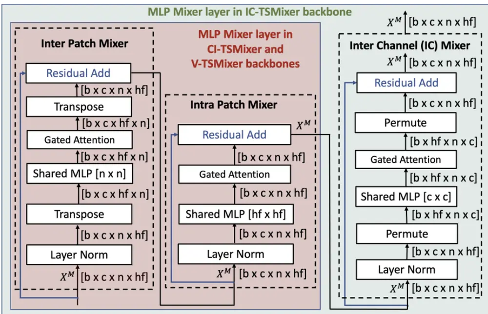
Ekambaram, Vijay, et al. "TSMixer: Lightweight MLP-Mixer Model for Multivariate Time Series Forecasting."

## （四）ModernTCN

ModernTCN在骨干网络中同样包含时序、特征、通道的信息提取模块，流程同 TSMixer类似，区别在于各个模块采用了卷积网络实现。

在 Patch Embedding 步骤，ModernTCN 与上述模型略有不同，它采用 1D 卷积实现，kernelsize对应Patch的窗口大小P，stride 对应为Patch的步长 S，输出通道数对应目标嵌入维度D。

对一条原始时序样本输入：

$$
X_{in}\in\mathbb{R}^{M,1,L}
$$

其中，M为变量维度，L为时间维度，经过上述1D 卷积处理后，得到输出为：

$$
X_{emb}\in\mathbb{R}^{M,D,N}
$$

其中，M是变量维度，D为特征维度，N为 patch后新的时序维度。

1D 卷积得到了和 PatchTST、TSMixer 滑动窗口截取+映射方法相同的数据形状；经过Patch 处理后，时序数据进入 ModernTCN 骨干网络中，下面我们首先简要介绍其中所用的相关卷积技术。

## 1、分组卷积

自AlexNet在2012年赢得ImageNet比赛后，更大、更深的神经网络逐渐成为研究主流。虽然模型深度对于提高性能有重要影响已经成为了共识，但这些更大更复杂模型始终不可避免需要面对一个现实应用的问题——如何在计算资源有限的硬件平台上执行算法。分组卷积技术提供了一种可行的方案以缓解上述问题，它在不显著影响准确性的同时，减少了计算成本和参数数量。

传统CNN中，若卷积层将输入数据的通道数从 $.c_{1}$ 转为 $c_{2}$ ，需要 $c_{2}$ 个卷积核（每个卷积核通道数为 $c_{1}$ ）如下图（a）所示；分组卷积将输入的特征图和卷积核进行分组，每组的卷积核仅与本组内的通道进行卷积计算，如下图（b）所示；

图表 9 分组卷积示意图
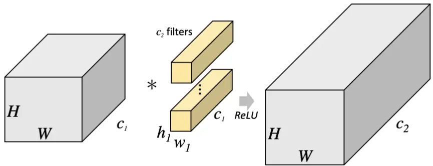

(a) Convolution.
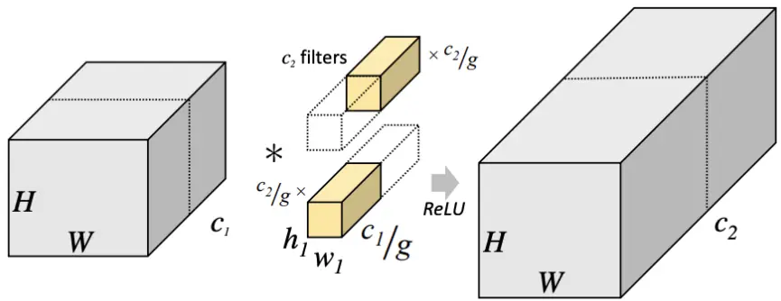
(b) Convolution with filter groups.
Ioannou, Yani, et al. "Deep roots: Improving cnn efficiency with hierarchical filter groups."

假设我们输入数据的通道数从 $c_{1}$ 转为 $c_{2}$

在传统 CNN 下，可以看作每一个输入通道对应 $c_{2}/c_{1}$ 个卷积核（每个卷积核的通道数为 $c_{1}$ ）；

在分组卷积下，定义一个分组数量 $g$ ，将输入的 $c_{1}$ 个通道分为 $g$ 组（每组通道数量为$c_{1}/g$ ），每一组对应 $c_{2}/g$ 个卷积核（每个卷积核的通道数为 $c_{1}/g$ ）。

假设卷积核长宽均为k，不使用分组卷积时，参数量为：

$$
c_{1}\times c_{2}/c_{1}\times(k\times k)\times c_{1}~=~(k\times k)\times c_{1}\times c_{2}
$$

使用分组卷积后，卷积核的参数数量为：

$$
g\times c_{2}/g\times(k\times k)\times c_{1}/g=(k\times k\times c_{1}\times c_{2})/g
$$

由此可见，分组卷积显著减少模型的参数量和计算量。

## 2、深度可分离卷积

深度可分离卷积（Depthwise Separable Convolution）最早由 Sifre 提出，在 MobileNets 和Xception 等模型中有应用。深度可分离卷积对图像的空间特征、通道特征进行单独、分步的学习，它将标准的卷积核分解为两步：深度卷积（Depthwise Convolution）和点卷积（Pointwise Convolution）：

深度卷积对每个输入通道单独对应一个卷积核（每个卷积核的通道数为 1），可以看作分组卷积的一种形式（分组数等于输入数据的通道数），一个通道数为 c的输入数据经过深度卷积后，输入数据的通道数同样为 c；

在上一步的深度卷积中，相当于对每个通道进行了单独学习，没有考虑不同通道之间的交互；深度可分离卷积的第二步为点卷积，采用了1×1 的卷积，组合不同通道得到最终输出。

图表 10 深度可分离卷积示意图
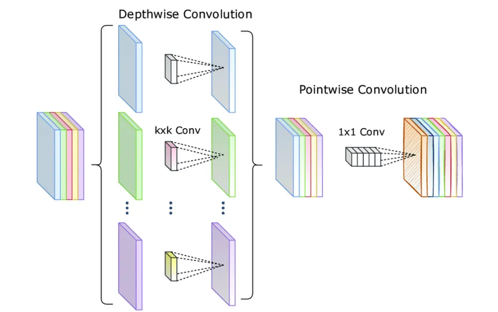
Sultonov, Furkat, et al. "Mixer U-Net: An Improved Automatic Road Extraction from UAV Imagery."

## 3、ModernTCN Backbone

ModernTCN 的 Backbone 由 DWConv、ConvFFN 两个子模块组成，通过残差连接层数堆叠，如下图所示：

图表 11 ModernTCN 网络架构
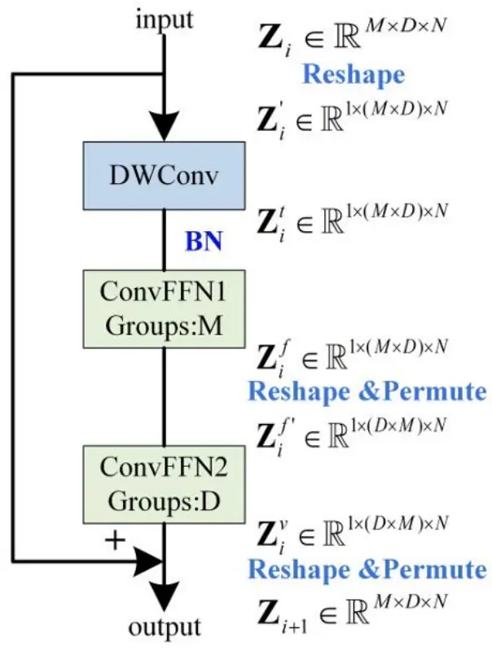
(d)ModernTCN block
Luo Donghao, Wang Xue, "ModernTCN: A Modern Pure Convolution Structure for General Time Series Analysis."

在之前的部分我们简单介绍了深度可分离卷积，它由深度卷积（Depthwise，简写为 DW卷积）和点卷积（Pointwise，简写为PW卷积）两步组成，深度可分离卷积的特点是将图像的空间信息、通道信息抽取单独处理。

经过ModernTCN的Patch处理后，一个样本的形状为 $\left(M,D,N\right)$ ，其中M为变量维度、D为Embedding后的特征维度，N为序列维度。进行卷积操作前需要将 M和D维度合并为通道维度，变为 $(M\times D,N)$

ModernTCN也用了其解耦的方案，将变量/特征的时序信息学习、通道交互两个步骤用单独的模块进行处理。

DWConv 模块实现了深度可分离卷积中的第一步——深度卷积，深度卷积不提取通道之间的交互，输入通道数量等于输出通道数量 $(M\times D$ ）。在时间序列的语境下，它表示对每个变量进行了时序信息提取。

接下来，类似深度可分离卷积的第二步的点卷积，后续的两个 ConvFFN 模块（按顺序记为ConvFFN1、ConvFFN2）被设计用于对不同通道维度的信息进行学习。

ConvFFN 模块由两个1×1点卷积（PWConv）构成，如下图所示。

图表 12 ConvFFN 模块结构
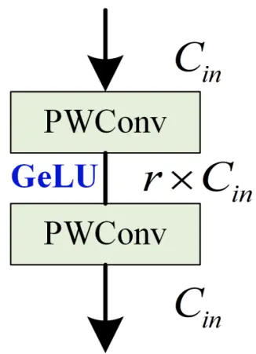
Luo Donghao, Wang Xue, "ModernTCN: A Modern Pure Convolution Structure for General Time Series Analysis."

点卷积采用了分组卷积技术，两个ConvFFN 采用不同的分组逻辑：

- ConvFFN1 分组数设置为M，此时分组点卷积表示学习同一个变量的特征交互；

ConvFFN2 分组数设置为 D，此时分组点卷积表示学习同一特征维度不同变量的交互。

经过2个ConvFFN 后，通过残差连接便得到一个Block的输出结果。

此外，ModernTCN 还在 DWConv中采用了大核卷积技术，在此不再展开。

（五）小结

上文我们介绍了PatchTST、TSMixer、ModernTCN时序深度学习模型，它们的大致流程相似，如下图所示；

图表 13 模型简化流程
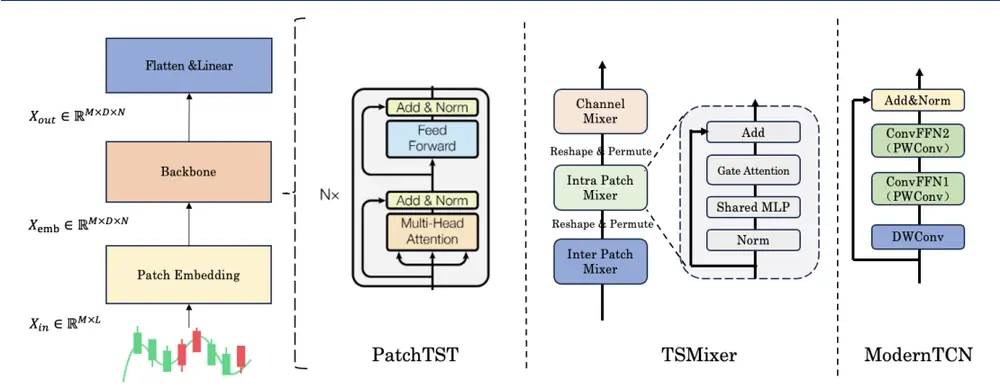
Vaswani, Ashish, et al. "Attention is all you need.",

三个模型都采用了通道独立的设计，通过骨干网络学习时间、特征以及通道的交互。下面我们以常见的通道混合设计的 GRU 和 ModernTCN 为例，简单对比两种思路的区别：以一只股票的 5天价格序列为例，它的变量为高、开、低、收，我们将其嵌入为D维向量。

对 GRU 网络（下图左），在Embedding阶段，将每一天的高、开、低、收作为一个token，输入模型的每个样本为长度为 5的 token序列；每个 token的维度为4，我们将其映射到更高的维度得到 D 维特征表征，通过后续的 GRU 网络学习不同时点的信息交互；

对 ModernTCN 网络（下图右），在Embedding阶段，用大小为P 的窗口在每个变量时序上进行滑动截取，得到4 条长度为N的新序列，每个窗口中P 个时点的数值被视为一个 token，将 token映射到D 维后输入骨干网络，骨干网络根据单变量序列输入产生对应输出，最后将每个单变量的输出拼接还原为多变量序列，骨干网络对时序、嵌入隐状态、不同变量间的交互进行了学习。

图表 14 通道混合、通道独立流程对比
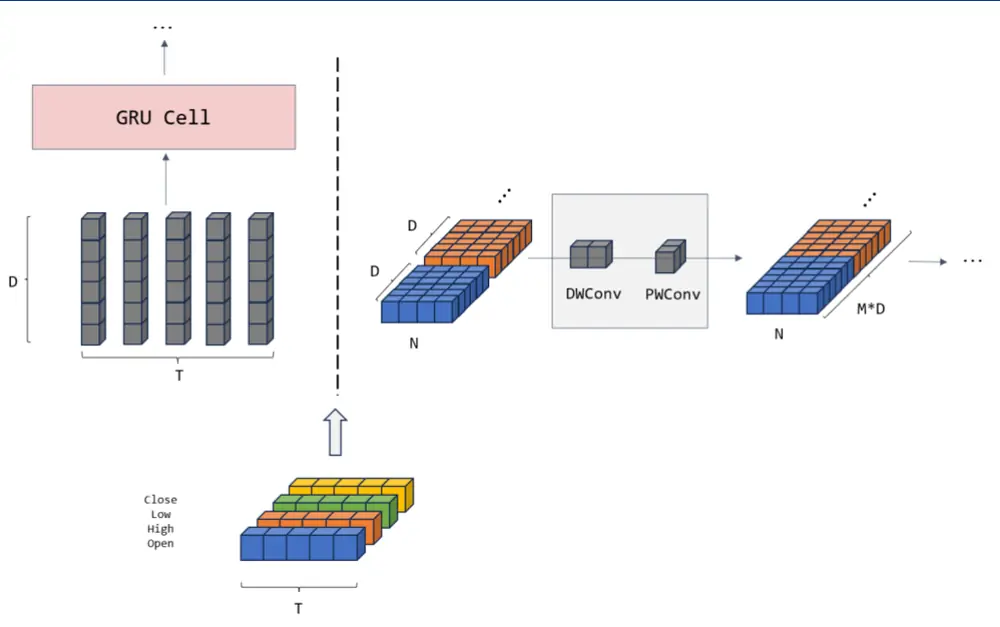
资料来源：华创证券整理

如何实现骨干网络中的时序信息交互、变量/特征信息，PatchTST、TSMixer、ModernTCN分别使用基于多头自注意力、门控 MLP、卷积的模块设计。

我们认为，Patch Embedding、骨干网络的解耦思路具有一定参考意义；从股价或因子类时序数据的特点看，Patch +通道独立的方法或是通道混合的方式，二者均有合理之处，通道混合时表征了每天的蜡烛图，通道独立时表征了单个变量的局部时间特征，无法直接得出孰优孰劣的结论。在后文，我们在上述三个模型的基础上再加入通道混合的Transformer进行对比，检验上述模型在端到端量价因子挖掘任务中的表现。

## 三、量价因子挖掘测试

## （一）数据集介绍

数据集说明：

2007-2024 年 2 月 2 日 A 股日频量价数据，包括高、开、低、收、均价、成交量 6 个序列，我们以每周的最后一个交易日t为截面，回溯截面上N 个股票过去 30 个交易日的数据，作为一个截面（对应 $N_{t}$ 个标签），以此滚动生成数据截面（N ,30,6）、（N ,30,6）…

（ $N_{t},30,6)$ ），在第一个维度上进行拼接得到全部训练数据。

同时，我们在周度截面股票进行如下排除：

1、剔除上市不满 120天的股票；

2、剔除流通市值最小的10%的股票；

3、剔除有数据缺失的股票。

模型训练参数说明：

训练集划分：按年滚动训练，年底进行重训练；在每年年底回溯过去11 年作为训练集与验证集（其中最近的一年为验证集），次年为测试集；第一期模型的训练集为 2007.01-2016.12，验证集为 2017.01-2017.12，测试集为 2018.01-2018.12，以此类推，如下图所示：

图表 15 训练验证集划分
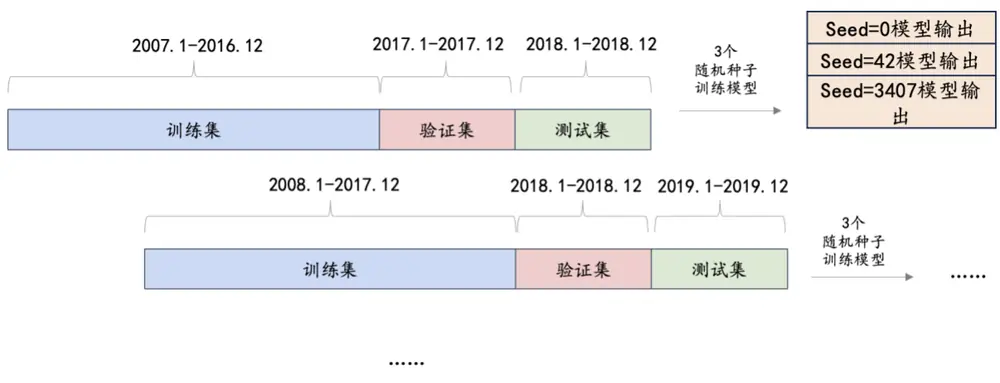
资料来源：华创证券整理

在进行模型重训练时，设置 3 个随机种子，将 3次预测结果合成作为最终结果。

数据预处理方法：

在拼接数据截面 $(\ N_{1},30,6\ )_{\bullet}\ (\ N_{2},30,6\ )\ \dots\ (\ N_{t},30,6\ )$ 之前，进行如下的预处理步骤：

1、MAD 法对异常值进行缩尾处理；

2、每个截面用最后一个交易日作为除数进行归一化，再进行 Z-score标准化；

模型预测标签：

预测标签为标准化未来 10日收益（t+1日~t+11 日以收盘价计算），每个模型最终预测头输出维度均设置为50，将50 个因子用均值聚合，作为每只股票的最终得分，计算其与上述未来 10日收益的IC 作为损失函数。

## （二）模型流程

我们测试 PatchTST、Transformer、TSMixer、ModernTCN 模型。我们在 PatchTST 骨干网络中也加入一个基于自注意力机制的通道交互模块；对 PatchTST 和 Transformer 模型，在时序编码时添加可学习的特殊 token（类似自然语言中的[CLS]），用于获取序列表征。

图表 16 模型对比

|  |  | PatchTST | Transformer | TSMixer | ModernTCN |
| --- | --- | --- | --- | --- | --- |
| 时序编码 |  | Patch+位置编码 | 位置编码 | Patch+位置编码 | Conv |
| Backbone | 时序交互 | self-attention | TransformerEncoder | MLP | Conv |
|  | 特征交互 | MLP |  | MLP | Conv |
|  | 通道交互 | self-attention |  | MLP | Conv |

资料来源：华创证券整理

图表 17 模型流程
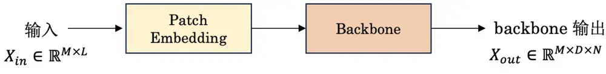
Luo Donghao, Wang Xue, "ModernTCN: A Modern Pure Convolution Structure for General Time Series Analysis."

除Transformer模型外，其余通道独立模型的样本经过Backbone的输出形状为(M,D,N)，在进入最后预测头之前我们进行如下处理：

对 TSMixer 和 ModernTCN 模型，合并 D、N 两个维度并用一个 Linear 层消除时序维度，数据形状变为(M,D)，最后合并M、D两个维度；

对 Transformer-base的模型，取每个变量的特殊 token作为单变量序列表征，数据形状变为(M,D)，合并 M、D 维度。

## （三）参数设定

本文介绍的模型涉及参数较多，我们对主要参数进行设定说明：

在 Patch Embedding 步骤，我们将 S 固定为 P 的一半，考虑到输入序列长度仅为 30，因此取S = 2、P = 4的参数组合；TSMixer、ModernTCN嵌入特征维度D设定为16，PatchTST、Transformer 设定为 32，注意力头数为 2；所有模型的层数设定为 1；在后续章节，我们进行更多参数的测试，以进一步了解模型各个组件、参数的影响。其余训练参数如下表所示：

图表 18 训练参数设定

| 变量名 | 参数设置 |
| --- | --- |
| Batch Size | 1024 |
| 训练早停阈值(early stop) | 8 |
| 最大 epoch 数 | 80 |
| 优化器 | Adam(初始学习率 1e-3) |
| 随机种子 | 0、42、3407 |

资料来源：华创证券

## （四）因子测试

本部分对前文提到的模型进行量价因子挖掘任务检验，对比不同模型结果。

回测区间：2018 年 1 月 1 日 ~ 2024 年 2 月 8 日；

股票池：中证全指

## 1、IC 测试结果

在本部分我们展示不同模型因子的 IC 结果，因子为周度频率。

图表 19 不同模型5日 IC统计结果

| 模型 | RankIC | ICIR | RankIC 中位数 | IC 大于 0占比 |
| --- | --- | --- | --- | --- |
| PatchTST | 0.095 | 0.73 | 0.097 | 0.76 |
| Transformer | 0.096 | 0.71 | 0.106 | 0.75 |
| TSMixer | 0.100 | 0.82 | 0.105 | 0.78 |
| ModernTCN | 0.097 | 0.78 | 0.099 | 0.79 |

资料来源：wind，华创证券

图表 20 PatchTST 模型 5 日 IC 历史表现
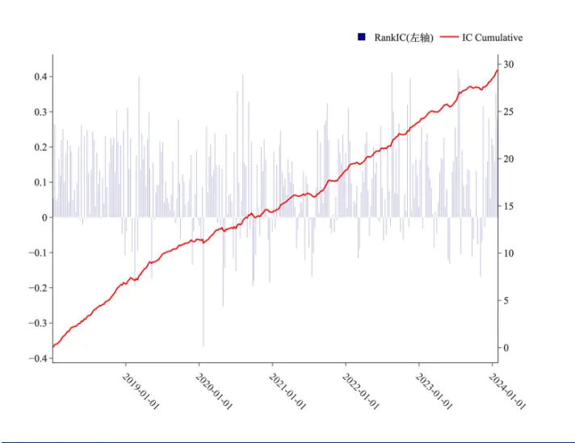
资料来源：wind，华创证券

图表 21 Transformer 模型因子 5 日 IC 历史表现
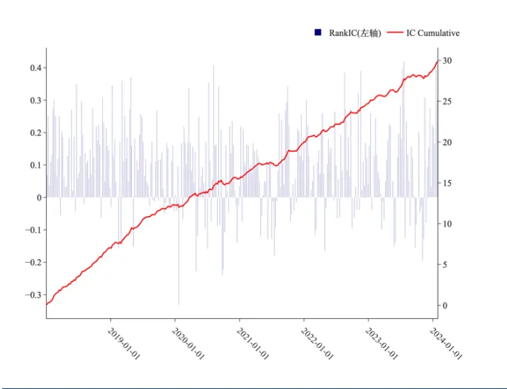
资料来源：wind，华创证券

图表 22 PatchTST 模型 5 日 IC 历史表现
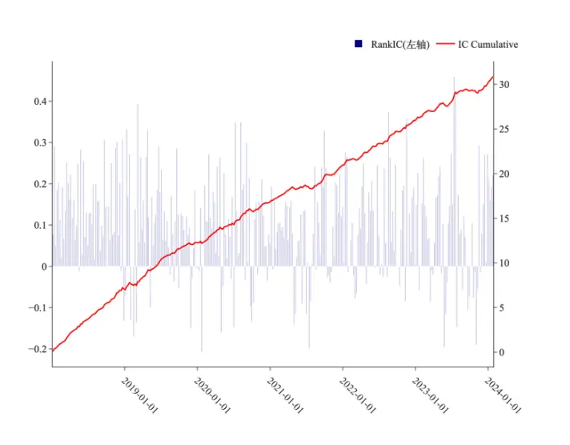
资料来源：wind，华创证券

图表 23 Transformer 模型因子 5 日 IC 历史表现
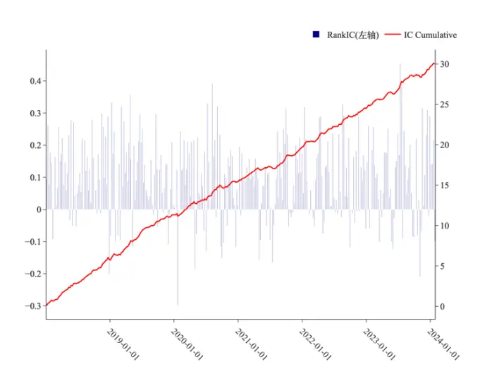
资料来源：wind，华创证券

图表 24 不同模型10日 IC统计结果

| 模型 | RankIC | ICIR | RankIC 中位数 | IC 大于 0占比 |
| --- | --- | --- | --- | --- |
| PatchTST | 0.106 | 0.83 | 0.113 | 0.76 |
| Transformer | 0.108 | 0.82 | 0.114 | 0.79 |
| TSMixer | 0.110 | 0.91 | 0.117 | 0.83 |
| ModernTCN | 0.107 | 0.88 | 0.119 | 0.82 |

资料来源：wind,华创证券

图表 25 PatchTST 模型 10 日 IC 历史表现
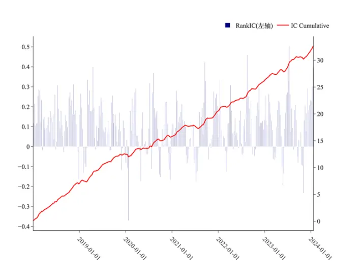
资料来源：wind，华创证券

图表 26 Transformer 模型因子 10 日 IC 历史表现
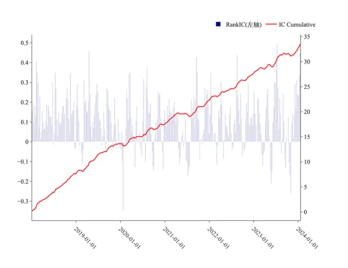
资料来源：wind，华创证券

图表 27 TSMixer 模型 10 日 IC 历史表现
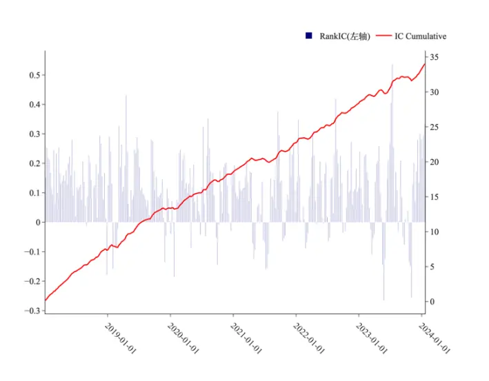
资料来源：wind，华创证券

图表 28 ModernTCN 模型因子 10 日 IC 历史表现
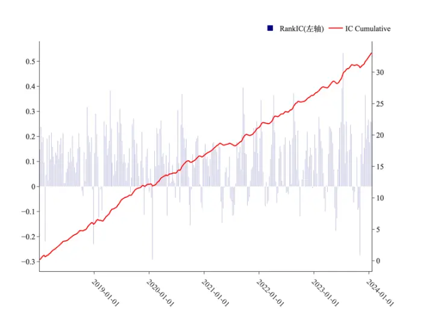
资料来源：wind，华创证券

以上图表呈现了因子的历史 IC 统计结果及其时序图：

从不同窗口期的IC 结果看，所有模型的5日 IC 均达到了9.5%以上，10日IC在 10%以上，10 日 IC 的表现好于 5 日 IC，可能的一大原因是模型训练时采用的是 10 日IC 损失函数；

分模型看，TSMixer 和 ModernTCN 的表现相近，略优于基于多头自注意力的PatchTST 和 Transformer 模型。

## 2、相关性

观察 IC 的时序图，我们可以看到，四个模型的 IC 时序图非常相似，下表我们统计了 4个模型的相关系数。

图表 29 因子相关性

|  |  | PatchTST | Transformer | TSMixer | ModernTCN |
| --- | --- | --- | --- | --- | --- |
| 2018 | PatchTST | 1.00 | -- | - |  |
|  | Transformer | 0.75 | 1.00 | -- | -- |
|  | TSMixer | 0.71 | 0.62 | 1.00 | -- |
|  | ModernTCN | 0.62 | 0.55 | 0.80 | 1.00 |
| 2019 | PatchTST | 1.00 | -- | -- | -- |
|  | Transformer | 0.83 | 1.00 | -- | -- |
|  | TSMixer | 0.80 | 0.76 | 1.00 | -- |
|  | ModernTCN | 0.82 | 0.80 | 0.88 | 1.00 |
| 2020 | PatchTST | 1.00 | -- | -- | -- |
|  | Transformer | 0.89 | 1.00 | -- | -- |
|  | TSMixer | 0.81 | 0.79 | 1.00 | -- |
|  | ModernTCN | 0.87 | 0.83 | 0.90 | 1.00 |
| 2021 | PatchTST | 1.00 | -- | -- | -- |
|  | Transformer | 0.91 | 1.00 | - | - |
|  | TSMixer | 0.85 | 0.85 | 1.00 | -- |
|  | ModernTCN | 0.83 | 0.84 | 0.92 | 1.00 |
| 2022 | PatchTST | 1.00 | -- | -- | -- |
|  | Transformer | 0.92 | 1.00 | -- | -- |
|  | TSMixer | 0.86 | 0.83 | 1.00 | -- |
|  | ModernTCN | 0.83 | 0.81 | 0.89 | 1.00 |
| 2023 | PatchTST | 1.00 | -- | -- | -- |
|  | Transformer | 0.89 | 1.00 | -- | -- |
|  | TSMixer | 0.88 | 0.85 | 1.00 | -- |
|  | ModernTCN | 0.87 | 0.82 | 0.89 | 1.00 |
| 2024 | PatchTST | 1.00 | -- | -- | -- |
|  | Transformer | 0.84 | 1.00 | -- | -- |
|  | TSMixer | 0.76 | 0.62 | 1.00 | -- |
|  | ModernTCN | 0.67 | 0.56 | 0.77 | 1.00 |
| 全区间 | PatchTST | 1.00 | -- | -- | -- |
|  | Transformer | 0.87 | 1.00 | -- | -- |
|  | TSMixer | 0.83 | 0.79 | 1.00 | -- |
|  | ModernTCN | 0.81 | 0.78 | 0.88 | 1.00 |

资料来源：wind，华创证券

- 在时间角度看，不同模型产生的因子相关性非常高，特别是在 2018年之后；在全区间统计范围内，两两相关性最低也达到了 78%，为 ModernTCN 模型与 Transformer模型，其次为 ModernTCN 模型与 PatchTST 模型，达到 81%；但在 2018 年、2024年 1 月，ModernTCN 和 Transformer 系模型的相关性降低至 50% - 60%之间；

- 从模型角度看，两个 Transformer 系模型相关性高、ModernTCN 和 TSMixer 相关性高；基于不同架构模型的相关性较低，如 ModernTCN和 Transformer模型，前者为CNN + 通道独立架构，后者为注意力+通道混合架构，二者相关性低于其他组合。

由于我们采用的训练数据变量较少，趋同性较高，不同深度学习模型产生高相关性的因子结果可能是难以避免的；另一方面，我们也发现，架构越不同的模型产生的因子差异相对更大。

## 3、分组测试结果

本部分我们对因子进行分组测试。分组数设置为20，根据每周最后一个交易日因子值进行分组，按次周第一个交易日收盘价进行调仓，不计交易成本。超额收益基准为中证全指。

图表 30 PatchTST因子分组超额收益曲线
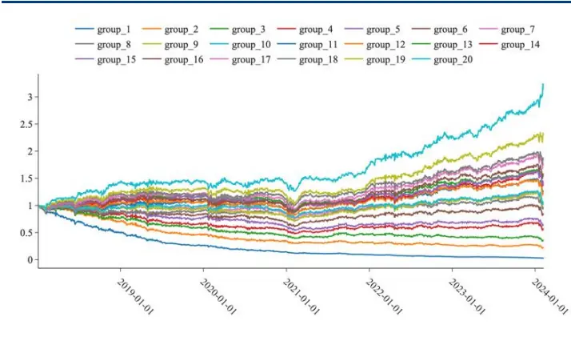
资料来源：wind，华创证券

图表 31 Transformer 因子分组超额收益曲线
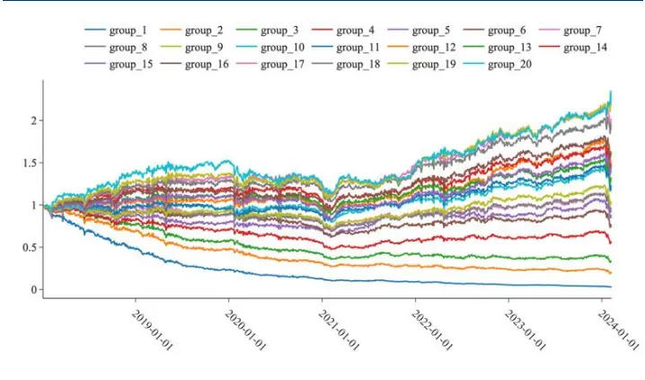
资料来源：wind，华创证券

图表 32 TSMixer因子分组超额收益曲线
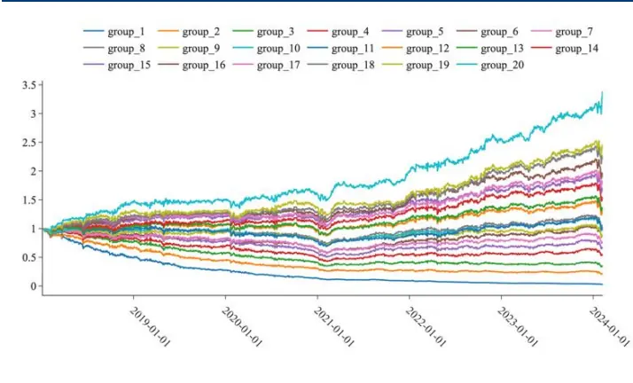
资料来源：wind，华创证券

图表 33 ModernTCN 因子分组超额收益曲线
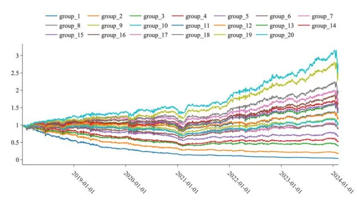
资料来源：wind，华创证券

图表 34 不同模型TOP分组超额收益对比
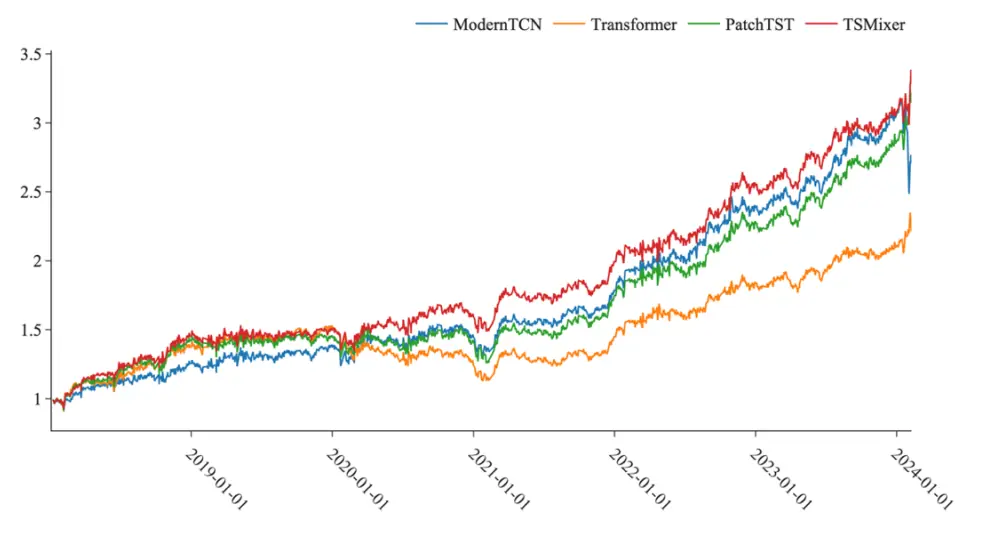
资料来源：wind，华创证券

图表 35 TOP分组年化收益率统计

|  | PatchTST | Transformer | TSMixer | ModernTCN |
| --- | --- | --- | --- | --- |
| group_1 | -45.35% | -45.46% | -45.57% | -43.28% |
| group_2 | -23.14% | -24.69% | -23.81% | -25.71% |
| group_3 | -16.88% | -17.55% | -17.30% | -14.83% |
| group_4 | -9.96% | -9.81% | -10.52% | -10.88% |
| group_5 | -7.75% | -2.69% | -7.27% | -6.85% |
| group_6 | -3.43% | -4.96% | -2.93% | -2.07% |
| group_7 | -0.11% | -1.17% | -5.22% | -2.25% |
| group_8 | -1.26% | -1.49% | 0.08% | -2.23% |
| group_9 | 0.06% | 0.10% | -2.66% | 0.50% |
| group_10 | 0.36% | 2.62% | -0.83% | -0.02% |
| group_11 | 3.43% | 2.87% | -0.39% | 2.73% |
| group_12 | 3.06% | 6.63% | 3.69% | 2.68% |
| group_13 | 5.53% | 4.24% | 4.68% | 5.29% |
| group_14 | 5.49% | 6.21% | 6.89% | 6.37% |
| group_15 | 5.79% | 5.53% | 8.81% | 5.59% |
| group_16 | 7.45% | 7.81% | 11.57% | 8.30% |
| group_17 | 9.62% | 11.57% | 10.17% | 9.31% |
| group_18 | 10.58% | 11.13% | 14.33% | 11.69% |
| group_19 | 14.83% | 13.86% | 15.92% | 16.09% |
| group_20 | 21.29% | 14.28% | 22.39% | 18.18% |

wind,

图表 36 group_20 绩效统计

| 因子 | 年化收益率 | 年化波动率 | 夏普比率 | Calmar 比率 | 超额最大回撤 | 年化超额收益率 | 换手率 |
| --- | --- | --- | --- | --- | --- | --- | --- |
| PatchTST | 21.29% | 0.19 | 1.09 | 1.01 | -17% | 25.14% | 90.14% |
| Transformer | 14.28% | 0.19 | 0.81 | 0.67 | -26% | 18.14% | 85.40% |
| TSMixer | 22.39% | 0.20 | 1.13 | 0.99 | -13% | 26.24% | 92.17% |
| ModernTCN | 18.18% | 0.20 | 0.92 | 0.58 | -21% | 22.03% | 91.22% |

资料来源：wind，华创证券

以上图表展示了4个模型的分组收益测试结果。虽然不同模型的 IC 结果相近，但在分组测试的表现上，特别是不同模型的 TOP 分组，展现出了较大差异：

从 TOP 组区间年化收益看，Transformer 弱于同样基于自注意力的 PatchTST 模型，也弱于另外两个模型；TSMixer和 ModernTCN 的 TOP 组在 24年之前表现相近，是最好的两个模型。

从TOP组的超额回撤看，除2020年底的回撤外，2024年年初至2月8日区间，PatchTST、

Transformer、TSMixer、ModernTCN 的 TOP 组超额收益回撤分别为 4%、5%、7%、21%，ModernTCN在2024年的回撤幅度显著大于其余模型。

下表我们两两统计了模型 TOP 组选出股票的重叠度（两个模型选出的股票的交集/并集）均值，和因子相关性结论类似，ModernTCN-Transformer、TSMixer-Transformer 的多头重叠度最低，约为61%，它们也是模型设计的差异最大的组合。所有组合的重叠度均在60%-70%间，在因子回撤区间，不同模型存在一定的表现差异。

图表 37 多头组重叠度统计

|  | PatchTST | Transformer | TSMixer |
| --- | --- | --- | --- |
| Transformer | 65.54% | -- |  |
| TSMixer | 64.58% | 61.03% |  |
| ModernTCN | 63.65% | 61.57% | 68.62% |

资料来源：wind，华创证券

## （五）消融测试

在因子测试的部分我们已经发现，基于注意力的两个模型——PatchTST 和 Transformer，采用通道独立设计的 PatchTST 模型综合表现优于 Transformer 模型。在本节我们进一步探索Patch、通道独立设计的必要性，我们以TSMixer、ModernTCN两个模型为基础进行部分模块剔除，重复上文的量价因子挖掘步骤，以此大致了解各个组件的影响：

## 1、剔除 Patch

保留原先模型的时序编码模块，但将其中的参数P以及S 设定为1 实现剔除Patch。修改后的模型后缀记为“-NoPatch”。

## 2、剔除通道独立

两个模型的剔除通道独立的方法为：

ModernTCN：修改输入数据的形状以及 1D 卷积的输入通道数实现通道混合，嵌入维度设定为50，骨干网络中排除通道交互对应的点卷积模块；

- TSMixer：采用 ModernTCN 的 1D 卷积（P=4，S=2）进行时序编码，嵌入维度为 50，骨干网络中排除通道交互对应 MLP 模块。

修改后的模型后缀为“-CM”。

## 3、剔除 Patch与通道独立

两个模型剔除Patch、通道独立的方法为：

ModernTCN：修改输入数据的形状以及 1D 卷积的输入通道数实现通道混合，嵌入维度设定为 50，骨干网络中排除通道交互对应的点卷积模块；

TSMixer：采用 ModernTCN 的 1D 卷积（P=1，S=1）进行时序编码，嵌入维度为 50，骨干网络中排除通道交互的对应 MLP 模块。

修改后的模型后缀为“-NoPatch-CM”。

## 4、测试结果

图表 38 消融测试5日 IC统计结果

| 模型 | RankIC | ICIR | RankIC 中位数 | IC 大于 0占比 |
| --- | --- | --- | --- | --- |
| ModernTCN | 0.097 | 0.128 | 0.099 | 0.78 |
| ModernTCN-NoPatch | 0.096 | 0.128 | 0.091 | 0.78 |
| ModernTCN-CM | 0.092 | 0.132 | 0.100 | 0.76 |
| ModernTCN-NoPatch-CM | 0.094 | 0.13 | 0.094 | 0.78 |
| TSMixer | 0.100 | 0.13 | 0.105 | 0.78 |
| TSMixer-NoPatch | 0.096 | 0.127 | 0.100 | 0.78 |
| TSMixer-CM | 0.097 | 0.128 | 0.099 | 0.8 |
| TSMixer-NoPatch-CM | 0.096 | 0.126 | 0.102 | 0.79 |

资料来源：wind，华创证券

图表 39 消融测试10日 IC统计结果

| 模型 | RankIC | ICIR | RankIC 中位数 | IC大于0占比 |
| --- | --- | --- | --- | --- |
| ModernTCN | 0.107 | 0.135 | 0.119 | 0.82 |
| ModernTCN-NoPatch | 0.107 | 0.136 | 0.116 | 0.81 |
| ModernTCN-CM | 0.102 | 0.137 | 0.114 | 0.82 |
| ModernTCN-NoPatch-CM | 0.105 | 0.135 | 0.109 | 0.82 |
| TSMixer | 0.110 | 0.138 | 0.117 | 0.83 |
| TSMixer-NoPatch | 0.107 | 0.136 | 0.115 | 0.82 |
| TSMixer-CM | 0.109 | 0.133 | 0.116 | 0.83 |
| TSMixer-NoPatch-CM | 0.108 | 0.135 | 0.12 | 0.82 |

资料来源：wind，华创证券

图表 40 ModernTCN 消融测试 TOP 组超额
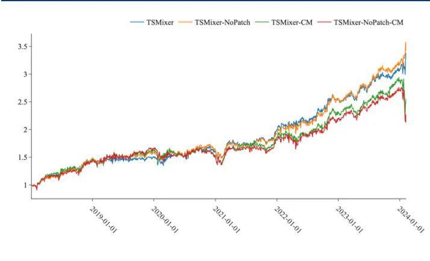
资料来源：wind，华创证券

图表 41 TSMixer 消融测试 TOP 组超额
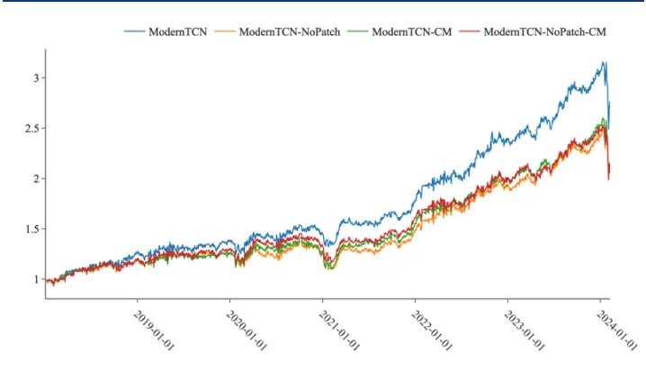
资料来源：wind，华创证券

图表 42 消融测试TOP组绩效统计

| 模型 | 年化收益率 | 年化波动率 | 夏普比率 | Calmar 比率 | 超额最大回撤 | 年化超额收益率 | 换手率 |
| --- | --- | --- | --- | --- | --- | --- | --- |
| TSMixer | 22.39% | 0.20 | 1.13 | 0.99 | -13% | 26.24% | 92.17% |
| TSMixer-NoPatch | 23.04% | 0.20 | 1.15 | 0.97 | -15% | 26.89% | 92.37% |
| TSMixer-CM | 16.56% | 0.23 | 0.78 | 0.49 | -23% | 20.41% | 93.68% |
| TSMixer-NoPatch-CM | 14.32% | 0.23 | 0.70 | 0.42 | -23% | 18.17% | 93.30% |
| ModernTCN | 18.18% | 0.20 | 0.92 | 0.58 | -21% | 22.03% | 91.22% |
| ModernTCN-NoPatch | 13.24% | 0.21 | 0.71 | 0.42 | -21% | 17.09% | 91.38% |
| ModernTCN-CM | 12.80% | 0.21 | 0.68 | 0.41 | -22% | 16.66% | 92.05% |
| ModernTCN-NoPatch-CM | 12.93% | 0.21 | 0.69 | 0.40 | -22% | 16.78% | 91.80% |

资料来源：wind，华创证券

对原始模型去除 Patch 与通道独立后，两个模型在量价因子挖掘任务中的因子 IC、TOP组表现出现了不同程度的下降，TSMixer模型去除Patch性能无明显差异；将Patch和通道独立均剔除后，两个模型的TOP 组表现均发生了明显的性能下降，年化收益分别降低8.07%、5.25%，在因子相关性方面，剔除组件后的模型和原始模型的相关性仍然较高，ModernTCN 在 90%以上，TSMixer 在 85%以上，在 IC 测试拥有相近表现；

下表统计了消融实验中，剔除部分组件后的模型和原始模型在TOP组选出股票的重叠度。

图表 43 消融测试TOP组重叠度统计

|  | TSMixer-NoPatch | TSMixer-CM | TSMixer- NoPatch- CM | ModernTCN-NoPatch | ModernTCN-CM | ModernTCN-NoPatch-CM |
| --- | --- | --- | --- | --- | --- | --- |
| 均值 | 71.87% | 62.25% | 63.08% | 70.57% | 66.87% | 65.70% |
| 最小值 | 54.2% | 50% | 51.54% | 70.30% | 66.77% | 65.62% |
| 中位数 7 | 1.92% | 62% | 63.07% | 82.83% | 81.05% | 83.80% |
| 最大值 | 85.29% | 75.4% | 78.77% | 70.57% | 66.87% | 65.70% |

wind,

最后，本篇报告所有的实验的损失函数均使用 IC 损失，不同模型 IC 表现相近、TOP 组表现差异较大的情况时常出现，如何兼顾深度学习因子的IC 和多头组收益值得更深一步的研究；从本节消融测试的结果看，我们认为骨干网络的合理设计能显著改善因子的综合表现，为解决上述问题提供了一种可能的实践方案。

## 四、总结

本篇报告介绍了近年新的深度学习模型，也为理解这些模型在实际应用中的性能进行了简单测试，为深度学习量化应用提供了参考。

在深度学习领域，深度网络因其卓越的表征能力在多个领域取得了显著成就，时序数据分析亦不例外。本文深入探讨了除循环神经网络（RNN）之外的深度学习模型，并重点介绍了 PatchTST、TSMixer 和 ModernTCN 这三个近年来在时序深度学习领域取得突破的模型。这些模型采用了 Patch+通道独立设计，其骨干网络分别基于自注意力、多层感知器（MLP）和卷积神经网络（CNN）机制。

本篇首先从多变量时序数据的角度出发，强调了与传统循环网络相比，这些模型采用的通道独立设计。该设计通过将多变量时间序列分解为单变量序列，并使用独立的模块来分别学习每个序列的时序特性、特征交互以及跨变量信息交互。这些时序网络在设计上融合了视觉领域网络和 Transformer 网络的理念与技术，为时序数据分析提供了新的视角。

为了评估这些模型在不同领域时序任务中的泛化能力，本文进一步研究了它们在量价数据集上的表现。在中证全指股票池的测试中，四个模型生成的量价周频因子的 10日 RankIC 均超过了 10%，其中 TSMixer 和 ModernTCN 的表现略优于 PatchTST 和Transformer。这些因子的区间 IC 均值分别为 10.6%、10.8%、11.0%和 10.7%，ICIR分别为 0.83、0.82、0.91、0.88。在 20分组的TOP 组超额收益方面，四个模型的表现差异显著，年化超额收益分别为 21%、14.28%、22.39%和 18.18%。此外，设计差异最大的两个模型的 TOP 组选股重叠度约为 61%。

在 2024年初至2 月8 日的时间段内，四个模型的TOP 组超额收益的最大回撤表现各异，分别为4%、5%、7%和21%，其中ModernTCN模型的回撤幅度显著高于其他模型。为了进一步理解模型设计的影响，对 TSMixer和 ModernTCN 进行了模块剔除实验。实验结果表明，去除Patch+通道混合后，模型在因子挖掘任务中的 RankIC 仅有轻微下降，但在 TOP 组超额收益上表现出显著差异，年化收益分别降低了 8.07%和5.25%。这一发现强调了合理设计骨干网络的重要性。

## 五、风险提示

策略基于历史数据回测，不保证未来数据的有效性。深度学习模型存在过拟合风险。深度学习模型受随机数影响。本文的模型实现和相关文献不完全相同。

## 六、参考文献

Ekambaram, Vijay, et al. "TSMixer: Lightweight MLP-Mixer Model for Multivariate Time Series Forecasting." arXiv preprint arXiv:2306.09364 (2023).

Nie, Yuqi, et al. "A time series is worth 64 words: Long-term forecasting with transformers." arXiv preprint arXiv:2211.14730 (2022).

Luo, Wang, et al. " ModernTCN: A Modern Pure Convolution Structure for General Time Series Analysis." International Conference on Learning Representations(2024).

Zerveas, George, et al. "A transformer-based framework for multivariate time series representation learning." Proceedings of the 27th ACM SIGKDD conference on knowledge discovery & data mining. 2021.

Vaswani, Ashish, et al. "Attention is all you need." Advances in neural information processing systems 30 (2017).

Ioannou, Yani, et al. "Deep roots: Improving cnn efficiency with hierarchical filter groups." Proceedings of the IEEE conference on computer vision and pattern recognition. 2017.

Sultonov, Furkat, et al. "Mixer U-Net: An improved automatic road extraction from UAV imagery." Applied Sciences 12.4 (2022): 1953.

Zeng, Ailing, et al. "Are transformers effective for time series forecasting?" Proceedings of the AAAI conference on artificial intelligence. Vol. 37. No. 9. 2023.

Liu, Hanxiao, et al. "Pay attention to mlps." Advances in Neural Information Processing Systems 34 (2021): 9204-9215.

Han, Lu, Han-Jia Ye, and De-Chuan Zhan. "The Capacity and Robustness Trade-off: Revisiting the Channel Independent Strategy for Multivariate Time Series Forecasting." arXiv preprint arXiv:2304.05206 (2023).

Dosovitskiy, Alexey, et al. "An image is worth 16x16 words: Transformers for image recognition at scale." arXiv preprint arXiv:2010.11929 (2020).

## 金融工程组团队介绍

组长、首席分析师：王小川

同济大学管理学博士。2017年加入华创证券研究所。

高级分析师：秦玄晋

上海对外经贸大学硕士。2018年加入华创证券研究所。

助理研究员：杨宸祎

美国伊利诺伊大学香槟分校会计学、金融工程学硕士，CFA。2021年加入华创证券研究所。

助理研究员：黄河

东华大学工学博士，FRM。2023年加入华创证券研究所。

助理研究员：洪远

华南理工大学金融硕士。2023年加入华创证券研究所。

## 华创证券机构销售通讯录

| 地区 | 姓名 | 职务 | 办公电话 | 企业邮箱 |
| --- | --- | --- | --- | --- |
| 北京机构销售部 | 张昱洁 | 副总经理、北京机构销售总监 | 010-63214682 | zhangyujie@hcyjs.com |
|  | 张菲菲 | 北京机构副总监 | 010-63214682 | zhangfeifei@hcyjs.com |
|  | 刘懿 | 副总监 | 010-63214682 | liuyi@hcyjs.com |
|  | 侯春钰 | 资深销售经理 | 010-63214682 | houchunyu@hcyjs.com |
|  | 过云龙 | 高级销售经理 | 010-63214682 | guoyunlong@hcyjs.com |
|  | 蔡依林 | 高级销售经理 | 010-66500808 | caiyilin@hcyjs.com |
|  | 刘颖 | 高级销售经理 | 010-66500821 | liuying5@hcyjs.com |
|  | 顾翎蓝 | 高级销售经理 | 010-63214682 | gulinglan@hcyjs.com |
|  | 车一哲 | 销售经理 |  | cheyizhe@hcyjs.com |
| 深圳机构销售部 | 张娟 | 副总经理、深圳机构销售总监 | 0755-82828570 | zhangjuan@hcyjs.com |
|  | 汪丽燕 | 高级销售经理 | 0755-83715428 | wangliyan@hcyjs.com |
|  | 张嘉慧 | 高级销售经理 | 0755-82756804 | zhangjiahui1@hcyjs.com |
|  | 董姝彤 | 销售经理 | 0755-82871425 | dongshutong@hcyjs.com |
|  | 王春丽 | 销售经理 | 0755-82871425 | wangchunli@hcyjs.com |
| 上海机构销售部 | 许彩霞 | 总经理助理、上海机构销售总监0 | 21-20572536 | xucaixia@hcyjs.com |
|  | 官逸超 | 上海机构销售副总监 | 021-20572555 | guanyichao@hcyjs.com |
|  | 黄畅 | 上海机构销售副总监 | 021-20572257-2552 | huangchang@hcyjs.com |
|  | 吴俊 | 资深销售经理 | 021-20572506 | wujun1@hcyjs.com |
|  | 张佳妮 | 高级销售经理 | 021-20572585 | zhangjiani@hcyjs.com |
|  | 蒋瑜 | 高级销售经理 | 021-20572509 | jiangyu@hcyjs.com |
|  | 施嘉玮 | 高级销售经理 | 021-20572548 | shijiawei@hcyjs.com |
|  | 朱涨雨 | 销售经理 | 021-20572573 | zhuzhangyu@hcyjs.com |
|  | 李凯月 | 销售经理 |  | likaiyue@hcyjs.com |
|  | 易星 | 销售助理 |  | yixing@hcyjs.com |
|  | 张玉恒 | 销售助理 |  | zhangyuheng@hcyjs.com |
| 广州机构销售部 | 段佳音 | 广州机构销售总监 | 0755-82756805 | duanjiayin@hcyjs.com |
|  | 周玮 | 销售经理 |  | zhouwei@hcyjs.com |
|  | 王世韬 | 销售经理 |  | wangshitao1@hcyjs.com |
| 私募销售组 | 潘亚琪 | 总监 | 021-20572559 | panyaqi@hcyjs.com |
|  | 汪子阳 | 副总监 | 021-20572559 | wangziyang@hcyjs.com |
|  | 江赛专 | 资深销售经理 | 0755-82756805 | jiangsaizhuan@hcyjs.com |
|  | 汪戈 | 高级销售经理 | 021-20572559 | wangge@hcyjs.com |
|  | 宋丹玙 | 销售经理 | 021-25072549 | songdanyu@hcyjs.com |

## 华创行业公司投资评级体系

基准指数说明：

A股市场基准为沪深 300指数，香港市场基准为恒生指数，美国市场基准为标普 500/纳斯达克指数。

公司投资评级说明：

强推：预期未来 6个月内超越基准指数 20%以上；

推荐：预期未来 6个月内超越基准指数 10%－20%；

中性：预期未来 6个月内相对基准指数变动幅度在-10%－10%之间；

回避：预期未来 6个月内相对基准指数跌幅在 10%－20%之间。

## 行业投资评级说明：

推荐：预期未来 3-6个月内该行业指数涨幅超过基准指数 5%以上；

中性：预期未来 3-6个月内该行业指数变动幅度相对基准指数-5%－5%；

回避：预期未来 3-6个月内该行业指数跌幅超过基准指数 5%以上。

## 分析师声明

每位负责撰写本研究报告全部或部分内容的分析师在此作以下声明：

分析师在本报告中对所提及的证券或发行人发表的任何建议和观点均准确地反映了其个人对该证券或发行人的看法和判断；分析师对任何其他券商发布的所有可能存在雷同的研究报告不负有任何直接或者间接的可能责任。

## 免责声明

本报告仅供华创证券有限责任公司（以下简称“本公司”）的客户使用。本公司不会因接收人收到本报告而视其为客户。

本报告所载资料的来源被认为是可靠的，但本公司不保证其准确性或完整性。本报告所载的资料、意见及推测仅反映本公司于发布本报告当日的判断。在不同时期，本公司可发出与本报告所载资料、意见及推测不一致的报告。本公司在知晓范围内履行披露义务。

报告中的内容和意见仅供参考，并不构成本公司对具体证券买卖的出价或询价。本报告所载信息不构成对所涉及证券的个人投资建议，也未考虑到个别客户特殊的投资目标、财务状况或需求。客户应考虑本报告中的任何意见或建议是否符合其特定状况，自主作出投资决策并自行承担投资风险，任何形式的分享证券投资收益或者分担证券投资损失的书面或口头承诺均为无效。本报告中提及的投资价格和价值以及这些投资带来的预期收入可能会波动。

本报告版权仅为本公司所有，本公司对本报告保留一切权利。未经本公司事先书面许可，任何机构和个人不得以任何形式翻版、复制、发表、转发或引用本报告的任何部分。如征得本公司许可进行引用、刊发的，需在允许的范围内使用，并注明出处为“华创证券研究”，且不得对本报告进行任何有悖原意的引用、删节和修改。

证券市场是一个风险无时不在的市场，请您务必对盈亏风险有清醒的认识，认真考虑是否进行证券交易。市场有风险，投资需谨慎。

## 华创证券研究所

| 北京总部 | 广深分部 | 上海分部 |
| --- | --- | --- |
| 地址：北京市西城区锦什坊街26号 恒奥中心 C 座 3A | 地址：深圳市福田区香梅路1061号中投国 际商务中心A 座19楼 | 地址：上海市浦东新区花园石桥路33号 花旗大厦 12 层 |
| 邮编：100033 传真：010-66500801 | 邮编：518034 传真：0755-82027731 | 邮编：200120 传真：021-20572500 |
| 会议室：010-66500900 | 会议室：0755-82828562 | 会议室：021-20572522 |