【专题报告】

# AI+HI 系列（3）：人工智能在选股与 ETF轮动上应用

## 前言

深度学习在量化应用长期以来是投资者关注的重点。然而在 2024 年年初的 A股市场中相关因子出现较大回撤，引发了我们对模型的重新思考。在我们先前的报告中将 GRU 模型运用在风格平衡的股票池，回测表现相对较好，分析其超额的来源主要我们在前端做了严格的基本面的筛选。在本篇报告，我们尝试将 GRU、PatchTST、Transformer、TSMixer、ModernTCN 进行多模型集成构建量价因子，并探讨集成因子在选股及 ETF 轮动上的应用。

## 集成因子测试结果对比

集成的量价因子在全 A 股票池、各大宽基指数（中证 1000、中证 500 和沪深300）、风格池和基金重仓股等不同测试场景中，其单因子的区分度都非常高，IC的均值和中位数均在 0.07 以上，IC大于 0占比均大于 70%，同时不论是 10分组还是 20 分组的线性区分度均非常显著。

我们发现在基金重仓股上的测试结果略优于在风格基准池中的测试结果。IC均值和中位数由 0.08 和 0.084 提高到 0.081 和 0.088，IC 大于 0 占比由 70.3%提升到 75.2%，年化 IC_IR 由 4提升到 4.7。两个池子的选股策略 2018年来均能稳定跑赢对比的基准，风格池选股策略 2018 年来年化收益 12.1%，最大回撤 23.4%，相对收益 8.9%。基金重仓股策略 2018 年来年化收益 13.5%，最大回撤 27.8%，相对收益 12.1%。

## ETF 基准池中测试

在 ETF 轮动策略中，将 ETF 分为宽基风格与行业主题两大类，使用个股的集成因子对每只 ETF 进行评分，筛选得分最高的 10 只 ETF 构建轮动策略。宽基、风格 ETF轮动策略在 2019年 01 月 01日至 2024年 2月 29日期间年化收益率达到 11.7%，大幅超过基准（沪深 300）的 3.1%，阿尔法达到 8.5%。而行业、主题 ETF 轮动策略年化收益率为 16%，阿尔法达到 12.8%，但在大部分年份中，都实现了对基准的超额收益。

## 风险提示：

策略基于历史数据回测，不保证未来数据的有效性。

## 华创证券研究所

证券分析师：秦玄晋

电话：021-20572522

邮箱：qinxuanjin@hcyjs.com

执业编号：S0360522080005

证券分析师：王小川

电话：021-20572528

邮箱：wangxiaochuan@hcyjs.com

执业编号：S0360517100001

## 相关研究报告

《AI+HI 系列（2）：PatchTST、TSMixer、

ModernTCN 时序深度网络构建量价因子》

2024-03-11

《AI+HI 系列：GRU 网络在风格自适应中的创新与应用》

2023-12-04

《量化选股系列——机构情绪与个人情绪》

2023-09-05

《ChatGLM 助力量化选股》

2023-06-14

《人工智能助力量化投资—ChatGLM 介绍》

《基于 canslim 与 FESC 的沪深 300 指数增强策略》

2023-03-07

《行业轮动系列——FESC行业轮动投资框架1.0》

2022-09-07

《CANSLIM 3.0 投资法——成长与价值轮动》2022.06.1

《CANSLIM 2.0 投资法——华创金工大师系列成长型之一》

2021-10-16

## 投资主题

## 报告亮点

近年深度学习强大表征能力使其在多个领域取得了显著的应用成果，如何将其运用在量化投资领域仍面临诸多挑战性问题。本文旨在探索不同深度学习模型的多模型集成应用。通过不同的深度学习模型设计，可能对数据产生不同的敏感度和处理能力。我们通过多模型集成提高模型的多样性和鲁棒性，使其在面对不确定性和噪声等复杂的市场环境时，表现出更强的稳定性和准确性。

我们在传统选股池的基础上进一步测试了 ETF池上深度学习因子的效果，探索 ETF 作为深度因子的落地工具的可行性，为广大投资者提供新的研究思路，助力量化投资发展。

## 投资逻辑

集成模型的概念在机器学习、深度学习领域被广泛应用。通过集成多个深度学习模型利用每个模型的优点，弥补其他模型的不足。本文对不同架构的深度学习进行集成，并探索深度学习在 ETF 上的应用，对于推动量化投资领域的技术革新和发展具有参考价值。

## 一、策略回顾及时序网络概述

## （一）选股策略表现回顾

在先前的研究报告《AI+HI系列：GRU网络在风格自适应中的创新与应用》中，我们对A 股市场过去六年的风格变化进行了细致的分析。在该报告中，我们提出了一项创新性的方法，即采用 GRU 网络构建选股组合，以适应市场风格的快速转变。

## 1、GRU选股策略历史回顾

我们对该策略最近的表现进行简单的回顾：

图表 1 GRU 策略净值
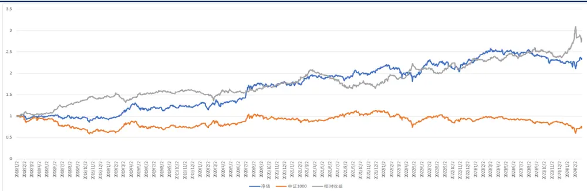
wind, , 2024.2.29

策略自 2023 年 12 月 1 日开始样本外跟踪，截至 2024 年 2 月 29 日，市场经历了大幅震荡，特别是中小盘指数和微盘股指数的大幅回撤，相比之下，大盘股指数表现相对稳定。具体而言，中证 500指数下跌了3.58%，中证1000指数下跌了 12.1%，而上证50指数上涨了 1.99%，沪深 300 指数上涨了 0.57%。

针对GUR策略，在样本外的表现显示，自2023年 12月份以来，策略实现了 2.33%的绝对收益，而基准中证 1000指数下跌了 12.1%。因此，策略在这一时期的超额收益达到了14.43%。此外，2024 年至今（2024.2.29），策略实现了 3.48%的绝对收益，超额收益为12.18%。市场上共有 2945 只股票型和偏股混合型基金，该策略排名第 249 位，即处于91.5%的分位数，显示了其相对较好的绩效表现。

图表 2 不同风格持仓占比

| 时间 | 大盘成长 | 大盘质量 | 大盘价值 | 小盘成长 | 小盘质量 | 小盘价值 |
| --- | --- | --- | --- | --- | --- | --- |
| 20231201 | 11% | 12% | 27% | 13% | 6% | 31% |
| 20231208 | 22% | 15% | 30% | 8% | 4% | 22% |
| 20231215 | 15% | 14% | 36% | 17% | 4% | 15% |
| 20231222 | 16% | 11% | 32% | 14% | 6% | 22% |
| 20231229 | 23% | 23% | 37% | 8% | 0% | 10% |
| 20240105 | 18% | 22% | 44% | 4% | 2% | 10% |
| 20240112 | 22% | 15% | 27% | 9% | 12% | 15% |
| 20240119 | 21% | 15% | 39% | 5% | 10% | 11% |
| 20240126 | 19% | 17% | 30% | 14% | 6% | 14% |
| 20240202 | 15% | 17% | 50% | 4% | 4% | 10% |
| 20240208 | 18% | 12% | 14% | 9% | 8% | 39% |
| 20240223 | 17% | 26% | 55% | 2% | 0% | 0% |
| 20240229 | 24% | 25% | 47% | 0% | 2% | 2% |

资料来源：wind，华创证券

上图表示自 23年12月以来组合每期持有的不同风格的个股总仓位，可以发现12月8日至 2 月 29 日大盘价值风格的平均仓位在六种风格中占比最高，其中 2 月 23 日的占比高达 55%。

图表 3 不同风格占比
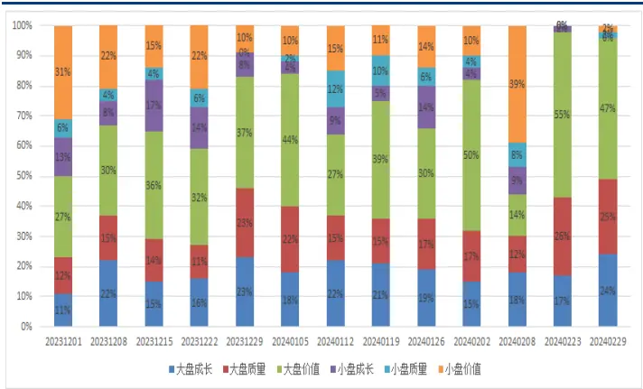
wind,

图表 4 大小盘总占比
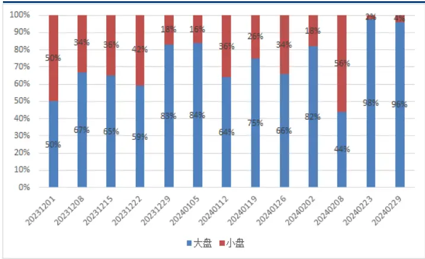
wind,

上两图表示样本外跟踪的风格持仓占比，23 年 12 月以来大盘的平均仓位为 72%，小盘的平均仓位为29%。其中，大盘价值的平均仓位最高（36%），大盘成长平均仓位次高（19%）。

而这段时间主流宽基指数中的上涨 50和沪深300的表现相对较好，市场的风格也由去年的小微盘股风格切换到大盘股风格。

## 2、canslim 策略历史回顾

图表 5 canslim 策略 2023 年 12 月以来走势
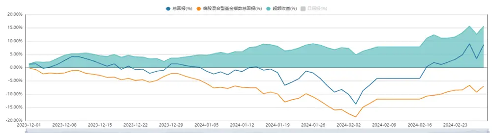
wind, , 2024.2.29

上图表呈现了 Canslim 2.0 策略自 2023 年 12 月以来的绩效数据。截至目前（2024.2.29），该策略的绝对收益率为 8.66%，相对偏股混合基金指数超额收益为 15.62%。主要归因于2024 年 2 月份以来成长因子大幅反弹，canslim 策略在 2 月份上涨 19.71%，相对基准超额 8.97%。

## 3、人气策略历史回顾

图表 6 人气策略2023年 12月以来走势
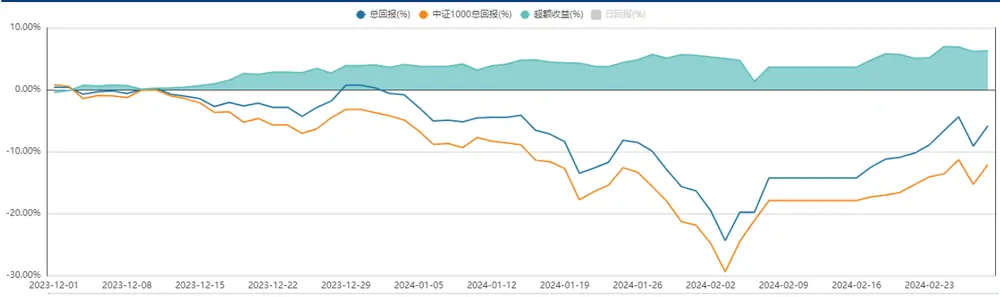
wind, , , , 2024.2.29

上图表呈现了人气策略自2023年 12月以来的绩效数据。截至目前（2024.2.29），该策略的绝对收益率为-5.81%，相对中证 1000指数超额收益为6.29%。人气组合采用同花顺的人气指标以及基于朝阳永续的分析师研报文本数据构建的情感因子作为基础构建的选股组合，组合持仓风格偏小盘股因此对比基准选择中证1000指数，自23年 12月以来组合相对基准有稳定的超额收益。

## （二）行业轮动现象

图表 7 中信一级行业2018年以来每半年涨幅排名

| 行业 |  | 2018/6/29 2018/12/28 2019/6/28 2019/12/31 2020/6/302020/12/31 2021/6/30\|2021/12/31 2022/6/30 2022/12/30 2023/6/30 2023/12/29 2024/2/29 平均排名 |  |  |  |  |  |  |  |  |  |  |  |  |  |  |
| --- | --- | --- | --- | --- | --- | --- | --- | --- | --- | --- | --- | --- | --- | --- | --- | --- |
| 煤炭(中信) | 16 | 20 | 15 | 4 |  |  | 23 | 26 | 28 | 30 | 8 | 13 |  | 30 | 30 | 18.85 |
| 银行(中信) | 23 | 30 | 16 | 20 |  | 3 | 14 | 19 |  | 26 | 18 | 17 |  | 26 | 29 | 18.77 |
| 食品饮料(中信) | 28 | 8 | 30 | 22 |  | 28 | 28 | 11 | 4 | 20 | 9 | 7 |  | 16 | 19 | 17.69 |
| 石油石化(中信) | 27 | 19 | 7 | 6 |  |  | 20 | 24 | 13 | 23 | 12 | 23 |  | 27 | 27 | 17.62 |
| 汽车(中信) | 17 | 12 | 3 | 23 |  | 15 | 27 | 21 | 20 | 21 | 4 | 22 |  | 25 | 15 | 17.31 |
| 消费者服务(中信) | 30 | 13 | 23 | 12 |  | 29 | 26 | 9 |  | 29 | 28 |  |  | 2 | 16 | 16.85 |
| 家电(中信) | 25 | 3 | 27 | 27 |  | 14 | 24 | 2 | 5 | 12 | 10 | 27 |  | 14 | 28 | 16.77 |
| 有色金属(中信) | 5 | 5 | 17 | 14 |  | 9 | 25 | 25 | 30 | 25 | 5 | 14 |  | 18 | 18 | 16.15 |
| 非银行金融(中信) | 9 | 28 | 29 | 11 |  | 4 | 18 | 1 | 6 | 10 | 26 | 18 |  | 23 | 26 | 16.08 |
| 交通运输(中信) | 22 | 14 | 18 | 7 |  | 6 | 16 | 12 | 11 | 28 | 29 3 | 8 |  | 12 | 25 | 16.00 |
| 电力设备及新能源(中信) | 3 | 24 | 12 | 17 |  | 25 24 | 30 | 28 | 27 | 14 22 | 16 | 11 |  |  | 12 | 15.92 |
| 农林牧渔(中信) 电力及公用事业(中信) | 12 | 29 | 28 | 15 5 |  | 11 | 8 11 | 5 16 | 12 26 |  | 23 | 4 21 |  | 22 | 9 | 15.85 |
|  | 14 | 21 | 8 | 26 |  | 30 | 12 | 22 | 2 | 11 8 | 14 | 10 |  | 17 24 | 22 | 15.85 |
| 医药(中信) | 29 | 1 15 | 21 19 | 16 |  | 17 | 22 | 18 | 21 | 9 | 13 | 26 |  |  | 4 | 15.62 |
| 机械(中信) | 6 | 2 | 24 | 30 |  | 27 | 13 | 23 | 15 |  | 6 | 25 |  | 10 21 | 10 | 15.54 |
| 电子(中信) | 11 | 16 |  |  | 29 | 18 | 19 | 17 | 16 | 19 |  | 5 |  |  | 3 | 15.46 |
| 建材(中信) | 13 |  | 25 |  | 18 | 20 |  | 7 | 19 | 7 | 19 |  | 30 | 8 | 14 | 15.38 |
| 通信(中信) | 4 26 | 25 10 | 22 26 |  | 25 | 26 | 5 | 13 | 9 | 4 | 17 |  | 28 | 5 3 | 23 | 15.38 |
| 计算机(中信) | 19 | 6 | 10 |  | 21 | 19 | 21 | 30 | 25 | 18 | 2 |  | 6 | 11 | 5 | 15.15 |
| 基础化工(中信) |  | 23 | 20 |  | 10 | 21 | 29 | 3 | 29 | 5 | 15 |  | 20 | 6 | 8 | 15.08 |
| 国防军工(中信) | 10 | 9 | 13 |  | 24 | 16 | 15 | 15 | 18 | 6 | 20 |  | 15 |  | 2 | 14.85 |
| 轻工制造(中信) | 21 18 | 18 |  |  |  | 8 | 17 | 29 | 23 | 13 | 7 |  | 12 | 13 | 6 | 14.69 |
| 钢铁(中信) | 24 | 4 | 4 5 |  | 8 | 10 | 10 | 20 | 7 | 16 | 27 |  | 19 | 20 28 | 21 | 14.69 |
| 纺织服装(中信) | 7 | 27 |  |  | 3 | 7 | 9 | 14 | 24 | 27 | 11 |  | 24 | 7 | 7 | 14.23 |
| 建筑(中信) | 20 | 11 | 11 |  | 2 | 23 | 4 | 10 | 14 | 17 | 30 |  | 9 | 15 | 20 11 | 13.92 13.62 |

wind, , 2024.2.29

近年来的市场风格的切换也影响着每个行业的走势变化，上图表示 2018年以来各中信一级行业的半年度涨幅排名图，过去半年涨幅越大行业排名越高。可以看出行业轮动的现象非常明显。

可以看出，煤炭、银行、石油石化及非银金融四个行业是去年下半年至今连续表现较好的行业，其中煤炭行业是去年下半年和 24 年至今表现最好的行业，但在 22 年下半年和23年上半年煤炭的表现非常一般。

## 1、FESC行业轮动策略历史回顾

图表 8 FESC 行业轮动策略 2023 年 12 月以来走势
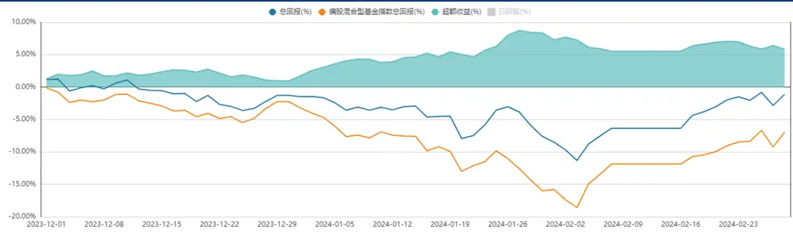
wind, , 2024.2.29

上图展示了FESC行业轮动策略2023年12月以来的绩效走势，23年12月至今（2024.2.29）FESC 行业轮动策略绝对收益-1.11%，相对偏股混合基金指数超额收益 5.85%。24 年至今（2024.2.29），行业轮动策略绝对收益 0.18%，相对收益 5.01%。

## 二、深度时序因子集成

## （一）模型概述

在之前的报告《AI+HI 系列：PatchTST、TSMixer、ModernTCN 时序深度网络构建量价因子》中我们介绍了三个Patch +通道独立的设计时序深度学习模型，它们分别基于自注意力、MLP、CNN实现时序信息挖掘。

我们在先前报告的测试发现，不同架构深度学习模型均能挖掘出 IC 较高的量价因子，但TOP 组的多头收益、回撤表现差异较大，合理的骨干网络设计可能有助于提高多头组性能；架构差异更大的模型相关性低。

图表 9 模型流程
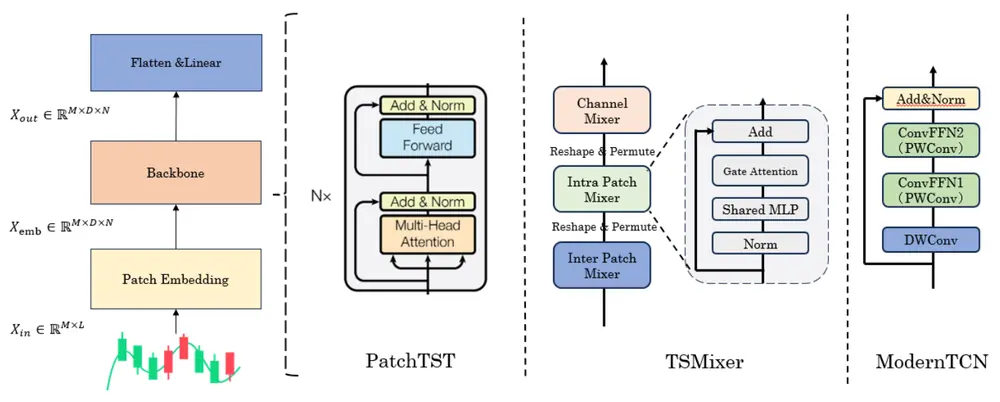
Vaswani, Ashish, et al. "Attention is all you need."

上图展示了PatchTST、TSMixer、ModernTCN 模型的大致流程，考虑一个多变量时序类数据输入 $X_{\mathrm{in}}\in\mathbb{R}^{M\times L}$ ：

在嵌入步骤首先将多变量序列分为多个单变量序列，对单变量序列进行Patch操作，用一个长度为P 的窗口在时序上进行滑动截取，滑动步长为 S，Patch处理后原始序列长度从 L变为N，最后将每个长度为P 的子序列映射至目标嵌入维度D，数据形状从初始的(M,L)变为(M,D,N)；

将嵌入处理后的数据输入骨干网络中，基于自注意力/ MLP / CNN 架构的骨干网络学习时序维度、变量维度（通道维度）、特征维度的信息交互，骨干网络输出数据形状为(M,D,N)，对骨干网络的输出进行展平等处理后接入对应任务的线性层。

图表 10 GRU 模型
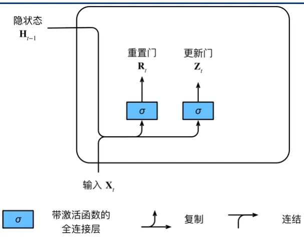
Zhang, A., Lipton, Z. C., Li, M., & Smola, A. J. "Dive into Deep Learning.",

因在本篇报告中我们进一步加入 GRU 模型，考虑多模型集成的应用。GRU 模型属于通道混合模型，通过门控循环机制学习输入的时序交互，对一个形状为(M,L)的输入样本，通常取最后一个时间步的GRU输出作为样本的表征，输出形状为(M,D)，其中D 为时点token的嵌入维度。

## （二）时序因子相关性分析

本部分我们尝试构建集成因子。在对因子进行集成之前我们先对因子的相关性进行分析：我们首先对因子之间的相关性进行分析，结果如下：

图表 11 时序因子相关性

|  | GRU | ModernTCN | PatchTST | Transformer | TSMixer |
| --- | --- | --- | --- | --- | --- |
| GRU | 1.00 |  |  |  |  |
| ModernTCN | 0.65 | 1.00 |  |  |  |
| PatchTST | 0.59 | 0.82 | 1.00 |  |  |
| Transformer | 0.55 | 0.80 | 0.88 | 1.00 |  |
| TSMixer | 0.64 | 0.89 | 0.82 | 0.80 | 1.00 |

资料来源：wind，华创证券

上图表示 5 个时序模型单因子及其组合之后生成的集成因子之间的相关性，首先 5 个单因子间GRU因子与其他四个因子的相关性略低，GRU与PatchTST、TSMixer、ModernTCN、Transformer 的相关性分别为：0.65、0.59、0.55、0.64。而其他四个单因子间的相关性均较高（均大于 0.8）。归因于我们在构建GRU因子过程中采用的双任务的方式，首先以收益率作为目标进行学习，再使用分类任务作为目标继续训练模型。

## （三）时序因子测试

再进行因子集成前我们先对每个因子进行测试，对比其中的测试结果；

图表 12 时序因子IC测试结果

|  | 平均值 | 标准差 | 最小值 | 25%分位数 | 中位数 | 75%分位数 | 最大值 | 绝对值均值 | 大于0占比 | 年化IC_IR | IC的t统计量 |
| --- | --- | --- | --- | --- | --- | --- | --- | --- | --- | --- | --- |
| GRU | 0.084 | 0.105 | -0.218 | 0.02 | 0.087 | 0.147 | 0.445 | 0.11 | 0.813 | 5.789 | 14.112 |
| ModernTCN | 0.097 | 0.121 | -0.289 | 0.011 | 0.104 | 0.178 | 0.448 | 0.126 | 0.784 | 5.795 | 14.126 |
| PatchTST | 0.093 | 0.124 | -0.35 | 0.008 | 0.093 | 0.184 | 0.416 | 0.126 | 0.777 | 5.429 | 13.234 |
| Transformer | 0.095 | 0.129 | -0.322 | 0.01 | 0.102 | 0.18 | 0.418 | 0.131 | 0.761 | 5.316 | 12.958 |
| TSMixer | 0.099 | 0.119 | -0.237 | 0.014 | 0.104 | 0.175 | 0.457 | 0.127 | 0.794 | 5.976 | 14.568 |

资料来源：wind，华创证券

上图表示 5 个时序因子的 IC 测试结果，对比各因子的 IC 统计结果相差不大，从数据上来看 TSMixer 的测试结果在几个时序因子中效果最佳。IC 的均值和中位数分别为 0.099和0.104，年化IC_IR 为5.976，三个维度均为几个时序因子中最大值。GRU因子的IC 大于0占比为 81.3%，在几个因子中值最大。

图表 13 时序因子多头组测试结果

|  | 年化收益 | 年化波动率 | 最大回撤 | 夏普比率 | 年化超额收益 | 相对收益年化波动率 | 相对收益最大回撤 | 信息比率 | 换手率 |
| --- | --- | --- | --- | --- | --- | --- | --- | --- | --- |
| GRU | 27.4% | 0.21 | -24.0% | 1.27 | 26.7% | 0.07 | -5.0% | 3.73 | 72.34 |
| ModernTCN | 21.4% | 0.21 | -23.8% | 1.03 | 20.6% | 0.09 | -6.9% | 2.38 | 69.72 |
| PatchTST | 20.6% | 0.20 | -20.0% | 1.05 | 19.5% | 0.09 | -10.0% | 2.29 | 64.38 |
| Transformer | 17.8% | 0.19 | -18.9% | 0.94 | 16.5% | 0.10 | -12.4% | 1.76 | 55.94 |
| TSMixer | 26.2% | 0.20 | -18.4% | 1.24 | 25.1% | 0.09 | -9.1% | 2.93 | 72.32 |

资料来源：wind，华创证券

上图表示时序因子在全 A 上分 20 组测试时的多头结果，GRU 因子的年化收益最大，夏普比率1.27也是几个因子中的最大值。其次为TSMixer因子，该因子年化收益率为26.2%，夏普比率为1.24。

## （四）时序因子集成及测试

根据上文的介绍我们发现单纯以目前的输入特征来看（高、开、低、收、成交量、均价），不同的时序模型虽然架构会有差异，从最终的合成因子的测试结果来看，各时序因子的相关性非常高，同时 IC 的测试结果也比较相近。因此我们采用中性化的方式进行两阶段合成，首先将 ModernTCN、PatchTST、Transformer、TSMixer 四个相关性很高的因子进行合成，然后再将GRU与合成因子进行集成生成Ensemble_factor。

## 1、全 A测试结果

本部分开始我们对集成因子在不同的股票池上进行测试来探讨其适用域，我们选择的股票池也都是市场近年来关注度最热的股票池。

首先我们在全A上对集成因子进行测试，测试结果如下：

- 因子 IC 测试结果

图表 14 全A因子 IC统计结果

|  | 平均值 | 标准差 | 最小值 | 25%分位数 | 中位数 | 75%分位数 | 最大值 | 绝对值均值 | 大于０占比 | 年化IC_IR | IC 的t统计量 |
| --- | --- | --- | --- | --- | --- | --- | --- | --- | --- | --- | --- |
| Ensemble_factor | 0.101 | 0.115 | -0.215 | 0.029 | 0.108 | 0.175 | 0.46 | 0.128 | 0.803 | 6.371 | 15.532 |

资料来源：wind，华创证券

图表 15 全 A 因子 IC 历史表现
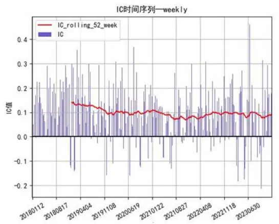
资料来源：wind，华创证券

图表 16 全 A 因子衰减
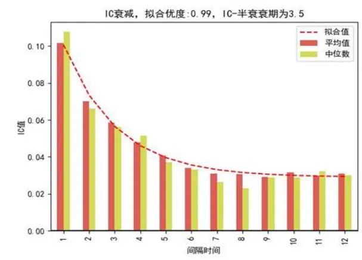
资料来源：wind，华创证券

上述图表均是 Ensemble_factor 在全 A 上的 IC 测试结果，对比图表 12 中各时序因子的IC 测试结果，集成因子的IC 均值和中位数均有提升，另外其年化 IC_IR 提升到6.37。

图表 17 全A因子分组超额收益曲线
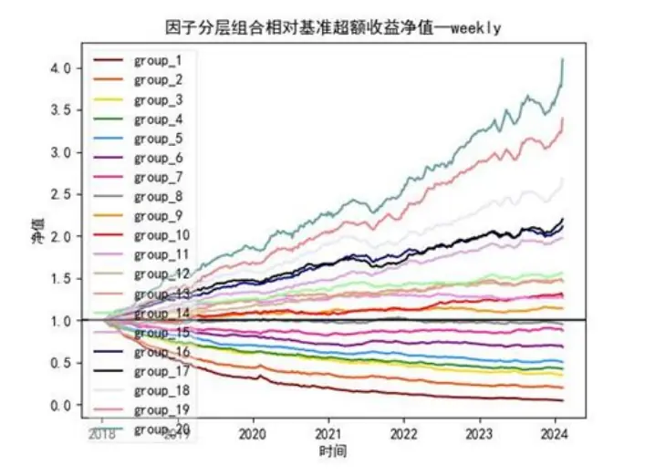
wind,

图表 18 全 A因子分组绩效对比
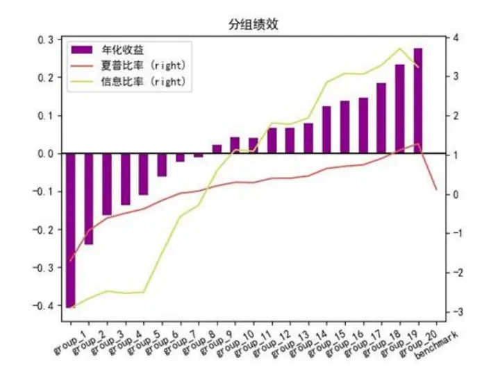
资料来源：wind，华创证券

图表 19 全 A 因子 group_20 收益统计

| 因子 | 年化收益 | 年化波动率 | 最大回撤 | 夏普比率 | 年化超额收益 | 相对收益年化波动率 | 相对收益最大回撤 | 信息比率 | 换手率 |
| --- | --- | --- | --- | --- | --- | --- | --- | --- | --- |
| Ensemble_factor | 0.2752 | 0.2074 | -0.2084 | 1.2825 | 0.2661 | 0.0849 | -0.0659 | 3.2353 | 66.45 |

资料来源：wind，华创证券

上述图表代表集成因子的分组测试结果，可以看出在分 20组的情况下因子的区分度依然非常显著，多头分组的年化收益为 27.52%，最大回撤20.84%，相比GRU 因子有了明显提升，换手率 66.45相比GRU因子也有一定的提升。

## 2、宽基成分股测试结果

在本部分我们对比因子在三个宽基指数上的测试结果，同样从 IC 和分组的结果来分析，另外鉴于沪深 300 与中证 500 的成分股数量较少我们考虑分 10 组来对比，而对于中证1000我们依然采用分 20组。测试结果如下：

- 因子 IC 测试结果

图表 20 宽基因子IC统计结果

|  | 平均值 | 标准差 | 最小值 | 25%分位数 | 中位数 | 75%分位数 | 最大值 | 绝对值均值 | 大于0占比 | 年化 IC_IR | IC 的t 统计量 |
| --- | --- | --- | --- | --- | --- | --- | --- | --- | --- | --- | --- |
| 沪深300 | 0.079 | 0.15 | -0.434 | -0.021 | 0.075 | 0.178 | 0.488 | 0.134 | 0.7 | 3.777 | 9.208 |
| 中证 | 0.0951000 | 0.12 | -0.276 | 0.017 | 0.098 | 0.174 | 0.437 | 0.126 | 0.794 | 5.715 | 13.931 |
| 中证500 | 0.083 | 0.132 | -0.297 | -0.002 | 0.089 | 0.157 | 0.498 | 0.124 | 0.742 | 4.518 | 11.014 |

wind,

图表 21 沪深300因子 IC历史表现
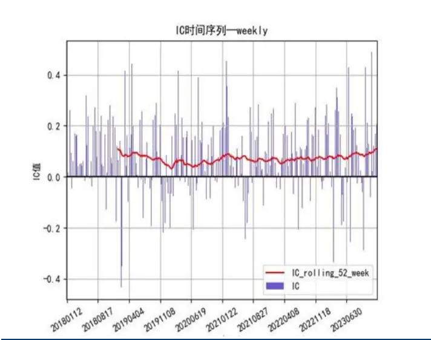
资料来源：wind，华创证券

图表 22 中证 500因子 IC历史表现
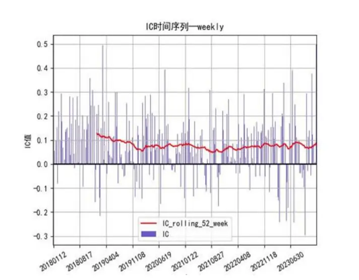
资料来源：wind，华创证券

图表 23 中证1000因子 IC历史表现
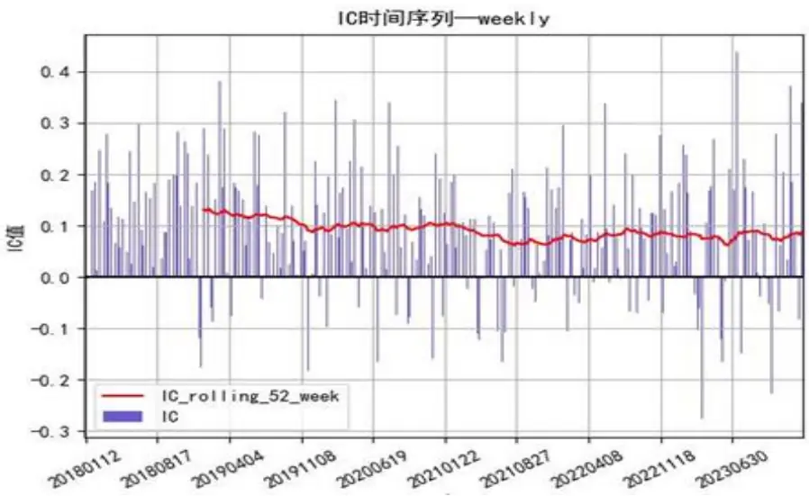
资料来源：wind，华创证券

上述图表均是Ensemble_factor在不同宽基上的IC 测试结果，图表20可以发现即使在沪深 300 股票池中集成因子的 IC 均值和中位数均可达到 0.07 以上，IC 大于 0 占比也可达70%。三个宽基中，在中证 1000 上的 IC 测试结果最佳，IC 的均值和中位数均接近 0.1，大于0占比高达79.4%。在中证500上的IC测试结果次佳，IC均值和中位数均大于0.08，IC 大于 0 占比为 74.2%。

图表 24 沪深300因子分组超额收益曲线
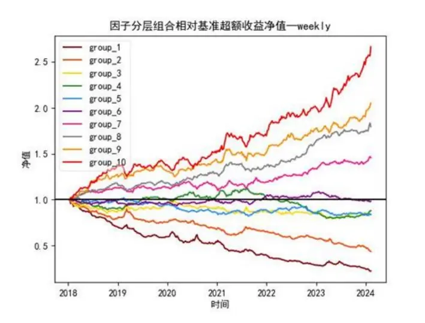
资料来源：wind，华创证券

图表 25 多头相对沪深300历史收益
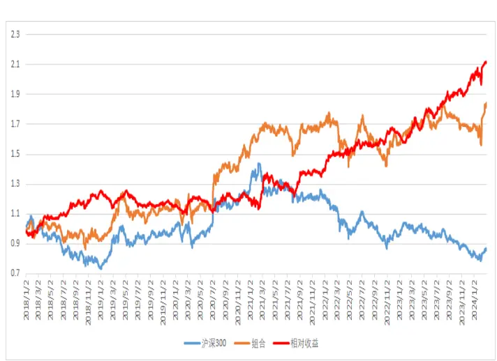
资料来源：wind，华创证券

图表 26 中证500因子分组超额收益曲线
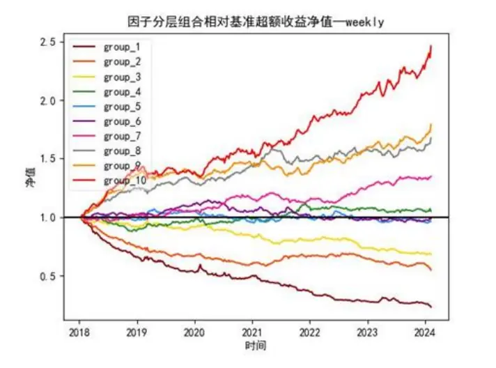
资料来源：wind，华创证券

图表 27 多头相对中证 500 历史收益
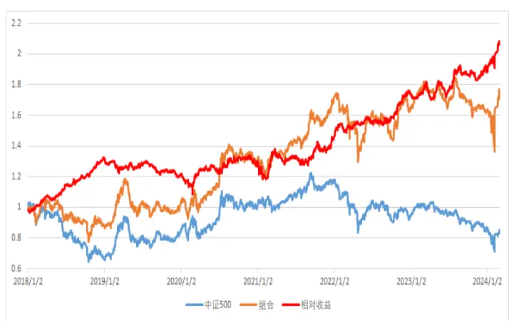
资料来源：wind，华创证券

图表 28 中证1000因子分组超额收益曲线
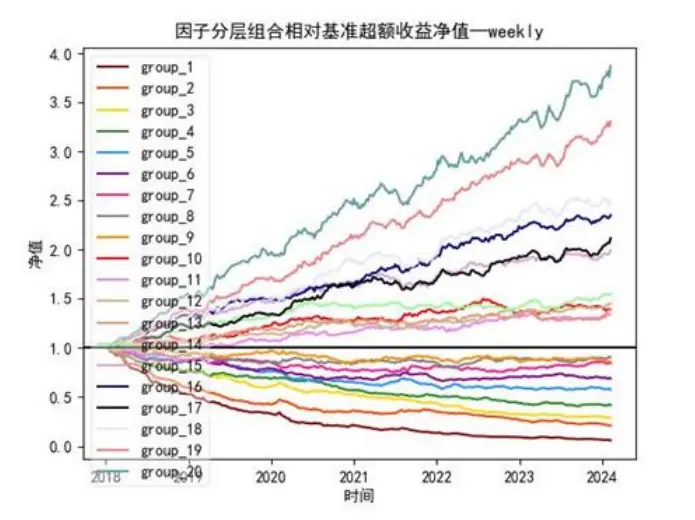
wind,

图表 29 多头相对中证1000历史收益
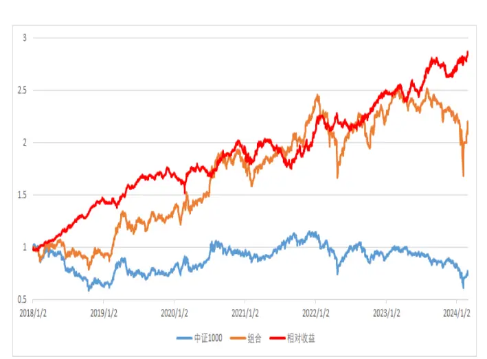
资料来源：wind，华创证券

图表 30 宽基测试结果对比

|  | 沪深300 |  |  | 中证500 |  |  | 中证1000 |  |  |
| --- | --- | --- | --- | --- | --- | --- | --- | --- | --- |
|  | 策略组合 | 基准 | 超额 | 策略组合 | 基准 | 超额 | 策略组合 | 基准 | 超额 |
| 2018 | -6.5% | -26.3% | 19.9% | -11.5% | -34.2% | 22.7% | -7.2% | -37.5% | 30.3% |
| 2019 | 26.7% | 38.0% | -11.2% | 17.9% | 27.5% | -9.5% | 48.3% | 26.3% | 22.0% |
| 2020 | 29.5% | 25.5% | 4.0% | 26.5% | 18.7% | 7.8% | 34.1% | 17.1% | 17.1% |
| 2021 | 9.1% | -6.2% | 15.3% | 29.3% | 13.5% | 15.8% | 28.5% | 17.8% | 10.7% |
| 2022 | -8.8% | -21.3% | 12.5% | -5.3% | -20.3% | 14.9% | -7.6% | -21.3% | 13.7% |
| 2023 | 8.6% | -11.7% | 20.4% | -0.9% | -8.8% | 8.0% | -0.5% | -8.4% | 7.9% |
| 2024 | 9.2% | 3.8% | 5.4% | 8.1% | -1.2% | 9.3% | -3.7% | -8.7% | 5.0% |

资料来源：wind，华创证券

上述图表代表集成因子在不同宽基上的分组测试结果，我们可以看到集成因子在三个宽基上的区分度均非常高，尤其在中证 1000 指数成分股中，组合每年对比中证 1000 指数均有显著的超额，24年至今（2024.2.29）累计超额收益已达5%。

另外，集成因子在沪深300和中证 500上的区分度在19年较差，组合相对沪深300在 19年超额收益为-11.2%，相对中证500在19 年超额收益为-9.5%。但过去6 年中仅 19年跑输对应的宽基基准。

## 3、风格池测试结果

在之前的报告《AI+HI系列：GRU网络在风格自适应中的创新与应用》中我们提出使用六种风格指数来对市场状态进行划分，分别为：大盘成长、大盘质量、大盘价值、小盘成长、小盘质量、小盘价值，过去六年中的市场风格切换也均为这六种风格的切换。这些指数均采用特定的财务指标作为筛选依据，以月度频率从市场中选取 50只符合条件的股票进行组合。

图表 31 六大风格指数历史走势
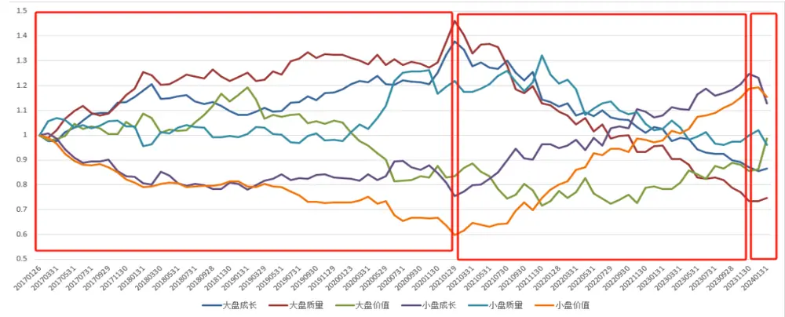
资料来源：wind，华创证券

按照我们划分结果来进行切分，近年来的风格切换发生在 21 年初，在 21 年之前市场偏向于大盘质量与大盘成长风格，而在 21年之后市场则是小盘成长与小盘价值占优，其中小盘价值的表现更加出色。自 23 年 12 月份以来市场的风格再次发生切换，之前持续走强的小盘成长与小盘价值开始回撤，大盘价值开始走强。我们之前的GRU 选股策略在样本外正因为重仓了大盘价值股，才有了不错的超额收益。

- 风格池内因子 IC 测试结果

图表 32 风格池因子IC统计结果

|  | 平均值 | 标准差 | 最小值 | 25%分位数 | 中位数 | 75%分位数 | 最大值 | 绝对值均值 | 大于0占比 | 年化IC_IR | IC 的 t统计量 |
| --- | --- | --- | --- | --- | --- | --- | --- | --- | --- | --- | --- |
| Ensemble_factor | 0.08 | 0.144 | -0.4 | -0.016 | 0.084 | 0.189 | 0.472 | 0.134 | 0.703 | 4.003 | 9.759 |

资料来源：wind，华创证券

图表 33 风格池因子IC历史表现
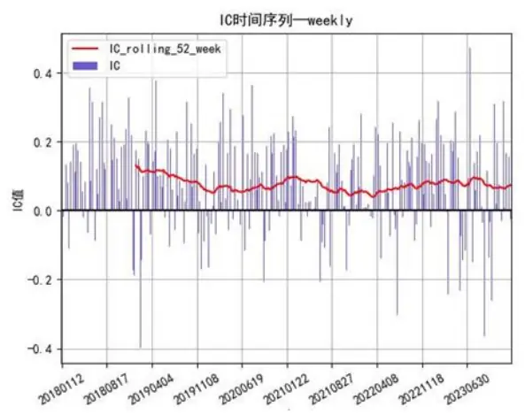
资料来源：wind，华创证券

图表 34 风格池因子衰减
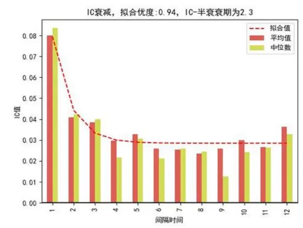
资料来源：wind，华创证券

上述图表均是Ensemble_factor在风格池上的IC 测试结果，对比在沪深300上的 IC 测试结果，风格池上的 IC 均值和中位数均略有提升，IC均值和中位数均大于 0.08，年化IC_IR也大于 4。

鉴于我们的风格池每个截面约300 只股票，我们同样也选择分 10组的方式进行测试：

图表 35 风格池因子分组超额收益曲线
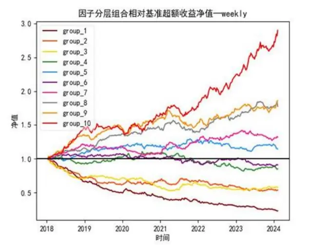
wind,

图表 36 风格池因子分组绩效对比
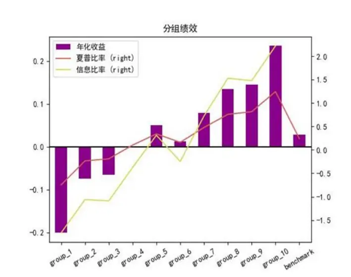
wind,

图表 37 风格池因子 group_10 收益统计

| 因子 | 年化收益 | 年化波动率 | 最大回撤 | 夏普比率 | 年化超额收益 | 相对收益年化波动率 | 相对收益最大回撤 | 信息比率 | 换手率 |
| --- | --- | --- | --- | --- | --- | --- | --- | --- | --- |
| Ensemble_factor | 0.2356 | 0.1842 | -0.1547 | 1.2465 | 0.1949 | 0.0933 | -0.1074 | 2.2237 | 61.34 |

wind,

上述图表代表Ensemble_factor在风格池中的分组测试结果，可以看出在风格池中因子的区分度同样非常显著，多头分组的年化收益为 23.56%，最大回撤 15.47%，换手率 61.34相比GRU因子也有一定的提升。

## 4、基金重仓股测试结果

对于基金重仓股的定义，我们在报告《CANSLIM 2.0 投资法——华创金工大师系列成长型之一》中进行过介绍，这里不再赘述，我们统计下近年来基金重仓股的个数：

图表 38 基金重仓股样本量
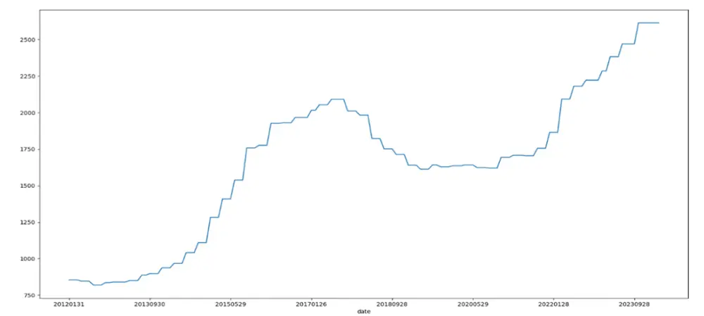
资料来源：wind，华创证券

2012年以来，每期重仓股平均 1657只个股，最大数量为2615只，最少为820只。其中1657 只个股基本涵盖中证 800 及中证 1000 中大多数个股，同时个股也均为机构的重仓股，对于机构来说满足“可投资”这一要求。

- 基金重仓股内因子 IC 测试结果

图表 39 基金重仓股因子 IC统计结果

|  | 平均值 | 标准差 | 最小值 | 25%分位数 | 中位数 | 75%分位数 | 最大值 | 绝对值均值 | 大于0占比 | 年化IC_IR | IC的t统计量 |
| --- | --- | --- | --- | --- | --- | --- | --- | --- | --- | --- | --- |
| Ensemble_factor | 0.081 | 0.123 | -0.287 | 0.003 | 0.088 | 0.168 | 0.463 | 0.12 | 0.752 | 4.774 | 11.639 |

资料来源：wind，华创证券

图表 40 基金重仓股因子 IC历史表现
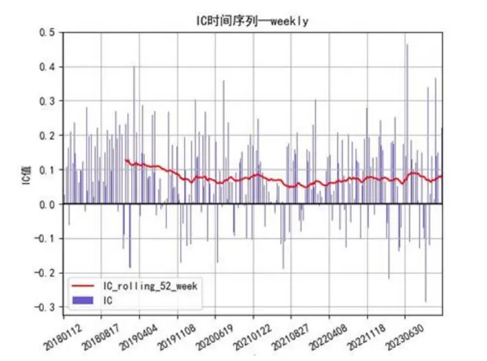
资料来源：wind，华创证券

图表 41 基金重仓股因子衰减
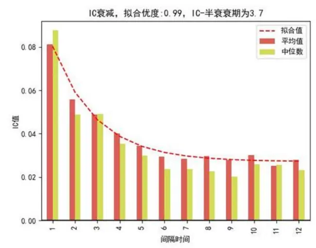
资料来源：wind，华创证券

上述图表均是 Ensemble_factor 在基金重仓股上的 IC 测试结果，对比在风格池上的测试结果略有增强，IC 均值和中位数由 0.08 和 0.084 提高到 0.081 和 0.088，IC 大于 0 占比由 70.3%提升到 75.2%，年化 IC_IR 由 4 提升到 4.7。

鉴于我们的基金重仓股数量平均超过 1000只股票，我们选择分 20组的方式进行测试：

图表 42 基金重仓股因子分组超额收益曲线
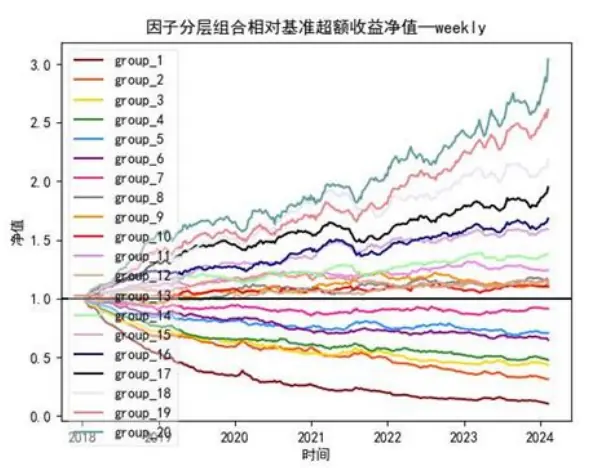
资料来源：wind，华创证券

图表 43 基金重仓股因子分组绩效对比
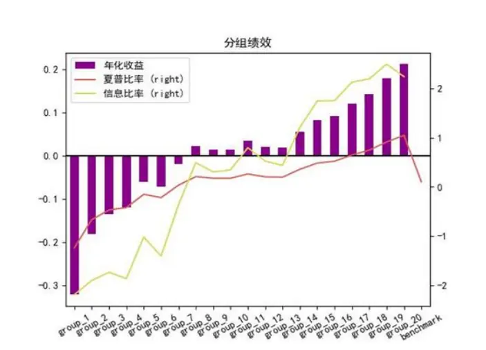
资料来源：wind，华创证券

图表 44 基金重仓股因子 group_20收益统计

| 因子 | 年化收益 | 年化波动率 | 最大回撤 | 夏普比率 | 年化超额收益 | 相对收益年化波动率 | 相对收益最大回撤 | 信息比率 | 换手率 |
| --- | --- | --- | --- | --- | --- | --- | --- | --- | --- |
| Ensemble_factor | 0.2118 | 0.2043 | -0.2197 | 1.047 | 0.2044 | 0.0951 | -0.0812 | 2.2398 | 65.98 |

资料来源：wind，华创证券

上述图表代表Ensemble_factor在基金重仓股中的分组测试结果，可以看出在基金重仓股中因子的区分度同样非常显著，多头分组的年化收益为 21.18%，最大回撤21.97%。

## 三、应用

通过上文的分析，我们可以看到集成因子 Ensemble_factor在全A样本和小样本（宽基指数、风格池、基金重仓股）中的分组效果均表现出色。在本部分，我们将深入研究 GRU网络在选股和ETF轮动上的应用。

## （一）风格池内选股组合

## 1、历史回溯

- 测试方法介绍

我们按照如下方法进行回测：

数据：2018年01月01日至 2024 年2月29日的风格指数基准池。

调仓频率：周度调仓，调仓日为每周的第一个交易日，考虑停牌、涨跌停对交易影响。

仓位控制：等权调仓，同时个股的最大持仓比例不超过 5%。

调仓规则：每期选择因子得分最高的 TOP30个股作为下期调仓名单。

策略基准：我们使用了风格基准池作为比较基准。

资金在选出股票上平均分配，交易费用买卖各收千分之 1.5。

- 测试结果

图表 45 策略净值
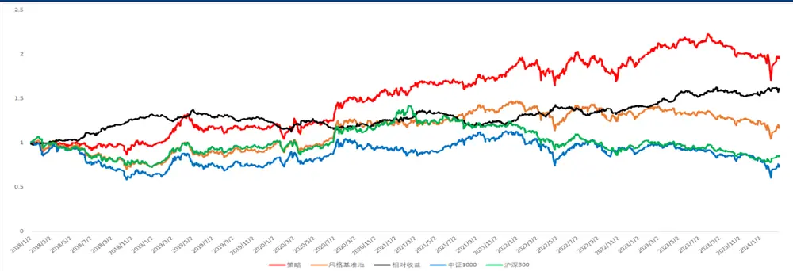
资料来源：wind，华创证券

上图表示 2018年来策略、风格基准池、沪深 300、中证1000及策略相对风格基准池的超额收益。其中风格基准池我们按照每个月的各风格筛选的成分股，在次月初等权买入的方式构建组合。

可以发现策略长期来看稳定跑赢风格基准及沪深 300、中证1000。策略组合2018年来年化收益率 12.1%，最大回撤 23.4%，换手率 58 倍。风格基准组合 2018 年来年化收益率3.2%，最大回撤 31.8%，策略相对收益 8.9%。

## 策略分析

图表 46 行业分布
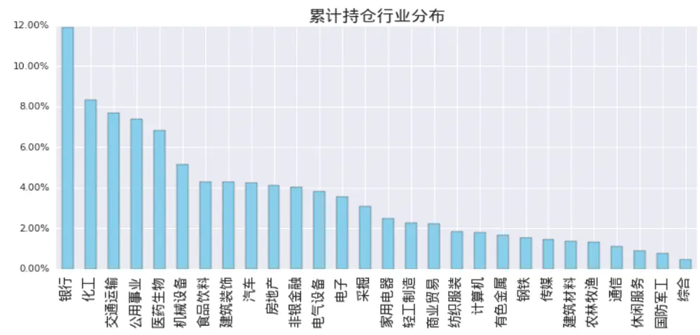
资料来源：wind，华创证券

在持仓行业中，银行、化工、交通运输、公用事业、医药这五个行业的平均仓位最高，均超过6%。其次，机械设备、汽车、房地产、非银金融等行业持仓比例也较高，其平均仓位均超过 4%。多元化的投资组合策略有助于分散特定行业或市场风险，从而提高整体投资组合的稳定性和抗风险能力。

图表 47 市值分布
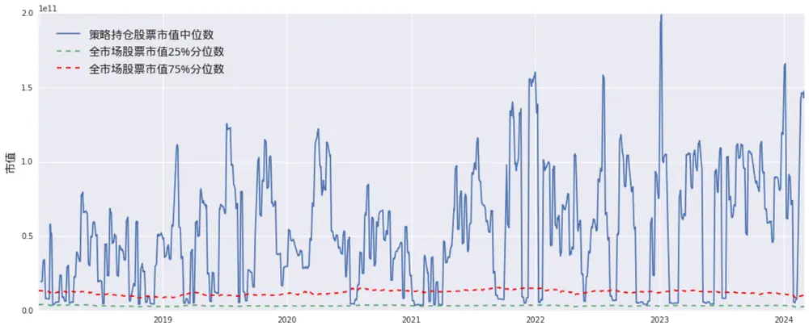
资料来源：wind，华创证券

从风格基准池的构成来看，其中有一半的成分为大市值的股票，因此策略的历史持仓有超过一半的仓位为大市值股票，历史的市值中位数为 495亿。统计结果来看，策略在 78%以上的时间持仓个股的市值中位数均在 100亿以上。

## 2、最新 TOP30个股名单

图表 48 最新 TOP30 个股名单

| 股票代码 | 股票名称 | 中信一级行业 | PE(TTM) | 最新收盘价 | 市值（亿元） |
| --- | --- | --- | --- | --- | --- |
| 002027.SZ | 分众传媒 | 传媒 | 17.46 | 5.19 | 797.21 |
| 603053.SH | 成都燃气 | 电力及公用事业 | 16.70 | 9.02 | 82.67 |
| 601877.SH | 正泰电器 | 电力设备及新能源原 | 17.66 | 26.40 | 575.76 |
| 601318.SH | 中国平安 | 非银行金融 | 7.32 | 38.66 | 7600.92 |
| 603067.SH | 振华股份 | 基础化工 | 19.14 | 14.76 | 76.45 |
| 000651.SZ | 格力电器 | 家电 | 7.28 | 30.71 | 1826.26 |
| 603579.SH | 荣泰健康 | 家电 | 15.40 | 19.58 | 28.08 |
| 603195.SH | 公牛集团 | 家电 | 29.46 | 92.87 | 844.62 |
| 600233.SH | 圆通速递 | 交通运输 | 22.06 | 20.42 | 713.00 |
| 002352.SZ | 顺丰控股 | 交通运输 | 38.39 | 46.99 | 2311.51 |
| 002594.SZ | 比亚迪 | 汽车 | 134.20 | 250.91 | 7336.37 |
| 600741.SH | 华域汽车 | 汽车 | 8.32 | 15.76 | 520.83 |
| 600104.SH | 上汽集团 | 汽车 | 9.22 | 13.97 | 1670.73 |
| 603058.SH | 永吉股份 | 轻工制造 | 47.91 | 6.90 | 29.63 |
| 600887.SH | 伊利股份 | 食品饮料 | 22.18 | 31.83 | 2110.50 |
| 002956.SZ | 西麦食品 | 食品饮料 | 38.84 | 12.13 | 27.57 |
| 601607.SH | 上海医药 | 医药 | 11.69 | 16.03 | 610.28 |
| 002393.SZ | 力生制药 | 医药 | 29.88 | 21.48 | 39.68 |
| 002603.SZ | 以岭药业 | 医药 | 25.39 | 21.28 | 362.71 |
| 002252.SZ | 上海莱士 | 医药 | 24.86 | 5.31 | 359.28 |
| 600332.SH | 白云山 | 医药 | 11.08 | 25.39 | 422.06 |
| 600085.SH | 同仁堂 | 医药 | 46.39 | 45.27 | 624.70 |
| 601916.SH | 浙商银行 | 银行 | 4.96 | 2.61 | 633.81 |
| 601939.SH | 建设银行 | 银行 | 4.44 | 5.18 | 13800.61 |
| 600919.SH | 江苏银行 | 银行 | 4.80 | 6.95 | 1098.86 |
| 601009.SH | 南京银行 | 银行 | 6.18 | 9.87 | 1084.16 |
| 601818.SH | 光大银行 | 银行 | 3.44 | 2.65 | 1523.70 |
| 600016.SH | 民生银行 | 银行 | 4.57 | 3.21 | 1484.22 |
| 601328.SH | 交通银行 | 银行 | 3.83 | 4.33 | 3430.94 |
| 600000.SH | 浦发银行 | 银行 | 3.87 | 6.74 | 2066.39 |

wind, 2024.3.13

从最新一期的持仓来看，其中大盘股的整体总个数24 只，小盘股个数6 只。另外，其中不乏很多耳熟能详的机构重仓股，如建设银行、中国平安、比亚迪、交通银行等。

## （二）基金重仓股内选股组合

## 1、历史回溯

## 测试方法介绍

我们按照如下方法进行回测：

数据：2018年01月01日至 2024 年2月29日的基金重仓股基准池。

调仓频率：周度调仓，调仓日为每周的第一个交易日，考虑停牌、涨跌停对交易影响。

仓位控制：等权调仓，同时个股的最大持仓比例不超过 5%。

调仓规则：每期选择因子得分最高的 TOP30个股作为下期调仓名单。

策略基准：我们使用了风格基准池作为比较基准。

资金在选出股票上平均分配，交易费用买卖各收千分之 1.5。

- 测试结果

图表 49 策略净值
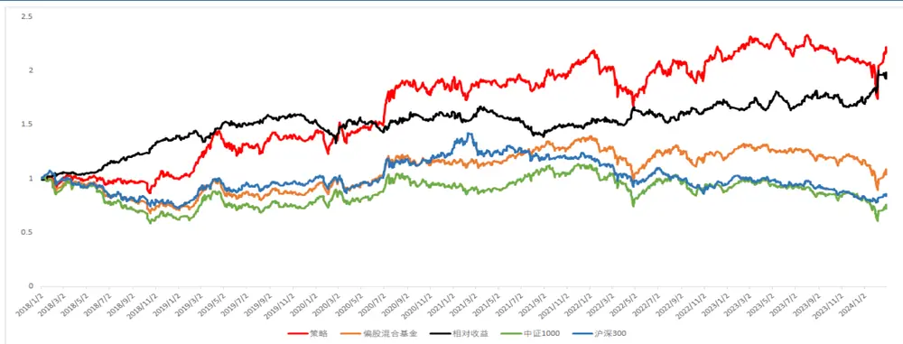
资料来源：wind，华创证券

上图表示 2018年来策略、基金重仓股基准池、沪深 300、中证 1000及策略相对基金重仓股基准池的超额收益。其中基金重仓股基准池我们按照每个月末进行筛选，在次月初等权买入的方式构建组合。

可以发现策略长期来看稳定跑赢基金重仓股基准及沪深300、中证 1000。策略组合2018年来年化收益率 13.5%，最大回撤 27.8%，换手率77倍。基金重仓股基准组合2018年来年化收益率 1.4%，最大回撤35.7%，策略相对收益12.1%。

另外，策略 2024 年至今（2024.2.29）绝对收益 2.8%，基金重仓股-2.25%，超额收益 5.05%。

## 策略分析

图表 50 行业分布
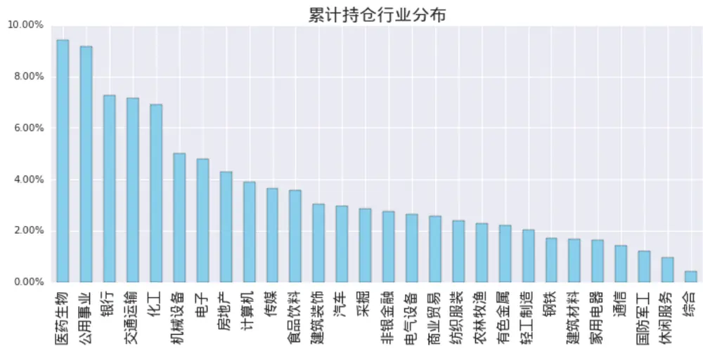
资料来源：wind，华创证券

在持仓行业中，医药、公用事业、银行、交通运输、化工这四个行业的平均仓位最高，均超过6%。其次，机械设备、电子、房地产行业持仓比例也较高，其平均仓位均超过 4%。

图表 51 市值分布
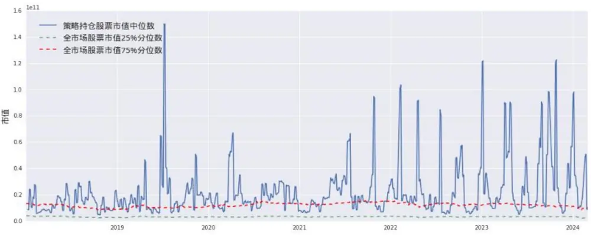
wind,

从基金重仓股基准池的筛选条件来看，至少有单只基金重仓个股或者至少有 6 家机构持仓该个股，因此股票池中的个股市值偏中大盘风格，历史的市值中位数为 156 亿。统计结果来看，策略在 73.5%以上的时间持仓个股的市值中位数均在 100亿以上。

## 2、最新 TOP30个股名单

图表 52 最新 TOP30 个股名单

| 股票代码 | 股票名称 | 中信一级行业 | PE(TTM) | 最新收盘价 | 市值（亿元） |
| --- | --- | --- | --- | --- | --- |
| 601877.SH | 正泰电器 | 电力设备及新能源1 | 7.66 | 26.40 | 575.76 |
| 002169.SZ | 智光电气 | 电力设备及新能源 | -11.01 | 8.16 | 65.07 |
| 601377.SH | 兴业证券 | 非银行金融 | 12.80 | 5.18 | 470.66 |
| 002736.SZ | 国信证券 | 非银行金融 | 9.69 | 8.35 | 826.67 |
| 000778.SZ | 新兴铸管 | 钢铁 | 8.21 | 3.47 | 142.84 |
| 600309.SH | 万华化学 | 基础化工 | 13.45 | 90.40 | 2891.71 |
| 002734.SZ | 利民股份 | 基础化工 | 15.87 | 8.75 | 33.49 |
| 603639.SH | 海利尔 | 基础化工 | 13.66 | 20.86 | 75.22 |
| 603968.SH | 醋化股份 | 基础化工 | 13.08 | 18.71 | 40.08 |
| 600195.SH | 中牧股份 | 农林牧渔 | 29.59 | 12.96 | 134.38 |
| 600104.SH | 上汽集团 | 汽车 | 9.22 | 13.97 | 1670.73 |
| 600858.SH | 银座股份 | 商贸零售 | 44.86 | 5.31 | 27.62 |
| 002275.SZ | 桂林三金 | 医药 | 19.64 | 12.52 | 78.44 |
| 002603.SZ | 以岭药业 | 医药 | 25.39 | 21.28 | 362.71 |
| 002382.SZ | 蓝帆医疗 | 医药 | -3.18 | 7.38 | 78.35 |
| 002252.SZ | 上海莱士 | 医药 | 24.86 | 5.31 | 359.28 |
| 002030.SZ | 达安基因 | 医药 | 4.14 | 14.28 | 232.69 |
| 600664.SH | 哈药股份 | 医药 | 44.11 | 2.64 | 66.61 |
| 601089.SH | 福元医药 | 医药 | 20.44 | 14.91 | 73.10 |
| 600332.SH | 白云山 | 医药 | 11.08 | 25.39 | 422.06 |
| 002688.SZ | 金河生物 | 医药 | 52.28 | 5.14 | 40.97 |
| 600085.SH | 同仁堂 | 医药 | 46.39 | 45.27 | 624.70 |
| 600267.SH | 海正药业 | 医药 | 24.13 | 10.44 | 126.89 |
| 300401.SZ | 花园生物 | 医药 | 17.08 | 16.59 | 92.46 |
| 000650.SZ | 仁和药业 | 医药 | 12.25 | 5.40 | 77.98 |
| 600436.SH | 片仔癀 | 医药 | 61.19 | 265.63 | 1609.65 |
| 600016.SH | 民生银行 | 银行 | 4.57 | 3.21 | 1484.22 |
| 601328.SH | 交通银行 | 银行 | 3.83 | 4.33 | 3430.94 |
| 601166.SH | 兴业银行 | 银行 | 3.96 | 15.48 | 3458.91 |
| 600000.SH | 浦发银行 | 银行 | 3.87 | 6.74 | 2066.39 |

wind, 2024.3.13

## （三）ETF轮动

在本部分我们尝试将上述集成模型用于构建ETF多头组合。考虑到各上市 ETF的数量和时间跨度都远小于股票数据，直接将ETF的量价数据用于训练存在样本过少问题，因此我们采用自下而上的方法，用ETF半年报、年报披露的股票持仓信息来获得ETF的因子得分。

## 1、ETF的筛选条件及分布统计

我们首先根据ETF持仓披露信息筛选披露中股票总权重大于90%的ETF，经筛选后每年年底的 ETF数量如下图所示，其中 2024年统计截至1月31日。

图表 53 ETF 总数量变化（2018-20240131）
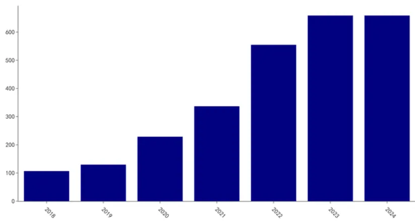
资料来源：wind，华创证券

我们在每周最后一个交易日通过如下方法构建池子：

- 计算每只ETF过去10日、20日的成交金额均值；

排除 10日平均成交金额小于 2000万的 ETF；

对跟踪指数相同的ETF，选择 20 日平均成交金额最大的ETF，剔除其余ETF；我们进一步将ETF分为两类：

第一类为行业、主题、地域等概念 ETF，例如新能车 ETF、碳中和 ETF、湾创 ETF等；

第二类为宽基、风格 ETF，例如沪深 300ETF、红利50ETF、超大盘ETF等。经过上述筛选、去重后，ETF池的标的数量如下图所示。

图表 54 ETF 分大类数量变化（2018-20240131）
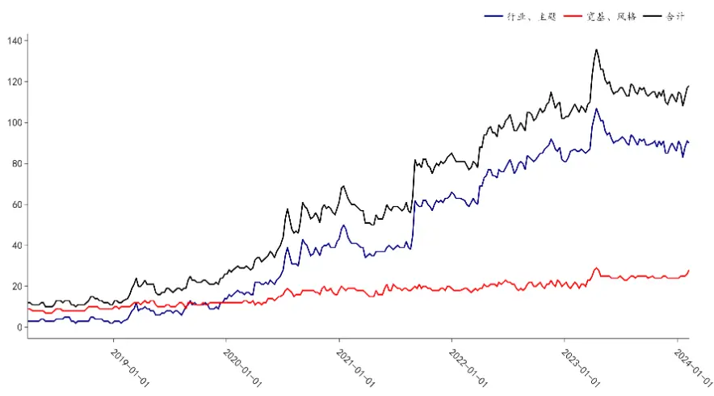
资料来源：wind，华创证券

由图可见，不同跟踪指数的 ETF 数量稳步增长，行业/主题类 ETF 覆盖面渐广，在可见的未来，更多样化的底层资产为 ETF投资提供便利与可行性。

## 2、ETF 轮动策略

我们根据 ETF 因子得分构建周度组合，在周度截面用 DoubleTOPK 选出 10 只 ETF（Top1= 10,Top2=15）。

图表 55 DoubleTopK 调仓方法
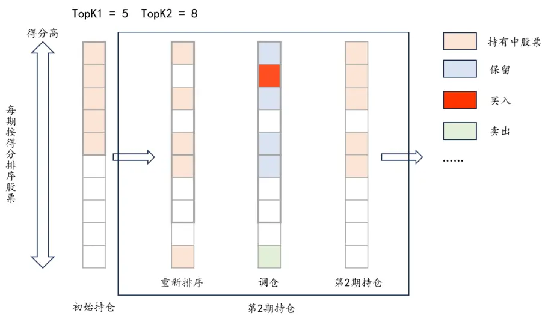
资料来源：华创证券

由于2018年的ETF池中样本数量过少，我们展示2019年开始的回测结果。

- 宽基、风格 ETF回溯结果

图表 56 宽基、风格ETF回测净值
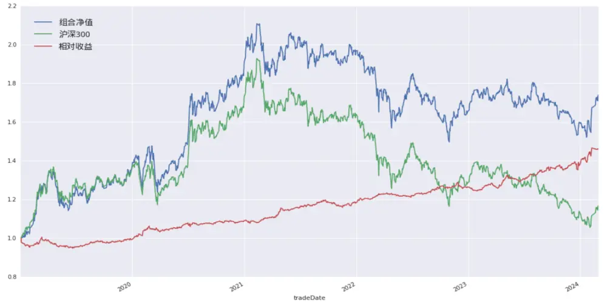
资料来源：wind，华创证券

2019年至今（2024年2月 29日）1248个交易日中，获得正收益的天数为636天，盈利天数占比：50.9%，盈亏比1.08。

图表 57 策略风险收益

| 年份 | 策略组合 | 基准 | 超额 | 相对波动率 | 信息比 |
| --- | --- | --- | --- | --- | --- |
| 2019 | 37.0% | 38.0% | -0.9% | 0.06 | -0.16 |
| 2020 | 37.1% | 25.5% | 11.6% 0 | .05 2 | .12 |
| 2021 | 1.8% | -6.2% | 8.0% 0 | .05 | 1.58 |
| 2022 | -16.0% - | 21.3% | 5.3% 0 | .05 | 1.14 |
| 2023 | -3.6% - | 11.7% | 8.1% 0 | .06 | 1.34 |
| 2024 | 9.2% | 3.8% | 5.4% | 0.08 | 0.71 |

wind,

我们选取沪深300指数作为对比基准，从分年收益来看，2019年来策略的表现比较稳健，除2019 年以外每年都有5个点以上的超额收益。

策略在 23年整体回撤仅-3.6%，大幅小于主动型基金的收益中位数；组合 2024年至今（2月29日）绝对收益9.2%，相对基准超额收益 5.4%，持续跑赢基准。

- 行业、主题 ETF回溯结果

图表 58 行业、主题ETF回测净值
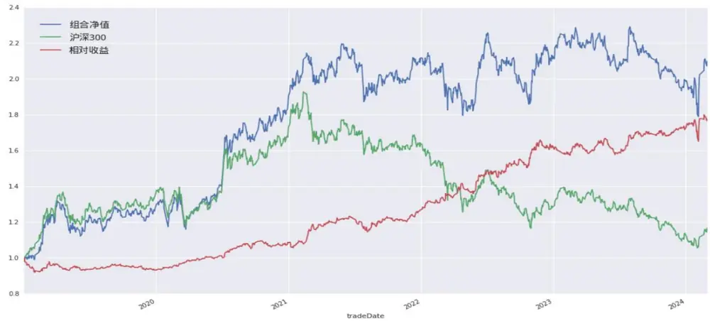
资料来源：wind，华创证券

2019年至今（2024年2月 29日）1248个交易日中，获得正收益的天数为631 天，盈利天数占比：50.6%，盈亏比1.16。

图表 59 策略风险收益——行业、主题 ETF

| 年份 | 策略组合 | 基准 | 超额 | 相对波动率 | 信息比 |
| --- | --- | --- | --- | --- | --- |
| 2019 | 28.8% | 38.0% | -9.2% | 0.07 | -1.37 |
| 2020 | 46.3% | 25.5% | 20.8% | 0.06 | 3.41 |
| 2021 | 9.8% | -6.2% | 16.0% | 0.07 | 2.17 |
| 2022 | 0.5% | -21.3% | 21.8% | 0.08 | 2.73 |
| 2023 | -5.5% | -11.7% | 6.3% | 0.07 | 0.94 |
| 2024 | 5.7% | 3.8% | 1.9% | 0.11 | 0.18 |

资料来源：wind，华创证券

我们选取沪深300指数作为对比基准，从分年收益来看，2020年来策略的表现比较稳健，20 年至 23 年每年都有 6 个点以上的超额收益。策略在 19 年表现较差，归因于 19 年初符合条件的 ETF数量较少，策略并没有满仓运行。

策略在 22 年绝对收益为 0.5%，超额 21.8%，23 年绝对收益-5.5%，策略在 23 年回撤大幅小于主动型基金的收益中位数；组合 2024 年至今（2 月 29 日）绝对收益 5.7%，相对基准超额收益 1.9%，持续跑赢基准。

## 四、总结

A 股市场在 23 年 11 月份以来经历了大幅的震荡，特别是中小盘指数和微盘股指数的大幅回撤，相比之下，大盘股指数表现相对稳定。我们的GRU选股策略在这段时间表现相对较好，分析其超额的来源主要在于其选股的股票池，我们在前端做了严格的基本面的筛选，在筛选过后的风格基准池上我们再利用GRU因子来进行选股。跟踪结果表明这样的方式依然适用于 2024年至今的市场环境。本篇报告我们尝试将 5个时序模型构建的量价因子进行结合，并探讨人工智能在选股及ETF轮动上的应用。

在全 A 上的测试结果表明，Ensemble_factor 在全 A 上的 IC 均值和中位数相比集成前的每个单因子结果均有提升，IC 均值和中位数均大于0.1，另外其年化 IC_IR 提升到6.37。

在宽基指数上的测试中，长期来看集成因子在每个宽基上的区分度均非常显著。在中证1000上的 IC 测试结果最佳，IC的均值和中位数均接近 0.1，大于 0占比高达79.4%，组合每年对比中证 1000指数均有显著的超额，24年至今累计超额收益已达 5%。在中证500上的 IC 测试结果次佳，IC 均值和中位数均大于 0.08，IC 大于 0 占比为 74.2%。因子在沪深300 股票池中的IC 均值和中位数均可达到 0.07以上，IC大于0 占比也可达70%。

Ensemble_factor 在风格池上的 IC 测试结果，对比在沪深 300 上的 IC 测试结果，风格池上的 IC 均值和中位数均略有提升，IC 均值和中位数均大于 0.08，年化 IC_IR 也大于 4。在基金重仓股上的IC测试结果，IC均值和中位数由0.08和0.084提高到0.081和0.088，IC 大于 0 占比由 70.3%提升到 75.2%，年化 IC_IR 由 4 提升到 4.7。

在 ETF 的轮动中，我们首先根据 ETF 的流动性和分类做简单的分组和筛选，将 ETF 分为宽基风格与行业主题两大类；之后我们使用个股的集成因子，自下而上合成每只 ETF的得分，每期筛选得分最高的 10 只ETF构建轮动策略。

2019年 01月01日至 2024年 2月 29 日，宽基、风格ETF轮动策略在此期间年化收益率11.7%，基准（沪深 300）年化收益率 3.1%，阿尔法 8.5%。策略最大回撤为 29%。从分年收益来看，2019 年来策略的表现比较稳健，除 2019 年以外每年都有 5 个点以上的超额收益。策略在 23年整体回撤仅-3.6%，大幅小于主动型基金的收益中位数；组合 2024年至今（2月29 日）绝对收益9.2%，超额收益5.4%；行业、主题 ETF轮动策略在此期间年化收益率 16%，阿尔法12.8%。策略最大回撤为21.9%。策略在19年表现较差，归因于19年初符合条件的ETF数量较少，策略并没有满仓运行。在22年绝对收益为0.5%，超额21.8%，23年绝对收益-5.5%，23年策略回撤大幅小于主动型基金的收益中位数；组合2024 年至今绝对收益5.7%，超额收益 1.9%，持续跑赢基准。

## 五、风险提示

策略基于历史数据回测，不保证未来数据的有效性。

## 六、参考文献

Zhang, A., Lipton, Z. C., Li, M., & Smola, A. J. (2023). Dive into Deep Learning. Cambridge University Press.

Ekambaram, Vijay, et al. "TSMixer: Lightweight MLP-Mixer Model for Multivariate Time Series Forecasting." arXiv preprint arXiv:2306.09364 (2023).

Nie, Yuqi, et al. "A time series is worth 64 words: Long-term forecasting with transformers." arXiv preprint arXiv:2211.14730 (2022).

Luo, Wang, et al. " ModernTCN: A Modern Pure Convolution Structure for General Time Series Analysis." International Conference on Learning Representations(2024).

Vaswani, Ashish, et al. "Attention is all you need." Advances in neural information processing systems 30 (2017).

## 金融工程组团队介绍

组长、首席分析师：王小川

同济大学管理学博士。2017年加入华创证券研究所。

高级分析师：秦玄晋

上海对外经贸大学硕士。2018年加入华创证券研究所。

助理研究员：杨宸祎

美国伊利诺伊大学香槟分校会计学、金融工程学硕士，CFA。2021年加入华创证券研究所。

助理研究员：黄河

东华大学工学博士，FRM。2023年加入华创证券研究所。

助理研究员：洪远

华南理工大学金融硕士。2023年加入华创证券研究所。

## 华创证券机构销售通讯录

| 地区 | 姓名 | 职务 | 办公电话 | 企业邮箱 |
| --- | --- | --- | --- | --- |
| 北京机构销售部 | 张昱洁 | 副总经理、北京机构销售总监 | 010-63214682 | zhangyujie@hcyjs.com |
|  | 张菲菲 | 北京机构副总监 010 | -63214682 | zhangfeifei@hcyjs.com |
|  | 刘懿 | 副总监 | 010-63214682 | liuyi@hcyjs.com |
|  | 侯春钰 | 资深销售经理 | 010-63214682 | houchunyu@hcyjs.com |
|  | 过云龙 | 高级销售经理 010 | -63214682 | guoyunlong@hcyjs.com |
|  | 蔡依林 | 资深销售经理 | 010-66500808 | caiyilin@hcyjs.com |
|  | 刘颖 | 资深销售经理 010 | -66500821 | liuying5@hcyjs.com |
|  | 顾翎蓝 | 资深销售经理 010 | -63214682 | gulinglan@hcyjs.com |
|  | 车一哲 | 销售经理 |  | cheyizhe@hcyjs.com |
| 深圳机构销售部 | 张娟 | 副总经理、深圳机构销售总监 0755 | -82828570 | zhangjuan@hcyjs.com |
|  | 汪丽燕 | 高级销售经理 | 0755-83715428 | wangliyan@hcyjs.com |
|  | 张嘉慧 | 高级销售经理 | 0755-82756804 | zhangjiahui1@hcyjs.com |
|  | 董姝彤 | 销售经理 | 0755-82871425 | dongshutong@hcyjs.com |
|  | 王春丽 | 高级销售经理 | 0755-82871425 | wangchunli@hcyjs.com |
| 上海机构销售部 | 许彩霞 | 总经理助理、上海机构销售总监0 | 21-20572536 | xucaixia@hcyjs.com |
|  | 官逸超 | 上海机构销售副总监 | 021-20572555 | guanyichao@hcyjs.com |
|  | 黄畅 | 上海机构销售副总监 | 021-20572257-2552 | huangchang@hcyjs.com |
|  | 吴俊 | 资深销售经理 | 021-20572506 | wujun1@hcyjs.com |
|  | 张佳妮 | 资深销售经理 | 021-20572585 | zhangjiani@hcyjs.com |
|  | 蒋瑜 | 高级销售经理 | 021-20572509 | jiangyu@hcyjs.com |
|  | 施嘉玮 | 高级销售经理 | 021-20572548 | shijiawei@hcyjs.com |
|  | 朱涨雨 | 高级销售经理 | 021-20572573 | zhuzhangyu@hcyjs.com |
|  | 李凯月 | 高级销售经理 |  | likaiyue@hcyjs.com |
|  | 易星 | 销售经理 |  | yixing@hcyjs.com |
|  | 张玉恒 | 销售经理 |  | zhangyuheng@hcyjs.com |
| 广州机构销售部 | 段佳音 | 广州机构销售总监 | 0755-82756805 | duanjiayin@hcyjs.com |
|  | 周玮 | 销售经理 |  | zhouwei@hcyjs.com |
|  | 王世韬 | 销售经理 |  | wangshitao1@hcyjs.com |
| 私募销售组 | 潘亚琪 | 总监 021 | -20572559 | panyaqi@hcyjs.com |
|  | 汪子阳 | 副总监 | 021-20572559 | wangziyang@hcyjs.com |
|  | 江赛专 | 副总监 | 0755-82756805 | jiangsaizhuan@hcyjs.com |
|  | 汪戈 | 高级销售经理 021 | -20572559 | wangge@hcyjs.com |
|  | 宋丹玙 | 销售经理 021 | -25072549 | songdanyu@hcyjs.com |

## 华创行业公司投资评级体系

基准指数说明：

A股市场基准为沪深 300指数，香港市场基准为恒生指数，美国市场基准为标普 500/纳斯达克指数。

公司投资评级说明：

强推：预期未来 6个月内超越基准指数 20%以上；

推荐：预期未来 6个月内超越基准指数 10%－20%；

中性：预期未来 6个月内相对基准指数变动幅度在-10%－10%之间；

回避：预期未来 6个月内相对基准指数跌幅在 10%－20%之间。

## 行业投资评级说明：

推荐：预期未来 3-6个月内该行业指数涨幅超过基准指数 5%以上；

中性：预期未来 3-6个月内该行业指数变动幅度相对基准指数-5%－5%；

回避：预期未来 3-6个月内该行业指数跌幅超过基准指数 5%以上。

## 分析师声明

每位负责撰写本研究报告全部或部分内容的分析师在此作以下声明：

分析师在本报告中对所提及的证券或发行人发表的任何建议和观点均准确地反映了其个人对该证券或发行人的看法和判断；分析师对任何其他券商发布的所有可能存在雷同的研究报告不负有任何直接或者间接的可能责任。

本报告涉及股票民生银行（600016），根据上市公司公告，民生银行副董事长刘永好为本公司的控股股东华创云信关联自然人。

## 免责声明

本报告仅供华创证券有限责任公司（以下简称“本公司”）的客户使用。本公司不会因接收人收到本报告而视其为客户。

本报告所载资料的来源被认为是可靠的，但本公司不保证其准确性或完整性。本报告所载的资料、意见及推测仅反映本公司于发布本报告当日的判断。在不同时期，本公司可发出与本报告所载资料、意见及推测不一致的报告。本公司在知晓范围内履行披露义务。

报告中的内容和意见仅供参考，并不构成本公司对具体证券买卖的出价或询价。本报告所载信息不构成对所涉及证券的个人投资建议，也未考虑到个别客户特殊的投资目标、财务状况或需求。客户应考虑本报告中的任何意见或建议是否符合其特定状况，自主作出投资决策并自行承担投资风险，任何形式的分享证券投资收益或者分担证券投资损失的书面或口头承诺均为无效。本报告中提及的投资价格和价值以及这些投资带来的预期收入可能会波动。

本报告版权仅为本公司所有，本公司对本报告保留一切权利。未经本公司事先书面许可，任何机构和个人不得以任何形式翻版、复制、发表、转发或引用本报告的任何部分。如征得本公司许可进行引用、刊发的，需在允许的范围内使用，并注明出处为“华创证券研究”，且不得对本报告进行任何有悖原意的引用、删节和修改。

证券市场是一个风险无时不在的市场，请您务必对盈亏风险有清醒的认识，认真考虑是否进行证券交易。市场有风险，投资需谨慎。

## 华创证券研究所

| 北京总部 | 广深分部 | 上海分部 |
| --- | --- | --- |
| 地址：北京市西城区锦什坊街26号 恒奥中心C 座 3A | 地址：深圳市福田区香梅路1061号中投国 际商务中心A 座19楼 | 地址：上海市浦东新区花园石桥路33号 花旗大厦 12 层 |
| 邮编：100033 传真：010-66500801 | 邮编：518034 | 邮编：200120 |
| 会议室：010-66500900 | 传真：0755-82027731 会议室：0755-82828562 | 传真：021-20572500 会议室：021-20572522 |