AI+HI 系列（4）

# CrossGRU：基于交叉注意力的时序+截面端到端

## 模型

## 前言

时序网络进行端到端量价因子挖掘时，常见的模型如 GRU、PatchTST 并未充分考虑股票与股票间的依赖关系，缺少截面信息可能导致模型在市场环境变化时表现不尽如人意。针对此问题，本篇报告提出一种时序+截面模型CrossGRU，模型在时序网络的基础上引入了一个可即插即用的截面交互模块，旨在捕捉股票之间的相互影响。CrossGRU 模型在保持高效率的同时，无需任何额外的变量或图结构，展现出了其在简洁性和功能性上的优势。

## 模型特点

不同于使用额外的截面变量或模型的常见方法，CrossGRU 以端到端的方式实现截面交互。我们提出“市场隐变量”假设，将其作为中间路由，结合交叉注意力机制实现截面维度的高效信息交互；同时考虑到个股的独立走势，我们引入可学习残差连接达到时序与截面信息的自适应融合。

## 因子测试对比

我们以 GRU 模型作为对比基准，在中证全指股票池回测区间内，CrossGRU 因子的 5 日 RankIC 为 10.9%，10 日 RankIC 为 11.7%，均略优于 GRU 模型；在 20 分组的 TOP 组超额收益表现上，CrossGRU 相较于 GRU 模型实现了 7%的年化收益提升；在 2024年初至 4 月区间，模型的 TOP 组超额收益最大回撤为 8%，优于 GRU 模型的 21%，在 GRU 因子表现较弱的 2018、2024 年，CrossGRU 取得了显著更优的表现。

## 模型消融测试

我们对截面交互模块进行超参数检验，市场隐状态数量对 CrossGRU 的表现有较大影响，但整体结论仍然不变——不同参数设置下，CrossGRU 模型的 IC表现优于 GRU 模型，TOP 组多头收益提高幅度为 3%~7%，同时在回撤方面也得到不同程度改善。

为了进一步验证截面交互的增量，我们提出了一个更加简化的模型——CsAGRU。该模型使用加性注意力机制替代交叉注意力来实现截面交互。CsAGRU 的性能介于 GRU 和 CrossGRU 之间，在 TOP 组多头收益表现也优于 GRU 模型，进一步印证了引入截面交互模块的正面效果。

## 风险提示：

策略基于历史数据回测，不保证未来数据的有效性；深度学习模型存在过拟合风险；深度学习模型受随机数影响。

## 华创证券研究所

证券分析师：秦玄晋

电话：021-20572522

邮箱：qinxuanjin@hcyjs.com

执业编号：S0360522080005

证券分析师：王小川

电话：021-20572528

邮箱：wangxiaochuan@hcyjs.com

执业编号：S0360517100001

## 相关研究报告

《短期信号大多中性，市场或仍处于筑底过程—年一季度策略总结与未来行情预判》

2024-04-08

《并行计算在金融上的应用》

2024-03-22

《排序学习选股模型之沪深 300精选》

2024-03-21

《AI+HI 系列（3）：人工智能在选股与 ETF 轮动上应用》

2024-03-15

《 AI+HI 系 列 （ 2 ） ： PatchTST 、 TSMixer 、ModernTCN 时序深度网络构建量价因子》

2024-03-11

## 投资主题

## 报告亮点

基于时序深度学习模型进行端到端因子挖掘已有较多工作，然而单一的时序模型并没有有效利用截面的信息，处理上述问题常见的解决方法是引入额外的截面模型因子进行合成。本篇报告改进了时序端到端因子挖掘模型，在时序信息提取模块的基础上加入了截面信息的提取机制，而并不需要引入额外的特征，同时保持了时序模型在效率上的优势，为广大投资者提供新的研究思路，助力量化投资的发展。

## 投资逻辑

时序与截面信息数据在量化投资领域处处可见，因此用一个网络同时实现时间序列和截面信息具有相当的应用潜力。本篇报告改进了深度学习时序模型，进一步探索深度学习模型在量化领域上的运用。

## 一、动机

在我们之前的报告《PatchTST、TSMixer、ModernTCN 时序深度网络构建量价因子》中，我们介绍了三个“Patch + 通道独立”设计的时序深度学习网络，他们的骨干网络分别基于自注意力、MLP、CNN架构。我们将上述时序模型用于端到端量价因子挖掘任务，发现它们能一定程度学习到股票的时序与变量的有效信息交互，然而时序模型在 2024 年初产生了不同程度的显著回撤。

从模型设计的思路看，影响个股未来表现的特征并不仅来自于过去的时序特征，也来自于同时期的整体市场环境。之前我们介绍的时序模型实现了时序间与变量间的交互，但并没有考虑到股票之间的交互，缺失来自截面信息，这可能使时序模型在整体市场发生变化时得出错误的结论。因此在本篇报告中，我们尝试在时序模型的基础上进一步引入截面信息交互。

在时序模型的基础上引入截面信息学习时，每个batch的大小不是固定的常数，而是某个时点截面上所有股票过去一段时间的多变量时序数据，此时需要考虑的两个问题为：

（1）截面股票数量不固定；

（2）截面股票是一个较长的序列；

第一个问题限制了固定参数进行初始化的深度学习模块；对第二个问题，较长的序列对模型效率提出了额外要求，若将注意力机制运用在长度超过 5000的序列上训练，硬件以及时间两方面的开销较大。

目前结合时序与截面特征的常见方法是使用两个不同模型进行分别建模，再进行融合加总，其中截面模型的输入通常为人工定义的截面特征，特征工程对先验知识提出了较高的要求。在本篇报告中，我们继续基于量价时序数据改进端到端深度学习模型，我们参考现代时序网络的解耦设计，在时序网络的基础上加入了一个无需图与额外特征、即插即用的截面信息抽取模块。

我们基于交叉注意力(Cross attention)与市场隐变量路由设计实现了股票截面信息交互模块，在GRU模型提取的时序特征的基础上进行自适应的时序、截面信息融合——我们取两个主要模块的缩写将新模型称为CrossGRU。

CrossGRU补足了时序GRU模型的股票截面维度的信息交互缺失，实现了一种自适应“时序+截面”的端到端量价因子挖掘模型，在量价因子挖掘任务上取得了更好的效果。

## 二、模型介绍

在本章我们首先分别介绍时序、截面信息提取模块涉及的相关技术，最后介绍CrossGRU的模型具体流程。

## （一）时序模型

在本篇报告中，我们采用GRU模型进行时序信息抽取。在 Embedding方式上也同样采用传统GRU的通道混合的编码方式。

GRU 由 Cho 等在 2014 年提出，是一种循环类深度学习网络，它在每个时间点上通过门控单元自适应地捕获序列数据中的依赖关系，适合处理序列类数据。在股价序列的因子挖掘任务中GRU 是强力的基线模型。

图表 1 经典RNN网络
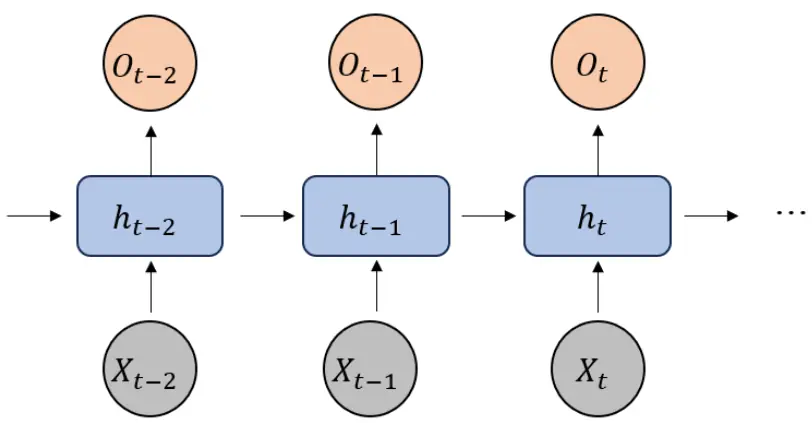
资料来源：华创证券

我们之前的报告介绍的PatchTST 等近年的时序深度模型采用了通道独立的设计。Han等人 (2021) 在实证测试中发现，通道独立的设计在多个时序任务中表现优于通道混合。在本篇报告使用的时序模型（GRU）中，我们采用了通道混合处理方式，考虑到了如下两点：

通道混合GRU模型的流程简单，与截面信息的结合步骤更为直观；

在端到端量价数据集上，从我们先前报告的测试结果看，若仅在序列嵌入阶段将通道混合改为通道独立提升不大，通道独立设计可能需要后续对应的模块联合使用（例如加入变量之间的信息交互），而本篇报告我们旨在探索时序截面信息的融合，应让模型效果提升的来源尽可能明显。

## （二）交叉注意力

在 Ashish Vaswani 等人《Attention Is All You Need》中的 Transformer 模型是一种编码器-解码器模型，在机器翻译等自然语言任务中，transformer 模型需要同时运用编码器和解码器部分，它们通过交叉注意力（cross attention）实现连接。仅基于编码器部分的自注意力机制(self attention)已经在深度量化模型中有了较多的运用，在本篇报告中我们探索了交叉注意力机制的应用。

图表 2 Transformer 模型
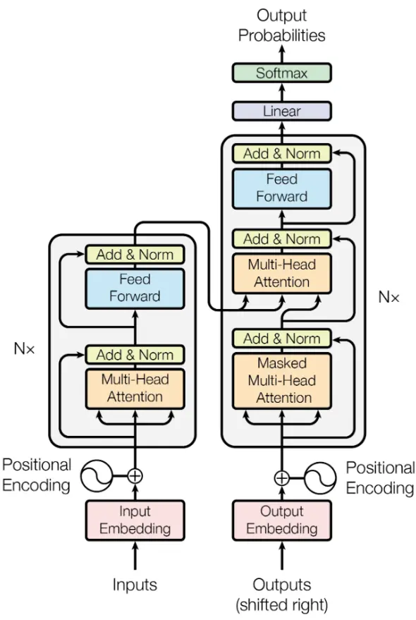
Vaswani, Ashish, et al. "Attention Is All You Need"

交叉注意力同样基于注意力机制，主要涉及 Query、Key、Value 三个中间变量（后续简写为Q、K、V），模型通过学习Q和 K之间的相似性来为V分配权重，使模型输出集中注意力在最重要的信息上，公式表达如下：

$$
Attention(Q,K,V)=softmax\left(\frac{QK^{T}}{\sqrt{d_{k}}}\right)V
$$

对于自注意力机制，Q、K、V 由同一个输入序列映射而来；在交叉注意力中，公式表达仍然同上不变，区别在于交叉注意力的 Q、K、V 来自于两个序列：通常 Q 来自一个序列，K和V 来自另一个序列。因此交叉注意力表达了一个序列与另一个序列的信息交互过程，大致流程如下图所示：

图表 3 交叉注意力机制
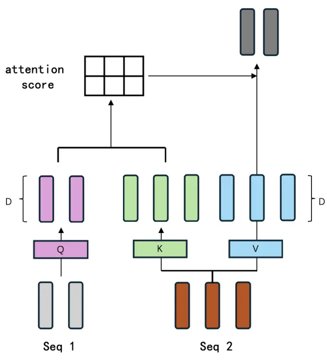
资料来源：华创证券

交叉注意力的设计特点使其处理一个序列时能考虑与之相关的另一个序列的信息，两个序列可以来自于两类截然不同的数据，例如文本+图片、文本+声音等多模态情景，此外，交叉注意力在文本翻译、文本QA 等任务中同样也有较多运用。

为方便介绍交叉注意力机制的灵活运用方式，我们进一步以视觉领域的模型 CrossVit（Chen 等,2021）为例进行说明：

CrossVit以ViT模型为基础，增强了ViT 模型对多尺度信息的处理能力。在ViT 模型中，图像首先被切分为多个图像块（Patch），Patch 数量越多，每个 token 包含的细节信息就越丰富， 因此Patch 大小表示了捕捉的信息粒度。为了使ViT模型能拥有类似卷积神经网络中的多尺度信息融合能力，CrossVit 使用了双分支结构，每个分支设置不同大小的Patch——较小的Patch捕获更细粒度的信息，较大的Patch则覆盖更广泛的图片信息。两种尺度的 Patch 通过交叉注意力模块进行信息交互和融合，使模型更有效地整合不同尺度的信息。

图表 4 CrossVit 模型
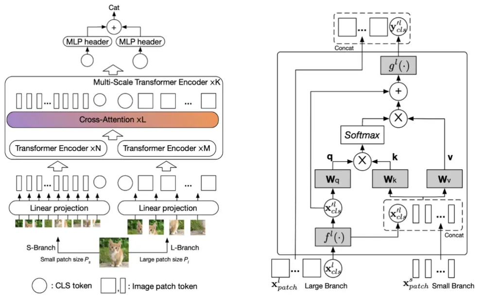
Chen et al. "CrossViT: Cross-Attention Multi-Scale Vision Transformer for Image Classification"

简言之，交叉注意力是一种十分灵活的机制，可以实现各类不同来源信息的融合，在需对齐数据的场景下适用。对因子挖掘任务而言，融合不同时间粒度的特征、时序特征与截面特征是交叉注意力可能的应用场景，本篇报告中我们首先探索了后者，将交叉注意力用于时序与截面特征融合。

最后，我们简单对比交叉注意力、自注意力机制的复杂度：假设自注意力作用的序列长度为 $L_{1}$ ，交叉注意力作用的两个序列长度为 $L_{1}、L_{2}$ ，序列中每个 token 的嵌入维度 d 相同；时间复杂度描述了算法的运行时间如何随着输入数据量的增加而增加，空间复杂度描述了算法的存储空间与数据量的关系。

对自注意力机制：

- 时间复杂度： $O(L_{1}^{2}d)$

- 空间复杂度： $O(L_{1}^{2})$

对交叉注意力：

- 时间复杂度： $O\big(L_{1}L_{2}d\big)$

- 空间复杂度： $O\big(L_{1}L_{2}\big)$

如果的交叉注意力运用的两个序列长度 $L_{2}\approx L_{1}$ ，则两种注意力的复杂度相当。

## （三）CrossGRU 模型

CrossGRU 的简化流程下图所示。我们在基于GRU的时序信息提取模块的基础上，进一步加入了基于交叉注意力的截面信息提取模块，并使用了一个可学习的残差模块自适应的将截面信息和个股表征进行融合。

图表 5 CrossGRU 模型
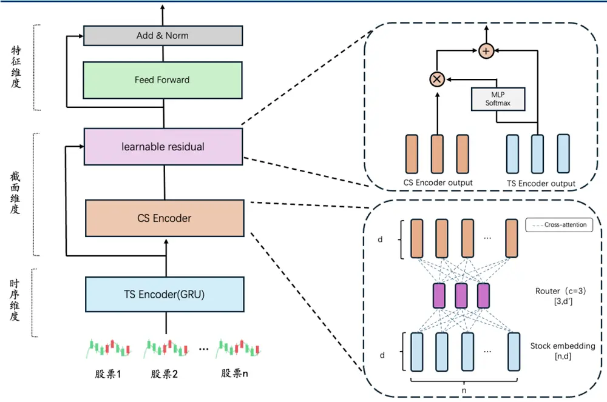
资料来源：华创证券

## 1、时序交互

模型首先通过GRU提取时序信息， GRU 最后一个时间步包含了全部时序的信息，我们取最后一个时间步作的输出向量作为每只股票的表征，得到了截面上的股票表征序列。

假设一个 batch 输入的数据为 $X_{in}$ ，形状为[N,T,M]，其中N为股票数，T为时序，M为变量，T与M在不同batch间是相同的，N在不同batch间不一定相同：

$$
S\;=\;GRU(X_{in})
$$

取GRU 的最后时间步结果后得到截面股票的表征序列S。S的形状为[N,d]，d为嵌入的特征维度。

此时，如果我们直接在S上运用自注意力机制学习股票间的交互，会造成较大的硬件负担，我们希望截面交互模块能捕捉不同股票之间交互作用的同时能够尽可能的高效。

## 2、截面交互

上一步我们得到一个截面股票的表征序列S，假设我们有另一个表示截面信息的表征序列，且截面表征的序列长度远小于股票表征序列，对两个序列运用交叉注意力便可以高效的实现截面信息的融合。

那么截面的全局信息表征如何获得？最为直观的方法是引入额外的先验截面变量，例如市场近期的波动率、市场风格/阿尔法因子时序数据等，将它们嵌入为截面表征后，以股票表征序列作 query 访问截面表征进行交叉注意力；但这种方式不可避免地带来了另一个新问题：选择什么变量、多少变量才能更为准确地描述市场截面信息，它对模型结果可能存在较大的影响。

在本篇报告中，受到FactorVAE、CrossFormer工作的启发，我们使用路由机制的交叉注意力回避了上述问题，这种方式不需要引入额外的变量，能继续以端到端的方式实现因子挖掘任务。

我们让模型自行学习“不可观测”的市场隐状态，市场隐状态作为交叉注意力的中间路由进行两次交叉注意力——首先市场隐状态通过交叉注意力访问当前截面上所有的股票信息，得到当前截面表征，再通过第二次交叉注意力，用个股表征序列访问截面表征，如此输出的个股表征序列便完成了与截面的信息交互。

图表 6 特征维度信息交互
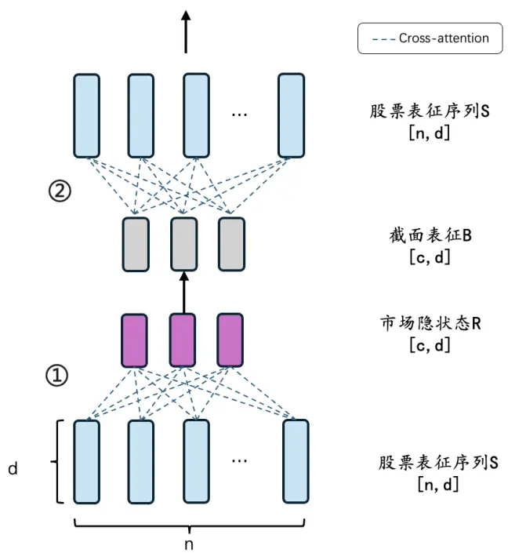
资料来源：华创证券

记GRU 输出的股票表征序列为S，S的形状为[n,d]，截面信息抽取具体的三个步骤为：

- 初始化c个可学习的、维度为d的市场隐状态向量，记为R；

R和股票序列进行交叉注意力，以R为 query访问截面股票表征序列S，输出当前截面的表征向量，记为B；

B和股票序列进行交叉注意力，以股票表征序列S为 query 访问截面表征B，输出完成截面信息交互的序列S’（S’形状同样为[n,d]）。

在第一步中，我们假设市场可以用 c个不可观测的“隐状态”进行划分，c个隐状态的向量表征排列为一个序列R。

例如，在主观上我们可以把市场静态地划分为熊市初期、熊市末尾、牛市初期、牛市末尾、震荡等多种状态，我们进行上述划分的基准是可以观测到的历史股价行情。从深度学习模型设计的角度看，上述描述市场的方式是笼统的，在实践上也可能引入未来信息。取而代之的是，我们假设市场可以分为多个“不可观测”的状态，它们通过多个可学习的向量来进行表征，我们称其为“市场隐状态”，多个市场隐状态向量的组合可以容括所有的市场情景，因此可以描述任意一个动态的市场截面。最后，我们认为市场隐状态的数量c应小于，或远远小于截面股票的数量；

在第二步中，我们以这些市场隐状态R作为交叉注意力机制的 query，去访问当前时点的股票表征序列S。

截面股票表征序列本质上表示了当前截面上市场的真实情况，因此经过交叉注意力后，市场隐状态吸收了当前截面的信息，输出B可以视为当前截面表征，截面表征序列的长度与市场隐状态向量的个数相同；

在第三步中，我们以股票表征序列S为交叉注意力机制的query，去访问截面表征B。

此时股票表征序列吸收了截面信息，输出的序列S’完成了截面信息的融合。在这一步中，交叉注意力的复杂度同第二步相同，市场隐状态数量远小于截面股票数量，注意力机制的平方复杂度近似简化为线性复杂度，因此运用交叉注意力的第二、第三步整体上是高效的。

## 3、时序截面融合

经过上述步骤，模型完成了时序和截面信息的提取。接下来，在S与S’两组表征融合方式的选择上，我们考虑到个股存独立行情现象，希望模型能“自适应”地将截面信息和个股表征进行融合，我们参考 Bachlechner 等 (2020) 的可学习残差连接方法，采用带有门控机制的残差连接实现上述思路：

$$
S_{mix}=\;S\;+\;\alpha\;S^{\prime}
$$

其中门控α为：

$$
\alpha\;=\;softmax\big(MLP(S)\big)
$$

$S_{mix}$ 的形状为[n,d]，它表示截面上n只股票的d维表征。

图表 7 门控自适应连接
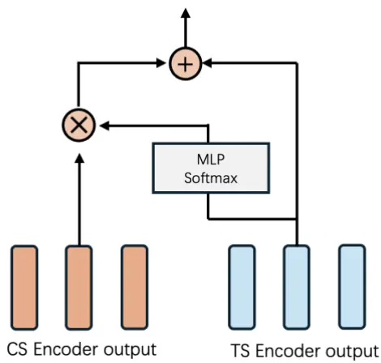
资料来源：华创证券

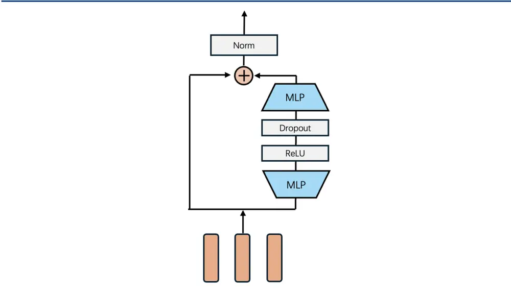
图表 8 特征维度信息交互
资料来源：华创证券

$S_{mix}$ 再经过一个FFN 层，实现特征维度的学习，最后进入具体任务的预测头。FFN 层与transformer中的对应模块类似，由于 MLP 和残差连接构成，FFN 流程如下图所示。

## （四）小结

CrossGRU 在整体设计思路上参考了我们先前报告介绍的 PatchTST、ModernTCN、TSMixer等现代时序网路的解耦设计，各个模块均可以进行灵活增减替换。

对于模型一个 batch 的输入——形状为[N,T,D]，CrossGRU 分别用单独模块实现时间维度（T）、截面维度（N）以及特征维度（D）的学习，并结合经济意义加入了以下的特殊设计：

- 在截面维度的交互上，我们以市场隐状态作为中间路由实现了截面个股的高效交互；

在截面和时序的融合上，我们考虑了个股独立行情现象，通过门控机制让个股自适应地融合截面信息；

通过上面的设计，我们让模型学习个股的时序特征的同时兼顾当前截面的全局信息，得到更好的因子结果。最后，CrossGRU是高效的，它在消费级显卡（RTX4090）上完成全部训练流程的时间约20~30 分钟。在后文我们介绍具体的训练参数。

## 三、量价因子挖掘测试

## （一）数据集介绍

数据集说明：

2007-2024 年 4 月 5 日 A 股日频量价数据，包括高、开、低、收、均价、成交量 6 个序列，我们以每周的最后一个交易日t为截面，回溯截面上 $.N_{t}$ 个股票过去 30 个交易日的数据，作为一个截面（对应 $N_{t}$ 个标签），以此滚动生成数据截面 $(N_{1},30,6)、(N_{2},30,6)$ $(N_{t}{,}30{,}6)$ ，在第一个维度上进行拼接得到全部训练数据。

同时，我们在周度截面股票进行如下排除：

1、剔除上市不满 120天的股票；

2、剔除流通市值最小的10%的股票；

3、剔除有数据缺失的股票。

模型训练参数说明：

训练集划分：按年滚动训练，年底进行重训练；在每年年底回溯过去 11 年作为训练集+验证集（其中最近的一年为验证集），次年为测试集；第一期模型的训练集为 2007.01-2016.12，验证集为 2017.01-2017.12，测试集为 2018.01-2018.12，以此类推，如下图所示：

图表 9 训练验证集划分方法
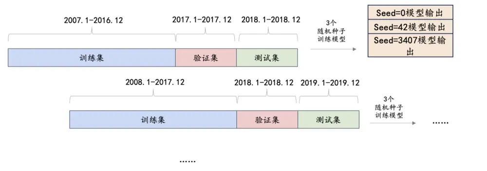
资料来源：华创证券

在进行模型重训练时，设置 3 个随机种子，将 3次预测结果合成作为最终结果。

数据预处理方法：

在拼接数据截面 $(N_{1},30,6)、(N_{2},30,6)...(N_{t},30,6)$ 之前，进行如下的预处理步骤：

1、MAD 法对异常值进行缩尾处理；

2、每个截面用最后一个交易日作为除数进行归一化，再进行 Z-score标准化；

模型预测标签：

预测标签为未来10日收益（t+1日~t+11日以收盘价计算，使用 rank标准化），每个模型最终预测头输出维度均设置为 64，将 64 个因子均值作为每只股票的最终得分，计算其与上述未来10日收益的IC 作为损失函数。

## （二）参数设定

我们对主要参数进行设定说明：

CrossGRU：GRU 的 hidden state 设定为 64；市场隐状态维度为 64，数量为 200；交叉注意力机制的头数为2；FFN 层采用瓶颈设计，将输入维度乘以 2。在后续章节，我们进行更多参数的测试，以进一步了解模型各个组件、参数的影响。

对比基准： hidden state 设定为 64 的 GRU 模型，取最后一个时间步后输入 BatchNorm、MLP；

其余训练参数如下表所示：

图表 10 训练参数设定

| 变量名 | 参数设置 |
| --- | --- |
| Batch Size | 截面股票数量 |
| 训练早停阈值(early stop) | 10 |
| 最大 epoch 数 | 120 |
| 优化器 | Adam(初始学习率 1e-3) |
| 随机种子 | 0、42、3407 |

资料来源：华创证券

## （三）因子测试

本部分对前文提到的模型进行量价因子挖掘任务检验，对比不同模型结果。

回测区间：2018 年 1 月 1 日 ~ 2024 年 4 月 12 日；

股票池：中证全指

## 1、IC测试结果

在本部分我们展示 IC 测试结果，因子为周度频率。

图表 11 CrossGRU 5 日 IC 统计结果

| 模型 | RankIC | ICIR | RankIC 中位数 | IC大于0占比 |
| --- | --- | --- | --- | --- |
| GRU | 0.106 | 0.88 | 0.106 | 0.80 |
| CrossGRU | 0.109 | 0.92 | 0.110 | 0.81 |

资料来源：wind，华创证券

图表 12 CrossGRU 10 日 IC 统计结果

| 模型 | RankIC | ICIR | RankIC 中位数 | IC大于0占比 |
| --- | --- | --- | --- | --- |
| GRU | 0.112 | 0.96 | 0.117 | 0.83 |
| CrossGRU | 0.117 | 1.04 | 0.13 | 0.84 |

资料来源：wind，华创证券

图表 13 CrossGRU 模型 5 日 IC 走势
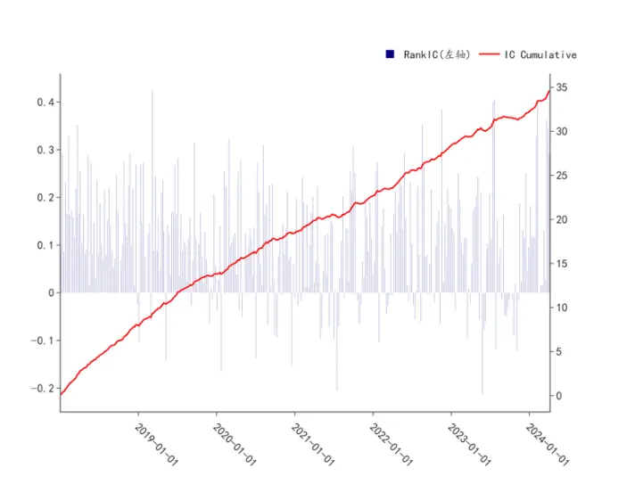
资料来源：wind，华创证券

图表 14 CrossGRU 模型 10 日 IC 走势
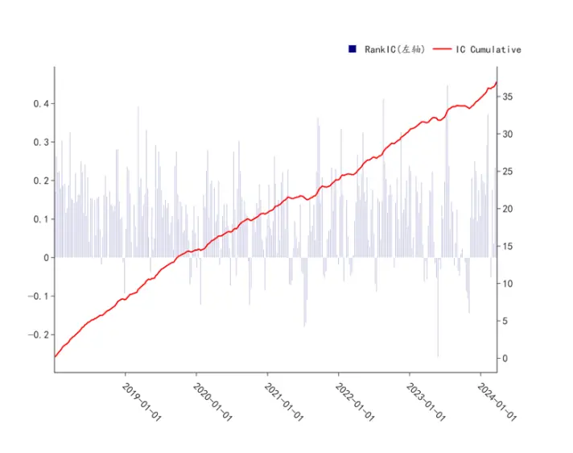
资料来源：wind，华创证券

以上图表展示了因子的历史IC 走势以及统计结果：

从不同窗口期的IC 结果看，CrossGRU模型的 5日 IC 为10.9%，胜率（大于 0占比）为81%；10 日 IC 为 11.7%，胜率 84%。模型的 IC 表现略好于 GRU 模型。

## 2、分组测试结果

本部分我们对因子进行分组测试，分组数设置为20，每周最后一个交易日根据因子值进行分组，按次周第一个交易日收盘价进行调仓，不计交易成本。超额收益的计算基准为中证全指。

图表 15 CrossGRU 分组超额收益走势
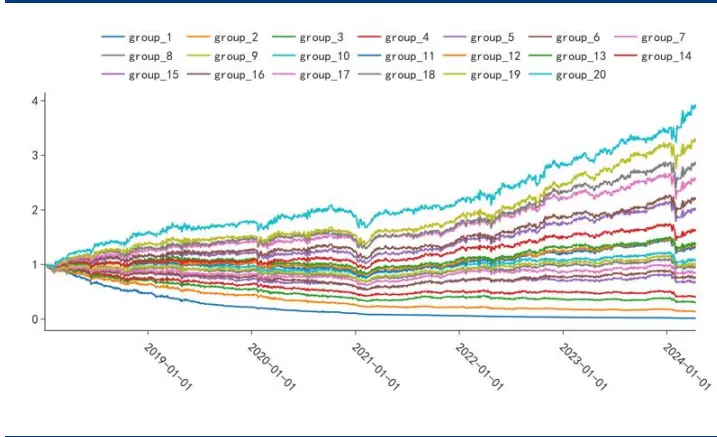
wind,

图表 16 CrossGRU 分组年化收益对比
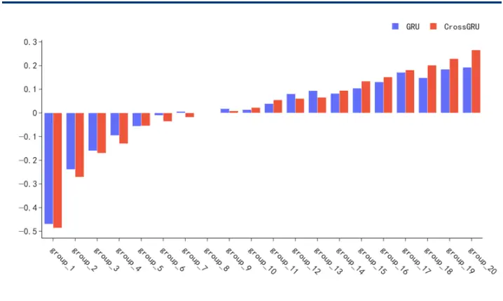
wind,

图表 17 CrossGRU TOP 组多头超额收益对比
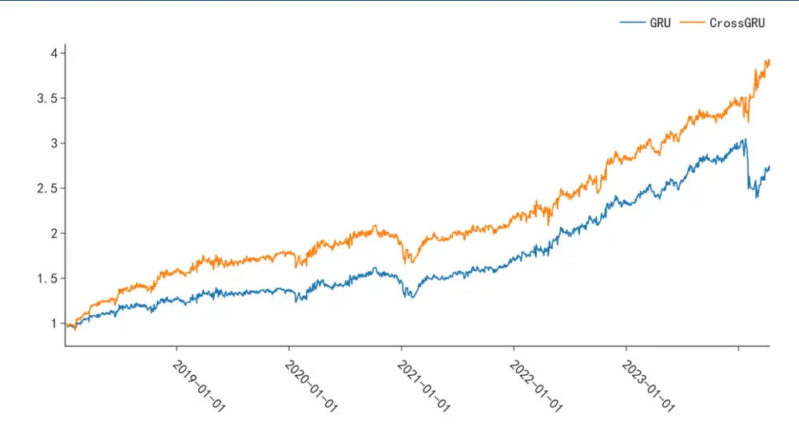
wind,

图表 18 CrossGRU group_20 绩效统计

| 因子 | 年化收益率 | 年化波动率 | 夏普比率 | Calmar 比率 | 超额最大回撤 | 年化超额收益率 | 换手率 |
| --- | --- | --- | --- | --- | --- | --- | --- |
| GRU | 19.3% | 21.9% | 0.91 | 0.63 | -30.4% | 22.0% | 92.88 |
| CrossGRU | 26.6% | 22.5% | 1.16 | 1.03 | -25.8% | 29.4% | 92.87 |

资料来源：wind，华创证券

以上图表展示了 CrossGRU 模型的分组收益测试结果，虽然模型在 IC 相关指标上相比GRU模型提升较为轻微，但在分组测试，特别是TOP 分组的表现上，二者展现出了较大差异：

CrossGRU 的年化收益相比 GRU 模型提高约 7%；从超额收益的回撤角度看，表现同样优于 GRU 模型，在 2020 年底的回撤区间，二者表现相近；在 2024 年初至 4 月区间，CrossGRU模型TOP组的超额收益最大回撤为8.3%，对比基准GRU的最大回撤为21.9%。

从相关性角度，CrossGRU得出的因子与GRU模型相关性达到了 90%，考虑到多头TOP组的差异，我们统计了模型TOP 组选出股票的重叠度（两个模型选出的股票的交集 / 并集）区间均值为71.2%。

从以上结果看，时序维度的信息交互仍然是最终因子重要贡献因素,CrossGRU 与 GRU模型结果有较高的相关性。另一方面，在引入截面信息后 TOP组的表现得到了改善。

下面我们统计了两个模型 TOP 组多头的逐年的年化收益，在 GRU 表现最差的 2018、2024 年，CrossGRU 的明显优于 GRU 模型，此外 2019 年也跑赢 GRU 模型较多；CrossGRU相对表现较弱的年份为 2022 年、2023 年，TOP 组收益收益分别低于 GRU 模型 4.9%、4.5%，在其余年份，两个模型的收益相近。

图表 19 CrossGRU TOP 组逐年收益对比
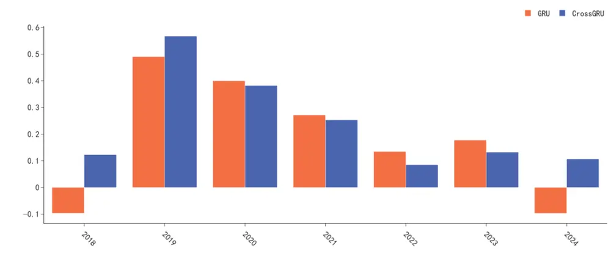
资料来源：wind，华创证券

## （四）消融测试

从因子测试的部分的结果，我们用市场隐状态作为中间变量实现了端到端的截面交互，并发现时序融合截面信息后，能明显改善因子多头效果。

在本章，我们对上述结论进行进一步检验，训练流程同上不变。

## 1、不同市场状态数

在我们截面交互模块市场隐状态的假设中，重要的问题是应该设定多少个隐状态？

从直觉上看，隐状态的数量不应该很少，否则不足以形容实际多变的市场情况，若数量过多，则可能会让交叉注意力的计算开销增大，降低模型泛化能力。

我们进一步测试不同数量设置的市场表征下模因子测试结果，将 c分别取30、50、100、200、300。

图表 20 不同c设置下 5日 IC统计结果

| 模型 | RankIC | ICIR | RankIC 中位数 | IC大于0占比 |
| --- | --- | --- | --- | --- |
| GRU | 0.106 | 0.106 | 0.88 | 0.8 |
| CrossGRU(c=30) | 0.11 | 0.11 | 0.94 | 0.82 |
| CrossGRU(c=50) | 0.108 | 0.105 | 0.92 | 0.82 |
| CrossGRU(c=100) | 0.106 | 0.109 | 0.89 | 0.81 |
| CrossGRU(c=200) | 0.109 | 0.11 | 0.92 | 0.81 |
| CrossGRU(c=300) | 0.106 | 0.108 | 0.92 | 0.82 |

wind,

图表 21 不同c设置下 10 日 IC统计结果

| 模型 | RankIC | ICIR | RankIC 中位数 | IC大于0占比 |
| --- | --- | --- | --- | --- |
| GRU | 0.112 | 0.117 | 0.96 | 0.83 |
| CrossGRU(c=30) | 0.116 | 0.129 | 1.06 | 0.85 |
| CrossGRU(c=50) 0 | .116 | 0.122 | 1.04 | 0.84 |
| CrossGRU(c=100) 0 | .114 | 0.12 | 0.99 | 0.82 |
| CrossGRU(c=200) 0 | .117 | 0.13 | 1.04 | 0.84 |
| CrossGRU(c=300) 0 | .115 | 0.123 | 1.03 | 0.85 |

资料来源：wind，华创证券

在 IC 统计结果上，更换不同的参数 c 后， CrossGRU 模型的 IC 表现仍略优于 GRU 模型，而随着市场隐状态数量的提高，模型 IC 表现大致呈现出“先降后增再降”。

下面我们展示 TOP 组多头收益的对比情况：

图表 22 不同c设置下 TOP组多头超额收益
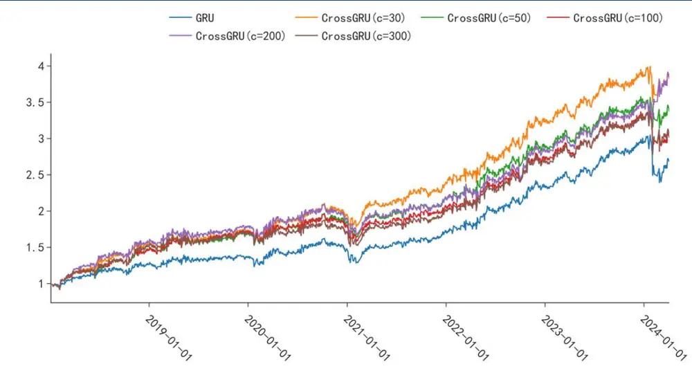
资料来源：wind，华创证券

图表 23 不同 c 设置下 group_20 绩效统计

| 因子 | 年化收益率 | 年化波动率 | 夏普比率 | Calmar 比率 | 超额最大回撤 | 年化超额收益率 | 换手率 |
| --- | --- | --- | --- | --- | --- | --- | --- |
| GRU | 19.3% | 21.9% | 0.91 | 0.63 | -21.9% | 22.0% | 92.88 |
| CrossGRU(c=30) | 26.5% | 21.4% | 1.21 | 0.94 | -16.5% | 29.3% 9 | 3.36 |
| CrossGRU(c=50) | 23.9% | 21.6% | 1.10 | 0.86 | -17.4% | 26.7% 9 | 3.27 |
| CrossGRU(c=100) | 21.7% | 22.3% | 0.99 | 0.69 | -19.4% | 24.4% 9 | 3.19 |
| CrossGRU(c=200) | 26.6% | 22.5% | 1.16 | 1.03 | -20.6% | 29.4% 9 | 2.87 |
| CrossGRU(c=300) | 22.0% | 22.3% | 1.00 | 0.68 | -19.7% | 24.8% | 93.48 |

资料来源：wind，华创证券

图表 24 不同c设置下 TOP组逐年收益对比
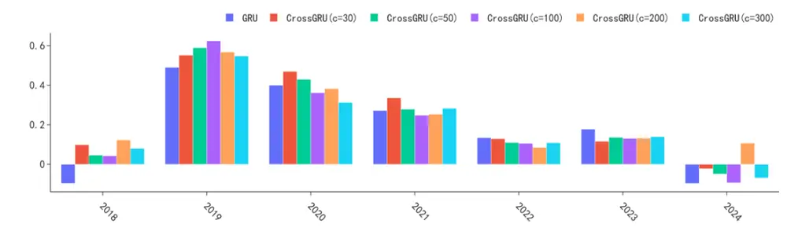
资料来源：wind，华创证券

在 TOP 组测试的表现上，CrossGRU 模型的相关结论仍然保持与上文一致。随着 c 的增大，模型效果呈现“先降后升再降”结果，在 c设置为30、200 时模型效果最佳。

所有参数设置下，TOP 组多头在全回测区间均优于GRU模型，年化收益相比GRU模型提升幅度在3%~7%。在 2018、2019年、2024年相对表现更强。在2024年的回撤区间，隐状态 c 设置为 30、50、100、200、300 的回撤分别为 12.4%、12.2%、17.5%、8.2%、18.2%。

## 2、简易截面交互

我们进一步探索截面信息的加入是否能带来增量。

我们考虑一种替代市场隐状态交叉注意力的截面交互方法，在 GRU 模型的输出之后加入一个简单模块实现截面信息交互。具体来说，我们使用一个更为简易的“加性”注意力CrossGRU 中的交叉注意力模块：

考虑在某一个时点t，记 GRU 模型输出的截面 n 只股票的 d 维表征为 $S_{i}$ ，其中 $i=$ $1,2,3,\ldots,n,$ ，，那么给每个股票表征一个权重来构建截面表征（为方便我们省略t标注）：

$$
E_{cs}=\alpha_{1}S_{1}+\alpha_{2}S_{2}+\cdots+\alpha_{n}S_{n}
$$

其中，股票i的权重通过如下方法学习：

$$
\alpha_{i}=softmax(MLP_{2}(SidU(MLP_{1}(S_{i}))))
$$

$MLP_{1}$ 输入、输出维度为d， $MLP_{2}$ 的输入维度为d，输出维度为1。通过上述简单的加性注意力我们得到一个向量表征整个截面的股票序列。

图表 25 简易截面注意力
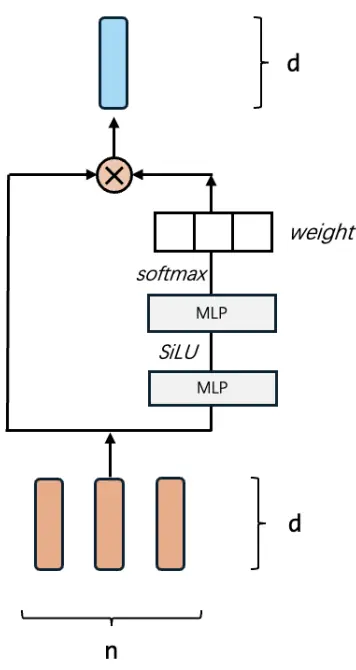
资料来源：华创证券

最后，将 $\cdot E_{cs}$ 复制n份，用上文相同的可学习的残差连接融合个股和截面表征。我们将上述模型记为 GA-GRU。

图表 26 CsAGRU 5 日 IC 统计结果

| 模型 | RankIC | ICIR | RankIC 中位数 | IC大于0占比 |
| --- | --- | --- | --- | --- |
| GRU | 0.106 | 0.106 | 0.88 | 0.8 |
| GA-GRU | 0.105 | 0.108 | 0.9 | 0.81 |

资料来源：wind，华创证券

图表 27 CsAGRU 10 日 IC 统计结果

| 模型 | RankIC | ICIR | RankIC 中位数 | IC大于0占比 |
| --- | --- | --- | --- | --- |
| GRU | 0.112 | 0.117 | 0.96 | 0.83 |
| GA-GRU | 0.111 | 0.115 | 0.99 | 0.84 |

资料来源：wind，华创证券

图表 28 CsAGRU TOP 组多头超额收益对比
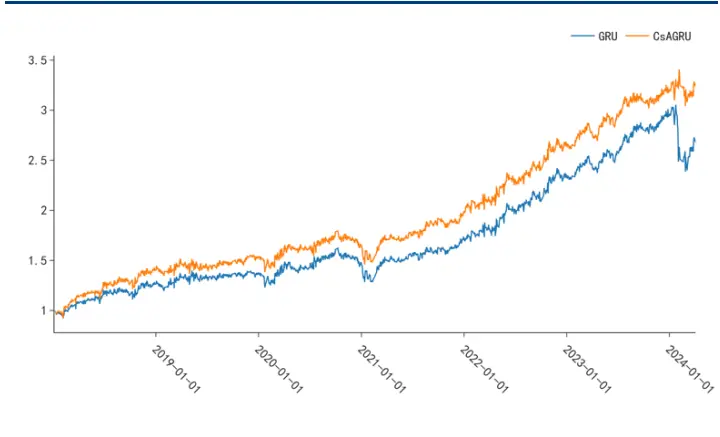
资料来源：wind，华创证券

图表 29 CsAGRU分组超额收益走势
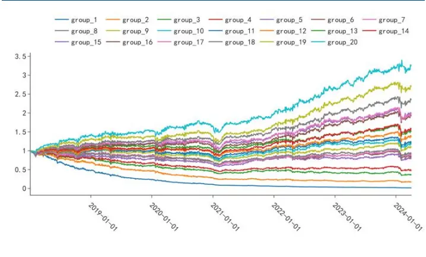
资料来源：wind，华创证券

图表 30 CsAGRU group_20 绩效统计

| 因子 | 年化收益率 | 年化波动率 | 夏普比率 | Calmar 比率 | 超额最大回撤 | 年化超额收益率 | 换手率 |
| --- | --- | --- | --- | --- | --- | --- | --- |
| GRU | 19.4% | 21.9% | 0.92 | 0.64 | -21.9% | 21.7% | 92.91 |
| CsAGRU | 23.3% | 20.8% | 1.11 | 1.05 | -18.6% | 25.7% | 93.73 |

资料来源：wind，华创证券

图表 31 CsAGRU TOP 组逐年收益对比
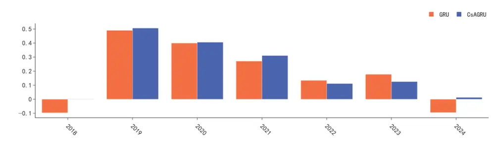
资料来源：wind,华创证券

用简单注意力机制引入截面信息的CsAGRU 模型相比GRU 有一定提升。虽然在 IC 表现上略弱于 GRU 模型，模型在 TOP 组多头表现上取得了更优性能，TOP 组年化收益相比GRU 模型提高约 4%，同时最大回撤降低 3%，在 2024 年的回撤区间 CsAGRU 回撤为10%。分年度来看，加入截面信息的 CsAGRU 同样在 2018 年与 2024 年取得优于 GRU模型表现，与上文CrossGRU 的结果相似。

## （五）小结

在本章中，我们评估了 CrossGRU 模型在端到端量价因子挖掘任务中的表现，并将其与传统GRU模型进行了对比。结果显示，CrossGRU模型在因子的顶层分组多头策略中表现出了明显的优势。特别是，得益于截面信息的融入，CrossGRU模型在2018年和2024年的表现超过了 GRU 模型。

为了深入理解截面交互模块的作用，我们进行了一系列消融实验。这些实验包括调整交叉注意力机制中的关键参数和改变截面交互模块的设计方案。即使在调整了截面交叉注意力的核心参数之后，CrossGRU模型的主要结论仍然成立。此外，采用更简化的截面交互模块设计的 CsAGRU 模型也显示出相对于 GRU 模型在多头组的性能提升。这进一步证实了在时序模型中加入截面信息能够有效改善因子的多头表现。我们认为，当市场整体环境发生显著变化时，单纯依赖时序模型学习到的规律可能会失效。在这种情况下，截面模块能够在一定程度上感知到市场的整体环境变化，并与时序规律相互补充。

最后，我们发现市场隐状态的数量对 CrossGRU 模型的性能有显著影响。尽管我们无法确定一个最优的超参数值，但将多个参数进行等权组合似乎是一个泛化能力更强的解决方案。当我们将c的值提升到300 时，模型的性能出现了下降。因此，我们采取了将c设置为 30、50、100、200 的模型进行等权组合，记为 CrossGRU(ensemble)模型。

CrossGRU(ensemble)分组测试表现如下：

图表 32 CrossGRU(ensemble) 分组超额收益
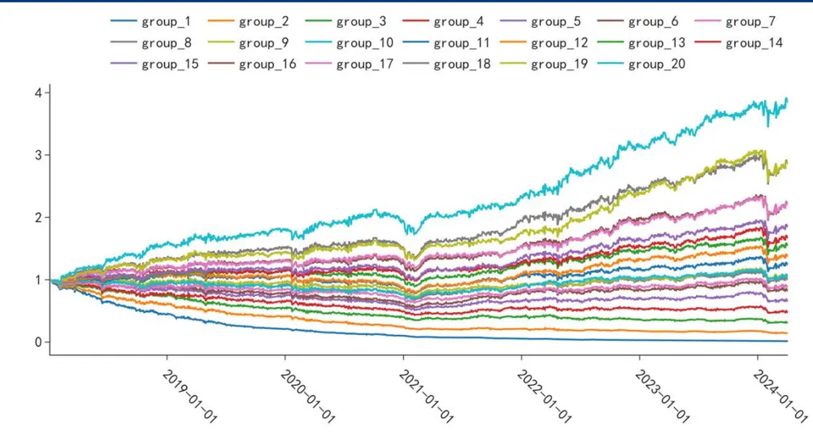
资料来源：wind,华创证券

图表 33 CrossGRU(ensemble) group_20 绩效统计

| 因子 | 年化收益率 | 年化波动率 | 夏普比率 | Calmar 比率 | 超额最大回撤 | 年化超额收益率 | 换手率 |
| --- | --- | --- | --- | --- | --- | --- | --- |
| CrossGRU(ensemble) | 26.6% | 21.8% | 1.19 | 0.99 | -26.8% | 29.4% | 92.24 |

资料来源：wind,华创证券

将 CrossGRU(ensemble)因子通过如下简化设置构建中证 1000 的指增组合：

约束设置为（1）1000指数成分股占比大于 80%（2）单只股票权重上限为 0.8%，下限为 0%（3）市值暴露小于3%（4）行业暴露小于3%（5）换手上限为30%；

调仓频率为周频，根据每周最后一个交易日的因子值在次周首个交易日进行调仓，持有期为 10天；

回测时交易成本双边0.0025。

对因子进行市值行业中性化后在上述设置下，指增组合的超额年化为 12.28%，超额收益最大回撤 6.8%，区间换手率均值 17.7%，统计图表如下：

图表 34 CrossGRU(ensemble) 1000 指增超额走势
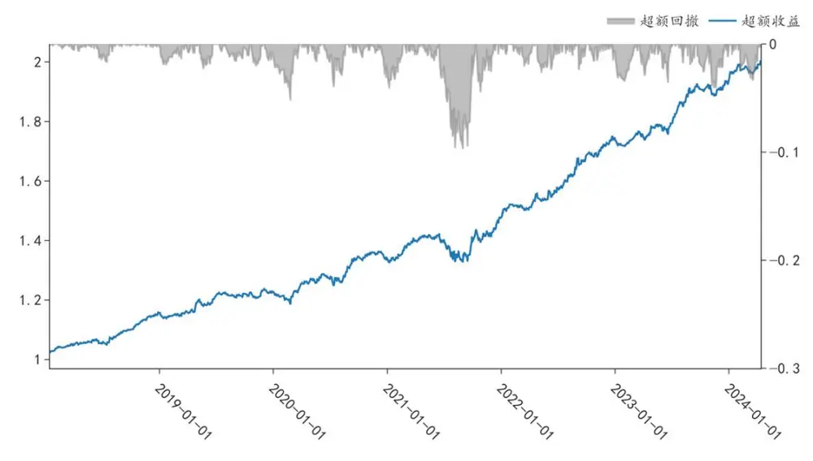
wind,

图表 35 CrossGRU(ensemble) 1000 指增收益统计

|  | 全区间 | 2018 | 2019 | 2020 | 2021 | 2022 | 2023 | 2024-04-12 |
| --- | --- | --- | --- | --- | --- | --- | --- | --- |
| 年化收益率 | 7.7% | -27.8% | 33.9% | 31.2% | 34.0% | -6.6% | 3.9% | -5.4% |
| 年化波动率 | 21.9% | 24.3% | 23.3% | 24.7% | 15.6% | 23.6% | 12.3% | 34.2% |

资料来源：wind，华创证券

## 四、总结

在使用 GRU、 PatchTST 等时序网络模型进行端到端量价因子挖掘的过程中，我们发现这些模型忽略了股票截面之间的依赖关系，由于缺乏对市场横截面信息的考虑，这些模型在面对市场整体环境变化时可能性能表现较差。本篇报告我们提出了CrossGRU 模型，在传统GRU 时序模型基础上融入了截面交互模块。CrossGRU模型在提升效率的同时，避免了引入额外的变量和复杂的图结构。

CrossGRU 模型区别于传统方法，它不依赖于额外的截面变量或其他模型，而是采用端到端的方式实现截面信息的有效交互。我们以“市场隐变量”为假设，结合路由机制与交叉注意力实现高效的横截面信息交互。同时，为了充分考虑个股的独特走势，模型引入了可学习的残差连接，以实现时序和截面信息的自适应融合。

通过与 GRU 模型的对比测试，CrossGRU 模型在中证全指股票池的回测中表现更为出色。CrossGRU 因子的 5 日 RankIC 达到 10.9%，10 日 RankIC 为 11.7%，均略高于GRU模型。在20个分组的TOP 组多头超额收益方面，CrossGRU 相比GRU年化收益提升了 7%。在 2024 年初时间段内，CrossGRU 模型的 TOP 组超额收益最大回撤为 8%，明显优于 GRU 模型的 21%。在 GRU 模型表现不佳的 2018 年和 2024 年，CrossGRU 模型更是展现出了显著的优越性。

我们对着重对截面模块进行了消融测试，我们发现市场隐状态的数量对模型性能有显著影响。但在不同参数配置下，CrossGRU模型的IC 表现依旧优于GRU模型，且TOP 组多头收益的提升幅度在 3%到 7%之间。为了进一步验证截面交互的有效性，我们提出了一个简化的CsAGRU模型，采用加性注意力机制来实现截面交互，在TOP组多头表现上仍然相比GRU 模型有所提升。

## 五、风险提示

策略基于历史数据回测，不保证未来数据的有效性；深度学习模型存在过拟合风险；深度学习模型受随机数影响；本文的模型实现和相关文献不完全相同。

## 六、参考文献

Zhang, Yunhao, and Junchi Yan. "Crossformer: Transformer utilizing cross-dimension dependency for multivariate time series forecasting." The eleventh international conference on learning representations. 2022.

Bachlechner, Thomas, et al. "Rezero is all you need: Fast convergence at large depth." Uncertainty in Artificial Intelligence. PMLR, 2021.

Duan, Yitong, et al. "Factorvae: A probabilistic dynamic factor model based on variational autoencoder for predicting cross-sectional stock returns." Proceedings of the AAAI Conference on Artificial Intelligence. Vol. 36. No. 4. 2022.

Chen, Chun-Fu Richard, Quanfu Fan, and Rameswar Panda. "Crossvit: Cross-attention multiscale vision transformer for image classification." Proceedings of the IEEE/CVF international conference on computer vision. 2021.

Nie, Yuqi, et al. "A time series is worth 64 words: Long-term forecasting with transformers." arXiv preprint arXiv:2211.14730 (2022).

Vaswani, Ashish, et al. "Attention is all you need." Advances in neural information processing systems 30 (2017).

Han, Lu, Han-Jia Ye, and De-Chuan Zhan. "The Capacity and Robustness Trade-off: Revisiting the Channel Independent Strategy for Multivariate Time Series Forecasting." arXiv preprint arXiv:2304.05206 (2023).

## 金融工程组团队介绍

组长、首席分析师：王小川

同济大学管理学博士。2017年加入华创证券研究所。

高级分析师：秦玄晋

上海对外经贸大学硕士。2018年加入华创证券研究所。

助理研究员：杨宸祎

美国伊利诺伊大学香槟分校会计学、金融工程学硕士，CFA。2021年加入华创证券研究所。

助理研究员：黄河

东华大学工学博士，FRM。2023年加入华创证券研究所。

助理研究员：洪远

华南理工大学金融硕士。2023年加入华创证券研究所。

## 华创证券机构销售通讯录

| 地区 | 姓名 | 职务 | 办公电话 | 企业邮箱 |
| --- | --- | --- | --- | --- |
| 北京机构销售部 | 张昱洁 | 副总经理、北京机构销售总监 | 010-63214682 | zhangyujie@hcyjs.com |
|  | 张菲菲 | 北京机构副总监 | 010-63214682 | zhangfeifei@hcyjs.com |
|  | 刘懿 | 副总监 | 010-63214682 | liuyi@hcyjs.com |
|  | 侯春钰 | 资深销售经理 | 010-63214682 | houchunyu@hcyjs.com |
|  | 过云龙 | 高级销售经理 | 010-63214682 | guoyunlong@hcyjs.com |
|  | 蔡依林 | 资深销售经理 | 010-66500808 | caiyilin@hcyjs.com |
|  | 刘颖 | 资深销售经理 | 010-66500821 | liuying5@hcyjs.com |
|  | 顾翎蓝 | 资深销售经理 | 010-63214682 | gulinglan@hcyjs.com |
|  | 车一哲 | 销售经理 |  | cheyizhe@hcyjs.com |
| 深圳机构销售部 | 张娟 | 副总经理、深圳机构销售总监 | 0755-82828570 | zhangjuan@hcyjs.com |
|  | 汪丽燕 | 高级销售经理 | 0755-83715428 | wangliyan@hcyjs.com |
|  | 张嘉慧 | 高级销售经理 | 0755-82756804 | zhangjiahui1@hcyjs.com |
|  | 董姝彤 | 销售经理 | 0755-82871425 | dongshutong@hcyjs.com |
|  | 王春丽 | 高级销售经理 | 0755-82871425 | wangchunli@hcyjs.com |
| 上海机构销售部 | 许彩霞 | 总经理助理、上海机构销售总监0 | 21-20572536 | xucaixia@hcyjs.com |
|  | 官逸超 | 上海机构销售副总监 | 021-20572555 | guanyichao@hcyjs.com |
|  | 黄畅 | 上海机构销售副总监 | 021-20572257-2552 | huangchang@hcyjs.com |
|  | 吴俊 | 资深销售经理 | 021-20572506 | wujun1@hcyjs.com |
|  | 张佳妮 | 资深销售经理 | 021-20572585 | zhangjiani@hcyjs.com |
|  | 蒋瑜 | 高级销售经理 | 021-20572509 | jiangyu@hcyjs.com |
|  | 施嘉玮 | 高级销售经理 | 021-20572548 | shijiawei@hcyjs.com |
|  | 朱涨雨 | 高级销售经理 | 021-20572573 | zhuzhangyu@hcyjs.com |
|  | 李凯月 | 高级销售经理 |  | likaiyue@hcyjs.com |
|  | 易星 | 销售经理 |  | yixing@hcyjs.com |
|  | 张玉恒 | 销售经理 |  | zhangyuheng@hcyjs.com |
| 广州机构销售部 | 段佳音 | 广州机构销售总监 | 0755-82756805 | duanjiayin@hcyjs.com |
|  | 周玮 | 销售经理 |  | zhouwei@hcyjs.com |
|  | 王世韬 | 销售经理 |  | wangshitao1@hcyjs.com |
| 私募销售组 | 潘亚琪 | 总监 | 021-20572559 | panyaqi@hcyjs.com |
|  | 汪子阳 | 副总监 | 021-20572559 | wangziyang@hcyjs.com |
|  | 江赛专 | 副总监 | 0755-82756805 | jiangsaizhuan@hcyjs.com |
|  | 汪戈 | 高级销售经理 | 021-20572559 | wangge@hcyjs.com |
|  | 宋丹玙 | 销售经理 | 021-25072549 | songdanyu@hcyjs.com |

## 华创行业公司投资评级体系

基准指数说明：

A股市场基准为沪深 300指数，香港市场基准为恒生指数，美国市场基准为标普 500/纳斯达克指数。

公司投资评级说明：

强推：预期未来 6个月内超越基准指数 20%以上；

推荐：预期未来 6个月内超越基准指数 10%－20%；

中性：预期未来 6个月内相对基准指数变动幅度在-10%－10%之间；

回避：预期未来 6个月内相对基准指数跌幅在 10%－20%之间。

## 行业投资评级说明：

推荐：预期未来 3-6个月内该行业指数涨幅超过基准指数 5%以上；

中性：预期未来 3-6个月内该行业指数变动幅度相对基准指数-5%－5%；

回避：预期未来 3-6个月内该行业指数跌幅超过基准指数 5%以上。

## 分析师声明

每位负责撰写本研究报告全部或部分内容的分析师在此作以下声明：

分析师在本报告中对所提及的证券或发行人发表的任何建议和观点均准确地反映了其个人对该证券或发行人的看法和判断；分析师对任何其他券商发布的所有可能存在雷同的研究报告不负有任何直接或者间接的可能责任。

## 免责声明

本报告仅供华创证券有限责任公司（以下简称“本公司”）的客户使用。本公司不会因接收人收到本报告而视其为客户。

本报告所载资料的来源被认为是可靠的，但本公司不保证其准确性或完整性。本报告所载的资料、意见及推测仅反映本公司于发布本报告当日的判断。在不同时期，本公司可发出与本报告所载资料、意见及推测不一致的报告。本公司在知晓范围内履行披露义务。

报告中的内容和意见仅供参考，并不构成本公司对具体证券买卖的出价或询价。本报告所载信息不构成对所涉及证券的个人投资建议，也未考虑到个别客户特殊的投资目标、财务状况或需求。客户应考虑本报告中的任何意见或建议是否符合其特定状况，自主作出投资决策并自行承担投资风险，任何形式的分享证券投资收益或者分担证券投资损失的书面或口头承诺均为无效。本报告中提及的投资价格和价值以及这些投资带来的预期收入可能会波动。

本报告版权仅为本公司所有，本公司对本报告保留一切权利。未经本公司事先书面许可，任何机构和个人不得以任何形式翻版、复制、发表、转发或引用本报告的任何部分。如征得本公司许可进行引用、刊发的，需在允许的范围内使用，并注明出处为“华创证券研究”，且不得对本报告进行任何有悖原意的引用、删节和修改。

证券市场是一个风险无时不在的市场，请您务必对盈亏风险有清醒的认识，认真考虑是否进行证券交易。市场有风险，投资需谨慎。

## 华创证券研究所

| 北京总部 | 广深分部 | 上海分部 |
| --- | --- | --- |
| 地址：北京市西城区锦什坊街26号 恒奥中心 C 座 3A | 地址：深圳市福田区香梅路1061号中投国 际商务中心A座19楼 | 地址：上海市浦东新区花园石桥路33号 花旗大厦 12 层 |
| 邮编：100033 | 邮编：518034 | 邮编：200120 |
| 传真：010-66500801 会议室：010-66500900 | 传真：0755-82027731 会议室：0755-82828562 | 传真：021-20572500 会议室：021-20572522 |