【AI+HI 系列（5）】

# CrossGRU-2:基于 Patch 与多尺度时序改进端到

## 端模型

## 前言

时序数据在不同尺度表达下的特征模式可能并不完全相同。例如，股票在分钟、日、周、月尺度上呈现不同的趋势与波动。对于较长的序列，我们希望端到端模型可以更好处理序列的局部短期与整体长期的关系，实现不同尺度的信息提取与交互。

## 模型特点

时序深度学习模型中的“patch”通常指将时间序列中连续的时点聚合成子序列，可以帮助模型更有效地学习局部的时间特征。

我们将时序模块改为双分支结构，每个分支使用不同 patch 设置以提取不同时间尺度的信息，通过门控循环单元（GRU）处理同一尺度内的时序信息交互，再通过交叉注意力处理不同尺度间的信息交互。在此基础上，我们继续引入先前报告中的截面模块，构建一个双分支时序+截面的端到端模型，进行量价因子挖掘任务。

## 因子测试对比

我们以 GRU 模型作为对比基准，CrossGRU-2 在 30D、90D、30min 数据集的10 日 RankIC 分别为 12.3%、12.5%、11.9%；分组测试中 TOP 组在上述三个数据集的年化收益分别为 28.60%、32.01%、23.26%，相比 GRU 实现了 7.1%、8.3%、4.2%的提高；2024 年 TOP 组在上述数据集的累计收益分别为 7.4%、10.4%、-11.7%，均高于 GRU 模型的-8.5%、-6.2%、-14.6%；

## 模型消融测试

我们对双分支时序、截面模块进行一系列消融测试。在大多情况下同时加入双分支模块、截面模块的模型实现最优表现；在较长序列的数据集上加入 Patch改进明显：对 90D、30min数据集， GRU 加入 patch 后因子 TOP 组收益提高2~3%，改为双分支的多尺度结构后表现进一步提高；我们取 CrossGRU-2 最优模型在中证 1000 构建指增组合，组合实现超额收益年化 19.43%，跟踪误差2.83%。

## 风险提示：

策略基于历史数据回测，不保证未来数据的有效性。深度学习模型存在过拟合风险。深度学习模型受随机数影响。

## 华创证券研究所

证券分析师：秦玄晋

电话：021-20572522

邮箱：qinxuanjin@hcyjs.com

执业编号：S0360522080005

证券分析师：王小川

电话：021-20572528

邮箱：wangxiaochuan@hcyjs.com

执业编号：S0360517100001

联系人：洪远

邮箱：hongyuan@hcyjs.com

## 相关研究报告

《AI+HI 系列（4）：CrossGRU：基于交叉注意力的时序+截面端到端模型》

2024-04-19

## 投资主题

## 报告亮点

基于时序深度学习模型进行端到端因子挖掘已有较多工作，我们对时序模型的多尺度交互进行初步探讨。处理多尺度问题常见的方法是多分支网络，本篇报告基于 Patch 提取不同时间尺度的信息表征，并使用交叉注意力机制进行不同尺度的信息交互，以此改进端到端模型的时序模块，同时，我们进一步加入了截面信息交互模块，构建一个端到端的多尺度时序+截面模型，为广大投资者提供新的研究思路，助力量化投资的发展。

## 投资逻辑

时序与截面数据在量化投资领域处处可见，通过深度学习网络实现时序或截面信息的信息挖掘具有相当的潜力。本篇报告提出了基于深度学习的量价因子挖掘模型，进一步探索深度学习在量化领域上的运用。

## 一、动机

在先前的报告《CrossGRU: 基于交叉注意力的时序+截面端到端模型》中（后记为CrossGRU-1），我们基于交叉注意力机制实现了一个截面模块，使端到端模型学习截面股票间的交互作用，相比于GRU基线模型取得了改善。

在本篇报告中，我们探索了模型在时序维度上的改进方法。端到端的深度学习模型利用过去一段时期的量价时序数据进行因子挖掘。我们认为量价数据在不同时间尺度下存在差异，例如，日度K线包含相对丰富的“局部”信息，而周度K线则更多地体现为“整体”的走势特征。我们希望模型在处理较长序列时，能够兼顾短期的局部特征与长期的整体信息。

基于以上考虑，我们从“局部-整体”思路出发，使模型学习不同尺度内的特征模式，以及不同尺度间的信息交互。为了实现这一目标，我们引入了近年来时序网络中常见的Patch 设计，我们使用一个双分支的时序模块，通过不同的 Patch 设置得到不同时间尺度下的表征，通过 GRU 模型实现每个尺度内的时序信息交互，并通过交叉注意力实现不同尺度间的信息交互。

最后，在上述双分支时序模块的基础上，我们继续使用CrossGRU-1中的截面模块，构建一个双分支时序+截面模块的端到端模型，由于模型的基础机制仍然是交叉注意力（CrossAttention）与 GRU，我们将本篇报告提出的模型记为 CrossGRU-2。

我们在 30D以及两个序列长度更长的 90D和 30min量价数据集上对模型进行了测试，我们还进一步通过消融测试初步探讨了时序模块和截面模块在不同输入数据集上的表现差异，以及在长序列输入中引入 Patch 对GRU 模型的改进效果。

## 二、模型介绍

本篇报告的模型简化流程下图所示，模型大致分为时序、截面、特征三个模块，其中截面与特征维度的模块与先前报告 CrossGRU-1相同。

本篇报告我们主要改进了时序模块的设计，通过一个双分支结构提取不同时间尺度的信息，并使用交叉注意力融合；在后文我们首先介绍模型涉及的主要机制，再具体介绍CrossGRU-2 三个模块的实现方法。

图表 1 CrossGRU-2 模型
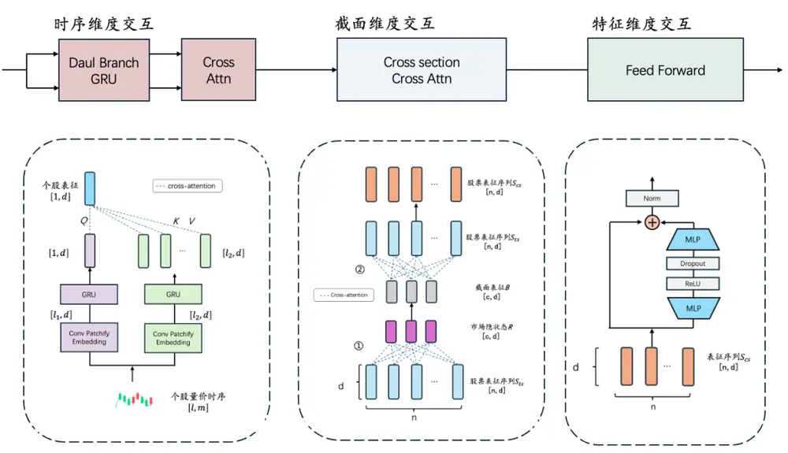
资料来源：华创证券

## （一）模型主要机制

## 1、交叉注意力

交叉注意力是注意力机制的一种运用方式，涉及 Query、Key、Value 三个中间变量（简写为Q、K、V），公式表达如下：

$$
\mathrm{Attention}(\mathrm{Q},\mathrm{K},\mathrm{V})=\mathrm{softmax}\left({\frac{\mathrm{Q}\mathrm{K}^{\mathrm{T}}}{\sqrt{\dot{\mathrm{d}}_{\mathrm{k}}}}}\right)\mathrm{V}
$$

交叉注意力与自注意力的核心公式同为上式。自注意力机制捕捉同一序列内部的依赖关系，Q、K、V 由同一个序列经过映射得到，计算复杂度为 $0(n^{2})$ ，其中 n 是序列长度；交叉注意力机制的Q、K、V 则来自于两个序列，核心思想是将两个不同的输入序列进行交互，以捕捉它们之间的相关性，计算复杂度为 $0(m\cdot n)$ ，其中 m、n 分别是两个序列的长度。

交叉注意力机制常被运用于多模态类的任务场景，例如机器翻译、文本+图片等，是处理数据对齐场景的一种灵活机制。

## 2、时序 Patch

时序 Patch 通常做法是在模型 Embedding 步骤前，将时间序列数据划分为多个固定长度的连续子序列。patch通过设置特定大小的窗口，在原序列进行“滑动截取”得到多个子序列（当滑动的步长不等于滑动窗口的大小时，一个时点的值可以存在于多个子序列中），将一个子序列视为一个 token进行后续的Embedding步骤。

## Patch 的逻辑与优势在于：

使单个 token 包含更多信息：不同于自然语言序列中的“字”，时序的每一个时点的取值意义有限，Patch 将局部连续的时点取值看成一个整体并视为一个 token，单个token 信息更加丰富；

Patch 处理后输入序列长度明显降低，能减少模型计算开销或接受更长的序列；

## （二）时序交互模块

在时序模块的设计上我们参考了 CrossVit(Chen et al.,2021)的双分支结构：

图表 2 CrossVit 模型
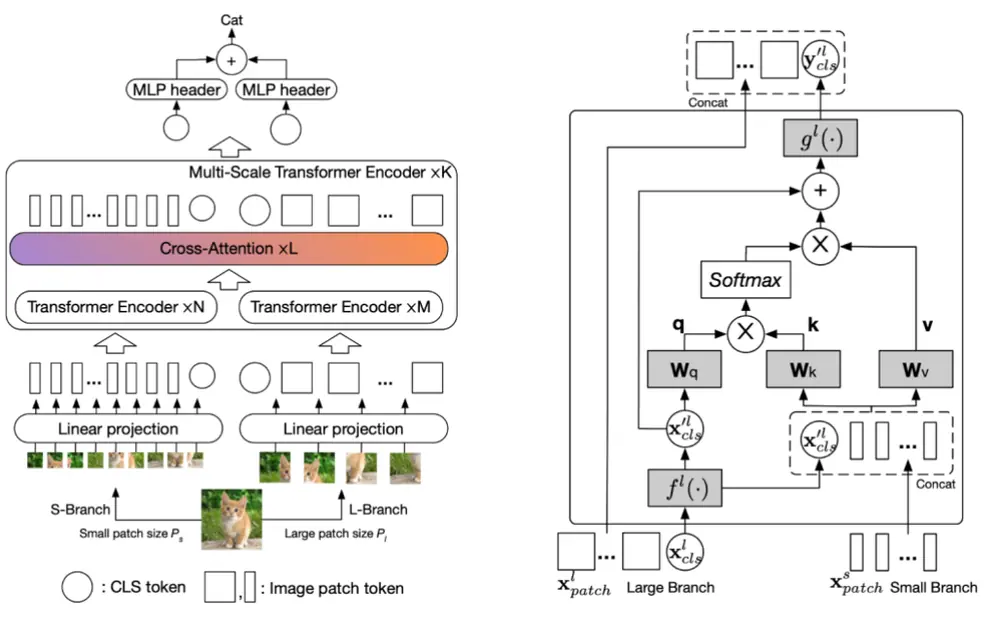
Chen et al. "CrossViT: Cross-Attention Multi-Scale Vision Transformer for Image Classification"

CrossVit以ViT模型为基础，在ViT 模型中图像首先被切分为多个图像块（Patch），Patch参数的设置影响了每个 token 的信息粒度。为了使 ViT 模型能拥有类似卷积神经网络中的多尺度信息融合能力，CrossVit 使用了双分支结构，每个分支设置不同大小的 Patch，较小的 Patch捕获更细粒度的信息，较大的 Patch则覆盖更广泛的图片信息。每个分支的Encoder输出通过交叉注意力与MLP完成信息融合。

我们参考上述 CrossVit 的思路，对过去一段时间的量价时序输入使用不同的 Patch 大小进行采样，构建一个双分支结构；对时序模块的一个分支，流程如下图所示：

图表 3 时序双分支流程
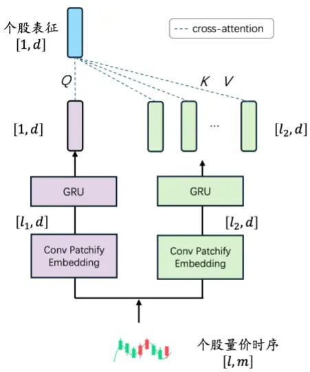
资料来源：华创证券

考虑第 i 个股票 $X^{i}\in\mathbb{R}^{l,m}$ 的输入，其中 l为时间序列长度，m 为变量数，每个分支的流程为：

（1） 对输入序列进行PatchEmbedding处理，得到一种尺度的信息表征 $X_{emb}^{i}\in\mathbb{R}^{l^{\prime},d}$ 其中l’为Patch后子序列数，d为嵌入维度；

（2） 将上一步的序列输入每个分支对应的 GRU 模型。

在第一步，我们通过一个 1D 卷积实现 patch 与 Embedding，两个分支的 kernel size 设置为不同的大小，kernel size 较小的分支每个 token 表示相对更高频、局部的信息，kernelsize较大的分支每个token表示相对更低频、整体的信息；

在第二步，我们将上一步的输出序列输入 GRU 模型；

上述步骤后，我们得到了每只个股在两个不同的时间尺度下的表征序列，对每一种尺度表度，我们用GRU 学习时序维度的信息交互。接下来我们使用交叉注意力的对两个表征序列进行融合：对频率相对高频的分支，取 GRU 最后一个时间步并作为交叉注意力的Query，取频率相对低频的分支 GRU的所有时间步的输出，并作为交叉注意力的 Key和Value：

$$
\boldsymbol{S_{attn}^{i}}=\mathrm{CrossAttn}\left(\boldsymbol{S_{hf}^{i}},\boldsymbol{S_{lf}^{i}},\boldsymbol{S_{lf}^{i}}\right)
$$

$S_{hf}^{i}\in\mathbb{R}^{1,d}$ 为高频分支 GRU 输出的最后一个时间步， $S_{lf}^{i}\in\mathbb{R}^{l\prime,d}$ 为低频分支 GRU 的输出的完整序列。我们将交叉注意力的输出 $\mathsf{S}_{\mathrm{attr}}$ 与高频分支GRU 的输出结果进行连接：

$$
S_{ts}^{i}=S_{attn}^{i}+S_{hf}^{i}
$$

$S_{\mathrm{ts}}^{\mathrm{i}}\in\mathbb{R}^{1,d}$ ，为时序模块的最终输出；

## （三）截面交互模块

截面交互以及后续的特征模块与CrossGRU-1报告相同，简要流程如下：

图表 4 截面交叉注意力
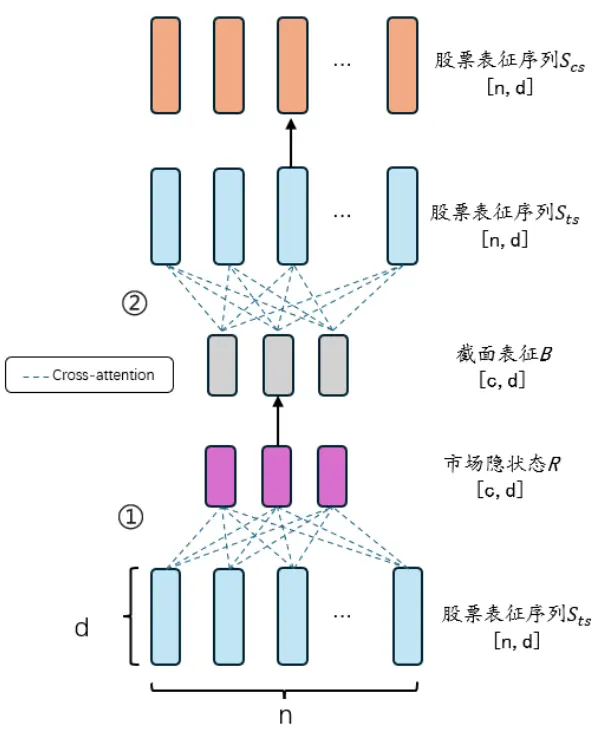
资料来源：华创证券

记时序模块输出截面股票表征序列为 $S_{\mathrm{ts}}\in\mathbb{R}^{n,d}$ ，n为股票数量；截面交互实现步骤为：

⚫ 初始化c个可学习的、维度为d的市场隐状态，记为R；

以R为Query，股票表征序列 $\mathsf{S}_{\mathrm{t}s}$ 为 $\mathrm{Key}$ 、Value进行交叉注意力，交叉注意力输出结果记为 B；

以股票表征序列 $S_{ts}$ 为 Query， B为 Key、Value 进行交叉注意注意力，交出注意力输出结果 $S_{csattn}$ 与 $S_{ts}$ 使用门控连接，得到 $\mathsf{S}_{cs}$ ；

第三步的门控连接为：

$$
\begin{array}{c}{{\mathrm{Z}=\mathrm{Softmax}(\mathrm{MLP}(\mathrm{S}_{\mathrm{ts}}))}}\\{{\ }}\\{{S_{cs}=\mathrm{S}_{\mathrm{ts}}+Z\otimes S_{csattn}}}\end{array}
$$

$S_{cs}$ ∈ ℝ $^{n,d}$ 为截面模块的最后输出，此时截面股票实现了信息交互。

## （四）特征交互模块

对特征维度，我们通过一个FFN层实现特征维度交互：

$$
S_{\mathrm{out}}=BatchNorm\left(S_{cs}+MLP\left(ReLU\big(MLP(S_{cs})\big)\right)\right)
$$

图表 5 特征维度信息交互
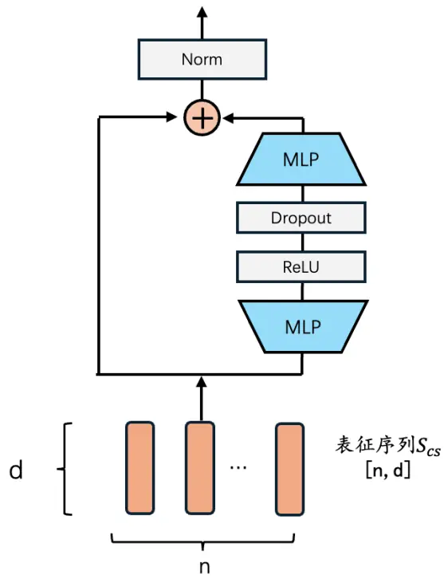
资料来源：华创证券

$S_{out}\in\mathbb{R}^{n,d}$ 为CrossGRU-2 骨干模型的最终输出。

## 三、测试结果

## （一）数据集介绍

数据集变量：

30D、90D数据集：日频的高、开、低、收、均价、成交量6 个变量；

30min 数据集：30 分钟频的高、开、低、收、换手率 5 个变量；

采样方法：

以每周的最后一个交易日t为一个采样截面，在每个采样截面首先通过如下条件对股票进行排除：

1、剔除上市不满 120天的股票；

2、剔除截面市值最小的10%股票。

对日频数据集，取采样截面t对应的 $\mathrm{N_{t}}$ 个股票过去T日的量价时间序列，滚动生成数据截面 $(\mathrm{~N_{1},T,6~}).\ (\mathrm{~N_{2},T,6~})\ \dots\ (\mathrm{~N_{t},T,6~})$ ，在第一个维度上进行拼接得到全部训练数据。我们对T分别取30和 90，即 30D、90D 数据集；

对30分钟频数据，回溯截面上N 个股票过去10个交易日的数据（序列总长度为80），其余步骤同上，后续记为30min 数据集；

模型按年滚动训练，每年年底重新训练模型；回溯过去 11 年作为训练集+验证集，其中最近的一年为验证集，次年为测试集，如下图所示：

图表 6 训练验证集划分方法
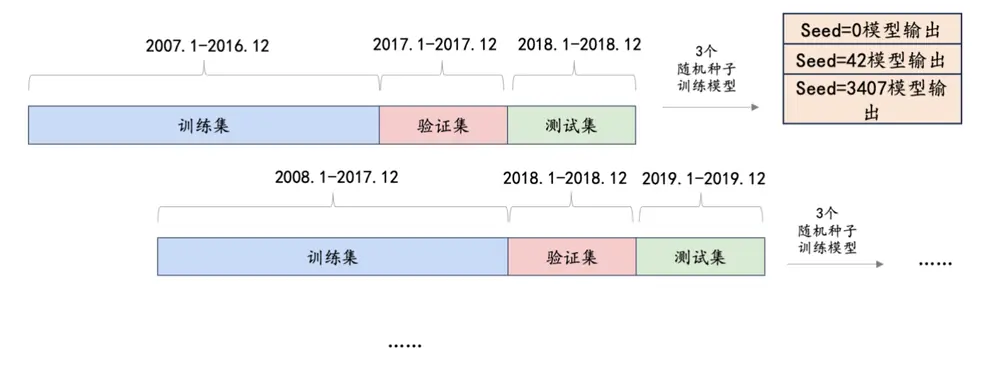
资料来源：华创证券

在进行模型重训练时，设置 3 个随机种子，将 3次预测结果合成作为最终结果。

标准化方法：

1、MAD 法对异常值进行缩尾处理；

2、除换手率外，每个截面用最后一个交易日收盘价/成交量作为分母进行缩放归一化；

3、进行 Z-score 标准化；

验证集与测试集标准化涉及的统计量采用训练集的拟合结果。

模型预测标签：

预测标签为未来10日收益（t+1日收盘价~t+11日收盘价计算， rank标准化处理）；MLP预测头输出维度为64，取64 个值的均值作为每只股票的因子得分；损失函数为 IC。

## （二）模型参数

下文涉及模型共同的参数设定如下：

1D 卷积输出通道为 64、GRU hidden state 设置为 64、层数为 1；注意力机制的头数为 4；FFN 层的乘数为 2；截面模块的市场隐状态数为 30；

CrossGRU 模型中双分支时序的 patch 大小设置为：对 30D、90D 数据集 patch size 取3、5；在 30min 数据集取 2、8。

训练策略涉及相关参数为：

图表 7 训练参数设定

| 变量名 | 参数设置 |
| --- | --- |
| Batch size | 每周最后交易日的截面股票数 |
| Patience | 7 |
| Max epoch | 150 |
| Optimizer | Adam(初始学习率 1e-3) |
| Seed | 0,42,3407 |

资料来源：华创证券

在下一节，我们首先展示包含双分支时序+截面模块的模型因子测试结果（记为CrossGRU-2 模型）。我们的对比基准为 GRU+MLP（后续记为 GRU 模型）。在消融测试小节，我们再展示模块逐个删减的测试结果。

## （三）因子测试结果

本节我们对不同深度学习模型得出的量价因子进行检验与对比。

回测区间：2018 年 1 月 1 日 ~ 2024 年 5 月 31 日；

股票池：中证全指

## 1、IC 测试结果

本部分展示不同数据集上深度学习因子的 IC测试结果，因子数值为周度频率，我们计算5 日与 10 日 IC：

图表 8 5 日 IC 统计结果

| 数据集 | 模型 | RankIC | ICIR | IC大于0占比 |
| --- | --- | --- | --- | --- |
| 30D | GRU | 0.110 | 0.88 | 0.81 |
|  | CrossGRU-2 | 0.110 | 0.90 | 0.81 |
| 90D | GRU | 0.114 | 0.98 | 0.84 |
|  | CrossGRU-2 | 0.113 | 0.93 | 0.81 |
| 30min | GRU | 0.112 | 0.98 | 0.83 |
|  | CrossGRU-2 | 0.111 | 0.89 | 0.82 |

资料来源：wind，华创证券

图表 9 10日 IC统计结果

| 数据集 | 模型 | RankIC | ICIR | IC大于0占比 |
| --- | --- | --- | --- | --- |
| 30D | GRU | 0.118 | 0.97 | 0.83 |
|  | CrossGRU-2 | 0.123 | 1.04 | 0.85 |
| 90D | GRU | 0.122 | 1.08 | 0.86 |
|  | CrossGRU-2 | 0.125 | 1.06 | 0.84 |
| 30min | GRU | 0.120 | 1.03 | 0.84 |
|  | CrossGRU-2 | 0.119 | 0.94 | 0.85 |

资料来源：wind，华创证券

从不同数据集的结果看，CrossGRU-2 与GRU 模型在 IC 各指标上表现相近；10日 RankIC指标上，表现最佳的模型为基于 90D 数据集的 CrossGRU-2，RankIC 为 12.5%。

## 2、分组测试结果

本部分我们对因子进行分组测试，分组数设置为20，每周最后一个交易日根据因子值分组，次周第一个交易日收盘价进行调仓操作，不计交易成本；超额收益的计算基准为中证全指。

下图依次展示在每个数据集上，CrossGRU-2与GRU 不同分组年化收益，以及多头 TOP组（第 20分组）的超额收益走势对比：

图表 10 30D数据集20分组年化收益对比
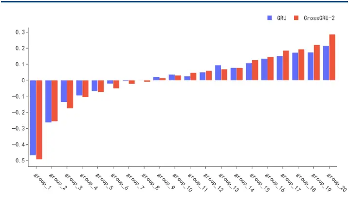
wind,

图表 11 30D数据集 TOP组超额走势对比
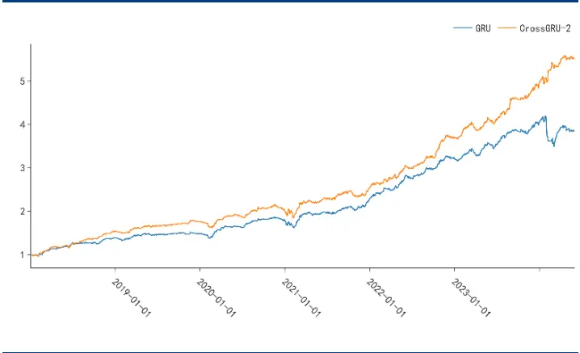
wind,

图表 12 90D数据集20分组年化收益对比
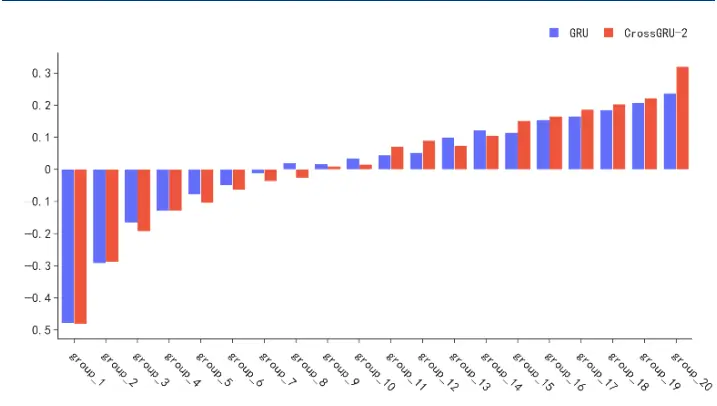
资料来源：wind，华创证券

图表 13 90D数据集 TOP组超额走势对比
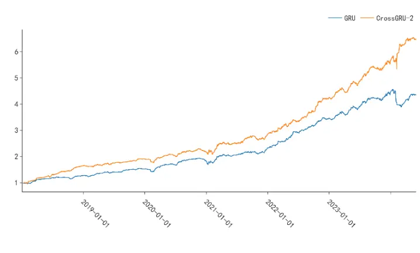
资料来源：wind，华创证券

图表 14 30min数据集 20分组年化收益对比
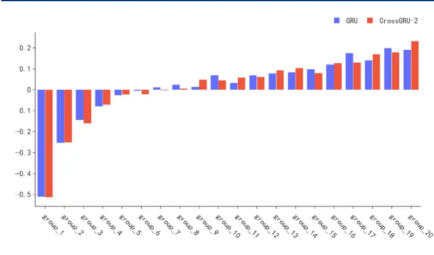
wind,

图表 15 30min数据集 TOP组超额走势对比
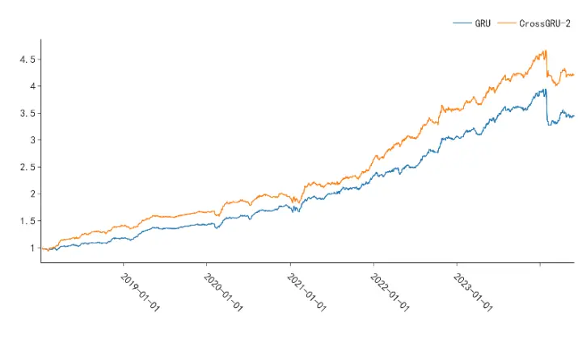
wind,

图表 16 TOP组统计结果

| 数据集 | 因子 | 年化收益率(%) | 夏普比率 | Calmar 比率 | 超额最大回撤(%) | 年化超额收益率(%) | 换手率 |
| --- | --- | --- | --- | --- | --- | --- | --- |
| 30D | GRU | 21.43 | 1.05 | 0.82 | -26.02 | 23.96 | 91.61 |
|  | CrossGRU-2 | 28.60 | 1.30 | 1.32 | -21.65 | 31.13 | 93.40 |
| 90D | GRU | 23.71 | 1.13 | 0.80 | -29.57 | 26.24 | 90.86 |
|  | CrossGRU-2 | 32.01 | 1.43 | 1.65 | -19.37 | 34.54 | 92.29 |
| 30min | GRU | 19.11 | 0.92 | 0.61 | -31.27 | 21.64 | 94.35 |
|  | CrossGRU-2 | 23.26 | 1.12 | 0.87 | -26.83 | 25.79 | 94.16 |

wind,

上表展示了 3 个数据集的分组测试结果。相较于 IC 指标，两个模型在分组测试特别是TOP分组的表现上呈现较大差异：

在所有数据集上，CrossGRU-2 的 TOP 组表现均优于 GRU 模型，在 30D、90D、30min 数据集上，年化超额收益率分别为 31.13%、34.54%、25.79%，相比基准分别高出 7.1%、8.3%、4.2%。

2024年因子TOP组在上述三个数据集的表现为：累计收益7.4%、10.4%、-11.7%，均高于 GRU 模型的-8.5%、-6.2%、-14.6%；最大回撤分别为 16.2%、16.1%、24.6%，均低于GRU 模型的 22.9%，23.3%，28.1%；

## 四、消融测试

本节我们进一步探讨CrossGRU-2模型中双分支时序模块、截面模块的影响。

## （一）剔除时序或截面模块

我们首先考虑，剔除时序或截面模块后，模型表现如何变化。下面我们逐个剔除CrossGRU-2 的组件：CrossGRU-2 为基线模型，剔除截面模块后记为 CrossGRU-2 w/oCSAttn；剔除双分支时序结构后记为 CrossGRU-2 w/o TSAttn（此时模型与 CrossGRU-1报告中的模型相同）

鉴于不同模型 IC 差异仍然较小，下面仅展示分组测试结果：

图表 17 30D数据集消融 20分组年化收益对比
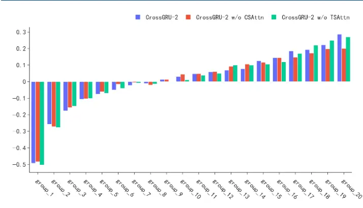
资料来源：wind，华创证券

图表 18 30D数据集消融 TOP组超额走势对比
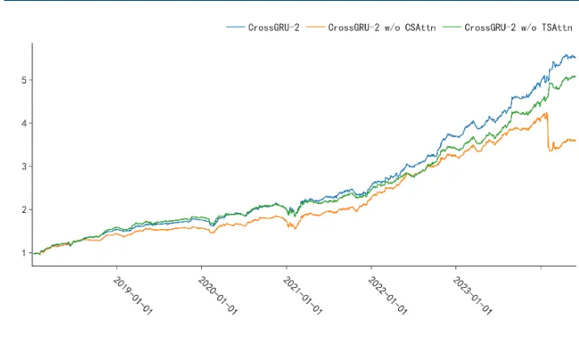
资料来源：wind，华创证券

图表 19 90D数据集消融 20分组年化收益对比
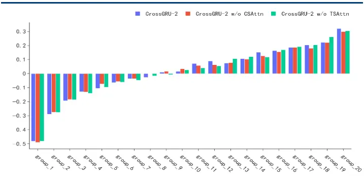
资料来源：wind，华创证券

图表 20 90D数据集消融 TOP组超额走势对比
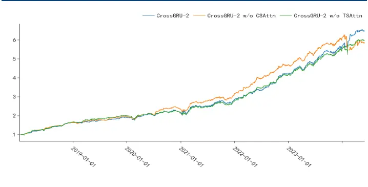
资料来源：wind，华创证券

图表 21 30min数据集消融 20分组年化收益对比
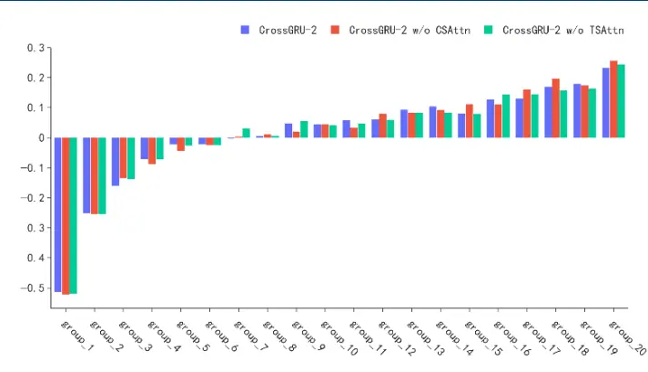
资料来源：wind，华创证券

图表 22 30min数据集消融 TOP组超额走势对比
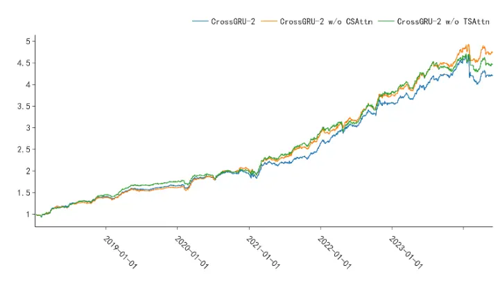
资料来源：wind，华创证券

图表 23 消融测试多头组统计结果

| 数据集 | 模型 | 年化收益率(%) | 夏普比率 | Calmar 比率 | 超额最大回撤(%) | 年化超额收益率(%) | 换手率 |
| --- | --- | --- | --- | --- | --- | --- | --- |
| CrossGRU30D | -2 | 28.60 | 1.30 | 1.32 | -21.65 | 31.13 | 93.40 |
|  | w/o CSAttn | 20.06 | 0.96 | 0.62 | -32.58 | 22.59 | 92.87 |
|  | w/o TSAttn | 26.93 | 1.25 | 1.36 | -19.86 | 29.46 | 92.67 |
| CrossGRU90D | -2 | 32.01 | 1.43 | 1.65 | -19.37 | 34.54 | 92.29 |
|  | w/o CSAttn | 29.83 | 1.37 | 1.15 | -25.93 | 32.36 | 91.62 |
|  | w/o TSAttn | 30.32 | 1.40 | 1.54 | -19.71 | 32.85 | 91.57 |
| 30min | CrossGRU-2 | 23.26 | 1.12 | 0.87 | -26.83 | 25.79 | 94.16 |
|  | w/o CSAttn | 25.67 | 1.22 | 1.05 | -24.37 | 28.20 | 93.89 |
|  | w/o TSAttn | 24.46 | 1.18 | 0.92 | -26.68 | 26.99 | 93.44 |

资料来源：wind，华创证券

我们发现在不同的数据集上的消融测试的结论并不完全一致：

- 对基于日频数据的30D、90D数据集，同时加入双分支时序、截面模块后效果好于仅使用单个时序或截面模块；在 30D 数据集上，剔除截面模块会造成模型效果的显著下降；包含截面模块的模型在 24年的回撤明显更少；

对基于分钟数据的 30min 数据集，同时加入双分支时序、截面模块的效果弱于仅加入时序模型或仅加入截面模块，30min数据集上最优的模型为CrossGRU-2 w/o CSAttn，即仅用双分支时序模块；截面模块在分钟数据集上的增量弱于日频数据集，我们认为这可能是因为分钟频视角更倾向于个股的局部、特质信息，股票间的交互关系更为复杂。

## （二）时序 Patch

在本部分，我们单独讨论时序 Patch 的作用，特别是在较长序列中 Patch的应用。GRU 设计的初衷是为了缓解 RNN的长期依赖问题，它通过引入门控机制控制信息的流动更好地捕捉长期依赖关系，但随着序列长度的增加，长期依赖问题仍然可能会存在，另一方面，随着序列长度的增加，GRU模型的训练时间和推理时间都会变长。本篇报告加入了90D、30min 数据集，对应序列长度分别为 90、80，当我们用更长的输入序列时， GRU 模型是否能很好地捕捉到长序列中的增量信息？

我们采用 1D卷积实现了通道混合的时序Patch（卷积核的大小表示patch size，卷积步长与卷积核大小相同），下面我们对比三个模型：

GRU基线模型，与上文相同；

Patch + GRU，在基线模型的基础上，数据输入 GRU 前进行 Patch；

TS-CrossGRU，在Patch + GRU的基础上更改为双分支，并通过交叉注意力进行尺度融合，即 CrossGRU-2 剔除截面模块，与上节的 CrossGRU-2 w/o CSAttn 相同。

第一、第二个模型我们希望观察 Patch 对 GRU 模型的影响；第二、第三个模型我们观察双分支的多尺度Patch设计相对单个 Patch的提升。

Patch + GRU 模型的 patch size 为：30D、90D 数据集为 3； 30min 数据集为 2；

TS-CrossGRU 模型的 patch size 为：30D、90D 数据集两个分支的 patch size 均分别设置为 3、5；30min 数据集上两个分支的 patch size 分别为 2、8；

下面我们展示分组多头测试结果：

图表 24 消融测试多头组统计结果

| 数据集 | 模型 | 年化收益率(%) | 夏普比率 | Calmar 比率 | 超额最大回撤(%) | 年化超额收益率(%) | 换手率 |
| --- | --- | --- | --- | --- | --- | --- | --- |
| 30DTS | GRU | 21.43 | 1.05 | 0.82 | -26.02 | 23.96 | 91.61 |
|  | GRU + Patch | 18.80 | 0.91 | 0.56 | -33.49 | 21.33 | 92.65 |
|  | CrossGRU | 20.06 | 0.96 | 0.62 | -32.58 | 22.59 | 92.87 |
| 90D | GRU | 23.71 | 1.13 | 0.80 | -29.57 | 26.24 | 90.86 |
|  | GRU + Patch | 27.55 | 1.27 | 0.99 | -27.85 | 30.08 | 91.25 |
|  | TS CrossGRU | 29.83 | 1.37 | 1.15 | -25.93 | 32.36 | 91.62 |
| 30min | GRU | 19.11 | 0.92 | 0.61 | -31.27 | 21.64 | 94.35 |
|  | GRU + Patch | 22.75 | 1.08 | 0.90 | -25.15 | 25.28 | 94.32 |
|  | TS CrossGRU | 25.67 | 1.22 | 1.05 | -24.37 | 28.20 | 93.89 |

资料来源：wind，华创证券

以上结果显示：

对比单分支与双分支 Patch：在所有数据集上双分支效果好于单分支，双分支相比单分支在年化收益率提高幅度约 2%；

对比单分支与基线模型：在 30D数据集上加入 Patch无法跑赢GRU 基线；而在较长的输入序列的数据集，例如90D和 30min数据集，加入Patch 的后模型强于GRU 基线， GRU+Patch 在两个长序列数据集上相比 GRU 模型在年化收益指标提高约 4%。下面我们展示两个序列较长的数据集 90D、30min，20 分组以及 TOP组结果的对比图：

图表 25 90D数据集消融 20分组年化收益对比
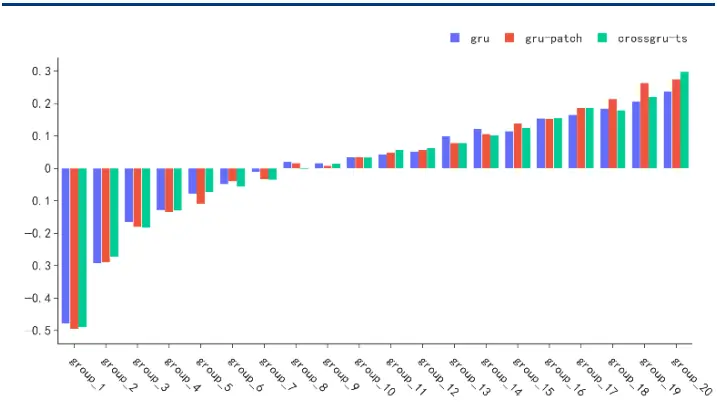
资料来源：wind，华创证券

图表 26 90D数据集消融 TOP组超额走势对比
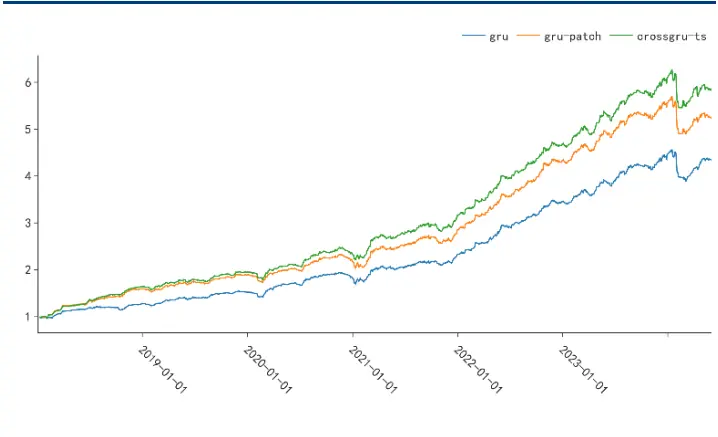
资料来源：wind，华创证券

图表 27 30min数据集消融 20分组年化收益对比
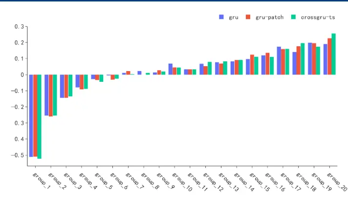
wind,

图表 28 30min数据集消融 TOP组超额走势对比
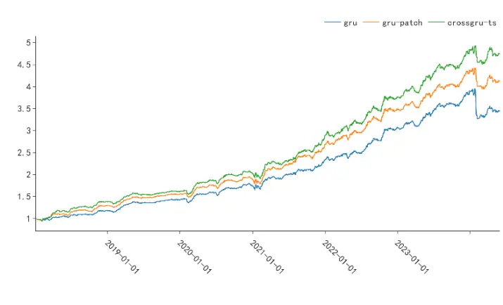
wind,

综合以上结果，我们可以初步得出结论：

序列长度可能对 Patch效果存在影响，在更长的序列中Patch效果更好。对输入较长序列的90D数据集和30min数据集，GRU 加入 Patch的优势明显——Patch在提升模型因子表现的同时拥有更高的训练效率；对于序列长度较短的30D数据集，加入Patch后因子表现略微下降。

增长量价输入序列能带来一定的增量信息；例如对两个同样基于日频的数据集30D、90D，不同模型在90D 数据集均有好于 30D 的表现；仅使用GRU 模型处理较长时序可能并没有充分发掘数据中的信息。

- 多分支 Patch优于单分支 Patch。考虑不同时间尺度下的特征，效果相比于一个固定的 Patch更好，我们认为这是因为时序数据特别是较长的时间序列，在不同的尺度下存在并不完全相同特征，且不同尺度间存在交互作用。

## （三）小结

在本章中，为了进一步验证双分支时序模块、截面模块的作用，我们进行了一系列消融测试得出了以下结论：

对于 30D 和 90D 数据集，同时加入双分支时序模块、截面模块的模型表现最优，加入截面模块后2024年回撤明显减少；对 30min数据集，只加入双分支时序模块实现最优表现；

我们进一步讨论了长序列输入、时序 Patch 以及时序多尺度交互，我们发现（对于GRU 模型而言）更长的量价序列存在增量，在长序列加入 Patch 后同时提高因子表现和模型效率，通过多分支的 Patch实现多尺度信息提取比单个Patch效果更优；

总体而言，在GRU/ CrossGRU-1的基础上引入多尺度时序模块增强了模型表现。对于分钟频、日频数据集各自特点带来的结论差异，我们将在后续报告中继续研究模型的混合频率问题。最后，我们取表现最优的模型——90D数据集上的CrossGRU-2，在中证 1000上进行指增测试：

约束条件（1）指数成分股占比大于 80%（2）单只股票权重上限为 0.8%，下限为0%（3）市值暴露小于3%（4）行业暴露小于 3%（5）每期换手30%；

⚫调仓频率为周频，根据每周最后一个交易日的因子值在次周首个交易日进行调仓，持有期为 10天；回测交易成本双边千 2.5。

以下图表展示了指增组合的超额走势及逐年累计收益。1000 指增超额收益年化 19.43%，年化跟踪误差为 2.83%，每期换手平均32%。

图表 29 1000指增超额走势
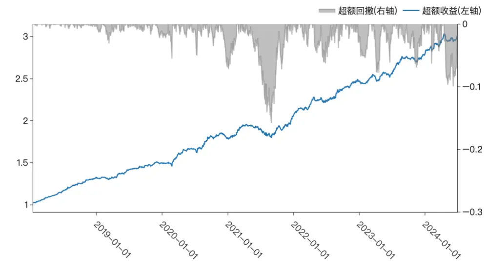
资料来源：wind，华创证券

图表 30 超额逐年收益统计

|  | 全区间（年化） | 2018 | 2019 | 2020 | 2021 | 2022 | 2023 | 2024-05-31 |
| --- | --- | --- | --- | --- | --- | --- | --- | --- |
| 超额收益 | 19.43% | 32.28% | 13.46% | 19.37% | 14.74% | 20.49% | 12.11% | 8.48% |

资料来源：wind，华创证券

## 五、总结

本篇报告我们提出了CrossGRU-2模型，在先前报告的基础上进一步考虑了时间序列的“多尺度”交互，我们使用更长输入序列的数据集，通过 Patch方法构建了一个双分支的时序模块让模型学习不同尺度的信息并通过交叉注意力实现交互。

我们以 GRU 模型作为对比基准，CrossGRU-2 在 30D、90D、30min 数据集的 10 日RankIC 分别为 12.3%、12.5%、11.9%；因子 TOP 组在上述三个数据集的年化收益分别为 28.60%、32.01%、23.26%，相比 GRU 实现了 7.1%、8.3%、4.2%的提高；2024年 TOP 组在上述数据集累计收益分别为7.4%、10.4%、-11.7%，均高于GRU模型的-8.5%、-6.2%、-14.6%；

我们对双分支时序、截面模块进行一系列消融测试：在大多情况下，同时加入双分支模块、截面模块的模型实现了最优表现；我们发现对较长的输入序列使用 Patch后能够改善模型的表现，且使用双分支形式的多尺度 Patch 效果更优；我们以最优的CrossGRU-2 模型为基础，在 1000 指增应用中，组合实现超额收益年化 19.43%，跟踪误差 2.83%。

## 六、风险提示

策略基于历史数据回测，不保证未来数据的有效性。深度学习模型存在过拟合风险。深度学习模型受随机数影响。本文的模型实现和相关文献不完全相同。

## 七、参考文献

Zhang, Yunhao, and Junchi Yan. "Crossformer: Transformer utilizing cross-dimension dependency for multivariate time series forecasting." The eleventh international conference on learning representations. 2022.

Yu, Deli, et al. "Towards accurate scene text recognition with semantic reasoning networks." Proceedings of the IEEE/CVF conference on computer vision and pattern recognition. 2020.

Chen, Chun-Fu Richard, Quanfu Fan, and Rameswar Panda. "Crossvit: Cross-attention multiscale vision transformer for image classification." Proceedings of the IEEE/CVF international conference on computer vision. 2021.

Vaswani, Ashish, et al. "Attention is all you need." Advances in neural information processing systems 30 (2017).

## 金融工程组团队介绍

组长、首席分析师：王小川

同济大学管理学博士。2017年加入华创证券研究所。

高级分析师：秦玄晋

上海对外经贸大学硕士。2018 年加入华创证券研究所。

助理研究员：杨宸祎

美国伊利诺伊大学香槟分校会计学、金融工程学硕士，CFA。2021年加入华创证券研究所。

助理研究员：黄河

东华大学工学博士，FRM。2023 年加入华创证券研究所。

助理研究员：洪远

华南理工大学金融硕士。2023 年加入华创证券研究所。

## 华创证券机构销售通讯录

| 地区 | 姓名 | 职务 | 办公电话 | 企业邮箱 |
| --- | --- | --- | --- | --- |
| 北京机构销售部 | 张昱洁 | 副总经理、北京机构销售总监 010 | -63214682 | zhangyujie@hcyjs.com |
|  | 张菲菲 | 北京机构副总监 | 010-63214682 | zhangfeifei@hcyjs.com |
|  | 刘懿 | 副总监 | 010-63214682 | liuyi@hcyjs.com |
|  | 侯春钰 | 资深销售经理 | 010-63214682 | houchunyu@hcyjs.com |
|  | 过云龙 | 高级销售经理 | 010-63214682 | guoyunlong@hcyjs.com |
|  | 蔡依林 | 资深销售经理 | 010-66500808 | caiyilin@hcyjs.com |
|  | 刘颖 | 资深销售经理 | 010-66500821 | liuying5@hcyjs.com |
|  | 顾翎蓝 | 资深销售经理 | 010-63214682 | gulinglan@hcyjs.com |
|  | 车一哲 | 销售经理 |  | cheyizhe@hcyjs.com |
| 深圳机构销售部 | 张娟 | 副总经理、深圳机构销售总监 0755 | -82828570 | zhangjuan@hcyjs.com |
|  | 汪丽燕 | 高级销售经理 | 0755-83715428 | wangliyan@hcyjs.com |
|  | 张嘉慧 | 高级销售经理 0755 | -82756804 | zhangjiahui1@hcyjs.com |
|  | 王春丽 | 高级销售经理 | 0755-82871425 | wangchunli@hcyjs.com |
| 上海机构销售部 | 许彩霞 | 总经理助理、上海机构销售总监0 | 21-20572536 | xucaixia@hcyjs.com |
|  | 官逸超 | 上海机构销售副总监 | 021-20572555 | guanyichao@hcyjs.com |
|  | 黄畅 | 上海机构销售副总监 | 021-20572257-2552 | huangchang@hcyjs.com |
|  | 吴俊 | 资深销售经理 021 | -20572506 | wujun1@hcyjs.com |
|  | 张佳妮 | 资深销售经理 021 | -20572585 | zhangjiani@hcyjs.com |
|  | 蒋瑜 | 高级销售经理 021 | -20572509 | jiangyu@hcyjs.com |
|  | 施嘉玮 | 高级销售经理 021 | -20572548 | shijiawei@hcyjs.com |
|  | 朱涨雨 | 高级销售经理 021 | -20572573 | zhuzhangyu@hcyjs.com |
|  | 李凯月 | 高级销售经理 |  | likaiyue@hcyjs.com |
|  | 易星 | 销售经理 |  | yixing@hcyjs.com |
|  | 张玉恒 | 销售经理 |  | zhangyuheng@hcyjs.com |
| 广州机构销售部 | 段佳音 | 广州机构销售总监 0755 | -82756805 | duanjiayin@hcyjs.com |
|  | 周玮 | 销售经理 |  | zhouwei@hcyjs.com |
|  | 王世韬 | 销售经理 |  | wangshitao1@hcyjs.com |
| 私募销售组 | 潘亚琪 | 总监 021 | -20572559 | panyaqi@hcyjs.com |
|  | 汪子阳 | 副总监 021 | -20572559 | wangziyang@hcyjs.com |
|  | 江赛专 | 副总监 0755 | -82756805 | jiangsaizhuan@hcyjs.com |
|  | 汪戈 | 高级销售经理 021 | -20572559 | wangge@hcyjs.com |
|  | 宋丹玙 | 销售经理 021 | -25072549 | songdanyu@hcyjs.com |

## 华创行业公司投资评级体系

基准指数说明：

A 股市场基准为沪深 300 指数，香港市场基准为恒生指数，美国市场基准为标普 500/纳斯达克指数。

公司投资评级说明：

强推：预期未来 6 个月内超越基准指数 20%以上；

推荐：预期未来 6 个月内超越基准指数 10%－20%；

中性：预期未来 6 个月内相对基准指数变动幅度在-10%－10%之间；

回避：预期未来 6 个月内相对基准指数跌幅在 10%－20%之间。

## 行业投资评级说明：

推荐：预期未来 3-6 个月内该行业指数涨幅超过基准指数 5%以上；

中性：预期未来 3-6 个月内该行业指数变动幅度相对基准指数-5%－5%；

回避：预期未来 3-6 个月内该行业指数跌幅超过基准指数 5%以上。

## 分析师声明

每位负责撰写本研究报告全部或部分内容的分析师在此作以下声明：

分析师在本报告中对所提及的证券或发行人发表的任何建议和观点均准确地反映了其个人对该证券或发行人的看法和判断；分析师对任何其他券商发布的所有可能存在雷同的研究报告不负有任何直接或者间接的可能责任。

## 免责声明

本报告仅供华创证券有限责任公司（以下简称“本公司”）的客户使用。本公司不会因接收人收到本报告而视其为客户。

本报告所载资料的来源被认为是可靠的，但本公司不保证其准确性或完整性。本报告所载的资料、意见及推测仅反映本公司于发布本报告当日的判断。在不同时期，本公司可发出与本报告所载资料、意见及推测不一致的报告。本公司在知晓范围内履行披露义务。

报告中的内容和意见仅供参考，并不构成本公司对具体证券买卖的出价或询价。本报告所载信息不构成对所涉及证券的个人投资建议，也未考虑到个别客户特殊的投资目标、财务状况或需求。客户应考虑本报告中的任何意见或建议是否符合其特定状况，自主作出投资决策并自行承担投资风险，任何形式的分享证券投资收益或者分担证券投资损失的书面或口头承诺均为无效。本报告中提及的投资价格和价值以及这些投资带来的预期收入可能会波动。

本报告版权仅为本公司所有，本公司对本报告保留一切权利。未经本公司事先书面许可，任何机构和个人不得以任何形式翻版、复制、发表、转发或引用本报告的任何部分。如征得本公司许可进行引用、刊发的，需在允许的范围内使用，并注明出处为“华创证券研究”，且不得对本报告进行任何有悖原意的引用、删节和修改。

证券市场是一个风险无时不在的市场，请您务必对盈亏风险有清醒的认识，认真考虑是否进行证券交易。市场有风险，投资需谨慎。

## 华创证券研究所

| 北京总部 | 广深分部 | 上海分部 |
| --- | --- | --- |
| 地址：北京市西城区锦什坊街26号恒奥中心 C 座 3A邮编：100033传真：010-66500801会议室：010-66500900 | 地址：深圳市福田区香梅路1061号中投国际商务中心 A 座 19 楼邮编：518034传真：0755-82027731会议室：0755-82828562 | 地址：上海市浦东新区花园石桥路33号花旗大厦 12 层邮编：200120传真：021-20572500会议室：021-20572522 |