【AI+HI 系列（6）】

# 对端到端模型泛化性的思考与改进

# ——基于样本加权与风格约束

## 背景与目标

当样本外的数据分布与样本内存在偏差时，模型预测偏差可能导致实际应用中的高昂损失。面对近年复杂多变的市场风格，本篇报告以端到端模型的泛化性为出发点，旨在提高模型稳健性。基于 SVE 指标，我们发现端到端 GRU 模型在“未见过”的数据上表现不佳，由此展开如何降低端到端模型泛化风险的研究。

## 模型分析与设计

以 Barra风格为切入点，主观上我们期望端到端模型能在不同市场主导风格时期、不同风格暴露的股票上均保持稳健性。然而，模型实际结果与预期存在差异，这可能是模型平均风险最小化的训练方式所导致的“盲区”。

针对这一局限，我们在 GRU 基线模型基础上，提出两种改进方案：基于分组样本加权的 GRU DRO 模型和基于风格约束的 GRU CONST 模型。两种方法均独立于模型架构设计，具有良好的通用和灵活性。

## 测试结果

在中证全指因子 IC、20分组测试上：

GRU DRO 模型 10 日 RankIC 达 14.3；分组多头 TOP 组超额年化收益 39.67%，较基线 GRU 提升 4%；超额夏普比率 1.55，较基线提升 0.12；2024 年最大回撤-16%，优于基线的-21%。

GRU CONST 模型的 10日 IC最高达到为 14.1；TOP 组整体表现与基线持平，在 2024 年 9-11 月区间，强/弱约束设置下，TOP 组超额收益分别为 4.24%、-1.58%，较基线分别提高 7.62%、1.8%。

## 在 1000 指增应用上：

两个改进模型均实现了超额年化收益和夏普比率的提升，GRUDRO 模型超额年化较基线提高 1.17%，最大回撤相比基线降低 2%，Calmar 比率为 3，优于基线的 1.99；GRU CONST 模型超额年化较基线提高约 1.5%，在回撤方面与基线持平。

## 风险提示：

策略基于历史数据回测，不保证未来数据的有效性。深度学习模型存在过拟合风险。深度学习模型受随机数影响。模型实现与参考文献原文存在差异。

## 华创证券研究所

证券分析师：王小川

电话：021-20572528

邮箱：wangxiaochuan@hcyjs.com

执业编号：S0360517100001

联系人：洪远

邮箱：hongyuan@hcyjs.com

## 相关研究报告

《AI+HI 系列（4）：CrossGRU：基于交叉注意力的时序+截面的端到端模型》

2024-04-19

《AI+HI 系列（5）：CrossGRU-2：基于 Patch 与多尺度时序改进端到端模型》

2024-07-04

## 投资主题

## 报告亮点

基于深度学习模型进行端到端因子挖掘已有较多工作，24 年市场环境的变化与波动对已有方法的稳健性提出挑战；在本篇报告中，我们对端到端模型的泛化性进行了重新思考，尝试分析深度学习模型在极端市场环境的不佳表现原因，对模型进行改进。我们进一步探索深度学习模型应用的理论支持和实用方法，探索更为稳健的量化模型，助力量化投资的发展。

## 投资逻辑

深度学习算法训练目标为最小化训练集的平均风险，因此在样本外少数事件发生时可能表现不佳，为提升模型在动态且复杂市场环境下的适应能力和预测准确性，我们可以基于一定的主观先验知识对模型的学习流程进行干预。本篇报告继续对端到端量价因子深度学习模型进行探讨与改进，探索深度学习技术的运用。

## 一、动机

深度学习技术在量化领域已有较多运用，然而数据驱动类模型通常建立在独立同分布假设上，当样本外存在数据分布偏移时，模型预测偏差可能导致高昂损失。2024年复杂多变的市场环境对已有模型与因子的稳健性提出了挑战，《AI+HI系列》系列过去的数篇研究中，我们主要聚焦于优化模型架构，提升模型在收益层面的表现，在本篇报告中，我们以模型的泛化能力为出发点，尝试找到模型的盲区并进行改进。

我们首先以一个简洁的GRU（门控循环单元）作为基线模型，观察样本外偏移对模型表征空间的影响。我们观察异常状态下模型应用端的表现，为模型泛化性评估提供一个新的可观测指标；

在改进模型泛化能力的方法上，我们认为考虑更多样的特征 / 模型是一个简单的解决策略，但对输入端相对固定的端到端模型，我们进一步讨论了在数据输入的多样性受限的情况下，如何提高模型稳健性。针对GRU 基线，我们以风格因子为抓手，分析了导致泛化风险的潜在因素，这些因素可能是模型在训练过程中基于平均损失最小化目标带来的。基于此，我们对模型训练目标进行改进，在因子与指增测试中，改进后的模型相较于基线、取得了更好的表现。我们的改进方法与模型设计无关，可以灵活适用于已有模型。

## 本报告后续章节安排如下：

第二章：介绍一种基于奇异值分解的指标 SVE，从模型表征的角度监测和识别模型的“异常”。基于SVE 指标，我们发现GRU基线模型在“没见过”的数据上的不佳表现。

第三章：我们分析了导致端到端模型表现不佳的 2 个潜在原因，它们可能与模型的平均风险最小化训练方式相关；针对模型的“盲区”，我们提出 2种具体的改进方法——基于样本加权的GRU DRO与风格约束GRU CONST 并进行测试。

## 二、模型泛化性

本章我们以一个GRU 基线模型为例，我们首先介绍模型及训练方法：

模型：

模型由 GRU+MLP 模块构成，每个 batch 模型输入为截面 n 只股票的过去 t 天的量价时序，取GRU最后一个时间步的输出作为个股表征，将其输入 MLP 层得到预测值；GRU嵌入维度 d为64、MLP 层数为2；

图表 1 GRU基线模型
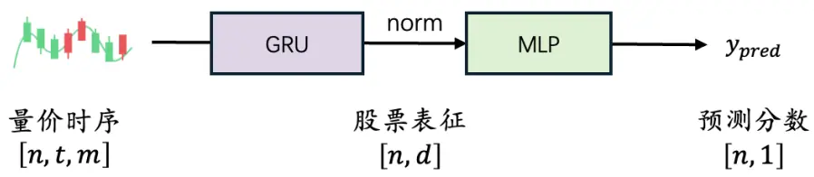
资料来源：华创证券

## 数据集：

过去 T 日的日频的高、开、低、收、均价、成交量 6 个变量；在本章我们取 T=30 构建30D 数据集；

采样方法：

以每个交易日t为一个采样截面；

模型预测标签：

预测标签为未来 10 日的市值行业中性化后收益（t+1 日~ t+11 日，以收盘价计算；进行rank标准化）；模型损失函数为IC。

测试方法：

样本空间为中证全指；分组测试调仓频率为周度，取每周最后一日因子值进行 20 分组，以次周第一个交易日收盘价再平衡，不考虑交易成本；

其余标准化、训练流程与系列先前报告方法相同不再赘述。

## （一）泛化评估

以上模型训练完成后，我们构建新的指标对模型的泛化能力进行评价。

如何理解模型的泛化能力？我们认为泛化能力体现在模型对训练样本内"没见过"的情况的应对能力，好的模型应该在样本外偏移事件发生时也具有一定鲁棒性。

一种直觉的方法是情景分析，例如根据区间内整体市场指数或风格表现，进行主观的聚类分组，观察模型在不同情境下的表现，如果模型在不同情景下均有稳定的表现，我们可以认为模型有好的泛化能力；但局限在于，样本外可能存在未被定义的情景、模型的倾向可能随新增训练数据而变化、当模型使用更为复杂输入时，我们难以直接观测样本外是否存在模型“没见过”的情景。因此我们参考Chen,et al.（2023）的方法，对模型表征空间进行观测。

在模型训练完成后，取训练、测试数据集GRU 输出最后一个时间步，即每个截面输出的股票中间表征，形状为 $(n_{t},\mathrm{d})$ ，其中 $n_{t}$ 表示第 t 个 batch的股票数量，d为 GRU 嵌入维度（设置为 64），对表征矩阵进行SVD分解，将奇异值S 归一化后计算奇异值熵（SVE）指标：

$$
SVE=-\sum_{i=1}^{d}p_{i}\log(p_{i}),
$$

其中：

$$
p_{i}=\frac{s_{i}}{\sum_{j=1}^{d}s_{j}}
$$

计算训练集上模型表征 SVE 的均值方差统计量，再以此对测试集 SVE 指标进行 Z-score标准化，基于此我们观察在测试集上相对训练集表征空间的偏移，偏移越大表示表征空间越“异常”，这些“异常”可能是在测试集模型接受的新数据与样本内显著不同导致的，我们将其近似视为模型“没见过”的情况发生；基线模型在测试集的 SVE 指标的时序表现如下图所示：

图表 2 模型表征训练-测试偏移
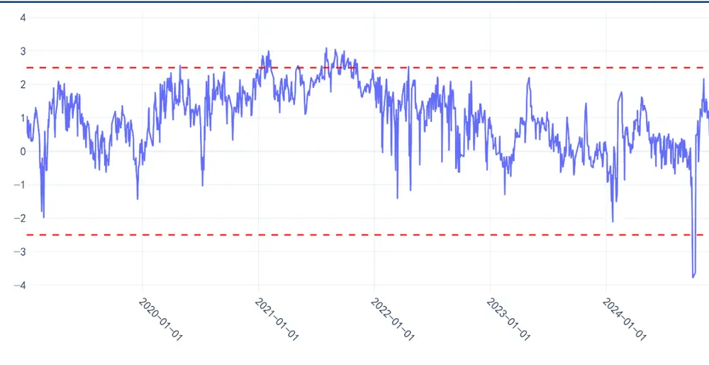
资料来源：wind，华创证券，纵坐标为标准差

根据上图的结果，SVE 指标的波动较大，我们以 2.5 倍标准差为阈值，模型有 2 次较为显著的偏移事件：

- 第一次为 21年SVE在 2.5倍标准差外存在持续较长时间的偏移；

第二次为 24 年 9 月底，模型产生了短暂但大幅偏移，在 24 年初模型也曾短暂触及2 倍标准差；

我们展示 2021 年、2024 年模型下游应用——因子多空、周频指增组合表现（基准中证

1000，约束成分股权重占比80%以上，约束市值行业暴露为0.3，双边换手0.3）。

SVE 超出 2 倍~2.5 倍标准差阈值的时点用垂直灰色虚线标记，超出 2.5 倍标准差阈值的时点用垂直红色虚线标注：

图表 3 2021年-基线模型因子多空
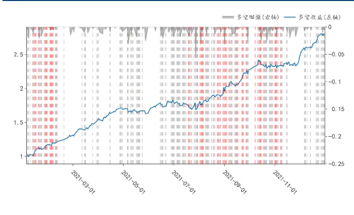
资料来源：wind，华创证券

图表 4 2024年-基线模型因子多空
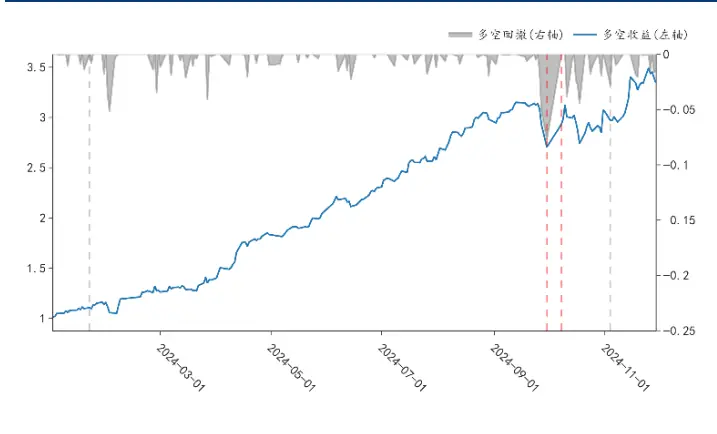
资料来源：wind，华创证券

图表 5 2021年基线模型1000指增表现
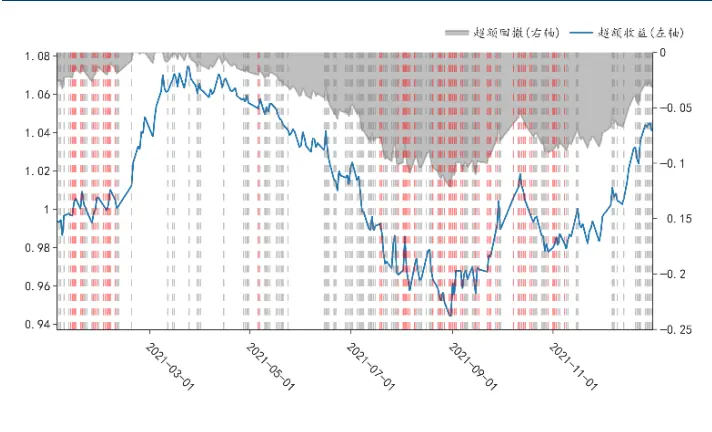
资料来源：wind，华创证券，超额基准为中证1000

图表 6 2024年基线模型1000指增表现
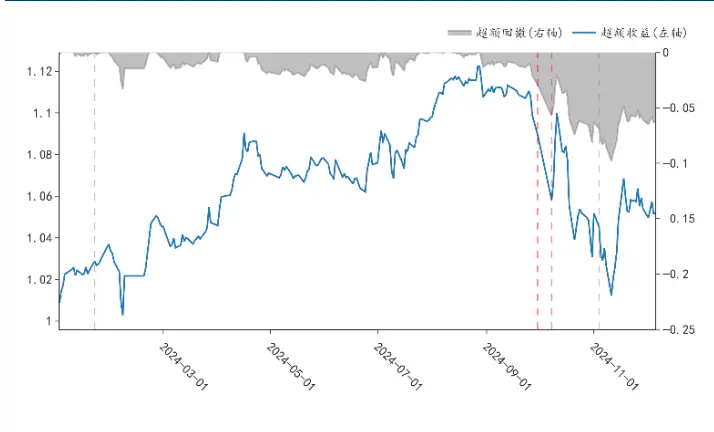
资料来源：wind，华创证券，超额基准为中证1000

表征异常发生时期与模型的下游应用的较弱表现的时期大致对应，这可以被认为一种的泛化能力不佳；

SVE 指标提供了一个模型风险、泛化性评估的补充视角。我们基于 SVE 指标发现 GRU在样本外偏移发生时不佳的泛化能力。在泛化性风险的解决思路上，我们认为增加训练数据的多样性可能是最优方案，即尽可能减少样本外模型“没见过”的情景。

对本篇报告讨论的端到端的框架而言，模型的输入端特征较为固定，模型难以避免遇到“未见过”的新情景，我们希望在少数偏移事件发生时，尽可能减少模型回撤风险，我们需要进一步分析基线模型的泛化能力的局限与盲区所在。

## （二）风格局限

对大多数机器学习或深度学习算法而言，学习型算法依赖于数据独立同分布假设，而在实践中，样本外偏移现象常有发生，导致模型的不佳表现。

以一个图像识别任务为例（Beery et al., 2018），我们可以轻易辨认出三张图中的动物牛，而模型只在常见的背景环境——如牧场中，牛被正确检测 （子图 A），在不常见的背景环境——例如海滩中，牛未被检测，或拥有较低的置信度（子图B、C）。

这是因为在模型的训练资料中，大部分的牛出现在绿色的牧场上，在辨认牛的任务中，牧场、颜色并非因果。但对于以平均风险最小化作为目标的模型，这些“环境”可能被视为判别因素，此时模型偏好与我们的主观认知产生了偏差。

图表 7 环境对图像模型的影响

(A) Cow:0.99, Pasture: 0.99, Grass: 0.99, No Person: 0.98, Mammal: 0.98

(B) No Person: 0.99, Water: 0.98, Beach: 0.97, Outdoors: 0.97, Seashore: 0.97

(C) No Person: 0.97, Mammal: 0.96, Water:0.94, Beach: 0.94, Two: 0.94
Beery et al. “Recognition in Terra Incognita” 5

那么端到端模型是否也存在类似的“环境”信息，使模型学习了“伪相关”规律，与我们的主观偏好产生了偏差？我们认为风格拥有类似处境，主观上，我们希望模型对风格有合适处理：

- 从时序角度，我们希望模型在不同主导风格时期下均有效；

从截面角度，我们希望模型在不同风格暴露特征的股票分组上均有效；

在时序角度，我们展示模型因子与Barra风格截面相关性在时序上的统计量，因子在残差波动、流动风格上存在持续较高的偏好；

图表 8 因子风格偏好
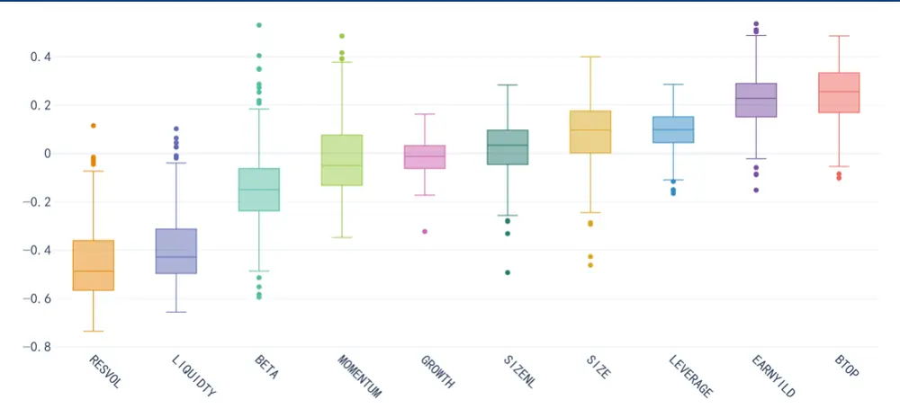
资料来源：wind，uqer，华创证券，纵轴为相关系数

在截面角度，我们以流动性风格为例，根据个股在流动性风格暴露大小进行分域，将股票分为低、中、高流三个子集，分别统计每组内模型因子的IC、多空表现。

低流组的因子 IC 明显低于高流组，另一方面，模型训练采用的损失函数为 IC，而高流分组中 IC 贡献最为显著的为因子的空头部分，并不完全符合我们对模型的多头端的期望；

图表 9 不同域间因子 10日 IC对比

| 分组 | RankIC | ICIR | IC大于0占比 | TOP组年化 |
| --- | --- | --- | --- | --- |
| 低 | 0.09 | 0.83 | 0.81 | 27% |
| 中 | 0.10 | 0.96 | 0.85 | 28% |
| 高 | 0.15 | 1.21 | 0.88 | 26% |

wind uqer

图表 10 不同域间因子多空收益累加对比
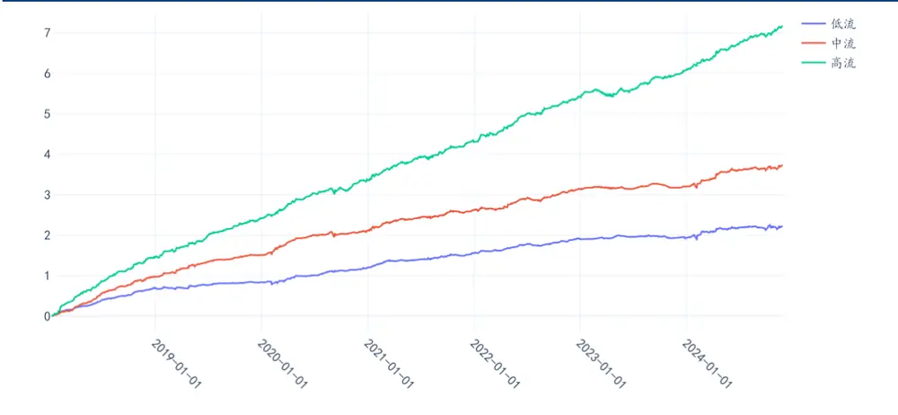
wind uqer

综上，基线模型存在两个与我们主观期望不相符的特点：

- 对部分风格因子——残差波动、流动性、估值、盈利，存在持续且显著的偏好；

在这些显著偏好的风格上进行样本分域，不同域间的模型因子效果有较大差异；

若我们仅站在“因子”评估的角度看，一个具有上述特征的量价类因子并不少见；而端到端模型同时具有“模型”这一属性，在模型评估的角度看，以上 2 个特点是模型训练目标基于样本内平均损失最小化的结果，它们可能导致样本外的潜在泛化风险，我们认为模型还需进一步优化。

在下一章节，我们尝试保持模型输入端特征不变的情况下，针对模型分域差距、风格显著偏好两个问题，在模型训练目标上分别设计一个改进方案。

## 三、方法

对分域差距、显著风格偏好两个与我们主观相悖的模型特点，我们在基线模型的基础上进行如下修改：

## （一）GroupDRO

针对分域差距问题，我们参考了 GroupDRO（Sagawa et al., 2019），使用样本组损失加权的思路，鼓励模型在不同域间的表现差异更小。

GroupDRO 研究关注了深度学习模型在少数样本上的不佳表现，当模型依赖伪相关规律时，可能导致在某些子集上遭受高损失，因此可以将模型的训练目标从最小化全部样本的平均损失，改为最大限度地减少训练数据中最坏分组的损失。

在方法论上，我们参考原文及相关研究思路，给予每个样本一个分组标签，对于组 $g\in$ $\{1,\ldots,G\}$ ，损失计算为：

$$
\mathcal{L}_{\mathcal{L}}=\mathrm{ICLoss}\big(\widehat{y_{g}},y_{g}\big)
$$

其中， $\widehat{\mathcal{Y}_{g}}$ 和 $^{t}y_{g}$ 分别表示第 $g$ 组的模型预测值和训练标签。

每个batch 的总损失为：

$$
\mathcal{L}\:=\:\sum_{g=1}^{G}\:w_{g}\:\mathcal{L}_{g},
$$

每组权重更新方法为：

$$
w_{g}^{\mathrm{new}}=\frac{w_{g}\exp(\rho\mathcal{L}_{g})}{\sum_{i=1}^{G}w_{i}\exp(\rho\mathcal{L}_{i})}
$$

其中 $W_{\mathrm{g}}$ 是第 $g$ 组的当前权重， $\rho.$ 是权重更新率， $\mathcal{L}_{\mathcal{\phi}}$ 是第 $g$ 组的损失。

在分组选择上，在后文测试中我们以流动风格作为分组标签，根据流动因子暴露将股票分为三组。我们将此模型记为 GRUDRO。

## （二）风格惩罚项

针对模型对流动性和残差波动的显著暴露的特点，我们采用一个简单的惩罚项来约束风格暴露：

$$
\mathcal{P}=\frac{1}{|s|}\sum_{i\in s}\operatorname*{max}(|\operatorname{ICLoss}(\hat{y},s_{i})|-\epsilon,0)
$$

其中S是风格因子的集合，ŷ是模型对当前截面股票的预测值， $s_{i}$ 为当前截面股票在某个风格因子的暴露，ϵ为相关性阈值。

在模型与某个风格相关性超出手动设置的阈值时，我们对模型施加惩罚，为了尽可能保留模型性能，我们不考虑模型与风格相关性的方向，只对大小进行惩罚；我们将此模型记为 GRU CONST。

以上两个改进中，我们均选择与模型相关性最高的流动性、残差波动 2 个风格，虽然基线模型对收益、估值风格同样也有较高的暴露，但考虑到输入模型的数据仅为量价时序，并不含个股基本面信息，我们认为流、波两个风格与模型的学习过程更为直接相关。

## 四、实验

## （一）模型说明

回测区间：2018 年 1 月 1 日 ~ 2024 年 11 月 29 日；

股票池：中证全指

本节我们取 T=90构建 90D数据集；在模型模块上，我们在先前章节的GRU基线模型上额外加入一个 1D卷积，卷积核与步长设置为3：

图表 11 模型流程
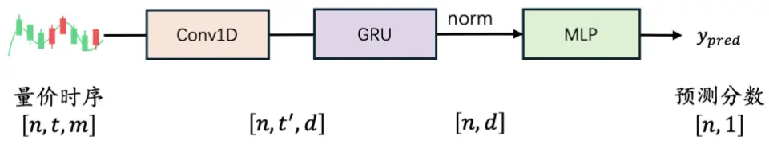
资料来源：华创证券

图表 12 模型超参数汇总

| 超参数说明 | 参数设置 |
| --- | --- |
| batch size | 截面股票数量 |
| conv1d 卷积核大小、步长 | 3 |
| GRU 嵌入维度 | 64 |
| GRU_DRO 约束风格 | 流动性（三分组） |
| GRU_DRO 权重更新率 | 0.1 |
| GRU_DRO 分组 loss 最小权重 | 25% |
| GRU_CONST 约束风格 | 流动性、残差波动 |
| GRU_CONST相关性阈值 | 0.2 |
| GRU_CONST 惩罚项系数 | 0.01 / 0.1 |
| optimizer | Adam（初始学习率 1e-3） |
| 随机种子 | 0、42、3407 |

资料来源：华创证券

后文测试模型中涉及的超参数如上表所示。对GRU CONST模型，惩罚项系数影响较大，因此取 0.1 与 0.01 两个参数进行测试，对应模型记为 GRU CONST (0.1)与 GRU CONST(0.01)。

## （二）测试结果

## 1、风格测试

我们首先计算截面因子与Barra风格因子的相关性，取时序均值后，各模型结果如下图所示。改进后的模型在残差波动、流动性等风格上的相关性有所降低，GRU CONST(0.1)在残差波动（RESVOL）、流动（LIQUIDTY）两个风格上接近设定目标±0.2。

图表 13 不同模型的风格相关性
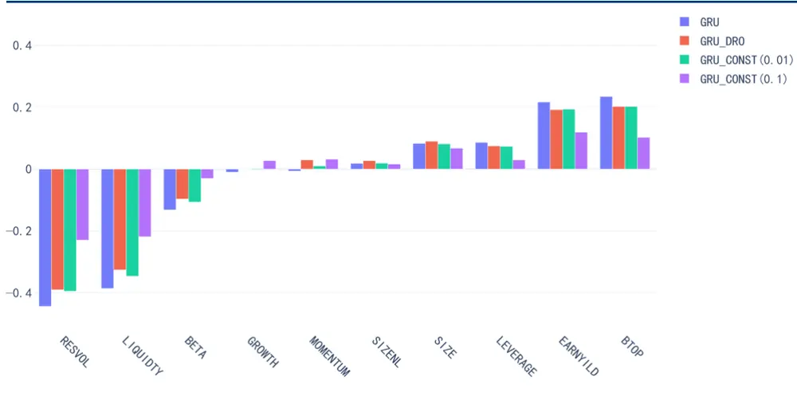
wind uqer

## 2、IC 测试

模型因子 IC 指标测试结果如下：

图表 14 IC 测试结果汇总

|  | 模型 | RankIC | ICIR | IC 大于0占比 | RankIC | ICIR | IC大于0占比 |
| --- | --- | --- | --- | --- | --- | --- | --- |
|  |  |  | 全区间 |  |  | 240901~241129 |  |
| 5日 | GRU | 0.128 | 1.03 | 0.86 | 0.064 | 0.28 | 0.65 |
|  | GRU DRO | 0.130 | 1.09 | 0.87 | 0.077 | 0.34 | 0.67 |
|  | GRU CONST (0.1) | 0.121 | 1.07 | 0.88 | 0.088 | 0.45 | 0.71 |
|  | GRU CONST (0.01) | 0.128 | 1.07 | 0.87 | 0.062 | 0.27 | 0.67 |
| 10 日 | GRU | 0.142 | 1.17 | 0.88 | 0.053 | 0.26 | 0.56 |
|  | GRU DRO | 0.143 | 1.23 | 0.89 | 0.071 | 0.36 | 0.56 |
|  | GRU CONST (0.1) | 0.133 | 1.24 | 0.90 | 0.086 | 0.52 | 0.67 |
|  | GRU CONST (0.01) | 0.141 | 1.22 | 0.89 | 0.054 | 0.27 | 0.56 |

wind uqer

GRU DRO 在全区间的 10 日 RankIC 达到 14.3，ICIR 为 1.23；24 年 9 月后因子RankIC为7.1，ICIR 为 0.36；在两个区间、所有指标的表现上优于基线GRU。

风格惩罚较为宽松的 GRU CONST(0.01)在各项指标上与基线模型非常相近；风格惩

罚较为严格的 GRU CONST (0.1)在 24 年 9 月后是所有模型中表现最佳的模型，10日 RankIC 为 8.6，高于基线的 5.3；但全区间上 GRU CONST (0.1)的 10 日 RankIC为 13.3，明显低于基线 GRU 的 14.2。

## 3、分组测试

因子分组测试结果如下，分组数设置为20，每周最后一个交易日根据因子值分组，次周第一个交易日根据收盘价进行调仓操作，剔除涨跌停与停牌股票，不计交易成本；超额收益的计算基准为中证全指：

图表 15 TOP组超额净值走势对比（全区间）
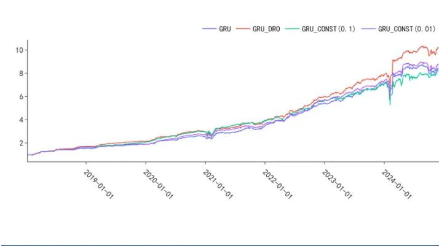
wind uqer

图表 16 TOP组超额净值走势对比（2024年）
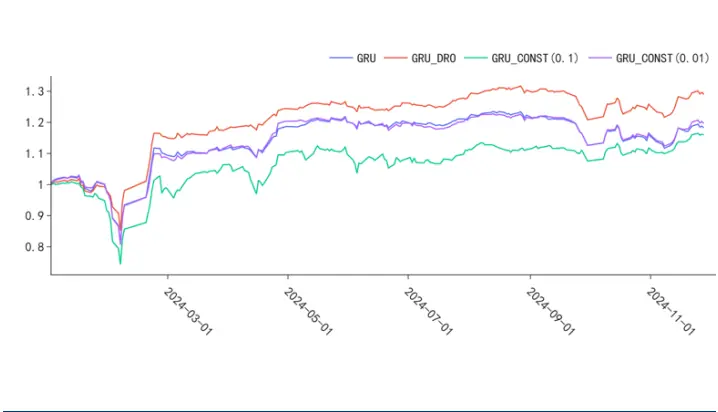
wind uqer

图表 17 TOP组逐年收益
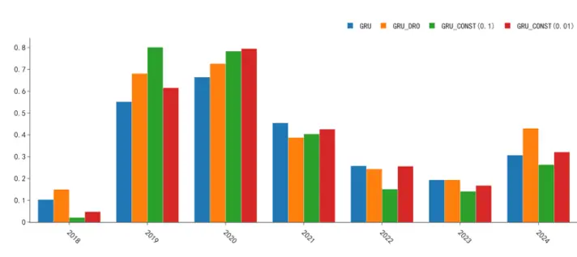
wind uqer

图表 18 20分组年化收益对比
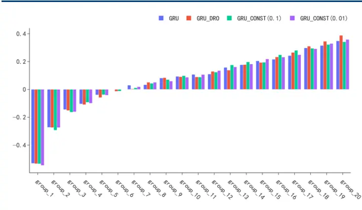
wind uqer

GRU DRO 模型：

从全区间看，GRU DRO综合表现为所有模型中最佳，区间内超额年化为 39.67%，相比基线GRU提高 4%，同时最大回撤降低2.5%。

GRU CONST 模型与上文IC 测试结论相似：

图表 19 模型TOP组对比

| 因子 | 年化收益率(%) | 夏普比率 | Calmar 比率 | 最大回撤(%) | 年化超额收益率(%) | 换手率 | 24年超额 | 2409后超额 | 24年超额最大回撤(%) |
| --- | --- | --- | --- | --- | --- | --- | --- | --- | --- |
| GRU | 34.84 | 1.43 | 1.21 | -28.83 | 35.68 | 0.42 | 18.2% | -3.38% | -21.37 |
| GRU_DRO | 38.83 | 1.55 | 1.48 | -26.27 | 39.67 | 0.43 | 29.0% | -1.02% | -16.4 |
| GRU_CONST(0.1) | 34.2 | 1.25 | 0.99 | -34.69 | 35.05 | 0.44 | 16.0% | 4.24% | -26.36 |
| GRU_CONST(0.01) | 35.84 | 1.42 | 1.23 | -29.14 | 36.68 | 0.43 | 19.7% | -1.58% | -21.70 |

wind uqer 2024-11-29

- 在全区间看，GRU_CONST(0.01)与基线模型仍然表现相近；使用了更强风格惩罚的模型GRU_CONST(0.1)多头组在夏普、超额最大回撤等指标表现上均弱于基线GRU。

在 24 年，GRU_CONST(0.01)累计超额 19.7%，相比基线提高 1.5%，但最大回撤幅度略高于基线；GRU_CONST(0.1)在24 年9 月后超额收益 4.24%，为所有模型中最高，相比 GRU 基线提高7.62%，但模型在 24年上半年弱于基线模型，最终在 24 年累计超额相比基线降低 2.2%。

## 小结

根据上文 IC 以及分组测试结果，我们简单总结两个改进方案效果：

（1）综合来看，GRU_DRO 取得了最好的表现，在全区间、24年两个区间上，相比基线GRU均有所增量；我们再对GRU DRO进行流动因子分域测试。

图表 20 GRU DRO 流动性分域测试

| 分组 | RankIC |  | ICIR |  | IC大于0占比 |  | TOP组年化 |  |
| --- | --- | --- | --- | --- | --- | --- | --- | --- |
|  | GRU | GRU DRO | GRU | GRU DRO | GRU | GRU DRO | GRU | GRU DRO |
| 低 | 0.08 | 0.08 | 0.73 | 0.80 | 0.77 | 0.79 | 37% | 43% |
| 中 | 0.08 | 0.09 | 0.78 | 0.83 | 0.81 | 0.83 | 28% | 31% |
| 高 | 0.15 | 0.16 | 1.31 | 1.31 | 0.90 | 0.90 | 27% | 31% |

wind uqer

使用样本加权后，模型在训练中对低流、中流股票在 loss中给予了更大的权重，因子在这两类股票的表现得到提升。GRU DRO的出发点为降低潜在的样本外泛化风险，但除回撤的改善外，模型也在收益指标项上优于基线模型，模型的风险收益二者并非完全对立的关系。

（2）GRU CONST 受惩罚系数参数影响较大，提升相对局限；使用严格惩罚的模型在 24年 9 月后表现较基准提高，在其余时段则弱于其他模型；惩罚系数较小的模型与基线在各指标表现相近，24年略强于基线。

在下一章节，我们继续测试模型在指增层面的应用，当外部优化器对风格进行再次约束时，我们观察GRU CONST 是否能相比基线有所不同。

## 4、指增测试结果

在本节我们观察上述模型在1000指增应用上的表现。在约束条件上测试两种设置：

（1）约束设置1: 行业偏离±3%、市值偏离±0.3个标准差；

（2）约束设置2: 行业偏离±3%、Barra10个风格因子偏离±0.2个标准差；

其余约束条件保持一致：

（1）指数成分股占比大于 80%（2）权重偏离±0.8%（3）个股权重大于等于 0%，总权重 100%（4）单边换手 30%；

调仓频率为双周频，根据本周最后一个交易日的因子值在次周首个交易日进行调仓；
交易成本双边千2.5。

模型在全区间的表现如下：

图表 21 指数组合绩效对比

|  | 超额年化收益(%) | 超额夏普 | 换手率 | 最大回撤(%) | Calmar 比率 |
| --- | --- | --- | --- | --- | --- |
| 约束条件1：仅约束市值、行业 |  |  |  |  |  |
| GRU | 15.58 | 2.13 | 0.32 | -13.11 | 1.19 |
| GRU DRO | 16.81 | 2.38 | 0.32 | -12.35 | 1.36 |
| GRU CONST (0.1) | 15.22 | 2.14 | 0.32 | -13.49 | 1.13 |
| GRU CONST (0.01) | 17.57 | 2.41 | 0.32 | -13.83 | 1.27 |
| 约束条件 2：约束行业、10 个 Barra 风格因子 |  |  |  |  |  |
| GRU | 13.42 | 2.38 | 0.32 | -6.75 | 1.99 |
| GRU DRO | 14.59 | 2.64 | 0.32 | -4.87 | 3 |
| GRU CONST (0.1) | 14.93 | 2.46 | 0.32 | -6.79 | 2.2 |
| GRU CONST (0.01) | 15.1 | 2.62 | 0.32 | -8.24 | 1.83 |

wind uqer

在行业偏离±3%、Barra 10 个风格因子偏离±0.2标准差的约束设置下，所有模型分年统计如下：

图表 22 指增组合逐年对比

|  |  | 2018 | 2019 | 2020 | 2021 | 2022 | 2023 | 2024-11-29 |
| --- | --- | --- | --- | --- | --- | --- | --- | --- |
| 年化收益(%) | GRU | 28.34 | 15.27 | 13.66 | 11.1 | 14.52 | 5.95 | 1.54 |
|  | GRU DRO | 29.96 | 15.1 | 17.9 | 14.07 | 10.74 | 5.54 | 4.76 |
|  | GRUCONST(0.1) | 28.5 | 17.55 | 18.44 | 14.58 | 15.91 | 5.82 | -0.11 |
|  | GRUCONST(0.01) | 28.42 | 15.89 | 20.38 | 13.74 | 15.03 | 6.92 | 1.21 |
| 夏普比率 | GRU | 4.89 | 3.18 | 2.36 | 1.63 | 3.43 | 1.61 | 0.31 |
|  | GRU DRO | 5.58 | 3.23 | 3.23 | 2.03 | 2.49 | 1.55 | 0.92 |
|  | GRUCONST(0.1) | 5.13 | 3.91 | 3.05 | 1.82 | 3.23 | 1.69 | 0.02 |
|  | GRUCONST(0.01) | 5 | 3.52 | 3.52 | 1.72 | 3.75 | 1.98 | 0.26 |
| 最大回撤(%) | GRU | -1.52 | -2.38 | -3.64 | -6.75 | -1.51 | -2.2 | -5.17 |
|  | GRU DRO | -1.91 | -2.17 | -2.29 | -4.87 | -1.67 | -2.57 | -4.6 |
|  | GRUCONST(0.1) | -1.93 | -2.1 | -2.65 | -6.79 | -2.46 | -2.13 | -5.35 |
|  | GRUCONST(0.01) | -2.02 | -1.61 | -2.29 | -8.24 | -1.25 | -2.12 | -6.12 |

wind uqer

在约束市值、Barra0.2 标准差偏离的设置下，全区间上 GRU DRO 的超额夏普为 2.64，Calmer 比率为 3，均强于对应基线 GRU（对应指标分别为 2.38、1.99），GRU CONST(0.01)则分别为 2.62、1.83，GRU CONST (0.01)分别为 2.46、2.2，改进后的模型在超额年化与夏普指标上相较于基线均有所提高；

从指增组合在21年、24年的两次回撤区间看，大幅回撤的区间与基线 GRU相近，改进后模型仍然受残差波动、流动性2 个风格较大影响。GRU DRO模型相比基线回撤幅度略有改善，最大降低 2%；GRU CONST 在 21、24 年的回撤幅度与基线相比无改善，使用更大约束的 GRU CONST(0.1)在 24 年上半年的表现更为不佳；

在行业+Barra约束0.2标准差设置下，与基线超额净值对比如图所示：

图表 23 GRU 基线指增组合超额
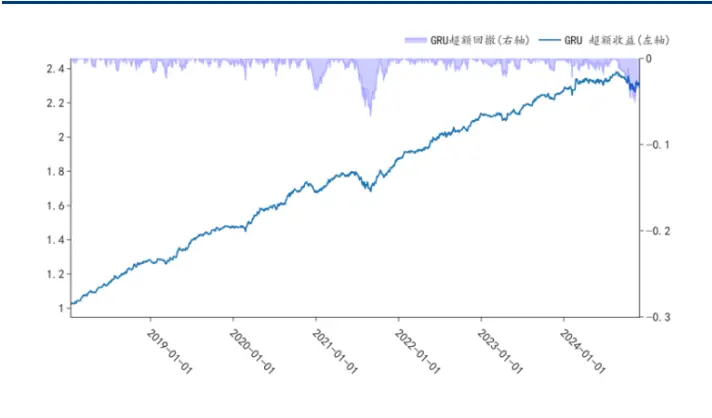
wind uqer

图表 24 GRU CONST(0.1)指增组合超额
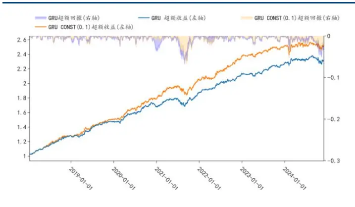
wind uqer

图表 25 GRU CONST(0.01)指增组合超额
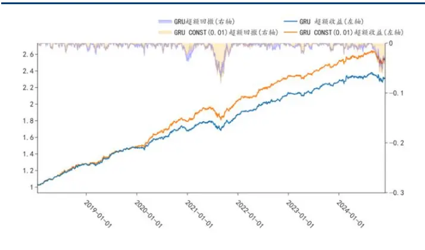
wind uqer

图表 26 GRU DRO 指增组合超额
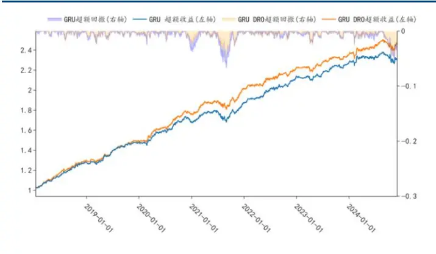
wind uqer

## 5、小结

针对基线模型分域差距、持续的低波低流风格倾向两个特点，为了降低模型在未见样本上的潜在泛化风险，我们在基线模型的训练目标上进行改进，分别设计了 GRU DRO、GRU CONST 两个模型。GRU DRO 缓解了不同流动性因子暴露股票分组间因子的差异，GRU CONST 则降低了模型整体与低波、低流的相关；

在测试中，GRU DRO 与GRU CONST相比GRU 基线模型，在不同下游应用有所改善，其中GRU DRO效果更为明显，在因子 IC、多头绩效、1000指增应用的测试中均取得了强于基线的表现；GRU CONST 受约束强度的参数影响较大，需要对惩罚项参数进行一定取舍，但即使在较为宽松的约束下，相较基线也有所提高；

## 五、总结

样本外的数据分布与样本内存在偏差时，模型预测偏差可能导致实际应用中的高昂损失。面对近年复杂多变的市场风格，本研究以端到端模型的泛化性为出发点，旨在提高模型稳健性。基于 SVE 指标，我们发现端到端GRU模型在“未见过”的数据上表现不佳，由此展开如何降低端到端模型泛化风险的研究。

以 Barra风格为切入点，我们期望端到端模型能在不同市场主导风格时期、不同风格暴露的股票上均保持稳健性。然而，模型实际结果与预期存在差异，这可能源于模型采用平均风险最小化的训练目标所导致的“盲区”。

针对这一局限，我们在GRU 基线模型基础上，提出两种改进方案：基于分组样本加权的 GRU DRO 模型和基于风格约束的 GRU CONST 模型。

我们以 GRU 模型作为对比基准，在中证全指股票池上进行因子测试：GRU DRO 模型表现优异：10日RankIC 达14.3，分组多头TOP 组超额年化收益 39.67%（较基线提升 4%），超额夏普比率1.55（提升 0.12），2024年最大回撤-16%（优于基线-21%）。GRU CONST 模型的 10 日 IC 达 14.1，整体表现与基线持平，但在 2024 年 9-11 月区间，强/弱约束设置下TOP组超额收益分别达 4.24%、-1.58%，较基线提升显著。

在中证 1000指数应用中，两个改进模型均实现了超额年化收益和夏普比率的提升。其中，GRU DRO 模型表现尤为突出，最大回撤较基线降低 2%，Calmar比率达3（优于基线 1.99）；而GRU CONST 模型在回撤控制方面与基线持平。从测试结果看，模型的泛化能力和收益表现二者并非完全对立。

## 六、风险提示

策略基于历史数据回测，不保证未来数据的有效性。深度学习模型存在过拟合风险。深度学习模型受随机数影响。模型实现与参考文献原文存在差异。

## 七、参考文献

Sagawa, Shiori, et al. "Distributionally robust neural networks for group shifts: On the importance of regularization for worst-case generalization." arXiv preprint arXiv:1911.08731 (2019).

Chen, Hao, et al. "Understanding and mitigating the label noise in pre-training on downstream tasks." arXiv preprint arXiv:2309.17002 (2023).

Zhou, Xiao, et al. "Model agnostic sample reweighting for out-of-distribution learning." International Conference on Machine Learning. PMLR, 2022.

Beery, Sara, Grant Van Horn, and Pietro Perona. "Recognition in terra incognita." Proceedings of the European conference on computer vision (ECCV). 2018.

Arjovsky, Martin, et al. "Invariant risk minimization." arXiv preprint arXiv:1907.02893 (2019).

Rosenfeld, Elan, Pradeep Ravikumar, and Andrej Risteski. "The risks of invariant risk minimization." arXiv preprint arXiv:2010.05761 (2020).

## 金融工程组团队介绍

组长、首席分析师：王小川

同济大学管理学博士。2017年加入华创证券研究所。

助理研究员：杨宸祎

美国伊利诺伊大学香槟分校会计学、金融工程学硕士，CFA。2021年加入华创证券研究所。

助理研究员：黄河

东华大学工学博士，FRM。2023 年加入华创证券研究所。

助理研究员：洪远

华南理工大学金融硕士。2023 年加入华创证券研究所。

助理研究员：刘依凡

上海财经大学金融统计博士。2024 年加入华创证券研究所。

## 华创证券机构销售通讯录

| 地区 | 姓名 | 职务 | 办公电话 | 企业邮箱 |
| --- | --- | --- | --- | --- |
| 北京机构销售部 | 张昱洁 | 副总经理、北京机构销售总监 010 | -63214682 | zhangyujie@hcyjs.com |
|  | 张菲菲 | 北京机构副总监 | 010-63214682 | zhangfeifei@hcyjs.com |
|  | 张婷 | 华北机构销售副总监 |  | zhangting3@hcyjs.com |
|  | 刘懿 | 副总监 | 010-63214682 | liuyi@hcyjs.com |
|  | 侯春钰 | 资深销售经理 | 010-63214682 | houchunyu@hcyjs.com |
|  | 顾翎蓝 | 资深销售经理 | 010-63214682 | gulinglan@hcyjs.com |
|  | 蔡依林 | 资深销售经理 | 010-66500808 | caiyilin@hcyjs.com |
|  | 刘颖 | 资深销售经理 | 010-66500821 | liuying5@hcyjs.com |
|  | 阎星宇 | 销售经理 |  | yanxingyu@hcyjs.com |
|  | 张效源 | 销售经理 |  | zhangxiaoyuan@hcyjs.com |
|  | 车一哲 | 销售经理 |  | cheyizhe@hcyjs.com |
| 深圳机构销售部 | 张娟 | 副总经理、深圳机构销售总监 0755 | -82828570 | zhangjuan@hcyjs.com |
|  | 汪丽燕 | 高级销售经理 | 0755-83715428 | wangliyan@hcyjs.com |
|  | 张嘉慧 | 高级销售经理 | 0755-82756804 | zhangjiahui1@hcyjs.com |
|  | 王春丽 | 高级销售经理 | 0755-82871425 | wangchunli@hcyjs.com |
|  | 王越 | 高级销售经理 |  | wangyue5@hcyjs.com |
|  | 温雅迪 | 销售经理 |  | wenyadi@hcyjs.com |
| 上海机构销售部 | 许彩霞 | 总经理助理、上海机构销售总监0 | 21-20572536 | xucaixia@hcyjs.com |
|  | 官逸超 | 上海机构销售副总监 | 021-20572555 | guanyichao@hcyjs.com |
|  | 黄畅 | 上海机构销售副总监 | 021-20572257-2552 | huangchang@hcyjs.com |
|  | 吴俊 | 资深销售经理 | 021-20572506 | wujun1@hcyjs.com |
|  | 张佳妮 | 资深销售经理 | 021-20572585 | zhangjiani@hcyjs.com |
|  | 郭静怡 | 高级销售经理 |  | guojingyi@hcyjs.com |
|  | 蒋瑜 | 高级销售经理 | 021-20572509 | jiangyu@hcyjs.com |
|  | 吴菲阳 | 高级销售经理 |  | wufeiyang@hcyjs.com |
|  | 朱涨雨 | 高级销售经理 | 021-20572573 | zhuzhangyu@hcyjs.com |
|  | 李凯月 | 高级销售经理 |  | likaiyue@hcyjs.com |
|  | 张豫蜀 | 销售经理 | 15301633144 | zhangyushu@hcyjs.com |
|  | 张玉恒 | 销售经理 |  | zhangyuheng@hcyjs.com |
|  | 易星 | 销售经理 |  | yixing@hcyjs.com |
|  | 张晨奂 | 销售经理 |  | zhangchenhuan@hcyjs.com |
| 广州机构销售部 | 段佳音 | 广州机构销售总监 | 0755-82756805 | duanjiayin@hcyjs.com |
|  | 周玮 | 销售经理 |  | zhouwei@hcyjs.com |
|  | 王世韬 | 销售经理 |  | wangshitao1@hcyjs.com |
| 私募销售组 | 潘亚琪 | 总监 | 021-20572559 | panyaqi@hcyjs.com |
|  | 汪子阳 | 副总监 | 021-20572559 | wangziyang@hcyjs.com |
|  | 江赛专 | 副总监 | 0755-82756805 | jiangsaizhuan@hcyjs.com |
|  | 汪戈 | 高级销售经理 | 021-20572559 | wangge@hcyjs.com |
|  | 宋丹玙 | 销售经理 | 021-25072549 | songdanyu@hcyjs.com |
|  | 赵毅 | 销售经理 |  | zhaoyi@hcyjs.com |
|  | 胡玉青 | 销售经理 |  | huyuqing@hcyjs.com |

## 华创行业公司投资评级体系

基准指数说明：

A股市场基准为沪深 300指数，香港市场基准为恒生指数，美国市场基准为标普 500/纳斯达克指数。

公司投资评级说明：

强推：预期未来 6个月内超越基准指数 20%以上；

推荐：预期未来 6个月内超越基准指数 10%－20%；

中性：预期未来 6个月内相对基准指数变动幅度在-10%－10%之间；

回避：预期未来 6个月内相对基准指数跌幅在 10%－20%之间。

## 行业投资评级说明：

推荐：预期未来 3-6个月内该行业指数涨幅超过基准指数 5%以上；

中性：预期未来 3-6个月内该行业指数变动幅度相对基准指数-5%－5%；

回避：预期未来 3-6个月内该行业指数跌幅超过基准指数 5%以上。

## 分析师声明

每位负责撰写本研究报告全部或部分内容的分析师在此作以下声明：

分析师在本报告中对所提及的证券或发行人发表的任何建议和观点均准确地反映了其个人对该证券或发行人的看法和判断；分析师对任何其他券商发布的所有可能存在雷同的研究报告不负有任何直接或者间接的可能责任。

## 免责声明

本报告仅供华创证券有限责任公司（以下简称“本公司”）的客户使用。本公司不会因接收人收到本报告而视其为客户。

本报告所载资料的来源被认为是可靠的，但本公司不保证其准确性或完整性。本报告所载的资料、意见及推测仅反映本公司于发布本报告当日的判断。在不同时期，本公司可发出与本报告所载资料、意见及推测不一致的报告。本公司在知晓范围内履行披露义务。

报告中的内容和意见仅供参考，并不构成本公司对具体证券买卖的出价或询价。本报告所载信息不构成对所涉及证券的个人投资建议，也未考虑到个别客户特殊的投资目标、财务状况或需求。客户应考虑本报告中的任何意见或建议是否符合其特定状况，自主作出投资决策并自行承担投资风险，任何形式的分享证券投资收益或者分担证券投资损失的书面或口头承诺均为无效。本报告中提及的投资价格和价值以及这些投资带来的预期收入可能会波动。

本报告版权仅为本公司所有，本公司对本报告保留一切权利。未经本公司事先书面许可，任何机构和个人不得以任何形式翻版、复制、发表、转发或引用本报告的任何部分。如征得本公司许可进行引用、刊发的，需在允许的范围内使用，并注明出处为“华创证券研究”，且不得对本报告进行任何有悖原意的引用、删节和修改。

证券市场是一个风险无时不在的市场，请您务必对盈亏风险有清醒的认识，认真考虑是否进行证券交易。市场有风险，投资需谨慎。

## 华创证券研究所

| 北京总部 | 广深分部 | 上海分部 |
| --- | --- | --- |
| 地址：北京市西城区锦什坊街26号 恒奥中心 C 座 3A | 地址：深圳市福田区香梅路1061号中投国 际商务中心A 座19楼 | 地址：上海市浦东新区花园石桥路33号 花旗大厦 12 层 |
| 邮编：100033 | 邮编：518034 | 邮编：200120 |
| 传真：010-66500801 会议室：010-66500900 | 传真：0755-82027731 会议室：0755-82828562 | 传真：021-20572500 会议室：021-20572522 |