AI+HI 系列（7）

# DecompGRU：基于趋势分解的时序+截面端到端

## 模型

## 前言

近年基于 Transformer 的深度学习模型已有广泛运用，但我们仍能看到一些研究将注意力机制替换为 MLP、CNN 等模块，更简单的模型同样能取得有竞争力的表现，模型能力的贡献可能并不完全来自于特定的 token mixer，而是相当程度源于框架性的设计。受此启发，本篇报告我们设计一个模块简单，但在框架流程上不同于基线的新模型。

## 模型流程

我们延续并拓展先前报告“股票时序内的局部-整体交互+截面股票间交互”的整体思路，构建新的时序+截面端到端模型 DecompGRU。我们通过趋势分解模块得到时序趋势与残差分量解耦表征，随后使用单独的分支进行特征提取，其中股票的截面交互同样基于去均值处理实现；

## 因子测试

我们使用 150D 数据集，分别以 IC、MSE两种损失函数训练模型，GRU 模型作为对比基线；DecompGRU 与基线模型最低相关性为 0.72，在风格倾向上与基线模型存在一定差异，在小市值选股域中优势更为明显；

在中证全指 20190101~20250228 区间内，DecompGRU 的 10 日 RankIC 为 0.13、RankICIR 为 1.1；20 日 RankIC 为 0.141，RankICIR 为 1.23，均优于基线模型；周度分组测试中（不计交易成本），TOP 组年化收益为 52.82%，较基线提高7.2%；在 300 / 500选股域中，则整体表现弱于基线。

基于 DecompGRU-MSE 构建指增组合，在双边换手 30%的约束下，回测区间内 300/500/1000 指增组合年化超额收益分别为 8.48%、11.65%、17.11%，对应跟踪误差分别为 4.8、5.88、6.69。

## 风险提示：

策略基于历史数据回测，不保证未来数据的有效性。深度学习模型存在过拟合风险。深度学习模型受随机数影响。

## 华创证券研究所

证券分析师：王小川

电话：021-20572528

邮箱：wangxiaochuan@hcyjs.com

执业编号：S0360517100001

联系人：洪远

邮箱：hongyuan@hcyjs.com

## 相关研究报告

《AI+HI 系列（6）：对端到端模型泛化性的思考与改进——基于样本加权与风格约束》

2024-12-12

《AI+HI 系列（5）：CrossGRU-2：基于 Patch 与多尺度时序改进端到端模型》

2024-07-05

《AI+HI 系列（4）：CrossGRU：基于交叉注意力的时序+截面端到端模型》

2024-04-19

## 投资主题

## 报告亮点

时序深度学习模型有较多工作，我们注意到学术研究上有不少尝试使用CNN、MLP、RNN 等模块来替换注意力机制的工作，这些模型同样能取得有竞争力的结果，因此本篇报告中，我们继续完善时序+截面的端到端框架，使用最为简单的模块来实现框架背后的思路，为广大投资者提供新的研究思路，助力量化投资的发展。

## 投资逻辑

时序与截面数据在量化投资领域处处可见，通过深度学习网络实现时序或截面信息的信息挖掘具有相当的潜力。本篇报告提出了基于深度学习的量价因子挖掘模型，进一步探索深度学习在量化领域上的运用。

## 一、动机

在本篇报告，我们聚焦于端到端深度因子挖掘模型的设计优化。此前在《CrossGRU: 基于交叉注意力的时序+截面端到端模型》研究中，我们通过在基线 GRU 模型中引入交叉注意力机制，实现了股票间的截面信息交互；在后续《CrossGRU-2: 基于Patch与多尺度时序建模的端到端模型》报告中，采用双分支时序结构，通过交叉注意力机制融合不同时间尺度的“局部-整体”信息。

值得注意的是，在 CrossGRU-1 报告的消融实验部分表明，即便采用简单的均值截面模块，模型性能仍可超越基线。近年学术研究，例如 MetaFormer 等工作中，当用 MLP 或池化操作替代注意力机制时，模型仍可以取得有竞争力的性能，整体框架设计可能比具体模块实现更为重要：

图表 1 Transformer 抽象化通用框架
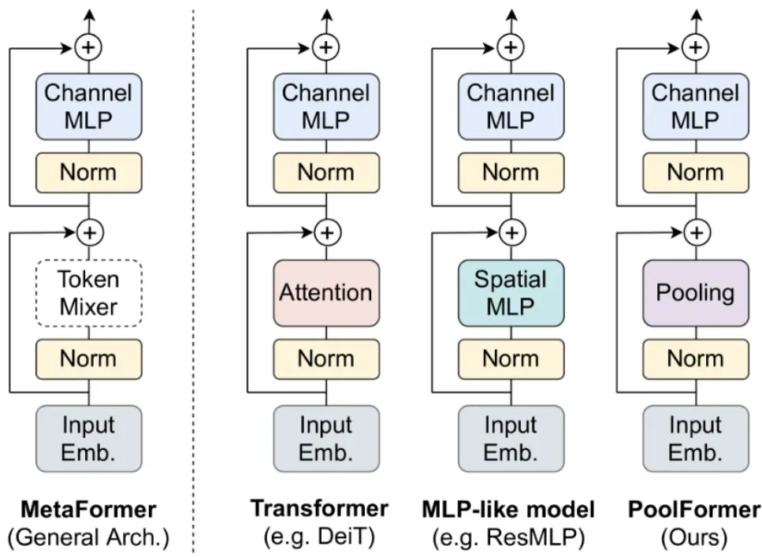
Yu, Weihao, et al. "Metaformer is actually what you need for vision."

类似结论在时序领域同样：如时序 Patch、通道独立等与具体模块无关的设计对模型性能存在较大影响。因此，在本篇报告中，在继承先前报告的“股票时序内的局部-整体交互，以及截面股票间的交互”框架基础上，我们进行延续拓展，并将所有注意力机制替换为简单的去均值操作，构建一个更为简单的端到端模型——DecompGRU。

在时序模块部分，我们延续双分支设计，通过趋势分解生成差异化输入，维持多层次时序交互能力；截面模块部分，我们采用分组去均值策略，在保留每个时间步截面信息的同时大幅简化计算。

## 二、模型介绍

本篇报告的模型流程下图所示，模型每个batch输入为同截面上多只股票的量价时序，趋势分解模块将输入拆分为趋势与残差两项，分别进入一个分支进行建模，截面交互仅在趋势分支中被引入：

图表 2 DecompGRU 模型流程
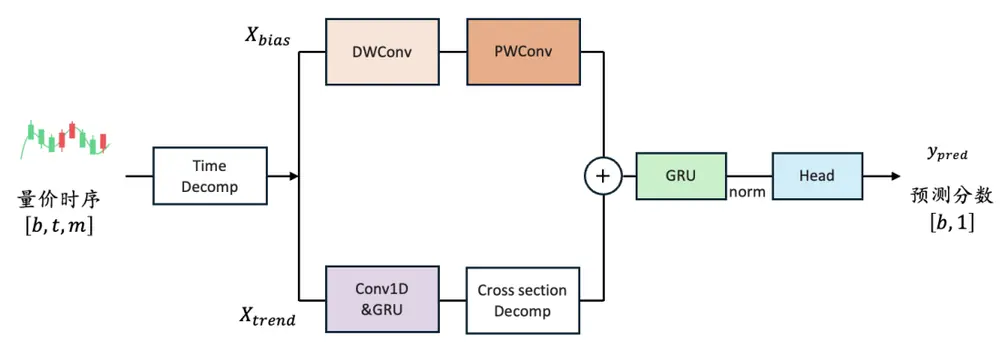
资料来源：华创证券

DecompGRU 模型延续了先前报告的大致框架，使用更加简单的模块实现与拓展，下面我们具体介绍每个模块的实现细节。

## （一）时序趋势分解

时序分解是近年时序深度学习论文中常见的模块，例如AutoFormer、Dlinear等工作中使用最简单的移动均值方法来实现趋势分解，在进入骨干网络前，输入X拆分为长期趋势 $X_{t}$ 与季节项 $X_{s}$ ：

$$
\begin{aligned}&X_{t}=AvgPool\big(Padding(X)\big)\\&\quad X_{s}=X-X_{t}\\\end{aligned}
$$

在后续流程，趋势分量和季节分量通常会使用单独的模块进行建模，最后进行合并两个分支得到最终预测。

我们使用上述相同的方法对模型输入进行处理，对股价场景而言，上述趋势分解模块的类似于技术指标 SMA 均线、均线乖离；padding 的作用为保证新序列长度与输入序列长度一致，我们将padding设置在时序的最远端，而非两端。

我们将分解模块输出的趋势分量和残差分量分别记为 $X_{trained}和X_{res}$ ，其中 $X_{trend}$ 捕捉相对偏向整体的信息，而 $X_{res}$ 则为更偏向局部的信息，两个分量被输入两个分支，进行不同处理。

## （二）双分支流程

## （1）趋势分支

经过上一步，原始输入被拆分成了一项包含更多整体信息的趋势分量、一项包含更多局部信息的残差分量。

首先，我们将趋势分量输入1D 卷积 + GRU 来实现时序编码，每个股票在每个时间步被编码为一个 d维的向量。

$$
X_{trend}=GRU\Big(Conv1D\big(X_{trend}\big)\Big)
$$

其中，1D 卷积不使用padding，卷积核大小等于步长，输出 $X_{trend}\in\mathbb{R}^{b,t^{\prime},d}$

我们认为残差分量更多体现为个股的特质信息以及随机噪声，当我们需要考虑股票间的交互时，使用更偏向整体性的趋势分量可能更加合理，因此我们将简易截面模块只运用在趋势分支上。

我们直接在股票维度计算均值，将每个股票减去均值，得到趋势分量的最终表征$X_{trendrepr}\in\mathbb{R}^{b,t^{\prime},d}$

$$
X_{csrepr}=AvgPool(X_{trend},dim=0)
$$

$$
X_{trendrepr}=X_{trend}-X_{csrepr}
$$

不同特征的股票可能存在截然不同的模式，直接在截面所有股票进行均值计算丢失信息较多。考虑到使用市值对截面股票进行划分是较为常见的选择，因此本篇报告中，我们引入分组进行去均值操作，根据截面股票的SIZE 因子暴露大小进行5 等分，将每个股票的表征减去同组股票的表征均值。

## （2）残差分支

在残差分支我们使用更轻量的深度可分离卷积（DSConv），由深度卷积（DWConv）与点卷积（PWConv）构成，得到偏离分量的最终表征 $X_{resrepr}\in\mathbb{R}^{b,t^{\prime},d}$

$$
X_{resrepr}=DSConv(X_{res})
$$

其中，深度卷积无padding，卷积核大小等于步长，数值设置同趋势分支中的Conv1D 相同；点卷积将每个时间步特征维度映射至 d维。

最后，我们将两个分支的结果相加合并，输入 GRU 编码器，取最后一个时间步的输出，通过输出维度为 1的Linear得到每个股票的最终得分：

$$
Y_{pred}=Linear\left(GRU\big(X_{trendrepr}+X_{resrepr}\big)\right)
$$

DecompGRU 包含2个不共享参数的 GRU 层，尽管增加了计算开销，但该设计对信息捕捉的是必要的：

在趋势分支，我们特意保留了 GRU 在每个时间步的输出，由于截面模块的简化，我们可以考虑每个时间步上的截面信息，而并非只使用最后一个时间步的表征进行截面交互；

- 残差分支专注局部特征增强，进一步扩充了每个时间步表征的信息。

换言之，趋势分支的GRU执行引入位置信息、基本时序编码任务。分支合并后，重构的股票表征输入第二个GRU，以捕捉高阶时序演化规律。

## 三、测试结果

## （一）数据集介绍

150D 数据集：

日频的高、开、低、收、均价、成交量 6个特征；

每个batch 为同一截面多只股票的多变量时序，序列长度为150；batch按日度采样；

训练集的去极值、Zscore、填充缺失值预处理步骤与先前报告相同。

训练方式：

采用滚动训练，每年年底进行模型重训练：

图表 3 滚动训练流程
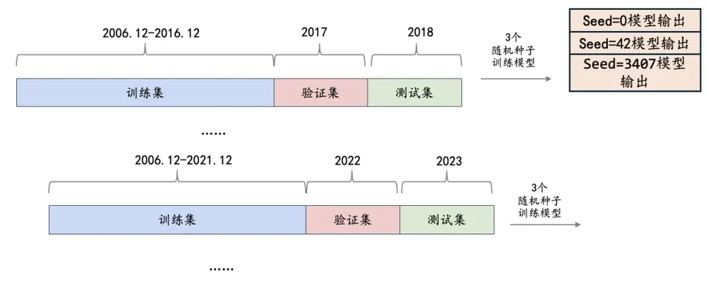
资料来源：华创证券

## 模型预测标签：

标签处理：经过市值行业中性化的未来 10日收益（t+1日~ t+11日以收盘价计算）；
标准化方法：每个截面rank/ zscore 标准化，后续分别对应IC/ MSE损失函数。

## 损失函数：

我们分别测试 IC、MSE作为损失函数时模型的表现。

其中MSE采用样本加权，放大多头端权重：

$$
s=\mathrm{RELU}(y_{\mathrm{true}}-\tau)
$$

$$
w=1+\alpha(\sigma(s)-0.5)
$$

$$
\mathcal{L}=w\cdot\left(y_{\mathrm{pred}}-y_{\mathrm{true}}\right)^{2}
$$

其中 $y_{pred}$ 为模型预测值， $y_{\mathrm{true}}$ 为经过标准化的 label，阈值τ设置为 1.0，权重倍数α设置为 2.0，σ(·)表示 sigmoid 函数。

## 基线模型

基线模型为常用的GRU模型，流程如下：

图表 4 基线 GRU模型流程
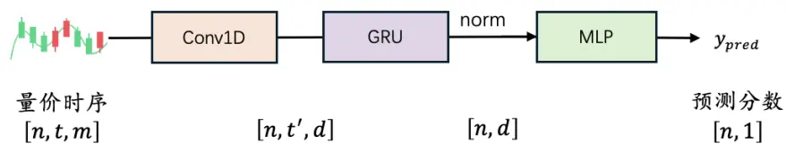
资料来源：华创证券

## （二）模型参数

基线GRU模型与DecompGRU共同的超参数设定如下：

实现Patch功能的1D 卷积，卷积核大小等于步长，设置为 3；

GRU 隐状态维度 64、层数为 1；

标准化层为 LayerNorm；

DecompGRU 模型涉及的额外超参数设定为：

时序趋势分解：计算 5 日均值；

趋势分支：根据SIZE 因子暴露，将股票分为5组；

残差分支：深度卷积核大小等于步长，设置为3；

所有训练流程涉及参数为：

图表 5 训练参数设定

| 变量名 | 参数设置 |
| --- | --- |
| Patience | 15 |
| Optimizer | Adam(1e-3) |
| Seed | 0,42,3407 |

资料来源：华创证券

## （三）因子测试结果

回测区间：2019 年 1 月 1 日 ~ 2025 年 2 月 28 日；

不同模型因子与 barra 风格因子截面相关性均值如下图所示，DecompGRU 在与流动、残差波动风格上相关较高，相比基线GRU，DecompGRU 模型更偏小市值、正 beta。

图表 6 模型风格倾向
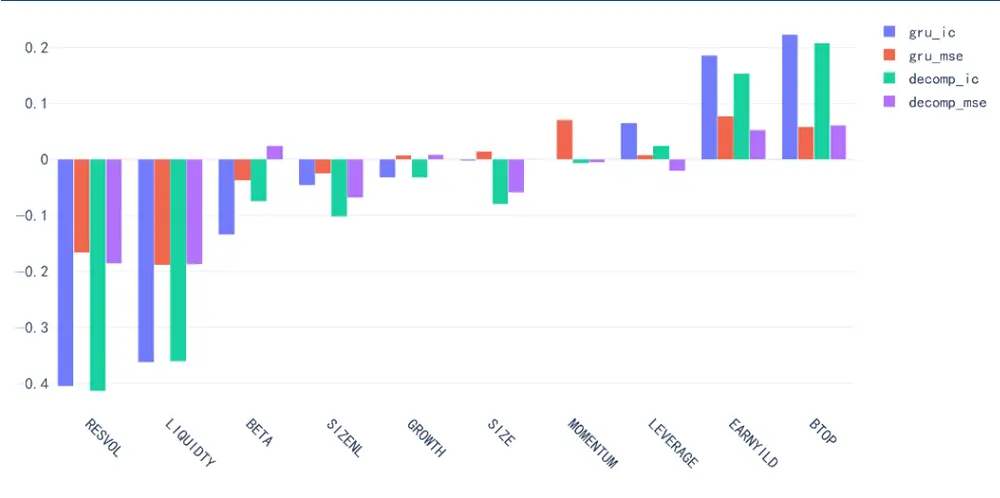
资料来源：wind，通联数据，华创证券

下表展示不同模型因子的截面的秩相关性系数，在时序上取均值的统计结果。使用不同损失函数时，DecompGRU和 GRU 基线模型相关性最低，为 72%。

图表 7 模型相关性

|  | GRU-IC | GRU-MSE | DecompGRU-IC | DecompGRU-MSE |
| --- | --- | --- | --- | --- |
| GRU-IC | 1 | 0.81 | 0.81 | 0.73 |
| GRU-MSE | 0.81 | 1 | 0.72 | 0.77 |
| DecompGRU-IC | 0.81 | 0.72 | 1 | 0.85 |
| DecompGRU-MSE | 0.73 | 0.77 | 0.85 | 1 |

资料来源：wind，通联数据，华创证券

## 1、IC测试结果

下面我们统计不同模型的10日、20日窗口的IC指标，10日IC收益计算区间为T+1~T+11，20日以此类推。

图表 8 10日 IC统计结果

| 股票池 | 指标 | GRU |  | DecompGRU |  |
| --- | --- | --- | --- | --- | --- |
|  |  | IC | MSE | IC | MSE |
| 中证全指 | RankIC | 0.125 | 0.107 | 0.13 | 0.11 |
|  | RankICIR | 0.99 | 1.1 | 1.1 | 1.09 |
|  | IC 胜率 | 0.86 | 0.87 | 0.88 | 0.87 |
| 沪深300 | RankIC | 0.094 0 | .079 | 0.09 | 0.07 |
|  | RankICIR | 0.55 | 0.52 | 0.58 | 0.45 |
|  | IC 胜率 | 0.72 | 0.7 | 0.72 | 0.66 |
| 中证500 | RankIC | 0.091 | 0.074 | 0.089 0 | .073 |
|  | RankICIR | 0.65 | 0.62 | 0.67 | 0.56 |
|  | IC 胜率 | 0.77 | 0.75 | 0.77 | 0.72 |
| 中证1000 | RankIC | 0.115 | 0.095 | 0.116 | 0.098 |
|  | RankICIR | 0.88 | 0.88 | 0.94 | 0.85 |
|  | IC 胜率 | 0.83 | 0.82 | 0.83 | 0.84 |

资料来源：wind，华创证券

图表 9 20日 IC统计结果

| 股票池 | 指标 | GRU |  | DecompGRU |  |
| --- | --- | --- | --- | --- | --- |
|  |  | IC | MSE | IC | MSE |
| 中证全指IC | RankIC | 0.136 | 0.116 | 0.141 | 0.117 |
|  | RankICIR | 1.07 | 1.24 | 1.23 | 1.27 |
|  | 胜率 | 0.88 | 0.91 | 0.9 | 0.92 |
| 沪深300 | RankIC | 0.105 | 0.088 | 0.095 | 0.067 |
|  | RankICIR | 0.6 | 0.59 | 0.6 | 0.45 |
|  | IC 胜率 | 0.74 | 0.71 | 0.75 | 0.66 |
| 中证500 | RankIC | 0.097 | 0.08 | 0.094 | 0.074 |
|  | RankICIR | 0.68 | 0.67 | 0.71 | 0.58 |
|  | IC 胜率 | 0.79 | 0.8 | 0.78 | 0.74 |
| 中证1000 | RankIC | 0.127 | 0.107 | 0.129 | 0.107 |
|  | RankICIR | 0.99 | 1.05 | 1.09 | 1 |
|  | IC 胜率 | 0.87 | 0.86 | 0.87 | 0.87 |

资料来源：wind，华创证券

在中证全指股票池上， DecompGRU 综合表现强于基线模型，DecompGRU-IC 的 10日 RankIC 为 0.13，RankIC 为 1.1，胜率为 88%，20 日 RankIC 为 0.141，RankICIR为 1.23，胜率为 90%；

在 300、500股票池内，DecompGRU的 IC 表现弱于基线模型，在 1000上略强于基线；

对比不同损失函数，使用 IC 损失函数训练的模型，在大多数 IC 相关指标的表现上优于 MSE损失。

## 2、分组测试结果

本部分我们对因子进行分组测试。每周最后一个交易日根据当天因子值分组，以次周第一个交易日收盘价进行调仓操作，剔除涨跌停、停牌股票，不计交易成本；

下图展示每一组的年化收益以及多头 TOP 组的超额收益时序走势对比，股票池为中证全指，分组数设置为 20。

图表 10 中证全指-20分组年化收益对比
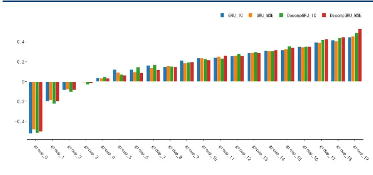
资料来源：wind，华创证券

图表 11 中证全指-TOP组超额走势对比
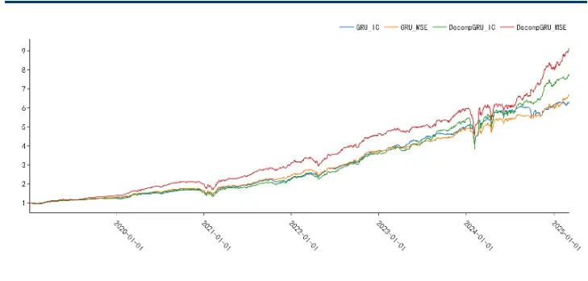
资料来源：wind，华创证券

图表 12 中证全指-TOP组逐年收益对比
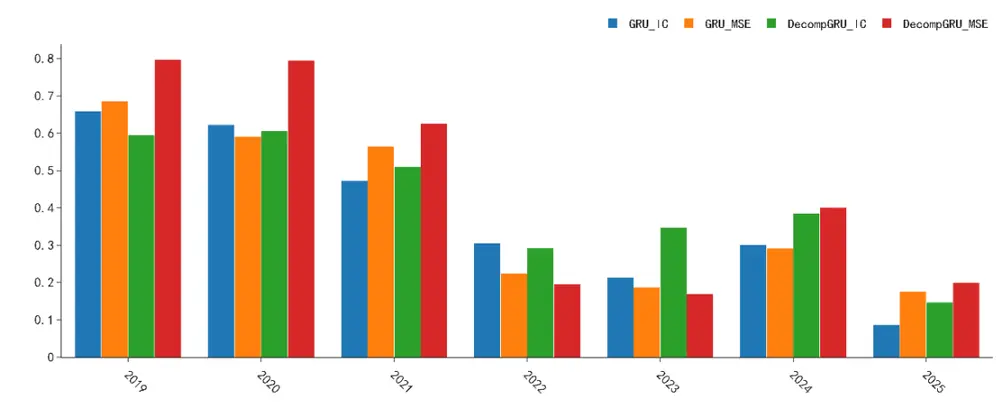
资料来源：wind，华创证券

图表 13 中证全指-TOP组绩效统计

| 模型 | 损失函数 | 年化收益率(%) | 夏普比率 | 最大回撤(%) | 超额年化(%) | 平均单边换手 |
| --- | --- | --- | --- | --- | --- | --- |
| GRU | IC | 44.61 | 1.61 | -33.31 | 38.53 | 0.53 |
|  | MSE | 45.6 | 1.57 | -30.4 | 39.52 | 0.5 |
| DecompGRU | IC | 49.18 | 1.58 | -36.73 | 43.1 | 0.52 |
|  | MSE | 52.82 | 1.61 | -35.49 | 46.74 | 0.53 |

资料来源：wind，华创证券

在中证全指股票池内，DecompGRU 表现优于基线模型，在回测区间内，DecompGRU-MSE 年化收益率为所有模型中最高，达到 52.82%，相比最优的 GRU-base 模型提高 7.2%；DecompGRU-IC 表现次之，为 49.18%；

DecompGRU 在小市值风格的暴露更大，24年年初回撤幅度明显大于基线模型；

从逐年角度，DecompGRU-IC 在近三年均跑赢基线， DecompGRU-MSE 在不同年份差异较大，在 19、20、21、24 年表现亮眼，显著强于基线模型，在 22、23 年则反之。

下面我们进一步展示 300、500、1000 宽基内分组测试的 TOP 组统计结果。中证 1000、中证500 分组数设置为10，沪深300分组数设置为5，其余设置同上。

图表 14 沪深300-TOP组逐年收益对比
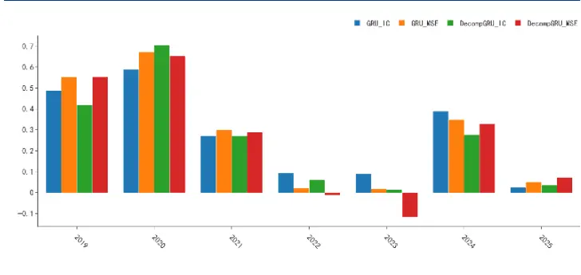
资料来源：wind，华创证券

图表 15 沪深300-TOP组超额走势对比
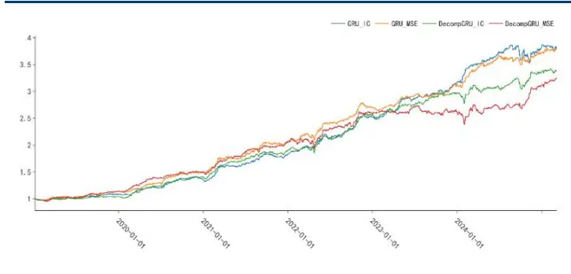
资料来源：wind，华创证券

图表 16 沪深 300-TOP 组绩效统计

| 模型 | 损失函数 |  | 全区间 | 2019 | 2020 | 2021 | 2022 | 2023 | 2024 | 2025-02-28 |
| --- | --- | --- | --- | --- | --- | --- | --- | --- | --- | --- |
| GRU | IC | 超额收益(%) | 25.34 | 8.95 | 24.67 | 34.9 | 38.05 | 24.44 | 21.95 | -0.7 |
|  |  | 超额夏普比 | 2.86 | 1.58 | 3.09 | 3.4 | 4.27 | 3.25 | 2.15 | -0.52 |
|  |  | 超额最大回撤(%) | -8.24 | -3.08 | -4.35 | -4.23 | -3.83 | -2.6 | -8.24 | -2.94 |
|  | MSE | 超额收益(%) | 25.25 | 14.06 | 32.02 | 38.04 | 29.7 | 16.49 | 18.79 | 1.74 |
|  |  | 超额夏普比 | 2.93 | 2.38 | 3.64 | 3.78 | 3.09 | 2.99 | 2.07 | 1.43 |
|  |  | 超额最大回撤(%) | -6.11 | -2.51 | -3.32 | -2.8 | -6.11 | -2.53 | -4.54 | -1.65 |
| DecompGRU | IC | 超额收益(%) | 22.78 | 4.22 | 34.68 | 35.6 | 34.7 | 15.99 | 13.1 | 0.31 |
|  |  | 超额夏普比 | 2.71 | 0.73 | 4.25 | 4.3 | 3.3 | 2.85 | 1.4 | 0.34 |
|  |  | 超额最大回撤(%) | -7.43 | -5.06 | -2.65 | -3.01 | -6.2 | -2.66 | -7.14 | -2.28 |
|  | MSE | 超额收益(%) | 21.93 | 14.36 | 30.78 | 37.9 | 25.72 | 1.53 | 18.32 | 3.9 |
|  |  | 超额夏普比 | 2.29 | 2.2 | 3.71 | 4.33 | 2.16 | 0.27 | 1.57 | 3.25 |
|  |  | 超额最大回撤(%) | -13.2 | -4.61 | -3.07 | -3.94 | -8.49 | -6.95 | -9.62 | -1.9 |

资料来源：wind，华创证券

图表 17 中证 500-TOP 组逐年收益对比
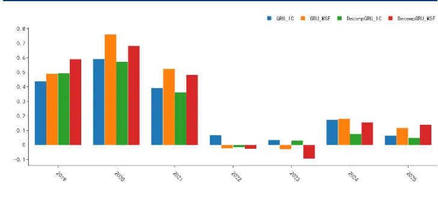
资料来源：wind，华创证券

图表 18 中证 500-TOP 组超额走势对比
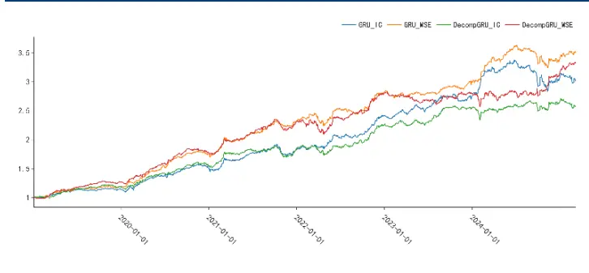
资料来源：wind，华创证券

图表 19 中证 500-TOP 组绩效统计

| 模型 | 损失函数 |  | 全区间 | 2019 | 2020 | 2021 | 2022 | 2023 | 2024 | 2025-02-28 |
| --- | --- | --- | --- | --- | --- | --- | --- | --- | --- | --- |
| GRU | IC | 超额收益(%) | 20.52 | 14.53 | 30.8 | 22.03 | 31.98 | 13.43 | 12.85 | -2.18 |
|  |  | 超额夏普比 | 1.93 | 2.01 | 2.59 | 1.97 | 3.22 | 1.69 | 1.09 | -1.14 |
|  |  | 超额最大回撤(%) | -16.34 | -3.4 | -5.26 | -9.86 | -3.81 | -4.71 | -16.34 | -5.74 |
|  | MSE | 超额收益(%) | 23.72 | 19.07 | 46.05 | 33.59 | 21.39 | 6.64 | 13.97 | 2.96 |
|  |  | 超额夏普比 | 2.37 | 2.63 | 3.79 | 3.03 | 2.05 | 1.09 | 1.42 | 2.27 |
|  |  | 超额最大回撤(%) | -10.72 | -3.06 | -4.28 | -5.05 | -9.16 | -4.52 | -10.72 | -2.01 |
| DecompGRU | IC | 超额收益(%) | 17.28 | 18.8 | 30.09 | 19.37 | 22.08 | 13.02 | 4.62 | -3.46 |
|  |  | 超额夏普比 | 1.75 | 2.62 | 2.63 | 1.82 | 2.05 | 2.03 | 0.51 | -2.3 |
|  |  | 超额最大回撤(%) | -10.16 | -4.33 | -4.06 | -10.16 | -9.55 | -4.54 | -8.81 | -6 |
|  | MSE | 超额收益(%) | 22.55 | 27.14 | 39.57 | 30.32 | 21.32 | -0.17 | 13.28 | 5.15 |
|  |  | 超额夏普比 | 2.11 | 3.51 | 3.42 | 2.85 | 1.7 | 0.01 | 1.17 | 3.74 |
|  |  | 超额最大回撤(%) | -11.26 | -3.45 | -3.83 | -8.38 | -11.18 | -7.37 | -8.25 | -2.13 |

资料来源：wind，华创证券

图表 20 中证 1000-TOP 组逐年收益对比
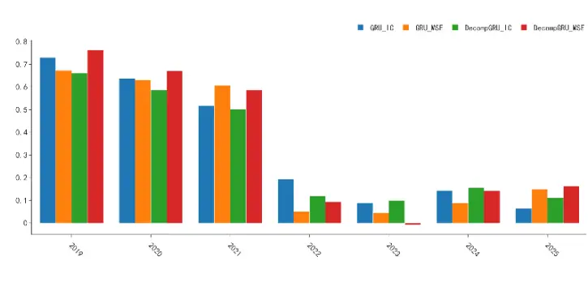
资料来源：wind，华创证券

图表 21 中证 1000-TOP组超额走势对比
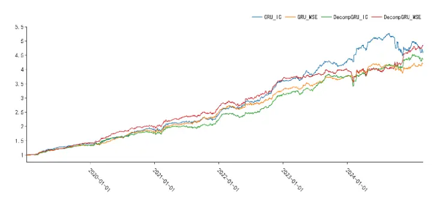
资料来源：wind，华创证券

图表 22 中证 1000-TOP 组绩效统计

| 模型 | 损失函数 |  | 全区间 | 2019 | 2020 | 2021 | 2022 | 2023 | 2024 | 2025-02-28 |
| --- | --- | --- | --- | --- | --- | --- | --- | --- | --- | --- |
| GRU | IC | 超额收益(%) | 29.44 | 39.69 | 35.62 | 28.35 | 48.44 | 18.88 | 13.91 | -5.61 |
|  |  | 超额夏普比 | 2.5 | 5.27 | 2.93 | 2.1 | 4.75 | 2.69 | 1.03 | -2.37 |
|  |  | 超额最大回撤(%) | -15.11 | -1.82 | -7.96 | -5.16 | -2.74 | -4.57 | -15.11 | -8.33 |
|  | MSE | 超额收益(%) | 27.49 | 35.19 | 36.14 | 36.05 | 31.27 | 14.43 | 9.48 | 2.38 |
|  |  | 超额夏普比 | 2.67 | 5.09 | 3.51 | 2.7 | 3.09 | 2.54 | 0.89 | 1.87 |
|  |  | 超额最大回撤(%) | -8.07 | -1.62 | -4.97 | -5.33 | -5.06 | -3.29 | -8.07 - | 2.51 |
| DecompGRU | IC | 超额收益(%) | 28.24 | 34.1 | 31.93 | 27.03 | 39.53 | 20.25 | 17.33 | -1.33 |
|  |  | 超额夏普比 | 2.51 | 5.21 | 2.65 | 2.03 | 3.68 | 2.96 | 1.39 | -0.7 |
|  |  | 超额最大回撤(%) | -10.91 | -2.74 | -4.52 | -4.81 | -6.78 | -3.99 | -10.12 - | 5.39 |
|  | MSE | 超额收益(%) | 30.56 | 42.86 | 39.44 | 34.71 | 36.91 | 9.06 | 16.87 | 3.7 |
|  |  | 超额夏普比 | 2.81 | 6.09 | 3.4 | 2.85 | 3.54 | 1.47 | 1.31 | 2.68 |
|  |  | 超额最大回撤(%) | -11.67 | -1.86 | -3.42 | -3.35 | -6.27 | -3.67 | -11.11 | -2.84 |

资料来源：wind，华创证券

综合以上测试结果：

从全区间看，DecompGRU 在小市值股票池的表现相对更好；

在 300、500股票池内，DecompGRU 的整体表现跑输基线模型，其中 22-24年跑输基线较多；24年末基线GRU 超额回撤区间，DecompGRU 相对更强；

在 1000 股票池内，DecompGRU 整体表现略强于基线模型，DecompGRU-MSE 在全区间超额年化收益为 30.56%，除23年大幅跑输基线外，其余年份均强于其他模型；DecompGRU-IC 则与基线模型相近。

总体而言，DecompGRU 在小市值股票池中相比基线GRU提高较为明显；而在300、500股票池中，DecompGRU在整体统计上弱于基线模型，仅在局部区间能跑赢基线。

DecompGRU在GRU 的基础上引入时序的趋势分解以及截面交互，在框架流程上区别于基线模型。模型虽然仍有明显低波、低流偏好，但在市值、贝塔等风格的暴露不同于基线，能在近年风格多变的市场环境下提供更多选择。此外，我们还注意到加权MSE 损失同样对模型的风格倾向存在较大影响，在保持输入端为 OHLCV 等基本字段时，不同模型间局部差异仍可以是显著的，为后续模型融合研究提供更多样的选择。

## （四）指增测试

在本节，我们使用基于 MSE 损失的DecompGRU-MSE，在沪深300、中证500以及中证1000 上进行指增测试；测试区间为 20190101~20250228。

约束条件为（1）指数成分股占比大于 80%（2）单只股票权重相对偏离上限为0.8%（3）Barra风格暴露约束0.3，行业暴露约束0.02（5）换手约束双边30%；

- 调仓频率为周频，根据每周最后一个交易日的因子值在次周首个交易日进行调仓，剔除 ST、涨跌停、停牌股票；

回测设定成本为双边千2.5。

DecompGRU-MSE 在 300 / 500 / 1000 指增组合的年化超额收益分别为 8.48%、11.65%、17.11%，跟踪误差分别为 4.8、5.88、6.69，平均双边换手为 0.32、0.34、0.34，其他回测图表如下：

图表 23 沪深300指增超额走势
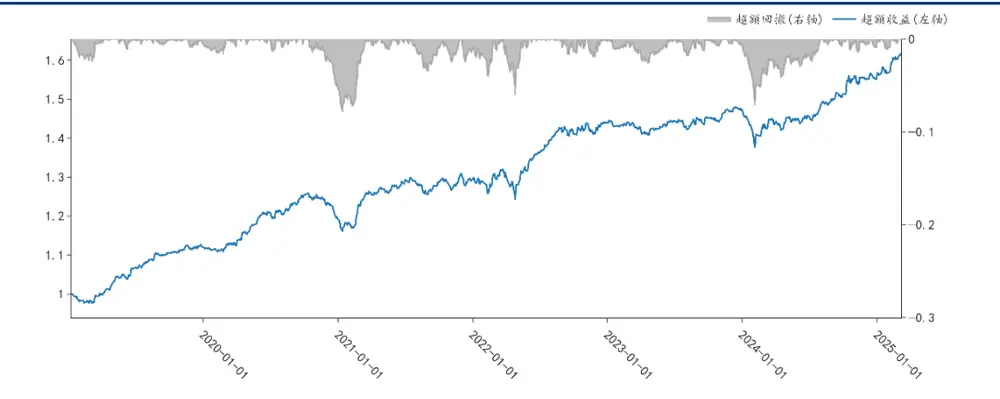
资料来源：wind，华创证券

图表 24 中证500指增超额走势
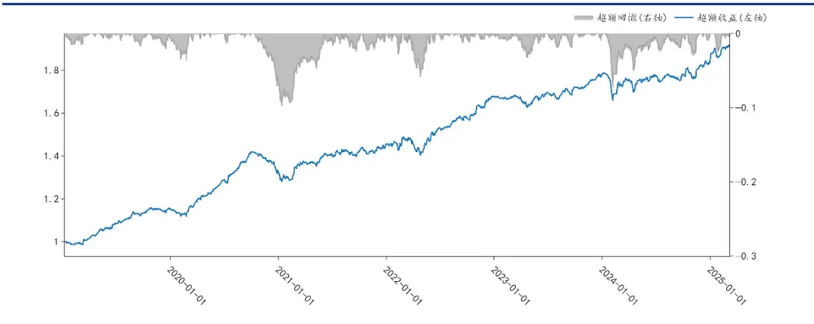
资料来源：wind，华创证券

图表 25 中证1000指增超额走势
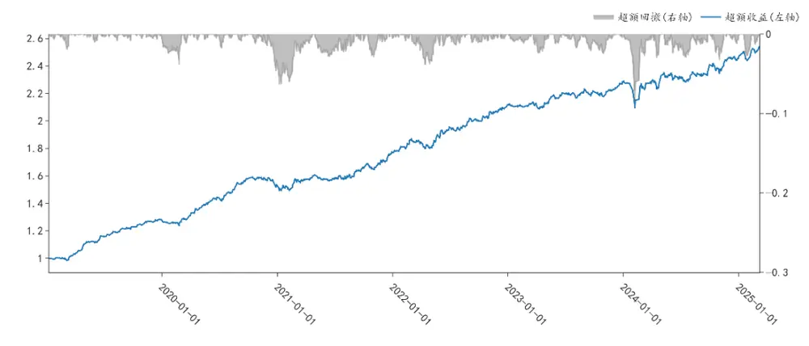
资料来源：wind，华创证券

图表 26 指增组合统计

|  | 基准 | 全区间 | 2019 | 2020 | 2021 | 2022 | 2023 | 2024 | 2025-02-28 |
| --- | --- | --- | --- | --- | --- | --- | --- | --- | --- |
| 沪深300 | 超额收益(%) | 8.48 | 12.03 | 6.44 | 8.53 | 11.21 | 2.46 | 5.85 | 3.69 |
|  | 超额夏普 | 1.72 | 3.32 | 1.56 | 1.72 | 1.73 | 0.75 | 1.16 | 4.75 |
|  | 超额最大回撤(%) | -7.84 | -2.47 | -5.31 | -3.5 | -6.04 | -2.62 | -6.71 | -1.1 |
|  | Calmar 比率 | 1.08 | 5.18 | 1.26 | 2.53 | 1.94 | 0.98 | 0.91 | 3.35 |
| 中证500 | 超额收益(%) | 11.65 | 15.58 | 14.94 | 9.55 | 15.35 | 5.66 | 4.38 | 3.67 |
|  | 超额夏普 | 1.91 | 3.46 | 2.53 | 1.48 | 2.2 | 1.37 | 0.7 | 3.37 |
|  | 超额最大回撤(%) | -9.79 | -2.05 | -7.15 | -3.72 | -5.89 | -3.28 | -7.21 | -2.44 |
|  | Calmar 比率 | 1.19 | 8.06 | 2.17 | 2.67 | 2.72 | 1.8 | 0.63 | 1.50 |
| 中证1000 | 超额收益(%) | 17.11 | 28.09 | 19.44 | 15.56 | 19.8 | 7.89 | 7.85 | 3.29 |
|  | 超额夏普 | 2.4 | 5.27 | 2.94 | 1.93 | 2.89 | 1.64 | 0.97 | 2.99 |
|  | 超额最大回撤(%) | -8.6 | -1.94 | -4.69 | -2.91 | -3.9 | -2.47 | -8.6 | -2.75 |
|  | Calmar 比率 | 1.99 | 15.48 | 4.31 | 5.56 | 5.31 | 3.34 | 0.95 | 1.19 |

资料来源：wind，华创证券

## 四、总结

本篇报告我们提出了DecompGRU 模型，在先前报告的模型框架的基础上进行拓展；我们使用趋势分解模块将初始输入拆分为趋势与残差分量，并用双分支结构进行分别建模；在趋势分支，我们加入一个基于去均值操作的简单截面模块；

我们在 150D数据集，分别以IC、MSE两种损失函数训练模型；DecompGRU 与基线模型的相关性最低为 72%，在风格倾向上与基线模型存在差异，在小市值选股域中提高更为明显；

在中证全指 20190101~20250228 区间内，以 GRU 模型为基线，DecompGRU 的 10 日RankIC 为 0.13、RankICIR 为 1.1；20 日 RankIC 为 0.141，RankICIR 为 1.23，均优于基线模型；分组测试中，DecompGRU 的TOP 组年化收益最高达 52.82%，相比基线实现了 7.2%的提高；在300、500选股域中则整体表现弱于基线；

- 基于DecompGRU构建指增组合，在双边换手30%的约束下，回测区间内300、500、1000指增组合的年化超额收益分别为8.48%、11.65%、17.11%，跟踪误差为分别4.8、5.88、6.69。

## 五、风险提示

策略基于历史数据回测，不保证未来数据的有效性。深度学习模型存在过拟合风险。深度学习模型受随机数影响。本文的模型实现和相关参考文献不完全相同。

## 六、参考文献

Zeng, Ailing, et al. "Are transformers effective for time series forecasting?" Proceedings of the AAAI conference on artificial intelligence. Vol. 37. No. 9. 2023.

Wu, Haixu, et al. "Autoformer: Decomposition transformers with auto-correlation for long-term series forecasting." Advances in neural information processing systems 34 (2021): 22419-22430.

Yu, Weihao, et al. "Metaformer is actually what you need for vision." Proceedings of the IEEE/CVF conference on computer vision and pattern recognition. 2022.

## 金融工程组团队介绍

组长、首席分析师：王小川

同济大学管理学博士。2017年加入华创证券研究所。

助理研究员：杨宸祎

美国伊利诺伊大学香槟分校会计学、金融工程学硕士，CFA。2021年加入华创证券研究所。

助理研究员：黄河

东华大学工学博士，FRM。2023年加入华创证券研究所。

助理研究员：洪远

华南理工大学金融硕士。2023年加入华创证券研究所。

助理研究员：刘依凡

上海财经大学金融统计博士。2024年加入华创证券研究所。

## 华创证券机构销售通讯录

| 地区 | 姓名 | 职务 | 办公电话 | 企业邮箱 |
| --- | --- | --- | --- | --- |
| 北京机构销售部 | 张昱洁 | 副总经理、北京机构销售总监 | 010-63214682 | zhangyujie@hcyjs.com |
|  | 张菲菲 | 北京机构副总监 | 010-63214682 | zhangfeifei@hcyjs.com |
|  | 张婷 | 华北机构销售副总监 |  | zhangting3@hcyjs.com |
|  | 刘懿 | 副总监 | 010-63214682 | liuyi@hcyjs.com |
|  | 侯春钰 | 资深销售经理 | 010-63214682 | houchunyu@hcyjs.com |
|  | 顾翎蓝 | 资深销售经理 | 010-63214682 | gulinglan@hcyjs.com |
|  | 蔡依林 | 资深销售经理 | 010-66500808 | caiyilin@hcyjs.com |
|  | 刘颖 | 资深销售经理 | 010-66500821 | liuying5@hcyjs.com |
|  | 阎星宇 | 销售经理 |  | yanxingyu@hcyjs.com |
|  | 张效源 | 销售经理 |  | zhangxiaoyuan@hcyjs.com |
|  | 车一哲 | 销售经理 |  | cheyizhe@hcyjs.com |
|  | 郑珺丹 | 销售经理 |  | zhengjundan@hcyjs.com |
| 深圳机构销售部 | 张娟 | 副总经理、深圳机构销售总监 0755 | -82828570 | zhangjuan@hcyjs.com |
|  | 汪丽燕 | 高级销售经理 | 0755-83715428 | wangliyan@hcyjs.com |
|  | 张嘉慧 | 高级销售经理 | 0755-82756804 | zhangjiahui1@hcyjs.com |
|  | 王春丽 | 高级销售经理 | 0755-82871425 | wangchunli@hcyjs.com |
|  | 王越 | 高级销售经理 |  | wangyue5@hcyjs.com |
|  | 温雅迪 | 销售经理 |  | wenyadi@hcyjs.com |
| 上海机构销售部 | 许彩霞 | 总经理助理、上海机构销售总监0 | 21-20572536 | xucaixia@hcyjs.com |
|  | 官逸超 | 上海机构销售副总监 | 021-20572555 | guanyichao@hcyjs.com |
|  | 黄畅 | 上海机构销售副总监 | 021-20572257-2552 | huangchang@hcyjs.com |
|  | 吴俊 | 资深销售经理 | 021-20572506 | wujun1@hcyjs.com |
|  | 张佳妮 | 资深销售经理 | 021-20572585 | zhangjiani@hcyjs.com |
|  | 郭静怡 | 高级销售经理 |  | guojingyi@hcyjs.com |
|  | 蒋瑜 | 高级销售经理 | 021-20572509 | jiangyu@hcyjs.com |
|  | 吴菲阳 | 高级销售经理 |  | wufeiyang@hcyjs.com |
|  | 朱涨雨 | 高级销售经理 | 021-20572573 | zhuzhangyu@hcyjs.com |
|  | 李凯月 | 高级销售经理 |  | likaiyue@hcyjs.com |
|  | 张豫蜀 | 销售经理 | 15301633144 | zhangyushu@hcyjs.com |
|  | 张玉恒 | 销售经理 |  | zhangyuheng@hcyjs.com |
|  | 张晨奂 | 销售经理 |  | zhangchenhuan@hcyjs.com |
| 广州机构销售部 | 段佳音 | 广州机构销售总监 | 0755-82756805 | duanjiayin@hcyjs.com |
|  | 周玮 | 销售经理 |  | zhouwei@hcyjs.com |
|  | 王世韬 | 销售经理 |  | wangshitao1@hcyjs.com |
| 私募销售组 | 潘亚琪 | 总监 | 021-20572559 | panyaqi@hcyjs.com |
|  | 汪子阳 | 副总监 | 021-20572559 | wangziyang@hcyjs.com |
|  | 江赛专 | 副总监 | 0755-82756805 | jiangsaizhuan@hcyjs.com |
|  | 汪戈 | 高级销售经理 | 021-20572559 | wangge@hcyjs.com |
|  | 宋丹玙 | 销售经理 | 021-25072549 | songdanyu@hcyjs.com |
|  | 赵毅 | 销售经理 |  | zhaoyi@hcyjs.com |

## 华创行业公司投资评级体系

基准指数说明：

A股市场基准为沪深 300指数，香港市场基准为恒生指数，美国市场基准为标普 500/纳斯达克指数。

公司投资评级说明：

强推：预期未来 6个月内超越基准指数 20%以上；

推荐：预期未来 6个月内超越基准指数 10%－20%；

中性：预期未来 6个月内相对基准指数变动幅度在-10%－10%之间；

回避：预期未来 6个月内相对基准指数跌幅在 10%－20%之间。

## 行业投资评级说明：

推荐：预期未来 3-6个月内该行业指数涨幅超过基准指数 5%以上；

中性：预期未来 3-6个月内该行业指数变动幅度相对基准指数-5%－5%；

回避：预期未来 3-6个月内该行业指数跌幅超过基准指数 5%以上。

## 分析师声明

每位负责撰写本研究报告全部或部分内容的分析师在此作以下声明：

分析师在本报告中对所提及的证券或发行人发表的任何建议和观点均准确地反映了其个人对该证券或发行人的看法和判断；分析师对任何其他券商发布的所有可能存在雷同的研究报告不负有任何直接或者间接的可能责任。

## 免责声明

本报告仅供华创证券有限责任公司（以下简称“本公司”）的客户使用。本公司不会因接收人收到本报告而视其为客户。

本报告所载资料的来源被认为是可靠的，但本公司不保证其准确性或完整性。本报告所载的资料、意见及推测仅反映本公司于发布本报告当日的判断。在不同时期，本公司可发出与本报告所载资料、意见及推测不一致的报告。本公司在知晓范围内履行披露义务。

报告中的内容和意见仅供参考，并不构成本公司对具体证券买卖的出价或询价。本报告所载信息不构成对所涉及证券的个人投资建议，也未考虑到个别客户特殊的投资目标、财务状况或需求。客户应考虑本报告中的任何意见或建议是否符合其特定状况，自主作出投资决策并自行承担投资风险，任何形式的分享证券投资收益或者分担证券投资损失的书面或口头承诺均为无效。本报告中提及的投资价格和价值以及这些投资带来的预期收入可能会波动。

本报告版权仅为本公司所有，本公司对本报告保留一切权利。未经本公司事先书面许可，任何机构和个人不得以任何形式翻版、复制、发表、转发或引用本报告的任何部分。如征得本公司许可进行引用、刊发的，需在允许的范围内使用，并注明出处为“华创证券研究”，且不得对本报告进行任何有悖原意的引用、删节和修改。

证券市场是一个风险无时不在的市场，请您务必对盈亏风险有清醒的认识，认真考虑是否进行证券交易。市场有风险，投资需谨慎。

## 华创证券研究所

| 北京总部 | 广深分部 | 上海分部 |
| --- | --- | --- |
| 地址：北京市西城区锦什坊街26号 恒奥中心 C 座 3A | 地址：深圳市福田区香梅路1061号中投国 际商务中心A座19楼 | 地址：上海市浦东新区花园石桥路33号 花旗大厦 12 层 |
| 邮编：100033 | 邮编：518034 | 邮编：200120 |
| 传真：010-66500801 会议室：010-66500900 | 传真：0755-82027731 会议室：0755-82828562 | 传真：021-20572500 会议室：021-20572522 |