AI+HI 系列(8)

# DecompGRN v1:基于线性 RNN 的端到端模型初探

## 前言

随着 LLM 模型对处理序列长度的要求日益严苛，RNN/SSM 模型因其线性推理效率的优势而重返学术前沿。受此启发，我们重新审视了在端到端量价因子挖掘任务中经典 GRU 网络内部改造的可能性。

我们首先从一个高度简化的线性 RNN 出发，发现在参数量锐减的前提下，其表现足以媲美 GRU 基线，在此基础上，我们延续并拓展了先前“时序-截面”交互的研究思路，设计了全新的 DecompGRN 模型。该模型的核心创新在于将股票间的截面信息直接整合进 的门控单元，不仅实现了模型逻辑与参数量的双重简化，在综合性能上也超越了基线模型。

## 测试结果

我们在 150D 数据集，以 GRU 模型作为基线对 DecompGRN 进行测试；

在中证全指 / 沪深 300 / 中证 500 / 中证 1000 域内，10 日 RankIC 为 0.141 /0.099 / 0.098 / 0.127，RankICIR 分别为 1.26 / 0.65 / 0.77 / 1.08，均强于基线模型；

周度分组测试中，不计交易成本，TOP 组在全指域内年化收益达 57.68%；在中证全指 / 沪深 300 / 中证 500 / 中证 1000 域内，年化收益分别相比基线+5.28% / -0.64% / +0.73% / +1.88%。

基于 DecompGRN 构建指增组合，在双边换手 30%约束，千三交易成本下，沪深 300 / 中证 500 / 中证 1000 指增组合年化超额收益分别为 10.24%、10.05%、19.58%，2025 年截至 8 月 27 日，沪深 300 / 中证 500 / 中证 1000 增强组合累计超额为 3.93% / 6.72% / 18.26%。

## 风险提示：

策略基于历史数据回测，不保证未来数据的有效性。深度学习模型存在过拟合风险。深度学习模型受随机数影响。

## 华创证券研究所

证券分析师：王小川

邮箱：wangxiaochuan@hcyjs.com

执业编号：S0360517100001

联系人：洪远

邮箱：hongyuan@hcyjs.com

## 相关研究报告

《AI+HI 系列（7）：DecompGRU：基于趋势分解的时序+截面端到端模型》

2025-03-13

《AI+HI 系列（5）：CrossGRU-2：基于 Patch 与多尺度时序改进端到端模型》

2024-07-05

## 投资主题

## 报告亮点

我们注意到学术研究上近年对 RNN 类模型的新设计，受此启发，本篇报告中，我们继续完善时序+截面的端到端框架，使用更为简单的线性 RNN 模块来设计端到端模型，为广大投资者提供新的研究思路，助力量化投资的发展。

## 投资逻辑

时序与截面数据在量化投资领域处处可见，通过深度学习网络实现时序或截面信息的信息挖掘具有相当的潜力。本篇报告提出了基于深度学习的量价因子挖掘模型，进一步探索深度学习在量化领域上的运用。

## 一、动机

近年深度学习模型在量化投资领域的研究与应用日益广泛。我们过去的研究致力于改进用于量价因子挖掘的端到端模型，通过在 GRU 或 LSTM 等时序编码器之上叠加股票截面信息、市场信息等外部模块，以期获得信息增益。然而，这些工作并未深入探讨循环神经网络（RNN）自身的内部结构。

在 Transformer 架构兴起之前，RNN 是序列建模任务的主流选择。凭借在现代硬件上更高的训练效率以及对长距离依赖关系更强的捕捉能力，Transformer迅速成为自然语言处理领域的标准范式，并逐步拓展到其他类别序列的建模任务中。随着大语言模型在检索增强生成（RAG）和人工智能体（AI Agent）等场景的应用，模型需处理的序列长度急剧增加，Transformer架构固有的计算复杂度平方问题导致了高昂的开销，这促使研究界重新审视具有线性推理效率的 RNN，或状态空间模型（SSM），并催生了如RetNet、Mamba等一系列工作。我们所关注的量化因子挖掘任务，其输入序列长度远小于大语言模型，因此研究动机与上述前沿工作不尽相同。尽管如此，我们仍有兴趣探索不同RNN 变体在因子挖掘场景下，能否带来性能上的增益。

回顾经典 RNN 层，对一个输入序列 $(x_{1},x_{2},\ldots,x_{L})$ ，RNN 通过递归计算一系列序列输出$(y_{1},y_{2},\ldots,y_{L})$ ：

$$
\begin{aligned}&h_{t}=\sigma(Ah_{t-1}\;+\;Bx_{t})\\&\quad y_{t}=\;Ch_{t}+\;Dx_{t}\\\end{aligned}
$$

其中 A,B,C,D 为可学习参数矩阵；初始隐状态通常设置为零向量；σ是非线性激活函数（通常为 tanh或 sigmoid），长期以来被认为是RNN的关键组件，赋予了单层RNN图灵完备的理论性质。

最近的研究中，Orvieto等（2023）对非线性激活函数σ的必要性提出疑问，研究发现移除激活函数σ并不会损害模型性能，还带来了训练上的并行化优势，移除激活函数σ后的 RNN 称为线性 RNN，他们基于线性 RNN 构建了 LRU 模型，在性能与效率上表现优秀。

图表 1 LRU 模型
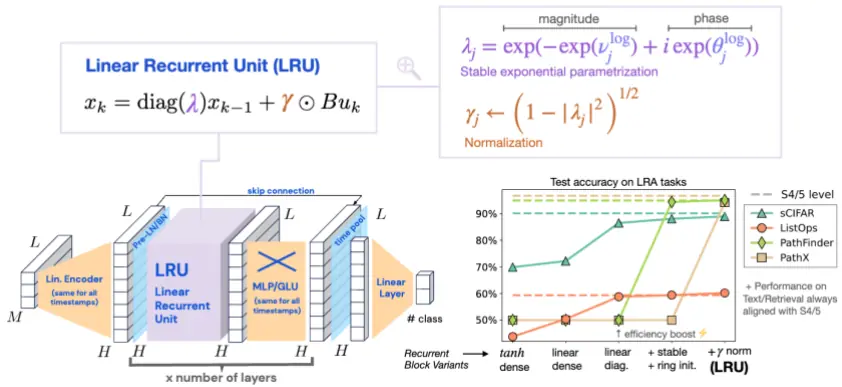
Orvieto,Antonio et al. "Resurrecting Recurrent Neural Networks for Long Sequences."

受此启发，本报告将从一个基础的线性RNN出发，探究其在端到端量价因子挖掘任务中

的应用潜力。

实验结果显示，简单的线性 RNN 性能略逊于基准模型 GRU，但两者表现位于同一水平。通过增加模型层数或与门控线性单元（GLU）结合，线性RNN的性能可以得到有效提升；

考虑到在相同层数下，线性 RNN 的参数量仅为 GRU 的一半，这为构建更复杂的RNN结构提供拓展空间。因此，我们延续先前《DecompGRU：基于趋势分解的时序+截面端到端模型》报告中的框架思路，将线性RNN与截面信息模块结合，构建了一个新的时序-截面模型，我们将其命名为 DecompGRN（Gated Recurrent Network），测试结果显示，该模型取得了极具竞争力的表现。

## 二、模型介绍

我们从一个简单的线性RNN 模型开始，如下图所示：

图表 2 RNN-LIN 层结构
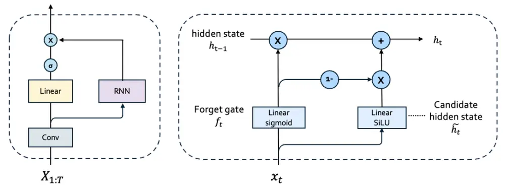
资料来源：华创证券

门控机制是 RNN 类变体的重要组件，在测试模型的门控上，输入门和遗忘门被合并，模型仅有遗忘门和输出门，门控通过 sigmoid作为激活函数，使门控值在(0,1)内；时序依赖仅在计算 hidden state时产生，隐状态迭代时不使用非线性激活函数：

$$
\begin{aligned}&h_{t}=f_{t}\otimes h_{t-1}+\left(1-f_{t}\right)\otimes c_{t}\\&\quad\quad\quad y_{t}=o_{t}\otimes h_{t}\\&\quad\quad f_{t}=Sigmoid\Big(x_{t}W_{f}\Big)\\&\quad\quad o_{t}=Sigmoid\Big(x_{t}W_{o}\Big)\\&\quad\quad\quad c_{t}=SLU\Big(x_{t}W_{c}\Big)\\\end{aligned}
$$

我们将以上模型记为 RNN-LIN，在参数量上， RNN-LIN 相比GRU模型减少约 50%。

Orvieto 等（2023）工作的主要发现之一是，当线性 RNN 与非线性 MLP 或 GLU（Shazeer等，2020）耦合时，模型可以具有更好表达能力。在后文测试部分，我们也参考上述做法，在 RNN 层后叠加FFN 模块组成一个block，我们使用GLU FFN：

$$
FFNSwiGLU\big(x,W,V,W_{2}\big)=\big(Swish\big(xW\big)\otimes xV\big)W_{2}
$$

## 三、测试结果

## （一）实验设置

数据集：

日频的高、开、低、收、均价、成交量 6个特征的150 日时序；

每个 batch输入同时期多只股票时序；

训练方式：

采用滚动训练，每年年底进行模型重新训练，每次训练取 3 个不同随机种子，结果按均值合并。

图表 3 滚动训练流程
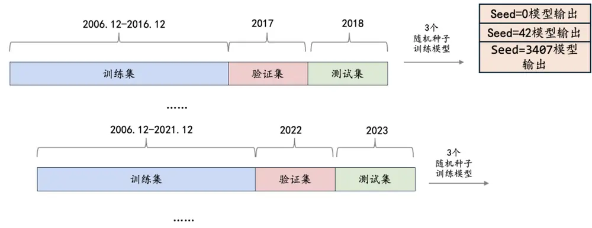
资料来源：华创证券

## 模型预测标签：

预测标签：市值行业中性化未来10日收益（t+1日~t+11日，以均价计算）。

损失函数：

IC 为训练损失函数，RankIC 为验证集评价指标。

模型框架：

图表 4 模型通用框架
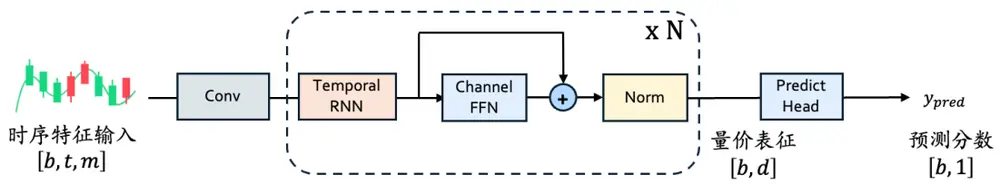
资料来源：华创证券

我们采用上图所示的整体框架，对比基线为GRU模型，模型仅在RNN部分实现不同；

层数N为 1或2层，并测试 GLU 加入或剔除对两个模型的影响。

回测区间：

2018 年 1 月 1 日 ~ 2025 年 7 月 28 日。

模型参数：

基线GRU模型与RNN共同的超参数设定如下：

1D卷积，卷积核大小等于步长大小，设置为3；

RNN、GLU中间映射维度均为 64；

- 标准化层为 LayerNorm；

其他训练过程涉及参数为：

图表 5 训练参数设定

| 变量名 | 参数设置 |
| --- | --- |
| Early Stop Patience | 15 |
| Optimizer | AdamW(lr=1e-3) |
| Seed | 0、42、3407 |

资料来源：华创证券

## （二）因子测试结果

我们首先观察模型在风格上的倾向，以及不同模型因子间的相关性。模型层数首先测试均设置为 1层；图表例中带有GLU后缀的表示加入GLU FFN：

图表 6 因子打分风格相关性
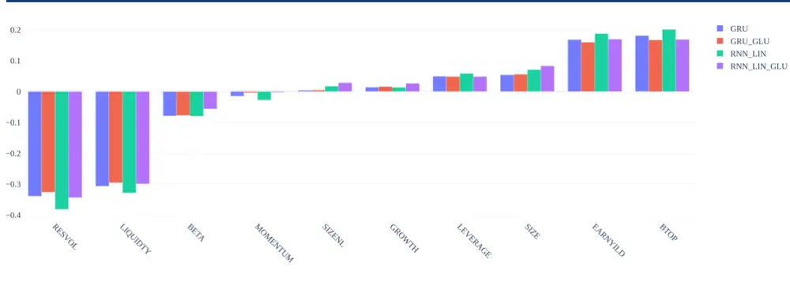
资料来源：通联数据，华创证券

图表 7 因子打分相关性

|  | GRU | GRU-GLU | RNN-LIN | RNN-LIN-GLU |
| --- | --- | --- | --- | --- |
| GRU | 1 | 0.92 | 0.88 | 0.89 |
| GRU-GLU | 0.92 | 1 | 0.85 | 0.88 |
| RNN-LIN | 0.88 | 0.85 | 1 | 0.92 |
| RNN-LIN-GLU | 0.89 | 0.88 | 0.92 | 1 |

资料来源：wind，华创证券

GRU 与 RNN-LIN 模型在风格上的倾向相近，在波动流动风格在有明显负向暴露；两个模型的因子数值相关性高，约为90%；加入或剔除GLU对风格倾向并无显著影响。

## 1、IC测试结果

下面我们统计不同模型的 10 日窗口的 IC 指标，10 日 IC 收益计算区间为 T+1~T+11。

图表 8 10日 IC统计结果

| 股票池 | 指标 | GRU |  | RNN-LIN |  |
| --- | --- | --- | --- | --- | --- |
|  |  | w/o GLU w | / GLU | w/o GLU w | / GLU |
| 中证全指 | RankIC | 0.13 | 0.13 | 0.13 | 0.13 |
|  | RankICIR | 1.12 | 1.16 | 1.08 | 1.14 |
|  | IC 胜率 | 0.88 | 0.89 | 0.88 | 0.89 |
| 沪深300IC | RankIC | 0.10 | 0.10 | 0.10 | 0.10 |
|  | RankICIR | 0.63 | 0.63 | 0.62 | 0.63 |
|  | 胜率 | 0.73 | 0.74 | 0.74 | 0.73 |
| 中证500IC | RankIC | 0.09 | 0.09 | 0.09 | 0.10 |
|  | RankICIR | 0.73 | 0.75 | 0.71 | 0.74 |
|  | 胜率 | 0.78 | 0.79 | 0.78 | 0.79 |
| 中证1000 | RankIC | 0.12 | 0.12 | 0.12 | 0.12 |
|  | RankICIR | 1.01 | 1.03 | 0.96 | 1.01 |
|  | IC 胜率 | 0.88 | 0.87 | 0.86 | 0.87 |

资料来源：wind，华创证券

从IC测试结果看，在不同股票池上，两个模型在IC指标的表现非常接近；加入 GLU 对两个模型的 RankICIR指标有微弱的提高作用。

## 2、分组测试结果

本部分我们对因子进行分组测试，我们主要关注多头部分表现，分组测试方法如下：

每周最后一个交易日根据当天因子值分组，以次周第一个交易日收盘价进行调仓操作，剔除涨跌停、停牌股票，不计交易成本；

股票池为中证全指时，分组数为 20；中证 1000、中证 500 分组数设置为 10；沪深300 分组数设置为5。

图表 9 TOP组全区间绩效统计

|  | 模型 | 年化收益率(%) | 夏普比率 | 最大回撤(%) | 超额年化(%) | 平均单边换手 |
| --- | --- | --- | --- | --- | --- | --- |
| 中证全指 | GRU | 49.66 | 1.61 - | 34 | 49.12 | 0.8 |
|  | GRU-GLU 5 | 0.86 | 1.62 | -35.30 | 50.32 | 0.8 |
|  | RNN-LIN | 42.59 | 1.46 | -36.71 | 42.05 | 0.81 |
|  | RNN-LIN-GLU | 48.73 | 1.60 | -35.33 | 48.19 | 0.81 |
| 沪深300 | GRU | 31.31 | 1.43 | -22.42 | 31.39 | 0.65 |
|  | GRU-GLU 3 | 1.72 | 1.43 | -19.95 | 31.80 | 0.65 |
|  | RNN-LIN | 28.59 | 1.38 | -22.09 | 28.67 0 | .66 |
|  | RNN-LIN-GLU 2 | 9.92 | 1.38 | -23.62 | 30 0 | .65 |
| 中证500 | GRU 2 | 4.52 | 1.02 | -37.12 | 24.79 | 0.75 |
|  | GRU-GLU 2 | 4.91 | 1.03 | -37.50 | 25.18 | 0.75 |
|  | RNN-LIN | 23.68 | 1.02 | -34.63 | 23.95 | 0.76 |
|  | RNN-LIN-GLU | 24.45 | 1.03 | -39.60 | 24.72 | 0.75 |
| 中证 1000 | GRU | 35.76 | 1.28 | -34.05 | 36.66 | 0.75 |
|  | GRU-GLU | 35.37 | 1.25 | -35.64 | 36.27 | 0.75 |
|  | RNN-LIN | 32.81 | 1.20 | -35.43 | 33.72 | 0.77 |
|  | RNN-LIN-GLU | 34.47 | 1.24 | -34.51 | 35.38 | 0.76 |

资料来源：wind，华创证券

在模型层数为 1时，我们从以上图表可以得出以下结论：

在所有宽基股票池内，GRU模型的 TOP组大多情况下优于RNN-LIN，但两个模型仍处于同一水平，GRU 相比线性 RNN 在多头年化收益指标的提高水平在 1%~2%间；

加入 GLU 对 RNN-LIN 提升效果好于 GRU。RNN-LIN-GLU 相比 RNN-LIN，在不同宽基域内的年化收益指标均有 1%以上提升，在中证全指域内达到6.13%；

我们进一步将两个模型的层数提高至为 2，两个模型默认加入GLU。当层数提高后，GRU相比RNN-LIN 的优势有所扩大，在中证1000、中证全指域内差距更为明显，GRU在多头年化收益提高的分别为4.07%、4.26%。

图表 10 TOP全区间组绩效统计（层数为2）

|  | 模型 | 年化收益率(%) | 夏普比率 | 最大回撤(%) | 超额年化(%) | 平均单边换手 |
| --- | --- | --- | --- | --- | --- | --- |
| 中证全指 | GRU | 52.02 | 1.66 | -33.09 | 51.48 | 0.80 |
|  | RNN-LIN | 47.76 | 1.52 | -34.73 | 47.22 | 0.80 |
| 沪深300 | GRU 3 | 2.20 | 1.48 | -18.86 | 32.28 | 0.65 |
|  | RNN-LIN | 31.33 | 1.40 | -22.71 | 31.41 | 0.65 |
| 中证500 | GRU | 25.30 | 1.05 | -37.75 | 25.56 0 | .75 |
|  | RNN-LIN | 25.05 | 1.02 | -37.30 | 25.31 | 0.75 |
| 中证1000 | GRU 3 | 7.92 | 1.33 | -34.57 | 38.82 | 0.75 |
|  | RNN-LIN | 33.84 | 1.19 | -36.05 | 34.74 | 0.75 |

资料来源：wind，华创证券

## 3、模型效率

线性RNN可以使用扫描算法并行以加速训练，但根据Martin 等（2017）研究表明，对长度较短的序列，扫描算法不比串行更快，我们用采用串行方式实现线性 RNN，GRU 模型则采用 pytorch 库 nn.GRU 实现。

我们进行随机数测试以了解 GRU 与 RNN-LIN 的效率差异（测试平台为 4090 显卡，pytorch 版本为 2.7+cu126）：

模型结构为 RNN/GRU+linear，取最后一个时间步通过linear映射维度至1作为预测结果；

每个 batch输入为随机数，形状为[B,T,D]，其中B固定为 5000，D 固定为64，T 分别测试 50，100，200，预测目标形状为[B,1]，损失函数为 MSE，进行正向反向传播，warm up后运行500个batch，用batch总数量除以总耗时来衡量模型效率。

图表 11 模型效率对比

| 序列长度 | GRU | RNN-LIN |
| --- | --- | --- |
| 50 | 133.36 | 321.52 |
| 100 | 66.05 | 166.03 |
| 200 | 33.14 | 83.48 |

资料来源：华创证券

单层情况下，RNN-LIN相比GRU 的速度提高在2倍以上。实际运用中，线性RNN 大多情况不会只设置 1层，与其他模块耦合后在速度方面的优势会减弱。

## 四、拓展模型

在上一章节，我们初步了解了简单的线性 RNN 模型在时序任务中的性能：

同层数情况下，训练效率好于GRU，性能弱于GRU；

⚫ 叠加GLU模块可以提高线性 RNN 性能，且增量效果好于GRU；

对我们的任务场景而言，线性RNN在训练效率方面的优势属于锦上添花，我们更关心模型在性能上的优劣；在上文测试中，线性 RNN在各项指标表现弱于GRU，但考虑到GRU在模型参数量上多于线性 RNN，两个模型的差距尚可接受；我们认为线性 RNN 最具吸引力之处在于其内部的逻辑的简洁，在本章我们对线性RNN内部进行拓展，一方面可以增加模型可学习参数量，另一方面使其考虑输入股价数据的特点。

现代RNN模型的一个重要组成部分是遗忘门，也可能是RNN各类变体成功的关键所在（Jos van der Westhuizen 等，2018）。我们从遗忘门开始改造，我们延续 DecompGRU 模型思路，构建一个时序+截面端到端新模型，流程如下图所示：

图表 12 DecompGRN 模型流程
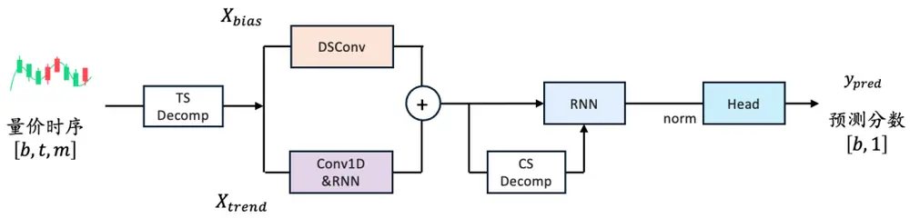
资料来源：华创证券

在线性 RNN 版本下，我们同样使用两层RNN：第一层线性 RNN 输出每个时间步的个股表征，我们使用市值作为分组特征，对股票进行20分组，在每个时间步上计算股票分组去均值结果，得到每个时点上包含截面信息的个股表征；第二层我们构建线性 RNN 变体，将截面信息和时序融合共同输入遗忘门、输出门中，它表示我们希望模型在决定每个时间步记住 / 遗忘多少信息时，同时考虑当前时点股票自身的特征，以及当前时点股票在截面的相对信息。

我们将改进的模型称为 DecompGRN。除 GRU 部分外，其余时序趋势分解与《DecompGRU》报告相同（见附录）。

下面我们对DecompGRN进行测试，对比基准为GRU模型，GRU层数为2并加入GLU。

## （一）IC及分组测试结果

回测区间：2018 年 1 月 1 日 ~ 2025 年 8 月 22 日；

以下图表展示了 IC以及分组测试的对比结果：

DecompGRN 在中证全指 / 沪深 300 / 中证 500 / 中证 1000 域内，10 日 RankIC 为0.141 / 0.099 / 0.098 / 0.127，RankICIR 分别为 1.26 / 0.65 / 0.77 / 1.08，均高于基线GRU 模型；

在多头 TOP 组表现上，中证全指 / 沪深 300 / 中证 500 / 中证 1000 域内，年化收益分别相比基线+5.28% / -0.64% / +0.73% / +1.88%。

图表 13 10 日 IC 统计结果

|  |  | GRU | DecompGRN |
| --- | --- | --- | --- |
| 中证全指 | RankIC | 0.133 | 0.141 |
|  | RankICIR | 1.15 | 1.26 |
|  | IC 胜率 | 0.88 | 0.89 |
| 沪深300 | RankIC | 0.096 | 0.099 |
|  | RankICIR | 0.63 | 0.65 |
|  | IC 胜率 | 0.74 | 0.74 |
| 中证500 | RankIC | 0.095 | 0.098 |
|  | RankICIR | 0.75 | 0.77 |
|  | IC 胜率 | 0.8 | 0.78 |
| 中证1000 | RankIC | 0.121 | 0.127 |
|  | RankICIR | 0.99 | 1.08 |
|  | IC 胜率 | 0.87 | 0.88 |

资料来源：wind，华创证券

图表 14 TOP组全区间绩效统计

|  | 模型 | 年化收益率(%) | 夏普比率 | 最大回撤(%) | 超额年化(%) | 平均单边换手 |
| --- | --- | --- | --- | --- | --- | --- |
| 中证全指 | GRU | 52.4 | 1.68 - | 33.09 | 50.91 | 0.8 |
|  | DecompGRN | 57.68 | 1.71 | -34.69 | 56.18 | 0.79 |
| 沪深300 | GRU | 32.33 | 1.49 | -18.86 | 31.63 | 0.65 |
|  | DecompGRN | 31.69 | 1.42 - | 26.88 | 31 | 0.65 |
| 中证500 | GRU | 26.17 | 1.08 - | 37.75 | 25.39 | 0.74 |
|  | DecompGRN | 26.9 | 1.1 | -37.82 | 26.13 | 0.74 |
| 中证1000 | GRU | 38.47 | 1.35 - | 34.57 | 38.14 | 0.75 |
|  | DecompGRN | 40.35 | 1.37 | -35.51 | 40.03 | 0.74 |

资料来源：wind，华创证券

图表 15 中证全指-所有分组年化收益对比
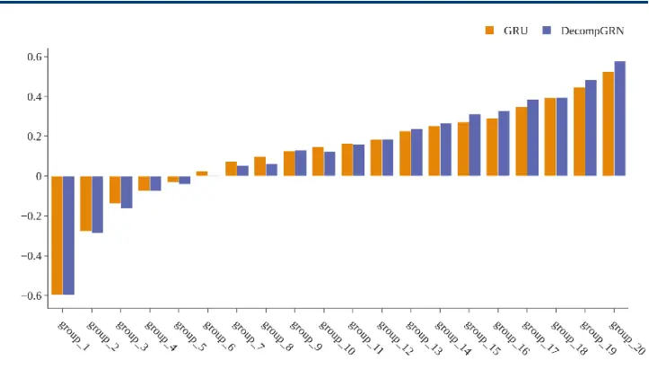
资料来源：wind，华创证券

图表 16 中证全指-TOP组超额走势对比
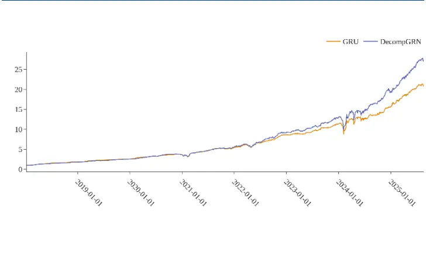
资料来源：wind，华创证券

图表 17 沪深 300-所有分组年化收益对比
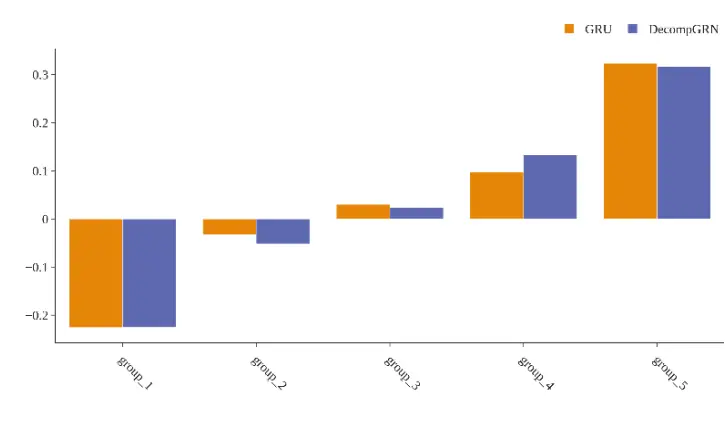
资料来源：wind，华创证券

图表 18 沪深300-TOP组超额走势对比
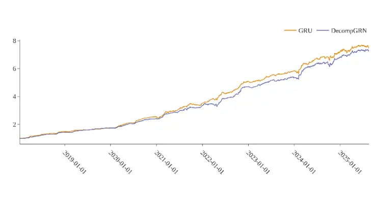
资料来源：wind，华创证券

图表 19 中证500-所有分组年化收益对比
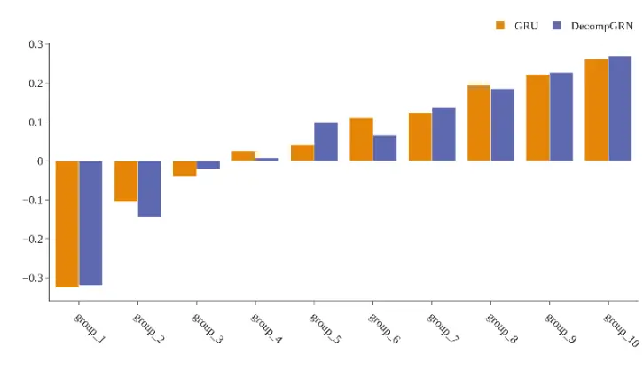
资料来源：wind，华创证券

图表 20 中证 500-TOP 组超额走势对比
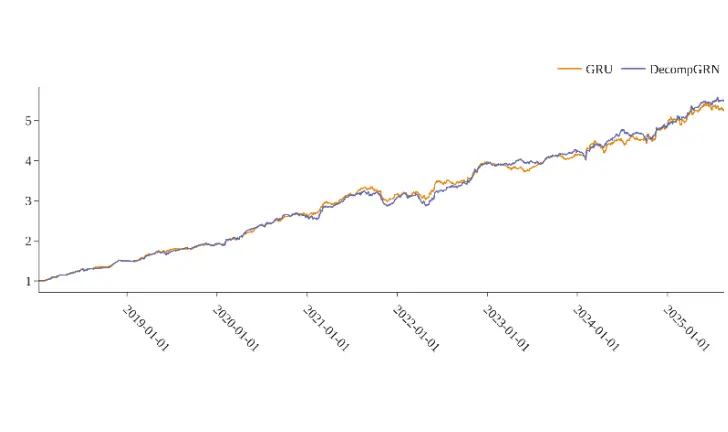
资料来源：wind，华创证券

图表 21 中证1000-所有分组年化收益对比
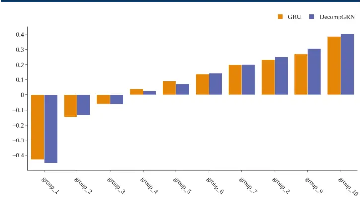
资料来源：wind，华创证券

图表 22 中证1000-TOP组超额走势对比
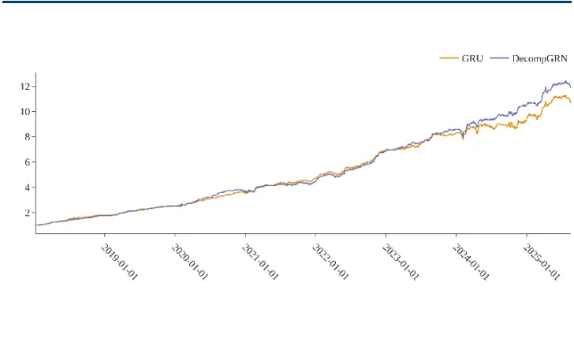
资料来源：wind，华创证券

经过我们简单改造的 DecompGRN 模型，性能较基线GRU取得了提高，而在参数量上仅为 GRU 基线模型的 43%，训练效率同样优于 GRU。DecompGRN 仍有拓展空间，例如加叠加 GLU 或增加不同机制门控等，我们在后续将继续探索。

## （二）指增测试

最后我们在沪深 300、中证500以及中证 1000上进行指增测试：

测试区间为 2019-01-01~2025-08-27；

约束条件为（1）指数成分股占比大于80%（2）单只股票权重相对偏离上限为0.8%（3）Barra风格暴露约束0.3，行业暴露约束0.02（5）换手约束双边 30%；

调仓频率为周频，以每周最后一个交易日计算的因子值在次周首个交易日进行调仓，成本按千3计算。

DecompGRN 在沪深 300 / 中证 500 / 中证 1000 指增组合的年化超额收益分别为 10.24%、10.05%、19.58%，跟踪误差分别为 5.07、6.1、6.75。2025 年，截至 8 月 27 日，沪深 300/ 中证 500 / 中证 1000 增强组合累计超额为 3.93% / 6.72% / 18.26%。

图表统计如下：

图表 23 沪深300指增超额走势
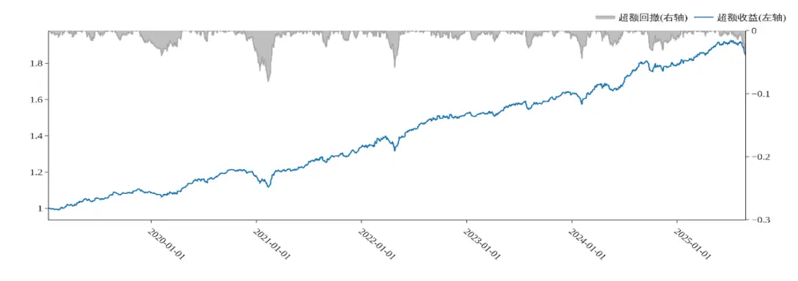
资料来源：wind，华创证券

图表 24 中证500指增超额走势
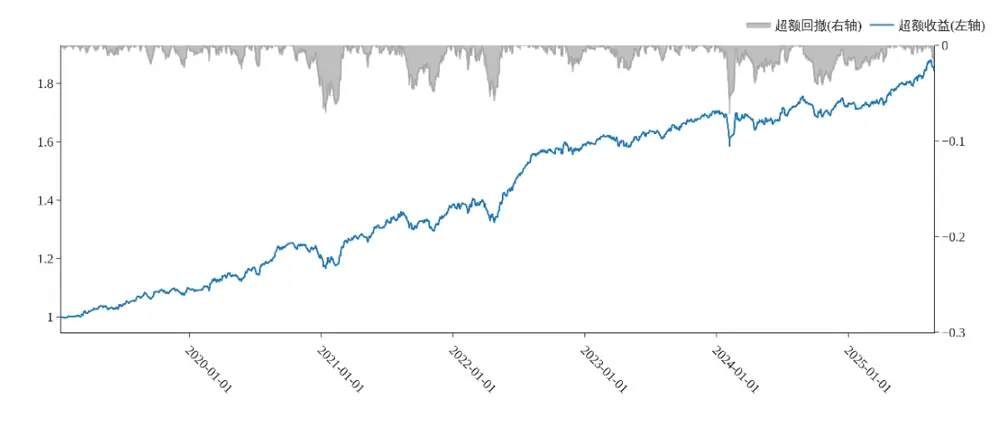
资料来源：wind，华创证券

图表 25 中证1000指增超额走势
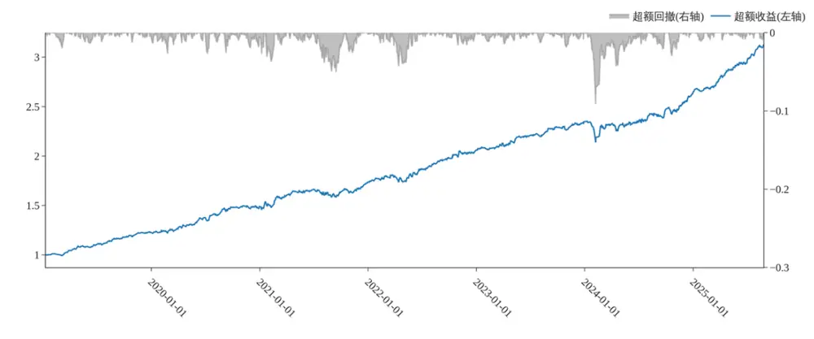
资料来源：wind，华创证券

图表 26 DecompGRN 模型指增组合超额统计

|  | 基准 | 全区间 | 2019 | 2020 | 2021 | 2022 | 2023 | 2024 | 2025-08-27 |
| --- | --- | --- | --- | --- | --- | --- | --- | --- | --- |
| 沪深300 | 超额收益(%) | 10.24 | 8.58 | 8.5 | 13.57 | 13.76 | 6.9 | 10.16 | 3.93 |
|  | 超额夏普 | 1.95 | 2.36 | 1.91 | 2.14 | 2.22 | 1.72 | 1.88 | 1.34 |
|  | 超额最大回撤(%) | -8.12 | -2 | -3.34 | -5.26 | -5.91 | -2.8 | -3.98 | -3.98 |
|  | Calmar 比率 | 1.26 | 4.56 | 2.64 | 2.68 | 2.43 | 2.57 | 2.66 | 1.6 |
| 中证500 | 超额收益(%) | 10.05 | 9.64 | 10.32 | 14.55 | 14.85 | 6.87 | 1.55 | 6.72 |
|  | 超额夏普 | 1.6 | 2.38 | 1.74 | 1.88 | 2.02 | 1.62 | 0.27 | 2.11 |
|  | 超额最大回撤(%) | -7.15 | -2.36 | -4.35 | -4.92 | -5.87 | -2.62 | -7.09 | -2.05 |
|  | Calmar 比率 | 1.41 | 4.34 | 2.47 | 3.08 | 2.64 | 2.73 | 0.23 | 5.3 |
| 中证1000 | 超额收益(%) | 19.58 | 22.74 | 21.14 | 16.63 | 18.69 | 14 | 12.78 | 18.26 |
|  | 超额夏普 | 2.68 | 4.71 | 2.92 | 1.86 | 2.54 | 2.94 | 1.55 | 5.52 |
|  | 超额最大回撤(%) | -9.11 | -1.95 | -2.7 | -5.04 | -4.28 | -1.86 | -9.11 | -1.07 |
|  | Calmar 比率 | 2.15 | 12.41 | 8.17 | 3.43 | 4.56 | 7.84 | 1.46 | 28.54 |

资料来源：wind，华创证券

## 五、总结

- 本篇报告我们提出了DecompGRN 模型，在先前报告的模型框架的基础上进行拓展；我们继续使用时序趋势分解模块将初始输入拆分为趋势与残差分量，再基于线性RNN改进截面信息建模方式，使时序和截面信息在和RNN 模型内部融合；

- 在 150D 数据集，GRU 模型作为对比基线进行测试；在中证全指 / 沪深 300 / 中证500 / 中证 1000 域内，DecompGRN 模型的 10 日 RankIC 为 0.141 / 0.099 / 0.098 /0.127，RankICIR 分别为 1.26 / 0.65 / 0.77 / 1.08，均高于基线 GRU 模型；

周度分组测试中，不计交易成本，TOP 组在全指域内年化收益达 57.68%；中证全指/ 沪深 300 / 中证 500 / 中证 1000 域内，年化收益分别相比基线+5.28% / -0.64% /+0.73% / +1.88%。

基于DecompGRN构建指增组合，在双边换手30%、千三交易成本下，沪深 300/ 中证 500 / 中证 1000 指增组合年化超额收益分别为 10.24%、10.05%、19.58%，2025 年截至 8 月 27 日，沪深 300 / 中证 500 / 中证 1000 增强组合累计超额分别为 3.93% /6.72% / 18.26%。

## 六、风险提示

策略基于历史数据回测，不保证未来数据的有效性。深度学习模型存在过拟合风险。深度学习模型受随机数影响。本文的模型实现和相关参考文献不完全相同。

## 七、参考文献

Van Der Westhuizen, Jos, and Joan Lasenby. "The unreasonable effectiveness of the forget gate." arXiv preprint arXiv:1804.04849 (2018).

Shazeer, Noam. "Glu variants improve transformer." arXiv preprint arXiv:2002.05202 (2020).

Qin, Zhen, Songlin Yang, and Yiran Zhong. "Hierarchically gated recurrent neural network for sequence modeling." Advances in Neural Information Processing Systems 36 (2023): 33202- 33221.

Orvieto, Antonio, et al. "Resurrecting recurrent neural networks for long sequences." International Conference on Machine Learning. PMLR, 2023.

Martin, Eric, and Chris Cundy. "Parallelizing linear recurrent neural nets over sequence length." arXiv preprint arXiv:1709.04057 (2017).

## 附录

## 1、DecompGRU 模型

以下是 DecompGRU 模型简要流程：

图表 27 DecompGRU 模型流程
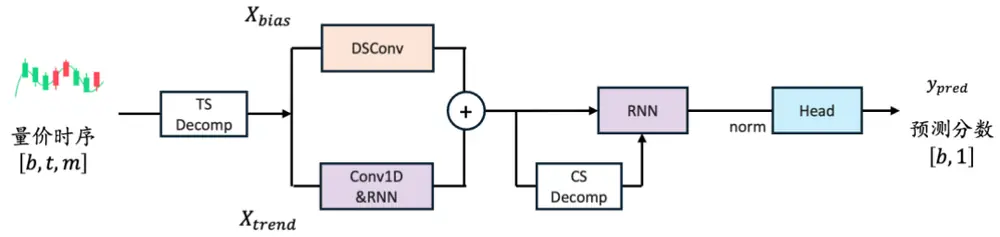
资料来源：通联数据，华创证券

在进入骨干网络前，输入拆分为趋势与残差分量：

$$
\begin{aligned}X_{trained}&=AvgPool\big(Padding(X)\big)\\&X_{res}=X-X_{trained}\end{aligned}
$$

上述过程表示将时序拆分为均线和均线偏离两项，对日频数据集，我们默认使用 5 日均线；对两个分量，我们采用不同的建模方式，并将股票截面信息交互放于趋势分支中。

## ⚫ 趋势分支

趋势分量输入 1D卷积 + GRU来实现时序编码，每个股票在每个时间步被编码为一个 d维的向量。

$$
X_{trend}=GRU\Big(Conv1D\big(X_{trend}\big)\Big)
$$

其中，1D 卷积无padding，卷积核大小等于步长，输出 $X_{trend}\in$ ℝb,t′,d

我们通过分组去均值来实现简单的截面维度信息交互，分组变量为市值暴露，分组数量设置为 20。

## ⚫ 残差分支

在残差分支我们使用更轻量的深度可分离卷积得到偏离分量的最终表征 $X_{resrepr}\in$ ℝb,t′,d 。

$$
X_{resrepr}=DSConv(X_{res})
$$

上述卷积层同样无padding，卷积核大小等于步长，因此残差分支输出形状与趋势分支相同。

最后，我们将趋势和残差分支的结果相加合并，输入第二个时序GRU编码器，取最后一个时间步的输出，将时序表征截面化，用线性预测头得到每个股票的最终得分：

$$
Y_{pred}=Linear\left(GRU\big(X_{trendrepr}+X_{resrepr}\big)\right)
$$

## ⚫ 多头加权 MSE

MSE对多头端权重放大：

$$
s=\mathrm{RELU}(y_{\mathrm{true}}-\tau)
$$

$$
w=1+\alpha(\sigma(\beta s)-0.5)
$$

$$
\mathcal{L}=w\cdot\left(y_{\mathrm{pred}}-y_{\mathrm{true}}\right)^{2}
$$

其中 $y_{pred}$ 为模型预测值， $y_{\mathrm{true}}$ 为经过标准化的 label，σ为 sigmoid，我们默认将阈值τ设置为 1.0，β设置为2.0；

## 2、DecompGRN vs DecompGRU

最后，我们测试本篇报告构建的 DecompGRN 模型与强基线 DecompGRU(2503)模型进行对比。我们首先在150D日频数据集上测试两个模型，损失函数为分别测试IC 以及加权MSE（权重上界为2.5）。

并不意外地，由于两个模型的数据输入、模型搭建思路一致，两个因子相关性以及风格倾向上高度相似：

图表 28 模型打分风格相关性
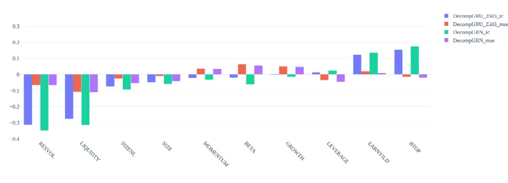
资料来源：通联数据，华创证券

图表 29 因子打分相关性

|  | DecompGRU-2503-ic | DecompGRU-2503-mse | DecompGRN-ic | DecompGRN-mse |
| --- | --- | --- | --- | --- |
| DecompGRU-2503-ic | 1 | 0.81 | 0.85 | 0.78 |
| DecompGRU-2503-mse | 0.81 | 1 | 0.74 | 0.83 |
| DecompGRN-ic | 0.85 | 0.74 | 1 | 0.81 |
| DecompGRN-mse | 0.78 | 0.83 | 0.81 | 1 |

资料来源：华创证券

图表 30 TOP组绩效统计（150日数据集）

|  | 模型 | 损失函数 | 年化收益率(%) | 夏普比率 | 最大回撤(%) | 超额年化(%) | 平均单边换手 |
| --- | --- | --- | --- | --- | --- | --- | --- |
| 中证全指 | DecompGRU-2503 | IC | 56.95 | 1.7 | -33.63 | 55.45 | 0.79 |
|  | DecompGRN |  | 57.68 | 1.71 | -34.69 | 56.18 | 0.79 |
|  | DecompGRU-2503 | MSE | 47.88 | 1.46 | -35.89 | 46.38 | 0.79 |
|  | DecompGRN |  | 54.44 | 1.6 | -36.21 | 52.94 | 0.8 |
| 沪深300 | DecompGRU-2503 | IC | 30.33 | 1.34 | -24.53 | 29.63 | 0.63 |
|  | DecompGRN |  | 31.69 | 1.42 | -26.88 | 31 | 0.65 |
|  | DecompGRU-2503 | MSE | 28.51 | 1.19 | -28.21 | 27.81 | 0.63 |
|  | DecompGRN |  | 27.97 | 1.17 | -34.07 | 27.27 | 0.63 |
| 中证500 | DecompGRU-2503 | IC | 30.03 | 1.16 | -39.15 | 29.25 | 0.74 |
|  | DecompGRN |  | 26.9 | 1.1 | -37.82 | 26.13 | 0.74 |
|  | DecompGRU-2503 | MSE | 27.59 | 1.04 | -39.9 | 26.82 | 0.73 |
|  | DecompGRN |  | 30.18 | 1.12 | -39.28 | 29.4 | 0.74 |
| 中证1000 | DecompGRU-2503 | IC | 41.82 | 1.38 | -36.61 | 41.5 | 0.74 |
|  | DecompGRN |  | 40.35 | 1.37 | -35.51 | 40.03 | 0.74 |
|  | DecompGRU-2503 | MSE | 33.4 | 1.13 | -41.46 | 33.07 | 0.74 |
|  | DecompGRN |  | 38.89 | 1.27 | -38.05 | 38.56 | 0.74 |

资料来源：华创证券

对 150日日频数据集，同样使用IC做为损失函数时，除 500域内DecompGRN 弱于DecompGRU，其余选股域内均无明显差异；

使用 MSE作为损失函数训练高波模型时，DecompGRN 综合表现更优，除300域略低于基线外，在全指、500、1000域内，相对提高在2.4%~6.5%。

我们继续评估两个模型在更长序列的表现。我们使用30分钟K线数据集，回溯 35 个交易日，总序列长度为280；损失函数固定为IC；超参数中，趋势分解 MA设置为 16，卷积核大小设置为 8，其余设置同日频数据集。

在此数据集上，DecompGRN 在大多指标上取得了强于基线模型的表现：

图表 31 TOP组绩效统计（30分钟数据集）

|  | 模型 | 损失函数 | 年化收益率(%) | 夏普比率 | 最大回撤(%) | 超额年化(%) | 平均单边换手 |
| --- | --- | --- | --- | --- | --- | --- | --- |
| 中证全指 | DecompGRU-2503 | IC | 41.96 | 1.37 | -38.96 | 34.32 | 0.84 |
|  | DecompGRN |  | 46.12 | 1.51 | -40.55 | 38.48 | 0.85 |
| 沪深300 | DecompGRU-2503 | IC | 29.3 | 1.27 | -32.17 | 23.49 | 0.71 |
|  | DecompGRN |  | 36.38 | 1.56 - | 25.62 | 30.57 | 0.71 |
| 中证500 | DecompGRU-2503 | IC | 22.15 | 0.92 - | 42.21 | 14.6 | 0.8 |
|  | DecompGRN |  | 27.82 | 1.12 | -38.5 | 20.27 | 0.79 |
| 中证1000 | DecompGRU-2503 | IC | 28.79 | 1.05 | -44.12 | 21.12 | 0.79 |
|  | DecompGRN |  | 37.4 | 1.31 | -38.75 | 29.73 | 0.79 |

资料来源：华创证券

综上结果，DecompGRN 模型从实现上看是简化版的DecompGRU，主干部分参数量为仅为DecompGRU 的65%左右，而测试结果表明，两个模型处于同一水平，在部分测试中，DecompGRN 甚至显著超越了基线模型，注意到使用另类损失函数时，DecompGRN 的表现更优，且在长序列中也好于基线，都表明了简化模型潜力，我们在后续工作中继续探索模型上限。

## 金融工程组团队介绍

组长、首席分析师：王小川同济大学管理学博士。2017年加入华创证券研究所。

助理研究员：黄河东华大学工学博士，FRM。2023年加入华创证券研究所。

助理研究员：洪远华南理工大学金融硕士。2023年加入华创证券研究所。

助理研究员：刘依凡上海财经大学金融统计博士。2024年加入华创证券研究所。

## 华创证券机构销售通讯录

| 地区 | 姓名 | 职务 | 办公电话 | 企业邮箱 |
| --- | --- | --- | --- | --- |
| 北京机构销售部 | 张昱洁 | 副总经理、北京机构销售总监 010 | -63214682 | zhangyujie@hcyjs.com |
|  | 张菲菲 | 北京机构副总监 | 010-63214682 | zhangfeifei@hcyjs.com |
|  | 张婷 | 华北机构销售副总监 |  | zhangting3@hcyjs.com |
|  | 刘懿 | 副总监 | 010-63214682 | liuyi@hcyjs.com |
|  | 侯春钰 | 资深销售经理 | 010-63214682 | houchunyu@hcyjs.com |
|  | 顾翎蓝 | 资深销售经理 | 010-63214682 | gulinglan@hcyjs.com |
|  | 蔡依林 | 资深销售经理 | 010-66500808 | caiyilin@hcyjs.com |
|  | 刘颖 | 资深销售经理 | 010-66500821 | liuying5@hcyjs.com |
|  | 阎星宇 | 销售经理 |  | yanxingyu@hcyjs.com |
|  | 车一哲 | 销售经理 |  | cheyizhe@hcyjs.com |
|  | 吴昱颖 | 销售经理 |  | wuyuying@hcyjs.com |
| 深圳机构销售部 | 张娟 | 副总经理、深圳机构销售总监 | 0755-82828570 | zhangjuan@hcyjs.com |
|  | 张嘉慧 | 高级销售经理 | 0755-82756804 | zhangjiahuil@hcyjs.com |
|  | 王春丽 | 高级销售经理 | 0755-82871425 | wangchunli@hcyjs.com |
|  | 王越 | 高级销售经理 |  | wangyue5@hcyjs.com |
|  | 汪丽燕 | 销售经理 | 0755-83715428 | wangliyan@hcyjs.com |
|  | 温雅迪 | 销售经理 |  | wenyadi@hcyjs.com |
|  | 胡丁琳 | 销售助理 |  | hudinglin@hcyjs.com |
|  | 付雅琦 | 销售助理 |  | fuyaqi@hcyjs.com |
|  | 许馨匀 | 销售助理 |  | xuxinyun@hcyjs.com |
| 上海机构销售部 | 许彩霞 | 总经理助理、上海机构销售总监0 | 21-20572536 | xucaixia@hcyjs.com |
|  | 官逸超 | 上海机构销售副总监 | 021-20572555 | guanyichao@hcyjs.com |
|  | 祁继春 | 副总监 |  | qijichun@hcyjs.com |
|  | 黄畅 | 上海机构销售副总监 | 021-20572257-2552 | huangchang@hcyjs.com |
|  | 吴俊 | 资深销售经理 | 021-20572506 | wujun1@hcyjs.com |
|  | 张佳妮 | 资深销售经理 | 021-20572585 | zhangjiani@hcyjs.com |
|  | 郭静怡 | 高级销售经理 |  | guojingyi@hcyjs.com |
|  | 蒋瑜 | 高级销售经理 | 021-20572509 | jiangyu@hcyjs.com |
|  | 吴菲阳 | 高级销售经理 |  | wufeiyang@hcyjs.com |
|  | 朱涨雨 | 高级销售经理 | 021-20572573 | zhuzhangyu@hcyjs.com |
|  | 李凯月 | 高级销售经理 |  | likaiyue@hcyjs.com |
|  | 张豫蜀 | 销售经理 | 15301633144 | zhangyushu@hcyjs.com |
|  | 张玉恒 | 销售经理 |  | zhangyuheng@hcyjs.com |
|  | 章依若 | 销售经理 |  | zhangyiruo@hcyjs.com |
| 广州机构销售部 | 段佳音 | 广州机构销售总监 | 0755-82756805 | duanjiayin@hcyjs.com |
|  | 王世韬 | 销售经理 |  | wangshitao1@hcyjs.com |
| 私募销售组 | 潘亚琪 | 总监 | 021-20572559 | panyaqi@hcyjs.com |
|  | 汪子阳 | 副总监 | 021-20572559 | wangziyang@hcyjs.com |
|  | 江赛专 | 副总监 | 0755-82756805 | jiangsaizhuan@hcyjs.com |
|  | 汪戈 | 高级销售经理 | 021-20572559 | wangge@hcyjs.com |
|  | 宋丹玙 | 销售经理 | 021-25072549 | songdanyu@hcyjs.com |
|  | 赵毅 | 销售经理 |  | zhaoyi@hcyjs.com |

## 华创行业公司投资评级体系

基准指数说明：

A 股市场基准为沪深 300 指数，香港市场基准为恒生指数，美国市场基准为标普 500/纳斯达克指数。

公司投资评级说明：

强推：预期未来 6 个月内超越基准指数 20%以上；

推荐：预期未来 6 个月内超越基准指数 10%－20%；

中性：预期未来 6 个月内相对基准指数变动幅度在-10%－10%之间；

回避：预期未来 6 个月内相对基准指数跌幅在 10%－20%之间。

## 行业投资评级说明：

推荐：预期未来 3-6 个月内该行业指数涨幅超过基准指数 5%以上；

中性：预期未来 3-6 个月内该行业指数变动幅度相对基准指数-5%－5%；

回避：预期未来 3-6 个月内该行业指数跌幅超过基准指数 5%以上。

## 分析师声明

每位负责撰写本研究报告全部或部分内容的分析师在此作以下声明：

分析师在本报告中对所提及的证券或发行人发表的任何建议和观点均准确地反映了其个人对该证券或发行人的看法和判断；分析师对任何其他券商发布的所有可能存在雷同的研究报告不负有任何直接或者间接的可能责任。

## 免责声明

本报告仅供华创证券有限责任公司（以下简称“本公司”）的客户使用。本公司不会因接收人收到本报告而视其为客户。

本报告所载资料的来源被认为是可靠的，但本公司不保证其准确性或完整性。本报告所载的资料、意见及推测仅反映本公司于发布本报告当日的判断。在不同时期，本公司可发出与本报告所载资料、意见及推测不一致的报告。本公司在知晓范围内履行披露义务。

报告中的内容和意见仅供参考，并不构成本公司对具体证券买卖的出价或询价。本报告所载信息不构成对所涉及证券的个人投资建议，也未考虑到个别客户特殊的投资目标、财务状况或需求。客户应考虑本报告中的任何意见或建议是否符合其特定状况，自主作出投资决策并自行承担投资风险，任何形式的分享证券投资收益或者分担证券投资损失的书面或口头承诺均为无效。本报告中提及的投资价格和价值以及这些投资带来的预期收入可能会波动。

本报告版权仅为本公司所有，本公司对本报告保留一切权利。未经本公司事先书面许可，任何机构和个人不得以任何形式翻版、复制、发表、转发或引用本报告的任何部分。如征得本公司许可进行引用、刊发的，需在允许的范围内使用，并注明出处为“华创证券研究”，且不得对本报告进行任何有悖原意的引用、删节和修改。

证券市场是一个风险无时不在的市场，请您务必对盈亏风险有清醒的认识，认真考虑是否进行证券交易。市场有风险，投资需谨慎。

## 华创证券研究所

| 北京总部 | 广深分部 | 上海分部 |
| --- | --- | --- |
| 地址：北京市西城区锦什坊街26号恒奥中心C 座 3A邮编：100033传真：010-66500801会议室：010-66500900 | 地址：深圳市福田区香梅路1061号中投国际商务中心A 座19楼邮编：518034传真：0755-82027731会议室：0755-82828562 | 地址：上海市浦东新区花园石桥路33号花旗大厦 12 层邮编：200120传真：021-20572500会议室：021-20572522 |