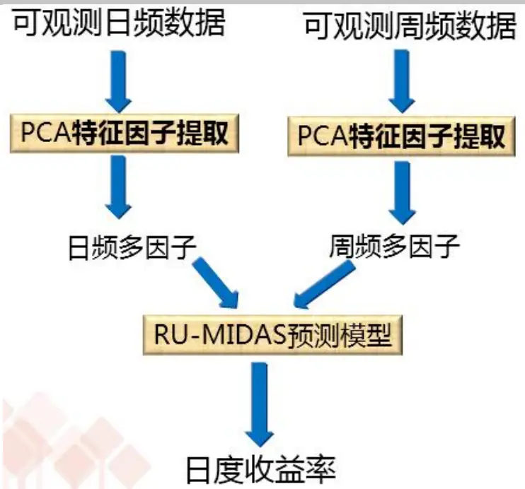
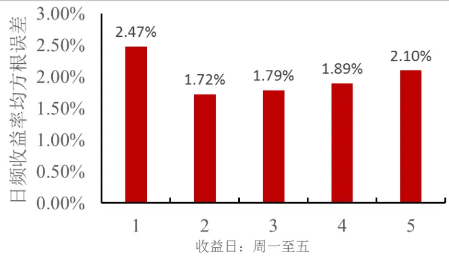
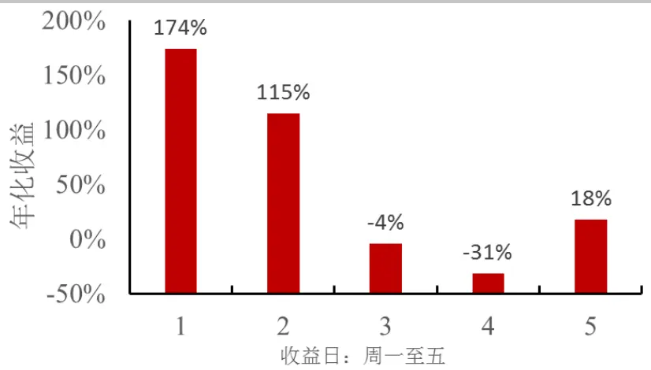
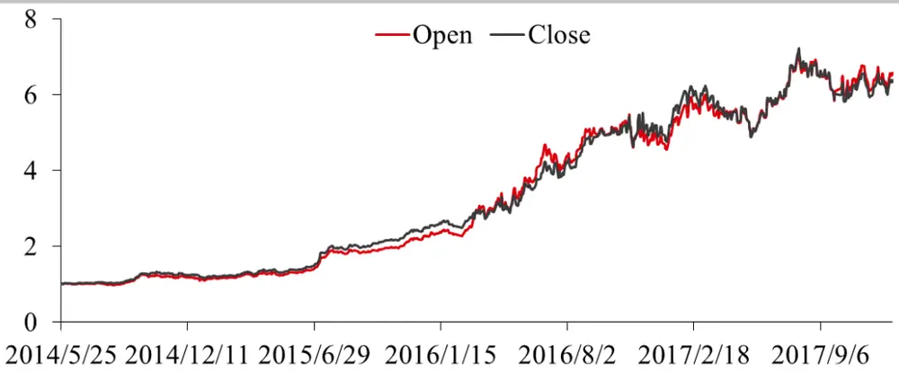
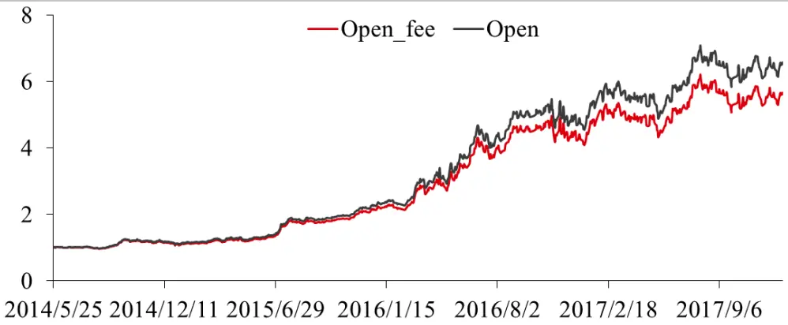

## 华泰期货量化专题报告：

华泰期货研究所 量化策略组

陈维嘉

## 利用混频 RU-MIDAS 多因子模型预测期货日频收益率

量化研究员

- 0755-23991517

RU-MIDAS 多因子模型简介

- chenweijia@htfc.com

从业资格号：T236848

金融时间序列通常通常包含多个维度，不同维度数据的采样频率也不一致。例如螺纹钢研究员通常关心螺纹钢的因素有日频更新的现货螺纹钢价格，周频更新的螺纹钢库存，高炉开工率和线螺采购量。如果其中某些可观测因子发生了变化，投资者对未来螺纹钢期货涨跌的预期也应发生变化，但是如何处理这些不同频率的数据是量化模型的一大难题。一种比较简单直接的方法就是降低数据的采样频率，例如把日频数据统一为周频（甚至更低如月频），再基于周频数据进行预测。但这种方法的缺点也很明显，期货本身波动就比较大，通过低频采样的数据只能按低频预测的结果来交易，如果在一周中期货价格发生了大变，也无法根据量化模型做出合理的应对。

投资咨询号：TZ012046

本报告介绍一种可利用低频数据预测高频数据的时间序列模型: RU-MIDAS (ReverseUntricted Mixed Data Sampling)，中文可以译作反面无限制混合数据采样模型，这种模型是Eric Ghysels 等人研究的MIDAS模型的反向应用， MIDAS模型则是利用高频数据预测低频数据，而 RU-MIDAS则是利用低频数据预测高频数据，因此被称为反面。另外 MIDAS模型引入了多项式函数来代替延时参数，而 RU-MIDAS 模型则没有引入多项是所以被称为无限制。RU-MIDAS 模型首先由 Claudia Foroni 等人在论文 Using Low FrequencyInformation for Predicting High Frequency Variables 中提出。原文作者使用的是单因子模型，而在本报告中则在此基础上扩展为多因子模型，希望通过多因子的引入和交易频率的提高来规避中长策略低频调仓可能出现的回撤。

在本报告里首先介绍了 RU-MIDAS 模型的原理和结构，然后尝试利用周频和日频的螺纹钢因子数据对螺纹钢期货主力数据进行预测，发现这种模型在处理混频数据上能取得不错的效果。

## RU-MIDAS 研究背景

基本面研究员在预测期货未来走势时通常会考察不同时间频率的信息，例如反映通涨的居民消费价格指数(CPI)，商品进出口增长，周频的商品库存以及日频的现货价格、期货价格等等。然而目前的量化模型大多数都只使用了相同频率数据的信息，例如按周频调仓的模型就只是用周频数据，日频数据通常会被降为周频，而月频数据往往就会被直接忽略掉。从数据频率的角度上说，量化模型所考虑的信息会比基本面研究员考虑的要少，这也往往是量化模型的不足之处。一个按周频调仓的量化模型，如果在一周内期货价格发生了不利于投资者的剧烈波动，那模型使用者则需要根据自己的风险承受能力来决定是否承担浮亏或者止损离场，又或者借助投资经验和主观判断来进行投资决策。这种决策虽然不无道理，但往往会导致投资过程变为量化加主观，投资收益也无法进行合理回测。出现以上困难的主要原因在于量化模型无法及时提供不同时间周期的预测。因此本报告试图结合不同时间频率的数据对期货未来收益进行预测。

大量学术研究表明，利用高频变量能够有效提高低频变量的预测准确性。Eric Ghysels等人研究的 MIDAS(Mi(xed) Da(ta) S(ampling))模型就是混频数据预测领域的代表之一，这种方法原理比较简单，如下式所示

$$
Y_{t+1}^{Q}=\mu+\sum_{j=0}^{p_{Y}^{Q}-1}\alpha_{j+1}Y_{t-j}^{Q}+\beta\sum_{j=0}^{q_{X}^{Q}-1}\sum_{i=0}^{N_{D}-1}w_{i+j*N_{D}}(\theta^{D})X_{N_{D}-i,t-j}^{D}+\varepsilon_{t+1}\tag{1}
$$

其中 $Y_{t}^{Q}$ 是低频变量， $X_{t}^{Q}$ 是高频变量， $p_{Y}^{Q}$ 为低频变量的延时， $p_{X}^{Q}$ 为高频变量的延时， $\mu$ 为截距， $\varepsilon_{t+1}$ 是误差项。高频变量 $X_{t}^{Q}$ 前的系数使用了多项式 $w_{i+j*N_{D}}(\theta^{D})$ 表示，原本这些系数都是待校正参数，但是由于使用了多项式 $w_{i+j*N_{D}}(\theta^{D})$ ，待校正参数的数量就大大降低了，从而有效防止参数过多造成的模型过度拟合。MIDAS模型通常使用在利用高频数据预测季频 GDP 上。在相同领域预测比较成功的还有状态空间(state-space)模型，但这种模型实现比较复杂，MIDAS 在 GDP 上的预测效果通常不会比状态空间模型差很多。

目前学术界在混频预测上研究得比较多的仍然是如何利用高频变量预测低频变量，但是在期货交易上不少投资者更关心的可能是投资策略的短期回撤，而非长期回报。如果期货市场波动剧烈，偏高频的投资策略往往回撤更小，这就要求量化模型对高频变量有一定预测能力。目前学术界的量化模型在利用低频变量预测高频变量上的研究并不多，本报告主要参考 Claudia Foroni 等人在 Using Low Frequency Information for Predicting High FrequencyVariables 上提出的RU-MIDAS模型，进行改进，尝试利用螺纹钢的周频基本面数据预测螺纹钢主力期货的日频收益率。

## RU-MIDAS 原理

Claudia Foroni 等人首先研究的是 U-MIDAS 模型，这种模型也是利用低频变量预测高频变量,但是 Claudia Foroni 等人发现如果预测的低频变量与高频变量相比，频率相差不大，例如季频和月频的混合，则在公式(1)中多项式 ${}_{\mathcal{W}_{i+j*N_{D}}}(\theta^{D})$ 的使用反而降低模型的预测效果，因为多项式 ${}_{\cdot}w_{i+j\ast N_{D}}(\theta^{D})$ 本身通常至少包含两个自由参数，而不使用多项式的话季频和月频的混合则只有 3个参数。但是如果是日频和季频混合，周频和季频混合，则使用 MIDAS多项式 $w_{i+j*N_{D}}(\theta^{D})$ 效果更佳。在目前的期货交易中，本报告研究的是日频和周频数据混合，大多数情况下一周有 5个交易日，比季频和月频混合包含的高频数据量(3个)略多，但是比周频和季频混合的高频数据量(12 个)要小，所以本报告先尝试不使用 MIDAS 多项式$w_{i+j*N_{D}}(\theta^{D})$ ，而是直接校正其中的高频权重系数,所以使用的是无限制(Unrestricted)MIDAS模型。但因为是利用低频数据预测高频数据，与大多数研究的方向相反，所以被称为反面(Reverse)，合起来即为 RU-MIDAS 模型。

Claudia Foroni 等人研究的是单因子 RU-MIDAS 模型，其其形式与公式(1)类似，只是反过来用，其表示形式如下

$$
\tilde{a}_{i}(L)x_{t}=b_{i}\bigl(L^{k-i}\bigr)y_{t}+\xi_{it}\tag{2}
$$

其中 $x_{t}$ 为高频变量， $y_{t}$ 为低频变量。 $\begin{array}{r}{t=0+\frac{i}{k},1+\frac{i}{k},2+\frac{i}{k},\ldots;i=0,\ldots,k-1}\end{array}$ 。k为低频变量包含的高频变量周期数，例如当周频和日频混合时k = 5。 $\tilde{a}_{i}(L)$ 和 $\boldsymbol{\imath}b_{i}\big(\boldsymbol{L}^{k-i}\big)$ 为延时线性多项式，例如 $\tilde{a}_{i}(L)=\tilde{a}_{i1}L+\tilde{a}_{i2}L^{2}+\cdots\tilde{a}_{ip}L^{p}$ 。因此 $\tilde{\alpha}_{i}(L)$ 和 $\cdot b_{i}\big(L^{k-i}\big)$ 都包含周期结构，即周一至周五都有不同的多项式系数。L为高频延时算子， $L^{j}x_{t}=x_{t-j/k}c$ 。值得注意的是在应用中 $b_{i}\big(L^{k-i}\big)$ 的选择可以使得 $\cdot b_{i}(L^{k-i})y_{t}$ 只包含 $y_{t}$ 的低频项，即无需通过插值等方法从低频的 $y_{t}$ 获得高频的 $y_{t}^{*}$ 。这个模型的本质是认为当延时足够大时，高频变量 $x_{t}$ 可以看作是一个自回归 $\operatorname{AR}(p)$ 过程，而低频变量 $y_{t}$ 则被看作是外生变量。

公式(2)的推导可以简单总结如下：假设可观测的低频变量 $y_{t}$ 在高频时间段内存在一个对应的值 $y_{t}^{*}$ ，但是这个值只有在特定的时间段才能被观测得到，其可观测的时间间隔为k，$y_{t}$ 可表示为 $y_{t}=\omega(L)y_{t}^{*}=y_{t}^{*}+y_{t-1/k}^{*}+y_{t-2/k}^{*}+\cdots y_{t-(k-1)/k}^{*}\circ$ 。这里首先假设 $x_{t}$ 是一个自回归 $\mathrm{AR}(p)$ 过程而相应的高频变量y∗则为外生变量:

$$
c(L)x_{t}=d(L)y_{t}^{\ast}+e_{xt}\tag{3}
$$

接着 Claudia Foroni 等人认为存在一个多项式 $\dot{\gamma}_{i}(L)$ 使得 $\gamma_{i}(L)d(L)\omega(L)y_{t}^{*}=g_{i}(L^{k-i})y_{t}$ ,注意这个多项式 ${\mathbf{\Omega}}_{\mathcal{N}_{i}}(L)$ 在每一个高频周期 $i=0,\ldots,k-1$ 都有不同取值，从而使得 $g_{i}(L^{k-i})y_{t}$ 只与可观测的低频变量 $y_{t}$ 有关而与不可观测的高频yt∗无关。然后在公式(3)的左右两边同时乘以$\gamma_{i}(L)\omega(L)$ 则可得到公式(2)，即 $\widetilde{a}_{i}(L)=\gamma_{i}(L)c(L)\omega(L),\ b_{i}\big(L^{k-i}\big)=\gamma_{i}(L)d(L)\omega(L)$ 。当延时足够大时 $\xi_{it}=\gamma_{i}(L)\omega(L)e_{xt}$ 就可以看作是白噪声了。

从公式(2)中的MIDAS单因子模型构造多因子还是比较直接的，可用如下公式表示

$$
\tilde{A}_{i}(L)X_{t}=b_{i}\bigl(L^{k-i}\bigr)Y_{t}+\xi_{it}\tag{4}
$$

其中 $X_{t}$ 为高频变量向量， $Y_{t}$ 为低频变量向量， $\tilde{A}_{i}(L)$ 为周期矩阵, $b_{i}\big(L^{k-i}\big)$ 为周期向量，由于考虑到高频变量之间的协相关性，公式(4)可用广义最小二乘法 GLS进行参数估计。

## RU-MIDAS 应用实例

在这一节里尝试使用 RU-MIDAS 预测螺纹钢期货主力合约的日频收益率。预测是基于每周发布的螺纹钢库存、高炉开工率和钢厂产能等因子以及日度发布的螺纹钢、铁矿石、焦煤日收益率等因子。由于可观测因子的个数较多，这里先使用主成分分析(PrincinpleComponents Analysis, PCA)进行降维处理，得到的模型结构可以用下图表示

图 1：RU-MIDAS 模型结构

数据来源：华泰期货研究院

首先从 Wind 上获取螺纹钢相关的可观测数据，然后对日频和周频数据分别进行 PCA转换，提取出主成份，然后把日频主成份 $X_{t}$ 和周频主成份 $Y_{t}$ 分别放入 RU-MIDAS 模型的高频变量和低频变量当中进行模型训练。由于模型参数较多所以训练方式使用递进法，即每过一周便把新一周归入样本中，所以随着时间增加，训练的样本数量也将不断增加。每训练完一周即保持模型参数，在下一周的每个交易日进行日频收益率的预测。低频变量在每周五预测下周一收益率时进行更新，在周二至周四预测时不更新周频变量，而高频变量则在每日预测时都会更新。模型包含的超参数包括低频、高频变量的因子个数和延时等，这些超参数跟据样本外的预测效果进行选择。

由于 RU-MIDAS 模型包含周期结构，这里首先考察该模型在周一至周五螺纹钢开盘价收益率预测的均方根误差。由图 2：可以看出预测周一的日度收益率误差最大为 2.47%，这可能是因为隔了周六日，市场未来走势的分歧较大，所以预测收益率准确度不高。但是周二收益率的误差随即下降，然后逐渐升高，这可能是因为使用了周频因子作为固定的外生变量，随着时间的流逝该部分信息逐步被市场消化，从而导致预测效果逐渐变差。从整体上看 RU-MIDAS 预测的均方根误差在 2%左右，处在较高水平，也说明了准确预测日度收益率非常困难，因此在预测结构的实际应用上只取收益率的正负号，正则做多，负则做空效果可能更好。

图 2：RU-MIDAS 日频收益率均方根误差

数据来源：华泰期货研究院

虽然预测误差较大，但使用 RU-MIDAS 模型仍能获得正收益，图 3：列出了该部分收益在周一至周五的分布，虽然预测周一的均方根误差较大，但是RU-MIDAS模型的主要收益来自于周一，年化高达 174%，其次是周二的收益，而周三和周四的平均年化收益均为负值，周五的收益则仍为正值。对比图 2：和图 3：可见预测收益的准确率与实际收益关系并不明显，这主要是因为收益率的预测准确度并不高。

图 3：RU-MIDAS 在不同交易日的年化收益

数据来源：华泰期货研究院

RU-MIDAS 模型应的预测数据全部使用每个交易日的收盘价，这里尝试分别使用当天收盘价和隔天开盘价进行交易。净值曲线如图 4：所示，从中可见这两条净值曲线的走势是非常接近的，某些时候使用开盘价交易收益反而更高，例如 2016年 7月的时间段。由于RU-MIDAS 使用了基本面数据，而Wind上的数据库更新通常在期货收盘后进行，因此实际上使用 RU-MIDAS模型是无法利用当天收盘价交易的，这里把使用当天收盘价和隔天开盘价交易进行对比是为了说明 RU-MIDAS模型对交易价格并不会十分敏感，也从另一个角度说明这个策略受滑点影响并不大。另外在2014年5月至 2017年 12月这段时间里，相邻两个交易日仓位改变方向的频率也并不大，只有 42.24%，平均持仓时间在 2-3 天。这也是造成该策略对具体交易价格不敏感的原因之一。

图 4：螺纹钢 RU-MIDAS 策略分别使用开盘价和收盘价交易的净值曲线

数据来源：华泰期货研究院

由于 RU-MIDAS 属于日频策略，图 5：对比了考虑交易费用后收益曲线的变化，这里的交易费用设定为为单边万分之二，从中可以看出由于交易费用的存在策略收益有了一定下降，但是幅度不会太大。

图 5：螺纹钢 RU-MIDAS 策略考虑交易费用后的净值曲线

数据来源：华泰期货研究院

螺纹钢RU-MIDAS策略的表现统计如下表格1所示，当有交易费用存在时年化收益从53.34%下降到 49.11%，交易费用大概为年化 4.2%，所占比例资金总额的比例较大。如果 RU-MIDAS 策略总体收益不高的情况下交易费用影响会比较明显，但在螺纹钢这个品种上，即使考虑了交易费用，年化收益仍有 49.11%。考虑交易费用后策略的胜率也不高，只有 0.539，但由于是日频策略交易机会较多，图 5：中的收益曲线仍然呈稳定上升的趋势，所以能达到较高的夏普率 1.64。但是由于是单品种的策略最大回撤达到 19.2%，主要发生在 2017 年 3 月至 5 月底，回撤期达到49 个交易日。如果该模型能应用到多品种上，相信整体组合回撤会有所减少。

表格 1 螺纹钢 RU-MIDAS 策略收益与风险统计

|  | 无交易费用 | 有交易费用 |
| --- | --- | --- |
| 年化收益 | 53.34% | 49.11% |
| 年化波动率 | 0.3 | 0.299 |
| 夏普率 | 1.78 | 1.64 |
| 胜率 | 0.542 | 0.539 |
| 最大回撤 | 18.6% | 19.2% |
| 最大回撤期 | 49交易日 | 49交易日 |

数据来源：华泰期货研究院

## 结果讨论

本报告首先对 Claudia Foroni 等人提出的 RU-MIDAS 模型进行了基本介绍，包括其原理、框架以及推导方法等。这种模型主要是为了适应包含两个不同频率的金融时间序列，其主要原理是用自回归过程刻画高频变量同时把低频变量看作是外生变量，然后根据高频变量的周期性使用不同的参数组合进行模型拟合。原作者只考虑了单高频因子和单低频因子的情况，而本专题报告则把 RU-MIDAS 模型扩展到多因子的情况。在本报告里尝试使用了螺纹钢日频数据和周频数据来训练 RU-MIDAS 模型，成功利用低频基本面数据提高了高频变量的预测效果，利用该模型交易的收益也比较可观。

虽然该模型表现效果不错，但在该模型中把低频变量看作是外生变量的合理性仍然值得讨论，试图把低频变量处理成内生变量也是目前该模型进一步改进的方向之一。

## 免责声明

此报告并非针对或意图送发给或为任何就送发、发布、可得到或使用此报告而使华泰期货有限公司违反当地的法律或法规或可致使华泰期货有限公司受制于的法律或法规的任何地区、国家或其它管辖区域的公民或居民。除非另有显示，否则所有此报告中的材料的版权均属华泰期货有限公司。未经华泰期货有限公司事先书面授权下，不得更改或以任何方式发送、复印此报告的材料、内容或其复印本予任何其它人。所有于此报告中使用的商标、服务标记及标记均为华泰期货有限公司的商标、服务标记及标记。

此报告所载的资料、工具及材料只提供给阁下作查照之用。此报告的内容并不构成对任何人的投资建议，而华泰期货有限公司不会因接收人收到此报告而视他们为其客户。

此报告所载资料的来源及观点的出处皆被华泰期货有限公司认为可靠，但华泰期货有限公司不能担保其准确性或完整性，而华泰期货有限公司不对因使用此报告的材料而引致的损失而负任何责任。并不能依靠此报告以取代行使独立判断。华泰期货有限公司可发出其它与本报告所载资料不一致及有不同结论的报告。本报告及该等报告反映编写分析员的不同设想、见解及分析方法。为免生疑，本报告所载的观点并不代表华泰期货有限公司，或任何其附属或联营公司的立场。

此报告中所指的投资及服务可能不适合阁下，我们建议阁下如有任何疑问应咨询独立投资顾问。此报告并不构成投资、法律、会计或税务建议或担保任何投资或策略适合或切合阁下个别情况。此报告并不构成给予阁下私人咨询建议。

华泰期货有限公司2018 版权所有并保留一切权利。

## 公司总部

地址：广东省广州市越秀区东风东路761号丽丰大厦20层、29层04单元

电话：400-6280-888

网址：www.htfc.com