## 估值因子法预测股指期货收益率

## 估值因子简介

股票指数的收益率是由其指数成份股构成的，因此指数会受到其成份股价格、财务等信息变化的影响。每只股票对股票指数的收益率都会存在一定的贡献。如果能够找到影响各个股票的共同因子，就有可能对股票指数的收益率进行预测。这篇报告主要参照 Bryan Kelly和 Seth Pruitt 在 2013 年论文 Market Expectations in the Cross-Section of Present Values 中提出数值方法构造中国股票指数的估值因子。Bryan Kelly和Seth Pruitt认为美国股票市场的整体收益率是可以预测的，他们认为美国股票市场整体年度收益率中有高达 13%的样本外变化可以用过去每只股票的账面市值比解释。Bryan Kelly 和 Seth Pruitt 利用偏最小二乘法从每只股票的账面市值比中提取出隐藏变量作为估值因子，用于预测市场整体收益率。

这篇报告把上证 50 指数，沪深 300 指数和中证 500 指数作为市场整体，利用这三个指数成份股的账面市值比构建估值因子，用于预测这三个指数的收益率。由于这三个指数都已经推出了对应的股指期货，因此可以根据预测收益率的正负进行做多或做空的交易。本报告测试了按照月度和周度两个频率去截取数据，在不同数据频率上各个股指期货的收益略有不同，但是从长期看都能获得年化 10%以上收益，而且均高于指数纯多头策略。

华泰期货研究所 量化组

陈维嘉

量化研究员

- 0755-23991517

- chenweijia@htfc.com

从业资格号：T236848

投资咨询号：TZ012046

## 研究背景

股指期货与相应的股票指数挂钩，通常股指期货与股票指数的相关性达到 90%以上，因此如果能有效预测股票指数的收益率就能够通过股指期货进行交易赚取利润。股票指数通常是由一揽子股票根据其市值进行加权平均构成。也就是说影响股票指数涨跌的信息是分散到每只股票当中的，如果能够从股票指数成份股中推断出影响每只股票涨跌的隐含因子，就有可能利用这些隐含因子对股票指数进行预测。Bryan Kelly 和 Seth Pruitt在2013 年论文Market Expectations in the Cross-Section of Present Values 中就利用了美国股票市场中每只股票的账面市值比去构造全市场的隐含因子，并把这个隐含因子与市场期望收益率联系起来。这个模型背后的原理是驱动全市场股票期望收益率的隐含因子同样主导了市场上具体个股的估值。股票指数成份股的众多个股样本相当于提供了丰富的截面信息从而能够有效地对全市场，也就是股票指数的期望收益进行估计。

股票指数的成份股每半年就会调整一次，把业绩不好的股票剔除掉，业绩好的股票增加进去，所以能进入成份股的股票都是在某段时间内业绩相对较好的股票。这个业绩好的时间段就造成了这只股票可回溯的时间相当有限。例如沪深 300 指数包含了 300 只成份股，但是如果按月度来回溯，每只成份股在时间序列上的可观测点就变得相当有限了。比如一只上市 10年的股票就只有120个月度的观测点。而作为预测因子的成份股却有 300个，所以数据的维度是要远远大于样本数量的。在数值方法层面上这属于高维度问题，很难直接用最小二法把股指收益率对 300 只股票的信息进行回归。因此这里用到的一个特殊的数值方法叫偏最小二乘法(Partial Least Squares, PLS)去处理高维度数据问题，这个方法能够根据预测目标对高维度数据进行降维压缩。Bryan Kelly 和 Seth Pruitt 就是用了这个方法从大量股票的账面市值比中构造出单一隐含因子去预测总体市场的收益率。这篇报告就是把BryanKelly和 Seth Pruitt的方法应用到中国股票指数的预测上，并通过股指期货构建交易策略。

## 估值因子法原理

假设在时刻t上存在一组大小为 $K_{F}\times1$ 的估值因子向量 $F_{t}$ ，使得每只股票指数成份股i的预期收益率在时刻t + 1上可以表示为

$$
\mathbb{E}_{t}\big[r_{i,t+1}\big]=\gamma_{i,0}+\gamma_{i}^{\prime}F_{t}\tag{1}
$$

其中 $F_{t}$ 是作用在所有股指成份股上的共同估值因子，它随时间变化而变化，但每只股票的收益率受此共同估值因子 $F_{t}$ 的作用却只由这股票自身的 $\gamma_{i,0}$ 和 $\gamma_{i}^{\prime}$ 决定。而这个估值因子 $F_{t}$ 也与股指预期收益率 $\mathbb{E}_{t}[r_{t+1}$ ]存在线性关系，即

$$
\mathbb{E}_{t}[r_{t+1}]=\gamma_{0}+\gamma^{\prime}F_{t}\tag{2}
$$

其中的γ不包含下标，代表的是估值因子 $F_{t}$ 对股票指数的影响。

同时假设每只股指成份股i的对数账面价值比 $\nu_{i,t}$ 与它在t + 1时刻的预期收益率 $\mathbb{E}_{t}\big[r_{i,t+1}\big]$ 存在线性关系

$$
\nu_{i,t}=\rho_{i,0}+\rho_{i}\mathbb{E}_{t}\big[r_{i,t+1}\big]\tag{3}
$$

由公式(1)和(3)可知股指成份股i的对数账面价值比 $\nu_{i,t}$ 与因子向量 $F_{t}$ 也存在线性关系

$$
\nu_{i,t}=\phi_{i,0}+\phi_{i}^{\prime}F_{t}\tag{4}
$$

如果能根据公式(4)，从每只股指成份股的对数账面市值比 $\nu_{i,t}$ 中提取出具有预测作用的隐含估值因子 $F_{t}$ 后，就能根据公式(2)对股指收益率进行预测。

由于用到的股指成份股截面数据维度较高，这里使用偏最小二乘法对估值因子 $F_{t}$ 进行构造。其中详细的数学原理可以参考 Bryan Kelly 和 Seth Pruitt 在 2012 年的论文 The three-passregression filter: A new approach to forecasting with many predictors。如果需要构造的估值因子$F_{t}$ 只包含一个标量，即 $K_{F}{=}1$ 时，估值因子 $F_{t}$ 的构造可以通过以下流程进行简化。

第一步，把每只股指成份股i，不同时刻t的对数账面市值比 $\nu_{i,t}$ 对未来t+1时刻的股指收益率 $r_{t+1}$ 进行最小二乘回归：

$$
\nu_{i,t}=\hat{\phi}_{i,0}+\hat{\phi}_{i}r_{t+1}\tag{5}
$$

得到每只股票的因子载荷 $\hat{\phi}_{i,0}$ 和 $\hat{\phi}_{i}$ ，这两个参数是用来描述每个 $\nu_{i,t}$ 对驱动预测目标 $\cdot r_{t+1}$ 的隐含估值因子 $F_{t}$ 的敏感性。每个 $\nu_{i,t}$ 对未来收益率 $r_{t+1}$ 只产生一小部分贡献。

第二步做截面回归，在每一个时刻t上把每只股票的对数账面市值比 $\nu_{i,t}$ 对因子载荷 $\cdot\hat{\phi}_{i}$ 进行最小二乘回归得到当前时刻t上的估值因子 $\widehat{F}_{t}$ 。

$$
\nu_{i,t}=\hat{c}_{t}+\hat{F}_{t}\hat{\phi}_{i}\tag{6}
$$

在这一步里，第一步得到的因子载荷变成了独立变量， $\bar{\kappa}$ 隐含的估值因子 $F_{t}$ 就成了待定系数。第一步和第二步就是为了把股指成份股的账面市值比所包含的信息进行压缩，得到一个随时间变化的估值因子 $\widehat{F}_{t}$ 。由于因子载荷 $\phi_{i}$ 是未知的，第一步的回归能够对 $\nu_{i,t}$ 如何取决于 $\cdot F_{t}$ 进行初步的描绘。这一步回归也建立了一个从账面市值比的截面分布到隐含因子的映射。第二步的截面回归利用了这个映射去估计每个时刻t上的估值因子。

第三步则在时间序列上是把未来股指收益率 $\cdot r_{t+1}$ 对当前时刻t的估值因子 $\cdot\hat{F}_{t}$ 进行回归。

$$
{r}_{t+1}=\hat{\beta}_{0}+\hat{\beta}_{1}\hat{F}_{t}\tag{7}
$$

这最后一步的回归实现了股指收益率的最终预测。这个方法能够从大量股票的账面市值比中提炼出一个具有对股指收益率预测能力的估值因 $\mathcal{J}\hat{F}_{t}$ ，同时实现了降维压缩和预测。

这里只是简单描述了利用股指成份股的账面市值比构造估值因子的过程，里面涉及到的最重要假设是成份股的账面市值比与股指预期收益率之间存在一个线性关系，即公式(3)。其中还有很多数学上的假设，详细的数学推导可以参考 Bryan Kelly 和 Seth Pruitt 的论文。

## 估值因子法的效果

这篇报告研究估值因子对中国市场三大股指期货的预测效果。由于股指期货上市时间比较晚，可以回溯的历史时间不长，但为了验证估值因子对市场整体收益率预测的有效性，股指期货上市前的数据使用相应的股票指数代替。例如沪深 300股指期货是在 2010年4月份推出，那 2010年4月份之前沪深 300股指期货的数据就使用 $\dot{\mathcal{P}}$ 深 300股票指数代替。上证50 股指期货和中证 500 股指期货是在 2015 年 4 月份上市，那 2010 年 4 月份之前股指期货的数据就使用相应的股票指数代替。但是由于股票指数编制年代较为久远，过早以前的股票指数成份股已无法获取，各股票指数的历史回测起始点均以股指成份股可查时间为起始点。各个指数的成份股都是动态调整的，大约每过半年就会调整一次，为了简化操作，这篇报告里把用于计算估值因子的股票池的调整时间定为每年 1 月 20 日和 7 月 20 日，通常这个日期是在官方成份股调整日期之后。在这个日期之后就根据更新的指数成份股从天软下载每只股票的市净率，取倒数得到账面市值比。

Bryan Kelly 和 Seth Pruitt 在验证估值因子在美国市场的有效性时发现使用频率为年的数据预测效果最好，估值因子能够解释 13%的收益率变化。而使用月度频率的数据解释度就只有 0.9%了。从实际交易的角度上说，频率为年的预测对交易帮助不大，频率较高的预测对交易的意义贡献会大些，因为在实际操作中总是希望能及时地调整仓位，因此这篇报告考察月度和周度的预测频率。

估值因子的构造和指数收益率的预测使用滚动时间窗口的办法，时间窗口的周期为一年。频率为月度的预测就是使用过去 12 个月的数据，时间序列上便有 12 个观测点，每过一个月，便把最近一个月的数据放进模型的数据样本，同时把最远一个月的数据移出样本，然后构造当前月份的估值因子以及预测下个月的市场期望收益率，根据收益率的正负进行做多或做空股指期货主力合约。频率为周度的预测与此类似，但是使用过去 50周的数据进行模型训练，时间序列上有 50个观测点，其余的操作与月频的模型训练类似。这里使用的时间窗口并不长，主要是因为股票指数的成份股每半年就会有一定的变化，通常业绩表现好的股票会被选入成份股，业绩表现差的股票会被剔除，如果单只股票的回溯期过长，则可能会把这只股票在成份股以外时候的表现也考虑进来，增加了模型的噪音，对预测反而不利。由于需要评价的是估值因子的预测效果，这篇报告都只使用样本外数据来对模型进行评价。

首先考虑月频策略的情况，图 1 至 3 分别作出上证 50、沪深 300 和中证 500 三大股指收益率与估值因子的关系。其中左边的图为股指下月收益率与利用前 12个月数据训练模型后构造的当月估值因子(Ft)的散点图。在构造估值因子时，下月股指收益率是未知的，因此这相当于是样本外数据的回归分析，散点分布越接近线性则预测效果越明显。只从散点图上看估值因子的预测效果并不明显，散点也并没有明显的线性趋势。但是利用这些数据作回归分析后可以看出，三大股指对估值因子的斜率均为正值，而且拟合度R2也为正值，这说明估值因子对下月股指收益率具有一定的预测效果。但是拟合度R2普遍不高，预测效果有限。上证 50 的拟合度为 0.06%效果最差，沪深 300 的拟合度为 1.11%效果最好，中证 500 的拟合度为 0.45%，效果在前两者之间。BryanKelly和Seth Pruitt在论文中报告估值因子对美国股票月频收益率的样本外拟合度R2在 0.65%至 0.93%之间，除了上证 50 以外，沪深 300 和中证 500 的拟合度与美股市场较为一致。其中可能的原因是 Bryan Kelly 和 Seth Pruitt 所使用的股票组合包含股票较多，通常在 100只以上。而上证50的股票组合就只有50只股票，股票样本较少，从而较难提取出具有代表性的估值因子。这也是沪深 300 和中证 500 的拟合度R2与美股市场较为接近的原因。

图 1 至 3 的右图作出了三大股指的累积收益走势与估值因子走势的关系图。估值因子在作图时延后了一个月，使得它与股指净值走势在时间上具有可比性。其中在沪深 300 上估值因子与股指的走势最为接近，这与沪深 300 高达 1.11%的拟合度表现一致。上证 50 和中证500的走势则与估值因子的走势差异较大。其中比较值得注意的一点是在 2014年中至2015年初的牛市期间上证 50和沪深300的估值因子都达到了历史高位，在之后的暴跌中估值因子也领先大跌。估值因子提前暴跌这点在中证 500 上也有所体现。在 2008 年的大熊市中，沪深 300 的估值因子也大幅下降对市场下跌有一定的预示作用。但是估值因子的预示作用也并非完全准确，例如在沪深 300 的估值因子在 2013 年 2014 年期间曾出现暴涨暴跌，但相应的市场却没有明显的波动。

图1： 上证 50 估值因子(Ft)与指数收益率散点图和指数净值走势图(月频)
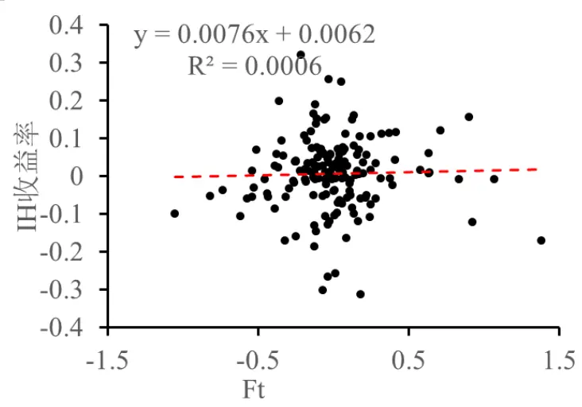
数据来源：华泰期货研究院

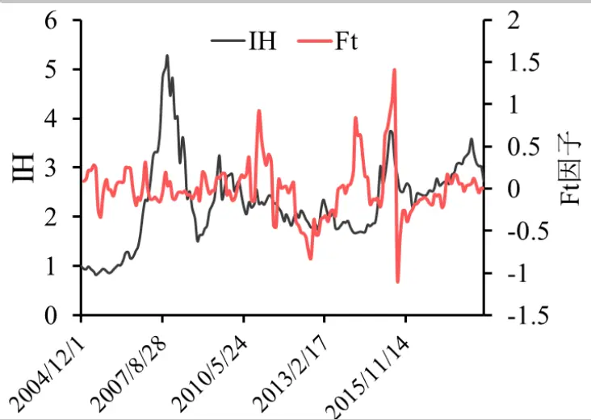

图2： 沪深 300 估值因子(Ft)与指数收益率散点图和指数净值走势图(月频)
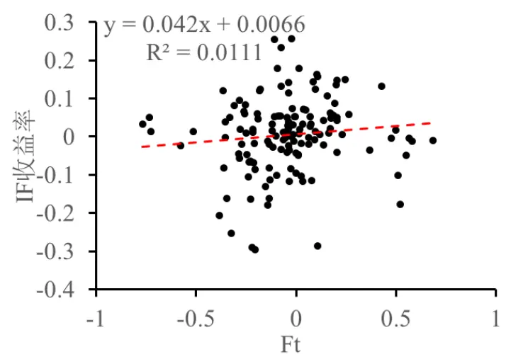

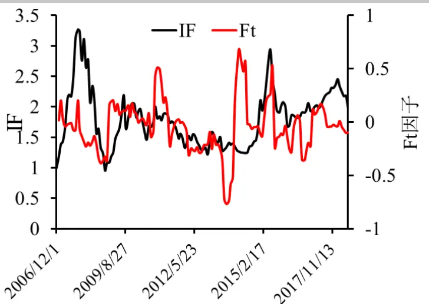
数据来源：华泰期货研究院

图3： 中证 500 估值因子(Ft)与指数收益率散点图和指数净值走势图(月频)
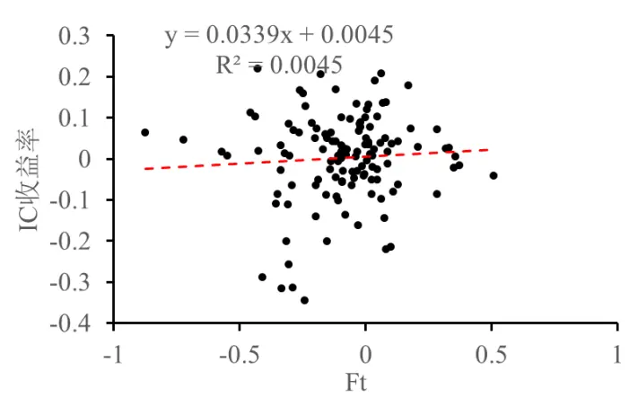
数据来源：华泰期货研究院

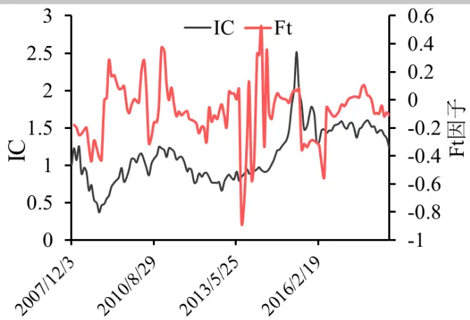

虽然估值因子的走势与未来股指走势并非总是一致，但是目前的模型是利用估值因子对未来股指收益率进行预测，如果得到的预期收益率为正则做多股指，如果为负则做空股指。这里的回测在股指期货上市前直接使用股指的数据，即假设股指可以随意做多或做空，股指期货上市后则直接交易股指期货。图 4 至 6 作出了使用估值因子策略的累积收益并与相应的股指进行对比。由图可见从长期来看，三大股指策略的收益都能跑赢股指。收益最高的是沪深 300，其次是中证500，最差的是上证 50，这点与各个股指跟估值因子的拟合度关系一致，样本外拟合度R2越高的股指策略收益表现越好。虽然上证 50的拟合度最差，但是长期看估值因子策略仍然能够跑赢股指，但是回撤期从 2008 年 11 月至 2014 年 11 月，长达 6年。这与上证 50的长期回撤也有关系毕竟指数从2007年 10月的顶点就开始回撤，一直未能创出新高。另外在沪深 300 和中证 500 上也有较长回撤期。而策略盈利的时间主要集中在 2007 年和 2014 年的两波大牛市中，在这两波牛市结束的暴跌中估值因子策略也没马上出现亏损，而是持续盈利。另外值得注意的是在最近的贸易战期间虽然三大股指都出现较大下跌，但是估值因子策略却能及时预判下跌行情，通过做空股指期货获利。该策略在沪深 300和中证500上都创了新高。

图 4： 上证 50 估值因子策略净值(月频)
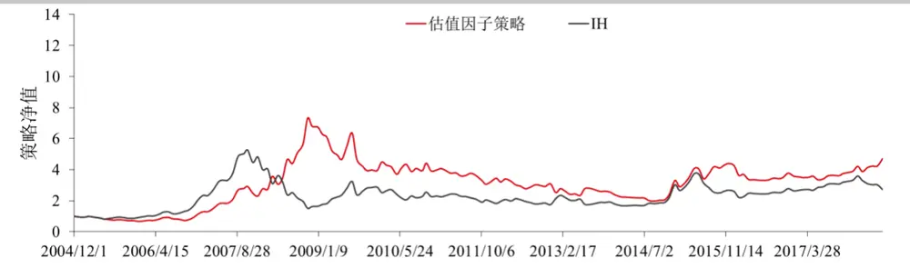
数据来源：华泰期货研究院

图 5： 沪深 300 估值因子策略净值(月频)
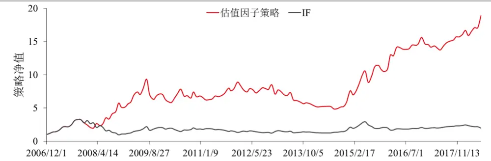
数据来源：华泰期货研究院

图 6： 中证 500 估值因子策略净值(月频)
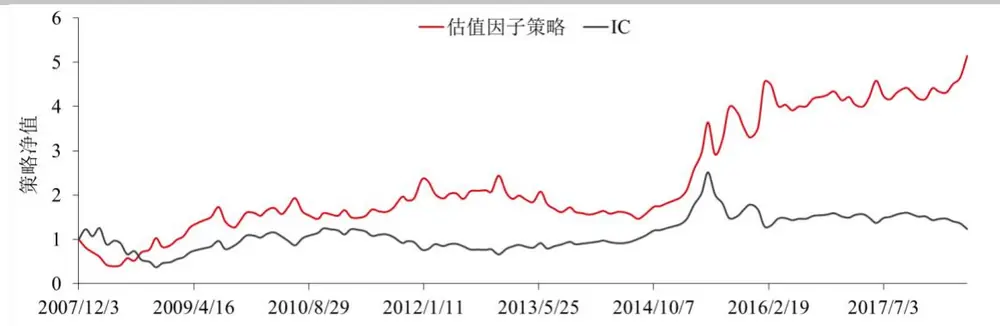
数据来源：华泰期货研究院

表格 1 列出了估值因子策略与股指纯多头的收益与风险对比。三大股指的估值因子策略平均年化收益都在 10%以上，其中沪深 300策略的收益达到年化 25.37%，远高于其他两个股指，在年化波动率上策略和股指都较为接近在 33%的水平。由于年化收益较指数纯多头高，夏普率也较高。在回撤方面，估值因子策略在上证50上会稍高，达到 73%，而在其他两个股指上都比股指纯多头要低。

表格 1 估值因子策略和指数的收益与风险统计(月频)

|  | IH 策略 上证 50 指数 |  | IF策略 | 沪深 300 指数 | IC 策略 | 中证 500 指数 |
| --- | --- | --- | --- | --- | --- | --- |
| 年化收益率 | 11.39% | 7.38% | 25.37% | 5.86% | 15.47% | 1.97% |
| 年化波动率 | 32.94% | 33.03% | 33.20% | 33.95% | 36.50% | 36.77% |
| 夏普率 | 0.35 | 0.22 | 0.76 | 0.17 | 0.42 | 0.05 |
| 最大回撤 | 73.00% | 71.26% | 48.00% | 70.75% | 60.79% | 70.55% |
| 最大回撤期(月) | 70 | 12 | 60 | 13 | 5 | 8 |

数据来源：华泰期货研究院

Bryan Kelly 和 Seth Pruitt 在其论文中只考察了估值因子在年度和月度对市场整体收益率预测的效果，但在实际交易中由于政策、行情等因素随时变化，按年度或按月度调仓未必能满足投资者度市场情况迅速做出反应的需求，因此在本策略本报告中尝试把估值因子应用在周度股指收益率的预测当中。在图 7至 9的散点图中并不能看见当月估值因子对下月指数收益率有明显的线性趋势分布，但是利用线性回归后仍能得到一条斜向上的直线，但这条线的斜率以及拟合度R2都比不上月频因子。在更高频率上数据的噪声通常更大，所以要准确预测未来一周的收益率会更加困难。虽然如此，但是拟合度在三大股指上的大小规律与月频策略也比较一致，在上证 50 上的拟合度较差，而沪深 300 和中证 500 的拟合度较好。在右边的走势图上，周频因子的走势与月频因子的走势差别并不大。而且估值因子在沪深300上的走势也与指数较为一致。

图7： 上证 50 估值因子(Ft)与指数收益率散点图和指数净值走势图(周频)
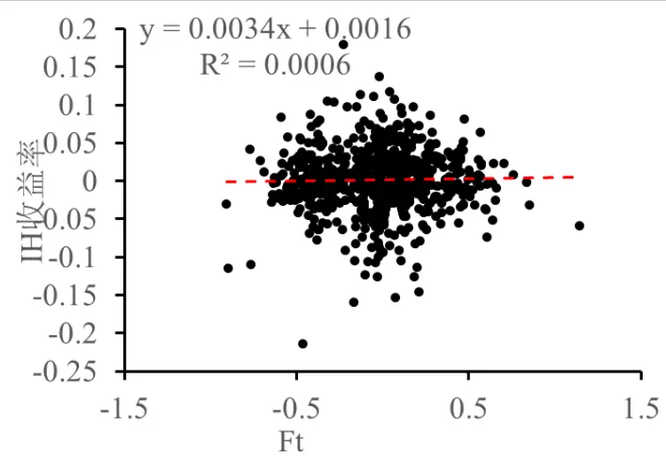
数据来源：华泰期货研究院

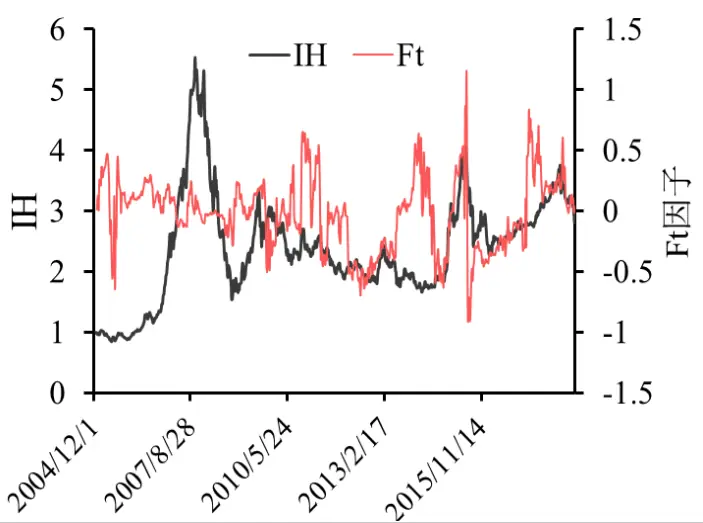

图8： 沪深 300 估值因子(Ft)与指数收益率散点图和指数净值走势图(周频)
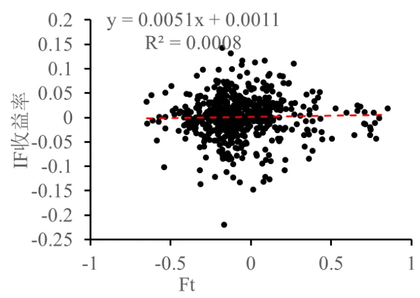
数据来源：华泰期货研究院

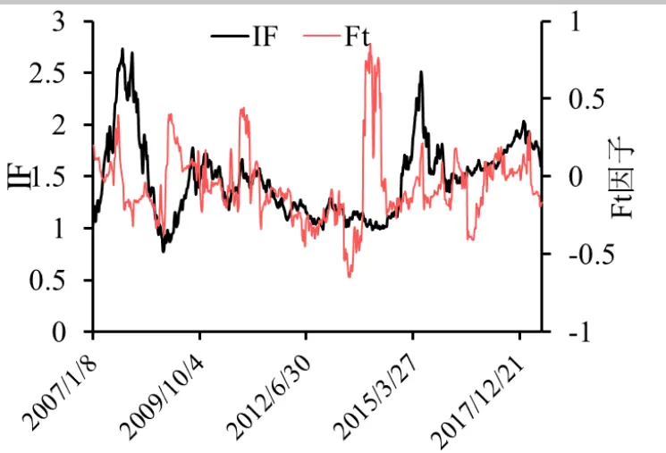

图9： 中证 500 估值因子(Ft)与指数收益率散点图和指数净值走势图(周频)
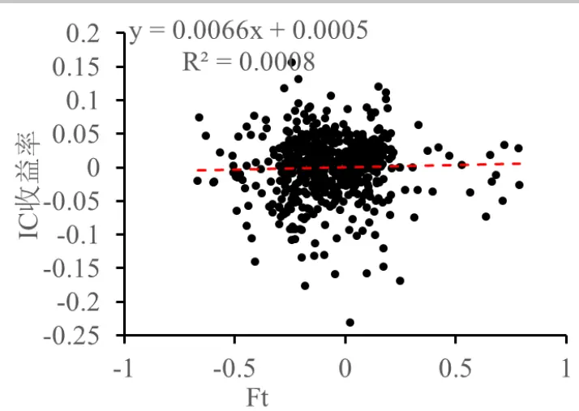
数据来源：华泰期货研究院

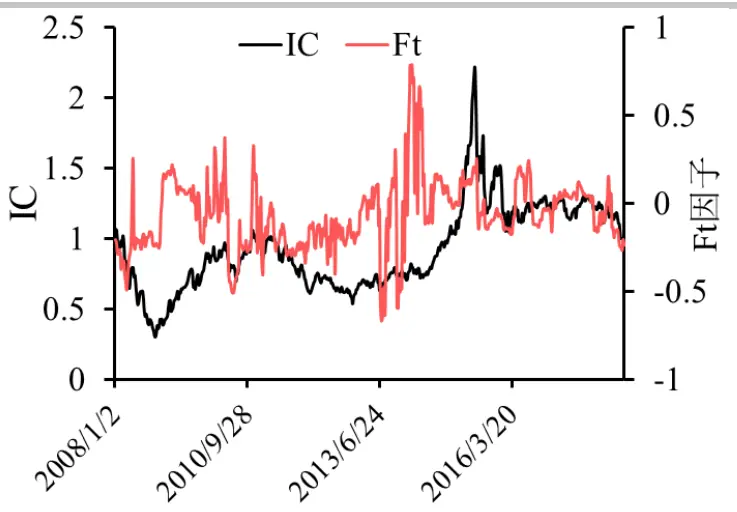

虽然周频估值因子与下周股指股指收益率的拟合度不如月频，但并不代表利用估值因子交易就没有效果，因为拟合度包含了收益率幅度大小的预测，但实际交易时只取期望收益率的正负号，与预期收益率大小幅度没有关系。图 10 至 12 作出了按周频根据预期收益率正负进行交易的结果，周频策略净值的走势与月频策略净值走势基本一致，而且从长期看，周频策略在三大股指上也都能获得正收益并跑赢其对应的股指，但是与月频策略类似，周频策略也有长达多年的回撤期。

图 10： 上证 50 估值因子策略净值(周频)
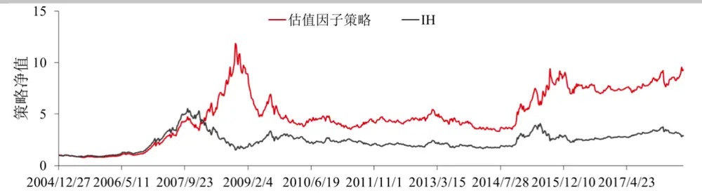
数据来源：华泰期货研究院

图 11： 沪深 300 估值因子策略净值(周频)
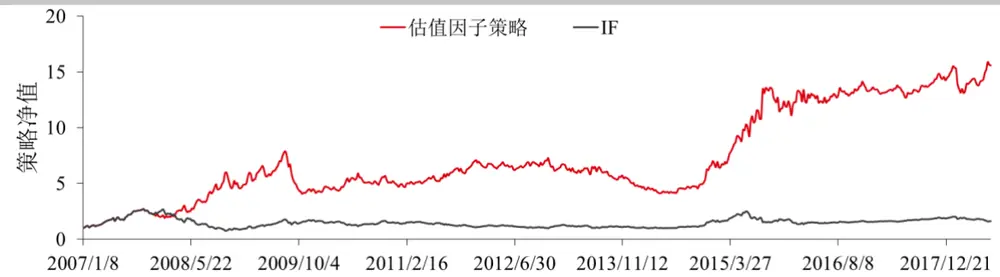
数据来源：华泰期货研究院

图 12： 中证 500 估值因子策略净值(周频)
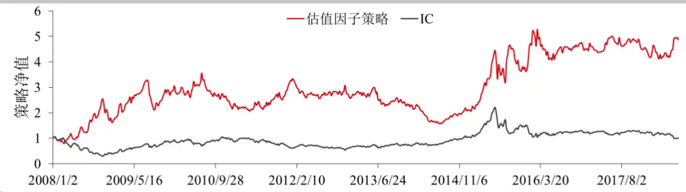
数据来源：华泰期货研究院

表格2列出了周频估值因子策略与股指纯多头的收益与风险对比。三大股指策略中收益最好的仍然是沪深 300，年化收益达到 23.24%，最差的是中证 500只有14.62%，周频的上证50策略要比月频的好一些有16.14%。使用周频策略以后虽然三大股指的年化收益率没有太大变化，但是三大股指之间的收益率标准差却有所下降，可能是因为周频策略交易次数增多，收益率表现会更加稳定。策略改为周频后，无论是策略还是股指本身的波动率都有所下降，年化波动率从月频的 33%的水平下降到30%左右的水平。由于波动率的下降，三大股指策略的夏普率也有所提升。在最大回撤方面，周频策略与月频策略相比并没有明显下降。由此可见，把月频策略改为周频后，策略收益率和最大回撤并不会有太大影响，但是能够提升策略的夏普率。

表格 2 估值因子策略和指数的收益与风险统计(周频)

|  | IH 策略 | 上证 50 指数 | IF策略 | 沪深 300 指数 | IC 策略 | 中证 500 指数 |
| --- | --- | --- | --- | --- | --- | --- |
| 年化收益率 | 16.14% | 7.67% | 23.24% | 4.13% | 14.62% | 0.13% |
| 年化波动率 | 29.71% | 29.78% | 30.13% | 30.30% | 33.14% | 33.20% |
| 夏普率 | 0.54 | 0.26 | 0.77 | 0.14 | 0.44 | 0.0038 |
| 最大回撤 | 71.86% | 72.19% | 48.24% | 71.60% | 55.77% | 71.72% |
| 最大回撤期(周) | 293 | 53 | 11 | 54 | 207 | 41 |

数据来源：华泰期货研究院

## 结果讨论

这篇报告介绍了如何利用股票指数成份股的账面市值比通过偏最小二乘法构造估值因子，并在中国三大股指期货上证 50，沪深 300 和中证 500 上进行测试。在月度频率上沪深 300和中证 500 的样本外拟合度较好，样本外预测能力与 Bryan Kelly 和 Seth Pruitt 研究的估值因子在美股市场的预测能力较为一致,但是上证 50 的月度预测效果稍差。根据估值因子计算股指期望收益可以做成交易策略，由于该策略能够做空比股指股指纯多头具有更多交易机会，所以从长期来看，在三大股指上都能跑赢大盘。该策略的收益主要来源于股票市场出现大牛市和大熊市的时候，当市场出现反转暴跌时策略并不会紧随出现大跌，反而能够获利。但是当市场出现震荡，没有明显趋势时，该策略就会出现亏损，如果市场出现长期小幅震荡，该策略也会有长达多年的回撤。该报告也尝试把月频策略扩展到周频，虽然在周频上估值因子的预测能力不如月频，但是根据估值因子计算的股指预期预期收益率的正负进行交易仍然能够获得与月频策略相当的平均年化收益率，而且由于交易频率提高，策略的波动率有所下降，夏普率也有所提高。

## 免责声明

此报告并非针对或意图送发给或为任何就送发、发布、可得到或使用此报告而使华泰期货有限公司违反当地的法律或法规或可致使华泰期货有限公司受制于的法律或法规的任何地区、国家或其它管辖区域的公民或居民。除非另有显示，否则所有此报告中的材料的版权均属华泰期货有限公司。未经华泰期货有限公司事先书面授权下，不得更改或以任何方式发送、复印此报告的材料、内容或其复印本予任何其它人。所有于此报告中使用的商标、服务标记及标记均为华泰期货有限公司的商标、服务标记及标记。

此报告所载的资料、工具及材料只提供给阁下作查照之用。此报告的内容并不构成对任何人的投资建议，而华泰期货有限公司不会因接收人收到此报告而视他们为其客户。

此报告所载资料的来源及观点的出处皆被华泰期货有限公司认为可靠，但华泰期货有限公司不能担保其准确性或完整性，而华泰期货有限公司不对因使用此报告的材料而引致的损失而负任何责任。并不能依靠此报告以取代行使独立判断。华泰期货有限公司可发出其它与本报告所载资料不一致及有不同结论的报告。本报告及该等报告反映编写分析员的不同设想、见解及分析方法。为免生疑，本报告所载的观点并不代表华泰期货有限公司，或任何其附属或联营公司的立场。

此报告中所指的投资及服务可能不适合阁下，我们建议阁下如有任何疑问应咨询独立投资顾问。此报告并不构成投资、法律、会计或税务建议或担保任何投资或策略适合或切合阁下个别情况。此报告并不构成给予阁下私人咨询建议。

华泰期货有限公司 2018 版权所有并保留一切权利。

## 公司总部

地址：广东省广州市越秀区东风东路761号丽丰大厦20层、29层04单元

电话：400-6280-888

网址：www.htfc.com