# 基于风险预算与机器学习模型的资产配置

# 策略

本文首先介绍了大类资产配置理论的历史沿革，将大类资产配置理论划分为基础恒定策略与量化模型策略，并在此基础上引入了风险平价模型和风险预算模型。

本文第二部分系统性的介绍了风险平价模型，通过使组合内各资产对组合的风险贡献相同构建风险平价模型，可以有效提高组合的风险收益属性。同时分析对比风险平价模型相较于传统 60/40 模型的优势，以及市场上风险平价策略相关的著名基金。随后，在全球ETF市场进行了实证分析，指出风险平价模型在组合波动率和最大回撤控制上的优势，但同时也发现风险平价模型在面临组合资产收益率下行、或者发生尾部风险时的不足，为解决风险平价模型以上的两大不足，从而进一步引出融入机器学习算法的风险预算模型。

本文第三部分介绍了用于生成投资者资产涨跌预测的机器学习算法。本文选用常用于金融资产涨跌预测的支持向量机模型，以部分技术指标以及宏观因子对ETF 资产进行涨跌预测，并结合贝叶斯优化进行超参数选取。

本文第四部分为风险平价模型提升后的风险预算模型。风险预算模型通过机器学习算法预测资产的涨跌调节各资产对组合的风险贡献比例，预测上涨的资产上调风险权重，预测下跌的资产下调风险权重。这样既避免了组合资产收益率下行的问题，也一定程度上缓解了尾部风险。同时对机器学习使用到的因子基本检验和压力测试，结果显示通过机器学习结果调整后的风险预算模型在继承风险平价模型低波动率、低最大回撤的同时，大幅提高了组合的收益率。最后本文也对风险平价模型以及对照组合进行了压力测试，结果显示风险平价模型的尾部风险较小。

本文第五部分在国内的商品期货市场展开实证，除了利用机器学习的预测算法作为风险预算模型输入项，还可与主观预测观点相结合，通过选取2017年商品市场作为回测案例，验证了主观观点风险预算模型在收益率下行以及高波动率情况下的有效性。最后本文根据华泰期货研究院对 2019年商品市场资产涨跌的主观预测判断，给出了 2019 年风险预算模型下的商品市场资产配置的具体权重比例建议。

风险提示：报告回测与分析，基于历史数据，过去业绩不代表未来绩效；基本面风险；流动性风险；模型估计风险

华泰期货研究院 量化组

罗剑

量化研究员

- 0755-23887993

- luojian@htfc.com

从业资格号：F3029622

投资咨询号：Z0012563

陈维嘉量化研究员

- 0755-23887993

- chenweijia@htfc.com

从业资格号：T236848

投资咨询号：TZ012046

联系人：

杨子江

量化研究员

- 0755-2388799

- yangzijiang@htfc.com

从业资格号：F3034819

石雨婷

量化研究员

- 0755-2388799

- shiyuting@htfc.com

从业资格号：F3039731

张纪珩量化研究员

- 0755-2388799

- zhangjihang@htfc.com

从业资格号：F3047630

相关研究：
基于模糊逻辑神经网络的高频做市
策略

2018-10-30

## 一、大类资产配置理论历史沿革

大类资产配置，顾名思义即是对投资组合标的进行选择的一种投资策略，被现代投资组合之父 Markowitz 认为是投资的唯一“免费午餐”。作为投资框架中的重要一环，其自上而下、高屋建瓴，相对择时、择券有着天然的战略优势。

自诞生以来，大类资产配置策略持续发展，与经济学理论相比，资产配置由于其实操的目标导向，更加贴近资本市场。因此随着市场边界的拓宽、资产类别的丰富，大类资产配置也发展出形形色色、各具特点的理论及方法。

表格 1：主要大类资产配置方法

| 策略类别 |  | 策略名称 | 提出者 |
| --- | --- | --- | --- |
| 基础恒定混合策略 |  | 等权策略 | 1 |
| 基于风险&收益 量化模型策略 |  | 60/40 策略 |  |
|  |  | 均值方差模型 | Markowitz |
|  |  | 资本资产定价模型 | Sharpe、Linter Black、Litterman |
|  | 基于收益 | Black-Litterman 模型 | Mills |
|  |  | Gilt-Equity Yield Ration 模型 动量模型 |  |
|  | 基于风险 | 最小方差模型 | Markowitz |
| 风险平价模型 |  | Edward Qian |  |
| 风险预算模型 |  |  |  |

资料来源：Bloomberg 华泰期货研究院

## 1.1 基础恒定混合策略

早期的大类资产配置以基础的恒定混合策略为主。20 世纪 60 年代以前，资本市场对于资产配置没有明确的定义。尽管如何衡量风险在理论层面上并没有解决，但“不要把鸡蛋放在同一个篮子里”这一思想早已被投资者接纳，且熟练运用在等权或者股债 60/40策略中，实质上提高了组合的表现。

## （1）等权策略

等权重投资组合，即对可选的 n 种标的资产均配置 1/n 的权重。这是一种朴素的风险分散策略，即不考虑各资产间的相关性，简单追求投资种类的最大分散化。需要注意的是，等权策略本质上是一种动量反转类策略，当某种资产获得超常上涨或下跌后，为了保持资产权重的恒定，组合会调低/调高资产权重。

## （2）60/40 策略

60/40 策略在 20 世纪 30 年代兴起于美国，投资组合分配 60%的权重给股票类资产，40%的权重给债券类资产。策略简单易懂、易于操作，并在几十年内一直取得不错的回报，因此在美国投资者间广泛流行。由于当时并没有足够丰富的全球资产可供配置，60/40 策略在近半个世纪的美国市场充分的体现了其小技巧有大智慧，时至今日仍有许多投资人采用这一策略，也有许多人将其设定为比较其它策略的基准。

基础恒定策略由于相对简单机械，因此在早期的资本市场占据主要地位。随着全球可配置资产种类的扩充，以及投资者收益风险偏好广度的增加，恒定策略越来越难以满足不同客户群体的多样化需求。

## 1.2 量化模型策略

1952 年，Markowitz 在《Portfolio Selection》中首次将投资组合收益率均值和方差定义为衡量投资组合表现的数量化指标，构建了基于均值-方差的最优投资组合决策体系，为后续一系列量化模型打造了分析框架和理论基础。同时，交易信息的快速积累也为投资组合数量化、模型化的发展提供了基础，在马科维茨CAPM模型的基础上，衍生出基于风险、基于收益，以及同时基于两者的三类量化模型类策略。

## （1）均值方差模型

Markowitz 使用期望收益、方差来刻画投资组合的收益和风险，将资产配置问题转化为多目标优化问题：给定风险水平，最大化投资者期望收益；给定期望收益，最小化组合方差。所有给定条件下的组合解的集合，即为有效前沿（EfficientFrontier），是一条在收益-风险平面上的二次曲线。

图 1：均值方差模型
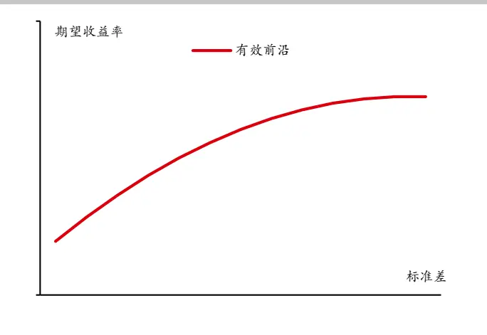
数据来源：华泰期货研究院

图 2：资本资产定价模型
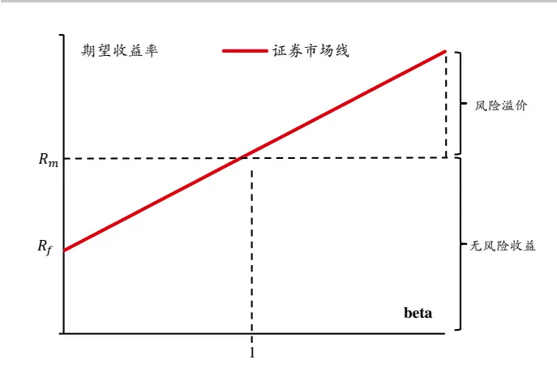
数据来源：华泰期货研究院

## （2）资本资产定价模型(CAPM)

20 世纪 60 年代，Sharpe 和 Linter 等在均值方差模型的基础上开发了资本资产定价模型，即 CAPM。CAPM将风险划分为两种，一种是系统性风险，即无法通过投资组合的构建来分散的风险，另一种是非系统性风险，即可以通过优化投资组合从而避免。CAPM 还引入了现在广泛存在于金融市场的两个概念：alpha 和 beta，根据 CAPM 模型，无风险利率、市场收益率（alpha）以及该资产与市场整体的相关性（beta），这三个因素就可以给出一个资产的合理定价。在 CAPM模型的前提假设下，市场投资组合既是均衡组合，也是所有投资者风险资产的最优组合，投资者只需考虑风险资产与无风险资产的配比即可。

CAPM 模型形式简洁优美、逻辑清晰明确，是量化模型的基石，但实用性较差是其最突出的缺点。首先，CAPM 模型前提假设过多，与实际金融市场不符；其次期望收益非常难以估计，并且模型对于输入数据的敏感性过高，往往期望收益发生微小变动，模型给出的结果就会发生很大的变化。

## （3）Black-Litterman 模型

1992 年，Black和 Litterman 在高盛就职期间提出了 BL模型，模型通过结合历史数据和投资者主观观点，形成较为稳定的模型输入参数。不仅改进了CAPM模型对于参数过于敏感的特点，同时由于融入了主观观点，BL模型可以根据投资人对资本市场的判断获取一部分超额收益。BL模型更加贴近大类资产配置实操的目标导向，标志着可用于实践的大类资产配置策略开始发展壮大。另外 BL 模型对主观观点的质量要求较高，因此不适用于缺乏市场信息的普通投资者。

## （4）Gilt-Equity Yield Ration 模型（GEYR）

上述三类模型均基于收益和风险，除此之外还有部分量化模型仅基于收益。GEYR 模型通过对比股票市场和债券市场的收益率，衡量股票和债券的相对投资价值。相比 60/40 恒定策略，GEYR 模型考虑到了市场所处的周期，因此比不做调整的静态投资组合具有更高的平均收益率和更小的收益波动率。

## （5）动量模型

动量策略源自股票市场，即多配前期涨幅较大的股票，倾向它们保持“惯性”，继续上涨。移植到大类资产配置领域后，尽管短期内模型的收益并不稳定，但在较长的时间尺度上，收益率往往能有不错的表现。

## （6）最小方差模型（MV）

由于均值方差模型对于期望收益过于敏感，虽然 BL 模型等方法起到了一定的作用，但敏感性带来的误差导致各类模型对于传统等权模型并没有较大的优势，因此不考虑期望收益，仅基于风险的模型应运而出。

最小方差模型通过最小化组合方差，实际上选择了均值方差模型有效前沿上方差最小的那个投资组合。通过 MV 模型构建的投资组合，往往能够显著降低组合的波动性，从而提高组合的夏普比率。实际操作中，MV 模型倾向于多配波动性较低的资产。

## （7）风险平价模型（Risk Parity）

风险平价模型起源于 20 世纪 90 年代桥水基金推出的全天候投资组合，通过对经济周期进行划分，并等量持有不同经济周期下表现较好的大类资产，保证了不管出现哪种经济环境，组合内总有一个子组合表现较好，从而降低了整个组合的风险。2005 年，Edward Qian 系统性的总结了风险平价模型。由于其金融危机后的表现十分处色，因此开始受到投资者的广泛关注。

## （8）风险预算模型（Risk Budget）

风险预算模型在风险平价模型的基础上，增加了投资者的主观观点，通过将对不同风险资产未来表现的预估运用到风险权重的配置上，提高了预测上涨资产的风险权重，因此在不大幅提升组合风险的前提下，能够大幅提升组合的收益率，从而提高风险收益比。

## 二、风险平价模型

## 2.1 模型介绍

现代投资组合构建策略起始于 Markowitz 的均值方差模型，但由于模型对于输入参数即对期望收益的估计过于敏感，导致实操性不强；同时，传统的 60/40 模型尽管不需要对期望收益做出预测，但研究表明组合 90%的风险贡献均来源股票，风险分配的不均衡导致组合对于股票资产过度暴露。风险平价模型在一定程度上解决了这两个问题。

“风险平价”这一概念在 2005 年由 Panagora 的 Edward Qian 在《Risk Parity Portfolios:Efficient Portfolios Through True Diversification》中首次提出。Edward Qian（2005）将组合的风险贡献平均分配在股票和债券上，1983年～2004年间，60/40 模型取得了6.4%的年化收益率以及 0.67的夏普比率，而在相同的风险度量下，风险平价模型取得了 8.4%的年化收益率以及 0.87的夏普比率。EdwardQian（2006）又提出单个资产的风险贡献不仅可用于组合风险的分解，还可被视为各头寸损失贡献的估计参考。策略旨在同时考虑组合中单个资产的风险，以及资产间的协同风险，通过调整资产权重使得各资产对组合的风险贡献一致。

表格 2：风险平价模型对比 60/40 模型：1983~2004

|  | 罗素1000 | 雷曼债券指数 | 60/40 | 风险平价 | 风险平价（调整） |
| --- | --- | --- | --- | --- | --- |
| 收益率均值 | 8.3% | 3.7% | 6.4% | 4.7% | 8.4% |
| 收益率标准差 | 15.1% | 4.6% | 9.6% | 5.4% | 9.6% |
| 夏普比率 | 0.55 | 0.80 | 0.67 | 0.87 | 0.87 |

资料来源：PanAgora 华泰期货研究院

值得一提的是，风险平价策略广为人知更多的是因为桥水基金的全天候投资组合（AllWeatherPortfolio），由于其20年来收益率稳定高于标普 500，并且在 2008年金融危机时仍有不俗的表现，因此受到投资者的广泛关注，本文这里先讨论风险平价模型的理论基础。

定义 $x=(x_{1},x_{2},\ldots,x_{n})$ 为组合中 n 个资 $\cdot 产$ 的权重， $x_{i}$ 即为资产i的权重， $\sigma_{i}^{2}$ 为资产i的方差，$\sigma_{ij}$ 为资产i及资产j的协方差，Σ为组合资产的协方差矩阵，因此资产组合的标准差可表示如下：

$$
\sigma(x)=\sqrt{x^{T}\Sigma x}=\sqrt{\sum_{i}x_{i}^{2}\sigma_{i}^{2}+\sum_{i}\sum_{j\neq i}x_{i}x_{j}\sigma_{ij}}.
$$

定义单个资产权重的微小变化对组合波动率所带来的影响为边际风险贡献 Marginal RiskContribution（MRC），则：

$$
MRC=\partial_{x_{i}}\sigma(x)=\frac{\partial\sigma(x)}{\partial_{x_{i}}}=\frac{x_{i}\sigma_{i}^{2}+\sum_{j\neq i}x_{j}\sigma_{ij}}{\sigma(x)}=\frac{(\Sigma x)_{i}}{\sigma(x)}
$$

定义单个资产对组合波动率的总体影响为总体风险贡献TotalRiskContribution（TRC），则：

$$
TRC\;=\;x_{i}\times MRC\;=\;\frac{x_{i}^{2}\sigma_{i}^{2}+\sum_{j\neq i}x_{i}x_{j}\sigma_{ij}}{\sigma(x)}=\frac{x_{i}(\Sigma x)_{i}}{\sigma(x)}
$$

$$
\sum_{i}TRC=\sum_{i}{\frac{x_{i}^{2}\sigma_{i}^{2}+\sum_{j\neq i}x_{i}x_{j}\sigma_{ij}}{\sigma(x)}}={\frac{\sum_{i}x_{i}^{2}\sigma_{i}^{2}+\sum_{i}\sum_{j\neq i}x_{i}x_{j}\sigma_{ij}}{\sigma(x)}}=\sigma(x)
$$

可以看到，单个资产对组合的总体风险贡献之和即为组合的总体风险，风险度量符合的这种条件被称为欧拉分配定理。风险平价模型，即让每个资产对组合的风险贡献相等。换言之，若资产i的风险贡献偏高，则降低资产i的权重，同时增加其他资产的权重，直至各资产的风险贡献相同。

尽管风险平价模型的核心是一致的，但目前在对其具体的运用方向和实践形式上又有所不同。以目前世界上较为知名的相关基金为例，Bridgewater的 Allweather将风险分散在了不同的经济驱动因素上，Invesco在股票、债券、商品上各配置三分之一的风险，AQR在风险平价在股票、固定收益、通胀和信用上，而PanAgora则分散投资 MSCI新兴市场指数，在不同的国家间寻求风险的平衡。

表格 3：部分风险平价基金介绍

| 风险评价基金 | 成立时间 | 投资策略 |
| --- | --- | --- |
| All weather | 1996 | 不同经济周期 |
| Invesco balanced risk allocation | 2009 | 股票、债券、商品 |
| AQR risk parity | 2010 | 股票、固定收益、通胀、信用 |
| PanAgora risk parity emerging markets | 2013 | 不同经济体 |

资料来源：Bloomberg 华泰期货研究院

桥水全天候基金的设立时间远早于学界对于风险平价模型的数理化，根据桥水公开发布的报告，全天候基金主要通过经济增长、通货膨胀两个变量，以及高于预期、低于预期两种情形，将宏观经济分为四个象限，每个象限存在特定的资产表现突出。全天候基金通过等权配置四个象限，实现对经济环境的“全天候”覆盖，这样不管出现哪种情况，组合内总有一个子组合表现出色。1996 年至今，除了金融危机期间，全天候基金始终表现出色，大幅跑赢标普 500。注意 All weather 系列属于普通投资者不可购买的对冲基金，因此不会向市场公开业绩，图中数据来自桥水创始人达里奥的公开出版物。

图 3：All weather 净值表现
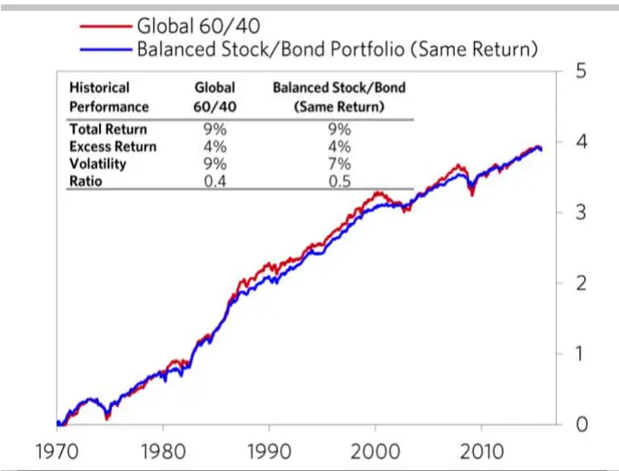
数据来源：Bridgewater 华泰期货研究院

图 4：部分风险平价基金净值表现
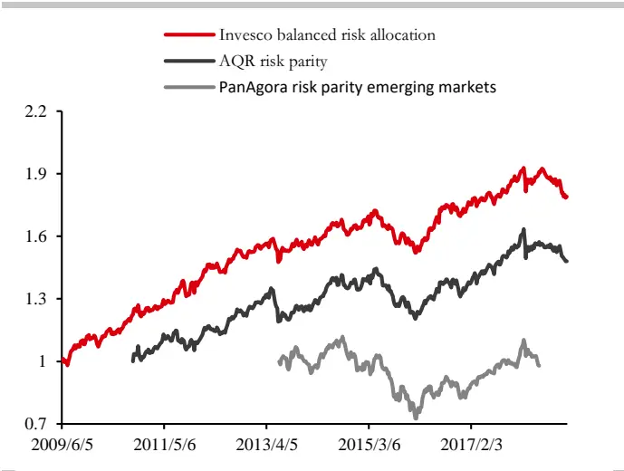
数据来源：Bloomberg 华泰期货研究院

Invesco 的 Balanced-Risk Allocation Fund 在股票、债券、商品上各配置三分之一的风险，截止2018 年11月，基金在全球市场一共配置了32种资产。同时，尽管基金使用了风险平价策略，但是基金经理会在权重分配以及持仓调整时加入主观预期。

AQRriskparityfund相比Invesco增加了信用风险，基金在股票、债券、商品、信用这四个维度上配置等权风险；PanAgora则分散投资 MSCI新兴市场指数，在不同的国家间寻求风险的平衡，该基金在 2018年 5 月并入了PanAgora的新兴市场基金内。

## 2.2 权重求解

风险平价模型理论简单易懂，但是模型的求解过程却并不简单。如果不考虑资产间的相关性，那么各资产的权重等于其波动率的倒数，这也被称之为朴素的风险平价，或者说波动率平价。然而现实世界各类资产间的相关性显然不等于 0，此时风险平价模型往往不存在解析解，Roncalli等（2010）提出可以将求解过程转为以下二次规划问题，最小化各类资产对组合风险贡献差值的平方和：

$$
min\sum_{i,j}(TRC_{i}-TRC_{j})^{2}
$$

即：

$$
min\sum_{i,j}(x_{i}(\Sigma\mathbf{x})_{i}-x_{j}(\Sigma\mathbf{x})_{j})^{2}
$$

$$
s.t.\left\{\begin{matrix}1^{T}x=1\\0\leq x\leq1\end{matrix}\right.
$$

考虑到大类资产一般为多头配置，因此这里设定了各类资产的权重均大于 0，同时考虑到对于杠杆使用的限制，因此各类资产的权重之和等于 1。

## 2.3 协方差矩阵估计

## （1）样本协方差

从最优化目标方程可以看出，除了未知数目标权重x，风险平价模型的唯一输入是组合资产的协方差矩阵Σ，因此正确估计协方差矩阵是开始构建模型的关键一步。

传统的模型大多使用基于历史数据估计的样本协方差，但是由于样本协方差矩阵较为敏感，往往资产收益率序列产生微小变动，样本协方差矩阵也会产生改变，因此模型求解出的资产权重每期变化范围较大，不符合资产配置实操的需求。

## （2）压缩估计

Ledoit-Wolf压缩估计法能够提高协方差矩阵的稳定性，通过将一个能够快速收敛的有偏估计量Φ与样本协方差Σ结合在一起，虽然损失了一定的无偏性，但是新的协方差矩阵能够更加快速的收敛。实际操作中，一般选用单位矩阵作为Φ：

$$
\Sigma=\alpha\Phi+(1-\alpha)\Sigma
$$

公式中的α一般通过最小化压缩协方差与样本协方差之间的损失得到。

通过对样本协方差进行压缩估计，每期协方差矩阵的变动较少，反映到最优化方程中，就是每期资产权重的变化更加平滑，方便构建投资组合。

下图展示了压缩估计协方差矩阵在条件数上远远小于样本协方差，因此本文后续选用的协方差矩阵均为压缩估计。

图 5：压缩估计与样本协方差矩阵条件数
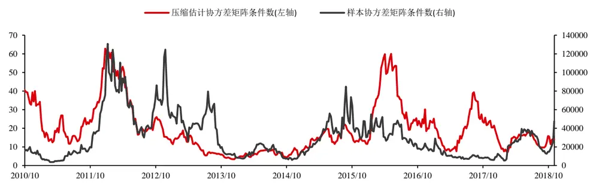
数据来源：华泰期货研究院

## 2.4 实证分析

本文与 Invesco balanced risk allocation 一致，选择在股票、债券、商品层面运用风险平价策略，考虑到大类资产配置实操的目的性，所选标的均为流动性较好的ETF产品，具体列表如下：

表格 4：实证分析备选资产列表

| 资产类别 | 资产名称 | 彭博代码 |
| --- | --- | --- |
| 股票 | 上证 50ETF | 510050CG |
|  | 标普 500ETF | SPY |
|  | 富时欧洲 ETF | VGK |
|  | MSCI 日本 ETF | EWJ |
| 债券 | 安硕美国短期国债ETF | SHY |
|  | 安硕美国中期国债ETF | IEF |
|  | 安硕美国长期国债ETF | TLT |
|  | 安硕新兴市场债券ETF | EMB |
| 商品 | PowerShares 农产品 ETF | DBA |
|  | PowerShares 基本金属 ETF | DBB |
|  | USCF 原油 ETF | USO |
|  | SPDR 贵金属 ETF | GLD |

资料来源：Bloomberg 华泰期货研究院

回测所选时间段为 2010 年 10 月至 2018 年 11 月，数据频率为周度，这期间内备选资产的风险收益属性如下：

表格 5：实证分析备选资产风险收益属性

| 资产名称 | 年化收益率 | 年化波动率 | 最大回撤 | 夏普比率 |
| --- | --- | --- | --- | --- |
| 上证 50ETF | 4.65% | 22.78% | -41% | 0.20 |
| 标普 500ETF | 13.30% | 12.98% | -17% | 1.02 |
| 富时欧洲 ETF | 4.69% | 17.23% | -29% | 0.27 |
| MSCI 日本ETF | 5.65% | 15.42% | -24% | 0.37 |
| 安硕美国短期国债ETF | 0.46% | 0.74% | -1% | 0.63 |
| 安硕美国中期国债ETF | 2.07% | 5.79% | -9% | 0.36 |
| 安硕美国长期国债ETF | 3.66% | 12.99% | -18% | 0.28 |
| 安硕新兴市场债券ETF | 3.78% | 7.44% | -13% | 0.51 |
| PowerShares 农产品 ETF | -4.85% | 11.96% | -52% | (0.41) |
| PowerShares 基本金属 ETF | -3.64% | 17.79% | -57% | (0.20) |
| USCF 原油 ETF | -11.36% | 27.62% | -82% | (0.41) |
| SPDR 贵金属 ETF | -1.26% | 15.05% | -45% | (0.08) |

资料来源：Bloomberg 华泰期货研究院

风险平价模型输入的唯一参数是协方差矩阵时间窗口长度，下图展示了其在 12 至 70 之间时风险平价模型的表现。可以看出，模型对于唯一参数的取值并不敏感，本文选用的时间窗口为 25。

图 6：不同协方差矩阵时间窗口长度的风险平价模型表现
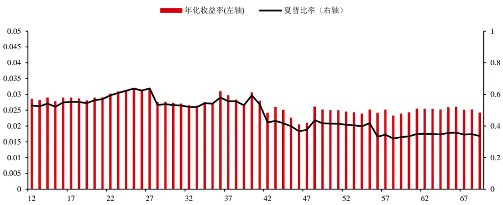
数据来源：华泰期货研究院

Roncalli（2010）等在数理层面上证明了风险平价模型的波动率居于等权组合和最小方差组合之间，因此本文在构建风险平价组合的同时，构建了等权组合与最小方差组合作为对比。

图 7：等权、最小方差、风险平价组合净值
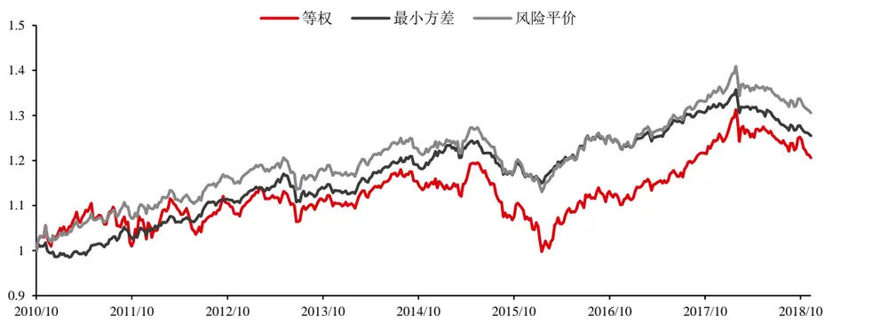
数据来源：华泰期货研究院

回测结果显示，风险平价模型的年化波动率为 5.03%，处于最小方差组合和等权组合之间；最大回撤为 8%，也处于最小方差组合和等权组合之间；另外风险平价组合的年化收益率为3.2%，为三种组合中的最高值；风险平价组合的夏普比率为 0.64，与最小方差组合接近，高于等权组合。

表格 6：等权、最小方差、风险平价组合风险收益属性

| 组合策略 | 年化收益率 | 年化波动率 | 最大回撤 | 夏普比率 |
| --- | --- | --- | --- | --- |
| 等权 | 2.24% | 7.17% | -17% | 0.31 |
| 最小方差 | 2.72% | 4.04% | -8% | 0.67 |
| 风险平价 | 3.20% | 5.03% | -11% | 0.64 |

资料来源：华泰期货研究院

下图展示了最小方差组合和风险平价组合的持仓情况，可以看到相比风险平价组合，最小方差组合的权重更加集中在某几类资产上，并且权重变化更加陡峭。从大类资产配置实操的层面出发，风险平价模型权重更加分散，每期调仓较少，更利于投资者构建组合。

图 8：最小方差组合持仓权重
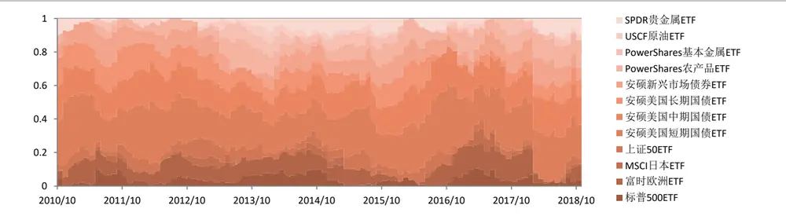
数据来源：华泰期货研究院

图 9：风险平价组合持仓权重
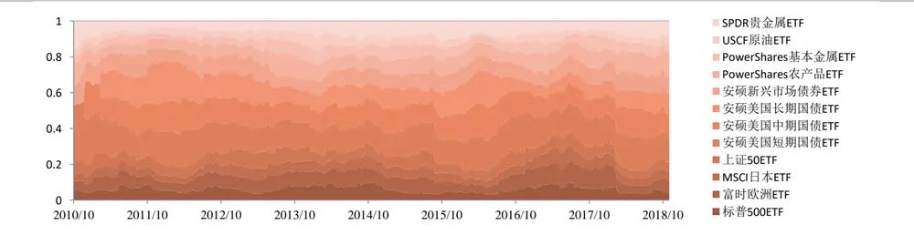
数据来源：华泰期货研究院

## 2.5 风险平价模型缺陷

进一步对回测结果进行分析，本文发现风险平价组合在波动率和最大回撤的控制上显著优于组合内的大多数单项资产，但是从年化收益率的角度看，一半的单项资产都超过了风险平价组合。

GMO（2010）在《The Hidden Risks ofRisk Parity Portfolios》一文中系统性的讨论了风险平价组合的这种缺陷，在论文的第二部分，GMO阐述了大宗商品这一资产类别没有持续的正回报，与股票和债券并不一样，投资组合在这类资产上的暴露并不能给组合带来正的风险溢价；同时，利率长达数十年的正期限溢价并不能保证一直持续。由于模型的唯一输入只是标的资产的协方差矩阵，因此组合标的收益率的不确定性，是风险平价组合的隐藏风险。桥水基金的达里奥也提到，风险平价模型只能处理组合资产的收益率的波动，而不能解决组合内资产整体收益率的下行。

GMO 论文的第三部分提到，组合资产的尾部风险也是风险平价模型没有纳入考量的问题。例如在 2008年金融危机期间，桥水的全天候基金也承受了大幅回撤，只是在后续的流动性宽泛的行情中表现出色。

回顾 Invesco 的 Balanced-Risk Allocation Fund，该基金在股票、债券、商品三种大类资产层面运用风险平价策略，每种资产对组合的风险贡献均为 33.3%。同时，基金还引入了“TacticalAllocation”，基金经理可以根据对经济周期的划分，调整各资产的风险贡献比例，风险贡献在 16%至 50%之间。这种在权重分配以及持仓调整时加入主观预期的方法，就是对风险平价模型的一种提升，本文称其为风险预算模型。

在本文中也将利用这种风险预算模型对现有的风险平价模型进行改进。为了生成对资产未来走势的主观预期，本文利用人工智能的方法对资产未来收益率进行判断，对于未来收益率为负的资产配置较低风险权重，对于未来收益率为正的资产配置较高风险权重。同时，为了考虑各资产以及资产组合与模型因子的尾部风险，利用Copula模型估计资产与各因子之间的联合分布，对资产表现进行极端情况下的压力测试。

## 三、机器学习概述

## 3.1 人工智能算法介绍

人工智能算法在近年逐渐兴起，在金融数据上的应用也越来越广。常见的人工智能算法主要有两类，包括神经网络和支持向量机两类。深度神经网络包含的可调参数较多，适宜应用在训练样本较大的情形，而持支持向量机所需的训练样本相对较少，所以较为适宜使用在样本数量较小的资产配置策略中。这里对支持向量机模型做出简单介绍。另外这里也介绍贝叶斯优化方法，作为近年兴起的人工智能算法调参手段。

支持向量整机(SVM，SupportVectorMachine)是一种流行的机器学习分类和回归工具。在二分问题中，SVM 通过寻找最优的超平面把所有的数据点分成两类。最优的超平面意味着

SVM在这两类点中有最大的边际。支持向量就是指离超平面最近的数据点。下图作出了超平面、支持向量和边际之间的关系，数据被标记为+和-两类。

图 10： 支持向量机原理
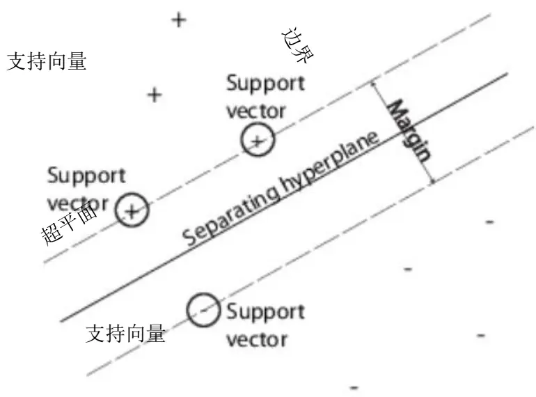
数据来源：网络截图 华泰期货研究院

用于训练的集合是一组向量 $x_{j}$ ，每个向量 $x_{j}$ 都对应了一个类别 $y_{j}$ 。对所有d维向量 $\boldsymbol{\cdot}\boldsymbol{x}_{j}\in R^{d}$ $y_{j}=\pm1$ 。超平面的公式可表示为

$$
f(x)=x^{\prime}\beta+b=0\tag{1}
$$

其中 $;\beta\in R^{d}$ ，是一个d维向量，b是一个实数。

以下问题给出了最优超平面的定义：即寻找β和b来最小化‖β‖使得对所有的点 $\left(x_{j},y_{j}\right)$ ，都有

$$
y_{j}f\big(x_{j}\big)\geq1\tag{2}
$$

而支持向量就是在边界上的点 $x_{j}$ ，这类点满足

$$
y_{j}f\big(x_{j}\big)=1\tag{3}
$$

为了数学表达方便，这个问题可以转化为最小化‖β‖的二项规划问题。其中的最优解(β̂, b̂)可以实现对向量z的分类如下:

$$
class(z)=sign\big(z^{\prime}\widehat{\beta}+\widehat{b}\big)=sign(\widehat{f}(z))\tag{4}
$$

f̂(z)就是分类分数，代表了向量z与超平面之间的距离。

然 $而$ 给定的数据训练集 $x_{j}$ 未必能通过一个超平面实现可分。在这种情况下，SVM 可以使用一个软性边界，意味着一个超平面能分出大部分但并非所有的数据点。为此可以引入松弛变量 $-\xi_{j}$ 和惩罚参数C，把问题转化为：

$$
\operatorname*{min}_{\beta,b,\xi}(\frac{1}{2}\beta^{'}\beta+C\sum_{j}\xi_{j})\tag{5}
$$

同时满足

$$
\begin{aligned}y_{j}f\big(x_{j}\big)&\geq1-\xi_{j}\\\xi_{j}&\geq0\end{aligned}\tag{6}
$$

由公式(6)可以看出增加C值意味着松弛变量ξj的权重增加，也即分类更加严格。反之降低C值意味着错误分类的重要性降低。公式(5)和(6)通常不会直接求解，因为用到SVM的实际问题通常都是线性不可分的。为了把线性不可分问题变成可分需要引入拉格朗日乘子αj和μj把公式(5)和(6)可以转化为

$$
L_{p}=\frac{1}{2}\beta^{\prime}\beta+C\sum_{j}\xi_{j}-\sum_{j}\alpha_{j}\left(y_{j}f(x_{j})-\left(1-\xi_{j}\right)\right)-\sum_{j}\mu_{j}\xi_{j}\tag{7}
$$

计算公式(7)的驻点可得

$$
\left\{\begin{aligned}\beta&=\sum_{j}\alpha_{j}y_{j}x_{j}\\&\sum_{j}\alpha_{j}y_{j}=0\\\alpha_{j}&=C-\mu_{j}\end{aligned}\right.\tag{8}
$$

把公式(8)代入公式(7)可以把最小化公式(5)转化为最大化以下公式

$$
{\cal L}_{D}=\sum_{j}\alpha_{j}-\frac{1}{2}{\sum_{j}\sum_{k}\alpha_{j}\alpha_{k}y_{j}y_{k}x_{j}^{\prime}x_{k}},\tag{9}
$$

同时满足约束

$$
\begin{array}{c}{{\displaystyle\sum_{j}y_{j}\alpha_{j}=0}}\\{{0\leq\alpha_{j}\leq C}}\end{array}\tag{10}
$$

最后一条式子 $0\leq\alpha_{j}\leq C$ 展示了为何C值会被称为框式约束，因为C值把拉格朗日乘子限制在了特定的范围之内。

公式(9)与公式(5)相比最大的改进是公式(9)不是取决于β值，而是取决于內积x $\phantom{}_{i}^{\prime}x_{k},$ 。內积的大小其实是两个向量相似性的衡量，例如两个互相垂直的向量差别较大，其內积为 0，他们对$L_{D}$ 值没有影响。而平行的单位向量更相似，他们的內积为1，对 $L_{D}$ 值影响则较大。虽然在线性空间上可以通过內积衡量两个向量的相似程度，但是并不意味着这两个向量是线性可分的，因此可以通过引入核函数把原来在线性空间上不可分的向量映射到其他空间上实现可分。这类函数具有如下特征

$$
G(x_{1},x_{2})=<\varphi(x_{1}),\varphi(x_{2})>\tag{11}
$$

即核函数可以表示成两个向量进行映射 $\varphi()$ 后的內积。常见的核函数有 $G(x_{1},x_{2})=(1+$ $x_{1}^{\prime}x_{2})^{p}和G(x_{1},x_{2})=exp(-\|x_{1}-x_{2}\|^{2})$ 等。

无论是神经网络还是支持向量机，对不同问题适用的模型结构可能不一样。而模型结构则由超参数决定，例如神经网络里所包含的隐藏层数量，每层神经元数量，又或者支持向量机中使用的核函数尺度，框式约束的大小等。如何调整这些超参数需要不断地训练模型进行交叉验证，从众多模型结构或者超参数组合中选择。通常神经网络和支持向量机的训练都需要消耗大量计算时间，如果对所有可能的超参数组合进行搜索，则需要进行多次模型训练，显然不现实。为了在尽量短的计算时间内选择出效果好的模型，可以考虑使用贝叶斯优化的方进行模型选择。贝叶斯优化尝试通过在给定的计算时间内，优化一个标量目标函数f(x)进行模型选择。

其中的f(x)是一个高斯过程模型，x代表用于选择的超参数向量，f(x)用于模拟交叉验证里验证集上误差的概率分布。贝叶斯优化在开始时先在超参数空间上随机选择少量点 $,x_{i}$ 作为起始，计算这几个点上验证集的误差，并进行高斯过程回归校正模型f(x)，得到验证集误差的后验概率分布 $\mathbb{Q}(f|x_{i},y_{i},i=1,\dots,t)$ 。然后根据这个概率寻找新的超参数向量 $x_{t+1}$ 使获取函数 $\boldsymbol{\cdot}\boldsymbol{a}(\boldsymbol{x}_{t+1})$ 最大。利用新的超参数向量 $x_{t+1}$ 更新高斯过程模型f(x)，然后重复以上步骤。贝叶斯优化的关键在于高斯过程模型f(r)的构建。f(r)通常使用线性回归模型的形式

贝叶斯优化的关键在于高斯过程模型f(x)的构建，f(x)通常使用线性回归模型的形式

$$
y=x^{T}\beta+\varepsilon,\varepsilon\sim N(0,\sigma^{2})\tag{12}
$$

f(x)刻画了超参数空间上点x的误差均值 $\mu(x;\theta)$ 和协方差核函数k $(x,x^{\prime};\theta)$ 。其中的θ代表核参数向量,一种常用的协方差核函数为以下形式：

$$
k\big(x_{i},x_{j}|\sigma_{f}^{2},\sigma_{l}^{2}\big)=\sigma_{f}^{2}exp\left[-\frac{1}{2}\frac{\big(x_{i}-x_{j}\big)^{T}\big(x_{i}-x_{j}\big)}{\sigma_{l}^{2}}\right]\tag{13}
$$

因此，高斯过程模型f(x)的拟合包括了参数 $\langle\beta$ ，噪声方差 $\sigma^{2}$ 和 ${}^{\ast}\sigma_{f}^{2}$ , $\sigma_{l}^{2}$ 的估计。

贝叶斯优化算法中使用到的另一个函数是获取函数 $\left|a(x)\right.$ ，一个比较常用的获取函数是期望改进函数EI：

$$
\mathrm{EI}(x,Q)=E_{Q}\big[\mathrm{max}(0,\mu_{Q}(X_{best})-f(x))\big]\tag{14}
$$

贝叶斯优化的迭代循环就是根据EI不断寻找最优超参数组合的过程。 $X_{best}$ 的计算是基于后验概率函数Q大量采样进行的，而不是使用交叉验证误差，因此期望改进函数EI的计算可以非常迅速。

## 四、机器学习算法的风险预算模型

## 4.1 模型介绍

风险预算模型是对风险平价模型的一种提升。顾名思义，风险平价模型是将组合的风险贡献等权分配给组合内的各项资产，而风险预算模型则是根据不同的前提假设，预算出各项资产的风险贡献比例。

风险预算的方法主要包括两种，一种是根据预测波动率调整风险贡献比例，另一种是根据预测收益率进行调整；前者主要针对资产的尾部风险，后者主要针对资产收益率的下行。

本文依靠机器学习模型生成对资产表现的预测结果，机器学习模型依据技术因子以及宏观因子对资产进行涨跌的二元预测，对于预测下期下跌的资产，风险预算模型分配的风险贡献比例为 0，对于预测下期上涨的资产，风险预算模型将风险贡献进行平均分配。这样通过预测涨跌来调整资产的风险权重，风险预算模型部分了解决收益率下行以及尾部风险的问题。

## 4.2 因子选择

由于本文应用于风险预算的的预测收益率是基于机器学习模型对于资产表现的预测，选取的因子必须具备较高的数据频率，才能实现有效的预测效果。本文中将因子大类分为市场指标因子、宏观指标因子和技术指标因子，通过因子筛选后，确定了以下具有代表性且数据频率较高的细化因子：分别为标准普尔 500 指数收益率和英国布伦特原油现货收益率这两个市场指标；美元指数收益率，美国国债 1 月，1 年和 3 年收益率这四个宏观指标；以及各类备选资产的四周累计涨跌幅形成的动量技术指标。

市场指标因子：标普 500 指数作为目前全世界最为成熟也是最为举足轻重的股票指数，包含了美国股票市场中反映了美国经济乃至全球经济的缩影。标准普尔 500 指数是最初的成份股由 425 种工业股票、15 种铁路股票和 60 种公用事业股票组成。从 1976 年 7 月 1 日开始，其成份股改由 400 种工业股票、20 种运输业股票、40 种公用事业股票和 40 种金融业股票组成。与道琼斯工业平均股票指数相比，标准普尔 500指数具有采样面广、代表性强、精确度高、连续性好等特点，被普遍认为是一种理想的股票指数期货合约的标的，因此本文选用标准普尔500指数收益率作为市场指标因子中的第一个细分因子。

原油作为商品之王，是工业化的血液，与各类大宗商品定价均有着或疏或紧的联系，与全球经济同样有着密不可分的联系。布伦特原油，则是出产于北海的布伦特和尼尼安油田的轻质低硫原油，在期货、场外掉期、远期和即期现货市场上被广泛交易。现全球 65%以上的实货原油挂靠布伦特体系定价，因此本文选用布伦特原油现货价格收益率作为本文的第二个市场指标因子。

宏观指标因子：美元指数是综合反映美元在国际外汇市场的汇率情况的指标，用来衡量美元对一揽子货币的汇率变化程度。它通过计算美元和对选定的一揽子货币的综合的变化率，来衡量美元的强弱程度，从而间接反映美国的出口竞争能力和进口成本的变动情况。美元指数与外汇市场、股票市场和贵金属等均有着密不可分的联系。

选取美国国债 1月，1年和 3年收益率，分别用以衡量短、中、长期的基准利率水平，作为第二类宏观指标因子。无论是利率本身的高低，或是利率的期限结构，都与各类资产有着错综复杂的相关关系。

技术指标因子：二级市场中纷繁复杂的技术指标众多，但无非皆是出自价、量之间的关系，本文既然是通过机器学习去挖掘过去价格变动与未来价格的非线性相关关系，因此舍弃了复杂的技术指标，选用常用且便于理解的动量因子——各类资产的四周累积收益率作为模型中的技术指标因子。

## 因子有效性检验：

对已选因子的有效性进行检验，用 IC均值，ICIR，多空收益率，多空胜率几个指标来衡量因子的有效性。

（1）IC 均值：IC 代表信息系数，具体指当期的截面因子数据与下一期资产收益率之间的相关系数。若 IC为正，表示上一期因子值较大的资产，大概率在下一期会获得正收益，若IC 为负，则大概率在下一期获得负收益。在每期都可以得到因子的 IC值，对IC值序列求平均值得到 IC均值，用来衡量在整个回测区间IC的表现。

（2）ICIR：为IC 值序列的均值与 IC 值序列的标准差的比值，用于衡量监测因子有效性的稳定性，ICIR的绝对值越大，表示因子的有效性越稳定，同时 ICIR的符号的意义与IC的相同。

（3）多空收益率：检验因子是否具备捕获Alpha收益的能力。根据资产上一期的因子表现，在每一期构造一个多空组合，如果因子的 IC 均值为正，则选出上一期因子表现最强的资产在当期做多，选择上一期因子表现最弱的资产在当期做空；反之，若因子的 IC 均值为负，则做多上一期因子表现最弱的资产，做空上一期因子表现最强的资产。多空收益率在计算时，不考虑杠杆和交易成本，最后的结果进行年化处理。

（4）多空胜率：表示多空收益率为正的期数占比，用于衡量因子在测试周期内有效的概率。

下表罗列了各因子有效性指标的测算结果，整体上看，以动量指标为代表的技术指标，无论是 IC 指标，还是多空组合指标，都具有良好的表现，可以证明动量因子可以获得比较稳定的超额收益。宏观指标的 IC 绝对值不如技术因子，可以从两个方面进行解读，一方面，宏观因子对资产收益率的影响往往是间接的，通常不像技术类指标那样可以对资产价格产生强烈的支撑；另一方面，宏观因子的 IC值在计算时，涉及到对截面因子的样本估计，由此会产生一定的误差，造成指标出现偏差。不过尽管如此，宏观因子的有效性也是比较乐观的，除美元指数收益率外，其余的宏观因子都被证明可以获取比较稳定的超额收益。

表格 7：因子有效性检验

| 因子类别 | 因子名称 | IC 均值 | ICIR | 多空收益率 | 多空胜率 |
| --- | --- | --- | --- | --- | --- |
| 市场指标因子 | 标准普尔 500 指数收益率 | 1.99% | 11.83% | 6.70% | 58.80% |
|  | 英国布伦特原油现货收益率 | -0.64% | -3.54% | 0.65% | 49.44% |
| 宏观指标因子 | 美元指数收益率 | -0.54% | -4.10% | -2.65% | 43.88% |
|  | 美国国债1月收益率 | -1.20% | -8.49% | 4.44% | 51.22% |
|  | 美国国债1年收益率 | -1.68% | -16.13% | -0.03% | 49.22% |
|  | 美国国债3年收益率 | -1.53% | -15.24% | 3.77% | 46.99% |
| 技术指标因子 | 各类资产四周累计涨跌幅 | 5.80% | 10.94% | 22.10% | 57.96% |

资料来源：华泰期货研究院

## 4.3 因子压力测试方法概述

本文使用支持向量机对各个 ETF 的周度涨跌进行预测。用于预测的因子包括 ETF 资产对应指数的前 4 周平均收益率这一个技术指标，标准普尔 500 指数收益率和英国布伦特原油现货收益率这两个市场指标，以及美元指数收益率，美国国债 1 月，1 年和 3 年收益率这四个宏观指标。使用的数据从 2007年起至 2018年，前70%的样本用于交叉验证筛选模型超参数，后 30%的样本用于回测（注意上文中风险平价组合回测时间为 2010年10月至今，而基于机器学习结果的风险预算模型回测时间从 2015 年 1 月开始）。支持向量机的模型超参数主要包括框式约束与核尺度这两个连续变量，这两个变量可以通过贝叶斯优化进行选择。

选择的因子中除平均收益率外其余的则都是宏观因子，平均收益率作为资产自身的动量属性，不需要对尾部进行压力测试，但是宏观因子彼此之间存在着一定的相关性，且这种相关性在市场极端情况下会提高，因此有必要对宏观因子的尾部风险进行压力测试。本文将利用对分析金融资产收益率之间相关性具有显著优势的Copula函数，对资产价格进行市场极端情况的压力测试，通过度量市场危机发生的期望等待时间，对宏观因子与各类标的资产收益率的尾部相关性结构进行分析，衡量在各类因子出现极端情况时，各类标的资产以及整体投资组合受到的影响程度。本文测试的宏观因子有标普 500 指数、美国三年期国债收益率、美元指数和布伦特原油价格。

Copula 函数描述的是变量间的相关性，实际上是一类将联合分布函数与它们各自的边缘分布函数连接在一起的函数，因此也有人将它称为连接函数。相关理论的提出可以追溯到1959年，SKlar 通过定理形式将多元分布与 Copula 函数联系起来。20 世纪 90 年代后期相关理论和方法在国外开始得到迅速发展并应用到金融、保险等领域的相关分析，投资组合分析和风险管理等多个方面。

Copula之所以能受到统计学者的青睐主要有以下两个原因：第一个是Copula是一种研究相依性测度的方法；第二个是Copula 作为构造二维分布族的起点，可用于多元模型分布和随机模拟。Copula 函数作为一种变量之间相依机制的工具，几乎包含了随机变量所有的相依信息，在不能决定传统的线性相关系数能否正确度量变量之间的相关关系的情况下，Copula函数对变量之间相关关系的分析很有用，Copula 函数的出现使变量之间的相依性刻画更加趋于完善。自从 Copula 方法被提出来后，Copula 函数在金融资产收益率之间的相依性分析以及金融风险、金融风险管理等方面得到了广泛的应用。

本研究将纳入资产池的各类资产收益率经验分布的 10%作为极端情况的下临界点，将经验分布的 90%作为极端情况的上临界点。譬如对应标普 500 指数收益率的分界点为-2.45%，经过模型优化形成的大类资产配置组合的收益率的 10%临界点收益率为-3.33%。如果两者相互独立，则收益率同时低于分布 10%临界点的概率为 1%，但由于两序列之间存在相关性，同时符合该条件的概率密度约为 0.07，将该密度乘以 250 个交易日，得到的即为代表极端情景下的期望等待时间为 17.5 天。等待时间可以解释为宏观因子与标的资产在一年中同时发生极端情况的天数。由于因子与不同资产之间的尾部相关性表现不同，因此我们分别对联合分布的四个象限进行尾部分析。将宏观因子与标的资产收益率分位数固定在（10%，10%），（10%，90%），（90%，10%），（90%，90%），探究在四个尾部象限，两者共同发生极端情况的期望时间。

## 4.4 标普 500因子对于各类资产的压力测试

在本节中对各大类资产与宏观因子之间的尾部相关性进行压力测试，通过度量市场危机发生的期望等待时间，对各类标的资产收益率与宏观因子的尾部相关性结构进行分析。假设某因子与某资产在尾部是完全独立的，则通过 Copula 函数计算的期望天数应约为 2.5 天左右；而若两者在尾部的相关性趋近完全相关，期望天数应接近 25天。

首先以标普 500 的收益率作为衡量经济环境的宏观因子，测试其余各资产的尾部风险。下表给出了测试结果。

表格 8：标普因子与各类资产共同发生尾部风险的期望时间（天）

| 资产类别 | (10%,10%) | (10%,90%) | (90%,10%) | (90%,90%) |
| --- | --- | --- | --- | --- |
| 标普 500ETF | 24.15 | 0.00 | 0.00 | 23.30 |
| 富时欧洲 ETF | 17.53 | 0.00 | 0.00 | 15.43 |
| MSCI 日本ETF | 14.20 | 0.00 | 0.00 | 11.08 |
| 上证 50ETF | 6.46 | 2.15 | 3.23 | 5.38 |
| 安硕美国短期国债ETF | 0.59 | 6.47 | 7.65 | 0.59 |
| 安硕美国中期国债ETF | 0.88 | 7.35 | 9.71 | 0.88 |
| 安硕美国长期国债ETF | 0.59 | 7.35 | 8.53 | 1.18 |
| 安硕新兴市场债券ETF | 10.56 | 1.32 | 1.76 | 7.48 |
| PowerShares 农产品 ETF | 6.07 | 1.62 | 2.83 | 4.05 |
| PowerShares 基本金属 ETF | 8.50 | 1.21 | 1.62 | 9.30 |
| USCF 原油 ETF | 9.15 | 1.52 | 1.14 | 6.86 |
| SPDR 贵金属 ETF | 4.46 | 3.43 | 4.12 | 3.77 |

资料来源：Bloomberg 华泰期货研究院

由于选择的代表美国股票市场的 ETF 跟踪标的就是标普 500，该资产与标普 500 的关系近似于完全正相关，所以体现的结果是，发生（10%，10%）和（90%，90%）这两种极端情况的期望等待时间接近25天。同样的，由于各地的股票市场之间具有一定的相关性，所以代表欧洲股票、日本股票和中国股票的资产，也同样表现出与标普 500 正向的尾部联合风险，其中，中国股票与美国股票的相关性稍差一点，所以相比之下这种尾部风险会小一点。

图 11： 标普因子与欧洲股票的联合分布
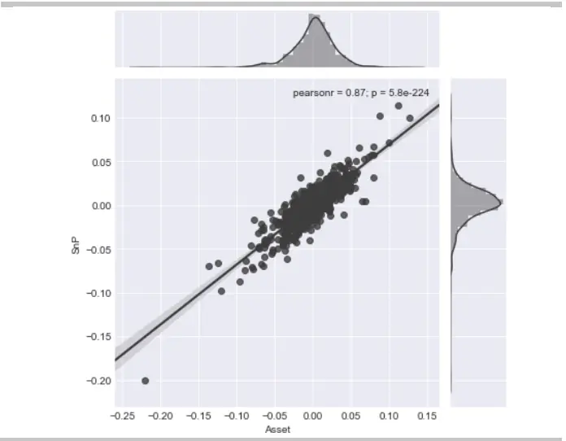

图 12： 标普因子与美国短期波动率联合分布
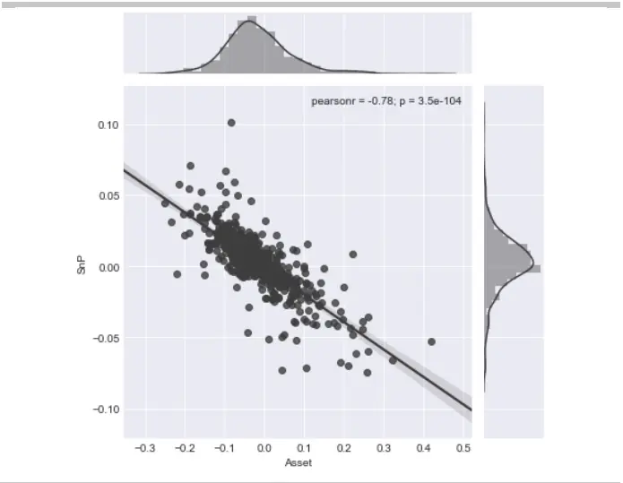

数据来源：Bloomberg 华泰期货研究院

数据来源：Bloomberg 华泰期货研究院

商品市场，除贵金属外，均与标普因子表现一定的尾部正相关，其中原油的相关性表现最强，因此在构造投资组合时，应着重关注原油在股市极端行情下的尾部风险。贵金属与标普因子在四个尾部象限下的期望等待时间比较平均，从联合分布图上可以看到，两者的分布比较分散，相关关系很弱，没有表现出明显的尾部正相关或负相关。

图 13： 标普因子与原油的联合分布
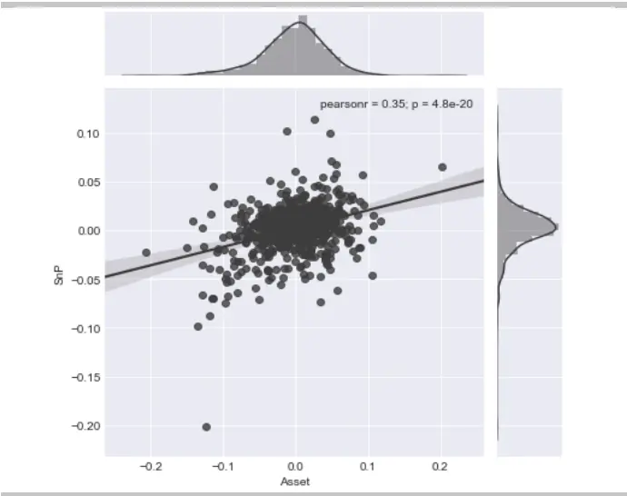
数据来源：Bloomberg 华泰期货研究院

图 14： 标普因子与贵金属的联合分布
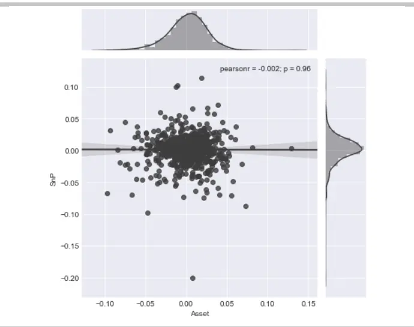
数据来源：Bloomberg 华泰期货研究院

在债券市场上，美国国债和标普因子呈现一定程度的负向尾部相关性，但是新兴市场债券与标普因子却呈现较强的正向尾部相关性，并且该资产对标普因子下跌的极端行情更为敏感，也就是说，新兴市场债券跟标普因子总体上呈现同涨同跌的趋势，但是和同涨相比，新兴市场债券更倾向于同跌。

## 4.5 美国国债收益率对于各类资产的压力测试

对各类资产进行不同国债收益率水平下的压力测试，测试结果如下表所示：

表格 9：国债收益率因子与各类资产共同发生尾部风险的期望时间（天）

| 资产类别 | (10%,10%) | (10%,90%) | (90%,10%) | (90%,90%) |
| --- | --- | --- | --- | --- |
| 标普 500ETF | 8.81 | 0.28 | 0.00 | 5.68 |
| 富时欧洲 ETF | 7.36 | 0.70 | 2.10 | 3.16 |
| MSCI 日本 ETF | 5.97 | 1.99 | 0.85 | 3.98 |
| 上证 50ETF | 5.02 | 2.87 | 2.51 | 4.66 |
| 安硕美国短期国债ETF | 0.00 | 19.41 | 17.35 | 0.00 |
| 安硕美国中期国债ETF | 0.00 | 12.94 | 13.82 | 0.00 |
| 安硕美国长期国债ETF | 0.00 | 10.00 | 8.53 | 0.00 |
| 安硕新兴市场债券ETF | 4.84 | 4.40 | 1.76 | 3.08 |
| PowerShares 农产品 ETF | 4.45 | 2.02 | 6.07 | 1.62 |
| PowerShares 基本金属 ETF | 6.07 | 1.62 | 1.62 | 5.26 |
| USCF 原油 ETF | 3.81 | 1.14 | 1.91 | 2.29 |
| SPDR 贵金属 ETF | 2.06 | 5.14 | 5.14 | 1.71 |

资料来源：Bloomberg 华泰期货研究院

同股票类资产对标普因子的反应一样，国债收益率因子选择的是美国3 年期的国债收益率，所以跟踪美国债券的资产会和国债收益率呈现出较高的相关性，因为收益率与债券价格之间是负相关的，所以债券类资产与国债收益率因子之间存在较高的尾部负相关性，其中短期的国债对收益率因子的极端情况反应更剧烈。

国债收益率和挂钩日元的资产表现出比较强烈的尾部负相关，和其他货币币种的相关性没有那么强烈。国债收益率对于商品类资产的影响也比较温和，没有表现出较明显的尾部正相关或负相关。

不过值得注意的是，通常情况下，会认为债券和股票之间的相关性较低，但是在尾部的压力测试中可以看到在极端行情下，两者的相关性会变高，并且这种时变的相关性在市场恶劣的情况下表现的更为明显。本文测试了四个股票市场与收益率因子的尾部效应，发现美国股市与国债收益率的尾部正相关性最强，欧洲股市次之。

图 15： 国债收益率因子与日元的联合分布
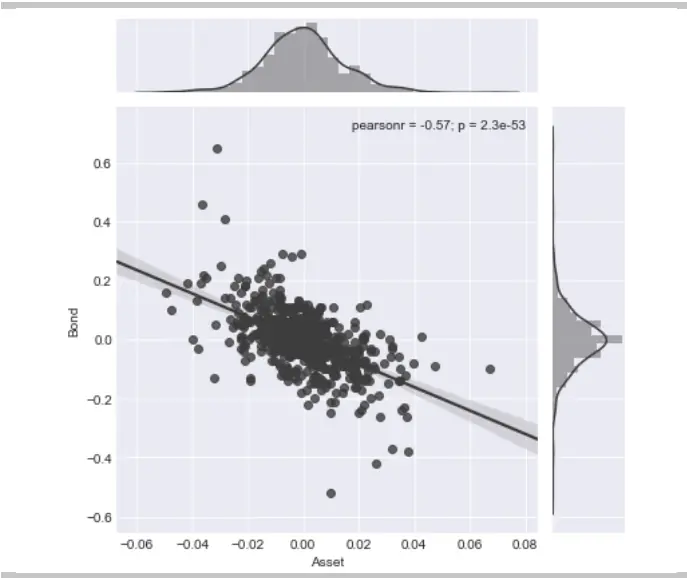
数据来源：Bloomberg 华泰期货研究院

图 16： 国债收益率因子与美国股市的联合分布
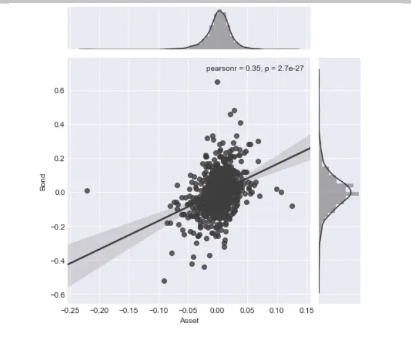
数据来源：Bloomberg 华泰期货研究院

## 4.6 美元指数因子对于各类资产的压力测试

美元指数因子对各类资产尾部相关性的压力测试结果如下：

表格 10：美元因子与各类资产共同发生尾部风险的期望天数（天）

| 资产类别 | (10%,10%) | (10%,90%) | (90%,10%) | (90%,90%) |
| --- | --- | --- | --- | --- |
| 标普500ETF | 2.27 | 5.11 | 3.69 | 2.27 |
| 富时欧洲 ETF | 0.35 | 9.12 | 9.82 | 0.00 |
| MSCI 日本ETF | 2.84 | 7.10 | 4.55 | 1.70 |
| 上证 50ETF | 1.08 | 6.46 | 3.23 | 3.23 |
| 安硕美国短期国债ETF | 1.47 | 5.00 | 4.12 | 1.76 |
| 安硕美国中期国债ETF | 3.24 | 4.71 | 5.59 | 2.65 |
| 安硕美国长期国债ETF | 3.24 | 3.82 | 3.53 | 4.12 |
| 安硕新兴市场债券ETF | 1.32 | 6.60 | 4.84 | 2.20 |
| PowerShares 农产品 ETF | 0.40 | 8.50 | 6.07 | 2.02 |
| PowerShares 基本金属 ETF | 0.40 | 8.50 | 6.47 | 1.21 |
| USCF 原油 ETF | 1.91 | 6.48 | 5.72 | 1.91 |
| SPDR 贵金属 ETF | 0.00 | 12.02 | 8.14 | 0.39 |

资料来源：华泰期货研究院

从上表中可以看到，商品市场与美元指数有着较强的尾部负相关性，其中以贵金属最为明显，在（10%，90%）和（90%，10%）两个区域期望等待天数分别为12.02 和 8.14天，而农产品、基本金属和石油也存在着较为明显的尾部负相关。

在股票市场中，美元与欧洲股票 ETF 存在着较强的尾部负相关，这和本文采用的欧洲股票ETF以美元计价有关。美国股票、日本股票和中国股票在（10%，90%）区域均有较明显的尾部负相关，反映出在美元大幅上行的过程中，全球股票的表现均较为疲软。

债券类资产与美元指数的尾部相关性则较不显著。

图 17： 美元因子与中国股票的联合分布
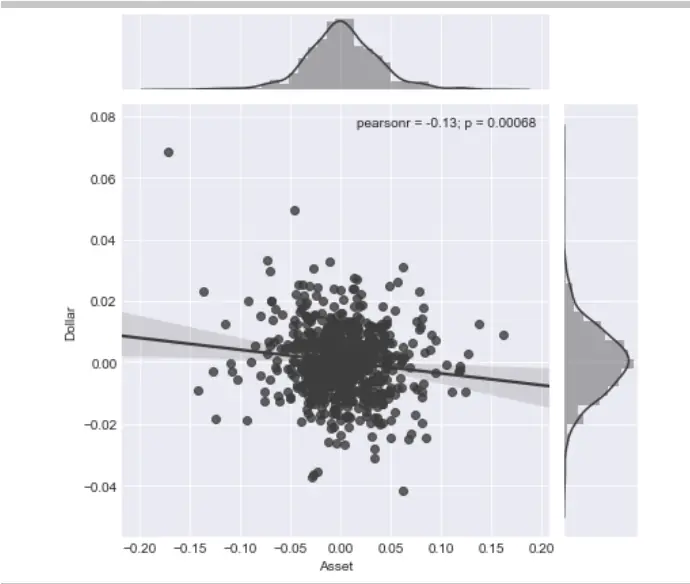
数据来源：Bloomberg 华泰期货研究院

图 18： 美元因子与贵金属的联合分布 单位（%）
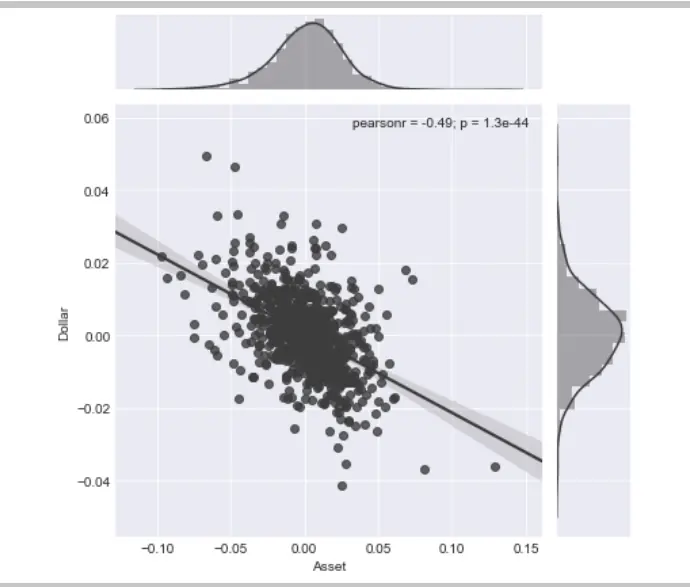
数据来源：Bloomberg 华泰期货研究院

## 4.7 原油指数因子对于各类资产的压力测试

原油指数因子对各类资产尾部相关性的压力测试结果如下：

表格 11：原油因子与各类资产共同发生尾部风险的期望天数（天）

| 资产类别 | (10%,10%) | (10%,90%) | (90%,10%) | (90%,90%) |
| --- | --- | --- | --- | --- |
| 标普500ETF | 6.82 | 2.27 | 2.56 | 4.55 |
| 富时欧洲 ETF | 9.12 | 1.40 | 1.40 | 5.26 |
| MSCI 日本ETF | 6.25 | 2.56 | 1.42 | 5.68 |
| 上证 50ETF | 3.95 | 3.23 | 2.51 | 3.23 |
| 安硕美国短期国债ETF | 2.06 | 2.94 | 3.53 | 3.24 |
| 安硕美国中期国债ETF | 1.47 | 4.12 | 5.88 | 3.53 |
| 安硕美国长期国债ETF | 1.76 | 4.12 | 7.06 | 2.06 |
| 安硕新兴市场债券ETF | 7.92 | 1.76 | 2.20 | 4.84 |
| PowerShares 农产品 ETF | 7.28 | 1.62 | 0.81 | 4.45 |
| PowerShares 基本金属 ETF | 8.90 | 0.81 | 0.40 | 6.07 |
| USCF 原油 ETF | 17.91 | 0.76 | 0.38 | 14.10 |
| SPDR 贵金属 ETF | 7.20 | 1.03 | 3.09 | 3.77 |

资料来源：华泰期货研究院

从上表中可以看到，与原油指数尾部相关性最强的为原油 ETF本身。除此之外，原油作为商品之王，与农产品、基本金属、贵金属也都预期有着十分明显的尾部相关性，其中以基本金属最为显著。

在股票市场中，原油作为全球经济发展血液，与各个国家之间的股票价格也存在着一定的尾部相关性。美国股票、日本股票和欧洲股票均会受到原油指数的强烈冲击，其中以欧洲股票为甚，在（10%，10%）的区域中等待天数为9.12天，在（90%，90%）的区域中等待天数为5.26天，说明在原油出现暴跌的过程中，欧洲股票也往往会呈现出显著下行的表现。

在债券类资产中，与原油指数的尾部负相关较为明显，最为显著的是长期国债的（90%，10%）区域，等待天数为 7.06 天，反映出在原油价格大跌的过程中，长期国债收益率能有较好的表现。

图 19： 原油因子与欧洲股票的联合分布
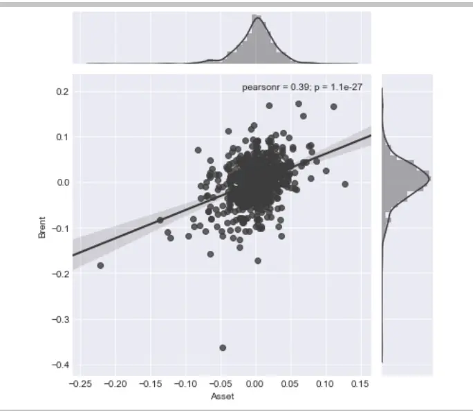
数据来源：Bloomberg 华泰期货研究院

图 20： 原油因子与基本金属的联合分布
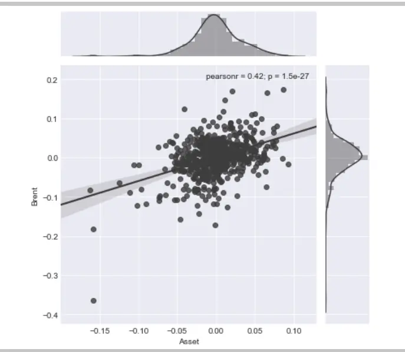
数据来源：Bloomberg 华泰期货研究院

## 4.8 融入机器学习的风险预算模型

根据 Roncalli 等（2012），风险预算的模型求解与风险平价类似，也可以转化为以下二次规划问题，最小化各类资产对目标组合风险贡献差值的平方和， $b_{i}$ 是各资产对组合的目标总体风险贡献比例：

即：

$$
min\sum_{i,j}(\frac{TRC_{i}}{b_{i}}-\frac{TRC_{j}}{b_{j}})^{2}
$$

$$
min\sum_{i,j}(\frac{x_{i}(\Sigma\mathbf{x})_{i}}{b_{i}}-\frac{x_{j}(\Sigma\mathbf{x})_{j}}{b_{j}})^{2}
$$

$$
s.t.\left\{\begin{matrix}1^{T}x=1\\0\leq x\leq1\end{matrix}\right.
$$

对于机器学习预测下期下跌的资产，设置其 $.b_{i}$ 为 0，并在机器学习预测下期上涨的资产列表内平分风险贡献比例。

这里设置了同样在股票、债券、商品三个层面做风险平价策略，并且参考基金经理意见的Invesco Balanced-Risk Allocation Fund 作为对照组。虽然组合标的并不完全一致，但是可以看到三个组合的走势十分相似，并且在净值表现上，融入了机器学习预测结果的风险预算模型十分突出。

图 21： 风险平价、风险预算组合净值
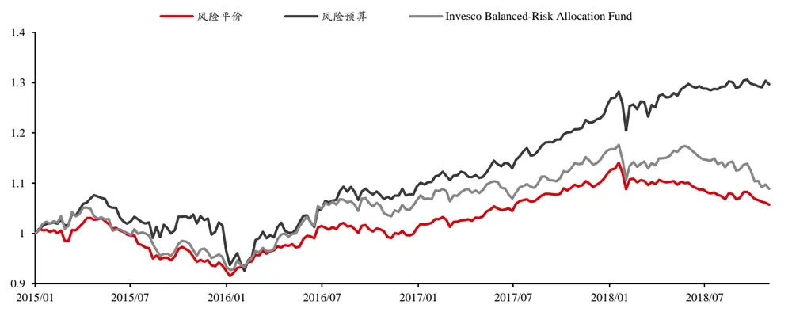
数据来源：华泰期货研究院

相对风险平价模型 1.4%的年化收益率，风险预算模型达到了 6.71%，同时风险预算模型继承了风险平价模型低波动率、低最大回撤的优势。最终风险预算模型的夏普比率还是达到了 0.82，超过了风险平价模型的0.28。

表格 12：风险平价、风险预算组合风险收益属性

| 组合策略 | 年化收益率 | 年化波动率 | 最大回撤 | 夏普比率 |
| --- | --- | --- | --- | --- |
| 风险平价 | 1.40% | 5.08% | -11% | 0.28 |
| 风险预算 | 6.71% | 8.20% | -14% | 0.82 |
| Invesco | 2.15% | 6.81% | -12% | 0.32 |

资料来源：华泰期货研究院

从结果可以看出，根据机器学习预测收益率对风险平价模型进行调整后得到的风险预算模型在风险收益属性上有所提升，本质是因为风险预算模型避免了组合内资产收益率下行的风险。再结合风险平价模型固有的在解决收益率波动问题上的优势，风险预算模型往往能取得不错的效益。

## 4.9 各类宏观因子对资产配置组合的压力测试

本节中，本文分别将模型中用到的四个宏观因子（标普500指数、美国三年期国债收益率、美元指数和布伦特原油价格）对四类资产配置模型（等权重组合、最小方差组合、风险平价组合、风险预算组合）进行压力测试，使用 Copula 函数对组合收益率在市场极端情况的压力测试，度量市场危机发生的期望等待时间。

本文在宏观因子和投资组合的收益率构建成的联合分布中，分别设投资组合和资产为X和Y，分别取联合分布中落入 P(X<10%,Y<10%), P(X<10%,Y>90%), P(X>90%,Y<10%)和P(X>90%,Y>90%)四个区域的概率，并将该概率乘以 250 个交易日，得到度量市场危机发生的期望等待时间。假设某因子与某资产在尾部是完全独立的，则通过Copula 函数计算的期望天数应约为 2.5 天左右；而若两者在尾部的相关性趋近完全相关，期望天数应接近 25天。

表格 13：标普因子与各类投资组合共同发生尾部风险的期望天数（天）

| 资产类别 | (10%,10%) | (10%,90%) | (90%,10%) | (90%,90%) |
| --- | --- | --- | --- | --- |
| 等权重组合 | 13.00 | 0.59 | 0.00 | 12.41 |
| 最小方差组合 | 9.46 | 1.77 | 1.18 | 8.87 |
| 风险平价组合 | 10.64 | 0.59 | 0.59 | 10.64 |
| 风险预算组合 | 11.82 | 0.00 | 0.00 | 15.37 |

资料来源：华泰期货研究院

标普 500 指数作为全球最具代表性的股票指数，在资产配置的组合中起到了举足轻重的位置，因此在四类模型中，当标普 500 指数价格出现大幅下跌的时候，策略同样出现了显著回撤，在（10%，10%）和（90%，90%）区域的期望等待天数均显著大于 2.5 天，反映出该因子对投资组合具有较强的尾部相依性。

表格 14：国债收益率因子与各类投资组合共同发生尾部风险的期望天数（天）

| 资产类别 | (10%,10%) | (10%,90%) | (90%,10%) | (90%,90%) |
| --- | --- | --- | --- | --- |
| 等权重组合 | 3.55 | 2.36 | 2.36 | 1.77 |
| 最小方差组合 | 2.36 | 5.91 | 6.50 | 1.18 |
| 风险平价组合 | 2.96 | 4.14 | 4.14 | 1.18 |
| 风险预算组合 | 3.55 | 2.96 | 1.77 | 2.96 |

资料来源：华泰期货研究院

国债收益率因子与最小方差组合和风险平价组合的联合分布存在较弱的尾部负相关，而在等权重组合和风险预算组合中，尾部相依性显著降低，未表现出显著的尾部相依性。

图 22： 风险预算组合与标普因子的联合分布
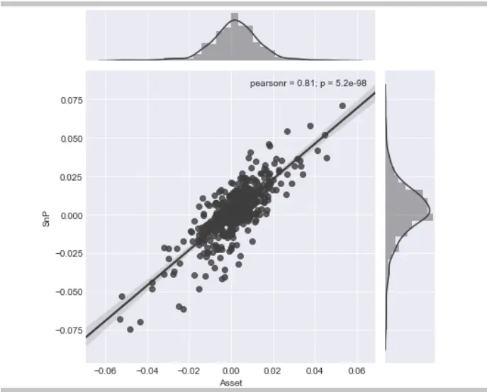
数据来源：Bloomberg 华泰期货研究院

图 23： 风险预算组合与国债收益率因子的联合分布
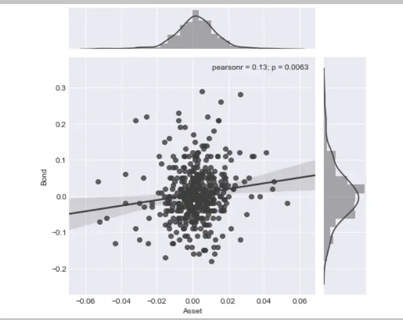
数据来源：Bloomberg 华泰期货研究院

表格 15：美元因子与各类投资组合共同发生尾部风险的期望天数（天）

| 资产类别 | (10%,10%) | (10%,90%) | (90%,10%) | (90%,90%) |
| --- | --- | --- | --- | --- |
| 等权重组合 | 1.18 | 7.68 | 11.23 | 1.18 |
| 最小方差组合 | 0.59 | 6.50 | 5.91 | 1.77 |
| 风险平价组合 | 0.59 | 7.09 | 9.46 | 1.18 |
| 风险预算组合 | 2.36 | 7.09 | 7.09 | 1.18 |

资料来源：华泰期货研究院

美元因子与投资组合存在一定的尾部负相关，即在美元走强时，组合收益率偏低，而在美元弱势时，组合收益率较为可观。在以上四个模型中，最小方差组合的尾部相依性最弱，尾部风险最小。

表格 16：原油因子与各类投资组合共同发生尾部风险的期望天数（天）

| 资产类别 | (10%,10%) | (10%,90%) | (90%,10%) | (90%,90%) |
| --- | --- | --- | --- | --- |
| 等权重组合 | 10.64 | 0.59 | 0.00 | 7.09 |
| 最小方差组合 | 8.27 | 1.77 | 0.00 | 4.14 |
| 风险平价组合 | 10.05 | 0.59 | 0.00 | 5.91 |
| 风险预算组合 | 8.27 | 1.18 | 0.00 | 3.55 |

资料来源：华泰期货研究院

原油因子则与投资组合存在一定的尾部正相关，当原油收益率下跌落入收益率分布的 10%区间内时，四类投资组合均呈现一定的尾部相依性，四类模型中，最小方差组合和风险预算组合的尾部相依性较弱。

图 24： 风险预算组合与美元因子的联合分布
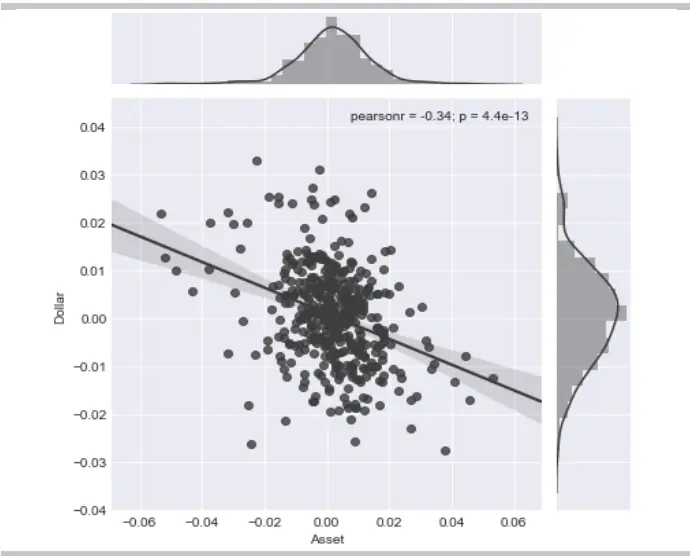
数据来源：Bloomberg 华泰期货研究院

图 25： 风险预算组合与原油因子的联合分布
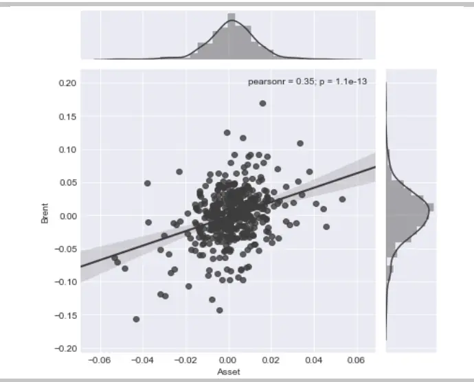
数据来源：Bloomberg 华泰期货研究院

综合来看，在四中大类资产配置模型中，风险预算组合和最小方差组合相较另外两种组合而言，对于四类宏观因子的尾部相依性较弱，在压力测试中呈现出相对较低的尾部风险。

而在四类宏观因子中，标普500指数收益率与风险预算组合的尾部相依性最强，落入（10%，10%）区间的期望等待天数为11.82天，其次是原油因子，在（10%，10%）区间等待天数为 8.27天，两者均呈现出较强的尾部相依性，反映在标普500指数或原油价格出现暴跌的过程中，投资组合都将会受到较为明显的负面冲击。

而风险预算组合在国债因子中的（10%，10%）和（90%，10%）区间等待天数分别为3.55天和 1.77天，反映出这风险预算组合于国债因子在尾部接近相互独立，没有明显的尾部相依性。美元因子与风险预算组合在（10%，90%）和（90%，10%）两个区域的期望等待天数均为 7.09 天，反映出两者存在一定尾部相依性，且为尾部负相关。

## 五、2019年国内商品期货配置建议

## 5.1 主观观点的风险预算模型历史回测

延续上文的思路，针对国内的商品期货配置，本文也从风险平价模型出发，并根据主观观点进一步生成风险预算模型。上文中选择了机器学习模型生成的结果作为主观观点，此部分采用研究人员主观观点作为模型的输入。选取2017年作为例子展示风险预算模型的优势，2017 年上半年内商品期货市场经历了大幅的下跌，并在下半年开始修复行情，期间资产经历了收益率的下行以及波动率的上升。各大类商品风险收益属性如下表。

表格 17：2017 年 1 月至 2017 年 12 月备选商品期货风险收益属性

| 资产名称 | 年化收益率 | 年化波动率 | 最大回撤 | 夏普比率 |
| --- | --- | --- | --- | --- |
| Wind 贵金属 | -1.77% | 9.49% | -8.12% | -0.19 |
| Wind 有色 | 13.96% | 14.92% | -9.15% | 0.94 |
| Wind 煤焦钢矿 | 20.24% | 33.12% | -25.88% | 0.61 |
| Wind 非金属建材 | 16.02% | 21.64% | -15.14% | 0.74 |
| Wind 能源 | 31.83% | 20.99% | -17.97% | 1.52 |
| Wind 化工 | -3.36% | 23.35% | -28.09% | -0.14 |
| Wind 谷物 | 18.23% | 9.00% | -4.89% | 2.02 |
| Wind 油脂油料 | -11.32% | 11.78% | -16.38% | -0.96 |
| Wind 软商品 | -11.15% | 11.33% | -14.28% | -0.98 |

资料来源：华泰期货研究院

风险预算模型在风险平价的基础上，加入对各大类商品的主观判断，预期下跌的资产风险权重设为 0，其余资产平均分配风险权重。

可以看到风险平价模型相对商品指数在波动率和最大回撤上有较明显的优势，风险平价模型的年化波动率和最大回撤分别为 8.62%、7.52%，商品指数分别为 15.11%、13.20%，两者夏普比则相差不多。在经过主观观点调整后，风险预算模型在波动率和最大回撤上与继承了风险评价模型的优势，在年化收益率上则大幅提高，并且风险预算模型的夏普比率也提高到了 1.90。

图 26： 2017 年 1 月至 2017 年 12 月风险平价、风险预算、商品指数净值
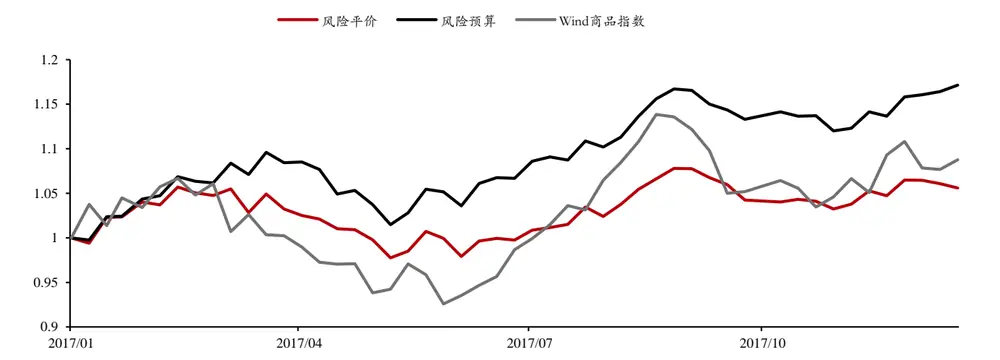
数据来源：华泰期货研究院

表格 18：2017 年 1 月至 2017 年 12 月风险平价、风险预算、商品指数风险收益属性

| 组合策略 | 年化收益率 | 年化波动率 | 最大回撤 | 夏普比率 |
| --- | --- | --- | --- | --- |
| 风险平价 | 5.72% | 8.62% | -7.52% | 0.66 |
| 风险预算 | 17.52% | 9.23% | -7.39% | 1.90 |
| Wind 商品指数 | 8.94% | 15.11% | -13.20% | 0.59 |

资料来源：华泰期货研究院

## 5.2 2019 年主观风险预算模型商品配置建议

与上文类似，针对明年国内的大宗商品市场，截取华泰期货研究院对于明天国内的期货市场判断，具体详见《华泰期货研究院商品策略年报》系列。

表格 19：2019 年国内商品板块配置建议
2019 年商品板块配置

| 超配板块 |  |
| --- | --- |
| 能化板块 贵金属 | 农产品 |
| 低配板块 | 黑色板块 有色板块 |
| 本文遵循同样的步骤，展示了不做主观预测的风险平价模型，该配置组合将组合风险平均 |  |
| 分配在各资产上，可以有效降低组合波动率以及最大回撤；其次是根据明年资产涨跌预测 |  |
| 结果调整的风险预算模型，按模型历史表现情况，该配置组合预期相比传统风险平价模型， 在保持低波动率、低回撤的同时，可以有效提高组合的收益率。 |  |

表格 20：2019 年国内大宗商品产两种配置建议

| 资产名称 | 风险平价 | 风险预算 |
| --- | --- | --- |
| Wind 贵金属 | 19.8% | 21.0% |
| Wind 有色 | 9.3% | 0.0% |
| Wind 煤焦钢矿 | 4.5% | 0.0% |
| Wind 非金属建材 | 7.9% | 0.0% |
| Wind 能源 | 6.2% | 11.9% |
| Wind 化工 | 6.5% | 9.1% |
| Wind 谷物 | 19.9% | 23.2% |
| Wind 油脂油料 | 13.1% | 16.6% |
| Wind 软商品 | 12.9% | 18.1% |

资料来源：华泰期货研究院

## 免责声明

此报告并非针对或意图送发给或为任何就送发、发布、可得到或使用此报告而使华泰期货有限公司违反当地的法律或法规或可致使华泰期货有限公司受制于的法律或法规的任何地区、国家或其它管辖区域的公民或居民。除非另有显示，否则所有此报告中的材料的版权均属华泰期货有限公司。未经华泰期货有限公司事先书面授权下，不得更改或以任何方式发送、复印此报告的材料、内容或其复印本予任何其它人。所有于此报告中使用的商标、服务标记及标记均为华泰期货有限公司的商标、服务标记及标记。

此报告所载的资料、工具及材料只提供给阁下作查照之用。此报告的内容并不构成对任何人的投资建议，而华泰期货有限公司不会因接收人收到此报告而视他们为其客户。

此报告所载资料的来源及观点的出处皆被华泰期货有限公司认为可靠，但华泰期货有限公司不能担保其准确性或完整性，而华泰期货有限公司不对因使用此报告的材料而引致的损失而负任何责任。并不能依靠此报告以取代行使独立判断。华泰期货有限公司可发出其它与本报告所载资料不一致及有不同结论的报告。本报告及该等报告反映编写分析员的不同设想、见解及分析方法。为免生疑，本报告所载的观点并不代表华泰期货有限公司，或任何其附属或联营公司的立场。

此报告中所指的投资及服务可能不适合阁下，我们建议阁下如有任何疑问应咨询独立投资顾问。此报告并不构成投资、法律、会计或税务建议或担保任何投资或策略适合或切合阁下个别情况。此报告并不构成给予阁下私人咨询建议。

华泰期货有限公司2018版权所有。保留一切权利。

## 公司总部

地址：广东省广州市越秀区东风东路761号丽丰大厦20层、29层04单元

电话：400-6280-888

网址：www.htgwf.com