## 不同市场环境下的股指期货日内趋势策略

不同市场环境微观结构变化

股指期货的日内趋势策略一直是股指期货交易的重要组成部分，在 2015 年的限仓以及后续的松绑政策的调节下，日内趋势策略所面临的市场环境已经发生了巨大的变化，这期间策略的具体表现以及策略的各项属性也十分不同。

根据期指的限仓以及松绑政策的节奏将历史交易日历划分成六个阶段，观察不同阶段的市场微观环境，主要包含四个微观维度：价格波动、买卖价差、订单簿不平衡以及久期。

## 价格波动：

成交价格波动逐渐恢复，低于限仓之前水平；挂单价格波动恢复较快，接近限仓之前水平；
超高频日内趋势策略空间较小，价格波动限制持仓周期变长。

## 买卖价差：

稳态买卖价差已经恢复较低水平，3 个最小变动单位左右；第三次松绑以来，极端行情买卖价差出现次数减少；稳定滑点、突发滑点影响均减小，理想交易结果更加贴近实际交易结果。

订单簿不平衡：

买卖数量偏离程度第三次松绑后有所修复；买卖数量偏离收益率单调性减弱，订单簿信息含量较少；基于订单簿不平衡的趋势策略难度加大。

久期：

价格久期逐渐修复，与限仓前相比差距不大；成交量久期逐渐修复，相比限仓前仍处于高位； 
高频趋势策略可行性增加，容量仍有待提升。

## 日内趋势策略表现

目前订单簿的信息含量不如限仓之前多，因此部分订单簿策略的可行性不高；另外价差上的损失大幅降低，给部分趋势策略提供了一定的空间，不过由于价格波动还有待修复，因此目前的趋势策略持仓周期需要相应的延长。

由于策略均是对价下单时的损益情况，因此策略实际的表现如何就更多的就取决于策略在开仓平仓时下单逻辑的优化，如果能在开平仓时做到比较好的操作，那么可以说部分日内的趋势策略在股指期货的第三次以及第四次松绑之后，已经存在一定的盈利空间。

## 华泰期货研究院 量化组

罗剑

量化研究员

- 0755-23887993

- luojian@htfc.com

从业资格号：F3029622

投资咨询号：Z0012563

## 华泰期货研究院 量化组

高天越

量化研究员

- 0755-23887993

- gaotianyue@htfc.com

从业资格号：F3055799

## 市场微观环境变化

股指期货的日内趋势策略一直是股指期货交易的重要组成部分，在 2015 年的限仓以及后续的松绑政策的调节下，日内趋势策略所面临的市场环境已经发生了巨大的变化，这期间策略的具体表现以及策略的各项属性也十分不同。

首先观察不同时期的市场微观环境发生的变化，主要包含四个微观维度，分别是价格波动、买卖价差、订单簿不平衡以及久期：

图 1：股指期货市场微观结构四类维度

数据来源：华泰期货研究院

并根据期指的限仓以及松绑政策的节奏将历史交易日历划分成六个阶段：
表格 1：历次股指期货松绑政策

|  | 限制前 2010-04-16 | 松绑前 | 第一次松绑 | 第二次松绑 | 第三次松绑 | 第四次松绑 2019-04-22 |
| --- | --- | --- | --- | --- | --- | --- |
|  |  | 2015-09-07 | 2017-02-17 | 2017-09-18 | 2018-12-03 |  |
|  | ~2015-09-02 | ~2017-02-16 | ~2017-09-15 | ~2018-11-30 | ~2019-04-19 | ~ |
| 日内开仓手数 保证金（非套 | ~ | 单品种10手 | 单品种 20 手 | 单品种 20 手 | 单合约 50 手 | 单合约 500 手 |
| 保) 保证金（套 | 10% | 40% | IF/IH:20%;IC:30% | IF/IH:15%;IC:30% | IF/IH:10%;IC:15% | IF/IH:10%;IC:12% |
| 保） | 10% | 20% | 20% | IF/IH:15%;IC:20% | IF/IH:10%;IC:15% | IF/IH:10%;IC:12% |
| 平今仓手续费 | 0.23%% | 23%% | 9.2%% | 6.9%% | 4.6%% | 3.45%% |

数据来源：中金所 华泰期货研究院

下面针对各微观结构展开分析。

## 价格波动

日内的价格波动包含三个不同的价格指标，分别是最新成交价 Last Price，最优买卖一档中间价Mid Price，以及最优买卖一档挂单数量加权的 Weighted Price。

三个价格序列中，last price 一般用来观察绝对的价格变化，但是因为参杂了主动和被动成交两个维度，所以变化比较剧烈；如果是研判价格的趋势性以及相关性，一般选用 Mid Price 或者Weighted Price。

图 2：价格波动介绍
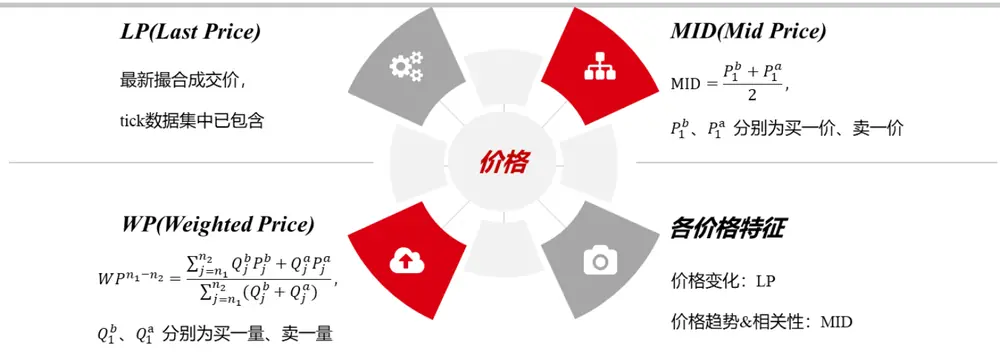
数据来源：华泰期货研究院

图 3、图 4 分别统计了在 1 个以及 10 个 tick内，Last Price 变化超过一个最小变动单位的概率，可以发现 1 个 tick内的波动已经和 11 年至 13 年比较接近，和 15 年相比差距明显；10 个 tick内的波动则和上市后至限仓前的几年差距都非常明显。注意这里的五根直线分别代表一次限仓以及四次松绑。

图3： LP 1 Tick内变化超过一个最小变动单位概率
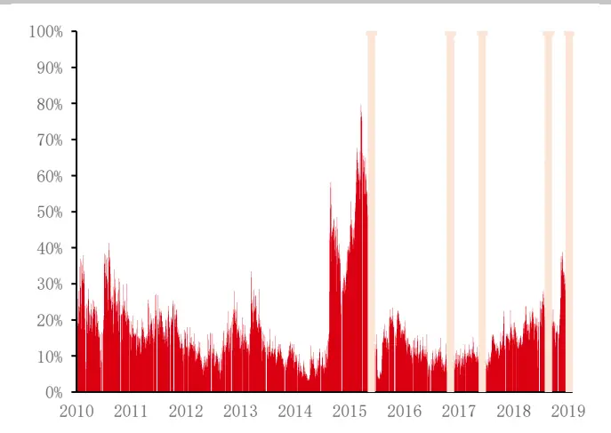
数据来源：Wind 华泰期货研究院

图 4：LP 10 Tick内变化超过一个最小变动单位概率
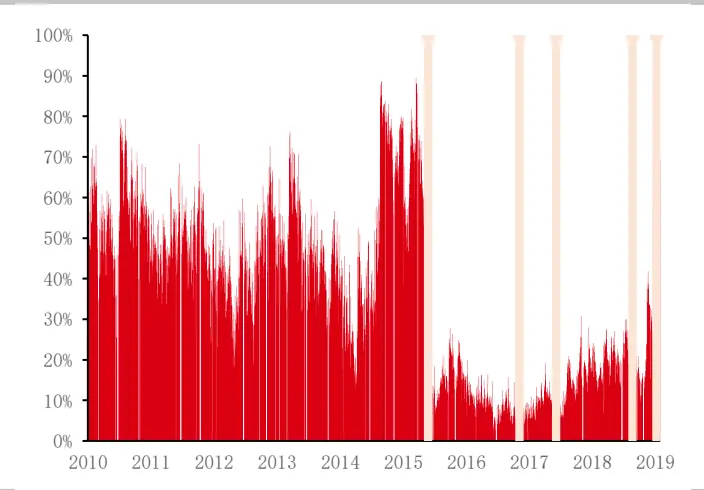
数据来源：Wind 华泰期货研究院

图 5、图 6 为 Mid Price 的具体表现，中间价和最新价在 1 个 tick 上的表现相差不多，都是接近或者超越 11 年至 13 年的水平，落后于 15 年的水平；主要是在 10 个 tick上有一些不同，中间价在 10 个 tick上的波动已经比较接近限仓前的水平。

图5： MID 1 Tick内变化超过一个最小变动单位概率
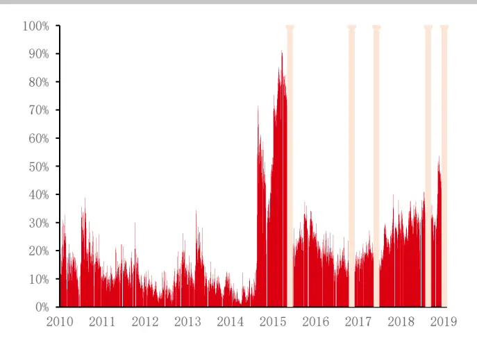
数据来源：Wind 华泰期货研究院

图 6：MID 10 Tick内变化超过一个最小变动单位概率
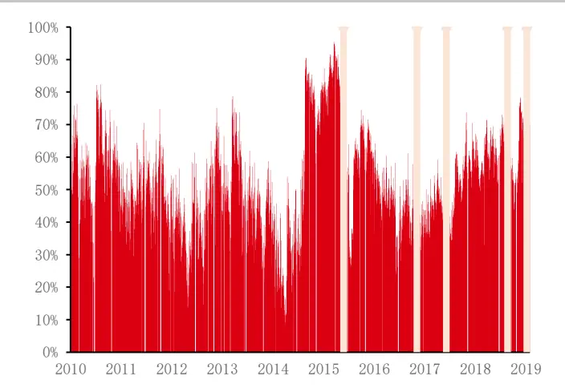
数据来源：Wind 华泰期货研究院

图 7、图 8 是加权价格的历史表现，加权价格的波动修复的更加好一点，不管是 1 个 tick 还是10 个 tick，都和 15 年的水平相差不大。

图7： WP 1 Tick 内变化超过一个最小变动单位概率
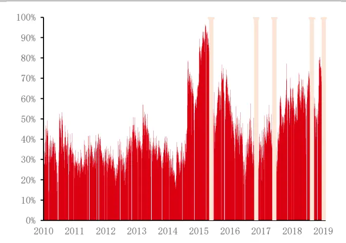
数据来源：Wind 华泰期货研究院

图 8：WP 10 Tick内变化超过一个最小变动单位概率
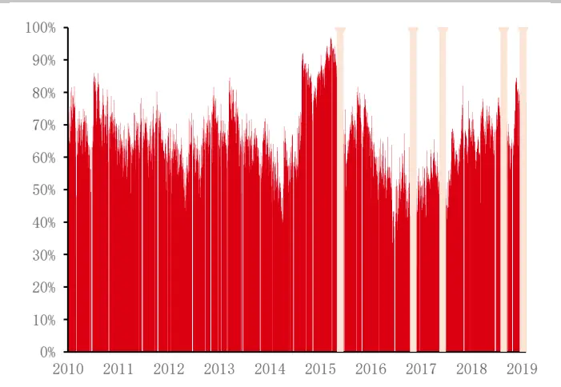
数据来源：Wind 华泰期货研究院

针对价格波动的变化，首先我们从三个价格的含义思考，假设订单簿的结构保持不变，那么由于主动成交和被动成交的存在，最新价应该会在买一价和卖一价上跳跃，而中间价保持不变，这种情况下最新价的波动应该大于中间价的波动，

但是实际观察到反而是中间价的波动比较大，体现出来的状态其实就是挂单的变化比较快，但是同时这些挂单并没有实际成交。

再从另一个角度考虑，1 个 tick的价格波动和 15 年相比仍有一定的差距，10 个 tick 的波动则是修复的比较好，所以目前一些超高频的趋势策略因为价格波动幅度较小，策略的空间还是非常小，稍低一些的高频趋势策略空间有所修复，但是还会因为价格波动的限制导致持仓周期需要相应的增加。

图 9：价格波动变化总结

数据来源：华泰期货研究院

## 买卖价差

其次是市场微观结构的第二个维度，最优买卖价差。图 10 可以看到历次松绑均给买卖价差带来了结构性的降低，目前和 2015 年的水平比较接近，不过仍有进一步下降的空间。

图 11 是每日的最大买卖价差，可以看到去年第三次松绑之后，最大买卖价差的极大值出现的情况已经消失了，不过最大买卖价差本身还是处于一个比较高的位置，这也是后续策略需要考虑的一个因素。

图 10：买卖价差均值
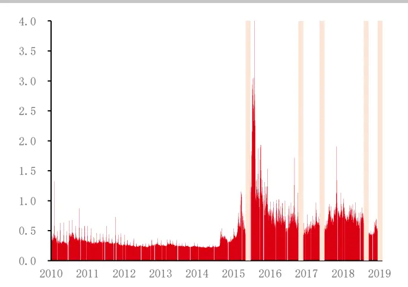
数据来源：Wind 华泰期货研究院

图 11： 最大买卖价差
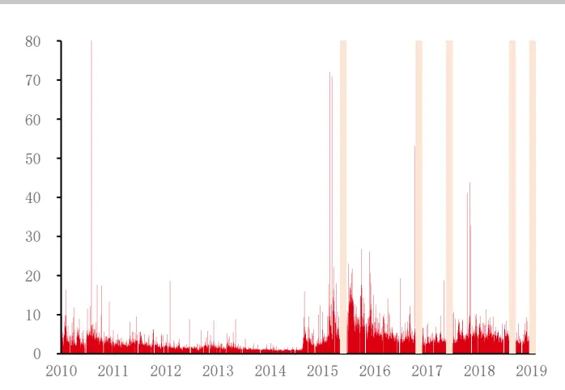
数据来源：Wind 华泰期货研究院

同样对买卖价差的变化做一个总结，目前的稳态买卖价差已经恢复到较低水平，大约 3 个最小变动单位左右，预期随着政策的进一步放松，有进一步下降的可能性；同时第三次松绑以来，极端情况下的买卖价差最大值出现次数有明显减少，最终对日内趋势策略的影响，主要体现在稳定滑点以及突发情况下滑点的进一步减小。

图 12： 买卖价差变化总结

数据来源：华泰期货研究院

## 订单簿不平衡

市场微观结构的第三个维度，订单簿不平衡。一般来说买一档和卖一档的挂单数量如果出现了较大的偏差，那么可以认为市场的多空力量存在不均衡，后续的市场将会由强势的一方主导，图13为根据买卖挂单的数量统计的订单簿不平衡的程度，可以看到限仓后一直到第三次松绑前，不平衡程度均处于低位，第三次松绑和第四次松绑之后，不平衡程度所有提升。

图 14 是最大的买卖数量偏离，限仓之后这个值持续处于低位，因为目前挂单的数量和限仓前不是一个数量级，因此挂单数量的偏差也相差很多。

图 13：买卖挂单偏离程度
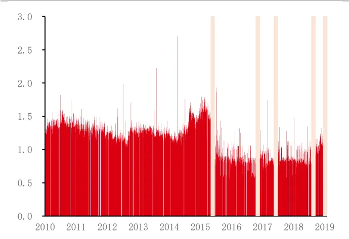
数据来源：Wind 华泰期货研究院

图 14： 最大买卖挂单数量偏离
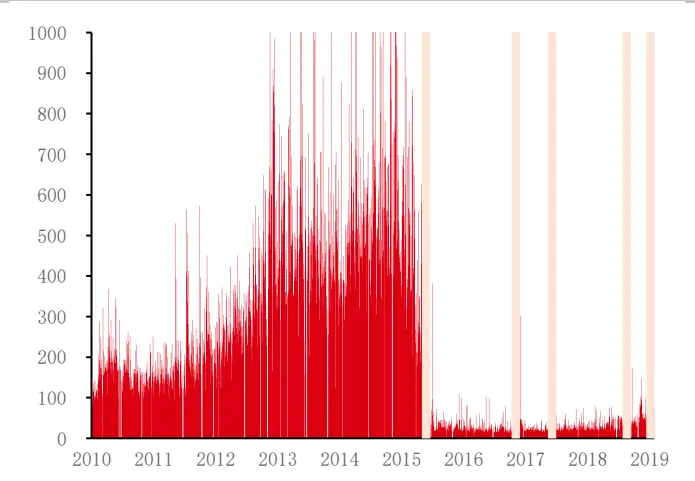
数据来源：Wind 华泰期货研究院

图 15 是订单簿不平衡因子的具体表现，也就是订单簿不平衡的状况与之后一段时间内期指收益率的关系，这里可以比较清楚的看到在限仓之前，订单簿平衡因子这根红线的单调性非常好，当空头挂单较多时，后续价格显著向下，多头挂单较多时，后续价格显著向上。即订单簿比较真实的体现出了市场多空双方的力量，并且后续市场的实际表现也验证了订单簿体现出来的信息有效性，可以说这段时间的订单簿不平衡的信息含量是非常充足的。在限仓之后，因子整体表现还是正的斜率，但是单调性远不如限仓之前，此时订单簿所携带的有效信息比较少。

图 15： 订单簿不平衡因子表现
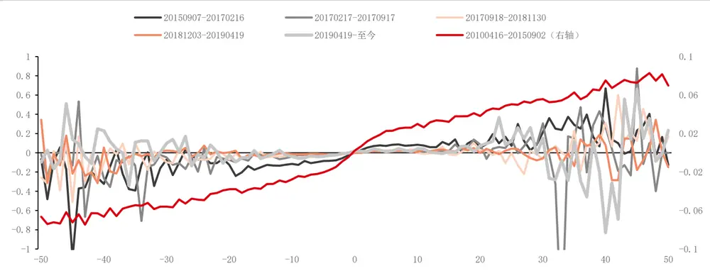
数据来源：华泰期货研究院

同样对订单簿不平衡做一个总结，目前订单簿的偏离程度逐渐修复，但是仍低于限仓之前的水平，同时偏离程度带来的单调性上的收益有所减弱，所以总的来说目前订单簿不平衡策略的难度较大。

图 16： 订单簿不平衡变化总结

数据来源：华泰期货研究院

## 久期

第四个微观维度久期的定义其实最早出现在交易久期上，也就是相邻的两笔交易间隔的时间，由于目前股指期货市场没有具体的撮合数据，所以这里提出两个新的久期，价格久期以及成交量久期，分别代表价格波动超过一定阈值所需要的时间，以及累积一定成交量所需要的时间。

图 17： 久期介绍
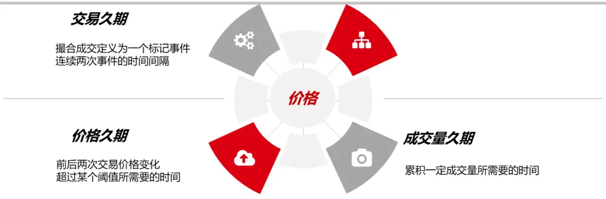
数据来源：华泰期货研究院

图 18 是价格波动 5 个最小变动单位所需要的 tick数量，可以看到限仓后价格久期逐渐增加，松绑后逐渐减小，一直到第四次松绑后，目前的价格久期已经和限仓前 15 年的低点相差不大；

图 19 成交量久期的修复情况就不如价格久期，虽然有比较明显的下降，但还是远远高于限仓之前的水平。

图 18：价格久期
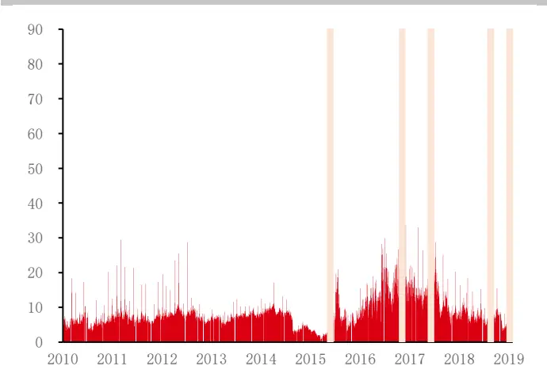
数据来源：Wind 华泰期货研究院

图 19： 成交量久期
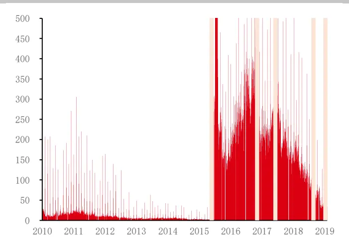
数据来源：Wind 华泰期货研究院

根据久期的变化，可以判断目前的日内高频趋势策略可行性有所恢复，但是策略的容量还有待进一步的提升。

图 20： 久期变化总结

数据来源：华泰期货研究院

## 日内趋势策略表现

可以看到股指期货市场的微观结构在历次松绑政策前后均发生了一定变化，下面我们针对股指期货日内趋势策略在不同时段的具体表现展开分析。

这里主要介绍四类日内趋势策略，分别是订单簿不平衡策略、价格偏离策略、均线策略以及动量策略。订单簿不平衡策略很简单，也就是买单相对卖单很多，那么就去做多，反之就做空；价格偏离策略主要是看买一价、卖一价以及最新价，如果最新价大于卖一价，那么策略认为存在新的空头力量，因此去做空，反过来也一样；均线策略和动量策略比较类似，这里就不多做介绍，也都是非常基础的趋势策略。

图 21： 久期变化总结
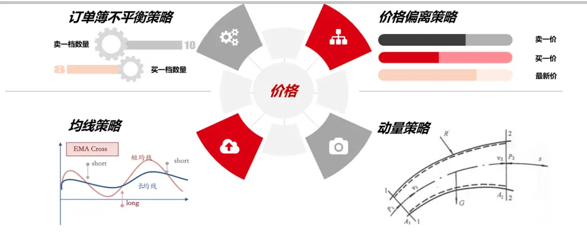
数据来源：华泰期货研究院

## 价格偏离策略

这里把每笔交易的损益拆分成三个维度，包括延迟 delay，趋势 trend 以及买卖价差 spread。

每个策略均是在观察到 tick 的交易信号之后，在下一个 tick 进行市价单的成交，那么就会有延迟带来的损益，以及趋势信号带来的在趋势上的损益，还有买卖操作带来的买卖价差上的损失。

首先看价格偏离策略，表格 2 可以看到策略在趋势端的收益以及在延迟端的损失和在买卖价差端的损失都有所提升，在第三次以及第四次松绑之后，买卖价差上的损失大幅下降，同时趋势上的收益并没有减小，因此策略获得了一定的可行性。

图 22：价格偏离策略
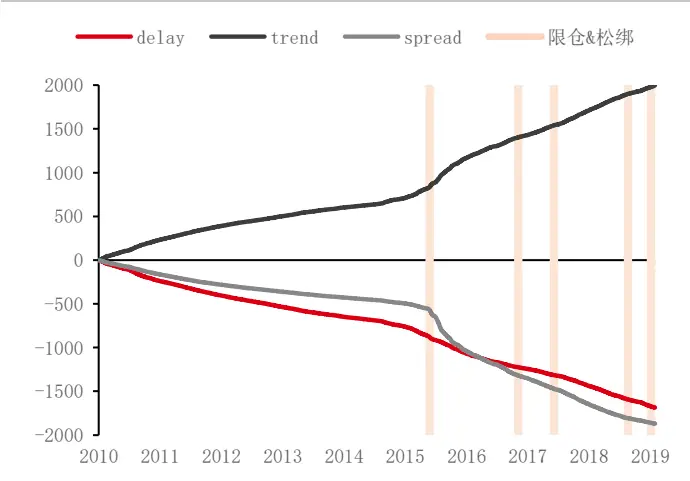
数据来源：Wind 华泰期货研究院

表格 2：价格偏离策略

|  | Delay | trend | spread |
| --- | --- | --- | --- |
| 20100416-20150902 | (0.68) | 0.64 | (0.43) |
| 20150907- 20170216 | (1.00) | 1.64 | (2.17) |
| 20170217-20170917 | (0.61) | 0.93 | (1.03) |
| 20170918-20181130 | (0.95) | 1.22 | (1.15) |
| 20181203-20190419 | (0.87) | 0.91 | (0.59) |
| 20190422-至今 | (1.14) | 1.20 | (0.59) |

数据来源：Wind 华泰期货研究院

## 订单簿不平衡策略

表格 3 可以看到订单簿不平衡策略在限仓之前，趋势上存在一定的收益，但是限仓之后，收益基本消失了，这也和之前做出的订单簿信息含量减弱的判断一致。因此这类策略如果想要表现不错的话，可能需要等待期指的进一步放开，目前订单簿的结构并不支持这类策略的盈利空间。

图 23：订单簿不平衡策略
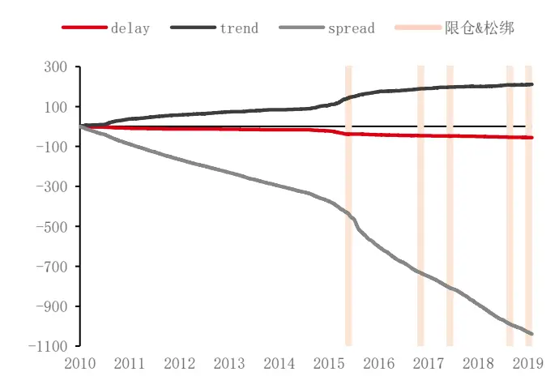
数据来源：Wind 华泰期货研究院

表格 3：订单簿不平衡策略

|  | Delay | trend | spread |
| --- | --- | --- | --- |
| 20100416- 20150902 | (0.03) | 0.11 | (0.33) |
| 20150907- 20170216 | (0.02) | 0.13 | (0.86) |
| 20170217-20170917 | (0.02) | 0.06 | (0.50) |
| 20170918-20181130 | (0.02) | 0.04 | (0.62) |
| 20181203-20190419 | (0.01) | 0.02 | (0.47) |
| 20190422-至今 | (0.07) | 0.06 | (0.53) |

数据来源：Wind 华泰期货研究院

## 均线策略

表格 4 看到均线策略可以说是恢复的比较好的一类，目前在趋势上仍存在一定的收益，同时随着价差端损失的减小，策略存在一定的空间。

图 24： 均线策略
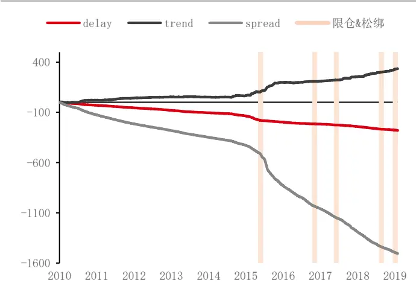
数据来源：Wind 华泰期货研究院

表格 4：均线策略

|  | Delay | trend | spread |
| --- | --- | --- | --- |
| 20100416-20150902 | (0.14) | 0.08 | (0.40) |
| 20150907-20170216 | (0.10) | 0.29 | (1.50) |
| 20170217-20170917 | (0.08) | 0.10 | (0.78) |
| 20170918-20181130 | (0.14) | 0.27 | (0.99) |
| 20181203-20190419 | (0.10) | 0.35 | (0.64) |
| 20190422 -至今 | (0.24) | 0.19 | (0.71) |

数据来源：Wind 华泰期货研究院

## 动量策略

最后是动量策略，动量策略和均线策略其实本质上都属于一类，这里的表现也相差不大，都是在趋势上有一定的收益、价差损失有一定的减少，同时延迟端的损失也不会特别大。

图 25： 动量策略
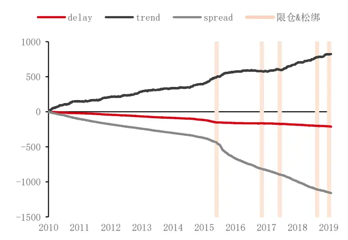
数据来源：Wind 华泰期货研究院

表格 5：动量策略

|  | Delay | trend | spread |
| --- | --- | --- | --- |
| 20100416 - 20150902 | (0.12) | 0.38 | (0.34) |
| 20150907- 20170216 | (0.04) | 0.24 | (1.08) |
| 20170217-20170917 | (0.06) | 0.14 | (0.55) |
| 20170918-20181130 | (0.10) | 0.62 | (0.73) |
| 20181203-20190419 | (0.07) | 0.41 | (0.47) |
| 20190422-至今 | (0.22) | 0.23 | (0.54) |

数据来源：Wind 华泰期货研究院

## 总结

目前订单簿的信息含量不如限仓之前多，因此部分订单簿策略的可行性不高；另外价差上的损失大幅降低，给部分趋势策略提供了一定的空间，不过由于价格波动还有待修复，因此目前的趋势策略持仓周期需要相应的延长。

由于策略均是对价下单时的损益情况，因此策略实际的表现如何就更多的就取决于策略在开仓平仓时下单逻辑的优化，如果能在开平仓时做到比较好的操作，那么可以说部分日内的趋势策略在股指期货的第三次以及第四次松绑之后，已经存在一定的盈利空间。

## 免责声明

此报告并非针对或意图送发给或为任何就送发、发布、可得到或使用此报告而使华泰期货有限公司违反当地的法律或法规或可致使华泰期货有限公司受制于的法律或法规的任何地区、国家或其它管辖区域的公民或居民。除非另有显示，否则所有此报告中的材料的版权均属华泰期货有限公司。未经华泰期货有限公司事先书面授权下，不得更改或以任何方式发送、复印此报告的材料、内容或其复印本予任何其它人。所有于此报告中使用的商标、服务标记及标记均为华泰期货有限公司的商标、服务标记及标记。

此报告所载的资料、工具及材料只提供给阁下作查照之用。此报告的内容并不构成对任何人的投资建议，而华泰期货有限公司不会因接收人收到此报告而视他们为其客户。

此报告所载资料的来源及观点的出处皆被华泰期货有限公司认为可靠，但华泰期货有限公司不能担保其准确性或完整性，而华泰期货有限公司不对因使用此报告的材料而引致的损失而负任何责任。并不能依靠此报告以取代行使独立判断。华泰期货有限公司可发出其它与本报告所载资料不一致及有不同结论的报告。本报告及该等报告反映编写分析员的不同设想、见解及分析方法。为免生疑，本报告所载的观点并不代表华泰期货有限公司，或任何其附属或联营公司的立场。

此报告中所指的投资及服务可能不适合阁下，我们建议阁下如有任何疑问应咨询独立投资顾问。此报告并不构成投资、法律、会计或税务建议或担保任何投资或策略适合或切合阁下个别情况。此报告并不构成给予阁下私人咨询建议。

华泰期货有限公司2018版权所有。保留一切权利。

## 公司总部

地址：广东省广州市越秀区东风东路761号丽丰大厦20层、29层04单元

电话：400-6280-888

网址：www.htfc.com