## 套期保值助平安

## ——市场套期保值机会扫描

## 摘要：

在上一期的报告，我们将套期保值中的基本概念及主要服务对象特点进行了初步的介绍。套期保值策略的目标比较明确—降低持有资产的风险；简单地说就是降低未来资产价格的不确定性。从套保方，特别是产业资本的角度来说，这是稳定未来企业现金流的关键要素之一。

另一方面，套期保值又有其复杂的一面。作为一个服务性质很强的策略，需要从套保方的真实需求出发，在可行性分析的前期调研基础上展开下一步的套保策略定制化处理。同时，套期保值本质上是一个交易型策略，完整的套保实施过程还涉及基差风险、行情研判、交易择时等等。所以，我们认为套期保值是一个专业化程度较高的策略类型。

而从量化模型开发的角度来说，专业性深挖的第一步就是对数据的理解。本文将承接前文所提及的模型开发流程，将套保模型作用于多个商品板块，并通过历史回撤，观察套期保值模型的普遍有效性。我们将会侧重从不同商品的波动性出发，从每个商品板块中挑选历史“风险程度”较高的商品来进行套保测试。同时，结合了黑色板块研究员的最新研究结果[1]，我们还会挑选近期风险预期会升高的商品进行测试。未雨绸缪，以资相关套保方参考。

投资咨询业务资格：

证监许可【2011】1289 号

研究院 量化组

研究员

罗剑

- 0755-23887993

- luojian@htfc.com

从业资格号：F3029622

投资咨询号：Z0012563

## 陈辰

- 0755-23887993

- chenchen@htfc.com

从业资格号：F3024056

投资咨询号：Z0014257

## 何绪纲

- 0755-23887993

- hexugang@htfc.com

从业资格号：F3069194

## 一、 大宗商品风险分布

与收益率不同，风险是一个较难量化的金融指标。这里我们暂不做进一步讨论，而将收益率的标准差（波动率）作为风险指标进行研究。通常我们认为大宗商品期货价格波动性较大，是风险相对较高的金融产品。我们将首先考察不同大宗商品的风险分布。

图 1：商品期货全品种波动率分布
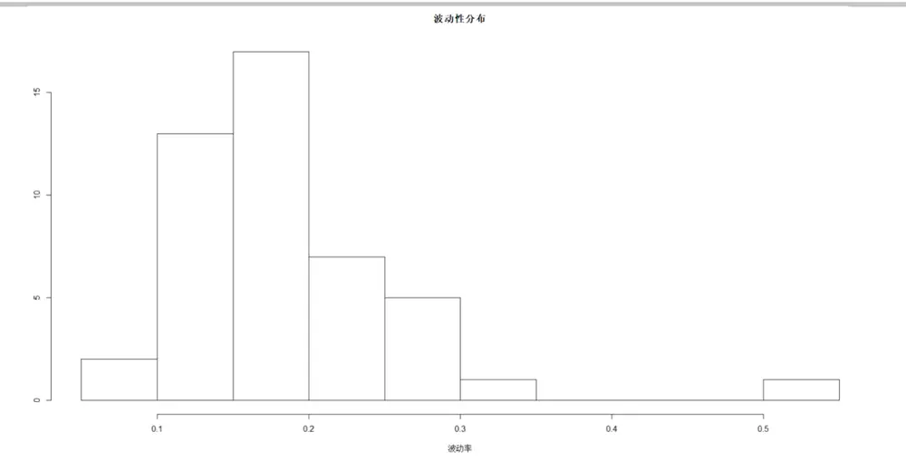
数据来源：Wind 天软 华泰期货研究院

我们看到，实际上，不同商品的历史风险程度差异非常大，不可一概而论。绝大部分商品期货的收益率标准差都集中 15%-25%之间—均值为18.6%，标准差为7.3%。但是，有相当多的品种存在较大偏离，从波动率最小的玉米10%左右到 50%的纤维板。作为比较，我们看到三大股指期货的波动率均值为 24.2%，所以实际上商品期货的历史波动率并未明显高出国内的股指期货风险程度。当然，我们知道大宗商品的收益率具有相对于股票相对独立的风险来源（经济发展周期规律、产业链上下游价格传导、库存周期等等）。从风险分散的意义上说，大宗商品也具有良好投资属性（我们在随后的报告中将会详细论述商品在投资配置中的重要作用）。

我们进一步观察，商品期货的波动性与其交易热度的关系。

图 2：基本金属板块持仓量及波动率表现
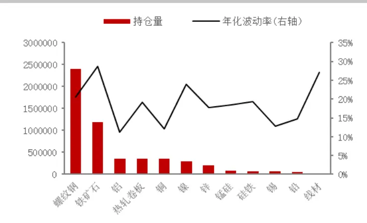
数据来源：Wind 天软 华泰期货研究院

图 3：贵金属板块持仓量及波动率表现
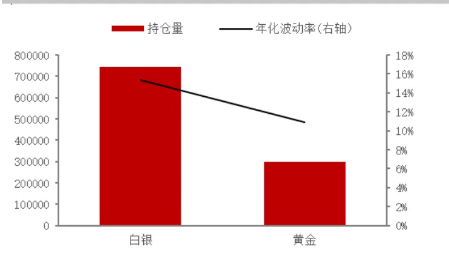
数据来源：Wind 天软 华泰期货研究院

图 4：农产品板块持仓量及波动率表现
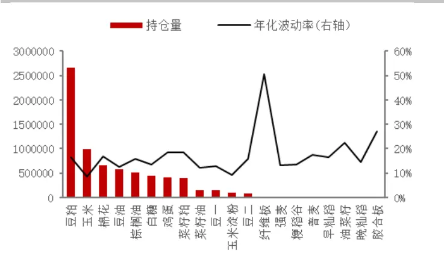
数据来源：Wind 天软 华泰期货研究院

图 5：能源化工板块持仓量及波动率表现
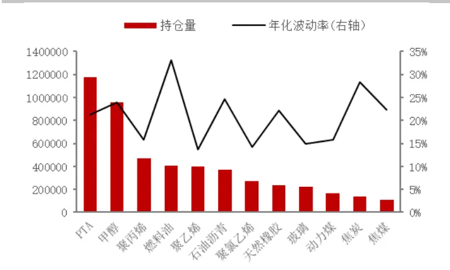
数据来源：Wind 天软 华泰期货研究院

我们看到期货不同品种的持仓量与波动性并没有明显的相关性。实际上，在我们的商品因子追踪体系中，它们属于不同风险因子。

在我们后续的测试中，我们将从上述的不同商品板块中挑选具有代表性的品种进行套保策略测试，从而证明我们套保策略的普适性。我们并未在本文中直接使用商品板块来进行风险测试，因为，如上图所示，即使在同一个商品板块内部个品种的交易特征也具有很大的差异性。有些板块中，个别品种交易持仓量具有主导性--比如农产品中的豆粕，所以，很多重要品种在商品板块层面将失去其独立的风险特征。实际上，有些板块中—比如化工，因为产业链上下游的关系，若干品种价格的变动周期还会出现异步性，综合来看有可能出现板块内部风险对冲的表现。

我们将从不同板块中，有针对性的挑选流动性较好（持仓量较高），近期风险程度较高的品种进行套期保值策略测试。

## 二、 历史风险水平

我们列出最近时间段，代表性商品期货的波动率所处的历史风险四分位水平。

表1: 商品代表品种波动率所处历史区间

| 板块 | 品种 | 波动率所处历史风险四分位 |
| --- | --- | --- |
| 农产品 | 棉花 | 50%-75% |
| 农产品 | 白糖 | 0%-25% |
| 农产品 | 棕榈油 | 0%-25% |
| 能源化工 | 甲醇 | 25%-50% |
| 能源化工 | 玻璃 | 0%-25% |
| 基本金属 | 螺纹钢 | 50%-75% |
| 基本金属 | 热轧卷板 | 0%-25% |
| 基本金属 | 镍 | 0%-25% |

资料来源：Wind 天软 华泰期货研究院

如上表所示，目前大多数板块内的商品处于历史风险中等（略偏下）的水平。尽管，本文不对目前经济宏观面做过多解读（可参看相关主题报告[1,2]），但是，大部分商品的波动性并不会一直处于各自的历史低位，而更有可能随着生产、商业活动（疫情之后）迅速恢复而走出自己的行情。这也是本文设计的主题—套保方未雨绸缪，充分意识到商品历史风险，关注后市行情发展。

## 三、 代表品种套保可行性分析

在前面的系列报告中已经针对可行性分析的方法进行详细的介绍[3]，因此在此不做赘述，主要展示测试结果。

## (一) 农产品：

棉花现货采用主产区新疆棉花现货价格，期货价格使用复权后的期货主力合约价格。通过统计发现，从累计收益率走势来看，棉花期现货价格走势基本一致，但是整体相关系数却较低（均值约为 0），出现此类情况，很可能是由于期货与现货之间具有一定的提前与滞后的关系，使用协方差可以较好的表征异步相关性，从而发现提前滞后关系。在新疆棉花与棉花期货的协方差图像中，横坐标的 0点及右边明显异步相关性明显高于阈值（蓝虚线），说明期货市场的行情先于现货市场反应，期货市场发挥了重要的价格发现功能。

基于套保策略调仓周期不频繁，短期的提前与滞后不影响套保的表现，我们认为新疆棉花具有套保的可行性。特别地，期货市场提前于现货市场的现象并不罕见，棉花的套保分析具有一定的参考作用。

图 6：新疆棉花现货与棉花期货累计收益率
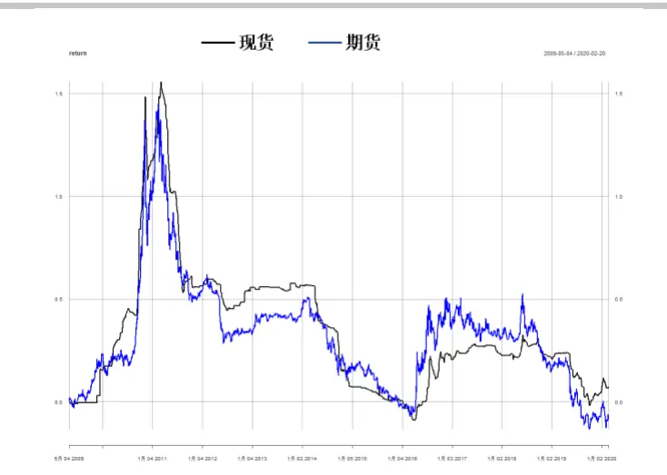
数据来源：Wind 天软 华泰期货研究院

图 7：新疆棉花现货与棉花期货收益率散点图
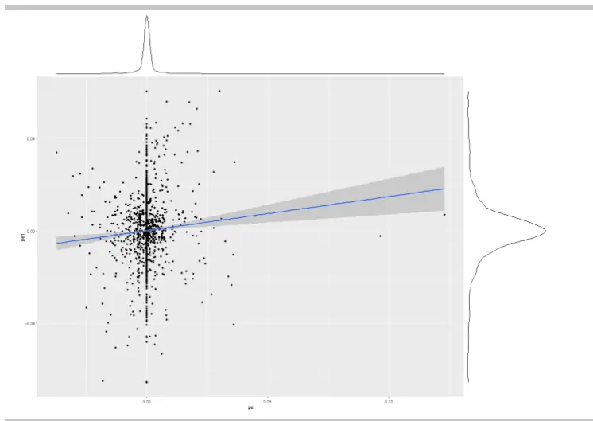
数据来源：Wind 天软 华泰期货研究院

图 6 显示，期现走势重合度较高，有较强的联动性质，这是我们可以进行操作的基础。图7 的期现收益率散点分布则体现了若干一般性特征：

1) 在绝大多数情形下，现货价格变动较期货平稳—最明显特征莫过于价格无变动（收益率为 0）的情形相当常见。

2) 现货价格波动的幅度较窄，而期货相对较宽。所以从波动率指标来看，期现对比的情况下，期货本身是更高风险的金融产品。这也是我们反复强调的，套期保值并不能保证“稳赚不赔”，反而可能在缺失正确判断或操作的情况造成严重损失。

3) 上述特征又反衬了现货收益率中极端值的高风险性—现货收益率分布有异常明显的尾端性质，这对产业资本的风险资产（可能正反套有差别），带来了巨大的尾端跌损风险；反观期货，因为交易所制定的异常行情管理措施（日内涨跌幅限制），在日度的频率上切断了尾部风险，具有一定的缓冲作用。

图 8：新疆棉花现货与棉花期货收益率异步相关性
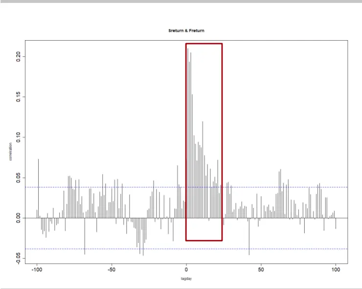
数据来源：Wind 天软 华泰期货研究院

图 9：新疆棉花现货与棉花期货收益率相关系数
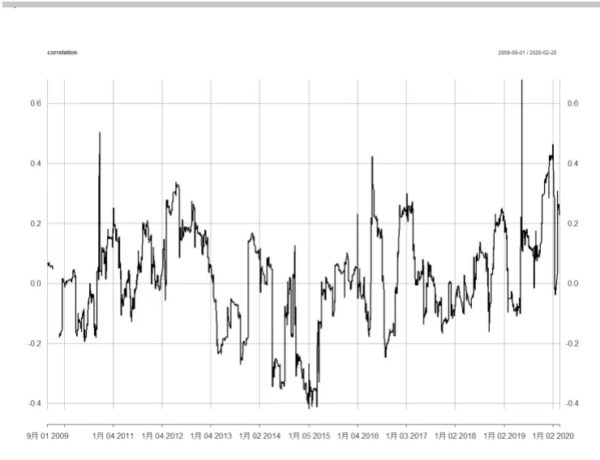
数据来源：Wind 天软 华泰期货研究院

图 8 显示，我们一般面对的期现数据之间具有相当复杂的相关性。比如期货收益率对现货的影响是明显提前的，并且其信息在现货价格上的消化需要较长的时间，至少在现今市场成熟度的条件下，现货价格的变动需要若干天时间才能逐步消减。

图 9 则体现了我们在设计套保策略时遇到的现实挑战。套保方需要套保的品种与可选期货品种价格的相关性并不稳定，而且在很多情况下甚至相关性并不高。这也是为什么使用等，或者 ，并不总能得到最优的套保效果，甚至有时还会面临更大风险的原因。

白糖现货价采用南宁白砂糖价格，棕榈油现货价采用棕榈油(24度)平均价，期货使用主力合约复权价格。两个品种的期现货价格具有较强的线性相关性，白糖、棕榈油现货与期货相关系数均值约在 0.5附近。从散点图可以看出白糖的期现收益率更加集中在 0 点附近，棕榈油相对分散，可以推测南宁白砂糖现货对冲效果可能更好。

图 10： 南宁白砂糖现货与白糖期货收益率散点图
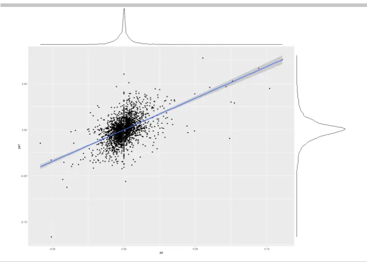
数据来源：Wind 天软 华泰期货研究院

图 11： 棕榈油(24 度)现货与棕榈油期货收益率散点图
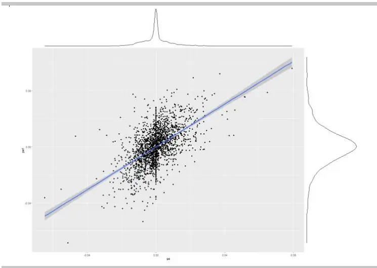
数据来源：Wind 天软 华泰期货研究院

## （二）能源化工：

甲醇现货采用陕西甲醇市场价(现货基准价)。与棉花相似，甲醇也表现出期货市场领先于现货市场的特征，符合我们看到的大部分期现收益率数据特征。

在玻璃这个品种上我们遇到了新的挑战。现货采用上海 5mm浮法玻璃价格。我们发现玻璃的期现相关性不高，并且从原始数据上看，期货没有明显领先于现货的特征（相关性和绝大部分异步相关性都未能超过 95%的无关性置信区间）。但是在进行多周期分解之后[4]，在长周期上发现了显著的相关性，并且也看到了期货领先的特征，本文将进一步进行套保效果的观测。

图 12： 陕西甲醇现货与甲醇期货异步相关性
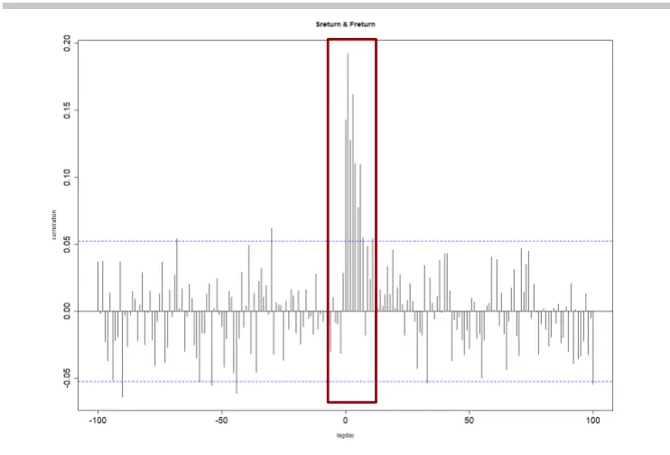
数据来源：Wind 天软 华泰期货研究院

图 13： 上海 5mm 浮法玻璃与玻璃期货多周期异步相关性
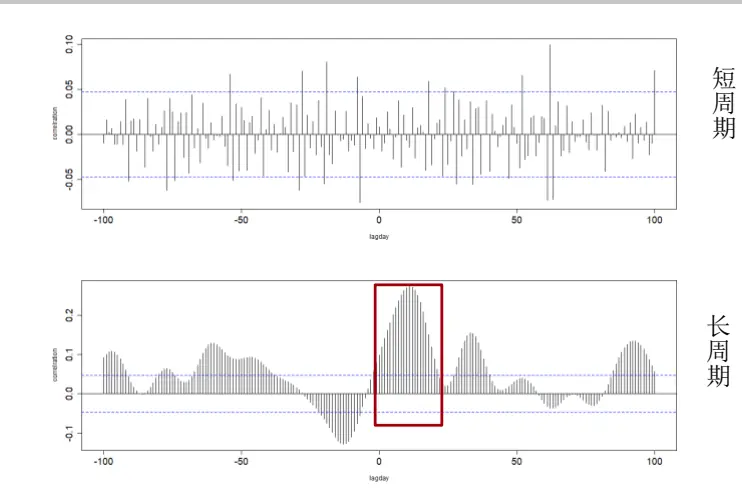
数据来源：Wind 天软 华泰期货研究院

## （三）基本金属：

螺纹钢现货采用北京螺纹钢 HRB400 20mm价格，热轧卷板现货采用天津热轧板卷Q235B 4.75mm价格，镍现货采用郑州镍1#含税价。

螺纹钢、热轧卷板以及镍的现货与期货均有较高的相关性，螺纹钢、热轧卷板市场发展比较成熟，产业客户参与期货市场度较高，期货与现货市场较为同步，同时金属镍的期现相关性较高，均具有套期保值的可行性。（一般来说，金属品种的期现相关性均较高。）但是，不排除相关性发生剧烈变化的可能性，如图 16中红框内时段.

图 14： 北京螺纹钢 HRB400 20mm 与期货累计收益率
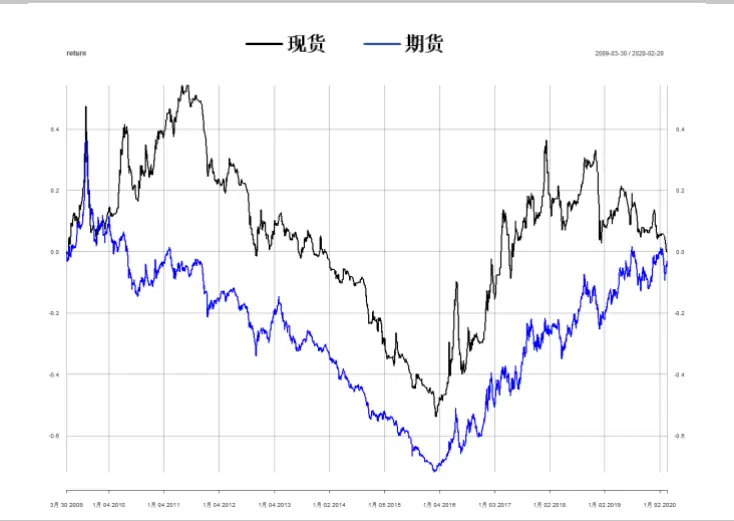
数据来源：Wind 天软 华泰期货研究院

图 15： 天津热卷 Q235B 4.75mm 与期货收益率相关系数
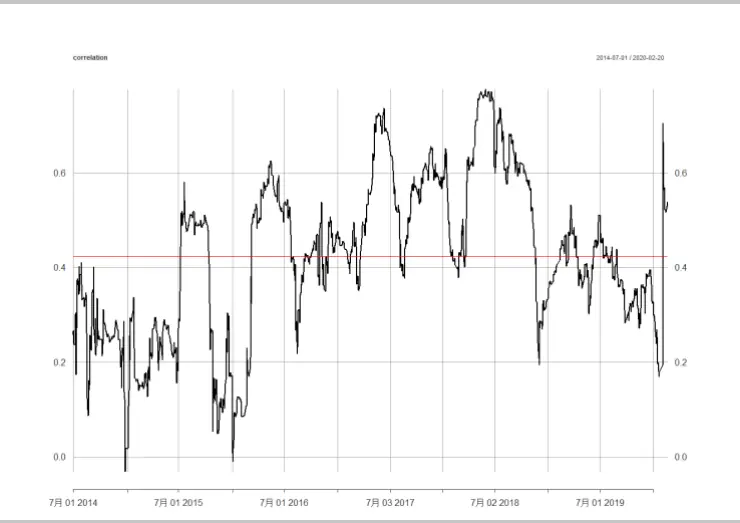
数据来源：Wind 天软 华泰期货研究院

图 16： 郑州镍 1#与期货收益率相关系数
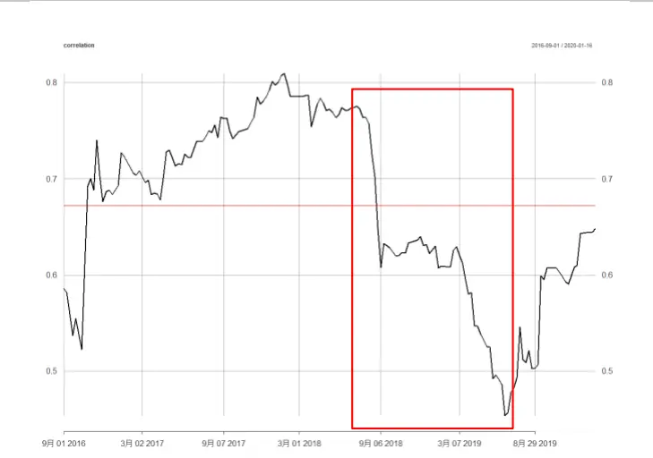
数据来源：Wind 天软 华泰期货研究院

## 四、 套保结果展示

## (一) 农产品：

图 17： 棉花多尺度最小波动率套保累计收益率
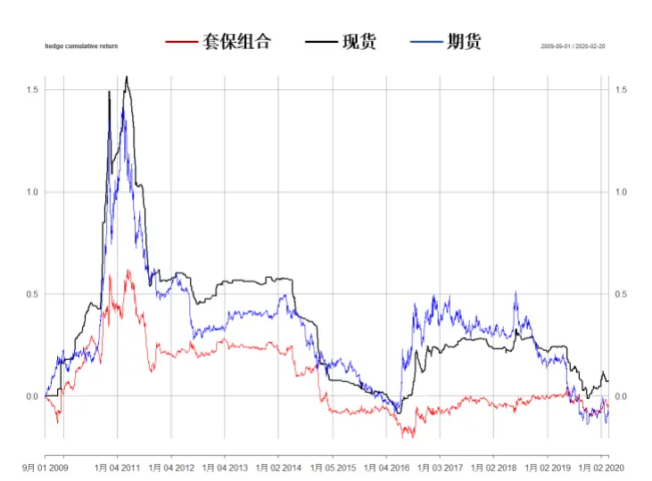
数据来源：Wind 天软 华泰期货研究院

图 18： 白糖多尺度最小波动率套保累计收益率
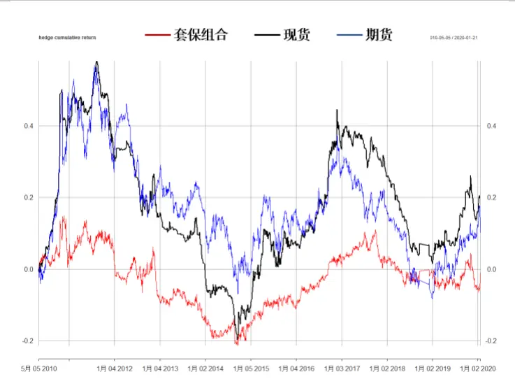
数据来源：Wind 天软 华泰期货研究院

图 19： 棕榈油多尺度最小波动率套保累计收益率
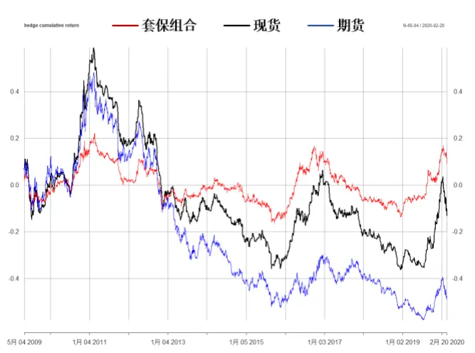
数据来源：Wind 天软 华泰期货研究院

历史上，我国的农产品期货是波动性相对较小的板块。其主要的影响因素多来自于自然环境因素。国家本身的惠农政策也一定程度上对农产品价格的剧烈波动有管控和缓冲的作用。但是，随着市场化的发展，我们也看到很多农产品品种越来越需要市场化的方法来管控风险。因为，价格响应的异步性（一定程度上反映市场化程度），我们看到套保的效果还有相当大的提升空间。就现在的模型来看，棉花，白糖，棕榈油的波动性均得到了较好的降低。棕榈油的套保效果较优。各品种来看，近几年（如近2年），套保效果都较之前来的好。这也是我们认为，农产品市场化进一步成熟以后，套保方再充分赢取市场化红利的情况下，也能更好得通过金融衍生品严控风险。

## （二） 能源化工：

图 20： 甲醇多尺度最小波动率套保累计收益率
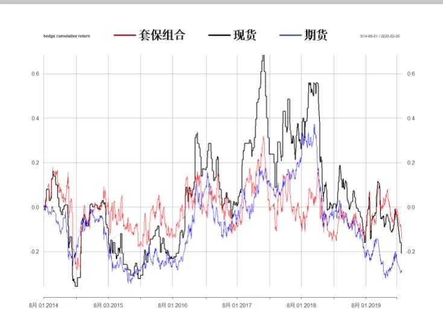
数据来源：Wind 天软 华泰期货研究院

图 21： 玻璃多尺度最小波动率套保累计收益率
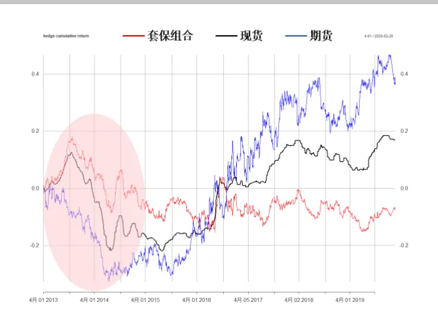
数据来源：Wind 天软 华泰期货研究院

能源化工而言，甲醇和玻璃的波动性得到了很好的降低。对玻璃而言，我们可以看到在红色圆圈区间里，市场处于极端下行，但是套保策略的波动率依然维持在较低水平。应该说，能化品种的套保效果合理且更均匀，是比较理想的。但是，我们也看到，当市场出现趋势性行情时，套期保值也可能会削减企业应有的利润。所以，我们建议能化板块套保，需要对整体市场（上下游，进出口，库存等）有一定程度的把握，因势利导，择时采用套保策略，或套保方向。

## （三）基本金属：

与其它品种采用正向套保不同，此处螺纹钢采用反向套保，即空现货、多期货的套保组合。

图 22： 螺纹钢多尺度最小波动率套保累计收益率
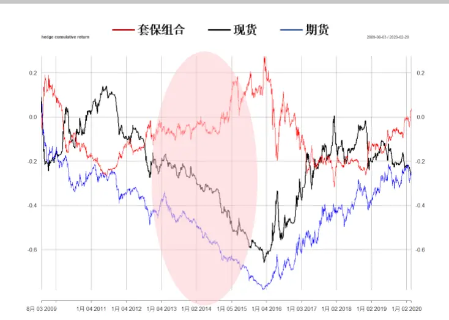
数据来源：Wind 天软 华泰期货研究院

图 23： 热轧卷板多尺度最小波动率套保累计收益率
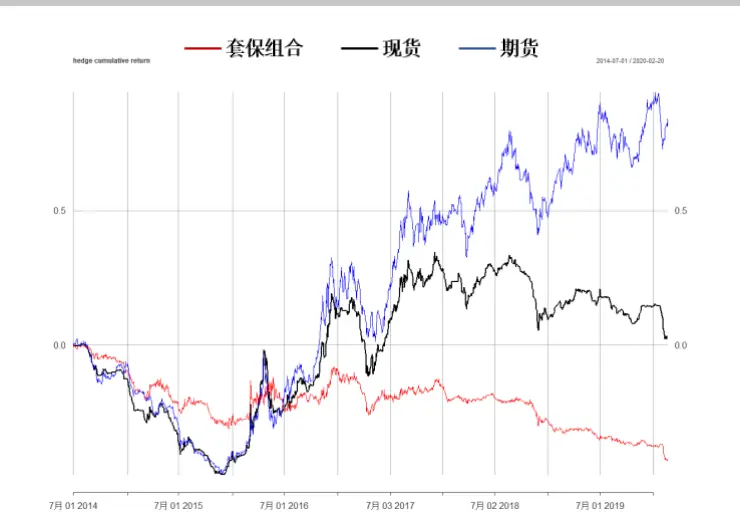
数据来源：Wind 天软 华泰期货研究院

图 24： 镍多尺度最小波动率套保累计收益率
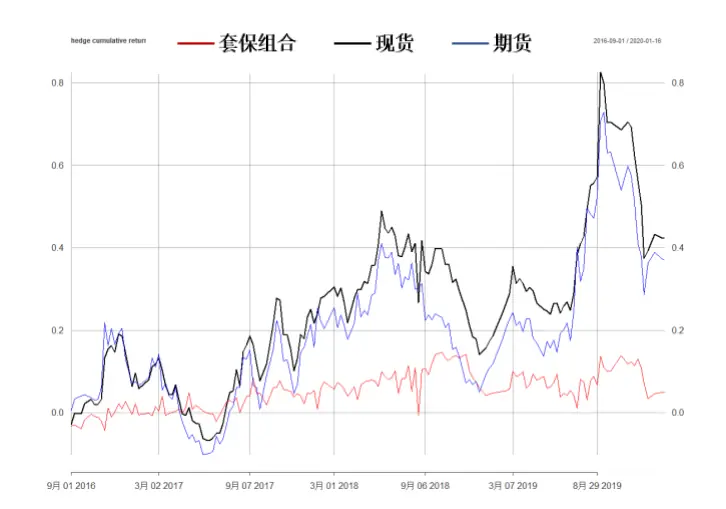
数据来源：Wind 天软 华泰期货研究院

对基本金属而言，螺纹钢，热轧卷板以及镍均极大的降低了波动率，减少了很多由市场剧烈震荡带来的风险。比如螺纹钢，我们可以看到当市场处于极端下行区间时（红圈间），波动率依然保持着较低的状态。但是，基本金属板块易出现期现价格趋势发展分离的状况，从而对套保带来较大的基差风险。我们将会在后续的报告中进一步讨论针对这一类板块套保策略，所要面临的期现差异状况。

表2: 多尺度最小波动率套保策略在各品种中的表现

| 品种 | 资产组合 | 平均年化收益率 | Beta | 波动率 | VaR（月度） | CVaR（月度） | 最大回撤率 |
| --- | --- | --- | --- | --- | --- | --- | --- |
| 棉花 | 套保 | -0.14% | -0.33 | 15.24% | 10.88% | 11.61% | 22.96% |
|  | 现货 | 2.11% | 0.48 | 17.31% | 10.84% | 14.41% | 44.93% |
|  | 期货 | 1.31% | 1 | 21.17% | 12.18% | 13.28% | 39.39% |
| 白糖 | 套保 | 0.23% | -0.05 | 8.31% | 6.33% | 8.00% | 16.78% |
|  | 现货 | 2.85% | 0.76 | 14.32% | 7.13% | 7.76% | 31.89% |
|  | 期货 | 2.15% | 1 | 15.36% | 7.39% | 8.33% | 26.61% |
| 棕榈油 | 套保 | 1.32% | 0.25 | 10.28% | 6.70% | 7.59% | 13.50% |
|  | 现货 | 0.31% | 0.86 | 18.18% | 11.22% | 11.29% | 27.64% |
|  | 期货 | -4.45% | 1 | 18.23% | 10.66% | 10.89% | 22.66% |
| 甲醇 | 套保 | 1.00% | 0.26 | 28.75% | 24.32% | 26.09% | 40.59% |
|  | 现货 | 3.81% | 1.08 | 39.45% | 28.26% | 31.75% | 54.82% |
|  | 期货 | -2.68% | 1 | 25.38% | 19.00% | 22.56% | 41.02% |
| 玻璃 | 套保 | -0.24% | -0.35 | 11.51% | 7.81% | 8.15% | 15.62% |
|  | 现货 | 2.82% | 0.17 | 10.86% | 7.93% | 10.00% | 15.91% |
|  | 期货 | 5.72% | 1 | 13.97% | 8.41% | 9.14% | 18.20% |
| 螺纹钢 | 套保 | 0.75% | -0.14 | 17.15% | 13.96% | 16.74% | 27.85% |
|  | 现货 | 0.33% | 0.8 | 25.39% | 19.31% | 29.33% | 63.92% |
|  | 期货 | -0.07% | 1 | 23.02% | 13.96% | 21.35% | 44.12% |
| 热轧卷板 | 套保 | -8.89% | 0.09 | 14.44% | 10.23% | 10.66% | 21.25% |
|  | 现货 | 3.71% | 0.8 | 25.99% | 17.03% | 20.26% | 47.20% |
|  | 期货 | 14.17% | 1 | 26.39% | 13.91% | 19.41% | 40.61% |
| 镍 | 套保 | 1.90% | 0.003 | 9.61% | 6.42% | 6.99% | 13.66% |
|  | 现货 | 12.90% | 0.81 | 22.95% | 10.48% | 11.71% | 25.65% |
|  | 期货 | 12.42% | 1 | 25.69% | 12.98% | 13.71% | 30.46% |

资料来源：Wind 天软 华泰期货研究院

从表中可以看到，总的来说，虽然我们牺牲了一部分收益率，但有效的降低了风险，尤其是最大回撤率和波动率。从品种出发，我们可以看到镍最近在市场上波动很大，但是在采用了这套套保策略以后，波动率，VaR，CVaR以及最大回撤率都有明显的下降。棕榈油和螺纹钢在有效降低风险的同时，获得了高于现货和期货的收益。

## 五、结论：

本文延续上一篇报告的介绍内容[3],将我们的套期保值模型和开发流程应用到不同商品种类上来。首先，商品期货的总体的风险程度并未比股指期货更高（投资属性良好），但是板块内部的品种差异较大。目前来看，商品的总体风险水平处在较低的水平，多数品种都在其波动率四分位的中偏下部分。但是，这也有可能预示着风险水平已经低无可低，未来各板块各品种的行情发展需要密切关注。在可行性分析中，我们看各品种期现的数据特征差异巨大。主要包括：期现价格变动的异步性；期现相关性随时间的变化（有时候甚至较极端）；真实套保标的物与对应期货的较低相关性。这些都是我们在套保策略开发中遇到的普遍性问题，并非个例（差异只是程度问题）。所以，一般情况下，我们并不认为等值套保，或者固定对冲头寸套保是最优选项，即使在一段时间内这样的套保操作表现更优。最后，我们给出了套保策略的回测结果展示。需要强调，套期保值的首要目的是降低产业资产（预计）所持商品现货的价格风险，绝非套机获利，其策略有效性的判断标准是风险指标的优化。同时，在实战中，套保方需要密切关注市场动向，在择时方面需要综合考虑宏观经济周期，产业链现况，行业研究员的未来预测等多种信息进行全面判断。

## 六、参考文献

[*] 本文配套多媒体介绍材料点击链接（19:31-45:25）

[1] 华泰期货黑色专题报告 20200210：警惕高库存条件下的钢铁商品的春季躁动行情

[2] 华泰期货金融期货专题报告 20200222：主力资金配置大基建板块追踪

[3] 华泰期货套期保值系列（七）20200219：实体企业套期保值助平安—如何用量化方法优化套期保值方案

[4] 华泰期货金融时序专题 20200108：金融科技赋能投研系列之七：多尺度数据分析(五)

## 免责声明

本报告基于本公司认为可靠的、已公开的信息编制，但本公司对该等信息的准确性及完整性不作任何保证。本报告所载的意见、结论及预测仅反映报告发布当日的观点和判断。在不同时期，本公司可能会发出与本报告所载意见、评估及预测不一致的研究报告。本公司不保证本报告所含信息保持在最新状态。本公司对本报告所含信息可在不发出通知的情形下做出修改，投资者应当自行关注相应的更新或修改。

本公司力求报告内容客观、公正，但本报告所载的观点、结论和建议仅供参考，投资者并不能依靠本报告以取代行使独立判断。对投资者依据或者使用本报告所造成的一切后果，本公司及作者均不承担任何法律责任。

本报告版权仅为本公司所有。未经本公司书面许可，任何机构或个人不得以翻版、复制、发表、引用或再次分发他人等任何形式侵犯本公司版权。如征得本公司同意进行引用、刊发的，需在允许的范围内使用，并注明出处为“华泰期货研究院”，且不得对本报告进行任何有悖原意的引用、删节和修改。本公司保留追究相关责任的权力。所有本报告中使用的商标、服务标记及标记均为本公司的商标、服务标记及标记。

华泰期货有限公司版权所有并保留一切权利。

## 公司总部

地址：广东省广州市越秀区东风东路761号丽丰大厦20层

电话：400-6280-888

网址：www.htfc.com