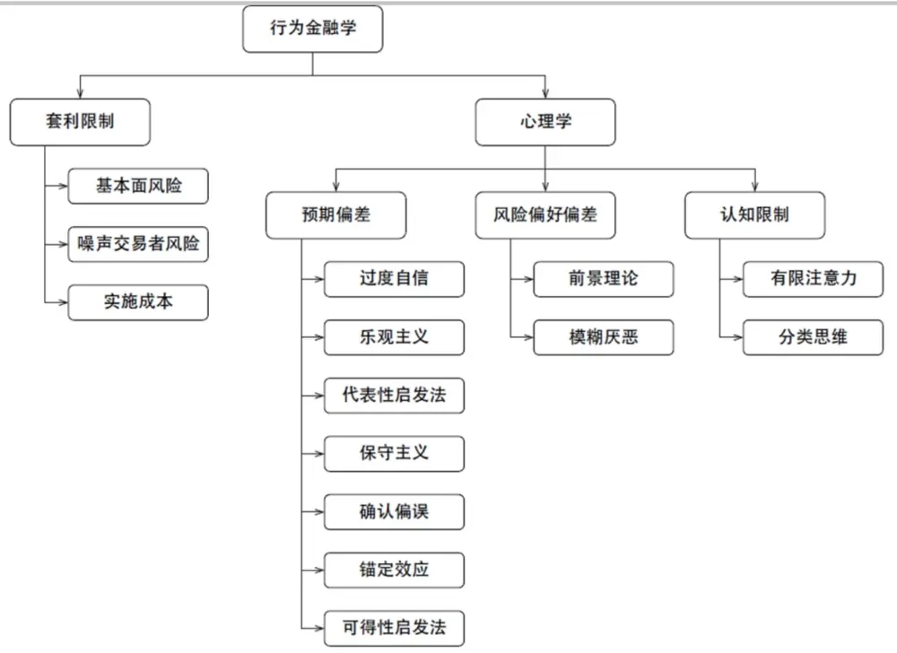
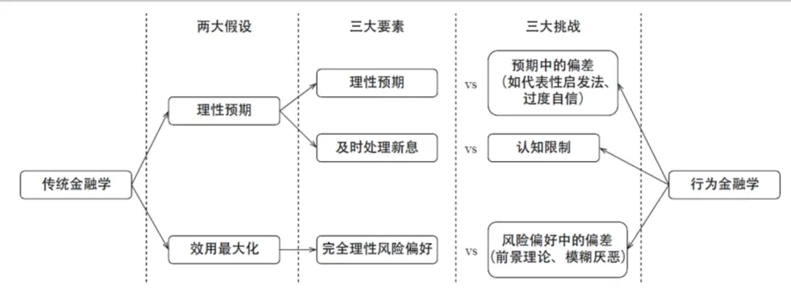
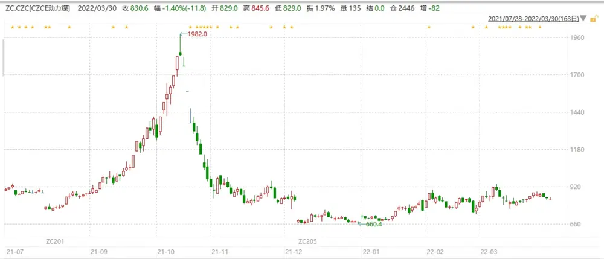
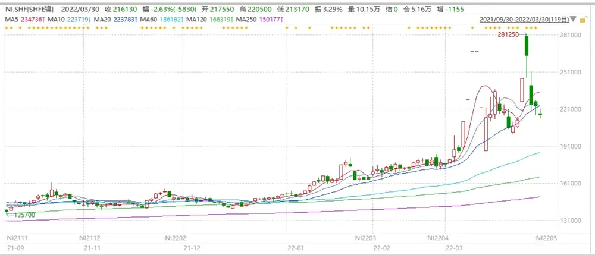
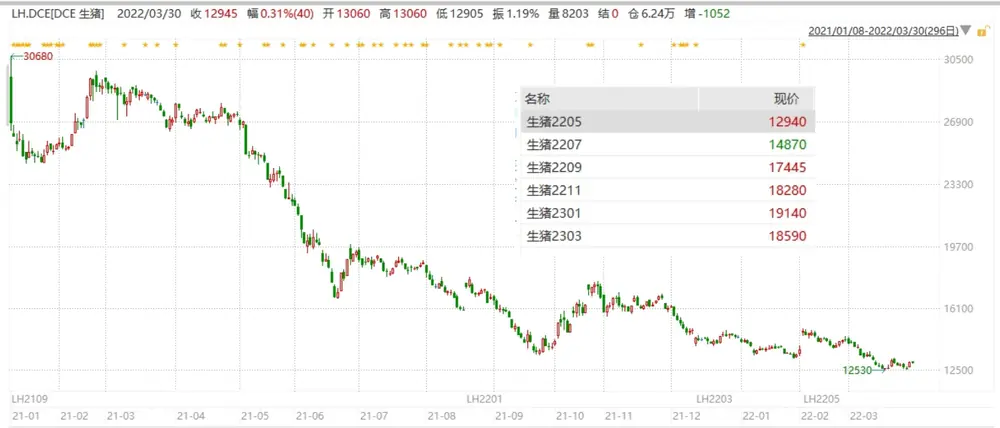
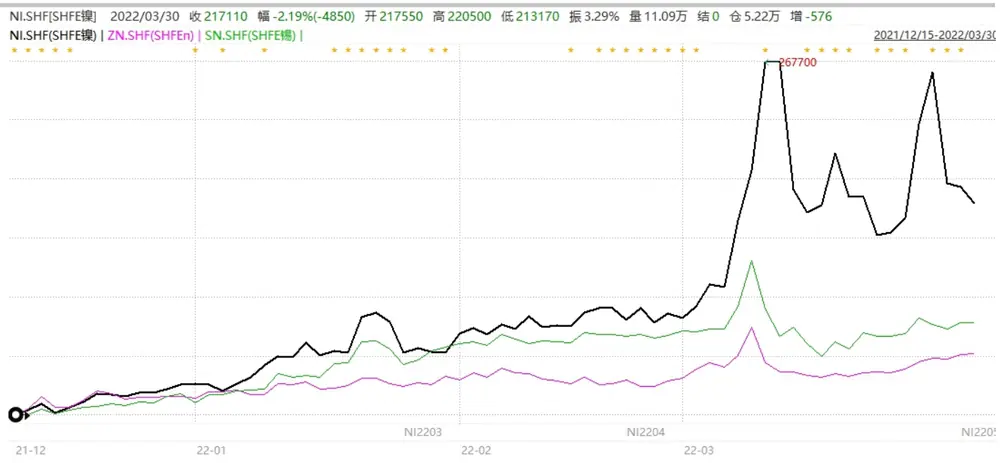
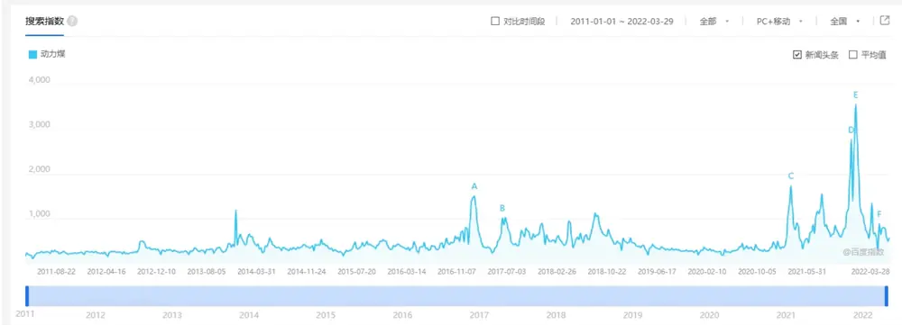

# 量化行为金融系列（一）

投资咨询业务资格：

证监许可【2011】1289 号

## —— 掘金冷门数据

研究院 量化组

研究员

作为量化行为金融系列的第一篇，我们尝试解答以下三个问题，当我们在谈论行为金融时，我们在谈论什么，我们想要什么结果，以及我们需要什么支持。

高天越

- 0755-23887993

当我们在谈论行为金融时——我们在谈论什么？

- gaotianyue @htfc.com

从业资格号：F3055799

如果说现货股票的价格与估值变化已经需要行为金融学来进一步解释，那么再深入到衍生品领域，对于期货持仓量、基差的期限结构以及期权的隐含波动率等等衍生品的特有指标，研究则更需要具体到不同交易群体的交易行为，这是“行为金融学”的题中应有之义。

投资咨询号：Z0016156

## 当我们在谈论行为金融时——我们想要什么？

当我们在衍生品市场的环境中应用行为金融时，我们想要对近年来越发变幻莫测的市场做出更加深层的理解。随着国内衍生品市场的快速发展，目前场内期货的交易热度已远超过去，极端行情也层出不穷。

我们将尝试解释为什么动力煤能在两个月的时间内走出“倒 V”行情；

为什么有色金属镍的走势如此“妖孽”；

为什么深度升水的结构下抄底生猪的交易源源不断；

有色金属间的价格波动是如何传导的...

## 当我们在谈论行为金融时——我们需要什么？

我们需要投资者行为数据，其中包括：1.舆情数据 2.非交易行为数据（资讯点击量、自选股等）3.比赛数据（私募大赛、期货日报大赛等）4.持仓数据（外资席位、CFTC 等）

我们还需要另类基本面数据，其中包括：1.行业热度（百度指数、从业相关指标等）2.卫星数据（遥感卫星、星光数据等）

本文作为系列的第一篇，主要尝试给各位投资者介绍我们的行为金融研究背景以及我们想要达成的愿景目标，接下来我们就将结合具体数据与行情，给出一个个经典案例分享，请大家持续关注。

## 当我们在谈论行为金融时——我们在谈论什么？

作为量化行为金融系列的第一篇，我们尝试解答以下三个问题，当我们在谈论行为金融时，我们在谈论什么，我们想要什么结果，以及我们需要什么支持。

关于行为金融学的发展历程，Sewell(2007)按时间顺序梳理了该领域内最重要的研究成果，这是一篇很好的文献综述。除此之外，Barberis and Thaler(2003)、Hirshleifer(2015)以及Barberis(2018)从知识体系的角度对这一学科所包含的内容进行了总结。

长久以来，对于金融领域的研究一直基于“有效市场”的相关理念，尽管这个术语对于不同的人可能意味着不同的东西，但是有效市场假设（efficientmarkets hypothesis）是古典金融理论的基础，它指出在任何给定时刻，正在交易的任意资产的价格都是正确的，并反映了所有可用的信息。这样的理论假设是简洁明了的，但真正需要回答的问题是有效市场是否实际存在。

如果存在真正有效的市场，那么市场怎么会有“泡沫”与“陷阱”？同样，EMH 所假设 100%理性的决策者是否合理，基于进本逻辑应该可以把这个想法扔到窗外，因为噪音交易者甚至新手交易者绝对不可能与专业理性的交易员以永远相同的水平进行交易和投资。

传统理论认为，聪明金钱的投资者，或那些对金融市场有最高知识水平的人，将抵消那些通过套利进行非理性交易的人引起的任何噪音。但从 1980年代开始，金融理论学家首先开始考虑这样的观点：投资并不像最初理论的那样“干净”。随着大量可分析的数据来证明这个想法的正确性，这个新的想法在传统金融理论的崩溃中诞生，并被恰如其分的命名为“行为金融学”。

如果说现货股票的价格与估值变化已经需要行为金融学来进一步解释，那么再深入到衍生品领域，对于期货持仓量、基差的期限结构以及期权的隐含波动率等等衍生品的特有指标，研究则更需要具体到不同交易群体的交易行为，这是“行为金融学”的题中应有之义。

总结而言，行为金融学背后的两大支柱是心理学（包括预期偏差、风险偏好偏差，以及认知限制三部分）和套利限制（limits to arbitrage）。每一部分下面又有各自的理论和内容，构成了行为金融学的全貌。图 1 展示了行为金融学的知识框架。

图 1： 行为金融学的知识框架

数据来源：《因子投资：方法与实践》，华泰期货研究院

传统金融学中的两大假设为人的理性预期以及依照预期效用最大化来进行决策。前者意味着人们能够迅速处理全部新息并使用贝叶斯理论更新先验，得到纯理性的后验信仰；后者则假设人们在完全理性下以最大化预期效用为目标来做决策。从这两大假设中可以引申出三个要素：（1）理性预期；（2）及时处理全部信息；（3）完全理性的风险偏好。行为金融学则对上述三个要素逐一提出了挑战。对于理性预期，行为金融学认为人们的预期并非完全理性，会出现诸如过度自信、锚定效应等偏差；对于及时处理信息，认知学研究表明人的大脑对信息的处理能力是有限的，存在认知限制、无法对全部信息进行及时处理；对于理性风险偏好，行为金融学指出人在不确定性下做决策时也难以做到完全理性，存在风险偏好偏差，而前景理论以及模糊厌恶比预期效用理论能够更好地描述人如何在不确定下做决策。行为金融学与传统金融学的对比如图 2 所示。

图 2： 行为金融学与传统金融学的对比

数据来源：《因子投资：方法与实践》，华泰期货研究院

对于以上条件与假设，其在衍生品市场中由于衍生品特殊的交易机制更加凸显重要性。对于理性预期，衍生品因其自带杠杆（部分衍生品还具有复杂结构）的特征，投资者往往不能对预期风险收益做出精确的判断；对于及时处理新信息，衍生品往往交易时长远超现货股票，对交易者的精力状态提出更高要求；对于风险偏好，衍生品巨大的波动常常带来投资者心态的失衡，更难理性的做出投资决策。

因此，当我们在谈论行为金融，特别是在谈论衍生品领域内的行为金融时，我们是在试图探寻行为金融框架下投资者的普遍性非理性行为，以及这些行为造成的衍生品行情变化。千变万变，人性难变。当我们能够在行为金融的框架下对投资者行为构建模型，其外推性和鲁棒性都可能达到更优。

## 当我们在谈论行为金融时——我们想要什么？

当我们在衍生品市场的环境中应用行为金融时，我们想要对近年来越发变幻莫测的市场做出更加深层的理解。随着国内衍生品市场的快速发展，目前场内期货的交易热度已远超过去，极端行情也层出不穷。

我们将尝试解释为什么动力煤能在两个月的时间内走出“倒 V”行情：

图 3： 为什么动力煤能在两个月的时间内走出“倒 V”行情

数据来源：Wind，华泰期货研究院

为什么有色金属镍的走势如此“妖孽”：

图 4： 为什么有色金属镍的走势如此“妖孽”

数据来源：Wind，华泰期货研究院

为什么深度升水的结构下抄底生猪的交易源源不断：

图 5： 为什么深度升水的结构下抄底生猪的交易源源不断

数据来源：Wind，华泰期货研究院

有色金属间的价格波动是如何传导的：

图 6： 有色金属间的价格波动是如何传导的

数据来源：Wind，华泰期货研究院

尽管基本面变化能够在一定程度上能够解释行情的变化，但我们认为史诗级行情的背后一定是有行为金融做出了更为巨大的影响。当然，衍生品市场的极端案例不会仅有上述的这几个，历史上有很多，未来还会有更多。我们不仅想对过去的极端行情做出解释，还希望能够发现一定特征从而对未来的极端行情做出警示。

## 当我们在谈论行为金融时——我们需要什么？

当然，想要在衍生品市场中应用行为金融学，传统的研究方法显然是不足的，特别是研究所需要的数据，一定超出原有的量价数据亦或基础基本面数据范围。

首先，我们需要投资者行为数据，其中包括：

## 1. 舆情数据

2. 非交易行为数据（资讯点击量、自选股等）

3. 比赛数据（私募大赛、期货日报大赛等）

## 4. 持仓数据（外资席位、CFTC 等）

以比赛数据为例，对于此类数据，我们将遵从合规的底线，尝试寻找更多的真实数据来源，其中值得一提的是由期货日报主办的期货实盘交易大赛，期货实盘交易大赛已成功举办十五届。2022年 3月 25日，第十六届大赛开始，目前已吸引超过 6万名投资者，投入总资金近300 亿元。实盘交易大赛定期披露选手账户信息，包括选手的整体情况、分类情况以及各选手自身的情况。其中，大赛整体情况披露包括以下几部分：

表格 1：大赛整体情况披露

| 持仓成交统计 | 品种持仓统计 | 品种盈亏统计 |
| --- | --- | --- |
| 当日持仓数据（金额） | 持仓做多人数 | 各品种每日盈亏 |
| 当日持仓数据（手） | 持仓做空人数 |  |
| 当日成交数据（金额） | 持仓做多手数 |  |
| 当日成交数据（手） | 持仓做空手数 |  |
| 累计持仓数据（金额) |  |  |
| 累计持仓数据（手） |  |  |

资料来源：华泰期货研究院

另外，大赛各选手情况披露包括以下几部分：

表格 2：大赛各选手情况披露

| 基本 数据 | 最大本金 收益率 | 利润& 手续费 | 当日品种 持仓盈亏 | 累计品种 持仓盈亏 | 多空盈亏 统计 | 日内隔夜 统计 | 品种成交 统计 |
| --- | --- | --- | --- | --- | --- | --- | --- |
| 账户ID | 最大本金收益率 | 毛利润 | 盈利金额 | 盈利金额 | 做多盈利金额 | 日内盈利金额 | 品种盈利金额 |
| 期初权益 |  | 净利润 | 亏损金额 | 亏损金额 | 做空盈利金额 | 隔夜盈利金额 | 品种亏损金额 |
| 期末权益 |  | 手续费 | 盈利手数 | 盈利手数 | 做多亏损金额 | 日内亏损金额 | 品种成交金额 |
| 出入金 |  |  | 亏损手数 | 亏损手数 | 做空亏损金额 | 隔夜亏损金额 | 品种成交手数 |

资料来源：华泰期货研究院

该比赛数据披露详实，是我们观察真实交易市场的一个非常优秀的窗口。

其次，我们需要另类基本面数据，其中包括：

1. 行业热度（百度指数、从业相关指标等）

2. 卫星数据（遥感卫星、星光数据等）

图 7：动力煤百度指数

数据来源：Wind，华泰期货研究院

当然，这两类数据有些和行情密切相关，有些和价格的关系则需要层层传导。这就需要我们在数据处理方法上，以及模型构建上做到合情合理。鉴于篇幅限制，在系列后续文章中，我们将针对当期使用的数据与模型再做详细具体的介绍。

本文作为系列的第一篇，主要尝试给各位投资者介绍我们的行为金融研究背景以及我们想要达成的愿景目标，接下来我们就将结合具体数据与行情，给出一个个经典案例分享，请大家持续关注。

## 参考文献

[1] Shiller, R. J. (2003). From efficient markets theory to behavioral finance. The Journal of Economic Perspectives, 17, 83–104. doi:10.2307/3216841

[2] Sewell, M. (2007). Behavioural finance. Working paper.

[3] Barberis, N. and R. Thaler (2003). Chapter 18 A survey of behavioral finance. In Financial Markets and Asset Pricing, Volume 1 of Handbook of the Economics of Finance, pp. 1053 - 1128. Elsevier.

[4] Hirshleifer, D. (2015). Behavioral finance. Annual Review of Financial Economics 7, 133 - 159.

[5] Barberis, N. (2018). Chapter 2 Psychology-based models of asset prices and trading volume. In B. D. Bernheim, S. DellaVigna, and D. Laibson (Eds.), Handbook of Behavioral Economics - Foundations and Applications 1, Volume 1 of Handbook of Behavioral Economics: Applications and Foundations 1, pp. 79 –175. North-Holland.

[6] 石川，刘洋溢，连祥斌 (2020). 因子投资：方法与实践. 北京：电子工业出版社.

## 免责声明

本报告基于本公司认为可靠的、已公开的信息编制，但本公司对该等信息的准确性及完整性不作任何保证。本报告所载的意见、结论及预测仅反映报告发布当日的观点和判断。在不同时期，本公司可能会发出与本报告所载意见、评估及预测不一致的研究报告。本公司不保证本报告所含信息保持在最新状态。本公司对本报告所含信息可在不发出通知的情形下做出修改， 投资者应当自行关注相应的更新或修改。

本公司力求报告内容客观、公正，但本报告所载的观点、结论和建议仅供参考，投资者并不能依靠本报告以取代行使独立判断。对投资者依据或者使用本报告所造成的一切后果，本公司及作者均不承担任何法律责任。

本报告版权仅为本公司所有。未经本公司书面许可，任何机构或个人不得以翻版、复制、 发表、引用或再次分发他人等任何形式侵犯本公司版权。如征得本公司同意进行引用、刊发的，需在允许的范围内使用，并注明出处为“华泰期货研究院“，且不得对本报告进行任何有悖原意的引用、删节和修改。本公司保留追究相关责任的权力。所有本报告中使用的商标、服务标记及标记均为本公司的商标、服务标记及标记。

华泰期货有限公司版权所有并保留一切权利。

## 公司总部

地址：广东省广州市越秀区东风东路761号丽丰大厦20层

电话：400-6280-888

网址：www.htfc.com