# 量化行为金融系列（二）

## —— 天然橡胶多空之谜

本文作为量化行为金融系列第二篇，以天然橡胶（RU）品种为例，探讨投资者在天然橡胶上的盈亏之谜。数据来源于系列第一篇中介绍的公开比赛。

天然橡胶相比于其它商品期货的特殊之处在于，其在 2017年至 2021年这 5 年间的所有期货品种的历年盈亏中，三次亏损排名第一，一次亏损排名第三，仅在 2020年略有盈利。然而，相比于其它商品期货，天然橡胶在过去几年的行情变化并不算特别突出，长期维持在震荡偏弱的态势，但是在震荡行情中，依然造成了长期巨额的亏损。

我们认为天然橡胶的长期亏损主要来源于交易者的交易习惯、价格季节性、升水的期限结构以及产业的交割能力，在“天时、地利、人和”三方面都天然适合做空，而在实际市场中，交易资金偏向于做多（抄底），历年都亏损严重。

更进一步，将天然橡胶投资者分为盈利组和亏损组，在剔除天然橡胶的盈亏之后，在其它品种上的总计盈亏也出现明显差别。因此，我们认为造成亏损的这些性质是商品期货亏损的共性，并且在天然橡胶品种上表现的尤为突出。

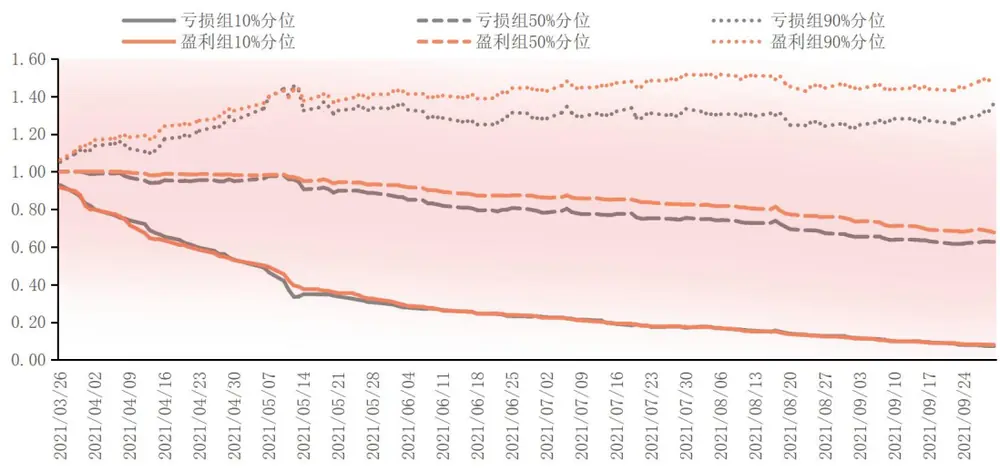

投资咨询业务资格：

证监许可【2011】1289 号

研究院 量化组

研究员

高天越

- 0755-23887993

- gaotianyue @htfc.com

从业资格号：F3055799

投资咨询号：Z0016156

## 研究院 能源化工组

研究员

陈莉

- 020-83901030

- cl@htfc.com

从业资格号：F0233775

投资咨询号：Z0000421

## 天然橡胶盈亏之谜

量化行为金融系列主要尝试在期货衍生品的领域内，利用期货持仓量、基差的期限结构以及期权的隐含波动率等等衍生品的特有指标，结合不同交易群体的交易行为，分析期货衍生品的行情变化。

本文作为系列第二篇，将以天然橡胶（RU）品种为例，探讨投资者在天然橡胶上的盈亏之谜。数据来源于系列第一篇中的公开比赛。在进入正题之前，首先我们想要说明为何首选天然橡胶作为分析对象，相比于其它期货衍生品，天然橡胶具有怎样的独有特征。

从基本面来看，中国作为全世界最大的天然橡胶消费国，消费占比达到 33%，同时产量占比仅有 7%。因此我国天然橡胶自给率不足 30%（国际公认的自给率安全保障线），并呈现逐年降低的趋势。2005年首次跌破 30%，2009 年跌至 22%，2012 年以来为保持在 20%左右。

图 1： RU 各国消费
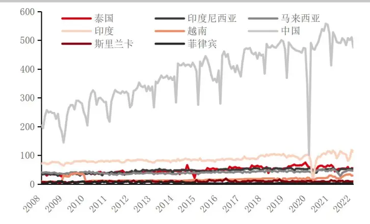
数据来源：华泰期货研究院

图 2： RU各国产量
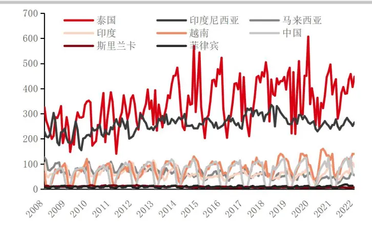
数据来源：华泰期货研究院

另外，胶园因 90%私有化，散布在千家万户胶农手中，导致原料过于分散，加之胶农囤积能力的有限，二盘商应运而生。原料二盘商实为贸易商，等同于橡胶贸易商。是以交易为目的，靠囤积或卖空盈利。二盘商队伍日趋壮大，泰国生产商甚至有部分转而去做原料二盘商。二盘商逐渐控制原料数量、价格，控制橡胶加工厂的采购步伐。橡胶加工厂越来越被动。原料供应周期被拉长，部分原料甚至因存储过久而被损耗。原料二盘商拉长了供应链，造成原料供应的不稳定，是引发行情的波动因素之一。（青岛保税区有将近 400 家公司从事天然橡胶现货贸易，全国近千家。）

在上海期货交易所，期胶一天的交易量相当于全球全年的消费量。这些交易资金加剧了天然橡胶价格波动程度，使胶价过分的上涨或下跌。

总结来看，天然橡胶由于其特殊的基本面，导致交易氛围浓厚。而在实际交易市场中，我们也可以看到天然橡胶的特殊性。

表格 1：各品种历年盈亏排名（排名越靠前，亏损越多）

| 20172018 |  | 橡胶 | 棉花 | 铜 | 原油 | 镍 | 白银 | 锌 | 铁矿石 | 豆油 | 中证500 | 乙二醇 |
| --- | --- | --- | --- | --- | --- | --- | --- | --- | --- | --- | --- | --- |
|  |  | 1 | 6 | 44 |  | 37 | 5 | 2 | 50 | 4 | 9 |  |
|  |  | 1 | 51 | 46 | 50 | 5 | 15 | 52 | 2 | 8 | 3 |  |
| 2019 |  | 3 | 1 | 6 | 4 | 2 | 60 | 26 | 61 | 52 | 58 | 7 |
|  | 2020 | 48 | 11 | 1 | 2 | 19 | 66 | 49 | 62 | 58 | 65 | 8 |
| 2021 |  | 1 | 65 | 63 | 12 | 6 | 2 | 9 | 51 | 7 | 69 | 45 |
| 调和平均2017 |  | 1 | 4 | 4 | 5 | 5 | 6 | 7 | 9 | 9 | 10 | 10 |
|  |  | 聚乙烯 | 玻璃 | 燃料油 | PTA | 纸浆 | 石油沥青 | 豆粕 | 上证50 | 玉米 | 聚丙烯 | 菜粕 |
|  |  | 40 | 35 | 24 | 36 |  | 3 | 33 | 48 | 7 | 38 | 12 |
|  | 2018 | 48 | 21 | 27 | 45 |  | 25 | 47 | 9 | 42 | 24 | 43 |
|  | 2019 | 5 | 9 | 12 | 20 | 8 | 51 | 53 | 57 | 11 | 14 | 44 |
|  | 2020 | 5 | 39 | 4 | 3 | 15 | 50 | 36 | 55 | 52 | 7 | 6 |
|  | 2021 | 52 | 4 | 24 | 59 | 13 | 48 | 3 | 5 | 15 | 17 | 27 |
| 调和平均 |  | 11 | 11 | 11 | 11 | 11 | 12 | 12 | 14 | 15 | 15 | 15 |
|  |  | 动力煤 | 菜籽油液 | 化石油气 | 硅铁 | 螺纹钢 | 花生 | 低硫燃料油 | 焦煤 | 黄金 | 十年期国债 | 黄大豆1号 |
|  | 2017 | 10 | 8 |  | 14 | 49 |  |  | 42 | 30 | 11 | 17 |
|  | 2018 | 11 | 17 |  | 20 | 4 |  |  | 13 | 14 | 49 | 23 |
|  | 2019 | 10 | 17 |  | 19 | 47 |  |  | 13 | 59 | 46 | 25 |
|  | 2020 | 47 | 59 | 9 | 16 | 57 |  | 14 | 12 | 63 | 10 | 17 |
| 2021 |  | 53 | 14 | 49 | 11 | 66 | 16 | 25 | 64 | 8 | 56 | 26 |
| 调和平均 |  | 15 | 15 | 15 | 15 | 15 | 16 | 18 | 18 | 19 | 20 | 21 |
|  |  | 沪深3002 | 0号胶 | 热轧卷板 | 焦炭 | 锰硅 | 苯乙烯 | 锡 | 玉米淀粉 | 苹果 | 铅 | 郑醇 |
|  | 2017 | 47 |  | 34 | 46 | 15 |  | 16 | 13 |  | 28 | 39 |
|  | 2018 | 6 |  | 10 | 7 | 41 |  | 26 | 36 | 54 | 30 | 16 |
|  | 2019 | 56 | 24 | 15 | 55 | 43 | 37 | 30 | 38 | 54 | 21 | 16 |
|  | 2020 | 64 | 18 | 54 | 51 | 13 | 24 | 21 | 40 | 56 | 42 | 44 |
|  | 2021 | 58 | 22 | 55 | 68 | 57 | 18 | 47 | 23 | 10 | 19 | 62 |
| 调和平均 |  | 21 | 21 | 21 | 23 | 24 | 24 | 25 | 25 | 26 | 26 | 26 |
|  |  | 粳米 | 短纤 | 红枣 | 鸡蛋 | 生猪 | 菜籽 | 纤维板 | 黄大豆2号 | 胶合板 | 5年期国债 | 棉纱 |
|  | 2017 |  |  |  | 31 |  | 20 | 27 | 26 | 21 | 18 | 19 |
| 2018 |  |  |  |  | 18 |  | 38 | 35 | 22 | 37 | 44 | 28 |
| 2019 |  |  |  | 23 | 50 |  | 32 | 27 | 41 | 36 | 45 | 39 |
| 2020 |  | 20 |  | 22 | 60 |  | 33 | 25 | 37 | 28 | 23 | 35 |
| 2021 |  | 39 | 28 | 60 | 20 | 29 | 33 | 40 | 31 | 34 | 43 | 41 |
| 调和平均 |  | 26 | 28 | 28 | 29 | 29 | 30 | 30 | 30 | 30 | 30 | 30 |
|  |  | 白糖 | 棕榈油 | 早籼稻 | 粳稻 | 尿素 | 聚氯乙烯 | 线材 | 不锈钢 | 两年期国债 | 铝 | 纯碱 |
| 2017 |  | 43 | 45 | 22 |  |  | 32 |  |  |  | 41 |  |
| 2018 |  | 19 | 12 | 32 | 33 |  | 53 | 39 |  |  | 40 |  |
| 2019 |  | 48 | 40 | 34 | 31 | 22 | 18 | 42 | 28 | 35 | 49 |  |
| 2020 |  | 45 | 61 | 31 | 27 | 43 | 41 | 30 | 38 | 34 | 53 | 46 |
| 2021 |  | 21 | 54 | 37 | 35 | 44 | 46 | 30 | 50 | 42 | 61 | 67 |
| 调和平均 |  | 30 | 30 | 30 | 31 | 33 | 33 | 34 | 37 | 37 | 48 | 55 |

资料来源：公开比赛，华泰期货研究院

各品种历年盈亏中，天然橡胶在 2017 年至 2021 年 5 年中，三次亏损排名第一，一次亏损排名第三，仅在 2020年略有盈利。相比于其它商品期货，天然橡胶在过去几年的行情变化并不算特别突出，长期维持在震荡偏弱的态势，但是在震荡行情中，依然造成了长期巨额的亏损。

图 3： 2017 年以来 RU 行情——震荡偏弱
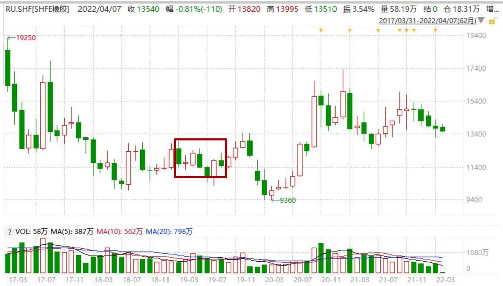
数据来源：Wind，华泰期货研究院

进一步，我们分析历年多空持仓与多空人数。首先对于持仓而言，多头头寸长期保持在 2W手左右，占全市场比例约 7%；空头头寸长期保持在 8K 手左右，占全市场比例约 3%。很明显可以发现历年来多头持仓都持续大于空头持仓，从净多头头寸来看，过去 5 年均保持正数。

图 4： RU 历年多头持仓
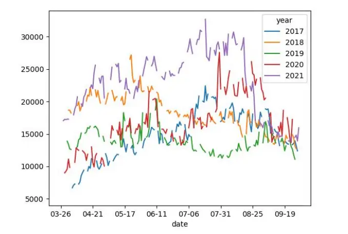
数据来源：公开比赛，华泰期货研究院

图 5： RU 历年空头持仓
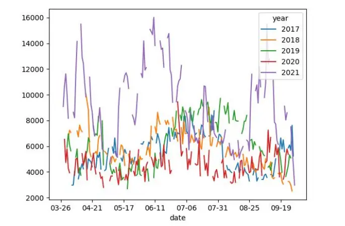
数据来源：公开比赛，华泰期货研究院

因此，在一个震荡偏弱的行情中，做多橡胶带来亏损似乎是可以解释的？事实并非如此简单，结合图 3 中的行情（红框部分为 2019年），2019 年对应时间段整体天然橡胶价格并未出现明显下跌，但当年亏损额仍然排名第三，因此简单的价格变动不能完全解释群体性的巨额亏损。

图 6： RU 历年净多头寸
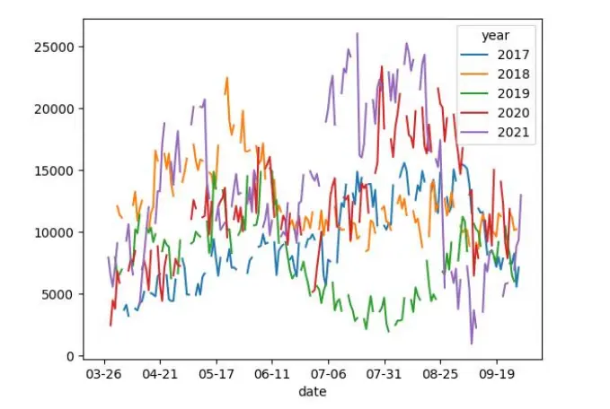
数据来源：公开比赛，华泰期货研究院

图 7： RU 历年净多人数
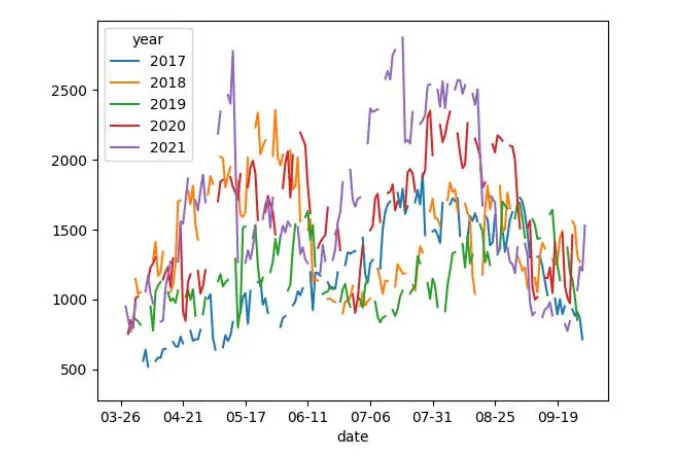
数据来源：公开比赛，华泰期货研究院

这里我们考虑多空人数，天然橡胶历年多头人数保持在 2K 左右，而空头人数保持在 600左右，同样的，历年来多头人数都明显大于空头人数，净多头人数长期保持高位正数。

图 8： RU 历年多头人数
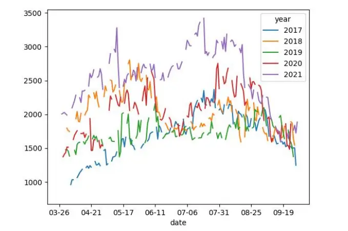
数据来源：公开比赛，华泰期货研究院

图 9： RU 历年空头人数
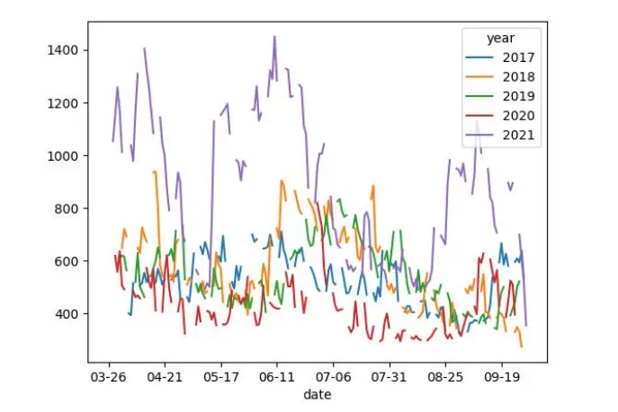
数据来源：公开比赛，华泰期货研究院

从人数的多空不均衡，我们可以大胆猜测天然橡胶的多头交易者中长期具有大量的交易资金，另外对比多头人均持仓与空头人均持仓，可以发现两个特征：

1. 多头人均持仓维持在 7~11 手左右，且波动较小；

2. 空头人均持仓最低 7 手，最高 18 手，波动较大。

从多空人均持仓的区别，我们给出一定假设，即天然橡胶的多头主体为较稳定的小体量交易资金，而天然橡胶的空头主体为具有“季节性”的产业卖方以及大体量交易资金。这里行为上的“季节性”，我们特指每年的 7 月附近，空头人数持续下降，并且持仓维持不变，导致空头人均持仓快速增加（见图 11箭头）。

图 10： RU 历年多头人均持仓
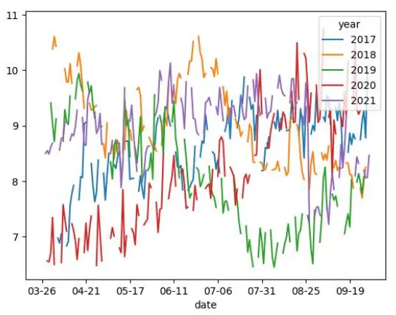
数据来源：公开比赛，华泰期货研究院

图 11： RU 历年空头人均持仓
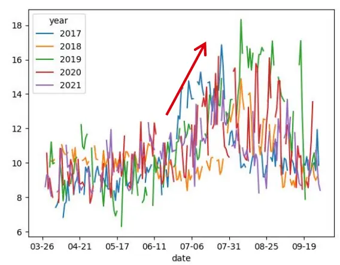
数据来源：公开比赛，华泰期货研究院

我们再考察天然橡胶价格上的“季节性”（详见《华泰期货商品因子专题报告（七）20220329：期货曲线的季节性与便利收益(二)》），每年 11月天然橡胶本年仓单需要注销，次年上市新一年份的橡胶，因此在年初时供应相对紧张，价格较高。另外，天然橡胶期货长期呈现升水结构，天然具有向下回归的动力，对于做多期货不利。

图 12： RU 价格季节性
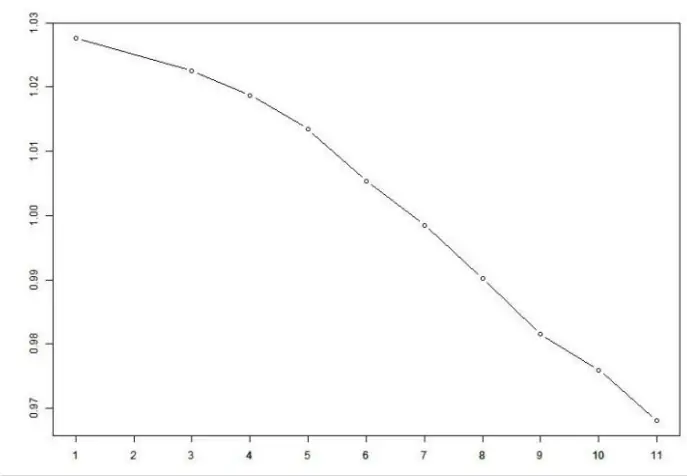
数据来源：天软，华泰期货研究院

图 13： RU 期限结构
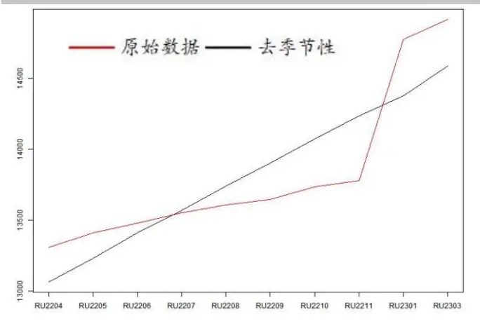
数据来源：天软，华泰期货研究院

图 14： RU 升水影响
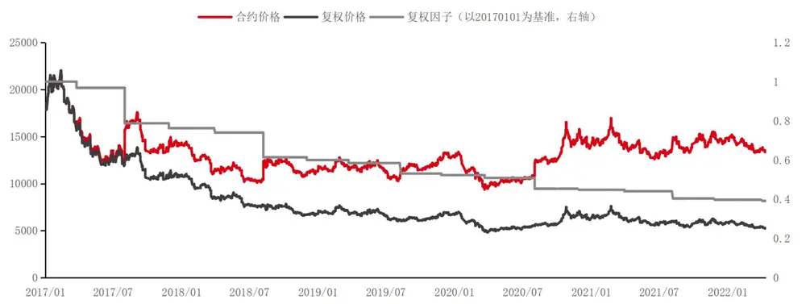
数据来源：天软，华泰期货研究院

总结而言，价格上的季节性导致天然橡胶现货天然的处于价格下降通道（除去跨年），并且合约的升水结构进一步导致期货的价格下降通道更为强烈。同时，在实际交易环节中，对于 09合约而言，空头产业的行为季节性使得产业做空行为集中在 09合约流动性较好的 4月~8 月，行为上的“季节性”与价格上的“季节性”相辅相成，最终导致了收益上的“季节性”，除去 RU2009 合约，近5 年的其它 09合约均在 4 月~8 月出现了收益上的“季节性”。

图 15： RU09 合约季节性收益
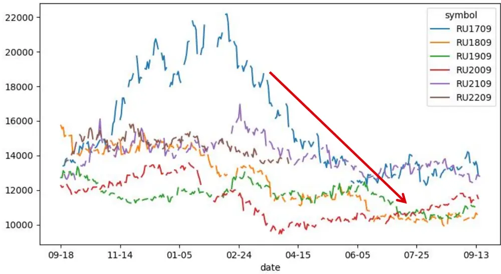
数据来源：天软，华泰期货研究院

我们使用席位数据作为产业资金行为上“季节性”的佐证，以 RU1909 为例，对于空头而言，在 2019年 7月之前，空头持仓的分布都较为寻常，而在 7月中旬开始，随着 RU1909合约即将进入交割月，市场整体持仓快速下降，同时各席位空头持仓也快速下降。但在此期间，中银国际席位（红线部分）空头持仓却持续保持高位，与其它席位形成鲜明对比。

图 16： RU1909 合约空头持仓分布
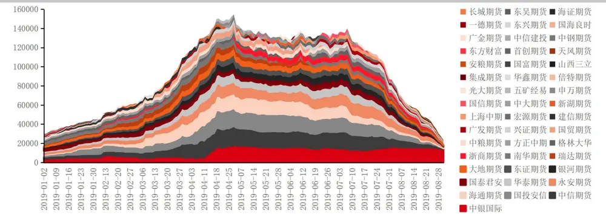
数据来源：天软，华泰期货研究院

从持仓分布来看也是如此，中银国际席位在初期约占比 10%；随着 1909 合约在 2 月开始流动性逐步加强，中银国际席位占比有所下降；随后在 4 月至 7 月即 1909 合约作为主力合约交易的时间段，中银国际席位占比回到 10%并长期保持；最后在临近交割月份，以中信期货、国投安信、海通期货、永安期货、华泰期货、国泰君安等为首的大型期货公司的交易型客户群体开始快速退出，中银国际席位的持仓占比快速上升，并在 8 月末超过全市场 50%的水平。

图 17： RU1909 合约空头持仓分布比例
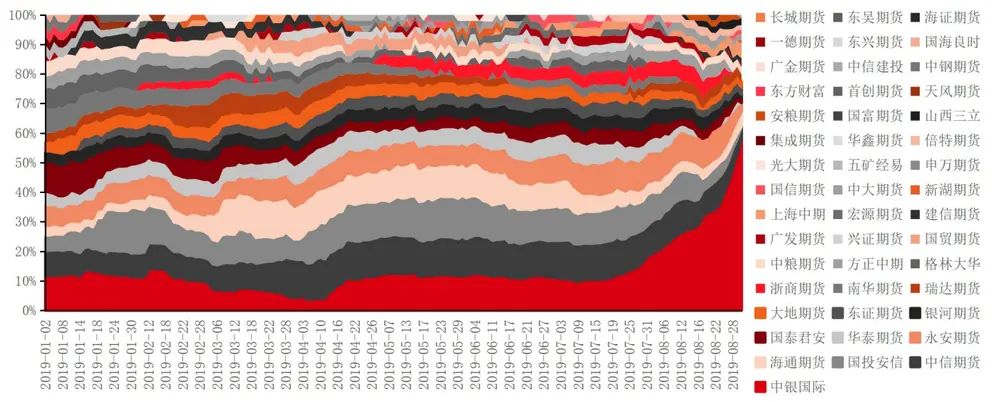
数据来源：天软，华泰期货研究院

图 18： RU1909 合约多头持仓分布
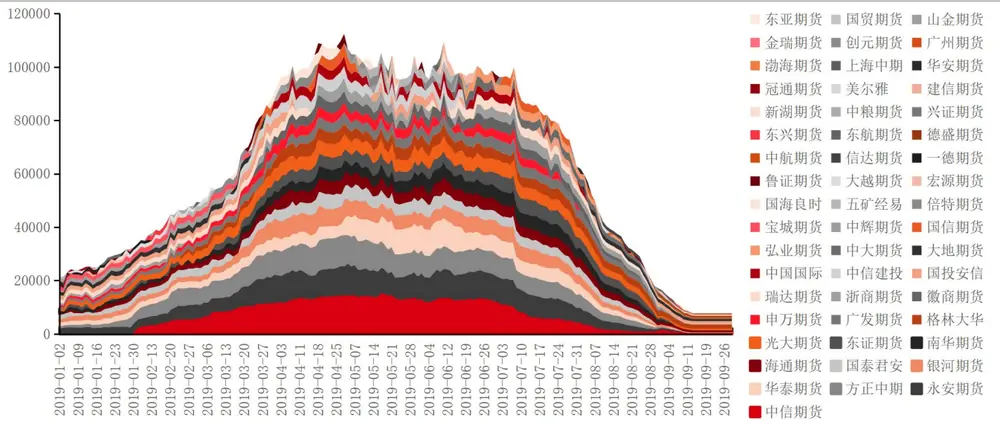
数据来源：天软，华泰期货研究院

同样的，在各席位的多头持仓方面，可以看到并没有出现如同空头类似的随时间变动的持仓聚集特征，即多头“交割接货”的意愿可能并不如空头“交割出货”的意愿集中，这也与我们前文对于产业的判断类似。

图 19： RU1909 合约多头持仓分布比例
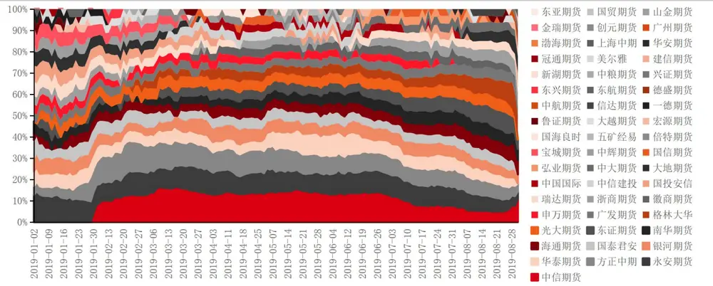
数据来源：天软，华泰期货研究院

因此，天然橡胶由于其价格季节性、升水的期限结构以及产业的交割能力，在“天时、地利、人和”三方面都天然适合做空，而在实际市场中，交易资金偏向于做多（抄底），历年都亏损严重。

最后，我们深入到单一账户层面观察天然橡胶的交易结构：

首先从盈亏分布来看，以 2021年为例，整体盈亏分布明显左偏，其中不乏亏损超过千万的案例，但盈利百万以上仅有 22个，不足亏损百万以上的三分之一；另外在亏损十万以上对比盈利十万以上、以及亏损一万以上对比盈利一万以上，几乎都是 3 倍左右的状态。整体来看，盈利与亏损的比例约为 25%：75%。

图 20： 2021 年天然橡胶盈亏分布数量（对数刻度）
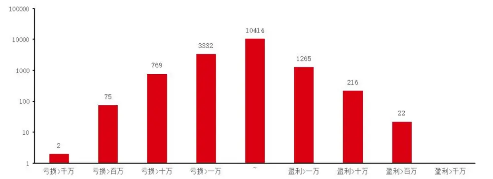
数据来源：天软，华泰期货研究院

其次从关联品种来看，以 2021年为例，交易天然橡胶的投资者更倾向于交易螺纹钢、苹果、棉花、甲醇、纯碱、玻璃等品种。特别值得注意的是，三大股指期货以及三大国债期货的参与程度均较低，即交易橡胶的投资者对于交易金融期货的热情不高。

图 21： 交易天然橡胶的投资者同时交易其它品种的比例
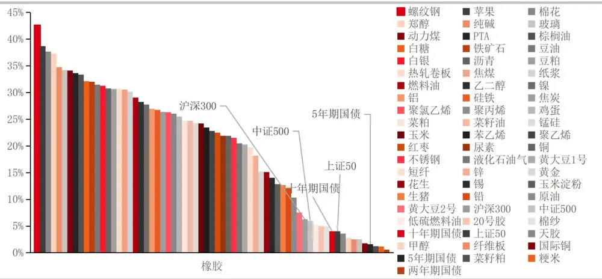
数据来源：天软，华泰期货研究院

图 22： 天然橡胶盈利组和亏损组在其它品种上的平均盈亏（对中位数取log10）
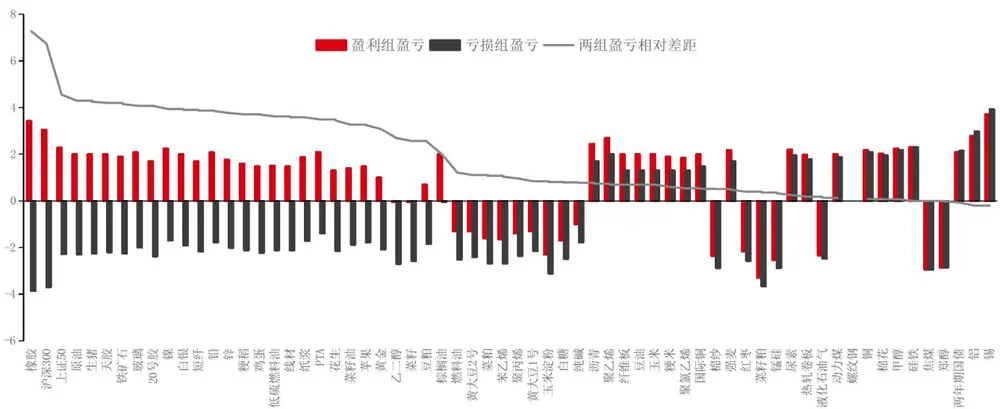
数据来源：天软，华泰期货研究院

另外，对于参与天然橡胶的投资者来说，将其分为盈利组和亏损组，分别考察两个组别在其它品种上的平均盈亏（对中位数取log10），可以看到盈利组在接近一半的品种上做到了亏损组仍然亏损、但盈利组盈利，并且在 90%以上的品种上相对亏损组表现更好，仅在个别品种上跑输亏损组。

图 23： 天然橡胶盈利组和亏损组各分位数在其它所有品种上的总计净值
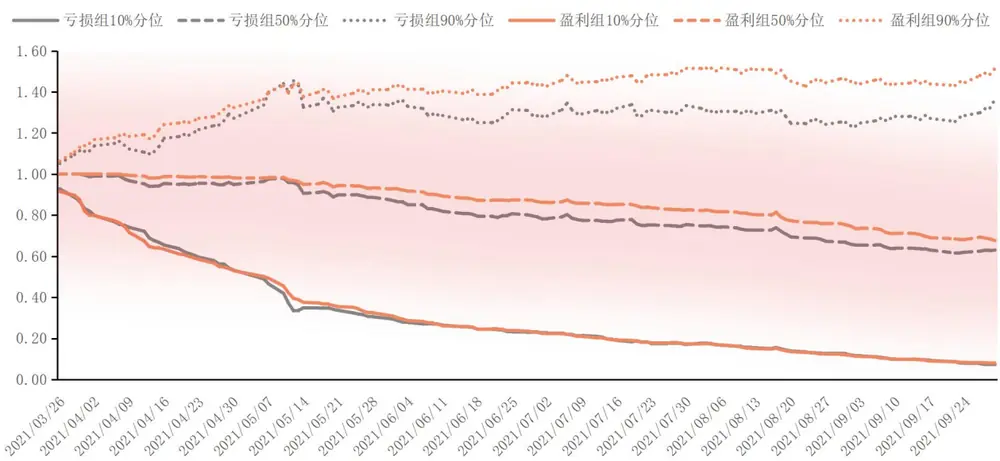
数据来源：天软，华泰期货研究院

在剔除天然橡胶造成的盈亏后，盈利组对比亏损组在组内的相同等级分位数下，仍然体现出较为明显的相对优势，因此我们认为这批在天然橡胶上亏损的投资者并不完全是因为天然橡胶自身的原因，如果造成亏损的一些共性（升贴水、季节性、产业套保、交易习惯等）

能在其它品种上体现出来的话，在其它品种上往往也会表现出亏损，最终两类投资者的净值出现分道扬镳。

总结而言，本文作为量化行为金融系列的第二篇，以天然橡胶品种为案例，分析了部分投资者在该品种上长期亏损的来源，希望对长期交易该品种的投资者有所帮助。后续我们仍将从特定品种出发，并从案例研究逐步过渡到分析体系研究，请投资者持续关注。

## 免责声明

本报告基于本公司认为可靠的、已公开的信息编制，但本公司对该等信息的准确性及完整性不作任何保证。本报告所载的意见、结论及预测仅反映报告发布当日的观点和判断。在不同时期，本公司可能会发出与本报告所载意见、评估及预测不一致的研究报告。本公司不保证本报告所含信息保持在最新状态。本公司对本报告所含信息可在不发出通知的情形下做出修改， 投资者应当自行关注相应的更新或修改。

本公司力求报告内容客观、公正，但本报告所载的观点、结论和建议仅供参考，投资者并不能依靠本报告以取代行使独立判断。对投资者依据或者使用本报告所造成的一切后果，本公司及作者均不承担任何法律责任。

本报告版权仅为本公司所有。未经本公司书面许可，任何机构或个人不得以翻版、复制、 发表、引用或再次分发他人等任何形式侵犯本公司版权。如征得本公司同意进行引用、刊发的，需在允许的范围内使用，并注明出处为“华泰期货研究院“，且不得对本报告进行任何有悖原意的引用、删节和修改。本公司保留追究相关责任的权力。所有本报告中使用的商标、服务标记及标记均为本公司的商标、服务标记及标记。

华泰期货有限公司版权所有并保留一切权利。

## 公司总部

地址：广东省广州市越秀区东风东路761号丽丰大厦20层

电话：400-6280-888

网址：www.htfc.com