研究院量化组

研究员

高天越

0755-23887993

gaotianyue@htfc.com

从业资格号：F3055799

投资咨询号：Z0016156

## 投资咨询业务资格：

证监许可【2011】1289号

## 策略摘要

全方位、系统性介绍利用股指期货IC滚动“吃贴水”构建指增的交易体系。

## 核心观点

## Q&A 形式

结合业界对于股指期货吃贴水的思考，以及与各类型投资者思维交流碰撞的结果，本文通过Q&A的形式详细列举了在吃贴水交易过程中，投资者常见的逻辑问题以及实操问题，共计33个方向。

具体包含以下四个维度：

## 策略原理

基差的本质，基差的收敛性，基差的周期性，基差的风险点等。

## 交易细节

如何选择合约，如何滚动合约，如何处理分红，如何增加保护，如何分配资金，交易时点等。

## 拓展思考

商品期货吃贴水，境外市场吃贴水，期权结构吃贴水，多近空远吃贴水等。

## 备忘信息

中证500指数，限仓政策，交易软件，相关数据等。

下篇主要介绍拓展思考以及备忘信息。

## 拓展思考

吃贴水与指数定投有何区别联系？

IC吃贴水与指数定投两者看似相似，实则不同。

其相似点在于：

1. 都看好中证 500 指数的长期价值；

2. 都追求通过构建交易系统，来获得相比指数更高的收益。

不同点在于：

1.IC吃贴水虽然也需要频繁的开仓，但是本质是为了应对合约到期，所以占用资金固定，永远都为一手，仓位不会发生变化；而指数定投需要持续的加仓，仓位逐渐加重；

2. 虽然都追求低成本建仓，但IC是通过股指期货的折价，而定投依赖于行情的“微笑曲线”。

因此，两者的适用场景也不一样，我们认为指数定投更适用于资产较少，但每月现金流充沛的工薪阶层；而吃贴水更适合资产中上，可以将一部分资金长期配置在IC上的投资者。当然，指数定投与IC吃贴水本身并不矛盾，我们完全可以同时定投指数ETF，也同时滚动IC吃贴水。

另外，我们更可以将定投指数的思路用在吃贴水上，以2018年熊市为例，如果投资者在2016、2017的牛市中一直只交易一手，但在熊市期间，由于指数下跌，投资者选择定投与吃贴水相结合，逐步加大投资力度，按照每季度合约增多一张的方案，可以看到在IC1903合约上，就已经实现了亏损全部覆盖，而此时中证500指数相距2018年年初还有1000点的跌幅。

这样的优秀结果一部分是吃贴水的贡献，一部分是定投的贡献，可以说是非常匹配的结合。

表1：2018年行情中定投与吃贴水相结合|单位：无

|  |  | IC1803 | IC1806 | IC1809 | IC1812 | IC1903 |
| --- | --- | --- | --- | --- | --- | --- |
|  | 2018年3月 | 1 |  |  |  |  |
| 持仓手数 | 2018年6月 |  | 2 |  |  |  |
| (手) | 2018年9月 |  |  | 3 |  |  |
|  | 2018年12月 |  |  |  | 4 |  |
| 2019年3月 |  |  |  |  |  | 5 |
| 合约价格 | 2018年1月 | 6305.0 |  |  |  |  |
|  | 2018年3月 | 6174.2 | 6002.6 |  |  |  |
|  | 2018年6月 |  | 5482.6 | 5353.0 |  |  |
|  | 2018年9月 |  |  | 4788.0 | 4797.2 |  |
|  | 2018年12月 |  |  |  | 4220.0 | 4168.0 |
| 盈亏水平 (万元) | 2019年3月 |  |  |  |  | 5351.2 |
|  | 2018年3月 | -2.616 |  |  |  |  |
|  | 2018年6月 |  | -20.8 |  |  |  |
|  | 2018年9月 |  |  | -33.9 |  |  |
|  | 2018年12月 |  |  |  | -46.176 |  |
|  | 2019年3月 |  |  |  |  | +118.32 |
| 总计 |  | 盈利 14.83 万元 |  |  | 无杠杆最大资金占用约500 万元 |  |

资料来源：Wind 华泰期货研究院

## 除了A股市场，香港、美国市场也可以吃贴水吗？

IC、IF、IH均可以通过吃贴水获得超越指数本身的收益，那么其它市场的股指期货是否也能够构建这样的交易呢？

在实证这个问题之前，我们需要回顾贴水的本质，即对冲途径狭窄导致的长期深度负基差。那么，如果一个市场对冲途径非常丰富，那么吃贴水就应该不可行。

比如美国股票市场，融券做空十分方便，因而标普500股指期货（ES合约）理应不贴水；比如香港市场，恒生指数期货中的股票同样做空比较畅通，所以不会深度贴水，而同样是香港市场的MSCI-A50股指期货或者新加坡的富时 A50股指期货，由于成分股还是A股的大盘股票，所以可能会有浅幅贴水；亦或者近几年大放异彩的新兴市场中的越南股票市场（VN30），由于同样融券受到较多限制，理应有深度贴水。

图 1：VN30 基差 | 单位：%
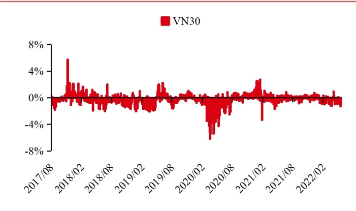
数据来源：Bloomberg华泰期货研究院

图 2：标普500基差 |单位：%
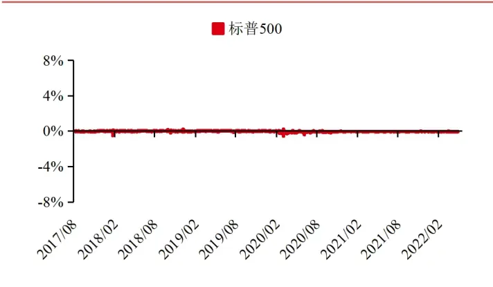
图 3：恒生指数基差单位：%
数据来源：Bloomberg华泰期货研究院

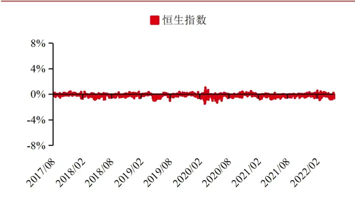
数据来源：Bloomberg华泰期货研究院

图 4：A50 基差  单位：%
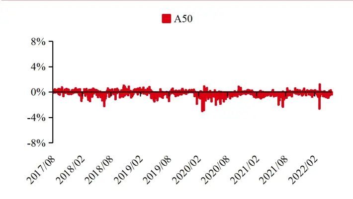
数据来源：Bloomberg华泰期货研究院

实证结果来看，各个市场的股指期货升贴水都比较符合我们逻辑推演的结果。从基差水平来看，VN30>A50>恒生>标普500，从基差的波动来看，同样如此。当然，受限于各种投资限制，直接在以上市场进行吃贴水交易困难重重，本文在此不多做介绍，仅为投资者开拓视野。

## 商品期货可以吃贴水吗？

除了股指期货吃贴水，很多其它衍生品也能够设计吃贴水的交易方案。以国内三大商品交易所的商品期货为例，黑色系的铁矿石、螺纹钢等均是吃贴水的优秀标的。有所区别的是，除了期货折价这一因素外，股指期货吃贴水的另一前提是长期看好企业的成长性，而对于不同的商品来说，吃贴水的前提就是看好这些商品未来能够长期涨价，这里我们暂且不讨论这个问题，而是观察商品期货中有哪些是长期折价的，哪些是长期溢价的。

图5：上市以来各品种滚动相对收益|单位：%
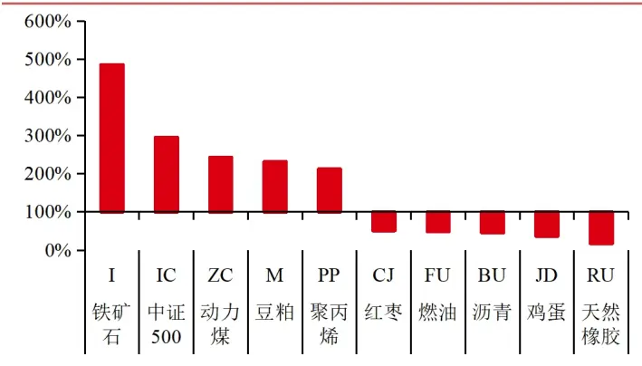
数据来源：Wind 华泰期货研究院

图6：铁矿石滚动收益单位：点
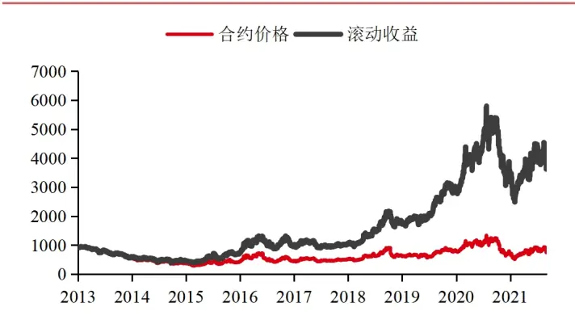
数据来源：Wind 华泰期货研究院

以各商品上市以来数据统计，铁矿石、中证500、动力煤、豆粕、聚丙烯等都处于深度贴水，做多长期滚动收益较高；天然橡胶、鸡蛋、沥青、燃油、红枣等都处于深度升水，做多长期滚动亏损较多。以铁矿石为例，尽管铁矿石本身在1000元附近上下波动，并没有长期涨价的特征，但由于铁矿石期货贴水够深，长期做多期货的收益颇丰。在此基础上，投资者可能会深入考虑，如果长期做多贴水的品种，同时长期做空升水的品种，那么就可以获得升贴水收敛的相对收益。华泰期货已发布基于此类逻辑构建的商品策略指数，详情可见wind 指数代码HTCI0201。

图7：天然橡胶滚动收益单位：点
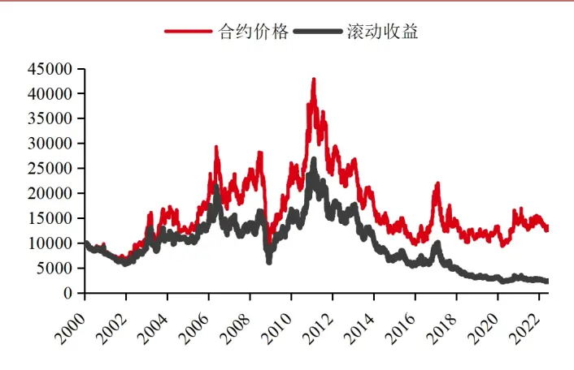
数据来源：Wind 华泰期货研究院

图8：华泰期货策略指数单位：指数点
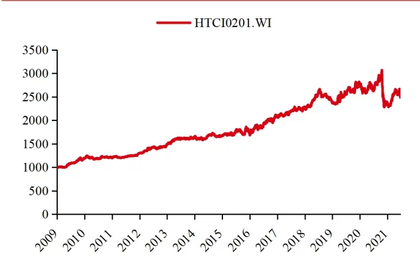
数据来源：Wind 华泰期货研究院

## 基差为什么具有周期性？

在上文合约展期的方案二中，我们说明了方案二的本质是利用基差的均值回归特性，也即基差的周期性。那么基差为何具有周期性呢？我们从定性和定量两个角度探讨这个问题。

定性来看，在市场超额较少、基差扩大时，股票端收益减少，同时期货端对冲成本上升，此时中性产品表现弱势，产品遭遇赎回规模下降，导致IC空头变少、基差缩小，股票的alpha环境也更为宽松。而在市场超额较多、基差缩小时，股票端收益增加，同时期货端对冲成本下降，此时中性产品表现强势，产品面临申购规模上升，导致IC空头变多、基差扩大，股票的alpha环境也更为拥挤。

这样的循环导致了基差水平具有非常明显的周期性。另外，不管是公募的中性对冲基金，还是私募的中性对冲产品，产品的新发、续发、募集一直到交易需要经过层层手续，并且和当下市场中投资者的购买热情息息相关，因而也导致了基差周期性质的强化。

图9：IC基差水平的周期性（定性） 单位：无
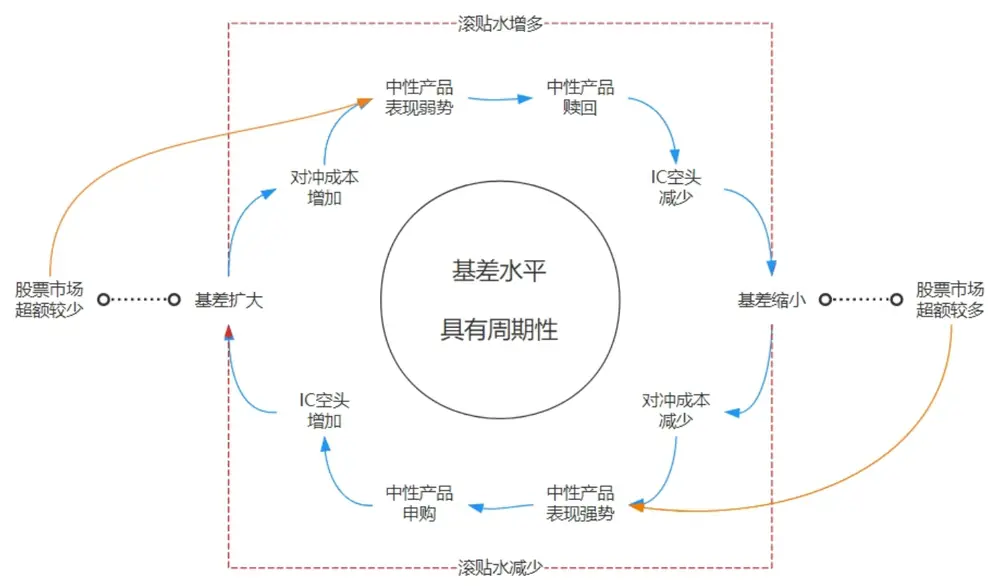
数据来源:华泰期货研究院

定量来看，相比滚贴水的投资者数量以及中性产品的申购赎回，股票市场的超额是我们比较容易观测到的数据。我们以公募基金的中证500指数增强超额收益为例：

图10：IC基差水平的周期性（定量）单位：无
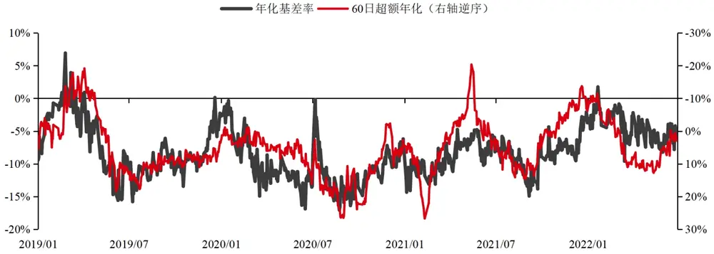
数据来源：Wind华泰期货研究院

可以看到两者的走势十分接近，相关性达到64%。因此总结而言，投资者的群体性行为导致的市场拥挤度变化，是基差周期性的本质来源，也是展期方案二的设计出发点。

## 可以多近空远吃贴水，避免大盘风险吗？

假定IC四个不同期限的合约年化基差率完全相等，并且收敛速度也相同，那么选择哪个合约将没有任何区别。同理，多近空远这类交易也将毫无收益。

但是，IC的不同期限合约年化基差率并不完全相等，收敛速度也不尽相同。一般而言，近月合约相比远月合约年化贴水更深，收敛速度更快。因此就创造出了多近空远的交易空间。

图 11：多近空远 5 年收益|单位：%
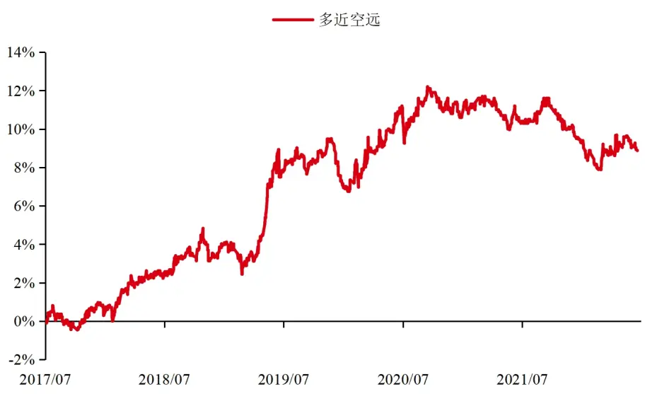
数据来源：Wind 华泰期货研究院

从结果来看，多近空远确实避免了大盘的风险，但总体收益偏低，近年来也有下降趋势。一方面是由于策略的拥挤度在上升，另一方面我们认为“多近空远”并没有把握住基差期限结构的本质。

## 多近空远的本质是什么，为什么不能多远空近？

多近空远的本质我们认为是做平结构。

多近空远的收益来源于近月合约相比远月合约年化贴水更深，收敛速度更快。但收敛速度在上文我们已经介绍，其特征并不明显也不稳定。因此多近空远的收益主要由近月贴水更深贡献。

但是实际上近月合约并不是永远都比远月合约年化贴水深，部分时段近月合约反而年化贴水更浅。如果我们根据当下不同的深浅状况，来决定是“多近空远”还是“多远空近”，那么收益将得到大幅提升。

图12：多近空远升级版5 年收益单位：%
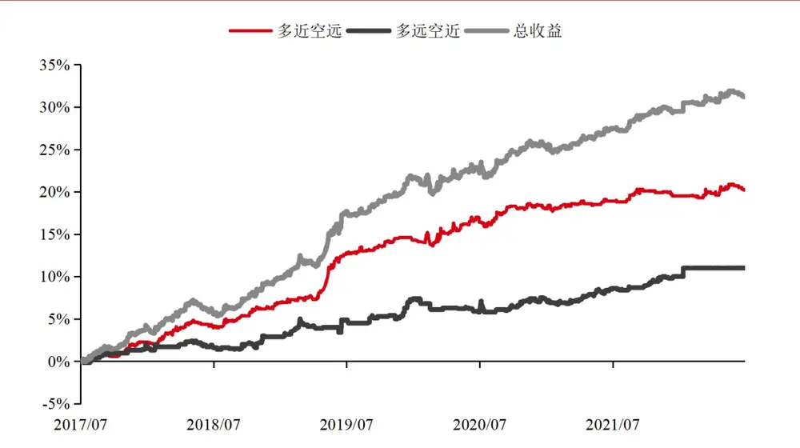
数据来源：Wind 华泰期货研究院

更深一层考虑问题，以下图为例，横轴为到期时间，纵轴为基差贴水。对于左图的情况而言，近月贴水较浅，远月贴水较深，因而空近多远。

图13：近高远低，做平结构|单位：无
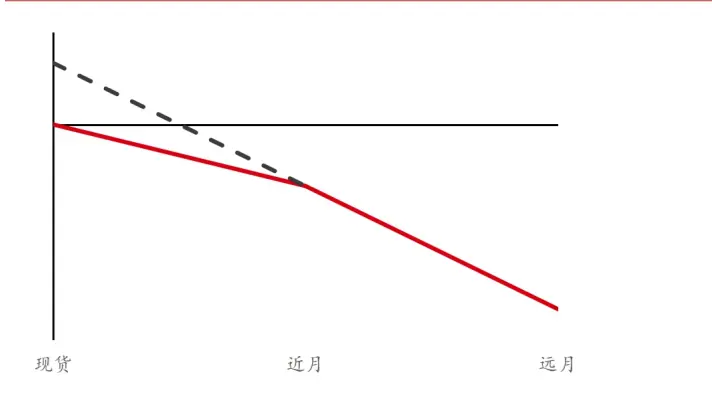
数据来源：Wind 华泰期货研究院

图14：近低远高，做平结构单位：指数点
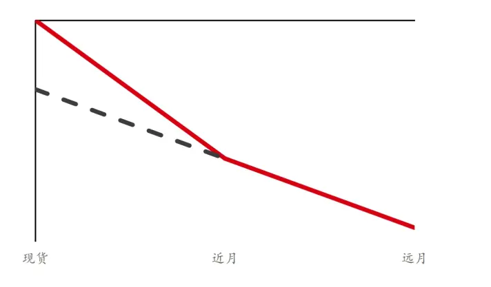
数据来源：Wind 华泰期货研究院

但是近月远月的到期时间并不一样，如果修复情况如左图，整体基差扩大，那么由于远月更远，实际基差变动更大，做多亏损更多，整体空近多远组合亏损。如果修复情况如右图，整体基差缩窄，那么由于远月更远，实际基差变动更大，做多盈利损更多，整体空近多远组合盈利。

不管哪种情况，结构变平的收益都能够抓住，而结构整体旋转则是策略的风险来源。

图15：近高远低修复情况一单位：无
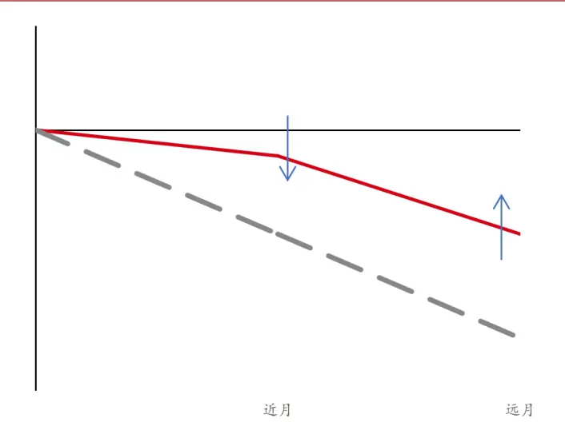
数据来源：Wind 华泰期货研究院

图16：近高远低修复情况二单位：指数点
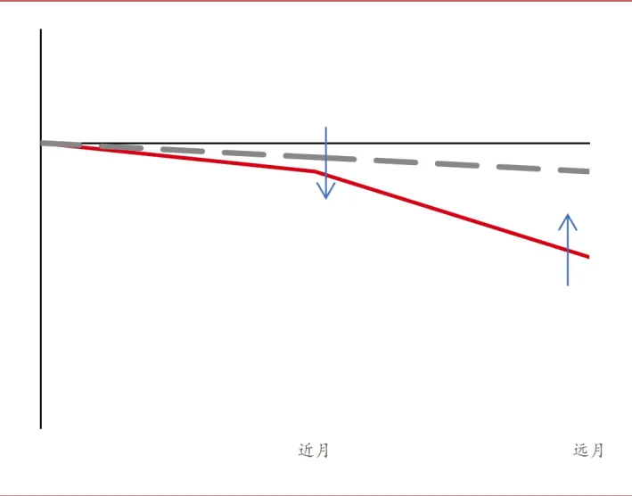
数据来源：Wind 华泰期货研究院

本质而言，结构之所以会出现扭曲，恰恰是对结构可能发生旋转的风险补偿，核心逻辑与“IC之所以贴水，是对替中性对冲承担可能下跌的风险补偿”一致。

## 吃贴水相比买股票表现如何？

随着市场逐步由普涨普跌行情向结构性行情转变，近年来越来越多成分股跑输综合指数，跑赢比例保持在40%附近，随机挑选股票，连续六年跑赢指数概率仅为：

$$
0.4\wedge6=0.4\%,\mp4\div\tt{pm}
$$

表2：中证 500 指数成分股跑赢指数比例|单位：%

|  | 2016 | 2017 | 2018 | 2019 | 2020 | 2021 | 2022 | 2023 |
| --- | --- | --- | --- | --- | --- | --- | --- | --- |
| 跑赢 | 243 | 170 | 260 | 199 | 176 | 197 | 250 | 256 |
| 跑输 | 257 | 330 | 240 | 301 | 324 | 303 | 250 | 244 |
| 跑赢比 例 | 48.6% | 34.0% | 52.0% | 39.8% | 35.2% | 39.4% | 50.0% | 51.4% |
| 跑输比 例 | 51.4% | 66.0% | 48.0% | 60.2% | 64.8% | 60.6% | 50.0% | 48.6% |

数据来源：Wind 华泰期货研究院

更进一步，历年成分股跑赢吃贴水的比例维持在25%左右，随机挑选股票，连续六年跑赢吃贴水概率：

$$
0.25\wedge6=0.02\%,\ \mathcal{F}\dot{\mathcal{H}}\dot{z}=
$$

表3：中证 500 指数成分股跑赢IC 比例 |单位：%

|  | 2016 | 2017 | 2018 | 2019 | 2020 | 2021 |
| --- | --- | --- | --- | --- | --- | --- |
| 跑贏 | 36 | 105 | 213 | 139 | 150 | 141 |
| 跑输 | 464 | 395 | 287 | 361 | 350 | 359 |
| 跑赢比例 | 7.2% | 21.0% | 42.6% | 27.8% | 30.0% | 28.2% |
| 跑输比例 | 92.8% | 79.0% | 57.4% | 72.2% | 70.0% | 71.8% |

数据来源：Wind 华泰期货研究院

总结而言，在目前的市场环境中，对于选股能力并不突出的投资者，吃贴水交易是远比股票交易更加稳健的投资体系。

## 吃贴水相比买指数基金、指数增强基金表现如何？

除了相比投资股票有优势，IC吃贴水相比指数基金也具有很大优势。

对比公募的中证500指数增强基金，可以看到在不考虑杠杆的情况下，IC吃贴水已经能够跑赢所有指数增强基金；

对比私募的中证500指数增强基金，IC吃贴水约为头部私募的收益中位数附近，但相比全市场更多腰部尾部私募的收益更稳健。

图 17：吃贴水 vs 公募指增|单位：净值
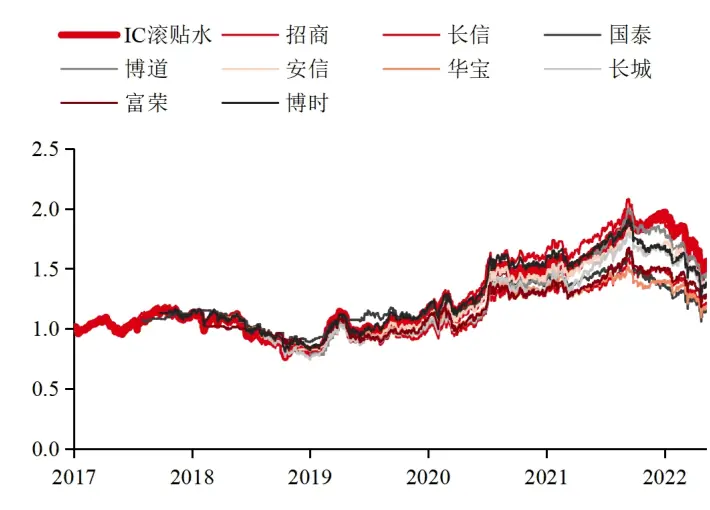
数据来源：Wind 华泰期货研究院

图 18：吃贴水 vs 私募指增|单位：净值
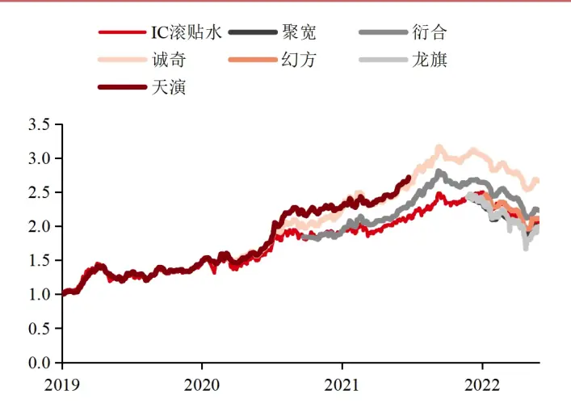
数据来源：朝阳永续华泰期货研究院

若考虑到公私募基金的管理费、公募基金的申购赎回费、私募基金的业绩提成，以及吃贴水交易剩余保证金的利息，IC吃贴水的优势更上一个台阶。

在投资的流动性上，吃贴水交易T+1即可，而公私募的流动性较差，变现能力较弱。

## 挂钩中证500的各类型产品和吃贴水的区别？

本质而言，任何挂钩中证500的产品（非股票型）都是基于IC构建的。

指数增强 = 吃贴水 + 买入看涨期权；指数气囊 = 吃贴水 + 买入看跌期权；结构化期权 = 吃贴水 + 卖出看跌期权；

表4：常见的挂钩中证500产品|单位：无
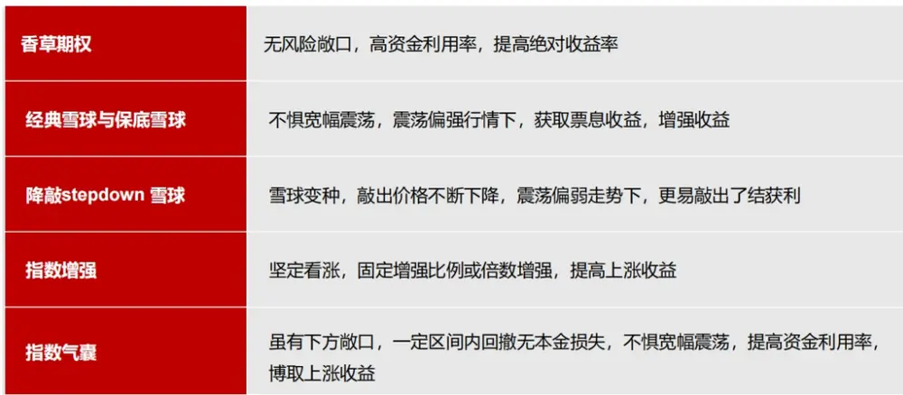
数据来源：华泰期货研究院

以指数增强产品为例，其中固定增强结构和最基础的滚贴水无任何区别；多倍增强结构则是利用IC的贴水部分购买看涨期权，以实现高倍的收益。

图19：固定增强结构单位：无
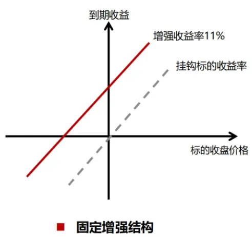
图20：多倍增强结构|单位：无

适用情形：预判慢牛行情，可能会有小幅回撤。

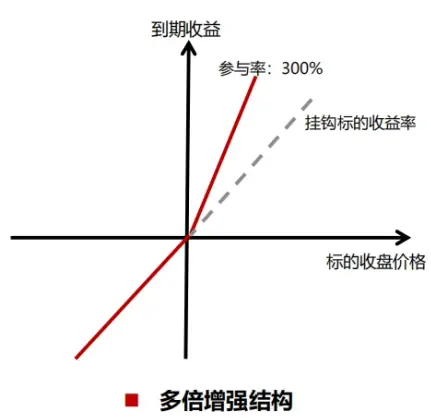

结构特点：增强部分固定，一般在10%左右随基差情况调整。价格小幅下跌可冲抵损失。线性收益，需要支付100%初始保证金。可接受定期赎回定制化。

数据来源：华泰期货研究院

适用情形：坚定看涨，希望能提高收益率

结构特点：非线性收益，内嵌看涨香草期权结构，参与率为300%。不可提前中止，需要支付100%初始保证金。多倍增强参与率报价会随着指数基差变动调整。

数据来源：华泰期货研究院

同样的，以结构化期权产品为例，发行方通过基差以及高抛低吸，来实现敲入敲出的收益结构。通过设计高抛低吸方案，任意投资者都可以使用IC来实现类似的结果。

图21：结构化期权|单位：无
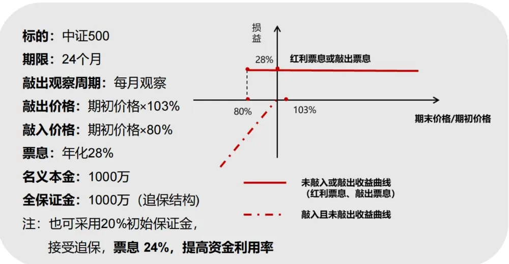
数据来源：华泰期货研究院

总结来看，挂钩中证500的各类型产品都是基于IC，再叠加上更多的交易策略来实现的。投资者如果相关经验丰富、交易时间充沛，则可自行构建相关结构。

## 结构化期权产品对吃贴水影响如何？

结构化期权产品作为目前挂钩中证500系列产品中占比最高的一种，常被投资者认为对中证500具有较强影响，我们推荐投资者关注“日内相关性”这一指标。

由于传统结构化期权以及变种结构化期权都需要在日内对股指期货进行高抛低吸，因此当指数价格下跌时，结构化期权发行方需要买入，股指期货价格上升，同时基差缩窄，当指数价格下跌时，结构化期权发行方需要卖出，股指期货价格下降，同时基差扩大。所以，在结构化期权主导的行情中，基差与指数的日内相关性应为负值。

从实际情况来看，在结构化期权大规模发行的2020年以及2021年，确实出现了较强的负相关性，而在这之前长期呈现正相关。投资者可以将该指标作为观察市场目前是否被结构化期权交易主导的窗口。

图 22：基差与指数的日内相关性单位：%
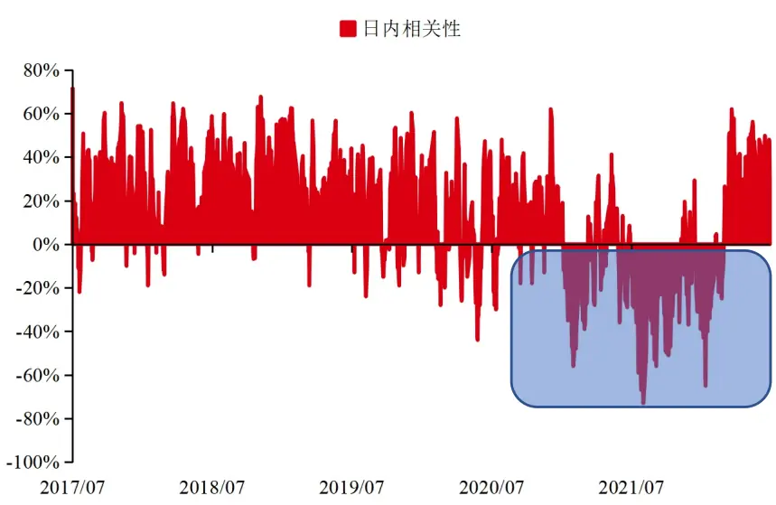
数据来源：Wind 华泰期货研究院

另外值得一提的是，在2022年3-5月的下跌中，基差与指数呈现很强的正相关性，我们认为这波下跌结构化期权并不是主导原因（因为结构化期权是高抛低吸，负相关），而私募的指数增强基金等才是重要因素（因为触及止损线，指增基金是追涨杀跌，正相关）。

## 吃贴水的理念广为人知了吗，现在的参与者多吗？

吃贴水交易目前受到很多投资者关注，我们使用实盘比赛参与股指期货人数这一特殊视角作为观察切入口。

图 23：IH 多空人数单位：人
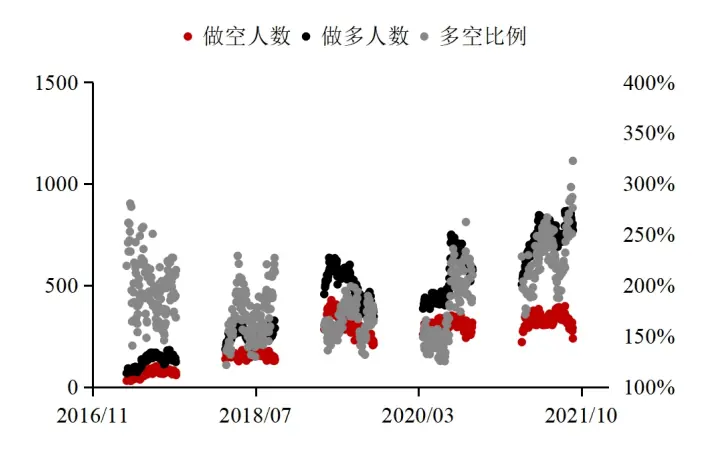
数据来源：期货日报大赛华泰期货研究院

图 24：IF 多空人数单位：人
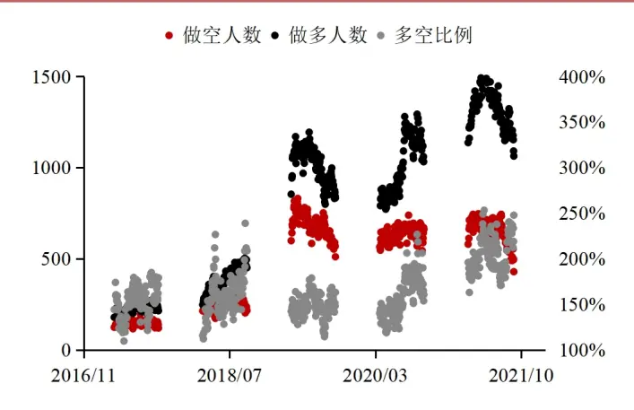
数据来源：期货日报大赛华泰期货研究院

首先，参与IF与IC的多空投资者在2019年以后快速增多；其次，相比空头为机构套保，人数较少，多头主要为吃贴水投资者，人数较多；最后，从多空人数比例来看，贴水最多的IC比例最大。

图 25：IC 多空人数单位：人
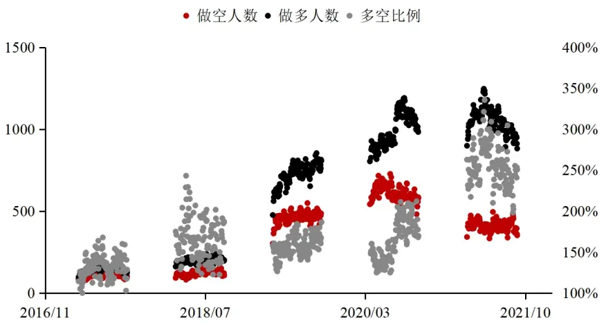
数据来源：期货日报大赛华泰期货研究院

因此，我们认为吃贴水的理念目前虽广为流传，但真正参与到市场的投资者并没有特别多，交易并不拥挤，策略也尚未失效。

## 备忘信息

## 中证500 指数本身有哪些特点？

中证500指数本身为全市场前 300名至前 800名的股票组合：

从市值分布来看，中证500成分股市值多数分布在150~300亿，相对上证50以及沪深300市值差距半个数量级，而和中证1000则比较接近。

从权重集中度来看，中证500同样和中证1000比较接近，权重更为分散，而上证50和沪深300较为集中，容易受到个别权重股的深度影响。

图26：指数市值分布|单位：亿元
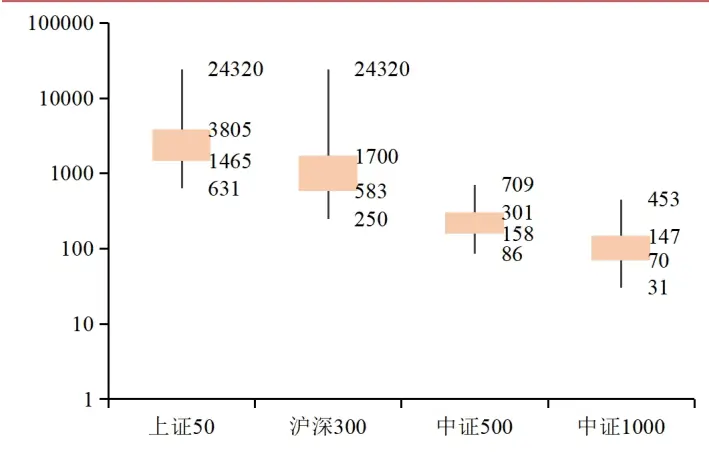
数据来源：Wind 华泰期货研究院

图27：指数权重集中度|单位：%
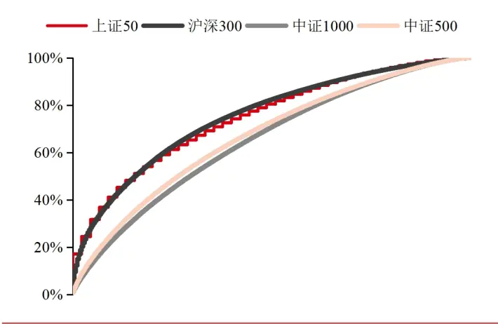
数据来源：Wind 华泰期货研究院

从市值占比来看，尽管IPO速度时快时慢、规模时大时小，但是中证500始终占据全市场15%左右的市值，波动相比50、300和1000都更小。

图 28：指数市值占比单位：%
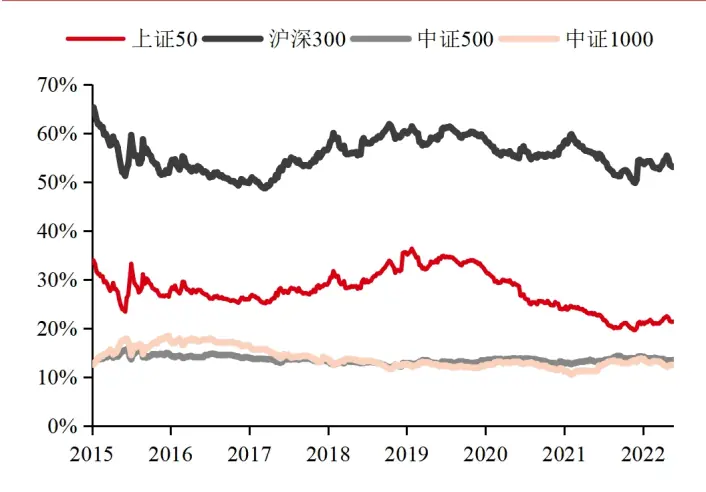
数据来源：Wind 华泰期货研究院

图 29：中证500 行业分布 单位：%
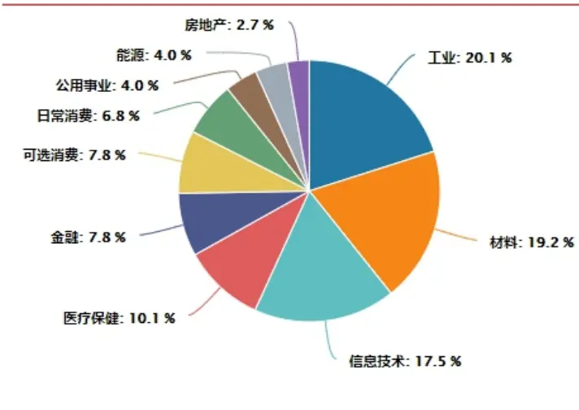
数据来源：Wind 华泰期货研究院

从行业分布来看，上证50更偏向于金融消费，沪深300偏向于消费医药，而中证

500则更偏向于制造业和周期。

表 5：重要指数代表性对比

| 市值排名 | 中证指数 | 国证指数 | 美国股票指数 |  |
| --- | --- | --- | --- | --- |
| 1-300 | 沪深 300 | 国证1000 | 罗素100039倍 | 标普50037倍罗素3000暂无 |
| 301-500501-800 | 中证500 |  |  |  |
| 801-1000 | 中证1000暂无 |  |  |  |
| 1001-1800 |  | 国证 2000 | 罗素 200040倍 |  |
| 1801-3000 |  |  |  |  |

资料来源：Wind 华泰期货研究院

从国际对比来看，中证500 比较接近的罗素1000 减去标普500，标普500 和罗素1000虽然确实有阶段性的领先落后，但从美国市场近50年的长期走势来看，两者没有较大区别，长期收益都在40倍左右。

## 中证500指数的更新迭代影响如何？

中证500指数本身并不是一成不变的，每年6月和12月，指数会进行定期的更新换代。其中，全A中市值增长的股票会纳入到指数成分股中，部分原中证500成分股若市值继续增长会升级到沪深300，而沪深300中成分股若市值下降则会降级到中证500。

图 30：中证500 指数迭代|单位：无
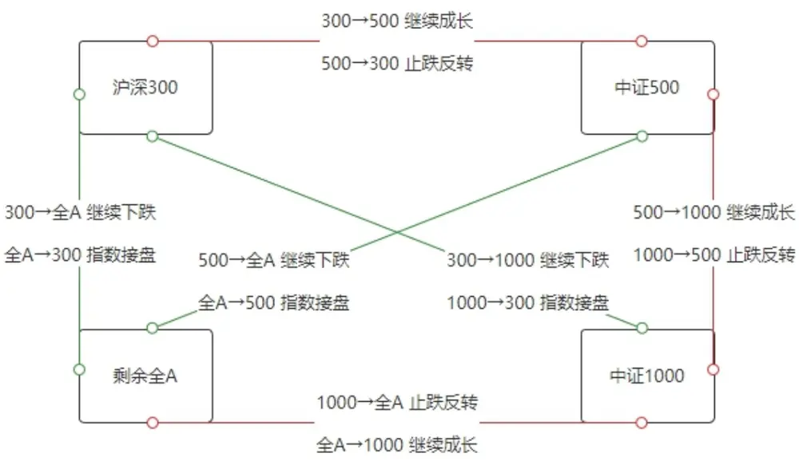
数据来源：Wind 华泰期货研究院

根据我们统计，不同的纳入剔除路径，平均表现出现较大差别。从全A直接升入300以及从300 直接降级到全A，跳过500阶段的这两个路径的这些股票，平均来看后续走势都远跑输指数；而从全A升级到500，再从500升级到300的这些股票，平均来看后续走势都远跑赢指数。

我们认为后者比较稳健的升级路径是企业自身的成长以及价值发现，因而未来大概率还能继续表现优秀，而激进的升级路径则很可能是受到市场短期的投机炒作之风影响，长期来看会造成负面效果。

总结来看，中证500作为股票市场的中坚力量，好的方面是不太容易受到过度的炒作影响，坏的方面是没办法享受顶尖龙头企业的长期盈利能力，指数的更新迭代机制保证了中证500永远是较为稳健的一类指数。

## 股指期货的限仓政策影响如何？

股指期货自上市以来，历经2015年股灾、2016年熔断，在此期间交易规则多有限制，在2017年后逐步放开，截止目前，限仓政策对于普通投资者而言几乎无影响。

表6：股指期货合约大事件年表
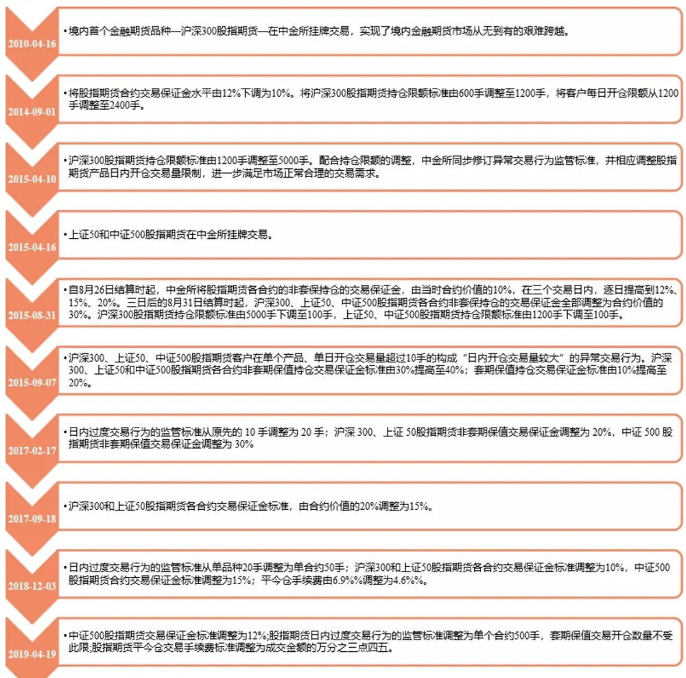
资料来源：中金所，华泰期货研究院

在限仓政策以及后续的宽松政策的影响下，股指期货保证金比例经历过多次调整，目前保证金水平与限仓前类似，维持在12%~14%左右。

表7：股指期货历年交易政策|单位：%

|  |  |  | 2017.02.17 | 2017.09.18 | 2018.12.03 | 2019.04.22 | 2021.01.01 |
| --- | --- | --- | --- | --- | --- | --- | --- |
|  |  |  | 一 |  |  |  |  |
|  | 2015.08.26 | 2017.02.16 | 2017.09.17 | 2018.11.30 | 2019.04.19 | 2020.12.30 |  |
| 日内开仓手数 | 单品种 5000 手 | 单品种10手 | 单品种20手 | 单品种20手 | 单合约50 手 | 单合约 500 手 | 单合约 500 手 |
| 保证金（非套保） | 10% | 40% | IF/IH:20%;IC:30% | IF/IH:15%;IC:30% | IF/IH:10%;IC:15% | IF/IH:10%;IC:12% | IF/IH:12%;IC:14% |
| 保证金（套保） | 10% | 20% | 20% | IF/IH:15%;IC:20% | IF/IH:10%;IC:15% | IF/IH:10%;IC:12% | IF/IH:12%;IC:14% |
| 平今仓手续费 | 0.23%% | 23%% | 9.2%% | 6.9%% | 4.6%% | 3.45%% | 3.45%% |

资料来源：Wind 华泰期货研究院

但是在手续费方面，目前平今仓手续费3.45%%仍是限仓前基准0.23%%的15倍，这意味着日内TO的超短期投机交易需要缴纳惩罚性手续费，中金所对过度投机仍有严格限制。

图31：三大股指期货总成交量与总持仓量|单位：万手
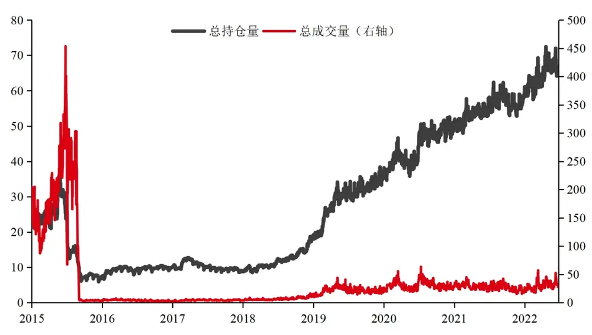
数据来源：Wind 华泰期货研究院

从市场表现来看，目前持仓量已超过2015年限仓前高点，但成交量仍处于低位，当下市场的投资属性较好，过度投机现象较弱。

## 股指期货的交易权限如何开通？

股指期货属于特定品种，根据《中国金融期货交易所交易者适当性制度管理办法》，期货公司会员为个人客户申请开立交易编码时，个人客户应当符合以下标准：

(一）具备完全民事行为能力；

（二）具备期货交易基础知识，了解相关业务规则；

（三）具有累计不少于10个交易日且20笔及以上的境内交易场所的期货合约或者期权合约仿真交易成交记录；或者近三年内具有10笔及以上的境内交易场所的期货合约、期权合约或者集中清算的其他衍生品交易成交记录；

(四)申请开立交易编码前连续5个交易日保证金账户可用资金余额均不低于人民币 50万元；

（五）不存在严重不良诚信记录、被有权监管机关宣布为期货市场禁止进入者和法律、法规、规章、交易所业务规则禁止或者限制从事期货交易的情形；

(六）交易所要求的其他条件。

## 推荐哪些交易软件，相关数据如何查看？

以投资者常用的文华赢顺以及机构常用的wind资讯为例：

图32：文华赢顺数据界面单位：无

| 序号 合约名称 最新 现手 买价 |  | 卖价 买量 卖量 成交量 |  | 涨跌 涨幅% |
| --- | --- | --- | --- | --- |
| 30 500股指主连 6443.831 500股指2207 M 6443.8 | 3 6444.4 | 6445.2 4 2 | 22140 | 60.40.95% |
|  | 3 6444.4 | 6445.2 4 2 | 22140 | 60.40.95% |
|  | 1 6402.0 | 6404.2 1 3 1304 |  | 62.40.98% |
|  |  | 6369.0 2 1 6901 |  | 62.00.98% |
|  |  | -- ---- --- 0 |  | 0.00.00% |
|  |  | ---- 0 |  | 0.00.00% |

数据来源：Wind 华泰期货研究院

图 33：wind 咨询数据界面 单位：无

| 名称 | 现价 | 涨跌 | 涨跌幅 | 基差 | 升水率 |
| --- | --- | --- | --- | --- | --- |
| 中证500 | 6444.79 | 70.49 | 1.11% | 0.00 | 0.00% |
| E500指数期货 |  |  |  |  |  |
| IC2207 | 6440.8 | 57.4 | 0.90% | -3.99 | -0.06% |
| IC2208 | 6401.2 | 61.0 | 0.96% | -43.59 | -0.68% |
| IC2209 | 6367.4 | 61.4 | 0.97% | -77.39 | -1.20% |
| IC2212 | 6270.0 | 65.8 | 1.06% | -174.79 | -2.71% |

数据来源：Wind 华泰期货研究院

可以看到文华赢顺仅提供了行情数据，未提供基差类衍生数据；wind提供了基差、基差率，但是未提供基差水平（考虑年化、考虑分红等）。

考虑到数据的及时性和有效性，建议投资者关注华泰期货相关服务。

图34：华泰期货数据服务|单位：无
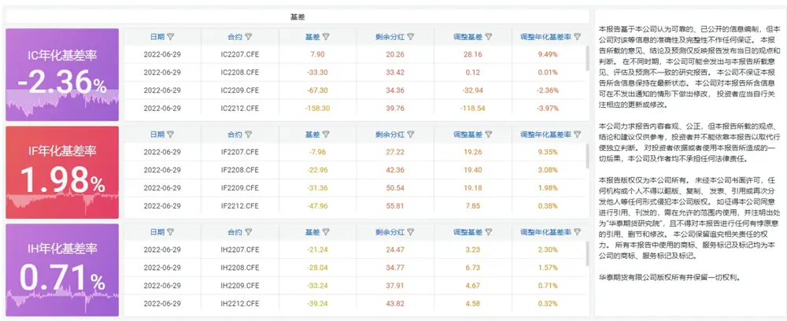
数据来源：Wind 华泰期货研究院

## 股指期货合约规格

表8：上证 50 股指期货合约表

| 上证50股指期货合约表 |  |  |  |
| --- | --- | --- | --- |
| 合约标的 | 上证50指数 | 最低交易保证金 | 合约价值的8% |
| 合约乘数 | 每点300元 | 最后交易日 | 合约到期月份的第三个周五，遇国家法定假日顺延 |
| 报价单位 | 指数点 | 交割日期 | 同最后交易日 |
| 最小变动价位 | 0.2点 | 交割方式 | 现金交割 |
| 合约月份 | 当月、下月及随后两个季月 | 交易代码 | IH |
| 交易时间 | 上午：9:30-11:30，下午：13:00-15:00 | 上市交易所 | 中国金融期货交易所 |
| 每日价格最大波动限制 | 上一个交易日结算价的±10% |  |  |

资料来源：中金所，华泰期货研究院

表9：沪深 300 股指期货合约表

| 沪深300股指期货合约表 |  |  |  |
| --- | --- | --- | --- |
| 合约标的 | 沪深300指数 | 最低交易保证金 | 合约价值的8% |
| 合约乘数 | 每点300元 | 最后交易日 | 合约到期月份的第三个周五，遇国家法定假日顺延 |
| 报价单位 | 指数点 | 交割日期 | 同最后交易日 |
| 最小变动价位 0.2 | 点 | 交割方式 | 现金交割 |
| 合约月份 | 当月、下月及随后两个季月 | 交易代码 | IF |
| 交易时间 | 上午：9:30-11:30，下午：13:00-15:00 | 上市交易所 | 中国金融期货交易所 |
| 每日价格最大波动限制 | 上一个交易日结算价的±10% |  |  |

资料来源：中金所，华泰期货研究院

表 10：中证500 股指期货合约表

| 中证500股指期货合约表 |  |  |  |
| --- | --- | --- | --- |
| 合约标的 | 中证500指数 | 最低交易保证金 | 合约价值的8% |
| 合约乘数 | 每点200元 | 最后交易日 | 合约到期月份的第三个周五，遇国家法定假日顺延 |
| 报价单位 | 指数点 | 交割日期 | 同最后交易日 |
| 最小变动价位 | 0.2点 | 交割方式 | 现金交割 |
| 合约月份 | 当月、下月及随后两个季月 | 交易代码 | IC |
| 交易时间 | 上午：9:30-11:30,下午：13:00-15:00 | 上市交易所 | 中国金融期货交易所 |
| 每日价格最大波动限制 | 上一个交易日结算价的±10% |  |  |

资料来源：中金所，华泰期货研究院

## 免责声明

本报告基于本公司认为可靠的、已公开的信息编制，但本公司对该等信息的准确性及完整性不作任何保证。本报告所载的意见、结论及预测仅反映报告发布当日的观点和判断。在不同时期，本公司可能会发出与本报告所载意见、评估及预测不一致的研究报告。本公司不保证本报告所含信息保持在最新状态。本公司对本报告所含信息可在不发出通知的情形下做出修改，投资者应当自行关注相应的更新或修改。

本公司力求报告内容客观、公正，但本报告所载的观点、结论和建议仅供参考，投资者并不能依靠本报告以取代行使独立判断。对投资者依据或者使用本报告所造成的一切后果，本公司及作者均不承担任何法律责任。

本报告版权仅为本公司所有。未经本公司书面许可，任何机构或个人不得以翻版、复制、发表、引用或再次分发他人等任何形式侵犯本公司版权。如征得本公司同意进行引用、刊发的，需在允许的范围内使用，并注明出处为“华泰期货研究院”，且不得对本报告进行任何有悖原意的引用、删节和修改。本公司保留追究相关责任的权力。所有本报告中使用的商标、服务标记及标记均为本公司的商标、服务标记及标记。

华泰期货有限公司版权所有并保留一切权利。

## 公司总部

广州市天河区临江大道1号之一2101-2106单元|邮编：510000

电话：400-6280-888

网址：www.htfc.com