CTA策略在经历了连续两年的震荡回撤行情之后，今年开年以来净值得到快速修复，并在商品、股指和国债的趋势行情助攻下创出新高。为了探究CTA 复苏之因，本文将从趋势策略、套利策略、基本面量化策略和高频策略四种常见的量化策略角度展开分析，逐一分析其策略环境，探讨表现优劣背后的原因，同时我们认为CTA 策略仍将是利率显著下行后为数不多的绝对收益性产品，高度具备配置价值。

# 机器学习与量化研究

华泰期货研究院量化研究

## 本期分析研究员

高天越从业资格号：F3055799投资咨询号：Z0016156

李逸资从业资格号：F03105861投资咨询号：Z0021365

联系人

李光庭从业资格号：F03108562

黄煦然从业资格号：F03130959

## 多元CTA 策略分析与展望

## 研究院 量化组

研究员

## 高天越

电话： 0755-23887993

邮箱： gaotianyue@htfc.com

从业资格号：F3055799

投资咨询号：Z0016156

## 李逸资

电话： 0755-23887993

邮箱：liyizi@htfc.com

从业资格号：F03105861

投资咨询号：Z0021365

## 联系人

## 李光庭

电话： 0755-23887993

邮箱： liguangting@htfc.com

从业资格号：F03108562

## 黄煦然

电话： 0755-23887993

邮箱： huangxuran@htfc.com

从业资格号：F03130959

## 摘要

CTA 策略在经历了连续两年的震荡回撤行情之后，今年开年以来净值得到快速修复，并在商品、股指和国债的趋势行情助攻下创出新高。

为了探究 CTA 复苏之因，本文将从趋势策略、套利策略、基本面量化策略和高频策略四种常见的量化策略角度展开分析，逐一分析其策略环境，探讨表现优劣背后的原因。

1.趋势策略表现尤为突出，其得益于交易拥挤度的下降、市场有效波动的提升以及策略适用性的修复，表现强劲，一扫过去两年横盘震荡的颓势。

2.套利策略中，传统的跨期策略受到期限结构异常的影响，表现不佳，新兴的跨境策略表现优秀。

3.基本面量化策略中，库存策略表现稳健并创出新高，夏普略高于过去两年，而基差策略因为市场定价逻辑的转变，收益较过去两年大幅下降。

4.高频策略由于交易规则与市场环境发生显著变化，也诞生了一定的交易机会。

## 核心观点

整体来看，CTA 策略在 2024 年的复苏态势明显。结合全文对各项细分策略类型的讨论，我们认为 CTA 策略仍将是利率显著下行后为数不多的绝对收益性产品，高度具备配置价值。

## 投资咨询业务资格：

证监许可【2011】1289 号

## 一、CTA策略整体表现

在经历了 2022 年、2023 年连续两年的震荡回撤之后，2024 年开年以来CTA 策略表现终于开始修复，并在商品与股指的趋势行情助攻下创出新高。

图 1：CTA 指数表现与回撤丨单位：点 & %
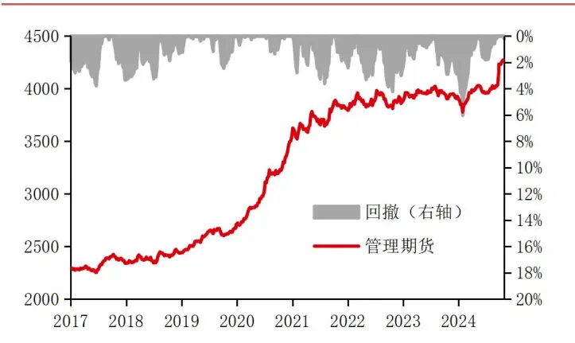
数据来源：朝阳永续, 华泰期货研究院

图 2：CTA 指数滚动夏普丨单位：点 & 无
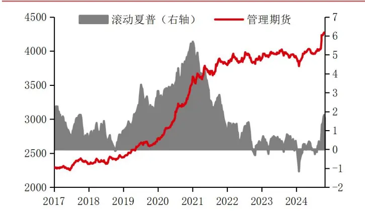
数据来源：朝阳永续, 华泰期货研究院

尤其在 6 月至 9 月中旬，商品与股票市场均出现大幅回撤，在此过程中 CTA策略由于其可多可空的特性，表现十分优异。

图 3：2024 年各类资产累计涨跌幅丨单位：%
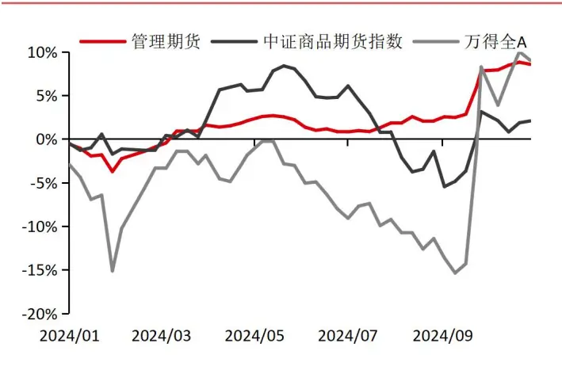
数据来源：朝阳永续, Wind, 华泰期货研究院

表 1：CTA 指数分年度表现丨单位：无

| 总收益 (%) |  | 波动率 | 最大回撤 (%) | 夏普比 | 卡玛比 例 |
| --- | --- | --- | --- | --- | --- |
| 2019 | 9.98 | (%) 3.51 | 2.46 | 例 2.84 | 4.05 |
| 2020 | 30.54 | 5.48 | 1.36 | 5.57 | 22.40 |
| 2021 | 5.02 | 6.82 | 3.61 | 0.74 | 1.39 |
| 2022 | 2.12 | 5.47 | 4.23 | 0.39 | 0.50 |
| 2023 | 0.95 | 3.60 | 2.91 | 0.26 | 0.33 |
| 2024 | 9.21 | 5.53 | 6.04 | 1.66 | 1.52 |

数据来源：朝阳永续, 天软， 华泰期货研究院
注：数据统计截止至 2024-11-01

为何 CTA 今年表现开始复苏？我们将从趋势策略、套利策略、基本面量化策略和高频策略等常见策略角度展开分析，逐一分析其策略环境，探讨表现优劣背后的原因。

## 二、趋势类型策略

## 2.1、趋势策略

作为 CTA 策略中最常见且占比最大的子策略，我们首先以趋势跟踪策略为切入点进行分析。从朝阳永续 CTA 指数观察，趋势细分策略走势跑赢整体 CTA，下半年走势强劲，区间收益率接近 10%，一扫过去两年横盘震荡的颓势。

图 4：2024 年趋势细分指数累计涨跌幅丨单位：%
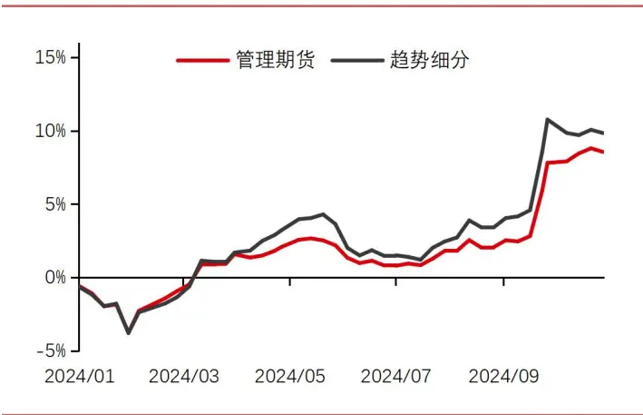
数据来源：朝阳永续, 华泰期货研究院

表 2：2024 年趋势细分指数盈亏统计丨单位：无

| 年化收益 率(%) | 年化波动 率(%) | 最大回撤 (%) | 夏普 比例 | 卡玛 | 比例 |  |
| --- | --- | --- | --- | --- | --- | --- |
| 管理 | 11.24 | 5.53 |  |  | 2.03 |  |
| 期货 |  |  |  | 3.16 |  | 4.00 |
| 指数 |  |  |  |  |  |  |
| 趋势 | 12.92 | 6.72 |  | 4.00 |  |  |
| 细分 |  |  |  | 3.14 | 1.92 |  |
| 指数 |  |  |  |  |  |  |

数据来源：朝阳永续, 华泰期货研究院

在《华泰期货量化专题报告 20230825：CTA 如何突围》中，我们详细探讨过能有效衡量趋势策略当前环境的几个关键指标，并在文末得出结论：2023年国内期货市场的趋势策略表现不佳的重要原因为 1）交易拥挤度较高 2）市场有效波动降低以及 3）策略适用性减弱。经过一年多的时间，趋势策略环境发生了显著变化，整体回暖，具体表现为以下几点：

## 2.1.1、交易拥挤度

CTA 基金于 2021 年大规模发行，但自 2023 年 5 月起，其发行数量急剧下降至日均个位数，但衍生品市场整体量能仍维持在往年同期水平，未因基金新发热情减退而萎缩，交易拥挤度得以降低，为趋势策略回暖创造了有利条件。

图 5：CTA 发行数量与指数表现丨单位：点 & 只
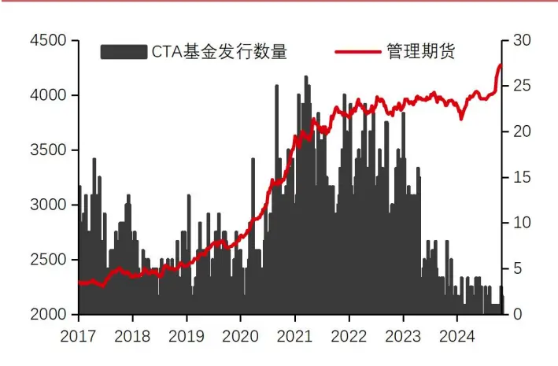
数据来源：朝阳永续，天软， 华泰期货研究院

图 6：CTA 发行数量与市场规模丨单位：百万手 & 只
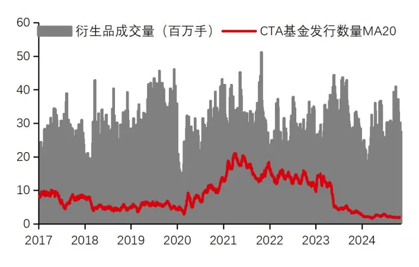
数据来源：朝阳永续，天软， 华泰期货研究院

## 2.1.2、市场有效波动

趋势类策略本质上依赖底层标的资产的有效波动，全球 CTA 知名管理人AQR 将单个资产的有效波动定义为该资产的夏普比率绝对值，并证明了底层资产的有效波动与趋势策略的夏普比率中存在明显的正相关关系。

2024 年至今，各主要商品品种的有效波动显著提升，相比 2021 年开始的三年维持在 0.6 附近，今年的平均有效波动达到了 0.93，市场有效波动的提高为 CTA 趋势策略的好转提供了动力。

表 3：重要品种的有效波动丨单位：无

|  | V | SC | AL | C | RU | FG | HC | MA | P | SR | Y | SA | AG | CF | M | TA | AU |  | RB | CU | 平均 |
| --- | --- | --- | --- | --- | --- | --- | --- | --- | --- | --- | --- | --- | --- | --- | --- | --- | --- | --- | --- | --- | --- |
| 2015 | 0.36 |  | 1.41 | 0.41 | 0.61 | 0.02 | 2.43 | 0.33 | 0.52 | 1.01 | 0.03 |  | 0.41 | 1.65 | 0.77 | 0.38 | 0.55 | 0.72 | 2.31 | 0.8 | 0.82 |
| 2016 | 1.71 |  | 1.46 | 0.36 | 1.21 | 1.36 | 1.94 | 1.54 | 1.21 | 0.76 | 0.89 |  | 0.85 | 1.38 | 1.09 | 0.64 | 1.17 | 2.13 | 1.45 | 1.1 | 1.24 |
| 2017 | 0.47 |  | 0.71 | 0.8 | 1.33 | 1.12 | 0.93 | 0.52 | 0.6 | 0.81 | 2.25 |  | 0.74 | 0.27 | 0.07 | 0.22 | 0.01 | 0.51 | 1.38 | 1.17 | 0.77 |
| 2018 | 0.01 | 0.4 | 1.23 | 0.23 | 1.91 | 0.4 | 0.24 | 0.72 | 1.87 | 2.04 | 1.21 |  | 0.77 | 0.72 | 0.42 | 0.54 | 0.14 | 0.03 | 0.41 | 1.06 | 0.75 |
| 2019 | 0.48 | 1.17 | 0.62 | 0.68 | 0.1 | 1.24 | 1.56 | 0.89 | 1.39 | 1.4 | 1.44 | 1.65 | 0.92 | 0.9 | 0.42 | 0.31 | 1.33 | 2.05 | 1.45 | 0.16 | 1.01 |
| 2020 | 0.64 | 1.93 | 1.15 | 2.92 | 0.15 | 1.48 | 1.81 | 0.11 | 0.88 | 0.14 | 1.01 | 1.55 | 0.73 | 0.03 | 1.56 | 1.5 | 0.74 | 2.35 | 1.67 | 0.88 | 1.16 |
| 2021 | 0.8 | 1.43 | 1.23 | 0.01 | 0.08 | 0.08 | 0.31 | 0.25 | 1.76 | 0.24 | 1.29 | 0.63 | 0.57 | 1.59 | 0.16 | 0.97 | 0.49 | 0.05 | 0.41 | 1.11 | 0.67 |
| 2022 | 0.8 | 0.87 | 0.15 | 0.32 | 1.2 | 0.26 | 0.09 | 0.29 | 0.39 | 0.1 | 0.49 | 1.24 | 0.49 | 1.17 | 2.12 | 0.64 | 0.78 | 1 | 0.21 | 0.07 | 0.63 |
| 2023 | 0.54 | 0.2 | 0.72 | 0.86 | 0.16 | 1.02 | 0.24 | 0.3 | 0.3 | 0.98 | 0.26 | 0.69 | 0.58 | 0.58 | 0.63 | 0.66 | 1.65 | 1.72 | 0.12 | 0.59 | 0.64 |
| 2024 | 0.7 | 0.14 | 0.55 | 1.18 | 1.05 | 1.39 | 0.87 | 0.16 | 1.91 | 0.07 | 0.77 | 0.58 | 1.29 | 1.01 | 0.99 | 1.34 | 2.18 | 0.41 | 1.1 | 0.83 | 0.93 |

数据来源：天软， 华泰期货研究院

## 2.1.3、策略适用性

同样，趋势策略有效性，即在给定的有效波动水平下，趋势策略获利的能力

（斜率）相比 2022 年也有所修复。不过截距依然较负，因此我们维持前期“趋势策略应抓大放小”的判断，趋势策略需要更加严格的控制策略信号阈值。

图 7：有效波动与趋势策略夏普丨单位：无
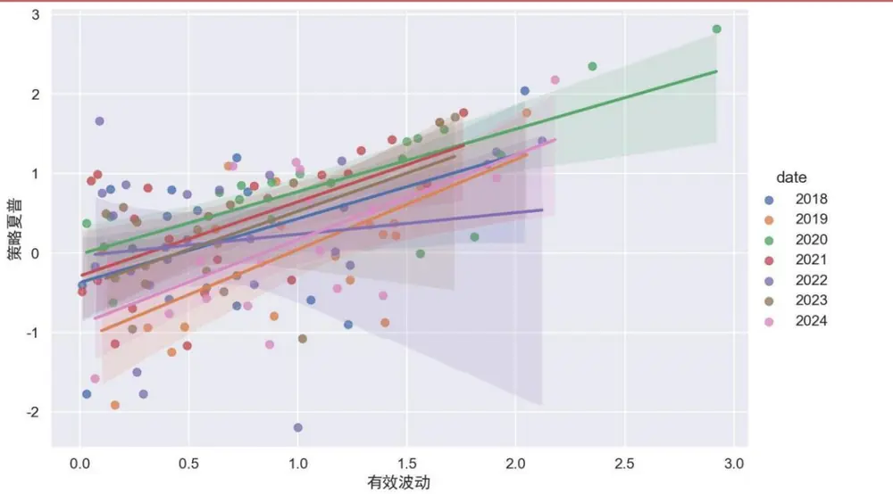
数据来源：天软，华泰期货研究院

## 2.2、反转策略

## 2.2.1、国债期货反转效应

不同于趋势策略的顺势而为，反转策略也是 CTA 策略的非常重要的组成部分。反转策略的核心思想是“反其道而行之”，即当市场价格偏离其长期均衡水平时，价格会有反向回归的趋势。在《华泰期货量化专题报告 20240517：基于时序反转因子的国债期货策略》中，我们就在国债期货上论证了其显著的反转效应，以十年期国债期货为例，我们将 T 日收益率符号与不同滞后期收益率符号进行了回归分析，结果显示，十年期国债期货上存在着显著的短期反转效应，

表 4：回归效果对比丨单位：无

| 滞后期 | 1 | 2 | 3 | 4 | 5 | 6 | 7 | 8 | 9 | 10 |
| --- | --- | --- | --- | --- | --- | --- | --- | --- | --- | --- |
| Beta | -0.049 | -0.062 | -0.036 | 0.023 | 0.012 | 0.015 | -0.03 | -0.053 | 0.017 | -0.006 |
| T值 | -2.313 (0.05) | -2.901 (0.01) | -1.669 (0.1) | 1.09 | 0.57 | 0.699 | -1.415 | -2.497 (0.05) | 0.786 | -0.29 |
| 滞后期 | 11 | 12 | 13 | 14 | 15 | 16 | 17 | 18 | 19 | 20 |
| Beta | -0.003 | 0.032 | -0.006 | -0.006 | -0.039 | 0.006 | 0.011 | 0.016 | 0.028 | 0.007 |
| T值 | -0.118 | 1.481 | -0.285 | -0.283 | -1.840 (0.1) | 0.275 | 0.537 | 0.733 | 1.316 | 0.323 |

数据来源：天软、华泰期货研究院；括号内数字代表显著性水平

而在对除三十年期国债期货之外的三个品种的回归分析里我们还发现，三个品种都呈现出了明显的短期反转效应，其中最为明显的则是滞后日为 2 的回归结果，其无论在哪个品种中都展现出显著和强烈的反转效应，即在 T-2 日下跌的品种，在 T 日更倾向于上涨；相反的，在 T-2 日上涨的品种，则在 T 日更倾向于下跌。

## 2.2.2、T-2 日时序反转策略

接下来我们以 T-2 日的涨跌方向做为我们的反转因子，使用十年期国债期货主力合约构建一个最基础的反转策略，在 T-1 日收盘前计算前一日涨跌方向作为交易信号，即 $\mathrm{sign}(\mathsf{R}_{\mathrm{T}-2})$ ，然后在 T-1 日收盘时以收盘价进行如下操作

$$
开仓=\left\{\begin{aligned}&全仓做多,sign(R_{T-2})\leq0,\\&全仓做空,sign(R_{T-2})>0.\end{aligned}\right.
$$

在 T 日收盘前重复以上操作，若信号相同，则继续持仓；若信号相反，则反手做多或做空。

图 8：基于反转因子的交易策略净值表现丨单位：无
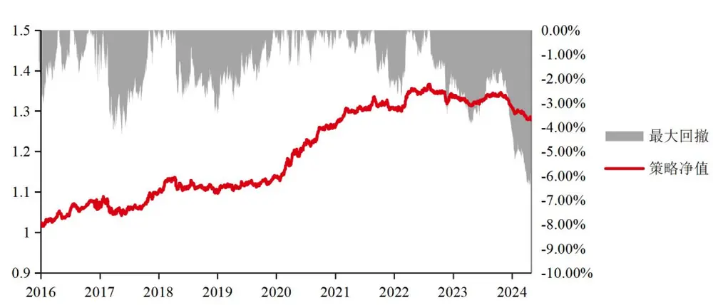
数据来源：天软, 华泰期货研究院

表 5：基于 T-2 日反转因子的交易策略表现与对比

| 持有主力多头 | 基于T-2日反转因子的 交易策略 |
| --- | --- |
| 年化收益率 2.45% | 3.08% |
| 夏普比率 0.6707 | 0.8450 |
| 最大回撤 | -7.39% -6.48% |
| 回测时间 | 2015/10/21—2024/04/30 |

数据来源：天软、华泰期货研究院

## 2.2.3、基于市场波动改进的时序反转因子策略

但实际上，反转效应并不是在所有市场状态下都是显著的，在市场状态较为平稳的时候，行情的反转并不明显，接下来，我们结合市场的波动状态，对我们的 T-2 日反转策略进行改进，将原本的每次全仓交易，改为根据市场波动情况与长、短周期因子动态调整仓位。长周期因子我们简单选用 120 天移动平均线（MA120）的涨跌方向作为我们的长期动量因子，短周期因子则仍是上文用到的基于 T-2 日涨跌方向的短期反转因子。

我们使用一个 20 天的时间窗口滚动计算每日波动率，发现市场波动率大多数集中在 0 到 0.5%之间，因此我们可以在滚动 20 日波动率低于 0.5%时，将此时定义为市场平稳状态，而将滚动 20 日波动率高于 0.5%时，定义为市场动荡状态，并由此对策略从仓位角度进行改进。

策略思路：在 T-1 日收盘前计算前一日涨跌方向作为短周期信号，即$\mathrm{sign}(\mathsf{R}_{\mathrm{T}-2})$ ，然后计算收盘前 120 天移动平均线的涨跌方向，即 $\mathrm{lsign}(\mathbb{R}_{\mathrm{T}-1}^{\mathrm{MA120}})$ 最后则是计算过去 20 个交易日的波动率 $\mathbf{vol}_{\mathrm{T-1}}^{20}$ ，在 T-1 日收盘时以收盘价进行如下操作

$$
\begin{aligned}&开仓仓位=\left\{\begin{aligned}\\&0.5\times sign(\mathbb{R}_{\mathbb{T}-2})+0.5\times sign(\mathbb{R}_{\mathbb{T}-1}^{MA120}),&vol_{\mathbb{T}-1}^{20}\leq0.5\%\\&sign(\mathbb{R}_{\mathbb{T}-2}),&vol_{\mathbb{T}-1}^{20}>0.5\%\\&\end{aligned}\right.\\\end{aligned}
$$

其中开仓仓位若为负，则代表做空对应的仓位水平。在 T 日收盘前重复以上操作，若信号给出的仓位相同，则继续持仓；若信号出现变换，则调整至最新信号对应的仓位。

图 9：改进前后的策略净值表现对比丨单位：无
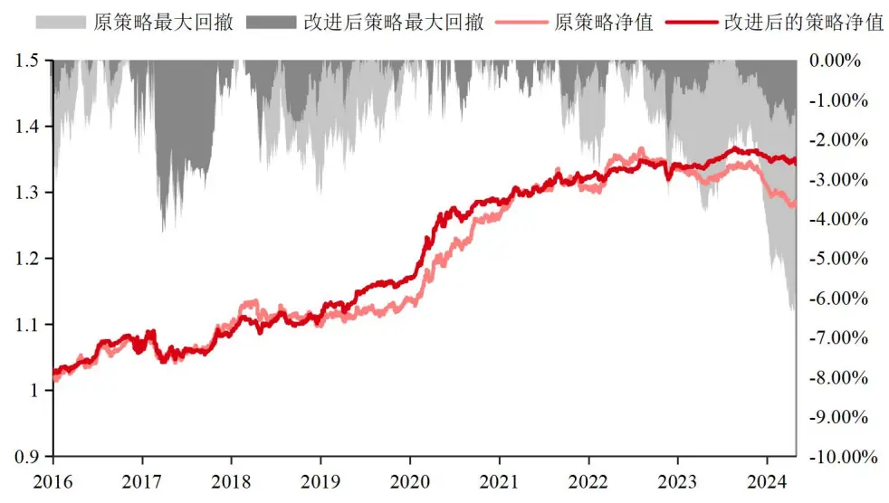
数据来源：天软, 华泰期货研究院

表 6：对基于 T-2 日反转因子的交易策略改进后的表现与对比

|  | 持有主力多头 | 基于T-2日反转因 基于市场波动改进后 子的交易策略 的交易策略 3.08% |
| --- | --- | --- |
| 年化收益率 | 2.45% | 3.65% |
| 夏普比率 | 0.6707 | 0.8450 1.2445 |
| 最大回撤 | -7.39% | -6.48% -4.35% |
| 平均日仓位 | 100% | 54.94% |
| 回测时间 | 2015/10/21—2024/04/30 |  |

数据来源：天软、华泰期货研究院

## 三、套利类型策略

## 3.1、跨期策略

跨期策略在2024年的表现则相对复杂。以期限结构因子为代表的跨期策略，其交易逻辑是通过判断商品的升贴水状态，远月贴水越深的品种，其展期收益率就越大。因此跨期策略的有效性依赖于商品期限结构的正常状态。

图 10：展期收益示意图丨单位：无
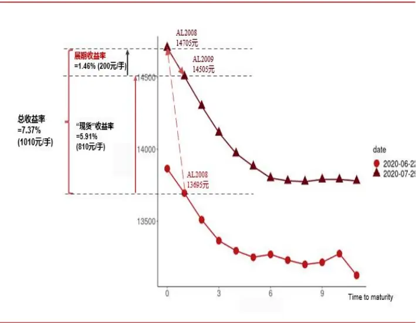
数据来源：华泰期货研究院

图 11：期限结构指数及分版块累计涨跌幅丨单位：%
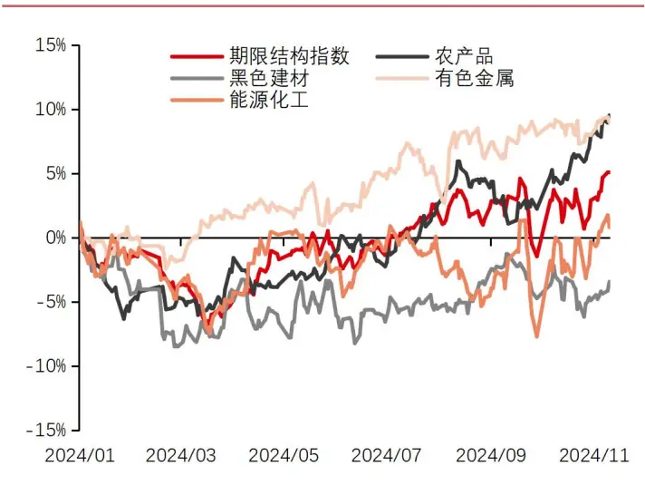
数据来源：天软，华泰期货研究院

从结果来看，期限结构相关策略在 2024 年上半年表现不佳，下半年有部分修复，其中黑色板块全年都处于水下状态。我们认为反常的期限结构是造成跨期策略表现不佳的主要原因。

## 3.1.1、期限结构的季节性

以黑色板块的焦煤为例，观察其期限结构的季节性（取近月合约 / 主力合约-1 的月度均值），可以看出焦煤在 2019-2023 年的绝大部分时间均处于主力（远月）贴水状态；但 2024 年以来逐步转变成主力（远月）升水状态，期限结构的季节性出现反常。

图 12：焦煤的期限结构丨单位：%
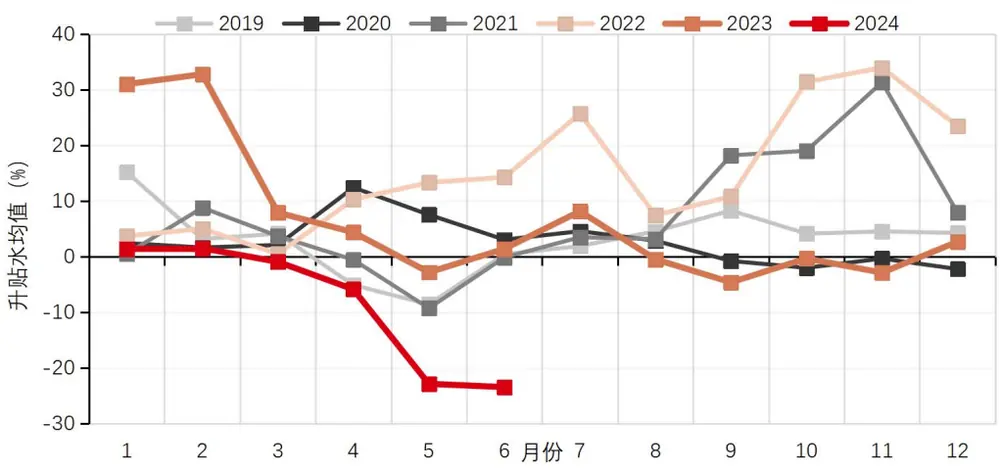
数据来源：天软，华泰期货研究院

再截取连续三个月的焦煤各月份合约价格，并于 2022 年同时期的作对比，观察其升贴水状态，可以看出同月份的合约，2022 年焦煤处于远月贴水，而到了 2024 年则转变成了远月升水，同样印证 2024 年以来的反常状态，正是这种季节性的反常导致跨期策略有效性降低。

图 13：升贴水对比-2024 年 vs 2022 年丨单位：元/吨
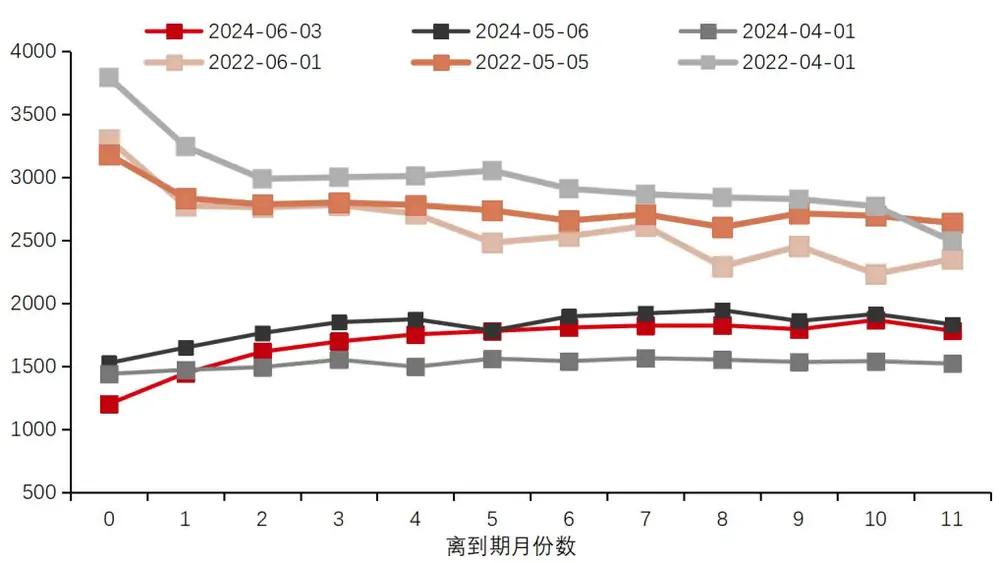
数据来源：天软，华泰期货研究院

## 3.2、跨品种（跨境）策略

相反，跨品种类型交易策略中，特别是跨境交易，存在很多交易机会。接下来我们以橡胶为例，从实证研究一步步落实到具体的跨境交易策略。

## 3.2.1、背景介绍

在综合考量交易权限、市场活跃程度以及潜在套利空间后，我们选择日本东京商品交易所（隶属 JPX 集团，下文统一以 JPX 标识）的天然橡胶和上海国际能源交易中心（下文统一以 INE 标识）的 20 号胶期货合约做配对，挖掘跨市场的统计套利机会。

## 3.2.2、数据处理

交易标的合约选择：我们选择“主力合约”作为代表。由于 JPX 与 INE 橡胶合约的最后交易日以及流动性分布情况并不完全一致（后文将详细介绍），很难使用同一期限的JPX与INE合约做对比，为了贴近真实交易，我们构建了JPX与 INE 的主力合约价格序列。尽管同一时刻 JPX 与 INE 的主力合约到期期限并不保证相同，但我们认为作为流动性最好、交投氛围最活跃的主力合约，都充分反映了全球橡胶相关的各类型信息。因此，基于两者的主力合约进行统计测算以及构建策略是可行的。

交易时刻统一：我们选取北京时间 14:15 的期货合约价格。由于 JPX 与 INE橡胶合约的交易时间段并不完全一致。JPX 的交易时间为 09::00～15:15，16:30～19:00（东京时间），INE 的交易时间为 09:00-10:15、10:30-11:30和 13:30-15:00，21:00-23:00（北京时间）。考虑到两者间存在一小时的时差，同时 JPX 成交量主要分布在每日的下午收盘时刻。因此我们使用 JPX 橡胶15:15（东京时间）时刻收盘价，与 INE 橡胶 14:15（北京时间）时刻收盘价进行后续分析，以保证使用的数据在现实层面是时刻一致的。

交易日统一：我们使用两者交易日的交集。由于日本与中国节假日存在错位，考虑到长假内橡胶价格可能产生剧烈波动，我们使用了两者的交集时段，避免出现一方开市，另一方休市的情况。

计价方式统一：我们使用 CNYJPY.FX 对原始价格做处理。JPX 橡胶期货以日元计价，INE 橡胶以人民币计价，两者之间存在汇率上的差异。长期来看，两者价格将不可避免的受到汇率变化的影响。我们使用 CNYJPY.FX 对价格做了统一处理。

经过一系列数据处理后，我们得到了 2019-08 至 2024-06（NR 上市至今的交易日交集）同一时刻的 JPX 与 INE 复权后的收盘价价格序列，收益率则可用收盘价的对数之差表示： $r_{t}=\ln P_{t}-\ln P_{t-}$ −1

## 3.2.3、实证研究

统计套利的原理在于挖掘两种商品之间的价差关系，若当前价差关系对比历史均值偏差较大时，产生套利机会。逻辑并不复杂，能盈利的关键在于：

（1） 价格序列高度相关，即使在市场动荡时期仍能保持同步性；

（2） 同涨同跌，相关关系保持长期稳定；

（3） 满足长期协整关系，才能保证价差终将均值回归

接下来的部分我们将用统计检验的方式逐一剖析二者之间的关系。

## 3.2.4、线性相关性

经过复权处理后的 JPX 橡胶与 INE 橡胶收盘价整体趋势一致，具有很高的相关性。经测算，从品种上市至今，经过汇率换算处理后的二者主力合约日度收益率的相关系数达到 0.715。

图 14：JPX & INE 价格丨单位：日元/kg & 日元/吨
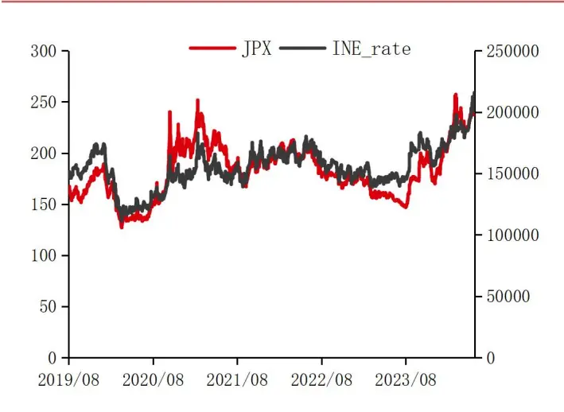
数据来源：天软， 华泰期货研究院

图 15：JPX & INE 收益率丨单位：%
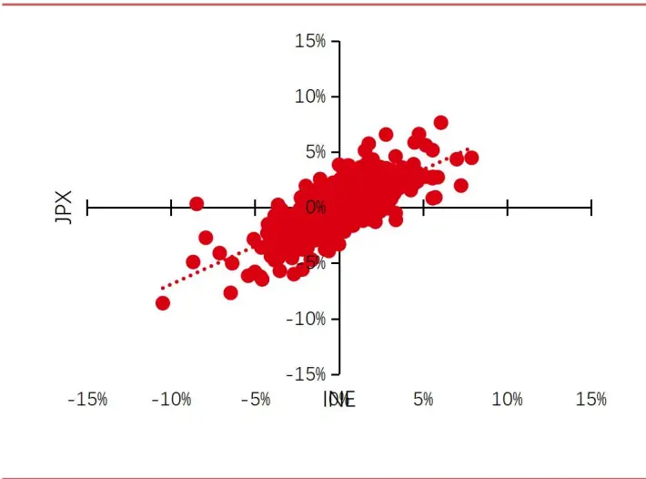
数据来源：天软， 华泰期货研究院

## 3.2.5、交叉相关性

我们从定性和定量的双重角度验证了 JPX 橡胶和 INE 橡胶收益率之间存在显著的交叉相关性，且二者关系具有长期稳定性；表明两个市场在某种程度上是整合的，即它们受到相似的宏观经济因素、行业趋势或全球事件的影响，一个市场上的价格变动可以为另一个市场的价格变动提供有效信息。

图 16：定性判断交叉相关性 | 单位：无
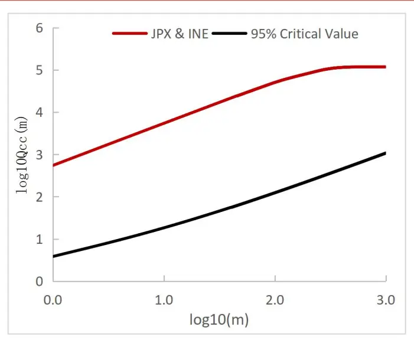
数据来源：天软， 华泰期货研究院

图 17：定量判断交叉相关性 | 单位：无
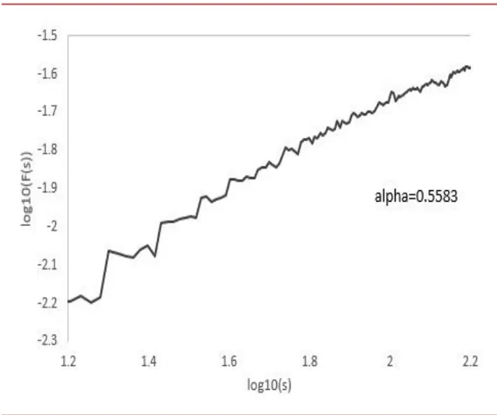
数据来源：天软， 华泰期货研究院

## 3.2.6、超额相关性

接下来，我们参考 Ruan (2016) 提出的衡量超额相关性(Exceedancecorrelation) 的统计方法，计算 JPX 橡胶与 INE 橡胶在上涨或下跌的不同市场行情下的相关性程度，来验证二者是否同涨同跌。

根据 JPX 橡胶与 INE 橡胶收益率系列本身的分布特征，我们将阈值 c 设定为[0, 0.3, 0.6, 0.9, 1.2, 1.5, 1.8, 2.0]来计算二者的超额相关性，从下表可看出，对于给定的阈值 c，JPX 橡胶与 INE 橡胶同时下跌时的相关系数�− � 高于二者同时上升时的相关系数�+ � ，也就是说当市场下跌时，二者联动效应更强。

表 7：超额相关性丨单位：无

| 阈值c | 超额相关性ô(c) 样本量 |
| --- | --- |
| -2.0 | 0.4975 16 |
| -1.8 | 0.5721 21 |
| -1.5 0.5405 | 36 |
| -1.2 | 0.5540 61 |
| -0.9 | 0.5745 89 |
| -0.6 | 0.6312 147 |
| -0.3 | 0.6381 247 |
| -0 | 0.6612 385 |
| +0 0.5485 | 417 |
| 0.3 | 0.4827 247 |
| 0.6 0.4802 | 148 |
| 0.9 | 0.3350 74 |
| 1.2 | 0.3382 38 |
| 1.5 | 0.1327 28 |
| 1.8 | -0.1374 12 |
| 2.0 | -0.3465 9 |

数据来源：天软， 华泰期货研究院

## 3.2.7、长期均衡模型

为了能精确找到价差偏离点，我们着眼去挖掘二者之间的协整关系式，由此可以通过一方的价格来推算出另一方的合理价格范围，从而判断当前的价差是否偏离均衡水平。

建立 OLS 模型来拟合协整关系式；

$$
\ln P_{t}^{JPX}=\;\alpha+\beta_{1}\ln P_{t}^{INE}+\;\beta_{2}\ln P_{t}^{Rate}+\;\varepsilon_{t}
$$

加入各自的流动性指标，再次回归；

$$
\ln P_{t}^{JPX}=\;\alpha+\beta_{1}\ln P_{t}^{INE}+\;\beta_{2}\ln P_{t}^{Rate}+\;\gamma_{1}L_{t}^{INE}+\;\gamma_{2}L_{t}^{Rate}+\;\varepsilon_{t}
$$

表 8：回归效果对比丨单位：无

| 无流动性指标回归方程 |  | 有流动性指标回归方程 |
| --- | --- | --- |
| $R^{2}$ | 0.687 | 0.712 |
| 残差平稳性检测 $DF$ | -2.42 | -2.98*** |
|  | (0.14) | (0.04) |

数据来源：天软， 华泰期货研究院
括号内数字代表 P 值，星号代表显著性水平，*, **, ***分别代表 10%，5%，1%的显著性水平。

对两次回归后的残差分别进行平稳性检验，从表中可以看出在控制各自的流动性后，回归方程的残差从不平稳变成平稳状态，所以我们将流动性指标纳入JPX 橡胶与 INE 橡胶的协整关系式中，从而拟合出二者的长期均衡模型：

$$
\ln P_{t}^{IPX}=-8.892+1.273\ln P_{t}^{INE}+0.887\ln P_{t}^{Rate}-0.002L_{t}^{INE}+0.017L_{t}^{Rate}+\varepsilon_{t}
$$

图 18：协整关系拟合图 | 单位：无
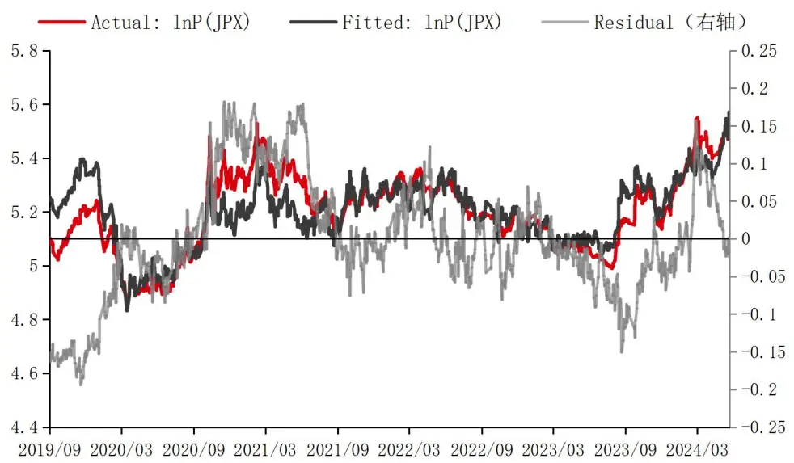
数据来源：天软， 华泰期货研究院

## 3.2.8、跨境套利策略表现

基于上述协整关系式，我们便可以推算出 JPX 与 INE 之间价差的合理范围，并及时捕捉到价差偏离较大时产生的套利机会。

基本逻辑：当拟合模型的残差偏离其均值的程度超过一定阈值时，产生套利信号；若残差过高，则意味着 JPX 被高估，则多 INE 空 JPX；反之则多 JPX空 INE。

参数设定：为了更精准地定义“超过一定阈值”，我们提出两个关键参数来量化残差的偏离程度：

（1）观察窗口（X）：回看 X 天的 JPX 与 INE 回归模型残差

（2）阈值设定（K）：滚动标准差的倍数

在确定了参数组合之后，开仓信号的触发规则便随之确定。开仓信号触发的条件越“宽松”，意味着策略能尽可能捕捉到更多的套利机会，但交易次数越多的同时势必会带来更高的摩擦成本；但信号触发的条件越“严苛”，又不可避免会错过一些机会。如何权衡好机遇与成本就成了一个难题。后续我们将通过参数遍历的办法，来找寻一个最佳平衡点。

## 交易设定：

信号生成时间：JPX 交易所收盘后（北京时间 14:15）根据最新收盘价计算当日的模型残差，若残差偏离合理范围，则生成开仓信号；

开平仓时间：产生信号的下一交易日 T+1 开仓，再下一交易日 T+2 平仓；

持仓周期：固定 1 天；

交易价格：统一使用收盘价计算，滑点手续费设定为 0.01%；

回测周期：2019-09 至 2024-10，复利计算策略净值。

最优参数组合下的开仓规则如下：

当��– 滚动 70 日均值 > 1.5 * 滚动 X 日标准差 ->

若 INE 对比上一交易日上涨 -> 多 15 手 INE 空 11 手 JPX；

若 INE 对比上一交易日下跌 -> 多 12 手 INE 空 10 手 JPX。

当��– 滚动 70 日均值 < -1.5 * 滚动 X 日标准差 ->

若 INE 对比上一交易日上涨 -> 多 11 手 JPX 空 15 手 INE；

若 INE 对比上一交易日下跌 -> 多 10 手 JPX 空 12 手 INE。

图 19：最优参数下动态切换配比策略净值和最大回撤丨单位：无
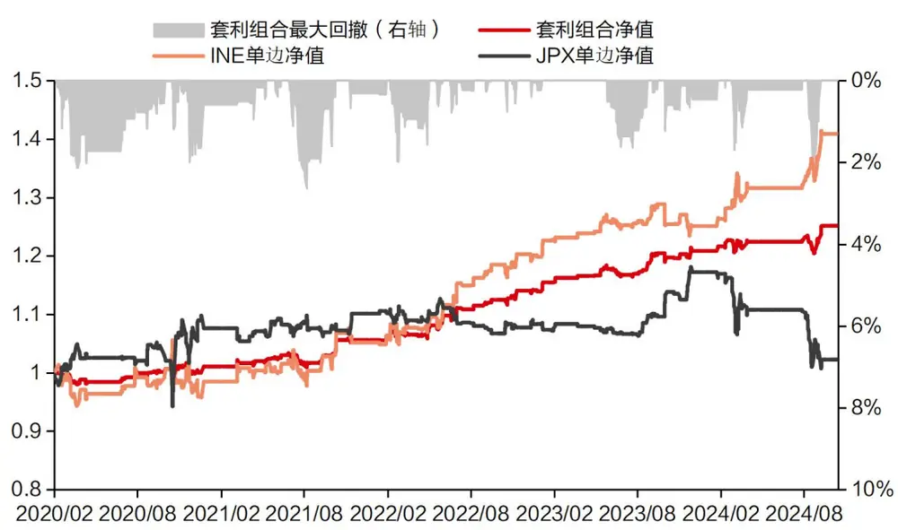
数据来源：天软， 华泰期货研究院

表 9：动态切换配比套利策略盈亏分析丨单位：无

|  | 年化收益率 | 年化波动率 | 最大回撤 | 最大回撤持续天数 | 夏普值 | 卡玛值 |
| --- | --- | --- | --- | --- | --- | --- |
| 忽略交易成本 | 6.26 | 4.00 | 2.48 | 18 | 1.57 | 2.53 |
| 考虑交易成本 | 5.38 | 3.99 | 2.65 | 18 | 1.35 | 2.03 |

数据来源：天软， 华泰期货研究院

表 10：动态切换配比套利策略持仓分析丨单位：无

|  | 交易次数 | 持仓占比 | 方向准确率 | 盈亏比 | 保证金占用均值 | 保证金占用峰值 |
| --- | --- | --- | --- | --- | --- | --- |
| 套利策略 | 373 | 34.4% | 54.4% | 1.51 | 16.7% | 78.4% |

数据来源：天软， 华泰期货研究院

跨境策略在整个回测期间，三分之一的天数触发了开仓信号，盈亏比达到1.51，且最大回撤控制在 2.5%左右，扣除所有交易成本后的夏普比例为 1.35，属于稳健型策略。

相比传统的跨期策略，以及部分已经广为人知的跨品种策略，我们认为跨境策略方兴未艾，仍大有可为。

## 四、基本面量化类型策略

基本面量化策略同样是 CTA 的重要一员。华泰商品多因子体系在原有的量价因子体系上，逐步补充了库存因子、基差因子等基本面量化因子。依照基本面因子构建的量化策略中，今年以来库存策略表现平稳，而基差策略则受到升贴水结构异常的影响，收益有所下降。

表 11：因子库丨单位：无
因子系列名称
超额收益率来源

| 量价因子 | Curve因子 | 远月合约相对近月合约价格不确定性更强所带来的风险溢价 |  |  |  |
| --- | --- | --- | --- | --- | --- |
|  | 期限结构因子 | 展期收益大品种所带来的风险溢价 |  |  |  |
|  |  |  | 动量因子 | 前期价格表现较强品种带来的额外收益 |  |
|  |  |  | 波动率因子 | 交易波动率大的品种所带来的风险溢价 |  |
|  | 价值因子 | 远月贴水品种供需紧张所带来的风险溢价 |  |  |  |
|  | 持仓因子 | 大量资金流入所带来的风险溢价 |  |  |  |
|  |  |  | 偏度因子 | 收益率偏度较小带来的风险溢价 |  |
|  |  |  |  | 流动性因子 | 交易不活跃带来的风险溢价 |
|  | 均价突破因子 | 均线向上突破的风险溢价 |  |  |  |
|  | 宏观Beta因子 | 对通货膨胀敏感，对美元指数敏感带来的风险溢价 |  |  |  |
|  | 库存因子 | 去库速度较快品种带来的额外收益 |  |  |  |
|  |  |  | 利润因子 | 产业链利润带来的风险溢价 |  |
| 基本面因子 |  | 仓单因子 |  |  |  |
|  | 基差因子 | 期现价差带来的额外收益 |  |  |  |
|  | 供需因子 | 供需强弱带来的风险溢价 |  |  |  |

数据来源：华泰期货研究院

## 4.1、库存策略

在《华泰期货量化专题报告 20230823：基于库存因子的基本面量化策略》中，我们从截面和时序两个维度分别构建了库存因子。其中截面库存因子侧重于对比多品种间库存变化率的大小关系，时序库存因子侧重于对比单品种当前库存水平与历史库存水平的大小关系，然后基于当前库存水平的高低来判断多空方向。

图 20：库存因子构建方法丨单位：无

## 截面

## 逻辑：

假定所有商品处于同一个（相近的）库存周期下，库存的环比变化率可以衡量品种之间的供求强弱关系；同时横截面的库存变化率排序可以有效排除季节性影响。

因子值:取周频的环比变化率的截面排名

$$
Factor=Rank\left(\frac{Stock_{t}}{Stock_{(t-1)}}-1\right)
$$

关系:
排名越低说明该品种去库速度快
预测价格会上升

## 时序

## 逻辑：

探讨时间序列上库存水平的变化对于期货价格的影响。选取两个一长一短的时间周期，通过对比短周期（近期）的平均库存水平所处长周期（远期）的库存水平分布的分位数，来判断近期库存水平较高还是较低

短周期的平均值位于长周期分布的历史分位数

Factor = Short Window Mean.percentileof (Long Window Distribution)

关系:
历史分位数越低，说明该品种近期库存水平对比之前而言较低，预测价格会上升

数据来源：华泰期货研究院

在原生的截面策略和时序策略基础上，我们还衍生出了并集策略和交集策略，两者都是同时考虑截面库存因子和时序库存因子给的信号，二者区别顾名思义，只有截面和时序因子同时看多或者看空，交集策略才会开相应的仓位；只有截面和时序因子的观点不相违背，并集策略就会根据一方信号去开相应的仓位。

从策略表现来看，库存策略净值走势平稳且稳健，2024 年的夏普略高于过去两年，整体收益情况自 2022 年略有下降，但仍能创出新高。

图 21：库存策略净值表现丨单位：无
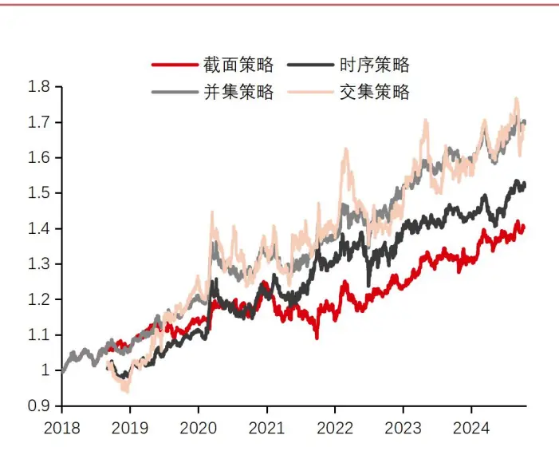
数据来源：天软， SMM，同花顺，华泰期货研究院

表 12：库存并集策略分年度表现丨单位：无

|  | 年化收 益(%) | 年化波 动（%） | 最大回 撤（%） | 夏普 比例 | 卡玛 比例 |
| --- | --- | --- | --- | --- | --- |
| 2018 | 5.61 | 5.57 | 4.25 | 1.01 | 1.32 |
| 2019 | 14.06 | 4.76 | 3.35 | 2.96 | 4.20 |
| 2020 | 12.03 | 8.70 | 8.07 | 1.38 | 1.49 |
| 2021 | 2.67 | 9.03 | 7.40 | 0.30 | 0.36 |
| 2022 | 9.07 | 9.58 | 8.36 | 0.95 | 1.08 |
| 2023 | 6.15 | 6.18 | 3.43 | 1.00 | 1.79 |
| 2024 至11 | 7.02 | 6.16 | 5.93 | 1.14 | 1.18 |

数据来源：天软， SMM，同花顺，华泰期货研究院

## 4.2、基差策略

基差=现货价格–期货价格，也可以理解为现实与预期的差值。现货价格主要由产业链各环节的参与者共同博弈形成，核心驱动是当期供需，主要在于对现货产能、产量、库存和销售等供需数据的分析。期货市场特有的实物交割机制，导致预期不会脱离现实出现长时间背离的现象，因为基差绝对值一旦超过现货综合持有成本，则会触发交割机制，市场会涌现大量套利交易商，通过远期卖出期货的方式，进行无风险套利，从而促使基差回归。因此，期货市场的交割机制赋予了基差均值回归的特性。

基于基差均值回归的底层逻辑，我们可以通过时间序列上基差本身大小及基差变动趋势方向来判断期货的升贴水情况，并由此来判断当前的期货价格相对于现货价格是否偏离较大，从而生成多空信号。

因子公式：

$$
\begin{aligned}BasisRate&=\left(\frac{Spot_{t}}{Future_{t}}-1\right)*\frac{365}{Days_{t}}\\BasisRateDiff&=BasisRate_{t}-BasisRate_{t-1}\end{aligned}
$$

其中 $Days_{t}$ 为当前期货主力合约离到期日的天数。

多空信号规则：

当某品种年化基差率为正且年化基差率朝正向扩大时，做多；

当某品种年化基差率为负且年化基差率朝负向扩大时，做空；

均为每天收盘后给信号，次日开始交易，统一使用收盘价交易。

图 22：基差策略净值表现与回撤丨单位：无 & %
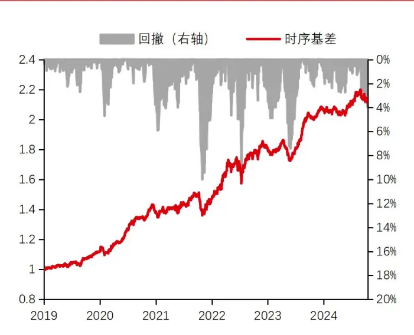
数据来源：天软，华泰期货研究院

表 13：基差策略分年度表现丨单位：无

|  | 年化收 益(%) | 年化波 动（%） | 最大回 撤（%） | 夏普 比例 | 卡玛 比例 |
| --- | --- | --- | --- | --- | --- |
| 2019 | 10.79 | 5.80 | 2.96 | 1.86 | 3.64 |
| 2020 | 23.06 | 7.88 | 4.69 | 2.93 | 4.91 |
| 2021 | 6.03 | 9.70 | 10.00 | 0.62 | 0.60 |
| 2022 | 23.36 | 12.12 | 9.88 | 1.93 | 2.36 |
| 2023 | 14.32 | 6.40 | 7.41 | 2.24 | 1.93 |
| 2024至 11月 | 2.30 | 6.88 | 3.96 | 0.33 | 0.58 |

数据来源：天软，华泰期货研究院

基差策略 2024 年收益同样相比 2022 年和 2023 年有所下降，并且由于前两年基差策略的优异表现，基差策略今年表现更显得差强人意。今年以来，基差策略夏普仅有 0.33，相比 2023 年的 2.24 大幅下降，我们认为基差策略与期限结构策略的表现不佳是一脉相承的，均折射出升贴水结构异常导致的商品整体定价逻辑的转变。

## 五、高频类型策略

在金融市场的高频交易领域，收益率的可预测性一直是学术界和实务界关注的焦点。高频收益率在不同市场环境下的可预测性对于交易策略的制定和执行具有深远的影响。在过去的一年里，我们基于先前在各类高频项目中的积累，同时参考了学术文献及国内外研报，构建了高频多因子收益率预测模型，实证结果表明该模型具备较强的预测能力。为突出重点，本章节将首先介绍我们构建的高频多因子收益率预测模型在商品期货交易中的下单应用实例，以及其在股指期货日内交易策略中的具体应用。最后，我们将详细阐述高频多因子模型的具体构建流程。

## 5.1、下单策略

在本小节中，我们专注于高频多因子模型在下单层面的实际应用。在《华泰期货量化专题报告 20240119：交易所最新交返规则对市场及高频策略的影响》中，我们提到了 2024 年初以来，随着市场环境的变化，不管是从盘口价差还是从高频策略滑点的角度上看，部分品种的流动性在交返新规实施后都出现了下降的迹象，交易成本在未来可能会进一步上升。因此，我们试图将高频多因子模型应用于下单策略，观察能否较传统下单算法降低交易成本。

## 5.1.1、传统下单算法

传统的下单算法交易策略有两种，分别是 VWAP 和 TWAP，以下是这两种下单算法的简单介绍：

## TWAP

TWAP（Time Weighted Average Price，时间加权平均价格）是一种算法下单策略，它通过将交易订单在一段时间内均匀分配来执行，目的是减少下单行为对市场的影响并降低交易成本。

## VWAP

VWAP（Volume Weighted Average Price，成交量加权平均价格）则是另一种算法交易策略，它通过将大额委托单根据前几天的成交分布情况进行拆分，在约定的时间段内分批执行，使得最终买入或卖出的成交均价尽量接近该段时间内整个市场的成交均价。

## 5.1.2、模拟测试

## 模拟背景

现在，我们假设有一投资者需要在短时间内下 200 手买单。针对这一需求，我们通过回测的方式对比不同算法下的下单成本。

## 下单方式

我们采取对价下单（即买单下在卖一价）的方式，并默认对价可成交。之所以没有采用下排队价（即买单下在买一价）的原因是，排队下单需要模拟次序并估计成交概率，模拟结果与实盘存在一定差异。此外，我们希望体现的是我们的算法和传统算法之间的横向比较，具体下单方式只需保持一致即可，因此综合考虑后采取对价下单的方式。

## 参数设定

测试的参数有两个，分别是下单的总时间，以及拆单的次数。我们测算了下单总时间在 1 分钟、5 分钟、10 分钟，以及拆单次数在 10 次、20 次、30 次下的下单成本。

## 下单算法

TWAP：时间间隔固定，将交易订单在一段时间内均匀分配。

VWAP：时间间隔固定，但根据前 5天同时段的成交量，加权分配单次的下单量

ModelPrice：基于高频因子模型的下单算法，首先均匀拆分订单量及时间段，在每个时间段中，当模型预测未来 5秒收益率大于 0 时才下单，否则等待，如果在时间段结束时仍未触发开仓条件则强制开仓。

## 评估指标

我们使用两个指标来综合评估各下单算法的性能。第一个指标是价格最优概率，它反映了在大量历史模拟交易中，算法获得三者之中最优价格的频率。第二个指标是平均滑点，它衡量了所有模拟交易中下单价格与最新成交价（Last）之间的差距（跳数），数值为 1 代表平均滑点为 1 跳。

## 模拟结果

从最优概率上看，基于高频因子的下单算法在样本外的模拟中有大约 75%的概率是三者中最优的算法。注意到，在各组参数下，三者最优概率的和加起来经常大于 100%，这是因为有相当一部分样本的 TWAP 等于 ModelPrice。出现这种情况的原因是，最优报价的更新相对没有那么频繁，当模型的预测值由负转正时，最优报价仍有一定的概率保持不变，使得 TWAP 的计算结果与

ModelPrice 保持一致。

从平均滑点上看，基于高频因子的下单算法的平均滑点显著优于 TWAP 算法和 VWAP 算法，平均约有 0.15 跳的优化。

表 14: 各下单算法最优概率（LASSO、RB） | 单位：%

| 时间 | 拆单次数 | TWAP | VWAP | ModelPrice |
| --- | --- | --- | --- | --- |
| 1 | 10 | 23.54% | 30.50% | 76.23% |
| 1 | 20 | 19.08% | 32.87% | 72.50% |
| 1 | 30 | 18.77% | 36.99% | 67.95% |
| 5 | 10 | 12.32% | 24.70% | 74.29% |
| 5 | 20 | 5.14% | 24.38% | 75.30% |
| 5 | 30 | 4.44% | 24.70% | 74.86% |
| 10 | 10 | 12.83% | 24.65% | 74.08% |
| 10 | 20 | 3.81% | 23.89% | 75.48% |
| 10 | 30 | 2.16% | 24.40% | 75.22% |

数据来源：天软，华泰期货研究院

表 15: 各下单算法平均滑点（LASSO、RB） | 单位：跳

| 时间 | 拆单次数 | TWAP | VWAP | ModelPrice |
| --- | --- | --- | --- | --- |
| 1 | 10 | 0.503 | 0.503 | 0.401 |
| 1 | 20 | 0.504 | 0.506 | 0.438 |
| 1 | 30 | 0.503 | 0.504 | 0.458 |
| 5 | 10 | 0.472 | 0.469 | 0.311 |
| 5 | 20 | 0.471 | 0.477 | 0.330 |
| 5 | 30 | 0.470 | 0.471 | 0.335 |
| 10 | 10 | 0.313 | 0.353 | 0.143 |
| 10 | 20 | 0.311 | 0.347 | 0.151 |
| 10 | 30 | 0.306 | 0.342 | 0.151 |

数据来源：天软，华泰期货研究院

表 16: 各下单算法最优概率（LGBM、FU） | 单位：%

| 时间 | 拆单次数 | TWAP | VWAP | ModelPrice |
| --- | --- | --- | --- | --- |
| 1 | 10 | 24.35% | 30.82% | 75.01% |
| 1 | 20 | 20.29% | 33.37% | 70.82% |
| 1 | 30 | 18.44% | 36.53% | 67.08% |
| 5 | 10 | 13.14% | 22.60% | 76.19% |
| 5 | 20 | 6.29% | 22.79% | 75.87% |
| 5 | 30 | 4.89% | 22.54% | 76.76% |
| 10 | 10 | 12.07% | 24.27% | 74.21% |
| 10 | 20 | 4.70% | 23.25% | 75.60% |
| 10 | 30 | 3.68% | 22.74% | 76.62% |

数据来源：天软，华泰期货研究院

表 17: 各下单算法平均滑点（LGBM、FU） | 单位：跳

| 时间 | 拆单次数 | TWAP | VWAP | ModelPrice |
| --- | --- | --- | --- | --- |
| 1 | 10 | 0.502 | 0.483 | 0.403 |
| 1 | 20 | 0.502 | 0.486 | 0.437 |
| 1 | 30 | 0.502 | 0.486 | 0.455 |
| 5 | 10 | 0.531 | 0.530 | 0.379 |
| 5 | 20 | 0.538 | 0.552 | 0.405 |
| 5 | 30 | 0.533 | 0.534 | 0.402 |
| 10 | 10 | 0.678 | 0.759 | 0.523 |
| 10 | 20 | 0.660 | 0.713 | 0.509 |
| 10 | 30 | 0.665 | 0.740 | 0.514 |

数据来源：天软，华泰期货研究院

## 5.2、股指日内策略

我们将高频因子收益率预测模型应用在商品期货以及股指期货上，回测发现在超高频上股指期货的预测效果不如商品。

图 23: 多因子模型样本外 R 方 | 单位：%
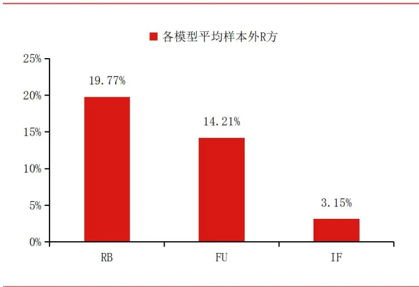
数据来源：天软，华泰期货研究院

图 24: 多因子模型样本外方向准确性丨单位：%
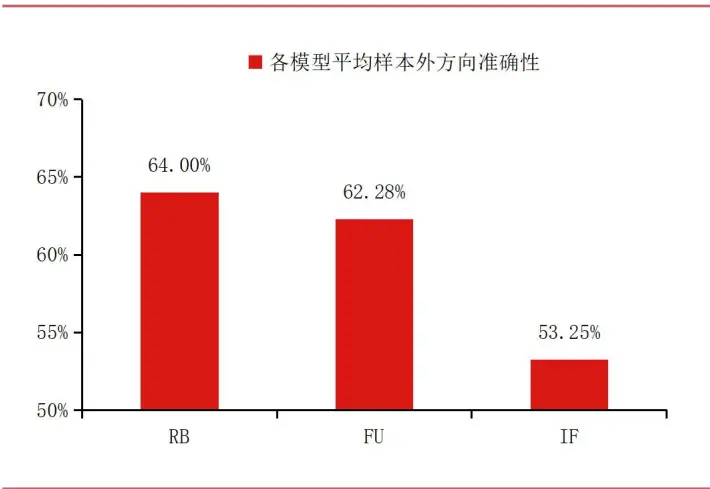
数据来源：天软，华泰期货研究院

经过观察发现，股指期货的盘口买卖价差大于商品，挂单量显著少于商品。与商品窄且厚的盘口相比，股指期货盘口展示出了宽且薄的特征。盘口薄可能导致因子值变动过于频繁，使得因子有效性减弱，股指期货的日内手续费加收也会导致超高频策略失效。另外股指期货更多受标的指数变动的影响，仅考虑股指期货盘口量价因子可能不够全面，使得收益率预测效果不如商品。考虑到今年股指期货的波动较大，我们将高频因子进行降频化处理，构建日内、日间策略，以期赚取相应的波段收益。

图 25: 股指期货与商品盘口差异丨单位:无
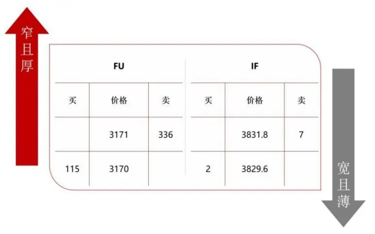
数据来源：Wind, 华泰期货研究院

我们首先选取 2023 年 1 月至 2024 年 10 月的 IM 期货主力合约进行测试。为构建更低频率的策略，我们先将 tick 级别的数据降低至相应的频率，这里选取了 1 分钟、10 分钟、半小时、以及一天进行测试。因子层面，我们采取计算该因子在相应时间段中均值的方法进行降频。收益率层面，我们用每个时间段第一个 tick 的价格以及最后一个 tick 的价格来计算收益率。其次，我们对单因子进行因子有效性测试，计算每一期的因子值以及下一期的收益率的相关系数，筛选出相关性强的因子构建单因子策略。然后，我们将这些因子进行择优合成，并构建合成因子策略。

图 26: 降频后数据示意丨单位：无

|  | lob_imb | trade_imb1 trade_imb2 |  |  |  |  |
| --- | --- | --- | --- | --- | --- | --- |
|  |  |  | trade_imb2 | tran_ret |  |  |
|  |  |  |  |  | tran_ret2 | quoted_spread |
| 2023-01-03T09:31:00.000000000 | -0.08475 | 0.50000 | 0.02500 | 0.00003 | 0.00003 | 0.00026 |
| 2023-01-03T09:32:00.000000000 | -0.04092 | 0.36667 | 0.08333 | 0.00001 | 0.00001 | 0.00019 |
| 2023-01-03T09:33:00.000000000 | -0.08363 | 0.20000 | -0.01667 | -0.00000 | -0.00000 | 0.00019 |
| 2023-01-03T09:34:00.000000000 | -0.02577 | 0.18333 | -0.06667 | 0.00001 | 0.00001 | 0.00024 |
| 2023-01-03T09:35:00.000000000 | 0.07396 | 0.28333 | 0.00833 | 0.00000 | 0.00000 | 0.00023 |
| 2023-01-03T09:36:00.000000000 | -0.01172 | 0.37500 | 0.07500 | -0.00001 | -0.00001 | 0.00019 |
| 2023-01-03T09:37:00.000000000 | 0.03920 | 0.20000 | 0.04167 | -0.00001 | -0.00001 | 0.00018 |
| 2023-01-03T09:38:00.000000000 | 0.07766 | 0.05000 | -0.03333 | 0.00000 | 0.00000 | 0.00017 |
| 2023-01-03T09:39:00.000000000 | 0.00647 | 0.14167 | -0.06667 | -0.00000 | -0.00000 | 0.00016 |
| 2023-01-03T09:40:00.00000000 | 0.01235 | 0.16667 | -0.07500 | 0.00001 | 0.00001 | 0.00016 |
| 2023-01-03T09:41:00.000000000 | 0.08379 | 0.00833 | -0.09167 | 0.00001 | 0.00001 | 0.00016 |
| 2023-01-03T09:42:00.000000000- | 0.01646 | 0.15833 | 0.00000 | -0.00000 | -0.00000 | 0.00017 |
| 2023-01-03T09:43:00.000000000 | -0.14850 | 0.18333 | 0.01667 | 0.00001 | 0.00001 | 0.00018 |
| 2023-01-03T09:44:00.000000000 | -0.02378 | 0.18333 | -0.00833 | 0.00001 | 0.00001 | 0.00015 |
| 2023-01-03T09:45:00.000000000 | -0.12407 | 0.09167 | -0.01667 | 0.00001 | 0.00001 | 0.00015 |

数据来源：天软，华泰期货研究院

在构建单因子策略时，我们根据因子特性来决定开仓方向以及阈值。如因子值在 0 附近震荡，则设多空阈值 x 和 y 为 0，如因子值都大于 0 或都小于 0，则设多空阈值 x 和 y 为其平均值。

图 27: 高频因子低频化流程图丨单位：无
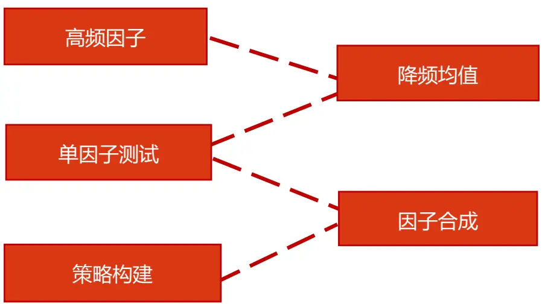
数据来源：华泰期货研究院

当期因子值 a 与下期收益率 r 呈正相关时，a>x 时做多，a<y 时做空；a 与r 呈负相关时，a<y 时做多，a>x 时做空；y≤a≤x 时空仓。

首先展示的是各频率上效果排名靠前的因子，此处测算结果尚未考虑交易成本。

图 28: 1min 频率因子排名前 5 累计净值|单位：无
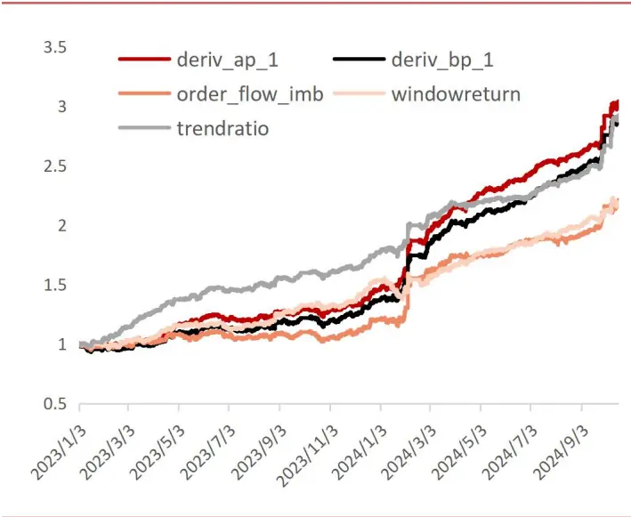
数据来源：天软，华泰期货研究院

表 18: 1min 频率因子排名前 5 策略效果丨单位：无

| 因子 | 年化收益 | 最大回撤 | 夏普比率 |
| --- | --- | --- | --- |
| trendratio | 87.08% | -4.43% | 6.09 |
| deriv_ap_1 | 91.51% | -5.77% | 5.57 |
| deriv_bp_1 | 86.46% | -7.33% | 5.05 |
| windowreturn | 58.03% | -11.71% | 3.59 |
| order_flow_imb | 58.95% | -8.39% | 3.39 |

数据来源：天软，华泰期货研究院

图 29: 10min 频率因子排名前 5 累计净值|单位：无
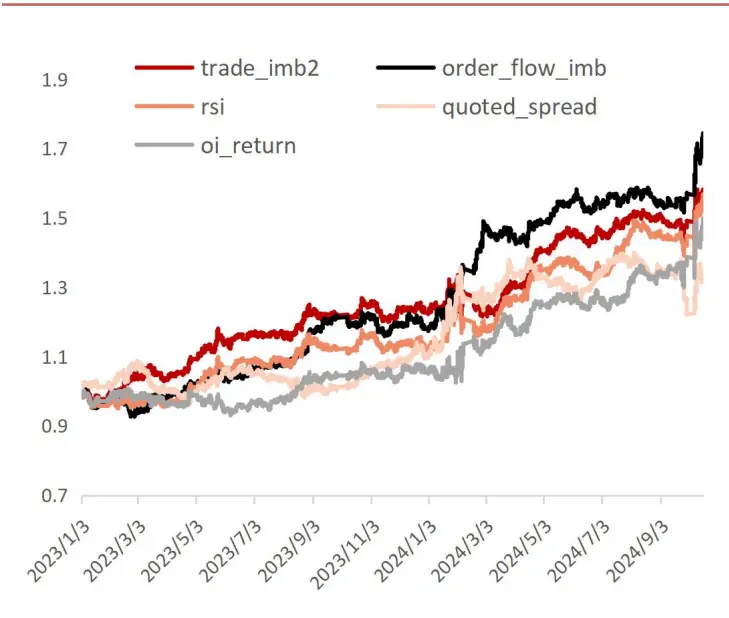
数据来源：天软，华泰期货研究院

表 19: 10min 频率因子排名前 5 策略效果丨单位：无

| 因子 | 年化收益 | 最大回撤 | 夏普比率 |
| --- | --- | --- | --- |
| order_flow_imb | 38.44% | -8.29% | 2.47 |
| trade_imb2 | 30.51% | -9.31% | 2.04 |
| rsi | 30.02% | -8.93% | 1.91 |
| oi_return | 26.59% | -8.51% | 1.60 |
| quoted_spread | 19.16% | -12.74% | 1.28 |

数据来源：天软，华泰期货研究院

图 30: 30min 频率因子排名前 5 累计净值|单位：无
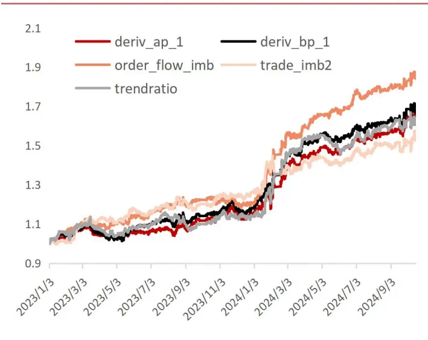
数据来源：天软，华泰期货研究院

表 20: 30min 频率因子排名前 5 策略效果丨单位：无

| 因子 | 年化收益 | 最大回撤 | 夏普比率 |
| --- | --- | --- | --- |
| order_flow_imb | 43.52% | -5.57% | 3.16 |
| deriv_bp_1 | 35.44% | -9.36% | 2.51 |
| trendratio | 32.91% | -8.22% | 2.32 |
| deriv_ap_1 | 32.71% | -8.00% | 2.28 |
| trade_imb2 | 28.29% | -6.65% | 2.08 |

数据来源：天软，华泰期货研究院

图 31: 1day 频率因子排名前 4 累计净值|单位：无
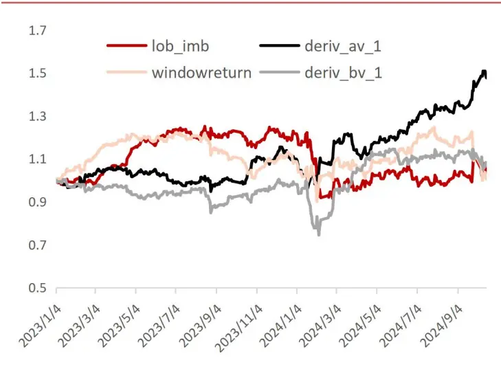
数据来源：天软，华泰期货研究院

表 21: 1day 频率因子排名前 4 策略效果丨单位：无

| 因子 | 年化收益 | 最大回撤 | 夏普比率 |
| --- | --- | --- | --- |
| deriv_av_1 | 25.66% | -16.50% | 1.35 |
| deriv_bv_1 | 4.76% | -25.82% | 0.33 |
| lob_imb | 1.96% | -26.82% | 0.20 |
| windowreturn | 0.33% | -26.26% | 0.12 |

数据来源：天软，华泰期货研究院

不同频率下表现最优的因子有所差异，有些因子如：基于挂单变化的因子order_flow_imb，盘口处价格相关的因子 driv_ap_1、trendratio 在不同频率上都有不错的表现。总体来看，大部分高频因子降至日频后效果不佳，综合最大回撤、夏普比率、交易成本等来看，30min 在回测的 4 个频率中表现较好。

其次我们对各因子策略的交易次数及单笔收益进行了统计。

表 22: 1min 频率单笔收益统计丨单位：无

| 因子 | 累计收益（点） | 交易次数 | 单笔收益（点） | 单笔跳价倍数 |
| --- | --- | --- | --- | --- |
| trendratio | 12045.2 | 100750 | 0.12 | 0.60 |
| deriv_ap_1 | 12795 | 105926 | 0.12 | 0.60 |
| deriv_bp_1 | 11942.2 | 105764 | 0.11 | 0.56 |
| windowreturn | 7445.8 | 91882 | 0.08 | 0.41 |
| order_flow_imb | 7582.4 | 94570 | 0.08 | 0.40 |

数据来源：天软，华泰期货研究院

表 23: 10min 频率单笔收益统计丨单位：无

| 因子 | 累计收益（点） | 交易次数 | 单笔收益（点） | 单笔跳价倍数 |
| --- | --- | --- | --- | --- |
| order_flow_imb | 4656.2 | 8486 | 0.55 | 2.74 |
| trade_imb2 | 3678 | 8634 | 0.43 | 2.13 |
| rsi | 3613.4 | 8716 | 0.41 | 2.07 |
| oi_return | 3100 | 8824 | 0.35 | 1.76 |
| quoted_spread | 2237.8 | 3054 | 0.73 | 3.66 |

数据来源：天软，华泰期货研究院

表 24: 30min 频率单笔收益统计丨单位：无

| 因子 | 累计收益（点） | 交易次数 | 单笔收益（点） | 单笔跳价倍数 |
| --- | --- | --- | --- | --- |
| order_flow_imb | 5479.2 | 2606 | 2.10 | 10.51 |
| deriv_bp_1 | 4367.2 | 2936 | 1.49 | 7.44 |
| trendratio | 4028.4 | 2874 | 1.40 | 7.01 |
| deriv_ap_1 | 4001.8 | 2940 | 1.36 | 6.81 |
| trade_imb2 | 3421 | 2676 | 1.28 | 6.39 |

数据来源：天软，华泰期货研究院

表 25: 1day 频率单笔收益统计丨单位：无

| 因子 | 累计收益（点） | 交易次数 | 单笔收益（点） | 单笔跳价倍数 |
| --- | --- | --- | --- | --- |
| deriv_av_1 | 3052 | 402 | 7.59 | 37.96 |
| deriv_bv_1 | 534.6 | 395 | 1.35 | 6.77 |
| lob_imb | 211.2 | 396 | 0.53 | 2.67 |

数据来源：天软，华泰期货研究院

接下来我们选取 30min 频率进行进一步的策略构建。我们将阈值 x 和 y 设为不同的数值，并采取前述开仓方式。

表 26: 30min 频率因子值分布丨单位：无

| 因子 | mean | std | min | 25% | 50% | 75% | max |
| --- | --- | --- | --- | --- | --- | --- | --- |
| order_flow_imb | -0.0105 | 0.1275 | -1.0386 | -0.0828 | -0.0111 | 0.0581 | 0.6989 |
| deriv_bp_1 | -0.0002 | 0.0152 | -0.0908 | -0.0076 | -0.0006 | 0.0063 | 0.1283 |
| trendratio | -0.0012 | 0.0128 | -0.0475 | -0.0092 | -0.0014 | 0.0064 | 0.0469 |

数据来源：天软，华泰期货研究院

我们分别设置 3 个因子的阈值如下：

order_flow_imb:

x: [0, 0.01, 0.02, 0.03]; y: [0, -0.01, -0.02, -0.03]

deriv_bp_1:

x: [0, 0.01, 0.03, 0.04, 0.05]; y: [0, -0.01, -0.03, -0.04, -0.05]

trendratio:

x: [0, 0.01, 0.015, 0.02, 0.025, 0.03]; y: [0, -0.01, -0.015, -0.02, -0.025, -0.03]

表 27: 30min 频率因子阈值夏普排名前 5 丨单位：%

| 因子 | X | y | 年化收益 | 最大回撤 | 夏普比率 |
| --- | --- | --- | --- | --- | --- |
| order_flow_imb | 0.03 | 0 | 44.45% | -4.73% | 3.39 |
|  | 0.03 | -0.01 | 43.35% | -5.34% | 3.34 |
|  | 0.01 | 0 | 44.97% | -5.42% | 3.34 |
|  | 0.02 | 0 | 44.28% | -5.12% | 3.33 |
|  | 0.01 | -0.01 | 43.87% | -6.12% | 3.28 |
| deriv_bp_1 | 0.01 | 0 | 37.44% | -6.68% | 2.97 |
|  | 0.03 | 0 | 31.92% | -5.18% | 2.81 |
|  | 0.04 | 0 | 30.91% | -5.20% | 2.77 |
|  | 0.05 | 0 | 28.15% | -5.42% | 2.57 |
|  | 0 | 0 | 35.44% | -9.36% | 2.51 |
|  | 0.02 -0.01 | 27.52% | -4.29% | 2.97 |  |
| trendratio | 0.02 -0.015 | 24.53% | -4.40% | 2.83 |  |
|  | 0.025 -0.01 | 25.16% | -4.43% | 2.83 |  |
|  | 0.03 -0.01 | 24.46% | -4.40% | 2.81 |  |
| 0.025 |  | -0.015 | 22.12% -4.55% | 2.68 |  |

数据来源：天软，华泰期货研究院

表 28: 30min 频率因子阈值夏普排名后 5 丨单位：%

| 因子 | X | y | 年化收益 | 最大回撤 | 夏普比率 |
| --- | --- | --- | --- | --- | --- |
| order_flow_imb | 0.03 | -0.03 | 38.43% | -6.49% | 3.01 |
|  | 0.01 | -0.03 | 38.97% | -6.24% | 2.96 |
|  | 0.02 | -0.03 | 38.25% | -5.95% | 2.95 |
|  | 0 | -0.02 | 39.26% | -5.67% | 2.89 |
|  | 0 | -0.03 | 37.47% | -6.73% | 2.77 |
| deriv_bp_1 | 0 | -0.03 | 16.30% | -8.00% | 1.40 |
|  | 0.05 | -0.04 | 7.78% | -5.08% | 1.29 |
|  | 0 | -0.05 | 14.36% | -7.66% | 1.28 |
|  | 0.05 | -0.03 | 7.96% | -5.30% | 1.20 |
|  | 0.05 | -0.05 | 5.91% | -5.15% | 1.02 |
| trendratio | 0.01 | -0.03 | 7.48% | -6.42% | 0.95 |
|  | 0.015 | -0.03 | 6.45% | -5.74% | 0.94 |
|  | 0.025 | -0.03 | 4.20% | -2.97% | 0.94 |
|  | 0.03 | -0.025 | 5.18% | -5.69% | 0.93 |
|  | 0.03 | -0.03 | 3.40% | -2.43% | 0.85 |

数据来源：天软，华泰期货研究院

其次，我们将该频率表现最优的这 3个因子进行信号合成。方案一：如 3个因子同时给出做多信号，则开仓做多；如 3 个因子同时给出做空信号，则开仓做空；如未达到条件则维持前一开仓判断。方案二：如有≥2 个因子给出做多信号，则开仓做多；如有≥2 个因子给出做空信号，则开仓做空；如未达到条件则维持前一开仓判断。

表 29: 30min频率合成因子策略效果丨单位：无

| 因子 | 合成方式 | 年化收益 | 最大回撤 | 夏普比率 |
| --- | --- | --- | --- | --- |
| compound factor | 方案一 | 31.35% | -7.98% | 2.08 |
|  | 方案二 | 46.87% | -7.39% | 3.34 |

数据来源：天软，华泰期货研究院

表 30: 30min频率合成因子单笔收益统计丨单位：无

| 因子 | 合成方式 | 累计收益（点） | 交易次数 | 单笔收益（点） | 单笔跳价倍数 |
| --- | --- | --- | --- | --- | --- |
| compound factor | 方案一 | 3750 | 419 | 8.95 | 44.75 |
|  | 方案二 | 5953.6 | 1270 | 4.69 | 23.44 |

数据来源：天软，华泰期货研究院

股指高频因子低频化后，能够显著覆盖成交滑点与手续费，特别是在今年股指波动加大的市场环境下，相关低频化策略表现优秀。

## 5.3、高频因子体系

在本部分中，我们将概述 Yacine Aït-Sahalia、Jianqing Fan 等人在其论文《How and When are High-Frequency Stock Returns Predictable?》中的主要发现，这些发现为高频收益率的可预测性提供了理论基础和实证依据。

随后，我们将详细阐述我们在国内期货市场的实证研究流程，包括数据集介绍、因子构造、预测目标设定及训练方法，希望能让读者能够清晰、系统地理解我们的研究方法论。

最后，我们将分析国内实证的结果，主要包含模型的预测表现、特征重要性，以及预测区间和日内效应对模型预测能力的影响。

## 5.3.1、参考文献

## 文献摘要

论文利用机器学习方法研究了超高频股票收益的在不同维度下的可预测性及持续性。作者发现，与中长期收益率相反（可预测性较小且不稳定），高频收益率在短期内显示出显著、系统性和普遍的可预测性。作者首先从交易和报价数据中构建了相关的预测因子，并研究是什么决定了股票在不同市场环境中可预测性的变化。接下来，作者发现可预测性会随着高频数据的及时性而提高，并对可预测性的变化进行了量化评估。最后，作者模拟了提前获取部分订单流方向（不完美）对预测能力的影响，这种前瞻性能力通常来自于最快的高频交易者，能显著提高收益率的可预测性和持续性。

论文研究的因变量是未来一定区间内的收益率和方向（涨或是跌）。此处，作者使用了三个时钟（Time Clock）来定义区间，分别是日历时钟、成交时钟以及成交额时钟。日历时钟就是最常见的时间维度（未来 n 秒的区间收益率及方向），成交时钟则将交易笔数作为衡量区间的尺度（未来 n 笔交易的区间收益率及方向），而成交额时钟则是将成交金额作为衡量区间的尺度（未来 n 美元交易的区间收益率及方向）。预测区间构造的公式及符号表达如下：

$$
\mathrm{Int}(T_{1},T_{2})=\left\{t\in\mathbb{R}:T_{1}<t\leq T_{2}\right\}.
$$

其中，T 为当前时点，Δ为区间长度，M 为所选时钟。

作者将预测区间收益率定义为未来一段时间内的平均成交价格与当前中间价的比值减一。与传统的单笔交易或固定时间间隔的收益率计算方式相比，这样的计算方式使得收益率数值更加稳定，噪声更小，受到异常值的影响较小。

论文构造了 13 个预测因子，每个因子都可以在 9 个回溯区间和 3 个时钟上计算。这 13个预测因子大致可以分为以下 3类。

第一类：成交量和持续时间。第一组预测因子与股票的交易强度有关。例如，人们可能预期大额或频繁的交易现象可能会在短期内持续存在，因此此类因子可能具备预测能力。

1） 广度因子（Breadth）是回溯区间内的成交笔数：

2） 即时性因子（Immediacy）是回溯区间内每笔成交的平均间隔时间：

3） 总成交量因子（VolumeAll）是回溯区间内的总成交量：

4） 平均成交量因子（VolumeAvg）是回溯区间内的每笔成交的平均成交量：

5） 最大成交量因子（VolumeMax）是回溯区间内的单笔成交的最大成交量：

第二类：收益和不平衡性。第二组预测因素与股票近期的交易不对称有关。例如，如果大多数交易都是触及卖方报价的买入交易，或者最优报价中买单量显著高于卖单量，那么我们可能会看到价格上涨的较大可能性。因此，预测未来回报的一个因素将是当前限价订单簿（LOB）的特征，包括任何不平衡性。众所周知，这种不平衡预示着未来的价格变动（参见 Cont 等人（2014 年）1以及Kercheval 和 Zhang（2015 年）2）。

1） 价格振幅因子（Lambda）衡量了回溯区间内单位成交量下价格的波动变化：

2） 报价不平衡因子 （LobImbalance）衡量了回溯区间内最优报价处挂单量的不平衡性：

3） 成交不平衡因子（TxnImbalance）衡量了回溯区间内所有成交中主买量和主卖量之前的不平衡性：

4） 历史收益因子（PastReturn）是回溯区间内的收益率，计算方式与与之前提到的预测区间收益率基本一致：

第三类：速度和费用。第三组预测因素主要考虑了股票交易的速度和成本。

1） 换手率因子（Turnover）是回溯区间内成交量与总流通股数之间的比例：

2） 自相关性因子（AutoCov）是回溯区间内成交收益率的平均自协方差：

3） 报价价差因子（QuotedSpread）是回溯区间内标准化后的平均最优报价价差：

4）有效价差因子（QuotedSpread）衡量了回溯区间内用成交价计算的美元加权（dollar-weighted）价差：

文献主要使用了两种回归方法进行预测，第一种是正则化逻辑回归（LASSO,Least absolute shrinkage and selection operator）作为代表性的参数方法，以及随机森林（RF，Random Forest）作为代表性的非参数方法。除了主要使用的这两种方法之外，作者也对其他的方法进行了评估，包含最小二乘法（OLS）、岭回归（Ridge）、FarmPredict 线性回归及梯度提升树（GBT）等方法。

## 5.3.2、国内实证过程

在原文献中，作者基于限价订单簿及逐笔成交数据构建了 13 个因子。遗憾的是，国内期货市场的高频数据与国外的股票高频数据存在较大的差异，使得大部分因子无法复现。具体差异如下：

1） 国外股票高频数据集中有逐笔成交数据，但国内期货市场难以获取逐笔成交数据。

2） 国外股票高频数据集中的报价更新数据的快照精确到了纳秒，但国内期货交易所一般 1 秒推送 2 个快照数据，即时间间隔为 500 毫秒。这 500 毫秒期间发生的具体挂单及交易无从得知，仅能从当前盘口与 500 毫秒前盘口之间的相对关系加以推测。

在文献构造的 13 个因子中，仅总成交量因子，报价不平衡因子，成交不平衡因子，历史收益因子、换手率因子、报价价差因子这 6 个因子可以在国内期货市场复现。基于初步测试结果，我们发现仅依赖这六个因子构建的模型在预测表现上并不理想。为了进一步提升模型的预测能力，我们启动了一项广泛的高频因子收集和开发工作。最终，我们整理并开发了超过 130 个高频因子，并将其纳入华泰期货的高频因子库中。

对于每个因子，我们都会求其在不同回溯区间的均值作为后续机器学习模型的输入（特征），以求同时捕捉因子的长期及短期的影响。原文献的回溯区间为过去 1tick，过去 2-1tick，过去 4-2tick，过去 8-4tick……过去 256tick-128tick共 9 个回溯区间，这样的构造方式可以保证回溯区间不重合，避免同个因子在不同区间上的因子值之间存在过于明显的多重共线性的问题。然而，经过检验，我们发现这样的构造方式会降低模型在样本外的预测表现，因此我们对原文的回溯区间进行了一定的修改，构造的回溯区间为过去1tick，过去2tick，过去4tick……过去 512tick 共 10 个回溯区间。

## 预测目标

我们的预测目标是未来 10 个 Tick（5秒）的收益率，计算方式为未来一段时间内的平均成交价格与当前中间价的比值减一：

$$
\mathrm{Return}(T,\Delta,M)=\mathrm{Average}\left[P_{t}^{\mathrm{txn}}:t\in\mathbf{D}^{\mathrm{txn}}\cap\mathrm{Int}^{\mathrm{torward}}(T,\Delta,\mathrm{M})\right]/P_{T}-1.
$$

考虑到实际交易时将不可避免存在延迟，我们将预测目标的计算向后延迟了一个 tick。公式中的 T 当前时点的下一个 Tick，Δ为区间长度（此处为 10 个Tick），M 为所选时钟（此处为日历时钟）。

在实证过程中，我们主要使用了 3 种线性回归模型（OLS,Ridge,Lasso）以及 3 种机器学习回归模型（随机森林、XGBoost、LightGBM）进行拟合。

## 模型训练

我们训练模型的过程与原文献基本保持一致。训练具体流程如下：

1.学习阶段（Learning）：对于每一组超参数和 t = T, T+5, T+10,...等时间点，使用从第 t 天到第 t+4 天（共 5个交易日）的数据来训练一个模型。在随后的 5 天区间[t+5, t+9]内评估这个模型，并为测试集中的每一天计算样本外 R²，即得到 $R_{t+5}^{2},\cdots\cdots R_{t+9}^{2}$

2.调参阶段（Tuning）：选择最大平均 R²值的超参数组合（计算从 T+5 到T+19 这段时间内所有测试日 R²值的平均值，共有 15 个测试日），并固定这组超参数用于下一步的预测。

3.预测阶段（Predicting）：对于每个 t = T+20, T+21, ...等时间点，使用从第 t-5 天到第 t-1 天的数据来训练一个模型，并使用该模型来预测第 t 天的结果。

4.滚动窗口（Rolling）：将整个时间窗口向前滚动 20 个交易日，即 T 变为T+20，然后重复步骤 1 至 4。

图 32: 模型调优及测试时间窗口丨单位：无
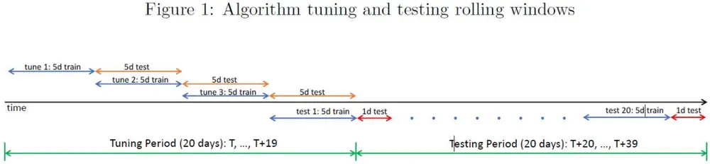
数据来源：《How and When are High-Frequency Stock Returns Predictable?》 华泰期货研究院

## 5.3.3、国内实证结果

## 预测表现

## （1）收益率预测

从 40 天测试集（Test set）的样本外 R 方上看，高频多因子模型在 RB（螺纹钢）上的预测表现优于 FU（燃料油），最佳模型的样本外 R方分别为 20.74%及 15.05%，均优于文献中的样本外 R 方中位数 10%。该结果符合预期，因为我们额外引入了较多新的高频因子，使得模型更能捕捉到订单簿数据中的微观特征。

从模型层面上看，参数模型中的 LASSO 和 Ridge 模型以及非参数模型中的 LGBM 模型整体表现较好。OLS 受过拟合及多重共线性影响较大，预测效果逊色于其他参数模型；随机森林模型预测效果最差，有一部分原因是随机森林模型训练效率较低，单次训练时长较久，在有限的时间内难以找到最优的超参数组合。

图 33: RB 各模型样本外 R 方 | 单位：%
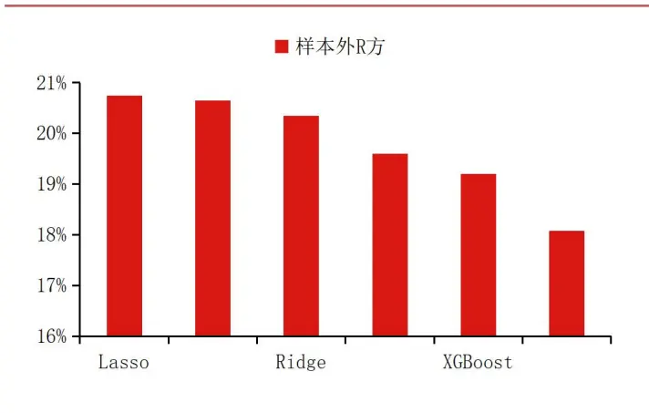
数据来源：天软，华泰期货研究院

图 34: FU 各模型样本外 R 方 | 单位：%
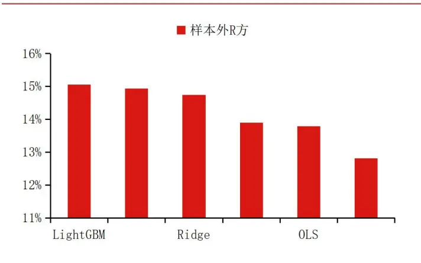
数据来源：天软华泰期货研究院

## （2）方向预测

从 40 天测试集（Test set）的方向准确性上看，高频多因子模型在 RB（螺纹钢）上的预测表现同样略优于 FU（燃料油），最佳模型的方向准确性分别为64.86%及 62.97%，接近于文献中的样本外方向准确性 64%。

从模型层面上看，LASSO 模型在这两个品种上都是表现最佳的模型。

图 35: RB 各模型样本外方向准确性 | 单位：%
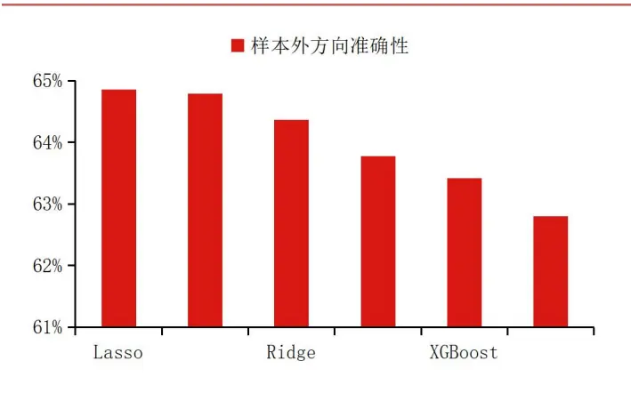
数据来源：天软，华泰期货研究院

图 36: FU 各模型样本外方向准确性| 单位：%
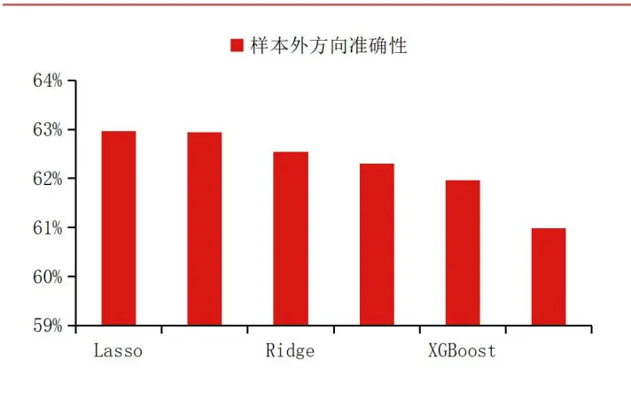
数据来源：天软华泰期货研究院

由于在参数模型中，LASSO 模型表现最佳；在非参数模型中，LGBM 模型整体表现最佳。因此，我们后文进一步的实证分析仅针对 LASSO 模型和 LGBM模型。

## 特征重要性

LASSO 模型的一个优势在于，它通过对特征进行标准化预处理，确保了模型回归系数的可比性。这意味着，回归系数的绝对值能够直接反映各特征在模型中的相对重要性。同样地，LGBM 模型也内置了计算特征重要性的功能，这为我们评估不同特征对模型预测的贡献度提供了便利。

为了全面评估各特征的重要性，我们计算了所有 40 个测试集上模型特征重要性的平均值，并据此进行了排序，以确定每个特征的排名。鉴于涉及的因子数量较多，且篇幅有限，这里仅精选部分因子的结果进行展示。

## （1）报价不平衡因子

第一个要介绍的因子是报价不平衡因子 （LobImbalance），该因子衡量了回溯区间内最优报价处挂单量的不平衡性。该因子来自于文献，且同时也是所有因子中最有效的因子。

事实上，已经有许多证据表明该因子对未来价格变动而言是较显著的信号，我们在《华泰期货量化策略专题报告 20240529：做市高频系列（十五）Micro：优秀的高频公允价指标》中构建 Micro 指标时就用到了该因子作为 Micro 指标的关键输入参数之一。

从该因子在 LASSO 模型的回归系数及其特征排行上看，我们可以得出几个结论。

第一，该因子短期的回归系数小于 0，但长期大于 0。该因子短期（回溯区间取 1 个 tick时）的回归系数小于 0，说明当短期内卖方挂单量相对于买方挂单量越大时，越来价格越有可能下跌，这一点与预期一致。但该因子在更长回溯期间的回归系数大于 0，这一点其实是有点超预期的。我们认为一个可能的解释是，当盘口出现不平衡情况时，比如卖方挂单量很大，往往报价会很快的做出反映，整体价格会往下移一档或者多档（卖方在价格更低的地方挂单），来缓解这样的不平衡情况。但如果长时间出现持续的不平衡，很可能盘口很可能并没有往下平移，说明市场买方力量并不比卖方力量弱，只是卖方的挂单量太大了，市场的买方在逐步、主动地在卖方报价位置成交，使得价格维持在一个相对稳定的区间。而在我们的收益率计算方式中，买方在卖方报价处成交所计算出的收益率会大于0。

第二，LASSO 模型与 LGBM 模型之间的特征重要性存在一定差异，比如当回溯区间取 2 个 tick 时，品种为 RB 时，LASSO 模型识别该特征并不是特别显著，排在第 64 位，但 LGBM 将其识别为显著特征，排在第 3 位。该差异可能是因为 LGBM 模型能捕捉数据之间的非线性关系，更有效地利用了该特征。

第三，当回溯区间设定为 1Tick 时，该因子的特征重要性显著大于其他更长的回溯区间，该发现与文献一致，即信息最丰富的预测变量往往是通过使用最近的过去数据构建的。

图 37: 报价不平衡因子在 LASSO 模型中的回归系数（RB） | 单位：无
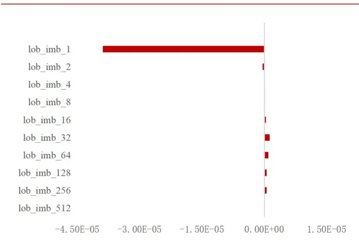
数据来源：天软，华泰期货研究院

表 31: 报价不平衡因子特征重要性排名（RB）| 单位：无

| 特征 | Igbm 排名 | lasso 排名 |
| --- | --- | --- |
| lob_imb_1 | 1 | 1 |
| lob_imb_2 | 3 | 64 |
| lob_imb_4 | 27 | 361 |
| lob_imb_8 | 296 | 360 |
| lob_imb_16 | 373 | 67 |
| lob_imb_32 | 340 | 21 |
| lob_imb_64 | 339 | 29 |
| lob_imb_128 | 195 | 44 |
| lob_imb_256 | 174 | 48 |
| lob_imb_512 | 184 | 245 |

数据来源：天软，华泰期货研究院

图 38: 报价不平衡因子在 LASSO模型中的回归系数（FU） | 单位：无
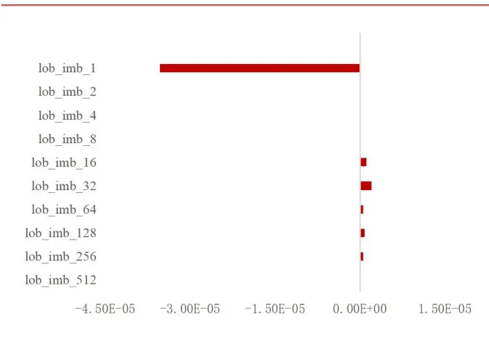
数据来源：天软，华泰期货研究院

表 32: 报价不平衡因子特征重要性排名（FU）| 单位：无

| 特征 | Igbm 排名 | lasso 排名 |
| --- | --- | --- |
| lob_imb_1 | 1 | 1 |
| lob_imb_2 | 4 | 389 |
| lob_imb_4 | 100 | 378 |
| lob_imb_8 | 280 | 325 |
| lob_imb_16 | 346 | 31 |
| lob_imb_32 | 282 | 15 |
| lob_imb_64 | 212 | 62 |
| lob_imb_128 | 175 | 45 |
| lob_imb_256 | 230 | 57 |
| lob_imb_512 | 91 | 228 |

数据来源：天软，华泰期货研究院

## （2）成交收益因子

第二个要介绍的因子是成交收益因子（TransactionReturn），该因子是我们在原文献历史收益因子（PastReturn）的基础上做了相应调整的因子（国内期货市场无逐笔成交数据），衡量了用回溯区间内平均成交价和当前中价计算出的收益率。

其中，Amount 为成交额，Volume 为成交量，ContractUnit 为合约单位，

Mid 为中价。当成交收益因子大于 0 时，说明当前市场中价高于市场近期成交均价。

从结果上看，成交收益因子的回归系数在不同回溯期均小于 0，说明当近期成交均价小于当前中价时，未来价格更有可能下跌。

此外，成交收益因子同样表现出对近期数据的高敏感性，即其信息量主要集中在较短的回溯周期内，一旦回溯区间扩展至超过 16 个 tick，其提供的额外预测信息便趋于饱和，几乎不再增加新的预测价值。

图 39: 成交收益因子在 LASSO 模型中的回归系数（RB） | 单位：无
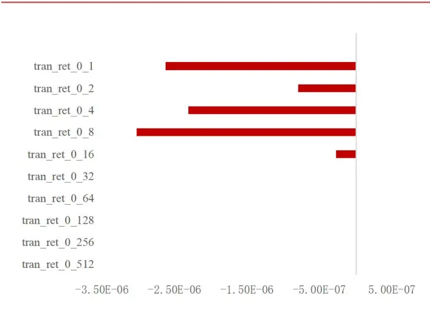
数据来源：天软，华泰期货研究院

表 33: 成交收益因子特征重要性排名（RB）| 单位：无

| 特征 | Igbm 排名 | lasso 排名 |
| --- | --- | --- |
| tran_ret_1 | 45 | 7 |
| tran_ret_2 | 68 | 35 |
| tran_re_4 | 30 | 10 |
| tran_ret_8 | 21 | 5 |
| tran_ret_16 | 137 | 81 |
| tran_ret_32 | 290 | 302 |
| tran_ret_64 | 215 | 292 |
| tran_ret_128 | 105 | 304 |
| tran_ret_256 | 198 | 327 |
| tran_ret_512 | 36 | 326 |

数据来源：天软，华泰期货研究院

图 40: 成交收益因子在 LASSO 模型中的回归系数（FU） | 单位：无
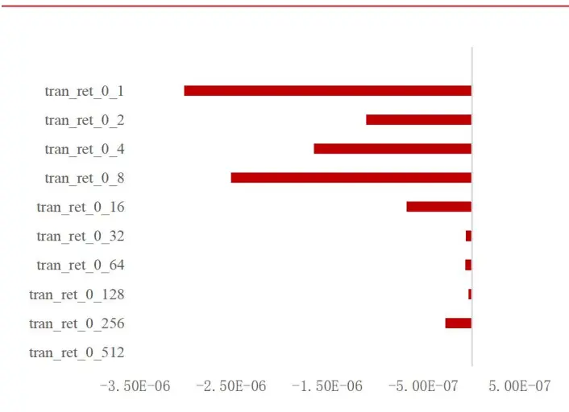
数据来源：天软，华泰期货研究院

表 34: 成交收益因子特征重要性排名（FU）| 单位：无

| 特征 | Igbm 排名 | lasso 排名 |
| --- | --- | --- |
| tran_ret_1 | 11 | 6 |
| tran_ret_2 | 62 | 35 |
| tran_re_4 | 52 | 18 |
| tran_ret_8 | 20 | 9 |
| tran_ret_16 | 49 | 50 |
| tran_ret_32 | 158 | 234 |
| tran_ret_64 | 213 | 231 |
| tran_ret_128 | 157 | 271 |
| tran_ret_256 | 181 | 102 |
| tran_ret_512 | 67 | 500 |

数据来源：天软，华泰期货研究院

## （3）实际下行波动率因子

最后一个要介绍的因子是实际下行波动率因子（RealDownVariance），该因子衡量了回溯区间内下行收益的波动率。

实际下行波动率因子的回归系数普遍小于 0，说明当市场在过去经历较大的价格下行波动时，其未来价格走势更倾向于继续下跌，这一点与我们的直观预期一致。

有趣的是，该因子不再遵循“信息最丰富的预测变量往往是通过使用最近的过去数据构建的”这一原则。该因子在使用较短的回溯区间时并不显著，而是当回溯区间扩大至一定范围后，才展现出较强的有效性。这表明，对于特定因子而言，更长时间跨度的历史数据可能蕴含着更多的信息。

图 41: 实际下行波动率因子在 LASSO模型中的回归系数（RB） | 单位：无
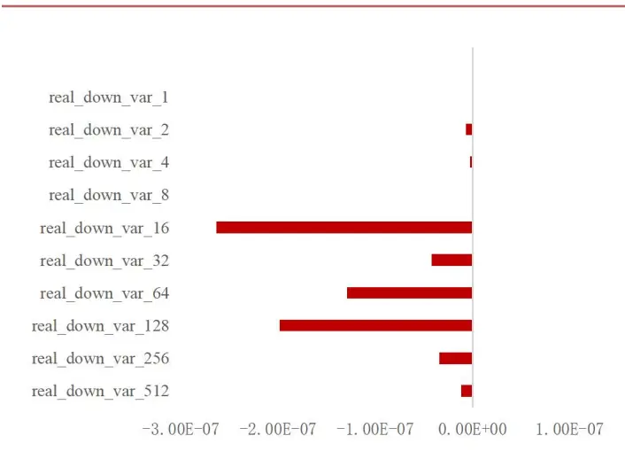
数据来源：天软，华泰期货研究院

表 35: 实际下行波动率因子特征重要性排名（RB）| 单位：无

| 特征 | Igbm 排名 | lasso 排名 |
| --- | --- | --- |
| real_down_var_1 | 505 | 392 |
| real_down_var_2 | 481 | 256 |
| real_down_var_4 | 399 | 269 |
| real_down_var_8 | 385 | 477 |
| real_down_var_16 | 246 | 87 |
| real_down_var_32 | 121 | 190 |
| real_down_var_64 | 96 | 124 |
| real_down_var_128 | 84 | 96 |
| real_down_var_256 | 114 | 203 |
| real_down_var_512 | 210 | 246 |

数据来源：天软，华泰期货研究院

图 42: 实际下行波动率因子在 LASSO 模型中的回归系数（FU） | 单位：无
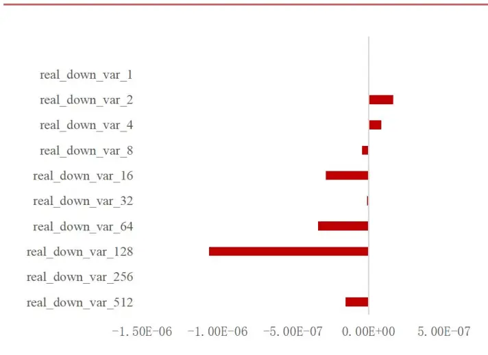
数据来源：天软，华泰期货研究院

表 36: 实际下行波动率因子特征重要性排名（FU）| 单位：无

| 特征 | Igbm 排名 | lasso 排名 |
| --- | --- | --- |
| real_down_var_1 | 475 | 437 |
| real_down_var_2 | 441 | 139 |
| real_down_var_4 | 429 | 188 |
| real_down_var_8 | 200 | 175 |
| real_down_var_16 | 205 | 76 |
| real_down_var_32 | 51 | 324 |
| real_down_var_64 | 78 | 91 |
| real_down_var_128 | 66 | 37 |
| real_down_var_256 | 126 | 431 |
| real_down_var_512 | 178 | 164 |

数据来源：天软，华泰期货研究院

## 预测区间

文献提到，高频收益率在较短区间内的可预测性很强，但随着区间的延长而逐渐减弱。我们针对这一观点在国内实证环节做了验证，得到了一致的结论：以品种 RB，模型 LASSO 为例，随着预测区间从 10 个 Tick 延长到 120 个 Tick，样本外 R 方从 20.74%单调递减至 4.94%，样本外方向准确性从 64.86%单调递减到 53.97%。

图 43: LASSO 模型样本外 R 方（RB） | 单位：%
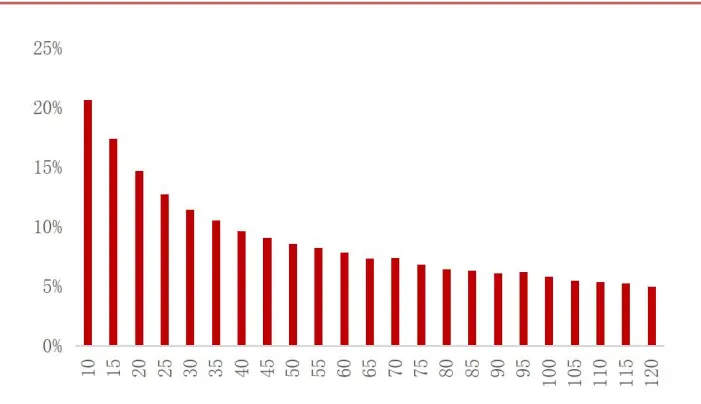
数据来源：天软，华泰期货研究院

图 44: LASSO 模型样本外准确性（RB） | 单位：%
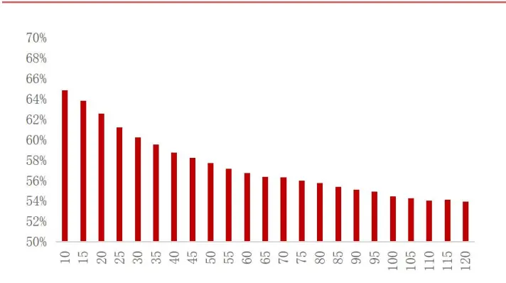
数据来源：天软，华泰期货研究院

## 日内效应

接下来，我们同样对模型的日内效应感兴趣。是否在每天的不同时段，模型的预测表现会存在差异？我们按照 15 分钟一个时段的原则，将一天日盘的数据划分为 15 个时段，并分时段查看模型的预测表现。

我们发现，每天早晨和下午开盘时，模型的预测表现显著弱于其他时段。一个合理的解释是，开盘初期的交易反映了投资者对于隔夜（中午）新闻、公告及全球市场动态的综合反映，这些信息的迅速涌入和消化过程中产生了较大的市场分歧与波动，存在较多噪声，导致因子预测效果减弱。另外，模型在午盘的预测效果会略优于早盘，尤其是在 FU 上体现的比较明显。

表 37: 模型日内效应（LASSO 、RB） | 单位：%

| 时间段 | 开始时间 | 结束时间 | 样本外R方 | 样本外准确性 |
| --- | --- | --- | --- | --- |
| 1 | 9:00:00 | 9:15:00 | 15.39% | 63.49% |
| 2 | 9:15:00 | 9:30:00 | 20.76% | 64.84% |
| 3 | 9:30:00 | 9:45:00 | 20.46% | 64.43% |
| 4 | 9:45:00 | 10:00:00 | 21.10% | 65.43% |
| 5 | 10:00:00 | 10:15:00 | 20.79% | 64.84% |
| 6 | 10:30:00 | 10:45:00 | 20.16% | 65.04% |
| 7 | 10:45:00 | 11:00:00 | 21.82% | 64.92% |
| 8 | 11:00:00 | 11:15:00 | 23.53% | 66.04% |
| 9 | 11:15:00 | 11:30:00 | 19.24% | 65.21% |
| 10 | 13:30:00 | 13:45:00 | 19.78% | 63.73% |
| 11 | 13:45:00 | 14:00:00 | 23.76% | 65.89% |
| 12 | 14:00:00 | 14:15:00 | 22.32% | 65.23% |
| 13 | 14:15:00 | 14:30:00 | 21.33% | 65.06% |
| 14 | 14:30:00 | 14:45:00 | 20.72% | 64.62% |
| 15 | 14:45:00 | 15:00:00 | 21.90% | 64.10% |

数据来源：天软，华泰期货研究院

表 38: 模型日内效应（LGBM 、RB） | 单位：%

| 时间段 | 开始时间 | 结束时间 | 样本外R方 | 样本外准确性 |
| --- | --- | --- | --- | --- |
| 1 | 9:00:00 | 9:15:00 | 15.21% | 63.42% |
| 2 | 9:15:00 | 9:30:00 | 21.17% | 65.03% |
| 3 | 9:30:00 | 9:45:00 | 20.68% | 64.55% |
| 4 | 9:45:00 | 10:00:00 | 20.81% | 65.05% |
| 5 | 10:00:00 | 10:15:00 | 21.14% | 64.94% |
| 6 | 10:30:00 | 10:45:00 | 20.03% | 65.00% |
| 7 | 10:45:00 | 11:00:00 | 21.76% | 64.83% |
| 8 | 11:00:00 | 11:15:00 | 23.49% | 66.21% |
| 9 | 11:15:00 | 11:30:00 | 18.75% | 64.85% |
| 10 | 13:30:00 | 13:45:00 | 20.15% | 63.66% |
| 11 | 13:45:00 | 14:00:00 | 23.52% | 65.74% |
| 12 | 14:00:00 | 14:15:00 | 21.66% | 65.32% |
| 13 | 14:15:00 | 14:30:00 | 21.47% | 64.78% |
| 14 | 14:30:00 | 14:45:00 | 20.17% | 64.46% |
| 15 | 14:45:00 | 15:00:00 | 21.41% | 63.94% |

数据来源：天软，华泰期货研究院

表 39: 模型日内效应（LASSO 、FU） | 单位：%

| 时间段 | 开始时间 | 结束时间 | 样本外R方 | 样本外准确性 |
| --- | --- | --- | --- | --- |
| 1 | 9:00:00 | 9:15:00 | 3.82% | 61.46% |
| 2 | 9:15:00 | 9:30:00 | 14.78% | 62.79% |
| 3 | 9:30:00 | 9:45:00 | 15.80% | 62.88% |
| 4 | 9:45:00 | 10:00:00 | 16.89% | 64.22% |
| 5 | 10:00:00 | 10:15:00 | 14.10% | 62.54% |
| 6 | 10:30:00 | 10:45:00 | 16.79% | 62.88% |
| 7 | 10:45:00 | 11:00:00 | 18.32% | 63.88% |

表 40: 模型日内效应（LGBM 、FU） | 单位：%

| 时间段 | 开始时间 | 结束时间 | 样本外R方 | 样本外准确性 |
| --- | --- | --- | --- | --- |
| 1 | 9:00:00 | 9:15:00 | 8.23% | 61.71% |
| 2 | 9:15:00 | 9:30:00 | 14.43% | 62.69% |
| 3 | 9:30:00 | 9:45:00 | 15.54% | 62.84% |
| 4 | 9:45:00 | 10:00:00 | 16.90% | 64.17% |
| 5 | 10:00:00 | 10:15:00 | 13.89% | 62.51% |
| 6 | 10:30:00 | 10:45:00 | 16.50% | 62.89% |
| 7 | 10:45:00 | 11:00:00 | 17.63% | 63.64% |
| 8 | 11:00:00 | 11:15:00 | 16.08% | 62.13% |
| 9 | 11:15:00 | 11:30:00 | 11.69% | 62.40% |
| 10 | 13:30:00 | 13:45:00 | 15.46% | 62.66% |
| 11 | 13:45:00 | 14:00:00 | 17.00% | 62.68% |
| 12 | 14:00:00 | 14:15:00 | 18.04% | 62.73% |
| 13 | 14:15:00 | 14:30:00 | 19.14% | 64.20% |
| 14 | 14:30:00 | 14:45:00 | 18.19% | 63.78% |
| 15 | 14:45:00 | 15:00:00 | 18.93% | 63.44% |

数据来源：天软，华泰期货研究院

| 8 | 11:00:00 | 11:15:00 | 16.26% | 61.87% |
| --- | --- | --- | --- | --- |
| 9 | 11:15:00 | 11:30:00 | 11.33% | 62.41% |
| 10 | 13:30:00 | 13:45:00 | 15.72% | 62.55% |
| 11 | 13:45:00 | 14:00:00 | 16.73% | 62.89% |
| 12 | 14:00:00 | 14:15:00 | 17.65% | 62.48% |
| 13 | 14:15:00 | 14:30:00 | 18.82% | 64.37% |
| 14 | 14:30:00 | 14:45:00 | 18.17% | 63.90% |
| 15 | 14:45:00 | 15:00:00 | 18.83% | 63.24% |

数据来源：天软，华泰期货研究院

## 免责声明

本报告基于本公司认为可靠的、已公开的信息编制，但本公司对该等信息的准确性及完整性不作任何保证。本报告所载的意见、结论及预测仅反映报告发布当日的观点和判断。在不同时期，本公司可能会发出与本报告所载意见、评估及预测不一致的研究报告。本公司不保证本报告所含信息保持在最新状态。本公司对本报告所含信息可在不发出通知的情形下做出修改， 投资者应当自行关注相应的更新或修改。

本公司力求报告内容客观、公正，但本报告所载的观点、结论和建议仅供参考，投资者并不能依靠本报告以取代行使独立判断。对投资者依据或者使用本报告所造成的一切后果，本公司及作者均不承担任何法律责任。

本报告版权仅为本公司所有。未经本公司书面许可，任何机构或个人不得以翻版、复制、发表、引用或再次分发他人等任何形式侵犯本公司版权。如征得本公司同意进行引用、刊发的，需在允许的范围内使用，并注明出处为“华泰期货研究院”，且不得对本报告进行任何有悖原意的引用、删节和修改。本公司保留追究相关责任的权力。所有本报告中使用的商标、服务标记及标记均为本公司的商标、服务标记及标记。

华泰期货有限公司版权所有并保留一切权利。

## 公司总部

广州市天河区临江大道 1 号之一 2101-2106 单元丨邮编：510000

电话：400-6280-888

网址：www.htfc.com

