# CTA 量化策略因子系列（一）：波动率因子

华泰期货研究所 量化组

罗剑

量化组组长

- luojian@htfc.com

## 报告摘要：

从业资格号：F3029622

投资咨询号：Z3012106

经过2016年商品牛市大年，市场上大多数CTA策略收益颇丰，2017年随着整体商品进入调整期，整体市场热情下降低，市场波动率持续降低，2017年上半年 CTA 管理期货策略收益不佳，在各大策略中排名垫底。

本文以波动率因子作为金融市场风险度量因子进行分析，对 CTA 策略在不同的波动率区间及其不同的波动率周期进行收益源分析，在 CTA 策略中加入考量波动率因子因素的择时策略。在不采用杠杆的情况下，进行样本外测试，发现经过优化后，单纯的动量因子策略收益略微从原年化收益的7.88%下降至5.38%，但是最大回撤从9.43%降低至 3.58%，年化标准差同时大幅度下降，由 6.54%减少至 3.92%，收益风险比从1.19提升至1.37，且观察优化后的策略净值图，发现其间有部分空仓时间，实际操作中可进行固定收益增强操作，使实际收益进一步加强。

本文利用波动率因子不同周期的表现情况对 CTA 的经典代表策略－动量策略进行分析及优化，从样本外的测试结果来看，达到预期优化效果，良好地控制动策策略在牛熊市场转换间的风险回撤及利用不同波动率区间的价格特点，优化了收益风险比。

## 2017 年上半年 CTA 策略表现不佳

经过2016年商品牛市大年，市场上大多数 CTA策略收益颇丰，2017年随着整体商品进入调整期，整体市场热情下降低，2017 年 CTA 管理期货策略收益在各大策略中排名垫底，且由图1可发现，2017年上半年国内CTA 策略私募基金发行规模较2016年新发行规模明显减少。

图 1： 2017 国内 CTA 策略私募基金规模单位：%
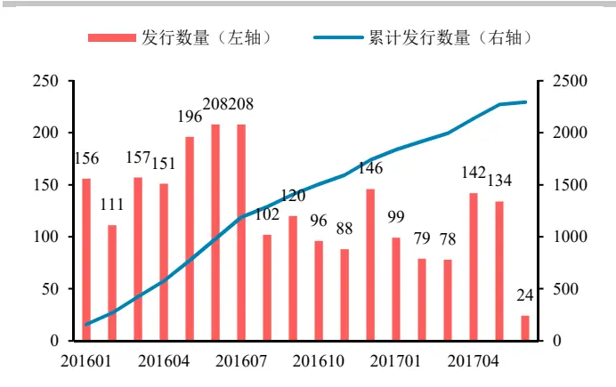
数据来源：私募排排网 华泰期货研究所

图 2： 2017 年上半年各类策略平均收益率 单位：%
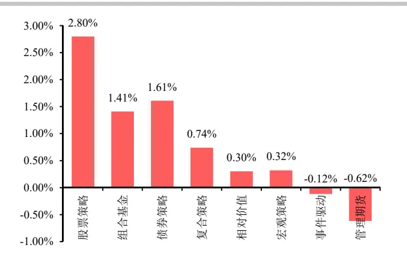
数据来源：私募排排网 华泰期货研究所

从 2017 年上半年CTA 策略各月份的平均收益率发现，2017年1与5月为亏损较严重月份，尤其 1月市场CTA 策略平均亏损 2.09%，导致 2017年上半年整体CTA策略平均收益较差及排名垫底；对照近一年的各大类商品指数走势，工业品、金属及能化商品未能延续2016 的商品大牛市、行情反转是导致CTA策略1 月亏损的直接原因之一。

图 3：2017 年上半年 CTA 策略平均收益率 单位：%
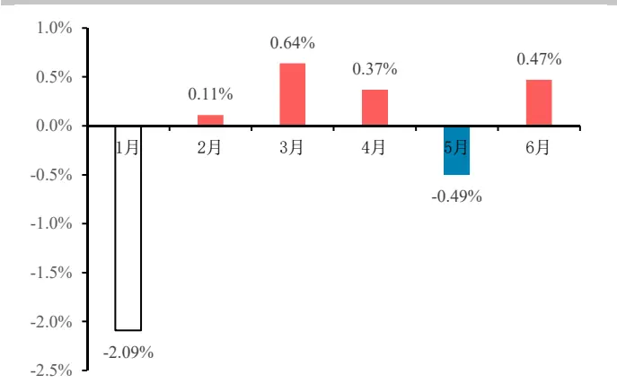
数据来源：私人募排排网 华泰期货研究所

图 4：近一年国内各大类商品指数走势单位：%
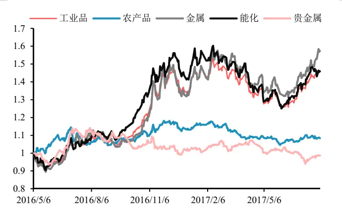
数据来源：Wind 华泰期货研究所

从 Wind 商品指数的月波动率季节性分布发现，2016 年 10 月份 Wind 商品指数月波动率开始快速拉升，在 2016 年 11 月份波动率开始回落，且回落势头延续至 2017 年 6 月，与历史同月平均月波动率对比，也基本符合它的季节性规律。因此，本文决定从波动率入手，分析波动率对商品价格与CTA 策略收益的关系。

图 5：Wind商品指数的月波动率季节性分布 单位：%
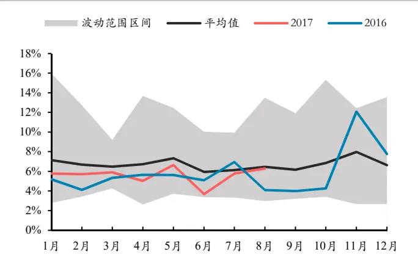
数据来源：wind 华泰期货研究所

图 6：Wind商品指数与历史波动率走势图 单位：%
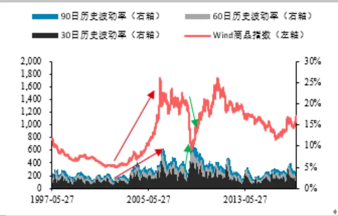
数据来源：wind 华泰期货研究所

## 波动率的定义与周期

在金融定义里，波动率定义为资产价格的变化，通常用于度量市场的风险程度。在实际应用中，波动率可由过去价格收益率变化的标准差或者期权合约中的隐含波动率表示估计。

当波动率的上升，市场面临更大的不确定性，从而影响市场价格走势与策略的收益情况。由图 6 可得，Wind 商品指数的历史波动率的上升，通常由于商品价格的上涨或者下跌所造成，所以根据行为金融学的相关定义，把波动率的周期分为由价格上涨带来波动率增加的正波动率周期和由价格下跌带来的波动率增加的负波动率周期，如下图所示：

图 7：波动率周期循环
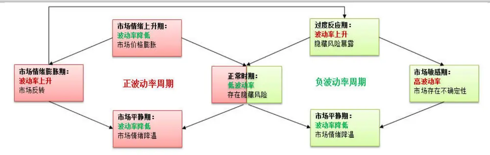
数据来源：Kathryn M.Kaminski, Aplha K Capital 华泰期货研究所

由 Kathryn M.Kaminski（2011）研究发现，不同的价格趋势涨跌带来的波动率上升会市场的不确定性和投资者的行为改变会不一致。如果市场风险暴露，突发事件威胁市场价格，投资者会形成羊群及挤兑效应，市场波动率快速拉升并随高波动率进入市场不确定性状态。投资者产生焦虑、恐慌，对价格的波动敏感度提高。当焦虑、恐慌慢慢消失，市场波动率及投资者风险承受能力才回归正常。

当突发事件带来正向的价格波动时，投资者行为会带来过度自信感，通常把这种行为定义为赢家效应，最终会导致市场价格快速升高，类似于资产泡沫时期。但随后过高波动率往往带来快速的反转，使投资者蒙受损失，且如果这种反转足够强烈，隐藏风险暴露于市场，使投资者感觉价格的威胁，会使市场打破正波动周期，直接跳转至负波动率周期。

## CTA策略的波动率使用

商品期货市场的波动率策略主要分为纯波动率策略和整体波动率策略，纯波动率策略即在横截面做多波动率高的品种、做空低波动率的品种（或者做空高波动率的品种、做多低波动率的品种）的对冲组合策略；而整体波动率策略参考图 8、9 类似期权买入和卖出跨式组合策略，做多整体市场波动率或做空整体市场波动率；

图 8：买入跨式组合盈亏图
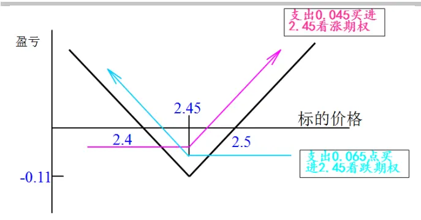
数据来源：华泰期货研究所

图 9：卖出跨式组合盈亏图
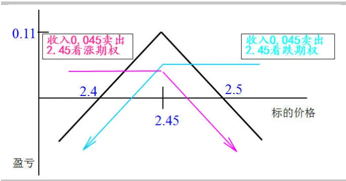
数据来源：华泰期货研究所

## 金融市场风险与 CTA 策略的收益偏好

CTA 管理期货一直以来以与股票、债券市场的低相关性作为对冲资产，在大类资产配置中起到重要作用。本文以分析沪深 300 指数的收益及波动率情况来判定金融市场的整体风险偏好，与 CTA 策略的收益进行对比。但因为国内市场 CTA 策略净值披露数据不一，阳光私募化时间较短，并没有合适的公开 CTA 策略市场基准，故本文利用 CTA 策略经典的趋势追踪策略－动量策略进行代替。

动量策略与沪深 300 数据样本摘自从 2007 月 1 月到 2011 年 12 月期间，以沪深 300 指数 5档日收益率排序观察 CTA 动量策略的收益分布及表现情况，即以 20%分位数分档；由图 10 可以明显看出，动量策略与沪深 300 的 5 档收益分布，明显呈凸性收益，即波动率越高，定义的市场风险越大，动量策略的收益越大，这特点与期权的买入跨式组合类似，如图 8 所示，所以市场上也称 CTA 策略为做多波动率策略；

图 10： 动量策略与沪深 300 平均日收益 单位：%
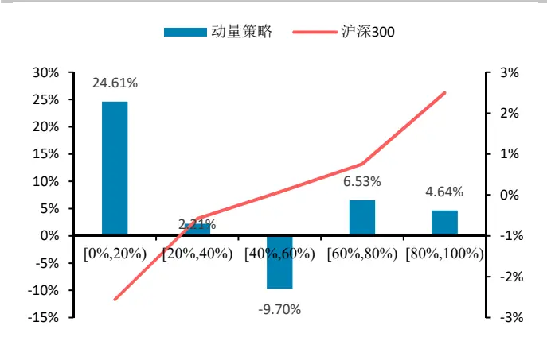
数据来源：wind 华泰期货研究所

图 11： 与沪深指数月波动率变化相关性 单位：%
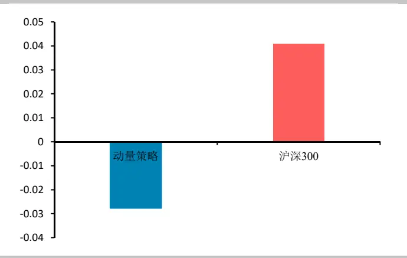
数据来源：wind 华泰期货研究所

但观察图 11，其实动量策略与沪深 300 指数波动率变化之间的相关性并不高，动量策略的收益并未随着波动率的增加而相应增长，这与市场称 CTA 策略为做多波动率策略的说法相违背。鉴此，本文再采取波动率周期分类的方法，分析不同波动率区间动量策略的收益。

## 不同周期的波动率上升对于 CTA 策略的影响

回顾前文，把波动率的周期分为由价格上涨带来波动率增加的正波动率周期和价格下跌带来波动率增加的负波动率周期。此处，沪深 300 指数的波动率按照如下划分：

（1） 正波动率周期－高波动率期：

90 日历史波动率〉90 日历史波动率均值+90 日历史波动率的 1 倍标准差且波动率上升为价格上涨所引起。

（2） 负波动率周期－高波动率期：

90日历史波动率〉90日历史波动率均值+90日历史波动率的 1倍标准差且波动率上升为价格下跌所引起。

（3）（1）（2）两者皆否

由图 12 发现，经过划分不同周期的高波动率区间，发现动量策略在正波动周期的高波动区间表现较差，平均年化收益亏损 10.60%，但在负波动周期区间的高波动率区间虽然取得正收益，但平均年化收益一般，只有 3.90%。而在整体策略收益中，有 21.26%的累计收益发生在非正负周期高波动率区间的内。

高波动率区间并未体现出以动量策略为代表的 CTA 策略优势，为进一步分析动量策略收益源，再次细分波动率区间来观察动量策略的收益情况，具体如图 13 所示：

图 12： 动量策略不同波动率区间年化单位：%
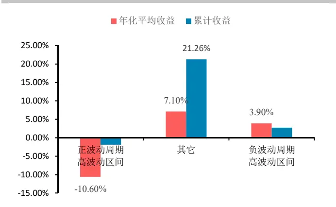
数据来源：wind 华泰期货研究所

图 13： 动量策略波动率区间年化收益 2 单位：%
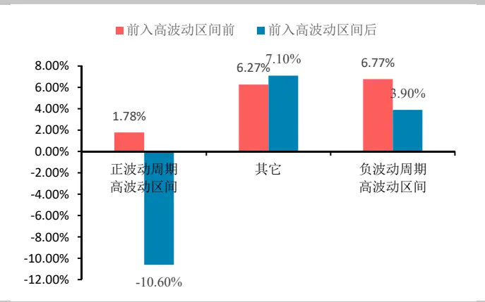
数据来源：wind 华泰期货研究所

进一步以高波动率区间界限细分为进入高波动率区间前、进入高波动率区间后，发现以前文所分类的正负波动率区间，两个区间段效果一致：在进入高波动率区间前，表现明显比进入高波动率区间后更好。

以 Kathryn M.Kaminski（2011）研究提出的正负波动率周期验证并解释，在正波动率区间开始上升期间，价格趋势受到投资者过份自信迅速上涨，CTA 策略的经典动量策略平均年化收益更好，且在正波动周期进行高波动区间后，市场很快面临价格反转或者跳转至负波动周期，所以价格趋势不明显，动量策略收益表现较差

在负波动率周期进入高波动率前，突发事件造成价格快速下跌，市场风险暴露，投资者投资行为反应敏感，进一步放大价格变化与市场风险，但商品市场与股票市场的低相关性，动量策略体现了良好地捕捉金融风险alpha收益的能力，但随后市场进入不确定性区间，动量策略收益同时下降。

## 利用波动率因子对 CTA 策略优化

因此，根据上文验证数据及定义的正负波动率周期，为更好地捕捉动量策略趋势，选择2010年1月至2017年 5月来进行择时优化样本外测试：

## （1） 正波动周期－市场情绪上升期：

特点：波动率下降、价格上升

$$
\begin{aligned}&HV_{90Days}<HV_{90Days-mean}-HV_{90Days-Std}\\&\\&Price_{now}>Price_{now-90Days}\\&\\&HV_{now}>HV_{90Days}\\\end{aligned}
$$

## （2） 正波动周期－市场情绪膨胀期末：

特点：波动率开始下降、价格反转

$$
\begin{aligned}&HV_{90Days}>HV_{90Days-mean}+HV_{90Days-Std}\\&\\&Price_{now}<Price_{now-90day}\\&\\&HV_{now}<HV_{90Days}\\\end{aligned}
$$

（3） 负波动周期－过波反应期：

特点：波动率开始上升，价格下降

$$
\begin{aligned}&HV_{90Days}<HV_{90Days-mean}+HV_{90Days-Std}\\&\\&Price_{now}<Price_{now-90day}\\\end{aligned}
$$

图 14： 动量策略收益净值图
单位：净值
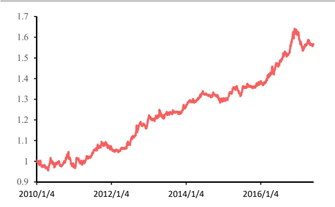

图 15： 动量策略优化后收益净值图单位：净值
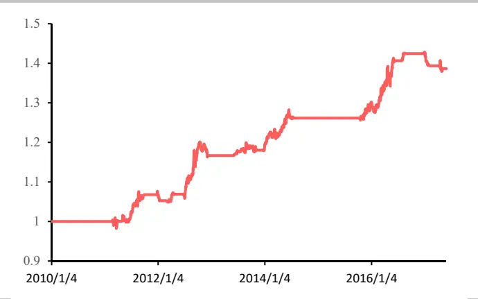
数据来源：wind 华泰期货研究所
数据来源：wind 华泰期货研究所

| 年化收益 | 7.88% | 5.38% |
| --- | --- | --- |
| 最大回撤 | 9.43% | 3.58% |
| 年化标准差 | 6.54% | 3.92% |
| 收益风险比1.19 1.37(年化收益/年化标准差) |  |  |

数据来源：华泰期货研究所

原动量策略与优化后的动量策略计算收益不采用杠杆，经过优化后，动量策略收益略微从原年化收益的 7.88%下降至 5.38%，但是最大回撤从 9.43%降低至 3.58%，年化标准差同时大幅度减小，由 6.54%减少至 3.92%，且观察策略净值图，发现其间有部分空仓时间，实际操作中可进行固定收益增强操作，使实际收益进一步加强。

本文利用波动率因子不同周期的表现情况对CTA 的经典代表策略－动量策略进行分析及优化择时，从样本外的测试结果来看，达到预期优化效果，良好地控制动策策略在牛熊市场转换间的风险回撤及利用不同波动率区间的价格特点，优化了收益风险比。

## 免责声明

此报告并非针对或意图送发给或为任何就送发、发布、可得到或使用此报告而使华泰期货有限公司违反当地的法律或法规或可致使华泰期货有限公司受制于的法律或法规的任何地区、国家或其它管辖区域的公民或居民。除非另有显示，否则所有此报告中的材料的版权均属华泰期货有限公司。未经华泰期货有限公司事先书面授权下，不得更改或以任何方式发送、复印此报告的材料、内容或其复印本予任何其它人。所有于此报告中使用的商标、服务标记及标记均为华泰期货有限公司的商标、服务标记及标记。

此报告所载的资料、工具及材料只提供给阁下作查照之用。此报告的内容并不构成对任何人的投资建议，而华泰期货有限公司不会因接收人收到此报告而视他们为其客户。

此报告所载资料的来源及观点的出处皆被华泰期货有限公司认为可靠，但华泰期货有限公司不能担保其准确性或完整性，而华泰期货有限公司不对因使用此报告的材料而引致的损失而负任何责任。并不能依靠此报告以取代行使独立判断。华泰期货有限公司可发出其它与本报告所载资料不一致及有不同结论的报告。本报告及该等报告反映编写分析员的不同设想、见解及分析方法。为免生疑，本报告所载的观点并不代表华泰期货有限公司，或任何其附属或联营公司的立场。

此报告中所指的投资及服务可能不适合阁下，我们建议阁下如有任何疑问应咨询独立投资顾问。此报告并不构成投资、法律、会计或税务建议或担保任何投资或策略适合或切合阁下个别情况。此报告并不构成给予阁下私人咨询建议。

华泰期货有限公司2016版权所有。保留一切权利。

## 公司总部

地址：广州市越秀区东风东路761号丽丰大厦20层

电话：400-6280-888

网址：www.htgwf.com