## CTA 量化策略因子系列（二）：动量因子

华泰期货研究所 量化组

罗剑

量化组组长

## 报告摘要：

动量策略是基于标的资产价格的动量效应而设计的交易策略，即预先对资产的动量因子设定过滤准则，当资产过去一段时间的收益满足过滤准则就买入或卖出相应资产的投资策略。动量效应(Momentum Effect)又称"惯性效应"，指资产价格具有延续原来运动方向的趋势，也就是说，过去一段时间收益较高的资产在未来仍将会获得的较高的收益，因此投资者可以通过购买历史表现好的资产、卖出表现差的资产，获得低成本的超额收益。

- luojian@htfc.com

从业资格号：F3029622

投资咨询号：Z3012106

动量效应打破了有效市场假说，曾被认为是一种市场“异常”，但随后，越来越多的股票市场和其他类型的交易市场（如期货市场）都被证明存在动量效应。且动量因子作为 CTA 量化策略追踪趋势的主要因子之一，本文将基于我国商品期货市场上的动量效应，设计不同动量因子、不同期限组合以及不同时间段的动量策略，分析这些策略的适用性和稳定性，并进行参数优化和组合。

最后，进行多周期动量因子策略的组合，并利用剔除部分与其它周期相关性较高的组合，选择 10 组不同回溯期、持有期的横截面动量因子策略进行等权、等波动率策略组合。根据测试结果显示，能有效避免单周期或最优参数在不同时间表现不稳定的情况，同时能把握整体动量因子带来的收益，降低了组合策略风险及回撤。

## 1. 数据选择与处理

## 1.1 品种选择

选择在上海期货交易所、大连商品交易所和郑州商品交易所上市交易的全部46个品种进行交易，按照 Wind 商品指数的划分标准，可将这些品种分为谷物、油脂油料、软商品、农副产品、有色、贵金属、煤焦钢矿、非金属建材、能源和化工 10类，具体的品种如下表所示。

表 1: 动量策略商品品种选择

| 类别 具体品种 |  |
| --- | --- |
| 谷物 | 玉米、玉米淀粉、粳稻、早籼稻、晚籼稻、普麦、强麦 |
| 油脂油料 | 豆一、豆二、豆粕、豆油、棕榈油、菜油、菜粕、菜籽 |
| 软商品 | 郑糖、棉花 |
| 农副产品 | 鸡蛋 |
| 有色 | 沪铜、沪铝、沪锌、沪铅、沪镍、沪锡 |
| 贵金属 | 沪金、沪银 |
| 煤焦钢矿 | 螺纹钢、热轧卷板、线材、铁矿石、硅铁、锰铁、焦煤、焦炭、 |
| 非金属建材 | 胶合板、纤维板、PVC、玻璃 |
| 能源 | 燃油、动力煤 |
| 化工 橡胶、PTA、聚丙烯、塑料、沥青、甲醇 |  |

数据来源：华泰期货研究所

不同品种的流动性差异很大，如果在构建组合时选择了流动较差的品种，则在实际交易时会产生较大的冲击成本，所以应该在建仓时对合约的流动性进行筛选。具体做法是：

1）计算各品种主力合约过去 60 天平均成交金额的时间序列；

2）在建仓日，计算当日各合约成交金额的40分位点，以此为筛选标准；

3）在建仓时，剔除掉平均成交金额小于 40 分位点的合约；

## 1.2 合约选择

在合约选择上，考虑到不同月份合约市场活跃度和参与度的不同，只选择各品种的主力合约进行交易，并选择主力合约的结算价进行计算。为降低主力合约在换约时产生的跳价影响，对主力合约的结算价进行如下处理：

1)当合约持仓量连续两天最大时定义为新主力合约，开始进入为期两天的换约期；

2）换约期第一天的结算价=旧主力合约当天结算价*2/3+新主力合约当天结算价*1/3；

3）换约期第二天的结算价=旧主力合约当天结算价*1/3+新主力合约当天结算价*2/3；

4）换约期第三天的结算价=新主力合约当天结算价；

## 1.3 测试时间

测试时间从 2010 年 1 月开始到 2017 年 8 月结束。因为 2015 年 6 月以后，很多品种相继推出了夜盘交易，使得市场上的投资者结构和交易策略发生明显改变，因此将 2015 年 6月设为一个断点，分别测试动量策略在夜盘上市前后的表现时。另外，根据Wind商品指数(CCFI)周线 MA20，选出期货市场表现为牛市和熊市的时间段（时间长度约为 1 年），测试动量策略在不同市场行情下的表现。具体的测试周期如下表：

表 2: 动量策略回测周期选择

| 时段 | 起始时间 | 终止时间 |
| --- | --- | --- |
| 全时段 | 2010.1.1 | 2017.8.31 |
| 夜盘上市前 | 2010.1.1 | 2015.5.31 |
| 夜盘上市后 | 2015.6.1 | 2017.8.31 |
| 牛市 | 2015.12.1 | 2016.11.1 |
| 熊市 | 2011.3.1 | 2012.2.1 |

数据来源：华泰期货研究所

图 1: 根据wind指数周线选出牛市和熊市

| 分时 多日 Tick 1分 5分 15分 30分 60分 日 周月 更多 复权叠加画线工具 |  |
| --- | --- |
| 2017/09/25 收1075.62 幅0.33%(3.49)开1076.52高1081.31 低1064.74结0.00 仓0量2441万增0振1.55% |  |
| CCFI.WI[Wind商品指数]周线MA20:1053.24 1733.50 | 2010/04/16-2017/09/25(384周) |
| 熊市 |  |
| 61 |  |

数据来源：Wind 华泰期货研究所

## 2. 策略方法

## 2.1 策略原理

期货市场的动量效应以两种形式存在，一种是时间序列动量，另一种是面板动量。根据这两种不同的动量形式，设计对应的时间序列动量策略和面板动量策略。这两种策略考察的动量因子都是过去一段时间的平均收益率，但是在建仓时，面板动量策略将各合约按照平均收益率从高到低进行排序，选择排名靠前的10%合约做多，排名靠后的10%合约做空；时间序列动量策略则是做多平均收益率为正的合约，做空平均收益率为负的合约。建仓后，持有合约组合至下一个建仓日平仓。

## 2.2 参数设定

该策略涉及的参数主要有回溯期和持有期。回溯期指计算动量因子的时间长度，用 R表示，代表建仓日前一天开始向前推 R天，计算这R天的平均收益率；持有期指建仓后持有组合的时间长度，用H表示，代表每隔H天建仓，持有组合至下个建仓日。回溯期和持有期的取值范围均是 5 天、10 天、22 天、60 天、120 天和 250 天，用（R，H）表示，共 36个组合如下表所示。

表 3: 动量策略持有期、回溯期组合

| (R,H) | 回溯期，R |  |  |  |  |  |  |
| --- | --- | --- | --- | --- | --- | --- | --- |
|  |  | 5 | 10 | 20 | 60 | 120 | 240 |
|  | 5 | (5,5) | (10,5) | (22,5) | (60,5) | (120,5) | (240,5) |
| 持有 | 10 | (5,10) | (10,10) | (22,10) | (60,10) | (120,10) | (240,10) |
| 期 | 22 | (5,22) | (10,22) | (22,20) | (60,22) | (120,22) | (240,22) |
| ， | 60 | (5,60) | (10,60) | (22,60) | (60,60) | (120,60) | (240,60) |
| H | 120 | (5,120) | (10,120) | (22,120) | (60,120) | (120,120) | (240,120) |
|  | 240 | (5,240) | (10,240) | (22,240) | (60,240) | (120,240) | (240,240) |

数据来源：华泰期货研究所

## 2.3 入场时间

动量策略的本质是根据过去对未来进行选择，所以当回溯期较短时，捕捉到市场信号会对市场行情较为敏感，也就是说，动量策略效果会因入场时间不同而有不同的表现。下图是面板动量策略在2010.1.1-2017.8.31期间，不同进场时间的测试结果，回溯期和持有期均为10天。从图中可以看出，延迟0天和延迟10天入场的策略表现有明显的不同。

图 2: 面板动量策略不同进场时间的测试结果
单位：净值
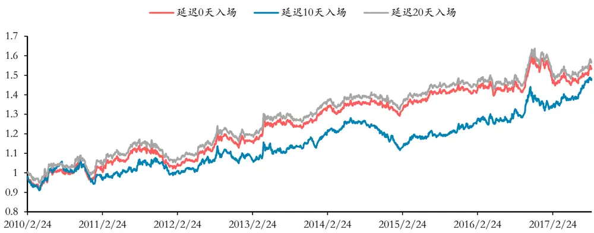
数据来源：华泰期货研究所

为了消除入场时间对策略结果的影响，对入场时间和下单情况进行如下处理：假设持有期为 H，在持有期内每天滚动下单 1/H的仓位。

## 2.4 资金分配

交易成本：所有品种按单边万分之五计算；

杠杆：使用 1 倍杠杆；

权重：多空组合中各合约等权重；

## 3. 评价体系

$$
年化收益率=策略最终净值^{250/N}-1\quad(N:测试周期内天数)
$$

夏普比率(Sharpe) =年化收益率/年化标准差 （年化标准差：日收益率标准差*√250）

最大回撤=1-当天净值/累积最大净值/

卡尔马比率(Calmar) =年化收益率/最大回撤

## 4. 回测结果

下表展示了不同时段策略组合的夏普比率，从表中可以看出夜盘的推出对动量策略的效果产生影响：夜盘推出后，动量策略增强，尤其是持有期为一年的组合，夏普比率明显提高。另外，动量策略在牛市和熊市中的表现也有较为明显的分化：无论是哪一种持有期、回溯期组合，牛市中的动量策略表现均优于熊市，并且在熊市中大多数组合都呈现负收益。本

2017-09-25

文选取的牛熊市分界为市场反转初期阶段，所以可见动量策略在市场发生强烈反转的时候表现一般，可参考之前报告《CTA 量化策略因子系列（一）：波动率因子》，在 2016 年底，市场反正强烈反转时，价格变化与波动率降低会导致动量策略整体收益下降。

图3: 两种动量策略回测结果

| 夏普比率 |  | 面板动量策略 |  |  |  |  |  | 时间序列策略 |  |  |  |  |  |
| --- | --- | --- | --- | --- | --- | --- | --- | --- | --- | --- | --- | --- | --- |
| 时间段 | HR | 5 | 10 | 22 | 60 | 120 | 250 | 5 | 10 | 22 | 60 | 120 | 250 |
| 全时段2010.1.1-2017.8.31 | 5 | 0.2422 | 0.8446 | 0.6028 | 0.3564 | 0.5585 | 1.0871 | 0.2885 | 1.1157 | 0.7772 | 0.4777 | 0.5457 | 0.7221 |
|  | 10 | 0.8588 | 0.8532 | 0.5221 | 0.2580 | 0.3765 | 0.9553 | 1.0809 | 0.9048 | 0.6019 | 0.3995 | 0.2240 | 0.5010 |
|  | 22 | 0.6889 | 0.6919 | 0.5187 | 0.2262 | 0.3261 | 0.8406 | 0.6921 | 0.6606 | 0.6073 | 0.3335 | 0.1750 | 0.5025 |
|  | 60 | 0.3124 | 0.3701 | 0.1759 | 0.1332 | 0.2017 | 0.7787 | 0.5534 | 0.6916 | 0.6211 | 0.1448 | 0.0759 | 0.3916 |
|  | 120 | 0.3020 | 0.3796 | 0.2960 | 0.4366 | 0.8923 | 0.9300 | 0.3523 | 0.2676 | 0.2870 | 0.2903 | 0.7025 | 0.6885 |
|  | 250 | 0.9041 | 0.9311 | 0.8423 | 0.8512 | 0.8991 | 0.8708 | 0.8705 | 0.9269 | 0.8308 | 0.7977 | 0.5924 | 0.2383 |
| 夜盘上市前 | 5 | 0.1723 | 0.6384 | 0.3186 | 0.4997 | 0.5429 | 0.8417 | 0.5087 | 1.2362 | 0.4423 | 0.3555 | 0.4035 | 0.5385 |
|  | 10 | 0.7636 | 0.6848 | 0.4203 | 0.4364 | 0.4530 | 0.7652 | 1.1667 | 0.7600 | 0.3646 | 0.2295 | -0.0160 | 0.2310 |
|  | 22 | 0.3338 | 0.3317 | 0.3476 | 0.4248 | 0.4160 | 0.6770 | 0.3834 | 0.3665 | 0.3236 | 0.1150 | 0.0145 | 0.3162 |
| 2010.1.1- | 60 | 0.3462 | 0.4404 | 0.3556 | 0.2353 | 0.2371 | 0.6016 | 0.2434 | 0.4015 | 0.3723 | -0.1294 | -0.1755 | 0.2962 |
| 2015.6.1 | 120 | 0.0804 | 0.2055 | 0.2663 | 0.3509 | 0.6154 | 0.6432 | 0.1903 | 0.1021 | 0.1950 | 0.2415 | 0.4328 | 0.7293 |
|  | 250 | 0.8685 | 0.8690 | 0.7507 | 0.6551 | 0.6453 | 0.7765 | 0.7540 | 0.8116 | 0.7311 | 0.6607 | 0.6730 | 0.5447 |
| 夜盘上市后 | 5 | 0.4259 | 1.4166 | 1.3569 | 0.2017 | 0.7664 | 1.6795 | -0.1678 | 0.8127 | 1.3994 | 0.7713 | 0.6661 | 0.8228 |
|  | 10 | 1.1840 | 1.3361 | 0.8195 | -0.0528 | 0.2710 | 1.4311 | 0.9000 | 1.2657 | 1.0950 | 0.8110 | 0.5795 | 0.7013 |
|  | 22 | 1.7333 | 1.7031 | 0.9452 | -0.1874 | 0.2920 | 1.3088 | 1.4547 | 1.3539 | 1.3146 | 0.8757 | 0.5587 | 0.4567 |
| 2015.6.1- | 60 | 0.2465 | 0.2333 | -0.1799 | -0.1484 | 0.1967 | 1.1918 | 1.3200 | 1.3896 | 1.1892 | 0.6629 | 0.3793 | 0.1882 |
| 2017.8.31 | 120 | 0.8226 | 0.7788 | 0.3495 | 0.5220 | 1.4066 | 1.4722 | 0.7871 | 0.6916 | 0.4660 | 0.2597 | 0.8247 | 0.3214 |
|  | 250 | 0.9782 | 1.0716 | 1.0568 | 1.1932 | 1.3051 | 1.0329 | 1.1691 | 1.1911 | 1.0143 | 0.9314 | 0.0147 | -0.7826 |
| 牛市2015.12.1-2016.11.1 | 5 | 1.5384 | 2.9901 | 2.6133 | 1.1478 | 2.2804 | 3.0010 | 0.9731 | 1.1638 | 1.4110 | 1.1604 | 2.2041 | 3.1968 |
|  | 10 | 2.8251 | 2.9579 | 2.3673 | 0.8200 | 2.1063 | 2.9311 | 1.2841 | 1.2056 | 1.1272 | 1.1909 | 2.1742 | 3.0665 |
|  | 22 | 3.3739 | 3.3381 | 1.6676 | 0.3078 | 1.4474 | 2.3938 | 1.3627 | 1.2544 | 1.0431 | 1.4275 | 2.4790 | 2.9636 |
|  | 60 | 1.3670 | 0.9890 | 0.4966 | 0.3209 | 1.2796 | 1.8728 | 1.2243 | 1.4137 | 1.8040 | 1.5751 | 2.2025 | 2.5770 |
|  | 120 | 1.6311 | 1.7668 | 1.1999 | 1.5289 | 2.6756 | 2.8053 | 1.6958 | 1.5894 | 1.3391 | 0.9004 | 1.5901 | 1.4879 |
|  | 250 | 1.5878 | 1.3102 | 0.8457 | 0.6796 | 1.5663 | 1.2133 | -0.1176 | -0.2687 | -0.5000 | -0.5346 | -0.6300 | -1.3669 |
| 熊市2011.3.1-2012.2.1 | 5 | -1.4870 | -0.3047 | -1.1374 | -0.6580 | -0.6844 | -0.2074 | -0.6800 | 0.8253 | -1.2399 | -2.9027 | -1.2325 | -1.2033 |
|  | 10 | 0.5561 | 0.4241 | -0.2285 | -0.3121 | -0.1568 | -1.0045 | 0.7347 | -0.7290 | -1.3786 | -1.6587 | -1.0203 | -0.5538 |
|  | 22 | -0.7218 | -0.4432 | -0.3527 | -0.3687 | -0.7586 | -0.8456 | -0.9242 | -1.0672 | 0.1574 | -0.5133 | 0.6435 | 0.2139 |
|  | 60 | -1.2512 | -1.0492 | -1.0130 | -1.0820 | -0.8758 | -0.5548 | -0.8770 | -0.4079 | -0.2041 | -0.3890 | 0.5685 | -0.0376 |
|  | 120 | -1.5675 | -1.2309 | -0.8141 | -0.3117 | -0.3743 | -0.3984 | 0.1992 | -0.0892 | -0.1781 | 0.2633 | -0.2661 | -0.8170 |
|  | 250 | -0.4672 | -0.4007 | -0.5211 | -0.5456 | -0.5166 | -0.4024 | -1.3181 | -1.4865 | -1.7960 | -2.0585 | -1.4880 | -1.1821 |

数据来源：华泰期货研究所

在不同的回测周期下，选择表现最好的一组持有期，画出两种动量策略的净值曲线进行比较，选出最佳参数组合，计算策略评价参数。

4.1 全时段：2010 年 1 月 1 日至 2017 年 8 月 31 日

图 4：全时段面板动量策略净值(R=250) 单位：净值
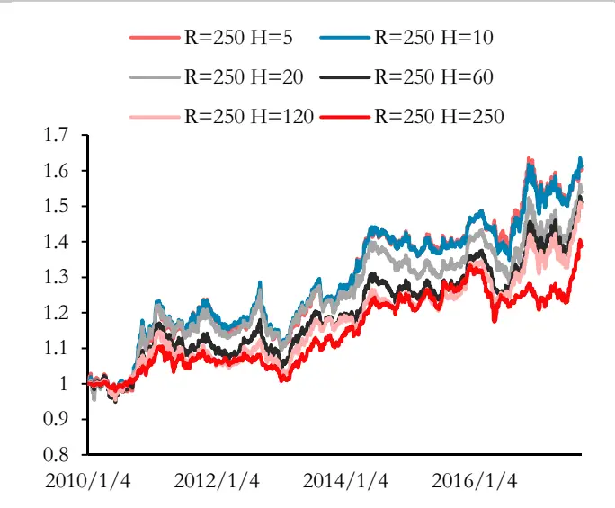
数据来源：华泰期货研究所

图 5：全时段时间序列策略净值(R=10)单位：净值
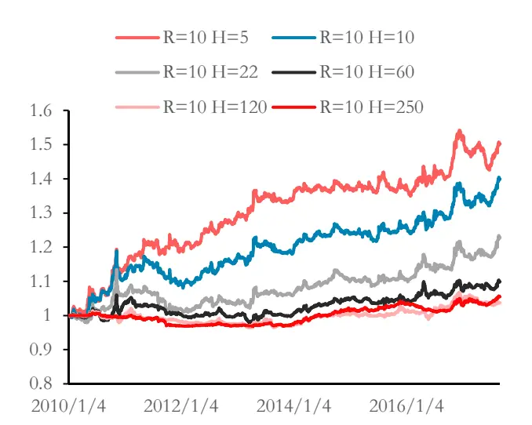
数据来源：华泰期货研究所

表 4：全时段面板动量策略最佳参数组合

| 2010.1.1-2017.8.31 | H | 10 |
| --- | --- | --- |
| 全时段 | R | 250 |
| 最大回撤 |  | 14.19% |
| 平均年化收益率 |  | 6.64% |
| 标准差 |  | 7.13% |
| 夏普比率 |  | 0.9311 |
| 卡尔马比率 |  | 0.4680 |

数据来源：华泰期货研究所

表 5：全时段时间序列策略最佳参数组合

|  |  | 5 |
| --- | --- | --- |
| 2010.1.1-2017.8.31 | H |  |
| 全时段 | R | 10 |
| 最大回撤 |  | 7.58% |
| 平均年化收益率 |  | 5.61% |
| 标准差 |  | 5.19% |
| 夏普比率 |  | 1.0809 |
| 卡尔马比率 |  | 0.7394 |

数据来源：华泰期货研究所

4.2 夜盘上市前：2010 年 1 月 1 日至 2015 年 5 月 31 日

图 6：夜盘上市前面板动量策略净值(R=250)
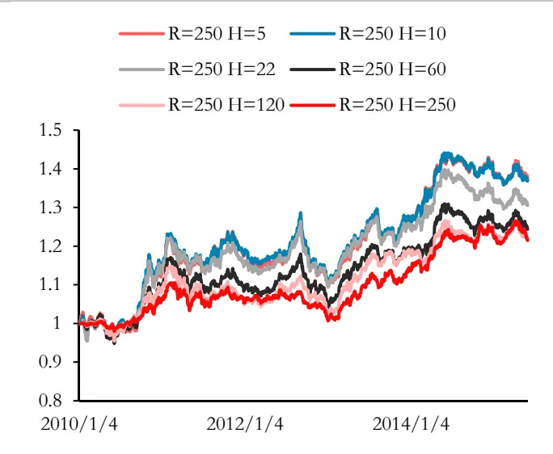
数据来源：华泰期货研究所

图 7：夜盘上市前时间序列策略净值(R=10)
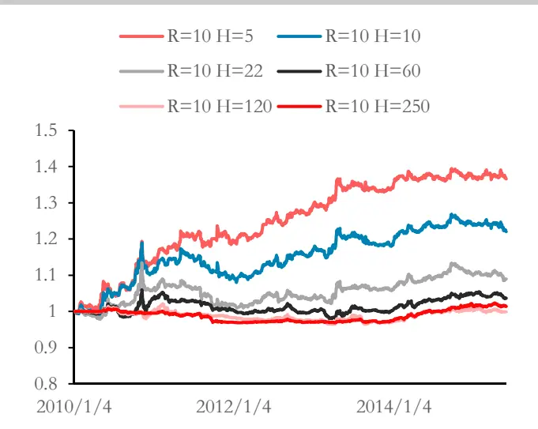
数据来源：华泰期货研究所

表 6：夜盘上市前面板动量策略最佳参数组合

| 2010.1.1-2015.6.1 | H 10 |
| --- | --- |
| 夜盘上市前 | R 250 |
| 最大回撤 | 14.19% |
| 平均年化收益率 | 6.18% |
| 标准差 | 7.11% |
| 夏普比率 | 0.8690 |
| 卡尔马比率 | 0.4352 |

数据来源：华泰期货研究所

表 7：夜盘上市前时间序列策略最佳参数组合

| 2010.1.1-2015.6.1 | H | 5 |
| --- | --- | --- |
| 夜盘上市前 | R | 10 |
| 最大回撤 |  | 5.75% |
| 平均年化收益率 |  | 6.13% |
| 标准差 |  | 5.25% |
| 夏普比率 |  | 1.1667 |
| 卡尔马比率 |  | 1.0661 |

数据来源：华泰期货研究所

4.3 夜盘上市后：2015 年 6 月 1 日至 2017 年 8 月 31 日

图 8：夜盘上市后面板动量策略净值(R=22)
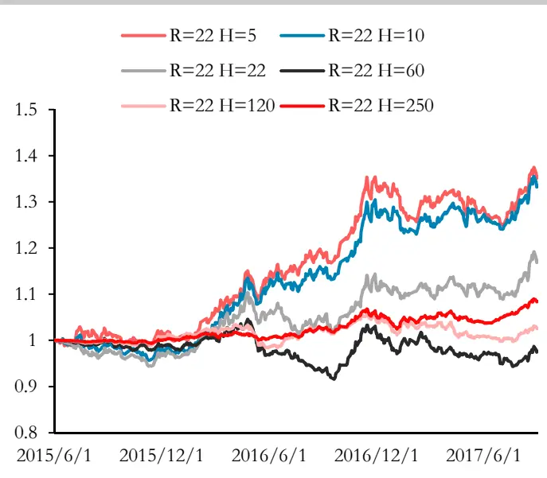
数据来源：华泰期货研究所

图 9：夜盘上市后时间序列策略净值(R=22)
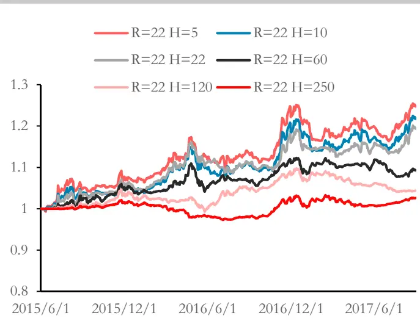
数据来源：华泰期货研究所

表 8：夜盘上市后面板动量策略最佳参数组合

| 2015.6.1-2017.8.31 | H 5 |
| --- | --- |
| 夜盘上市后 R | 22 |
| 最大回撤 | 7.73% |
| 平均年化收益率 | 14.72% |
| 标准差 | 8.49% |
| 夏普比率 | 1.7333 |
| 卡尔马比率 | 1.9032 |

数据来源：华泰期货研究所

表 9：夜盘上市后时间序列策略最佳参数组合

| 2015.6.1-2017.8.31 | H | 5 |
| --- | --- | --- |
| 夜盘上市后 | R | 22 |
| 最大回撤 |  | 7.03% |
| 平均年化收益率 |  | 10.52% |
| 标准差 |  | 7.23% |
| 夏普比率 |  | 1.4547 |
| 卡尔马比率 |  | 1.4953 |

数据来源：华泰期货研究所

4.4 牛市：2015 年 12 月 1 日至 2017 年 11 月 1 日

图 10：牛市面板动量策略净值(R=22)
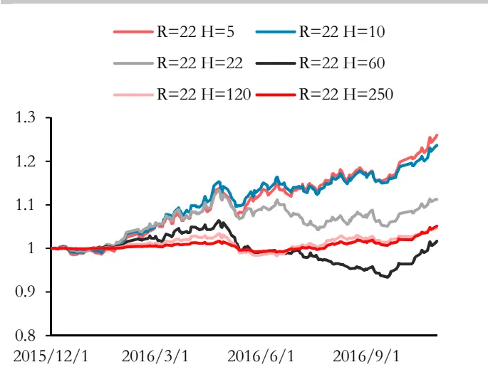
数据来源：华泰期货研究所

图 11：牛市时间序列策略净值(R=22)
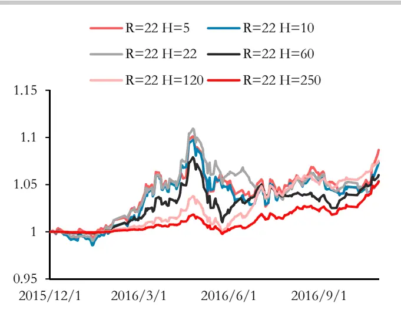
数据来源：华泰期货研究所

表 10：牛市面板动量策略最佳参数组合

| 2015.12.1-2016.11.1 | H | 5 |
| --- | --- | --- |
| 牛市 | R | 22 |
| 最大回撤 |  | 5.68% |
| 平均年化收益率 |  | 29.39% |
| 标准差 |  | 8.71% |
| 夏普比率 |  | 3.3739 |
| 卡尔马比率 |  | 5.1762 |

数据来源：华泰期货研究所

表 11：牛市时间序列策略最佳参数组合

| 2015.12.1-2016.11.1 | H | 250 |
| --- | --- | --- |
| 牛市 | R | 22 |
| 最大回撤 |  | 2.02% |
| 平均年化收益率 |  | 5.95% |
| 标准差 |  | 2.01% |
| 夏普比率 |  | 2.9636 |
| 卡尔马比率 |  | 2.9480 |

数据来源：华泰期货研究所

4.5 熊市：2011 年 3 月 1 日至 2012 年 2 月 1 日

图 12：熊市面板动量策略净值(R=60)
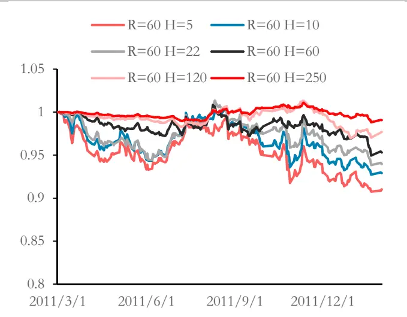
数据来源：华泰期货研究所

图 13：熊市时间序列策略净值(R=250)
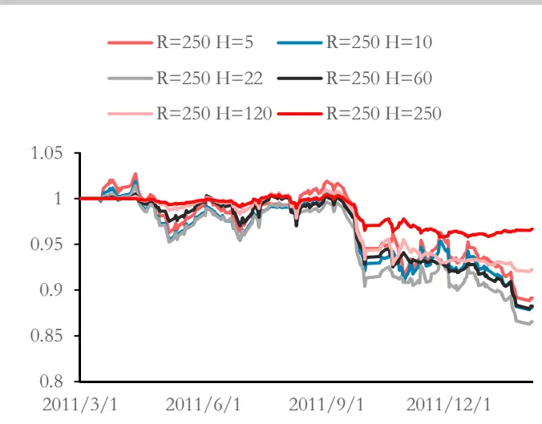
数据来源：华泰期货研究所

表 12：熊市面板动量策略最佳参数组合

| 2011.5.1-2016.2.1 | H | 5 |
| --- | --- | --- |
| 熊市 | R | 60 |
| 最大回撤 |  | 9.64% |
| 平均年化收益率 |  | -10.62% |
| 标准差 |  | 8.49% |
| 夏普比率 |  | -1.2512 |
| 卡尔马比率 |  | -1.1019 |

数据来源：华泰期货研究所

表 13：熊市时间序列策略最佳参数组合

| 2011.5.1-2016.2.1 | H | 60 |  |
| --- | --- | --- | --- |
|  |  |  | 250 |
| 熊市 最大回撤 | R | 12.48% |  |
| 平均年化收益率 |  |  |  |
|  |  | -12.97% |  |
| 标准差 |  | 6.30% |  |
| 夏普比率 |  | -2.0585 |  |
| 卡尔马比率 |  | -1.0390 |  |

数据来源：华泰期货研究所

## 5. 策略组合

无论面板动量与时间序列动量策略，在本文设定的不同市场环境周期的表现结果看，未没有固定的最优参数回溯期与持有期，如果持续沿用一种固定周期，可能会承受动量因子周期性显著的特性，承受动量因子短暂失效的压力，因此下文将不同周期的动量因子策略进行组合，以面板动量因子为例测试组合效果。

## 5.1 多周期组合面板动量因子策略的表现

尝试将不同回溯周期与持有周期的面板动量因子进行组合，整体表现一般，组合的年化收益只有3.65%、最大回撤达到6.25%，年化波动4.24%，夏普比率 0.86。

图 14: 2010 年 1 月至 2017 年 8 月面板动量因子策略等权组合净值图
单位：净值
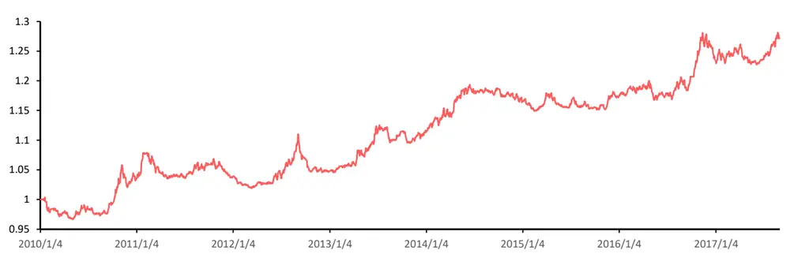
数据来源：华泰期货研究所

## 5.2 各横截面动量因子组合收益情况和相关性表现不同

由于各横截面动量因子策略组合间的相关性不同，存在冗余周期，不同组合间的相关性对于多周期动量因子组合策略存在一定影响。以 2010年 1月至 2015年5月作为样本，由表1的动量因子策略不同组合的相关性矩阵发现，各周期策略的相关性确实互有高低。

图 15：2010 年 1 月至 2015 年 5 月动量因子策略的各回溯周期与持有周期组合相关性矩阵
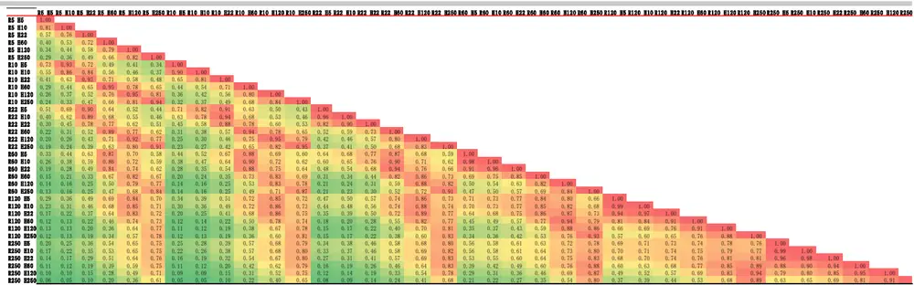
数据来源：华泰期货研究所

不同回溯、持有周期的动量因子策略共36种组合，两两相关性大于 0.5有 420对组合，相关性大于0.9的也有71组合。由图1各动量因子策略组合与其它组合的平均相关性观察，尝试剔除相关性大于0.5的组合，以减小动量因子多周期组合的相关性，获得不同周期动量因子贡献同时，亦可平滑整体资金曲线。

2017-09-25

因此，由上述标准选择出以下回溯、持有周期 10 个组合：R=5 H=5，R=5 H=10，R=5H=22，R=10 H=5，R=10 H=10，R=10 H=22，R=22 H=5，R=22 H=10，R=250 H=120，R=250H=250 （R＝回溯周期，H＝持有周期）。

图 16：各动量因子策略组合平均相关性
单位：%
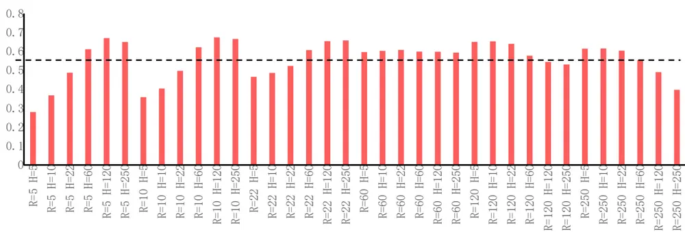
数据来源：华泰期货研究所

## 5.3 剔除部分相关性的样本外测试

经上文保留由样本内相关性确定的 10 个不同回溯期、持有期的横截面动量因子组合。进行样本外测试，看是否有效剔除了冗余动量周期组合。除了进行剔除部分相关性与全周期等权组合对比，也加入按等波动率分配权重的组合对比。

图 17：2015 年 6 月至 2017 年 8 月横截面动量因子策略等权组合净值图
单位：净值
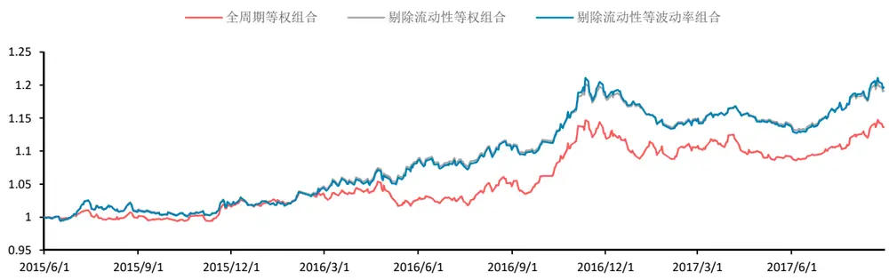
数据来源：华泰期货研究所

由图 3 可以发现，剔除相关性后等波动率组合与等权组合表现优于全周期等权组合，年化收益从 6.17%提高到 8.12%和 8.65%，年化波动率也从 6.4%降低至 5.12%和 5.28%，夏普比率从 0.96，分别提高至 1.59与1.64。

表 14：2015 年 6 月至 2017 年 8 月动量因子组合表现情况

|  | R=5H=5 | R=5H=10 | R=5H=22 | R=10H=5 | R=10H=10 | R=10H=22 | R=22H=5 | R=22H=10 | R=250H=120 | R=250H=250 | 剔除流动性等波动率组合 | 剔除流动性等权组合 | 全周期等权组合 |
| --- | --- | --- | --- | --- | --- | --- | --- | --- | --- | --- | --- | --- | --- |
| 年化收益 | 11.37% | 7.64% | 4.62% | 11.92% | 9.45% | 6.96% | 7.73% | 5.72% | 11.82% | 9.74% | 8.12% | 8.65% | 6.17% |
| 最大回撤 | 3.21% | 8.19% | 6.27% | 9.42% | 9.94% | 5.15% | 14.72% | 13.96% | 10.69% | 6.56% | 6.87% | 5.89% | 5.32% |
| 年化波动率 | 7.54% | 5.78% | 4.62% | 7.96% | 7.44% | 6.28% | 8.49% | 8.19% | 8.19% | 6.35% | 5.12% | 5.28% | 6.40% |
| 夏普比率 | 0.43 | 1.42 | 1.36 | 1.18 | 1.34 | 0.82 | 1.73 | 1.70 | 1.31 | 1.03 | 1.59 | 1.64 | 0.96 |
| 卡尔玛比率 | 3.54 | 0.93 | 0.74 | 1.27 | 0.95 | 1.35 | 0.53 | 0.41 | 1.11 | 1.49 | 1.18 | 1.47 | 1.16 |

数据来源：华泰期货研究所

横截面动量因子固定回溯周期策略在不同周期表现不稳定，由图 4、5 中发现，选取2015 年 6 月至 2017 年 8 月表现最好的 R=5 H=22, R=10 H=22 组合，在 2010 年 1 月至 2015年 5 月期间表现较差，夏普比率只有 0.74 和 0.95。采取剔除部分相关性的多周期组合策略，可以避免利用单周期或最优参数在不同时间表现不稳定的情况。

图 18：2010 年 1 月至 2015 年 5 月组合表现 单位：%
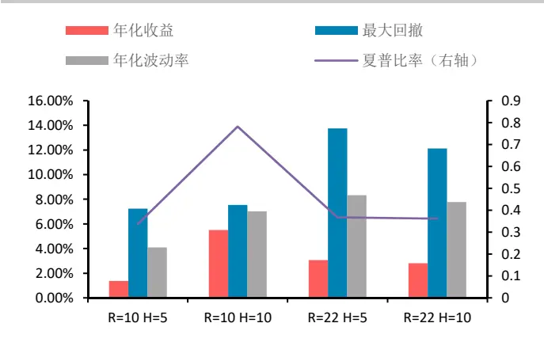
数据来源：华泰期货研究所

图 19：2015 年 6 月至 2017 年 8 月组合表现 单位：%
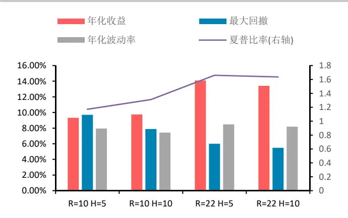
数据来源：华泰期货研究所

从总体横截面动量因子策略组合表现情况看，达到了既定优化效果，相比单回溯周期与持有周期的动量因子策略，等权组合把握动量因子带来的收益，降低了策略风险，同时保持策略在不同周期的稳定性。

## 免责声明

此报告并非针对或意图送发给或为任何就送发、发布、可得到或使用此报告而使华泰期货有限公司违反当地的法律或法规或可致使华泰期货有限公司受制于的法律或法规的任何地区、国家或其它管辖区域的公民或居民。除非另有显示，否则所有此报告中的材料的版权均属华泰期货有限公司。未经华泰期货有限公司事先书面授权下，不得更改或以任何方式发送、复印此报告的材料、内容或其复印本予任何其它人。所有于此报告中使用的商标、服务标记及标记均为华泰期货有限公司的商标、服务标记及标记。

此报告所载的资料、工具及材料只提供给阁下作查照之用。此报告的内容并不构成对任何人的投资建议，而华泰期货有限公司不会因接收人收到此报告而视他们为其客户。

此报告所载资料的来源及观点的出处皆被华泰期货有限公司认为可靠，但华泰期货有限公司不能担保其准确性或完整性，而华泰期货有限公司不对因使用此报告的材料而引致的损失而负任何责任。并不能依靠此报告以取代行使独立判断。华泰期货有限公司可发出其它与本报告所载资料不一致及有不同结论的报告。本报告及该等报告反映编写分析员的不同设想、见解及分析方法。为免生疑，本报告所载的观点并不代表华泰期货有限公司，或任何其附属或联营公司的立场。

此报告中所指的投资及服务可能不适合阁下，我们建议阁下如有任何疑问应咨询独立投资顾问。此报告并不构成投资、法律、会计或税务建议或担保任何投资或策略适合或切合阁下个别情况。此报告并不构成给予阁下私人咨询建议。

华泰期货有限公司2016版权所有。保留一切权利。

## 公司总部

地址：广州市越秀区东风东路761号丽丰大厦20层

电话：400-6280-888

网址：www.htgwf.com