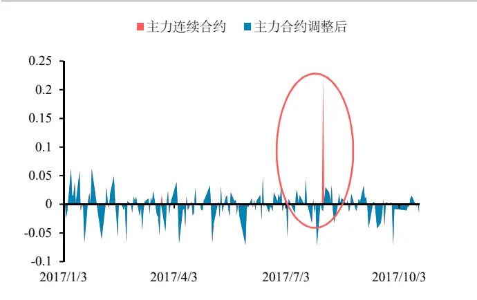
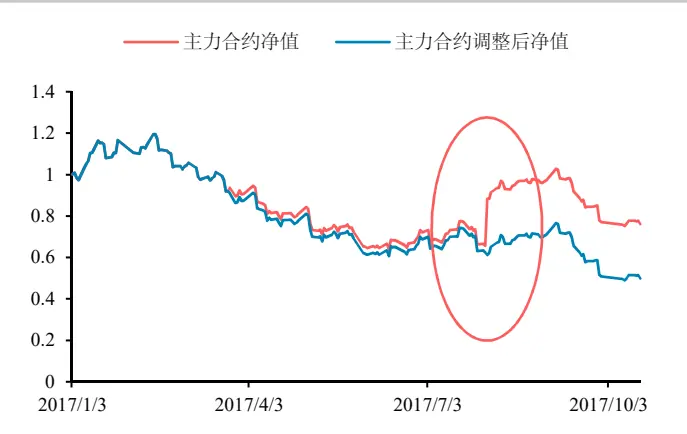
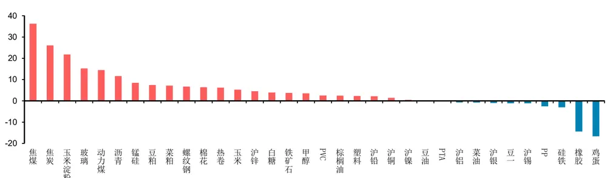
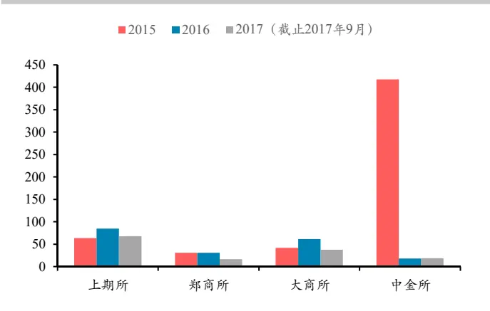
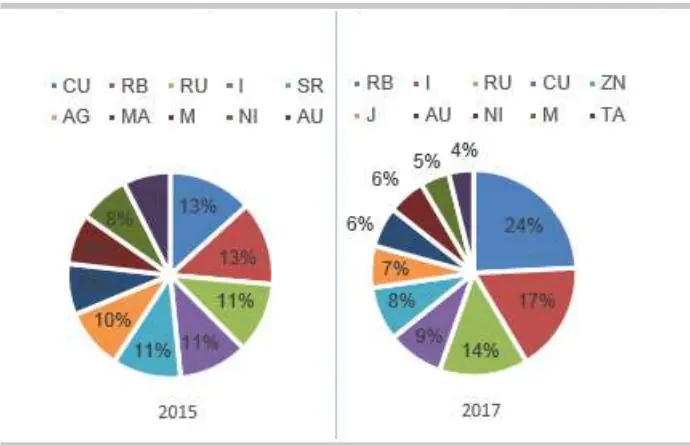
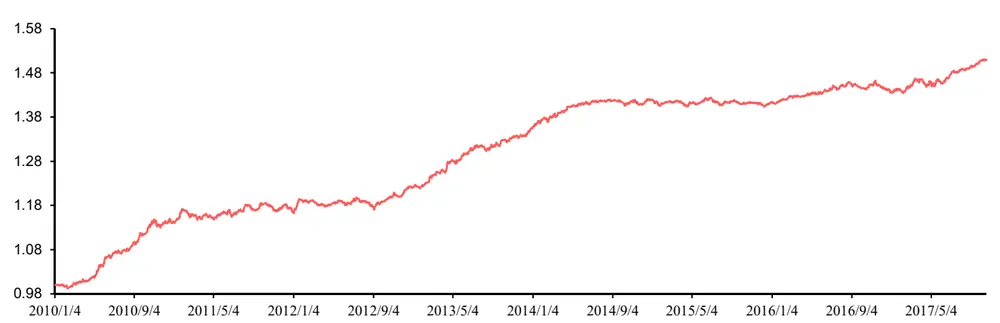
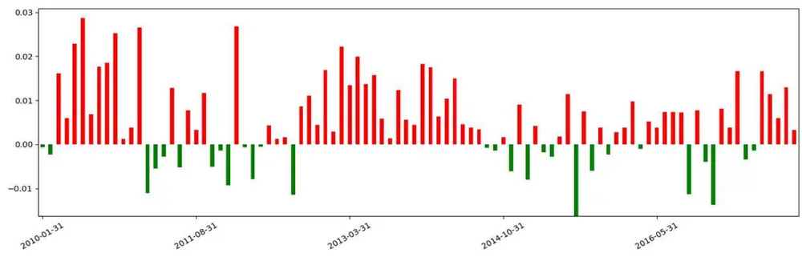
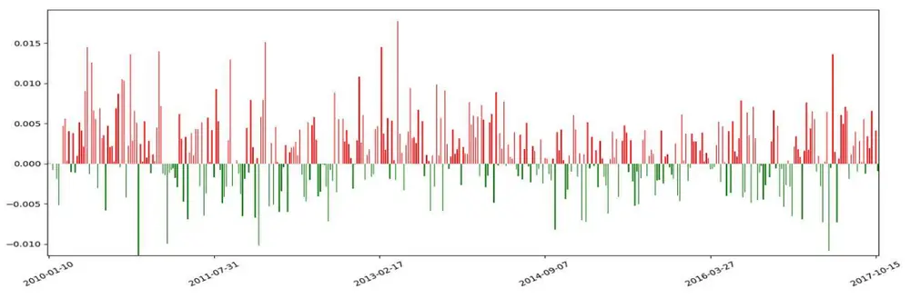

华泰期货研究所 量化组

## CTA 量化策略因子系列（三）：期限结构因子

罗剑

量化组组长

- luojian@htfc.com

## 报告摘要：

从业资格号：F3029622

期限结构因子作为期货合约的特色因子，与现货的库存水平、持有成本（包括交通、仓储以及保险费用等）、市场利率（购买现货的融资成本）以及持有现货的便利收益（convenience yield）等因素相关，且在传统 CTA 量化因子倍受关注。

投资咨询号：Z3012106

本文主要介绍期限结构因子的基本用法，利用基差或者近远月合约价差计算展期收益来判断市场的升贴水结构，并构建不同参数的多空组合，即买入展期收益最高的一篮子期货合约，卖出展期收益最低的一篮子期货合约，持有各商品的主力合约组合可获得期限结构的展期收益。

最后经测试，从不同持有周期及对冲比例的组合表现看，滚动持有周期 60 日、120 日及对冲展期收益前 30%的合约为最佳参数，年化收益 7.88%，夏普比率 2.09，周胜率可达到 61.2%，策略表现稳定。

## 1. 数据选择与处理

## 1.1 品种选择

选择在上海期货交易所、大连商品交易所和郑州商品交易所上市交易的全部46个品种（剔除 2017 年刚上市的棉纱期货）进行交易，按照 Wind 商品指数的划分标准，可将这些品种分为谷物、油脂油料、软商品、农副产品、有色、贵金属、煤焦钢矿、非金属建材、能源和化工10类，具体的品种如下表所示。

表 1: 期限结构策略商品品种选择

| 类别 | 具体品种 |
| --- | --- |
| 谷物 | 玉米、玉米淀粉、粳稻、早籼稻、晚籼稻、普麦、强麦 |
| 油脂油料 | 豆一、豆二、豆粕、豆油、棕榈油、菜油、菜粕、菜籽 |
| 软商品 | 郑糖、棉花 |
| 农副产品 | 鸡蛋 |
| 有色 | 沪铜、沪铝、沪锌、沪铅、沪镍、沪锡 |
| 贵金属 | 沪金、沪银 |
| 煤焦钢矿 | 螺纹钢、热轧卷板、线材、铁矿石、硅铁、锰铁、焦煤、焦炭、 |
| 非金属建材 | 胶合板、纤维板、PVC、玻璃 |
| 能源 | 燃油、动力煤 |
| 化工 | 橡胶、PTA、聚丙烯、塑料、沥青、甲醇 |

数据来源：华泰期货研究所

不同品种的流动性差异很大，如果在构建组合时选择了流动较差的品种，则在实际交易时会产生较大的冲击成本，所以应该在建仓时对合约的流动性进行筛选。具体做法是：

1）计算各品种主力合约过去 60 天平均成交金额的时间序列；

2）在建仓日，计算当日各合约成交金额的40 分位点，以此为筛选标准；

3）在建仓时，剔除掉平均成交金额小于 40 分位点的合约；

## 1.2 合约选择与处理

在合约选择上，考虑到不同月份合约市场活跃度和参与度的不同，只选择各品种的主力合约进行交易，并选择主力合约的收盘价进行计算。为降低主力合约在换约时产生的跳价影响，对主力合约的收盘价进行如下处理：

1) 当次主力合约持仓量连续 3 天超过主力合约时，更换主力合约标的；

2）以每日收盘价计算策略收益，发生主力合约更替且有持仓时，默认以当日原主力合约收盘价平仓，并新主力合约收盘价建仓。

图1：2017年RU主力连续合约日收益率对比 单位：%

数据来源：华泰期货研究所

图2：2017 年RU 主力连续合约净值对比 单位：净值

数据来源：华泰期货研究所

如果回测使用简单的主力连续合约计算收益率，将面临主力合约切换时的跳价影响，由图1可发现 2017 年初至10月的RU天然橡胶期货主力合约切换，2017年8月 2日主力合约从 RU1709切换至 RU1801，主力合约收盘价格8 月1日的12430元/吨，在8 月 2日跳变15235 元/吨，直接影响了日收益率及整体价格走势。

## 1.3 测试时间

测试时间从2010年 1月开始到2017年10 月结束。因为2015年6月以后，很多品种相继推出了夜盘交易，使得市场上的投资者结构和交易策略发生明显改变，因此将 2015 年 6月设为一个断点，分别测试动量策略在夜盘上市前后的表现，具体的测试周期如下表：

表 2: 动量策略回测周期选择

| 时段 | 起始时间 终止时间 |
| --- | --- |
| 全时段 | 2010.1.1 2017.8.31 |
| 夜盘上市前 | 2010.1.1 2015.5.31 |
| 夜盘上市后 | 2015.6.1 2017.8.31 |

数据来源：华泰期货研究所

## 2. 策略方法

## 2.1 策略原理

现货与期货的价格差异，即基差（basis），与现货的库存水平、持有成本（包括交通、仓储以及保险费用等）、市场利率（购买现货的融资成本）以及持有现货的便利收益（convenience yield）等因素相关。

本文假设基差水平全部反应了库存、持有成本、利率及便利收益等因素；升水市场中，商品供给充足，持有现货头寸至升水合约交割月份，覆盖持有成本，并卖出现货获利，因此升水合约价格在其它条件不变的情况下，价格下跌，且随着时间的推移向现货价格靠拢。反之，贴水市场中，商品供给不足，现货便利收益高于持有成本，贴水期货合约在其它条件不变的情况下，价格升高，且随着时间的推移向现货价格靠拢。

图 3: 2017 年 10 月24 日国内期货品种基差：（现货价-期货价）/期货价*100%）
单位：%

数据来源：WIND 华泰期货研究所

因此，利用展期收益来判断市场的升贴水结构，并构建多空组合，即买入展期收益最高的一篮子期货合约，卖出展期收益最低的一篮子期货合约，持有各商品的主力合约组合可获得期限结构的展期收益。

展期的收益计算方法如下：

$$
R_{T}=Ln\left(\frac{P_{T,Spot}}{P_{T,Dominant}}\right)\times\frac{365}{Days_{T,Dominant}-Days_{T,Spot}}
$$

其中 $P_{T,Spot}$ 与்ܲ,஽௢௠௜௡௔௡௧ 分别在 T 时刻为近月合约（现货）价格和主力合约价格，而௧与஽௢௠௜௡௔௡்,ݏݕܽܦ $Days_{T,Spot}$ 。分别为主力合约到期日剩余天数和近月合约到期日剩余天数

## 2.2 参数设定

该策略涉及的参数主要是持有期长短和构建组合的合约比例。持有期指建仓后持有组合的时间长度，用H 表示，代表每隔 H天建仓，持有组合至下个建仓日。持有期的取值范围采用 5 天、10 天、22 天、60 天、120 天和 250 天。构建组合的合约比例以 X%表示，表示展期收益最强的前 X%合约，卖出展期收益最弱的前 X%合约。

## 2.3 入场时间

与华泰期货量化策略专题报告：CTA 量化策略因子（二）动量因子类似，为了消除入场时间对策略结果的影响，对入场时间和下单情况进行如下处理：假设持有期为 H，在持有期内每天滚动下单 1/H的仓位。

## 2.4 资金分配

交易成本：所有品种按单边万分之五计算；

杠杆：不使用杠杆；

权重：多空组合中各合约等权重/等波动率；

## 3. 评价体系

$$
4141\dot{\mathbb{Z}}\dot{\mathbb{Z}}\ddot{\mathbb{Z}}\ddot{\mathbb{Z}}\ddot{\mathbb{Z}}=\frac{\sum_{i=0}^{t}\mathrm{Ln}\left(\frac{\frac{3\pi}{4};2\dot{\mathbb{Z}}\dot{\mathbb{Z}}}{\mathbb{Z}\dot{\mathbb{Z}}\ddot{\mathbb{Z}}}_{t-1}\right)}{\mathrm{t}}\ast250-1\mathrm(N:~30H~\frac{\pi}{25}\pi\mathbb{Z}\frac{\mu}{\mu}\mathbb{Z}\mathbb{H}\left.\mu\right.\mathbb{Z}\mathbb{H}\left.\mathbb{Z}\ddot{\mathbb{Z}}\right.\mathrm{.}
$$

$$
32\div56\div75=56\times125\div(4+14+12+25+12\div2)=(4+16+15+12\div2)
$$

最大回撤 ൌ 1-当天净值/累积最大净值/

卡尔马比率ሺCalmarሻ ൌ年化收益率/最大回撤

## 4. 回测结果

表 3 展示了不同持仓周期、对冲比例的期限结构因子策略的回测结果。 从全时段结果看，长持仓周期组合表现优于短持仓周期组合，持仓周期 60 日、120 日对冲 20%、30%的组合策略年化对数收益率接近7%左右，夏普比率接近2左右。

而从对冲比例来看，对冲比例越小，品种越少，可获取的年化收益率越大，但同时亦因对冲品种少，波动率及最大回撤增大；

且从大多数夜盘上市的 2015 年 5 月份作为测试分界线，夜盘上市以前 2010 年至 2015年 5 月整体回测结果较夜盘上市后 2015 年 6 月至 2017 年 10 月表现更为优秀。同时两个时间段的最优组合同样落在持仓周期 60日及120日的组合中，证明了60 日、120 日持仓周期的稳定性，但是两个时间段的 60 日、120 日持仓周期组合夏普比率有所差别，分别约为 2.30及 1.40 左右，2015 年 6 月以后整体表现下降明显。

表3: 不同持仓周期、对冲比例组合的回测结果

| 期限结构固子组合 | 时间段 | 全时段2010.1.1-2017.10.19 |  |  |  |  |  | 夜盘上市前 |  |  |  |  |  | 夜盘上市后2015.6.1-2017.10.19 |  |  |  |  |  |
| --- | --- | --- | --- | --- | --- | --- | --- | --- | --- | --- | --- | --- | --- | --- | --- | --- | --- | --- | --- |
|  |  |  |  |  |  |  |  | 2010.1.1-2015.5.31 |  |  |  |  |  |  |  |  |  |  |  |
|  | HX | 5 | 10 | 22 | 60 | 120 | 250 | 5 | 10 | 22 | 60 | 120 | 250 | 5 | 10 | 22 | 60 | 120 | 250 |
| 年化收益 | 10% | 5.63% | 4.84% | 6.05% | 7.83% | 7.36% | 5.76% | 8.75% | 8.12% | 9.19% | 9.88% | B.95% | 6.32% | -2.35%6 | -4.25% | -223% | 5.33% | 5.12% | 4.19% |
|  | 20% | 5.81% | 5.79% | 6.15% | 7.42% | 6.92% | 5.31% | 8.02% | 8.21% | 8.46% | 8.66% | 8.02% | 5.55% | 1.14% | 0.19% | 0.90% | 6.90% | 5.93% | 4.56% |
|  | 30% | 5.53% | 5.10% | 5.63% | 6.73% | 6.10% | 4.73% | 7.31% | 6.98% | 7.27% | 7.88% | 6.94% | 4.96% | 2.20% | 1.11% | 2.40% | 5.99% | 5.56% | 4.10% |
| 最大回撤 | 10% | 9.73% | 14.27% | 12.79% | 5.54% | 4.29% | 8.17% | 6.26% | 6.41% | 4.94% | 3.12% | 3.86% | 8.17% | 14.10% | 21.70% | 20.70% | 9.08% | 6.78% | 3.53% |
|  | 20% | 5.40% | 8.43% | 8.77% | 3.10% | 3.36% | 6.72% | 4.83% | 4.65% | 4.40% | 2.85% | 3.05% | 6.72% | 8.17% | 12.90% | 13.70% | 4.74% | 5.04% | 3.15% |
|  | 30% | 4.98% | 6.65% | 5.97% | 2.73% | 3.00% | 5.89% | 4.98% | 4.87% | 4.32% | 2.67% | 2.91% | 5.89% | 5.35% | 9.58% | 8.75% | 4.13% | 4.26% | 2.80% |
| 年化波动率 | 10% | 5.99% | 5.95% | 5.37% | 4.37% | 4.40% | 3.78% | 5.76% | 5.67% | 5.20% | 4.48% | 4.31% | 4.08% | 10.46% | 10.43% | 9.79% | 6.63% | 5.46% | 3.90% |
|  | 20% | 4.76% | 4.55% | 4.27% | 3.60% | 3.42% | 3.23% | 4.82% | 4.56% | 4.30% | 3.76% | 3.64% | 3.50% | 7.08% | 7.00% | 6.65% | 4.72% | 4.04% | 3.04% |
|  | 30% | 4.12% | 4.10% | 3.82% | 3.21% | 3.06% | 2.90% | 4.15% | 4.12% | 3.86% | 3.34% | 3.24% | 3.11% | 5.95% | 5.90% | 5.51% | 4.17% | 3.59% | 2.77% |
| 复普比率 | 10% | 0.94 | 0.81 | 1.12 | 1.79 | 1.79 | 1.52 | 1.52 | 1.43 | 1.77 | 2.08 | 2.08 | 1.55 | -0.22 | -0.41 | 0.22 | 0.80 | 0.94 | 1.07 |
|  | 20% | 1.22 | 1.27 | 1.44 | 2.06 | 2.02 | 1.64 | 1.66 | 1.80 | 1.97 | 2.30 | 2.20 | 1.59 | 0.16 | 0.03 | 0.14 | 1.46 | 1.46 | 1.50 |
|  | 30% | 1.34 | 1.24 | 1.47 | 2.09 | 1.99 | 1.63 | 1.76 | 1.70 | 1.88 | 2.35 | 2.13 | 1.59 | 0.37 | 0.18 | 0.43 | 1.44 | 1.55 | 1.48 |
|  | 10% | 0.58 | 0.34 | 0.47 | 1.41 | 1.72 | 0.71 | 1.40 | 1.27 | 1.86 | 3.17 | 2.32 | 0.77 | -0.17 | 0.20 | -0.11 | 0.59 | 0.76 | 1.19 |
| 卡尔马比率 | 20% | 1.08 | 0.69 | 0.70 | 2.39 | 2.06 | 0.79 | 1.66 | 1.77 | 1.92 | 3.04 | 2.63 | 0.83 | 0.14 | 0.01 | 0.07 | 1.46 | 1.18 | 1.45 |
|  | 30% | 1.11 | 0.77 | 0.94 | 2.47 | 2.03 | 0.80 | 1.47 | 1.43 | 1.68 | 2.95 | 2.38 | 0.84 | 0.41 | 0.12 | 0.27 | 1.45 | 1.31 | 1.46 |

数据来源：华泰期货研究所

夜盘上市后，相较夜盘上市前，期货市场的发展及整体投资者结构的优化，使期货市场价格特性、品种流动性均有所改变，图 5中2015年与 2017 年（截至9月底）的日均成交金额前10名无论从占比或者前10 名期货合约分类都有较大变化，2015年前10名合约分布更为平均，但2017年日均成交金额偏重于螺纹钢、铁矿和橡胶；2015 年股指限令之后，中金所成交量大幅度萎缩，部分股指资金进入商品市场，资金更为偏好活跃、投机成份高的交易品种，逐渐改变了整体商品期货格局。

图 4：2015 年至 2017 年交易所成交金额 单位：万亿元

数据来源：Wind 华泰期货研究所

图5：15、17 年国内日均成交前十名合约占比 单位：%

数据来源：华泰期货研究所

单位：%

## 5. 策略分析

从上文测试结果选择最优组合，进一步分析期限结构因子策略在不同时期的表现情况。此处选择持仓周期为 60 日，对冲比例为前30%的组合进行分析。

图 6: 2010 年1 月至 2017 年 10 月期限结构因子策略回测净值（持有周期：60 日、对冲比例：30%）单位：净值

数据来源：华泰期货研究所

组合年化对数收益 7.88%，最大回撤和波动率分别为2.67%、3.34%，整体夏普率可达到2.09。按 2015年6月分夜盘分界线，夜盘上市前夏普率为2.35，夜盘上市后回落至1.44，夜盘上市前表现优于夜盘上市后。

图 7 为 2010 年 1 月至 2017 年期限结果因子策略月收益结果，盈利月份为 66 个月，占 94个月的总月份数 70.2%。最大月盈利在 2010 年 6 月，盈利 2.87%，最大月亏损则发生在 2015 年7 月，当月亏损 1.62%

图 7：2010 年 1 月至 2017 年期限结果因子策略月收益（持有周期：60 日、对冲比例：30%）

数据来源：华泰期货研究所

图 8展示了该组合的周收益结果，周盈利的周数为245 周，占总体周数61.4%，因滚动持仓周期较长，周胜率比月胜率稍低。最大的周盈利发生在 2013 年 4 月 21 日当周，盈利1.77%；最大亏损则发生在 2010 年 11 月 14 日当周，亏损 1.14%。

图 8：2010 年 1 月至 2017 年期限结果因子策略周收益（持有周期：60 日、对冲比例：30%）
单位：%

数据来源：华泰期货研究所

综上所述，期限结构因子是期货合约特有因子，且该因子很大程度上反应了库存、持有成本、利率及便利收益等因素。从不同持有周期及对冲比例的组合表现看，滚动持有周期 60 日、120 日及对冲展期收益前 30%的合约为最佳参数，年化收益 7.88%，夏普比率2.09，周胜率可达到61.2%，策略表现稳定。

## 免责声明

此报告并非针对或意图送发给或为任何就送发、发布、可得到或使用此报告而使华泰期货有限公司违反当地的法律或法规或可致使华泰期货有限公司受制于的法律或法规的任何地区、国家或其它管辖区域的公民或居民。除非另有显示，否则所有此报告中的材料的版权均属华泰期货有限公司。未经华泰期货有限公司事先书面授权下，不得更改或以任何方式发送、复印此报告的材料、内容或其复印本予任何其它人。所有于此报告中使用的商标、服务标记及标记均为华泰期货有限公司的商标、服务标记及标记。

此报告所载的资料、工具及材料只提供给阁下作查照之用。此报告的内容并不构成对任何人的投资建议，而华泰期货有限公司不会因接收人收到此报告而视他们为其客户。

此报告所载资料的来源及观点的出处皆被华泰期货有限公司认为可靠，但华泰期货有限公司不能担保其准确性或完整性，而华泰期货有限公司不对因使用此报告的材料而引致的损失而负任何责任。并不能依靠此报告以取代行使独立判断。华泰期货有限公司可发出其它与本报告所载资料不一致及有不同结论的报告。本报告及该等报告反映编写分析员的不同设想、见解及分析方法。为免生疑，本报告所载的观点并不代表华泰期货有限公司，或任何其附属或联营公司的立场。

此报告中所指的投资及服务可能不适合阁下，我们建议阁下如有任何疑问应咨询独立投资顾问。此报告并不构成投资、法律、会计或税务建议或担保任何投资或策略适合或切合阁下个别情况。此报告并不构成给予阁下私人咨询建议。

华泰期货有限公司2016版权所有。保留一切权利。

## 公司总部

地址：广州市越秀区东风东路761号丽丰大厦20层

电话：400-6280-888

网址：www.htgwf.com