# CTA 量化策略因子系列（四）：因子组合与择时

华泰期货研究所 量化组

罗剑

量化组组长

- luojian@htfc.com

## 报告摘要：

动量策略是基于标的资产价格的动量效应而设计的交易策略，即预先对资产的动量因子设定过滤准则，当资产过去一段时间的收益满足过滤准则就买入或卖出相应资产的投资策略。而期限结构策略是利用基差或者近远月合约价差计算展期收益来判断市场的升贴水结构，并构建不同参数的多空组合，即买入展期收益最高的一篮子期货合约，卖出展期收益最低的一篮子期货合约，持有各商品的主力合约组合可获得期限结构的展期收益。

从业资格号：F3029622

投资咨询号：Z0012563

当市场趋势行情的发生，市场参与者追涨杀跌的情绪高涨，会导致市场价格快速上涨或者下跌，类似于资产泡沫产生，波动率的周期性使高/低波动率的不可长期持续，资产价格在波动率达到极值时将面临快速反转。即动量策略及期限结构策略原理，当动量策略表现好的时候，证明投机者在持续追逐价格的趋势，使基差回归或展期收益效应短暂时失效、消失，期限结构策略面临损失。

本文主要介绍CTA 策略因子组合与择时的基本方法与框架，将《CTA 量化策略因子系列》介绍的动量因子、期限结构因子、波动率因子三大 CTA 量化策略主要基础因子，进行因子的组合与择时。

波动率择时将市场划分为高低波动率区间时期，利用动量策略与期限结构策略原理、收益源和适应市场的不同风格的特性，有效地抓住了商品期货市场主要趋势行情，同时避免了动量策略在行情大反转的风险，在行情趋势不明显或者震荡情况下，将期限结构作为动量策略的良好补充，策略组合同时收获期限结构策略的展期收益。

## 一、 策略回顾

初始本金：1000 万

交易成本：所有品种按单边万分之五计算；

杠杆：不使用杠杆；

权重：多空组合中各合约等权重/等波动率；

$$
\frac{4}{4}\div14.12\dot{x}\frac{3\dot{\theta}}{20}\frac{3\dot{x}}{4}=\frac{\sum_{i=0}^{t}\left(\frac{3\dot{y}}{20}+\frac{1}{20}-\frac{3\dot{y}}{20}+\frac{3\dot{x}}{20}\right)-1}{1}\ast250(\mathrm{N}:301+\frac{3\dot{x}}{20}\sqrt{6})\frac{4y}{40}\vert y\vert\vert x\frac{3\dot{x}}{20})
$$

夏普比率(Sharpe) = 年化收益率/年化标准差 （年化标准差：日收益率标准差*√250）

$$
\sharp\star\Theta_{\mathbf{A}}\sharp\sharp_{\hbar}\mathtt{h}\mathtt{h}=\mathrm{Min}(1-\sharp\star\mathrm{\tiny~\cdot}\partial\sharp\mathbf{\cdot}\mathbf{\nabla}\mathrm{t}\sharp_{\mathbf{A}}/\ddagger\mathrm{\varkappa}\mathrm{\mathtt{A}}\mathbf{\cdot}\mathbf{\nabla}\mathrm{t}\overline{{\mathtt{h}}}\mathbf{\cdot}\overline{{\mathtt{h}}}\mathbf{\cdot}\overline{{\mathtt{h}}}\mathbf{\cdot}\overline{{\mathtt{h}}}\mathbf{\cdot}\overline{{\mathtt{h}}}\mathbf{\cdot}\overline{{\mathtt{h}}}\mathbf{\cdot}\overline{{\mathtt{h}}}\mathbf{\cdot}\overline{{\mathtt{h}}}\mathbf{\cdot}\overline{{\mathtt{h}}}\mathbf{\cdot}\overline{{\mathtt{h}}}\mathbf{\cdot}\overline{{\mathtt{h}}}\mathbf{\cdot}\overline{{\mathtt{h}}}\mathbf{\cdot}\overline{{\mathtt{h}}}\mathbf{\cdot}\overline{{\mathtt{h}}}\mathbf{\cdot}\overline{{\mathtt{h}}}\mathbf{\cdot}\overline{{\mathtt{h}}}\mathbf{\cdot}\overline{{\mathtt{h}}}\mathbf{\cdot}\overline{{\mathtt{h}}}\mathbf{\cdot}\overline{{\mathtt{h}}}\mathbf{\cdot}\overline{{\mathtt{h}}}\mathbf{\cdot}\overline{{\mathtt{h}}}\mathbf{\cdot}\overline{{\mathtt{h}}}\mathbf{\cdot}\overline{{\mathtt{h}}}\mathbf{\cdot}\overline{{\mathtt{h}}}\mathbf{\cdot}\overline{{\mathtt{h}}}\mathbf{\cdot}\overline{{\mathtt{h}}}\mathbf{\cdot}\overline{{\mathtt{h}}}\mathbf{\cdot}
$$

卡尔马比率(Calmar) = 年化收益率/最大回撤

回顾华泰期货量化策略专题报告：CTA量化策略因子系列（一）（二）（三），由报告中分享的波动率、动量和期限结构因子分别构成的CTA 策略均取得了一定的效果。图 1 为动量策略 2010年至2017年10月，回溯 10天动量、滚动持仓5天的策略净值图，不采用杠杆倍率，累计收益达到 63.22%，年化 8.31%，最大回撤 15.21%，波动率 10.14%，夏普比率 0.82；图2为期限结构策略2010年至 2017年10月，滚动持仓60天的策略净值图，不采用杠杆倍率，累计收益达到 73.3%，年化 9.63%，最大回撤 5.63%，波动率 4.97%，夏普比率 1.94；

图 1：2010 至 2017 年动量策略净值图单位：净值
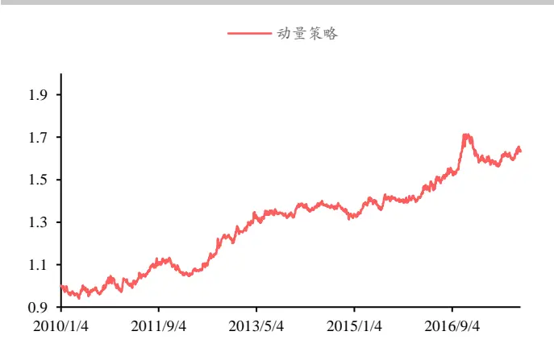
数据来源：华泰期货研究所

图 2：2010 至 2017 年期限结构策略净值图 单位：净值
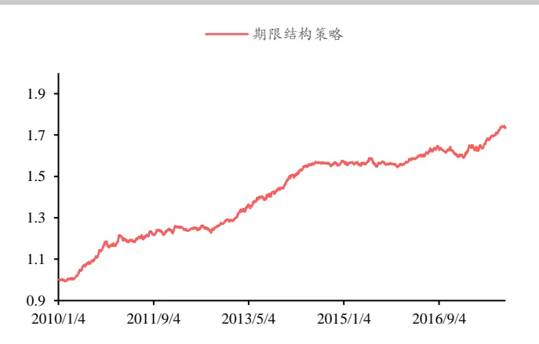
数据来源：华泰期货研究所

## 二、策略分析

鉴于上述策略不采用杠杆倍数，虽然年化收益率不高，但对整体策略表现稳定，特别是期限结构策略，最大回撤控制在 5.63%，夏普比率可达到1.94倍。

图 3：动量策略各年份收益图
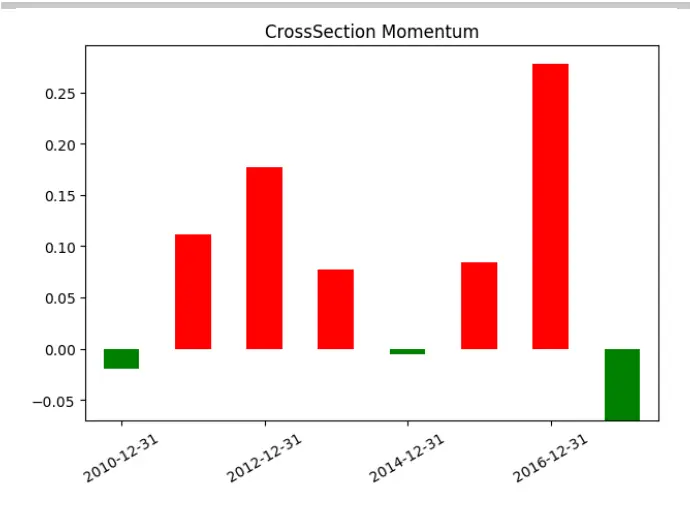
据来源：华泰期货研究所

图 4：期限结构策略各年份收益图单位：净值
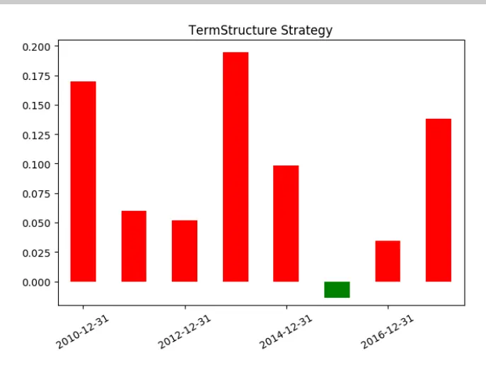
数据来源：华泰期货研究所

由图 3、图4的动量策略与期限结构策略各年份收益图可以发现，动量策略在 2011年、2012年及2016年表现较好，但期限结构策略在 2010年、2013年及 2017年表现优秀，恰恰与动量策略表现较好年份错开。

图 5 中的动量策略与期限结构策略的净值对比，亦可发现动量策略与期限结构策略大多数情况存在互补的关系，《华泰期货量化策略专题报告：CTA量化策略因子系列报告》已分析，存在互补关系是由于他们的策略收益源及原理导致。

图 5: 动量策略与期限结构策略净值对比
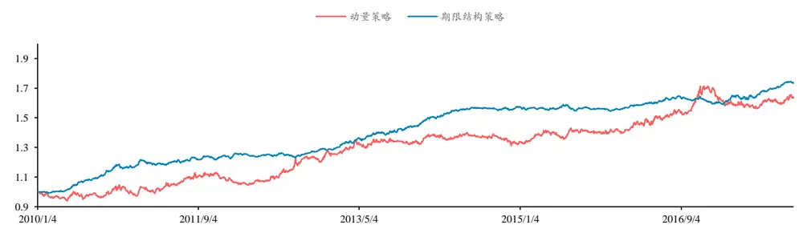
数据来源：华泰期货研究所

动量策略是基于标的资产价格的动量效应而设计的交易策略，即预先对资产的动量因子设定过滤准则，当资产过去一段时间的收益满足过滤准则就买入或卖出相应资产的投资策略。而期限结构策略是利用基差或者近远月合约价差计算展期收益来判断市场的升贴水结构，并构建不同参数的多空组合，即买入展期收益最高的一篮子期货合约，卖出展期收益最低的一篮子期货合约，持有各商品的主力合约组合可获得期限结构的展期收益。

当动量策略表现好的时候，证明投机者持续追逐动量趋势，使期限结构的基差回归或则说是展期收益效应短暂时失效、消失。

## 三、策略因子组合

## （一）策略权重等权分配

首先，根据上文分析，动量策略在大多数情况与期限结构策略互补，即考虑简单将两策略进行等权组合。策略组合后，2010年至2017年 10月累计收益 68.25%，年化收益8.97%，年化波动率 5.86%，最大回撤 8.61%，夏普比率达到 1.52。从图 6净值曲线看，整体收益与动量策略、期限结构策略接近，最大回撤与年化波动率虽然比动量策略有所降低，但与不及期限结构策略，利用等权组合的方法，并不达到良好的优化效果。

图 6：等权动量+期限结构策略净值图
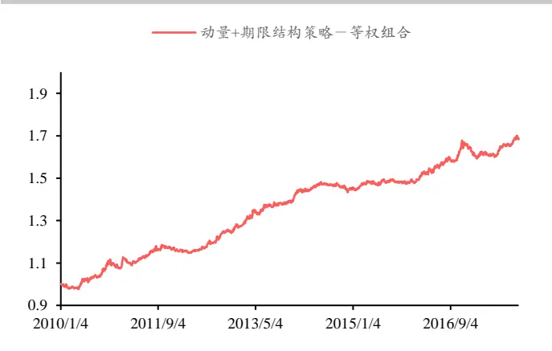
数据来源：华泰期货研究所

单位：%
图 7：等权动量+期限结构策略年收益图单位：净值
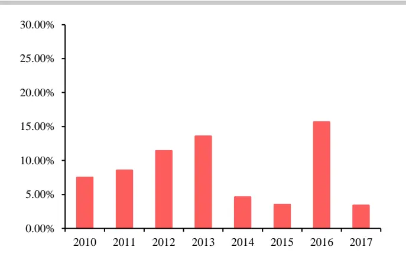
数据来源：华泰期货研究所

## （二）波动率择时

由《华泰期货量化策略专题报告：CTA 量化策略因子系列（一）波动率因子》分析，在市场不同的波动率区间，策略的表现有所不同，所以利用波动率进行策略的择时有利于策略的整体优化。

图 8:2000 年至 2017 年WIND 商品指数走势与波动率区间划分
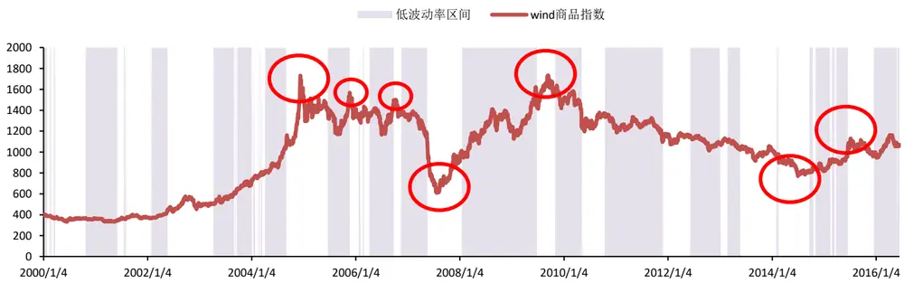
数据来源：WIND 华泰期货研究所

图 8 利用历史波动率划分出高、低波动率区间，发可以WIND 商品指数历史上大级别的反转行情都处于白的区块所表示的高波动区间内。历史波动率的上升、下跌由价格快速上涨、下跌造成。由《华泰期货量化策略专题报告：CTA 量化策略因子系列（一）波动率因子》中正负波动率周期中得出，波动率总是在周期中变换，存在波动率的波峰与波谷。

图9: 波动率周期循环
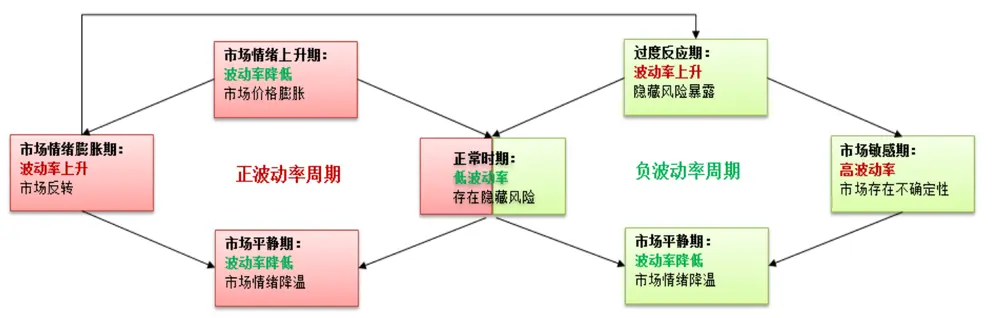
数据来源：Kathryn M.Kaminski, Aplha K Capital 华泰期货研究所

由于国内暂时没有商品指数期权，只能采用历史波动率衡量市场情况，但历史波动率计算是由历史数据提供，具有滞后性的特质，而在利用波动率择时的时候，应考虑此特性，所以按以下波动率择时方法优化策略因子组合：

高波动率区间：期限结构策略

低波动率区间：动量策略

波动率切换区间：每日 20%仓位切换

动量策略是利用动量效应获取过去表现较好的资产趋势延续的收益，但由于历史波动率的滞后性，等历史波动率真正反应了市场的高波动率行情，市场的价格往往面临反转，而行情的反转正是给动量策略带来较大回撤和不确定性的主要原因之一。

所以在做波动率择时的时候，应该在高波动率区间放弃动量策略，选择市场回归理性的期限结构策略；同理，相反在低波动率区间，等历史波动率行情反应了市场的低波动行情，低波动区间往往已经持续较久，此时等待波动率上升、趋势行情开始，则在低波动率区间选择动量策略。

图 10: 动量策略与期限结构策略－波动率择时净值图
单位：净值
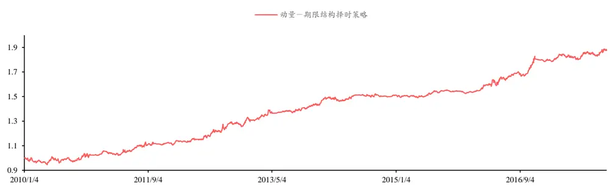
数据来源：华泰期货研究所

图 10为进行波动率择时后的策略组合净值表现，策略组合后，2010年至 2017年 10月累计收益 87.5%，年化收益11.5%，年化波动率 8.16%，最大回撤 5.69%，夏普比率达到1.41。从整体表现看，累计收益、年化收益较动量、期限结构策略有所提高，最大回撤优于动量策略，回避了大反转行情，且最大回撤也于期限结构策略基本持平。但由于整体波动率较期限结构策略高，夏普比率不及期限结构策略。

但并不是说明优化结果没有起作用，因为波动率择时组合的年化波动率较高是源于策略中动量策略获利的上行波动率导致。计算波动率择时后的年化下行波动率只有 5.59%，所以索提诺比率可以达到 2.06。

图 11：波动率择时组合与期限结构策略对比 单位：%
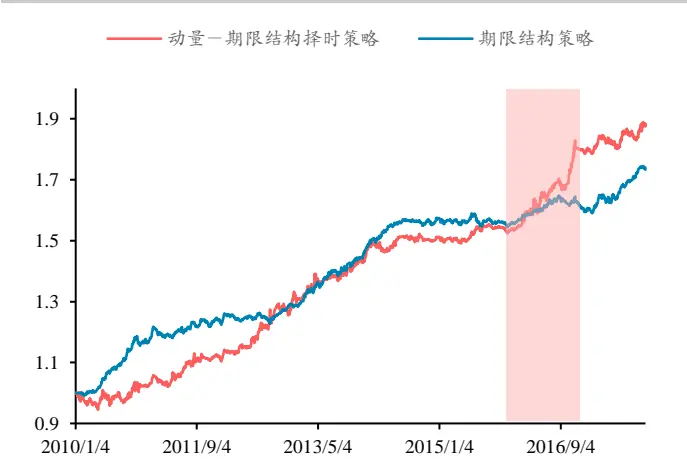
数据来源：华泰期货研究所

图 12：波动率择时组合与动量策略对比 单位：净值
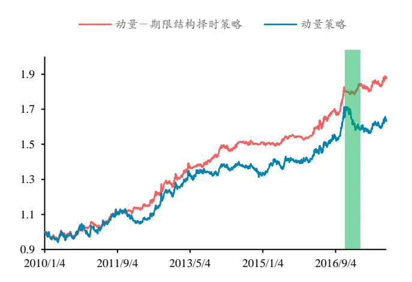
数据来源：华泰期货研究所

2016年商品牛市大年，市场上大多数 CTA策略收益颇丰，虽然期限结构策略从 2010至今表现整体良好，但期限结构策略却在 2016年表现一般，波动率择时组合正好可以弥补了这一缺陷，图11为波动率择组合与期限结构策略对比，在红色区域内，波动率择时把握住了商品牛市大行情，且在图 12中显示，避开了动量策略在市场整体行情的反转威胁。

图 13: 近一年国内各大类商品指数走势
单位：净值
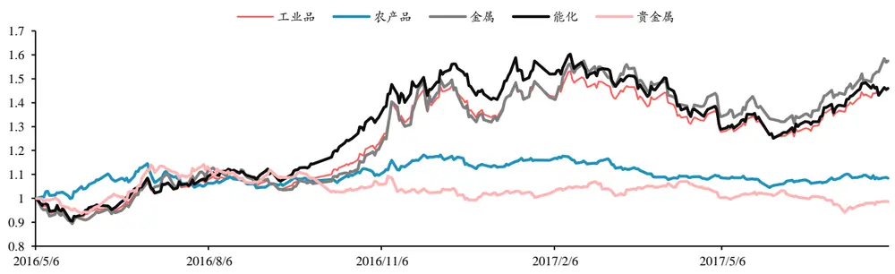
数据来源：华泰期货研究所

2016年商品牛市大年，市场上大多数 CTA策略收益颇丰，虽然期限结构策略从 2010至今表现整体良好，但期限结构策略却在 2016年表现一般，波动率择时组合正好可以弥补了这一缺陷，图11为波动率择组合与期限结构策略对比，在红色区域内，波动率择时把握住了商品牛市大行情，且在图 12中显示，避开了动量策略在市场整体行情的反转威胁。

图 14 为 2010 年 1 月至 2017 年 10 月波动率择时策略月收益分布结果，盈利月份为 62 个月，占 95 个月的总月份数 65.2%。最大月盈利在 2016 年 10 月，盈利 7.42%，最大月亏损则发生在 2017 年 8 月，当月亏损 2.18%

图 14：波动率择时组合月收益分布
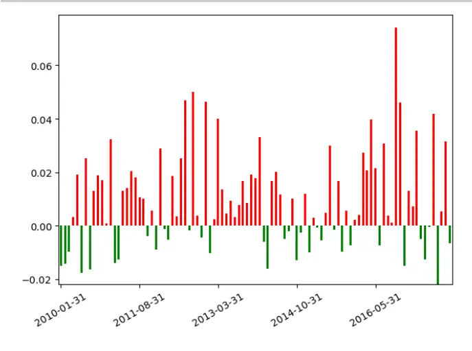
数据来源：华泰期货研究所

图 15：波动率择时组合周收益分布单位：净值
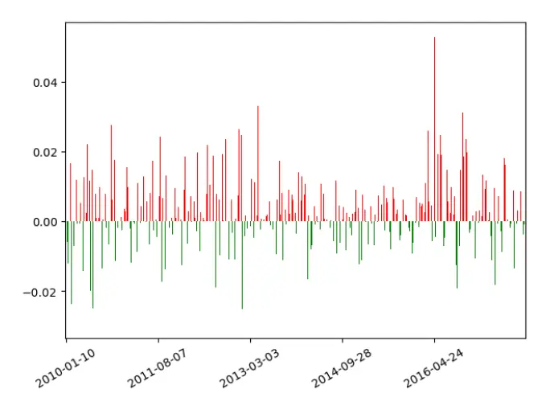
数据来源：华泰期货研究所

图 15为 2010 年 1 月至 2017 年 10 月波动率择时策略周收益分布结果，盈利周数为 234 周，占 409 周的总月份数 57.2%。最大周盈利在 2016 年 4 月 24 日当周，盈利 5.28%，最大周亏损则发生在 2016 年 5 月 8 日当周，当周亏损 3.35%

综上所述，波动率择时组合 CTA量化策略收益源的两大因子，动量因子与期限结构因子，利用它们策略原理及行情适应的互补性，抓住了商品期货市场主要趋势行情，同时有效避免了动量策略无力面对市场系统性风险的短板，在趋势不明显或者震荡行情时，将期限结构作为动量策略的良好补充，收获期限结构的展期收益；即能保持期限结构的稳定性同时，也把握住了市场的趋势行情，策略组合回测月胜率达到65.2%，周胜率达到57.2%，年化收益接近11.5%，策略稳定，此波动率优化基础框架效果明显。

## 免责声明

此报告并非针对或意图送发给或为任何就送发、发布、可得到或使用此报告而使华泰期货有限公司违反当地的法律或法规或可致使华泰期货有限公司受制于的法律或法规的任何地区、国家或其它管辖区域的公民或居民。除非另有显示，否则所有此报告中的材料的版权均属华泰期货有限公司。未经华泰期货有限公司事先书面授权下，不得更改或以任何方式发送、复印此报告的材料、内容或其复印本予任何其它人。所有于此报告中使用的商标、服务标记及标记均为华泰期货有限公司的商标、服务标记及标记。

此报告所载的资料、工具及材料只提供给阁下作查照之用。此报告的内容并不构成对任何人的投资建议，而华泰期货有限公司不会因接收人收到此报告而视他们为其客户。

此报告所载资料的来源及观点的出处皆被华泰期货有限公司认为可靠，但华泰期货有限公司不能担保其准确性或完整性，而华泰期货有限公司不对因使用此报告的材料而引致的损失而负任何责任。并不能依靠此报告以取代行使独立判断。华泰期货有限公司可发出其它与本报告所载资料不一致及有不同结论的报告。本报告及该等报告反映编写分析员的不同设想、见解及分析方法。为免生疑，本报告所载的观点并不代表华泰期货有限公司，或任何其附属或联营公司的立场。

此报告中所指的投资及服务可能不适合阁下，我们建议阁下如有任何疑问应咨询独立投资顾问。此报告并不构成投资、法律、会计或税务建议或担保任何投资或策略适合或切合阁下个别情况。此报告并不构成给予阁下私人咨询建议。

华泰期货有限公司2017版权所有。保留一切权利。

## 公司总部

地址：广东省广州市越秀区东风东路761号丽丰大厦20层、29层04单元

电话：400-6280-888

网址：www.htfc.com