## CTA 量化策略因子系列（五）偏度与峰度因子

华泰期货研究所 量化组

罗剑

量化组组长

- luojian@htfc.com

## 报告摘要：

从业资格号：F3029622

本文主要介绍 CTA 策略因子中的偏度因子与峰度因子的具体算法与组合应用，从国外相关研究得出可建立做多偏度较低品种与做空偏度较高品种，取得超额收益。但利用国内商品期货市场品种，从单因子的组合构建回测结果看，无论从不同长短回溯期和不同持有周期，相较动量因子与期限结构因子，并未取得超额收益。

投资咨询号：Z0012563

但偏度与峰度作为概率论与统计学中重要理论，可以在 CTA 量化策略因子中起到筛选品种的作用，利用峰度的大小选择合适的品种有利于提高 CTA 策略的整体收益。经测试从 2010年至2017年传统动量策略（回溯10天，滚动持仓5天，10%品种对冲）年化收益 10.5%，最大回撤 13.7%，年化波动率 10%，剔除高峰度的品种后，可提高策略年化收益至 11.3%，最大回撤 12.6%，年化波动率 10.8%，改进策略保持10%对冲比例，尽管对冲品种减少了，年化收益有所提高，对冲效果并未下降，最大回撤减小至12.6%。

## 一、 偏度与峰度定义

## （一） 偏度

在概率论和统计学中，偏度是关于实值随机变量的平均值的概率分布的不对称性的量度。除正态分布的偏度为0，以偏度值的大小正负，可以分为正偏或者负偏分布，对于单峰分布，负偏表示概率密度函数左侧的尾部比右侧更长或更胖。相反，正偏斜表示右侧的尾巴比左侧长或胖。

图 1: 正偏分布与负偏分布
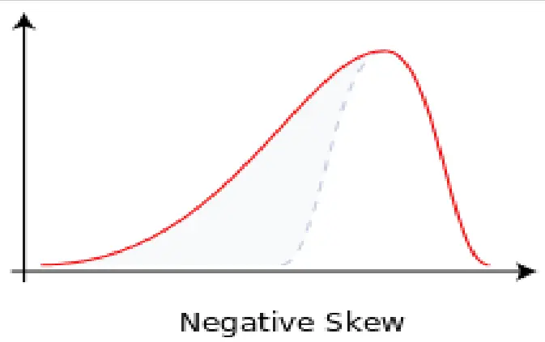
数据来源：Wikipedia、华泰期货研究所

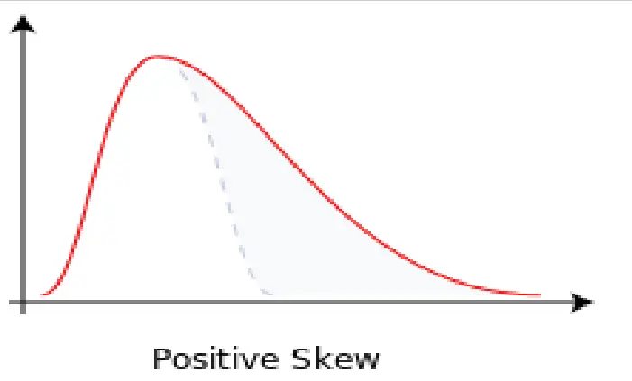

偏度是对收益率的衡量指标，是随机变量的三阶中心矩，r代表收益率、 $\mu$ 收益率代表均值、σ代表收益率波动率，偏度具体公式如下：

$$
\mathrm{skewness}=\mathbb{E}[\left(\frac{r-\mu}{\sigma}\right)^{3}]
$$

## （二）峰度

在概率论和统计学中，峰度是实值随机变量的概率分布的“尾部”的度量，描述总体中所有取值分布形态陡缓程度的统计量。根据变量值的集中与分散程度，峰度一般可表现为三种形态：尖顶峰度、平顶峰度和标准峰度。在假设方差分布与正态分布一样不变时，峰度大于正态分布的标准峰度3时，为尖顶峰度，同时如图 2所示，会伴随着分布的肥尾现象。

峰度也对收益率的衡量指标，是随机变量的四阶中心矩，r 代表收益率、μ收益率代表均值、σ代表收益率波动率，偏度具体公式如下：

$$
\mathrm{kurtosis}=\mathrm{E}[\left({\frac{r-\mu}{\sigma}}\right)^{4}]
$$

图 2：不同峰度形态的分布对比图
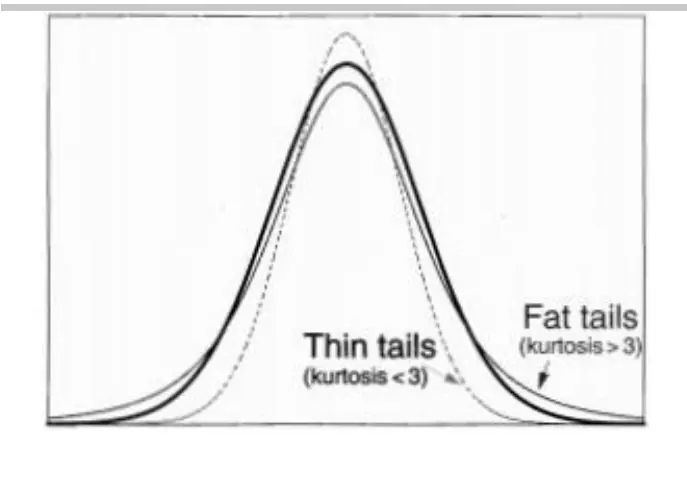
数据来源：FRMhandbook、华泰期货研究所

图 3：部分商品期货日收益率概率分布
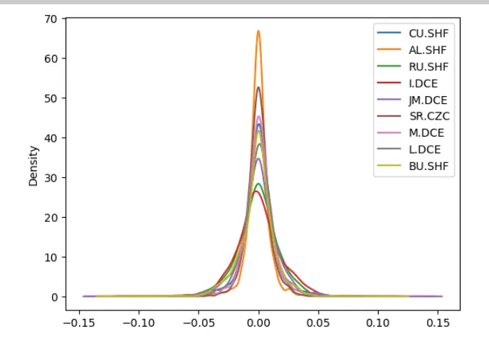
数据来源：华泰期货研究所

## 二、商品期货的偏度与峰度

图3展示了部分品种日收益率的概率分布，可以看出商品期货与大多数金融资产类似，呈现出尖峰肥尾的分布特征。

图 4：铁矿石期货主力合约净值图
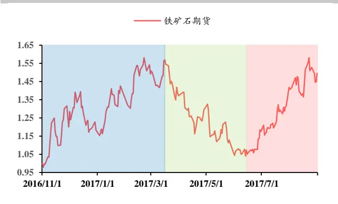
据来源：华泰期货研究所

图 5：铁矿石不同时间日收益率分布
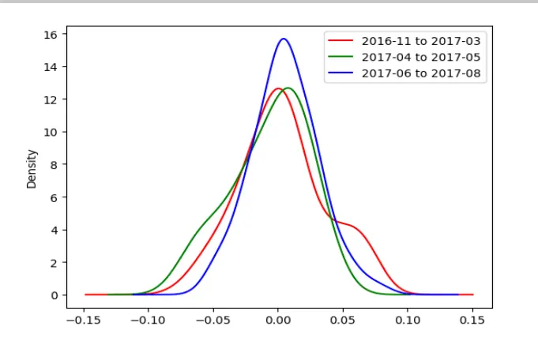
数据来源：华泰期货研究所

图 4 为铁矿石期货主力合约，剔除跳价后的净值走势，具体方法可参考《华泰期货量化策略专题报告：CTA 量化策略因子系列（三）期限结构因子》的主力合约时间序列构造。图 4 中，蓝色区域为宽幅震荡上市，绿色区域为熊市，红色区域为牛市。图 5 为 3 个不同对应阶段的日收益率分布，按上文偏度公式计算得出在铁矿石价格上行的阶段，日收益率分布为正偏分布，2016 年 11 月至 2017 年 3 月偏度值为 0.2021，2017 年 6 月至 8 月偏度值为0.1838，而在铁矿石2017年04月至 2017年05月下行阶段日收益率分布为负偏分布，偏度值为-0.5305。从峰度上看，2016 年 11 月至 2017 年 03 月的宽幅震荡上行阶段与 2017 年

06 月至 2017 年 08 月牛市阶段，峰度值分别为-0.2859 和 0.2458，在宽幅震荡上行阶段，峰度值明显低于牛市阶段，且峰度值小于 0，即低于正态分布，日收益率分布相对平均。

图 6：沪铜期货主力合约净值图
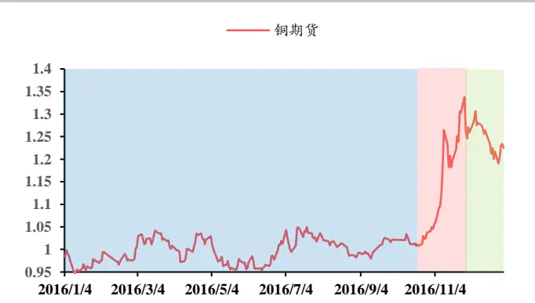
数据来源：华泰期货研究所

图 7：沪铜不同时间日收益率分布
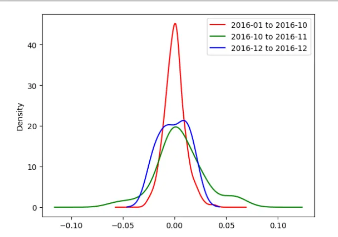
数据来源：华泰期货研究所

图 6 为沪铜期货的日收益率修正后的净值走势，从2016 年 1 月到 2016 年 09 月为正负波动 5%以内的窄幅震荡区间，偏度值为 0.3882，峰度为1.027；2016年10月至11月为沪铜牛市阶段，偏度值为 0.1969，峰度为 1.4905；2016 年 12 月为熊市阶段，偏度值为-0.0929，峰度为-1.2207；与铁矿石期货日收益率分布类似，在牛市期间日收益率呈现正偏分布。

## 三、偏度因子与峰度因子的应用

## （一）策略组合构建

图 8，9是沪铜与铁矿石期货的 120天日收益率偏度值，简单可以从图中看出两者均具有一定均值回归性质，利用此特性，即买入具备负偏度前 20%的品种，卖出正偏度前 20%的品种，构建策略组合。

图 8：沪铜期货滚动回溯 120 天偏度值
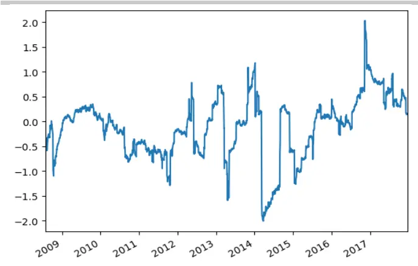
数据来源：华泰期货研究所

图 9：铁矿石期货滚动回溯 120 天偏度值
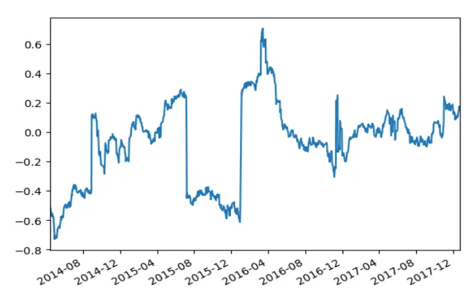
数据来源：华泰期货研究所

2017-12-25

从整体效果上看，构建组合并未达到良好的对冲效果，未取得良好超额收益。

表 1: 偏度因子构建组合回测结果

| 2010.1.4-2017.12.22 | R=22 R=22 H=5 H=10 | R=22 H=22 | R=22 H=60 | R=22 | R=60 R=60 H=5 H=10 | R=60 H=22 | R=60 H=60 | R=60 H=120 | R=60 H=250 | R=120 | R=120 | R=120 R=120 | R=120 H=120 | R=120 | R=250 | R=250 | R=250 H=22 |  |  |  | R=250 H=60 |  |  | R=250 |  |  |  |
| --- | --- | --- | --- | --- | --- | --- | --- | --- | --- | --- | --- | --- | --- | --- | --- | --- | --- | --- | --- | --- | --- | --- | --- | --- | --- | --- | --- |
| 平均年化收益率 | -1.4197% | -0.7741% | -0.6363% -0.2079% | H=120 0.1695% | H=250 -0.0106% | -2.9576% | -2.4655 | -1.6834% | -0.9189% | -0.0510% | -0.2682 | H=5 -2.4330% | H=10 -2.2108 | H=22 -2.0003% | H=60 -0.5250 | -0.5996% | H=250 -0.1479% | H=5 | -1.0147% | H=10 | -0.8706% | -0.9286% | 0.3304% | H=120 0.3649% |  |  |  |
| 最大回撤 标准差 | 21.94% 6.0540% | 19.60% 5.6134% | 13.49% 4.7988% | 11.34% 3.5314% | 7.68% 5.39% 2.5779% 1.6840% | 25.36% 6.2968% | 24.02% 6.1060% | 24.32% 5.6992% | 21.52% 4.9078% | 13.38% 3.8439% | 9.01% 2.7198% |  | 28.99% 6.8941% | 28.43% 6.6700% | 27.29%6 6.3158% | 20.31% 5.4890% |  | 16.22% 4.8024% | 11.31% 3.7239% | 21.71% 6.5010% | 21.57% 6.3943% |  | 20.94% 6.2366% | 13.64% 5.7564% | 14.05% 5.3043% |  |  |
| 夏普比率 | -0.234509 | -0.137896 | -0.132589 | -0.058870 0.065748 | -0.006291 | .469697 |  | 0.295386 | -0.187241 |  | -0.013280 | -0.098628 |  | -0.331463 |  | 0.316709 | -0.095647 | -0.124846 | -0.039713 | -0.156083 |  | -0.136157 |  |  | 0.057390 | 0.068795 | 4.5228% |

数据来源：华泰期货研究所

## （二）因子筛选

由峰度概念可得知，当因子分布的峰度小于0（假定正态分布峰度＝0），说明因子分布相对平均，因而构建因子策略时，区分度不够明显；而当因子分布的峰度相对较大，分布方差相对较小，因子表现不够稳定，排名容易变换。所以，在选择构建组合品种时，应该选择峰度适中、接近正态分布的品种。

图 10: 传统动量策略与剔除高峰度品种的动量策略净值曲线对比
单位：净值
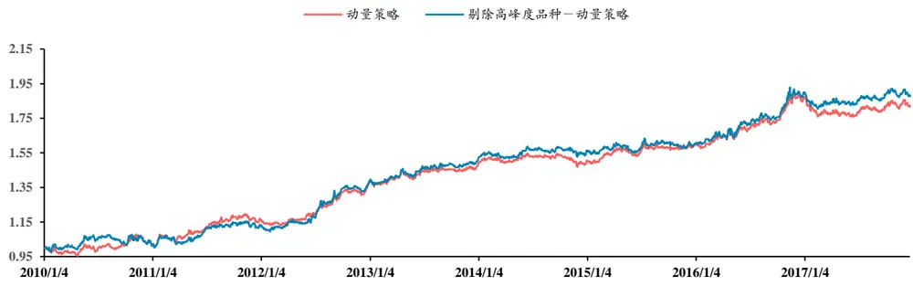
数据来源：Wikipedia、华泰期货研究所

从图 10、2010年至2017年传统动量策略（回溯10天，滚动持仓5天，10%品种对冲）年化收益 10.5%，最大回撤 13.7%，年化波动率 10%，而剔除高峰度的品种后，取得年化收益11.3%，最大回撤 12.6%，年化波动率 10.8%，改进策略保持 10%对冲比例，尽管对冲品种减少了，年化收益有所提高，对冲效果并未下降，最大回撤减小至 12.6%。

## 免责声明

此报告并非针对或意图送发给或为任何就送发、发布、可得到或使用此报告而使华泰期货有限公司违反当地的法律或法规或可致使华泰期货有限公司受制于的法律或法规的任何地区、国家或其它管辖区域的公民或居民。除非另有显示，否则所有此报告中的材料的版权均属华泰期货有限公司。未经华泰期货有限公司事先书面授权下，不得更改或以任何方式发送、复印此报告的材料、内容或其复印本予任何其它人。所有于此报告中使用的商标、服务标记及标记均为华泰期货有限公司的商标、服务标记及标记。

此报告所载的资料、工具及材料只提供给阁下作查照之用。此报告的内容并不构成对任何人的投资建议，而华泰期货有限公司不会因接收人收到此报告而视他们为其客户。

此报告所载资料的来源及观点的出处皆被华泰期货有限公司认为可靠，但华泰期货有限公司不能担保其准确性或完整性，而华泰期货有限公司不对因使用此报告的材料而引致的损失而负任何责任。并不能依靠此报告以取代行使独立判断。华泰期货有限公司可发出其它与本报告所载资料不一致及有不同结论的报告。本报告及该等报告反映编写分析员的不同设想、见解及分析方法。为免生疑，本报告所载的观点并不代表华泰期货有限公司，或任何其附属或联营公司的立场。

此报告中所指的投资及服务可能不适合阁下，我们建议阁下如有任何疑问应咨询独立投资顾问。此报告并不构成投资、法律、会计或税务建议或担保任何投资或策略适合或切合阁下个别情况。此报告并不构成给予阁下私人咨询建议。

华泰期货有限公司2017版权所有。保留一切权利。

## 公司总部

地址：广东省广州市越秀区东风东路761号丽丰大厦20层、29层04单元

电话：400-6280-888

网址：www.htfc.com