## CTA 量化策略因子系列（六）

## 华泰期货研究所 量化组

罗 剑

## 商品成交持仓排名因子（上）

量化组组长

- luojian@htfc.com

从业资格号：F3029622

投资咨询号：Z0012563

## 报告摘要：

本报告为商品成交持仓排名因子的上篇，收集上海期货交易所、大连商品交易所和郑州商品交易所的每日交易排名数据及郑州商品交易所的套期保值数据，在传统的商品成交持仓排名因子和套期保值压力因子的回测结果中，利用商品成交排名应用和套期保值压力理论构建策略取得一定的超额收益。

与动量和期限结构因子相比，风险收益比相较差些。不过无论从整体及滚动相关性验证，与动量策略的相关性不高，可以作为互补策略组合配置。

但同时也发现商品持仓因子最优参数持仓时间较短，且对手续费和滑点较为敏感，策略组合的收益容易被侵蚀，而套期保值因子的公开信息有限，郑州商品交易所公布数据只包含少部分可交易合约，且不公布具体合约额度，即在传统商品持仓因子的使用中应该谨慎对待此。

在往后《CTA量化策略因子系列》报告中，将继续探讨商品持仓排名因子应用。利用商品持仓因子的同时，需要考虑对会员持仓席位交易的特性进行分类，对交易品种板块轮动选择，挖掘商品成交持仓排名因子中更广泛应用与隐藏其中的信息。

## 一、 商品持仓排名策略设计

## （一） 数据与回测参数

## 1．交易所持仓排名公布规则

国内三大商品交易所，包括上海期货交易所、大连商品交易所和郑州商品交易所，在每日收盘后会分品种、合约，按照成交量、持买单量和持卖单量，公布市场会员排名及具体买卖、成交数量。具体三大商品交易所每日持仓排名公布规则略有不同，如表 1 所示。

表 1: 三大商品交易所每日持仓排名数据公布规则

| 交易所 品种 会员名次公布 公布规则 |  |  |  |
| --- | --- | --- | --- |
|  | 铜 |  |  |
|  |  |  | 持仓量>=3万手的合约 |
|  | 铝 |  |  |
|  |  |  | 持仓量>=3万手的合约 |
|  | 锌 |  |  |
|  |  |  | 持仓量>=3万手的合约 |
|  | 铅 |  |  |
|  |  |  | 持仓量>=3万手的合约 |
|  | 镍 |  |  |
|  |  |  | 持仓量>=3万手的合约 |
|  | 锡 |  |  |
|  |  |  | 持仓量>=2万手的合约 |
|  | 黄金 |  |  |
|  |  |  | 持仓量>=2万手的合约 |
|  | 白银 | 合约前20名会员 |  |
|  |  |  | 持仓量>=6万手的合约 |
| 上海期货交易所 |  |  |  |
|  | 螺纹钢 |  |  |
|  |  |  | 持仓量>=20万手的合约 |
|  | 线材 |  |  |
|  |  |  | 持仓量>=12万手的合约 |
|  | 热轧卷板 |  |  |
|  |  |  | 持仓量>=20万手（暂定）的合约 |
|  | 燃料油 |  |  |
|  |  |  | 持仓量>=2万手的合约 |
|  | 沥青 |  |  |
|  |  |  | 持仓量>=10万手的合约 |
|  | 橡胶 |  |  |
|  |  |  | 持仓量>=1万手的合约 |
| 大连商品交易所 全品种 所有会员 全合约郑州商品交易所 全品种 合约前20名会员 最近交割月及活跃月份合约 |  |  |  |

数据来源：上海期货交易所 大连商品交易所 郑州商品交易所 华泰期货研究院

同时郑州商品交易所，每日收盘后也将公布相关品种的期货套期保值持仓数量表，具体参考表 2。

表 2：2018 年3 月 20 日郑州商品交易所的期货套期保值持仓数量表

| 品种 | 买套保额度 | 期货买套保持仓量 | 卖套保额度 | 期货卖套保持仓量 |
| --- | --- | --- | --- | --- |
| SR | 262,200 | 33,741 | 294,600 | 63,869 |
| ZC | 11,700 | 920 | 10,000 | 0 |
| TA | 550,000 | 81,096 | 1,192,000 | 212,180 |
| CF | 28,720 | 3,552 | 161,040 | 51,593 |
| OI | 36,000 | 740 | 217,200 | 24,617 |
| MA | 79,600 | 230 | 70,000 | 0 |
| FG | 1,500 | 0 | 0 | 0 |
| CY | 4,000 | 0 | 0 | 0 |
| RM | 1,000 | 435 | 268,000 | 14,687 |
| AP | 0 | 0 | 1,000 | 461 |
| SF | 2,500 | 0 | 17,000 | 0 |
| SM | 3,500 | 0 | 3,000 | 0 |

数据来源：郑州商品交易所 华泰期货研究院

## 2．策略回测参数

（1）品种选择：本次报告的持仓排名数据选自三大商品交易所较为活跃品种，基本覆盖谷物、油脂油料、软商品、农副产品、有色、贵金属、煤焦钢矿、非金属建材、能源和化工10类的主要品种，具体品种可参考《CTA量化策略因子系列》报告。

（2）回测初始权益：1000 万人民币

（3）交易成本：零手续费与所有品种按单边成交金额万分之三计算；

（4）杠杆：不使用杠杆；

（5）合约选择：主力合约，合约跳价处理参照《CTA 量化策略因子系列》报告；

（6）权重：多空组合中各合约等权重分配；

（7）对冲比例：20%，具体算法参考《CTA 量化策略因子系列》报告；

## （二）策略框架

## 1、会员席位成交持仓排名分析理论

假设交易所会员席位的持仓变化一定程度上反映了期货投资者对市场价格的认可程度及交易行为目的；通过挖掘成交持仓历史变化信息，按会员席位的交易行为、品种持仓结构和换手率等要素将会员席位分类，解析席位交易者的成交持仓因子并构建对冲组合，获得一定超额收益。

## 2、套期保值压力理论

期货市场的参与者可以分为套期保值者和投机者，前者的目的在于锁定自身收益，对冲未来标的价格变动的风险，愿意支付风险补偿来转移风险；投机者是风险偏好者，愿意承担风险但需要风险补偿。

套期保值压力理论认为，正是这种风险的转移导致了现货市场与期货市场的基差。具体解释如下：如果套保者是一个生产商，他希望对冲掉未来 $\begin{aligned}\cdot 产\end{aligned}$ 品价格下降而带来的风险，卖出期货合约，此时持有空头的净头寸。为了将风险转移宁愿支付风险补偿，所以期货合约价格将低于基于现货价格的未来期望价格。随着期货合约的到期，期货价格不断上升，趋于现货的期望价格，持有多头净头寸的投机者获得风险补偿；如果套保者是希望锁定原材料成本的加工商，持有净的多头头寸。为了对冲掉原材料价格上涨的风险，愿意支付高于现货未来期望的价格来购买合约。因此，期货价格在到期的过程中下降，持有空头头寸的投机者获得风险补偿。

## 3、商品成交持仓因子构建

本报告，首先参考市场传统商品成交持仓排名与套期保值压力理论因子，检验在国内市场的应用与效果，构建的传统因子如表3 所示：

表 3：传统商品成交持仓排名与套期保值压力因子

| 因子类别 因子基础算法（N=排名，T=回溯周期） |  |
| --- | --- |
|  | $\frac{\sum_{day=0}^{T}\left(\sum_{i=1}^{N}\Delta\operatorname{Longg}_{i}-\sum_{i=1}^{N}\Delta\operatorname{Short}_{i}\right)}{\sum_{day=0}^{T}\left(\left\|\sum_{i=1}^{N}\Delta\operatorname{Longg}_{i}\right\|+\left\|\sum_{i=1}^{N}\Delta\operatorname{Short}_{i}\right\|\right)}$ |
| 商品成交持仓 | $\frac{\sum_{day=0}^{T}\left(\sum_{i=1}^{N}Long_{i}-\sum_{i=1}^{N}short_{i}\right)}{\sum_{day=0}^{T}\left(\sum_{i=1}^{N}Long_{i}+\sum_{i=1}^{N}short_{i}\right)}$ |
| 排名因子 | $\frac{\left(\sum_{i=1}^{N}Long_{i}-\sum_{i=1}^{N}short_{i}\right)_{T}}{\left(\sum_{i=1}^{N}Long_{i}-\sum_{i=1}^{N}short_{i}\right)_{T-Day}}$ |
|  | Long if $\begin{array}{r}{\mathrm{sign}\big(\sum_{day=0}^{T}\sum_{i=1}^{N}\Delta\mathrm{Long}_{i,day}\big)>0\mathrm{~and~}\mathrm{sign}\big(\sum_{day=0}^{T}\sum_{i=1}^{N}\Delta\mathrm{Short}_{i,day}\big)<0;}\end{array}$ $\begin{array}{r}{\mathrm{Short~if~}\operatorname{sign}\left(\sum_{day=0}^{T}\sum_{i=1}^{N}\Delta\mathrm{Long}_{i,day}\right)<0\mathrm{~and~}\operatorname{sign}\left(\sum_{day=0}^{T}\sum_{i=1}^{N}\Delta\mathrm{Short}_{i,day}\right)>0;}\end{array}$ ; |
| 套期保值压力因子 $\begin{array}{r}{\mathrm{Long~if~}\operatorname{sign}(\sum_{day=0}^{T}\Delta Hedge\;\mathrm{Long}_{day})>0\;\mathrm{and~}\operatorname{sign}(\sum_{day=0}^{T}\Delta Hedge\;Short_{day})<0;}\end{array}$ $\begin{array}{r}{\mathrm{Short~if~}\operatorname{sign}(\sum_{day=0}^{T}\Delta Hedge\;\mathrm{Long}_{day})<0\;\mathrm{and~}\operatorname{sign}(\sum_{day=0}^{T}\Delta Hedge\;\mathrm{Short}_{day})>0;}\end{array}$ |  |

数据来源：郑州商品交易所 华泰期货研究院

## 二、 回测结果

## （一）商品成交持仓排名策略

## 1、商品成交持仓排名因子①：

$$
\frac{\sum_{day=0}^{T}\left(\sum_{i=1}^{N}\Delta\operatorname{Long}_{i}-\sum_{i=1}^{N}\Delta\operatorname{Short}_{i}\right)}{\sum_{day=0}^{T}\left(\left|\sum_{i=1}^{N}\Delta\operatorname{Long}_{i}\right|+\left|\sum_{i=1}^{N}\Delta\operatorname{Short}_{i}\right|\right)}
$$

首先，因子①描述了品种合约排名回溯 day 日公布前 N 名的持买入变化量与持卖单变化量差值与前 N 名的持买入变化量与持卖单变化量绝对值之和比的均值，从此传统商品持仓因子算法表示新增持买卖仓位的头寸多空交易意向变化，简单测试下，本报告选择排名N 参数为[1、5、10、20]，而回溯周期 day参数为[1、5、22、60、120]，以横截面与时序方法构建两组对冲组合，分别为以做多因子值前 20%的品种与做空因子值后 20%的合约、做多全部因子值大于零的品种合约与做空全部因子值小于零的品种合约，回测结果的年化收益率矩阵（无手续费）如表 4、表 5 所示。

表 4：商品成交持仓排名因子①20%对冲组合 单位：%

| 排名回溯 | 1 | 5 | 10 | 20 |
| --- | --- | --- | --- | --- |
| 1 | 1.968 | (0.141) | 1.714 | 2.665 |
| 5 | (0.702) | 2.445 | 1.099 | (1.153) |
| 10 | 0.803 | 2.587 | 4.853 | 4.925 |
| 22 | (2.729) | (0.357) | 0.359 | 0.831 |
| 60 | (0.640) | (0.500) | (1.498) | (1.309) |
| 120 | (1.712) | (0.057) | 0.014 | 2.170 |

数据来源：华泰期货研究院

表 5：商品成交持仓排名因子①全品种对冲 单位：%

| 排名回溯 | 1 | 5 | 10 | 20 |
| --- | --- | --- | --- | --- |
| 1 | 1.935 | 2.702 | 4.095 | 6.683 |
| 5 | 0.498 | 3.081 | 3.011 | 2.294 |
| 10 | 0.221 | 1.038 | 1.987 | 1.990 |
| 22 | (2.312) | 0.408 | 1.198 | 2.108 |
| 60 | (0.471) | 0.764 | 0.291 | (1.448) |
| 120 | (0.545) | 0.931 | 2.347 | 0.197 |

数据来源：华泰期货研究院

根据回测结果发现，无论横截面，时序方法构建的商品成交持仓排名因子①组合，年化收益系矩阵的右上角表现较好，即较短的回溯周期、排名覆盖范围越大，策略组合表现效果越好。

## 2、商品成交持仓排名因子②：

$$
\frac{\sum_{day=0}^{T}\text{ ( }\sum_{i=1}^{N}\operatorname{Longg}_{i}-\sum_{i=1}^{N}\operatorname{Short}_{i}\text{ ) }}{\sum_{day=0}^{T}\text{ ( }\sum_{i=1}^{N}\operatorname{Longg}_{i}+\sum_{i=1}^{N}\operatorname{Short}_{i}\text{ ) }}
$$

商品成交持仓排名因子②描述了品种合约回溯 day 日排名净头寸占比的均值，表示目前品种整体持仓净头寸的情况，选择排名N 参数为[1、5、10、20]，而回溯周期 day参数为[1、5、22、60、120]，同样以横截面与时序方法构建两组对冲组合，分别为以做多因子值前 20%的品种与做空因子值后 20%的合约、做多全部因子值大于零的品种合约与做空全部因子值小于零的品种合约，回测结果的年化收益率矩阵（无手续费）如表6、表7所示。

表 6：商品成交持仓排名因子②20%对冲组合 单位：%

| 排名回溯 | 1 | 5 | 10 | 20 |
| --- | --- | --- | --- | --- |
| 1 | 4.700 | 4.955 | 5.468 | 7.768 |
| 5 | 2.191 | 1.929 | 3.424 | 4.472 |
| 10 | 1.052 | 2.339 | 2.397 | 3.422 |
| 22 | 3.638 | 2.847 | 3.353 | 3.917 |
| 60 | 2.515 | 2.340 | 2.785 | 3.792 |
| 120 | 2.713 | 3.192 | 4.153 | 3.060 |

数据来源：华泰期货研究院

表 7：商品成交持仓排名因子②全品种对冲 单位：%

| 排名回溯 | 1 | 5 | 10 | 20 |
| --- | --- | --- | --- | --- |
| 1 | 4.514 | 5.705 | 6.276 | 7.815 |
| 5 | 1.450 | 3.576 | 4.261 | 4.321 |
| 10 | 2.356 | 2.241 | 2.981 | 3.867 |
| 22 | 4.479 | 3.572 | 4.384 | 3.104 |
| 60 | 5.172 | 4.494 | 3.901 | 5.133 |
| 120 | 4.510 | 3.264 | 4.100 | 4.953 |

数据来源：华泰期货研究院

从回测结果发现，与因子①类似，采用更多的持仓排名信息，所获得组合收益越高。两种组合构建的方法表明，回溯周期越短，因子预测效果越明显。

## 3、商品成交持仓排名因子③：

$$
\frac{\left(\sum_{i=1}^{N}Long_{i}-\sum_{i=1}^{N}short_{i}\right)_{T}}{\left(\sum_{i=1}^{N}Long_{i}-\sum_{i=1}^{N}short_{i}\right)_{T-Day}}-1
$$

商品成交持仓排名因子③描述了在 day 日内里品种合约排名前 N 名会员净头寸变化的情况，利用买卖净头寸的变化情况来假定投资者的交易趋势，参数的选择与组合方法同前因子，回测结果的年化收益率矩阵（无手续费）如表8、表 9所示。

表 8：商品成交持仓排名因子③20%对冲组合 单位：%

| 排名回溯 | 1 | 5 | 10 | 20 |
| --- | --- | --- | --- | --- |
| 1 | 1.473 | (1.549) | (1.501) | (0.597) |
| 5 | (3.155) | (3.550) | (2.687) | (3.269) |
| 10 | (3.819) | (4.775) | (5.520) | (0.916) |
| 22 | 0.693 | (1.504) | (3.503) | (2.837) |
| 60 | (0.570) | (4.206) | (2.138) | (4.240) |
| 120 | (5.450) | (4.523) | (1.628) | (6.323) |

数据来源：华泰期货研究院

表 9：商品成交持仓排名因子③全品种对冲 单位：%

| 排名凹溯 | 1 | 5 | 10 | 20 |
| --- | --- | --- | --- | --- |
| 1 | (2.954) | (4.124) | (1.323) | (2.771) |
| 5 | (4.770) | (5.077) | (3.843) | (3.287) |
| 10 | (3.077) | (2.783) | (3.698) | (3.763) |
| 22 | (1.567) | (4.123) | (4.591) | (5.285) |
| 60 | (2.733) | (4.605) | (5.637) | (5.835) |
| 120 | (2.520) | (5.588) | (4.588) | (6.452) |

数据来源：华泰期货研究院

商品成交持仓排名因子③的整体收益不及因子①②，在无手续费的回测框架下也未能取得良好的收益。

4、商品成交持仓排名因子④：

$$
\begin{array}{r}{\mathrm{Long~if~}\operatorname{sign}(\sum_{day=0}^{T}\sum_{i=1}^{N}\Delta\mathrm{Long}_{i,day})>0\mathrm{~and~}\operatorname{sign}(\sum_{day=0}^{T}\sum_{i=1}^{N}\Delta\mathrm{Short}_{i,day})<0;}\\{\mathrm{Short~if~}\operatorname{sign}(\sum_{day=0}^{T}\sum_{i=1}^{N}\Delta\mathrm{Long}_{i,day})<0\mathrm{~and~}\operatorname{sign}(\sum_{day=0}^{T}\sum_{i=1}^{N}\Delta\mathrm{Short}_{i,day})>0;}\end{array}
$$

商品成交持仓因子④简化了因子构建算法， 使用持买卖头寸的变化量方向作为入场信号，如表 10所示，依据多头增仓并伴随空头减仓的情况下建立多头头寸，空头增仓并伴随多头减仓的信号建立空头头寸，形成对冲组合，收益率矩阵（无手续费）如表 11 所示。

表 10：简易持仓方向变化图

| 多头持仓 | 空头持仓 | 预测方向 |
| --- | --- | --- |
| 增 | 减 | 向上 |
| 增 | 增 | 保持 |
| 减 | 增 | 向下 |
| 减 | 减 | 保持 |

数据来源：华泰期货研究院

表 11：商品成交持仓排名因子④全品种对冲 单位：%

| 排名凹溯 | 1 | 5 | 10 | 20 |
| --- | --- | --- | --- | --- |
| 1 | 10.236 | 14.136 | 10.410 | 13.282 |
| 5 | 5.809 | 9.031 | 9.684 | 9.909 |
| 10 | 4.502 | 0.927 | 1.906 | 7.560 |
| 22 | (0.587) | (1.499) | (2.385) | (1.618) |
| 60 | (0.581) | 0.238 | 1.477 | (0.829) |
| 120 | (1.938) | 0.645 | (0.899) | 0.756 |

数据来源：华泰期货研究院

虽然商品成交因子④的构建最简单，但是从回测的效果来说，在回溯周期较短的情况下可以取得较好的收益。

## （二） 套期保值压力策略

## 1、套期保值压力因子①

$$
\begin{array}{r}{sign\bigl(\sum_{day=0}^{T}Hedge\;Long_{day}-\sum_{day=0}^{T}Hedgeo\;short_{day}\bigr)}\end{array}
$$

按照套期保值压力理论策略，利用前 day 日套期保值净头寸的变化方向构建套期保值压力因子，捕捉套期保持交易者为转移生产风险所支付的溢价，当套期保值净头寸为正时，卖出该品种获取风险补偿，而当净头寸为负时，假设卖出套期保值倾向于此价格建立卖出头寸，所以同时可买入该品种，获取卖出套期保值所支付的溢价，并与多头构建对冲组合。由于郑州商品交易所公布品种的套期保值头寸变化较少，再跟踪流动性原则，测试中只保留 OI、RM、TA、MA、CF 和 SR 品种，且只采用时间序列的方法，根据回溯参数与持仓参数组合，得出年化收益率（无手续费）矩阵，如表 12 所示。

表 12：套期保值压力因子组合①

| 持仓回溯 | 1 | 5 | 10 | 20 |
| --- | --- | --- | --- | --- |
| 1 | 3.109 | 2.130 | 3.891 | 5.138 |
| 5 | 0.950 | 3.570 | 5.244 | 5.654 |
| 10 | 3.294 | 4.713 | 6.012 | 5.758 |
| 22 | 3.730 | 4.962 | 5.318 | 4.987 |
| 60 | 0.543 | 1.670 | 1.719 | 1.465 |
| 120 | (2.277) | (2.115) | (2.374) | (2.473) |

数据来源：华泰期货研究院

表 13：套期保值压力因子组合②单位：%

| 持仓回溯 | 1 | 5 | 10 | 20 |
| --- | --- | --- | --- | --- |
| 1 | 10.995 | 6.999 | 5.396 | 3.493 |
| 5 | 10.975 | 8.308 | 5.024 | 1.729 |
| 10 | 8.913 | 8.128 | 3.820 | 2.213 |
| 22 | 5.341 | 7.137 | 4.911 | 3.650 |
| 60 | 4.656 | 5.143 | 4.399 | 2.824 |
| 120 | (0.001) | 0.097 | (0.725) | (0.863) |

数据来源：华泰期货研究院

从整体收益发现，在统计过去20日以内的套期保值净头寸变化情况时，能够取得一定收益，且持仓周期越久，收益效果越显著。根据套期保值压力理论和矩阵的收益分布也印证了套期保值净头寸的变化一定程度上反应了市场生产商的交易目的，且交易行为具备一定可持续性。

## 2、套期保值压力因子②

$$
\begin{aligned}&\mathrm{Long}\mathrm{if}\mathrm{sign}\left(\sum_{day=0}^{T}\Delta Hedge\operatorname{Long}_{day}\right)>0\text{ and }\mathrm{sign}\left(\sum_{day=0}^{T}\Delta Hedge\operatorname{Shor}t_{day}\right)<0;\\&\mathrm{Shor}\mathrm{if}\mathrm{sign}\left(\sum_{day=0}^{T}\Delta Hedge\operatorname{Long}_{day}\right)<0\text{ and }\mathrm{sign}\left(\sum_{day=0}^{T}\Delta Hedge\operatorname{Shor}t_{day}\right)>0;\\\end{aligned}
$$

套期保值压力因子②采用买入套保头寸与卖出套保的头寸两个变化量的方向作为组合构建头寸的依据，主要考量套期保值压力因子对市场近期价格的反应与影响。当品种的买入套保值的变化量增加并伴随卖出套期保值变化量减小时，建立该品种多头头寸，反之建立空头头寸，并构建对冲组合，年化收益回测数据如表13 所示。

从年化收益矩阵可以发现，套期保值压力因子②对短期的价格方向有一定的影响力，回溯周期及持仓周期越短，套期保值压力因子②的整体收益效果越明显。

## 三、 回测绩效分析

从商品成交持仓排名因子与套期保值压力因子两类策略组合的回测结果，传统商品成交持仓排名因子①②④及套期保值压力因子①②均能取得一定效果。而商品成交持仓排名因子③，利用 day 日净头寸变化率判断会员的交易目的并未能取得正收益，表 9 的商品成交持仓排名因子③全品种对冲的年化收益矩阵，N 日净头寸变化率与未来价格呈负相关关系。

图 1： 商品成交持仓排名因子最优组合 单位：净值
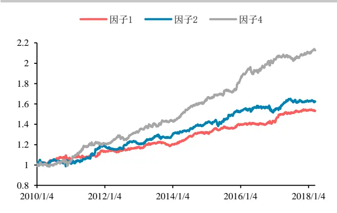
数据来源：华泰期货研究院

图 2：套期保值压力因子策略组合单位：净值
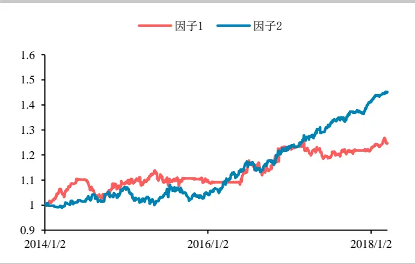
数据来源：华泰期货研究院

图 1、2为无手续费的商品成交持仓排名因子与套期保值压力因子全品种回测最优对冲组合的净值曲线，在无杠杆倍率的情况下，收益与风险分布相对稳定。

## （一） 手续费分析

手续费对于换手率较高的策略，影响较大，本报告分别对传统商品成交持仓排名因子①②④及套期保值压力因子①②策略分别附加单边成交金额万分之三的手续费，度量策略组合信号的稳定性及手续费占比情况。

表 14: 商品成交因子最优参数组合手续费对比

| 商品成交持仓排名因子① |  |  | 商品成交持仓排名因子② |  | 商品成交持仓排名因子④ |  |
| --- | --- | --- | --- | --- | --- | --- |
|  | 回溯1日，排名前20名 |  | 回溯1日，排名前20名 |  | 回溯1日，排名前5名 |  |
|  | 无手续费 | 单边万分之三 | 无手续费 | 单边万分之三 | 无手续费 | 单边万分之三 |
| 年化收益 | 6.68% | -0.52% | 7.81% | 6.81% | 14.14% | 2.17% |
| 最大回撤 | -4.49% | -12.32% | -7.24% | -7.58% | -7.22% | -12.22% |
| 年化波动率 | 4.55% | 4.55% | 6.54% | 6.54% | 7.08% | 7.08% |
| 下行波动率 | 2.93% | 2.96% | 4.16% | 4.17% | 4.92% | 4.93% |
| 夏普比率 | 1.47 | -0.11 | 1.19 | 1.04 | 2 | 0.31 |
| 索提诺比率 | 2.28 | -0.18 | 1.88 | 1.64 | 2.87 | 0.44 |

数据来源：华泰期货研究所

表 14的策略组合的手续费对比，虽然三个因子的最优策略同为回溯 1日，但商品成交持仓排名因子①④受手续费的影响明显大于因子②，年化收益分别下降 107%和 84%，说明手续费占比、换手率较高。而商品成交持仓排名因子②，附加单边万分之 3 的手续费后，年化收益下降12.8%，手续费占比及换手率尚可接受。

表 15: 套期保值压力因子最优参数组合手续费对比

| 套期保值压力因子① |  | 套期保值压力因子② |  |  |
| --- | --- | --- | --- | --- |
| 回溯10日，持仓10日 |  |  | 回溯1日，持仓1日 |  |
|  | 无手续费 | 单边万分之三 | 无手续费 | 单边万分之三 |
| 年化收益 | 6.01% | 5.73% | 11.00% | 4.52% |
| 最大回撤 | -8.20% | -8.32% | -7.14% | -10.97% |
| 年化波动率 | 7.76% | 7.76% | 7.26% | 7.27% |
| 下行波动率 | 6.35% | 6.33% | 5.99% | 5.62% |
| 夏普比率 | 0.77 | 0.74 | 1.51 | 0.62 |
| 索提诺比率 | 0.95 | 0.91 | 1.84 | 0.80 |

数据来源：华泰期货研究所

再观察表 15 的套期保值压力因子策略组合的手续费对比， 因子①受手续费影响比因子②较轻，分别年化收益率下降4.6%和 58.9%。

图 3： 商品成交持仓排名（3%%手续费）单位：净值
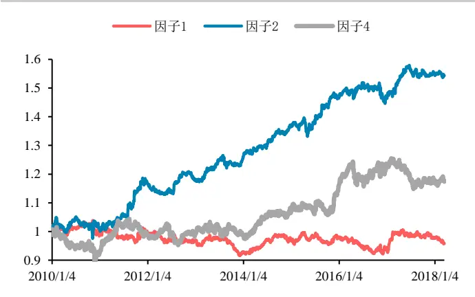
数据来源：华泰期货研究院

图 4：套期保值压力组合（3%%手续费） 单位：净值
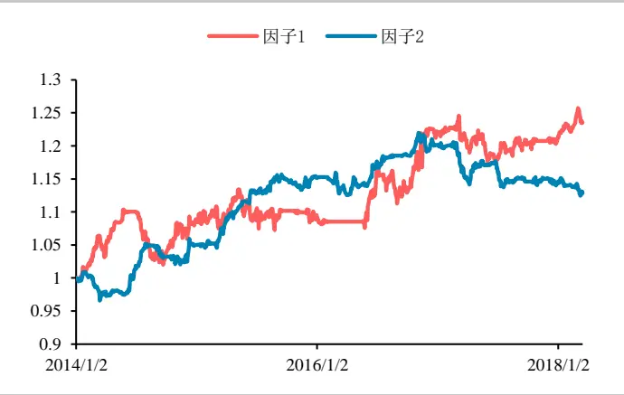
数据来源：华泰期货研究院

从手续费附加后的策略组合效果，商品成交持仓因子②与套期保值压力因子①的影响相对较小，说明此俩策略组合换手率较低且与信号的持续稳定。

## （二） 收益分布

利用商品成交持仓因子②与套期保值压力因子①继续做收益分布检测，看是否对收益时间周期与品种选择较为敏感。

图 5：套期保值压力因子①月收益分布
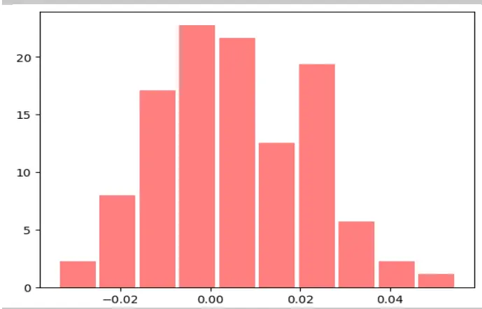
数据来源：华泰期货研究院

图 6：套期保值压力因子①各年收益情况 单位：%
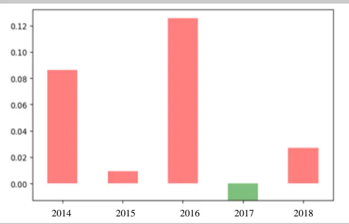
数据来源：华泰期货研究院

套期保值压力因子①组合策略测试周期为 2014年1月 1日至 2018年 3月16日，策略的月胜率 56.87%，年胜率达到80%。由于郑商所套期保值数据较短影响整体测试周期，但在回测期间基本稳定。

在套期保值压力因子组合策略中选取的 6 个流动性较好的可交易品种，在总回测期间有 4个品种分别为TA、MA、RM、CF取得了正收益，但从图 8 各年度品种收益图可发现各品种的年度胜率不一，MA、RM表现最优。

图 7 套期保值压力因子①品种收益分布
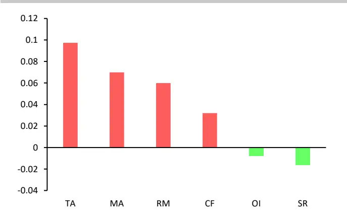
数据来源：华泰期货研究院

图 8：套期保值压力因子①分年度品种收益分布
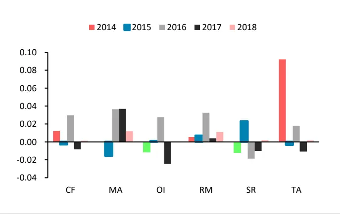
数据来源：华泰期货研究院

商品成交持仓排名的回测周期从 2010年至2018年3 月16 日，月度及年度的胜率分别达到 62.6%和 90%。

图 9：商品成交持仓排名因子①月收益分布
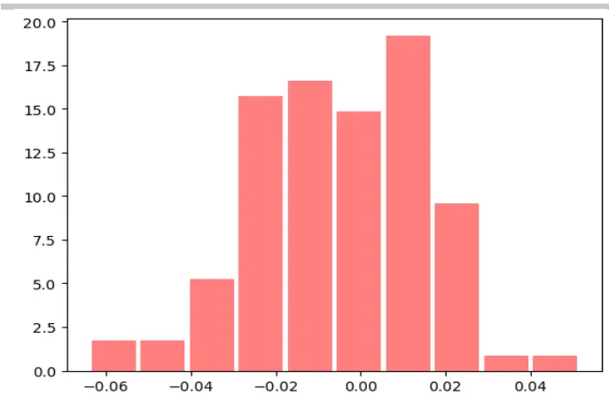
数据来源：华泰期货研究院

图 10：商品成交持仓排名因子①各年收益情况 单位：%
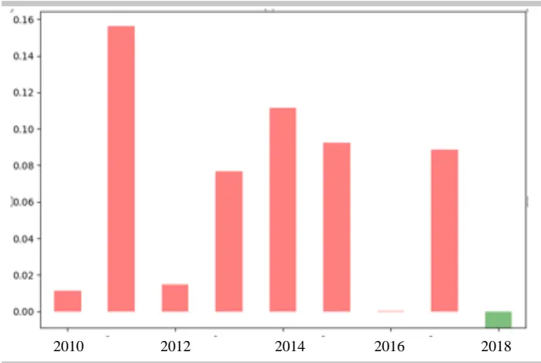
数据来源：华泰期货研究院

## （三）策略相关性

商品成交持仓排名策略与传统 CTA 动量策略做相关性比较，动量策略采用回溯 10 天滚动持仓 5天的参数，具体组合方法可参考，回测周期从 2010 年1 月 1日至 2018 年 3 月16 日，整体的相关性0.09，滚动100天的相关性如图 11，在[-0.4,+0.4]区间波动。

套期保值压力因子策略与动量策略整体相关性则更低，达到 0.01，而从图 12的套期保值压力因子与动量策略 100 天滚动相关性来看，除 2014 年及 2018 年在 0.4 附近，其余大部分时间在[-0.2,+0.2]间波动。.

图 11：商品持仓策略与动量策略 100 天滚动相关性
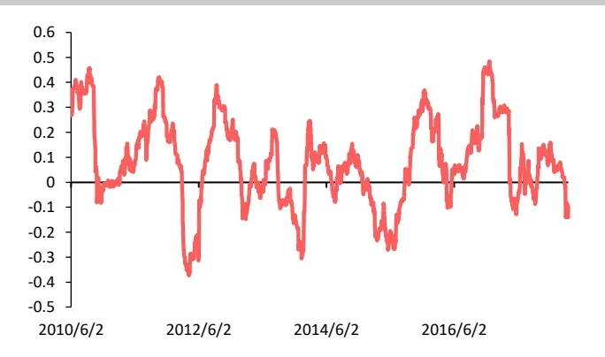
数据来源：华泰期货研究院

图 12：套保压力策略与动量策略 100 天滚动相关性
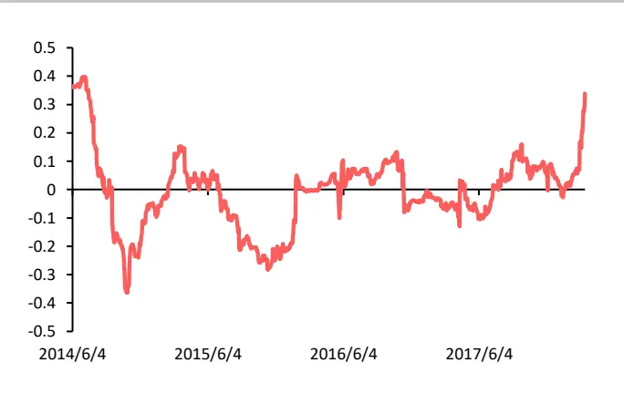
数据来源：华泰期货研究院

综上所述，利用传统商品成交持仓排名因子与套期保值因子构建组合策略，能够取得一定的收益，但与动量和期限结构因子相比，风险收益比相较差些。不过无论从整体及滚动相关性验证，与动量策略的相关性不高，可以作为互补策略组合配置。

但在实际商品持仓因子与套期保值因子应用过程中，应该审慎考虑手续费及滑点问题，从回测参数优化结果得出，商品持仓因子最优参数持仓时间较短，且对手续费和滑点较为敏感，策略组合的收益容易被侵蚀。

因套期保值因子的公开信息有限，郑州商品交易所公布数据只包含少部分可交易合约，且不公布具体合约额度，在构建因子时需评估因子建模的有效性，而在配置商品持仓因子同时需要考虑对会员持仓席位交易的特性，更大程度的挖掘商品成交持仓排名因子的应用范畴。在往后《CTA 量化策略因子系列》报告中，也将继续探讨商品持仓排名因子的更广泛应用。

## 免责声明

此报告并非针对或意图送发给或为任何就送发、发布、可得到或使用此报告而使华泰期货有限公司违反当地的法律或法规或可致使华泰期货有限公司受制于的法律或法规的任何地区、国家或其它管辖区域的公民或居民。除非另有显示，否则所有此报告中的材料的版权均属华泰期货有限公司。未经华泰期货有限公司事先书面授权下，不得更改或以任何方式发送、复印此报告的材料、内容或其复印本予任何其它人。所有于此报告中使用的商标、服务标记及标记均为华泰期货有限公司的商标、服务标记及标记。

此报告所载的资料、工具及材料只提供给阁下作查照之用。此报告的内容并不构成对任何人的投资建议，而华泰期货有限公司不会因接收人收到此报告而视他们为其客户。

此报告所载资料的来源及观点的出处皆被华泰期货有限公司认为可靠，但华泰期货有限公司不能担保其准确性或完整性，而华泰期货有限公司不对因使用此报告的材料而引致的损失而负任何责任。并不能依靠此报告以取代行使独立判断。华泰期货有限公司可发出其它与本报告所载资料不一致及有不同结论的报告。本报告及该等报告反映编写分析员的不同设想、见解及分析方法。为免生疑，本报告所载的观点并不代表华泰期货有限公司，或任何其附属或联营公司的立场。

此报告中所指的投资及服务可能不适合阁下，我们建议阁下如有任何疑问应咨询独立投资顾问。此报告并不构成投资、法律、会计或税务建议或担保任何投资或策略适合或切合阁下个别情况。此报告并不构成给予阁下私人咨询建议。

华泰期货有限公司2018版权所有。保留一切权利。

## 公司总部

地址：广东省广州市越秀区东风东路761号丽丰大厦20层、29层04单元

电话：400-6280-888

网址：www.htfc.com