华泰期货研究所 量化组

# CTA 量化策略因子系列（七）商品动量因子新升级

罗剑

量化组组长

- luojian@htfc.com

## 报告摘要：

从业资格号：F3029622

无论从对冲压力假说或投资者行为偏差，即过度反应等理论，市场已证明动量因子和动量效应的存在，但跟踪以动量趋势策略为主的管理期货策略分类指数和传统动量因子组合，近期的超额收益表现低迷，且与历史平均水平相比，最近一次回撤周期较长。

投资咨询号：Z0012563

面对近期的管理期货复合策略及动量策略的表现不佳，从动量收益与市场波动率及期限结构的相关性出发，由动量策略的理论提取过度反应的投资者行为偏差和现货溢价理论的逻辑框架，重新构筑新动量因子，从回测优化结果看，与传统动量策略相比，有效提高整体收益水平，且能降低最大回撤和波动率水平。

## 一、 整体管理期货策略市场回顾

管理期货策略分类指数由私募排排网收录的全市场管理期货策略基金收益组成，包括主观趋势、主观套利、系统化高频、趋势、套利及复合策略。中证商品期货动量策略指数净值走势，计算中证商品期货成份指数中所有商品期货过去 3 个月的累计收益率，并降序排名； 选择累计收益率排名前 7 位的商品期货为指数样本的组合收益，并且每季度调整一次。

从图 1、图 2 的管理期货策略分类指数与中证商品期货动量策略指数净值走势，2016年 1 月至 2018 年 3 月管理期货策略与动量策略的累计对数收益分别达到 13.3%和 33.4%，但中证商品期货动量策略指数的年化波动率明显比管理期货策略分类指数大，分别达到15.4%与 4.9%，且从最大回撤的角度看同样也是中证商品期货动量策略指数比较大。

图 1：管理期货策略分类指数
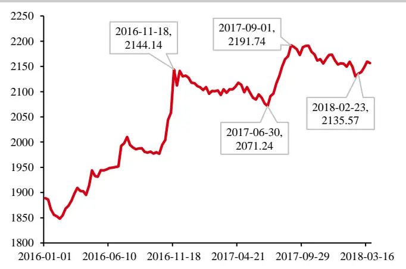
数据来源：私募排排网 华泰期货研究院

图 2：中证商品期货动量策略指数单位：净值
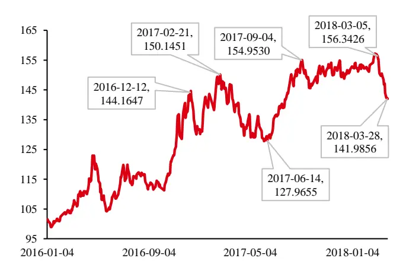
数据来源：Wind 华泰期货研究院

同时上述两指数的收益的贡献大部分来自 2016年度，在2016年底与2017年9月大的趋势行情结束，面临整体商品指数的反转，无论是复合策略型的管理期货策略分类指数或动量驱动的中证商品期货动量指数均表现不佳且录得大幅回撤。

除了市场的复合管理期货指数与中证商品动量指数近期表现不佳外，之前《CTA 量化策略因子系列》报告所展示的横截面动量因子策略，回溯10日、滚动持仓5日的策略，同样净值走势表现低迷。从2016年年底的高点，回撤达到 14%。

管理期货策略基金新发行规模统计，整体市场新发行规模在 2016年 3月达到高点，市场新发行情况受管理期货整体业绩表现及监管政策影响明显，大幅度回落。

图 3：横截面动量策略净值图
单位：净值
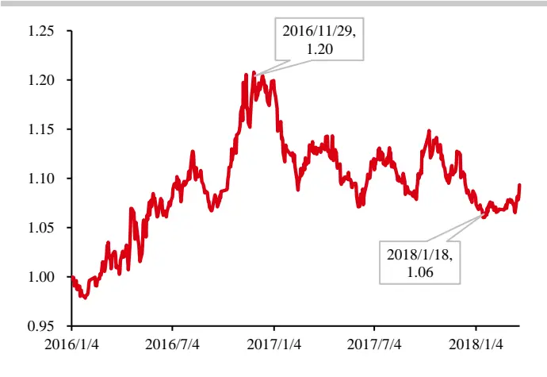
数据来源：华泰期货研究院

图 4：管理期货策略基金新发行规模统计 单位：亿
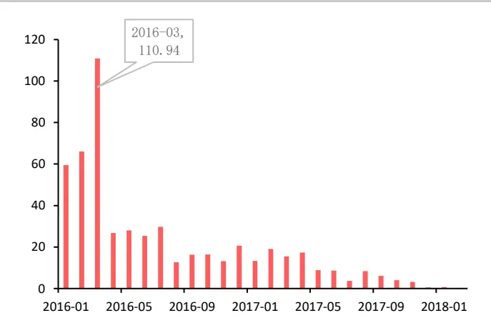
数据来源：私募排排网 华泰期货研究院

## 二、 动量因子的重构

之前《CTA 量化策略因子系列》报告中展示的横截面动量策略（回溯10 日、滚动持仓5日，对冲比例10%）的多空组合，从2010年1月至2018年3月的回测结果看，存在3段回撤幅度较大的区间，前两段区间在半年左右，但最近一次大幅度回撤已经从2016年持续至2018 年2 月份的最低点，虽最近有所止跌，但是否能结束传统动量策略的回撤周期，迎来新一轮的反弹？市场投资者对商品动量因子表现持有怀疑态度，本报告将从一个新的角度诠释市场动量因子，并捕捉市场动量所带来的超额收益。

图 5：2018 年 3 月 20 日郑州商品交易所的期货套期保值持仓数量表
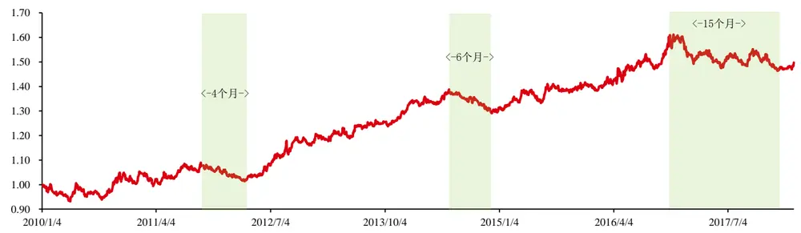
数据来源：华泰期货研究院

首先，从动量策略的基本框架原理入手，市场解释动量效应生产的原因包括对冲压力假说及投资者行为偏差，即过度反应等。动量策略盈利的假设前提是市场会延续资产标的物之前的涨（跌）幅趋势，并且锁定合适的动量判断周期也影响动量策略的收益情况。

## （1） 动量策略收益与波动率相关性

把商品按回溯周期的波动率高低按四分位，分成四组一篮子商品合约，Group A 为波动率最小组，Group D 为波动率最大组。再按传统动量策略测试，手续费按单边万分之 3 收取，从图 6 的波动率分组收益图显示高波动率组的商品，获得动量的超额收益最高，年化收益率达到 8.38%，而低波动率组的整体收益只有 2.84%，证明动量策略的收益系与商品的波动率正相关。

图 6：横截面动量策略波动率分组收益
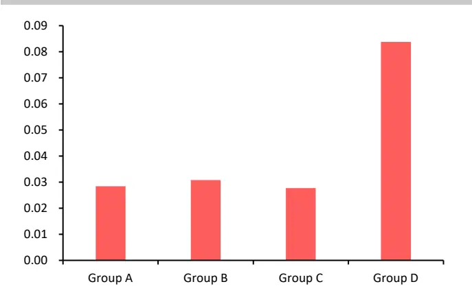
数据来源：华泰期货研究院

图 7：高、低波动率品种动量策略走势 单位：净值
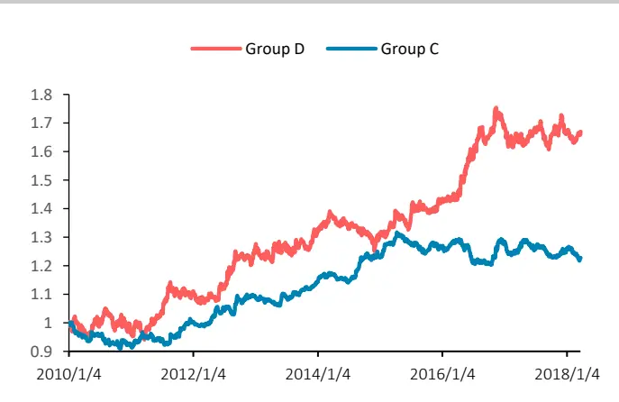
数据来源：华泰期货研究院

从图 7的高、低波动率品种分别的动量策略走势净值图，在市场单边行情的时候，例如 2016 年商品期货的牛市行情，高波动率品种的动量策略更容易获得良好的收益。

## （2） 动量策略收益与期限结构的相关性

由期限结构的现货溢价与套期保值压力理论可得，无论生产商还是贸易商，需要通过在期货市场卖出或买入商品期货合约进行风险转移将支付一笔风险溢价，且远月合约随着交割日的临近将回归现货合约价格。即买入现货溢价合约，同时卖出期货溢价合约的组合，随着交割日临近将获得风险溢价收益。

依据上述逻辑架构，将现货溢价程度同样按四分位分组，Group A 为现货溢价程度最小组，Group D为现货溢价程度最大组。套入传统横截面动量策略，手续费按单边万分之3收取，由图8、图9的分组多头、空头回测年化收益结果可得，做多动量策略现货溢价程度越大的合约，获取收益能力越强；相反，做空动量策略现货溢价程度越小（期货溢价），获得收益越高。即证明，动量策略的收益与现货溢价程度正相关。

图 8：横截面动量策略现货溢价分组多头收益 单位：%
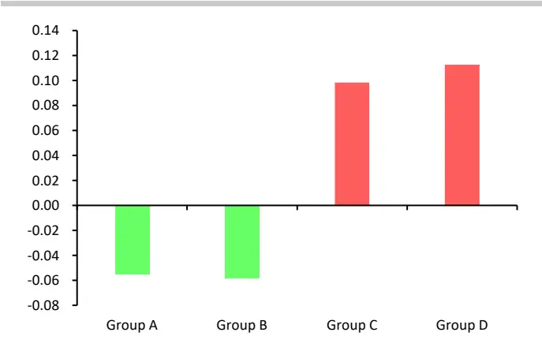
数据来源：华泰期货研究院

图 9：横截面动量策略现货溢价分组空头收益 单位：%
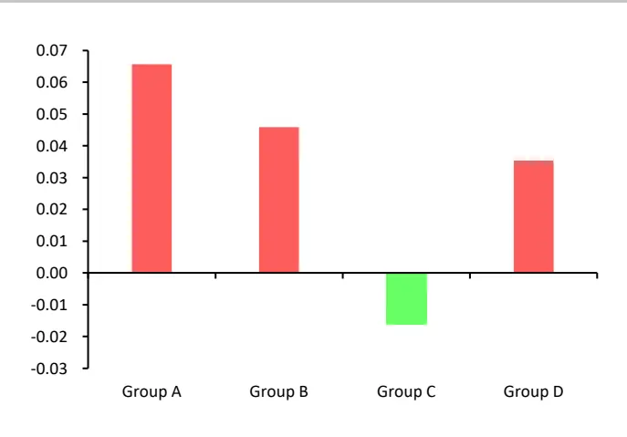
数据来源：华泰期货研究院

## （3） 新动量因子构建

经过测量，发现商品波动率、期限结构与动量策略收益的呈正相关性，即可通过度量商品的波动率与期限结构重构新动量因子。

## 多头：现货溢价且高波动率

空头：期货溢价且高波动率

品种选择：本次测试的持仓排名数据选自三大商品交易所较为活跃品种，基本覆盖谷物、油脂油料、软商品、农副产品、有色、贵金属、煤焦钢矿、非金属建材、能源和化工 10类的主要品种，具体品种可参考《CTA量化策略因子系列》报告。

回测初始权益：1000 万人民币

回测周期：2010 年 1 月至 2018 年 3 月

交易成本：所有品种按单边万分之三计算；

杠杆：不使用杠杆；

合约选择：主力合约，合约跳价处理参照《CTA量化策略因子系列》报告；

权重：多空组合中各合约等权重分配；

对冲比例：20%，具体算法参考《CTA量化策略因子系列》报告；

回溯周期 N 选择[10、22、60、120、250]，而滚动持仓周期选择[5、10、22、60、120]，依据上述条件，重构新动量因子策略。

图 10：新动量因子策略年化收益矩阵

| 持仓回溯 | 5 | 10 | 22 | 60 | 120 |
| --- | --- | --- | --- | --- | --- |
| 10 | 4.851 | 7.554 | 9.093 | 9.612 | 8.237 |
| 22 | 4.200 | 8.058 | 9.850 | 10.251 | 8.507 |
| 60 | 3.369 | 7.163 | 10.125 | 11.131 | 8.974 |
| 120 | 7.827 | 11.029 | 12.974 | 12.290 | 9.295 |
| 250 | 7.812 | 11.218 | 12.335 | 11.215 | 9.193 |

数据来源：华泰期货研究院

图 11：新动量因子策略夏普比率收益矩阵单位：%

| 持仓凹溯 | 5 | 10 | 22 | 60 | 120 |
| --- | --- | --- | --- | --- | --- |
| 10 | 0.496 | 0.803 | 1.053 | 1.274 | 1.247 |
| 22 | 0.416 | 0.821 | 1.073 | 1.282 | 1.218 |
| 60 | 0.327 | 0.711 | 1.051 | 1.315 | 1.217 |
| 120 | 0.756 | 1.077 | 1.320 | 1.431 | 1.237 |
| 250 | 0.749 | 1.087 | 1.240 | 1.296 | 1.209 |

数据来源：华泰期货研究院

假设判断高波动率品种的分位数为0.75，从图 10、图 11新动量因子年收益矩阵与夏普比率矩阵显示，回溯周期越长、滚动持仓周期越久，整体收益较好。最佳参数为回溯 120 日动量因子与波动率水平，滚动持仓 60 日，年化收益达到 12.29%，夏普比率为1.43。

图 12：新动量因子不同波动率组合对比单位：%
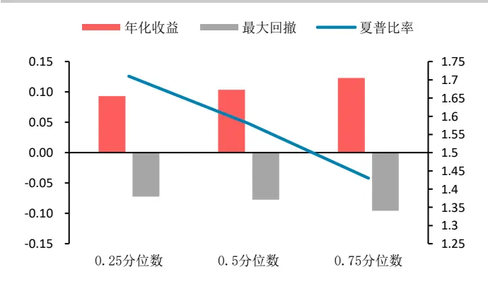
数据来源：华泰期货研究院

图 13：新动量因子不同波动率组合走势 单位：净值
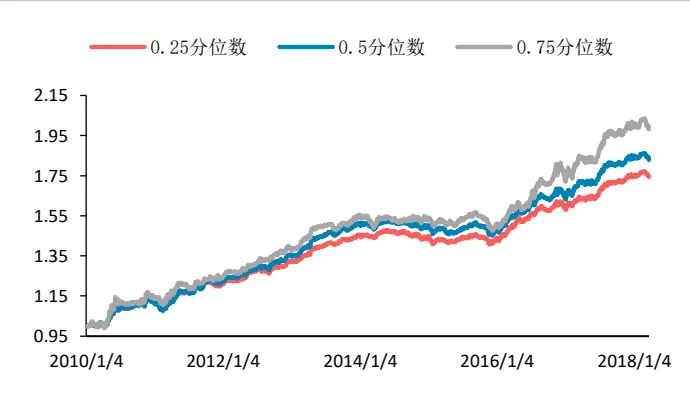
数据来源：华泰期货研究院

按最佳回溯周期 120日、滚动持仓60日，观察不同波动率组合收益情况，图 13显示若高波动率品种的判断分位数取样为[0.25、0.5、0.75]，虽然波动率0.75分位数以上品种组合累计收益仍最高，但 3 种分位数标准的夏普比率分别为 1.71、1.58 和 1.43，最大回撤为-7.25%、-7.75%、-9.58%。即只要剔除较低波动率的合约，对冲合约增加可达到分散风险，减小最大回撤与波动率的效果，且对冲合约数范围越大，有利于降低风险，提高夏普比率。

图 14：新动量因子与传统横截面动量策略走势对比
单位：净值
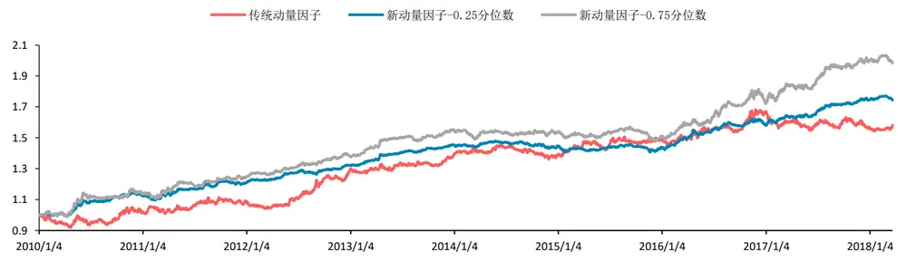
数据来源：华泰期货研究院

图14为新动量因子策略净值与传统横截面动量因子策略比较，明显发现新动量因子策略的波动率有所降低，整体收益也有所提高，在市场发生大幅度反转行情的适应性比传统动量因子策略强。

图 15：新动量因子-0.75 分位数波动率组合收益分布
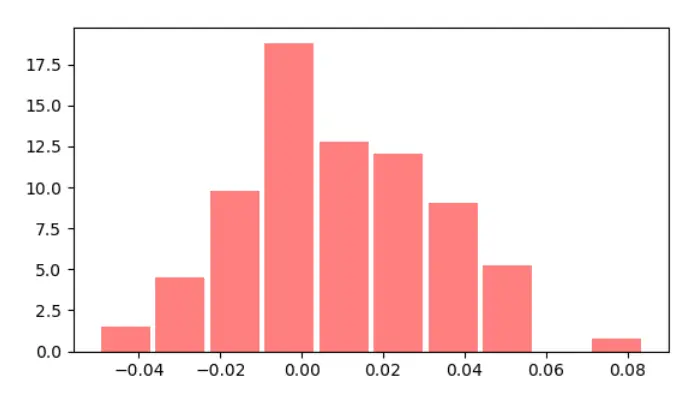
数据来源：华泰期货研究院

图 16：新动量因子-0.75 分位数年度收益分布
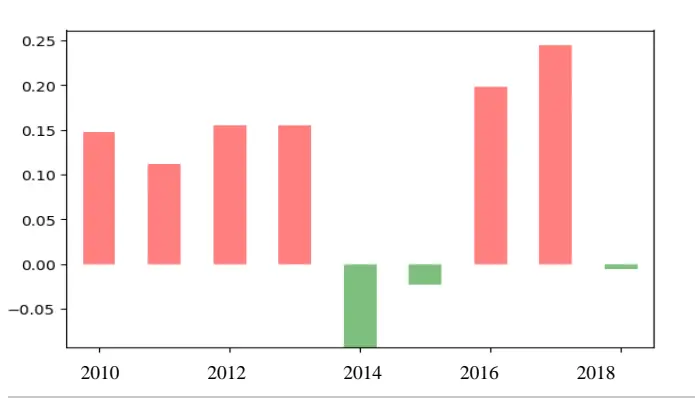
数据来源：华泰期货研究院

据统计结果，新动量因子策略 0.75 波动率分位数组合，月胜率达到 58.9%，除了2014、2015年表现欠佳，其它年份收益水平稳定且相近。

若选择0.25分位数的波动率组合，随着可对冲合约数目增加，随便收益有所降低，但整体夏普比率有所提高，月胜率较0.75分位数组合有所增加，达到 67.7%。

图 17：新动量因子-0.25 分位数波动率组合收益分布
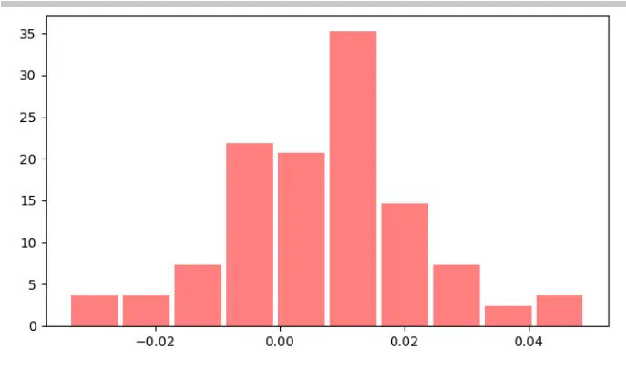
数据来源：华泰期货研究院

图 18：新动量因子-0.25 分位数年度收益分布
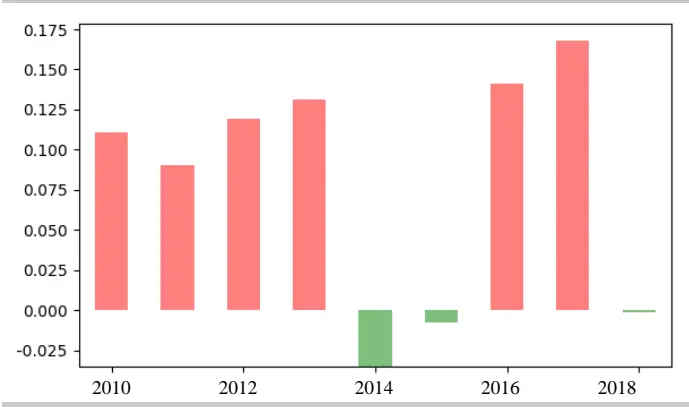
数据来源：华泰期货研究院

综上所述，从动量收益与市场波动率及期限结构的相关性出发，品种的波动率及期限结构均与动量策略收益呈正相关关系，利用由动量策略的理论提取过度反应的投资者行为偏差和现货溢价理论的逻辑框架，本次报告重新构筑新动量因子，从整体回测优化结果看，无论从净值的超额收益、策略波动率或最大回撤，与传统的动量策略相比较，新动量因子都有显著提高。

## 免责声明

此报告并非针对或意图送发给或为任何就送发、发布、可得到或使用此报告而使华泰期货有限公司违反当地的法律或法规或可致使华泰期货有限公司受制于的法律或法规的任何地区、国家或其它管辖区域的公民或居民。除非另有显示，否则所有此报告中的材料的版权均属华泰期货有限公司。未经华泰期货有限公司事先书面授权下，不得更改或以任何方式发送、复印此报告的材料、内容或其复印本予任何其它人。所有于此报告中使用的商标、服务标记及标记均为华泰期货有限公司的商标、服务标记及标记。

此报告所载的资料、工具及材料只提供给阁下作查照之用。此报告的内容并不构成对任何人的投资建议，而华泰期货有限公司不会因接收人收到此报告而视他们为其客户。

此报告所载资料的来源及观点的出处皆被华泰期货有限公司认为可靠，但华泰期货有限公司不能担保其准确性或完整性，而华泰期货有限公司不对因使用此报告的材料而引致的损失而负任何责任。并不能依靠此报告以取代行使独立判断。华泰期货有限公司可发出其它与本报告所载资料不一致及有不同结论的报告。本报告及该等报告反映编写分析员的不同设想、见解及分析方法。为免生疑，本报告所载的观点并不代表华泰期货有限公司，或任何其附属或联营公司的立场。

此报告中所指的投资及服务可能不适合阁下，我们建议阁下如有任何疑问应咨询独立投资顾问。此报告并不构成投资、法律、会计或税务建议或担保任何投资或策略适合或切合阁下个别情况。此报告并不构成给予阁下私人咨询建议。

华泰期货有限公司2018版权所有。保留一切权利。

## 公司总部

地址：广东省广州市越秀区东风东路761号丽丰大厦20层、29层04单元

电话：400-6280-888

网址：www.htfc.com