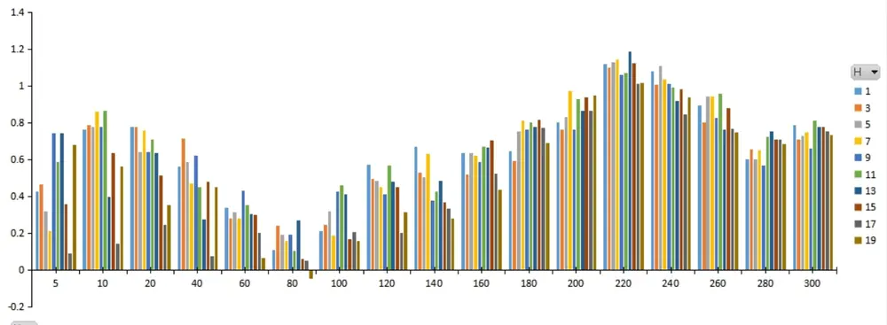
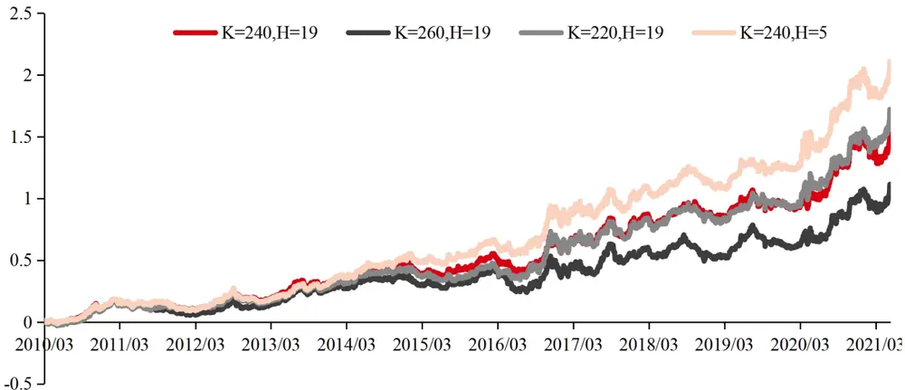
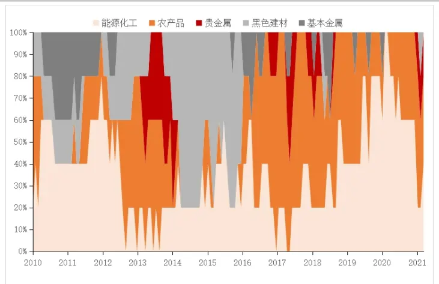
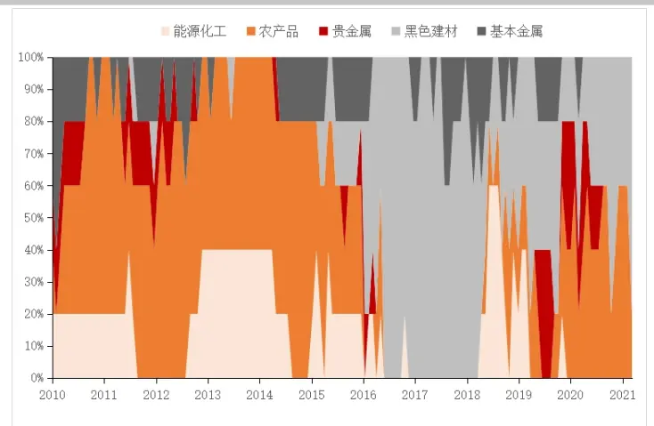
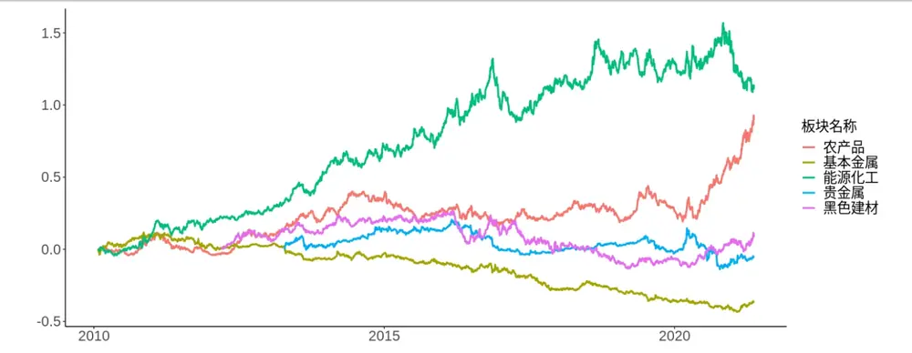
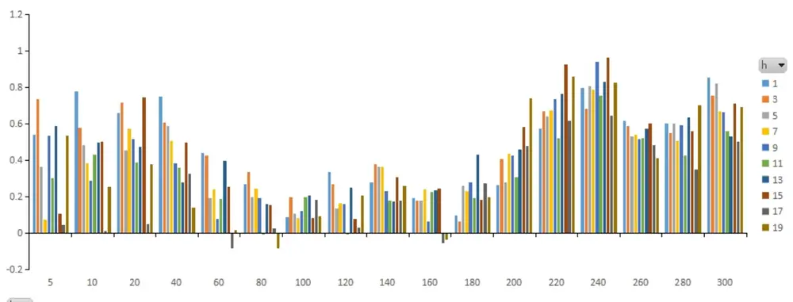
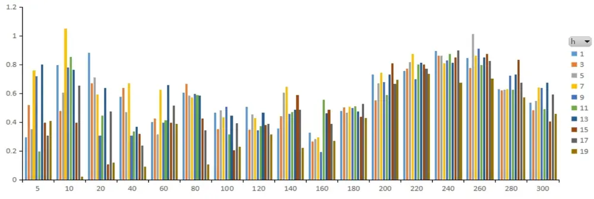
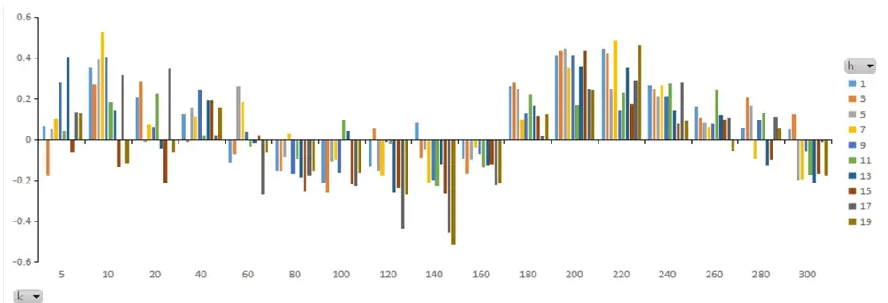
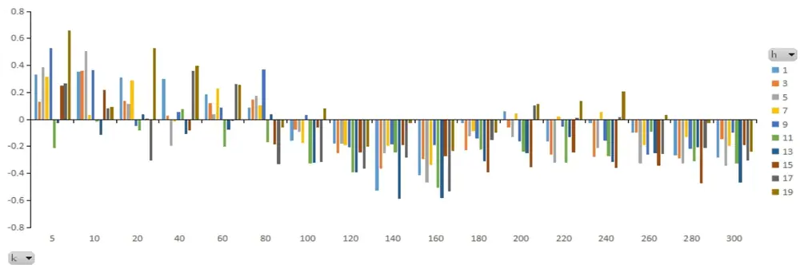
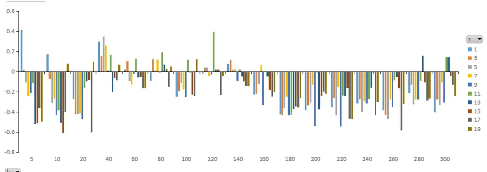

## 截面动量策略参数分组测试（一）

## 摘要：

投资咨询业务资格：

截面动量策略是指对做多过去收益率较高的品种，做空过去收益率较低的品种，获得对动量暴露的风险溢价。其中策略主要的两个参数为：

排序期 K：策略中用于计算量化指标或因子的时间长度，即历史收益率滚动窗口的大小。

证监许可【2011】1289 号

持有期 H：策略中持有金融工具的时间长度，持有期结束时按照新的因子值更新持仓。

从（K，H）分组测试策略夏普表现上看，网格格点分布连续性较好，横截面动量对参数具有相当的稳定性。有趣的是两个局部最优的区域分别对应位于 K=220 以及 K=10区域，分别对应了年度、双周度两个不同的周期。在 K=220 时，H 任意选取，策略都达到的局部最优，这说明我们将一年的滚动窗口缩短到 11个月左右，策略表现得到了明显提升。横截面动量策略对 K的敏感性明显强于 H，K值选取220历史表现最优。

本文针对（K，H）这两个参数进行分组测试，考察参数的鲁棒性以及最优参数如何选取。

板块上，能化板块与农产品板块横截面动量策略收益较好，双周度与年度两个周期动量效应明显，但是基本金属板块的动量效应很弱，且夏普分布上与其他板块刚好相反，基本金属在双周度与年度两个周期动量策略表现较差，反映出基本金属与其他板块可能存在某些内部的差异。

研究院 量化组

研究员

## 陈辰

- 0755-23887993

- chenchen@htfc.com

从业资格号：F3024056

投资咨询号：Z0014257

## 何绪纲

- 0755-23887993

- hexugang@htfc.com

从业资格号：F3069194

## 镇谌博

- 0755-23887993

- zhenchenbo@htfc.com

从业资格号：F3080231

## 一、 引言

动量效应，即资产的价格沿着原先运动方向继续发展的特性，在投资组合中表现为过去一定时间收益率较高的资产在未来一定时间的表现仍会优于过去收益率较低的资产。因此，做多历史收益率高的品种，做空历史收益率低的品种可以获得溢价。

截面动量策略是指对做多过去收益率较高的品种，做空过去收益率较低的品种，获得对动量暴露的风险溢价，截面考虑的是品种间的相对表现，需要与时序动量的概念区分开，时序动量是与自身过去的收益表现比较。

截面动量策略主要的两个参数为：

排序期 K：策略中用于计算量化指标或因子的时间长度，即历史收益率滚动窗口的大小。

持有期 H：策略中持有金融工具的时间长度，持有期结束时按照新的因子值更新持仓。

在《商品动量策略指数》中，我们持有期选择自然月，通过对不同排序期进行测试，最终选取了 K=230 作为指数的排序期。在《智 AI 科技慧投未来》中，我们选取K=252作为排序期，以过去一年作为滚动窗口。本文针对（K，H）这两个参数进行分组测试，考察参数的鲁棒性以及最优参数如何选取。

## 二、 全市场截面动量策略

## （一）最优参数分布

交易品种选取：全部商品品种，新品种上市一年之后进入样本空间。流动性上考虑，每个月底统计本月各品种的成交金额，在下个月交易样本空间中剔除成交金额排名后 30%的品种。

合约选取：各个品种的主力连续合约收益率序列，对主力移仓换月进行复权处理。

交易机制：多（空）过去 K日主力连续累计收益率排名靠前（后）的 5个品种，若可交易品种少于 10 个，则多（空）（可交易品种数/2）向下取整个品种。

交易成本：暂未考虑交易成本。

K 的选取：覆盖周（5）、双周（10）、月（20）并逐步扩展到年（240、260）附近。

H 的选取：1至 19，每 2 个交易日一步，H = 19近似月度调仓。

对（K，H）这两个参数进行分组测试，常见的选取方式是使用（自然年，自然月），但是测试下来并不是最优的，例如在《商品动量策略指数》中，将 K改为 230后夏普明显提升。

## （K，H）分组测试策略夏普表现如下：

表格 1: 全商品市场横截面动量策略夏普表现

| K H | 1 | 3 | 5 | 7 | 9 | 11 | 13 | 15 | 17 | 19 |
| --- | --- | --- | --- | --- | --- | --- | --- | --- | --- | --- |
| 5 | 0.43 | 0.47 | 0.32 | 0.21 | 0.74 | 0.58 | 0.74 | 0.36 | 0.09 | 0.68 |
| 10 | 0.76 | 0.79 | 0.78 | 0.86 | 0.78 | 0.87 | 0.40 | 0.63 | 0.14 | 0.56 |
| 20 | 0.78 | 0.78 | 0.64 | 0.76 | 0.64 | 0.71 | 0.64 | 0.52 | 0.24 | 0.35 |
| 40 | 0.56 | 0.71 | 0.59 | 0.47 | 0.62 | 0.45 | 0.28 | 0.48 | 0.08 | 0.45 |
| 60 | 0.34 | 0.28 | 0.32 | 0.28 | 0.43 | 0.36 | 0.30 | 0.30 | 0.20 | 0.07 |
| 80 | 0.11 | 0.24 | 0.19 | 0.16 | 0.19 | 0.10 | 0.27 | 0.06 | 0.05 | -0.04 |
| 100 | 0.21 | 0.24 | 0.32 | 0.19 | 0.43 | 0.46 | 0.41 | 0.17 | 0.21 | 0.16 |
| 120 | 0.57 | 0.49 | 0.48 | 0.45 | 0.41 | 0.57 | 0.48 | 0.45 | 0.20 | 0.31 |
| 140 | 0.67 | 0.53 | 0.51 | 0.63 | 0.38 | 0.43 | 0.49 | 0.37 | 0.33 | 0.28 |
| 160 | 0.64 | 0.52 | 0.64 | 0.62 | 0.59 | 0.67 | 0.67 | 0.71 | 0.53 | 0.44 |
| 180 | 0.64 | 0.59 | 0.75 | 0.81 | 0.76 | 0.80 | 0.78 | 0.81 | 0.77 | 0.69 |
| 200 | 0.80 | 0.76 | 0.83 | 0.97 | 0.76 | 0.93 | 0.86 | 0.94 | 0.86 | 0.95 |
| 220 | 1.12 | 1.10 | 1.13 | 1.14 | 1.06 | 1.07 | 1.19 | 1.12 | 1.01 | 1.02 |
| 240 | 1.08 | 1.01 | 1.11 | 1.04 | 1.01 | 0.99 | 0.92 | 0.98 | 0.85 | 0.94 |
| 260 |  |  |  |  |  |  |  |  |  |  |
|  | 0.89 | 0.80 | 0.94 | 0.95 | 0.83 | 0.96 | 0.76 | 0.88 | 0.77 | 0.75 |
| 280 | 0.60 | 0.66 | 0.60 | 0.65 | 0.57 | 0.73 | 0.75 | 0.71 | 0.71 | 0.69 |
| 300 | 0.79 | 0.71 | 0.73 | 0.75 | 0.66 | 0.81 | 0.78 | 0.78 | 0.75 | 0.74 |

资料来源：天软 华泰期货研究院

图 1： 全商品市场横截面动量策略夏普表现

数据来源：天软 华泰期货研究院

从表 1 可以看到，横截面动量对参数具有稳定性，格点分布上具有较好的连续性。有趣的是两个局部最优的区域分别对应位于 K=220 以及 K=10 区域，分别对应了年度、双周度两个不同的周期。在 K=220 时，H 任意选取，策略都达到的局部最优，这说明我们将一年的滚动窗口缩短到 11个月左右，策略表现得到了明显提升。在 K=80 时，策略处于局部的最差表现，同时在 K=10、20以及 H 处于 1 至 11之间，收益也是局部的最优。我们也将在后续报告中针对年度、月度动量结合进行进一步测试。

我们还可以看到，表 1 每行上的数值差距不大，但是每列的数值跨度较大，从而说明 K的选取对策略的表现影响更大，因此我们后文中主要对 K进行测试。同时我们认为，在 K取值较小时，H 选取不宜过大，因为过去信息量不够，动量衰减的速度快于移仓的速度。

当把持有期从 19 提高频率到 5，策略收益率有所提升，但是在考虑交易费用后可能提升效果并不明显。

图 2： 关键参数下截面动量策略历史表现

数据来源：天软 华泰期货研究院

表格 2: 关键参数下截面动量策略统计指标

| K_H | 年化收益率 | 波动率 | 偏度 | 峰度 | CVaR(5%) | VaR(5%) | 最大回撤率 | 夏普 |
| --- | --- | --- | --- | --- | --- | --- | --- | --- |
| 240_19 | 8.80% | 9.36% | -0.14 | 4.31 | 1.38% | 0.89% | 10.31% | 0.94 |
| 260_19 | 7.06% | 9.43% | -0.07 | 4.04 | 1.39% | 0.91% | 13.62% | 0.75 |
| 220_19 | 9.42% | 9.27% | -0.21 | 4.55 | 1.35% | 0.85% | 9.99% | 1.02 |
| 240_5 | 10.37% | 9.37% | -0.19 | 3.54 | 1.37% | 0.91% | 9.01% | 1.11 |

资料来源：天软 华泰期货研究院

## （二）K值时序变化

为什么持仓期 K选取220策略表现优于 240与 260，随着时间的推移，是否与交易者的习惯有关系，K的最优参数是否有逐步提前的趋势呢，我们考察在 H=19 时不同的 K值的每年夏普比率，表 2 中看不出最优 K值逐年递减的趋势，但 K=220 的夏普均值是最高的。

表格 3: H=19，选取不同的 K历年的夏普表现

| dateK | 5 | 10 | 20 | 40 | 60 | 80 | 100 | 120 | 140 | 160 | 180 | 200 | 220 | 240 | 260 | 280 | 300 |
| --- | --- | --- | --- | --- | --- | --- | --- | --- | --- | --- | --- | --- | --- | --- | --- | --- | --- |
| 2010 | 1.07 | 1.62 | 1.59 | 1.94 | 1.64 | 1.05 | 0.79 | 2.15 | 1.31 | 2.04 | 1.83 | 2.12 | 2.36 | 2.48 | 2.31 | 1.21 | 1.65 |
| 2011 | 0.03 | -0.01 | -0.14 | 0.01 | -0.31 | -0.53 | 0.41 | -0.55 | 0.26 | -0.12 | -0.05 | -0.62 | -0.16 | -0.35 | -0.82 | -0.62 | -0.03 |
| 2012 | 0.74 | 1.43 | 0.73 | 2.06 | 1.65 | 0.51 | -0.34 | -0.36 | -0.08 | 0.36 | -0.45 | -0.16 | 0.52 | 0.80 | 0.63 | 0.30 | 0.06 |
| 2013 | 1.19 | 1.84 | 0.05 | 1.28 | 0.54 | 1.37 | 0.79 | 0.55 | 0.97 | 1.27 | 1.73 | 2.31 | 1.87 | 2.00 | 2.29 | 1.62 | 1.77 |
| 2014 | 0.44 | 1.57 | -0.42 | 1.14 | 1.29 | 1.10 | 0.17 | 0.48 | 0.63 | 0.77 | 1.33 | 2.00 | 1.33 | 1.17 | 0.80 | 0.56 | 0.71 |
| 2015 | 1.34 | 0.56 | 0.01 | -1.79 | -1.95 | -1.31 | -0.81 | -1.04 | -1.02 | -0.23 | 0.13 | 0.56 | 0.40 | 0.49 | 0.45 | 0.73 | 1.22 |
| 2016 | 2.27 | 0.69 | 0.88 | 0.65 | -0.24 | 0.21 | 0.32 | 0.33 | 0.31 | -0.31 | 0.21 | 0.72 | 0.73 | 0.41 | -0.01 | -0.16 | -0.35 |
| 2017 | -0.10 | -0.83 | -0.42 | -0.20 | -1.58 | -1.05 | -0.06 | -0.35 | -0.87 | 0.05 | 0.52 | 0.98 | 0.57 | 0.71 | 0.53 | 0.99 | 0.27 |
| 2018 | 0.95 | -0.01 | 0.31 | -0.24 | 0.05 | 0.00 | 0.20 | 0.76 | -0.30 | -0.20 | 0.56 | 0.63 | 0.73 | 0.61 | -0.11 | -0.48 | 0.04 |
| 2019 | 0.14 | 0.65 | -0.17 | 0.39 | 0.33 | -1.06 | -1.81 | -0.58 | -0.55 | -0.49 | -0.12 | 0.43 | 0.57 | 0.51 | 0.60 | 0.02 | 0.54 |
| 2020 | 1.01 | 1.07 | 1.26 | 0.73 | 0.28 | 0.27 | 1.16 | 1.38 | 1.58 | 1.47 | 1.27 | 1.34 | 2.09 | 1.91 | 1.91 | 2.16 | 2.03 |
| 2021 | 0.07 | 0.76 | 1.32 | 0.68 | 0.20 | -0.23 | 0.81 | 0.91 | 1.31 | 1.54 | 1.41 | 1.00 | 1.76 | 1.45 | 1.41 | 1.46 | 1.61 |
| 均值 | 0.76 | 0.78 | 0.42 | 0.56 | 0.16 | 0.03 | 0.14 | 0.31 | 0.30 | 0.51 | 0.70 | 0.94 | 1.06 | 1.02 | 0.83 | 0.65 | 0.79 |

资料来源：天软 华泰期货研究院

## 三、 分板块截面动量策略

在测试板块截面动量前，我们先看看全市场策略中各个板块在不同时期的持仓权重。取K=220，H=19，能源化工、农产品两大板块在持仓中占比较大，同时黑色建材板块在 14-16年主要为空头持仓，16年之后转为多头头寸。

图 3： K=220，H=19 全市场截面动量空头持仓板块分布

数据来源：天软 华泰期货研究院

图 4： K=220，H=19 全市场截面动量多头持仓板块分布

数据来源：天软 华泰期货研究院

继续选取K=220，H=19 时，下图为各个板块的横截面策略表现，截面策略极大的依赖样本空间的大小，当样本空间从全市场变为各个板块时，板块截面动量收益率表现均跑输全市场。特别地，通过一些品种筛选后，策略表现有机会超过全市场的动量策略表现，但本文暂不做品种筛选操作，主要考察板块间的差异。由于贵金属板块只有黄金、白银两个品种，多空品种为各1 个，其余板块多空品种使用 2 个:

图 5： 板块内截面动量策略累计收益率

数据来源：天软 华泰期货研究院

表格 4: 板块内截面动量策略的主要统计指标

| 板块 | 年化收益率 | 波动率 | 偏度 | 峰度 | CVaR(5%) | VaR(5%) | 最大回撤率 | 夏普 |
| --- | --- | --- | --- | --- | --- | --- | --- | --- |
| 能源化工 | 7.51% | 10.21% | -0.02 | 2.18 | 1.45% | 1.02% | 18.91% | 0.74 |
| 农产品 | 6.30% | 9.02% | 0.08 | 3.57 | 1.26% | 0.89% | 17.16% | 0.70 |
| 黑色建材 | 1.43% | 10.10% | -0.01 | 1.54 | 1.48% | 1.06% | 31.74% | 0.14 |
| 贵金属 | -0.44% | 8.19% | -0.18 | 8.37 | 1.36% | 0.77% | 28.50% | -0.05 |
| 基本金属 | -3.93% | 7.21% | 0.03 | 3.19 | 1.07% | 0.75% | 49.40% | -0.54 |

资料来源：天软 华泰期货研究院

能源化工板块表现最好，且长期持续稳定的正向收益（今年有所回撤），其次是农产品板块在 2020年后明显发力，而基本金属板块表现是最差的。

## （一）能源化工板块

双周度与年度两个周期动量效应明显，持仓期 H=15 时效果更优，同时最优的排序期 K=240.

表格 5: 能源化工板块横截面动量策略夏普表现

| K H | 1 | 3 | 5 | 7 | 9 | 11 | 13 | 15 | 17 | 19 |
| --- | --- | --- | --- | --- | --- | --- | --- | --- | --- | --- |
| 5 | 0.54 | 0.74 | 0.36 | 0.07 | 0.53 | 0.30 | 0.58 | 0.10 | 0.04 | 0.53 |
| 10 | 0.78 | 0.58 | 0.48 | 0.38 | 0.29 | 0.43 | 0.49 | 0.50 | 0.00 | 0.25 |
| 20 | 0.66 | 0.71 | 0.45 | 0.57 | 0.51 | 0.39 | 0.47 | 0.74 | 0.05 | 0.38 |
| 40 | 0.75 | 0.61 | 0.59 | 0.51 | 0.38 | 0.36 | 0.28 | 0.50 | 0.33 | 0.14 |
| 60 | 0.44 | 0.43 | 0.19 | 0.24 | 0.07 | 0.19 | 0.40 | 0.25 | -0.08 | 0.01 |
| 80 | 0.27 | 0.33 | 0.20 | 0.24 | 0.19 | -0.01 | 0.16 | 0.15 | 0.02 | -0.08 |
| 100 | 0.09 | 0.20 | 0.11 | 0.08 | 0.12 | 0.20 | 0.21 | 0.08 | 0.18 | 0.09 |
| 120 | 0.33 | 0.27 | 0.14 | 0.16 | 0.16 | 0.00 | 0.25 | 0.08 | 0.03 | 0.21 |
| 140 | 0.28 | 0.38 | 0.36 | 0.36 | 0.23 | 0.18 | 0.17 | 0.30 | 0.18 | 0.26 |
| 160 | 0.19 | 0.18 | 0.18 | 0.24 | 0.06 | 0.22 | 0.23 | 0.24 | -0.06 | -0.04 |
| 180 | 0.09 | 0.06 | 0.26 | 0.23 | 0.28 | 0.19 | 0.43 | 0.18 | 0.27 | 0.19 |
| 200 | 0.26 | 0.40 | 0.28 | 0.43 | 0.43 | 0.31 | 0.46 | 0.58 | 0.48 | 0.74 |
| 220 | 0.57 | 0.67 | 0.64 | 0.67 | 0.74 | 0.52 | 0.76 | 0.92 | 0.62 | 0.86 |
| 240 | 0.79 | 0.68 | 0.81 | 0.79 | 0.94 | 0.75 | 0.83 | 0.96 | 0.65 | 0.83 |
| 260 | 0.62 | 0.58 | 0.53 | 0.54 | 0.51 | 0.52 | 0.57 | 0.60 | 0.48 | 0.41 |
| 280 | 0.60 | 0.55 | 0.60 | 0.51 | 0.59 | 0.42 | 0.64 | 0.56 | 0.35 | 0.70 |
| 300 | 0.85 | 0.75 | 0.82 | 0.67 | 0.66 | 0.56 | 0.53 | 0.71 | 0.50 | 0.69 |

资料来源：天软 华泰期货研究院

图 6： 能源化工板块横截面动量策略夏普表现

数据来源：天软 华泰期货研究院

## （二）农产品板块

双周度与年度两个周期动量效应明显，最优的排序期 K在 240与 260附近，接近一年。.

表格 6: 农产品板块横截面动量策略夏普表现

| K H | 1 | 3 | 5 | 7 | 9 | 11 | 13 | 15 | 17 | 19 |
| --- | --- | --- | --- | --- | --- | --- | --- | --- | --- | --- |
| 5 | 0.29 | 0.52 | 0.35 | 0.76 | 0.72 | 0.20 | 0.80 | 0.40 | 0.31 | 0.41 |
| 10 | 0.80 | 0.48 | 0.61 | 1.05 | 0.78 | 0.85 | 0.76 | 0.40 | 0.65 | 0.02 |
| 20 | 0.88 | 0.67 | 0.71 | 0.59 | 0.31 | 0.45 | 0.64 | 0.11 | 0.48 | 0.12 |
| 40 | 0.58 | 0.64 | 0.47 | 0.67 | 0.31 | 0.34 | 0.37 | 0.32 | 0.24 | 0.09 |
| 60 | 0.40 | 0.42 | 0.31 | 0.62 | 0.40 | 0.41 | 0.66 | 0.39 | 0.52 | 0.39 |
| 80 | 0.60 | 0.67 | 0.58 | 0.57 | 0.60 | 0.59 | 0.59 | 0.42 | 0.34 | 0.10 |
| 100 | 0.46 | 0.35 | 0.48 | 0.43 | 0.51 | 0.32 | 0.45 | 0.20 | 0.39 | 0.23 |
| 120 | 0.51 | 0.35 | 0.45 | 0.43 | 0.34 | 0.37 | 0.47 | 0.38 | 0.39 | 0.31 |
| 140 | 0.36 | 0.44 | 0.60 | 0.64 | 0.46 | 0.47 | 0.48 | 0.59 | 0.49 | 0.22 |
| 160 | 0.33 | 0.27 | 0.28 | 0.30 | 0.19 | 0.56 | 0.46 | 0.49 | 0.39 | 0.27 |
| 180 | 0.48 | 0.50 | 0.47 | 0.50 | 0.50 | 0.51 | 0.47 | 0.44 | 0.53 | 0.43 |
| 200 | 0.73 | 0.55 | 0.67 | 0.74 | 0.68 | 0.59 | 0.73 | 0.81 | 0.67 | 0.69 |
| 220 | 0.75 | 0.77 | 0.82 | 0.87 | 0.70 | 0.80 | 0.81 | 0.80 | 0.77 | 0.73 |
| 240 | 0.89 | 0.86 | 0.86 | 0.81 | 0.83 | 0.87 | 0.81 | 0.85 | 0.90 | 0.68 |
| 260 | 0.85 | 0.78 | 1.01 | 0.86 | 0.91 | 0.80 | 0.85 | 0.87 | 0.83 | 0.70 |
| 280 | 0.63 | 0.62 | 0.63 | 0.63 | 0.72 | 0.63 | 0.73 | 0.83 | 0.67 | 0.57 |
| 300 | 0.53 | 0.48 | 0.55 | 0.64 | 0.64 | 0.49 | 0.67 | 0.41 | 0.59 | 0.46 |

资料来源：天软 华泰期货研究院

图 7： 农产品板块横截面动量策略夏普表现

数据来源：天软 华泰期货研究院

## （三）黑色建材板块

双周度与年度两个周期动量效应明显，收益明显不如能化和农产品板块，在 K处于 60至160录得负收益。.

表格 7: 黑色建材板块横截面动量策略夏普表现

| K H | 1 | 3 | 5 | 7 | 9 | 11 | 13 | 15 | 17 | 19 |
| --- | --- | --- | --- | --- | --- | --- | --- | --- | --- | --- |
| 5 | 0.07 | -0.18 | 0.05 | 0.10 | 0.28 | 0.04 | 0.40 | -0.06 | 0.14 | 0.13 |
| 10 | 0.35 | 0.27 | 0.39 | 0.53 | 0.40 | 0.18 | 0.14 | -0.13 | 0.31 | -0.12 |
| 20 | 0.20 | 0.28 | -0.01 | 0.07 | 0.06 | 0.22 | -0.04 | -0.21 | 0.35 | -0.07 |
| 40 | 0.12 | -0.01 | 0.16 | 0.11 | 0.24 | 0.02 | 0.19 | 0.19 | 0.02 | 0.16 |
| 60 | -0.11 | -0.07 | 0.26 | 0.18 | 0.04 | -0.04 | -0.02 | 0.02 | -0.27 | -0.07 |
| 80 | -0.16 | -0.16 | -0.09 | 0.03 | -0.17 | -0.10 | -0.19 | -0.26 | -0.18 | -0.16 |
| 100 | -0.21 | -0.26 | -0.11 | -0.10 | -0.16 | 0.10 | 0.04 | -0.22 | -0.23 | -0.16 |
| 120 | -0.13 | 0.05 | -0.15 | -0.18 | -0.01 | -0.02 | -0.26 | -0.24 | -0.44 | -0.27 |
| 140 | 0.08 | -0.09 | -0.05 | -0.21 | -0.20 | -0.23 | -0.12 | -0.26 | -0.46 | -0.51 |
| 160 | -0.09 | -0.17 | -0.10 | -0.04 | -0.07 | -0.14 | -0.13 | -0.12 | -0.22 | -0.22 |
| 180 | 0.26 | 0.28 | 0.24 | 0.10 | 0.13 | 0.22 | 0.16 | 0.11 | 0.02 | 0.12 |
| 200 | 0.41 | 0.44 | 0.45 | 0.35 | 0.41 | 0.17 | 0.36 | 0.44 | 0.25 | 0.24 |
| 220 | 0.45 | 0.42 | 0.25 | 0.49 | 0.14 | 0.23 | 0.35 | 0.18 | 0.29 | 0.46 |
| 240 | 0.27 | 0.24 | 0.21 | 0.26 | 0.21 | 0.27 | 0.14 | 0.08 | 0.28 | 0.09 |
| 260 | 0.16 | 0.11 | 0.08 | 0.06 | 0.08 | 0.24 | 0.12 | 0.10 | 0.11 | -0.06 |
| 280 | 0.06 | 0.21 | 0.16 | -0.09 | 0.09 | 0.13 | -0.13 | -0.10 | 0.11 | 0.05 |
| 300 | 0.05 | 0.12 | -0.20 | -0.19 | -0.06 | -0.17 | -0.21 | -0.17 | -0.01 | -0.18 |

资料来源：天软 华泰期货研究院

图 8： 黑色建材板块横截面动量策略夏普表现

数据来源：天软 华泰期货研究院

## （四）贵金属板块

双周度动量效应明显，年度上不明显。也由于品种数量较少，截面的效果会大打折扣。

表格 8: 贵金属板块横截面动量策略夏普表现

| K H | 1 | 3 | 5 | 7 | 9 | 11 | 13 | 15 | 17 | 19 |
| --- | --- | --- | --- | --- | --- | --- | --- | --- | --- | --- |
| 5 | 0.33 | 0.13 | 0.39 | 0.32 | 0.53 | -0.21 | -0.03 | 0.25 | 0.27 | 0.66 |
| 10 | 0.35 | 0.36 | 0.50 | 0.03 | 0.36 | -0.02 | -0.11 | 0.22 | 0.08 | 0.09 |
| 20 | 0.31 | 0.14 | 0.11 | 0.29 | -0.05 | -0.08 | 0.04 | 0.00 | -0.31 | 0.53 |
| 40 | 0.30 | 0.03 | -0.19 | -0.02 | 0.06 | 0.08 | -0.11 | -0.08 | 0.36 | 0.40 |
| 60 | 0.19 | 0.12 | 0.04 | 0.23 | 0.09 | -0.20 | -0.08 | 0.00 | 0.26 | 0.25 |
| 80 | 0.09 | 0.15 | 0.17 | 0.10 | 0.37 | -0.17 | 0.04 | -0.18 | -0.33 | -0.06 |
| 100 | -0.16 | -0.07 | -0.09 | -0.17 | 0.03 | -0.33 | -0.32 | -0.06 | -0.31 | 0.08 |
| 120 | -0.18 | -0.25 | -0.18 | -0.19 | -0.21 | -0.39 | -0.39 | -0.24 | -0.37 | -0.20 |
| 140 | -0.53 | -0.37 | -0.25 | -0.20 | -0.18 | -0.24 | -0.59 | -0.19 | -0.28 | -0.03 |
| 160 | -0.41 | -0.29 | -0.47 | -0.34 | -0.19 | -0.51 | -0.58 | -0.27 | -0.54 | -0.23 |
| 180 | -0.02 | -0.23 | -0.13 | -0.09 | -0.14 | -0.22 | -0.31 | -0.39 | -0.15 | -0.10 |
| 200 | 0.06 | -0.06 | -0.13 | 0.04 | -0.16 | -0.24 | -0.25 | -0.36 | 0.11 | 0.11 |
| 220 | -0.16 | -0.26 | -0.32 | 0.02 | -0.05 | -0.32 | -0.13 | -0.24 | 0.01 | 0.13 |
| 240 | -0.03 | -0.28 | -0.21 | 0.05 | -0.16 | -0.27 | -0.32 | -0.36 | 0.02 | 0.21 |
| 260 | -0.10 | -0.10 | -0.33 | -0.19 | -0.26 | -0.09 | -0.25 | -0.34 | -0.25 | 0.03 |
| 280 | -0.27 | -0.29 | -0.33 | -0.13 | -0.22 | -0.31 | -0.20 | -0.47 | -0.21 | -0.03 |
| 300 | -0.28 | -0.15 | -0.34 | -0.20 | -0.09 | -0.33 | -0.47 | -0.19 | -0.30 | -0.24 |

资料来源：天软 华泰期货研究院

图 9： 贵金属板块横截面动量策略夏普表现

数据来源：天软 华泰期货研究院

## （五）基本金属板块

动量策略表现明显不如其他板块，夏普分布上与其他板块刚好相反，在 K处于中部时策略表现反而相对较好。

表格 9: 基本金属板块横截面动量策略夏普表现

| K H | 1 | 3 | 5 | 7 | 9 | 11 | 13 | 15 | 17 | 19 |
| --- | --- | --- | --- | --- | --- | --- | --- | --- | --- | --- |
| 5 | 0.41 | 0.02 | -0.11 | -0.25 | -0.21 | -0.11 | -0.52 | -0.51 | -0.36 | -0.50 |
| 10 | 0.17 | -0.08 | -0.32 | -0.27 | -0.44 | -0.38 | -0.51 | -0.61 | -0.40 | 0.07 |
| 20 | -0.27 | -0.42 | -0.42 | -0.41 | -0.47 | -0.16 | -0.10 | -0.09 | -0.60 | 0.09 |
| 40 | 0.30 | 0.16 | 0.35 | 0.26 | 0.00 | 0.17 | -0.20 | -0.07 | -0.09 | 0.07 |
| 60 | 0.02 | 0.10 | -0.10 | -0.13 | -0.03 | 0.12 | -0.06 | -0.06 | -0.17 | -0.16 |
| 80 | -0.09 | 0.12 | 0.01 | 0.11 | 0.00 | 0.19 | 0.07 | 0.02 | -0.15 | 0.05 |
| 100 | -0.25 | -0.19 | -0.12 | -0.18 | -0.26 | 0.12 | -0.01 | -0.23 | -0.24 | 0.12 |
| 120 | -0.02 | 0.04 | 0.04 | -0.05 | -0.03 | 0.39 | 0.02 | 0.02 | -0.23 | -0.05 |
| 140 | 0.07 | 0.11 | 0.02 | 0.02 | -0.09 | 0.02 | -0.05 | -0.10 | -0.14 | -0.15 |
| 160 | -0.23 | -0.22 | -0.12 | 0.06 | -0.33 | 0.00 | -0.05 | -0.18 | -0.25 | -0.21 |
| 180 | -0.42 | -0.44 | -0.36 | -0.25 | -0.44 | -0.43 | -0.37 | -0.35 | -0.36 | -0.27 |
| 200 | -0.39 | -0.34 | -0.31 | -0.13 | -0.54 | -0.01 | -0.37 | -0.24 | -0.20 | -0.22 |
| 220 | -0.36 | -0.27 | -0.44 | -0.15 | -0.54 | -0.24 | -0.25 | -0.17 | -0.47 | -0.47 |
| 240 | -0.32 | -0.27 | -0.40 | -0.29 | -0.32 | -0.27 | -0.16 | -0.02 | -0.43 | -0.30 |
| 260 | -0.38 | -0.43 | -0.47 | -0.28 | -0.35 | -0.09 | -0.06 | -0.16 | -0.58 | -0.32 |
| 280 | -0.21 | -0.13 | -0.33 | -0.28 | -0.28 | -0.10 | 0.16 | -0.11 | -0.29 | -0.27 |
| 300 | -0.40 | -0.28 | -0.33 | -0.11 | -0.31 | 0.14 | 0.14 | -0.04 | -0.13 | -0.24 |

资料来源：天软 华泰期货研究院

图 10： 基本金属板块横截面动量策略夏普表现

数据来源：天软 华泰期货研究院

## 四、 总结

从（K，H）分组测试策略夏普表现上看，网格格点分布连续性较好，横截面动量对参数具有相当的稳定性。有趣的是两个局部最优的区域分别对应位于 K=220 以及 K=10 区域，分别对应了年度、双周度两个不同的周期。在 K=220时，H 任意选取，策略都达到的局部最优，这说明我们将一年的滚动窗口缩短到 11个月左右，策略表现得到了明显提升。横截面动量策略对 K的敏感性明显强于 H，K值选取220历史表现最优。

板块上，能化板块与农产品板块横截面动量策略收益较好，双周度与年度两个周期动量效应明显，但是基本金属板块的动量效应很弱，且夏普分布上与其他板块刚好相反，基本金属在双周度与年度两个周期动量策略表现较差，反映出基本金属与其他板块可能存在某些内部的差异。

## 免责声明

本报告基于本公司认为可靠的、已公开的信息编制，但本公司对该等信息的准确性及完整性不作任何保证。本报告所载的意见、结论及预测仅反映报告发布当日的观点和判断。在不同时期，本公司可能会发出与本报告所载意见、评估及预测不一致的研究报告。本公司不保证本报告所含信息保持在最新状态。本公司对本报告所含信息可在不发出通知的情形下做出修改，投资者应当自行关注相应的更新或修改。

本公司力求报告内容客观、公正，但本报告所载的观点、结论和建议仅供参考，投资者并不能依靠本报告以取代行使独立判断。对投资者依据或者使用本报告所造成的一切后果，本公司及作者均不承担任何法律责任。

本报告版权仅为本公司所有。未经本公司书面许可，任何机构或个人不得以翻版、复制、发表、引用或再次分发他人等任何形式侵犯本公司版权。如征得本公司同意进行引用、刊发的，需在允许的范围内使用，并注明出处为“华泰期货研究院”，且不得对本报告进行任何有悖原意的引用、删节和修改。本公司保留追究相关责任的权力。所有本报告中使用的商标、服务标记及标记均为本公司的商标、服务标记及标记。

华泰期货有限公司版权所有并保留一切权利。

## 公司总部

地址：广东省广州市越秀区东风东路761号丽丰大厦20层

电话：400-6280-888

网址：www.htfc.com