# 截面动量策略参数分组测试（二）

## 摘要：

在上一篇报告中，我们对（K，H）分组测试，网格格点分布连续性较好，横截面动量对参数具有相当的稳定性。并且，横截面动量策略对 K的敏感性明显强于 H，K值选取220历史表现最优。那么在历史上最优参数是如何演变的呢？最优参数的历史时序是否具有连续性？如果是连续的，使用历史最优参数作为未来的 K选取，截面动量策略表现是否能得到提升？这一系列的问题都将在本文中得到解答。

在本文中我们考虑 K取200-240 天，H=19，将步长选取缩小到 1 天，进行进一步的分组测试。从 2010年至今历史完整时间看，最优 K依然是 220。而拆分成 2010-2015年以及2016年至今两个时间段，最优 K分别是 231、220。通过滚动夏普，找到历史上最优参数K的时序变化，我们发现最优参数是不断变化的，且具有一定的连续性，大概在 2021年开始最优参数为 K=220。

基于最优参数的延续性，我们首先将最优参数 Kdelay1 期，得到策略表现不如直接取K=220。进一步，我们在每期取历史最优 K的均值 delay 1 期，策略的表现变好，历史时间段夏普还是不如 K=220（夏普 1.02），但在 2016年至今，夏普表现优于 K=220，收益能力显著增强，这样增加了 K的稳定性，但是也损失了参数对市场的敏锐。接着，我们在 K均值的基础上增加近期的信息，策略表现进一步增强，历史夏普达到 0.97，2016年至今夏普为 1.12，超过了 K=220（夏普 1.06）。

我们认为根本的逻辑是，长期的最优参数信息非常重要，近期的最优参数虽然具备延续性，但是参数一旦发生变化，多是直接跳变，而不是逐步的变化，所以最优参数 delay 1 期相比每期使用最优参数收益下降严重，可能是由于最优参数 K跳变带来的。但是近期最优参数中包含的位置信息是可以利用的，我们在长期参数上，加上一点短期相对长期的位置信息，参数微调后，夏普有效提高。当然最优参数中也可能存在更为深层的信息等待我们进一步发掘。

投资咨询业务资格：

证监许可【2011】1289 号

研究院 量化组

研究员

陈辰

- 0755-23887993

- chenchen@htfc.com

从业资格号：F3024056

投资咨询号：Z0014257

## 何绪纲

- 0755-23887993

- hexugang@htfc.com

从业资格号：F3069194

## 镇谌博

- 0755-23887993

- zhenchenbo@htfc.com

从业资格号：F3080231

## 一、 引言

在上一篇报告中，我们对（K，H）分组测试，网格格点分布连续性较好，横截面动量对参数具有相当的稳定性。并且，横截面动量策略对 K的敏感性明显强于 H，K 值选取220历史表现最优。那么在历史上最优参数是如何演变的呢？最优参数的历史时序是否具有连续性？如果是连续的，使用历史最优参数作为未来的 K选取，截面动量策略表现是否能得到提升？这一系列的问题都将在本文中得到解答。

## 二、 分组测试的表现

上一篇报告我们选取的K步长为20天，在本文中我们继续提升K的精度，考虑K取200-240天，H=19，将步长选取缩小到 1 天，进行进一步的分组测试。

## （一）2010年以来全历史时段

表格 1: 历史至今全商品市场横截面动量策略表现

| K | 夏普 | 年化收益率 | 波动率 | K | 夏普 | 年化收益率 | 波动率 |
| --- | --- | --- | --- | --- | --- | --- | --- |
| 200 | 0.83 | 10.83% | 13.06% | 221 | 0.96 | 12.95% | 13.43% |
| 201 | 0.88 | 11.52% | 13.07% | 222 | 1.01 | 13.57% | 13.49% |
| 202 | 0.74 | 9.69% | 13.08% | 223 | 0.93 | 12.45% | 13.37% |
| 203 | 0.76 | 10.03% | 13.21% | 224 | 0.90 | 12.06% | 13.39% |
| 204 | 0.78 | 10.20% | 13.15% | 225 | 0.97 | 12.99% | 13.39% |
| 205 | 0.76 | 9.91% | 13.07% | 226 | 0.81 | 10.84% | 13.33% |
| 206 | 0.80 | 10.59% | 13.17% | 227 | 0.92 | 12.33% | 13.43% |
| 207 | 0.92 | 12.18% | 13.26% | 228 | 0.88 | 11.87% | 13.47% |
| 208 | 0.82 | 10.77% | 13.19% | 229 | 0.92 | 12.45% | 13.47% |
| 209 | 0.73 | 9.64% | 13.27% | 230 | 0.92 | 12.36% | 13.37% |
| 210 | 0.77 | 10.19% | 13.27% | 231 | 0.95 | 12.66% | 13.40% |
| 211 | 0.81 | 10.72% | 13.32% | 232 | 0.90 | 12.16% | 13.47% |
| 212 | 0.78 | 10.38% | 13.33% | 233 | 0.99 | 13.43% | 13.58% |
| 213 | 0.84 | 11.30% | 13.49% | 234 | 0.89 | 12.13% | 13.57% |
| 214 | 0.77 | 10.39% | 13.43% | 235 | 0.91 | 12.43% | 13.60% |
| 215 | 0.81 | 10.76% | 13.31% | 236 | 0.87 | 11.68% | 13.40% |
| 216 | 0.80 | 10.82% | 13.50% | 237 | 0.91 | 12.05% | 13.24% |
| 217 | 0.72 | 9.77% | 13.49% | 238 | 0.89 | 11.93% | 13.34% |
| 218 | 0.91 | 12.03% | 13.29% | 239 | 0.86 | 11.51% | 13.34% |
| 219 | 0.92 | 12.21% | 13.30% | 240 | 0.89 | 11.71% | 13.22% |
| 220 | 1.02 | 13.70% | 13.42% |  |  |  |  |

资料来源：天软 华泰期货研究院

的年化收益率影响夏普值的关键。与其他 K 值相比，220依然是夏普历史最优值（夏普1.02），其次是 222（夏普 1.01）、233（夏普 0.99）。

## （二）2010-2015 年以及 2016 年至今两个时间段

在 2010 至 2015 年，截面动量策略的风险相对表 1 中较小，收益也相对降低，收益率的连续性明显减弱。有趣的是，最优参数 K不再是 220，而是231（夏普 0.99），其次是 211（夏普 0.94）、225（夏普 0.93）。

表格 2: 2010-2015 年全商品市场横截面动量策略夏普表现

| K | 夏普 | 年化收益率 | 波动率 | K | 夏普 | 年化收益率 | 波动率 |
| --- | --- | --- | --- | --- | --- | --- | --- |
| 200 | 0.91 | 9.43% | 10.37% | 221 | 0.75 | 8.02% | 10.63% |
| 201 | 0.89 | 9.24% | 10.38% | 222 | 0.90 | 9.62% | 10.69% |
| 202 | 0.81 | 8.44% | 10.39% | 223 | 0.86 | 9.21% | 10.72% |
| 203 | 0.82 | 8.58% | 10.43% | 224 | 0.86 | 9.18% | 10.72% |
| 204 | 0.91 | 9.61% | 10.56% | 225 | 0.93 | 9.95% | 10.67% |
| 205 | 0.79 | 8.32% | 10.55% | 226 | 0.83 | 8.77% | 10.54% |
| 206 | 0.64 | 6.71% | 10.41% | 227 | 0.89 | 9.42% | 10.54% |
| 207 | 0.78 | 8.21% | 10.52% | 228 | 0.79 | 8.43% | 10.61% |
| 208 | 0.90 | 9.51% | 10.56% | 229 | 0.89 | 9.43% | 10.59% |
| 209 | 0.74 | 7.85% | 10.54% | 230 | 0.92 | 9.82% | 10.63% |
| 210 | 0.92 | 9.60% | 10.47% | 231 | 0.99 | 10.53% | 10.61% |
| 211 | 0.94 | 9.86% | 10.52% | 232 | 0.80 | 8.60% | 10.79% |
| 212 | 0.81 | 8.49% | 10.51% | 233 | 0.83 | 8.88% | 10.76% |
| 213 | 0.91 | 9.57% | 10.51% | 234 | 0.66 | 7.04% | 10.73% |
| 214 | 0.83 | 8.73% | 10.57% | 235 | 0.73 | 7.87% | 10.77% |
| 215 | 0.71 | 7.49% | 10.53% | 236 | 0.56 | 6.01% | 10.71% |
| 216 | 0.80 | 8.49% | 10.56% | 237 | 0.59 | 6.36% | 10.73% |
| 217 | 0.69 | 7.25% | 10.55% | 238 | 0.63 | 6.80% | 10.75% |
| 218 | 0.80 | 8.52% | 10.60% | 239 | 0.49 | 5.25% | 10.78% |
| 219 | 0.87 | 9.32% | 10.66% | 240 | 0.64 | 6.70% | 10.54% |
| 220 | 0.81 | 8.70% | 10.68% |  |  |  |  |

资料来源：天软 华泰期货研究院

在 2016 年以来，截面动量策略的风险收益相对表一、表二中都明显提升。最优参数 K为220（夏普 1.21），其次是 237（夏普 1.18）、239（夏普 1.17）。

表格 3: 2016年至今全商品市场横截面动量策略夏普表现

| K | 夏普 | 年化收益率 | 波动率 | K | 夏普 | 年化收益率 | 波动率 |
| --- | --- | --- | --- | --- | --- | --- | --- |
| 200 | 0.80 | 12.35% | 15.46% | 221 | 1.15 | 18.29% | 15.91% |
| 201 | 0.90 | 13.99% | 15.46% | 222 | 1.12 | 17.86% | 15.98% |
| 202 | 0.71 | 11.04% | 15.47% | 223 | 1.01 | 15.95% | 15.74% |
| 203 | 0.74 | 11.61% | 15.68% | 224 | 0.96 | 15.18% | 15.78% |
| 204 | 0.70 | 10.84% | 15.48% | 225 | 1.03 | 16.28% | 15.81% |
| 205 | 0.76 | 11.62% | 15.34% | 226 | 0.83 | 13.09% | 15.81% |
| 206 | 0.95 | 14.80% | 15.62% | 227 | 0.97 | 15.49% | 15.99% |
| 207 | 1.05 | 16.47% | 15.69% | 228 | 0.97 | 15.59% | 16.00% |
| 208 | 0.78 | 12.15% | 15.55% | 229 | 0.98 | 15.72% | 16.01% |
| 209 | 0.74 | 11.58% | 15.70% | 230 | 0.95 | 15.11% | 15.82% |
| 210 | 0.69 | 10.83% | 15.76% | 231 | 0.94 | 14.97% | 15.87% |
| 211 | 0.74 | 11.66% | 15.80% | 232 | 1.01 | 16.01% | 15.87% |
| 212 | 0.79 | 12.44% | 15.83% | 233 | 1.14 | 18.36% | 16.08% |
| 213 | 0.82 | 13.18% | 16.11% | 234 | 1.10 | 17.65% | 16.08% |
| 214 | 0.76 | 12.19% | 15.97% | 235 | 1.08 | 17.37% | 16.11% |
| 215 | 0.91 | 14.31% | 15.78% | 236 | 1.13 | 17.82% | 15.81% |
| 216 | 0.83 | 13.35% | 16.09% | 237 | 1.18 | 18.21% | 15.50% |
| 217 | 0.78 | 12.50% | 16.07% | 238 | 1.12 | 17.49% | 15.67% |
| 218 | 1.01 | 15.83% | 15.69% | 239 | 1.17 | 18.30% | 15.64% |
| 219 | 0.98 | 15.34% | 15.67% | 240 | 1.10 | 17.13% | 15.62% |
| 220 | 1.21 | 19.11% | 15.86% |  |  |  |  |

资料来源：天软 华泰期货研究院

进一步，我们通过每天计算过去一年策略的夏普值，得到夏普的时序变化。两张图在走势上基本一致，2010-2015 年夏普比率呈现较大的波动，成现一定的周期性特征，K=231 相比K=220重心上移；2016年后夏普呈现区间震荡，始终保持为正，周期性特征有所减弱，但是在几个关键时点，K=220相比 K=231上升动力更足。

图 1： 2010-2015 最优参数 K=231 历史滚动夏普表现
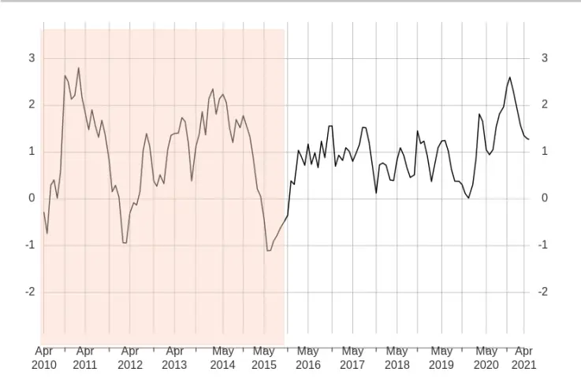
数据来源：天软 华泰期货研究院

图 2： 2016至今最优参数 K=220历史滚动夏普表现
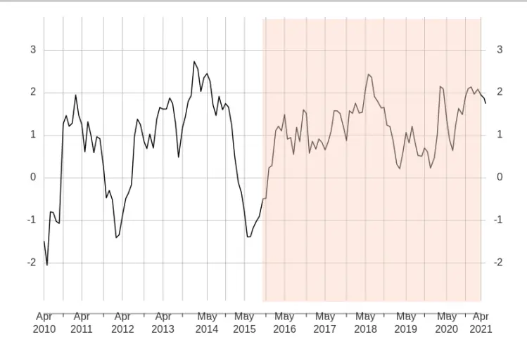
数据来源：天软 华泰期货研究院

## 三、 参数K优化策略表现

从上一章中我们看到，在 2010-2015年期间最优参数 K=231，在 2016至今最优参数 K=220，那么在历史上最优参数是如何演变的呢？最优参数的历史时序是否具有连续性？

为解答这两个问题，我们首先观察历史分组测试中，每个调仓时刻（即每隔 19个交易日）计算不同 K值对应策略的夏普，从而找到阶段最优的 K值并观察其在历史上的时序变化。

比较两个维度的夏普下的最优参数 K：

1）历史夏普：2010 年至观察时间点的夏普；

2）近一年夏普：观察时间点往前一年时间的夏普。

图 3： 历史夏普最优参数 K时序变化
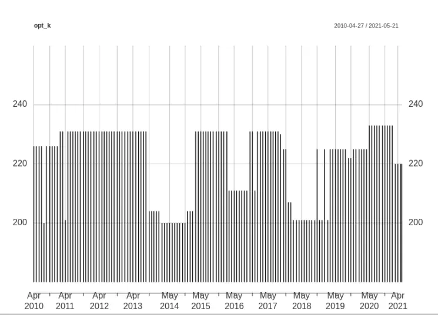
数据来源：天软 华泰期货研究院

图 4： 近一年夏普最优参数 K时序变化
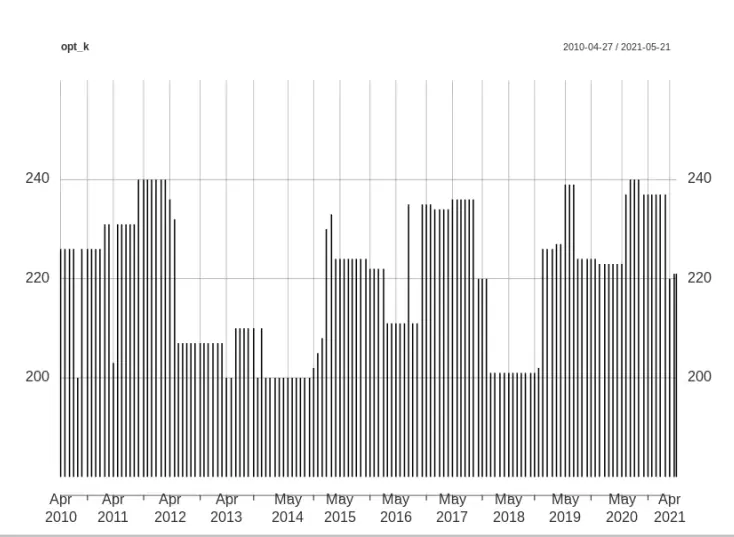
数据来源：天软 华泰期货研究院

通过上图，我们可以得到以下信息：

1）历史上最优参数是不断变化的，大概在 2021年开始最优参数为 K=220；

2）最优参数具有一定的延续性，但是参数一旦发生变化，多是直接跳变，而不是逐步的变化，同时出现最优参数跳变只持续一、两个周期的情况；

3）历史夏普相对近一年夏普，计算得到的最优参数 K波动更小；

4）最优参数有在上下界出现，说明最优 K可能受到选取的上下界限制。

## （一）每期使用最优参数，动量策略的表现

在设计策略之前，我们先观察如果每期使用当期的最优参数 K，得到策略的效果如何。需要提醒的是，这样得到的策略是不可复现交易的，但是尽量接近这个表现，是我们后期策略研发的目标。

首先都在 K=220（红线）的基础上有较大提升。使用近一年夏普最优参数，比使用历史夏普的表现更优，这是符合常识的，近一年夏普最优参数 K应该对市场更加敏感。

图 5： 历史夏普最优参数 K （夏普 1.29）
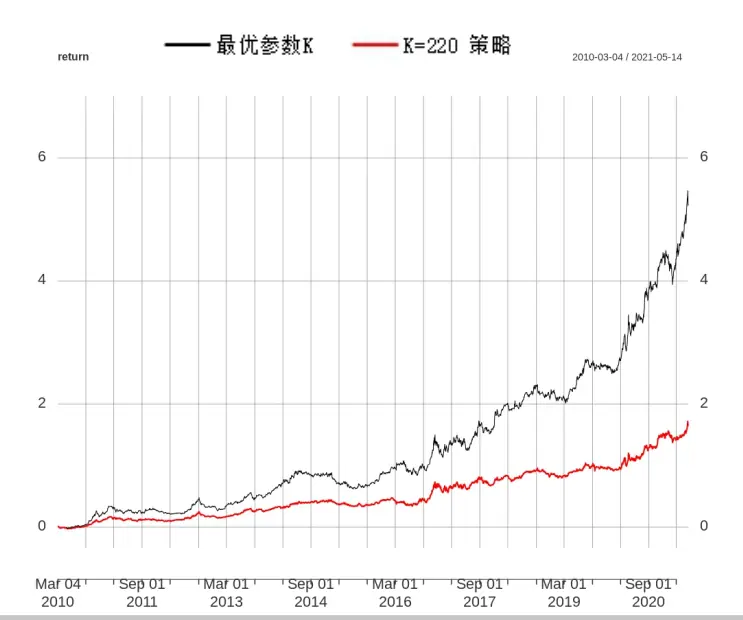
数据来源：天软 华泰期货研究院

图 6： 近一年夏普最优参数 K（夏普 1.35）
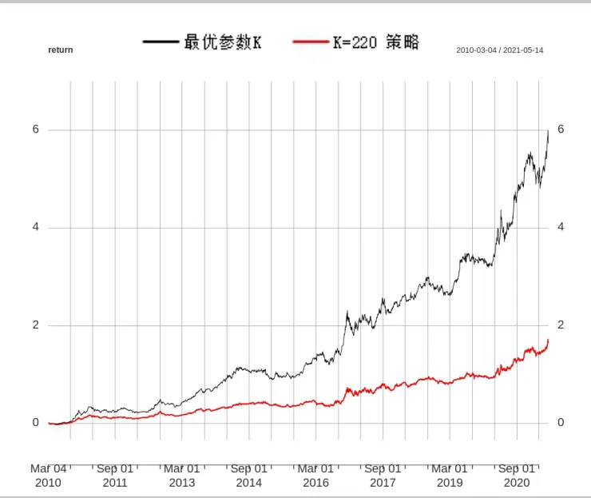
数据来源：天软 华泰期货研究院

## （二）最优参数 Kdelay1 期，动量策略的表现

基于最优参数的延续性，我们好奇如果使用本期的最优参数 K作为下一期的 K值，即最优参数 K delay 1 期，策略的表现是否会有提升，从下图来看，显然表现明显变差，甚至不如直接选取K=220（红线）。可能是在最优参数跳变对策略产生较大的影响，因此我们后续考虑对 K适当平滑。

图 7： 历史夏普最优参数 Kdelay1期 （夏普 0.77）
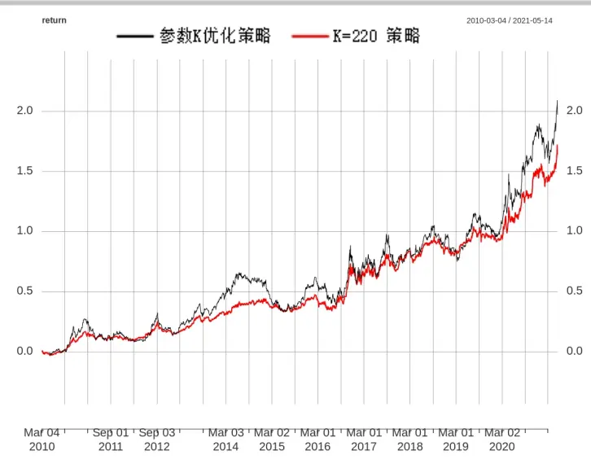
数据来源：天软 华泰期货研究院

图 8： 近一年夏普最优参数 Kdelay1 期（夏普 0.76）
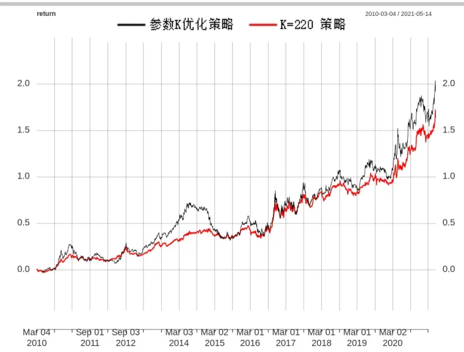
数据来源：天软 华泰期货研究院

## （三）每期取历史最优 K的均值 delay1 期，动量策略的表现

我们在每期都使用过去的最优参数 K均值，这样最优参数得到很好的平滑，相应策略表现如下图，我们看到收益明显提升，且经过取历史均值之后，两种夏普统计方式对应策略之间差距很小。特别地，虽然我们看到夏普还是不如 K=220（夏普 1.02），但是在 2016 年至今，图 9 夏普表现得并不比 K=220 差，图 9 夏普为 1.09，图 10 夏普为 1.01，K=220 夏普为 1.06.

图 9： 历史夏普历史最优 K均值 delay1 期 （夏普 0.95）
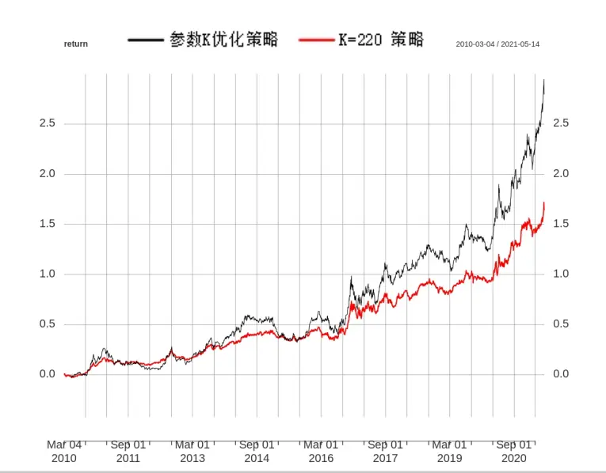
数据来源：天软 华泰期货研究院

图 10： 近一年夏普历史最优K均值delay1期（夏普0.95）
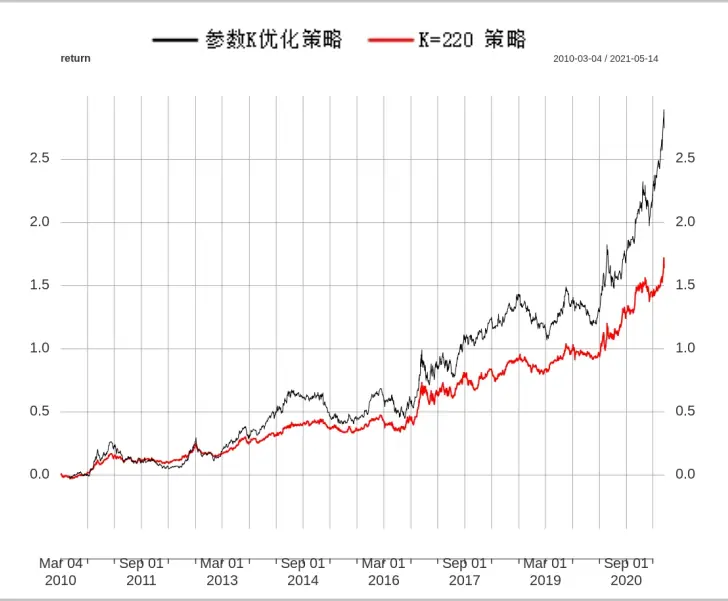
数据来源：天软 华泰期货研究院

有趣的是，我们观察上述两个策略各期 K值，发现在表现较好的历史夏普中，K值在 2015年之后均处在 220 附近。

图 11： 历史夏普策略 K时序图
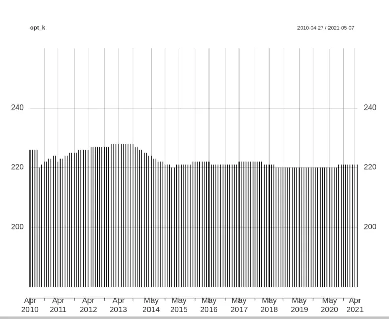
数据来源：天软 华泰期货研究院

图 12： 近一年夏普策略 K时序图
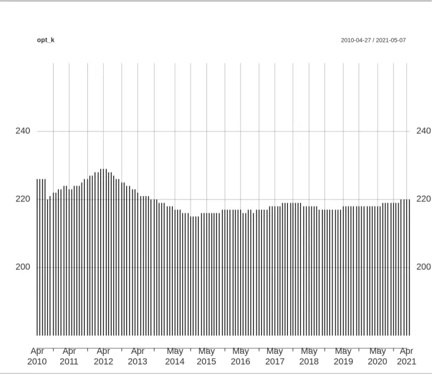
数据来源：天软 华泰期货研究院

（四）在 K均值的基础上增加近期的信息，动量策略的表现

第三个策略在第二个策略的基础上，增加了稳定性，但是也损失了参数对市场的敏锐，如果结合两种信息，策略可能可以得到提升。在上一个策略中我们选取：

$$
\int\sharp\sharp\sharp\sharp\ :\mathcal{K}\ :\mathcal{A}_{\sharp}\ :\mathring{\jmath}\ :=\mathrm{mean}(\mathring{\sharp})\ :\mathrm{T}-1\ :\sharp\sharp\ :\mathring{\sharp}\ :\mathring{\jmath}\ :\mathring{\sharp}\ :\mathrm{K})
$$

进一步，我们在此基础上增加一项，以捕捉近期的最优参数信息：

增加项 = mean( [近六个月最优 K - mean(前 T-1 期最优 K) ]）/10

$$
\mathrm{~T~}_\neq\}\sharp\sharp^{\prime}\mathrm{~K~}/\dddot{\mathfrak{H}}=\mathrm{mean}(\mathring{\mathtt{H}}\mathtt{I})\mathrm{~T-1~}\sharp\sharp\sharp\sharp\mathrm{~K~})+\mathrm{~\ddag^{*}~}j\flat\mathrm{~I}j\mathrm{I}
$$

策略表现如下图，历史夏普达到 0.97，2016年至今夏普为 1.12.

图 13： 在 K均值的基础上增加近期的信息
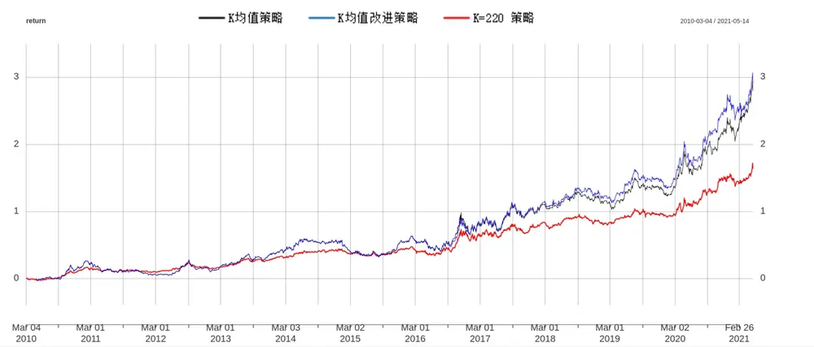
数据来源：Wind，华泰期货研究院

## 四、 总结

在本文中我们考虑 K取200-240 天，H=19，将步长选取缩小到 1天，进行进一步的分组测试。从 2010年至今历史完整时间看，最优 K依然是 220。而拆分成 2010-2015年以及 2016年至今两个时间段，最优 K分别是 231、220。通过滚动夏普，找到历史上最优参数 K的时序变化，我们发现最优参数是不断变化的，且具有一定的连续性，大概在 2021年开始最优参数为 K=220。

基于最优参数的延续性，我们首先将最优参数 K delay 1 期，得到策略表现不如直接取K=220。进一步，我们在每期取历史最优 K的均值 delay 1 期，策略的表现变好，历史时间段夏普还是不如 K=220（夏普 1.02），但在 2016年至今，夏普表现优于 K=220，收益能力显著增强，这样增加了 K的稳定性，但是也损失了参数对市场的敏锐。接着，我们在 K 均值的基础上增加近期的信息，策略表现进一步增强，历史夏普达到 0.97，2016年至今夏普为 1.12，超过了 K=220（夏普 1.06）。

我们认为根本的逻辑是，长期的最优参数信息非常重要，近期的最优参数虽然具备延续性，但是参数一旦发生变化，多是直接跳变，而不是逐步的变化，所以最优参数 delay1 期相比每期使用最优参数收益下降严重，可能是由于最优参数 K跳变带来的。而近期最优参数中包含的位置信息是可以利用的，我们在长期参数上，加上一点短期相对长期的位置信息，参数微调后，夏普有效提高。当然最优参数中也可能存在更为深层的信息等待我们进一步发掘。

## 免责声明

本报告基于本公司认为可靠的、已公开的信息编制，但本公司对该等信息的准确性及完整性不作任何保证。本报告所载的意见、结论及预测仅反映报告发布当日的观点和判断。在不同时期，本公司可能会发出与本报告所载意见、评估及预测不一致的研究报告。本公司不保证本报告所含信息保持在最新状态。本公司对本报告所含信息可在不发出通知的情形下做出修改，投资者应当自行关注相应的更新或修改。

本公司力求报告内容客观、公正，但本报告所载的观点、结论和建议仅供参考，投资者并不能依靠本报告以取代行使独立判断。对投资者依据或者使用本报告所造成的一切后果，本公司及作者均不承担任何法律责任。

本报告版权仅为本公司所有。未经本公司书面许可，任何机构或个人不得以翻版、复制、发表、引用或再次分发他人等任何形式侵犯本公司版权。如征得本公司同意进行引用、刊发的，需在允许的范围内使用，并注明出处为“华泰期货研究院”，且不得对本报告进行任何有悖原意的引用、删节和修改。本公司保留追究相关责任的权力。所有本报告中使用的商标、服务标记及标记均为本公司的商标、服务标记及标记。

华泰期货有限公司版权所有并保留一切权利。

## 公司总部

地址：广东省广州市越秀区东风东路761号丽丰大厦20层

电话：400-6280-888

网址：www.htfc.com