## 金融科技赋能投研系列之二：

## 多周期金融数据分析（一）

## 摘要：

金融数据中普遍存在着类周期性现象，其变化规律本质上与社会经济发展的循环规律相对应。但是，由于金融市场本身具有高度复杂性，人们一般较难获得精确的周期信号。同时，我们也注意到，经济发展的周期自身也具有独立的复杂性。首先，在社会发展的不同阶段，其主要的发展推动力可能会有较大差异，而产业链发展及传导的特征也会随着社会基础设施建设，物流疏导能力和社会整体商业活力的影响，进而导致经济发展周期的拉长或者缩短。其次，即使我们对经济周期发展有了较深入把握，由于金融市场的虚拟属性，它不仅反应了经济发展规律，其微观特征还反映了交易者之间的博弈行为，政策逆周期引导，以及短期社会事件的响应等等。

所以，我们并不认为金融市场具有精确的周期可以遵循，而简单外推历史数据中的周期，所做的市场预测更是带有极大不确定性，特别是做出的重要结论仅依赖于简单数据挖掘结果而未做认真考证的时候。我国是一个经济体量庞大，发展迅速，且正在经历历史性经济发展结构变化的经济体，这里的金融数据分析更是需要大胆猜测之后的小心求证。

同时，大量数据的分析结果让我们相信，金融数据中确实存在普遍的“复现”规律。究其根本，依然与实体经济的发展阶段密不可分，同时又在一定程度上包含了具体历史条件下的特殊性，所以体现了复现而很难精确对应的现象。换句话说，当我们考虑各种类周期特征时，把握其中统计性规律并且探索其背后的宏观经济学逻辑和微观交易特征才是我们首要目的。同时，我们前期的工作也一定程度上实证了该方法的有效性。另外，当我们开始以复现这样的类周期逻辑去探索金融数据之后，我们发现很多单一周期或者若干精确周期不能解释的现象都得到了合理的解释，并且揭示了经济发展周期，产业生产力进步，社会信息化发展，甚至全球资产价格联动等传导性特征对金融市场影响的深刻变化。

从本文开始，我们将使用系列专题报告的方式介绍我们的投研逻辑。其中主要包含我们的数据观察、测试方法，多因子分析方法，特别是AI模型与我们投研方法的深度融合。

投资咨询业务资格：

证监许可【2011】1289 号

研究院 量化组

研究员

罗剑

- 0755-23887993

- luojian@htfc.com

从业资格号：F3029622

投资咨询号：Z0012563

## 陈辰

- 0755-23887993

- chenchen@htfc.com

从业资格号：F3024056

投资咨询号：Z0014257

## 何绪纲

- 0755-23887993

- hexugang@htfc.com

从业资格号：F3069194

## 一、背景介绍

金融市场具有较高的复杂性。首先，金融产品交易的种类跟该国金融产业发展阶段密切相关，同时受到国家监管系统的制约。其形态特征和成熟阶段都有显著的跨国差异性。其次，金融产品的定价脱离不开实体经济的发展，交易者的参与度，以及投资目的的多样性。这也导致金融市场分析天然来自不同的切入角度，并且最终与投资人的投资期限密切关联。这是我们采用多周期方法分析金融时序的根本原因。

进一步，我们看到，虽然金融市场必然受到宏观经济因素和微观交易者行为影响。但是，在不同经济发展阶段，不同的参与者结构，甚至不同的政策调控能力下，都有可能会导致非常相似的“原因”却带来截然不同的“结果”。可以说，外界条件对金融市场的综合影响方式及传导过程本身也具有很高复杂性，且随时间而逐渐变化。这也是我们在深入数据分析过程中逐步放弃单一周期，或者若干精确周期叠加，转而寻找市场“复现”规律的主要推动力。我们也将看到，在多个周期尺度的意义上，外在因素的影响力程度，持续时间，领先/滞后等特征都有明显差异，不仅更符合我们直观认识，而且从定量的角度验证了很多定性分析中的经验性结论。

从研究方法的角度看，我们放弃了单一或者若干精确周期线性拟合的传统方式，而是广泛借鉴其他研究领域的非线性时序研究方法。本文将采用自然科学领域（物理学，海洋学、生态学等）中使用较为成熟的数据处理方法来处理金融数据。将数据按照周期长度分解为多条不同时间序列。将不同频率，甚至对不同类型的数据与标的物价格波动做不同周期的匹配，进而测试数据本身所包含的自相关性；时间序列对之间的相关性（或影响力），挖掘多层次的数据特征。相对而言，传统数据处理方法可能较难做直接的观测和这类信息的定量提取（如图一所示）。注意，我们的数据分析方式完全不同于传统的数据变频方式。比如，将标的物日度收益率数据，通过累计换算成周度或者月度收益率。因为，我们发现这样的数据变频方式只是一定程度上接近于数据平滑化处理，不仅没有凸显类周期特征（数据主要特征并不一定满足按照周度，或者月度周期变化）；更重要的是，其累积收益率中的波动性其实依然来自于更高频的日间甚至日内波动，本质上并未对数据主要特征做分拆处理。当然，我们并不排斥数据变频的方法。实际上，我们后续的报告将发表数据在不同频率基础上（周度和月度累积收益率数据），做进一步周期分解以后得到的分析结果。一般来说，我们将会发现，越高频的数据越有利于偏向价格发现或者市场对外界事件即时响应的特征；而越低频的数据，越有利于发现宏观经济引导或者经济发展周期对金融市场的影响。

图 1： 按照不同周期尺度分解 LME 黄金现货收益率数据
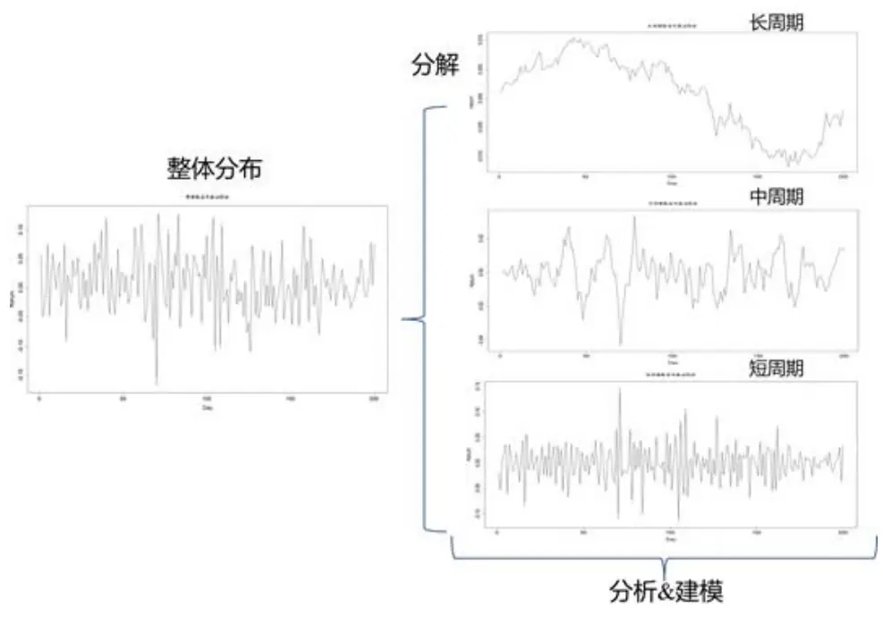
数据来源：华泰期货研究院

## 二、数据准备

本文将选取黄金作为主要研究标的物，原因有以下几点。

首先，黄金是最早进入流通市场的投资品种之一。不同于普通商品，黄金的开采以及货币化流通，在推动人类社会发展历史中发挥了极其重要的作用。上个世纪，黄金经历了战后形成布雷顿森林体系，到1971年之后该体系的瓦解，黄金与美元脱钩。黄金作为金融投资产品，则继续发挥着抗通胀功能和避险功能，其本身多重内在属性最终在交易层面获得了更全面、更具象化的体现。

黄金定价的复杂性体现在如下几个方面：

- 商品属性，金价受到黄金商品供求关系以及其他大宗商品的影响；

- 货币属性，金价受到全球货币体系变化、全球货币政策变动影响；

- 投资避险属性，金价易受国际政治和经济发展周期的影响，进而表现为与全球权益类市场、债券、房地产等大类资产投资的风险程度变换。

黄金的不同投资功能会在不同的经济发展周期，体现出不同投资者的投资意愿，从而表现出其价格波动主导因素的不断切换。而这些复杂的外部影响因素--从量价影响因子到经济循环周期等不同维度上，都体现了黄金定价的复杂性。

回望整个 2019 年，是世界政治格局相当动荡的一年。大国政治角力，区域政治变幻莫测，地区武装冲突依然充斥着新闻媒体的主要版面。对我国而言，经济周期带来的GDP 增速减缓，叠加中美贸易摩擦已经越来越引起国内政商界的重视。需要特别指出的是，中国（GDP）目前已是全球第二大经济体，且与跟随其后国家之间的差距越拉越大，在防范全球金融风险方面，也开始实施自己的应对方案：中国央行的黄金储备总量已位列全球第7。

表1:主要经济体央行黄金储备

| 排名 | 国家 | 官方黄金储备（吨） | 黄金储备对外汇储备 总额占比（%） |
| --- | --- | --- | --- |
| 1 | 美国 | 8133.5 | 76.9 |
| 2 | 德国 | 3366.8 | 73.0 |
| 4 | 意大利 | 2451.8 | 68.4 |
| 5 | 法国 | 2436.1 | 62.9 |
| 7 | 中国 | 1942.4 | 2.9 |
| 9 | 日本 | 765.2 | 2.8 |
| 19 | 英国 | 310.3 | 9.3 |

资料来源：International Financial Statistics（IMF），华泰期货研究院

不难看出，在世界主要经济体、SDR货币发行国中，目前中国的黄金储备对外汇储备总额的占比依然很低。我国在应对全球金融风险能力的提升上还有相当大的空间。所以，从国家安全层面来考虑，我们也认为黄金是一个非常值得深入研究的对象。

## 三、数据多周期分解

首先，我们将标的物收益率数据按照不同的周期分解为三个层次：

1) 短周期：1 个季度 - 1 年左右；

2) 中周期：1-5 年左右；

## 3) 长周期：5 年以上。

在经过数据分解之后，将三个层次转化为频域后的图像，可以看到长周期与中周期频率数据中，存在单频率的频谱明显高于其他频率的特征，可以说明中长周期的周期特性非常明显，表现出明确的主导周期。

图 2： LME 黄金现货——长周期
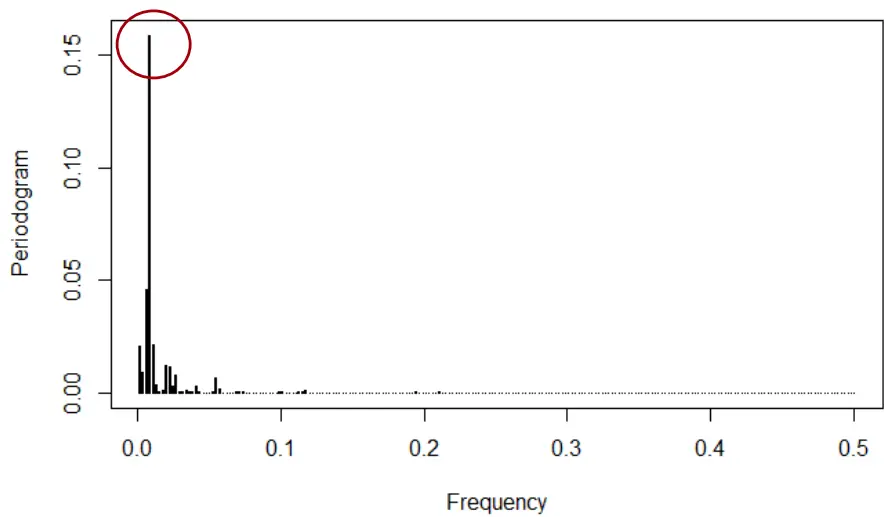
数据来源：Bloomberg，华泰期货研究院

图 3： LME 黄金现货——中周期
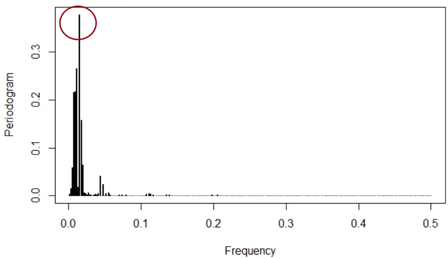
数据来源：Bloomberg，华泰期货研究院

图 4： LME 黄金现货——短周期
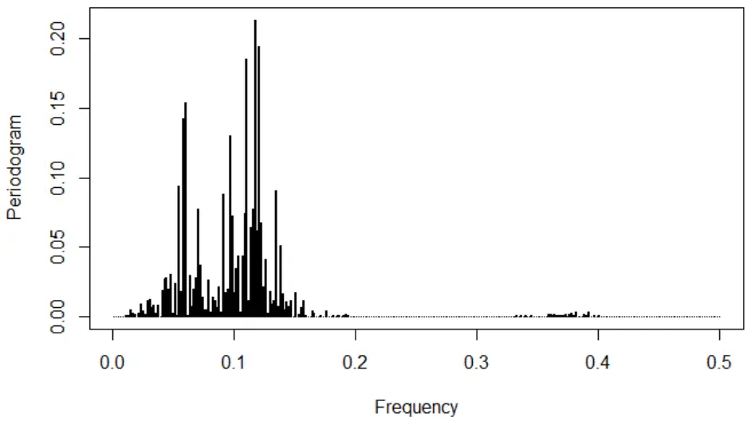
数据来源：Bloomberg，华泰期货研究院

短周期频率数据中，我们难以找到单频率的频谱明显高于其他频率的特征，因此短周期尺度上并不存在主导周期。这从定量的角度佐证了，中长周期尺度上，我们可以看到较明显的收益率周期特征，然而短线上却并不存在明确周期。所以，更不太可能简单通过周期叠加来对黄金收益率做精准预测。但是，从统计的角度来看，我们对黄金收益率有了更加详尽的认识：

表2: LME 黄金现货多周期统计特征

| 波动率 | VaR | CVaR | Max Drawdown |
| --- | --- | --- | --- |
| 短周期 | 12.14% 0.80% | 1.36% | 30.29% |
| 中周期 | 2.61% | 0.18% 0.30% | 10.06% |
| 长周期 | 1.46% 0.07% | 0.11% | 41.50% |
| 原始数据 | 19.21% | 1.19% 2.12% | 70.29% |

资料来源：Bloomberg，华泰期货研究院

从上表，可以看出，我们对黄金的收益率进行多周期分解以后，其在不同周期波段的风险特征获得了明确的定位。随着周期的拉长，波动率有了明显的下降，其他风险指标也有相同的递减规律。而最大跌幅则显示了，极端市场条件下，风险在不同尺度上的最大释放范围。这实际上为投资者，在不同的投资尺度上建立适当的投资逻辑，提供了充分的数据支持。比如，做大类资产配置时，因为持仓时间较长，投资人最关心的其实是中长持仓周期上来看，各类资产的风险对比强弱。我们的方法对风险因素进行了分解，投资人只需要观察长周期的风险指标，就可以对资产配置给出优化判断，而避免更高频率上的噪音干扰（后续研报，我们将做进一步分析）。

作为重要对比，我们对权益类金融产品做相同数据分析。美国 S&P500指数的多尺度分解，结果如下：

图 5： S&P 500 指数——长周期
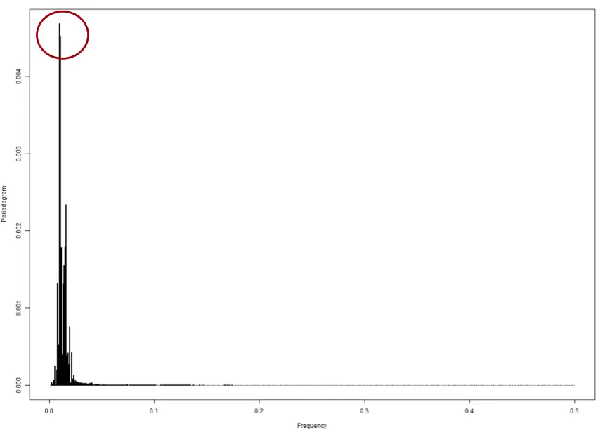
数据来源：Bloomberg，华泰期货研究院

图 6： S&P 500 指数——中周期
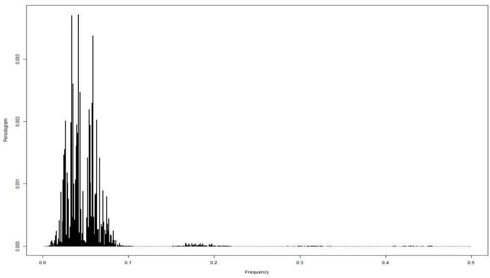
数据来源：Bloomberg，华泰期货研究院

图 7： S&P500 指数——短周期
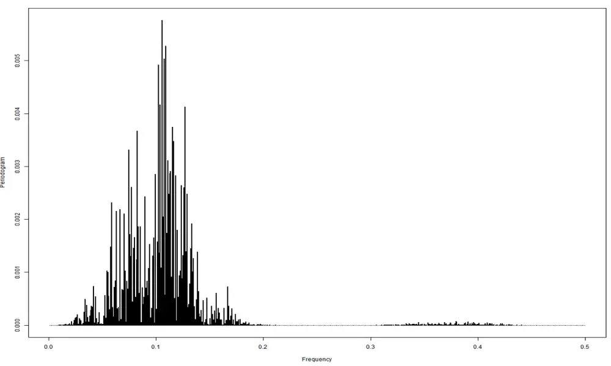
数据来源：Bloomberg，华泰期货研究院

表3: S&P 500 指数多周期统计特征

| 波动率 | VaR | CVaR | Max Drawdown |
| --- | --- | --- | --- |
| 短周期 11.19% | 0.67% | 1.23% | 45.78% |
| 中周期 | 2.61% 0.18% | 0.29% | 10.04% |
| 长周期 | 0.98% 0.06% | 0.11% | 20.89% |
| 原始数据 | 18.54% 1.10% | 2.07% | 86.19% |

资料来源：Bloomberg，华泰期货研究院

其中长周期的主导周期特征也非常清晰，而随着频率升高，其短周期信噪比也显著降低。所以，我们认为这两种金融数据序列其实表现出来了非常相似的多周期特征。实际上，我们发现绝大多数交易类型时序均有这样的普遍性特征（限于篇幅，不再赘述）。

## 四、自相关性分析

多周期尺度数据处理方法为我们理解金融时间序列中的自相关性，标的物与相关因子之间的相关性提供了较好的分析工具。以本文的主要预测标的物黄金为例：

图 8： LME 黄金现货月度收益率自相关性
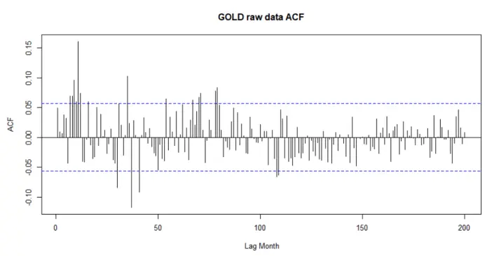

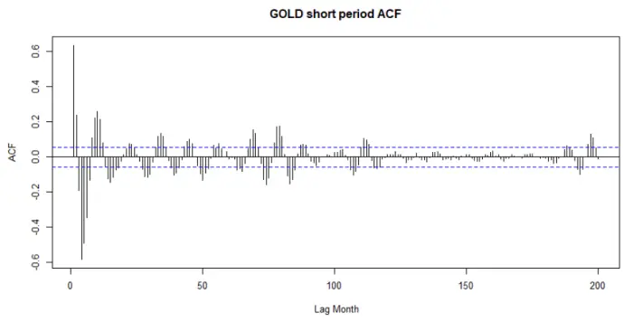

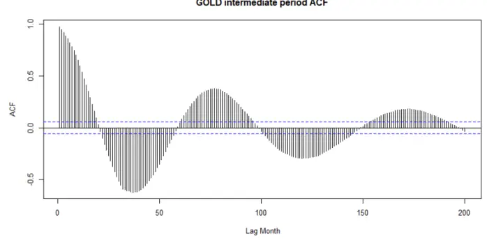

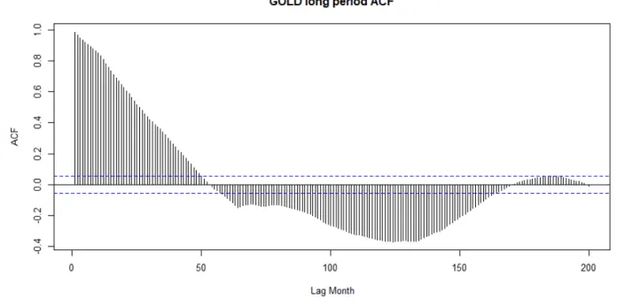
数据来源：Bloomberg，华泰期货研究院

在原始数据中（左上角图），金价月度收益率的自相关性并不明显，而超过95%置信区间的异常值也并不多见，这符合我们一般常见的交易型数据特征。实际上，如果只有这样的数据结构，我们并不能做出任何有效的判断，也比较难决定选用什么样的模型或者分析工具做更深入的数据特征分析。

通过数据分解可以清楚地看到，数据结构呈现出来越来越明显的规律性。这在一定程度上符合我们分解的原则，处理后的数据展现出来不同的周期性特征。同时在3 个周期尺度上，数据的自相关特征在统计意义上非常显著，远超过无自相关性的 95%置信区间，且衰减速度很慢。注意，随时间延迟没有看到 ACF 趋于饱和，我们不认为这里是 long-term memory特征。我们也不认为上图中显示的自相关性一定是线性自相关性。事实上，我们认为数据具有相当有趣的内在结构。

上图的结果具有很强的一般性，实际上，至今没有看到其他任何数据表现出和上图严重不符的反例。从侧面验证了该方法的普适性。非常值得一提的是，不仅仅是交易型数据，对于机构统计型数据，也存在不同波动周期尺度上的自相关特征。我们这里再举一个例子—美国劳工部统计局记录的 CPI 同比变化率（始于 1913-01-01）。

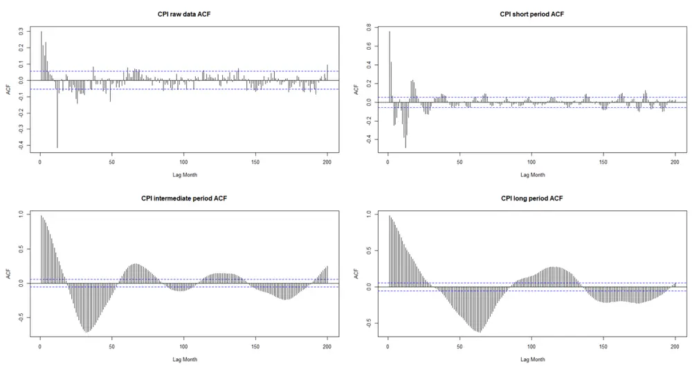
图 9： CPI 月度波动月度 volatility 自相关性
数据来源：BLS，华泰期货研究院

CPI原始数据似乎已经表现出一定的结构特征。在数据分解处理之后，展现了和交易型数据非常类似的显著特征。更加有趣的是，测试发现这样的多周期尺度数据分解后的自相关结构并非仅限于收益率（或者一阶差分）数据。实际上，更高阶的统计量也具有类似特征。

接下来，我们看一下黄金历史收益率的标准差：

图 10：LME 黄金现货月度 volatility 自相关性
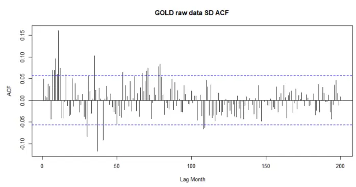

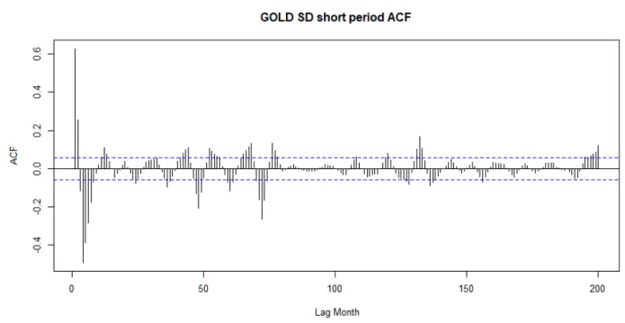

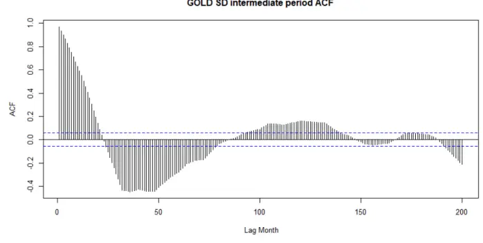

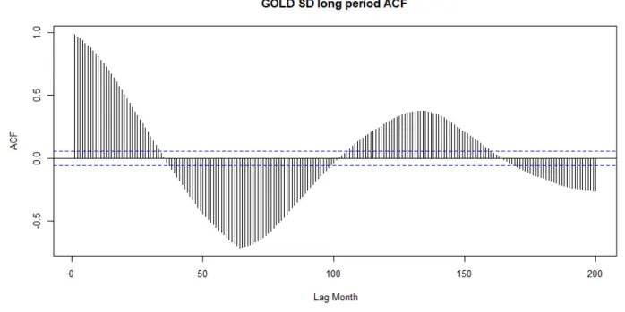
数据来源：Bloomberg，华泰期货研究院

从而，我们相信本文所面对的金融数据的确蕴含了非常丰富的信息，而问题的关键则变成了使用什么样的方法去提取解决问题所需要的最关键信息。比如本文考虑的自相关性以及自相关性表现出来的周期波动特征。而对于其他统计量的多周期尺度分解，有助于我们对数据进行更全面的理解。从策略研发的角度来看，也为提高收益，管控风险提供了数据基础。

## 五、总结

本文从金融数据自身的高度复杂性入手，使用新颖的数据分解方式去拆解金融时间序列。我们的目的是要捕捉金融数据背后最为关键的若干特征：周期性、自相关性和协相关性。并且使用统一的方法去寻找复杂市场因素对金融时序在不同周期尺度上的影响力强弱和影响传导方式。在逐步深入研究的分析过程中，我们逐步放弃了单一周期拟合，或者若干周期线性叠加的方式。而是，按照数据自身的规律，以周期范围的方式去分析数据。同时，我们的方法也不是简单的数据变频（累积收益率等，数据类光滑化处理）；而是以分解的方式，去提取在不同周期尺度上的数据信息，进而分析其主要统计指标的变化规律。考虑到数据的复杂程度和典型性，我们选取LME 黄金作为主要研究对象，并与其他大类资产指数做比较研究。

## 免责声明

本报告基于本公司认为可靠的、已公开的信息编制，但本公司对该等信息的准确性及完整性不作任何保证。本报告所载的意见、结论及预测仅反映报告发布当日的观点和判断。在不同时期，本公司可能会发出与本报告所载意见、评估及预测不一致的研究报告。本公司不保证本报告所含信息保持在最新状态。本公司对本报告所含信息可在不发出通知的情形下做出修改，投资者应当自行关注相应的更新或修改。

本公司力求报告内容客观、公正，但本报告所载的观点、结论和建议仅供参考，投资者并不能依靠本报告以取代行使独立判断。对投资者依据或者使用本报告所造成的一切后果，本公司及作者均不承担任何法律责任。

本报告版权仅为本公司所有。未经本公司书面许可，任何机构或个人不得以翻版、复制、发表、引用或再次分发他人等任何形式侵犯本公司版权。如征得本公司同意进行引用、刊发的，需在允许的范围内使用，并注明出处为“华泰期货研究院”，且不得对本报告进行任何有悖原意的引用、删节和修改。本公司保留追究相关责任的权力。所有本报告中使用的商标、服务标记及标记均为本公司的商标、服务标记及标记。

华泰期货有限公司版权所有并保留一切权利。

## 公司总部

地址：广东省广州市越秀区东风东路761号丽丰大厦20层

电话：400-6280-888

网址：www.htfc.com