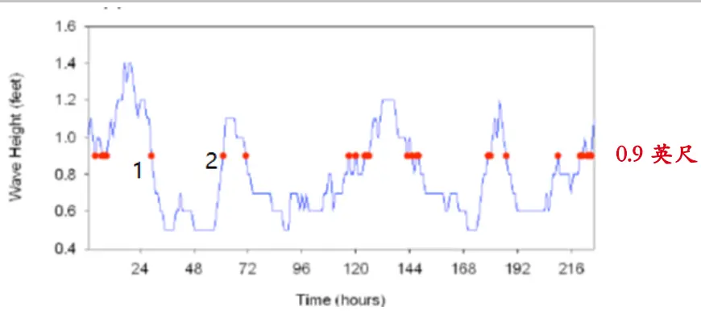
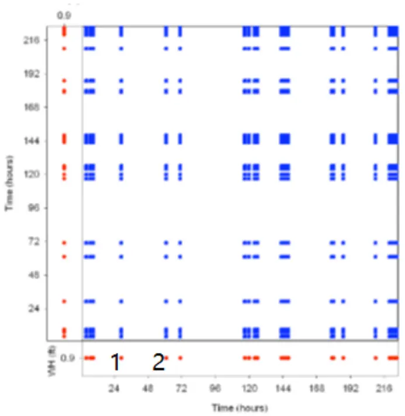
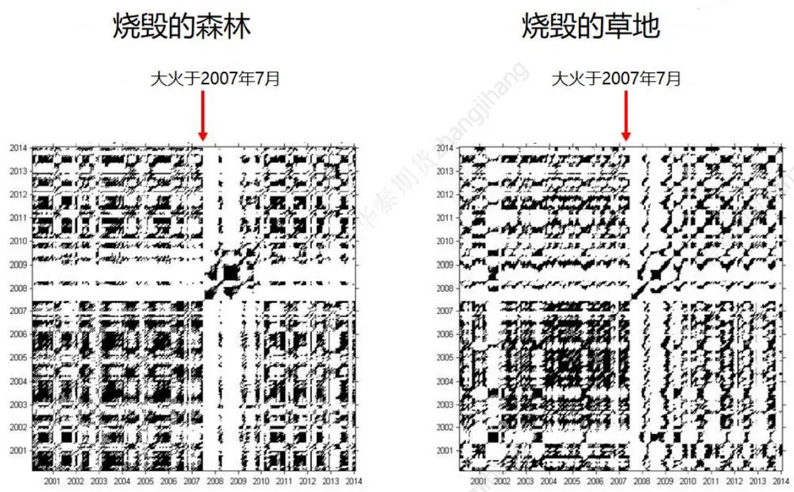
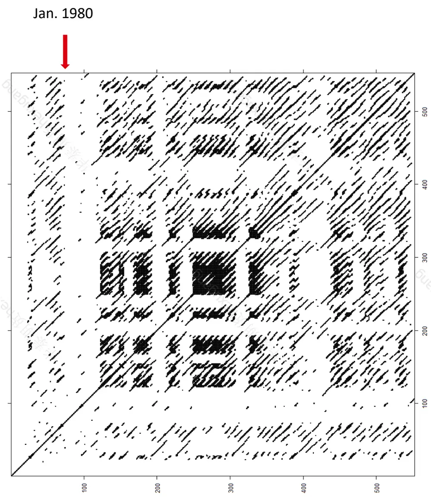
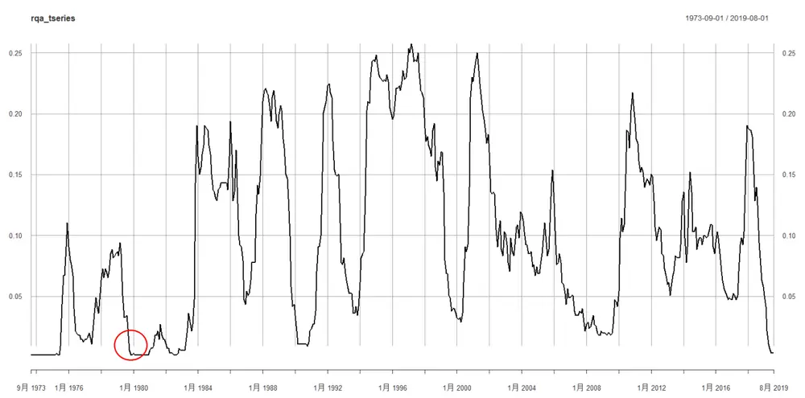
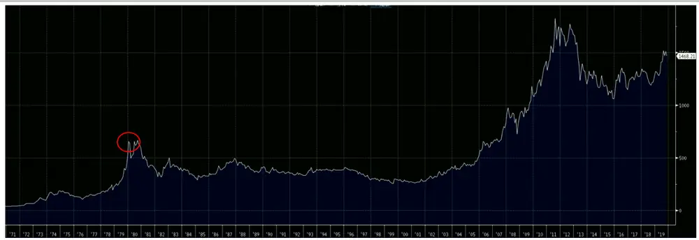
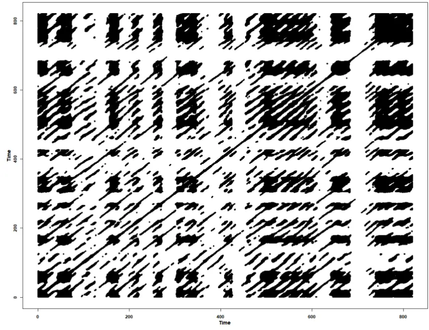
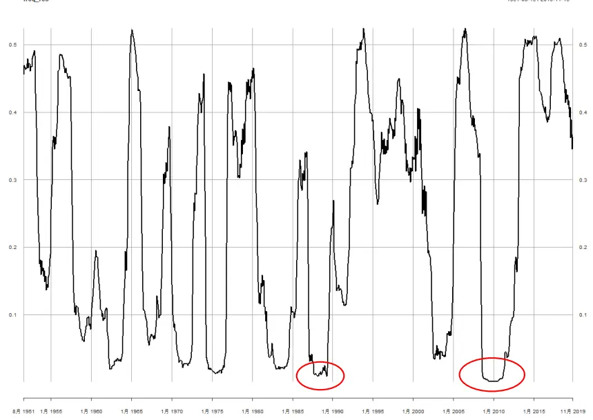

# 金融科技赋能投研系列之三：

## 多周期金融数据分析（二）

## 摘要：

金融数据时间序列蕴含了丰富的多层次信息，它本身实际上是叠加了不同周期尺度，不同交易目标的综合市场体现。同时，我们发现在金融标的物的定价过程中，各种外在因素的影响力和影响方式会在不同时段有迥然不同的表现。为此，我们使用多周期分解的方法来拆解数据信息，并在此基础上进一步分析外在因子的相关性影响。

在我们的上一篇报告中已经介绍了数据分解的主要过程。在本文中，我们将引申该研究方法，并采用其他学科领域已经非常成熟的非线性方法来研究不同周期上分解的数据—复现量化分析（Recurrence Quantitative Analysis）。本文的重点将放在金融时间序列的相变研究方面。我们将看到重要的相变会体现在不同的周期范围上。而若干中短周期上发生的相变却有可能并未（或明显）出现在长周期尺度上。

我们指出，对于相变点的确认或者预期，实际上将有助于我们对于当前市场行情更好的理解。将来对于我们的投研策略回测提供了明确的择时思路。

投资咨询业务资格：

证监许可【2011】1289 号

研究院 量化组

研究员

罗剑

- 0755-23887993

- luojian@htfc.com

从业资格号：F3029622

投资咨询号：Z0012563

## 陈辰

- 0755-23887993

- chenchen@htfc.com

从业资格号：F3024056

投资咨询号：Z0014257

何绪纲

- 0755-23887993

- hexugang@htfc.com

从业资格号：F3069194

## 一、背景介绍

在我们的上一篇报告中，我们指出，金融时序数据蕴含了极其丰富的信息。特别是在不同周期尺度上，因为，市场参与者的投资目的不同，对信息的接收和处理能力不同，亦或是投资的资金量或者持仓周期不同，最终导致我们看到的市场交易数据体现出繁杂而貌似无序的状态，实则体现了多样而有序的不同周期尺度的结构。

我们在对金融时序的月度收益率数据做了简单的三个层次的复现类周期分类（非精确周期）之后，观察到了非常清晰的自相关性的类周期特征。同时，我们方法具有较好的普适性，我们发现不仅仅是收益率数据，实际上波动率也具有类似的多周期特征；而非交易型数据，例如机构统计类型数据（如美国劳工部发布的 CPI）也具有相似的性质。这为我们进一步研究金融数据提供了新的思路，也促使我们对新方法论做进一步的探索。

另一方面，我们也看到，金融市场还包含另一类重要的特征—相变。实际上，当我们分析数据中的类周期性特征时，我们需要非常小心所观察的数据长度，经历的具体历史时段，该国经济发展阶段，或者全球政治经济的互动关系。其内在逻辑体现为：如果没有对具体场景的细致分析，我们并不认为数据挖掘过程中获得的任何类周期特征一定能在未来重现。而这一类不可复现的场景中最重要的例子就是相变现象。当然，这也是非稳态时序概念中最关键的一类现象。

这类问题的重要性在国外的研究中已经相对较为深入。比如，我们非常熟悉的著名美国私募，桥水公司，其创立人Dalio 就在今年7月发表过《Paradigm Shifts》论述了一个旧十年即将结束和一个新十年的即将到来。其中，对于一个周期，或者显著趋势的结束正是我们从量化角度需要认真研判的相变现象。而量化的结论是否能符合我们直观认识，或者跟实际政经事件相匹配，则对量化方法论提出了一定的挑战。

而在我们的多周期框架中，我们还需要关注如下的一些问题：相变是否只出现在一个周期尺度或是多个，甚至全部周期尺度？金融数据在相变期的类周期特征应当如何解读？目前一般的相变研究方法多集中在线性时序框架内，是否有一般意义的方法，可以对非线性时序给出测试结果呢？方法能否可视化，于是显著的特征可以更直接与基本面研究相匹配，并最终给出具有一定政治、经济学意义的解读，有助于我们对未来相似场景的判断？

本文将引入一种新颖的研究方法来处理上述问题--复现量化分析（Recurrence QuantitativeAnalysis，RQA）。该方法最早由瑞士物理学家Eckmann等人提出，应用于复杂时间序列分析，后经历 Marwan等人的改进，逐渐应该到其他领域（包括气象学，生态学等）。我们在这里借用该方法，应用到金融时间序列当中，分析数据中的类周期现象。该方法同时适用于线性和非线性时间序列，特别适合研究时序中的稳定性和相变问题。而且该方法本身具有可视化方法，在量化分析的同时，为我们定性解读相变特征带来了便利。需要强调的是，该方法的研究对象基于数据的复现（recurrence）而非精确周期，这也是该方法特别适合我们目前进行的多周期分解，而非若干精确周期叠加研究的主要原因。实际上，精确的若干周期叠加反而难以解释我们在真实数据中看到的复杂类周期特征。

我们将在随后的章节陆续介绍该方法的一般应用；在其他领域的使用场景；以及如何使用该方法来研究金融时序中的相变现象。

## 二、方法介绍

复现量化分析最早来自于对类周期现象的图像化分析—递归图模型（RP）。

该模型主要研究的是重现（Recurrence）。即在真实世界中，存在一些场景或相似场景的一次又一次的重现，虽然并非精确周期性。在数据处理中，这种重现的现象可以使用递归图来描述。递归图矩阵的定义如下，在空间中有两个状态xï⃗ 和xj⃗ 分别发生在 i 时刻和 j 时刻，那么递归图矩阵可以显示为：

$$
R_{i,j}=\binom{1}{0}\qquad\begin{array}{lc}{{if\bigl\|\overrightarrow{x_{i}}-\overrightarrow{x_{j}}\bigr\|<\epsilon}}\\{{otherwise}}\end{array}
$$

其中ε是阈值。

我们举一个例子，来看该方法的实际应用。我们以研究海浪的数据为例来展示递归图的结构形态。下图是海浪的高度随着时间变化图[1]，数据来自 Islip(纽约州，美国)海岸线以南33 海里的观测站。这些数据初看，似乎没有太多规律可循。

图 1： 海浪随时间变化图

数据来源：参考文献[1] ，华泰期货研究院

我们截取海浪在高度等于0.9英尺的点（即图中的红点），然后以横纵坐标为时间轴，按照红点在海浪图中的时间排列顺序，在图中描出对应的点。图 3 则为对应递归图。为更精确的描述图 3，将两个状态 $x_{i}\hbar^{\mathrm{\Delta}}x_{j}$ 分别发生在i时刻和j时刻，那么递归图矩阵可以表示为：

$$
R_{i,j}=\left\{{\begin{array}{rlr}{1\quad}&{{}}&{if\ x_{i}=x_{j}=0.9}\\{0\quad}&{{}}&{otherwise}\end{array}}\right.
$$

图 2： 在海浪高度等于 0.9 英尺时的递归图

数据来源：参考文献[1] ，华泰期货研究院

通俗地讲，递归图中每个点代表不同时间节点处在空间上观测值相近的点，空白处代表横、纵坐标对应的两个时间点在空间上的观测值相差较大（超过阈值ε）。递归图的定义决定其沿着对角线对称的性质，同时也能捕捉到任何时刻海浪高度是过去哪些时间点的复现，能较好的捕捉到不规则的周期特性。换言之，通过递归图从原本冗杂的数据中提炼出一些周期性的信息

海浪图 2 中点 1和点 2对应的区域即为递归图 3 中点 1 与点 2 对应的区域，且红点代表所有海浪在高度等于 0.9 英尺的点。沿着递归图的对角线看，可以很清晰地看到递归图上的点与空白地区以一定的周期性交错排列着。通过这个简单的例子，可以看到递归图在处理复杂数据尤其是时间序列数据上的有效性。

在对递归图做定量分析时，通常有如下几种指标可供参考：第一个指标是递归率（recurrence rate，RR），它计算的是在递归图除了对角线以外的部分，递归点在所有点中的占比。它的计算公式如下：

$$
RR(\varepsilon,N)=\frac{1}{N^{2}-N}\sum_{i\neq j=1}^{N}R_{i,J}^{m,\varepsilon}
$$

其中N为递归图边长的点的个数，ε是阈值， $\mathrm{i,j}$ 分别为递归图的横纵坐标，m为递归图的维度，在海浪高度的递归图中 $\mathrm{m}{=}2$

其次，还会有诸如确定性（DET，递归点在递归图的对角线中的占比），层流率（LAM,递归点在递归图中垂直线的占比）之类的递归图指标。通过对这些指标的运用，我们就可以从定量的角度来评估递归图以及发现背后的规律。其中RR指标将是我们下文，在金融数据中运用该方法的关键指标。

## 三、相变特征分析

接下来我们再看一个例子，这个例子更加深刻的揭示了系统在相空间运动中，递归图发挥的重要作用。（相空间是一个用以表示系统所有可能状态的空间；而目标系统所处状态随时间的变化轨迹则为其在相空间中的一组时间序列。）而这个例子将为我们揭示 RQA 研究相变发生的主要特征。

人们通过美国宇航局的空间遥感仪 MODIS，收集地中海区域植被的覆盖情况。并且通过植被指数（EVI）来分析森林，草原等植被覆盖，在不时发生野火的状况下，出现的植被延续、过火后恢复和植被结构性变化等特征。植被指数的递归图显示了如下图[2]的场景。在大火烧过的前后（2007年7 月之前及2009年 1月之后），森林和草地的递归图都表现出了比较显著的类周期性特征—系统稳定，具有一定可预测性。而2007年7月至 2009年1 月之间的白色的断层带则清晰表明了该时段，植被系统正在经历重要的相变（野火发生时及后续生态恢复期），森林和草原植被指数在其他时段都没有重现。此例子中的相变特征正是我们寻找金融数据相变点的关键依据之一。

图 3： 发生火灾前后森林和草地的 EVI 递归图
数据来源：参考文献[2] ，华泰期货研究院

所以，RP 图中的空白段正是我们需要寻找的相变阶段，其背后的逻辑意义非常明确：相变出现的时段，我们观察到的数据对象很难在其他历史时段（趋势性，或稳定性状态）重现。

递归图在处理时间序列数据上还有其他优势，如在处理数据方面，递归图不仅可以处理噪音数据，还可以测试时序数据的稳态性质等等。

## 四、金融数据中的相变特征

我们使用 RQA方法来研究短期波动层次上的复现（Recurrence）统计特征。并且通过递归图来对数据做可视化研究。如下图所示，我们观测到黄金月度收益率表现出非常丰富而复杂的特征。

1) 金价变动的短周期均值为 6.3 个月。

2) 金价不仅有平行与对角线的复现，也有纵向延伸，表现出一定时段内价格波动的周期性。

3) 即使时间跨度很大也会出现复现（并非只有紧邻对角线的平行线），说明价格波动确实包含了中长周期特征。

4) 但是，沿对角线的重复一般不长，也说明了，价格波动特征一般延续性不强。

5) 金价在一些重要时间点出现了断层（空白部分），表现出相变特征（参考方法介绍）。这和重要历史事件相吻合。比如 1980 年1 月，是金价与美元脱钩以后达到的第一个极值点，随后的 20 多年间都无法再触及，直到 2008 年次贷海啸才明确突破。

图 4： LME 黄金现货收益率递归图

数据来源：Bloomberg，华泰期货研究院

图 5： 黄金递归图复现比率分析（RR 按时序展开）

数据来源：Bloomberg，华泰期货研究院

图 6： 黄金历史价格

数据来源：Bloomberg，华泰期货研究院

上图清晰显示出金价复现的类周期性特征，并且很好得捕捉到了的市场相变特征。我们可以看到其中一段明显的相变发生于黄金历史价格中出现的一次极值点，从 1980 年 1 月持续到 1983年底才结束。

1980年1月，黄金达到了当时创纪录的850美元/盎司。实际上，在考虑了通货膨胀以后，据 GFMS（黄金矿业服务公司）估算，1980年的平均黄金价价格为 1503美元/盎司,而最高价格接近 2079 美元/盎司（按照 2006 价格水平）。

当时全球经济不景气，到1979年底时，几乎所有国家的通货膨胀率都达到了两位数；而OPEC领导的石油组织又在推高油价。彼时国际政治环境更为糟糕，伊朗革命中激进分子在 1979 年11月将美国大使馆人员拘禁在德黑兰；前苏联在 1979年 12月入侵阿富汗开启长达 9年的阿富汗战争。并且前苏联还开始在也门南部部署武装，屯兵沙特阿拉伯和伊朗边界，在保加利亚征兵，靠近前南斯拉夫...

多重因素共同作用，将黄金价格推到了历史高点。而随后，又伴随着金价暴跌，走入长期熊市。实际上，此后的几十年，黄金都未能再触及到高点，直到2008年次贷海啸。

我们认为当时市场的过激买入黄金的避险行为，是难以在后面的历史时段找到相似情况的；这恰好对应到我们观察到的空白递归图部分，显示了我们方法的有效性。

另一个有趣的佐证来自于美国股票市场。我们来分析S&P 500指数的月度收益率数据，并且画出递归图。如下图所示。

从 1950 年以来，美国股市总体上经历了若干次大型市场相变。而且，这些时段都对后续美国金融市场发展带来了深远的影响（新监管法规出台等）。从图中，我们看到，2008年开始的次贷海啸和 1987年的黑色星期一是最为严重的两次市场相变。其中 1987年的市场恐慌导致了后续 1980年代末的美国经济衰退。2008年的次贷海啸，最后席卷了全球，迫使美国政府干预市场（“直升机撒钱”），并开启了漫长的QE 之路。

图 7： S&P 500 指数递归图复现比率分析（RR 按时序展开）

数据来源：Bloomberg，华泰期货研究院

## 五、总结

本文从挖掘金融数据的复现现象出发，引入了其他学科非线性时间序列研究中的方法—RQA 和 RP 图。我们看到金融数据的类周期性特征和相变特征在这一研究框架下得到了很好的统一，组成了一张图上的两种特征：类周期现象由RP 图的重复点表示，相变点则是RP中的空白段。我们的方法能直观地得到相变时间段信息，并且对应到当时时间点的市场或者政治经济所发生的重大历史事件。通过对不同类型的资产比较，我们发现该方法具有普遍适用性。

## 六、参考文献

[1] Michael A. Rley,Guy C. Van Orden,” Tutorials in Contemporary Nonlinear Mehtods for the Behavioral Sciences”, Arlington, VA: National Science Foundation, Internet resource (2005)

[2] Teodoro Semeraro, Nobert Marwan, Bruce K.Jones, ” Recurrence Analysis of Vegetation Time Series and Phase Transitions in Mediterranean Rangelands”, arXiv:1705.04813 (2017)

## 免责声明

本报告基于本公司认为可靠的、已公开的信息编制，但本公司对该等信息的准确性及完整性不作任何保证。本报告所载的意见、结论及预测仅反映报告发布当日的观点和判断。在不同时期，本公司可能会发出与本报告所载意见、评估及预测不一致的研究报告。本公司不保证本报告所含信息保持在最新状态。本公司对本报告所含信息可在不发出通知的情形下做出修改，投资者应当自行关注相应的更新或修改。

本公司力求报告内容客观、公正，但本报告所载的观点、结论和建议仅供参考，投资者并不能依靠本报告以取代行使独立判断。对投资者依据或者使用本报告所造成的一切后果，本公司及作者均不承担任何法律责任。

本报告版权仅为本公司所有。未经本公司书面许可，任何机构或个人不得以翻版、复制、发表、引用或再次分发他人等任何形式侵犯本公司版权。如征得本公司同意进行引用、刊发的，需在允许的范围内使用，并注明出处为“华泰期货研究院”，且不得对本报告进行任何有悖原意的引用、删节和修改。本公司保留追究相关责任的权力。所有本报告中使用的商标、服务标记及标记均为本公司的商标、服务标记及标记。

华泰期货有限公司版权所有并保留一切权利。

## 公司总部

地址：广东省广州市越秀区东风东路761号丽丰大厦20层

电话：400-6280-888

网址：www.htfc.com