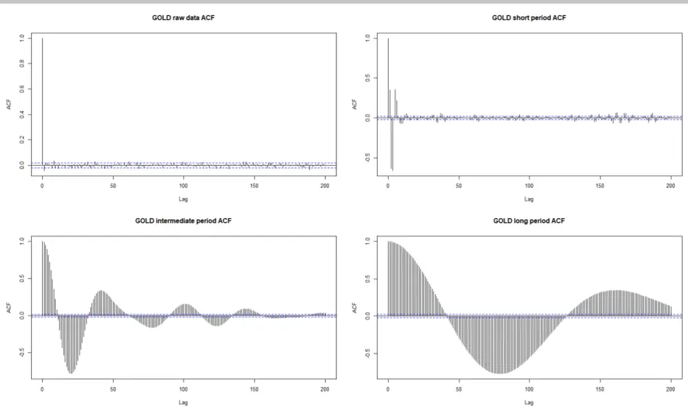
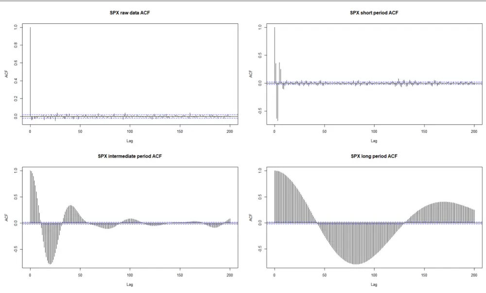
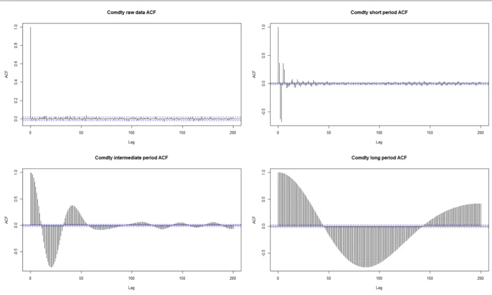
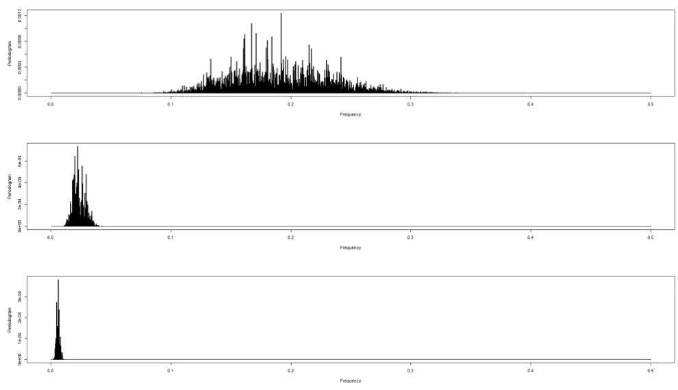
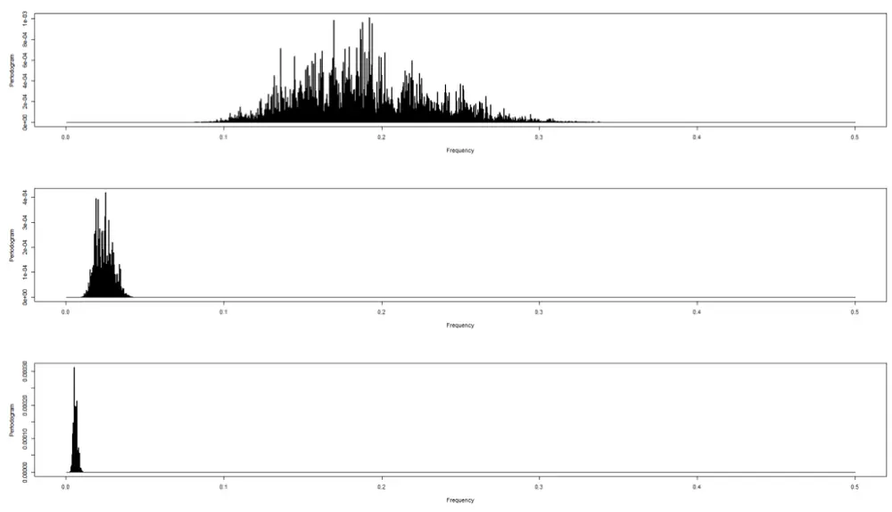
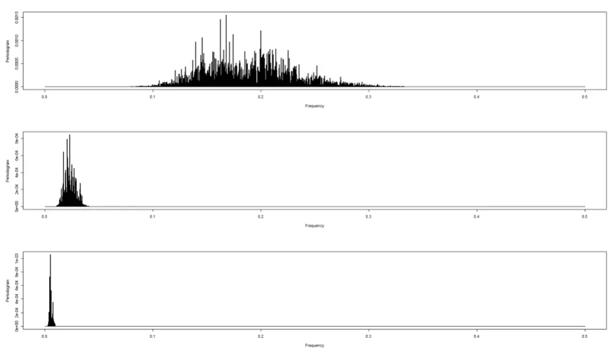
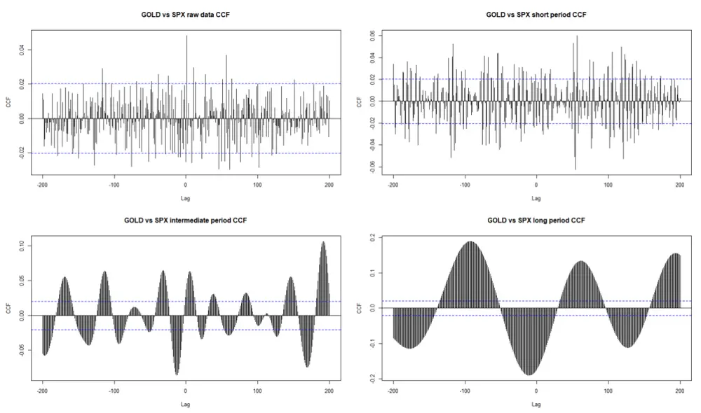
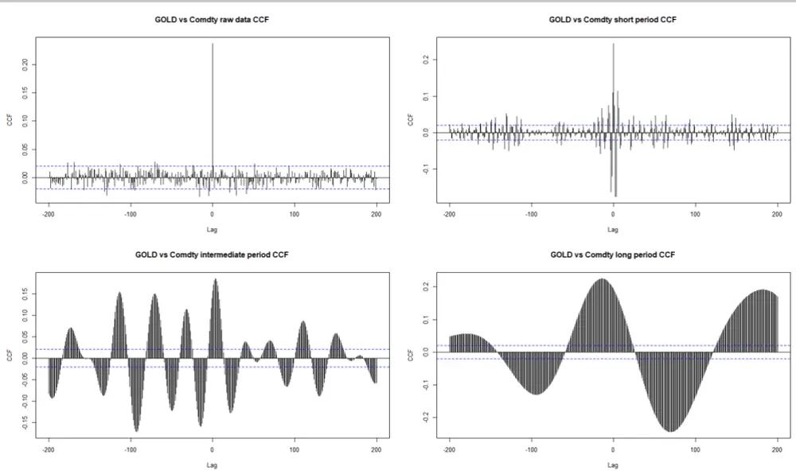
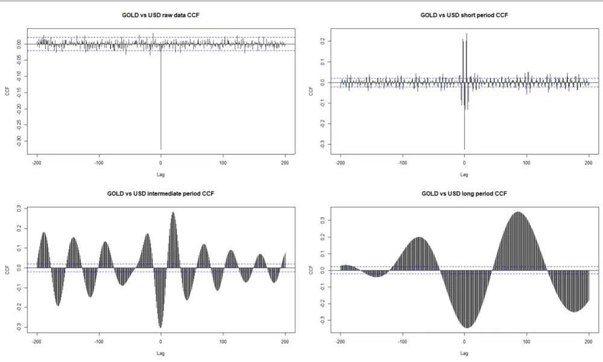

# 金融科技赋能投研系列之四：

投资咨询业务资格：

证监许可【2011】1289 号

## 多周期金融数据分析（三）

## 摘要：

在我们的上两篇关于多周期金融数据分析的报告中简要介绍了一些较为新颖的数据分解方法—多周期维度拆解和递归分析法（RQA、RP 图）。而研究的重点分别放在了研究金融数据中的两个最重要的现象：类周期性和相变。

我们在研究过程中发现上述研究方法具有一定的普遍适用性。在对不同类型资产分析过程中，我们都看到了相似的类周期特征和明显的相变现象。实际上，通过量化方法得到的相变结果，无论是贵金属还是股票指数，都可以和历史背景中发生的具体事件进行逐一对比。而对于不同类型的金融数据，包括机构统计发布的数据（如美国劳工部发布的 CPI），我们也可以应用相同的方法，寻找数据中的规律。这些研究结果都促使我们深入应用这一套工具对金融数据做进一步研究。

本文将把这些方法应用到日度收益率数据。并且观察在特定的一些时间段，我们能否从数据中获取更丰富，更准确的信息。

研究院 量化组

研究员

罗剑

- 0755-23887993

- luojian@htfc.com

从业资格号：F3029622

投资咨询号：Z0012563

## 陈辰

- 0755-23887993

- chenchen@htfc.com

从业资格号：F3024056

投资咨询号：Z0014257

## 何绪纲

- 0755-23887993

- hexugang@htfc.com

从业资格号：F3069194

## 一、背景介绍

通过在对金融时序数据进行多周期分解之后，看到不同在不同周期尺度上，数据的各类统计值都体现了较大的差异。这实际上，对后续策略的制作指出了方向。但是，同时我们也看到，尽管月度的数据表现来的很多特征能够与背后的经济学规律相联系，但是，其更短期的特征却因为受限于数据分辨率，而难以观察到。

另一方面，虽然，我们从RQA分析中看到了明确的市场相变规律。但是由于月度数据跨度较长，我们无法看到更微观的特征。事实上，从投资策略的角度出发，我们希望能够获得更敏感的数据特征，进而帮助我们更快速、更准确判断市场行情，进而能够迅速反应并执行适当的投资操作。

在本文中，我们从日度数据入手，将日度的数据做分解之后，再计算其月度累积收益率。
将前文的方法，针对日度数据对周期选取做适当调整，然后，观察市场的表现。

## 二、日度数据分解

与月度数据处理方式类似，我们也将日度数据分解到三个周期尺度上：

1) 短周期：1-2 周；

2) 中周期：1-2 月左右；

3) 长周期：2 个月及以上。

从下图，我们看到，不同类型的资产，在经过多周期分解之后。随着周期的拉长，数据都显示出了明显的线性自相关特征。这和我们在使用周度数据时看到的情况相同。严格地说，我们并不希望得到与月度数据相同的结果，因为，日度数据的噪音层度其实更高，并且也有更多的异常值。

图 1： 金价日度收益率自相关性

数据来源：Bloomberg，华泰期货研究院

图 2： S&P500指数日度收益率自相关性

数据来源：Bloomberg，华泰期货研究院

图 3： 高盛商品指数日度收益率自相关性

数据来源：Bloomberg，华泰期货研究院

从上图，我们较难看出来不同类型资产的周期性差异。但是，实际上，他们都有各自的类周期规律，我们在频域空间画出频率强度：

图 4： 黄金日度收益率频率强度（由上到下以此为：短周期、中周期、长周期）

数据来源：Bloomberg，华泰期货研究院

图 5： S&P500指数日度收益率频率强度（由上到下以此为：短周期、中周期、长周期）

数据来源：Bloomberg，华泰期货研究院

图 6： 高盛指数日度收益率频率强度（由上到下以此为：短周期、中周期、长周期）

数据来源：Bloomberg，华泰期货研究院

上图显示，与月度数据不同。日度数据，只有当我们分离接近长周期尺度的时候，才能看到明显的主导周期。针对上面的三个资产类型，主导周期分别为：黄金 7.5 个月，S&P 500 指数 9 个月，商品指数 9 个月。

从这也可以看出，我们的方法适用于中高频率的数据。日度（实际上，以及更高频率）数据得到的结果与月度数据分解得到的特征是吻合的。在不同尺度上我们都看到了类周期现象。而在最高的周期上，我们也发现了主导周期。

其中差异的部分，比如中周期没有主导周期，很可能是因为日度数据中的噪音程度比月度数据要高。

## 三、日度数据相关性分析

接下来，我们分析时序数据之间的相关性。

我们将看到，在不同的类周期尺度上，数据之间的相关性展现了很大的差异。

图 7： 黄金 vs S&P 500 指数

数据来源：Bloomberg，华泰期货研究院

图 8： 黄金 vs 高盛商品指数

数据来源：Bloomberg，华泰期货研究院

图 9： 黄金 vs 美元指数

数据来源：Bloomberg，华泰期货研究院

黄金与 S&P500指数在原始数据中比较难以判断相关性。即使在同步时间段内，有超过无相关性 95%置信区间的现象，但因为相关性绝对值过小，我们认为结果并不十分明确。

而随着周期的拉长，相关性变得越来越显著。长周期的负相关性较为明确。有趣的是，在不同周期尺度上，相关性表现可以非常不同，甚至接近反向。

而黄金与商品指数在同步的原始数据层次上就已经表现出来正相关性，这符合黄金的商品属性。在短周期尺度上，虽然同步条件下是正相关，但是因为数据的噪音干扰，我们看到领先/滞后相关性有较大波动。中长周期则表现了稳定的正相关性。值得注意的是，在长周期尺度上，黄金的行情领先与商品指数。

黄金与美元指数也密切相关。实际上，在所有周期尺度上，黄金与美元都保持负相关性，且绝对值差异不大。在长周期尺度上，黄金略落后于美元指数。

## 四、总结

本文将多周期分解的方法应用到了日度数据中来。

首先，我们看到数据分解的方法能够提供与月度数据一致的分解结果—自相关性；长周期尺度上的主导周期等。黄金似乎表现出比商品和股票更加活跃的周期转换。

接着，我们从相关性角度考察不同周期尺度上相关性的变化。非常有趣的是，在不同周期上相同时间序列可以表现出不同，甚至反向的相关性。黄金的商品属性在各个周期上都获得了印证。在长周期上，还表现出领先于商品指数，但是落后于美元指数的特征。

## 免责声明

本报告基于本公司认为可靠的、已公开的信息编制，但本公司对该等信息的准确性及完整性不作任何保证。本报告所载的意见、结论及预测仅反映报告发布当日的观点和判断。在不同时期，本公司可能会发出与本报告所载意见、评估及预测不一致的研究报告。本公司不保证本报告所含信息保持在最新状态。本公司对本报告所含信息可在不发出通知的情形下做出修改，投资者应当自行关注相应的更新或修改。

本公司力求报告内容客观、公正，但本报告所载的观点、结论和建议仅供参考，投资者并不能依靠本报告以取代行使独立判断。对投资者依据或者使用本报告所造成的一切后果，本公司及作者均不承担任何法律责任。

本报告版权仅为本公司所有。未经本公司书面许可，任何机构或个人不得以翻版、复制、发表、引用或再次分发他人等任何形式侵犯本公司版权。如征得本公司同意进行引用、刊发的，需在允许的范围内使用，并注明出处为“华泰期货研究院”，且不得对本报告进行任何有悖原意的引用、删节和修改。本公司保留追究相关责任的权力。所有本报告中使用的商标、服务标记及标记均为本公司的商标、服务标记及标记。

华泰期货有限公司版权所有并保留一切权利。

## 公司总部

地址：广东省广州市越秀区东风东路761号丽丰大厦20层

电话：400-6280-888

网址：www.htfc.com