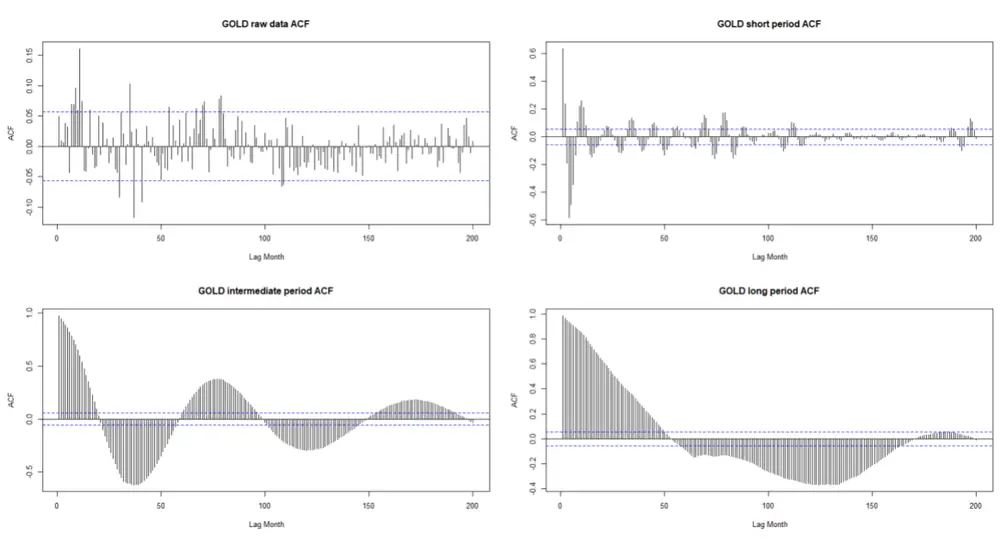
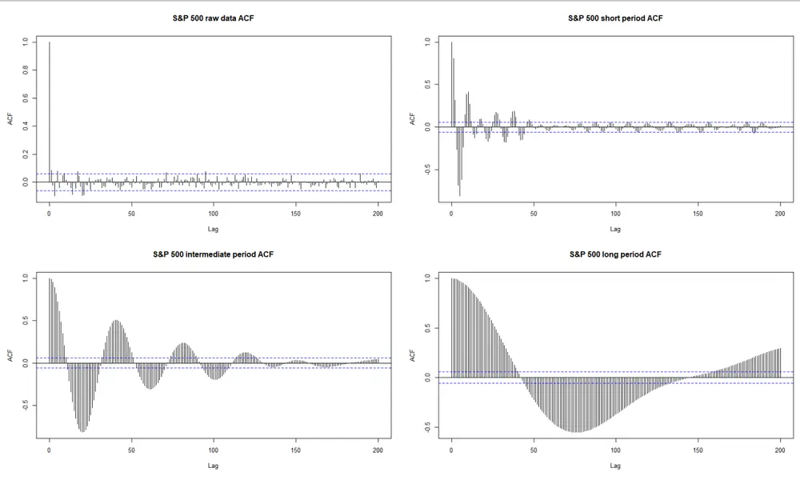
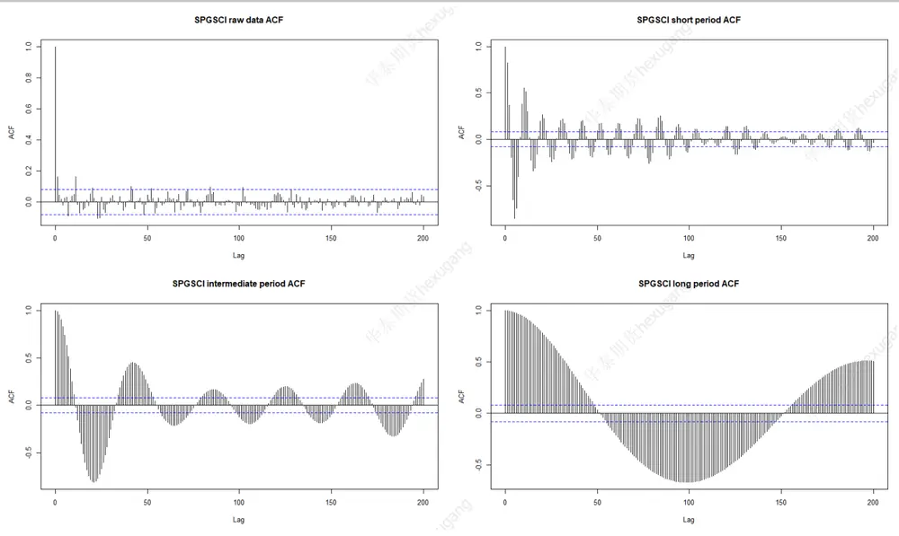
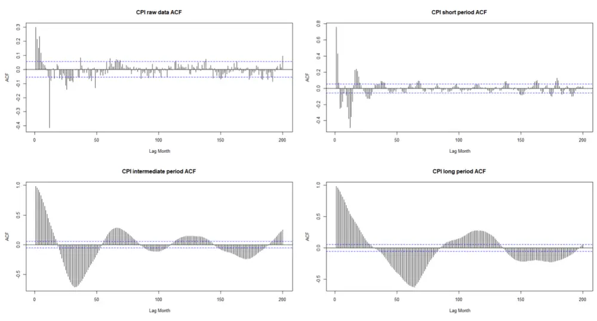
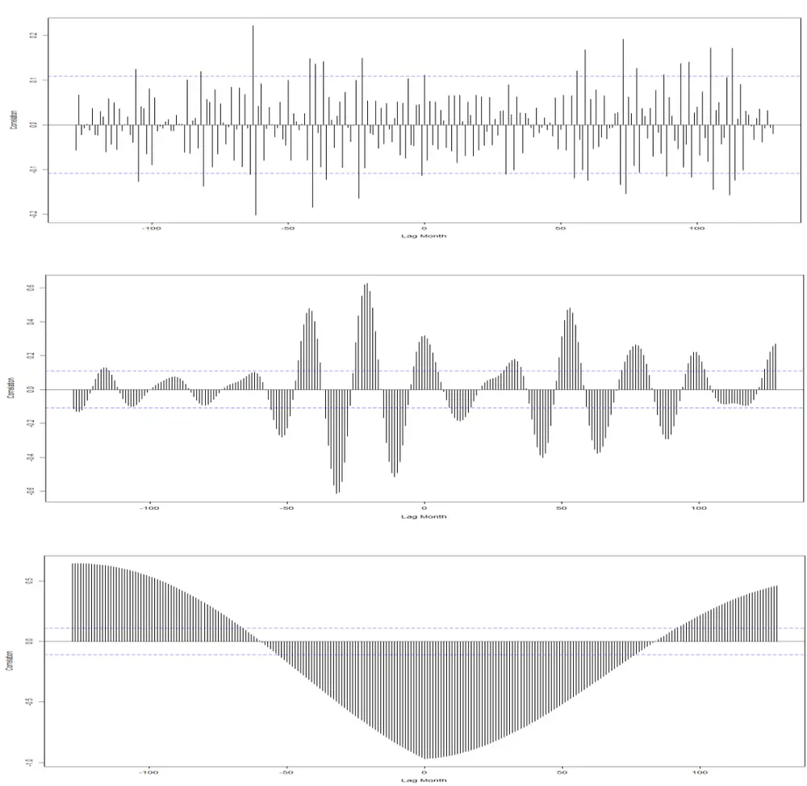
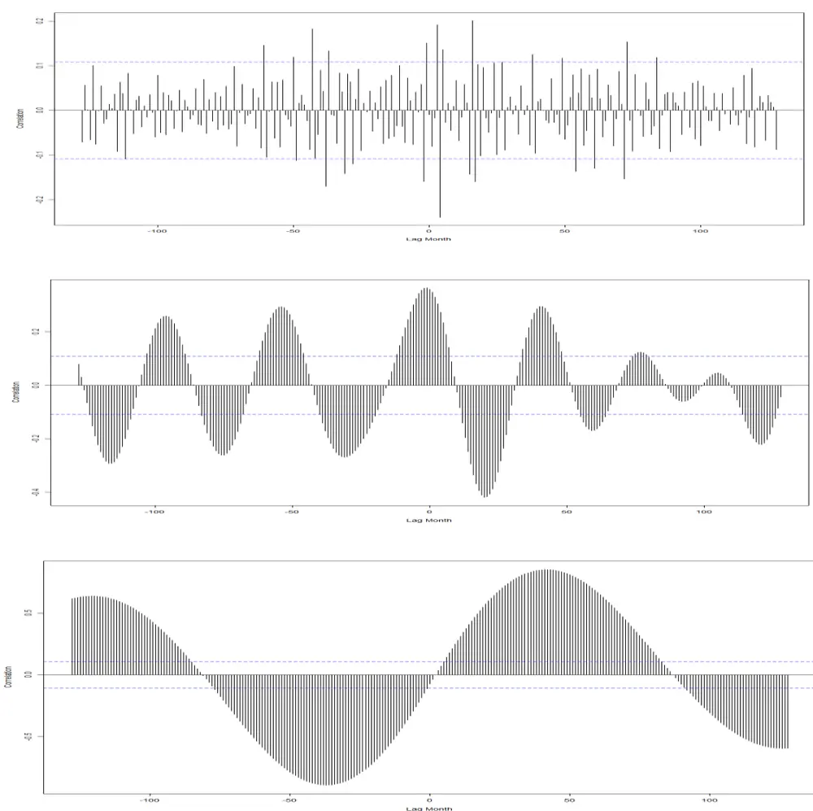
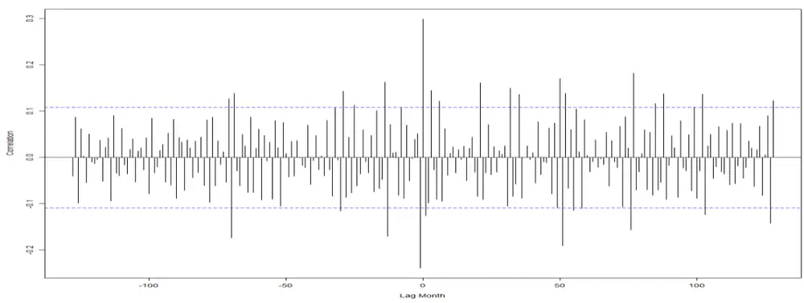
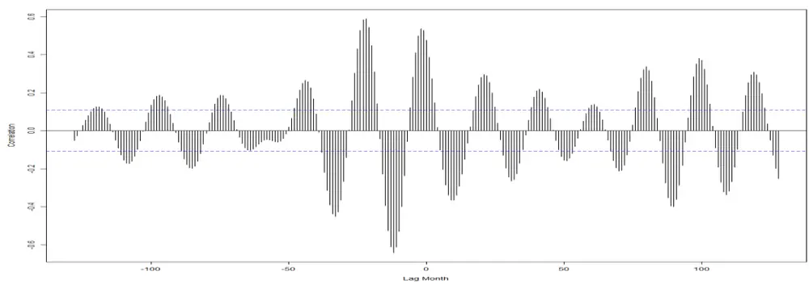
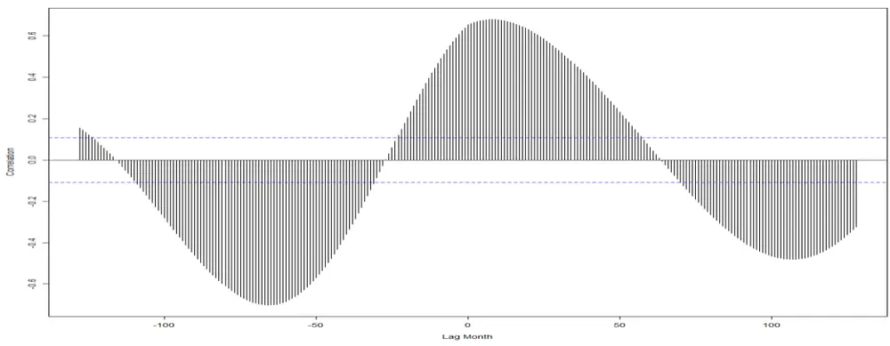

# 金融科技赋能投研系列之五：

## 多周期金融数据分析（四）

## 摘要：

在前面的报告中，我们已经比较详细的介绍了多周期分解金融数据的方法。我们可以看到该方法具有非常好的普适性：不同频率的数据都可以使用，并且结果可以互相印证；对于不同类型的金融数据也可以使用（比如来自不同资产类型，或者属于交易或统计型数据）。

这些研究成果促使我们相信，这一套方法的价值可以进一步挖掘。本文将会把多周期分解的方法应该到收益率以外的统计量上去：波动性、VaR和CVaR等统计指标。

我们将会看到这些金融统计类型的数据实际上也可以通过不同周期尺度的分解，来提取对应的类周期特征。这为我们深入理解市场信息及其背后经济学意义提供了更加充分的素材，同时也为后续利用现代风险预算等大类资产配置策略提供了数据基础。

投资咨询业务资格：

证监许可【2011】1289 号

研究院 量化组

研究员

罗剑

- 0755-23887993

- luojian@htfc.com

从业资格号：F3029622

投资咨询号：Z0012563

## 陈辰

- 0755-23887993

- chenchen@htfc.com

从业资格号：F3024056

投资咨询号：Z0014257

何绪纲

- 0755-23887993

- hexugang@htfc.com

从业资格号：F3069194

## 一、背景介绍

在研究金融时间序列的过程中，我们发现，数据的波动性具有很强的类周期性特征：数据并不能够用单一周期或者若干精确周期解释；在不同周期维度上数据体现出具有较大差异的统计特征。这些问题都为进一步进行投资研判带来了障碍。

从投资角度来说，我们需要有效的方法将不同的类周期波动特征进行有效分解。比如，当投资周期偏向于短周期，那么我们将主要利用其短周期尺度上的数据特征，而非中长周期的波动特征。换句话说，其中长周期的特征变成了我们考察系统的背景噪音，而对外推判断造成一定程度的干扰。反过来，如果我们的投资尺度偏向长周期，且以价值投资作为主导投资逻辑，那么这时候高频的波动性特征并不能提供有用的帮助。实际上，因为这时候中长周期的投资逻辑判断具有较高稳定性，且对于短周期波动并不敏感（结构性相变除外），那么短期的价格波动其实正是我们需要排除的主要噪音干扰。

我们注意到对于数据的传统变频方法并不能完全解决上述问题。举例来说，如果我们采用月度收益率数据，那么本质上来说，它是日度数据的累积收益率。尽管，累积计算的过程中相当于做了日度数据的平滑化处理，但是并不能完全排除日度波动性的影响。这也是，在绝大多数情况下，金融数据做了变频处理之后，依然具有较低信噪比的原因（虽然确有明显改善）。

另一方面，需要指出数据变频方法与数据分解目标之间存在更加深刻的差异。数据的分解逻辑实际上是在保持原始数据采样频率的基础上，对原始数据进行多周期分解，其分解的最终目的是剥离出来我们投资策略最相关的类周期性特征，并且依然需要保留剩余波动性特征（其为风险来源之一）。所以，我们的方法本质上是对数据在多个周期上进行“解析”，而非简单的变频处理，或者在一定周期范围内进行数据过滤。

在本文中，将从数据多周期分解的角度出发，寻找数据周期合理匹配的方法。并以此作为基础分析不同时间序列在不同周期尺度上的相关性。我们将会看到，不同的影响因子确实在不同的周期尺度上对标的物产生差异巨大的影响。我们选择LME黄金现货收益率作为主要标的物进行方法论阐述。

## 二、方法介绍

在我们之前的报告中已经对单一时间序列的分解做了较为详尽的论述。这里为了保持报告的完整性，我们简单引述主要的分析思路。

首先，我们选取黄金作为主要的研究标的物，因为黄金包含了较为复杂的多重属性：

- 商品属性，金价受到黄金商品供求关系以及其他大宗商品的影响；

- 货币属性，金价受到全球货币体系变化、全球货币政策变动影响；

- 投资避险属性，金价易受国际政治和经济发展周期的影响，进而表现为与全球权益类市场、债券、房地产等大类资产投资的风险程度变换。

黄金的不同投资功能会在不同的经济发展周期，体现出不同投资者的投资意愿，从而表现出其价格波动主导因素的不断切换。而这些复杂的外部影响因素--从量价影响因子到经济循环周期等不同维度上，都体现了黄金定价的复杂性。这为我们对多重因子的影响提供了丰富的研究内容。

我们将标的物和备选因子的原始月度收益率数据按照不同的周期范围进行分解，大致分解为三个层次：

1) 短周期：1 个季度 - 1 年左右；

2) 中周期：1-5 年左右；

3) 长周期：5 年以上。

在不同的周期尺度上，我们将首先分析标的物及若干备选因子各自的自相关性特征；然后，深入到相关性的讨论，特别是从标的物的复杂定价属性入手，探讨其价格波动与备选因子之间的领先或者滞后特征。实际上，我们将看到在较长的周期尺度上，相关性也表现出了类周期性特征。

## 三、月度收益率自相关性

我们列举不同类型金融数据多周期自相关结果：

图 1： LME 黄金月度收益率自相关性

数据来源：Bloomberg，华泰期货研究院

图 2： S&P 500 指数月度收益率自相关性

数据来源：Bloomberg，华泰期货研究院

图 3： 高盛商品指数月度收益率自相关性

数据来源：Bloomberg，华泰期货研究院

图 4： 美国劳工部公布 CPI 自相关性

数据来源：BLS，华泰期货研究院

在原始收益率数据中，月度收益率的自相关性都不明显，超过 95%置信区间的异常值也并不多见，这符合我们一般常见的金融数据特征。实际上，如果只有这样的数据结构，我们并不能做出任何有效的判断，也比较难决定选用什么样的模型或者分析工具做更深入的数据特征分析。

而在中长周期尺度上，对于不同的大类资产数据，其自相关性都体现了显著的类周期性变化特征。这里的中长周期并非 long-termmemory特征，因为，随时间延迟没有看到 ACF趋于饱和。所以，我们认为这是类周期现象的一个佐证。

虽然，这里计算的是线性相关性，但是，我们对可能存在的非线性特征保持开放态度。同时，我们发现即使是非交易型数据，在不同周期尺度上也能观察到强化的自相关性特征。

## 四、月度收益率协变相关性

接下来，我们分析黄金标的物与备选因子之间的相关性。这将为我们将来开发多因子投资模型提供强有力的数据支撑。

图 5： LME 黄金现货与 S&P 500 指数交叉相关性（由上到下以此为：短周期、中周期、长周期）

数据来源：Bloomberg，华泰期货研究院

首先，我们看到在短周期相关性分析中，在较长历史条件下，黄金与 S&P 500 指数几乎没有统计意义上显著的相关性（我们使用了 1984年至今，长约 35 年的历史数据）。这一特征也符合我们一般认识，并且与原始数据的相关性结果类似（此处未画出）。

其次，在中周期尺度上，不难看到，黄金与权益类市场的相关性已经凸显--相关性绝对值已经较大，并且具有了很强的统计意义（大多数peak已经超过了无相关性假设的 95%置信区间）。而权益类市场的领先和滞后性质更是显示出了类周期性特征。这为我们关注的金融数据结构中的类周期特征又增加了一个新的佐证。在这样的类周期特征中，我们还发现，相关性极值点并非出现在同步数据中（lag=0），甚至不是最近的peak。这促使我们相信，相关性关系中可能存在更高的周期特征，我们也注意到在中周期尺度上，同步相关性为正。

最后，我们观察到，长周期特征体现了更长周期尺度上的相关性现象。实际上图中显示的120 个月（10年）lag可能只涵盖了到了一个完整的长周期。尽管，我们预期黄金和权益类市场之间具有负相关性，但是长周期的相关性绝对值如此之高令人略感意外。我们分析这样的负相关性正是反映了长期经济周期规律，以及资金在不同金融资产之间流动的长期规律性。我们猜测这可能是在西方金融市场对全球金融市场主导的几十年来，其金融资产多元化配置，分散化投资，风险管理走向成熟的重要表现。

同时，我们也看到因为相关性衰减速度很慢（实际上，是延续若干年），那么这样的负相关性并不适合做交易策略的（择时）战术设计，更适合在大类配置的过程中长期持有，利用这两类资产的对冲特征来分散资产配置风险。这对我们在大类资产配置的理解和方法创新等方面提供了重要的启示。

图 6： LME 黄金现货与 CPI 交叉相关性（由上到下以此为：短周期、中周期、长周期）

数据来源：Bloomberg，华泰期货研究院

首先美国劳工部公布的CPI数据并非交易类型数据，我们认为，除非是令市场感到意外的统计值，一般意义上并不会对市场造成明显的冲击。短周期上，黄金与 CPI相关性不明显，虽然数据在领先/滞后的小范围内有一些超过了95%置信区间的月份。但是，如果我们拉长周期，却看到了完全不同的状况。

到了中周期，黄金的抗通胀功能就开始得到体现。其同步正相关的性质比较明确，类周期现象也很清晰。而在长周期上，我们却看到了非常有趣的拐点性质。也就是说黄金价格的变动（行情启动或者结束），都发生在 CPI走到低谷或达到高点之时。

最后，我们考虑黄金的商品属性。

图 7： LME 黄金现货与商品指数交叉相关性（由上到下以此为：短周期、中周期、长周期）

数据来源：Bloomberg，华泰期货研究院

黄金与商品指数的相关性（lag=1 的范围内）在最高频的周期尺度就已经显现，这与前两个例子并不完全相同。所以在短周期尺度上，黄金有其商品属性一面。

中长周期尺度上，黄金也保持着与商品指数的同步正相关性。所以，我们认为虽然黄金的的定价属性较复杂，但是其商品属性其实较为明确，与商品指数的正相关性也较为稳定。

## 五、总结

本文将多周期尺度分解的方法应用到各类资产数据当中。首先，我们看到，在短周期尺度上数据的自相关性比较接近于原始数据，较难观察到类周期的特征。在这种情况，比较难判断数据的主要特征并加以利用。但是，在中长周期尺度，所有的金融数据（交易型和非交易型）都体现出了显著的类周期特征。我们进一步分析了，标的物（黄金）与备选因子之间的相关性。对于基本面分析所获得的过往结论在中长周期尺度上大多得到了量化的验证。特别是黄金拥有的复杂定价属性均被一一验证。同时，我们也看到，真是数据的分解提供了更加丰富的信息：在不同周期尺度上，相关性的影响并不同步。例如 CPI 在中周期与黄金处于同步状态（黄金的抗通胀功能），但是到了长周期则显示出拐点性质。这些现象背后的基本面原因是我们进一步探讨的内容，也是指导我们投资的重要逻辑基础。

## 免责声明

本报告基于本公司认为可靠的、已公开的信息编制，但本公司对该等信息的准确性及完整性不作任何保证。本报告所载的意见、结论及预测仅反映报告发布当日的观点和判断。在不同时期，本公司可能会发出与本报告所载意见、评估及预测不一致的研究报告。本公司不保证本报告所含信息保持在最新状态。本公司对本报告所含信息可在不发出通知的情形下做出修改，投资者应当自行关注相应的更新或修改。

本公司力求报告内容客观、公正，但本报告所载的观点、结论和建议仅供参考，投资者并不能依靠本报告以取代行使独立判断。对投资者依据或者使用本报告所造成的一切后果，本公司及作者均不承担任何法律责任。

本报告版权仅为本公司所有。未经本公司书面许可，任何机构或个人不得以翻版、复制、发表、引用或再次分发他人等任何形式侵犯本公司版权。如征得本公司同意进行引用、刊发的，需在允许的范围内使用，并注明出处为“华泰期货研究院”，且不得对本报告进行任何有悖原意的引用、删节和修改。本公司保留追究相关责任的权力。所有本报告中使用的商标、服务标记及标记均为本公司的商标、服务标记及标记。

华泰期货有限公司版权所有并保留一切权利。

## 公司总部

地址：广东省广州市越秀区东风东路761号丽丰大厦20层

电话：400-6280-888

网址：www.htfc.com