# 金融科技赋能投研系列之六：

投资咨询业务资格：

证监许可【2011】1289 号

## 利用随机森林评价因子影响力

研究院 量化组

## 摘要：

在年报《金融科技赋能投研系列之一： 人工智能策略在商品市场的应用》中详细地介绍了如何运用人工智能算法构建多因子策略。由于不同因子在不同的历史阶段、经济发展周期，对金价的变动可能表现出迥然不同的影响强度。挑选有效因子池是构建模型重要的一步，支持模型保持对市场的解释力，同时因子影响力也决定因子在策略中的权重。

本文将介绍利用随机森林评价因子对模型预测的影响力的常用方法，有助于更深入理解随机森林模型。

研究员

罗剑

- 0755-23887993

- luojian@htfc.com

从业资格号：F3029622

投资咨询号：Z0012563

## 陈辰

- 0755-23887993

- chenchen@htfc.com

从业资格号：F3024056

投资咨询号：Z0014257

何绪纲

- 0755-23887993

- hexugang@htfc.com

从业资格号：F3069194

## 一、因子选取

在年报《金融科技赋能投研系列之一： 人工智能策略在商品市场的应用》中详细地介绍了如何运用人工智能算法构建多因子策略。由于不同因子在不同的历史阶段、经济发展周期，对金价的变动可能表现出迥然不同的影响强度。挑选有效因子池是构建模型重要的一步，在应对市场变化时，支持模型保持对市场的解释力，因子影响力也决定因子在策略中的权重。

从黄金的大宗商品、货币以及投资避险三大属性入手，筛选不同类型的（指标）因子，从多个侧面反映黄金价格背后的影响因素，本文测试的因子如下：

表格1: 黄金定价因子选取

| 序号 | 因子类型 | 因子名称 | 本文简称 |
| --- | --- | --- | --- |
| 1 | 宏观 | 美国消费者价格指数 | CPI |
| 2 | 宏观 | 美元狭义货币供应量 | M1 |
| 3 | 宏观 | 美元广义货币供应量 | M2 |
| 4 | 宏观 | 信贷风险 | Credit Risk |
| 5 | 宏观 | 实际无风险利率 | Free_risk_rate |
| 6 | 宏观 | 高盛商品指数 | Comdty |
| 7 | 宏观 | CRB 金属指数 | CRB_metal_m |
| 8 | 宏观 | 美国通胀率 | Inflation |
| 9 | 交易型 | 美国十年期国债利率 | yield10y_m |
| 10 | 交易型 | 美元兑人民币汇率 | USDCNY |
| 11 | 交易型 | 美元指数 | USD_Index |
| 12 | 交易型 | S&P 500 指数 | Equity_Market |
| 13 | 交易型 | 巴里克黄金公司 | ABX |
| 14 | 交易型 | 纽蒙特黄金公司 | NEM |
| 15 | 交易型 | 金罗斯黄金公司 | KGC |
| 16 | 交易型 | 伊格尔矿业公司 | AEM |
| 17 | 交易型 | 美国国债跨期利差 | Yield_10y_2y |
| 18 | 交易型 | 美国三月期国债利率 | Yield3m |

数据来源：华泰期货研究院

## 二、利用随机森林评估因子影响力

随机森林算法的基本组成元素是决策树。采用对多颗决策树 (可能是二叉树，也可能是多叉)的随机排列组合来提高分类的准确性。随机森林的主要原理如下图所示。首先，我们对所有数据做 bootstrap 处理，然后采用 bagging 抽样。

训练集相比原始数据而言，只有 63%的数据被重复抽取，而有 37%的数据从未出现。使用这样的方法可以替代数据集交叉验证法，同时也避免了过高的时间空间复杂度。Bagging抽样是有放回的抽样，即每棵树的数据集是由原始数据集随机构成，可能重复包含某些数据，也可能不包含某些数据。接着，随机森林会随机选择特征子集。在树的节点分裂时，会随机无放回的选择总属性的子集，这个子集的大小会远远小于总属性特征的数量。每次分裂时，都会根据之前在决策树中提到的指标如信息熵，信息增益率以及基尼指数来选择分裂的节点。随机森林的结束条件有以下几种方式：决策树达到最大深度、终节点不纯度达到阈值、终节点的样本数达到设定值、待分裂属性用完等。最后，我们会根据对每棵树的评分来对特征的重要程度进行划分。

随机森林原理示意图
单位：无
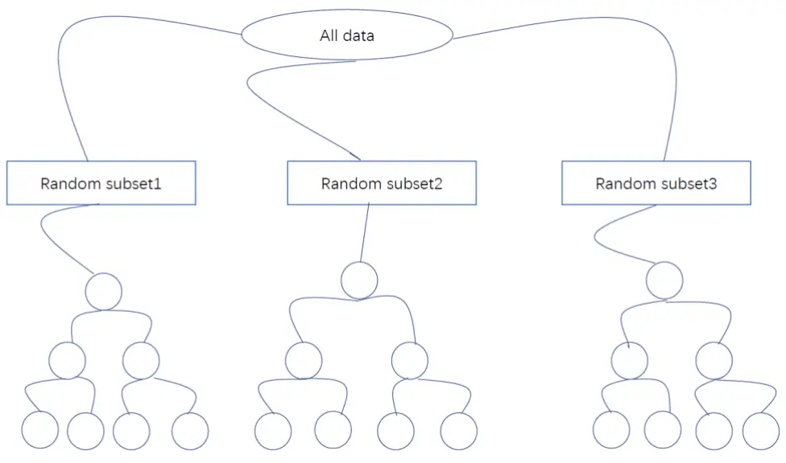
数据来源：华泰期货研究院

通过上述随机森林原理的介绍，我们可以看到随机森林通过种多颗树的方式降低了过拟合的危险。同时也解决了决策树容易受到极值影响等问题。下面会介绍一些衡量随机森林的性能指标。一般来说，这类指标可以分为三种：泛化误差，分类效果指标，运行效率。泛化能力指的是经过训练过的模型对于没有在训练集中出现的样本做出正确反映的能力。在随机森林算法中，可以使用OOB估计去估计泛化误差。如前所述，随机森林是使用 bagging方法进行训练集的生成的，在产生这些数据集的时候，有部分数据是未被抽取的，这类数据就是OOB（out of bag）。使用这类数据去验证，既减少了数据的复杂度，又保证了验证样本的一致性。分类效果指标主要是用来考量分类回归以及预测效果的指标。为了描述这些指标我们首先需要考虑一个如下矩阵。

CART 是 Classifiation and Regression Tree 的简称，这是一种著名的决策树学习算法，分类和回归任务都可用。同样地，随机森林的一大优势在于它既可用于分类，也可用于回归问题，这两类问题恰好构成了当前的大多数机器学习系统所需要面对的问题。

## 2.1 基尼不纯净度(Gini impurity)

基尼不纯净度(Gini impurity)又称为基尼指数，反映了从数据集中随机抽取两个样本，其类别标记不一致的概率，因此，基尼不纯净度越小，则数据集的纯度越高。CART 决策树使用基尼不纯净度作为划分属性，即选择基尼不纯净度最小的节点作为分裂节点，其本质上旨在最大限度地减少分裂带来的杂质。在本文的实例中，可以理解为下一个分裂节点使用哪个因子作为划分属性。

基尼不纯净度表达式为：

$$
\mathrm{Gini}=1-\sum_{k}^{|y|}p_{k}^{2}
$$

其中 $p_{k}$ 表示对应事件 k 出现的概率，总事件数量为|y|（如在分类任务中，待选类别的数量）。因此基尼不纯净度越小，则数据集的纯度越高。

决策树的分裂过程可以理解为是选择分裂属性，比较将各划分属性作为节点，用节点的基尼指数减去子节点的基尼指数的加权平均，差值最小则是最优的划分属性。因此，通过计算在每个属性上拆分的所有节点的基尼不纯度减少的总和，可以很好地评价出各属性的重要性。

## 2.2 排列重要性(permutation importance)

改变数据表格中某一列特征的数据排列，保持其余特征不动，计算对预测精度的影响有多大，该值即为排列重要性(permutation importance)。排列重要性需要在模型训练完毕后才能计算出来。

特别地，对于不同的任务，可以选择不同的指标进行评估，以下为常用的选择方法：

- 分类任务，打乱排列对测试集的预测准确率的影响；

- 回归任务，打乱排列对均方误差（MSE，Mean Squared Error)，或者均方根误差（RMSE，Root Mean Squared Error)的影响：

$$
\mathrm{MSE}=\frac{1}{N}\sum_{t=1}^{N}(observed_{t}-predicted_{t})^{2}
$$

$$
\mathrm{RMSE}=\sqrt{\frac{1}{N}\sum_{t=1}^{N}(observed_{t}-predicted_{t})^{2}}
$$

下图中，左图表示改变因子的数据排列，对MSE的影响排序，右图为按照因子基尼不纯净度减少贡献排序，两种方法筛选出的排名靠前的因子基本一致，排名靠后的因子稍有偏差。

单位：无

黄金因子MSE与纯净度提升贡献
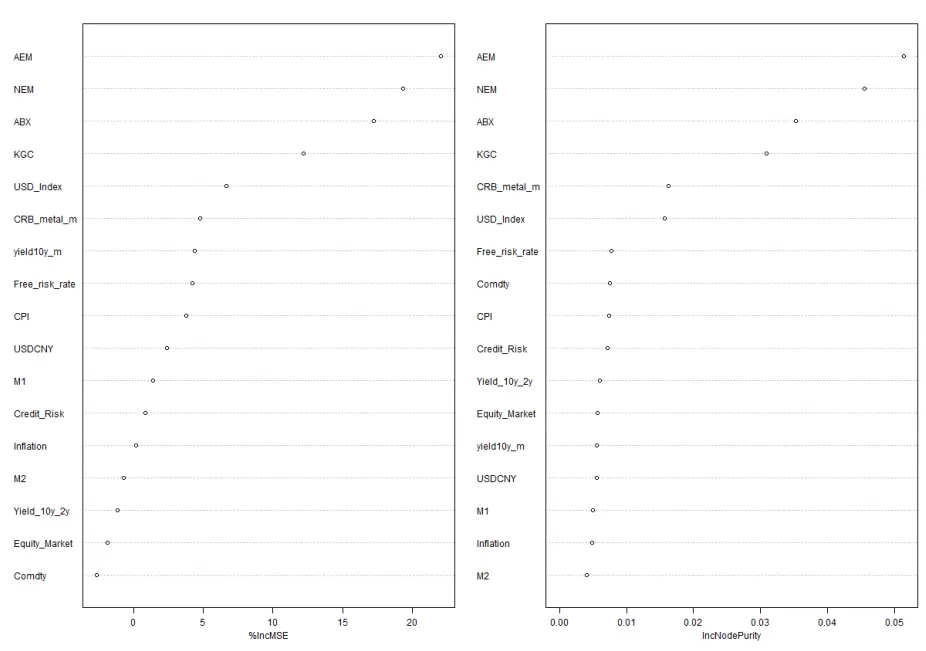
数据来源： Wind 华泰期货研究院

## 2.3 最浅分裂节点(min depth distribution)

基于在上文介绍的基尼不纯度作为属性划分的依据，则有因子在决策树中出现的越早，即因子出现的深度越浅，因子对决策树的贡献越大，因此可以通过最浅分裂节点评估因子重要性。

首先，计算随机森林的每棵树中因子所在的最浅分裂节点；然后，将树的最浅分裂节点计算平均值。在年报《金融科技赋能投研系列之一： 人工智能策略在商品市场的应用》中也使用了该方法。

为帮助理解可参考下图，为黄金因子回归的最浅分裂节点结果图，随机森林一共使用了500 棵树，纵坐标轴为因子，横坐标轴为树的个数，每行代表一个因子在 500颗树中最浅分裂节点所在层数的频数分布，主要出现在浅层则因子重要性相对较高，黑线代表的是层数的平均值。

黄金因子的最浅分裂节点分布图
单位：无
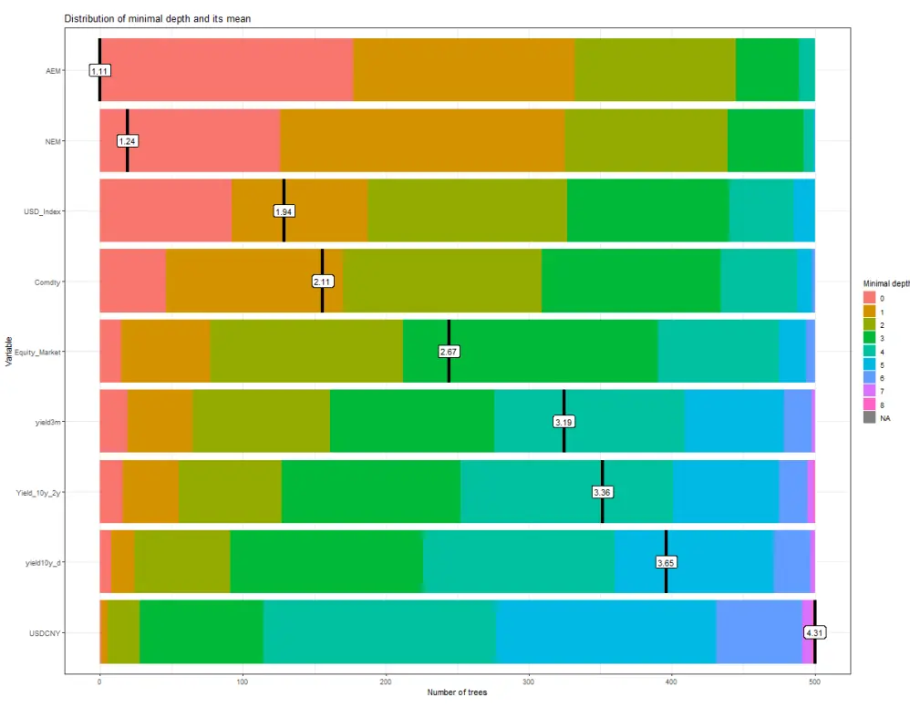
数据来源： Wind 华泰期货研究院

## 2.4 其他指标及其相关性

除上述之外，包含因子的树的数量、以因子作为结点的数量等也常作为因子重要性的依据。

基于以上方法，接下来提供一个角度比较各方法结果之间的差别，即使用各方法得到的结果的相关性进行度量，相关性绝对值较高表示结果接近，否则结果差别较大。下图中右上角为两两结果间的相关性，左下角为散点图，可以看出大部分时候相关性较高。仅no_of_tree与其他指标的结果有一定的差距。

黄金因子重要性指标间关系
单位：无
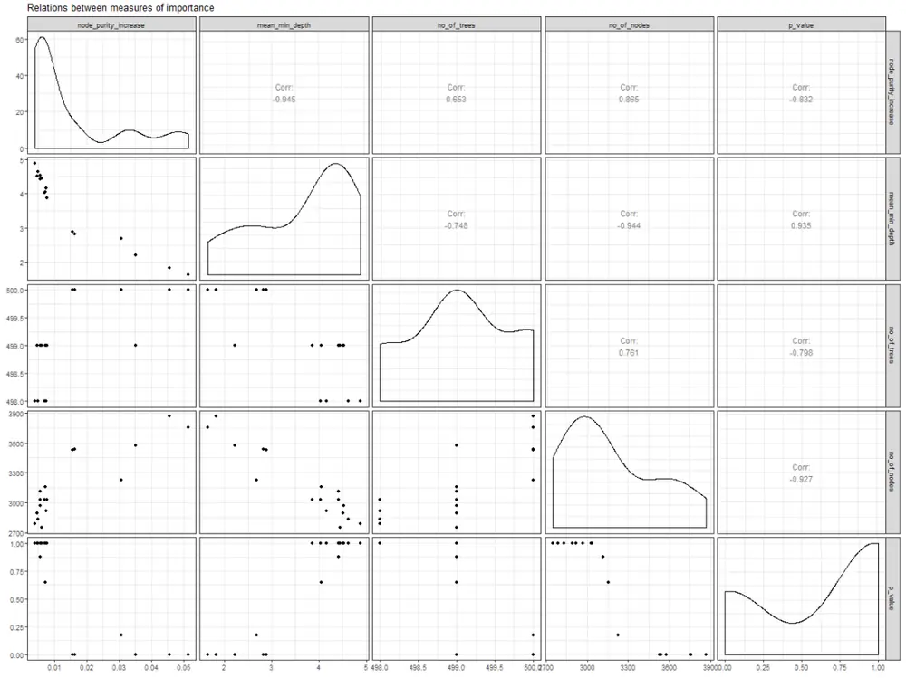
数据来源： Wind 华泰期货研究院

## 2.5 最浅深度分布(min depth distribution)

因子相互作用关系，在随机森林模型中，我们并没有假设任何线性相关性；换句话说，可以提取因子与标的物之间的非线性相关性（如果存在的话）。下图就提供了一种直观的方法去寻找相互作用因子--一对因子组合的最浅分裂节点均值，显然从左到右蓝色逐渐加深，颜色越浅代表因子对出现的频次越高，纵坐标代表因子对最浅分裂节点均值，值越小代表对应因子对越重要。

黄金因子重要性指标间关系
单位：无
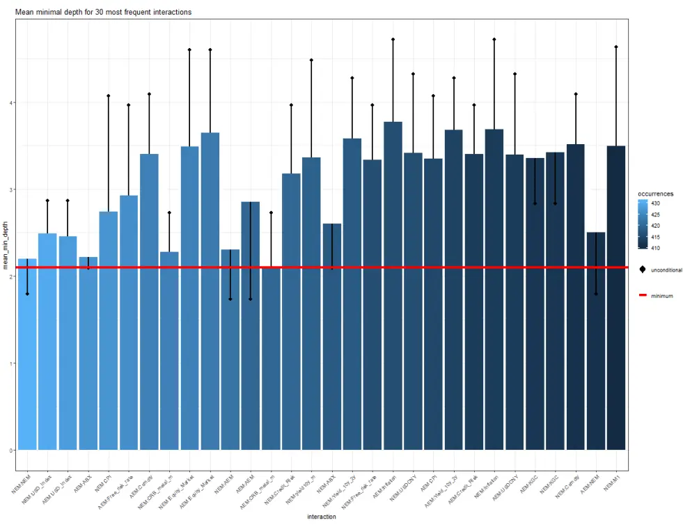
数据来源： Wind 华泰期货研究院

## 三、因子影响力结果

使用上述方法，分别考虑长周期、中周期和短周期条件下各种因子的影响力。

- 长周期因子影响力前 5 名为：中美汇率，美元货币供应量 M2，S&P 500 指数，国债收益率利差，美元指数。

长周期黄金因子的最浅分裂节点分布图
单位：无
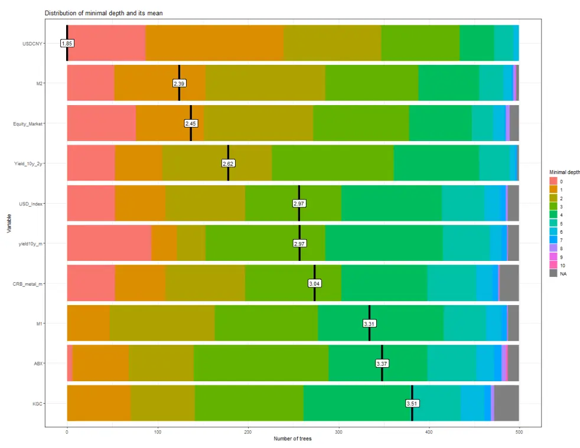
数据来源： Wind 华泰期货研究院
单位：无

长周期MSE 与纯净度提升贡献
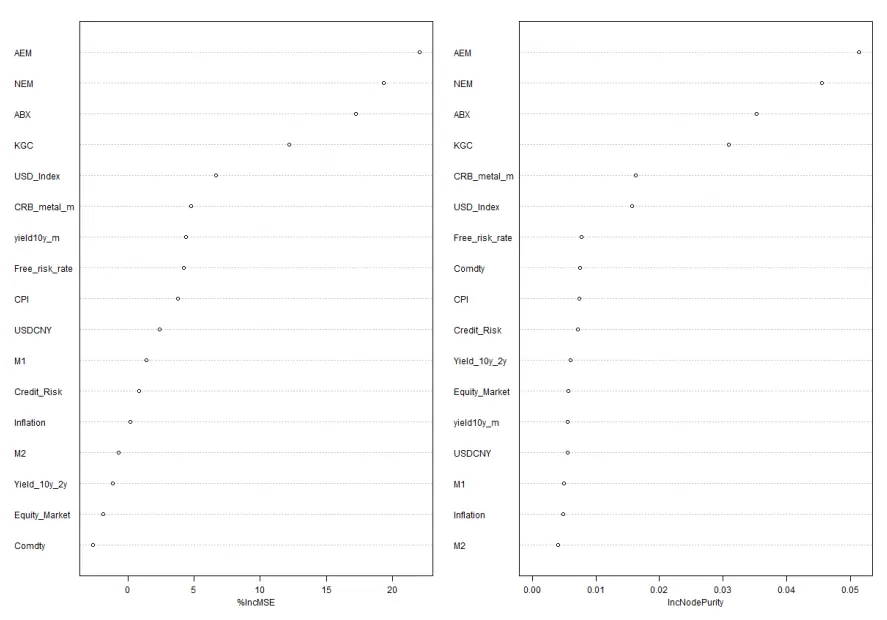
数据来源： Wind 华泰期货研究院

- 中周期影响力最强前 5 名为：实际无风险利率，金矿公司股价，美元指数，10 年期国债收益率，美元货币供应量 M1

中周期黄金因子的最浅分裂节点分布图
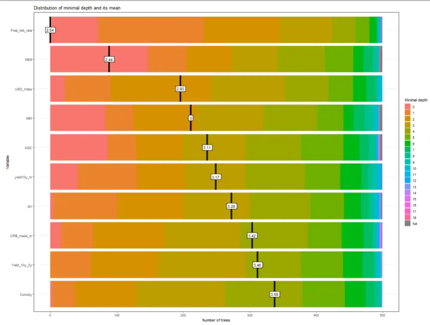
单位：无
数据来源： Wind 华泰期货研究院
单位：无

中周期MSE 与纯净度提升贡献
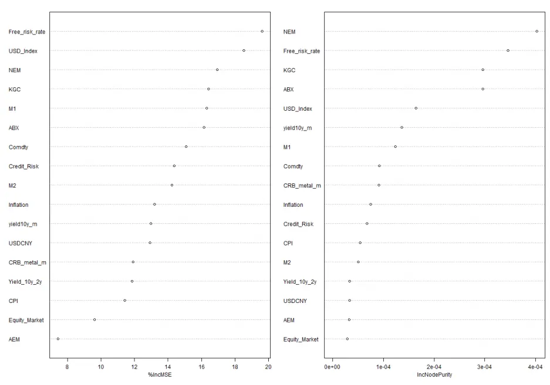
数据来源： Wind 华泰期货研究院

- 短周期影响力最强前5名为：金矿公司股价，CRB金属指数，美元指数，实际无风险利率，信贷风险

短周期黄金因子的最浅分裂节点分布图
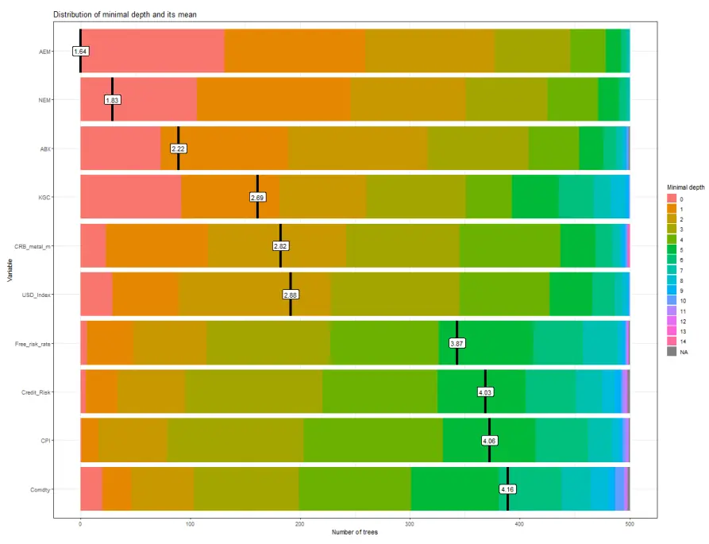
单位：无
数据来源： Wind 华泰期货研究院

短周期MSE 与纯净度提升贡献
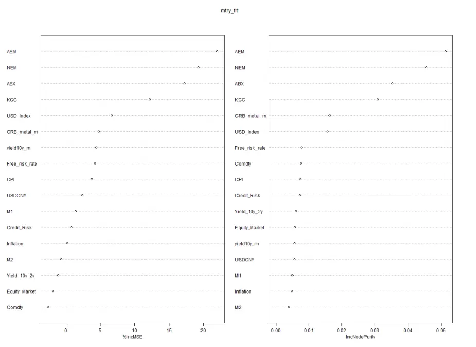
单位：无
数据来源： Wind 华泰期货研究院

## 免责声明

本报告基于本公司认为可靠的、已公开的信息编制，但本公司对该等信息的准确性及完整性不作任何保证。本报告所载的意见、结论及预测仅反映报告发布当日的观点和判断。在不同时期，本公司可能会发出与本报告所载意见、评估及预测不一致的研究报告。本公司不保证本报告所含信息保持在最新状态。本公司对本报告所含信息可在不发出通知的情形下做出修改，投资者应当自行关注相应的更新或修改。

本公司力求报告内容客观、公正，但本报告所载的观点、结论和建议仅供参考，投资者并不能依靠本报告以取代行使独立判断。对投资者依据或者使用本报告所造成的一切后果，本公司及作者均不承担任何法律责任。

本报告版权仅为本公司所有。未经本公司书面许可，任何机构或个人不得以翻版、复制、发表、引用或再次分发他人等任何形式侵犯本公司版权。如征得本公司同意进行引用、刊发的，需在允许的范围内使用，并注明出处为“华泰期货研究院”，且不得对本报告进行任何有悖原意的引用、删节和修改。本公司保留追究相关责任的权力。所有本报告中使用的商标、服务标记及标记均为本公司的商标、服务标记及标记。

华泰期货有限公司版权所有并保留一切权利。

## 公司总部

地址：广东省广州市越秀区东风东路761号丽丰大厦20层

电话：400-6280-888

网址：www.htfc.com