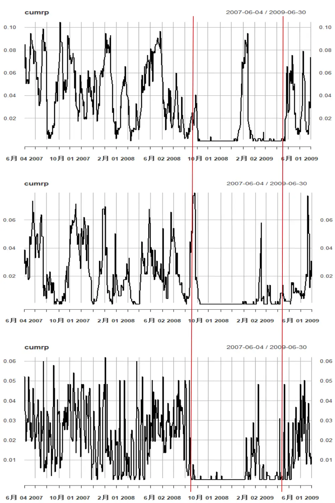
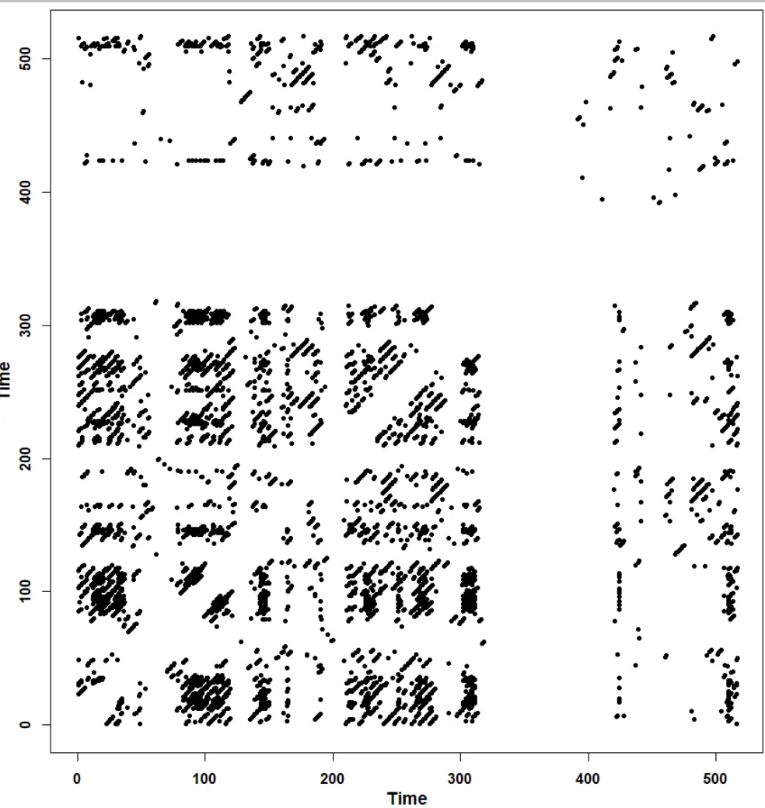
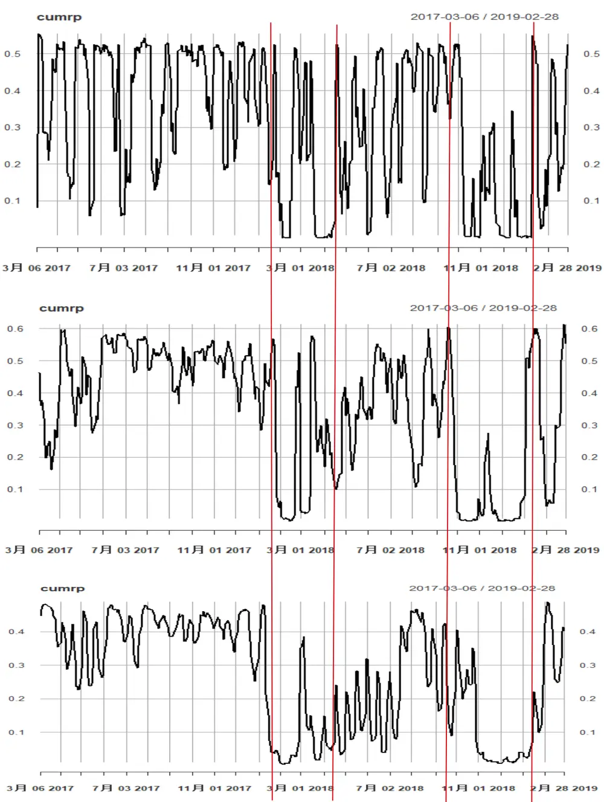
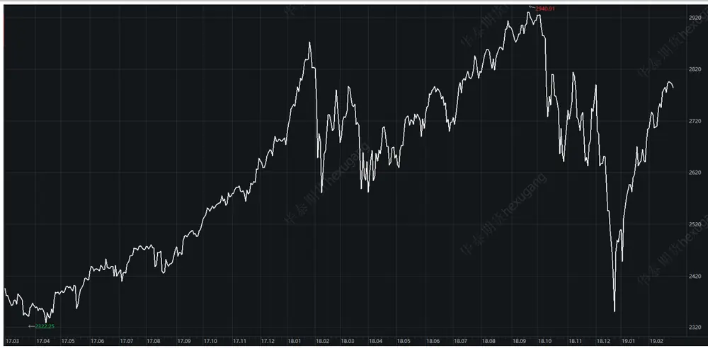
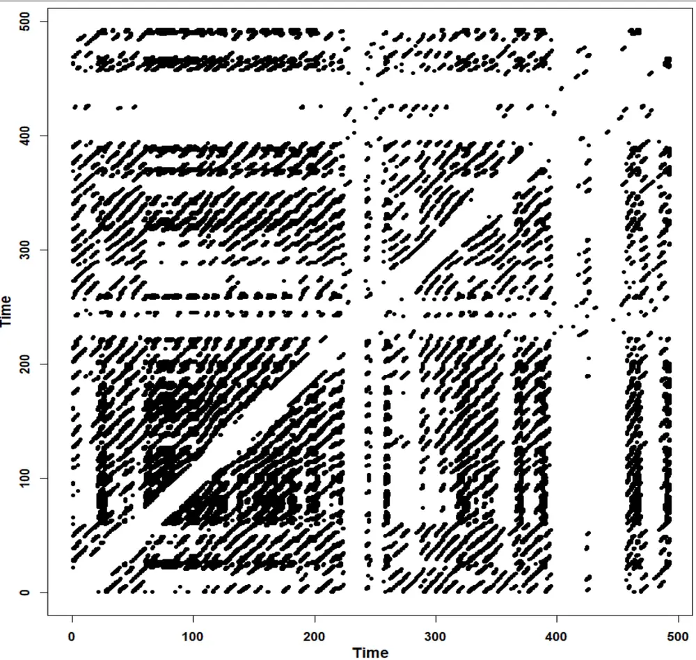
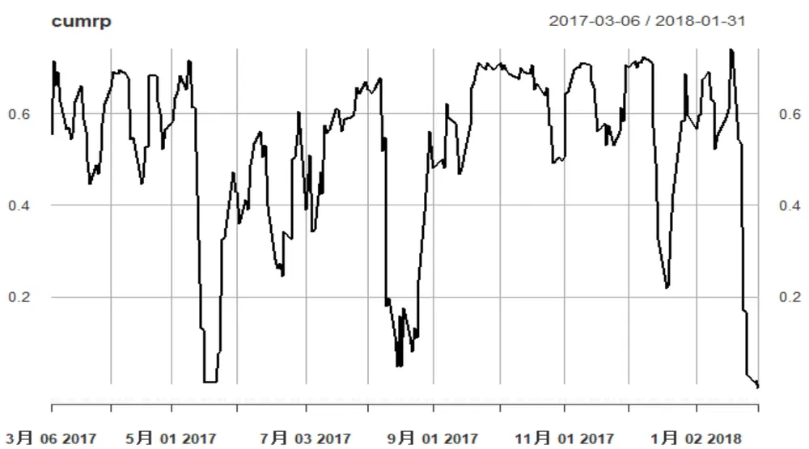
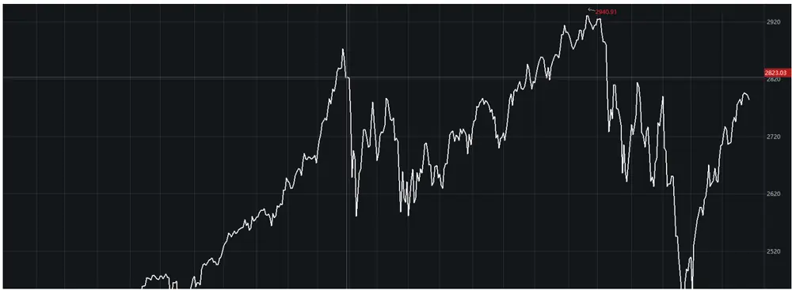

## 金融科技赋能投研系列之七：

投资咨询业务资格：

## 多周期金融数据分析(五)

证监许可【2011】1289 号

## 摘要：

我们在前面的研究报告中提出了一种有效的数据处理方法—多周期分解。在月度数据和日度数据的比较上，该方法表现出了一致性的结果。

本文将在日度数据基础上应用 RQA 方法，考察相变规律。我们配合观察不同周期尺度上的相变的特征。希望在提高了数据分辨率之后，可以获得更加敏感且准确的市场预警信息。该方法将从实证的角度，在若干经典时间段进行测试。

研究院 量化组

研究员

罗剑

- 0755-23887993

- luojian@htfc.com

从业资格号：F3029622

投资咨询号：Z0012563

## 陈辰

- 0755-23887993

- chenchen@htfc.com

从业资格号：F3024056

投资咨询号：Z0014257

何绪纲

- 0755-23887993

- hexugang@htfc.com

从业资格号：F3069194

## 一、背景介绍

我们在对金融时序数据进行多周期分解之后，看到不同在不同周期尺度上，数据的各类统计值都体现了较大的差异。这实际上，对我们后续策略的制作指出了方向。但是，同时我们也看到，尽管月度的数据表现来的很多特征能够与背后的经济学规律相联系，但是，其更短期的特征却因为受限于数据分辨率，而难以观察到。

另一方面，虽然，我们从RQA分析中看到了明确的市场相变规律。可以由于月度数据跨度较长，我们无法看到更微观的特征。事实上，从投资策略的角度出发，我们希望能够获得更敏感的数据特征，从而帮助我们更快速、更准确判断市场行情，进而能够迅速反应并执行适当的投资操作。

在本文中，我们将观察权益类市场经典时间段在不同周期上的表现，以及不同周期上数据对市场反应的敏感程度。我们多周期方法的应用为市场预警，排除噪音后的相变确认提供了有力的工具。

## 二、日度数据分析

与月度数据处理方式类似，我们也将日度数据分解到三个周期尺度上：

1) 短周期：1-2 周；

2) 中周期：1-2 月左右；

3) 长周期：2 个月及以上。

并选取经典时间段展示测试结果。

针对权益类市场，我们选取2007 年 6 月到 2009 年 6 月，共两年时间测试在次贷海啸发生阶段，S&P500指数在不同周期展现的复现规律。

图 1： S&P 500 指数次贷危机复现比例（从上到下依次为：短、中、长周期尺度结果）

数据来源：Bloomberg 华泰期货研究院

图 2：S&P 500 指数次贷危机 RP（中周期）

数据来源：Bloomberg 华泰期货研究院

我们明确看到各个周期尺度上的相变规律，RP 图的空白段也非常显著[1，2]。

由于特征过于强烈，且该极端市场状况历史上出现的次数不多，这一时段反而不能明显体现我们方法的优势。

于是，我们选取另一经典时间段来做进一步分析--2017 年 3 月到 2019 年 2 月，共两年时间，测试 S&P500指数在不同周期上展现的复现规律。

图3： S&P 500 指数复现比例（从上到下依次为：短、中、长周期尺度结果）

数据来源：Bloomberg 华泰期货研究院

图 4： S&P 500 指数走势图

数据来源：Wind 华泰期货研究院

从上图，我们看到，S&P 500 的短周期复现数据对市场反应非常敏感，但是也容易造成误判。长周期的特征最为显著，但是相变时间段的起始、结束点与短、中周期有一定差异。（见上图中两段红线内累计复现值）

值得注意的是，我们这里考察的相变阶段（起始点）其实也是股市灾难性暴跌的阶段（起始点）。美股这次跌损到来之前实际上已经经历了自次贷海啸过后若干年的稳定上涨。同时，因为相变的触发阶段市场变化迅速，月度数据的结果将会较难即时展现相变的发生，或者即使事后确认相变也为时已晚。

我们这里研究相变的方法也从另一个角度表明了，重要的相变点意味着市场关键的结构性变化，这种变化在市场运行的多个不同类周期尺度上，都会表现出相近时间段的相变特征。进一步，相变特征同时出现的类周期尺度越多，表明该相变越显著—次贷海啸是在全部周期尺度上都有显著相变特征且出现时间段非常接近。

因为，这次相变特征非常显著且各个周期表现接近，我们下图只展示中周期特征，其他周期尺度上类似。

图5：S&P 500 指数 RP（中周期）

数据来源：Bloomberg 华泰期货研究院

即使只是肉眼判断，我们也可以清晰看到中周期尺度 RP 图的两段纵轴方向的复现空白段，该相变特征明显[1，2]。

这样的结果促使我们思考，是否该相变特征能够更加及时的发现并得以确认？

我们分时间阶段来观察，配合使用不同周期层次上的相变信号。最敏感的短周期复现特征最早出现（预警），中周期的特征确认相变—两个周期尺度接近同时进入相变。

测试起始点依然设为 2017年 3月 6 日，而结束日期暂设置为如下时间点

1) 2018-01-31

2) 2018-10-10

图 6： S&P 500 指数复现比例（短周期）

预览已结束，完整报告链接和二维码如下：

https://www.yunbaogao.cn/report/index/report?reportId=1_7923