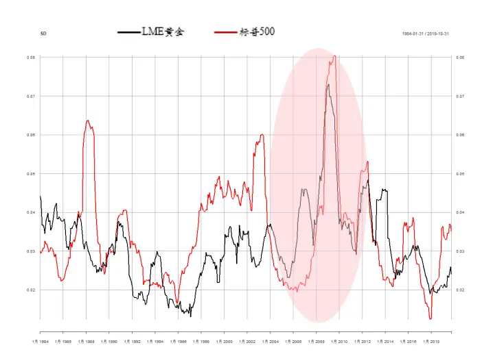
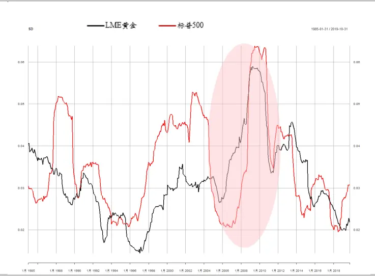
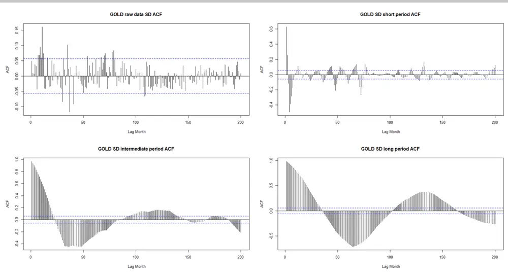
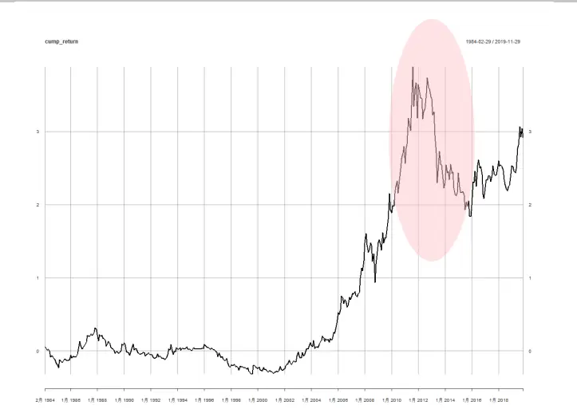
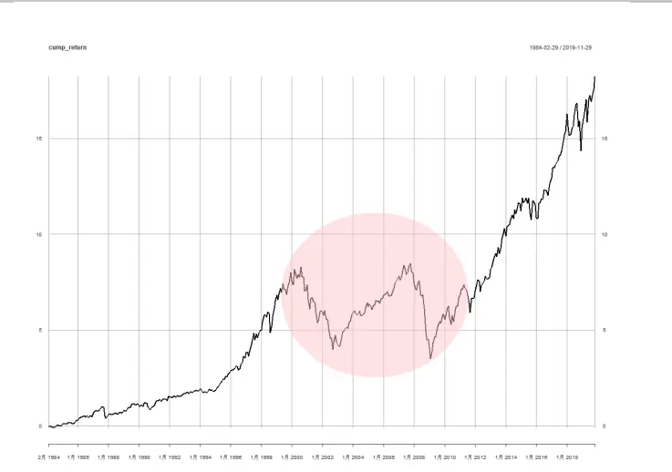
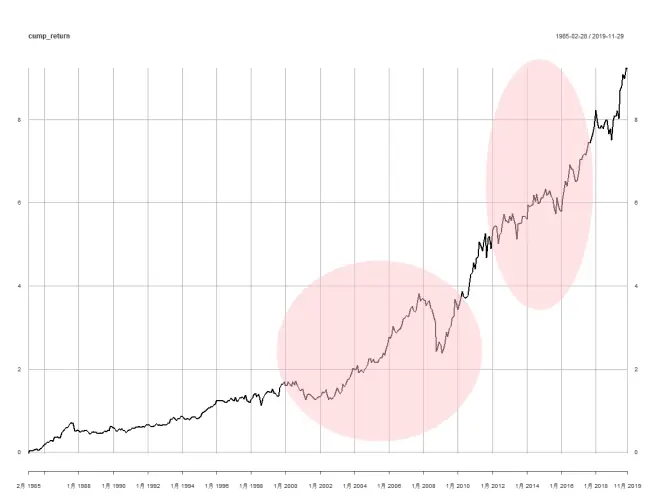

# 金融科技赋能投研系列之八：

## 多周期尺度应用于风险平价策略（一）

## 摘要：

自 2008 年金融危机以来，随着投资者的风险厌恶显著增加，一些基于风险的的投资方法也在当前投资行业中变得愈发普及，由此投资者也越来越重视一些针对风险去配置大类资产的策略，如均值方差模型，资本资产定价模型，风险平价模型等。

另一方面，在我们之前的多周期尺度金融数据分析的报告中，通过对不同类型的数据以及不同频率的数据进行分解，已经发现了多周期尺度维度拆解和递归分析法这一套研究方法具有一定的普适性。这一发现也为我们的策略制定指明了方向。我们采用多周期尺度分解，将各个周期上资产组合的风险指标（波动率）的表现，运用风险平价策略。本文针对 LME 黄金、标普 500 指数，运用风险平价策略进行周期尺度上的资产配置，各周期均显著降低了标的资产的风险。

证监许可【2011】1289 号

投资咨询业务资格：

研究院 量化组

研究员

罗剑

- 0755-23887993

- luojian@htfc.com

从业资格号：F3029622

投资咨询号：Z0012563

## 陈辰

- 0755-23887993

- chenchen@htfc.com

从业资格号：F3024056

投资咨询号：Z0014257

## 何绪纲

- 0755-23887993

- hexugang@htfc.com

从业资格号：F3069194

## 一、背景介绍

从 2008 年次贷危机和2010年至2012 年欧洲主权债务危机达到顶峰以来，整个投资行业都发生了深刻的变化。一方面，基于对投资者行为的调查，由于预期收入，财富和效用函数变化，投资者的风险厌恶显著增加。另一方面，投资者对股市，银行等的信任也跌至前所未有的水平。所以投资者的投资方式也从获取绝对收益渐渐转为了基于风险的投资方式。

基于风险的投资方式实际诞生于上个世纪 90年代，它采用简单的逻辑，只将风险纳入投资组合中需要优化的参数，从而避免了一些对收益率有影响的短期有效事件的影响，其中比较有代表性的有均值方差模型，资本资产定价模型以及风险平价模型。

1952年，马科维兹首次将投资组合的收益率的均值以及方差定义为了衡量投资组合表现的量化指标，构建出了均值-方差最优投资组合。为后续的基于风险的量化策略提供了理论基础和分析框架。随后在 20 世纪 60 年代，在马科维兹均值-方差模型的基础上，Sharpe和 Linter提出了大名鼎鼎的资本资产定价模型。该模型对风险进行了分类，一类是系统性风险，即无法通过优化投资组合来分散的风险；另一类是非系统性风险，即可以通过对投资组合的优化来避免的风险。但是该模型因为前提假设过多，与金融环境不符等原因导致其实用性较差。在 20世纪 90年代，桥水基金推出了基于风险平价模型的全天候投资组合，并在金融危机时取得了出色的表现，从而受到了投资者的广泛关注。该模型通过对经济周期进行划分，并等量持有不同经济周期下表现较好的大类资产的方式，保证了不管出现哪种经济环境，组合内总有一个子组合表现较好，从而降低了整个组合的风险。

但是在整个风险平价的策略中，只是很好的降低了资产组合的风险，却忽略了资产组合在不同周期尺度上的风险特征。在实际策略中，我们希望结合不同周期上的风险特征，制定出更符合自己持仓周期的投资策略。因此，我们通过数据分解，得到短，中，长周期上的风险指标特征，在不同周期尺度上实行风险平价策略，形成一系列的针对不同风险周期的风险平价策略。

## 二、风险指标

投资风险指的是在任何特定投资的预期回报发生损失的概率的可能性，其本质是描述特定投资回报的不确定性。因为我们很难用某个单一指标去描述风险的各个方面，所以我们需要使用不同的风险指标去描述。常见的风险指标有：SD(Standard Deviation), VaR(Value atRisk)，CVaR(Conditional Value at Risk)，最大回撤率。

VaR(Value at Risk)即在险价值，指的是在市场正常波动的情况下，某一金融资产或者投资组合的最大可能损失。更为确切的表述是，在一定的置信度下，某一金融资产或者投资组合在未来的特定时间内的最大可能损失。

CVaR(Conditional Value at Risk)即条件风险价值。该指标是由 RockafeUar 和 Uryasev 等在1997年提出的一种较VaR更优的风险计量技术，其含义为在投资组合的损失超过某个给定VaR值的条件下，该投资组合的平均损失值。CVaR考虑的是大于VaR极端损失的平均值，从统计意义来说，该指标是一个条件期望值，因此较VaR而言，CVaR考虑到了尾端损失的全部信息，更能体现资产组合面临极端风险的情况。

最大回撤率指的是在选定周期内任一历史时间点往回推，产品净值走到最低点时的收益率回撤幅度的最大值。一般来说，最大回撤率越小越好。回撤与风险成正比，回撤越大风险越大。

SD(Standard Deviation)即标准差，是一种用来衡量风险历史最久的方式之一，但是现在实用性依然很强，如在计算夏普率等指标时都会将SD 作为风险指标纳入考虑。SD 是一个表示分散程度的统计概念，反映了投资组合在一段时间内的波动情况。

当资产的 SD 较高，表明资产收益率波动幅度较大，将来行情存在较大的不确定性，因此本文使用 SD作为风险计量指标。下图为 LME黄金、标普500 的不同滚动窗口的SD 变化，右图滚动窗口较大，较左图相对平滑但也少了一些细节，特别是在 2008年金融危机黄金的 SD 走势有明显的差异。

图 1：滚动 SD 时序图 （滚动窗口约 250 天）

数据来源：Bloomberg 华泰期货研究院

图 2：滚动 SD 时序图 （滚动窗口约 500 天）

数据来源：Bloomberg 华泰期货研究院

在我们之前的多周期尺度金融数据分析的报告中，针对黄金的SD 进行多周度尺度分解，在原始数据中，金价月度收益率的 SD 自相关性并不明显，而超过 95%置信区间的异常值也并不多见，通过数据分解后，处理后的数据展现出来不同的周期性特征。同时在 3 个周期尺度上，数据的自相关特征在统计意义上非常显著，远超过无自相关性的 95%置信区间，且衰减速度很慢，自相关性表现出较强的周期波动特征。进一步，本文将 SD多周度尺度分解运用到风险平价策略，考察策略表现。

图 3：LME 黄金现货月度 volatility 自相关性

数据来源：Bloomberg，华泰期货研究院

## 三、策略介绍

风险平价策略的核心思想是通过在资产之间分配资本，使它们对总体的投资组合的风险贡献相等。下面我们会简要介绍下风险平价策略的理论原理。

定义 $x=(x1,x2,\ldots,xn)$ 为组合中 n 个资产的权重，xi 即为资产i的权重， $\sigma_{i}^{2}$ 为资产i的方差， $\sigma_{ij}$ 为资产i及资产j的协方差，Σ 为组合资产的协方差矩阵，因此资产组合的标准差可表示如下：

$$
\sigma(x)={\sqrt{x^{T}\Sigma x}}={\sqrt{\sum_{i}x_{i}^{2}\sigma_{i}^{2}+\sum_{i}\sum_{i\neq j}x_{i}x_{j}\sigma_{ij}}}.
$$

接着定义单个资产权重的微小变化对组合波动所带来的影响，即边际风险贡献(MRC),即：

$$
MRC\;=\;\partial_{x_{i}}\sigma(x)=\frac{x_{i}\sigma_{i}^{2}+\sum_{j\neq i}x_{j}\sigma_{ij}}{\sigma(x)}
$$

定义单个资产对组合波动率的总体影响为总体风险贡献(TRC),即：

$$
TRC=MRC*x_{i}=\frac{x_{i}^{2}\sigma_{i}^{2}+\sum_{j\neq i}x_{i}x_{j}\sigma_{ij}}{\sigma(x)}
$$

从上述推到中，可以看到单个资产对组合可以看到，单个资产对组合的总体风险贡献之和即为组合的总体风险。这种条件被称为欧拉分配定理。风险平价模型，即让每个资产对组合的风险贡献相等。换言之，若资产i的风险贡献偏高，则降低资产i的权重，同时增加其他资产的权重，直至各资产的风险贡献相同。

但是在整个风险平价的策略中，我们只是很好的降低了资产组合的风险，却忽略了资产组合在不同周期尺度上的风险特征。于是我们采用多周期尺度分解，将各个周期上资产组合的风险指标（波动率）的表现，运用风险平价策略。本文针对 LME 黄金、标普 500 指数，运用风险平价策略进行周期尺度上的资产配置，各周期均显著降低了标的资产的风险。

## 四、策略表现

我们以接近 250 个交易日做为窗口进行轮滚，我们可以看到和原始黄金累计收益率相比，各个周期上的策略的收益率的表现明显优于黄金，虽然策略收益率不如标普500，但风险得到了有效的降低，SD、最大回撤率明显低于黄金和标普 500，基于多周期尺度分解的风险平价策略可以获得稳定可观的正收益。周期间差别较小，我们将继续考察数据内部特征，并总结其在策略应用中的经验。

表1: 黄金以及各策略的统计参数（滚动窗口约 250 天）

|  | 月度收益率均值 | SD | Skewness | Kurtosis | MaxDrawdown |
| --- | --- | --- | --- | --- | --- |
| 黄金 | 0.41% | 15.14% | 0.30 | 1.00 | 48.09% |
| 标普500 | 0.78% | 14.69% | -0.78 | 2.44 | 52.56% |
| 短周期 | 0.59% | 10.25% | -0.38 | 3.56 | 25.98% |
| 中周期 | 0.56% | 10.12% | -0.33 | 3.24 | 26.43% |
| 长周期 | 0.59% | 10.15% | -0.46 | 3.40 | 28.27% |

资料来源：Bloomberg 华泰期货研究院

然后我们改变轮滚窗口的大小为 500 天左右，重复上述方法，比较各类指标表现情况。滚动窗口增大，在各个尺度上收益率均有所提高，最大回撤率也相应增加，偏度也更加趋向左侧。虽然增加窗口大小使得最大回撤有小幅增加。对比两次结果，我们发现该策略在收益率以及各类统计指标上没有发现太大的变化。换句话说，窗口轮滚的改变对于策略的影响不大，该策略有较好的鲁棒性。但我们依然建议采用 500 天左右的窗口，大类资产配置以长期稳定收益为目标，策略对短期波动不宜特别敏感。

表2: 黄金以及各策略的统计参数（窗口等于 500 天左右）

|  | 月度收益率均值 | SD | Skewness | Kurtosis | MaxDrawdown |
| --- | --- | --- | --- | --- | --- |
| 短周期-500 | 0.60% | 10.18% | -0.50 | 3.67 | 26.19% |
| 短周期-250 | 0.59% | 10.25% | -0.38 | 3.56 | 25.98% |
| 中周期-500 | 0.58% | 10.15% | -0.42 | 3.31 | 26.42% |
| 中周期-250 | 0.56% | 10.12% | -0.33 | 3.24 | 26.43% |
| 长周期-500 | 0.60% | 10.15% | -0.53 | 3.39 | 29.59% |
| 长周期-250 | 0.59% | 10.15% | -0.46 | 3.40 | 28.27% |

资料来源：Bloomberg 华泰期货研究院

接下来，考察累计收益率表现情况，可以看到基于多周期尺度分解的风险平价策略有效的应对了 2012 年～2014 年黄金的大幅下跌，以及 2000 年～2002 年股票市场的熊市行情。同时，2008年金融危机带来的影响也得到了明显减弱。

图 4：LME 黄金累计收益率

数据来源：Bloomberg 华泰期货研究院

图 5：标普 500 累计收益率

数据来源：Bloomberg 华泰期货研究院

图 6：长周期风险平价策略累计收益率（窗口约 500 天）

数据来源：Bloomberg 华泰期货研究院

## 五、总结

本文将多周期尺度分解的方法应用到了风险指标数据中来，并结合风险平价模型，得到了一系列针对不同风险周期的风险平价策略。我们的目的是希望通过这样一种新颖的数据分解方式，来观测到不同风险周期上风险特征的不同，并依据这些风险特征制定出不同的策略。 综合来看，我们将多周期尺度分解与风险平价策略相结合这一策略相比于黄金以及标普500均具有更好的收益、风险表现。

## ⚫ 免责声明

本报告基于本公司认为可靠的、已公开的信息编制，但本公司对该等信息的准确性及完整性不作任何保证。本报告所载的意见、结论及预测仅反映报告发布当日的观点和判断。在不同时期，本公司可能会发出与本报告所载意见、评估及预测不一致的研究报告。本公司不保证本报告所含信息保持在最新状态。本公司对本报告所含信息可在不发出通知的情形下做出修改，投资者应当自行关注相应的更新或修改。

本公司力求报告内容客观、公正，但本报告所载的观点、结论和建议仅供参考，投资者并不能依靠本报告以取代行使独立判断。对投资者依据或者使用本报告所造成的一切后果，本公司及作者均不承担任何法律责任。

本报告版权仅为本公司所有。未经本公司书面许可，任何机构或个人不得以翻版、复制、发表、引用或再次分发他人等任何形式侵犯本公司版权。如征得本公司同意进行引用、刊发的，需在允许的范围内使用，并注明出处为“华泰期货研究院”，且不得对本报告进行任何有悖原意的引用、删节和修改。本公司保留追究相关责任的权力。所有本报告中使用的商标、服务标记及标记均为本公司的商标、服务标记及标记。

华泰期货有限公司版权所有并保留一切权利。

## ⚫ 公司总部

地址：广东省广州市越秀区东风东路761号丽丰大厦20层

电话：400-6280-888

网址：www.htfc.com