# 金融科技赋能投研系列之十：

投资咨询业务资格：

证监许可【2011】1289 号

## “金”安理得—配置的黄金岁月

研究院 量化组

## 摘要：

我们在前面的一系列研究报告中提出了一种有效的数据处理方法—多周期分解。随后在不同周期尺度上考虑了金融数据统计性质的差异性，其中包括自相关性，时间序列见的相关性，类周期性，相变等重要统计特征。其中，若干重要特征的出现时点还做了历史重要事件的对应比较，确认了我们方法的有效性。进一步，我们也对这些重要性质的配置应用做了初步的探讨。

在这一篇报告中，我们把目光转向更加实战的角度，通过大类资产配置来构建投资策略。本文将重点考虑股票，债券，商品这三类重要资产类型。我们发现，在中国市场逐渐对外开放，投资结构逐渐成熟的过程中，大类资产的风险分散化配置，特别是加入了黄金的投资组合在收益率和风险控制方面都具有明显的优势。结合对未来中国金融市场发展的展望，我们认为黄金配置的关键时间段已经来临。

研究员

罗剑

- 0755-23887993

- luojian@htfc.com

从业资格号：F3029622

投资咨询号：Z0012563

## 陈辰

- 0755-23887993

- chenchen@htfc.com

从业资格号：F3024056

投资咨询号：Z0014257

## 何绪纲

- 0755-23887993

- hexugang@htfc.com

从业资格号：F3069194

## 一、背景介绍

在我们前期一系列的研究报告中，我们逐渐打造了一套科学的数据处理模式。结合了跨学科的多样化研究方法，我们确立了对金融数据做多周期尺度分解，并在不同周期尺度上监控市场变化的观测方法。在对历史数据的研究框架中，我们着重考虑两个方面的影响：首先是，不同类周期尺度上，金融市场的变化特征：标的物在不同类周期尺度上的复现规律，波动性变化，自相关性等。其次，在不同周期尺度上，考虑不同标的物（及其影响因素）之间的相关性，风险指标的相对变化，或则因子的影响力变化等。

上述的研究框架为我们严格、灵活研究金融市场提供了必要的数据应用模式。在大数据发展的宏观背景下，我们的数据来源及采集频率越来越多样化和复杂化。不同类型数据对标的物影响的差异集中体现在不同的类周期尺度上。比如PMI数据，每月发布一次。除非是令人十分意外的数值，一般来说其对市场直接冲击时间较短；但是，另一方面，从宏观研究的逻辑来说，PMI是重要的产业先行指标，其影响跨度也以月度计。所以，我们对数据的分解本质上是源于对不同频率采样数据的匹配度出发来建立的，这是我们研究数据体现严格性的一面。另一方面，当我们走向投研判断时，需要在不同的交易频率上做出不同的投资决策。例如，我们需要月度调整资产配置权重（如下文将要遇到的情况），但是，行情数据采集频率是日度。如果不对数据做多个周期的分解，并且着重研究标的物风险指标的月度变化规律，就极有可能被日度数据的（较高程度）波动性噪音干扰，对后续风险平价模型的输出结果造成很大影响。这是我们研究过程中需要灵活提取数据信息的方面。

需要强调，我们具体的研究方法融合了多个科研领域（物理学，信号学，生态学等）的数据处理方法。若干非线性方法是传统金工方法无法直接获取的。比如，研究金融时序相变时，使用递归图寻找数据在不同周期尺度上的复现规律,就无法通过线性随机模型或则单一周期频率拟合得到[1]。

在完善了上述数据分析框架之后，我们把方法论推广到实战领域。在之前的报告中我们已经开始尝试将这一套方法投放到投资策略研究领域，并对海外市场做了初步测试[2]。在积累了一定数据基础之后，现在集中对国内市场做策略研发。本文考虑大类资产配置，将主要考察股票，债券和商品三类资产：沪深 300指数，5年期国债（期货主连），黄金期货（主连）。我们将发现在传统 60/40股债基础上，配置黄金取得了优异的投资结果。分析了背后的投资逻辑之后，我们判断后市这依然是较好的投资模式。

下文，我们将首先通过多周期尺度数据分解的模式，在月度调仓的频率下，标的物之间的相关性状况，从而引出我们大类资产配置逻辑。然后，我们应用风险平价模型构造虚拟投资组合，观察策略不同时段的表现，并给出损益来源判断。最后，探讨大类资产未来发展的可能方向。同时，我们判断黄金后市大有可为。

## 二、方法论

首先，我们所有数据来自于交易型数据，均使用日度采集频率。

但是由于随后大类资产配置策略将在月度调仓基础上构造，以此对应，我们也将日度数据分解到不同的周期尺度上，并且重点研究与我们调仓周期最吻合的数据统计特征，以此引出投资逻辑。

然后，我们利用风险平价模型来构建投资权重模型。我们将看到经典60/40股债模型在国内市场也能发挥很好的投资效能（至少最近几年以来）--其对应周期上的相关性特征也支持该判断。

接着，我们在这个基础上引入黄金的配置。并根据黄金与股债的风险程度进行风险平价配置。我们将看到，黄金在配置中起到了关键作用。

## 三、数据分解&相关性分析

## 1. 数据分解

在大类资产配置的逻辑中，收益的主要来源来自于不同市场行情条件下，不同风险资产的相对风险溢价水平；简单来说，就是挑选当前估值水平较低的资产，赋予较高权重以期获得较好回报。同时，由于在大类资产配置中，因为不同类型资产在一定行情下有显著的差异化表现，从而为平滑化投资风险提供了对冲机制。

所以，我们在第一步将考察各类型资产的相关性关系。为此，我们列出多个标的物进行测试：

1) 股票：主要指数—上证 50，沪深 300，中证500和龙头黄金股

2) 债券：5 年期国债（投资工具使用 5 年期国债期货）

3) 商品：黄金，白银，铜（投资工具为对应国内场内期货）

其中黄金龙头股由山东黄金（600547）、中金黄金（600489）和紫金矿业（601899）三只黄金股票等权组成。

## 2. 相关性分析

图 1： 相关性分析（全部数据，2013-09 到 2020-01）
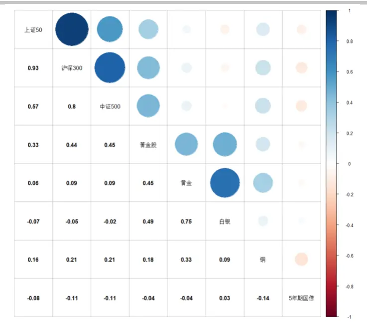
数据来源：Wind 华泰期货研究院

图 2： 相关性分析（近两年，2018-01 到 2020-01）
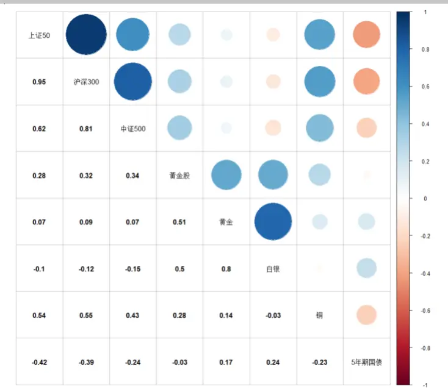
数据来源：Wind 华泰期货研究院

首先，在月度周期的尺度上，权益类资产与债券类资产之间的负相关性近两年来显著升高。这也是国内金融市场持续深化发展，股债市场之间加强联动必然带来的结果。而目前的时间点则是国内市场进一步对外开放，投资者结构趋向于机构化，外资参与性增强。后市的发展大概率会进一步靠近成熟金融市场的发展模式，出现更多基于经济周期规律研判，通过股债走势驱反来进行风险分散配置的大类资产配置模式。

在商品中，整体而言，金银铜与股债的相关性都较低。其中，铜由于其较强的工业属性，以及在多个重要产业链条中的重要作用，所以，铜与股指的相关性要高于贵金属；而且近两年还有增强的趋势。从投资角度来说，这也佐证了铜并不具备贵金属的关键金融属性--抗通胀、规避金融风险。铜本身的商品特征，如库存周期和供需变化对价格影响更大。

进一步，虽然黄金和白银与债券的相关性都很低，但是黄金与债券的相关性更低。即使，在近两年贵金属与债券相关性都略有升高的情况下，黄金依然与债权保持着较低的相关性。相反，近两年铜与债券的负相关性增强，表现更靠近股票。

黄金股与黄金保持较高相关性在预料之中，但是其与股票的相关性也不低。从分散风险的角度来说，投资黄金股并不能够完全代替投资黄金。但是不排除，在择时投资的逻辑里面，在金价的主升段，通过投资黄金股以联动的方式博取更高收益。

股票方面，三大股指互相之间相关性很接近，且近两年来变化不大。在存量时代来临阶段，我们预期股票内在分化会进一步深入，但其风险敞口点可能会增加。而在持续性的国际政治事件（中美贸易摩擦），或突发社会事件（新冠状病毒肺炎疫情）影响下，则会略显脆弱，易出现剧烈波动。这些都是理性投资人不愿意看到的，同时也是我们更加强调寻找大类资产投资机会，风险分散化配置的重要原因。

通过上述分析，我们把股票（沪深 300代表），债券和黄金作为主要的大类资产研究对象。其中，股债组合是投资人较为熟悉的投资方式，也是成熟市场大型基金管理的基本投资工具。而近两年来，股债之间出现的较高负相关性，也是这一类投资模式发展的重要表现。本文暂不过分深入优化该投资模式（见下文详解），而是直接使用经典的 60/40股债组合作为参考对象。然后，我们将股债组合当作一个标的物，通过风险平价模型，与黄金构成投资组合。我们将选取波动率和CVaR作为风险测量指标。

## 四、风险平价配置模型

## 1. 风险指标

我们已经系统性阐述过风险平价模型，及各类风险指标，此处不再赘述[2]。

首先，我们以 500个交易日作为风险指标计算的区间。注意，风险指标数据不是标的物的原始数据，而是经过多周期分解之后，使用最接近与月度变化尺度的数据来进行计算。而这个周期尺度符合我们做月度调仓的策略需求。

风险指标计算结果如下图：

图 3： 滚动 CVaR 时序图（滚动窗口约 500 天）
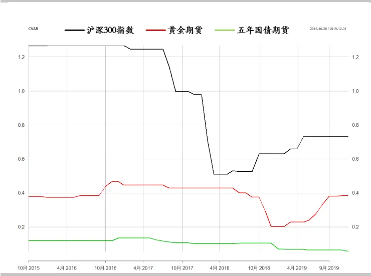
数据来源：Wind 华泰期货研究院

图 4： 滚动波动率时序图（滚动窗口约 500 天）
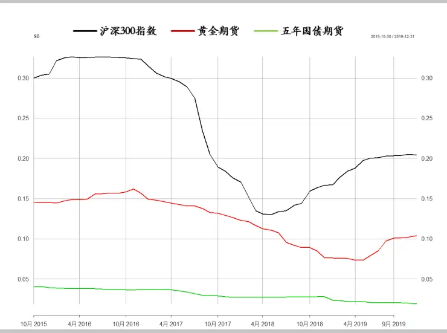
数据来源：Wind 华泰期货研究院

使用波动率与CVaR作为风险指标，得到三大资产的风险排序为沪深 300 > 黄金期货 >五年期国债期货，这符合投资者对市场的认知。相比 CVAR，波动率的曲线更加光滑，呈现长期趋势性变化，2015年金融海啸之后，股票市场到达了低谷，后逐渐反弹，此间风险一直处于高位，2017年市场回归理性，市场风险逐步降低，由于中美贸易战的原因，

2018年 4月股票市场波动率逐步上涨，目前波动率逐步趋于平缓，猜测与中美贸易协商顺利开展有较大关联。黄金的风险水平在 2019年后逐步回调，近期趋于平稳。我们将使用波动率作为风险配置的依据。

## 2. 股债 60/40 经典组合

下图为股票、债券的 60/40组合收益表现：

图 5： 股债 60/40 组合累计收益率（棕色线为组合；黑色线为沪深 300；蓝色线为 5 年期国债期货）
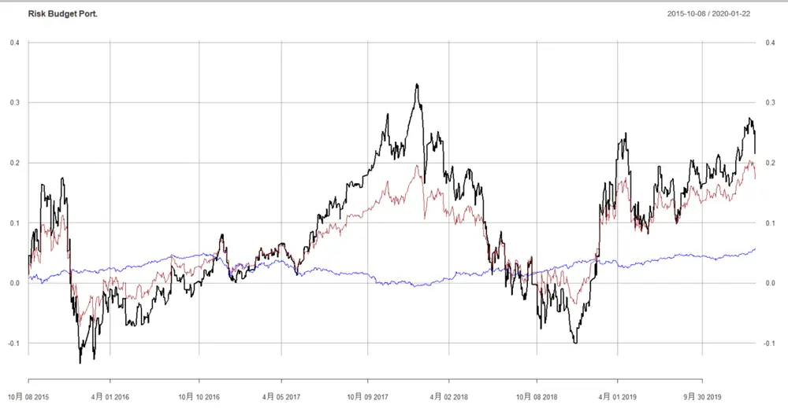
数据来源：Wind 华泰期货研究院

经典 60/40 组合其波动性特征由股票的波动性主导，在国内市场也不例外。但是，组合的抗风险能力相比股票有所提高，其中最大跌幅为19.3%，对比沪深 300的32.5%和 5年期国债主连期货的 5.4%；日度收益率的 1%CVaR为 1.8%，也远小于沪深 300的3.1%，高于 5年期国债主连期货的0.3%。

同时，60/40组合也抓到了股票冲高的几个主升段。就我们测试时间段来看，最终收益率其实和股指本身相去不远。所以，经典股债组合针对国内市场也在一定程度上实现了其获取收益同时压缩风险的主要功能。我们将暂时不对该经典模型做优化，而是把它作为风险分散化投资的参照对象。后续，将把该组合看作单一投资标的物，再引入商品投资工具。

## 3. 股债 60/40 组合+黄金风险平价配置

考虑到投资的可行性，我们使用上海黄金期货主连作为投资标的物，并假设等值投资。风险指标为波动率。

图6： 股债60/40组合+黄金累计收益率（黑色线为沪深300指数；蓝色线为5年期国债期货；红色线为黄金期货；绿色线为配置组合）
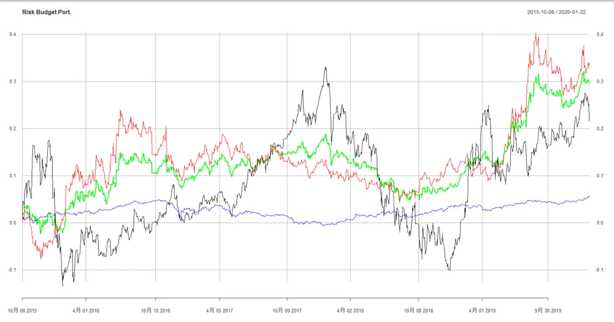
数据来源：Wind 华泰期货研究院

与经典 60/40股债组合对比：

图7： 股债60/40组合+黄金累计收益率（棕色线为 60/40股债组合；绿色线为配置组合）
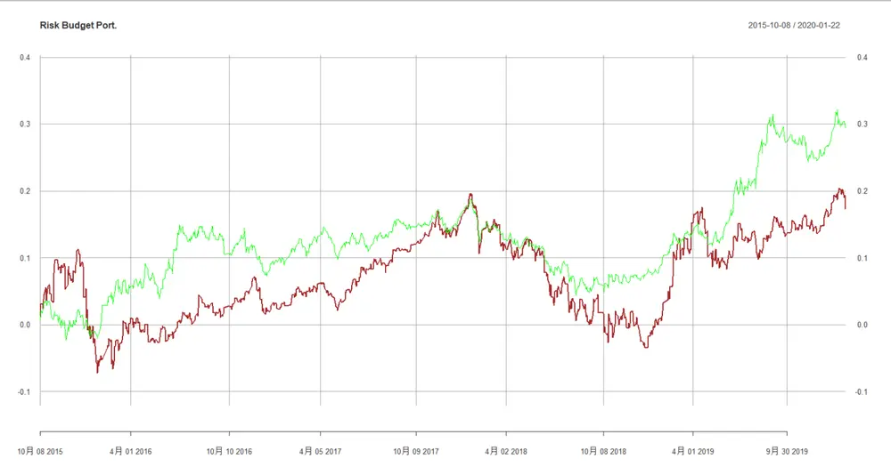
数据来源：Wind 华泰期货研究院

风险配置组合的最大跌幅为 12.2%, 小于 60/40股债组合，并且也小于黄金期货本身的15.6%。其日度收益率 1% CVaR 表现为 0.9%，也小于 60/40 股债组合和黄金的 1.4%。而在我们测试阶段，配置组合的收益率高于除了黄金以外的其他资产，包括 60/40 股债组合。

考略风险调整以后的收益，我们观察 Sharpe比率。黄金参与的风险平价配置组合为0.80，远高于 60/40组合的0.38，甚至高于黄金的0.64，沪深300的 0.34以及国债期货的0.55。

当然，作为投资人可能更为关心最近的行情下，该大类资产配置策略是否依然有效。作为补充，我们考察最近2年策略表现。

图8： 近两年股债60/40组合+黄金累计收益率（黑色线为沪深300指数；蓝色线为5年期国债期货；红色线为黄金期货；绿色线为配置组合）
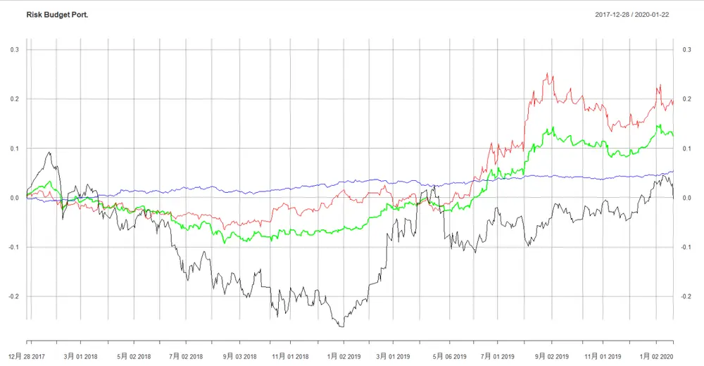
数据来源：Wind 华泰期货研究院

股市在经历一轮由跌到涨的轮回之后，未能获得显著正收益。而我们的大类资产组合策略表现较为平稳，在熊市的抗跌性较好，且在黄金的爬坡阶段成功录得了正收益。

## 4. 股债 60/40 组合+其他商品风险平价配置

白银和铜并不能代替黄金在大类资产配置中的作用。然而，不同类型商品进入配置存在进一步做择时优化的空间。我们看 60/40股债+白银的表现：

图9： 股债60/40组合+白银累计收益率（黑色线为沪深 300指数；蓝色线为5年期国债期货；红色线为白银期货；绿色线为配置组合）
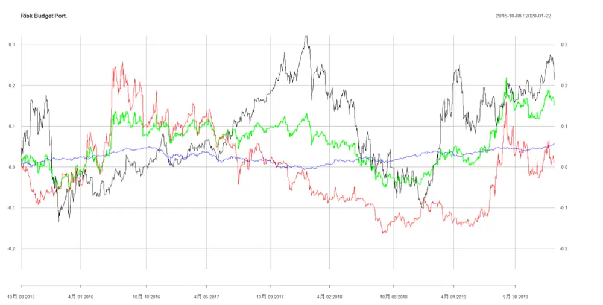
数据来源：Wind 华泰期货研究院

尽管，配置组合优于白银的表现，但距离我们的投资目标较远。

图10： 股债60/40组合+铜累计收益率（黑色线为沪深 300指数；蓝色线为 5年期国债期货；红色线为铜期货；绿色线为配置组合）
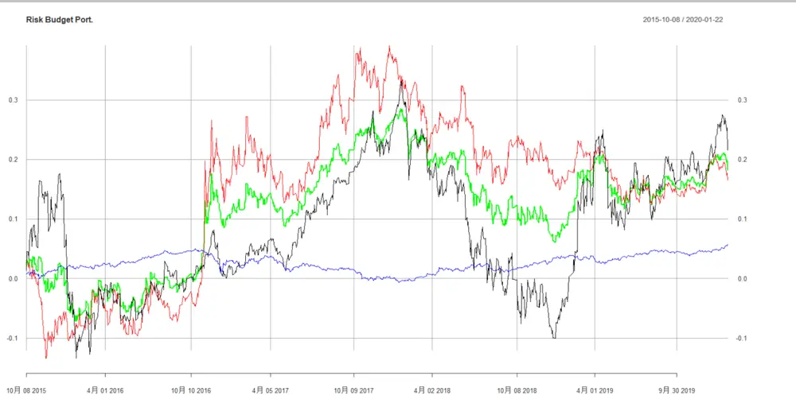
数据来源：Wind 华泰期货研究院

得益于近几年中国工业的迅速发展，铜的需求量提升很快，在一定时间段，配置组合也取得了较好的收益率。但是，由于单一商品的剧烈波动性，配置组合也未能持续其动能。这提示我们后续在大类资产配置组合中，研发更为有效的择时配置策略。

## 5. 股债 60/40 组合+黄金+铜风险平价配置

这个组合的配置逻辑不仅来源于上面的测试，更是基于对黄金与铜不同属性的判断。铜是主要的工业生产原料，其价格波动自然受到经济环境及库存周期的重要影响，所以有其自身的波动周期规律，并表现出与贵金属和股债的较低相关性。但是，正因为其周期特征与其他大类资产并不完全同步，加入配置组合将成为重要的风险对冲力量。在上面的例子中，我们也看到，在特定时段，铜价的爬升在短时间段可以超越股票。所以，我们尝试将股债 60/40 组合，黄金和铜看成独立的资产类型进行风险平价配置。尽管，最终组合的Sharpe比率为0.77，但也仅次于股债+黄金。且基于上述讨论，我们认为择时配置的逻辑将有可能发挥不同商品价格周期的投资优势。

图11： 股债60/40组合+黄金+铜累计收益率（黑色线为沪深 300指数；蓝色线为5年期国债期货；红色线为黄金期货；绿色线为配置组合）
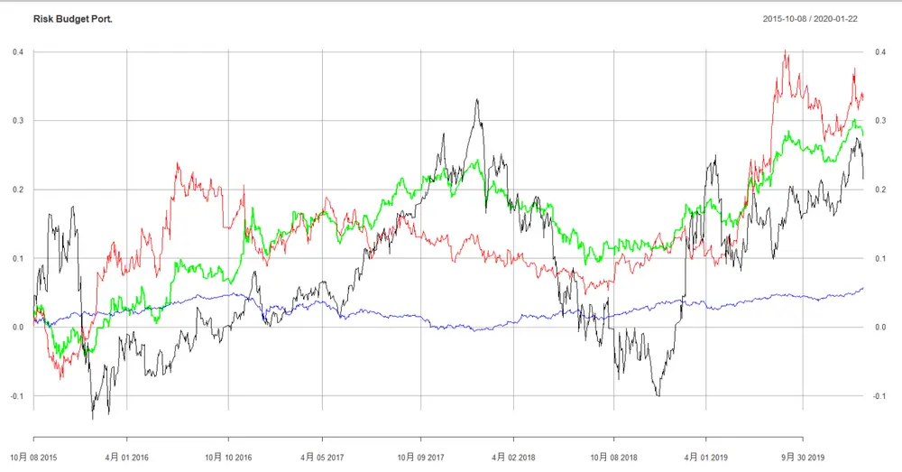
数据来源：Wind 华泰期货研究院

## 五、总结

本文综合了我们的数据分析体系和量化模型方法，并将其应用到大类资产配置模型中来。我们看到，经典的股债 60/40组合似乎越来越适合国内的投资环境，我们认为这是国内金融市场逐渐成熟，且投资人更重视风险分散化投资而带来的正向结果。随着中国金融市场对国际投资机构的持续开放，我们认为这样的趋势还将持续。另一方面，随着近年来美国越发单方面制造国际贸易摩擦，全球经济陷入了较为艰难的时段，我们认为，单一权益类投资，甚至经典 60/40股债组合都不能满足投资者对于风险管控的要求。而突发的社会事件，如新型冠状病毒肺炎，更是难以预测，令投资人蒙受较大损失。这时候商品作为一个与股债相关性都较低的投资种类，则越来越成为重要的投资工具，特别是贵金属优异的投资属性引起了投资者的广泛关注。在可预期的未来，如果全球经济因为各种原因不能迅速复苏，而各大央行依然保持宽松货币环境，那么黄金作为重要的避险和抗通胀投资标的物将依然保持较好的上升势头。而黄金作为重要的资产类型，且与股债均保持较低相关性，使其将在大类资产配置中持续占有一席之地。

## 六、参考文献

[1] 华泰期货金融时序专题 20200108：金融科技赋能投研系列之七：多尺度数据分析(五)

[2] 华泰期货金融时序专题 20200108：金融科技赋能投研系列之八：多周期尺度应用于风险平价策略（一）

## ⚫ 免责声明

本报告基于本公司认为可靠的、已公开的信息编制，但本公司对该等信息的准确性及完整性不作任何保证。本报告所载的意见、结论及预测仅反映报告发布当日的观点和判断。在不同时期，本公司可能会发出与本报告所载意见、评估及预测不一致的研究报告。本公司不保证本报告所含信息保持在最新状态。本公司对本报告所含信息可在不发出通知的情形下做出修改，投资者应当自行关注相应的更新或修改。

本公司力求报告内容客观、公正，但本报告所载的观点、结论和建议仅供参考，投资者并不能依靠本报告以取代行使独立判断。对投资者依据或者使用本报告所造成的一切后果，本公司及作者均不承担任何法律责任。

本报告版权仅为本公司所有。未经本公司书面许可，任何机构或个人不得以翻版、复制、发表、引用或再次分发他人等任何形式侵犯本公司版权。如征得本公司同意进行引用、刊发的，需在允许的范围内使用，并注明出处为“华泰期货研究院”，且不得对本报告进行任何有悖原意的引用、删节和修改。本公司保留追究相关责任的权力。所有本报告中使用的商标、服务标记及标记均为本公司的商标、服务标记及标记。

华泰期货有限公司版权所有并保留一切权利。

## ⚫ 公司总部

地址：广东省广州市越秀区东风东路761号丽丰大厦20层

电话：400-6280-888

网址：www.htfc.com