# 金融科技赋能投研系列之十：

投资咨询业务资格：

证监许可【2011】1289 号

## “金”安理得（二）—配置的黄金法则

## 摘要：

近期金融市场整体企稳，投资者对于风险偏好有所加强。但是，中长期来看，市场不确定因素却有增无减。如何一定程度上规避市场风险点，又能够收获较好的收益成为广大投资人比较关心的问题。

而从历史角度来看，我们认为随着国内投资理念的不断成熟，以及不同机构逐渐放开投资范围，机构投资在金融市场中的占比还会进一步提高。而机构面对的是较大规模的管理资金，其投资过程中越发合理的资产覆盖,以及更加规范的持仓、调仓操作都会更加优化其投资能力。同时，这一发展过程必然会反过来促进国内金融市场的进一步成熟—“逆势”短线博弈可能将越来越难以胜过“顺势而为”的中长期资产配置。

在上一期的配置报告中，我们提出了在股债经典 60/40 组合之上，加配商品能起到优化配置的结果[1]。在这一篇报告中，我们将做横向比较，挖掘不同的传统投资工具再叠加黄金之后的配置效果。考虑到不同的板块和风格特征，我们将选取最具有代表性的上证 50，沪深300和中证500指数与债券组成经典 60/40组合。然后，考虑加配黄金之后取得的不同投资效果。而同时，结合我们在 2019 年年报中我们对黄金走势的研究及近期行情的判断。我们认为，中长期来看，黄金将在投资领域起到越发重要的作用，而目前则是黄金配置过程中逢低吸纳的好时机。

研究院 量化组

研究员

罗剑

- 0755-23887993

- luojian@htfc.com

从业资格号：F3029622

投资咨询号：Z0012563

## 陈辰

- 0755-23887993

- chenchen@htfc.com

从业资格号：F3024056

投资咨询号：Z0014257

## 何绪纲

- 0755-23887993

- hexugang@htfc.com

从业资格号：F3069194

## 一、背景介绍

今年（2020）以来全球金融市场的持续动荡，不断触及到投资人紧张的神经。而疫情的全球扩散，以及其对全球经济较难预估的影响，让很多投资人都“迷失”在巨大的波动性漩涡之中。目前随着美国各州逐渐解除社交疏远禁令，全球经济开始出现复苏迹象。但是，我们认为目前经济全面恢复的不确定性依然很多，特别是美国国内的社会事件对正常经济运作的持续性冲击;以及为了转嫁国内政治、经济问题，而与中国实施持续性的贸易对抗政策。这些风险点经过全球产业链、国际贸易等方式在全球循环传导，最终会对全球经济复苏造成严重阻碍。

实际上，不仅是一般性的个人投资者，甚至连专业的投资机构也很难在目前疫情危机尚未完全解除，全球经济恢复极不确定，中美贸易关系非正常化的条件下，对未来经济的成长给出较为精准的估算，从而对金融类风险资产给出合理定价。我们观察到，大多数经济学家对未来近几年经济发展偏悲观，而大型机构的预测则难有一致性观点。

一些基本面的判断却已经确定，且（在各个方面）持续发酵。

- 我国经济受到了强烈冲击，随着疫情全球蔓延，目前来看，从现在到中期都会对我国进出口形成很大压力，其风险在产业链的蔓延会不断显现，我国经济成长面临巨大挑战，目前预测较悲观：

图 1： 彭博对中国经济预测
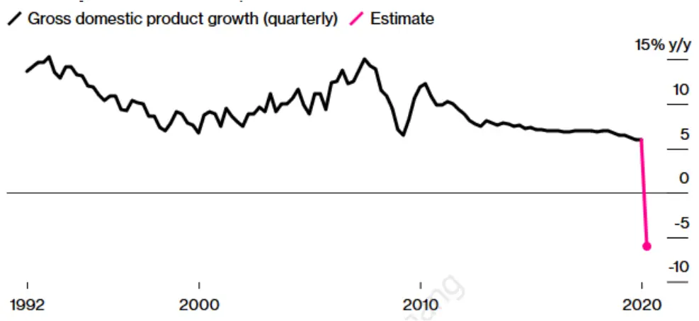
数据来源：国家统计局 Bloomberg 华泰期货研究院

- 模型显示美国经济以 100%的几率陷入衰退模式，尽管持续的时长还难以判断，且各机构对复苏的时间节点判断差异较大。

图 2：美国经济陷入衰退模式的几率
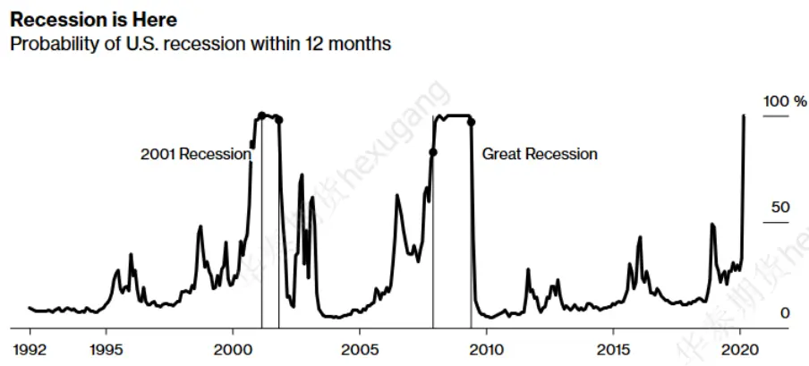
数据来源：Bloomberg 华泰期货研究院

- 新兴市场因为自身疫情和在产业链中处于较从属的地位，可能更加难以抵抗发达经济体衰退带来的影响。目前，IMF对 2020年全球经济成长预测为收缩模式，预测值为-11%：

图 3： IMF 对 2020 年全球经济成长预测
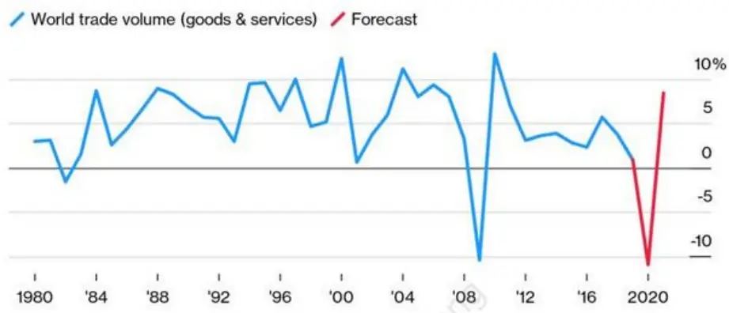
数据来源：IMF 华泰期货研究院

另一方面，避险类资产近期受到热捧。国际黄金价格已经走向历史高位，目前本身风险程度有所增强。但是我们对比其他大类资产（如美国股市，企业债等），其相对风险并不算高。虽然，目前全球疫情控制有转好迹象，但是经济迅速复苏似乎并不可期。历史上来看，黄金与股票市场存在长周期的负相关性[2]；而两者间牛熊角色的最终互相，来自于经济成长的判断，直接推动力则是大型机构的风险偏好转变及全球资本流动。由于大部分机构投资者对未来近期的经济发展并不乐观，那么资金的流动必将成为关键的风险资产推动力，这也是我们比较关注的问题。同时，我们需要强调，一定程度上目前资产价格的变动与资金的流动并不完全同步。我们对比黄金与美国股市的资金流动形况，考察市场流动性较好的黄金 ETF—GLD 和基于 S&P500指数的ETF--SPY。统计数据显示，5月份以来，流入黄金 ETF 的资金量排名持续靠前，而 SPY 却正好相反。所以，至少短期避险情绪依然十分活跃，而对美国股市持续反弹的预期需要保持谨慎。

表格1：黄金ETF 和 SPY的资金流动形况

| ETF | 2020-06-02: | 2020-05-28: | 2020-05-21:2020- | 2020-05-14: | 2020-05-07: |
| --- | --- | --- | --- | --- | --- |
|  | 2020-05-27 | 2020-05-22 | 05-15 | 2020-05-08 | 2020-05-01 |
| GLD（黄金ETF） | 净流入第9 | 非前10 | 净流入第9 | 净流入第2 | 净流入第2 |
| SPY (S&P 500 指数 ETF) | 净流出第9 | 净流出第1 | 净流出第1 | 非前10 | 净流出第1 |

数据来源：ETF.com 华泰期货研究院

而从中长期配置的角度来看，黄金配置的价值就显得更加突出了。因为，黄金在经济发展周期低谷运行时不仅是避险也是资产保值的较好投资标的物。实际上，我们经常强调的黄金，股票负相关性在长周期（若干年）的时间段上是最为显著的[3]。而这一过程正是大型投资机构（包括各国央行）投资资金的持续流转而实现的，这正是我们将黄金作为大类资产配置标的物的底层投资逻辑。

图4： LME 金价与S&P 500指数线性相关性（领先/滞后）
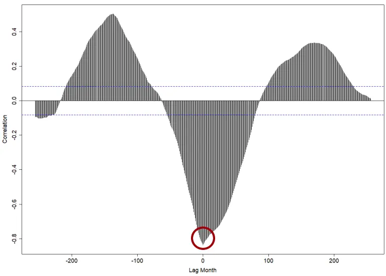
数据来源：Bloomberg 华泰期货研究院

回到我们的投资标的物范围上来，我们选取国内市场体量较大的重要股票指数：上证50，沪深 300和中证500；并挑选 5年期国债期货代表债券表现。分别将股票指数与国债期货做传统60/40配对。然后，应用风险平价模型，将该组合与黄金期货（对比黄金股）进行风险配置。我们发现在历史数据范围内，配置黄金能够有效优化组合的表现，特别是在平衡风险分散和获取稳定收益。再结合前文对市场的一些预期判断，我们认为目前是黄金配置过程中逢低吸纳的好时机。

## 二、方法论

首先，我们所有数据来自于交易型数据（可投资标的物），均使用日度采集频率。

由于随后大类资产配置策略将在月度调仓基础上构造，以此对应，我们也将日度数据分解到不同的周期尺度上，并且重点研究与我们调仓周期最吻合的数据统计特征，以此引出投资逻辑。需要强调，合理的数据分解方法并非一蹴而就或是显而易见，而是在我们前期对大量（多种资产类型，多种交易频率）的金融数据研究结果，并在线性和非线性等多种分析工具测试的基础上，逐步完善的数据工具体系[3]。

然后，我们利用风险平价模型来构建投资权重模型。我们将看到经典60/40股债模型在国内市场也能发挥很好的投资效能（至少最近几年以来）--其对应周期上的相关性特征也支持该判断。

接着，我们在这个基础上引入黄金的配置。并根据黄金与股债的风险程度进行风险平价配置。我们将看到，黄金在配置中起到了关键作用。

## 三、数据分解&相关性分析

## 1. 数据分解

在大类资产配置的逻辑中，收益的主要来源来自于不同市场行情条件下，不同风险资产的相对风险溢价水平；简单来说，就是挑选当前估值水平较低的资产，赋予较高权重以期获得较好回报。同时，由于在大类资产配置中，因为不同类型资产在一定行情下有显著的差异化表现，从而为平滑化投资风险提供了对冲机制。

所以，我们在第一步将考察各类型资产的相关性关系。为此，我们列出多个标的物进行测试：

1) 股票：主要指数—上证 50，沪深 300，中证 500 和龙头黄金股

2) 债券：5 年期国债（投资工具使用 5 年期国债期货）

3) 商品：黄金，白银，铜（投资工具为对应国内场内期货）

其中黄金龙头股由山东黄金（600547）、中金黄金（600489）和紫金矿业（601899）三只黄金股票等权组成。

## 2. 相关性分析

图 5： 相关性分析（全部数据，2013Q3 到 2020Q1）
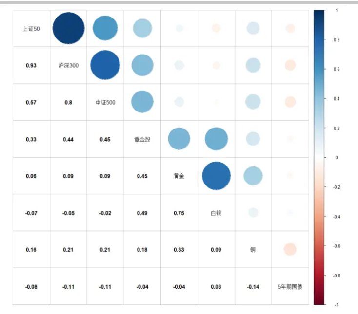
数据来源：Wind 华泰期货研究院

图 6： 相关性分析（近两年，2018Q1 到 2020Q1）
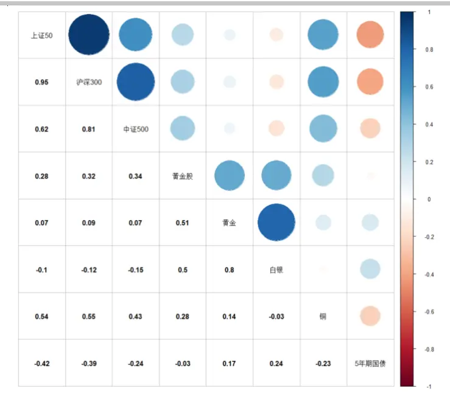
数据来源：Wind 华泰期货研究院

图 7： 相关性分析（全部数据，2013Q3 到 2020Q2）
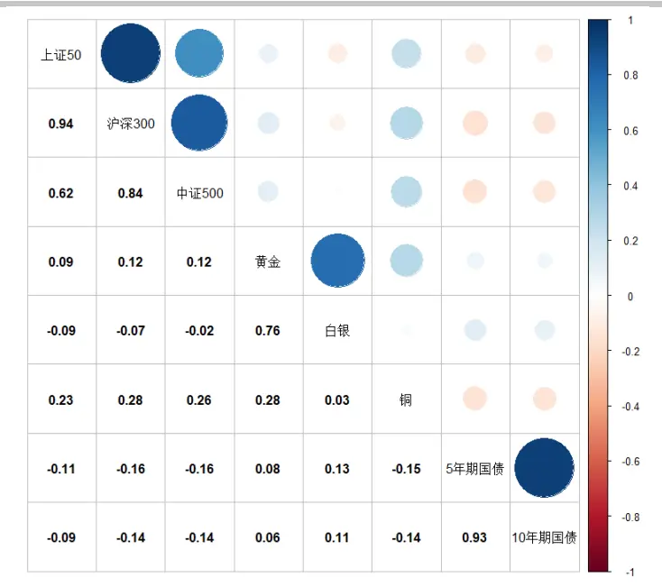
数据来源：Wind 华泰期货研究院

图 8： 相关性分析（近两年，2018Q2 到 2020Q2）
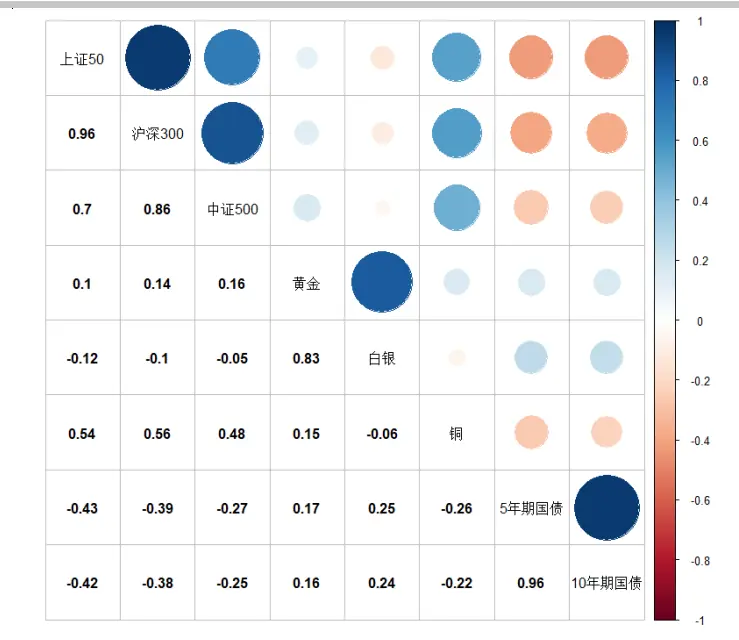
数据来源：Wind 华泰期货研究院

首先，在月度周期尺度上，大类资产之间的相关性保持了较高的稳定性。这对我们后续分析配置权重提供了必要的数据基础。

贵金属无论是从整体历史数据还是近两年的历史数据来看，都和权益类市场保持了较低的相关性（该特征与美国等发达市场保持一致）。黄金与股票大体保持微弱正相关到无相关性；白银大体保持微弱负相关到无相关性。

贵金属与债券类资产的相关性也较低。结合近两年贵金属较为突出的走势，我们觉得从投资逻辑层面来说贵金属具备了优良的投资属性，值得我们进一步的分析研究。

## 3. 配置逻辑分析

黄金在资产组合中的作用：

对冲通胀风险：黄金是直接对抗通胀最有效的投资工具，市场需求会导致黄金价格上涨。

分散组合风险：黄金与其他大类资产相关性较低，投资组合风险分散效果较好。

极端行情对冲：极端行情下黄金往往有较为不错的表现，帮助组合抵御大幅回撤。

图 9： 黄金在极端行情下的对冲
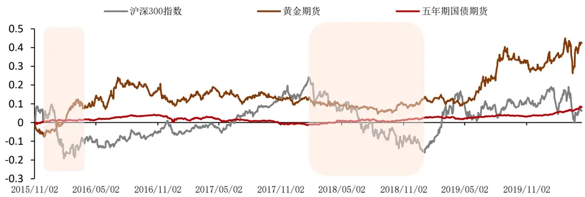
数据来源：天软 Wind 华泰期货研究院

从上图可以看出，黄金在股票市场持续走低阶段，表现出了非常高的稳定性，多数情况下录得正收益。同时，股票在强势阶段，虽然黄金价格持续横走甚至有时略有走低，但是总体来看，保持平稳。而近两年黄金的涨势明显表现强劲。

股债 60/40 策略：在 20 世纪 30 年代兴起于美国，投资组合分配 60%的权重给股票类资产，40%的权重给债券类资产。策略简单易懂、易于操作，并在几十年内一直取得不错的回报，因此在美国投资界广泛流行。由于在大类资产配置发展早期，并没有足够丰富的全球资产可供配置，60/40策略在近半个世纪的美国市场充分的体现了其小技巧大智慧，时至今日仍有许多投资人采用这一策略，或将其设定为比较其它策略的基准。

风险平价模型：起源于20世纪 90年代桥水基金推出的全天候投资组合，研究表明传统的60/40模型组合 90%的风险贡献均来源股票，风险分配的不均衡导致组合对于股票资产过度暴露。风险平价模型在一定程度上解决了这两个问题，即对风险高的资产配置相对低的权重，对风险低的资产配置相对高的权重。

对于美国成熟市场，我们可以看到如下数据。对比资产配置与风险配置，我们看到权益类资产的风险贡献远高于债券。60/40 配置中，股票实际上提供了 90%的风险贡献。

图10： 风险平价策略与经典股债60/40策略风险收益分配
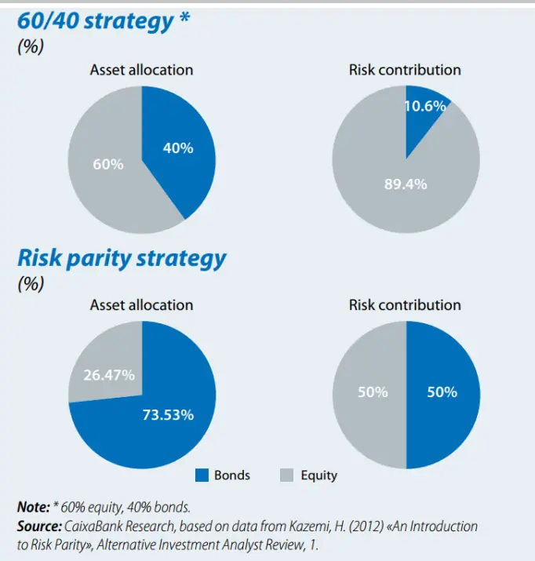
数据来源：CaixaBank Research 华泰期货研究院

首先，我们并不设置任何约束条件，测试股债金三类资产的历史相对风险程度；并根据风险平价模型配置投资权重。将中国股债权重相对比例放开，使用风险平价模型应用于国内的股票、债券标的物。我们发现股票、债券资产分配比例也约等于 1:9，也说明股票与债券的风险比例约等于 9:1，股票风险较高。这和美国相关金融资产的特征基本保持一致。

我们看到风险平价模型在整个历史时段，给出了相当稳定的权重分配。这为实际投资操作中提供了较为优异的交易条件，降低了换手率，以及对应的交易成本和其他交易型风险。

本文将把股债60/40配置作为起点，再按照需求调节策略，在股债 60/40基础上增配黄金期货。

图11： 股债相对比例放开时风险平价策略资产分配情况
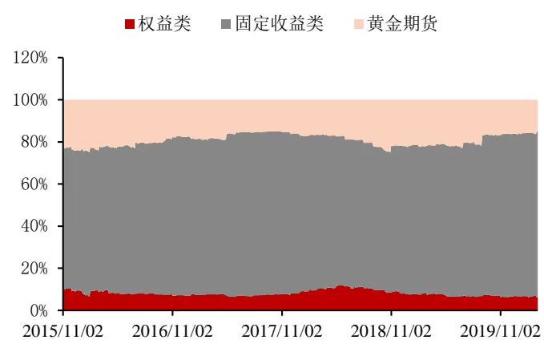

| 资产 | 股票 | 黄金期货 | 债券 |
| --- | --- | --- | --- |
| 平均占比 | 8% | 19% | 73% |

数据来源：Wind 华泰期货研究院

以60/40股债经典组合为例，加入黄金期货后组合长期表现稳健，较好地应对了股市极端回撤。并且加入黄金之后，在原本风险水平下显著提升了组合的收益，也改变了组合收益率分布的特征，组合收益从负偏变为正偏，同时CVAR、VAR以及最大回撤率也显著降低。

图12： 风险平价策略与经典股债60/40策略风险收益分配
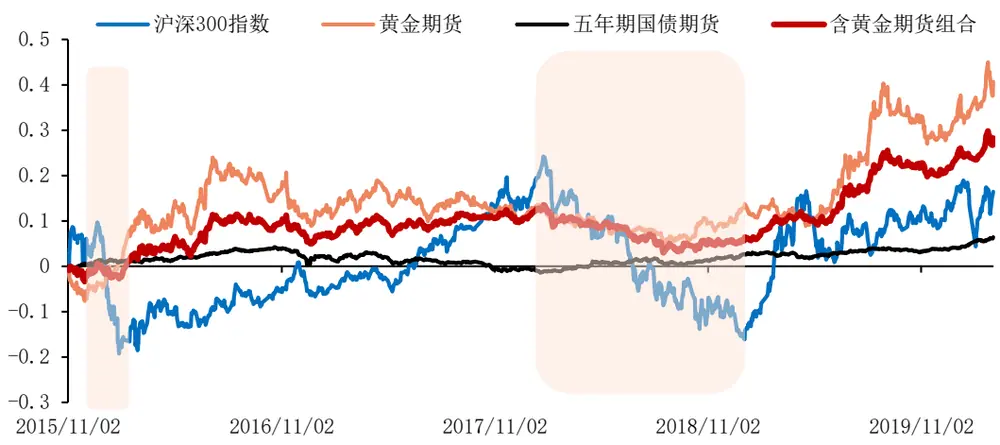
数据来源：天软 Wind 华泰期货研究院

图13： 风险平价策略与经典股债60/40策略风险收益分配
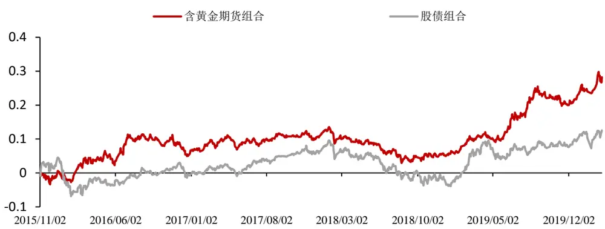
数据来源：天软 Wind 华泰期货研究院

表格2：股债组合中加入黄金后的风险收益表现

| 资产组合 | 年化收益率 | 年化波动率 | 偏度 | 峰度 | CVAR | VAR | 最大回撤率 |
| --- | --- | --- | --- | --- | --- | --- | --- |
| 股债黄金组合 | 5.80% | 7.18% | 0.29 | 4.02 | 0.97% | 0.66% | 9.31% |
| 股债组合 | 2.46% | 7.96% | -0.69 | 5.04 | 1.26% | 0.76% | 12.27% |

数据来源：天软 Wind 华泰期货研究院

首先，整体上看，加入黄金之后，组合配置的收益曲线更加光滑。我们认为，这体现了黄金与股债相关性较低的数据特征。黄金的收益率也有比较明显的特点，其具有一定的周期性特征[4]（接近一般商品），但是对经济发展的前瞻性更加敏锐。比如从 2018年后半段开始，黄金就进入了上升阶段，给组合带来强劲的动能。股票在 2019年上半年的反弹结束后，进入盘整阶段，走势进入风格、板块轮动模式。然而，全球宏观经济发展持续放缓则成为了持续性的动力继续推高金价。所以，尽管我们认为金价的定价因素较为复杂，但其与宏观经济面的贴合程度更加紧密，并且在目前经济下行阶段，金价的主导因素更加明确。

其次，目前黄金依然是美元定价作为主导。当我们使用人民币计价投资时，需要考虑汇率因素。虽然，我们不对汇率做预测，但是在我国进出口都受到疫情影响且中美贸易战短期内难以有效解决的前提下，黄金保值的作用需要纳入投资考量。

从年度组合表现来看，在回测期间，黄金在大部分年份都保持了正向的收益，但是股市则涨跌互现，因此仅投资股市，很难获得长期稳定的正向收益（年度计），但组合在2016、2020年股票指数为负收益的年份得到了正向的收益；即使是2018年，黄金的加入也明显缓解了投资亏损。这主要依赖于黄金与股市的中长周期上的负相关性。而横向比较三大指数的表现，大多数年份三个指数的排序为上证 50> 沪深300> 中证500，尤其在2017年蓝筹股行情，中证 500表现明显弱于其他两大指数。但是在今年中证 500在三大指数中表现最为坚挺，主要由于今年金融股首疫情影响较大，上证 50、沪深 300受到较大拖累，而成长股相对坚挺。同时，在黄金的帮助下，配置组合到目前为止依然录得正收益。

图 14： 标的资产年收益率
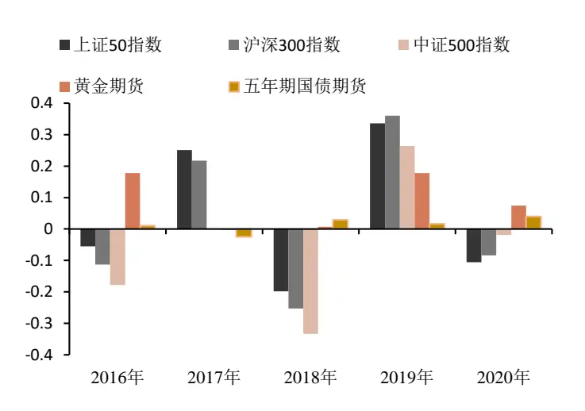
数据来源：Wind 华泰期货研究院

图 15： 含黄金组合年度收益率
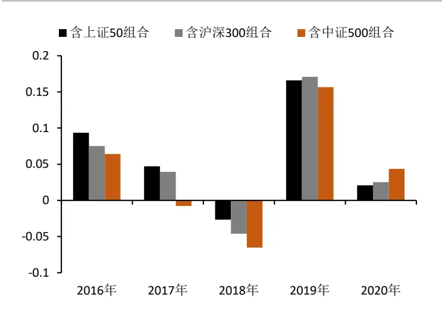
数据来源：天软 Wind 华泰期货研究院

## 五、总结

本文延续了上期报告中的研究方法，综合了我们的数据分析体系和量化模型方法，并将其应用到大类资产配置模型中来。在对黄金的持续研究中，我们发现在A 股/债券，60/40的基础上，也可以通过加入黄金的配置，在中长期取得稳定的投资收益。而对金价收益率数据的多周期分解，以及不同周期尺度上与股债相关性分析，特别是领先/滞后的判定（以及相关性衰减速度），同时这个也是我们再结合基本面信息（如资金流向，投资者风险偏好转变），进行交叉比对的重要数据基础。走向配置策略，可靠的风险评估是合理使用风险平价模型的关键。根据持仓时长，选择最为贴近的数据分解周期，是我们优化模型的主要方法。

## 六、参考文献

[1] 华泰期货金融时序专题 20200108：金融科技赋能投研系列之七：多尺度数据分析(五)

[2] 华泰期货金融时序专题 20200108：金融科技赋能投研系列之八：多周期尺度应用于风险平价策略（一）

[3] 华泰期货金融时序专题--金融科技赋能投研系列

[4] 华泰期货量化策略年报 20191125：金融科技赋能投研系列之一： 人工智能策略在商品市场的应用

## ⚫ 免责声明

本报告基于本公司认为可靠的、已公开的信息编制，但本公司对该等信息的准确性及完整性不作任何保证。本报告所载的意见、结论及预测仅反映报告发布当日的观点和判断。在不同时期，本公司可能会发出与本报告所载意见、评估及预测不一致的研究报告。本公司不保证本报告所含信息保持在最新状态。本公司对本报告所含信息可在不发出通知的情形下做出修改，投资者应当自行关注相应的更新或修改。

本公司力求报告内容客观、公正，但本报告所载的观点、结论和建议仅供参考，投资者并不能依靠本报告以取代行使独立判断。对投资者依据或者使用本报告所造成的一切后果，本公司及作者均不承担任何法律责任。

本报告版权仅为本公司所有。未经本公司书面许可，任何机构或个人不得以翻版、复制、发表、引用或再次分发他人等任何形式侵犯本公司版权。如征得本公司同意进行引用、刊发的，需在允许的范围内使用，并注明出处为“华泰期货研究院”，且不得对本报告进行任何有悖原意的引用、删节和修改。本公司保留追究相关责任的权力。所有本报告中使用的商标、服务标记及标记均为本公司的商标、服务标记及标记。

华泰期货有限公司版权所有并保留一切权利。

## ⚫ 公司总部

地址：广东省广州市越秀区东风东路761号丽丰大厦20层

电话：400-6280-888

网址：www.htfc.com