# 金融科技赋能投研系列之十一：

## 智 AI 科技 慧投未来（上）

这是最好的时代，也是最坏的时代。对于金融市场来说，本世纪第一个庚子年是个极为动荡的一年。这一年里，全球经济遭受了全球流行病影响。权益、债券、衍生品等各类市场均出现了大幅的波动，量化投资模式也因此受到了前所未有的挑战。由于传统量化策略所依赖时间段的数据越来越无法反映当今环境的快速变化，因此市场史无前例的动荡使得传统量化投资模型无所适从，众多量化对冲基金在多变的行情中也亏损惨重。

然而，投研的脚步并未减缓。相反，正是在这种情况下，投资领域对于新技术的研发和应用，表现出了更大的热情。其中，尤以能够快速学习市场新模式的人工智能技术，为最受瞩目的热点课题。实际上，我们观察到海内外业界明显提升了对AI技术开发和应用落地的投入--应用场景更为务实，创新技术逐渐渗透到投研领域的各个角落，研究目标也更趋向于多样化且多有不俗表现。

人工智能最显著的特征就是其属于前沿技术。对于前沿技术而言，从萌芽阶段到成为共识主导技术，并非完全以排他为主要特征。在具备一定成熟度的领域，我们观察到更多的情况是，新技术与原有方法的长期共存，互为补充，互为促进，反复博弈共进。最终的技术形态可能离最初预设相差甚远，甚至是新旧技术充分融合之后的全新技术形态。

基于上述的观察和思考，我们认为，正确的研究方向应该是充分理解当前 AI 技术发展的核心驱动因素，类比其成功领域的应用场景，找到 AI 技术在金融投研的最佳突破点；并以此建立对应的数据框架，特征分析模式，并将其融入到我们已经较成熟的投研框架中来。

本文将延续上一年我们开发的多周期数据分析技术，并且将更为深化的应用场景逐一展现。同时，我们将会第一次推出商品多因子模型（时序构建类型、截面回归类型），同时与同类股票因子模型做横向比较，并观察期股联动现象。最后，我们将简要分析不同类型的 AI 模型的应用场景，基于我们的特征分析方法，结合浅度和深度等不同算法优势，构建投研框架。

投资咨询业务资格：

证监许可【2011】1289 号

研究院 量化组

陈辰

- 0755-23887993

- chenchen@htfc.com

从业资格号：F3024056

投资咨询号：Z0014257

## 何绪纲

- 0755-23887993

- hexugang@htfc.com

从业资格号：F3069194

高天越

量化研究员

- 0755-23887993

- gaotianyue@htfc.com

从业资格号：F3055799

本文第一部分，将会结合数据处理方法和模型背景知识介绍为读者提供一个较完整的商品投研框架。

第二部分，延续我们上一年开始研发的多周期数据分析框架，做进一步的完善，并对其在大宗商品领域的应用做系统性阐述。同时，这也是我们后续商品因子分析，期股联动分析的关键性工具。实际上，到了在深度学习领域，这一套数据分析工具将和模型进一步深层次融合，为提取商品因子特征信息，量身打造深度学习模型。

第三部分，我们将推出国内期货市场的大宗商品多因子模型，包括时序基础因子和截面因子两大类。据我们所知，这是目前国内第一个推出该类型商品多因子模型。在参考了大量海外发达商品市场的研究结果的基础上，我们将利用时序回归模型针对不同商品，计算其因子（市场中性化）暴露程度，进而利用截面回归方法获得截面多因子（不可投资）收益率。这一套商品多因子模型包含了国家因子，宏观风格因子，市场风格因子以及商品板块因子。

这套多因子组的构造离不开（可投资）基础时序因子的计算。事实上，在这一基础上，模型还实现了宏观类因子的截面回归分析方法，这为我们利用商品全市场日度表现追踪低频宏观指数提供了方法论基础。我们将详细介绍这两类因子的定义、联系和区别，并且简要探讨他们各自的应用场景。

第四部分，我们将对期股因子联动的内在驱动因素进行探索。通常意义下，不同类型的市场的主导影响因素并不相同（相关性测试也将验证这一点）。然而，当我们放开测试条件，则可以进一步考察期股之间的提前/滞后等联动关系，为深入理解权益类市场和商品市场之间的内在联系提供数据基础。

第五部分，前述的数据分析方法和因子间联动关系，为我们最后应用 AI 模型提取预测信息提供了坚实的基础。为此量身定制决策树和随机森林等模型，为不同标的物锁定有效的因子组合；深度学习方面，则针对多周期分解后因子数据特征，设计合理的模型拓扑结构，利用场景学习概念建模。我们选取的主要标的物是（可投资）华泰商品板块指数。

本文是年报的上篇，着重论述了商品因子体系的构建逻辑和必要的测试方法论。在下篇中，我们会说明更多技术细节，输出完整的测试结果，并将不同模型结果做相应对比。

## 一、 商品投研框架

## 1.1 基本逻辑

量化投研方法的核心目标是通过模型化方法提取各类金融（甚至密切相关的非金融类）数据背后蕴含的对标的物未来价格判断的信息。

有两个重要假设与本文密切相关，需要深入探讨：

## 1) 数据集是否蕴含了标的物定价信息

## 2) 量化模型是否能够提取数据中的有效信息

第一个问题的复杂度较高，我们将其分解成几个层次来考虑：

首先，在经济学层面，经济运行周期对大宗商品定价至关重要。无论是从库存周期（Kitchininventory cycle~40 个月），还是固定资产投资周期（Juglar cycle~7-11 年），其综合作用的效果将投射到各类生产要素价格的相对强弱上，并体现出价格上下波动。同时，这一类型的影响因素不仅有更加坚实的理论依据和内在规律性，也是定性判断市场宏观特征的主要参考依据。但是，另一个方面，参考这类数据的市场参与者（或规则制定者），也越发娴熟利用这些经济周期规律，甚至为了抑制系统性风险，主动参与市场的逆周期操作。这为提取中长周期宏观数据的有效特征带来了越来越大的难度。

其次，从驱动力角度来看。金融工具一般来说，都有多个驱动因素，而在不同时段不同因素的重要性也有可能发生变化，极端情况下还有可能某个因素成为绝对的主导因素，而难以体现其他因素的影响效果。所以，一般意义上，对于驱动因素的判断主要基于历史数据（针对基本面、宏观指标数据等）的统计分析；同时，结合国内政经环境和更大范围的全球经济态势做出阶段性判断。

再次，从市场博弈角度来看。任何标的物价格的形成都是交易者与其对手方在一次次的交易中形成。虽然，交易者的交易目的，持仓周期和风险偏好各不相同，但是一般都是基于明确的主观目标，并根据自身掌握信息来进行交易。一段时间内的价格形态和技术指标分析，都有助于对市场博弈情绪的判断，从而更敏感把握市场动态。

综上所述，市场的复杂度造成了我们提取市场有效信息的难度。究其原因，上面所提到的各个层面的信息最终都将叠合到市场交易行为中来形成价格，并且一般而言难以确定单笔交易的关键属性。所以，统计分析工具目前依然是金融数据分析的基础性工具; 而新引入的数据分析方法是否能够更助于分解出数据中有用的信息就是我们投研方法论的一个重点研究方向。

进一步，金融市场背后的价格影响因素无外乎上面我们分析的几个主要类型，那么其中若干关键因素，我们依然可以用简化且量化的逻辑来理解—多因子模型。本文下一章将会详细介绍商品因子的制作和测试结果。就我们所知，目前国内业界针对大宗商品体系并未有此类多因子模型体系，特别是针对结构化投资模式或全市场 beta 类型风险敞口而设计的市值中性化多因子体系。所以，我们会详细介绍挑选因子的主要考虑依据、制作方法、单因子测试效果、多因子组回归结果，以及和同类型股票因子的对比分析结果。

这里我们的因子组分为四种类型：

1) 国家因子

2) 宏观因子

3) 风格因子

4) 商品板块因子

这些类型因子的挑选和制作，正是基于我们上述对市场复杂性的认识，把对国内期货全市场（从截面和时序两个角度）都较有效的指标量化为影响因子。在和同类型股票因子的对比中，可以看到这一套因子组对全品种期货市场具有很好的整体解释力，同时每个因子都代表了关键的独立风险敞口，若干类型的风格因子还表现出了很好的投资潜力（如商品价值因子）。 有趣的是，这些商品因子与股票因子之间表现出了十分紧密的联动特性（领先/滞后相关性）。更进一步，我们将利用线性模型和 AI 模型，测试商品、股票因子间的价格（波动）传导规律，以及因子对标的物的影响力强弱，从更坚实的预测性角度，为我们研究跨品种金融资产投资奠定数据基础。

第二个问题，直接关系到我们的投研框架是否具备一定效率而非仅仅历史信息的解读。由于真实的金融市场并没有一个第一驱动力的“真实”模型，所以我们观察到的各种金融数据并不能直接对“真实”模型进行拟合，从而进一步判断数据拟合程度（如参数精度），甚至估算数据噪音水平等。

相反，我们必须不断尝试不同模型去解读数据，对比它们的模型效能，利用最优模型总结出有用的市场规律，指导我们的投资行为。随着算法技术的高速发展，模型优化迭代的竞争态势越发激烈。本文我们将看到多种跨学科技术的整合应用，汇聚来自传统金工领域的统计类型时序模型、信号分析方法和受到高度关注的AI技术等，挖掘多种新技术在投入到金融领域以后所发挥的各自效能。

这里我们关注的重点将集中在不同方法对比的结果。首先，对于跨领域的技术移植而言，技术的适用性是我们最为关心的，那么是否能发挥出比原有技术更好的效率就是一个比较客观的评判标准。其次，技术的跨领域应用往往还涉及到算法本身的逻辑深化，信息提取方式的优化，以及特征工程优化等方面。这将是大量新旧技术融合的地方，也是本文将会深入讨论的部分。

## 1.2 因子选取

商品因子一直是一个讨论热度很高，但却体现出较大分化的领域。这方面，海内外都出现了大量的参考文献，在投资领域更是热度难减。这其中最主要的出发点是基于大宗商品的经济学特征和市场交易特点出发，选取合适的多因子组，既能最大程度描述市场的系统性收益/风险敞口，又能作为数据基础为新型模型开发铺平道路。下文将详细介绍我们推出的国内全商品市场多因子模型构建方案，并在年报下篇展示更多（技术性）测试结果。

## 1.3 模型基本方法

本文将对比多种模型方法进行数据处理，因子效率判断，期股联动观察，因子解释力&预测能力的研究结果。

⚫ 数据处理：

沿用我们之前开发的多周期数据分解方法[1-4]，将相关金融数据按周期长度分解为长/短周期，分别建模分析。

⚫ 相关性特征：

1) 使用传统金工方法分析标的物与因子之间，期股因子之间相关性；

2) 并利用协相关性的方法，观察上述因子间领先/滞后相关性

⚫ 因子对标的物的重要性判断及回测结果：

1) 随机森林模型（Random Forest）；

2) 基于进一步特征分析的深度学习模型。

## 二、 数据预处理

## 2.1 多周期数据分解

从上一年开始，我们就系统性的引入了多周期数据分解的方法，已累计了相当数量的研究报告，包括：高频策略研究；商品因子研究；CTA策略开发；套期保值研究等。该方法持续深化、推广的主要原因是从数据预处理的层面，多周期数据分解方法就能最大程度帮助我们拆分数据中不同周期范围上的主导驱动因素。现在该方法已经全面融入了我们的研究体系，实际上，其深刻地改变了我们看待数据的角度和提取信息的方式，比如深度神经网络模型就是根据这样的数据分析方式而量身定制了模型拓扑结构。

金融数据是一个低信噪比的系统。数据之间的关联性几乎难以通过统计方法在原始数据中挖掘，即使一段时间内出现的高度相关性，也难以保持其稳定的联系而外推到预测场景中去。所以，为了降低数据噪音，并提取不同周期上的数据特征，我们在对基础因子数据，截面类型商品因子数据分析研究时，都将对数据做适当的多周期分解，并在不同周期尺度上分别观察标的物的时序特征、挑选影响力较强的影响因子、分析因子之间的相关性等。

我们使用测试数据的历史长度是2010 年以来的国内商品期货数据，数据量较少，难以使用中长周期数据进行测试（如月度数据）；而日度数据则又频率过高，从更广的实际投资角度来说有较高的门槛和技术性限制，所以本文主要给出周度的测试结果。我们的数据分解将分出短周期和长周期两类。

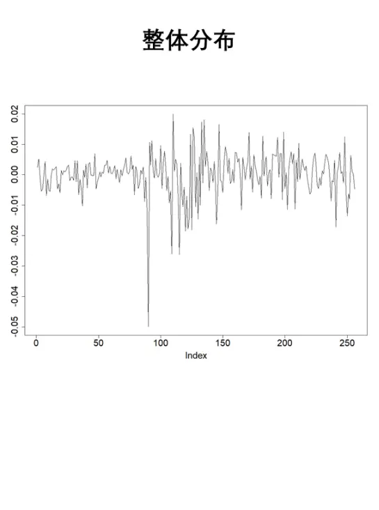

按照周期分解数据
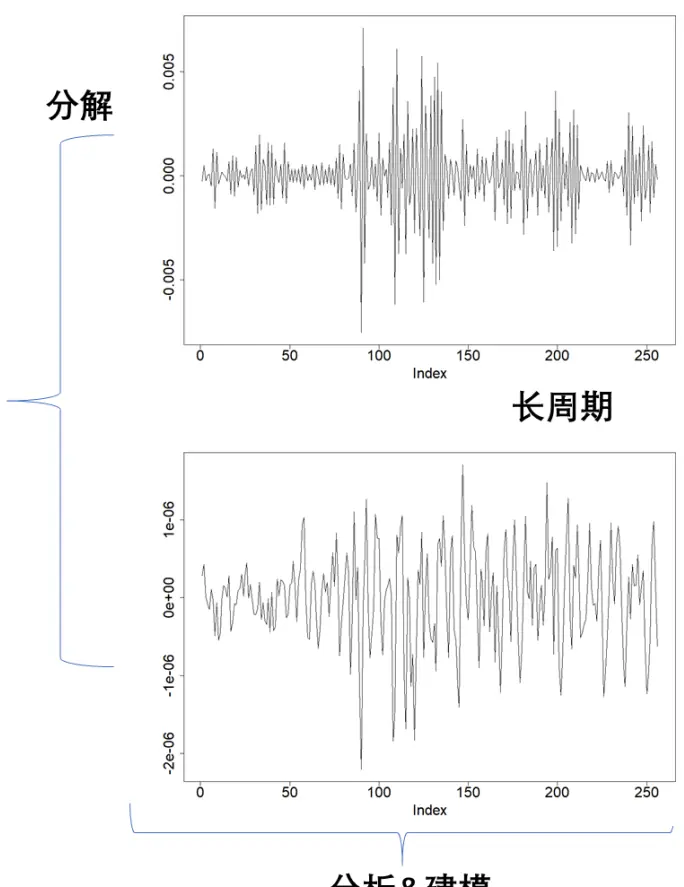
数据来源：Wind 天软 华泰期货研究院

## 2.2 多周期分解数据应用场景

## 1) 寻找标的物主导定价因素：

我们尝试用多周期分解的数据来把握本文最开始提出的第一个问题。不同层面的影响因素往往具有差异明显的时效性和延续性。举例来说，当经济发展处于上升阶段，宏观层面，如通胀等因素，往往体现出较为持续的特征，甚至成为新型行业板块以及相关大宗商品的长期驱动因素；而从市场博弈角度考虑，比如流动性因子，则更有可能是市场短线形态的理想指标。

而对标的物行情数据的多周期分解，就更有可能将不同周期范围的波动特征对应到其主导因素上面，从而为更进一步准确分析价格传导机制提供数据支持。我们将看到，在不同周期尺度上，同一个标的物的主导因素可以差异巨大。

上述的逻辑，也可以从另一个角度来理解。举例来说，在观察通胀因素影响时，我们希望能观察到其中长期（如若干月）对标的物的影响模式，那么在采集到的日度数据中发现的市场博弈性导致的若干天的市场异动就可能不仅不能够为通胀影响提供数据依据，相反甚至可能以“噪音”的形式干扰通胀因素的数据表现。同样的，假如投资者只关注日频级别的交易机会，那么长期的通胀因素并不能成为交易的主要依据，事实上，也有可能成为短线判断的干扰因素。

## 2) 相变特征：

几乎所有的金融数据模型都是建立在统计意义的基础之上，其基本的投资逻辑是在一定条件下，过往大概率发生的事件，在未来也会大概率发生。其背后的核心逻辑是市场的运行保持充分的稳定性。如果，市场处于高度非稳态，或过往的市场条件已经发生根本性变化（如交易制度改变，整体经济运作出现历史性拐点等），那么使用旧数据建立的模型就很容易失效。所以，当市场波动增强，或外在经济环境发生较大变化时，判断市场是否发生根本性变化（市场相变）就觉有非常重要的意义。

在上一年的年报中，借助重现的概念，递归图是一种有效的可视化方法，帮助我们把类周期时段与相变阶段区分开来。

## 3) 模型应用：

正如本文一开始提出的第二个问题，模型的功效体现在数据信息提取的效率，最终通过预测能力进行衡量。就我们所知，即使是目前最先进的 AI算法，也无法自动分析多周期信息叠加的真实行情数据。所以，经过多周期分解的数据就成了我们进行特征分析的关键步骤。实际上，我们马上将会看到，深度神经网络模型的灵活性天然适合这种数据处理方式，并且比较容易搭建对应的神经网络拓扑结构。

## 三、 大宗商品因子模型

## 3.1 大宗商品因子背景介绍

从构造单元来说，商品因子也是从单因子的制作开始，所以本章将从单因子的算法实现介绍开始。首先，我们参考了大量最新的商品研究文献，吸取了海外发达市场对于商品因子研究和实证分析的宝贵经验，并结合国内大宗商品市场自身的特点做了适应性调整，在此过程中也发现（或印证了）一些有趣的论断。比如，在构建宏观beta因子，我们对比了美国CPI和中国CPI的因子解释力，发现中国CPI具有更高全市场解释力；美元指数则单独具备较高影响力（而非中美汇率）。

其次，我们需要强调，大宗商品的主要投资工具是场内期货，天然具备多空交易方向，这与股票风格因子一般基于不可投资的多空个股组合不同。所以，下一节将具体介绍的基础因子，实际上也可以作为投资工具使用，特别在对某些收益来源（风险敞口）需要提高（规避）暴露时，可以适当做多（空）对应基础因子来进行捕捉（规避）机会。

基础因子和截面因子是不同的概念，并且适用于不同的场景，然而在因子制作方面有直接的关系。实际上，商品不同品种在某时刻的截面因子暴露程度是基于基础因子值；进而通过全市场商品的截面收益率进行多元线性回归计算，得到因子的截面收益率。这一过程本质上是在解析全市场行情数据，通过不同商品对因子相对暴露程度进行过滤，从而将市场波动特征拆解成因子收益率和品种特异性收益率两个部分。不难看出，截面因子并非可投资工具。但是，它能够将抽象的因子概念，通过行情数据具象化，并且能够帮助投资人更清晰理解具有系统性特征的收益/风险的不同来源。所以，对于投资市场风格和商品板块的投资策略来说，截面因子是不可或缺的风险溢价定量分析基础；对于风险管理者来说，截面因子则是风险预判的核心（基础）模型。

最后，我们注意到基础因子并不包含国家因子。从截面因子的角度来说，国家因子是在去除了（中性化）风格/板块因子之后，全商品市场剩余的系统性收益/风险来源，近似代表使用单一货币对本国市场某一类别金融资产投资的整体风险溢价特征；在风险模型中，这也是一类关键的影响因子。实际上，在随后的商品影响力测试中（线性和AI模型），我们将看到，国家因子对商品板块的总体影响力处于最高层级。

## 3.2 基础因子

## 3.2.1 风格因子

Curve 因子：

由于远月合约距离到期时间较长，需要承担更大的不确定性，所以市场会在不同到期期限的期货合约内嵌入相匹配的风险溢价以补偿投资者承担到期前合约价格不确定的风险，而导致远月相对贴水程度应该更深。基于这一逻辑可以通过做多远期合约、做空近期合约获得风险溢价[5]。

$$
\mathbf{r}_{\mathrm{t}}^{\mathrm{c}}=\mathrm{r}_{\mathrm{t}}^{\mathrm{c,future}}-\mathrm{r}_{\mathrm{t}}^{\mathrm{c,spot}}
$$

其中rtc,future和rtc,spot分别为期货品种 c 在 t 时刻的远月合约收益率和近月合约收益率。特别说明，为方便描述本文中的 spot 均代表期货品种的近月合约，而非现货，这与引用的参考文献指代方式一致。

基础因子策略：

1）将不同商品的 Curve因子值降序排序

$$
\mathrm{rank}_{\{\mathrm{argc}\}}(\mathrm{r_{t}^{c}})
$$

2）做多因子排名靠前期货品种的连续主力合约，做空因子排名靠后的期货品种连续主力 合约

举例来说，Curve 因子的原油表现可参看下图。

原油期货的三维期限结构
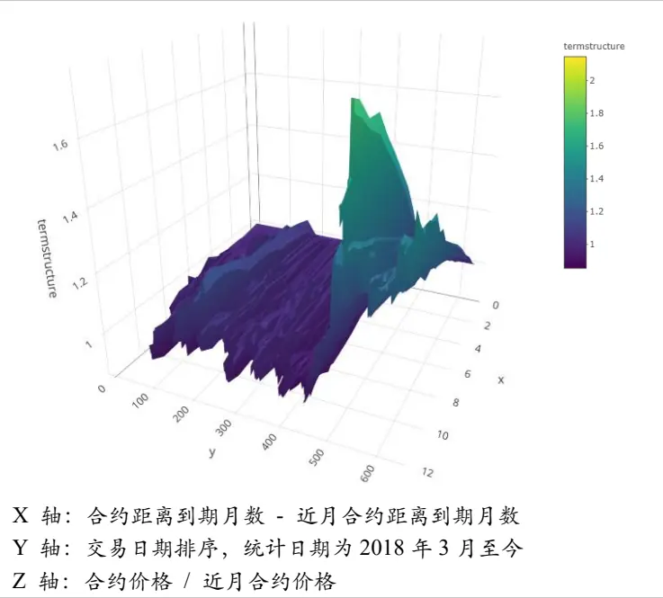
数据来源：天软 华泰期货研究院

原油期货月度curve（多第三个合约，空近月合约）
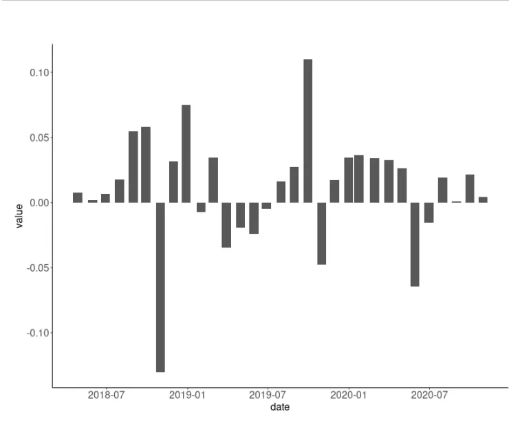
数据来源：天软 华泰期货研究院

## 期限结构因子：

现货与期货的价格差异，即基差（basis），与现货的库存水平、持有成本（包括交通、 仓储以及保险费用等）、市场利率（购买现货的融资成本）以及持有现货的便利收益（convenienceyield）等因素相关。假设基差水平全部反应了库存、持有成本、利率及便利收益等因素；升水市场中，商品供给充足，持有现货头寸至升水合约交割月份，覆盖持有成本，并卖出现货获利，因此升水合约价格在其它条件不变的情况下，价格下跌，且随着时间的推移向现货价格靠拢。反之，贴水市场中，商品供给不足，现货便利收益高于持有成本，贴水期货合约在其它条件不变的情况下，价格升高，且随着时间的推移向现货价格靠拢。

因此，利用展期收益来判断市场的升贴水结构，并构建多空组合，即买入展期收益最高的一篮子期货合约，卖出展期收益最低的一篮子期货合约，持有各商品的主力合约组合可获得期限结构的展期收益。

期限结构因子[7]：

$$
{\mathrm{Roll}}_{\mathrm{t}}^{\mathrm{c}}=\ln{(\frac{\mathrm{P}_{\mathrm{t}}^{\mathrm{c},\mathrm{spot}}}{\mathrm{P}_{\mathrm{t}}^{\mathrm{c},\mathrm{dom}}})}\times\frac{365}{\mathrm{t}_{\mathrm{c},\mathrm{dom}}-\mathrm{t}_{\mathrm{c},\mathrm{spot}}}
$$

其中 $\mathrm{P_{t}^{c,spot}}\mathcal{F}^{\mathrm{{c,dom}}}$ 分别为在 t 时刻期货品种 c 的近月合约价格和主力合约价格， $\mathrm{t}_{\mathrm{c},\mathrm{spot}}$ 和$\mathrm{\sf t}_{\mathrm{c,dom}}$ 分别为期货品种 c 近月合约到期日剩余天数和期货品种 c 主力合约到期日剩余天数。

## 波动率因子：

由于期货合约在曲线上嵌入风险溢价以补偿投资者在到期前价格的不确定性，我们选择变动系数（方差/期货收益均值）作为波动率度量，通过做多变动系数高的合约、做空变动系数低的合约获得风险溢价。[13,16,17]

$$
\mathrm{CV_{t}^{c}}=\frac{\sigma^{2}(\mathrm{R_{t}^{c,dom}})}{|\overline{{\mathrm{R_{t}^{c,dom}}}}|}
$$

$$
\mathrm{R}_{\mathrm{t}}^{\mathrm{c}}=\left\{\mathrm{r}_{\mathrm{t-j}\times21}^{\mathrm{c,dom}},\mathrm{j}=0,1,\dots,\mathrm{M}-1\right\}
$$

基础因子策略[6]:

1）将波动因子降序排序

$$
\mathrm{rank}_{\{\mathrm{argc}\}}(\mathrm{CV_{t}^{c})}
$$

2）做多因子排名靠前的期货品种连续主力合约，做空因子排名靠后的期货品种连续主力合约。

## 价值因子：

在权益市场中，著名的 Fama-French三因子模型中使用的价值因子是提取市净率相对较低的公司对市盈率相对较高公司的风险溢价，而在商品市场中供需是评判价值的重要指标。所以，可以使用价格上升潜力较高（库存水平较低）的品种对潜力相对较低（库存水平较高）品种的风险溢价作为价值因子。但是库存数据较难及时获取，量化指标计算中可以使用期货期限结构曲线的近月合约溢价程度作为替代指标。远月贴水越深的品种，在近月的供需相对更为紧张，因此具有更大的价格上涨潜力，而远月升水越强的品种，相对上涨潜力较小，这与期限结构因子的底层逻辑一致。但是价值因子使用的合约有所不同，因为大宗商品普遍存在季节性因素（seasonal），所以对于供需状况的比较需要使用同期相比的方式来去除某些品种价格可能包含的季节性波动。最终，现货溢价程度使用期货曲线上第一个合约与未来一年合约之间的斜率衡量[5] 。

价值因子：

$$
\mathrm{Value}_{\mathrm{t}}^{\mathrm{c}}=\ln{(\frac{\mathrm{P}_{\mathrm{t}}^{\mathrm{c,spot}}}{\mathrm{P}_{\mathrm{t}}^{\mathrm{c,near\mathrm{-}19}}})}\times\frac{12}{\mathrm{t_{c,near\mathrm{-}19}-t_{c,spot}}}
$$

其中 $\mathrm{P_{t}^{c,spot}\#}\mathcal{F}^{\mathrm{{c,near\mathrm{.}1y}}}$ 分别为在t时刻期货品种 c的近月合约（现货）价格和距到期最接近一年的合约价格。 $\mathfrak{t}_{\mathrm{c,near\_1y}}\mathfrak{f}^{\mathrm{_{\perp}}\mathrm{r}}\mathrm{t}_{\mathrm{c,spot}}$ 为期货品种 c 距到期期限最接近一年的合约的到期日剩余月数。

## 持仓因子：

Hong & Yogo (2012)[12] 提出持仓量是经济活动的顺周期指标，它包含有关未来经济活动和通胀预期的信息，而这些信息通常在未来会计入资产价格。因此，大幅的持仓量变化可以作为预测商品期货收益的先行指标。Szymanowska（2014）[13]也提出了使用持仓量变化作为排序依据买卖商品期货可以获得溢价。由于不同品种的一手合约的市值差异较大，为保证不同品种的因子暴露可比，本文使用持仓金额替代持仓量。

持仓金额因子[12,13]：

$$
\Delta0\mathrm{I_{t}^{c}}=\ln{(0\mathrm{I_{t}^{c,dom})}}-\ln{(0\mathrm{I_{t-21}^{c,dom})}}
$$

其 $\Psi0\mathrm{I}_{\mathrm{t}}^{\mathrm{c,dom}}$ 为期货品种c的连续主力合约dom在t时刻的持仓金额。

1）将持仓金额因子降序排序

$$
\mathrm{rank}_{\{\mathrm{argc}\}}(\Delta0\mathrm{I_{t}^{c}})
$$

2）做多持仓金额因子排名靠前的期货品种连续主力合约，做空持仓金额因子排名靠后的期货品种连续主力合约。

偏度因子

Liu(2017) [14]和 Fernandez-Perez(2018) [15]使用偏度作为信号，证明了在商品期货中做多偏度小的品种、做空偏度大的品种可以获得风险溢价[6] 。

$$
\mathrm{SK_{t}^{c}}=\mathrm{Skew}(\mathrm{R_{t}^{c}})
$$

$$
\mathrm{R}_{\mathrm{t}}^{\mathrm{c}}=\left\{\mathrm{r}_{\mathrm{t-j}}^{\mathrm{c,dom}},\mathrm{j}=0,1,\dots,255\right\}
$$

1）将偏度因子降序排序

$$
\mathrm{rank}_{\{\mathrm{argc}\}}(\mathrm{SK}_{\mathrm{t}}^{\mathrm{c}})
$$

2）做空偏度因子排名靠前的期货品种连续主力合约，做多偏度因子排名靠后的期货品种连续主力合约。

## 动量因子

动量效应是指我们相信前期期货品种价格的变动趋势会在未来一段时间继续延续下去，即前期价格上涨的期货品种在未来一段时间会继续上涨。因此，做多历史收益率高的品种，做空历史收益率低的品种可以获得溢价[6]。

动量因子：

$$
\mathrm{Mom}_{\mathrm{t}}^{\mathrm{c}}=\prod_{\mathrm{j}=0}^{\mathrm{D}-1}\bigl(\mathrm{r}_{\mathrm{t-d}}^{\mathrm{c,dom}}+1\bigr)-1\ ,\ \mathrm{D}=256\mathrm{days}
$$

1）将动量因子降序排序

$$
\mathrm{rank}_{\{\mathrm{argc}\}}(\mathrm{Mom}_{\mathrm{t}}^{\mathrm{c}})
$$

2）做多动量因子排名靠前的期货品种连续主力合约，做空动量因子排名靠后的期货品种

连续主力合约

流动性因子

流动性溢价来自于投资者在流动性相对较低的商品期货中持有多仓超额回报。通过Amivest流动比率可以衡量流动性，做多流动性低的合约、做空流动性高的合约可以获得流动性溢价。[13,22]

$$
{\mathrm{Amivest}}_{\mathrm{t}}^{\mathrm{c}}=\sum_{\mathrm{j=1}}^{\mathrm{D}}{\frac{\mathrm{Vol\_Amount}_{\mathrm{t}-\mathrm{j}}^{\mathrm{c,dom}}}{\left|\mathrm{r}_{\mathrm{t}-\mathrm{j}}^{\mathrm{c,dom}}\right|}},\qquad{\mathrm{D}}=256{\mathrm{days}}
$$

$$
\mathrm{LR}_{\mathrm{t}}^{\mathrm{c}}=\frac{1}{\mathrm{D}}\mathrm{Amivest}_{\mathrm{t}}^{\mathrm{c}}
$$

其中Vol $\mathrm{\mathbf{Amount}_{t}^{c,dom}}$ 为期货品种 c 的连续主力合约dom在 t 时刻的成交金额，流动性因子为Amivest流动性比率的日均值。

1）将流动性因子降序排序

$$
\mathrm{rank}_{\{\mathrm{argc}\}}(\mathrm{LR}_{\mathrm{t}}^{\mathrm{c}})
$$

2）做空流动性因子排名靠前的期货品种连续主力合约，做多流动性因子排名靠后的期货品种连续主力合约。

均价突破因子

经典的均价突破策略是当标的价格向上突破移动平均线，则认为价格未来会继续上涨；若向下突破移动平均线，则认为价格会继续下跌，该策略是基于均值是支撑或阻挡价格出现新阶段性趋势的假设。本文中，我们使用品种主力合约价格与其自身 20 日均值之差构建均价突破因子，做多价格超越均价并继续趋高的品种，同时做空价格难于维持而向下突破均价并继续趋低的品种。20 日均价突破因子：

$$
\mathrm{MA_{t}^{c}=\frac{\mathrm{P_{t}^{c,dom}-\overline{{P_{\ t}^{\prime c}}}}}{\sigma(\mathrm{R_{t}^{c,dom})P_{t-20}^{c,dom}}}}
$$

$$
\mathrm{R_{t}^{c}}=\left\{\mathrm{r_{t-j}^{c,dom}},\mathrm{j}=0,1,\dots,19\right\}
$$

$$
\mathsf{P}_{\mathrm{t}}^{\prime\mathrm{c}}=\left\{\mathrm{P}_{\mathrm{t-j}}^{\mathrm{c,dom}},\mathrm{j}=0,1,\ldots,19\right\}
$$

基础因子策略：

1）将 MA 因子降序排序

$$
\mathrm{rank}_{\{\mathrm{argc}\}}(\mathrm{MA_{t}^{c})}
$$

2）做多 MA 因子排名靠前的期货品种连续主力合约，做空MA 因子排名靠后的期货品种连续主力合约

## 3.2.2 宏观因子

## Beta 因子

由于大宗商品可以对冲通胀冲击，通胀风险溢价反映了投资者持有对通胀冲击高度敏感的商品期货，承担了通胀下行风险而获得收益补偿。我们使用60 月商品期货收益率与CPI变化线性拟合的斜率制作CPI Beta 因子。通过做多高 CPI Beta的合约、做空低 CPI Beta的合约获得通胀风险溢价。本文使用中国 CPI指数制作因子[9,10,13,23]。

$$
\mathrm{r_{t-j}^{c}}=\alpha_{\mathrm{t}}^{\mathrm{c}}+\beta_{\mathrm{t}}^{\mathrm{c}}\Delta\mathrm{CPI}_{\mathrm{t-j}\times21}+\varepsilon_{\mathrm{t-j}\times21}^{\mathrm{c}},\ \mathrm{j}=0,1,\dots,59
$$

其中ΔCPI为 CPI 变化量

1）将 CPI Beta 降序排序

$$
\mathrm{rank}_{\{\mathrm{argc}\}}(\beta_{\mathrm{t}}^{\mathrm{c}})
$$

2）做多 CPI Beta 排名靠前的期货品种连续主力合约，做空 CPI Beta 排名靠后的期货品种连续主力合约。

上述方法将宏观（非交易型）数据转化为依赖市场数据并旨在反映大宗商品对宏观因子风险暴露的商品期货多空策略。

美元作为主要国际结算货币，对商品的价格具有较大的影响力，因子本文也采用美元指数Beta 因子。该方法不限于CPI因子的制作，还可以运用到PPI、汇率等多种偏宏观风险敞口的因子制作当中。

## 3.2.3 商品板块指数及商品全市场指数

我们编制了一套新的商品指数，板块分类见附录 1。

编制方法：在每个月月底计算过去一年各品种的持仓金额，然后按照持仓金额的比例进行板块和市场的主力合约配置，从而得到可以跟踪交易的商品板块及市场指数。

我们的编制方案最后采用了华泰商品五大板块的分类方法。这与目前业界一些追求商品板块分类细致化的方式并不相同。具体原因如下：

1） 首先，板块指数分类必须在经济学意义上具有充分且合理的代表性--这是观察市场板块收益/风险敞口，保证截面分析方法具有统计意义的基础；当然也是商品多因子模型最终作为投资依据，和风险模型的关键数据基础。过于细分的商品板块，虽然突出了某些商品的风险特征，但是因为板块的成分过少，并不能代表一个较完整板块的强弱。而从数据特征上来说，板块成分不足，则会导致数据的统计性质不稳定，板块异常值出现的可能性增大。比如在一个品种稀少的板块里，单独一个高权重品种的价格异常波动极易演变为整个板块的异常波动；在实际操作中，这将严重混淆板块上的系统性风险和单一品种的特异性风险，后续的投资归因分析和风险模型应用将更无从展开。

2） 实际上，合理设计但涵盖品种数量相对较多的板块分类方法，并不会丢失单一品种的价格异动信息。从截面多因子模型的角度来看，反而能够更准确的将单一品种价格异动从板块的系统性风险里分离出来，最终保留在品种的特异性风险（多元线性回归残差）中。这不仅帮助投资者把握投资机会（或规避风险）提供了清晰的思路，同时也为深度投研创造了条件。举例来说，如果价格异动属于整个板块，那么进一步挖掘的方向将会倾向于产业链分析的角度；而价格异动最终判定只关联单一品种，那么该品种库存供需或主要市场参与者交易目的则将成为关注的焦点。

3） 进一步，过于细化的商品板块分类切断了板块内部不同品种之间的关联关系。商品板块的界定需要经济学意义的支撑，主要逻辑包括：产业链上下游供需分析；商品所属工业体系（一条或多条相关产业链）研究；消费端重要相关特征等。在多因子模型框架内，板块中各品种对不同风格因子暴露的相对强弱以及暴露程度随时间的变化规律无疑将成为上述经济学课题最有力的研究角度之一（我们将在后续报告中陆续推出研究结果）。过于细分的板块将很难应用板块内部对比的研究方法，并且针对为数不多几个品种的结论也较难得到统计学意义的支撑。

综上述论述，不难看出采用华泰商品五板块分类方法的相对优势，同时将这一套分类方法应用到截面多因子模型将会给我们带来更合理的商品投研框架，包括自上而下三个层面：

1） 在全市场的层面上，商品价格的波动特征被拆解成因子、板块以及每个商品各自的特异性风险，为我们寻找数据背后的经济学逻辑奠定了基础。

2） 在板块层面上，则可以更清晰区分板块系统性风险和单一品种的特异性风险，并可着力研究商品板块内部风格暴露趋同/分化的原因。

3） 最后在单个品种层面上，则观察其关键的风格暴露特征和独立于板块的特异性风险来源。

## 3.2.4商品板块指数及商品全市场指数历史表现

商品指数的主要历史表现如下：

商品板块累计收益率表现
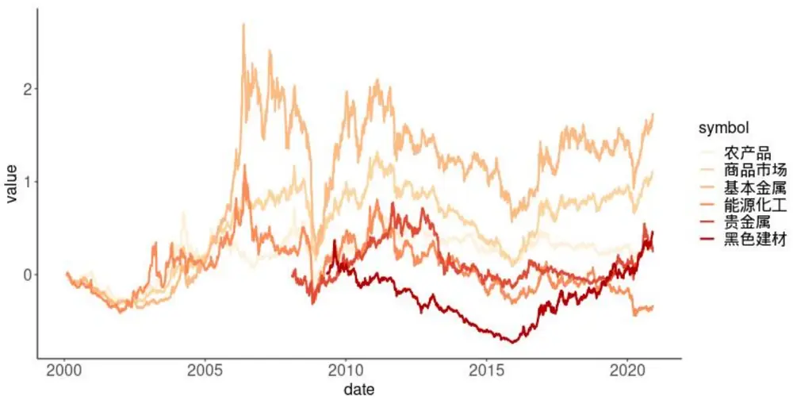
数据来源：天软 华泰期货研究院

板块的月均持仓金额（亿元）
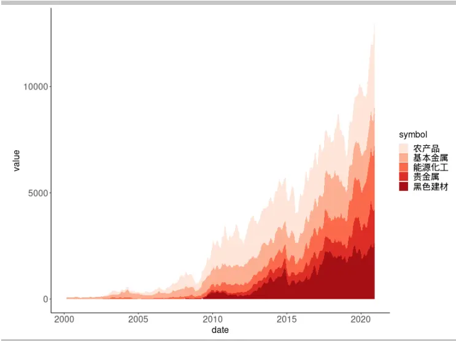
数据来源：天软 华泰期货研究院

板块的月均持仓金额占比
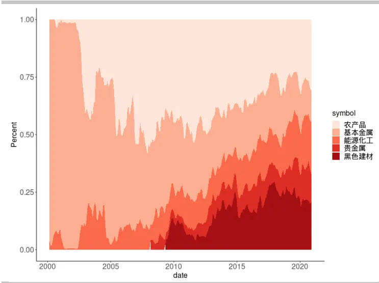
数据来源：天软 华泰期货研究院

2020 年板块收益率以及月均持仓金额增长情况（截止 2020-11-25）
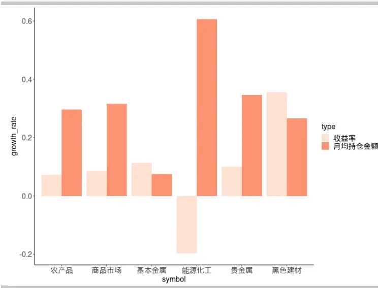
数据来源：天软 华泰期货研究院

与 wind 板块分类的相关系数（2010 至 2015 年）
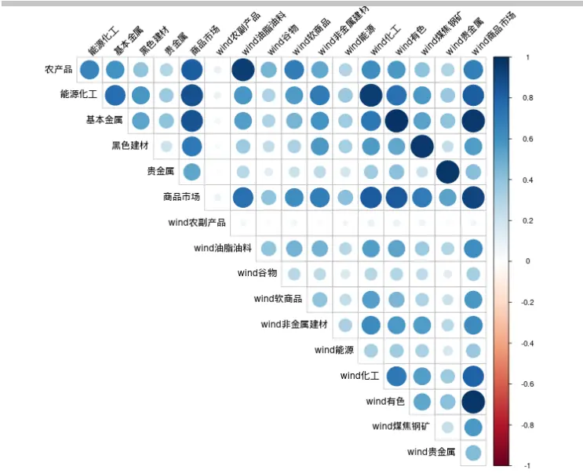
数据来源：Wind 天软 华泰期货研究院

与 wind 板块分类的相关系数（2016 至今）
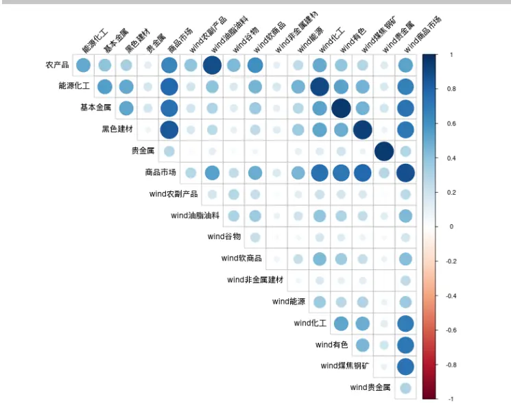
数据来源：Wind 天软 华泰期货研究院

## 3.3 构建截面因子

当我们针对单一金融市场（特别地，绝大部分纳入考虑的投资工具可使用单一货币投资）建立多因子模型，一般只包括（工业/商品）板块因子和风格因子，而不包括国家因子。然而，截面回归方法则可以自然的引入国家因子，这为解析关键的国家系统性风险提供了解决方案，同时也极大促进了模型对于系统性风险的预测能力：

1) 国家因子可以近似看作市值（商品对应持仓市值）加权的全样本组合。

2) 国家因子可以将单一工业/商品板块因子的影响剔除；换句话说，剩余的板块将看作做多板块本身而对应做空国家因子, 因子特征将保留只属于该行业本身的发展状况，而排除了整体市场的影响。

3) 国家因子去除了风格/宏观因子的影响，但同时为研究市场内部风格转换，以及风格与国家因素的联动提供了更为清晰的脉络。实际上，某些风格因子之间的剧烈转换往往是国家级风险的先行信号。

4) 国家因子剥离能够提供更全面和更准确的系统性风险预判。

我们的股票国家因子与沪深 300 指数的相关性约为 98%；商品国家因子与华泰全商品指数的相关性约为 93%, 与Wind全商品指数相关性约为87%。

我们注意到，商品国家因子和市值加权的基础指数相关性低于股票国家因子，这与商品因子制作过程所采用的投资工具本身价格不连续有关。商品投资的工具为场内期货合约，每个合约都有明确的交易起始日和到期日，在数据处理过程中，需要使用合理的连续价格处理方法。这里我们采用了自主研发的连续合约方法，与市面上的常见合约并不完全相同。我们的合约连续价格更多考虑到了真实投资可行性（如流动性）而非简单价格连续；在主力合约移仓阶段，合约切换的时间点上则考虑了流动性溢价与滚动收益率的分离。从商品因子角度，也可以看作风险敞口驱动因素的分离，降低因子间的相关性，更准确把握独立的风险敞口。进一步，合约使用的差异也造成了商品国家因子与华泰全商品指数，和与Wind指数相关性的差异。需要指出，我们连续合约的制作方法近几年来已经应用到了商品投研的多个领域，除了这里的商品风格因子和商品板块因子，同时还包括了 CTA策略、套期保值等方面。

商品风格因子与股票风格因子的市值中性化方法类似，采用去掉品种持仓市值加权因子暴露均值的方式，从而得到纯因子（pure factor）。这样的纯风格因子实际对每个板块都保持中性暴露，并且尽量做到保持独立性不易受其他风格因子的影响。但是完全做到风格因子独立还需要使用下文提到的方法去掉风格因子共线性。

从商品基础因子的构造方法中，不难看出，尽管因子反映的市场特征各不相同，但是若干因子的制作方式比较类似。这为建立以风格暴露为基础的截面类型因子带来了较大的困难。首先，从市场观测的角度来看，我们希望每一个风格因子表示的风险敞口能尽量独立，于是为我们分析商品投资的收益/风险来源提供直接的数据依据。其次，从截面回归分析的角度来说，当多因子模型中存在因子可能被其他多个因子替代，也就是具有过度的共线性（collinearity），那么截面多因子收益率的计算误差有可能非常大，进而难以获得可信的因子数据。

面对共线性问题，我们针对不同的原因可以有不同的处理方法。假如若干因子背后的主要驱动力较为接近，那么我们可以通过合并因子的方法来有效去掉共线性，同时保留这类因子主要的波动特征。另一个共线性的原因则正好相反，虽然因子值的算法接近，但驱动因素可能有显著差异。那么，这种情况下，我们将保留风险溢价特征较好的因子，同时将与其共线性较高的因子做去共线性处理，得到新的因子。

上述两种共线性问题在期/股因子中都普遍存在。其中，在权益类因子制作过程中，第一类情况较为突出，比如使用较为接近的财务类数据制作因子，通常我们会将多个近似数据做合并处理，得到单一因子。而在商品领域第二类情况较为常见，我们将采用在因子暴露中

（而非因子收益率）去掉共线性，从而保持因子的相对独立。最终在截面回归计算完成后，需要对比多因子之间收益率是否能够保持较低的相关性。

举例来说，商品value因子和商品term strucutre因子之间的相关性较高。商品value因子单独的风险溢价特征更适合投资应用，我们将在 term strucutre 因子的品种暴露中去除 value因子的共线性部分，然后再通过截面回归得到因子收益率。在去掉共线性之前，商品 value因子的收益率和term structure因子的收益率接近-0.79，高度负相关; 而在去掉共线性之后，相关性降为-0.04。而实际上，去掉共线性的多因子组的解释力不降反增，在去掉共线性之后，因子组的解释力（Rsq）提升了约 7%。

另外，为了保证多因子模型的持续有效性，需要对因子暴露做异常值处理。需要强调，尽管我们对原始数据的质量已经做了相当多的测试和质量管控，但是依然不能排除出现极端异常值的情况。这些零星出现的异常值可以是真实的市场价格，也有可能是数据采集误差，但是它们都有可能对模型的稳定性造成剧烈冲击。所以，我们将利用统计的方法，将离统计分布中心最远的数值做最远边界替换处理。

通过对因子暴露做了上述的一系列数据处理之后，我们最终得到了商品市场+沪深 300多因子组的多因子模型。

其多因子收益率的历史相关性（2010-06 至 2020-09）如下图所示：

多因子收益率的历史相关性（2010-06 至 2020-09）
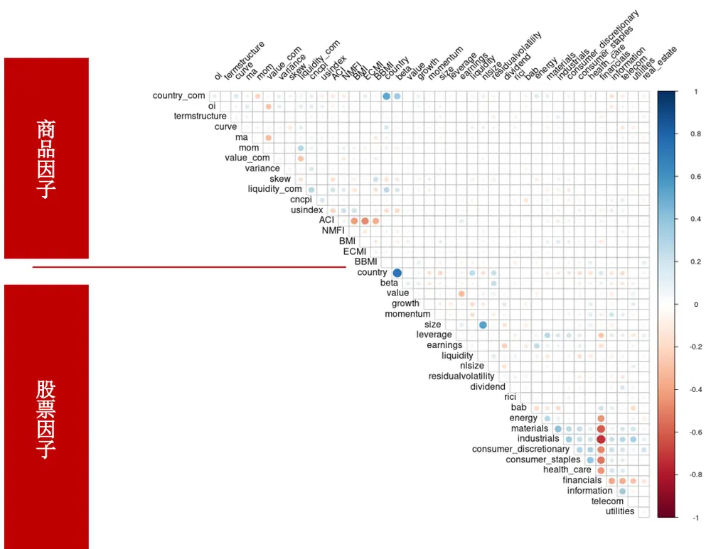
数据来源：天软 同花顺 Wind 华泰期货研究院

上节提到的 term structure 与 value 因子的高度相关性，在经过去共线性处理之后，从整个历史长度来看已经不复存在。同类型资产的风格因子中依然保留一定程度相关性的是：股票国家因子与股票 beta 因子；股票 size 与非线性 size 因子。 板块因子之间的相关性也较为明显：其中在商品领域，农产品与其他板块存在明显负相关性，其他板块之间相关性很低；在股票当中，金融板块与其他板块保持负相关，同时剩余板块之间则有正相关性。所以，这里商品板块的风险分散化特征明显高于股票板块。

商品国家因子和股票国家因子之间也存在较高的相关性，并且逐年上升--从全部历史数据估算值的 0.52 上升到近 3 年的 0.61，再到今年以来的 0.78。这多少有点让人意外，因为，一般认为大宗商品和股票是差异性较大的不同类型的风险资产。但实际上，我们认为这是国内金融市场投资逐渐成熟，跨资产类型投资方式越发多样化的体现。首先，商品/股票国家因子都已经剔除了市值中性化的风格因子和板块因子的影响，可以看作是国家类型的单因子（pure factor）的影响。而仅对国家因子的暴露实际上相当于人民币投资国内金融市场的整体收益来源和风险敞口。比如今年以来，权益和商品市场同时发力，就是对我国疫情控制有力，经济发展充满活力和韧性的一次集中的市场回馈--既包含了制造业受到冲击以后的迅速复苏的真实状况，也体现了投资人预期中国未来经济保持上行的乐观态度。其次，我们也看到业界对大宗商品投研逐渐深化[5]，利用商品配置作为投资方式的模式也在逐步成熟，这也是我们商品因子未来的一个重点应用方向。同时，我们也关注在这样期股联动性逐渐强化的条件下，系统性风险管控在面对来自更多方向的金融风险冲击下的挑战将更为严峻。

另外，尽管期/股国家因子间相关性在升高，但是商品与股票的风格/板块因子之间整体上还是能够保持着较低的相关性。从资管角度来看，通过跨资产类型配置以分散风险的模式依然是较好的投资模式。从投研角度来说，相同的模型构建逻辑，近似的因子暴露制作方式，可做类比的数据结果，也为我们应用统一的标准化数据研究和创造新的权益资产加大宗商品投资模式打开了一扇大门。而在标准化期股多因子数据基础上深挖期股之间的联动关系，（商品/行业）板块之间的轮动关系也将是后续我们投研的关键领域。（近 3 年和今年以来的期股因子相关性见年报下篇）

## 3.4 因子测试

商品指数的单因子测试项目如下：

1） R 平方（R2）

$$
\mathrm{R}^{2}=\frac{\mathrm{SSR}}{\mathrm{SST}}
$$

其中，SSR为预测数据与原始数据均值之差的平方和，SST为原始数据与原始数据均值之差的平方和。 $\mathrm{R}^{2}$ 的取值范围为[0,1]， $\mathrm{R}^{2}$ 越接近1，表明解释变量对被解释变量的解释能力越强，模型拟合效果越好。

## 2） 信息系数（IC）

IC 代表的是预测值和实际值之间的相关性，通常用于评价预测能力。IC 的取值范围为[-1，1]，IC 的绝对值越大，表示预测能力越好。Positive ratio衡量多空方向判断的准确率。

3） t 值

t值用于判断每个自变量的显著性，t值绝对值大于由置信水平和自由度得出的值时，认为在其他解释变量不变的情况下，解释变量对被解释变量的影响是显著的。

4） p 值

回归分析中的 p 值是针对回归系数为 0 的假设性检验得出的，对于置信水平α，p 值< 1 −α则拒绝H ，即认为解释变量对被解释变量的影响是显著的。

## 5） 贝塔值（Beta）

贝塔也叫偏效应，表示控制其他解释变量不变的情况下，解释变量x 增加一单位时被解释变量的变化量。贝塔值（绝对值）越大，说明该解释变量的回归系数（绝对值）越大，与被解释变量的敏感度越强。

表格 1: CCFI 对各个因子的测试结果

| factor_symbol | betas | power | Rsquared | Tvalues | Pr(>\|t\|) | pvalue | IC | positive_ratio |
| --- | --- | --- | --- | --- | --- | --- | --- | --- |
| country | 0.0017 | 100.00% | 93.12% | 40.81 | 0.00% | 0.00% | 9.15% | 51.22% |
| BMI | 0.0022 | 94.36% | 9.34% | -3.70 | 0.03% | 0.03% | -1.34% | 46.34% |
| usindex | 0.0008 | 92.30% | 8.59% | -3.54 | 0.06% | 0.06% | -2.70% | 48.78% |
| NMFI | 0.0009 | 62.33% | 4.06% | -2.49 | 1.40% | 1.40% | 5.68% | 52.85% |
| oi | 0.0022 | 58.65% | 3.74% | 2.40 | 1.77% | 1.77% | 4.68% | 52.85% |
| value | 0.0000 | 35.82% | 2.05% | 1.89 | 6.13% | 6.13% | 0.73% | 51.22% |
| ECMI | 0.0014 | 18.03% | 0.88% | 1.45 | 15.07% | 15.07% | 1.49% | 51.22% |
| termstructure | 0.0017 | 11.78% | 0.47% | -1.26 | 21.15% | 21.15% | -11.77% | 47.97% |
| mom | 0.0017 | 8.60% | 0.25% | -1.14 | 25.45% | 25.45% | 1.15% | 47.15% |
| cncpi | 0.0015 | 5.45% | 0.03% | 1.02 | 30.99% | 30.99% | 3.17% | 48.78% |
| ma | 0.0019 | 5.00% | -0.02% | -0.98 | 32.66% | 32.66% | -4.16% | 47.15% |
| liquidity | 0.0011 | 5.00% | -0.13% | 0.92 | 36.12% | 36.12% | 9.87% | 52.85% |
| ACI | 0.0015 | 5.00% | -0.58% | 0.54 | 58.96% | 58.96% | -3.55% | 49.59% |
| skew | 0.0015 | 5.00% | -0.76% | -0.27 | 78.60% | 78.60% | 13.35% | 55.28% |
| variance | 0.0015 | 5.00% | -0.81% | 0.12 | 90.10% | 90.10% | 5.22% | 47.97% |
| BBMI | 0.0015 | 5.00% | -0.81% | 0.12 | 90.72% | 90.72% | 8.55% | 53.66% |
| curve | 0.0015 | 5.00% | -0.82% | 0.05 | 96.34% | 96.34% | 11.28% | 53.66% |

资料来源：天软 Wind 华泰期货研究院

## 3.5 大宗商品因子模型

这一类因子的影响力一般都偏向于中低频（如周频和月频调仓），其应用场景偏向于中长周期，投资的范围可覆盖整个市场，投资风格因子或板块（如指数类型组合），以配置方式持仓。具体的应用角度还可以延展到商品板块对应的股票组合（对冲或强化收益）；宏观对冲投资（投资经济周期、商品板块投资、对冲市场通胀等）；全球商品配置（商品国家因子相对强弱或宏观因子对比）等。

资产协方差矩阵对于多因子组合的构建和风险管理都是至关重要的。估计资产协方差矩阵的一个关键挑战在于维度数木。例如，一个包含 2000只股票的活跃投资组合需要超过200 万个独立元素；如果观察时间的数量小于股票的数量，这个矩阵不是满秩矩阵，无法求出其逆矩阵。

多因子模型为这一问题提供了更可靠的解决方案[8]。商品收益被归因分解到基于暴露程度的商品因子收益和每个商品品种独有的特异性收益率上：

$$
\mathrm{r_{n}=\sum_{k}X_{nk}f_{k}+u_{n}}
$$

其中 ${\tt X}_{\mathrm{nk}}$ 是商品n对因子k的暴露程度， $\mathrm{f_{k}}$ 是因子收益率， $\mathtt{u_{n}}$ 是商品n的特异性收益率。

商品n权重为 $\mathbf{w_{n}}$ 的投资组合收益率为

$$
\mathsf{R}_{\mathrm{P}}=\sum_{\mathrm{n}}\mathsf{w}_{\mathrm{n}}\mathsf{r}_{\mathrm{n}}
$$

投资组合的因子暴露为各资产因子暴露的加权平均数，即

$$
\mathrm{X_{k}^{p}=\sum_{n}w_{n}X_{nk}}
$$

因此，投资组合的收益率为

$$
\mathrm{R_{P}=\sum_{k}X_{k}^{P}f_{k}+\sum_{n}w_{n}u_{n}}
$$

Barra模型考虑一个国家因子、多个行业因子和多个风格因子。对于给定某一期截面数据（T期），在截面回归时，Barra采用期初的因子暴露取值（即T-1期末因子暴露值）和商品在T 期的因子收益率进行回归。T-1 期末因子暴露可由时间序列得到。具体做法为：

在每一时刻，根据各因子的投资组合策略，可以得到每一时刻的基础因子收益率，通过时序回归可以得到各商品的因子暴露

$$
\Upsilon_{\mathrm{n,t-1}}=\beta_{\mathrm{n}}\mathrm{f}_{\mathrm{t-1}}
$$

其中， $\mathrm{Y}_{\mathrm{n,t-1}}$ 为 t-1 期商品 n 收益率， $\mathrm{f}_{\mathrm{t}-1}$ 为 t-1 期基础因子收益率， $\beta_{\mathrm{n}}$ 为通过回归得到的商品 n 在 t-1 期末的因子暴露。由全部 $\beta_{\mathrm{n}}$ 可组合得到 t-1 期末全商品因子暴露矩阵 $\mathrm{X}_{\mathrm{t}}$

$$
\mathrm{Y_{t}}=\mathrm{X_{t}f_{t}}+\mathrm{u_{t}}
$$

通过截面回归的到截面因子ft。

## 四、 期股联动

## 4.1 中性板块相关性

在前面的探索中，我们已经观测到股票国家因子和商品国家因子之间具有很高的相关性。更进一步地，我们会考察期股之间板块的相关性（如下图所示）。股票板块内金融板块与除了房地产以外的板块之间都存在着负相关，其中以与工业的负相关最为明显。商品板块内农产品与基本基本金属，黑色建材以及能源化工板块都存在着一定的负相关。综合来看，商品和股票板块之间的相关性并不明显，但需要注意的是这里的相关性指的是中性板块之间的相关性而不是真实板块之间的相关性。

商品和股票板块之间相关性
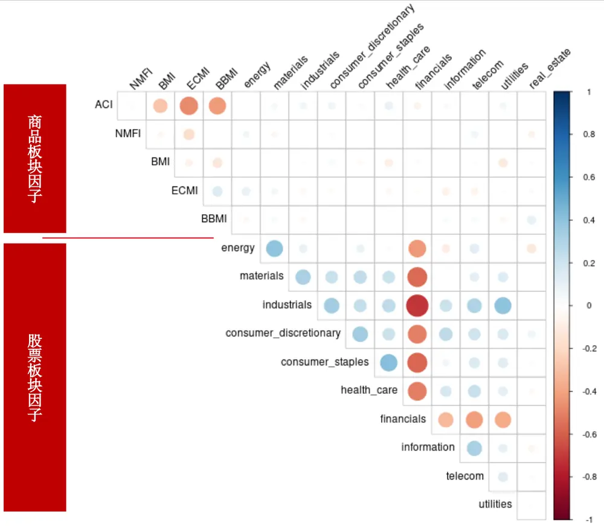
数据来源：天软 同花顺 Wind 华泰期货研究院

一般来说，股票和商品之间的联动一般会从宏观因素的影响和产业链价格传导两个角度去探索。商品国家因子和股票国家因子的高相关性很大程度上印证了商品和股票对宏观环境反应的一致性。进一步思考，对上市公司而言，商品是原料端。其价格的变化就是上市公司的成本的变化，从而对公司的利润，高层的决策等造成一系列的连锁反应。因此我们希望从产业链价格传导的角度探索，从数据上看到商品板块与股票板块之间的领先滞后性的特征。

如下图所示，为长周期上，材料板块与基本金属之间的协相关性图。可以看到在长周期上，基本金属领先于材料板块（判断这一特征的依据是：材料板块数据和基本金属板块数据经

过多周期分解后，在长周期的协相关性图中，出现最高点且最高点对应 lag 天数大于 0）。
也就是说，在长周期上我们可以看到基本金属与材料板块之间的领先滞后特征。

材料（股票）与基本金属（商品）之间的协相关性
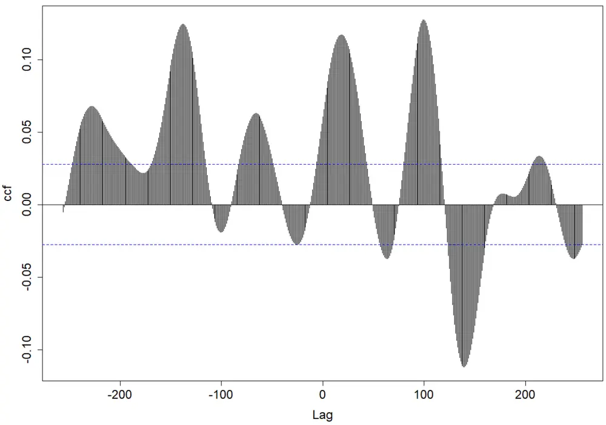
数据来源：天软 同花顺 华泰期货研究院

## 4.2 板块与风格因子相关性

延续之前的探索方式，我们从风格因子的角度出发，去探索期股联动的一些特征。

首先从相关性的角度来看，整体来说，股票风格因子与商品的风格因子之间，股票风格因子与商品中性板块之间均没有较高的相关性。

商品板块、商品风格因子及股票风格因子之间相关性
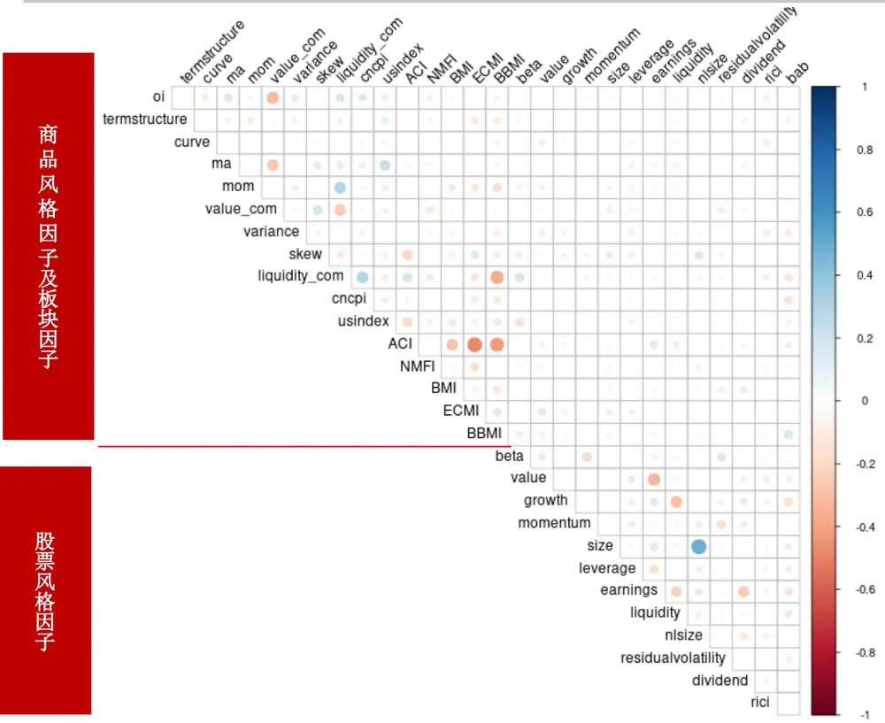
数据来源：天软 同花顺 Wind 华泰期货研究院

进一步，考察股票风格因子与商品风格因子之间在长周期上的的领先滞后特征。我们以商品期限结构因子和股票 beta因子为例。商品期限结构因子里蕴含着投资者对经济的预期的信息，而beta因子中也蕴含着投资者对未来经济的预期的信息。如下图所示，我们考察了商品期限结构因子和股票beta风格因子之间的协相关性，可以看到 beta因子领先于商品期限结构因子，即仅从数据角度出发，股票投资者对经济的预期提前于商品投资者对经济的预期。

期限结构因子（商品）和 beta 风格因子（股票）之间的协相关性
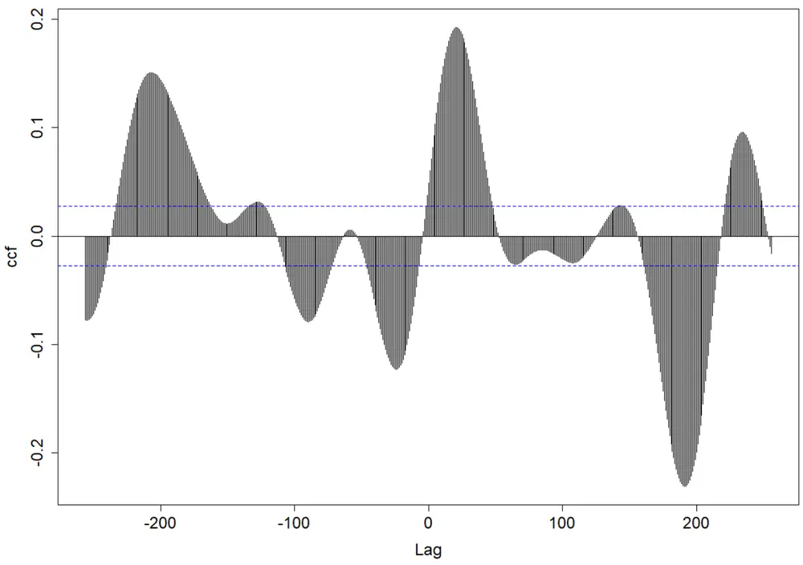
数据来源：天软 同花顺 华泰期货研究院

## 五、 AI 模型应用

该部分的测试中针对不同商品板块的因子重要性列表以及更多随机森林与深度学习的结果将在年报下篇展示。

## 5.1 深度神经网络模型介绍

前述的数据分析方法和期/股截面因子，为我们最后应用AI模型提取预测信息提供了坚实的数据基础。为此量身定制的决策树和随机森林等模型，为不同标的物锁定有效的因子组合；深度学习方面，则针对多周期分解后的因子数据特征，设计合理的模型拓扑结构，利用场景学习概念建模。

因此，本部分首先对后续使用到的深度神经网络模型作出背景介绍。深度神经网络模型追根溯源就是拥有多个隐藏层的神经网络模型，它是人工智能（AI）大框架下的一部分，因此想要了解以及应用深度神经网络，就必须先涉足神经网络。

深度神经网络模型与 AI
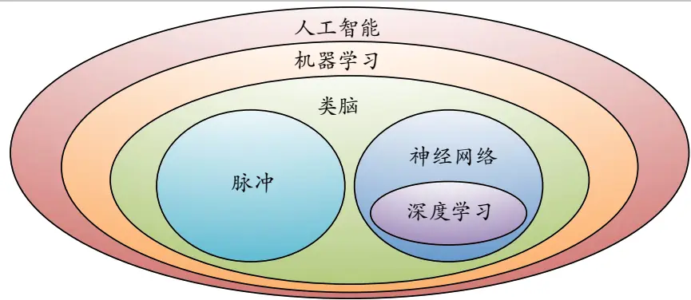
数据来源：华泰期货研究院

## 1）神经网络模型介绍

神经网络的灵感来自于这样一个概念：大脑神经元对输入值进行加权求和计算，这些加权得到的结果对应于大脑内由于突触进行的缩放以及神经元进行的组合。并且，神经元不是简单的线性求和，相反由于其内部的特殊结构，仅当输入超过某个阈值时，神经元才会生成输出。因此通过类比，神经网络模型也会具有这种非线性函数的特征。

而在一个神经网络结构中，如果其中的隐藏层层数较多（一般指超过 3层），这样的神经网络模型就可以被称为深度神经网络。更进一步，对每个隐藏层设置特定结构、对权重共享方式做特殊处理，等等这些手段都会再次深化深度神经网络模型，这些精心设计的模型也都具有各自独特的优势，我们会在第二部分进行详细的说明。

简单神经网络样式
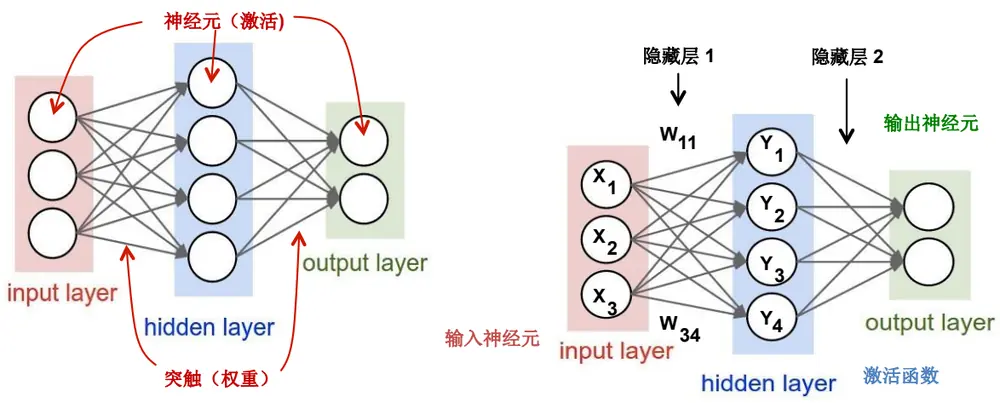
数据来源：华泰期货研究院

作为模拟突触及神经元这一人类大脑系统的模型来说，神经网络模型集感知、推理、学习、和行动于一体，试图从各个角度汲取丰富的信息，学习像人类一样思考，并且做出相应的决策。它作为一门新兴学科，集百家之所长，分别在航天工程，管理和储存，机器人技术，决策系统，自动化程序设计，医学诊断，控制系统，问题求解和语言理解等诸多方面得到了广泛的应用。

在金融领域，神经网络模型的运用也已经十分广泛。以欺诈检测为例，以往金融欺诈检测系统非常依赖复杂和呆板的规则，面对现今一些越来越高明金融欺诈行为时，越来越显的力不从心。而这正是AI模型在防范金融欺诈方面的用武之地，借助机器学习，系统可以检测出异常的活动或行为，并将它们自动发送给安全团队。

在借贷/保险承销方面，目前人工智能的表现也非常好，依据数以百万的消费者数据（年龄，职业，婚姻状况等），金融借款和保险情况（是否有违约记录，还款时间，车辆事故记录）等这些信息训练出机器学习算法，能够为潜在客户精准画像。

## 2）常见的深度神经网络模型

## 全连接神经网络

根据应用情况的不同，深度神经网络的形态和大小也各异，所有深度神经网络的输入是对一套数据集经过分析处理后的特征值，而处理输入的网络主要有两种主要形式：前馈以及循环。在前馈网络中，所有计算都是在前一层输出基础上进行的一系列运作，最终一组运行就是网络的输出，这就是最简单的全连接神经网络模型，如果隐藏层具有多层，那么又叫深度神经网络模型（deep neural networks，dnn）。

在全连接 dnn的结构里，所有下层神经元和所有上层神经元都能够形成连接，带来的潜在问题是参数数量的膨胀，这不仅容易过拟合，而且极容易陷入局部最优。并且在一些特定的应用场景，比如人脸识别中对于人脸一些固有的模式，dnn 并没有完全利用。

## 卷积神经网络

对于卷积神经网络（convolutional neural networks，cnn）来说，就不是所有上下层神经元都能直接相连，而是通过“卷积核”作为中介。卷积运算是一种数学计算，和矩阵相乘不同，卷积运算可以实现稀疏相乘和参数共享，可以压缩输入端的维度。因此和普通 dnn不同，cnn 并不需要为每一个神经元所对应的每一个输入数据提供单独的权重。卷积神经网络的精髓其实就是在多个空间位置上共享参数，与人类的视觉系统存在类似的模式。

卷积神经网络结构
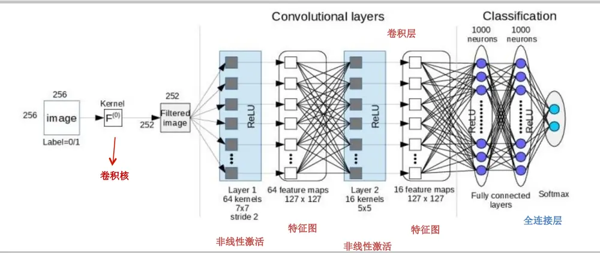
数据来源：华泰期货研究院

## 循环神经网络

如果说cnn是在空间上对dnn进行了优化，那么循环神经网络（recurrent neuralnetworks，rnn）就是在时间上对dnn进行了优化。当我们对新事物进行思考时，其实并不每次都是从零开始，过往的经验总会给我们一些启发。对于一段连续的语音、一篇连续的文章，我们可以根据句子的开头去猜测结尾，但传统的神经网络却很难做到这一点。rnn正是处理这一系列问题的专家。rnn 的前身是 1982 年由 John Hopfield 提出的 Hopfield模型，由于实现困难外加没有合适的应用领域，一直没有得到学界重视，近年来由于自然语言处理的需求，rnn 得以深度发展。

循环神经网络与传统深度神经网络模型（dnn）最大不同之处是加入了对时序数据的处理。以股票多因子为例，dnn将某支股票某一时间截面的因子数据作为输入值，下期超额收益作为输出值；而 rnn是将某支股票的长期因子数据作为时间序列，取过去一段时间内的数据作为输入值。这样做最大的好处便是保持了信息的持久化，这和我们的直观感受也是相符的，正如古希腊哲学家修昔底德所说的一样，“历史会重演”。

更进一步的 lstm（long short term memory）模型由 Hochreater 和 Schmidhuber 在 1997 年提出，主要是为了处理 rnn在时间维度上的梯度消失问题，对于t时刻来说，它产生的梯度在时间轴上向历史传播几层之后就消失了，根本就无法影响太遥远的过去。而 lstm通过门的开关实现时间上的忆功能，并防止梯度消失。

## 5.2 深度神经网络模型构建

本文将探讨以全连接为基础的深度神经网络模型，包括搭建方式，数据应用和测试结果。如前文所述，我们的数据处理大量使用了多周期分解方法，这里的建模数据也不例外。围绕本文一开始提出的第二个核心问题，我们的解决思路将会充分利用深度神经网络模型的灵活性，借助模型的设计结构（分层和节点）最大程度学习数据特征。具体来说，我们将针对不同周期数据首先采用多节点输入，然后平行学习各自周期的驱动因素所蕴含的数据信息，接着再合并节点数据，最后做出预测判断。所以我们的MLP 模型的构建方式从一开始就需要考虑具有一定复杂度的拓扑结构，而非简单的连续型（sequential）模型。

我们使用的特征因子仅限于本文涉及到的股票/商品因子组；也就是说包括国家因子，商品宏观量化因子，风格因子以及板块因子。需要说明的是，正如我们在年报一开始提到的，金融市场是一个复杂体系，可能包含了不同影响烈度，不同影响时长等多种因素。而截面回归类型的因子，一般称作 Beta类型的因子，在一定经济学意义的支撑下具备较好的整体市场解释力和持续影响力。

进一步，在使用特征数据时，将充分考虑模型预测的时效性能力，比如这里通过随机森林模型，筛选出来对于商品板块预测能力较有效的因子，并且与随机森林的预测效果进行对比。

在我们的研究中，利用 API 工具（Keras/Tensorflow），来搭建图形类深度学习模型（graph-like model）。

多个输入节点，单一输出结果（平行学习层+汇合学习层）
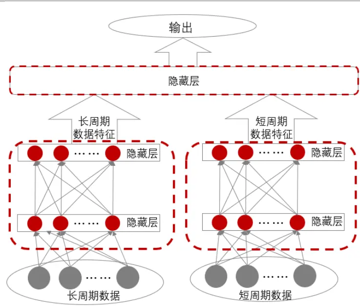
数据来源：华泰期货研究院

多个输入节点，多个输出结果（平行学习层+汇合学习层）
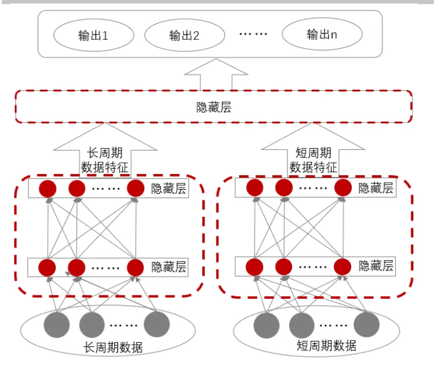
数据来源：华泰期货研究院

## 5.3 因子重要性判断

## 随机森林介绍

在上一篇年报以及后续的一系列研究报告中，使用随机森林算法去筛选重要因子这一方法被我们广泛的使用。相较于传统的线性方法，使用随机森林这一方法最大的优势在于可以挖掘数据间的非线性规律。

随机森林算法的基本组成元素是决策树，决策树算法具有效率高，处理的信息量大等优点。但同时，决策树本身依然有着不可避免的局限性，如对缺失值不敏感，数据容易过拟合等。随机森林算法采用对多颗决策树进行随机的排列组合这一方式，不仅增强了模型的鲁棒性，也提高了分类的准确性。

随机森林原理示意图
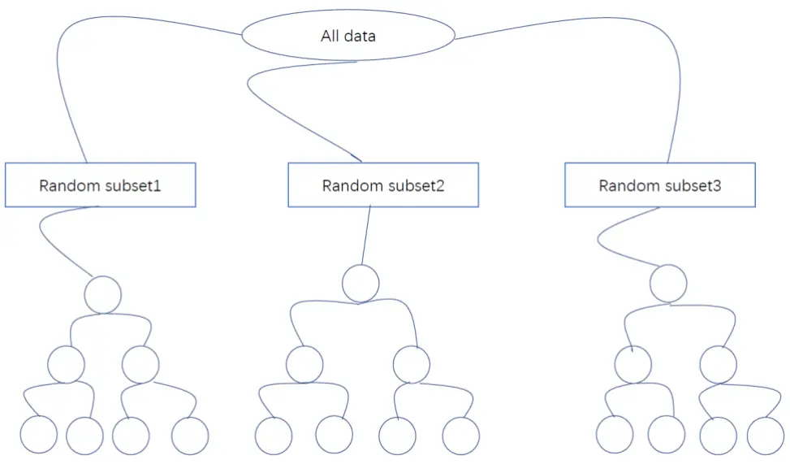
数据来源：华泰期货研究院

随机森林的主要原理如上图所示。首先，我们对所有数据做 bootstrap 处理，然后采用 bagging抽样。训练集相比原始数据而言，只有63%的数据被重复抽取，而有37%的数据从未出现。使用这样的方法可以替代数据集交叉验证法，同时也避免了过高的时间空间复杂度。Bagging 抽样是有放回的抽样，即每棵树的数据集是由原始数据集随机构成，可能重复包含某些数据，也可能不包含某些数据。接着，随机森林会随机选择特征子集。在树的节点分裂时，会随机无放回的选择总属性的子集，这个子集的大小会远远小于总属性特征的数量。最后，我们会根据对每棵树的评分来对特征的重要程度进行划分。

## 因子重要性评判指标

随机森林或者说集成学习模型的一大特点是可以输出因子的重要性。下图为因子重要性图，其计算方式是根据树生长过程中，不同变量作为节点分裂参数带来的 loss 函数的优化。左图为 MSE上升的因子排序，右图为平均因子纯度上升（回归）。MSE 上升指的是将某个因子剔除后，MSE 的上升情况；平均因子纯度上升指的是因子节点分裂后纯度的提升均值。从这两个指标来看，商品国家因子，中国 CPI 因子以及股票国家因子对商品（CCFI）的影响力居于前三的位置。

因子重要性示意图
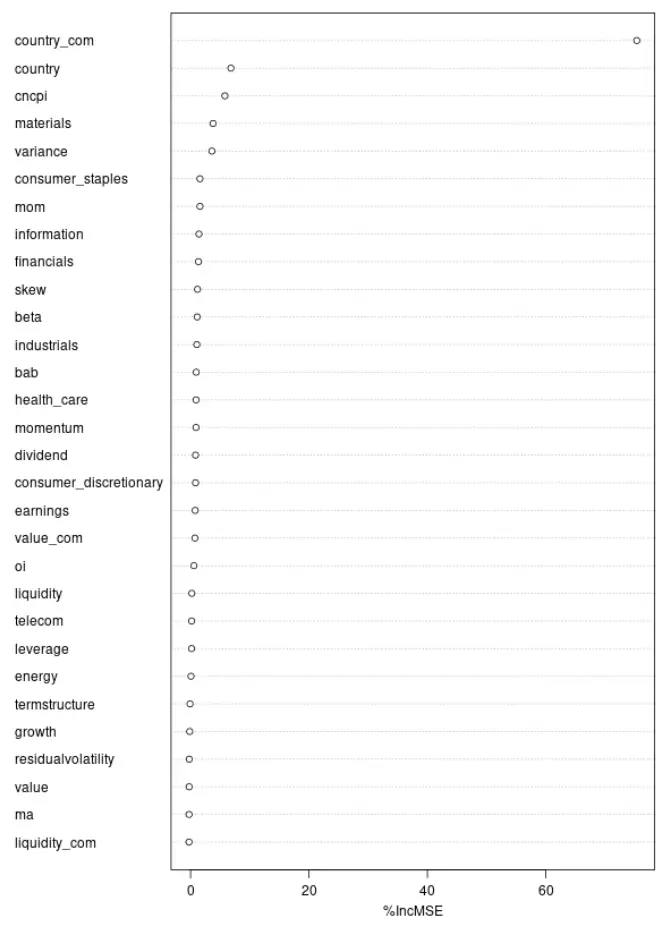
train_output

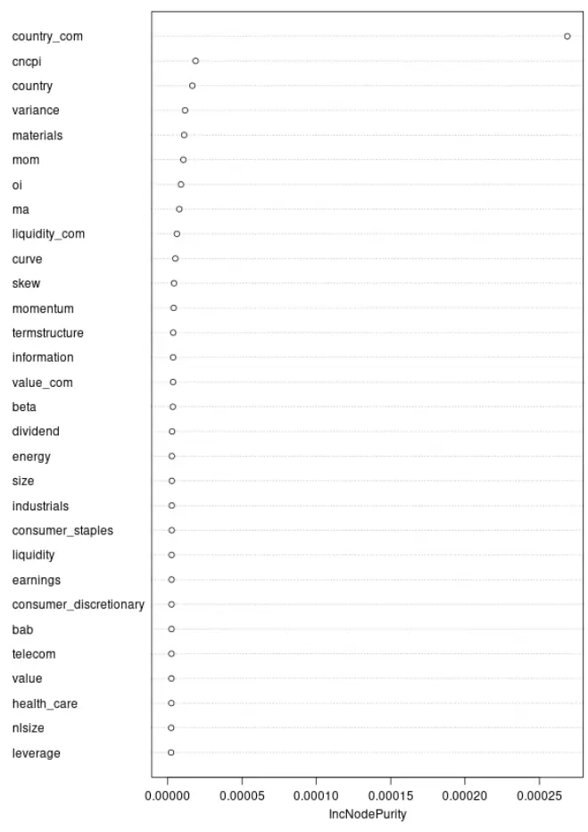
数据来源：天软 同花顺 Wind 华泰期货研究院

最浅分裂节点（distribute of minimum depth）分布是在树生长过程中，最早出现在分裂节点处的因子的分布。也就是说如果一个因子越接近树根，这个因子就越重要。需要指出的是最浅分裂节点并不直接依赖于误差率的计算，而是依赖于树形的拓扑结构以及在森林中的分布。从下图可以看到，商品国家因子，中国 CPI 因子以及国家因子对商品（CCFI）的影响力依然最大。

最小分裂节点示意图
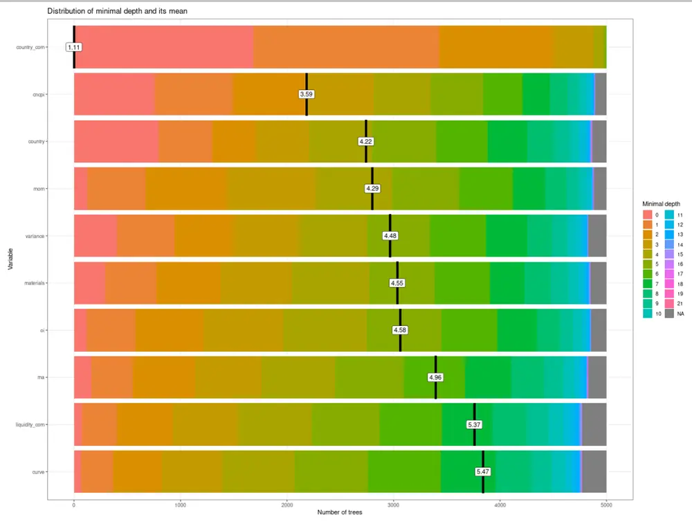
数据来源：天软 同花顺 Wind 华泰期货研究院

随机森林算法分为回归和分类两种方式。针对两种方式的不同，对因子重要性的评判标准也会有着不同。当采用回归的方式时，平均最小分裂节点和因子纯度上升是主要考量因子重要性的两个指标。简单来说，平均最小分裂节点越小，因子纯度上升越快，该因子就越重要。当采用分类的方式时，平均基尼系数降低和平均最小分裂节点这两个指标是我们衡量因子重要性的标准。类似地，平均基尼系数降低的越快以及最小分裂节点越小，该因子就越重要。

在具体数据测试过程中，我们会选用截面回归得到的商品因子以及股票因子作为特征量，使用商品板块指数的收益率作为标的物进入随机森林模型。在随机森林模型中，最重要的一个超参数就是训练时候对树的棵数的选择。如果树的棵数选择较少，往往最后的结果不会收敛，模型效果达不到最优；如果选择树的棵数较多，则会出现训练速度慢的弊病。因此，在森林类模型中，确认一个合适的树的数目是进行随机森林测试的第一步。本文首先设置了一个较大数值（10000）作为树的棵数并得到了如下结果：

表格2: 平均 rmse 和平均胜率随着树颗数增长表现

| 树的棵数 | 平均 rmse | 平均胜率（%） |
| --- | --- | --- |
| 1000 | 0.00146990 | 64.42 |
| 2000 | 0.00147006 | 64.55 |
| 3000 | 0.00146997 | 64.42 |
| 4000 | 0.00147014 | 64.18 |
| 5000 | 0.00147043 | 64.30 |
| 6000 | 0.00146986 | 64.42 |
| 7000 | 0.00146971 | 64.36 |
| 8000 | 0.00146988 | 64.30 |
| 9000 | 0.00146996 | 64.42 |
| 10000 | 0.00147000 | 64.42 |

资料来源：Wind 华泰期货研究院

从表中可以看到，在森林的棵树等于 6000 的时候，平均 rmse 以及平均胜率都已收敛。所以，针对这里的实测对象，森林数目达到 6000-7000棵树就可以保证模型的收敛。针对其他标的物的收敛性测试都将采用相同的方法。

## 5.4AI模型预测结果对比

在利用随机森林挑选出最优（长/短周期）因子组合之后，我们对比随机森林和深度学习模型的预测能力。

测试数据如下：

标的物：华泰商品 5 板块指数周度收益率（2010-06 至 2020-09）；

训练集：前 70%的周度标的物收益率；

测试集：近 3 年约 30%的周度标的物收益率；

特征集：标的物长/短周期尺度上对应最强影响力截面因子；

预测目标：下一周标的物涨跌；

预测胜率结果如下：

表格3：商品板块指数预测结果对比（随机森林 vs.深度神经网络）

| 随机森林预测 | 深度神经网络 |
| --- | --- |
| 农产品指数 58% | 56% |
| 基本金属指数 | 51% 58% |
| 黑色建材指数 56% | 55% |
| 能源化工指数 | 53% 56% |
| 贵金属指数 | 49% 57% |
| 预测胜率均值 53.4% | 57.2% |

资料来源：天软 华泰期货研究院

从预测结果我们可以看出深度神经网络具有更优的预测效果，并且对于所有商品板块都可以达到几乎同等程度的预测效率。而随机森林模型尽管也能取得一定的预测效果，但是对于影响因素复杂的标的物预测效果明显较差。

我们认为，随机森林这样的浅度学习模型很难提取数据中更复杂的模式，比如在预测未来下下周收益率涨跌时，其预测能力迅速衰退。而深度神经网络模型似乎可以学习到差异性的价格传导机制，在多个输出节点的模型中，依然有机会针对某些标的物做出下下周的有效预测。（在年报下篇中，我们会继续展示深度神经网络预测多步的结果）

## 六、 总结

任何充满机遇和挑战的时代都容不得懈怠与逃避。面对新世纪第一个庚子年全球金融市场动荡，大宗商品量化研究模式也受到了前所未有的挑战。被颠覆的不仅有许多“成功的”过往经验，也包括了商品研究体系的合理性。这促使我们对自己反思量化投研方法需要达到核心投研目标，并在开篇为自己准备了两个问题。对数据蕴含信息的进一步挖掘，让我们开阔了思路，寻找更有效的数据分解方法，探索不同周期尺度上，不同商品板块的价格主导驱动因素。而为了同时应对复杂的内外部环境变化带来的风险及投资机会，我们首次推出了商品多因子模型，包括时序基础因子和全市场截面因子。

商品截面因子既有与股票因子相似的国家因子，风格因子和板块因子等组成部分，还兼具了宏观因子。为我们更全面更准确把握商品市场的独立风险敞口建立了数据基础。我们发现权益类市场和商品市场其实并非割裂的市场，从国家因子层面我们已经看到了两类市场越来越高的正相关性；在某些相关期股板块之间发现了领先/滞后的相关性。简而言之，期股多因子模型为我们提供了丰富的市场信息，值得我们更加深入研究其中所蕴含的经济学规律，帮助我们建立更科学可靠的商品投研框架。

量化模型研发则是回答第二个问题的关键。幸运的是，我们正身处一场 AI算法革命的浪潮之中。爆发式成长的 AI模型已在多个产业领域中获得了长足的发展。但是，作为一种前沿跨界技术，AI 模型在商品投研领域的应用才刚刚开始。我们结合了已有的数据分析体系，拆解上述多因子数据，把长/短因子数据作为关键市场影响特征，应用到商品板块指数的预测。随机森林和深度神经网络模型分别体现了各自的应用优势：随机森林模型可以有效区分不同因子特征对标的物价格预判的重要性，而神经网络模型则有更强的学习复杂模式的能力。两者的有机结合是我们未来研究拓展的主要方向。

## 七、 参考文献

[1] 华泰期货金融时序专题 20200101：金融科技赋能投研系列之二：多尺度数据分析(一)

[2] 华泰期货金融时序专题 20200101：金融科技赋能投研系列之三：多尺度数据分析(二)

[3] 华泰期货金融时序专题 20200101：金融科技赋能投研系列之四：多尺度数据分析(三)

[4] 华泰期货金融时序专题 20200101：金融科技赋能投研系列之五：多尺度数据分析(四)

[5] B.R. Marcela, C. Marco, G. Kartik, S. Arne and L. Anthony，“Commodity Markets Investment Insight: Structural Sources of Excess Return” Barclays Capial working paper (2011)

[6] Fernandez-Perez, Adrian , A. M. Fuertes , and J. Miffre . "Harvesting Commodity Styles: An Integrated Framework." Ssrn Electronic Journal (2017).

[7] 华泰期货量化策略专题报告：CTA 量化策略因子系列（三）期限结构因子 2017-10-25

[8] J. Menchero, D.J. Orr and J. Wang, “The Barra US Equity Model (USE4)”, Methodology Notes.(2011)

[9] C. Erb and C. Harvey, “The strategic and tactical value of commodity futures”, Financial Analysts Journal 62, 69-97.( 2006)

[10] G. Gorton and G. Rouwenhorst, “Facts and fantasies about commodity futures”, Financial Analysts Journal 62, 47-68. (2006)

[11] G. Bakshi, X. Gao and A. Rossi, “Understanding the sources of risk underlying the crosssection of commodity returns”, Management Science, forthcoming. (2017)

[12] J. Hong and M. Yogo, “What does futures market interest tell us about the macroeconomy and asset prices?”, Journal of Financial Economics 150, 473-490. (2012)

[13] M. Szymanowska, F. De Roon, T. Nijman and R. Van Den Goorbergh, “An anatomy of commodity futures risk premia”, Journal of Finance 69, 453-482. (2014)

[14] Z. Liu, A.-M. Fuertes and W. Tang, “On risk-neutral skewness and commodity pricing”, Renmin University working paper. (2017)

[15] A. Fernandez-Perez, B. Frijns, A.-M. Fuertes and J. Miffre, “The skewness of commodity futures returns”, Journal of Banking and Finance 86, 143-158. (2018)

[16] D. Dhume, “Using durable consumption risk to explain commodities returns”, Federal Reserve Board working paper. (2011)

[17] G. Gorton, F. Hayashi and G. Rouwenhorst, “The fundamentals of commodity futures returns”, Review of Finance 17, 35-105. (2012)

[18] N. Kaldor, “Speculation and economic stability”, Review of Economic Studies 7, 1-27. (1939)

[19] H. Working, “The theory of price of storage”, American Economic Review 39, 1254-1262. (1949)

[20] M. Brennan, “The supply of storage”, American Economic Review 48, 50-72. (1958)

[21] C. Asness, T. Moskowitz and L. Pedersen, “Value and momentum everywhere”, Journal of Finance 68, 929-985. (2013)

[22] B. R. Marshall, N. H. Nguyen and N. Visaltanachoti, “Commodity liquidity measurement and transaction costs”, Review of Financial Studies 25, 599–638. (2012)

[23] Z. Bodie and V. Rosansky, “Risk and returns in commodity futures”, Financial Analysts Journal May/June, 27-39. (1980)

## 八、 附录

表格 4: 华泰板块的划分标准

| 类别 | 品种名称 | 万得板块 | 纳入起始时间 | 类别 | 品种名称 | 万得板块 | 纳入起始时间 |
| --- | --- | --- | --- | --- | --- | --- | --- |
|  | 豆一 | 油脂油料 | 2002/3/15 |  | 石油沥青 | 化工 | 2013/10/9 |
|  | 鲜苹果 | 农副产品 | 2017/12/22 |  | 苯乙烯 | 化工 | 2019/9/26 |
|  | 豆二 | 油脂油料 | 2004/12/22 |  | 乙二醇 | 化工 | 2018/12/10 |
|  | 胶合板 | 非金属建材 | 2013/12/6 |  | 燃料油 | 能源 | 2004/8/25 |
|  | 玉米 | 谷物 | 2004/9/22 |  | 聚乙烯 | 化工 | 2007/7/31 |
|  | 棉花 | 软商品 | 2005/4/29 |  | 低硫燃料油 | 能源 | 2020/6/22 |
|  | 红枣 | 农副产品 | 2019/4/30 |  | 甲醇 | 化工 | 2014/6/17 |
|  | 玉米淀粉 | 农副产品 | 2014/12/19 |  | 20号胶 | 化工 | 2019/8/12 |
|  | 棉纱 | 软商品 | 2017/8/18 | 能源化工 | 短纤 | 化工 | 2020/10/12 |
|  | 纤维板 | 非金属建材 | 2013/12/6 |  | LPG | 能源 | 2020/3/30 |
|  | 鸡蛋 | 农副产品 | 2013/11/8 |  | 聚丙烯 | 化工 | 2014/2/28 |
|  | 粳稻谷 | 谷物 | 2013/11/18 |  | 天然橡胶 | 化工 | 2000/1/5 |
| 农产品 | 晚籼稻 | 谷物 | 2014/7/8 |  | 纯碱 | 化工 | 2019/12/6 |
|  | 豆粕 | 油脂油料 | 2000/7/17 |  | 原油 | 能源 | 2018/3/26 |
|  | 菜籽油 | 油脂油料 | 2012/7/16 |  | 纸浆 | 化工 | 2018/11/27 |
|  | 棕榈油 | 油脂油料 | 2007/10/29 |  | PTA | 化工 | 2006/12/18 |
|  | 普麦 | 谷物 | 2012/1/17 |  | 尿素 | 化工 | 2019/8/9 |
|  | 早籼稻 | 谷物 | 2012/7/24 |  | 聚氯乙烯 | 非金属建材 | 2009/5/25 |
|  | 菜籽粕 | 油脂油料 | 2012/12/28 |  | 玻璃 | 非金属建材 | 2012/12/3 |
|  | 粳米 | 谷物 | 2019/8/16 |  | 热轧卷板 | 煤焦钢矿 | 2014/3/21 |
|  | 油菜籽 | 油脂油料 | 2012/12/28 |  | 铁矿石 | 煤焦钢矿 | 2013/10/18 |
|  | 白糖 | 软商品 | 2006/1/6 |  | 焦炭 | 煤焦钢矿 | 2011/4/15 |
|  | 强麦 | 谷物 | 2012/7/24 | 黑色建材 | 焦煤 | 煤焦钢矿 | 2013/3/22 |
|  | 豆油 | 油脂油料 | 2006/1/9 |  | 螺纹钢 | 煤焦钢矿 | 2009/3/27 |
| 基本金属 | 铝 | 有色 | 2000/1/5 |  | 硅铁 | 煤焦钢矿 | 2014/8/8 |
|  | 铜 | 有色 | 2000/1/5 |  | 锰硅 | 煤焦钢矿 | 2014/8/8 |
|  | 镍 | 有色 | 2015/3/27 |  | 动力煤 | 能源 | 2015/5/18 |
|  | 铅 | 有色 | 2011/3/24 | 贵金属 | 白银 | 贵金属 | 2012/5/10 |
|  | 锡 | 有色 | 2015/3/27 | 黃金 |  | 贵金属 | 2008/1/9 |

| 不锈钢 | 有色 | 2019/9/25 |
| --- | --- | --- |
| 线材 | 煤焦钢矿 2009/3/27 |  |
| 锌 | 有色 | 2007/3/26 |

资料来源：Wind 华泰期货研究院

表格5: 华泰商品，股票因子代码附录

| 所属板块 | 因子代码 | 因子名称 |
| --- | --- | --- |
| 商品国家因子 | country_com | 国家因子 |
| 商品宏观因子 | cncpi | CPI 因子 |
| 商品风格因子 | usindex | 美元指数因子 |
|  | oi | 持仓因子 |
|  | termstructure | 期限结构因子 |
|  | curve | curve 因子 |
|  | ma | 均价突破因子 |
|  | mom | 动量因子 |
|  | value_com | 价值因子 |
|  | variance | 波动率因子 |
|  | skew | 偏度因子 |
|  | liquidity_com | 流动性因子 |
| 商品板块因子 | ACI | 农产品板块因子 |
|  | NMFI | 贵金属板块因子 |
|  | BMI | 基本金属板块因子 |
|  | ECMI | 能源化工板块因子 |
|  | BBMI | 黑色建材板块因子 |
| 股票国家因子 | country | 国家因子 |
| 股票风格因子 | beta | beta 因子 |
|  | value | 价值因子 |
|  | growth | 成长因子 |
|  | momentum | 动量因子 |
|  | size | 规模因子 |
|  | leverage | 杠杆因子 |
| earnings |  | 收益因子 |
|  | liquidity | 流动性因子 |
|  | nlsize | 非线性规模因子 |
|  | dividend | 分红因子 |
|  | rici | rici 因子 |
|  | bab | bab 因子 |
|  | residualvolatility | 残差波动率因子 |
|  | energy | 能源板块因子 |
| 股票板块因子 | materials | 材料板块因子 |
|  | industrials | 工业板块因子 |
|  | consumer_discretionary | 可选消费板块因子 |
|  | consumer_staples | 必须消费板块因子 |
|  | health_care | 健康医疗板块因子 |
|  | financials | 金融板块因子 |
|  | information | 信息板块因子 |
|  | telecom |  |
|  | utilities | 电信板块因子 公共事业板块因子 |

资料来源：华泰期货研究院

## ⚫ 免责声明

此报告并非针对或意图送发给或为任何就送发、发布、可得到或使用此报告而使华泰期货有限公司违反当地的法律或法规或可致使华泰期货有限公司受制于的法律或法规的任何地区、国家或其它管辖区域的公民或居民。除非另有显示，否则所有此报告中的材料的版权均属华泰期货有限公司。未经华泰期货有限公司事先书面授权下，不得更改或以任何方式发送、复印此报告的材料、内容或其复印本予任何其它人。所有于此报告中使用的商标、服务标记及标记均为华泰期货有限公司的商标、服务标记及标记。

此报告所载的资料、工具及材料只提供给阁下作查照之用。此报告的内容并不构成对任何人的投资建议，而华泰期货有限公司不会因接收人收到此报告而视他们为其客户。

此报告所载资料的来源及观点的出处皆被华泰期货有限公司认为可靠，但华泰期货有限公司不能担保其准确性或完整性，而华泰期货有限公司不对因使用此报告的材料而引致的损失而负任何责任。并不能依靠此报告以取代行使独立判断。华泰期货有限公司可发出其它与本报告所载资料不一致及有不同结论的报告。本报告及该等报告反映编写分析员的不同设想、见解及分析方法。为免生疑，本报告所载的观点并不代表华泰期货有限公司，或任何其附属或联营公司的立场。

此报告中所指的投资及服务可能不适合阁下，我们建议阁下如有任何疑问应咨询独立投资顾问。此报告并不构成投资、法律、会计或税务建议或担保任何投资或策略适合或切合阁下个别情况。此报告并不构成给予阁下私人咨询建议。

华泰期货有限公司2019版权所有。保留一切权利。

## ⚫ 公司总部

地址：广东省广州市越秀区东风东路761号丽丰大厦20层

电话：400-6280-888

网址：www.htfc.com