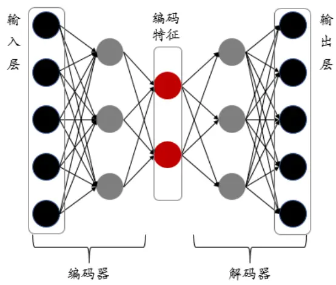
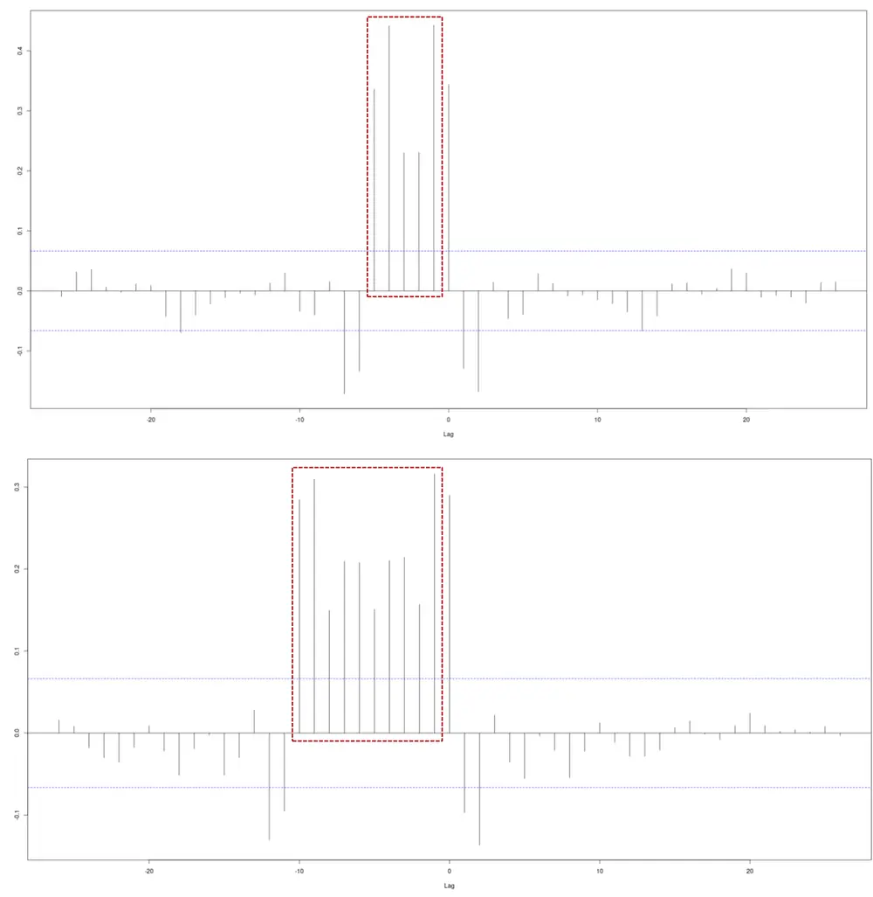
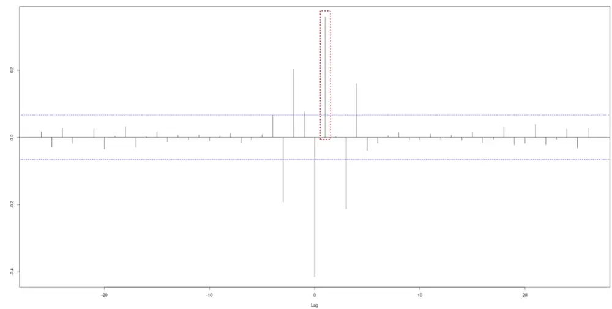
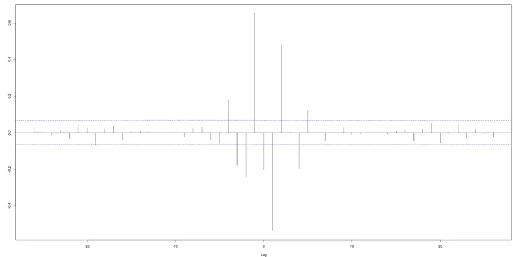
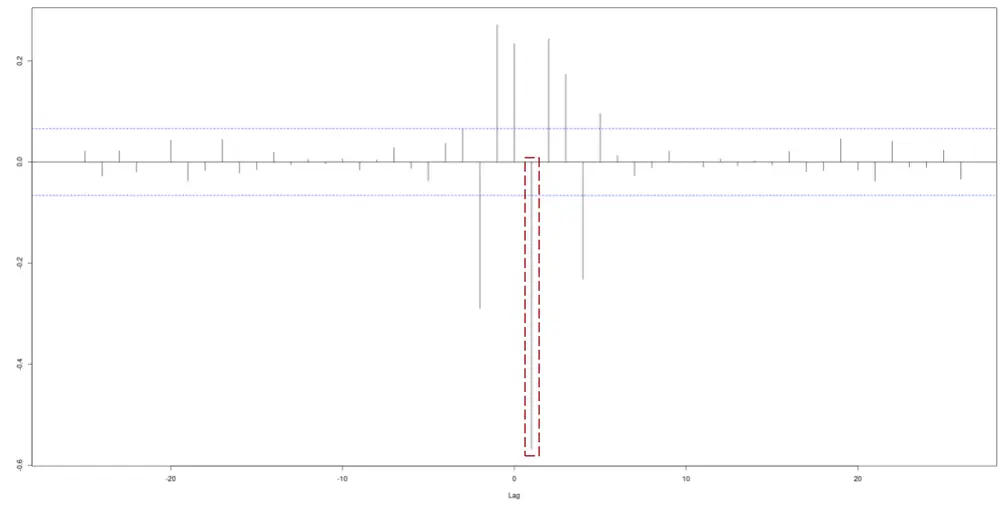

# 金融科技赋能投研系列之十四：

## Autoencoder 与金融数据降噪

## 摘要：

在上一篇报告中，我们参考最新的 AI 算法技术，尝试利用金融数据嵌入高维空间，以重构市场动力学。主要的研究目标是寻找最关键的活跃影响维度，从而为寻找主导因子提供数据支撑。在研究过程中，我们发现，传统的自编码器(autoencoder)算法在叠加了从动力学角度出发的假邻居（falseneighbor）Loss正则项之后不仅能够有效分解数据，确定投资工具维度在不同周期尺度上的活跃维度，而且同时还体现了更好的抗噪效果。

这促使我们进一步探索该方法的应用场景。本文将分析 autoencoder 的中间层编码节点对于输入数据的响应能力和降噪处理能力；我们将做多项统计测试，验证自编码算法的效能。结果显示，自编码器能够在非常有限的改变原始数据特征的基础上，体现出更高的信噪比，并且具有更好的抗指标钝化特征。

投资咨询业务资格：

证监许可【2011】1289 号

研究院 量化组

研究员

## 陈辰

- 0755-23887993

- chenchen@htfc.com

从业资格号：F3024056

投资咨询号：Z0014257

## 何绪纲

- 0755-23887993

- hexugang@htfc.com

从业资格号：F3069194

## 镇谌博

- 0755-23887993

- zhenchenbo@htfc.com

从业资格号：F3080231

## 一、背景介绍

尽管自编码器属于一类无监督学习的AI算法，其模型的训练结果往往比监督学习更难以直观理解，所以这一类型的 AI计算的应用场景就目前来说还具有一定的局限性。但是，这并不妨碍我们从一些极具启发性的角度切入研究。承接之前的算法研究方法，本文深入探讨自编码器（Autoencoder）算法在金融数据领域的应用，特别是在叠加了动力学的信息之后，改进版的自编码器算法。

图 1：自编码结构示意图

数据来源：华泰期货研究院

如图 1所示，自编码器的编码效果实际上是根据对比输入数据和输出数据的接近程度来度量的。换句话说，在我们的应用场景中，模型学习的能力体现在多大程度能够将输入的有效信息抽象并存储到中间的编码特征层节点上。

那么，随之而来的问题就是，当我们增加了假邻居 loss项之后，能对模型的学习能力有什么帮助呢？在上文中，我们知道，至少这将有助于寻找到最活跃的价格波动维度。而数据的编码过程实际上是数据的分解过程—区分活跃与非活跃维度，那么本质上对应着数据的“关键”波动特征与“无关”（或“噪音”）特征的分离。所以，这促使我们进一步测试自编码器对于数据（信噪特征）分解的应用。

数据分解的线性工具一般认为是不稳定的，比如主成分分析（PCA）。因为，对于低信噪比的系统，正交化分解往往会被高噪音波动干扰。所以，我们看到金融数据领域大部分的PCA 应用并不十分成功，而且往往需要伴随艺术性高于科学性的测试窗口长度选取。如果我们主要考虑方向是金融数据降噪，也就是数据的平滑化处理。那么采用简单的移动均值方法就可以提高数据系统的信噪比。然而，这类方法一般又会带来另一个较难解决的问题—指标钝化。

所以，较理想的算法是既可以保留原始数据的主要波动特征，同时又能够提升信噪比，并且尽量降低数据重要特征的延迟（或钝化）。本文将在我们前期的研究基础上，利用自编码器（autoencoder）研究成果[3]，分析在模型的中间层编码节点中，在活跃维度上的节点数据是否可以加以利用。同时，我们会和移动均值结果进行对比以验证方法的有效性。

## 二、方法论

## 1. 研究背景

首先，为了保持研究的一致性，我们将使用前期报告中提到的多周期数据分解方法[1]。对金融时序数据做长/短周期的分解。然后，对不同周期数据利用自编码器进行数据压缩。最后，分析中间隐藏层的活跃节点数据波动特征。

在上一篇报告中，我们已经看到 Autoencoder 算法实际上具有优于 EDM 的数据抗噪能力，因为，我们在长短周期都能获得波动率相对较为集中的数目较少的活跃维度节点。所以，在后面的研究中，我们都只取波动特征最为集中的前 3 个中间层节点进行测试。同时这样也方便我们对于不同品种间的横向比较。具体维度选取方法，请参阅之前的报告[2]。

需要强调的是，我们这里的 Autoencoder模型并非常用的简单模型。而是在考虑到市场动力学规律的影响下，改进了loss函数，添加了假邻居正则项。也就是说，我们不仅要求目标函数能够尽量压缩信息，保持编码数据和解码数据的一致。同时，在压缩信息的同时还结合考虑时间序列数据是否能在不同的嵌入维度保持近邻属性，而近邻属性则是重构动力学模型相空间的最关键要素[3]。

最后，我们的测试结果依然会和简单线性模型的结果进行比较，从而验证自编码器算法较高效的数据处理能力。

## 2. 方法介绍

Autoencoder 算法是否能够实现信噪分离，优化我们的数据处理呢？我们看到自编码器可以分为两个过程：从输入层到中间层的数据处理过程叫做数据编码（encode）过程，从中间层到输出层则为解码(decode)过程。所以如果，该算法确实有效（当然在正确的训练过程和模型收敛条件下），那么其中间的节点就应该保留最关键的原有数据特征。我们可以在模型训练结束后，对样本外数据的测试来验证这一点。

为此，我们将计算波动率最大的前 3 个中间层节点在样本外的波动特征与原始数据的相关性，相关性越大，说明压缩后的数据与原始数据的波动特征越接近，信息丢失越少。同时，我们测试节点上压缩数据的信息比率，信息比率越大则数据的降噪效果越好。为了和移动均值的结果进行对比，我们还会观察压缩后数据与原始数据的领先/滞后相关性。我们将看到，移动均值的指标钝化十分明显，而自编码器的结果却受影响较小，指标无明显钝化。

## 三、模型结果对比

## 1. 测试数据及环境

为方便对比，我们选取和上一篇报告相同的期货品种进行测试。数据采样频率也同为日度。而数据的前置性处理，我们依然采用多周期数据分解模式，这里我们依然使用长/短两组周期数据。我们采用的合约换月方式充分考虑了持仓量的稳定性和合约流动性，但该方法的主力合约可能与市面上一些数据服务商提供的连续合约数据存在些许差异。

1) 沪深 300 股指期货连续主力合约（2010-04：2021-02）

2) 沪铜连续主力合约（2002-01：2021-02）

3) 大商所豆粕连续主力合约（2000-07：2021-02）

4) 郑商所棉花连续主力合约（2004-06：2021-02）

本文测试主要使用 AI 工具包有为 Tensorflow 4.2 和 Keras 2.3.0.0。

## 2. 测试结果

1) 相关性测试

表格 1：节点数据和移动均值与原始数据相关性

|  | 节点1 | 节点2 | 节点3 | 移动均值(5 天) | 移动均值(10 天) |
| --- | --- | --- | --- | --- | --- |
| 短周期 |  |  |  |  |  |
| IF | 0.9679 | 0.8650 | 0.6826 | 0.7390 | 0.6483 |
| CU | 0.9893 | -0.1168 | -0.6952 | 0.6547 | 0.6342 |
| M | -0.9845 | 0.2722 | -0.8912 | 0.6375 | 0.6094 |
| CF | -0.9858 | -0.7744 | -0.8335 | 0.6755 | 0.6689 |
| 长周期 |  |  |  |  |  |
| IF | 0.7632 | 0.7036 | 0.3005 | 0.3441 | 0.2900 |
| CU | 0.7607 | 0.3951 | -0.6009 | 0.3753 | 0.3158 |
| M | 0.8065 | 0.3025 | -0.5104 | 0.3638 | 0.3125 |
| CF | -0.6169 | 0.0622 | -0.3203 | 0.3804 | 0.3079 |

资料来源：天软 华泰期货研究院

从表格1 容易看出，自编码器的样本外输出与原始（长/短周期）数据有较高的相关性。特别是跟移动均值相比，我们看到对于所有测试品种，第一活跃节点都具有更高的相关性绝对值。也就是说，自编码器的节点依然包含了原始数据的主要波动特征。

## 2) 信息比率

信息比率定义为收益率/波动率的绝对值。

表格 2：节点数据和移动均值信息比率(年化)

|  | 原始数据 | 节点1 | 节点2 | 节点3 | 移动均值(5 天) | 移动均值(10 天) |
| --- | --- | --- | --- | --- | --- | --- |
| 短周期 |  |  |  |  |  |  |
| IF | 0.005 | 3.204 | 5.851E+03 | 1.656E+05 | 0.081 | 0.224 |
| CU | 0.005 | 12.872 | 1.500E+05 | 4.368E+05 | 0.119 | 0.248 |
| M | 0.004 | 9.095 | 2.244E+05 | 2.528E+05 | 0.098 | 0.213 |
| CF | 0.004 | 8.988 | 1.731E+06 | 1.023E+06 | 0.086 | 0.189 |
| 长周期 |  |  |  |  |  |  |
| IF | 0.504 | 3.398 | 2.354E+03 | 1.458E+04 | 1.540 | 2.293 |
| CU | 0.323 | 44.736 | 2.768E+05 | 6.000E+05 | 0.977 | 1.260 |
| M | 0.244 | 0.095 | 1.122E+03 | 1.315E+03 | 0.773 | 1.090 |
| CF | 0.089 | 3.062 | 8.236E+03 | 5.235E+02 | 0.296 | 0.353 |

资料来源：天软 华泰期货研究院

与原始数据对比，自编码器算法和移动均值都显著提高了信息比率，也就是说两种算法都能起到对数据降噪、提高信号有效性的作用。除了长周期尺度上的豆粕，自编码器算法的结果都优于线性算法。节点 2和节点 3的信息比率比节点 1 要高出若干数量级，但是因为其波动性较小，也抵消了它们对于标的物价格波动性的影响力。

## 3) 指标钝化

以近期均值为基础的数据平滑化处理方法都毫无例外地会出现指标钝化现象。我们使用领先/滞后相关性来观察这一点。长周期数据的领先特征在lag=0的左侧，对比的测试数据领先特征均在 lag=0的右侧。首先，移动均值方法的市场反应钝化明显，并且与均值计算使用的历史数据窗口直接相关。我们用长周期 IF来举例，短周期数据特征与此相近但不及长周期明显；另外，其他品种与 IF情况非常类似，无明显差别, 均不再赘述。

图 2： 长周期收益率 vs 移动均值领先/滞后相关性； 上图为 5 日均值、下图为 10 日均值

数据来源：天软 华泰期货研究院

明显历史过往的数据特征与移动均值保持较高的正相关性，移动均值反应将落后于市场变化；或者说，指标钝化失效显著。

图 3： 长周期收益率 vs 中间层节点领先/滞后相关性； 上中下图分别为最活跃的自编码节点中的前 3 名

数据来源：天软 华泰期货研究院

长周期数据与自编码器中间层节点数据之间并没有绝对的领先/滞后特征。实际上，在节点1&3上我们看到了略强的领先性。

## 四、总结

本文我们延续了 Autoencoder算法的应用研究，尝试利用无监督学习的模型来自动寻找金融数据中的隐含特征，本文的角度是数据压缩或降噪。金融数据的处理一直存在一些两难的问题：1. 如何有效降噪，但降噪后保留原始数据重要的波动特征； 2. 利用数据波动的内在特征降噪，但又尽量避免受近期数据干扰造成指标严重钝化。

Autoencoder模型在结合了市场动力学模型优化之后，利用假邻居正则项能够较好的实现上述数据压缩目的，同时相比移动均值算法而言又能有效避免数据关键特征丢失和指标钝化。实际上，我们观察到在编码中间层的不同节点上似乎还分解出了强度不同的领先性信息。而算法中单一时间序列的数据压缩效能是否能够应用到多条时间序列（考虑协相关性）；或者多条具有相似经济学意义而在数据层面上高度共线的时间序列能否进行数据合成。这些问题都将成为我们进一步开展研究的重要方向。

从更高的角度来看，我们认为无监督学习算法实际上在金融领域有其独特的优势。因为，这一类算法并不需要定义好的标识（label）；更严格地说，我们认为现在市场上的很多label的定义并非真实存在，或者转瞬即逝，或者只是同时出现的假象（无内在因果联系）。而无监督学习模型则是重点考察如何通过合理建模，如Loss函数设计，来提取数据中的隐含特征，而这些特征往往还未广为人知，具有优异的投资潜力。更深入一些，这些隐藏特征之所以较难以发现，正是因为我们目前大多数的金工模型依然停留在线性模型或稳态建模的阶段（当然并非全部），所以对于非线性模型的发展十分有利，而绝大多数AI模型都是典型的非线性模型（包括Autoencoder）。随着研究进一步深入，新算法会不断融入我们现有的投研体系并将发挥重要作用。

## 五、参考文献

[1] 华泰期货金融时序专题：金融科技赋能投研系列之（二至八）

[2] 华泰期货金融时序专题 20210326：金融科技赋能投研系列之十三：Autoencoder 与金融数据应用

[3] William Gilpin, “Deep reconstruction of strange attractors from time series”, arXiv: 2002.05909, (2020)

## 免责声明

本报告基于本公司认为可靠的、已公开的信息编制，但本公司对该等信息的准确性及完整性不作任何保证。本报告所载的意见、结论及预测仅反映报告发布当日的观点和判断。在不同时期，本公司可能会发出与本报告所载意见、评估及预测不一致的研究报告。本公司不保证本报告所含信息保持在最新状态。本公司对本报告所含信息可在不发出通知的情形下做出修改，投资者应当自行关注相应的更新或修改。

本公司力求报告内容客观、公正，但本报告所载的观点、结论和建议仅供参考，投资者并不能依靠本报告以取代行使独立判断。对投资者依据或者使用本报告所造成的一切后果，本公司及作者均不承担任何法律责任。

本报告版权仅为本公司所有。未经本公司书面许可，任何机构或个人不得以翻版、复制、发表、引用或再次分发他人等任何形式侵犯本公司版权。如征得本公司同意进行引用、刊发的，需在允许的范围内使用，并注明出处为“华泰期货研究院”，且不得对本报告进行任何有悖原意的引用、删节和修改。本公司保留追究相关责任的权力。所有本报告中使用的商标、服务标记及标记均为本公司的商标、服务标记及标记。

华泰期货有限公司版权所有并保留一切权利。

## 公司总部

地址：广东省广州市越秀区东风东路761号丽丰大厦20层

电话：400-6280-888

网址：www.htfc.com