# 金融科技赋能投研系列之十五：

## 商品期货偏度因子策略表现

## 摘要：

偏度因子策略通过做多偏度排名靠后的品种，做空偏度排名靠前的品种。其背后的经济学逻辑是：基于正偏度的品种趋向于被高估，负偏的品种更容易被低估，投资负偏的品种有机会获得风险溢价带来的超额收益。

以苹果和铜为例，我们可以看到虽然偏度是基于价值回归的逻辑，这与动量类型的趋势策略出发点有所不同。但是由于偏度是相对均值的概念（公式 r-μ），在一个下行的行情有可能出现下跌不足（统计上）而导致正偏，上涨的行情也有可能出现上行动力不足（统计上）而导致负偏，这两种情况下动量与偏度可能会给予相同的持仓方向，偏度抓住了更高维度的收益率特征，因此我们认为将偏度和动量结合有机会对单因子策略进行优化。

投资咨询业务资格：

从策略表现上看，在 2014 年后偏度策略开始走强，并且有较为稳定的超额收益，这有可能是受到市场的参与者逐步走向成熟影响。同时，我们考察选取不同的品种个数对因子策略的影响，多空 2 个品种的年化收益率最高，但同时波动也是最大的，多空 10 个品种的波动最小。使用2014年以来的历史数据统计，多空 5个品种的信息比率时最高。仅仅使用两个品种虽然有机会获得更高的收益，但同时也需要承担较大的风险，适当的增加多空品种数量能明显提高策略的风险收益，回撤也明显的得到降低。

证监许可【2011】1289 号

研究院 量化组

研究员

## 陈辰

- 0755-23887993

- chenchen@htfc.com

从业资格号：F3024056

投资咨询号：Z0014257

## 何绪纲

- 0755-23887993

- hexugang@htfc.com

从业资格号：F3069194

## 镇谌博

- 0755-23887993

- zhenchenbo@htfc.com

从业资格号：F3080231

## 相关研究：

因子系列（五）偏度与峰度因子

2017-12-25

智 AI科技慧投未来（上）

2020-12-07

## 一、 偏度因子策略简介

在概率论和统计学中，偏度是关于实值随机变量的平均值的概率分布的不对称性的量。除正态分布的偏度为 0，以偏度值的大小正负，可以分为正偏或者负偏分布，对于单峰分布，负偏表示概率密度函数左侧的尾部比右侧更长或更胖。相反，正偏斜表示右侧的尾巴比左侧长或胖。

图 1： 正偏分布与负偏分布
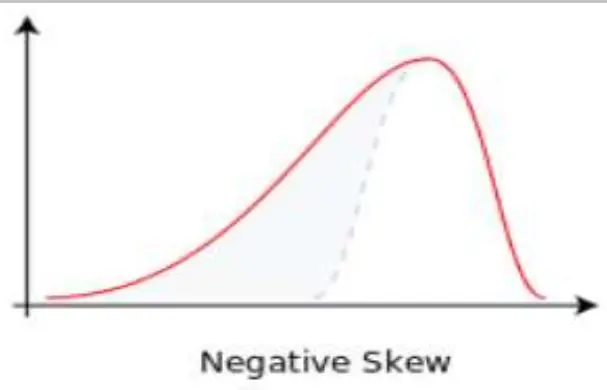
数据来源：Wikipedia 华泰期货研究院

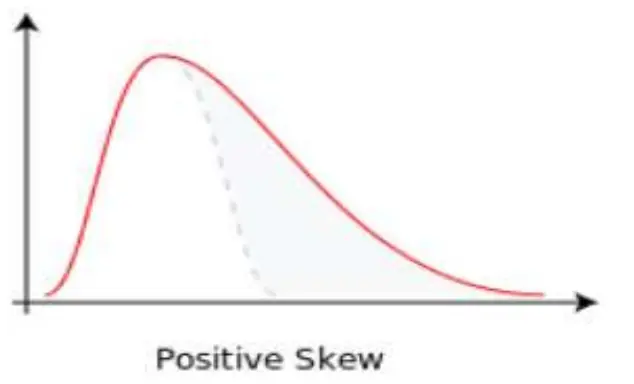

偏度是对收益率的衡量指标，是随机变量的三阶中心矩，r 代表收益率、μ收益率代表均值、 σ代表收益率波动率，偏度具体公式如下：

$$
\mathrm{skewness}=\mathrm{E}[\left(\frac{r-\mu}{\sigma}\right)^3]
$$

偏度因子是一类β型风格因子，背后的有着成熟的经济学逻辑[1-2]。其收益来源于投资者更加偏好投资在过去有较大的正偏度品种，厌恶负偏的品种，因此正偏度的品种趋向于被高估，负偏的品种更容易被低估，投资负偏的品种有机会获得风险溢价带来的超额收益。

通常使用各期货主力日收益率序列在历史时间窗口的偏度作为其对偏度因子的暴露程度。偏度因子策略通过做多偏度排名靠后的品种，做空偏度排名靠前的品种，获得偏度因子的风险溢价。

## 二、 策略设计及因子暴露

我们选取选取1年作为偏度计算时间窗口，即每个月底计算各个品种过去一年的偏度值排序，做多偏度排名靠后的品种，做空偏度排名靠前的品种，多空品种默认选取5 个，调仓周期为月度，月内不做调仓操作，资金分配比例采取等额分配，无杠杆交易，流动性较差的品种不参与排名。

下图为最新的偏度表现，鲜苹果、聚乙烯、锰硅、聚丙烯以及纯碱排名前五（空头），镍、铜、铁矿石、铝天然橡胶排名后五（多头）。

图 2： 代表期货品种偏度表现（截止 2021 年 3 月 30 日）
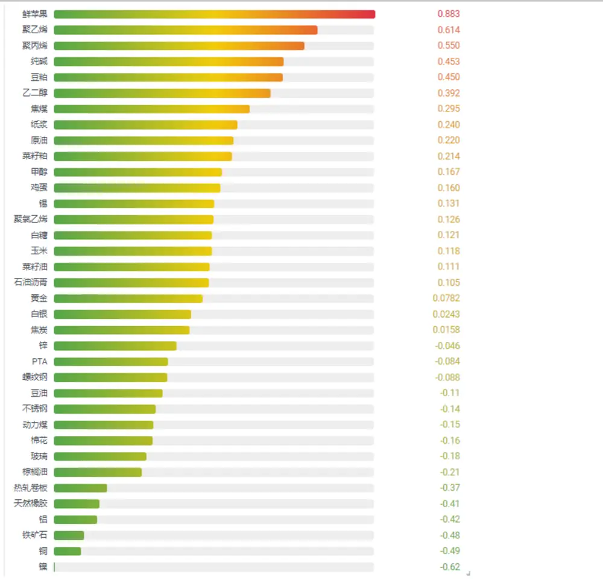
数据来源：天软 华泰期货研究院

从历史偏度表现上看，相对于其他商品，苹果长期处于大幅正偏，因此长期在空头持仓的序列中，而通过苹果的例子，也很好的帮我们理解偏度与动量两个因子的区别与联系。

从图 3、4中我们可以看出右侧的尾巴比左侧更胖，这符合正偏的特征，表格1 中可以看到苹果在历史至今偏度为0.37，近一年的偏度为 0.88。而从苹果期货历史行情走势来看，在 2019 年 7 月之后一直处在下跌的趋势行情中，策略在 2020 年 7 月至今一直持有苹果空头，为策略带来了盈利。

偏度是基于价值回归的逻辑，连续下跌与正偏同时出现似乎有些反直觉，这就需要提到偏度和动量的区别了。注意到历史至今苹果的收益率均值为-11.34%，偏度是相对均值的概念（公式 r-μ），即使在一个下行的行情也有可能出现下跌不足（统计上）而导致正偏，动量与偏度可能会同时给予苹果相同空头持仓。偏度抓住了更高维度的收益率特征，我们认为将偏度和动量结合有机会对单因子策略进行优化。

图 3： 苹果主力日收益率频数分布图
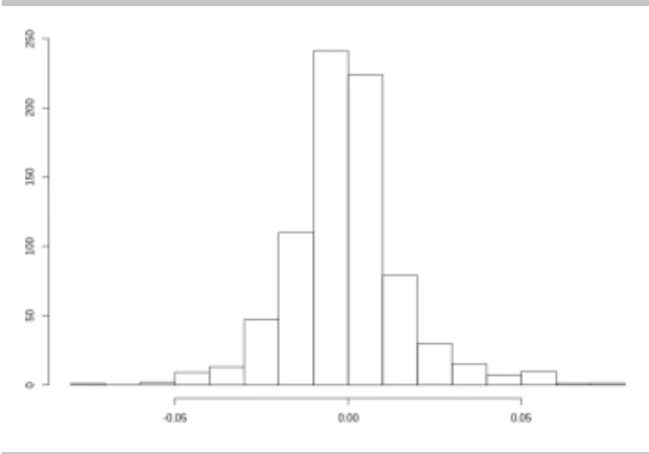
数据来源：天软 华泰期货研究院

图 4： 苹果主力日收益率概率密度分布表现
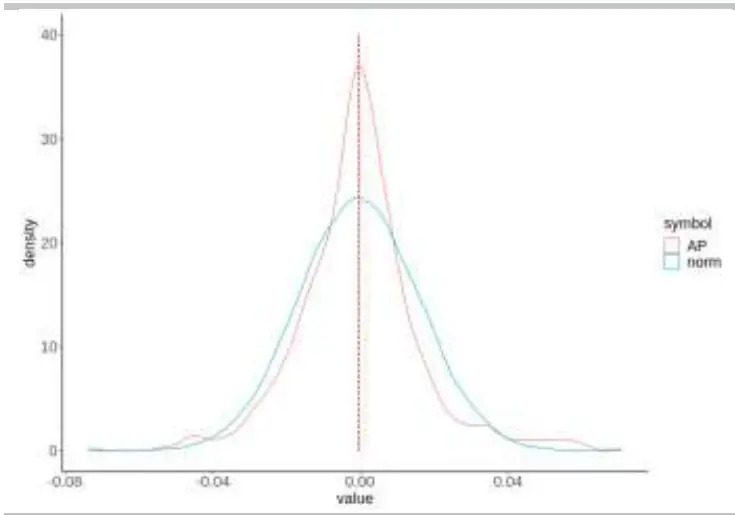
数据来源：天软 华泰期货研究院

图 5：苹果主力连续历史累计收益率
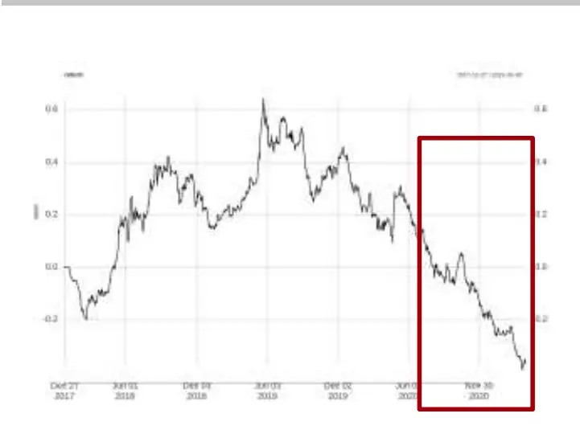
数据来源：天软 华泰期货研究院

图 6： 苹果部分空头持仓月份展示

| date | symbol T | rebalanceT | code1 | L |
| --- | --- | --- | --- | --- |
| 2019-02-01 | skew | month | AP |  |
| 2019-03-01 | skew | month | AP |  |
| 2020-07-01 | skew | month | AP |  |
| 2020-08-03 | skew | month | AP |  |
| 2020-09-01 | skew | month | AP |  |
| 2020-10-09 | skew | month | AP |  |
| 2020-11-02 | skew | month | AP |  |
| 2020-12-01 | skew | month | AP |  |
| 2021-01-04 | skew | month | AP |  |
| 2021-02-01 | skew | month | AP |  |
| 2021-03-01 | skew | month | AP |  |

数据来源：天软 华泰期货研究院

图 7： 苹果历史偏度表现
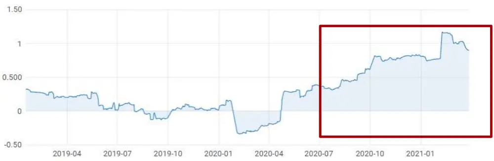
数据来源：天软 华泰期货研究院

表格 1：苹果期货主力表现

|  | 收益率 均值年化 | 年化 波动率 | 偏度 | 峰度 | CVaR (日度) | VaR (日度) | 最大 回撤率 |
| --- | --- | --- | --- | --- | --- | --- | --- |
| 历史至今 | -11.34% | 26.05% | 0.37 | 2.52 | 3.62% | 2.60% | 63.00% |
| 近一年 | -59.46% | 26.77% | 0.88 | 3.06 | 3.42% | 2.59% | 53.61% |

数据来源：天软 华泰期货研究院

铜在历史上偏度排名并不突出（-0.11），但是在近一年中多次排名垫底，近一年日收益率偏度为 -0.49，排名倒数第二，因此在图表中我们选取铜近一年的表现进行展示。

从图 8、9中我们可以看出左侧的尾巴比右侧更长，这符合负偏的特征。同时，在铜期货在近一年均处在偏度策略的多头持仓中，连续上行行情与负偏同时出现。

图 8： 近一年铜主力日收益率频数分布图
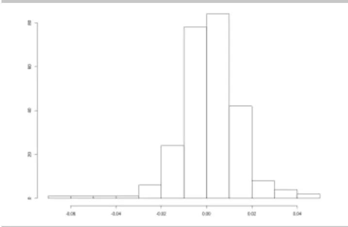
数据来源：天软 华泰期货研究院

图 9： 近一年铜主力日收益率概率密度分布表现
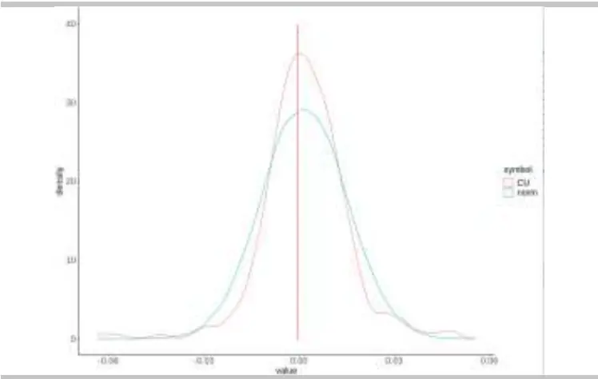
数据来源：天软 华泰期货研究院

图 10： 近一年铜主力连续累计收益率
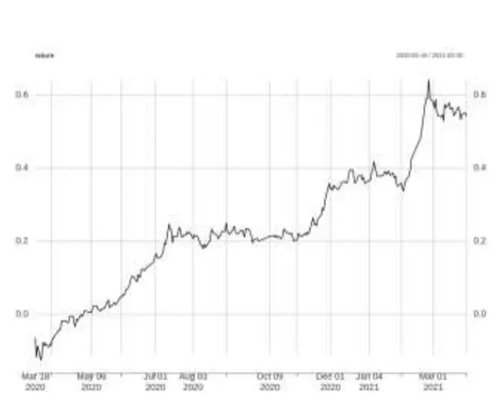
数据来源：天软 华泰期货研究院

图 11： 近一年铜多头持仓月份展示

| date 1 | symbol T | rebalanceT | code1 |
| --- | --- | --- | --- |
| 2020-03-02 | skew | month | cU |
| 2020-04-01 | skew | month | cU |
| 2020-05-06 | skew | month | cU |
| 2020-06-01 | skew | month | cu |
| 2020-07-01 | skew | month | CU |
| 2020-08-03 | skew | month | cU |
| 2020-09-01 | skew | month | cU |
| 2020-10-09 | skew | month | cu |
| 2020-11-02 | skew | month | cu |
| 2020-12-01 | skew | month | cu |
| 2021-01-04 | skew | month | cu |
| 2021-02-01 | skew | month | cu |
| 2021-03-01 | skew | month | cU |

数据来源：天软 华泰期货研究院

图 12： 近一年铜偏度表现
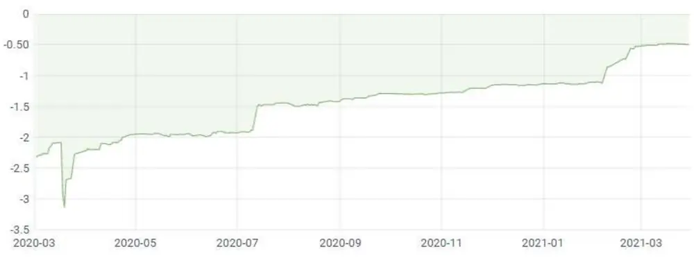
数据来源：天软 华泰期货研究院

表格 2：铜期货主力表现

| 铜主力 | 收益率 均值年化 | 年化 波动率 | 偏度 | 峰度 | CVaR (日度) | VaR (日度) | 最大 回撤率 |
| --- | --- | --- | --- | --- | --- | --- | --- |
| 历史至今 | 10.37% | 22.48% | -0.11 | 2.73 | 3.46% | 2.25% | 68.01% |
| 近一年 | 45.58% | 21.22% | -0.49 | 4.24 | 3.06% | 1.61% | 6.91% |

数据来源：天软 华泰期货研究院

## 三、 策略表现

接下来我们重点考察偏度多空因子策略的历史表现，前面提到偏度策略是做多偏度后 5名，做空偏度前 5名，那么在历史年份中偏度后5名收益表现是否能跑赢前5名品种呢？通过下图可以看到，在 2010-2014 年之前前5名表现更佳，在 2014年之后偏度后5名收益表现明显优于前 5名（除2015年基本持平），这有可能是受到市场的参与者逐步走向成熟影响。同时，我们也注意到在 2014、2018年仅做多的两个策略均落得负收益，但是多空策略获得了正的风险溢价。

图13： 偏度因子策略年度收益率
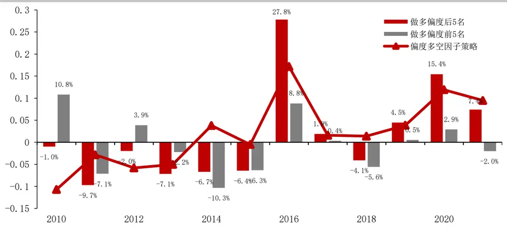
数据来源：天软 华泰期货研究院

图 14： 偏度多空因子策略月度收益率
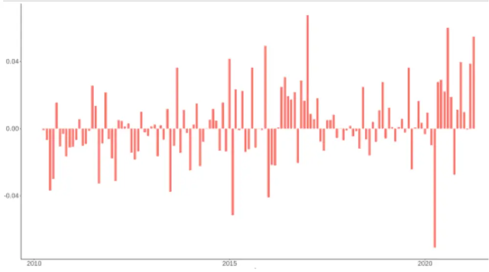
数据来源：天软 华泰期货研究院

上文中默认采用多空 5个品种，这与我们在搭建因子体系中使用的参数保持一致，接下来我们关注选取不同的品种个数对因子策略的影响，我们分别采用了 2、5、10 三个参数，策略表现如下：

图 15： 多空品种数量分别选取 2、5、10 时历史累计收益表现
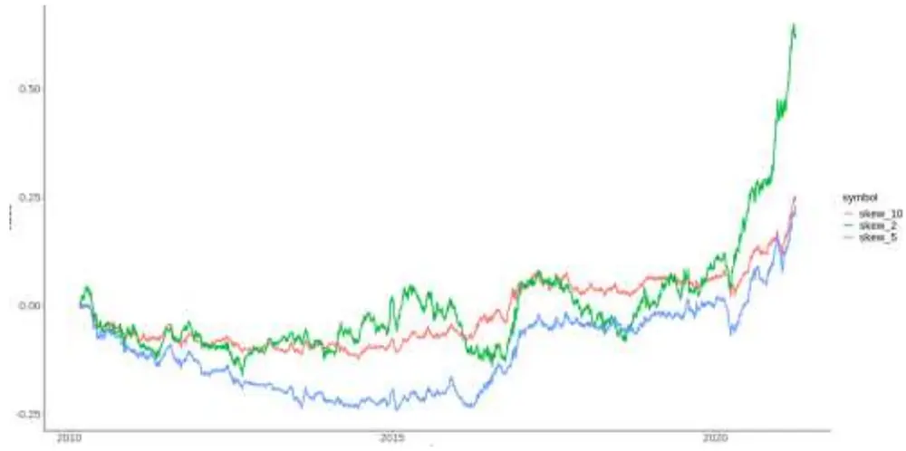
数据来源：天软 华泰期货研究院

分别统计 2010年至今与2014年至今两个时间段，从累计收益率的图以及统计指标上看，多空 2个品种的年化收益率最高，但同时波动也是最大的，多空 10 个品种的波动最小。使用 2010年以来全部历史时间段统计，多空2个品种的信息比率最高，而使用 2014年以来的历史数据统计，多空5个品种的信息比率时最高。仅仅使用两个品种虽然有机会获得更高的收益，但同时也需要承担较大的风险，适当的增加多空品种数量能明显提高策略的风险收益，回撤也明显的得到降低。

表格 3：2010年至今偏度因子策略的表现

|  | 收益率 均值年化 | 年化 波动率 | 偏度 | 峰度 | CVaR (日度) | VaR (日度) | 最大 回撤率 | 信息 比率 |
| --- | --- | --- | --- | --- | --- | --- | --- | --- |
| 2 个品种 | 4.92% | 8.63% | 0.17 | 1.49 | 1.15% | 0.86% | 19.65% | 0.57 |
| 5 个品种 | 2.13% | 6.21% | 0.11 | 2.53 | 0.86% | 0.59% | 24.61% | 0.34 |
| 10 个品种 | 2.22% | 4.67% | -0.03 | 2.53 | 0.65% | 0.45% | 12.50% | 0.47 |

数据来源：天软 华泰期货研究院

表格 4：2014 年至今偏度因子策略的表现

| 多空品种 数量 | 收益率 均值年化 | 年化 波动率 | 偏度 | 峰度 | CVaR (日度) | VaR (日度) | 最大 回撤率 | 信息 比率 |
| --- | --- | --- | --- | --- | --- | --- | --- | --- |
| 2 个品种 | 8.18% | 9.47% | 0.18 | 1.20 | 1.22% | 0.92% | 17.99% | 0.86 |
| 5 个品种 | 7.26% | 6.78% | 0.13 | 2.35 | 0.91% | 0.64% | 8.79% | 1.07 |
| 10 个品种 | 5.20% | 5.12% | -0.05 | 2.55 | 0.70% | 0.48% | 5.80% | 1.02 |

数据来源：天软 华泰期货研究院

## 四、 总结

偏度因子策略通过做多偏度排名靠后的品种，做空偏度排名靠前的品种，其背后的经济学逻辑是：基于正偏度的品种趋向于被高估，负偏的品种更容易被低估，投资负偏的品种有机会获得风险溢价带来的超额收益。

通过苹果和铜的例子，我们可以看到虽然偏度是基于价值回归的逻辑，这与动量类型的趋势策略出发点有所不同。但是由于偏度是相对均值的概念（公式 r-μ），在一个下行的行情有可能出现下跌不足（统计上）而导致正偏，上涨的行情也有可能出现上行动力不足（统计上）而导致负偏，这两种情况下动量与偏度可能会给予相同的持仓方向，偏度抓住了更高维度的收益率特征，因此我们认为将偏度和动量结合有机会对单因子策略进行优化。

从策略表现上看，在 2014年后偏度策略开始走强，并且有较为稳定的超额收益，这有可能是受到市场的参与者逐步走向成熟影响。同时，我们考察选取不同的品种个数对因子策略的影响，多空 2个品种的年化收益率最高，但同时波动也是最大的，多空10 个品种的波动最小。使用 2014年以来的历史数据统计，多空5 个品种的信息比率时最高。仅仅使用两个品种虽然有机会获得更高的收益，但同时也需要承担较大的风险，适当的增加多空品种数量能明显提高策略的风险收益，回撤也明显的得到降低。

## 五、 参考文献

[1] Fernandez-Perez A , Frijns B , Fuertes A M , et al. Commodities as Lotteries: Skewness and the Returns of Commodity Futures[J]. SSRN Electronic Journal, 2015.

[2] Fernandez-Perez A , Frijns B , Fuertes A M , et al. The skewness of commodity futures returns[J]. Journal of Banking &, 2018, 86(Jan.):143-158.

## 免责声明

本报告基于本公司认为可靠的、已公开的信息编制，但本公司对该等信息的准确性及完整性不作任何保证。本报告所载的意见、结论及预测仅反映报告发布当日的观点和判断。在不同时期，本公司可能会发出与本报告所载意见、评估及预测不一致的研究报告。本公司不保证本报告所含信息保持在最新状态。本公司对本报告所含信息可在不发出通知的情形下做出修改，投资者应当自行关注相应的更新或修改。

本公司力求报告内容客观、公正，但本报告所载的观点、结论和建议仅供参考，投资者并不能依靠本报告以取代行使独立判断。对投资者依据或者使用本报告所造成的一切后果，本公司及作者均不承担任何法律责任。

本报告版权仅为本公司所有。未经本公司书面许可，任何机构或个人不得以翻版、复制、发表、引用或再次分发他人等任何形式侵犯本公司版权。如征得本公司同意进行引用、刊发的，需在允许的范围内使用，并注明出处为“华泰期货研究院”，且不得对本报告进行任何有悖原意的引用、删节和修改。本公司保留追究相关责任的权力。所有本报告中使用的商标、服务标记及标记均为本公司的商标、服务标记及标记。

华泰期货有限公司版权所有并保留一切权利。

## 公司总部

地址：广东省广州市越秀区东风东路761号丽丰大厦20层

电话：400-6280-888

网址：www.htfc.com