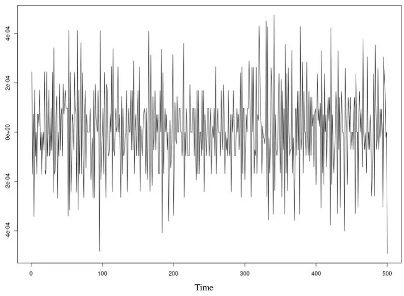
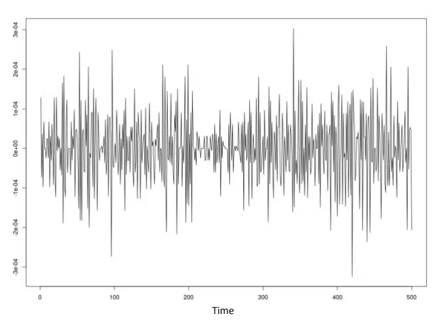
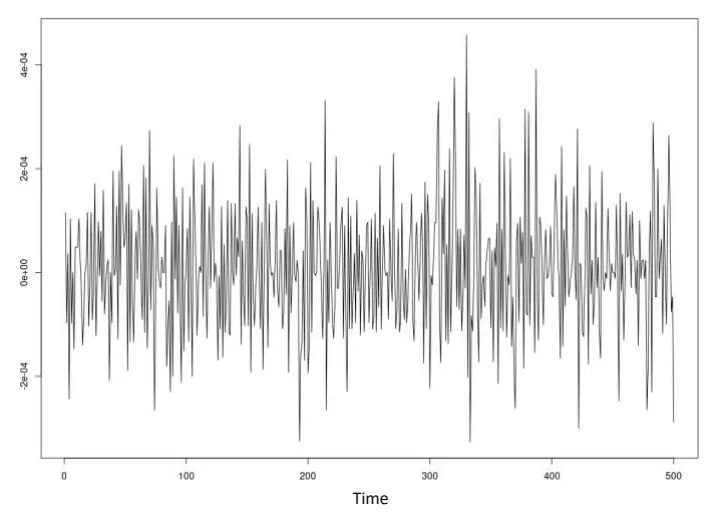
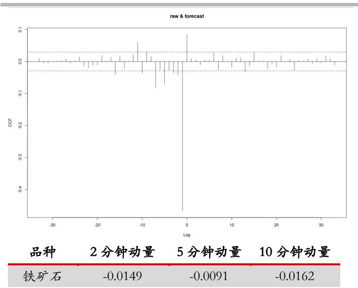
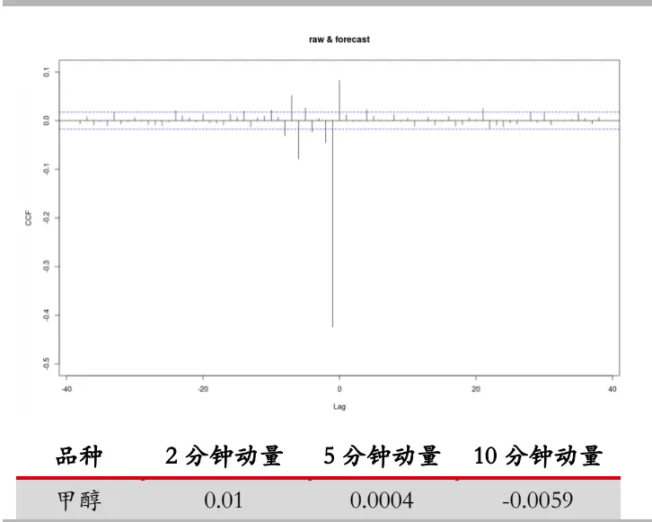
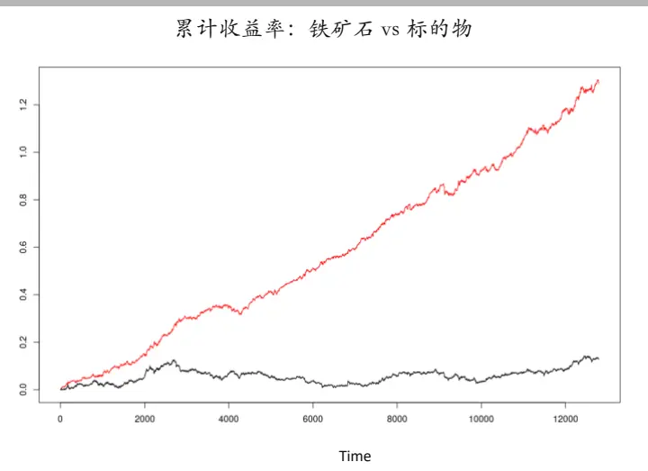
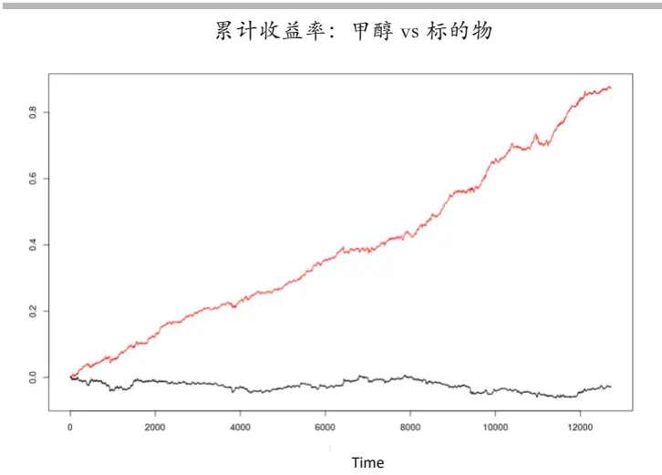
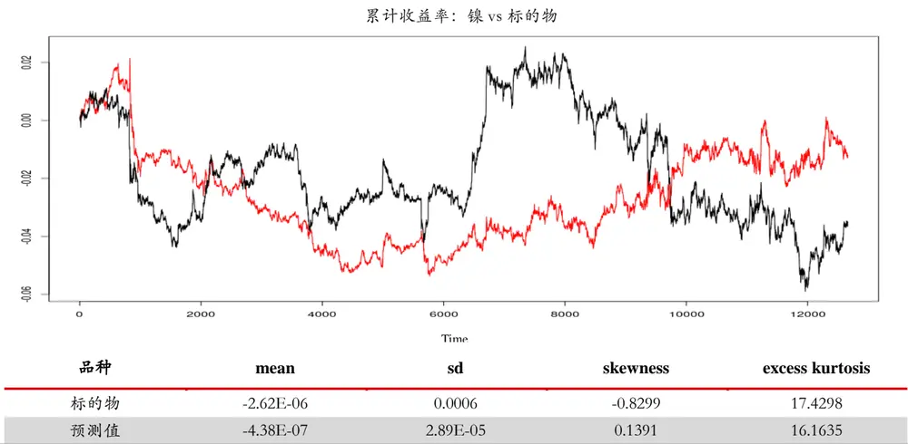

## 金融科技赋能投研系列之十六：

投资咨询业务资格：

证监许可【2011】1289 号

## 多周期高频策略（一）

## 摘要：

在过往的研究当中，我们结合跨学科的研究成果，深入观察了金融数据中普遍存在的特征，如类多尺度现象，类周期特征，金融时间序列活跃维度等[1-4]。而在不断深入研究的过程中，我们独立开发了一系列对应的数据分析工具，其中既有来自于其他科学领域的数据科研工具，也有来自于AI领域的最新算法[3,4]。

研究院 量化组

本文将从这些数据特征入手，开发高频交易策略。作为该类型策略的初步研究报告，我们将主要从策略的投资逻辑入手，并重点理清此类策略的有效性特征及可能失效的原因。

研究员

## 何绪纲

- 0755-23887993

- hexugang@htfc.com

从业资格号：F3069194

## 陈辰

- 0755-23887993

- chenchen@htfc.com

从业资格号：F3024056

投资咨询号：Z0014257

## 镇谌博

- 0755-23887993

- zhenchenbo@htfc.com

从业资格号：F3080231

## 一、背景介绍

金融市场具有高度的复杂性。这体现在交易规则和交易行为两个方面。

首先，金融市场具有较高的规范性，否则将无法进行任何有意义的交易行为。所以，金融市场在面临信息披露，交易者准入，具体交易规则等方面都有严格的规定。另一方面，则是规范制度的可延续性。我国金融市场从诞生到成型再到逐步成熟，有其自身的演化路径，中间也出现了跨越式的发展态势。但是，就各项规章制度运行情况来说还处在不断完善的过程中。而从量化投资的角度来说，因为几乎所有参数的调整，甚至投资逻辑的适用性都跟具体的交易环境有关，这样发展变化的市场无疑是一个具有挑战性的情景。

其次，在对市场类周期现象的研究过程中，我们不断发现并从不同角度印证这个市场的参与者是非常多样化的，而不同投资者的投资逻辑到投资行为（或习惯）的差异都造成了市场价格波动的类周期现象[1]。这种类周期现象在我们研究市场复现规律时反复出现，并且在大多数金融工具中都存在共性。举例来说，大多数个人投资者会根据市场价格形态来做未来价格判断；机构类型投资者更有可能从金融工具的价值判断或在更深入的尽调基础上做出相对价值判断；某些外资参与者甚至有可能是对冲其海外对应资产（如持有大宗商品现货）而在国内市场交易。不难看出，进入金融市场的信息其实是非常多元化的，而最终交易者的交易行为，如交易频率，持仓周期，资金体量冲击将体现出非常巨大的差异。

从上面的分析我们可以看出，对金融市场做细致的分析其实不是一个简单的问题，甚至对从业者来说更是一个“知道的越多越难”的问题。我们来看看业内目前最流行的一些处理方式。简而言之，分为寻找 Beta和Alpha因子两种方式。粗糙地说，Beta 就是对某个金融资产类型都有影响力的系统性风险敞口，而Alpha更多的倾向于指某个（某些）独立的金融工具的特异性价格波动因素。Beta 因子的投资逻辑一般认为其底层的经济学基础较为坚实，大部分 Beta 因子也有大量的学术类文献或金融机构研究报告作为支撑。Alpha 因子则偏向于不同来源信息（行情或基本面）的更高效处理，通过利用信息不对称，从而取得交易获利的机会。在大多数情况下，Beta 类型的因子对市场的影响更广泛，更长久，具备系统性风险敞口的特征；Alpha 类型的因子对单独金融工具的影响在一定时间段会更为显著，价格预测能力更强，但失效的可能性更大。

本文的重点将不会放在对这种传统分类方法进行详尽论述，而是从另一个角度绕开这样的问题，来观察市场和数据特征，并思考投资逻辑。因子投资的一个关键问题在于我们并不能依赖于近期或者历史因子的表现来外推因子未来的表现。（当然实际投资实践过程中抓住某些关键影响因子，做一段时间的投资，直到因子盈利能力消失是一个主要的量化投资逻辑。)

从前面的研究结果中，我们知道市场的运动有其本身的规律性，这导致了金融市场表现出强烈的类周期现象[1]（一般不是精确周期）。而这种现象背后的原因可能是Beta 因子的影响，也有可能是Alpha因子的驱动，甚至有可能是还未挖掘出来的因素造成的。所以，毋庸置疑因子研究的进化迭代非常有助于我们深化对市场的理解，但是因子研究本质上无法穷尽所有的市场影响因素。

不过，如果我们先接受市场行情的类周期特征，而暂时不过度纠结于导致这个现象的原因，而是深入分析其数据特点的话，可以发现更多值得注意而有趣的东西。比如，这样类周期的特征往往不是时间序列直接表现出来，而是在不同的周期尺度上复现；而在不同的周期尺度上数据又表现出来不同的活跃维度；即使数据分解（基于autoencoder算法）到不同维度，它们的波动性与原始数据依然有足够显著的相关性，且强于移动均值方法。这些结果都提示我们，从数据本身出发依然有很多有趣的特征有待挖掘。

本文将这些特征加以应用，开发交易策略。我们认为这些数据特征具有相当广泛的适用性（实际上，我们还未发现反例），但是从可用数据量的角度来考虑（详见下文介绍），我们将从商品中高频策略的开发入手。本文重点考察策略预测性能，暂不考虑换手率、交易手续费、下单成功率及可盈利的极限最高交易频率等参数，所以后文将重点考察预测性统计指标而非简单 Sharpe 率。

## 二、策略逻辑

通过上文介绍，我们不难形成投资逻辑。历史数据中与当前行情相似度高的类周期现象可以用来对未来行情走势进行预测。其中核心的问题就是定义并量化相似程度，从而挑选相近数据集进而进行预测。为了简化问题，我们这里将只考虑收益率时间序列，并截取活跃维度对应的数据点，并按照时间顺序排列成矢量数据点；相似程度则以欧氏距离作为测量方式。

需要指出，当我们选取参考维度的时候，完全可以扩充考察数据的角度。举例来说，我们甚至可以不直接使用行情数据，而是参考若干 Beta/Alpha因子值，并以此和历史数据比较，进而从因子角度出发，搜索与当前行情最相似的历史数据点集合。这些都是我们后续研究的重要方向。

而在得到相似数据集后，利用线性回归模型建模，然后利用该模型进行行情预测。但严格地说，这个算法是高度非线性模型；实际上，最近期的线性时间序列并不直接参与建模而主要用于历史相似数据点搜索。算法的预测能力将依赖于不同周期尺度上价格波动复现规律的精确程度。所以数据中的噪音程度过高或原本复现的规律不复存在，都将是算法失效的关键风险点。

对于中高频策略，价格波动复现的规律由中高频交易者主导，所以换言之，复现规律需要中高频交易者结构具有一定程度的稳定性，尽管不需要知道他们的具体交易模式。同时，我们也注意到中低频交易者如果在短时间内有较大体量的交易，也会对算法造成冲击，因为这一类事件相对来说是“小概率”事件，从统计的角度来说，会被大量的无关历史复现事件所掩盖而难以即时体现其价格主导特征，这也是回归分析本身的弱点。我们将会后续做这方面的策略优化。

## 三、数据准备

我们把策略定为 1分钟交易频率，并假设最新成交价格即为可买卖价格。测试覆盖品种包含全部商品板块，但是挑选若干流动性较好的品种进行测试。

因为大宗商品一般都有较强的季节因素，为了方便今后研究对比,我们挑选 2020年5 月18日-8月17 日共计63天进行测试。

历史参考数据则选取2020年第一个交易日到 2020年5月15日。最近期的数据可能最有机会表现出当前市场交易结构特征，并有更好的机会在未来市场延续，所以更适合用作参照数据集。但是，也不排除更多的历史数据能够更为精确的显示复现规律，所以历史数据长度的选取将成为后续结合交易者结构演变研究的主要内容。

策略交易工具为商品品种的主力合约。同时，我们的策略将会剔除开盘开头5分钟和收盘尾部 5分钟，所以我们的策略在数据使用时不会直接受到合约换月的跳价影响。但是，合约在换月期间有可能存在交易者结构发生显著变化，从而导致明显的交易行为改变，这有可能会造成策略的短暂失效。

正如前文所述，算法存在因为行情数据噪音过高而失效的可能性，所以数据降噪其实是一个较为关键的开发方向，并需要定制化处理。但在本文中，我们将不对数据做进一步降噪处理，留待后续研究。

通常我们的数据分解会分成短中长三个尺度，但是因为中高频策略主要的交易对手方并不直接包含中低频交易者，所以这里只考虑短周期和中周期数据分解，而不再考虑长周期影响。事实上，我们认为长周期波动特征此时是一个噪音干扰源，而这个周期尺度的交易行为如果在一段时间内成为价格主导因素，算法也会短时失效（似乎是回撤的主要因素）。数据分解举例如下：

图1：标的物收益率波动（铁矿石，原始数据）

数据来源：天软 华泰期货研究院

图 1是沪铜在测试相关时段的 500个收益率数据点，我们将数据分解到短/中两个周期上，便于我们分层建模，如图2-3。

图2：标的物收益率波动分解（铁矿石，短周期）

数据来源：天软 华泰期货研究院

图3：标的物收益率波动分解（铁矿石，中周期）

数据来源：天软 华泰期货研究院

在肉眼可以观察到的范围内，我们可以看出，分解之后的短周期上其波动特征在时序上看到了明显的差异性，这在原始数据上并不明显。而中周期分解数据则体现了更均匀的特征。我们的建模和预测都将在这 2个周期尺度上进行，最后的预测值则是简单求和。

（测试用行情数据来自天软。）

## 四、回测结果

假设是无杠杆交易，只根据策略预测值的正负号提供多空信号，且暂不依赖信号强度设计投资比例（持仓量只有多空 1手）。回测结果如下：

表格1: 原始数据因子重要性排名及对应指标值（回归分析）

| 板块 | 品种 | 品种代码 | 平均年化 Sharpe | 日度预测相关性 | Max Drawdown | Beta |
| --- | --- | --- | --- | --- | --- | --- |
| 农产品 | 豆一 | A | 7.57 | 0.039 | 0.037 | 0.031 |
|  | 棕榈油 | P | 5.973 | 0.028 | 0.053 | 0.018 |
|  | 白糖 | SR | 8.202 | 0.05 | 0.024 | 0.019 |
|  | 豆油 | Y | 6.734 | 0.019 | 0.036 | -0.082 |
|  | 玉米淀粉 | CS | 24.529 | 0.101 | 0.02 | 0.02 |
|  | 棉花 | CF | 13.903 | 0.018 | 0.039 | -0.045 |
|  | 玉米 | C | 37.079 | 0.166 | 0.013 | -0.009 |
| 基本金属 | 铜 | CU | 3.718 | -0.015 | 0.037 | -0.025 |
|  | 铅 | PB | 5.662 | 0.039 | 0.033 | 0.066 |
|  | 镍 | NI | -0.313 | -0.006 | 0.104 | -0.039 |
|  | 铝 | AL | 9.195 | 0.0413 | 0.027 | 0.081 |
| 能源化工 | PTA | TA | 17.364 | 0.077 | 0.022 | 0.003 |
|  | 纸浆 | SP | 34.817 | 0.168 | 0.011 | 0.053 |
|  | 尿素 | UR | 19.11 | 0.079 | 0.041 | 0.075 |
|  | 聚氯乙烯 | V | 30.905 | 0.151 | 0.019 | -0.018 |
|  | 天然橡胶 | RU | 17.674 | 0.09 | 0.023 | -0.032 |
|  | 甲醇 | MA | 16.62 | 0.083 | 0.021 | 0.037 |
|  | 聚乙烯 | L | 25.171 | 0.13 | 0.023 | 0.035 |
| 贵金属 | 黄金 | AU | 1.37 | -0.06 | 0.039 | 0.114 |
| 黑色建材 | 玻璃 | FG | 24.589 | 0.107 | 0.039 | 0.09 |
|  | 热轧卷板 | HC | 11.129 | 0.056 | 0.026 | -0.027 |
|  | 铁矿石 | I | 15.482 | 0.079 | 0.048 | 0.072 |
|  | 螺纹钢 | RB | 10.034 | 0.064 | 0.046 | -0.009 |
|  | 焦炭 | J | 4.397 | 0.028 | 0.063 | 0.079 |
|  | 动力煤 | ZC | 15.61 | 0.07 | 0.024 | -0.013 |

资料来源：天软 华泰期货研究院

对上述5个板块，25个品种做的测试显示，在若干品种中，策略表现出较强的预测能力，如玉米、纸浆和聚氯乙烯等，其预测值与市场真实值的相关性超过了 15%。大部分品种（15）的预测相关性都在 5%以上。所有品种的年化 Sharpe均值14.7，前5名品种的Sharpe均值为 29.1。因为，目前策略暂未考虑风险控制部分，我们看到最大回撤较大，平均最大回撤达到 3.5%。但是，与标的物走势的相关性较低，Beta 绝对值均值为0.044，大部分品种的策略表现几乎与标的物走势无关。板块来看，策略在能源化工板块的效果最好，贵金属和基本金属效果最差。所以，我们认为策略提升的空间还很大，在相似数据集的框架下，挑选有效Alpha因子或针对板块优化之后的策略效果应该会有相当程度的提升。

为了考察策略预测值是否显著有效，我们选取Sharpe值较高的两个结果（铁矿石和玉米）进行测试，计算预测值与市场真实值之间的领先/滞后相关性。实际上，绝大部分测试品种都表现了非常相似的定性特征，区别只在于具体数值的些许差异。

图4：铁矿石预测值 vs市场值（上图）；预测值与动量相关性（下表）

数据来源：天软 华泰期货研究院

图5：甲醇预测值 vs 市场值（上图）；预测值与动量相关性（下表）

数据来源：天软 华泰期货研究院

上面两图都有一个最显著的特征，就是前一行情值对于预测模型值是一个强烈的反转信号，尽管近期的行情值并未直接用于建模（只用于搜索历史相似数据）。这一特征具有一般性，在测试的品种中都可以观察到；实际上，在其他类型资产的测试中，该策略也体现了极其相似的特征。

当然，我们关心的是模型值是否具备预测能力，所以，我们观察lag>=0的相关性。可以看到，虽然在测试阶段预测值与真值的相关性绝对值并不大，都未能超过 10%，但却是显著有效的（远超过 95%置信区间）。预测能力的深入分析将成为交易策略中杠杆倍数的数据基础。

行情波动有一定的延续性，这来自于行情本身的自相关性特征。但是，模型预测值却没有这样的特征。这说明模型所依赖的信息并非市场延续的行情特征（这是动量/趋势类策略的基础），而是更接近于利用行情的“状态”信息。为了验证此观点，我们测试累计收益率（代表一段时间内标的物动量强弱）与模型预测值的相关性。累计收益计算的区间长度选取 2分钟，5分钟，和 10分钟三种情况。可以清晰看到，该策略与动量几乎没有相关性，这将我们的策略与市场上已有的一大部分基于动量的高频策略区分开来，避免了策略同质化，提升策略存活周期/几率。

接下来，我们考察收益曲线。

图6：策略收益 vs 标的物收益（上图）；预测值/标的收益率统计（下表）

图7：策略收益 vs 标的物收益（上图）；预测值/标的收益率统计（下表）

| 品种 | mean | sd | skewness | excess kurtosis |
| --- | --- | --- | --- | --- |
| 标的物 | 9.90E-06 | 0.001 | -0.085 | 1.7107 |
| 预测值 | 2.76E-06 | 6.23E-05 | -0.0016 | 2.325 |

数据来源：天软 华泰期货研究院
(红线代表策略累计收益；黑线代表标的物累计收益)

| 品种 | mean | sd | skewness | excess kurtosis |
| --- | --- | --- | --- | --- |
| 标的物 | -1.82E-06 | 0.0008 | -0.4555 | 5.9266 |
| 预测值 | -1.55E-07 | 4.85E-05 | 0.1434 | 1.8006 |

数据来源：天软 华泰期货研究院
(红线代表策略累计收益；黑线代表标的物累计收益)

为保持完整性，并方便比较及后续优化，我们将策略不适用品种的收益图也画出来。

| 品种 | mean | sd | skewness | excess kurtosis |
| --- | --- | --- | --- | --- |
| 标的物 | -2.62E-06 | 0.0006 | -0.8299 | 17.4298 |
| 预测值 | -4.38E-07 | 2.89E-05 | 0.1391 | 16.1635 |

图8：策略收益 vs标的物收益（上图）；预测值/标的收益率统计（下表）

数据来源：天软 华泰期货研究院
(红线代表策略累计收益；黑线代表标的物累计收益)

从上图可以看出，在策略较有效的品种中，策略盈利的稳定性较好；换句话说，我们之前在数据研究中多周期尺度上观察到的类周期现象，确实可以加以利用并转化成获取较稳定盈利机会的交易策略。标的物本身的波动性特征与策略能获得的绝对收益率存在一定的相关性。策略预测值的波动性和偏度绝对值低于标的物本身，具有较强的回归属性，这与我们利用历史相似数据集合来进行建模的逻辑契合。

从统计数据上来看，肥尾程度可能是策略失效的一个关键参考指标。直观上来看，它应该像其他各阶统计量，表现出明显的回归（压缩的）性质，但实事并非如此。而尾端统计指标回归不明显，则会使策略大量暴露给小概率（大亏损）事件的风险，从而造成策略整体预测效果的急剧降低（图8）。这是从数据来看策略最易失效的风险点。另一方面，我们也看到整个测试阶段，即使策略整体效果较差，但实际上也不是全部时间段失效，如镍的前半段表现很差，但是后半段则效果有所恢复。所以，策略的整体风控和市场适应性及敏感度也是进一步提升的角度。

## 五、总结

本文基于过往对金融数据的测试结果和分析理解，将一些显著的特征加以利用，初步开发交易策略。需要指出，文中提到的多周期尺度数据变动特征和显著的类周期现象及其复现规律实际上是普遍存在的—存在于不同的金融工具和数据频率中。

金融市场具有高度的复杂性，在不同的价格波动周期上体现了不同主导力量，实际上随着时间的演化，主导力量背后的风格也在不断切换。这也是通常业内提到的某些（alpha/beta）容易因子失效的现象。我们从另一个角度来看待市场风格转换的问题，从数据入手，我们观察到了每个商品品种都有自己的活跃维度。那么可以通过数据的活跃维度对比，从历史数据中搜索到相似的历史数据点，进而利用历史数据的波动复现规律来预测市场的行情变动。而为了简化问题，并作初步的尝试，我们选取影响因素较为单纯的高频策略作为开发第一步。

其实本文中策略的思路比较简单，而我们在研发过程中发现很多重要的细节和深化的方向值得进一步测试。特别是针对一些失效的品种做详尽的数据分析。

需要指出，目前的测试中，模型内部几乎没有自由参数（除了波动活跃维度），所以策略的鲁棒性较强，很适合进一步开发。比如，通过数据降噪，提高相似集的选取；增加适当因子从而提高模型预测能力；策略的频率的变化也是挖掘不同周期策略效果的有趣方向。

（进一步策略开发的工作已经展开 有兴趣了解详情的读者可以联系我们。）

## 六、参考文献

[1] 华泰期货金融时序专题 20200101：金融科技赋能投研系列：多尺度数据分析(一，二，三、四)

[2] 华泰期货量化策略年报 20201207；20201214：金融科技赋能投研系列：智 AI 科技慧投未来（上、下）

[3] 华泰期货金融时序专题 20210326：金融科技赋能投研系列之十三：Autoencoder与金融数据应用

[4] 华泰期货金融时序专题 20210331：金融科技赋能投研系列之十四：Autoencoder与金融数据降噪

## 免责声明

本报告基于本公司认为可靠的、已公开的信息编制，但本公司对该等信息的准确性及完整性不作任何保证。本报告所载的意见、结论及预测仅反映报告发布当日的观点和判断。在不同时期，本公司可能会发出与本报告所载意见、评估及预测不一致的研究报告。本公司不保证本报告所含信息保持在最新状态。本公司对本报告所含信息可在不发出通知的情形下做出修改，投资者应当自行关注相应的更新或修改。

本公司力求报告内容客观、公正，但本报告所载的观点、结论和建议仅供参考，投资者并不能依靠本报告以取代行使独立判断。对投资者依据或者使用本报告所造成的一切后果，本公司及作者均不承担任何法律责任。

本报告版权仅为本公司所有。未经本公司书面许可，任何机构或个人不得以翻版、复制、发表、引用或再次分发他人等任何形式侵犯本公司版权。如征得本公司同意进行引用、刊发的，需在允许的范围内使用，并注明出处为“华泰期货研究院”，且不得对本报告进行任何有悖原意的引用、删节和修改。本公司保留追究相关责任的权力。所有本报告中使用的商标、服务标记及标记均为本公司的商标、服务标记及标记。

华泰期货有限公司版权所有并保留一切权利。

## 公司总部

地址：广东省广州市越秀区东风东路761号丽丰大厦20层

电话：400-6280-888

网址：www.htfc.com