## 量价特征 1——日内收益分布

股指期货以及相对应指数的各类量价特征，不管在中低频维度上亦或在较高频的维度上，均受到各类投资者的广泛关注。基于量价特征构建的交易策略，也已成为各类交易策略中不可忽视的重要内容。因此本系列报告将从股指期货的量价特征出发，系统性的深入研讨量价表现中的独特情况，希望能够对各位投资者有所启发。

本篇报告作为系列的第一篇，试图从日内收益分布角度展开，深度讨论投资者行为导致的日内收益分布不均匀，以及相应的交易思路。后续我们会陆续推出基于量价特征的报告，请投资者持续关注。

日内收益分布，简单来说就是考察标的在日内表现是否均匀。按照常规逻辑推演，除去每个交易日开盘时由于隔夜市场环境可能出现的较大变化而导致波动较大，剩余每个切片时间段的收益分布应该是均匀的，但在长期对市场的跟踪记录中，往往实际情况与理论推演情况并不一致。

基于对日内收益分布以及投资者行为的判断，相对持有指数基准或持有股指期货基准，我们构建了四个时段的增强型策略，在 2016年至2020年获得了相对股指期货 76%以及相对指数 148%的超额收益。

本系列后续仍将从股指期货的量价特征出发，探讨更多股指期货的潜在交易机会。

投资咨询业务资格：

证监许可【2011】1289 号

研究院 量化组

研究员

高天越

- 0755-23887993

- gaotianyue @htfc.com

从业资格号：F3055799

投资咨询号：Z0016156

## 股指期货量价特征

股指期货以及相对应指数的各类量价特征，不管在中低频维度上亦或在较高频的维度上，均受到各类投资者的广泛关注。基于量价特征构建的交易策略，也已成为各类交易策略中不可忽视的重要内容。

因此本系列报告将从股指期货的量价特征出发，系统性的深入研讨量价表现中的独特情况，希望能够对各位投资者有所启发。

本篇报告作为系列的第一篇，试图从日内收益分布角度展开，深度讨论投资者行为导致的日内收益分布不均匀，以及相应的交易思路。后续我们会陆续推出基于量价特征的报告，请投资者持续关注。

## 日内收益分布

日内收益分布，简单来说就是考察标的在日内表现是否均匀。按照常规逻辑推演，除去每个交易日开盘时由于隔夜市场环境可能出现的较大变化而导致波动较大，剩余每个切片时间段的收益分布应该是均匀的，但在长期对市场的跟踪记录中，往往实际情况与理论推演情况并不一致。

因此，以下我们使用股指期货主力合约，以及相对应的标的指数自 2016年1月1 日至2020年 12 月 31 日的 5 分钟切片数据，作为研究对象，试图寻找日内收益分布的各项异常值，并给出理论推演。

图一、图三、图五为不去极值的 IH、IF、IC 收益率箱形图，可以较为明显的看出日内收益分布的极端情况并不是均匀分布的，而往往出现在上午开盘、上午 10时、下午开盘以及下午 14 时 30 分左右。

图二、图四、图六为去极值的收益率箱形图，可以发现整体波动率从开盘时的逐步缩小至下午14时左右再度放大，并在下午 14时30分左右达到最大值。

日内收益分布的不均匀，使得进一步分析各切片的分布情况成为有价值的研究。

图 1：IH 日内收益率箱形图（不去极值）
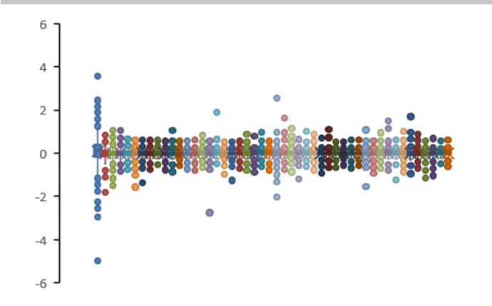
数据来源：华泰期货研究院

图 2：IH 日内收益率箱形图（去极值）
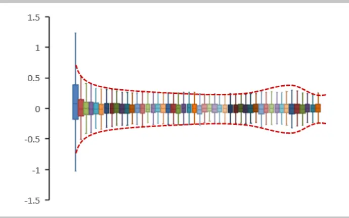
数据来源：华泰期货研究院

图 3：IF 日内收益率箱形图（不去极值）
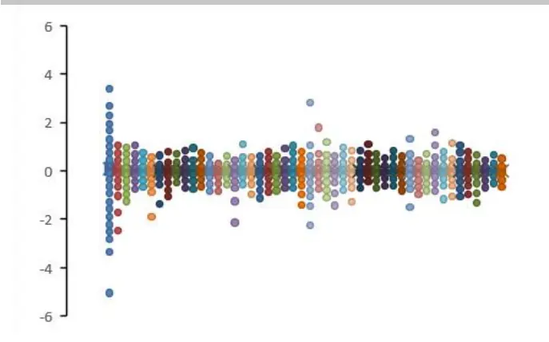
数据来源：华泰期货研究院

图 4：IF 日内收益率箱形图（去极值）
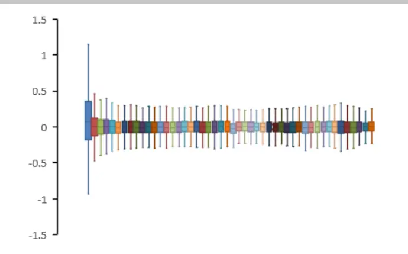
数据来源：华泰期货研究院

图 5：IC 日内收益率箱形图（不去极值）
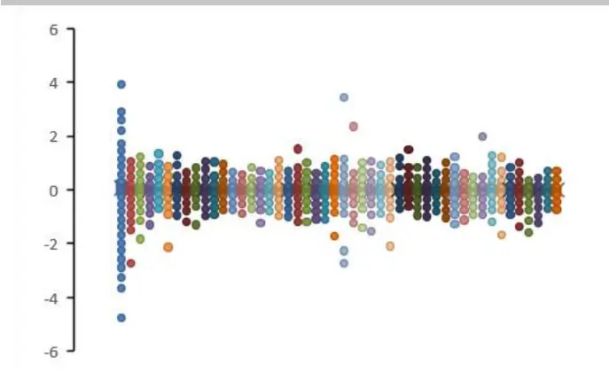
数据来源：华泰期货研究院

图 6：IC 日内收益率箱形图（去极值）
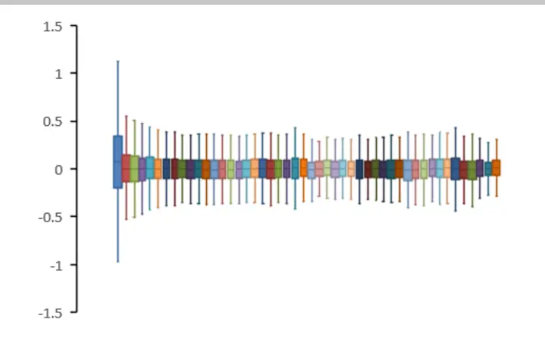
数据来源：华泰期货研究院

09:30~09:35 & 14:25~14:30

以 IC 的 09:30~09:35（时段一）和 14:40~14:45（时段二）为例，进一步分析这两个时段的收益分布情况。

图 7：IC 09:30~09:35 收益分布直方图右偏
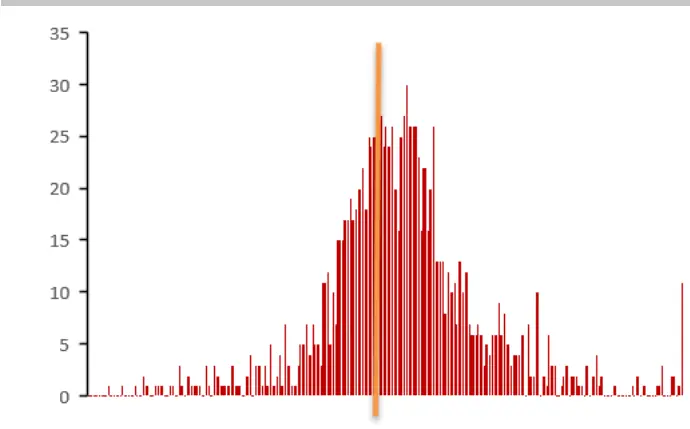
数据来源：Wind，华泰期货研究院

图 8：IC 14:40~14:45 收益分布直方图左偏
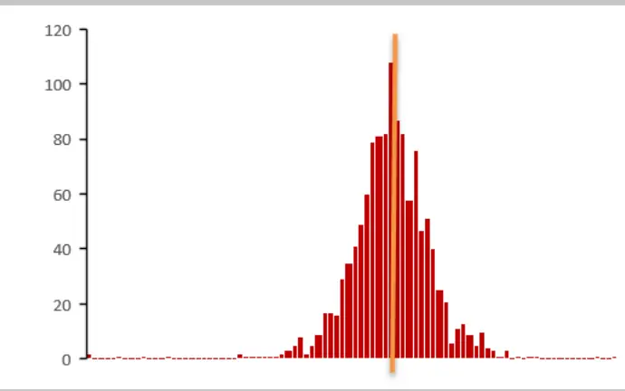
数据来源：Wind，华泰期货研究院

图7 与图 8为 IC 在这两个时段的收益分布直方图，较为明显的是时段一中方差明显大于时段二，并且在偏度上，时段一更为右偏，而时段二更为左偏。

偏度的存在使得不同时段呈现出稳定的涨跌特征。假设我们以每上一个时段的收盘价开仓，并以当前时段的收盘价平仓，那么各个时段的累计收益呈现出较为明显的持续性特征：

图 9：IC 各时段收益分布累计点数呈持续性特征
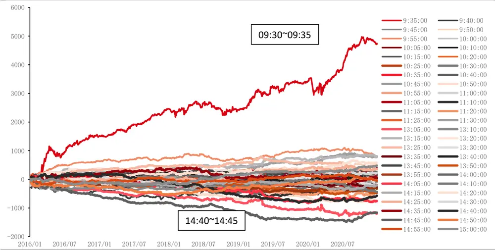
数据来源：Wind，华泰期货研究院

图 9 中两个具有较为独特趋势性的时段即为时段一以及时段二，若简单以上述的方式进行交易，也可成为比较不错的交易策略。我们希望能够在此基础上进一步提高策略表现，因此从以下几个角度展开。

## 日内相关性

首先考虑不同切片的日间相关性，存在两种可能性：

1.市场波动显著大于日内收益分布影响，切片间正相关性较高，则可通过多空组合抵消市场波动影响；

2.日内收益分布显著大于市场波动影响，切片间负相关性较高，则可通过纯多或纯空提高策略稳定性。

图 10： IC 日内收益分布相关性热力图
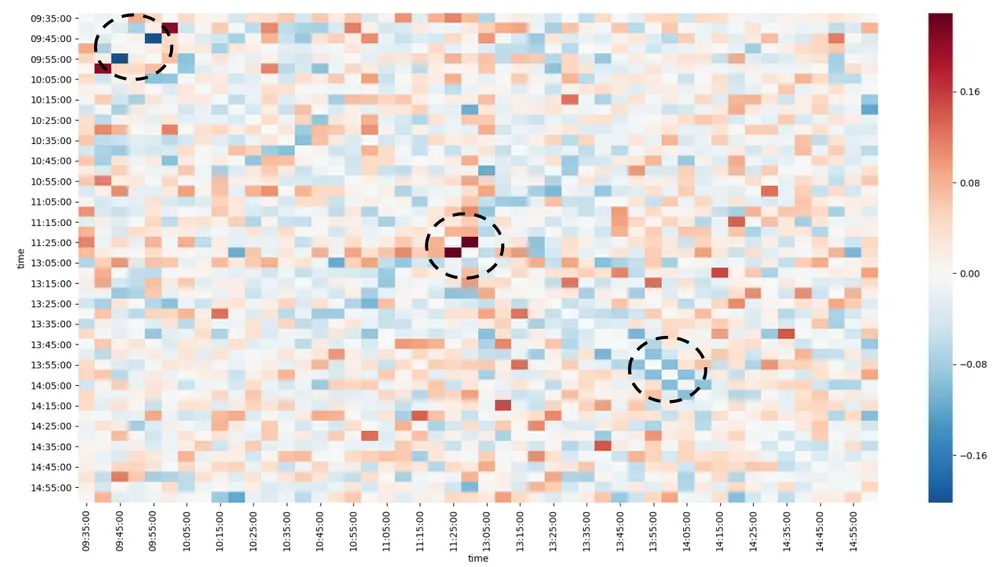
数据来源：Wind，华泰期货研究院

从相关性热力图看，各切片间的相关关系并没有较为明显的特征，暂搁置从相关性角度的展开。

## 指数与基差

其次考虑指数与基差的关系。上文主要考察对象为股指期货主力合约，而股指期货价格变动可以分为两个部分：标的指数变动以及期指基差变动，因此进一步将期指日内收益分布拆分为指数日内收益分布以及基差日内收益分布两个部分。

首先考虑指数变动，考察中证 500 指数自 2016 年 1 月 1 日至 2020 年 12 月 31 日的 5 分钟切片数据，较为明显的发现 14：55~15：00 指数持续性上行，而 14：40~14：45 以及 09：30~09：45指数持续性下行。

图 11： 中证 500 指数各时段收益分布累计点数呈持续性特征
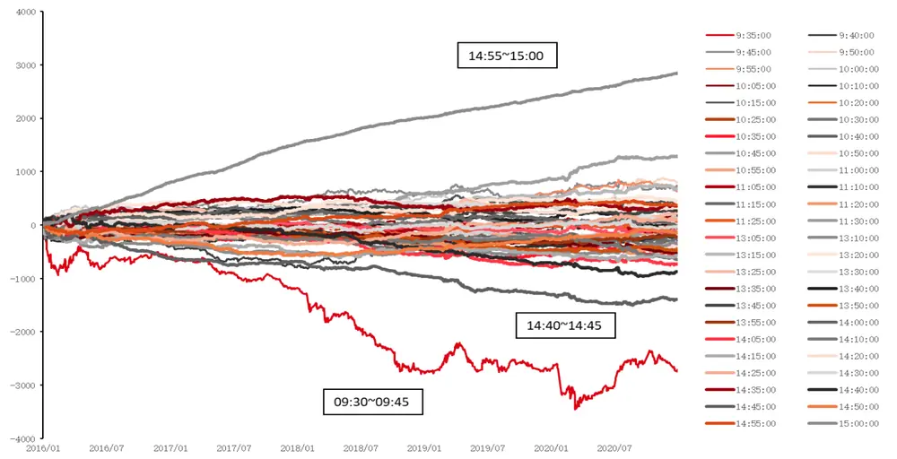
数据来源：Wind，华泰期货研究院

这与股指期货 14：40~14：45 下行的结论一致，而与股指期货 09：30~09：45 上行的结论不一致。因此进一步考察 IC 基差的变动。而从基差的变动可以清晰的看出，09：30~09：35基差持续性上行，13：00~13：05 以及 14：55~15：00基差持续性下行。

图 12： IC 基差各时段收益分布累计点数呈持续性特征
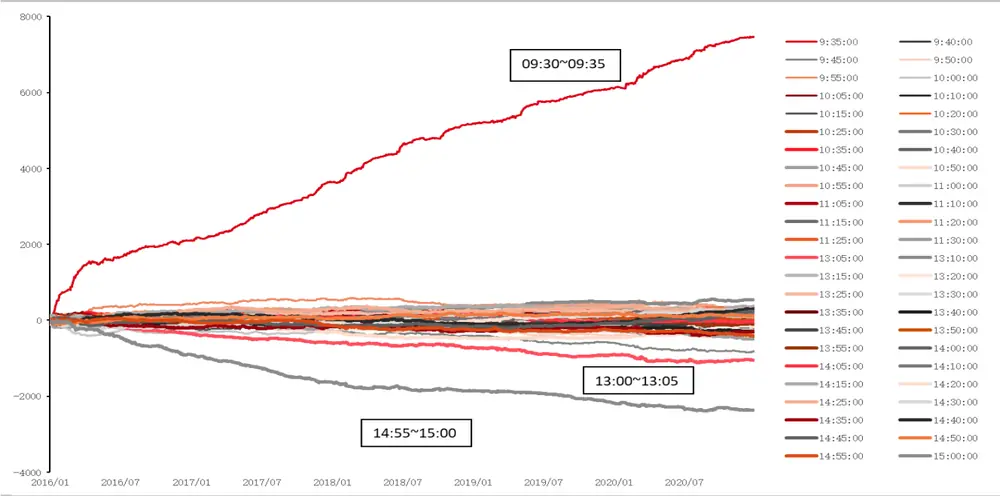
数据来源：Wind，华泰期货研究院

对以上提到的四个时间段做出总结：

09：30~09：35，隔夜的对冲头寸平仓，基差大幅上行，尽管指数下跌，但仍带动股指期货大幅上行；

13：00~13：05，对冲头寸开始建仓，指数无较大变化，因此股指期货小幅下跌；

14：40~14：45，基差无较大变化，指数小幅下行，因此股指期货继续小幅下跌；

14：55~15：00，对冲头寸继续建仓，基差小幅下行，而指数小幅上行，两者相互抵消导致股指期货走平。

表格 1：IC 四个时间段总结

|  | 指数 | 股指期货 | 基差 |
| --- | --- | --- | --- |
| 09：30~09:35 |  | ↑ ↑ | ↑ ↑ ↑ |
| 13：00~13：05 |  | 1 |  |
| 14：40~14：45 | 1 |  |  |
| 14:55~15：00 | 1 |  | 1 |

资料来源：Wind，华泰期货研究院

因此，基于对投资者行为的判断，相对持有指数基准或持有股指期货基准，构建四个时段的增强型策略：

①09：30~09：35 持有股指期货；

②13：00~13：05 持有指数；

③14：40~14：45 空仓；

④14：55~15：00 持有指数

剩余时间均持有股指期货或指数。

图 13： 增强型策略vs（简单持有指数 or 股指期货）
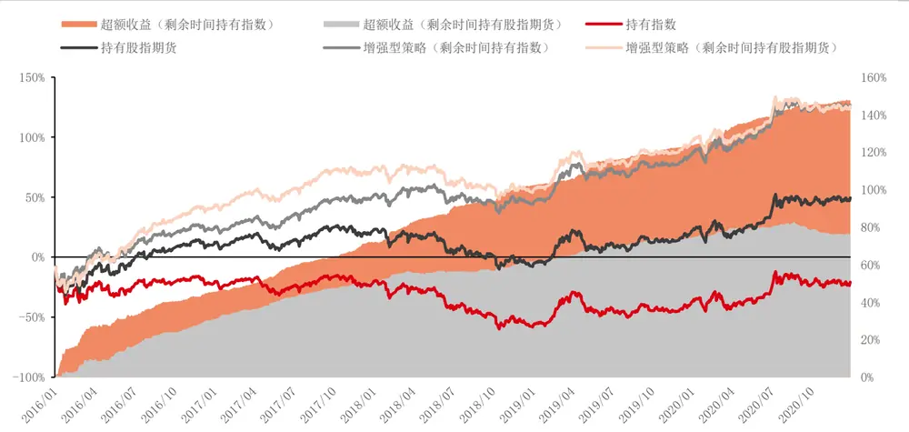
数据来源：Wind，华泰期货研究院

其中，各分项操作的超额贡献率如下表：

表格 2：各分项操作对超额贡献率

|  | 09：30~09：35 13：00~13：05 持有股指期货 持有指数 | 14:40~14:45 14:55~15:00 空仓 | 持有指数 | 基准 | 总计 |
| --- | --- | --- | --- | --- | --- |
| 剩余时间持有 指数 | 124% | 23% |  | -21% | 127% |
| 剩余时间持有 股指期货 |  | 17% 19% | 40% | 49% | 126% |

资料来源：Wind，华泰期货研究院

最终两种增强方案在 2016~2020 年间的总计表现相差无几，投资者可以从体量规模角度选择较为合适的方案，对于体量较小的投资者，打新等额外收益率较高，推荐剩余时间持有指数etf；对于体量较大的投资者，资金占用绝对额较大，推荐剩余时间持有使用保证金交易的股指期货合约。

总结来看，本文通过从股指期货的量价特征 1——日内收益分布角度出发，探讨了由投资者行为导致的长期有效的股指期货日内分布不均匀，并由此衍生出替代长期持有指数或股指期货的增强型多头策略。

本系列后续仍将从股指期货的量价特征出发，探讨更多股指期货的潜在交易机会。

## 免责声明

本报告基于本公司认为可靠的、已公开的信息编制，但本公司对该等信息的准确性及完整性不作任何保证。本报告所载的意见、结论及预测仅反映报告发布当日的观点和判断。在不同时期，本公司可能会发出与本报告所载意见、评估及预测不一致的研究报告。本公司不保证本报告所含信息保持在最新状态。本公司对本报告所含信息可在不发出通知的情形下做出修改，投资者应当自行关注相应的更新或修改。

本公司力求报告内容客观、公正，但本报告所载的观点、结论和建议仅供参考，投资者并不能依靠本报告以取代行使独立判断。对投资者依据或者使用本报告所造成的一切后果，本公司及作者均不承担任何法律责任。

本报告版权仅为本公司所有。未经本公司书面许可，任何机构或个人不得以翻版、复制、发表、引用或再次分发他人等任何形式侵犯本公司版权。如征得本公司同意进行引用、刊发的，需在允许的范围内使用，并注明出处为“华泰期货研究院“，且不得对本报告进行任何有悖原意的引用、删节和修改。本公司保留追究相关责任的权力。所有本报告中使用的商标、服务标记及标记均为本公司的商标、服务标记及标记。

华泰期货有限公司版权所有并保留一切权利。

## 公司总部

地址：广东省广州市越秀区东风东路761号丽丰大厦20层

电话：400-6280-888

网址：www.htfc.com