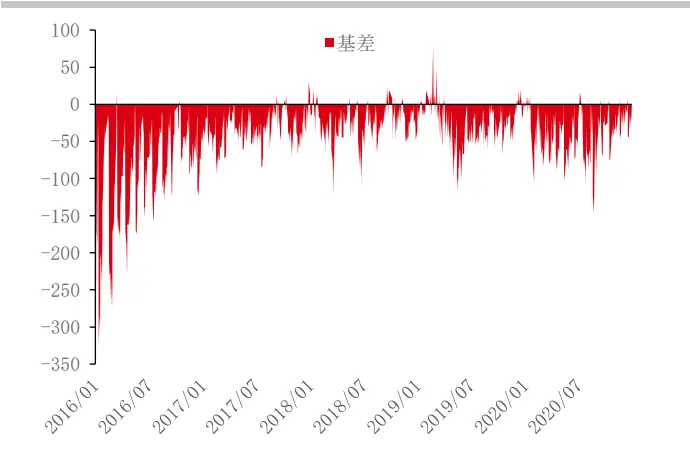
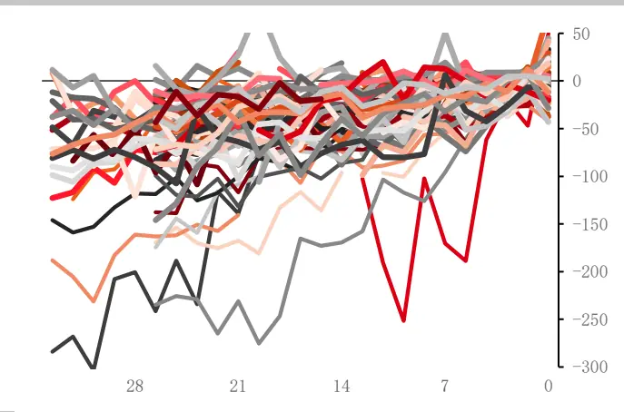
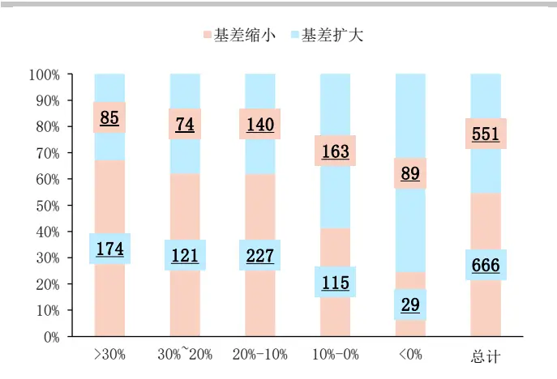
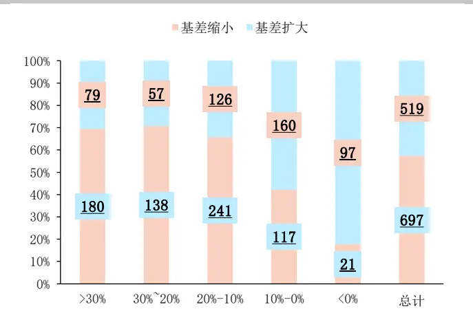
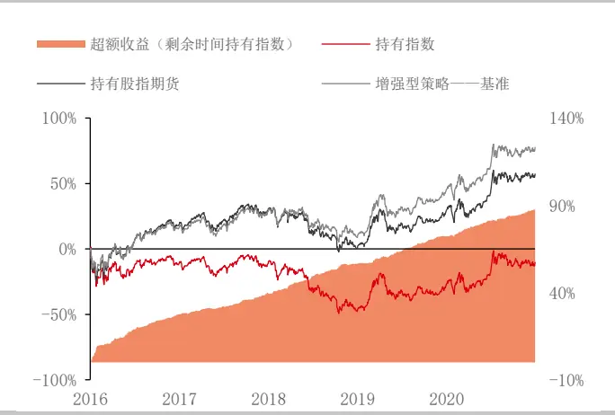
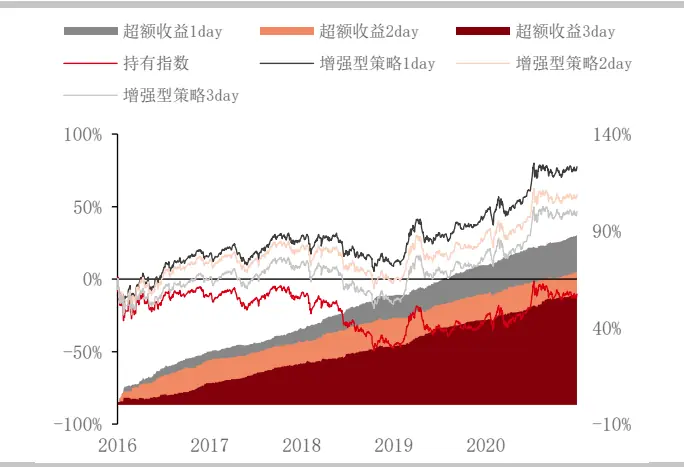
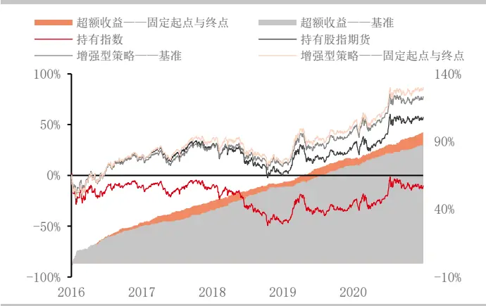
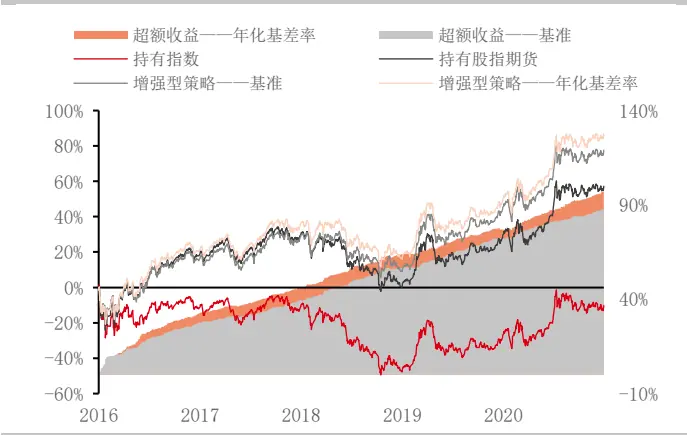
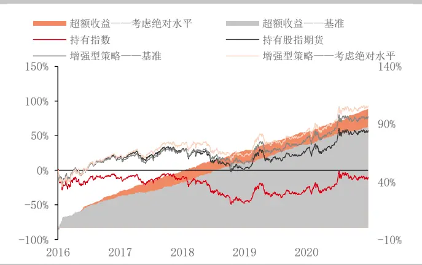

## 量价特征 2——基差反转

股指期货以及相对应指数的各类量价特征，不管在中低频维度上亦或在较高频的维度上，均受到各类投资者的广泛关注。基于量价特征构建的交易策略，也已成为各类交易策略中不可忽视的重要内容。因此本系列报告将从股指期货的量价特征出发，系统性的深入研讨量价表现中的独特情况，希望能够对各位投资者有所启发。

本系列第一篇报告《华泰期货股指期货专题：量价特征 1——日内收益分布》从日内收益分布角度展开，构建了基于日内收益分布特点的指数增强型策略。本篇报告作为系列的第二篇，试图从基差反转角度展开，深度讨论基差反转现象以及出现的原因，并同样基于基差反转现象构建量化策略。后续我们会陆续推出基于量价特征的报告，请投资者持续关注。

基差的反转现象在股指期货中普遍存在，基差作为股指期货与股票指数价格间的差值，是一个天然带有“上有顶且下有底”属性的价差。尽管从中长期来看，基差整体的上下限受到专业投资者边际超额收益攫取水平的影响，会出现比较大的波动；但是这也不影响负基差水平决定了其对多头投资者的吸引力大小这一基本判断。在负基差较大时，多头投资者更倾向于使用股指期货替代股票投资，而在负基差较小时，贴水的吸引力则不如个股可能存在的 alpha。基于这样的投资者心理，基差的反转现象也就不言而明。

基于对基差反转效应的理解，相对持有指数基准或持有股指期货基准，我们构建了不同的基差反转增强型策略，并取得稳定的超额收益。

本系列后续仍将从股指期货的量价特征出发，探讨更多股指期货的潜在交易机会。

投资咨询业务资格：

证监许可【2011】1289 号

研究院 量化组

研究员

高天越

- 0755-23887993

- gaotianyue @htfc.com

从业资格号：F3055799

投资咨询号：Z0016156

## 股指期货量价特征

股指期货以及相对应指数的各类量价特征，不管在中低频维度上亦或在较高频的维度上，均受到各类投资者的广泛关注。基于量价特征构建的交易策略，也已成为各类交易策略中不可忽视的重要内容。

因此本系列报告将从股指期货的量价特征出发，系统性的深入研讨量价表现中的独特情况，希望能够对各位投资者有所启发。

本系列第一篇报告《华泰期货股指期货专题：量价特征1——日内收益分布》从日内收益分布角度展开，构建了基于日内收益分布特点的指数增强型策略。本篇报告作为系列的第二篇，试图从基差反转角度展开，深度讨论基差反转现象以及出现的原因，并同样基于基差反转现象构建量化策略。后续我们会陆续推出基于量价特征的报告，请投资者持续关注。

## 基差反转

基差的反转现象在股指期货中普遍存在，基差作为股指期货与股票指数价格间的差值，是一个天然带有“上有顶且下有底”属性的价差。尽管从中长期来看，基差整体的上下限受到专业投资者边际超额收益攫取水平的影响，会出现比较大的波动；但是这也不影响负基差水平决定了其对多头投资者的吸引力大小这一基本判断。

在负基差较大时，多头投资者更倾向于使用股指期货替代股票投资，而在负基差较小时，贴水的吸引力则不如个股可能存在的 alpha。基于这样的投资者心理，基差的反转现象也就不言而明。

与本系列第一篇报告《华泰期货股指期货专题：量价特征1——日内收益分布》相同，我们首先使用 IC 股指期货主力合约，以及相对应的标的指数自 2016 年 1 月 1 日至 2020 年 12月31日的日频数据，作为研究对象，试图寻找日间基差的反转效应，并给出理论推演。

## 基差收敛

受到交割制度的约束，负基差通常会在临近到期前收敛至平水左右，但基差的收敛往往并不均匀。图 2中的IC 主力合约基差经过了距离到期日调整，可以看出虽然整体的收敛趋势较为明显，但是收敛过程中基差的波动也十分剧烈。

而对于一个固定了起点和终点的时间序列，如果途中出现偏离连接线较远的情况，或早或晚的回归也是必然的，这也是基差反转现象另一个可能的原因。

图 1：IC 主力合约基差

数据来源：华泰期货研究院

图 2：IC 主力合约基差（到期日调整）

数据来源：华泰期货研究院

具体看主力合约收敛过程中的基差波动，首先从整体出发，由于股指期货长期处于深度贴水状态，因此具有较强的内在修复动力，基差缩小的占比达到 60%；其次对主力合约年化基差率做出区分，可以发现基差处于较高绝对水平时，后续缩小的占比较高，而当基差处于较低绝对水平时，后续扩大的占比较高；最后不仅对于后续一日，后续两日基差的反转效应仍然存在。

图 3：IC 主力合约基差波动情况（后续一日）

数据来源：华泰期货研究院

图 4：IC 主力合约基差波动情况（后续两日）

数据来源：华泰期货研究院

因此与《华泰期货股指期货专题：量价特征1——日内收益分布》类似，我们首先构建相对持有指数或者相对持有股指期货的增强型策略：

对于相对持有指数而言，若基差缩小则判断未来基差扩大，继续持有指数，若基差扩大则判断未来基差缩小，转而持有股指期货；相对持有股指期货同理。

两种增强型方案的 benchmark不同，但增强后结果相同（都是在股指期货与指数间切换），最终在持有股指期货的获得贴水收敛超额收益的基础上，仍能获得年化约 4%的超额收益。

图 5：增强型策略——通过基差的反转效应

数据来源：华泰期货研究院

图 6：增强型策略滞后 N 日

数据来源：华泰期货研究院

上文我们考察了股指期货基差反转具有持续性作用，这里构建基于过去 N 日的基差反转策略，可以看到在滞后若干期的环境下，基差反转仍能带来一定的收益。

## 考虑基差随时间收敛特性

上文我们考察了股指期货基差反转具有持续性作用，这里构建基于过去 N 日的基差反转策略，可以看到在滞后若干期的环境下，基差反转仍能带来一定的收益，说明基差反转确实存在一定的交易空间。但简单的考察基差的反转效应，既没有考虑到基差随时间收敛的特性，也没有考虑到基差不同绝对水平下反转概率的高低。

因此首先考虑基差随时间收敛的特性，我们从以下两个角度出发考察时间收敛特性：

## 1.固定起点与终点

假定主力合约切换第一日基差水平为正常水平，通过与到期日基差为 0，“固定”基差时间序列起点为第一日基差、终点为 0。通过对基差时间序列进行线性插值，若实际基差处于直线下方（贴水过多），则持有股指期货；若实际基差处于直线上方（贴水较少），则持有指数，合约切换当日统一持有股指期货。

图 7：增强型策略——固定起点与终点

数据来源：华泰期货研究院

图 8：增强型策略年换手次数——固定起点与终点

| 固定起点与终点 |  | 基准 |
| --- | --- | --- |
| 2016 | 70 |  |
| 2017 | 82 | 149 |
| 2018 | 82 | 161 |
| 2019 | 92 | 148 |
| 2020 | 94 | 153 |

数据来源：华泰期货研究院

固定起点与终点后，增强型策略收益表现略胜于基准增强策略，而在策略年换手次数上全面领先于基准反转策略。

## 2.年化基差率

通过对主力合约基差做年化基差率处理，消除基差随时间收敛特性的影响，若年化基差率大于昨日年化基差率（贴水过多），则持有股指期货；若年化基差率小于昨日年化基差率（贴水较少），则持有指数，合约切换当日统一持有股指期货。

年化基差率处理后的增强型策略收益表现与固定起点终点的表现相差无几，而在换手率上，由于前后只相隔一天，年化处理与否只会在基差绝对值变动较小的情况下产生作用，因此在换手次数上仅规避了个别交易日。

图 9：增强型策略——年化基差率

数据来源：华泰期货研究院

图 10： 增强型策略年换手次数——年化基差率

|  | 年化基差率 | 基准 |
| --- | --- | --- |
| 2016 | 140 | 145 |
| 2017 | 145 | 149 |
| 2018 | 155 | 161 |
| 2019 | 146 | 148 |
| 2020 | 149 | 153 |

数据来源：华泰期货研究院

## 考虑基差绝对水平

再考虑股指期货基差在不同绝对水平下反转概率的高低，第一部分中我们考察了主力合约收敛过程中的基差波动，对主力合约年化基差率做出区分，可以发现基差处于较高绝对水平时，后续缩小的占比较高，而当基差处于较低绝对水平时，后续扩大的占比较高。

这里我们进一步细化，在基差绝对水平的基础上，考察基差前一日的波动方向，以及后续是否反转的概率。可以看到若基差走窄至较高水平，后续持续走窄的可能性较大；而若走窄至较低水平，后续反转的可能性较大；若基差走扩至较高水平，后续反转的概率较高；而若基差走扩至较低水平，后续持续走扩的可能性较大。

因此基于对基差不同水位以及前一日波动方向的考虑，抉择持有股指期货或指数。

图 11： 不同水位基差波动分布

| 年化基差率 | 缩小反转 | 缩小未反转 | 扩大反转 | 扩大未反转 |
| --- | --- | --- | --- | --- |
| >30% | 47.12% | 52.88% | 77.27% | 22.73% |
| 30%~20% | 48.48% | 51.52% | 72.92% | 27.08% |
| 20%-10% | 47.67% | 52.33% | 72.41% | 27.59% |
| 10%-0% | 68.42% | 31.58% | 57.01% | 42.99% |
| <0% | 74.49% | 25.51% | 20.00% | 80.00% |

数据来源：华泰期货研究院

图 12： 增强型策略——考虑绝对水平

数据来源：华泰期货研究院

基于基差绝对水平的基差反转策略相比基准反转策略仍能获得一定的稳定超额收益。

总结来看，本文通过从股指期货的量价特征 2——基差反转角度出发，探讨了由上有顶下有底的基差天然的反转效应，并由此衍生出替代长期持有指数或股指期货的增强型多头策略。本系列后续仍将从股指期货的量价特征出发，探讨更多股指期货的潜在交易机会。

## 免责声明

本报告基于本公司认为可靠的、已公开的信息编制，但本公司对该等信息的准确性及完整性不作任何保证。本报告所载的意见、结论及预测仅反映报告发布当日的观点和判断。在不同时期，本公司可能会发出与本报告所载意见、评估及预测不一致的研究报告。本公司不保证本报告所含信息保持在最新状态。本公司对本报告所含信息可在不发出通知的情形下做出修改，投资者应当自行关注相应的更新或修改。

本公司力求报告内容客观、公正，但本报告所载的观点、结论和建议仅供参考，投资者并不能依靠本报告以取代行使独立判断。对投资者依据或者使用本报告所造成的一切后果，本公司及作者均不承担任何法律责任。

本报告版权仅为本公司所有。未经本公司书面许可，任何机构或个人不得以翻版、复制、发表、引用或再次分发他人等任何形式侵犯本公司版权。如征得本公司同意进行引用、刊发的，需在允许的范围内使用，并注明出处为“华泰期货研究院“，且不得对本报告进行任何有悖原意的引用、删节和修改。本公司保留追究相关责任的权力。所有本报告中使用的商标、服务标记及标记均为本公司的商标、服务标记及标记。

华泰期货有限公司版权所有并保留一切权利。

## 公司总部

地址：广东省广州市越秀区东风东路761号丽丰大厦20层

电话：400-6280-888

网址：www.htfc.com