## 量价特征 3——席位特征

股指期货以及相对应指数的各类量价特征，不管在中低频维度上亦或在较高频的维度上，均受到各类投资者的广泛关注。基于量价特征构建的交易策略，也已成为各类交易策略中不可忽视的重要内容。因此本系列报告将从股指期货的量价特征出发，系统性的深入研讨量价表现中的独特情况，希望能够对各位投资者有所启发。

本篇报告作为系列的第三篇，将从中金所每日披露的股指期货经纪商席位成交持仓表出发，深度探讨各席位背后不同类型主体交易者一致性交易行为导致的各席位长期不同表现。传统报告中对于席位的分析多停留于对于成交持仓表的简单运用，暗含的逻辑为上榜经纪商席位影响重大。但本文认为不同席位间存在较为明显的差别，因此对于席位交易信息的利用不能一概而论。

本文基于对各席位投资者行为的划分，将全体备选席位在以下几个角度进行区分，包括：持仓方向、持仓波动、换手率、指数相关性。

从持仓方向角度看，有持续偏爱做多的席位，相对应也有持续偏爱做空的席位；从持仓波动角度看，既有每日来回切换头寸的席位，又有建仓即锁仓的席位；从成交角度看，有些席位会在日内高频交易，而其它席位的换手率偏低；从相关性角度看，有喜欢追涨杀跌的席位，也有喜欢高抛低吸的席位；最后从收益角度看，存在持续赚钱的席位，也存在持续亏钱的席位。

最终我们可以发现在Pos、Rank、Corr、Vega这四个持仓维度上，收益与因子呈正的单调性，而在 Turn这个成交维度上，收益与因子呈负的单调性。对于这样的现象，我们简单理解即为具有明显的方向偏好、并且头寸跟随市场具有一定的正向波动、同时换手并不剧烈的席位在收益角度上表现良好。

后续我们将进一步尝试刻画出各类型席位背后主体交易者的行为特征，探讨更多股指期货的潜在交易机会。

投资咨询业务资格：

证监许可【2011】1289 号

研究院 量化组

研究员

高天越

- 0755-23887993

- gaotianyue @htfc.com

从业资格号：F3055799

投资咨询号：Z0016156

## 股指期货量价特征

股指期货以及相对应指数的各类量价特征，不管在中低频维度上亦或在较高频的维度上，均受到各类投资者的广泛关注。基于量价特征构建的交易策略，也已成为各类交易策略中不可忽视的重要内容。

因此本系列报告将从股指期货的量价特征出发，系统性的深入研讨量价表现中的独特情况，希望能够对各位投资者有所启发。

本篇报告作为系列的第三篇，将从中金所每日披露的股指期货经纪商席位成交持仓表出发，深度探讨各席位背后不同类型主体交易者一致性交易行为导致的各席位长期不同表现并，在此基础上开发交易策略。后续我们会陆续推出基于量价特征的报告，请投资者持续关注。

## 成交持仓表——席位特征

中金所在每日收盘后会公布股指期货经纪商席位的成交持仓表，内容包括各合约前 20名多边持仓、空边持仓以及成交量数据。

传统报告中对于席位的分析多停留于对于成交持仓表的简单运用，暗含的逻辑为上榜经纪商席位影响重大。但本文认为不同席位间存在较为明显的差别，因此对于席位交易信息的利用不能一概而论。

考察 2019 年 1 月 1 日至 2021 年 4 月 30 日的 IF 主力合约成交持仓表情况，以全市场总持仓、总成交为基准，可以发现前 5、前 10 以及前 20 的占比较为稳定，分别在 30%、50%、70%左右。

图 1：IF 主力合约成交持仓占比较为稳定且集中
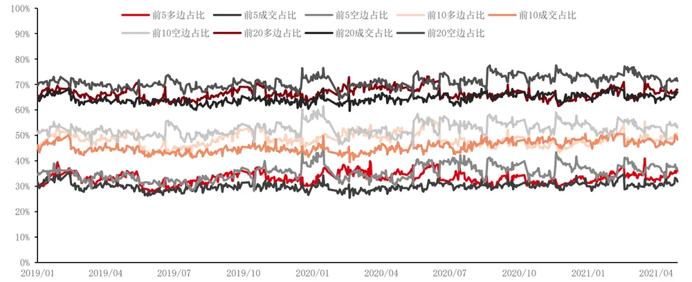
数据来源：Wind，华泰期货研究院

若只考察上榜经纪商总体的席位变化，由于总体席位占比较高且较为稳定，与全市场区别不大，因此有效信息含量较少且粗糙。在此基础上开发策略，以简单的总体席位多空变化策略为例，虽然可能有效，但是放弃了利用成交持仓表隐含的海量信息，对于数据的清洗过于彻底。

我们认为与其把所有的上榜经纪商席位混为一谈，不如试图找出不同席位之间的显著差别，并依据差别对席位进行分类，并总结席位特征背后的投资者行为逻辑，在此基础上再去开发相应的策略更为可靠。

因此为了对各席位投资者行为划分，将全体备选席位在以下几个角度进行区分，包括：持仓方向、持仓变化速度、换手率、交易趋势以及期限结构。

注：以下数据来源 2019年1 月至2021年 4月间 IF所有上市合约的成交持仓表，剔除期间总上榜次数少于 100 次的不活跃席位，所有席位均做匿名处理（xxxx），具体数据可联系本文作者。

## （1）持仓方向

首先考察持仓方向，尽管期货市场整体必然是多空均衡的，但体现在各席位上却并非如此。下图为各席位在 IF所有合约上的净多头头寸，可以看出不同席位对于净头寸的暴露模式区别较大。

图 2：各席位在 IF 上的净多头寸区别较大
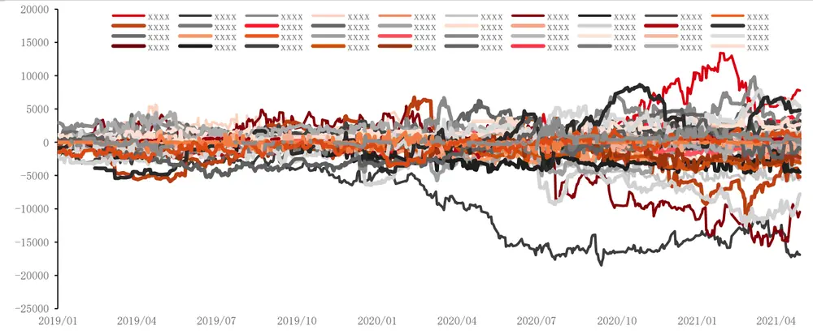
数据来源：Wind，华泰期货研究院

进一步考察不同席位上榜时的平均净头寸方向（若单边未上榜则使用单边 0 替代且参与后续计算、双边未上榜则使用双边 0替代且不参与后续计算）：

不同席位净头寸均值分布在正 3k至负 8k，区别较大。大部分席位的净头寸处于 0 值附近，没有明显的多空偏好；少部分席位长期具有多空的方向选择，并且净头寸暴露较大。

图 3：各席位净头寸数量&占比
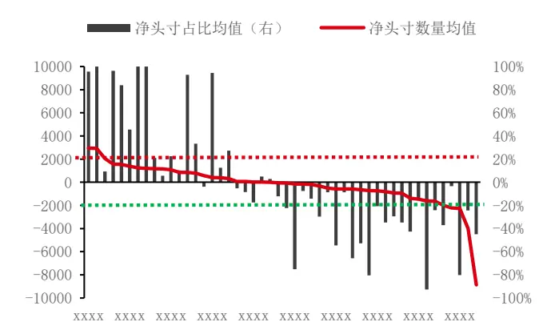
数据来源：华泰期货研究院

图 4：各席位净头寸数量&排名
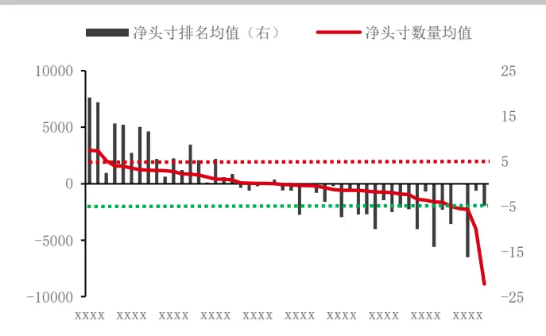
数据来源：华泰期货研究院

另外，由于整体股指期货市场持仓量在过去两年间变化较大，体现在各席位上也变化较大，因此这里我们除了净头寸的绝对数量以外，也考虑了各席位的净头寸占比以及净头寸的相对排名。可以看到净头寸占比与净头寸排名都与净头寸数量整体呈正相关，并且自带了“归一化”处理。

我们以净头寸占比+20%以及-20%为分界线，将所有席位分为 Posi+1、Posi+0、Posi-1 三个类别，分别代表主体投资者方向常为多、平、空；同样，以相对排名+5 以及-5 为分界线，将所有席位分为 Rank+1、Rank+0、Rank-1三个类别，分别代表主体投资者方向常为多、平、空。

## （2）持仓波动

其次考察各席位的持仓波动。我们看到除了不同席位的持仓方向有所区别外，同一席位自身的持仓方向也经常出现变化，这里我们继续以数量、占比以及排名三个角度考察波动。

与（1）持仓方向三个角度呈正相关不同，（2）持仓波动呈现出两边高、中间低的特性，即占比波动较大以及较小的席位在绝对数量的波动上都较大，而占比波动处于中间值的席位在绝对数量上的波动较小；同样，排名波动较大以及较小的席位在绝对数量的波动上也都较大，而排名波动处于中间值的席位在绝对数量上的波动也较小。

与（1）持仓方向类似，这里我们也将所有席位在持仓排名波动上分为 Vega+2、Vega+1、Vega+0三类。对此的具体分析见下文。

图 5：各席位净头寸占比波动
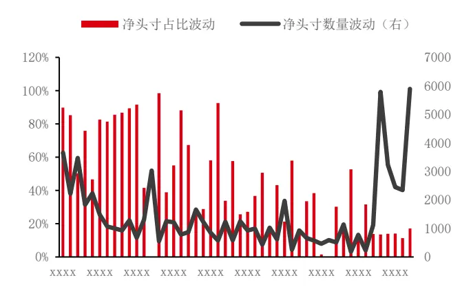
数据来源：华泰期货研究院

图 6：各席位净头寸排名波动
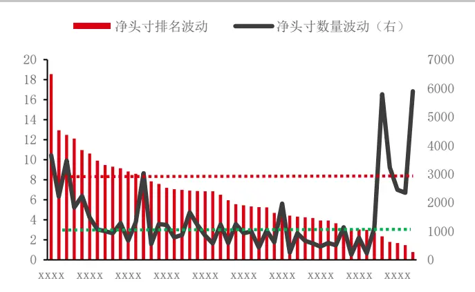
数据来源：华泰期货研究院

## （3）换手率

再考察各席位的换手率，成交持仓表除了披露多空双边的持仓量之外，还会披露当天的成交量。首先观察各席位的换手率序列，总体可分为两种类型：1、换手率长期稳定在 1附近，并在 0.5 至1.5间波动；2、换手集中在部分时间段、并且其余时间段的换手率基本为 0。

图 7：部分席位换手率序列
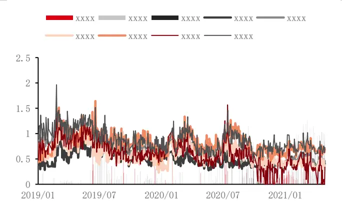
数据来源：华泰期货研究院

图 8：各席位换手率均值与波动
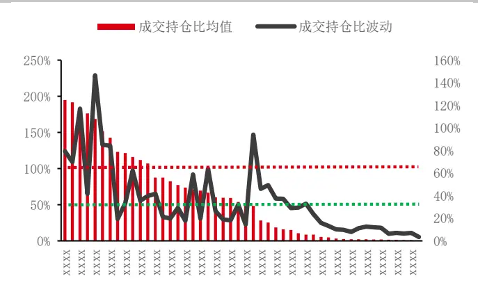
数据来源：华泰期货研究院

计算每日成交量对每日多空总持仓的占比（存在一定误差）：

与（1）持仓方向类似，将所有席位在成交持仓比上分为Turn+2、Turn+1、Turn+0三类，分别代表各席位换手率的高低。

## （4）指数相关性

最后考察各席位持仓与标的指数的相关性，简单来看大部分席位可以分为与指数正相关的追涨杀跌类型或与指数负相关的高抛低吸类型，小部分席位与指数的相关性不明确，可能存在一些比较独特的交易模式。

与（1）持仓方向类似，将所有席位在相关性上分为 Corr+1、Corr+0、Corr-1 三类。

图 9：部分席位净头寸序列与指数
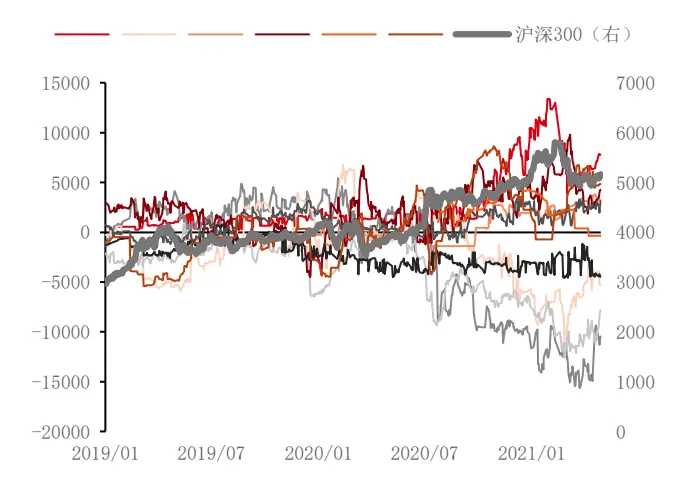
数据来源：华泰期货研究院

图 10： 各席位与指数相关性
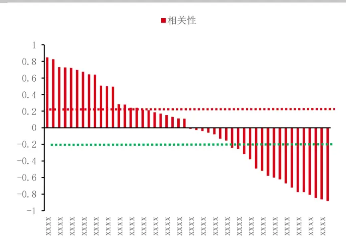
数据来源：华泰期货研究院

## 成交持仓表——席位收益

在进一步对席位特征分析之前，我们首先需要统计各席位的持仓收益。假定席位在日内的持仓不变，那么各席位的收益情况（指数点）如下：

图 11： 各席位在 IF 上的净头寸收益区别较大
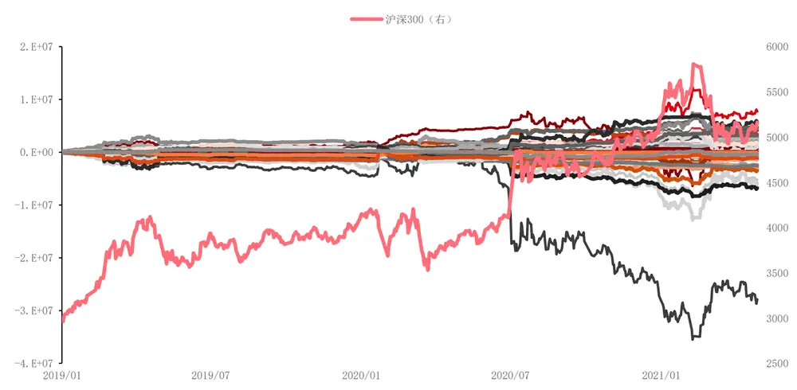
数据来源：Wind，华泰期货研究院

大部分席位呈现出没有明显正收益或负损失的特性，而少部分席位的收益损失情况较为明显，因此我们将前文的席位特征与席位收益结合对比如下：

表格 1：各席位的特征以及收益情况
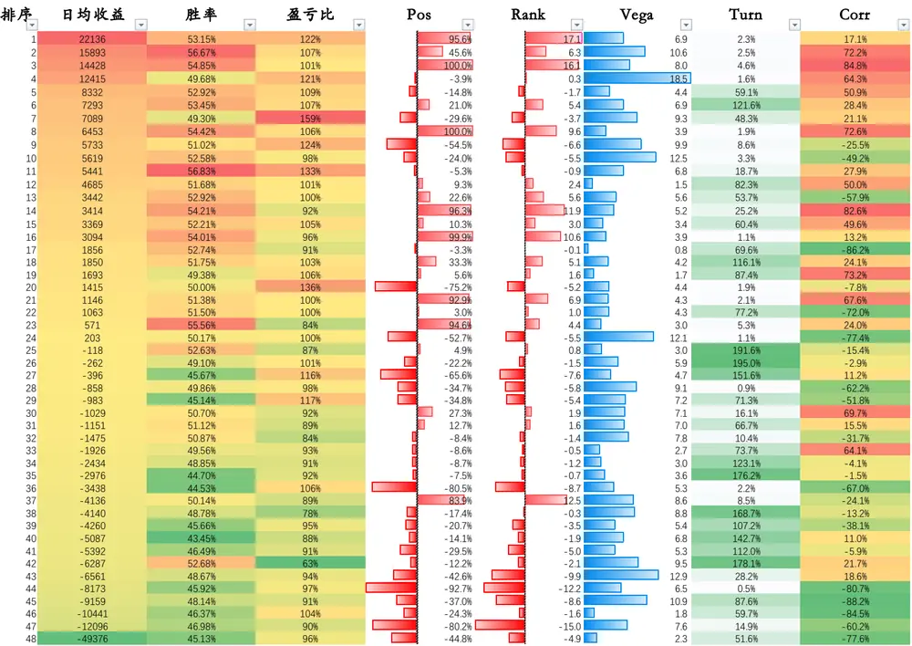
资料来源：Wind，华泰期货研究院

整体来看，与本文主要论点一致，即各个席位间在各方面都存在较大差异，没有办法将其简单混为一谈。从收益角度看，存在持续赚钱的席位，也存在持续亏钱的席位；从持仓方向角度看，有持续偏爱做多的席位，相对应也有持续偏爱做空的席位；从持仓波动角度看，既有每日来回切换头寸的席位，又有建仓即锁仓的席位；从成交角度看，有些席位会在日内高频交易，而其它席位的换手率偏低；从相关性角度看，有喜欢追涨杀跌的席位，也有喜欢高抛低吸的席位。

表格 2：席位根据指标简单分类

|  | 特征表现 | 日均收益 | 胜率（vs50%） |  | 盈亏比（vs100%） |
| --- | --- | --- | --- | --- | --- |
| 持仓方向 | Pos+1 | 5735.01 |  | 3.3% | -0.2% |
|  | Pos+0 | 779.87 |  | 0.6% | -4.1% |
|  | Pos-1 | -5074.19 | -2.2% | 6.2% |  |
|  | Rank+1 | 6819.38 | 3.4% | 2.0% |  |
|  | Rank+0 | -1993.71 | -0.1% | -1.9% |  |
| 持仓波动 | Rank-1 | -2391.09 | -1.8% | 5.4% |  |
|  | Vega+2 | 2408.67 | 0.9% | 5.4% |  |
|  | Vega+1 | 717.67 | -0.1% | 1.4% |  |
|  | Vega+0 | -3503.92 | 0.6% | -3.7% |  |
| 换手率 | Turn+2 | -2363.26 | 1 | -1.1% | -10.7% |
|  | Turn+1 | -2394.82 |  | -0.4% | 1.1% |
|  | Turn+0 | 3167.15 |  | 1.5% | 4.0% |
| 指数相关性 | Corr+1 | 4712.69 |  | 2.6% | 4.5% |
|  | Corr+0 | -144.06 | 0 | -1.0% | -1.6% |
|  | Corr-1 | -5086.96 |  | -1.2% | T -1.3% |

资料来源：Wind，华泰期货研究院

进一步根据上文的规则进行分类，可以明显发现在Pos、Rank、Vega、Corr这四个持仓维度上，收益与因子呈正的单调性，而在Turn这个成交维度上，收益与因子呈负的单调性。对于这样的现象，我们简单理解即为具有明显的方向偏好、并且头寸跟随市场具有一定的正向波动、同时换手并不剧烈的席位在收益角度上表现良好。

那么，为什么这样的席位能够取得一定的收益？这些席位背后又是怎样的的投资者交易模式导致了这样的收益特征？其余特征的席位又能给我们带来怎样的交易策略？以上问题我们将在《量价特征》系列的后续报告中持续为各位解答。

综上，我们认为席位的成交持仓表蕴含了十分丰富的信息，但目前业界对于其的理解与应用还较为初级。我们希望能够区分不同席位间存在较为明显的差别，不再对所有的席位一概而论，并且深入探讨导致席位不同表现背后的投资者交易模式区别。

## 免责声明

本报告基于本公司认为可靠的、已公开的信息编制，但本公司对该等信息的准确性及完整性不作任何保证。本报告所载的意见、结论及预测仅反映报告发布当日的观点和判断。在不同时期，本公司可能会发出与本报告所载意见、评估及预测不一致的研究报告。本公司不保证本报告所含信息保持在最新状态。本公司对本报告所含信息可在不发出通知的情形下做出修改，投资者应当自行关注相应的更新或修改。

本公司力求报告内容客观、公正，但本报告所载的观点、结论和建议仅供参考，投资者并不能依靠本报告以取代行使独立判断。对投资者依据或者使用本报告所造成的一切后果，本公司及作者均不承担任何法律责任。

本报告版权仅为本公司所有。未经本公司书面许可，任何机构或个人不得以翻版、复制、发表、引用或再次分发他人等任何形式侵犯本公司版权。如征得本公司同意进行引用、刊发的，需在允许的范围内使用，并注明出处为“华泰期货研究院“，且不得对本报告进行任何有悖原意的引用、删节和修改。本公司保留追究相关责任的权力。所有本报告中使用的商标、服务标记及标记均为本公司的商标、服务标记及标记。

华泰期货有限公司版权所有并保留一切权利。

## 公司总部

地址：广东省广州市越秀区东风东路761号丽丰大厦20层

电话：400-6280-888

网址：www.htfc.com