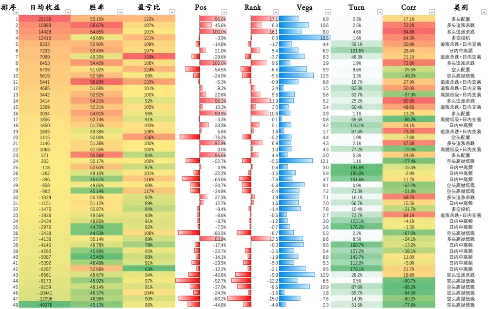
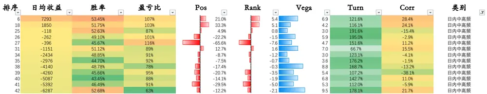
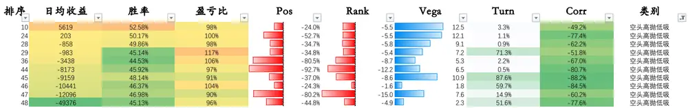
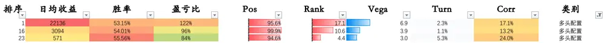
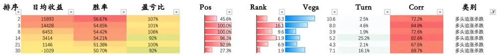
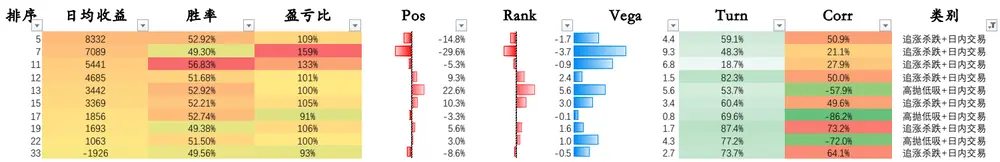
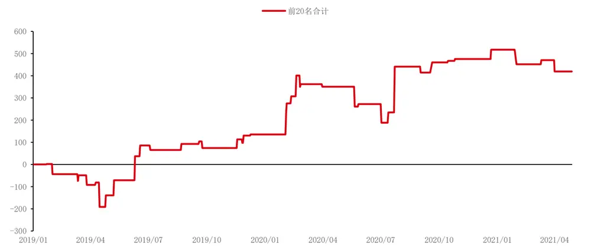
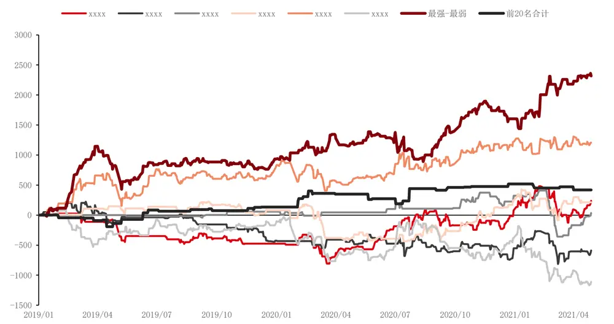

## 量价特征 4——席位策略

股指期货以及相对应指数的各类量价特征，不管在中低频维度上亦或在较高频的维度上，均受到各类投资者的广泛关注。基于量价特征构建的交易策略，也已成为各类交易策略中不可忽视的重要内容。因此本系列报告将从股指期货的量价特征出发，系统性的深入研讨量价表现中的独特情况，希望能够对各位投资者有所启发。

本篇报告作为系列的第四篇，继续从中金所每日披露的股指期货经纪商席位成交持仓表出发，继承第三篇对席位特征的研究，深入到各席位背后主体投资者的交易行为，通过对主体投资者打标签，试图探寻席位收益结构的来源。

我们将所有席位分为以下九类：（1）日内中高频、（2）空头配置、（3）空头追涨杀 跌、（4）空头高抛低吸、（5）多头配置、（6）多头追涨杀跌、（7）多头高抛低吸、 （8）多空投机、（9）未分类。

在分类的基础上，我们可以进一步研究席位特征数据带来的交易策略，但需要明确的是，交易策略一定是与席位特征相匹配的，也就是说交易策略的核心逻辑一定是去捕捉特定席位的交易行为模式。

以市场熟知的“蜘蛛网”策略为例，考虑到“蜘蛛网”策略的本质为假定前20名席位总体仓位变动具有对指数的“择时”能力，但在经过本文的分类后，我们认为并不是所有席位都在参与“择时”交易，更不用说参与择时交易的席位也不一定具有“择时”能力。将“蜘蛛网”策略应用到在做“择时”交易、并且也具有“择时”能力的席位上，是对席位分类的一种应用体现。

当然，除了“蜘蛛网”策略之外，还有很多基于席位成交持仓表的策略有待开发，不过这就不是本文的重点了。本文希望能够抛砖引玉，帮助读者理顺“不同席位具有不同交易模式”的逻辑，使得各位读者能在此基础上再开发基于不同交易模式的策略。

投资咨询业务资格：

证监许可【2011】1289 号

研究院 量化组

研究员

高天越

- 0755-23887993

- gaotianyue @htfc.com

从业资格号：F3055799

投资咨询号：Z0016156

## 股指期货量价特征

股指期货以及相对应指数的各类量价特征，不管在中低频维度上亦或在较高频的维度上，均受到各类投资者的广泛关注。基于量价特征构建的交易策略，也已成为各类交易策略中不可忽视的重要内容。

因此本系列报告将从股指期货的量价特征出发，系统性的深入研讨量价表现中的独特情况，希望能够对各位投资者有所启发。

本篇报告作为系列的第四篇，继续从中金所每日披露的股指期货经纪商席位成交持仓表出发，继承第三篇对席位特征的研究，深入到各席位背后主体投资者的交易行为，通过对主体投资者打标签，试图探寻席位收益结构的来源。

## 成交持仓表——席位分类

表格 1：各席位的特征类型以及收益情况

资料来源：Wind，华泰期货研究院

回顾《量价特征 3——席位特征》的总结图，我们可以较为明显看出，虽然席位在各个角度上的表现差异较大，但可以简单分为以下几类：

## （1）中高频交易

表格 2：中高频交易席位的特征类型以及收益情况

资料来源：Wind，华泰期货研究院

第一类席位我们认为较大可能是高频换手的主体投资者，特征如下：

1.持仓方向暴露不明确；2.持仓波动中等；3.换手率极高；4.与指数相关性不明确

此类席位的换手率较高，但同时持仓变化不大，有理由相信其更多的是不带方向的日内成交行为。同时持仓方向以及相关性均不明确，代表了席位对于指数的日间择时没有明确的看法，我们认为此类席位的主体投资者比较接近日内中高频的行为特征。

## （2）空头配置

表格 3：空头配置席位的特征类型以及收益情况
资料来源：Wind，华泰期货研究院

第二类席位我们认为较大可能是空头对冲的主体投资者，特征如下：

1.持仓方向暴露长期为空头；2.持仓波动中等；3.换手率较低；4.与指数负相关性较低

此类席位长期暴露空头的净头寸，同时换手率较低，比较符合长期空头对冲的交易行为。

## （3）空头追涨杀跌

表格 4：空头追涨杀跌席位的特征类型以及收益情况
资料来源：Wind，华泰期货研究院

第三类席位我们认为较大可能是空头投机的主体投资者，特征如下：

1.持仓方向暴露长期为空头；2.持仓波动较高；3.换手率中等；4.与指数正相关性中等此类席位长期暴露空头的净头寸，同时持仓波动较高，比较符合偏空方向投机者的行为特征。

## （4）空头高抛低吸

表格 5：空头高抛低吸席位的特征类型以及收益情况

资料来源：Wind，华泰期货研究院

第四类席位我们认为较大可能是同样空头对冲的主体投资者，特征如下：

1.持仓方向暴露长期为空头；2.持仓波动中等；3.换手率中等或较低；4.与指数负相关性较高此类席位长期暴露空头的净头寸，同时换手率中等或较低，比较符合长期空头对冲的交易行为。与（2）不同的是，大多数席位的净头寸与指数呈较高的负相关，体现出此类型对冲投资者或许具有“高抛低吸”的对冲特征，即在市场上涨时加大对冲比例，下跌时缩小对冲比例。

## （5）多头配置

表格 6：多头配置席位的特征类型以及收益情况

资料来源：Wind，华泰期货研究院

第五类席位我们认为较大可能是多头配置主体投资者，特征如下：

1.持仓方向暴露长期为多头；2.持仓波动中等或较低；3.换手率较低；4.与指数相关性较低此类席位除去长期暴露多头头寸外没有明显的特征，与多头配置投资者的行为一致。

## （6）多头追涨杀跌

表格 7：多头追涨杀跌席位的特征类型以及收益情况

资料来源：Wind，华泰期货研究院

第六类席位我们认为较大可能是多头投机的主体投资者，特征如下：

1.持仓方向暴露长期为多头；2.持仓波动中等或较高；3.换手率较低；4.与指数正相关性较高此类席位与指数呈极强的正相关，并且净头寸基本为正且波动较大，并且日内换手率较低，符合日间追涨杀跌投资者的行为特征。值得注意的是，部分追涨杀跌席位的日均收益较高。

## （7）多头高抛低吸

表格 8：多头高抛低吸席位的特征类型以及收益情况
资料来源：Wind，华泰期货研究院

第七类席位我们认为较大可能是多头高抛低吸的主体投资者，特征如下：

1.持仓方向暴露长期为多头；2.持仓波动中等或较高；3.换手率较低；4.与指数相关性为负此类席位与（5）类似，但与指数呈负相关，符合日间高抛低吸投资者的行为特征。

## （8）多空投机

表格 9：多空投机席位的特征类型以及收益情况
资料来源：Wind，华泰期货研究院

第八类席位我们认为较大可能是多空投机主体投资者，特征如下：

1.持仓方向暴露不明确；2.持仓波动中等或较高；3.换手率较低；4.与指数相关性绝对值较高此类席位对于多空没有明确的长期偏好，但在日间却有明确的择时观点，符合多空投机交易者的行为特征。

## （9）未分类

表格 10：未分类席位的特征类型以及收益情况

资料来源：Wind，华泰期货研究院

第九类席位我们认为其主导的投资者较难归类，特征如下：

1.持仓方向暴露不明确；2.持仓波动中等或较低；3.换手率较高；4.与指数相关性绝对值较高此类席位没有明确的多空方向，交易行为上追涨杀跌以及高抛低吸都存在；同时换手率较高，日内交易也较为频繁，所以对于其主导投资者的分析较为困难。我们认为此类席位需要针对性的单独理解，没有办法将其简单归类。

## （10）分类结果

在将所有席位分为以上九类之后，我们统计了所有席位日收益间的相关性矩阵如下。可以发现各类型内部的席位之间，相关性普遍较高；而不同类型间的相关性普遍较低，这说明我们的分类是具有一定意义的。

在分类的基础上，我们可以进一步研究席位特征数据带来的交易策略，但需要明确的是，交易策略一定是与席位特征相匹配的，也就是说交易策略的核心逻辑一定是去捕捉特定席位的交易行为模式。

表格 6：各类型席位相关性（乘以 100）

|  |  |  |  |  |  |  |  |  |  |  |  |  |  |  |  |  |  |  |  |  |  |  |  |  |  |  |  |  |  |  |  |  |  |  |  |  |  |  |  | -61 66 |  |
| --- | --- | --- | --- | --- | --- | --- | --- | --- | --- | --- | --- | --- | --- | --- | --- | --- | --- | --- | --- | --- | --- | --- | --- | --- | --- | --- | --- | --- | --- | --- | --- | --- | --- | --- | --- | --- | --- | --- | --- | --- | --- |
|  |  |  |  |  |  |  |  |  |  |  |  |  |  |  |  |  |  |  |  |  |  |  |  |  |  |  |  |  |  |  |  | 42 |  |  |  | -68 100 -55 -66 | 100 76 38 | 0 62 68 -100 66 76 54 63 -71 | 66 -46 |  | 68 |
|  |  |  |  |  |  |  |  |  |  |  |  |  |  |  |  |  |  |  |  |  |  |  |  |  |  |  |  |  |  |  |  |  | 14 |  |  |  |  |  |  |  |  |
|  |  |  |  |  |  |  |  |  |  |  |  |  |  |  |  |  |  |  |  |  |  |  |  |  |  |  |  |  |  |  |  |  |  | -41 |  |  |  |  |  |  |  |
|  |  |  |  |  |  |  |  |  |  |  |  |  |  |  |  |  |  |  |  |  |  |  |  |  |  |  |  |  |  |  |  |  |  | -41 |  |  |  |  |  |  |  |
|  |  |  |  |  |  |  |  |  |  |  |  |  |  |  |  |  |  |  |  |  |  |  |  |  |  |  |  |  |  |  |  |  |  |  | 31 39 20 36 -27 |  |  |  |  |  |  |
|  |  |  |  |  |  |  |  |  |  |  |  |  |  |  |  |  |  |  |  |  |  |  |  |  |  |  |  |  |  |  |  |  |  |  | 31 2 39 47 -41 |  | 99 27 8 23 23 32 |  |  |  |  |
|  |  |  |  |  |  |  |  |  |  |  |  |  |  |  |  |  |  |  |  |  |  |  |  |  |  |  |  |  |  |  |  |  |  |  | 39 213 52 41 |  |  |  |  |  |  |
|  |  |  |  |  |  |  |  |  |  |  |  |  |  |  |  |  |  |  |  |  |  |  |  |  |  |  |  |  |  |  |  |  |  |  | 36 47 52810 |  |  |  |  |  |  |
|  |  |  |  |  |  |  |  |  |  |  |  |  |  |  |  |  |  |  |  |  |  |  |  |  |  |  |  |  |  |  |  |  |  | -41 63 |  | 67 |  |  |  |  |  |
|  |  |  |  |  |  |  |  |  |  |  |  |  |  |  |  |  |  |  |  |  |  |  |  |  |  |  |  |  |  |  | -27 -43 100 |  |  | -40 74 |  | 67 |  |  |  |  |  |
|  |  |  | -54 68 |  |  |  |  |  |  | 80 |  |  |  |  |  |  |  |  |  |  |  |  |  |  |  |  |  | -66 |  |  |  |  |  |  |  |  |  |  |  |  |  |
|  |  |  | -45 69 |  |  |  |  |  |  | 80 |  |  |  |  |  |  |  |  |  |  |  |  |  |  |  |  | 69 |  |  |  |  |  |  |  |  |  |  |  |  |  |  |
|  | -82 -86 100 |  |  | 35 99 68 |  |  |  |  |  |  |  |  |  |  |  |  |  |  |  |  |  |  |  |  |  |  | 98 |  | 94 |  |  |  |  |  |  |  |  |  |  |  |  |
|  |  |  |  |  |  |  |  |  |  |  |  | 92 |  |  |  |  |  |  |  |  |  |  |  |  |  |  |  |  |  |  |  |  |  |  |  |  |  |  |  |  |  |
|  |  |  |  |  |  |  |  |  |  |  | 96 | 92 |  |  |  |  |  |  |  |  |  |  |  | -69 |  |  | 86 | -84 |  |  |  |  |  |  |  |  |  |  |  |  |  |
|  |  | 31 66 |  |  |  |  |  |  |  |  |  |  | 84 89 |  |  |  |  |  |  |  |  |  |  |  |  |  |  |  |  |  |  |  |  |  |  |  |  |  |  |  |  |
|  |  | 26 73 |  | 44 23 66 | 6 77 -5 |  |  |  |  |  | 91 |  | 8493 |  |  |  |  |  |  |  |  |  |  |  |  |  | 55 |  |  | 21 |  |  |  |  |  |  |  |  |  |  |  |
|  |  |  |  |  | 6 77 -12 |  |  |  |  |  | 93 | 90 88 | 89 93 |  |  |  |  |  |  |  |  |  |  |  |  |  | 66 |  |  |  |  |  |  |  |  |  |  |  |  |  |  |
| 多头配置 | 678062626968 |  |  |  |  |  |  |  |  |  |  |  | -92 | 86 |  | 918790938083 |  |  |  | 69 |  | 52 | 98 | 85 | 1 |  |  | 81 |  |  |  |  |  |  |  |  |  |  |  |  |  |
|  |  | -19-82 | 53-59 | -42-31-61 | -21-70-5 | -67 | -78 | -40 | -53-52-56-5B |  | -92 | -76-67 | -82-88-82 | 84 88 |  | 537187867445 |  |  | 75 | 12 | 5 | -53 | -831 | 79 | 44 | 62 | -52 | 54 | -11 | -31 |  |  |  |  |  |  |  |  |  |  |  |
|  |  | 0-69 | 72-75 | -19-19-44 | 6-4924 | -79 | -98 | 72 | -85 -72-85-81 |  | -87 | -79-77 | -85-88-83 | 8688 |  | 857983866959 |  |  | 46 | 31 | -58 | -40 | -6414 | 80 | -5 | 75 | -69 | 60 | -65 | 10 |  |  |  |  |  |  |  |  |  |  |  |
|  | 5750-100 | 1014 | 48-58 | -2721-62 | 11-18-1 | 90 | 18 | 29 | -81 -75-78-78- |  | 95 | .75-85 | -69-58 -61 | 915385 |  | 7585676644 |  |  | -42 | 83 | -56 | 24 | 45-42 | 61 | -52 | 76 | -86 | 83 | -72 | 49 |  |  |  |  |  |  |  |  |  |  |  |
| 多头追涨 | 686966 | -25-54 | 48-58 | -37-22-54 | -10-3924 | -54 | -60 | -11 | -74 -73-75-72 |  | -88 | -88-85 | -86-77-79 | 877179 |  | 75 898587 |  | 60 | 35 | 33 | -17 | -4 | 2434 | 79 | 0 | 75 | -81 | 68 | -55 | 8 |  |  |  |  |  |  |  |  |  |  |  |
|  | 778576 | -26-72 | 50-67 | -40-21-63 | -9-6216 | -53 | -70 | -35 | -64-69-68-81 |  | -90 | -87-91 | -91.94 | 908783 |  | 85 | 89 9185 | 70 | 51 | 48 | -48 | -17 | 220 | 85 | 7 | 73 | -80 | 76 | -56 | 23 |  |  |  |  |  |  |  |  |  |  |  |
| 杀跌 | 788054747563 | -29-69-22-69 | 53-52 | -36-29-66 | -9-6912 | -47 | -77 | -36 | -63-56-72-63 |  | -94 | -93-85 | .92-93-92 | 938686 |  | 67 | 8591 83 | 65 | 52 | 29 | 3 | -19 | 4838 | 85 | 24 | 72 | -73 | 70 | -38 | -9 |  |  |  |  |  |  |  |  |  |  |  |
|  |  |  | 35-65 | -46-29-55 | -17-5216 | -44 | -73 | -27 | -63 -71-68-69 |  | -74 | -82-83 -82-79 |  | 807469 |  | 66 | 878583 | 66 | 46 | 33 | -41 | -15 | 1843 | 76 | 7 | 62 | -75 | 67 | -45 | 11 |  |  |  |  |  |  |  |  |  |  |  |
|  | 6576-71 | -63-42 | 30-7 | -28-40-38 | -5-4744 | 72 | -67 | -47 | -30 -44-40-38 |  | -88 | -73-71 | -72-55-75 | 834559 |  | 60706566 |  |  | -17 | 20 | 36 | 20 | 2234 | 49 | 2 | 47 | -65 | 67 | -69 | 43 |  |  |  |  |  |  |  |  |  |  |  |
| 多头高抛 | 255453 | -23-81 | 42-54 | -55-17-28-43-59-18 |  |  |  |  |  |  |  |  |  |  |  |  |  |  |  | -62 | 40 | -81-126 |  | 48 | 65 |  |  |  | 51 | -82 |  |  |  |  |  |  |  |  |  |  |  |
|  |  |  |  |  |  |  |  |  |  |  | -35-277 |  | -47-64-50 | 9375 |  |  |  |  |  |  |  |  |  |  |  |  |  |  |  |  |  |  |  |  |  |  |  |  |  |  |  |
| 低吸 |  |  |  |  |  |  |  |  |  |  |  |  |  |  |  |  |  |  |  |  |  |  |  |  |  |  |  |  |  |  |  |  |  |  |  |  |  |  |  |  |  |
|  |  |  |  |  |  |  |  |  |  |  |  |  |  |  |  | -42 35 515246-17 |  |  |  |  |  |  |  |  |  | 18 | 17 | -20 |  |  |  |  |  |  |  |  |  |  |  |  |  |
| 多空 | 1920-66 | 146 | 3-7 | -313 -542-12-51 |  | 83 | 38 | -4 | -11-48-32-36 |  | -78-44-62-23-18-33 |  |  | 691231 |  | 833348293320 |  |  | -62 |  | -56 | 386 -6 |  | 18 | -48 | 54 | -64 | 62 | -51 | 61 |  |  |  |  |  |  |  |  |  |  |  |
| 投机 | 72176 | -53-43 | 842 | -18T894-3835 |  | -71 | 25 | -46 | 30333535 |  | 94 -36-11 -13-18 |  |  | -865-58 |  | -56-17-483-4136 |  |  | 40 | -56 |  | -1425-46 |  | -16 | 67 | -3 | 33-33 |  | 5 | -40 |  |  |  |  |  |  |  |  |  |  |  |
|  | -12-22-59 | 054 | -3046 | 0 8 8181826 |  | 69 | 54 | 5 | 1151028 |  | -4-4-1116227 |  |  | 52 | -53-40 | 24-4-17-19-1520 |  |  | -81 | 38 | -14 | 77-13 |  | -32 | -40 | -9-106 |  |  | -32 | 55 |  |  |  |  |  |  |  |  |  |  |  |
| 未分类 | 421-26 | 1 | -1526 | -36-10-3011-51-22 |  | 25 | 24 | -49 | -1219143 |  | -54 | -61-30-27-46-47 |  | 54 | -8-64 | 45242 481822 |  |  | -12 | 6 | 25 | 77 -2 |  | 8 | 8 | -8 -614 |  |  | 2 | -3 |  |  |  |  |  |  |  |  |  |  |  |
|  | 4243-69 | 6 -7 | 1-24 | -53-88-36-26-40-51 |  | -16 | -29 | -8 | -19-49-401 |  | -93 | -52-33-38-28-37 |  | 98 | 3114 | -423420384334 |  |  | 6 | -6 | -46 | -13-2 |  | 32 | 20 | 18 | -2635 |  | 12 | -21 |  |  |  |  |  |  |  |  |  |  |  |
|  | 697165 | -27-50 | 50-69-37-37-52-12-468 |  |  | -61 | -69 | -22 | -72-64-74-74 |  | -92 | -78-69-82-77-73 |  | 85 | 19 80 | 617985857649 |  |  | 48 | 18 | -16 | -32832 |  |  | 12 | 60 | -7366 |  | -1245-53 |  |  |  |  |  |  |  |  |  |  |  |  |
|  | 193566 | -19-65 | 9-6-2013-105-5010 |  |  | -80 | -59 | -67 | -2292810 |  | 78 | -5-1-20-43-33 |  | 1 | 44-5 | -520 7 247 2 |  |  | 65 | -48 | 67 | -40820 |  | 12 |  | -8 | 30-19 |  |  |  |  |  |  |  |  |  |  |  |  |  |  |
|  | 4957-45 | -14-41 | 47-40-38-15-62-22-3511 |  |  | 18 | -52 | -7 | -49-6B-6B-6B |  | -91 | -80-76-70-63-66 |  | 826275767573726247 |  |  |  |  | 18 | 54 | -3 | -9-81860 |  |  | -8 |  | -7060 |  | -51 | 14 |  |  |  |  |  |  |  |  |  |  |  |
|  | -59 -6173 | 31-1 | -3846332554623-12 |  |  | -74 | 33 | 1 | 66768169 |  | 988386785566 |  |  | -93 | -52-69-86-81-80-73-75-65 |  |  |  | 17 | -64 | 33 | -10-6-26 |  | -73 | 30 | -70 | -90 |  | 77-65 | -4241 |  |  |  |  |  |  |  |  |  |  |  |
|  | 6266-62 | -26-7 | 36-31-31-22-58-2-35-6 |  |  | 55 | -25 | -17 | -50 -57-66-57 |  | -93 | -79-84-77-57-71 |  | 81 | 546083687670 67 67 |  |  |  | -20 | 62 | -33 | 61435 |  | 66 | -19 | 60 | -90 |  |  |  |  |  |  |  |  |  |  |  |  |  |  |
|  | -32 -3768 | 29-27-241626827-5-7-34 |  |  |  | -64 | -31 | -19 | 51546147 |  | 94 | 5861501834 |  | -82 | -11-65-72-55-56-38-45-69 |  |  |  | 51 | -51 | 5 | -32212 |  | -42 | 45 | -51 | 77-65 |  |  | -59 |  |  |  |  |  |  |  |  |  |  |  |
|  | -1-47 | -858-2120-2115-62424-2 |  |  |  | 62 | 59 | 13 | 7-21-12-8 |  | -73-12-332210 |  |  | 50-311049 823 -911 43 |  |  |  |  | -82 | 61 | -40 | 55-3-21-12 |  |  | -5314-4241-59 |  |  |  |  |  |  |  |  |  |  |  |  |  |  |  |  |

资料来源：Wind，华泰期货研究院

## 成交持仓表——席位策略

以市场熟知的“蜘蛛网策略”为例，原策略信号产生方式为：

（1）考察每日前 20大会员的多单持仓增量 dB、空单持仓增量 dS；

（2）若 dB>0 且 dS<0，发出看多的信号；

（3）若 dB<0 且 dS>0，发出看空的信号；

（4）若 dB 与dS的符号相同，则视为没有信号。

2019年以来，原策略的绩效表现如下：

图 1：原“蜘蛛网”策略表现

数据来源：Wind，华泰期货研究院

尽管原策略表现不错，但是深入考虑到蜘蛛网策略的本质为假定前20名席位总体仓位变动具有对指数的“择时”能力，在经过上文的分类后，我们认为并不是所有席位都在参与“择时”交易，更不用说参与择时交易的席位也不一定具有“择时”能力。

“多头追涨杀跌”类型是我们认为具有比较强参与“择时”交易意愿的席位，对于该类型的6 个席位，我们采用与“蜘蛛网”策略同样的方法，绩效表现如下：

可以发现相同的策略在同一类型内部席位上的表现整体趋势呈正相关，说明其交易模式确实比较接近；但最终的收益表现相差较大，说明虽然交易模式接近，但各席位的“择时”能力却存在差异。若考虑其中择时能力最强的席位以及择时能力最弱的席位，可以发现两者的差值表现也较为有效。

图 2：“蜘蛛网”策略在多头追涨杀跌类型席位上的表现

数据来源：Wind，华泰期货研究院

当然，除了“蜘蛛网”策略之外，还有很多基于席位成交持仓表的策略有待开发，例如针对

（1）日内中高频，可以观察其换手率在跨品种上的高低，分析不同品种的日内收益特征；

（4）空头高抛低吸，可以观察其交易行为与基差的关系，分析基差与席位间的规律；

（5）多头配置，可以观察其多头绝对数量的大小，分析配置盘资金对后市的看法等等。

不过这就不是本文的重点了。本文希望能够抛砖引玉，帮助读者理顺“不同席位具有不同交易模式”的逻辑，使得各位读者能在此基础上再开发基于不同交易模式的策略。

## 免责声明

本报告基于本公司认为可靠的、已公开的信息编制，但本公司对该等信息的准确性及完整性不作任何保证。本报告所载的意见、结论及预测仅反映报告发布当日的观点和判断。在不同时期，本公司可能会发出与本报告所载意见、评估及预测不一致的研究报告。本公司不保证本报告所含信息保持在最新状态。本公司对本报告所含信息可在不发出通知的情形下做出修改，投资者应当自行关注相应的更新或修改。

本公司力求报告内容客观、公正，但本报告所载的观点、结论和建议仅供参考，投资者并不能依靠本报告以取代行使独立判断。对投资者依据或者使用本报告所造成的一切后果，本公司及作者均不承担任何法律责任。

本报告版权仅为本公司所有。未经本公司书面许可，任何机构或个人不得以翻版、复制、发表、引用或再次分发他人等任何形式侵犯本公司版权。如征得本公司同意进行引用、刊发的，需在允许的范围内使用，并注明出处为“华泰期货研究院“，且不得对本报告进行任何有悖原意的引用、删节和修改。本公司保留追究相关责任的权力。所有本报告中使用的商标、服务标记及标记均为本公司的商标、服务标记及标记。

华泰期货有限公司版权所有并保留一切权利。

## 公司总部

地址：广东省广州市越秀区东风东路761号丽丰大厦20层

电话：400-6280-888

网址：www.htfc.com