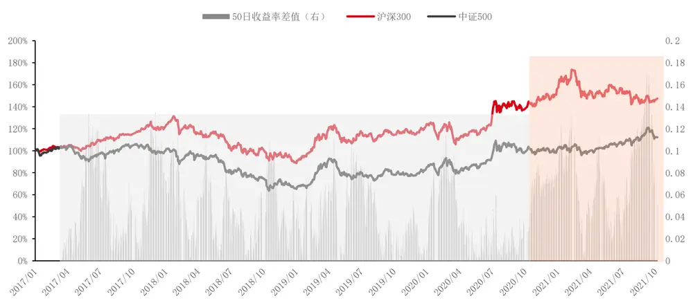
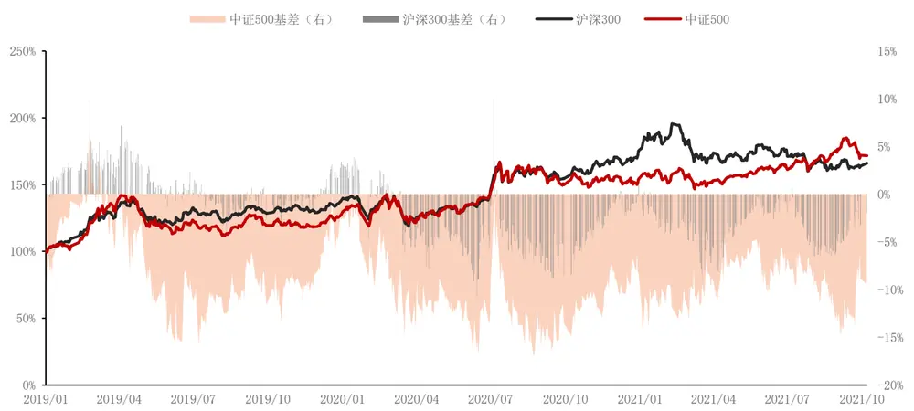
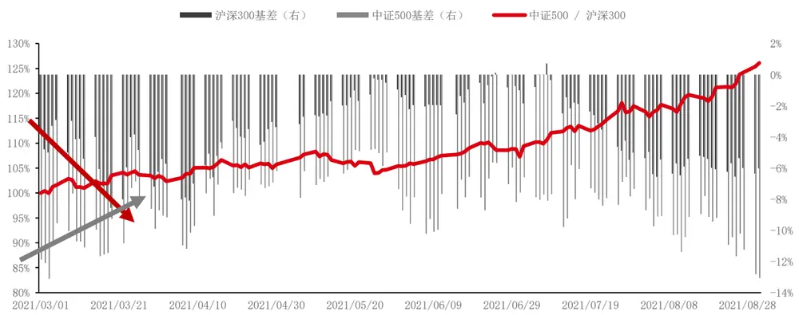
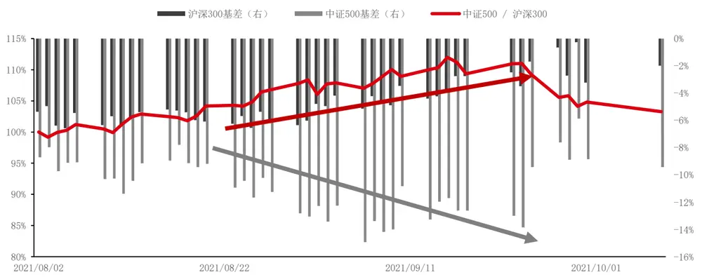
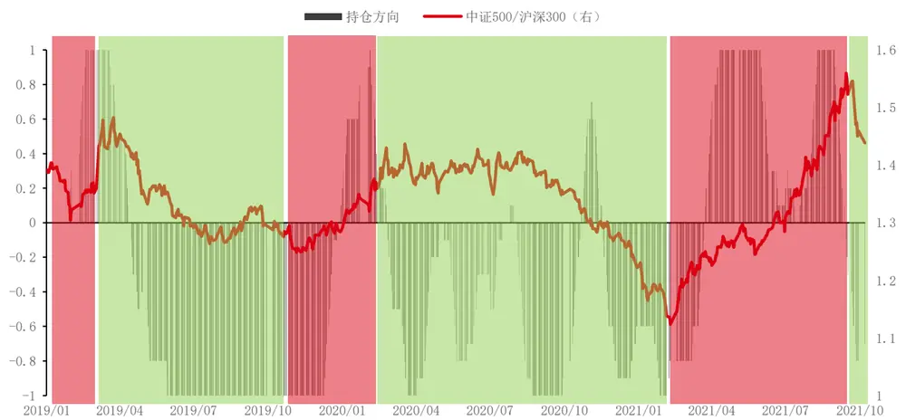
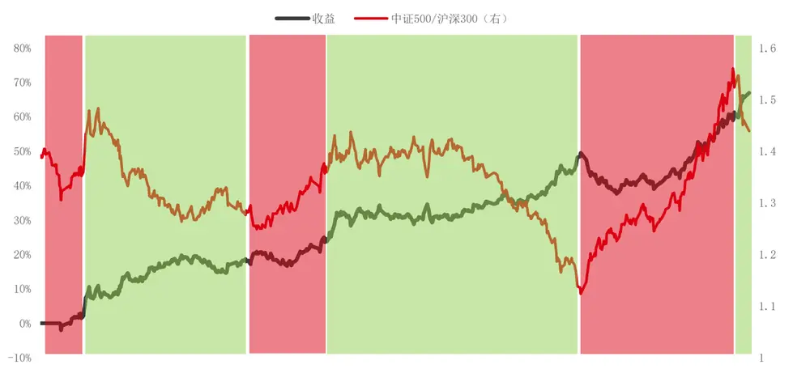

## 量价特征 6——基差与风格切换

近年来 A 股与以往常见的普涨普跌不同，不仅在行业板块上，甚至在综合指数上，都走出了非常强烈的结构性行情。特别是 2021 年以来，以沪深 300 以及中证 500 为例，两个综合指数的 50 日累计收益率差值相比之前明显上升了一个台阶。

我们暂且不去讨论这种剧烈的风格切换背后的宏观逻辑，而是从股指期货的角度出发，考察股指期货投资者是否在交易这类现象。

考察经分红调整后的当季合约年化基差率，沪深 300 基差与中证 500 基差在整体走势上，由于代表了市场对冲需求的强弱，表现较为一致。但在极值点的出现时刻以及先后顺序上，却存在明显差别。

IF与 IC 基差的第一次背离出现在今年的 3月，IF与 IC 基差的第二次背离出现在今年的9 月，今年两次较大的风格切换，其实在股指期货基差上均提前有所反映。进一步考虑到基差本身主要取决于对冲需求的强弱，而跨品种基差则更多取决于品种间的性价比，因此，从理论逻辑出发，依据跨品种基差构建跨品种套利策略应是可行的。

我们将持仓方向归为[-1,1]，越接近 1代表期货投资者越看好中证 500，越接近-1 代表期货投资者越看好沪深 300。若持仓信号大于0，则做多中证 500 同时做空沪深300，若持仓信号小于 0，则做多沪深300同时做空中证500。

策略在2019年至今年化收益率25.92%，年化波动率11.85%，夏普比率2.19。

本文仅以此抛砖引玉，希望能给投资者对于市场风格切换提供不一样的视角。

投资咨询业务资格：

证监许可【2011】1289 号

研究院 量化组

研究员

高天越

- 0755-23887993

- gaotianyue @htfc.com

从业资格号：F3055799

投资咨询号：Z0016156

## 股指期货量价特征

股指期货以及相对应指数的各类量价特征，不管在中低频维度上亦或在较高频的维度上，均受到各类投资者的广泛关注。基于量价特征构建的交易策略，也已成为各类交易策略中不可忽视的重要内容。

因此本系列报告将从股指期货的量价特征出发，系统性的深入研讨量价表现中的独特情况，希望能够对各位投资者有所启发。

本篇报告作为系列的第六篇，试图从股指期货基差的角度，对近年来A 股强烈的结构性行情做出一定解释。希望能够从基差的变动，提前捕捉到市场潜在的风格切换机会。

## 风格切换

近年来 A 股与以往常见的普涨普跌不同，不仅在行业板块上，甚至在综合指数上，都走出了非常强烈的结构性行情。特别是 2021 年以来，以沪深 300 以及中证 500 为例，两个综合指数的 50日累计收益率差值相比之前明显上升了一个台阶。

图 1：2017 年以来沪深 300 与中证 500 走势

数据来源：Wind，华泰期货研究院

我们暂且不去讨论这种剧烈的风格切换背后的宏观逻辑，而是从股指期货的角度出发，考察股指期货投资者是否在交易这类现象。

## 基差表现

考察经分红调整后的当季合约年化基差率，图 2 中沪深 300 基差与中证 500 基差在整体走势上，由于代表了市场对冲需求的强弱，表现较为一致。但在极值点的出现时刻以及先后顺序上，却存在明显差别。

图 2：2019 年以来沪深 300 与中证 500 以及基差

数据来源：Wind，华泰期货研究院

## （1）2021.03

图 3： 2021 年 3 月 IF 与 IC 基差背离

数据来源：Wind，华泰期货研究院

IF与 IC 基差的第一次背离出现在今年的 3月。彼时伴随着春节后“抱团股”的坍塌，A股经历了一波较大的调整，随后，IF基差开始逐步走阔，而 IC 基差却在深度贴水的环境下逐步收敛。此后在 4月初，由于周期股的崛起，中证500开始全面跑赢沪深 300，持续时间长达5 个月。

## （2）2021.09

图 4： 2021 年 9 月 IF 与 IC 基差背离

数据来源：Wind，华泰期货研究院

IF 与 IC 基差的第二次背离出现在今年的 9 月。9 月初，中证 500 仍在持续跑赢沪深 300，但在股指期货端，IF基差开始逐步收敛，IC 基差却在中证500强势向上时持续扩大，一度达到今年春节后的水平。随后在 9 月下旬，随着周期股的高位调整以及金融地产消费的持续反弹，沪深 300 开始逐步跑赢中证 500。

## （3）总结

由此可见，今年两次较大的风格切换，其实在股指期货基差上均提前有所反映。

进一步考虑到基差本身主要取决于对冲需求的强弱，而跨品种基差则更多取决于品种间的性价比，因此，从理论逻辑出发，依据跨品种基差构建跨品种套利策略应是可行的。

## 跨品种基差

股指期货基差本身主要取决于全市场对冲需求的强弱，直接使用基差无法判断是否会出现风格切换。因此上文中我们按照事件驱动的思路，对 2021年以来出现的两次基差背离做出描述，更进一步，下面我们将对其余未出现背离的交易日，按照基差差值大小，也判断未来的“优势风格”。

由于中证 500 股指期货长期受到对冲投资者的偏好，其基差水平始终高于沪深 300 股指期货，因此需要考虑两者间的水平差异。

图 5：跨品种策略持仓方向与中证 500&沪深 300 走势

数据来源：Wind，华泰期货研究院

我们将持仓方向归为[-1,1]，越接近 1 代表期货投资者越看好中证 500，越接近-1 代表期货投资者越看好沪深 300。从上图直观来看，信号对于风格切换有较为明显的把握，但在切换时点上并不十分准确，有时会存在一定的滞后效果。

图 6：跨品种策略持仓方向与中证 500&沪深 300 走势

数据来源：Wind，华泰期货研究院

暂不考虑滞后因素带来的影响，也不考虑持仓信号的强弱，若持仓信号大于 0，则做多中证500 同时做空沪深300，若持仓信号小于 0，则做多沪深 300同时做空中证 500。策略在2019年至今年化收益率 25.92%，年化波动率11.85%，夏普比率 2.19。

这里我们仅使用了跨品种基差的差值大小来做判断，实际上跨品种基差的背离初期并未达到所设阈值，因此策略仍有不小的提升空间。本文仅以此抛砖引玉，希望能给投资者对于市场风格切换提供不一样的视角。

## 免责声明

本报告基于本公司认为可靠的、已公开的信息编制，但本公司对该等信息的准确性及完整性不作任何保证。本报告所载的意见、结论及预测仅反映报告发布当日的观点和判断。在不同时期，本公司可能会发出与本报告所载意见、评估及预测不一致的研究报告。本公司不保证本报告所含信息保持在最新状态。本公司对本报告所含信息可在不发出通知的情形下做出修改，投资者应当自行关注相应的更新或修改。

本公司力求报告内容客观、公正，但本报告所载的观点、结论和建议仅供参考，投资者并不能依靠本报告以取代行使独立判断。对投资者依据或者使用本报告所造成的一切后果，本公司及作者均不承担任何法律责任。

本报告版权仅为本公司所有。未经本公司书面许可，任何机构或个人不得以翻版、复制、发表、引用或再次分发他人等任何形式侵犯本公司版权。如征得本公司同意进行引用、刊发的，需在允许的范围内使用，并注明出处为“华泰期货研究院“，且不得对本报告进行任何有悖原意的引用、删节和修改。本公司保留追究相关责任的权力。所有本报告中使用的商标、服务标记及标记均为本公司的商标、服务标记及标记。

华泰期货有限公司版权所有并保留一切权利。

## 公司总部

地址：广东省广州市越秀区东风东路761号丽丰大厦20层

电话：400-6280-888

网址：www.htfc.com