## 基于模糊逻辑神经网络的高频做市策略

华泰期货研究所 量化组

高频做市策略简介

高频做市策略通常是指通过向标的物市场提供流动性来获取利润的一系列策略，这类策略同时也要避免过多积累标的物的净头寸库存。通常在交易市场上使用限价单的交易者会被认为是市场流动性的提供者，而使用市价单的交易者则是流动性的消耗者。因此做市策略通常会围绕标的物的即时价格在不同价位挂出限价单，通过标的物价格的来回波动触碰到低价的买单和高价的卖单，实现低买高卖，从而获利。有研究者认为，如果在理想状态下，从长期来看市场具有均值回归的特性，那么通过挂限价单的做法则必定能获得正的期望收益。因此在这些理想的假设条件下，做市商并不需要对市场行情进行预测，而只需要根据即时价格变动提交限价单和撤单指令即可。

但是在实际的交易环境中，市场具有均值回归特性的假设并不一定能成立，挂出的限价单也不一定能成交，而且成交后获得的利润也要扣除交易费用等成本。同时投资者对做市策略的浮亏也会进行控制，因此考虑到这些实际因素后对市场的预测就成了必要条件。尤其是当市场呈现日内单边行情而非均值回归时，为了控制浮亏应该及时止损，这时预测就能起到一定作用了。

由于高频数据大约是每 500 毫秒就有一条交易记录，因此可以采集到的数据样本量比较多，可以尝试使用可调参数较多的深度神经网络对未来市场环境进行预测。如果预测未来短时间内中间价不变则可以围绕中间价挂限价单，通过成交价的窄幅波动获利。如果预测未来方向跟现有的持仓方向相反则平掉现有头寸。由于金融高频数据存在较大噪音，为了应对噪音产生的不确定性，这里使用模糊逻辑来对高频数据进行预处理，以提高神经网络的训练效果。

本报告研究了理想情况下高频做市策略在铁矿石、螺纹钢和铜三个主力期货上的收益，效果最好的是铁矿石。但是在实际交易环境中仍需考虑挂单成交率、手续费等因素，因此本报告通过模拟挂单成交情况测试了一个初步的高频做市回测框架，发现在成交最坏情况下模糊逻辑神经网络对提高策略收益有一定帮助。

陈维嘉

量化研究员

- 0755-23991517

- chenweijia@htfc.com

从业资格号：T236848

投资咨询号：TZ012046

## 高频做市策略原理

广义的做市商可以是指一个公司、个人甚至是一种交易策略，在绝大多数情况下他们都会对金融标的物，如商品期货、股票、债券等进行买卖双向报价，通过低买高卖从买卖价差中获利。在历史上，做市商的主要目的是为市场提供流动性，他们普遍出现在外汇市场上，在股票和期权市场上也比较常见。在过去历史上，证券交易所通常会为特定的证券指定官方的做市商。但是在最近几十年里，由于电子交易系统的普及使得做市交易的政策性进入门槛大大降低。也就是说只要具备合适的交易算法和交易系统等条件，不需要证券交易所指定，普通投资者也可以通过程序化交易参与到做市交易中。

做市策略与其他趋势性策略最大的不同点是，做市策略总是包含着双向报价的目的，而且并不试图从标的资产的方向性变化中获利。这意味着做市策略必须避免积累了大量的做多或者做空方向的净头寸。因为净头寸的积累将带来价格反向波动时的损失。这也意味着做市策略的盈利是来自于小幅度但是高频率的价格波动。而趋势性策略则是通过赌方向获利，趋势性策略总是希望在价格低位买入大量仓位，等价格上涨到高位再大量卖出获利。

下面先谈下做市策略的原理，首先假设标的资产的交易具有以下这些特性：

（1） 在特定时间点上标的资产只有一个买卖成交价格。

（2） 可以自由买卖的，允许卖空。

（3） 在任何时间点，做市商可以在任意价格挂出限价指令单，同时可以在未来随意撤消这些已挂订单。

（4） 如果在挂单之后，撤单之前即时价格触碰到或者越过限价指令单，则判断限价指令单成交。这意味着如果即时价格低于或等于买单价格，则买单成交。如果即时价格等于或高于卖单价格，则卖单成交。

虽然以上假设并不符合现实，但是基于以上的假设，我们可以根据 Tanmoy Chakraborty 和Michael Kearns 的论文 Market Making and Mean Reversion, 2011 推导出做市策略能够获得的理论收益，作为做市策略收益的上限。这里首先假设所有的市场事件出现在离散的时间点位0，1，2…直到时刻T。时刻T是做市策略结束的时间点，可以理解为做市策略从每天开盘开始，到收盘结束。在收盘时刻T，做市策略必须平掉所有的单方向净头寸。标的资产在所有$0\leq t\leq T$ 的时刻，都存在一个即时价格P ，这个 $\cdot P_{t}$ 用变动单位表示，是标的资 $\dot{\mathcal{P}}$ 最小变动单位的整数倍。例如当螺纹钢价格是 3000元/吨，其价格最小变动单位是1元/吨，则对应的 $P_{t}$ 是 3000。而当铁矿石价格500元/吨，其价格最小变动单位是0.5元/吨，则对应的 $P_{t}$ 则是 1000。同时假设每笔限价单只做 1 手，限价单的挂撤和成交都不会造成市场冲击。标的资产的库存用x表示，库存x可正可负，每一笔买单的成交增加一手库存，每一笔卖单的成交则减少一手库存。在收盘时刻T，做市商可以通过收盘价 $P_{T}$ 平掉所有库存，并收入或支出$xP_{T}$ 。

做市商策略是一个根据即时价格 $P_{t}$ 变化而做出挂撤单的动态决策过程。在时刻t做市商在价格 $Y_{t},Y_{t}-1,Y_{t}-2,\dots Y_{t}-C_{t}$ 上挂出买单，同时在价格 $X_{t},X_{t}-1,X_{t}-2,...X_{t}+C_{t}$ 上挂出卖单，其中 $Y_{t}<X_{t}$ ， $C_{t}$ 是一个非负整数，代表深度。通过这一些列的挂单方式确保在即时价格出现单边大幅波动时会有大量挂单成交，同时做市商假设 $C_{t}$ 能够覆盖短时的价格波动 $|P_{t+1}-$ $P_{t}|$ 。每过一个时刻，做市商都把未成交的挂单撤消，同时围绕新的 $P_{t}$ 重新挂单。基于以上的假设和操作 Tanmoy Chakraborty 和 Michael Kearns 推导出了做市策略的理论收益为

$$
{\frac{1}{2}}(K-z^{2})\tag{1}
$$

其中

$$
K=\sum_{t=1}^{T}\lvert P_{t+1}-P_{t}\rvert\tag{2}
$$

代表价格波动的绝对幅度。

$$
z=P_{T}-P_{0}\tag{3}
$$

代表收盘后平掉净头寸所 $\cdot\dot{\bar{y}}$ 生的盈亏。

由于做市商总是围绕着即时价格 $P_{t}$ 进行挂单，所以每当 $P_{t}$ 出现变动后都会有一个挂单成交，所以K也等于总的理论成交次数。例如，如果价格从 $P_{0}$ 涨到 $P_{0}$ +1，再回到 $P_{0}$ 的话，就有一个成交在 $.P_{0}+1$ 的卖单和一个成交在 $P_{0}$ 的买单，变动了2次，也成交了 2次，这两个单能互相配对。如果接着价格从 $P_{0}$ 跌到 $P_{0}-1$ 然后收盘，那么就再多出了一个成交在 $P_{0}-1$ 的买单，这个买单没配对上，由此可以推导出在任意终止时刻T，未配对的净头寸数量为|z| =$\vert P_{T}-P_{0}\vert$ 。由于这里假设未配对的净头寸全部用收盘价平仓，则最后一笔未配对的交易不会造成损失，而其他未配对的交易损失为 1，2，…，z−1，总和为z $:(z-1)/2$ 。从配对的交易中做市商获利(K − z)/2，所以最后做市商的总利润为 $\begin{array}{r}{\frac{(K-z)}{2}-\frac{\mathsf{z}(z-1)}{2}=\frac{1}{2}(K-z^{2})}\end{array}$ ，即公式(1)。进一步，Tanmoy Chakraborty 和 Michael Kearns 等人证明了在均值回复的条件下，K的期望值大于 $z^{2}$ 的期望值，也就是说基于以上一系列假设的前提下，做市策略永远都是盈利的。

以上是高频做市策略的基本原理，显然在推导理论收益时做的假设非常宽松，但是我们仍然可以利用公式(1)比较做市策略在各个品种上的可行性。由于使用的是每秒 2 笔的高频数据，数据量较大，这里我们只考察做市策略在铁矿石、螺纹钢和铜这三个品种上的适应性。

这里的高频数据使用从 2015年1月至 2018年7月的数据，约850天，每天使用日盘即9:00至 15:00时段的数据，每天每品种约 25000笔行情数据。这里利用每笔行情数据的收盘价作为公式（1）中用到的P 。由于目前中国期货的高频数据都是截面数据，每笔行情的收盘价代表的是当前截面上最后一笔交易的成交价，而实际的成交价则可能存在多个，甚至在最优买卖报价之间出现来回变动的情况，因此使用每笔行情的收盘价进行盈利估算将会存在低估的情况。由于公式（1）中的盈利单位是价位，这里我们根据每个期货品种合约的大小和最小变动价位将其装换为货币盈亏从而增加可比性。

图 1是使用公式（1）计算的三个品种的累积盈利，由图可见这三个品种的理论盈利都非常理想，没有明显的回撤交易盈利最好的是铁矿石，其次是铜，螺纹钢稍差。

图1： 高频做市策略理论累积盈利
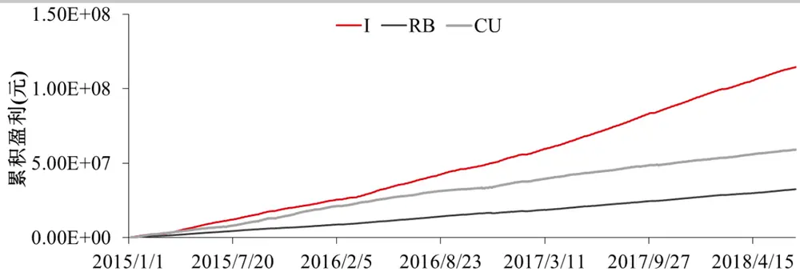
数据来源：天软 华泰期货研究院

除了考察理论的盈利情况，也可以利用公式（1）中的K计算做市交易产生的手续费。图2中的手续费用按照一般的公司平今仓标准计算，通常铁矿石是2.4%%，螺纹钢是2.0%%，铜是1.0%%。由图可见产生手续费用最高的是铜。其中铜和螺纹钢产生的手续费用的数量级能与其盈利相当，而铁矿石的盈利则远高于其产生的手续费。

图 2： 高频做市策略理论累积手续费
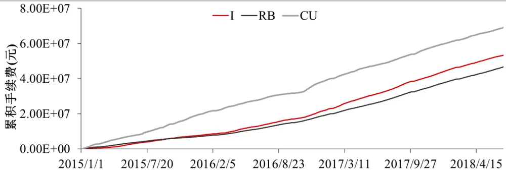
数据来源：天软 华泰期货研究院

在实际高频交易中手续费对最终盈利占有较大比例，同时交易所和期货公司普遍对高频交易手续费有所返还，因此实际上非常有必要研究在每个品种上手续费返还对最终盈利的影响。假设做市商可以获得的手续费返还占所交手续费用的比例为k，则当做市策略每天利润p与每天所交手续费f存在以下关系时才能最终盈利 ${\bf\langle}p-(1-k)f>0$ 。所以存在一个手续费返还比例的临界点 $\textstyle{k_{c}=1-{\frac{p}{f}}};$ ，只有当手续费返还比例k $>k_{c}$ 时，做市商才能最终盈利。因此衡量做市策略是否在一个品种上是否可行，可以从 $k_{c}$ 的大小来判断， $k_{c}$ 越小说明所需手续费返还比例越低，这个品种越适合做市策略。图 3作出了螺纹钢和铜的 $k_{c}$ 从 2015 年到 2018 年的变化。在 2015 年和 2016 年初 ${{k}_{c}}$ 值都偏小，甚至很多时候都是负值，说明这段时间做市策略不太依赖于手续费返还，而在 2017年后 $\cdot k_{c}$ 值有较大提高说明受手续费影响比较大。尤其是当 $k_{c}>1$ 时，说明做市策略本身是亏损的，这些情况在 2017年后更加常见。

图3： 高频做市策略螺纹钢、铜理论手续费返还临界点 $\mathbf{\nabla}.k_{c}$
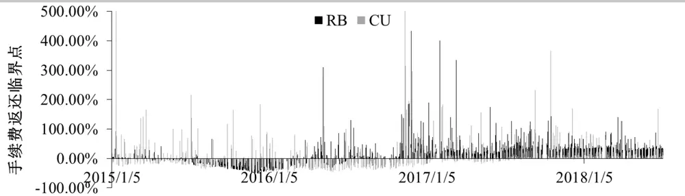
数据来源：华泰期货研究院

图 4 是铁矿石的手续费返还临界点k ，在铁矿石上k 普遍小于 0，这说明做市策略是非常适合铁矿石这个品种的。虽然公式（1）对高频做市策略的盈利存在过份高估的情况，但仍然可以利用它对做市策略的盈亏做一个初步了解以及选出适合做市策略的商品品种。

图4： 高频做市策略铁矿石理论手续费返还临界点k
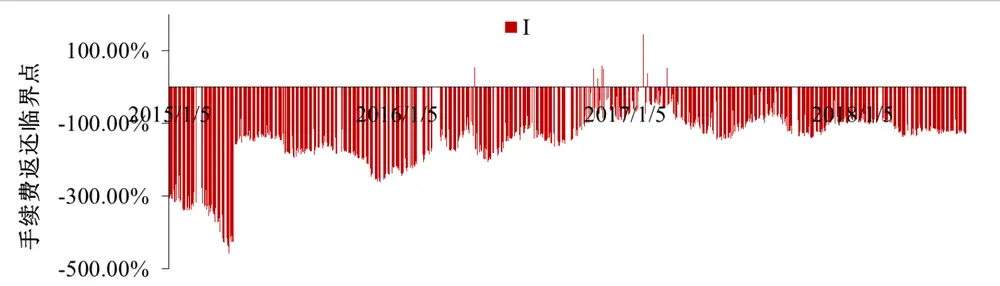
数据来源：华泰期货研究院

现在再看下铁矿石做市策略产生盈利和亏损的原因，分别选取盈利最大和亏损最大典型的时间把铁矿石日内的价格行情画在图 5上。横轴代表的是收到行情的时间节点，如果没有行情推送则该时间上没有数据，所以虽然都是从 9：00至15：00的行情，但是左右两图横轴的长度不一样。2015 年 4 月 10 日铁矿石做市策略取得较好的盈利，由图可见这天铁矿石一直在窄幅波动，这是一个非常典型的震荡行情，这时公式(1)中的K值会变得非常大，而铁矿石从开盘的 373 到收盘 370 只变动了 3 个价位，所以公式(1)中的z=3，因此做市策略的理论收益会比较理想。而在 2017 年 2 月 3 日铁矿石走出了单边下跌的趋势性行情，从 662 下跌到 611.5，变动了 101 个价位，所以公式(1)中的z=101，这时做市策略会出现严重亏损。

图 5： 铁矿石在 2015 年 4 月 10 日(左)与 2017 年 2 月 3 日价格走势(右)
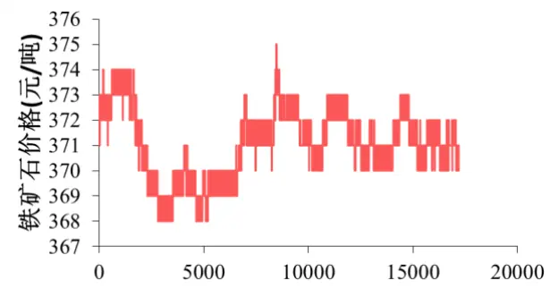

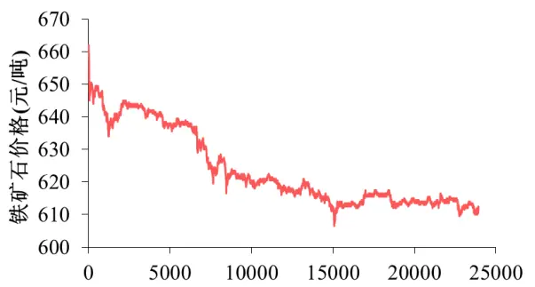
数据来源：天软 华泰期货研究院

虽然在铁矿石这个品种上做市策略的理论收益非常好，但是其收益是被高估的，实际情况很有可能是在震荡行情中累积的小幅盈利不能覆盖掉趋势行情中的亏损，因此在实际交易中有必要对做市策略做出调整。为了防范趋势行情的极端风险，一个可能的措施是对未来行情做预测，在出现趋势行情前就把多余的静头寸平掉，而不是在公式(1)中每天的趋势行情走完，在收盘时平仓。

## 神经网络原理

神经网络是一种适合使用大量数据样本进行训练的分类器。这篇报告尝试使用铁矿石的高频数据进行训练预测 1 分钟后铁矿石中间价的涨跌情况。神经网络的结构可以用如下图表示，左边的 Layer L1 代表输入层用于存放输入的特征变量，中间的 Layer L2为隐藏层包含激活函数，用于对输入特征的进一步抽象化，最后的 Layer L3 为输出层输出预测结果。神经网络各层神经元之间使用矩阵进行连接，矩阵权重就是模型的可调参数。如果在输入层L1 与输出层 L3 叠加多个隐藏层，则能构成深度神经网络。相关研究表明深度神经网络有利于输入特征的抽象化，能提高预测准确率。

图 6： 神经网络架构
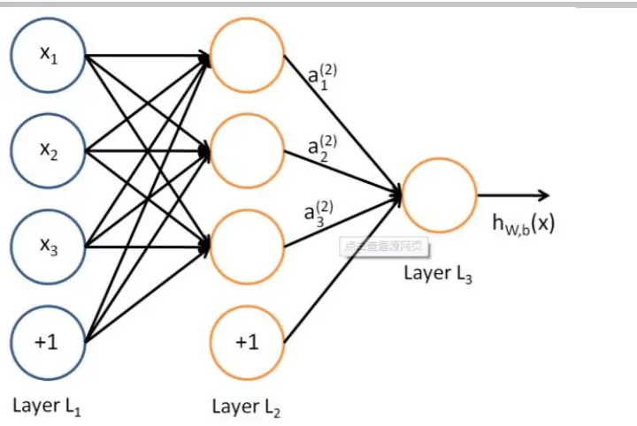
数据来源：网络截图

这里的输入特征由铁矿石的高频数据构成，首先把 1 秒 2 笔的高频数据按每分钟 120 笔合成分钟数据。输入特征包括 20 分钟的收盘价对数收益率序列和成交量对数收益率序列，所以输入样本是一个包含有40个元素的向量。由于金融数据具有一定的不确定性，这里使用模糊逻辑(Fuzzy Logic)的方法来处理。根据下一分钟的中间价变化情况，把样本分为 3 类:上涨、不变和下跌。然后求出每一类别对应的输入向量元素的均值 $m_{ij}$ 和标准差 $\sigma_{ij}$ ，其中i =$^{1,2,3}$ 为该输入向量所属分类， $j=1,2,3,\cdots,40$ 代表输入向量的元素。通过以下模糊成员函数就可以把一个 40维的输入向量转换到 120维的模糊程度空间中：

$$
o_{ij}=e^{-\left(x_{ij}-m_{ij}\right)^{2}/\sigma_{ij}^{2}}\tag{4}
$$

模糊逻辑神经网络(Fuzzy Neural Network, FNN)的详细使用方法可以参考 Yue Deng 等人的论文 Deep Direct Reinforcement Learning for Financial Signal Representation and Trading。在经过模糊逻辑处理后 120 维向量作为输入进入神经网络的输入层。输入层和输出层之间使用

3个隐藏层进行连接，每层含有 128个神经元，并使用dropout作为正则化的手段，在训练过程中随机屏蔽掉 50%的神经元，而在预测时再对权重取平均作为输出。这种方法相当于训练了多个神经网络然后对预测结果取平均，相关研究表明这种 dropout的方法能有效防止神经网络的过度拟合。

神经网络的训练使用了铁矿石主力期货合约 2016 年 1 月至 2017 年 12 月的数据，包含的样本数量约为参数数量的 8 倍。使用交叉验证的方法，当验证集误差大于训练集误差时便提前终止训练，防止过度拟合。由于神经网络使用了随机数对矩阵权重进行初始化，训练结果可能受随机数影响，以下选取了 3 组随机数对神经网络进行训练，得到的 3 个神经网络在验证集上的准确率如下表所示：

表格 1 验证集上各神经网络的分类准确率

|  | FNN1 FNN2 | FNN3 |
| --- | --- | --- |
| 预测下跌准确率 | 38% | 35% 36% |
| 预测不变准确率 | 40% | 42% 40% |
| 预测上涨准确率 | 37% | 37% 38% |

数据来源：华泰期货研究院

在铁矿石这个品种上以 1 分钟为界，上涨和下跌的概率各占 32%，不变的一类约占 36%，因此从神经网络的训练结果看，各类的预测都有一定准确性。

## 策略回测框架

虽然高频做市策略的理论收益非常高，其原因是在推导的时候使用了一系列不合理的假设，其中影响最大的是成交方式的假设。在实际交易中，挂出限价单后，交易所会按照时间优先和价格优先的原则对市场上所有交易者的限价单进行排序。也就是说以买一或卖一价挂上限价单后，即使价格触碰到挂单价，也要等待前面其他交易者的挂单成交完后，如果即时价格仍满足条件，自己的挂单才会成交。由于实际挂单后会存在一个等待时间，所以实际成交率并不会太高，这就导致实际中公式(1)中能够成交的K值会远远小于理论假设。因此策略回测时要把成交情况考虑在内。另外，由于目前能够获取的高频信息有限，这篇报告的回测暂时只考虑成交最差的情况，实际交易的收益会在策略回测收益与理论收益之间。

本报告使用的高频数据来自天软，每秒会有两笔行情数据，里面的内容包括最新成交价，即500 毫秒的收盘价，买一价，买一量，卖一价，卖一量，500 毫秒内的成交额和成交量。如果假设 500 毫秒内的成交的单子都在买一价和卖一价这两个价位上，那么根据成交额和成交量的关系，就可以算出在买一价和卖一价上的成交量。再根据买一量和卖一量，在假设市场上其他交易者不存在撤单的情况下就能推算出自己挂单的排名。由于目前的高频数据只有最优买卖报价的一档行情，据此算法只能推算一档挂单的排名，所以回测也只是在一档挂单，而实际交易中可以同时在多个档位同时挂单，成交率会比回测高。

另一方面为了尽量控制盘中交易的风险，在模拟交易中会利用神经网络的预测作用，在盘中对做市策略进行提前终止。神经网络每一分钟预测一次，然后根据现有持仓和预测结果，进行的操作如表格2所示。

表格 2 根据预测和现有仓位进行的挂单操作

| 预测结果\当前持仓 | 负持仓 | 无净头寸 | 正持仓 |
| --- | --- | --- | --- |
| 预测下跌 | 不操作 | 不操作 | 市价单平仓 |
| 预测不变 | 市价单平负仓，在 买一和卖一上重新 | 在买一和卖一上重新 挂单 | 市价单平正仓，在买 一和卖一上重新挂单 |
|  | 挂单 |  |  |
| 预测上涨 | 市价单平仓 | 不操作 | 不操作 |

数据来源：华泰期货研究院

目前是为了模拟做市策略的效果而不考虑趋势交易，所以当神经网络预测上涨或下跌时并不会去做主动的趋势跟踪操作。由于策略回测模拟了限价单排队的情况，在买一和卖一两边报价的时候会经常出现只成交了一边的情况，这时就会存在持有净头寸的风险。为了控制风险及时止损，如果当前持有净头寸，而又预测未来价格不变时，会先平掉当前的头寸再重新进行两边挂单。这样的操作显然是过于保守的，但为了贴近神经网络的预测所以进行这种操作。这里使用2018年1月至 2018年 7月的数据进行回测。由于神经网络的预测每隔一分钟进行一次，每分钟包含约 120个高频数据，所以每天可以有 120个起始点，为了较少起始点的随机性，回测时对每天使用的 120条不同的路径交易情况进行取平均的处理。

## 模拟交易情况

为了对比当前回测结果与理论的差异，首先尝试不使用神经网络进行预测，只是在买一和卖一挂单，并采用价格触碰作为成交的标准，对比回测框架和公式(1)理论的一致性，结果如图 6所示。无论是每天收益还是交易次数，在触碰成交的前提下模拟结果和理论结果都有良好的线性关系。另外模拟交易收益的量纲、成交次数的量纲与公式(1)的理论值的量纲差异较大，主要是因为，模拟交易采用了离散挂单的方式，即每隔 1分钟才重新调整挂单，而公式(1)理论中调整挂单的次数则更为频繁，每隔500毫秒只要价格有变动就调整挂单，并且有成交。但是理论结果在收益和交易次数上的判断都明显与模拟结果有着正相关性，所以利用公式(1)作为策略收益和成交次数的上限具有一定的实际意义。

图7： 铁矿石模拟收益与理论收益(左)和模拟交易次数与理论次数(右)对比
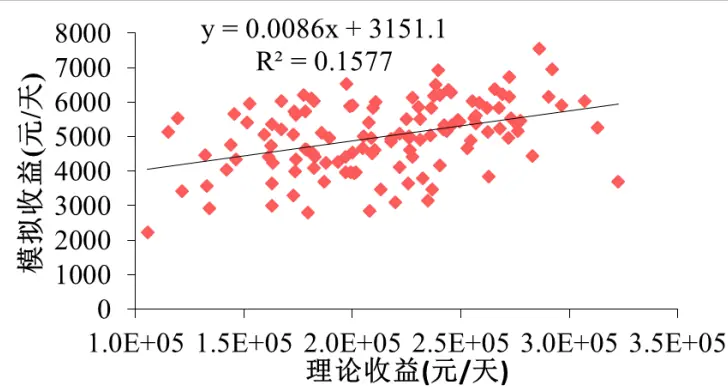
数据来源：天软 华泰期货研究院

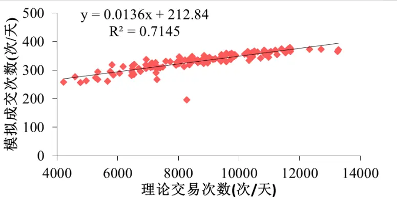

下面考虑挂单排队成交的情况，图 7作出了使用3组随机数初始化神经网络进行训练后回测的结果，使用不同随机数训练的神经网络结果差别并不大，说明利用神经网络进行预测结果还是比较稳定的。同时也对比了不使用模型预测而只进行两边挂单的情况，在 2018年4月之前两者差别并不大，而在 4月份之后使用神经网络的策略收益便开始领先。

图 8： 铁矿石做市策略回测累积收益(元)
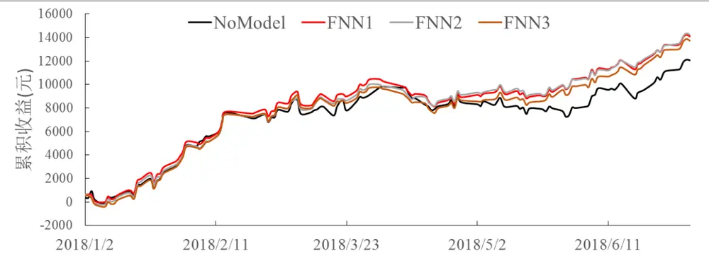
数据来源：华泰期货研究院

图8做出了利用公式(1)计算每天理论收益的走势，由图可见在 4月后每天的理论收益开始逐渐下降，这说明 4 月后铁矿石出现偏趋势的行情，在这段时间上利用神经网络做预测的收益由于能够及时平仓，所以模拟的结果要比不使用模型的收益要高，这就显示了神经网络的作用，在趋势行情中作方向性的判断有利于减少做市策略的亏损。

图9： 铁矿石做市策略理论收益
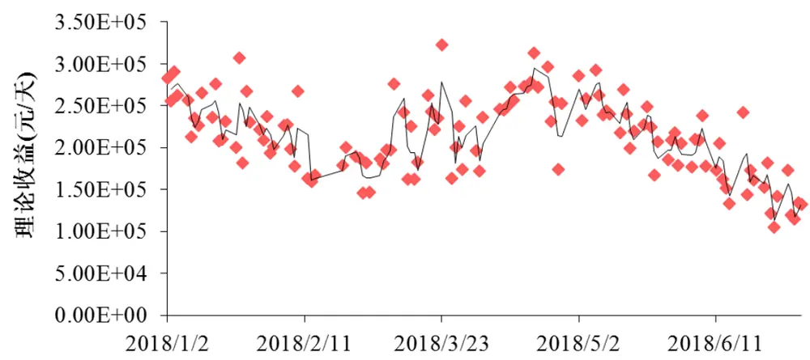
数据来源：华泰期货研究院

图9是铁矿石做市策略的累积手续费，由于交易平均每天高达 50次，按照普通公司标准累积的手续费能达到甚至超过策略的收益。另外图9也显示在 2018年 4月以后神经网络模型产生的手续费的增幅越来越大，超过无预测模型的回测手续费。这是 4月铁矿石进入偏趋势行情后，神经网络更加频繁使用市价单平仓的结果。

图 10： 铁矿石做市策略回测累积手续费(元)
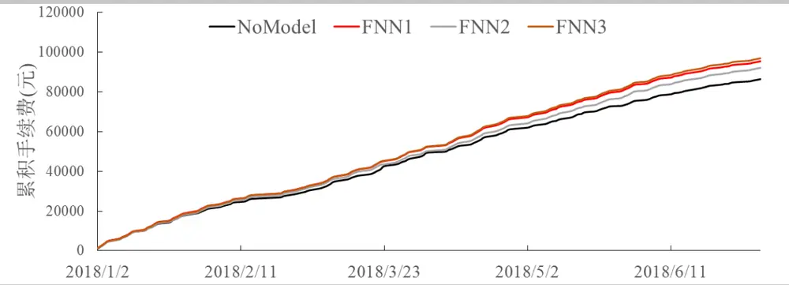
数据来源：天软 华泰期货研究院

表格 3 总结了高频做市策略的使用神经网络模型做预测和不做预测的情况，使用神经网络做预测后日均收益会明显提高，同时交易次数和手续费也有所提高。三个神经网络之间的统计情况差异不大，说明其表现较为稳定。综合回测收益与所交手续费来看，使用神经网络做预测后手续费返还临界点从 86%下降到了 85%左右，也就是说使用神经网络后所需的手续费返还会更低，做市商会有更大的利润空间。对比表格 1 的结果 FNN2 预测不变的情况准确率最高，因此在这里做市回测的表现也是最好的，这说明可以根据验证集结果选择模型。另外值得注意的是，虽然模拟回测的收益要远低于公式(1)的理论值，但这里交易回测模拟的是最坏的情况，实际交易情况依赖于交易系统速度，收益会在理论值与回测值之间。

表格 3 高频做市策略盈亏总结

|  | No Model | FNN1 | FNN2 | FNN3 |
| --- | --- | --- | --- | --- |
| 策略收益(元/天) | 97.31 | 115.68 | 116.78 | 112.88 |
| 手续费(元/天) | 696.57 | 772.48 | 745.71 | 784.64 |
| 成交频率(次/天) | 46.79 | 52.39 | 50.45 | 53.44 |
| 手续费返还临界点 | 86.03% | 85.03% | 84.34% | 85.61% |

数据来源：华泰期货研究院

## 结果讨论

本报告首先介绍了高频做市策略的原理，提供了其背后盈利的理论依据。在市场为均值回复、限价单为触碰成交以及做市商挂单不造成市场冲击等理想化的假设条件下，基本可以判定做市策略是能够稳定盈利的，并参考 Tanmoy Chakraborty 和 Michael Kearns 等人的论文提供了理论盈亏的计算方法。利用这个方法对比了高频做市策略在铁矿石、螺纹钢和铜这三个品种上的理论收益和手续费，发现理论上铁矿石是最适合高频做市策略的。在此基础上，本报告利用铁矿石的高频数据训练模糊逻辑神经网络，用来预测未来 1 分钟铁矿石的涨跌情况，并根据预测结果进行做市交易。在不使用模型以及触碰成交的前提下，回测框架的结果与理论值比较一致。但是在排队成交的情况下策略收益大大减低，需要较高的手续费返还才能盈利。但是使用神经网络做预测后，在铁矿石出现偏趋势行情的情况下，能够实施主动止损，从而提高整体策略收益。

## 免责声明

此报告并非针对或意图送发给或为任何就送发、发布、可得到或使用此报告而使华泰期货有限公司违反当地的法律或法规或可致使华泰期货有限公司受制于的法律或法规的任何地区、国家或其它管辖区域的公民或居民。除非另有显示，否则所有此报告中的材料的版权均属华泰期货有限公司。未经华泰期货有限公司事先书面授权下，不得更改或以任何方式发送、复印此报告的材料、内容或其复印本予任何其它人。所有于此报告中使用的商标、服务标记及标记均为华泰期货有限公司的商标、服务标记及标记。

此报告所载的资料、工具及材料只提供给阁下作查照之用。此报告的内容并不构成对任何人的投资建议，而华泰期货有限公司不会因接收人收到此报告而视他们为其客户。

此报告所载资料的来源及观点的出处皆被华泰期货有限公司认为可靠，但华泰期货有限公司不能担保其准确性或完整性，而华泰期货有限公司不对因使用此报告的材料而引致的损失而负任何责任。并不能依靠此报告以取代行使独立判断。华泰期货有限公司可发出其它与本报告所载资料不一致及有不同结论的报告。本报告及该等报告反映编写分析员的不同设想、见解及分析方法。为免生疑，本报告所载的观点并不代表华泰期货有限公司，或任何其附属或联营公司的立场。

此报告中所指的投资及服务可能不适合阁下，我们建议阁下如有任何疑问应咨询独立投资顾问。此报告并不构成投资、法律、会计或税务建议或担保任何投资或策略适合或切合阁下个别情况。此报告并不构成给予阁下私人咨询建议。

华泰期货有限公司 2018 版权所有并保留一切权利。

## 公司总部

地址：广东省广州市越秀区东风东路761号丽丰大厦20层、29层04单元

电话：400-6280-888

网址：www.htfc.com