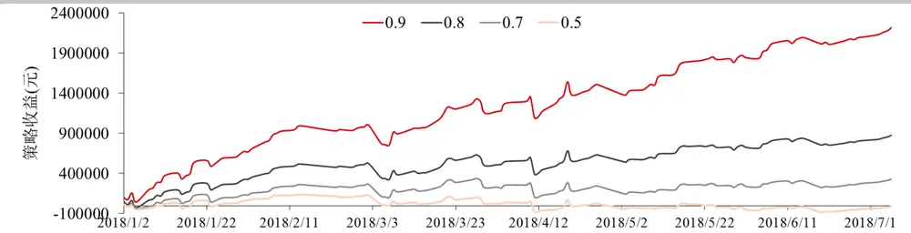
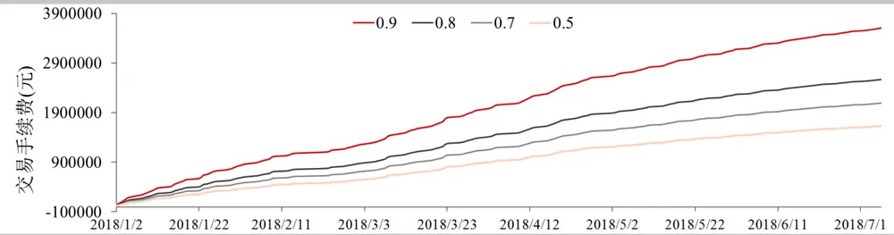
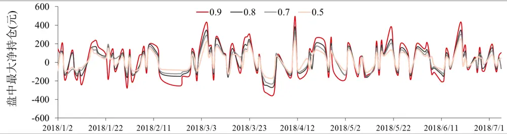
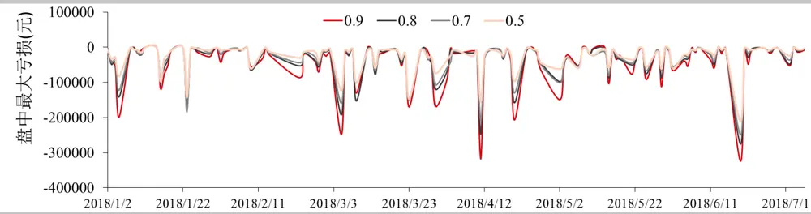
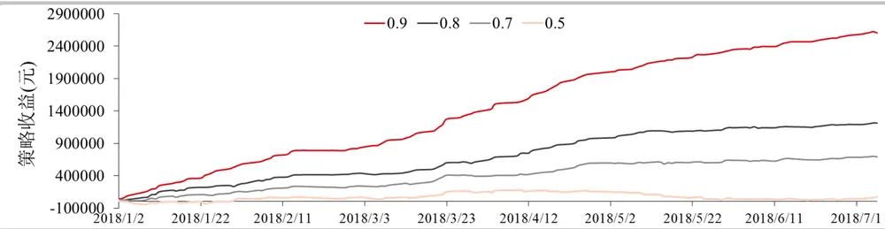
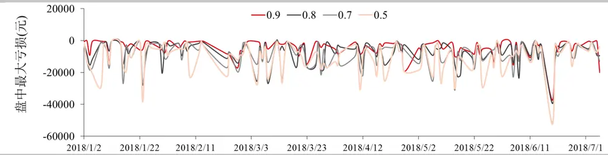

## 基于连续挂单的高频做市策略

## 高频做市策略简介

高频做市策略通常是指通过向标的物市场提供流动性来获取利润的一系列策略。做市策略通常会围绕标的物的即时价格在不同价位挂出限价单，通过标的物价格的来回波动触碰到低价的买单和高价的卖单，实现低买高卖，从而获利。市场的交易价格总是处在不断变化之中，如果从较长时间来看，例如一天，市场价格可能出现单边上涨或者下跌，但是在实现这一过程中，市场价格却是不断震荡，来回往复的。如果能在来回往复的过程中不断低买高卖，而且累积次数足够多则有可能跑赢单边行情，从而实现盈利。因此做市策略应该尽可能地多挂限价单，并且利用交易系统的优势尽量把限价单挂在队列的前边。

为了模拟这一过程，这偏报告建立了一个基于连续挂单的做市策略回测框架，通过模拟连续挂单和排队成交等因素，研究影响高频做市策略盈利的各种因素，发现影响策略盈利最明显的是限价单的成交次数，这也解释了为何高频交易策略普遍对交易系统有较高要求。

华泰期货研究所 量化组

陈维嘉

量化研究员

- 0755-23991517

- chenweijia@htfc.com

从业资格号：T236848

投资咨询号：TZ012046

基于模糊逻辑神经网络的高频做市策略

相关研究

2018-10-30

## 高频做市策略原理

做市策略总是包含着双向报价的目的，通过成交价格在买卖价差之间非常窄幅的波动中获利，这里的窄幅波动通常就只有 1 至 2 个买卖变动价位，而非从标的资产大方向性变化中获利。这意味着做市策略必须避免积累了大量的做多或者做空方向的净头寸。因为净头寸的积累将带来价格反向波动时的损失。这也意味着做市策略的盈利是来自于小幅度但是高频率的价格波动。

根据 Tanmoy Chakraborty 和 Michael Kearns 的论文 Market Making and Mean Reversion, 2011 可以对做市策略的盈利作出合理的解释。这里首先假设所有的市场事件出现在离散的时间点位 0，1，2…直到时刻 $T_{\circ}$ 时刻T是做市策略结束的时间点，可以理解为做市策略从每天开盘开始，到收盘结束。在收盘时刻T，做市策略必须平掉所有的单方向净头寸。标的资产在所有 $\begin{array}{r}{0\leq t\leq T}\end{array}$ 的时刻，都存在一个即时价格 $P_{t}$ ，这个 $\cdot P_{t}$ 用变动单位表示，是标的资产最小变动单位的整数倍。做市策略的理论收益为

$$
\frac{1}{2}(K-z^{2})\tag{1}
$$

其中

$$
K=\sum_{t=1}^{T}\lvert P_{t+1}-P_{t}\rvert\tag{2}
$$

代表价格波动的绝对幅度。

$$
z=P_{T}-P_{0}\tag{3}
$$

代表收盘后平掉净头寸所产生的盈亏。

由于做市商总是围绕着即时价格 $-P_{t}$ 进行挂单，所以每当 $P_{t}$ 出现变动后都会有一个挂单成交，所以K也等于总的理论成交次数。例如，如果价格从 $P_{0}$ 涨到 $P_{0}+1$ ，再回到 $P_{0}$ 的话，就有一个成交在 $P_{0}+1$ 的卖单和一个成交在 $P_{0}$ 的买单，变动了2次，也成交了 2次，这两个单能互相配对。如果接着价格从 $P_{0}$ 跌到 $P_{0}-1$ 然后收盘，那么就再多出了一个成交在 $P_{0}-1$ 的买单，这个买单没配对上，由此可以推导出在任意终止时刻T，未配对的净头寸数量为|z| =$|P_{T}-P_{0}|$ 。由于这里假设未配对的净头寸全部用收盘价平仓，则最后一笔未配对的交易不会造成损失，而其他未配对的交易损失为 1，2，…，z − 1，总和为 $\mathbf{z}(z-1)/2.$ 。从配对的交易中做市商获利 $(K-z)/2$ ，所以最后做市商的总利润为 $\frac{(K-z)}{2}-\frac{z(z-1)}{2}=\frac{1}{2}(K-z^2)$ ，即公式(1)。从中可以看出做市策略的盈利主要来源于公式(2)中的K值，在理想状态下，只要价格有变动且能成交就会有盈利，但是实际上却并非如此。为了赚取买一价和卖一价之间的差价，做市策略只能挂出限价单，等待自己挂出的限价单被市价单击中成交。自己挂出的限价单要被击中，则必须按照时间优先和价格优先的原则，也就是等待比自己更优报价的限价单以及更先报出的限价单成交完后，自己的限价单才能成交。所以实际上并非公式(2)中所有的价格变动都能利用。为了被尽量多的价格变动击中，做市策略的交易系统必须足够迅速，把自己的限价单排在市场其他对手的前面。另外公式(3)表明了做市策略的亏损来源在于单边趋势行情后所积累的净持仓，因此做市策略的最终盈利也取决于如何减少净持仓。

这篇报告根据公式(1)的原理，结合市场挂单的实际情况进行模拟回测，探索做市策略盈亏的影响因素。

## 策略回测框架

做市策略是一个根据即时价格 $P_{t}$ 变化 $而$ 做出挂撤单的动态决策过程。在时刻t做市策略在价格 $\begin{aligned}&\cdot Y_{t},Y_{t}-1,Y_{t}-2,\ldots Y_{t}-C_{t}上\end{aligned}$ 挂出买单，同时在价格 $X_{t},X_{t}+1,X_{t}+2,\ldots X_{t}+C_{t}上$ 挂出卖单，其中 $P_{t}\geq Y_{t},P_{t}\leq X_{t},Y_{t}<X_{t},\;C_{t}$ 是一个非负整数，代表挂单深度，为价格最小变动单位的整数倍，在测试中取 $$\mathbf{\mathit{C}}_{t}\mathbf{=}4,$$ ,即在买单和卖单上各挂出 5 手限价单。通过这一系列的挂单方式确保在即时价格 $-P_{t}$ 出现单边大幅波动时会有大量挂单成交，并且预期在大多数情况下价格会出现均值回复，从而在短暂单边行情后，相反方向的挂单能成交从而赚取差价。

策略回测使用天软的铁矿石高频数据，每秒约有 2 笔行情数据，但是并非每秒都有 2 笔数据，所以这里以接收到 $的$ 数据更新间隔为单位去更新挂单和成交情况。在开盘后即根据买一价 $\cdot B_{t}$ 和卖一价 ${\boldsymbol{\cdot}}{\boldsymbol{A}}_{t}$ 各挂出 5 个价位买单和卖单，每个价位挂 1 手。在 $.t+1$ 时刻收到下一笔行情数据后，进行挂单成交判断和更新。这时如果：

（1） 买一价格 $\cdot B_{t+1}$ 上涨，即 $Y_{t}=B_{t}<B_{t+1}$ ，意味着 $Y_{t}$ 及以下报价的买挂单无机会成交，这时撤去最后一档 $Y_{t}-C_{t}$ 的买单，并追高价格挂上 ${\cal{Y}}_{t}+1$ 的新买单，维持总的买单数量为 $C_{t}+1$ 0

（2） 买一价格 $\cdot B_{t+1}$ 下跌，即 $Y_{t}=B_{t}>B_{t+1}$ ，意味着之前挂的买单被击穿，所有价格大于$B_{t+1}$ 的买单都可视为成交，这时所挂的第一档买价变为 $B_{t+1}$ ，并在之后补上新的买单，使买单数量维持在 $C_{t}+1$ 。这时可以从行情数据中得到买一量 $Bs_{t+1},$ 并把 $Bs_{t+1}+$ 1作为当前第一买单的排名。

（3） 买一价格 $\cdot B_{t+1}$ 不变， $即Y_{t}=B_{t}=B_{t+1}$ 。这是发生最多的情景，如果 $Y_{t}$ 是在t时刻刚挂上去的，那么当前第一买单的排名就设置为 $Bs_{t+1}+1$ 。否则根据当前时刻t+1的成交量和成交额推算排名。首先假设在时刻t+1所有的成交都发生在买一价 $B_{t+1}$ 和卖一价 $A_{t+1}$ 上，那么发生在买一价 $B_{t+1}$ 上的成交量 $VB_{t+1}$ ，发生在卖一价 $A_{t+1}$ 上的成交

$VA_{t+1}$ 与总成交量 $V_{t+1}$ ，成交金额 $M_{t+1}$ ,合约乘数CS存在以下关系,为了方便省去下标t + 1

$$
VB+VA=V\tag{4}
$$

$$
VB*B+VA*A=M/CS
$$

求解这个方程组可以得到VB和VA。在没有撤单的情况下，当前第一买单的排名就是之前第一买单的排名减去 $\cdot VB_{t+1}$ 。当排名值为小于等于 0 时，即可判断当前买单成交。成交后在当前价位重新挂上买单。

卖单的情况与买单类似：

（4） 卖一价格 $\cdot A_{t+1}$ 下跌，即 $X_{t}=A_{t}>A_{t+1}$ ，意味着 $X_{t}$ 及以上报价的卖挂单无机会成交，这时撤去最后一档 $X_{t}+C_{t}$ 的卖单，并追高价格挂上 $X_{t}+1的$ 新卖单，维持总的卖单数量为 $C_{t}+1$ 。

（5） 卖一价格 $\cdot A_{t+1}$ 上涨，即 $X_{t}=A_{t}<A_{t+1}$ ，意味着之前挂的卖单被击穿，所有价格小于$A_{t+1}$ 的卖单都可视为成交，这时所挂的第一档卖价变为 $A_{t+1}$ ，并在之后补上新的卖单，使卖单数量维持在 $.C_{t}+1$ 。这时可以从行情数据中得到卖一量A $\lfloor s_{t+1}$ ,并把 $As_{t+1}+$ 1作为当前第一卖单的排名。

（6） 卖一价格 $\cdot A_{t+1}不$ 变，即 $X_{t}=A_{t}=A_{t+1}$ 。如果 $X_{t}$ 是在t时刻刚挂上去的，那么当前第一卖单的排名就设置为 $As_{t+1}+1$ 。根据当前时刻t + 1的成交量和成交额利用公式(4)推算排名和判断成交。

重复以上步骤直到收盘前，按最后一笔行情的对手价，平掉净持仓。

在上述回测框架中，包含了两个重要假设第一，交易系统速度是全市场最慢的，所以在t时刻买一或卖一价上挂单时，排在t+1时刻买一或卖一价量的最后。另外，市场上的其他交易者不存在撤单的情况。所以按照上述算法限价单的成交速度是最差的。真实的市场交易情况无法完全模拟，所以在这里简单地引入一个排名系数 $R_{c}$ 去修正交易系统和撤单的情况，把初始排名进行修改变为 $(1-R_{c})As_{t+1}$ 或 $(1-R_{c})Bs_{t+1}$ 。因此当 $R_{c}\rightarrow0$ 时，成交情况越差，当 $R_{c}\rightarrow1$ 时，成交情况越好。

## 模拟交易情况

下面分析在不同排名系数 $R_{c}$ 下策略的表现情况，通过作出在不同排名系数下策略的表现情况仍然可以看出策略回收哪些因素影响，以及改进的方法。这里使用铁矿石主力期货合约从 2018年1月2日至2018年 7月6日的日盘数据作为例子说明。

下图是不同排名系数下策略的累计收益，由图可见当排名系数在 0.5 的情况下做市策略能够实现盈亏相抵，之后随着 $\cdot R_{c}$ 的增加 策略收益也显著增加，尤其是当 $R_{c}$ 达到 0.9时，策略收益有了非常明显的提高。这可以解释为何高频做市策略对交易系统的要求非常敏感，因为$R_{c}$ 每增加一点，意味着限价指令单的排名更加靠前，从而能在价格的波动中成交更多，因此策略的收益就会有策略更大的提高。

图1： 不同排名系数下策略的累计收益

数据来源：天软 华泰期货研究院

除了交易盈亏外，高频交易通常会产生高昂的手续费用，下图作出了在不同排名系数 $\cdot R_{c}$ 下做市策略产生的交易费用。手续费的计算方法是使用一般公司的收取标准，即铁矿石交易金额的 2.4%%。可以预期随着 $\cdot R_{c}$ 增加，会有更多的限价指令单排在队伍前列，成交机会增加从而增加交易手续费用。按照一般公司的手续费标准，做市策略产生的交易费用已超过交易所得的利润。

图2： 不同排名系数下策略产生的累计手续费用

数据来源：天软 华泰期货研究院

除了交易费用需要外，也需要考虑的是交易过程中产生的单边净持仓。由于做市策略采用的是连续的双边报价，如果市场出现较大的单边行情时，做市策略就会产生较多的净持仓。比如在一天里市场持续上涨的话，做市策略挂出的卖单就会不断成交，而买单就没有机会成交，这样做市策略就会积累大量的静空仓，而这些空仓与市场趋势相反，因此是策略出现亏损的首要因素。同时净头寸的积累也直接决定了所需缴纳的期货保证金金额，这也是做市策略的资金下限。下图作出了不同 $R_{c}$ 下，做市策略产生的静持仓变化。由图可见，在不同 $R_{c}$ 下，净持仓的变化基本一致，因为这主要是由市场行情所决定。但是 $R_{c}$ 值越大，成交越容易，也越容易产生较多的净持仓。

图 3： 不同排名系数下盘中最大净持仓

数据来源：天软 华泰期货研究院

下图作出了每天做市策略的最大亏损， $R_{c}$ 值越大，成交越容易，可能出现的盘中最大亏损也越大，对比上下两图可以看出，出现盘中最大亏损的幅度是与净持仓的大小相对应的，但是如果在市场出现单边行前，经历过较大波动的话，做市策略的盈利则有可能覆盖掉净持仓的亏损，所以两者并非完全一致。

图 4： 不同排名系数下盘中最大亏损

数据来源：天软 华泰期货研究院

下表总结了高频做市策略的盈亏情况，其中交易收益、手续费和交易次数是从 2018年1月2 日至 2018 年 7 月 6 日的平均值，盘中最大净持仓和盘中最大亏损是这段时间内的最大值。这几项都是随着排名系数 $R_{c}$ 增加而增加的。其中决定策略盈利的主要是交易收益和手续费的对比。由表可见，每天所需的手续费是要比盈利大的，但高频做市策略仍然存在主要是因为手续费的返还。假设做市商可以获得的手续费返还占所交手续费用的比例为k，则当做市策略每天利润p与每天所交手续费f存在以下关系时才能最终盈利 $:\mathrel{p-(1-k)f}>0$ 。所以存在一个手续费返还比例的临界点 $\begin{array}{r}{k_{c}=1-\frac{p}{f},}\end{array}$ ，只有当手续费返还比例k $>k_{c}$ 时，做市商才能最终盈利。因此衡量做市策略在一个品种上是否可行，可以从 $k_{c}$ 的大小来判断， $k_{c}$ 越小说明所需手续费返还比例越低，这个策略的盈利空间越大。随着排名系数增加， $k_{c}$ 值越小，因此增加做市策略交易系统的速度优势，对策略的盈利空间有着决定性作用。

表格 1 高频做市策略盈亏总结

| 排名系数 | 交易收益 (元) | 手续费 (元) | 返佣临 界点 | 交易 次数 | 盘中最大凈 持仓(手) | 盘中最大亏 损(元) |
| --- | --- | --- | --- | --- | --- | --- |
| 0.5 | -59.27 | 13142.86 | 1.00 | 1128.10 | 253 | -210700 |
| 0.7 | 2656.05 | 16877.39 | 0.84 | 1447.60 | 315 | -249000 |
| 0.8 | 7078.63 | 20712.39 | 0.66 | 1775.97 | 380 | -275600 |
| 0.9 | 17888.31 | 29064.12 | 0.38 | 2489.61 | 493 | -324350 |

数据来源：华泰期货研究院

另外从表格可见，做市策略的盘中亏损较大，达到20、30万元的水平，通常为每天利润的30 倍左右，同时净持仓也达三，四百手，对应保证金约为四百万左右，而挂出的限价单只有 10 手，保证金水平只在 10 万左右，因此盘中产生的净持仓是占用保证金的主要来源。所以无论是从风险控制还是资金利用率的角度来说，都有必要对盘中的单边最大净持仓进行控制。

在上面的模拟回测中，单边净头寸的平仓是发生在收盘时，使用收盘价平仓。也就是在一天的趋势行情走完后才进行平仓操作，这时累积的单边涨跌幅较大。因此有必要尝试在盘中进行净持仓的平仓。这里使用简单的方法进行控制，当盘中的净持仓达到 50手时，使用市价单按对手价平仓。下图是加入盘中止损后的策略累计收益曲线，对比不带止损的情况，使用止损后收益曲线平滑了很多，同样是排名系数越高的策略收益越高。

图 5： 带止损的策略累计收益

数据来源：天软 华泰期货研究院

加入止损条件后盘中最大亏损的分布如下图所示。盘中最大亏损幅度有了较好的控制，从盘中最多亏 20-30 万的数量级下降到只亏 2-6 万的水平。而且不再是排名系数越高的策略，亏损越多，因为净头寸总量得到控制后，成交越快的策略在盘中越容易积累利润去覆盖净头寸产生的亏损。

图6： 带止损的策略盘中最大亏损

数据来源：天软 华泰期货研究院

下表总结了加入止损条件后的策略盈亏情况，在加入止损后，各排名系数的策略表现都有明显好转，平均每日收益有所增加，交易次数和手续费都略有上升，但是返佣临界点却有所下降，说明策略的盈利空间更大了，而且盘中亏损也得到了有效的控制。

表格 2 带止损的高频做市策略盈亏总结

| 排名系数 | 交易收益(元) | 手续费(元) | 返佣临界点 | 交易次数 | 盘中最大亏损(元) |
| --- | --- | --- | --- | --- | --- |
| 0.5 | 587.90 | 13444.69 | 0.96 | 1153.98 | -52600 |
| 0.7 | 5575.00 | 17524.99 | 0.68 | 1503.08 | -51900 |
| 0.8 | 9789.92 | 21779.98 | 0.55 | 1867.05 | -39400 |
| 0.9 | 21029.84 | 30851.43 | 0.32 | 2642.40 | -37400 |

数据来源：华泰期货研究院

## 结果讨论

这篇报告介绍了做市策略的原理，以及根据实际市场情况构建了模拟连续挂单和限价单成交的回测框架。由于实际交易环境中，交易系统的挂单速度以及撤单情况并不能完全把握，因此引入排名系数的概念，对限价单的排名作出修正，发现做市策略的收益与限价单能否迅速成交密切相关。也就是说交易系统的速度影响非常大，交易系统的挂撤单速度越快收益越可观，而且收益曲线的波动也越小。

影响做市策略收益的另一因素则是净持仓的管理，如果市场出现较大的单边行情时，做市策略会积累较多的静持仓，当静持仓积累到一定程度时及时平掉，有助于提高策略收益，减少盘中风险和保证金的使用。

## 免责声明

此报告并非针对或意图送发给或为任何就送发、发布、可得到或使用此报告而使华泰期货有限公司违反当地的法律或法规或可致使华泰期货有限公司受制于的法律或法规的任何地区、国家或其它管辖区域的公民或居民。除非另有显示，否则所有此报告中的材料的版权均属华泰期货有限公司。未经华泰期货有限公司事先书面授权下，不得更改或以任何方式发送、复印此报告的材料、内容或其复印本予任何其它人。所有于此报告中使用的商标、服务标记及标记均为华泰期货有限公司的商标、服务标记及标记。

此报告所载的资料、工具及材料只提供给阁下作查照之用。此报告的内容并不构成对任何人的投资建议，而华泰期货有限公司不会因接收人收到此报告而视他们为其客户。

此报告所载资料的来源及观点的出处皆被华泰期货有限公司认为可靠，但华泰期货有限公司不能担保其准确性或完整性，而华泰期货有限公司不对因使用此报告的材料而引致的损失而负任何责任。并不能依靠此报告以取代行使独立判断。华泰期货有限公司可发出其它与本报告所载资料不一致及有不同结论的报告。本报告及该等报告反映编写分析员的不同设想、见解及分析方法。为免生疑，本报告所载的观点并不代表华泰期货有限公司，或任何其附属或联营公司的立场。

此报告中所指的投资及服务可能不适合阁下，我们建议阁下如有任何疑问应咨询独立投资顾问。此报告并不构成投资、法律、会计或税务建议或担保任何投资或策略适合或切合阁下个别情况。此报告并不构成给予阁下私人咨询建议。

华泰期货有限公司2018 版权所有并保留一切权利。

## 公司总部

地址：广东省广州市越秀区东风东路761号丽丰大厦20层、29层04单元

电话：400-6280-888

网址：www.htfc.com