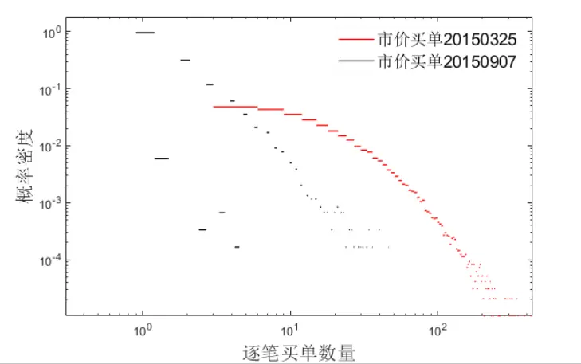
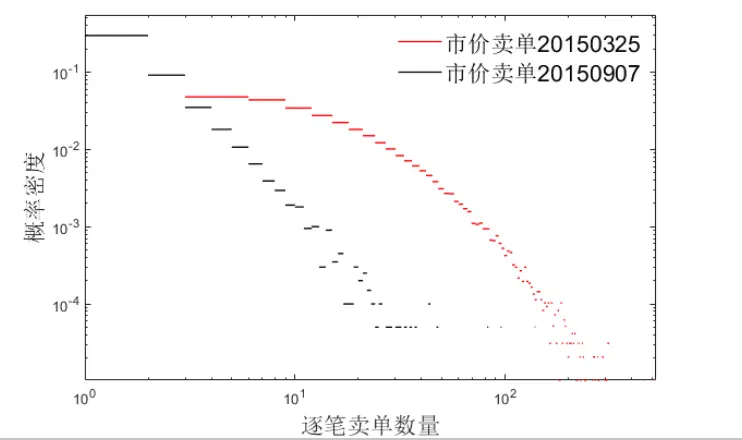
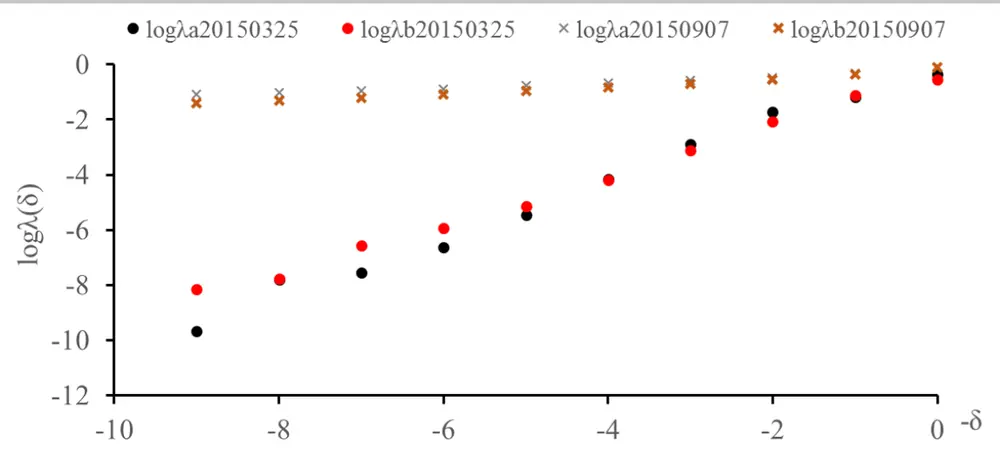
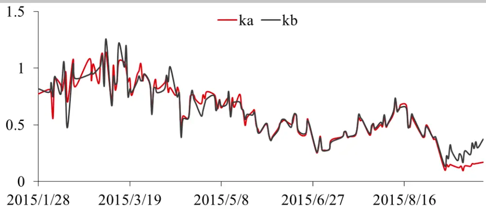
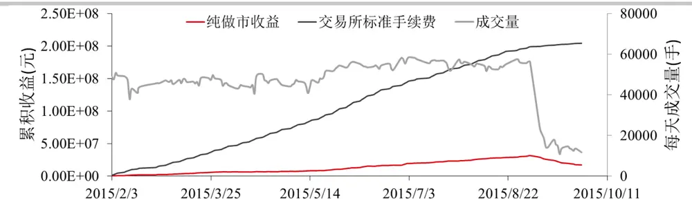
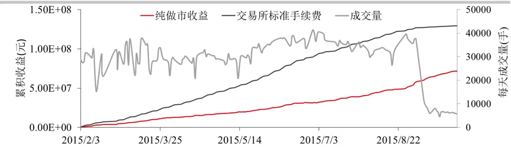

## 股指期货高频做市策略的政策性影响

做市策略通常会围绕标的物的即时价格在不同价位挂出限价单，通过标的物价格的来回波动触碰到低价的买单和高价的卖单，实现低买高卖，从而获利。在 2015 年 9 月股指期货受限前，股指期货交易非常活跃，最优买价和卖价之间的价差被拉大，甚至达到5个最小变动单位以上，这为高频做市策略提供了极好的机会。这篇报告使用 Level1 高频数据分析了股指期货受限前后，市价单对限价指令簿的冲击情况。这里假设市价单对限价指令簿的冲击符合指数分布的规律，分析结果表明无论股指期货受限前后，指数分布都能较好地反映市场冲击情况。但是受限后各层限价单更容易被击穿，也就是说限价指令簿上限价单的数量被大大减少了，这也是股指期货流动性降低的直接原因。

基于市价单冲击的指数分布规律，这篇报告使用了业界经典的 Avellaneda-Stoikov 模型进行做市策略的模拟回测。这个模型首先根据做市商的累积净头寸和风险偏好计算出一个无差别价格，然后根据市价单的冲击情况得出买和卖双方的最优报价，因此这个模型能够有效地控制做市策略运行中可能出现的库存风险。在这个模型下，随着股指期货的限制，做市策略的成交次数也显著下降。

## 华泰期货研究所 量化组

陈维嘉

量化研究员

- 0755-23991517

- chenweijia@htfc.com

从业资格号：T236848

投资咨询号：TZ012046

## 相关研究

基于模糊逻辑神经网络的高频做市策略 2018-10-30

基于连续挂单的高频做市策略 2018-12-04

## 研究背景

做市策略总是包含着双向报价的目的，通过成交价格在买卖价差之间非常窄幅的波动中获利，这里的窄幅波动通常就只有 1 至 2 个买卖变动价位，而非从标的资产大方向性变化中获利。这意味着做市策略必须避免积累了大量的做多或者做空方向的净头寸。因为净头寸的积累将带来价格反向波动时的损失。这也意味着做市策略的盈利是来自于小幅度但是高频率的价格波动。

根据 Tanmoy Chakraborty 和 Michael Kearns 的论文 Market Making and Mean Reversion, 2011 可以对做市策略的盈利作出合理的解释。这里首先假设所有的市场事件出现在离散的时间点位 0，1，2…直到时刻 $T_{\circ}$ 时刻T是做市策略结束的时间点，可以理解为做市策略从每天开盘开始，到收盘结束。在收盘时刻T，做市策略必须平掉所有的单方向净头寸。标的资产在所有 $\begin{array}{r}{0\leq t\leq T}\end{array}$ 的时刻，都存在一个即时价格 $P_{t}$ ，这个 $\cdot P_{t}$ 用变动单位表示，是标的资产最小变动单位的整数倍。做市策略的理论收益为

$$
\frac{1}{2}(K-z^{2})\tag{1}
$$

其中

$$
K=\sum_{t=1}^{T}\lvert P_{t+1}-P_{t}\rvert\tag{2}
$$

代表价格波动的绝对幅度。

$$
z=P_{T}-P_{0}\tag{3}
$$

代表收盘后平掉净头寸所产生的盈亏。

因此做市策略的盈利点可以归结为尽量多地捕捉价格的窄幅波动，为实现这一目的则必须紧跟着中间价的变化频繁地进行挂撤单。由此可见 2015年 9月推出的股指期货限仓措施后必然会对做市策略的收益产生较大影响。下面我们以沪深 300 股指期货主力合约为例，研究股指期货限仓前后市价单的数量分布和对限价指令簿的冲击深度等影响。考虑到做市策略的风险主要来源于公式(3)中的z项，即单边净头寸积累造成的库存风险。因此这里以市价单的冲击概率模型为基础，利用业界经典的 Avellaneda-Stoikov 模型建立做市策略，优化买卖报价，进行库存风险的管理。这里做市策略的构建主要参考 Marco Avellaneda 和 SashaStoikov 的论文 High-frequency trading in a limit order book。

## 市价单冲击概率模型

虽然公式(1)已经充分阐明了做市策略的盈利来源，但无法有效管理做市过程中累积的库存风险，主要是因为根据公式(1)做市商总是围绕中间价进行报价。而以Avellaneda-

Stoikov(AS)模型的原理是通过优化买卖报价实现库存管理。例如当做市商积累了一定量的做多头寸时，则可以把买价和卖价同时压低，也就是以更便宜的价格买入新合约，降低多头的平均持仓价格或是以更便宜的价格卖出旧合约，减少库存。这样做市商报出的价格往往就不再围绕中间价，即买一价和卖一价的均值进行了。做市商报出的价格也很可能落入到限价指令簿的二档或者更深的区间，所以做市商在报价前必须考虑自己报价能够成交的概率。这也就是为何要构建市价单冲击概率模型的原因。

这里选取沪深 300股指期货2015年 2月至 2015年 9月的高频数据进行分析，并比较股指期货限仓前后市价单冲击概率的差异。这里使用的高频数据来源于天软的 500毫秒 Level1截面数据，里面包含了500毫秒截面上的买一价、卖一价、买一量、卖一量、500毫秒内的成交量和成交金额等数据。虽然 Level1数据只有买一价和卖一价，但是合约成交在买一，买二，买三，……或卖一，卖二，卖三，……价位上的数量必然是整数，因此可以利用混合整数线性规划的方法求解出成交在这些价位上的合约数量，从而统计出市价单冲击超过某个价位的概率。这里 500毫秒内市价买单的数量定义为成交在大于或等于该500毫秒中间价的合约数量，总成交数量减去这部分剩下的就是市价卖单的数量了。

图1和图 2做出了股指期货限仓前 2015年 3月25日和限仓后2015年 9月07日市价买单和市价卖单的概率分布，横和纵两个坐标轴都使用了的对数形式。很明显在限仓后500毫秒内成交的市价单数量大幅减少了。

图1： 市价买单数量的概率分布

数据来源：天软 华泰期货研究院

图2： 市价卖单数量的概率分布

数据来源：天软 华泰期货研究院

但是值得注意的是，无论限仓前后，市价单数量的概率分布都是服从幂率规则(power lawdistribution)，即市价单数量x的概率分布 ${}^{\cdot}f^{Q}(x)$ 可表示为

$$
f^{Q}(x)\propto x^{-1-\alpha}\tag{4}
$$

虽然这里的α值对后面建模影响不大，但可以说下全世界市场都在1.5左右，美国股票市场是1.53，纳斯达克市场是1.4，巴黎股票市场和沪深300期货主力合约是1.5，详细来源可以参考 Marco Avellaneda 和 Sasha Stoikov 的论文。

在一定时间内，市价单能够成交在限价指令簿的最深的价位 $[p^{Q}]$ 通常是跟这段时间内市价单的数量有关,如果把市价单的冲击Δp定义为最深的价位 $[p^{Q}]$ 与中间价s之差，即 $\Delta p=p^{Q}-s$ 那么Δp与市价单数量Q的关系可表示为

$$
\Delta p\propto Q^{\beta}\tag{5}
$$

或者

$$
\Delta p\propto\ln(Q)\tag{6}
$$

关于市价单的冲击学术界并没有一致的看法，这里参考 Marco Avellaneda 和 Sasha Stoikov的论文使用公式(6)的关系。

这里定义市价单击穿限价指令簿深度δ的概率为λ(δ)，则结合公式(6)和公式(4)

$$
\begin{align*}\lambda(\delta)=\Lambda\mathsf{P}(\Delta p&>\delta)=\Lambda\mathsf{P}(\ln(Q)>K\delta)=\Lambda\mathsf{P}(Q>\exp(K\delta))=\Lambda\int_{\exp(K\delta)}^{\infty}x^{-1-\alpha}dx\\&=\mathsf{A}\exp(-k\delta)\end{align*}\tag{7}
$$

从公式(7)中可以看出α和K到最后并不重要，而最终结果里的A和k则可以利用每天的高频数据校正。公式(7)两边取对数可得

$$
\ln\lambda(\delta)=\ln A-k\delta\tag{8}
$$

利用每天的高频数据统计市价单击穿δ的概率，然后取对数即可得到lnλ(δ)，这里δ使用最小变动单位表示，例如λ(0)表示击穿上 500 毫秒中间价s的概率，λ(1)表示击穿s+δ的概率。这里选取了股指期货限仓前 2015 年 3 月 25 日的数据和限仓后 2015 年 9 月 7 日的数据进行模型校正，其中的字母a表示市价买单击穿卖单(ask)的概率，字母b 表示市价卖单击穿买单(bid)的概率。从图中可以看出市价单击穿限价指令簿的深度δ的概率随着深度δ增加而降低。在同样的深度δ下，限仓后市价单击穿的概率明显要比限仓前击穿的概率高，市价买单和市价卖单的分布规律也是比较一致的。无论限仓前后公式(8)的线性关系都非常明显。

图3： 股指期货限仓前后市价单击穿概率分布

数据来源：华泰期货研究院

利用每天的高频数据可以及时更新市价单冲击模型图4作出了每天公式(8)的拟合度，由图可见拟合效果的走势一直都在0.92以上，因此无论限仓前后公式(7)用来刻画股指期货市价单的冲击概率都是非常合适的,虽然这里把市价买单和市价卖单的分别进行拟合，但他们的拟合效果基本一致。

由于 Avellaneda-Stoikov 模型只使用到k这个参数，因此这里考察k的走势，由图可见市价买单和市价卖单的走势也基本一致，它们在限仓后达到历史低位。从公式(8)可以看出，k值其实是市场流动性的反映，k值越小市场流动性越差，限价指令簿越容易被击穿。另外，市价买单和市价卖单的k值差别其实也很小。

图4： 股指期货限仓前后市价单击穿概率分布

数据来源：华泰期货研究院

## Avellaneda-Stoikov 模型求解

建立起市价单冲击概率模型后便可以在这基础上求解出最优的限价单报价。这里把最优卖单和买单与中间价的距离设为 $\delta^{a}和\delta^{b}$ ，做市结束时间为T，做市商的目标是通过动态调整 $\cdot\delta^{a}$ 和 $\imath\delta^{b}$ ，使得价值函数u最大

$$
u(s,x,q,t)=\max_{\delta^a,\delta^b}E_t\left[-\exp\left(-\gamma(X_T+q_TS_T)\right)\right]\tag{9}
$$

其中 $X_{T}$ 为结束时做市收益， $q_{T}$ 为库存， $S_{T}$ 为标的物中间价，γ为风险偏好。

价值函数u的求解可以通过求解 Hamilton-Jacobi-Bellman 偏微分方程获得

$$
\begin{align*}u_t+\frac{1}{2}\sigma^2u_{ss}+\max_{\delta^b}\lambda^b(\delta^b)[u(s,x-s+\delta^b,q+1,t)-u(s,x,q,t)]\\+\max_{\delta^a}\lambda^a(\delta^a)[u(s,x+s+\delta^a,q-1,t)-u(s,x,q,t)]=0.\end{align*}\tag{10}
$$

并满足初始条件 $u(s,x,q,T)=-\exp\bigl(-\gamma(x+qs)\bigr)$

这是一个高维度非线性偏微分方程，自变量包括连续变量s,x,t和离散的库存变量q。MarcoAvellaneda 和 Sasha Stoikov通过渐近扩展得到了这个方程的近似解可以表示为两部分，第一部分是在特定库存和风险偏好下的无差别价格r。

$$
r(s,t)=s-q\gamma\sigma^{2}(T-t)\tag{11}
$$

如果库存为正，则无差别价格r小于中间价，库存为负，则无差别价格r大于中间价。

第二部分则是做市商的最优买卖价差

$$
\delta^{a}+\delta^{b}=\frac{2}{\gamma}\ln\left(1+\frac{\gamma}{k}\right)\tag{12}
$$

做市商围绕无差别价格r进行报价，即所报买单价为 $r-\frac{\delta^{a}{}_{+}\delta^{b}}{2}$ ，所报卖单价为 $\begin{array}{r}{r+\frac{\delta^{a}+\delta^{b}}{2}\circ}\end{array}$所以可能存在的情况是所报买单价高于市场的买一价或所报卖单价低于市场的卖一价，这些时候做市商所报的限价单就接近于市价单了。

## 做市策略回测

做市策略是一个根据中间价格s变化而做出挂撤单的动态决策过程。在时刻t，做市策略根据公式(11)和(12)进行买单和卖单的报价，然后在下个 500 毫秒收到的行情数据中，如果有合约成交在小于所挂买单的价格或高于所挂卖单的价格则判断为成交，然后再根据公式(11)和(12)进行挂撤单操作。这里使用的是击穿成交的判定标准，而实际的成交情况会比模拟的情况好，因为还可能存在成交价格等于所挂限价单价格的情况。另外公式(11)和(12)并没有对库存的规模进行限制，如果库存规模过大则占用大量保证金，所以这里加入了强制平仓的条件，即当库存超多 15手时就用市价单按照对价进行强制平仓。在这些条件下对比了围绕中间价加减一个最小变动单位进行报价和使用AS模型围绕无差别价格进行报价的情况。交易手续费按照限仓前交易所标准 0.23%%计算。由于这类做市策略能制造大量成交，一般可以获得较大比例返佣，实际收益与返佣有关。

图5作出了做市商围绕中间价报单的情况，使用这种方法虽然在账面上也能产生盈利，但是远低于产生的交易费用，同时在限仓前每天产生的交易量用在 5万手左右，但在限仓后交易量大大减少了，盈利也会转为亏损。

图 5： 围绕中间价报价

数据来源：华泰期货研究院

图6是使用AS模型进行报价的情况，这种方法产生的交易量在每天 3万到 4万手左右，比不使用AS模型的方法略低，但是盈利却有所增加。在限仓后虽然交易量也有所下降，但是账面盈利是有所增长的，而且收益更多，但这是不可能实现的因为每天5000手的交易量已经超过了交易所的限制标准。值得注意的是，即使限仓后AS模型仍然能够较好地刻画市场形态。

图6： AS 模型围绕无差别价格报价

数据来源：华泰期货研究院

表格1统计的是2015年 2月3日至 2015年 8月 31日的策略表现，虽然AS模型产生的交易量较少但是日均收益可以达到 39.7万元远高于中间价报单的方法，交易费用也更少。为了准确衡量策略表现需要考虑交易所返佣的比例，需要交易所返佣越少则策略盈利空间越大，使用AS模型后返佣临界点从 84.51%下降到 57.22%，效果有了明显提升。

表格 1 策略收益对比

| 策略 | 日均收益(元) | 日均交易费(元) | 日均交易量(手) | 返佣临界点 |
| --- | --- | --- | --- | --- |
| 中间价报单 | 225,536 | 1,456,140 | 50,278 | 84.51% |
| AS 模型 | 397,348 | 928,719 | 31,993 | 57.22% |

数据来源：华泰期货研究院

## 结果讨论

这篇报告首先介绍了做市策略的原理，接着分析了利用指数分布刻画沪深 300 股指期货市价单击穿限价指令簿的概率，发现无论是限仓前后都能刻画市场的形态，在限仓后市价单更容易击穿限价指令簿。在此基础上我们建立了AS模型模拟做市交易，这个模型通过调整买卖报价实现了库存风险的控制。回测结果表明无论限仓前后，AS模型能够有效地管理库存风险，同时为做市交易提供更高的收益。在股指期货限仓前，利用AS模型做市日均交易量能达到 3 万手，日均账面收益接近 40万元，需要交易所手续费返还的临界点在 57.22%。

## 免责声明

此报告并非针对或意图送发给或为任何就送发、发布、可得到或使用此报告而使华泰期货有限公司违反当地的法律或法规或可致使华泰期货有限公司受制于的法律或法规的任何地区、国家或其它管辖区域的公民或居民。除非另有显示，否则所有此报告中的材料的版权均属华泰期货有限公司。未经华泰期货有限公司事先书面授权下，不得更改或以任何方式发送、复印此报告的材料、内容或其复印本予任何其它人。所有于此报告中使用的商标、服务标记及标记均为华泰期货有限公司的商标、服务标记及标记。

此报告所载的资料、工具及材料只提供给阁下作查照之用。此报告的内容并不构成对任何人的投资建议，而华泰期货有限公司不会因接收人收到此报告而视他们为其客户。

此报告所载资料的来源及观点的出处皆被华泰期货有限公司认为可靠，但华泰期货有限公司不能担保其准确性或完整性，而华泰期货有限公司不对因使用此报告的材料而引致的损失而负任何责任。并不能依靠此报告以取代行使独立判断。华泰期货有限公司可发出其它与本报告所载资料不一致及有不同结论的报告。本报告及该等报告反映编写分析员的不同设想、见解及分析方法。为免生疑，本报告所载的观点并不代表华泰期货有限公司，或任何其附属或联营公司的立场。

此报告中所指的投资及服务可能不适合阁下，我们建议阁下如有任何疑问应咨询独立投资顾问。此报告并不构成投资、法律、会计或税务建议或担保任何投资或策略适合或切合阁下个别情况。此报告并不构成给予阁下私人咨询建议。

华泰期货有限公司2019 版权所有并保留一切权利。

## 公司总部

地址：广东省广州市越秀区东风东路761号丽丰大厦20层、29层04单元

电话：400-6280-888

网址：www.htfc.com