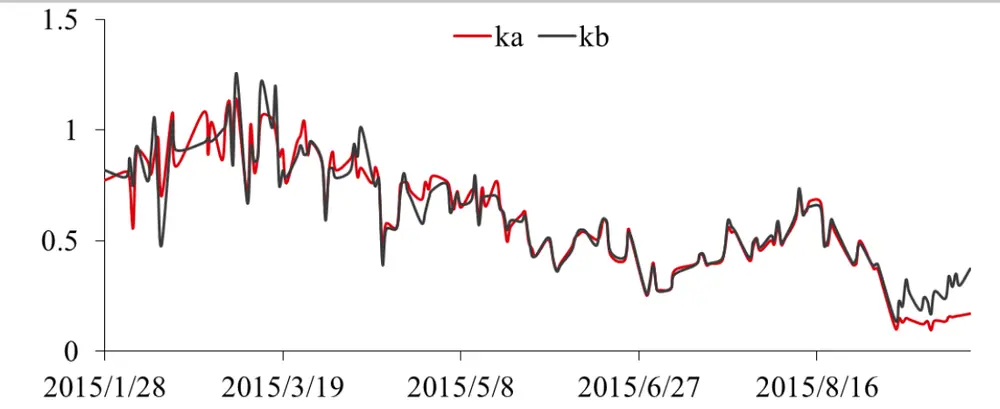
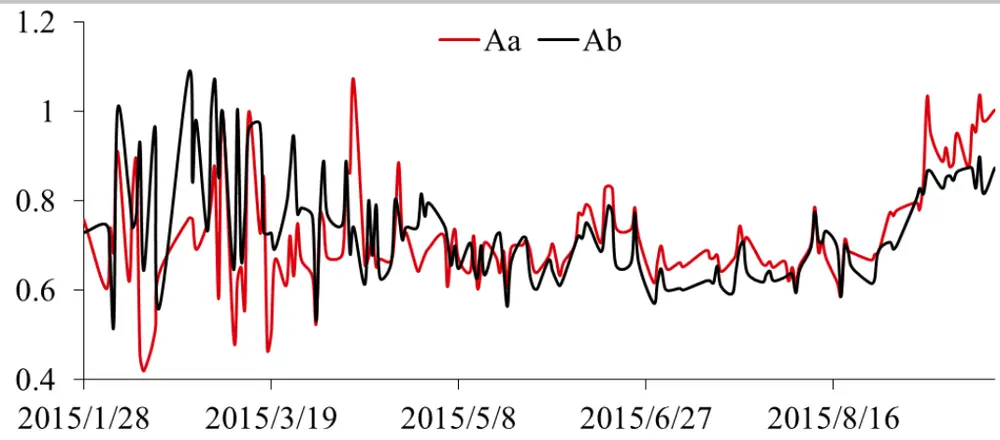
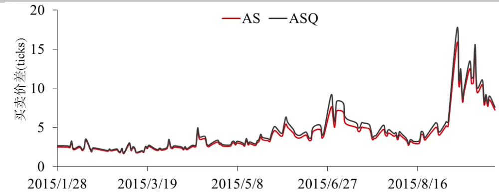
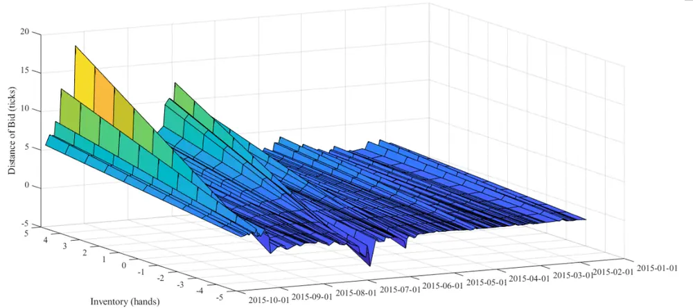
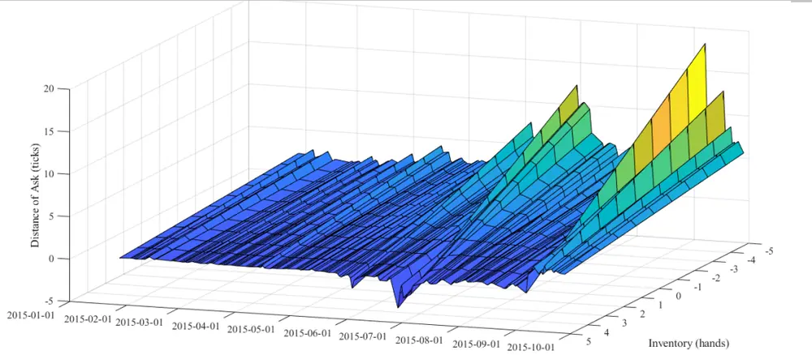
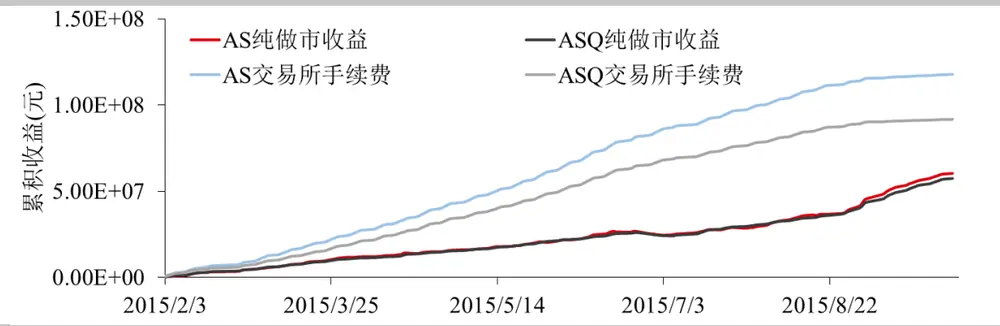
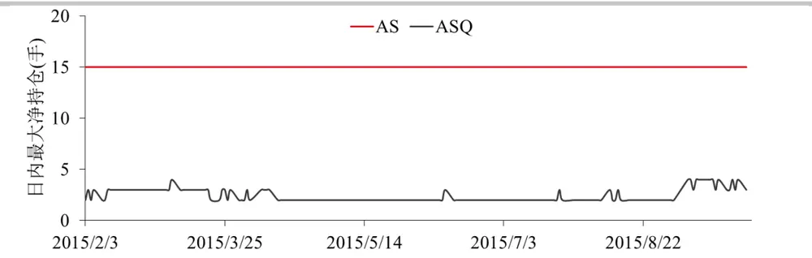
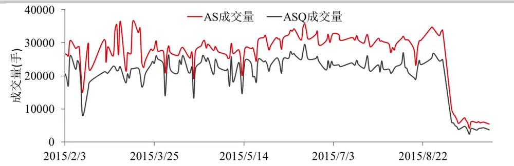

## 股指期货高频做市策略的库存风险管理

高频做市策略是围绕标的物的即时价格在不同价位挂出限价单，通过标的物价格的来回波动触碰到低价的买单和高价的卖单，实现低买高卖，从而获利。简单的在买一和卖一挂限价单做法如果碰到市场出现单边趋势性行情时将会出现严重亏损，因为市场越涨，所挂卖单就会大量成交，累积做空头寸，市场越跌所挂买单就会大量成交，累积做多头寸，如何合理管理单边头寸，即库存风险，是做市商面临的较大难题。

业界经典的 Avellaneda-Stoikov 做市模型根据自身的净头寸计算出无差别价格，然后根据市场的成交概率，围绕这个无差别价格给出最优的买卖报价。这个模型虽然能够较好地模拟市价单的成交情况，可是却不能对做市商的库存风险进行有效管理。这篇报告使用Olivier Gueant，Charles-Albert Lehalle 和 Joaquin Fernandez-Tapia 等人在 Dealing with theInventory Risk A solution to the market making problem 中提出的库存约束模型进行股指期货做市模拟交易。这个模型首先对库存最值进行限制，在库存达到最值时，即停止同方向报价，而只做反方向报价，从而限制库存的进一步增加。在此基础上该模型对离散化的库存情况进行建模，通过优化买卖报价实现库存风险的管理。模拟回测发现，与 Avellaneda-Stoikov 模型相比，这个模型在日内交易中的最大持仓能有效减少，而做市盈利却与Avellaneda-Stoikov 模型相当。

华泰期货研究所 量化组

陈维嘉

量化研究员

- 0755-23991517

- chenweijia@htfc.com

从业资格号：T236848

投资咨询号：TZ012046

## 相关研究

股指期货高频做市策略的政策性影 响 2019-04-25

## 研究背景

做市策略总是包含着双向报价的目的，通过成交价格在买卖价差之间非常窄幅的波动中获利，这里的窄幅波动通常就只有1至 2个买卖变动价位，而非从标的资产大方向性变化中获利。这意味着做市策略必须避免积累了大量的做多或者做空方向的净头寸。因为净头寸的积累将带来价格反向波动时的损失。这也意味着做市策略的盈利是来自于小幅度但是高频率的价格波动，为实现这一目的则必须紧跟着中间价的变化频繁地进行挂撤单。虽然做市商希望能在买卖双向报价，但并非两边报价总能匹配成交，如果市场行情出现大幅单边波动时，做市策略很可能只成交与市场趋势相反的报价，从而导致单边净头寸积累造成库存风险。

利用业界经典的Avellaneda-Stoikov (AS)模型进行做市能够通过优化买卖报价实现库存管理。例如当做市商积累了一定量的做多头寸时，则可以把买价和卖价同时压低，也就是以更便宜的价格买入新合约，降低多头的平均持仓价格或是以更便宜的价格卖出旧合约，减少库存。这样做市商报出的价格往往就不再围绕中间价，即买一价和卖一价的均值进行了。做市商报出的价格也很可能落入到限价指令簿的二档或者更深的区间，所以做市商在报价前必须考虑自己报价能够成交的概率。这也就是为何要构建市价单冲击概率模型的原因。这里定义市价单击穿限价指令簿深度δ的概率为λ(δ)。其中的δ可以理解为市价买单或者卖单所越过的最深价格与中间价的距离。这里假设λ(δ)与δ存在指数关系

$$
\lambda(\delta)=\mathrm{A}\exp(-k\delta)\tag{1}
$$

在这基础上求解出最优的限价单报价。这里把最优卖单和买单 $5$ 中间价的距离设为 $\delta^{a}\mathcal{\bar{F}}^{\mathbf{\alpha}}\delta^{b}$ 做市结束时间为T，做市商的目标是通过动态调整δa和δb，使得效用函数u最大

$$
u(s,x,q,t)=\operatorname*{max}_{\delta^{a},\delta^{b}}E_{t}\left[-\exp\left(-\gamma\big(X_{T}+q_{T}S_{T}\big)\right)\right]\tag{2}
$$

其中 $X_{T}$ 为结束时做市收益， $q_{T}$ 为库存， $S_{T}$ 为标的物中间价，γ为风险偏好。

价值函数u的求解可以通过求解 Hamilton-Jacobi-Bellman (HJB)偏微分方程获得

$$
\begin{array}{rlr}{{u_{t}+\frac{1}{2}\sigma^{2}u_{ss}+\operatorname*{max}_{\delta^{b}}\lambda^{b}(\delta^{b})[u(s,x-s+\delta^{b},q+1,t)-u(s,x,q,t)]}}\\&{}&{\quad+\operatorname*{max}_{\delta^{a}}\lambda^{a}(\delta^{a})[u(s,x+s+\delta^{a},q-1,t)-u(s,x,q,t)]=0}\end{array}\tag{3}
$$

并满足初始条件 $u(s,x,q,T)=-\mathrm{exp}\bigl(-\gamma(x+qs)\bigr)$

这是一个高维度非线性偏微分方程，自变量包括连续变量s, x,t和离散的库存变量q。MarcoAvellaneda 和 Sasha Stoikov通过渐近扩展得到了这个方程的近似解可以表示为两部分，第一部分是在特定库存和风险偏好下的无差别价格r。

$$
r(s,t)=s-q\gamma\sigma^{2}(T-t)\tag{4}
$$

如果库存为正，则无差别价格r小于中间价，库存为负，则无差别价格r大于中间价。

第二部分则是做市商的最优买卖价差

$$
\delta^{a}+\delta^{b}=\frac{2}{\gamma}\ln\left(1+\frac{\gamma}{k}\right)+\frac{1}{2}\gamma\sigma^{2}(T-t)^{2}\tag{5}
$$

做市商围绕无差别价格r进行报价，即所报买单价为 $r-\frac{\delta^{a}+\delta^{b}}{2}$ ，所报卖单价为 $r+\frac{\delta^{a}+\delta^{b}}{2}$ o所以可能存在的情况是所报买单价高于市场的买一价或所报卖单价低于市场的卖一价，这些时候做市商所报的限价单就接近于市价单了。

由于AS模型只围绕无差别价格r进行报价，累积库存q只体现在无差别价格r上，而且AS模型并没有对q的大小进行限制，因此AS模型在管理库存风险上并不一定是最优的，当库存超过做市商所能承担的风险时，往往需要使用市价单进行主动平仓的操作，这在实际交易中可能产生较大的市场冲击，增加不必要的风险。因此有必要把做市商所能承担的最大库存Q考虑到做市模型中去。这篇报告使用 Olivier Gueant，Charles-Albert Lehalle 和 JoaquinFernandez-Tapia 等人在 Dealing with the Inventory Risk A solution to the market making problem中提出的库存约束模型对库存进行管理。这个模型是以AS模型为基础加入库存管理，因此这里简称为ASQ 模型。

## 基于库存约束的 ASQ 模型

ASQ 模型同样使用公式(1)的市价单冲击概率模型和公式(2)中的效用 $\vec{\bf z}$ 数。买卖中间价s服从算术布朗运动

$$
ds_{t}=\sigma dW_{t}\tag{6}
$$

库存q，即做市商的净持仓，由买单持仓 $N^{b}$ 和卖单持仓 $N^{a}$ 构成

$$
q_{t}=N_{t}^{b}-N_{t}^{a}\tag{7}
$$

与AS模型不同，ASQ 模型里做市商围绕中间价s进行买单报价 $\cdot\delta^{b}$ 和卖单报价δa，做市商的现金流X可以表示为

$$
dX_{t}=(s_{t}+\delta_{t}^{a})dN_{t}^{a}-(s_{t}+\delta_{t}^{b})dN_{t}^{b}\tag{8}
$$

在 ASQ 模型里会对做市商的最大库存Q进行限制，即库存q $\in\{-0,-0+1,\ldots,0,\ldots,0-$ 1, Q}。

当|q| < Q时，做市商进行买卖双向报价，最优报价 $\cdot\delta^{b}$ 和 ${}_{r\delta}a$ 满足 HJB 方程

$$
\begin{array}{rlr}{{u_{t}+\frac{1}{2}\sigma^{2}u_{ss}+\operatorname*{max}_{\delta^{b}}\lambda^{b}(\delta^{b})[u(s,x-s+\delta^{b},q+1,t)-u(s,x,q,t)]}}\\&{}&{\quad+\operatorname*{max}_{\delta^{a}}\lambda^{a}(\delta^{a})[u(s,x+s+\delta^{a},q-1,t)-u(s,x,q,t)]=0}\end{array}\tag{9}
$$

$q=0$ 时，做市商不再进行买入报价，只进行卖出报价，这时最优卖出报价δa满足 HJB方程

$$
u_{t}+\frac{1}{2}\sigma^{2}u_{ss}+\operatorname*{max}_{\delta^{\alpha}}\lambda^{a}(\delta^{a})[u(s,x+s+\delta^{a},q-1,t)-u(s,x,q,t)]=0\tag{10}
$$

当 $q=-0$ 时，做市商不再进行卖出报价，只进行买入报价，这时最优买入报价 $\cdot\delta^{b}$ 满足HJB 方程

$$
u_{t}+\frac{1}{2}\sigma^{2}u_{ss}+\operatorname*{max}_{\delta^{b}}\lambda^{b}(\delta^{b})[u(s,x-s+\delta^{b},q+1,t)-u(s,x,q,t)]=0\tag{11}
$$

做市商报价在T时刻终止，所以方程(9)-(11)满足终止条件

$$
\forall\mathsf{q}\in\{-\mathsf{Q},\ldots,\mathsf{Q}\},u(T,x,q,s)=-\mathsf{exp}\big(-\gamma(x+qs)\big)\tag{12}
$$

方程(9)-(12)包含2Q + 1个偏微分方程，必须联立求解。

通过分离变量的方法可以把上述的偏微分方程组简化后求解。这里把公式 $\cdot(2)$ 中的效用函数$u(t,x,q,s)$ 分解为

$$
\boldsymbol{u}(t,x,q,s)=-\mathrm{exp}\big(-\gamma(x+qs)\big)\nu_{q}(t)^{-\frac{\gamma}{\kappa}}\tag{13}
$$

那么方程组(9)-(11)可以转化为

$$
\begin{array}{c}{{\forall{\bf q}\in\{-\bf Q+1,\dots,Q-1\},\dot{\nu}_{q}(t)=\alpha q^{2}\nu_{q}(t)-\eta\left(\nu_{q-1}(t)+\nu_{q+1}(t)\right)}}\\{{\dot{\nu}_{Q}(t)=\alpha Q^{2}\nu_{Q}(t)-\eta\nu_{Q-1}(t)}}\\{{\dot{\nu}_{-Q}(t)=\alpha Q^{2}\nu_{-Q}(t)-\eta\nu_{-Q+1}(t)}}\end{array}\tag{14}
$$

其中 $\begin{array}{r}{\alpha=\frac{\kappa}{2}\gamma\sigma^{2},\ \eta=\mathrm{A}\left(1+\frac{\gamma}{\kappa}\right)^{-\left(1+\frac{\gamma}{\kappa}\right)},\nu_{q}(T)=1}\end{array}$

方程(14)是常见的线性齐次常微分方程组，可以通过分析方程组系数矩阵的特征值进行求解。最优报价δb∗和δa∗可以表示为

$$
\begin{array}{c}{{s-s^{b*}(t,q,s)=\delta^{b*}(t,q)=\displaystyle\frac{1}{\kappa}\ln\left(\displaystyle\frac{\nu_{q}(t)}{\nu_{q+1}(t)}\right)+\displaystyle\frac{1}{\gamma}\ln\left(1+\displaystyle\frac{\gamma}{\kappa}\right),q\neq Q}}\\{{s^{a*}(t,q,s)-s=\delta^{a*}(t,q)=\displaystyle\frac{1}{\kappa}\ln\left(\displaystyle\frac{\nu_{q}(t)}{\nu_{q-1}(t)}\right)+\displaystyle\frac{1}{\gamma}\ln\left(1+\displaystyle\frac{\gamma}{\kappa}\right),q\neq-Q}}\end{array}\tag{15}
$$

Olivier Gueant，Charles-Albert Lehalle 和 Joaquin Fernandez-Tapia 等人研究公式(15)发现：

(1) 做市时间t在临近结束时间T前对最优报价的影响较小。

(2) 当q较小时(q < 15)，最大库存 $\mathrm{Q}$ 的约束对最优报价的影响也很小。

因此公式(15)可以进一步简化为

$$
\delta^{b*}(q)=\frac{1}{\gamma}\mathrm{ln}\left(1+\frac{\gamma}{\kappa}\right)+\frac{2q+1}{2}\sqrt{\frac{\sigma^{2}\gamma}{2\kappa A}\left(1+\frac{\gamma}{\kappa}\right)^{\left(1+\frac{\gamma}{\kappa}\right)^{}}}\tag{16}
$$

$$
\delta^{a*}(q)=\frac{1}{\gamma}\mathrm{ln}\left(1+\frac{\gamma}{\kappa}\right)-\frac{2q-1}{2}\sqrt{\frac{\sigma^{2}\gamma}{2\kappa A}\left(1+\frac{\gamma}{\kappa}\right)^{\left(1+\frac{\gamma}{\kappa}\right)^{}}}
$$

从最后的公式(16)可见，最优报价δb∗和δa∗只涉及到少量参数，包括市场特征部分的波动率σ, 限价指令簿厚度系数κ和限价指令簿击穿概率系数 A，这部分可以从 Leve1 高频数据中计算得到。而效用函数里的γ则是做市商的风险偏好，通常γ=0.01。值得注意的是，虽然模型是建立在最大库存Q的约束基础上的，但是最终结果却与Q没有关系，其中的原因是在这个模型的假设条件下，做市商能够通过拉开买卖价差，把库存控制在远远小于Q值的范围内。这点可以从以下的实证分析中得到证实。

## ASQ 模型报价规律

由于 ASQ 模型使用到多个市场参数，先对他们稍作分析。这里选取沪深 300 股指期货主力合约 2015 年 2 月至 2015 年 9 月的高频数据进行分析。使用的高频数据来源于天软的 500 毫秒Level1截面数据，里面包含了500毫秒截面上的买一价、卖一价、买一量、卖一量、500毫秒内的成交量和成交金额等数据。波动率σ可以直接从利用高频数据的中间价计算。限价指令簿厚度系数κ和限价指令簿击穿概率系数A则需要通过统计市价单击穿某个价位的概率，然后拟合公式(1)进行计算。

图1是股指期货各天的市价买单值κa和市价卖单值κb值的走势分析。κ值其实是市场流动性的反映，κ值越小市场流动性越差，限价指令簿越薄，越容易被击穿。从2015年 3月起κ值便有下降趋势，可能是因为股指期货散户参与者在2015年 3月至6月这段时间变多，从而导致市价单量增大，限价指令簿更容易被击穿。另外，市价买单和市价卖单的κ值差别其实也很小。

图1： 限价指令簿厚度系数κ

数据来源：华泰期货研究院

图2是股指期货各天的市价买单值Aa和市价卖单值Ab值的走势分析。A值衡量限价指令簿各层被击穿的概率，A值越大，限价指令簿被击穿的概率就越大，A 值在2015年 6月到达低点，在 9月股指期货受限后A 值进一步增大，可能是因为高频交易受限后，限价单的提供者减少，从而导致限价指令簿更容易被击穿。在买卖方向上A值的差别也是非常小的。

图2： 限价指令簿击穿概率系数 A

数据来源：华泰期货研究院

接下来研究利用ASQ模型进行买卖报价的特点，图3对比了AS 模型和ASQ模型所报出的买卖价差的差异，买卖价差以最小变动单位衡量。由图可见，两个模型所报的买卖价差走势非常一致。在2015年9月股指期货受限制以后，两个模型的买卖价差都有所增大，然后开始回落。从 2015 年的数据看，AS 模型和ASQ 模型的买卖价差相差非常小，通常都是小于1 个最小变动单位。因此 ASQ 模型对库存的管理并不一定是来源于买卖价差的优化，而是来源于围绕中间价所做的买卖报价优化。

图3： AS 模型与 ASQ 模型的买卖价差

数据来源：华泰期货研究院

图 4 作出了 ASQ 模型最优买价与中间价距离δb∗在 2015年，库存q=-5,-4,…0,4,5 下的值。在高库存时， $\delta^{b*}$ 值增大，最优买价被拉低，做市商倾向于以更低价格买入，在库存为负值时，δb∗可能为负值，意味着最优买价高于中间价，做市商倾向于以更高的价格买入，以减少负向的净头寸。2015年初δb∗的值在不同库存条件下的分布都比较平滑，在2015年 9月后不同库存条件下的δb∗值差异开始变大。

图 4： ASQ 模型最优买价与中间价距离δb∗

数据来源：华泰期货研究院

图 5 作出了 ASQ 模型最优卖价与中间价距离δa∗在 2015 年，库存q=-5,-4,…0,4,5 下的值。在库存为正值时，δa∗值有可能为负，最优卖价被拉低，甚至可能低于中间价格，做市商倾向于以更低价格卖出，以减少库存。在库存为负值时，δa∗值增大，意味着最优卖价变大，做市商要以更高的价格开仓卖出。2015 年初δa∗的值在不同库存条件下的分布也比较平滑，在2015年 9月后不同库存条件下的δa∗值差异开始变大。

图5： ASQ 模型最优卖价与中间价距离δa∗

数据来源：华泰期货研究院

## 做市策略回测

做市策略是一个根据中间价格s变化而做出挂撤单的动态决策过程。在时刻t，AS模型根据公式(5)和围绕公式(4)中的无差别价格进行买单和卖单的报价，ASQ 模型根据公式(16)围绕中间价进行报价。在下个 500 毫秒收到的行情数据中，如果有合约成交在小于所挂买单的价格或高于所挂卖单的价格则判断为成交，然后再根据新的报价情况进行挂撤单操作。这里使用的是击穿成交的判定标准，而实际的成交情况会比模拟的情况好，因为还可能存在成交价格等于所挂限价单价格的情况。另外AS模型并没有对库存的规模进行限制，如果库存规模过大则占用大量保证金，所以这里加入了强制平仓的条件，即当库存超过15手时就用市价单按照对价进行强制平仓。虽然 ASQ 模型的限制最大持仓限制也是 15 手，但其累计库存远低于这个限制。在这些条件下对比了 AS 模型和 ASQ 模型的交易情况。交易手续费按照限仓前交易所标准 0.23%%计算。由于这类做市策略能制造大量成交，一般可以获得较大比例返佣，实际收益与返佣有关。

图6对比了AS模型和ASQ 模型的做市收益和手续费，在做市收益方面，两个模型都能获得持续稳定的收益，而且表现非常接近。但是交易手续费方面ASQ模型则明显较少。两者的交易费用都超过了做市收益。

图 6： AS 模型与 ASQ 模型做市策略收益

数据来源：华泰期货研究院

图7对比了两个模型盘中最大持仓的差异，AS模型在所有回测的日子里都会触碰到最大15手的净持仓，因此在实际交易中总是面临使用市价单强行平仓的情况，这种做法很可能产生较大的冲击成本，从而降低实际的做市收益。 而ASQ模型的净持仓则能较好地得到控制，由图可见ASQ模型的最大净持仓在2015年9月前都是在 2-3手，在 2015年9月后会出现 4手的情况，但是在回测期内最大持仓都是远远低于使用AS模型时 15手最大持仓的限制。

图7： AS 模型与 ASQ 模型日内最大持仓

数据来源：华泰期货研究院

图 8 对比了 AS 模型与 ASQ 模型做市的每天成交量，两者的走势基本一致，但是 AS 模型的成交量总是比 ASQ 模型大，这也是AS 模型产生更高手续费的原因。

图8： AS 模型与 ASQ 模型每天成交量

数据来源：华泰期货研究院

表格1统计的是2015年 2月3日至 2015年 8月 31日的策略表现，ASQ 模型的日均收益和交易量都略小于AS模型，但交易费用也明显下降。为准确衡量做市策略的表现，必须同时考虑日均收益和所需的交易手续费返还，所需要的交易手续费返还比例越低则策略的实际盈利空间越大。虽然 ASQ 模型的各项指标都有所下降，但是所需要的手续费返还比例也更低了。最重要的是使用 ASQ 模型能有效地进行库存管理，盘中的最大净持仓只有 4手，做市风险能够得到有效控制。

表格 1 策略收益对比

| 策略 | 日均收益 | 日均交易费 | 日均交易量(手) | 返佣临界点 最大持仓 |  |
| --- | --- | --- | --- | --- | --- |
| AS 模型 | 306,975 | 845,197 | 29,164 | 63.68% | 15 |
| ASQ 模型 | 298,277 | 657,928 | 22,619 | 54.66% | 4 |

数据来源：华泰期货研究院

## 结果讨论

这篇报告首先介绍了 AS 模型的做市原理，AS 模型首先根据做市过程中产生的累积库存和自身效用函数计算出无差别价格，然后基于市价单的击穿概率模型，利用 HJB 方程推导出最优的买卖价差，围绕无差别价格进行报价。由于AS模型的买卖价差并不包含库存因素，所以库存的影响至体现在无差别价格的计算上。AS 模型并不能有效地进行库存管理。而ASQ 模型在建立时就尝试对最大库存进行约束，在离散化的库存条件下分别建立HJB方程求解最优报价。这个模型直接围绕中间价报价，因此库存的影响能直接体现在最优报价上。而且在沪深 300 股指期货做市回测中发现，ASQ 模型在盘中产生的累积库存非常小，远远小于AS模型可能产生的累积库存，这充分体现了ASQ 模型的优越性。最后ASQ 模型产生的做市收益虽然略小于 AS 模型，但是手续费用也较少，ASQ 模型需要较小的手续费返还比例，因而觉有更广阔的盈利空间。

## 免责声明

此报告并非针对或意图送发给或为任何就送发、发布、可得到或使用此报告而使华泰期货有限公司违反当地的法律或法规或可致使华泰期货有限公司受制于的法律或法规的任何地区、国家或其它管辖区域的公民或居民。除非另有显示，否则所有此报告中的材料的版权均属华泰期货有限公司。未经华泰期货有限公司事先书面授权下，不得更改或以任何方式发送、复印此报告的材料、内容或其复印本予任何其它人。所有于此报告中使用的商标、服务标记及标记均为华泰期货有限公司的商标、服务标记及标记。

此报告所载的资料、工具及材料只提供给阁下作查照之用。此报告的内容并不构成对任何人的投资建议，而华泰期货有限公司不会因接收人收到此报告而视他们为其客户。

此报告所载资料的来源及观点的出处皆被华泰期货有限公司认为可靠，但华泰期货有限公司不能担保其准确性或完整性，而华泰期货有限公司不对因使用此报告的材料而引致的损失而负任何责任。并不能依靠此报告以取代行使独立判断。华泰期货有限公司可发出其它与本报告所载资料不一致及有不同结论的报告。本报告及该等报告反映编写分析员的不同设想、见解及分析方法。为免生疑，本报告所载的观点并不代表华泰期货有限公司，或任何其附属或联营公司的立场。

此报告中所指的投资及服务可能不适合阁下，我们建议阁下如有任何疑问应咨询独立投资顾问。此报告并不构成投资、法律、会计或税务建议或担保任何投资或策略适合或切合阁下个别情况。此报告并不构成给予阁下私人咨询建议。

华泰期货有限公司 2019 版权所有并保留一切权利。

## 公司总部

地址：广东省广州市越秀区东风东路761号丽丰大厦20层、29层04单元

电话：400-6280-888

网址：www.htfc.com